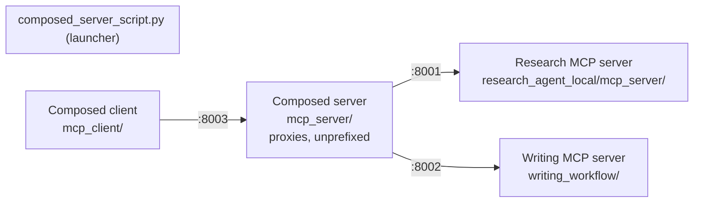

# Agents Integration (Composed MCP Deployment)

Fronts the **Nova research agent** and **Brown writing agent** as a single
HTTP MCP endpoint, so one client session can drive a full
*research → write* run without juggling two separate servers. See the
top-level [`../../README.md`](../../README.md) for the overall pipeline this
sits on top of.



## Contents

- [Layout](#layout)
- [Quickstart: the launcher](#quickstart-the-launcher)
- [Configuration](#configuration)
- [Manual / standalone run](#manual--standalone-run)
- [Where this fits](#where-this-fits)

---

## Layout

```
agents_integration_local/
├── composed_server_script.py           # Launcher: boots all 4 processes below, in order
├── mcp_servers_config_http.json        # Upstream config: composed server -> research (:8001) + writing (:8002)
├── mcp_composed_server_config_http.json # Client config: composed client -> composed server (:8003)
├── mcp_server/                         # Composition-only proxy server (no tools of its own)
│   └── src/main.py
├── mcp_client/                         # Client that talks to the composed server
└── .env.example                        # Shared env values the launcher loads
```

Two sub-projects, each its own `uv` project:
[`mcp_server/README.md`](mcp_server/README.md) (the composed proxy server)
and [`mcp_client/README.md`](mcp_client/README.md) (the client).

---

## Quickstart: the launcher

```bash
cd agents_integration_local
uv run python composed_server_script.py
```

This is the one command that runs the whole system end to end. In order, it:

1. Loads env files: `agents_integration_local/.env`,
   `mcp_client/.env`, `research_agent_local/mcp_server/.env`,
   `writing_workflow/.env` (first-wins — already-exported shell variables are
   never overridden).
2. Starts the **research** server (`research_agent_local/mcp_server`, port
   `8001`) and the **writing** server (`writing_workflow`, port `8002`) as
   subprocesses, each using *its own* project venv.
3. Waits for both ports to become reachable (`MCP_STARTUP_TIMEOUT_SECONDS`,
   default 300s), failing fast if either process exits early.
4. Starts the **composed** server (`mcp_server/`, port `8003`), pointed at
   `mcp_servers_config_http.json`.
5. Waits for port `8003`, then launches the **composed client** in the
   foreground (`mcp_client/`, using `mcp_composed_server_config_http.json`).
6. On exit (including Ctrl-C or a failure partway through), terminates every
   subprocess it started, in reverse order.

Once inside the client REPL, the composed prompt
`full_research_and_writing_workflow` runs research and writing back-to-back
on one directory — see
[`mcp_server/README.md`](mcp_server/README.md#how-composition-works) for what
it actually does.

> **Implementation detail:** the launcher reuses the **research server's**
> venv (`research_agent_local/mcp_server/.venv`) to run both the composed
> server and the composed client (it already has `fastmcp` +
> `google-genai`/`openai`/`opik`, which both need) — you still need
> `uv sync` in each project for standalone/manual runs, but the launcher
> itself doesn't require `mcp_server/.venv` or `mcp_client/.venv` to exist.

---

## Configuration

Copy `.env.example` → `.env` in this directory for shared overrides (the
launcher also reads each backend's own `.env` directly, so this file is
optional convenience, not a requirement):

```bash
GOOGLE_API_KEY=...      # Gemini — writing agent + graders
XAI_API_KEY=...         # optional — eval-only LLM planner baseline
ANTHROPIC_API_KEY=...   # optional — eval-only LLM planner baseline / Layer-3 digest fallback
TAVILY_API_KEY=...      # web search
JINA_API_KEY=...
FIRECRAWL_API_KEY=...   # page scraping
GITHUB_TOKEN=...        # optional — GitHub repo analysis
OPIK_API_KEY=...        # optional — observability
OPIK_WORKSPACE=...      # optional
OPIK_PROJECT_NAME=nova-brown-composed
```

The two JSON files are plain FastMCP/MCP server maps:

- [`mcp_servers_config_http.json`](mcp_servers_config_http.json) — what the
  **composed server** mounts (`localhost:8001` research, `localhost:8002`
  writing).
- [`mcp_composed_server_config_http.json`](mcp_composed_server_config_http.json) —
  what the **composed client** connects to (`localhost:8003`).

---

## Manual / standalone run

To run pieces individually instead of via the launcher (e.g. to point the
client at an already-running composed server, or to test the composed
server against a non-default config):

```bash
# Terminal A — research backend
cd ../research_agent_local/mcp_server && uv run mcp-server --transport streamable-http --port 8001

# Terminal B — writing backend
cd ../writing_workflow && uv run python -m brown.mcp.server --transport streamable-http --port 8002

# Terminal C — composed server
cd mcp_server && uv run python -m src.main --transport streamable-http --port 8003

# Terminal D — composed client
cd mcp_client && uv run python -m src.client --config ../mcp_composed_server_config_http.json
```

See [`mcp_server/README.md`](mcp_server/README.md) and
[`mcp_client/README.md`](mcp_client/README.md) for more flags and detail.

---

## Where this fits

- Top-level pipeline, results, and quickstart:
  [`../../README.md`](../../README.md).
- Research agent (the half proxied on `:8001`):
  [`../research_agent_local/README.md`](../research_agent_local/README.md).
- Writing agent (the half proxied on `:8002`):
  [`../writing_workflow/README.md`](../writing_workflow/README.md).
