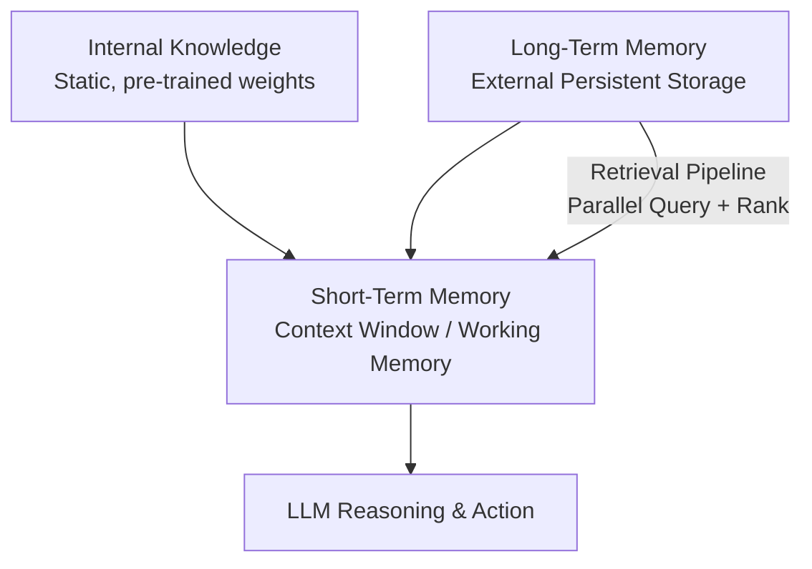
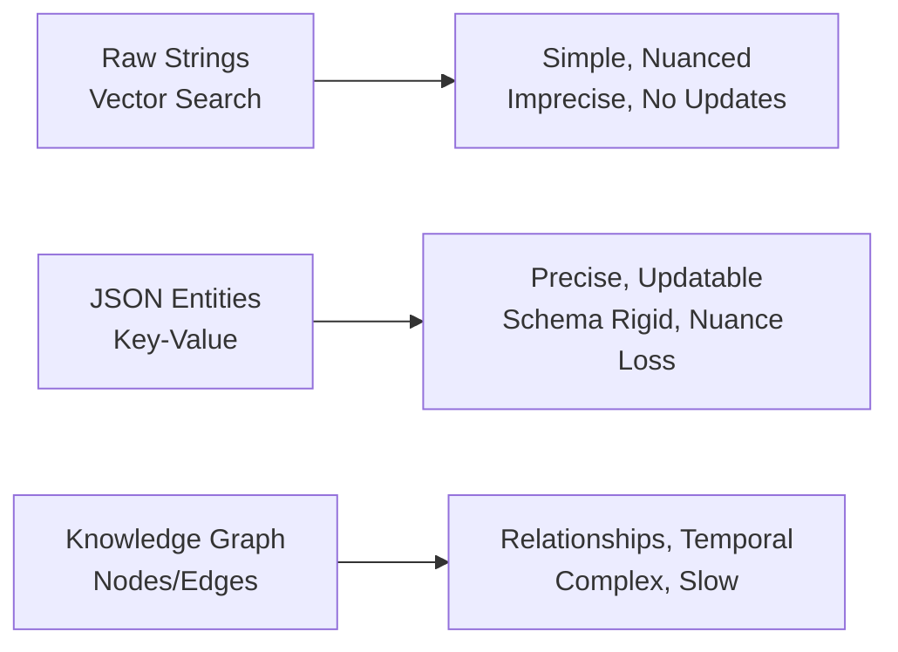

# Comprehensive Research Report

## Section 1 - Introduction: Why Agents Need a Memory in the first place

Language models are _stateless_: they do not persist information across calls. LLMs possess limited knowledge and reasoning capabilities. Language agents mitigate these issues by connecting LLMs to internal memory and environments, grounding them to existing knowledge or external observations. LLMs are "static/stateless" with their current design, they have a fundamental inability to learn (update their weights) over time. To overcome these limitations, we can insert new knowledge using the context window, but its a limited solution due to the finite size of the context window + lost in the middle problem. An LLM without memory is like an intern with amnesia, unable to recall previous conversations or learn new things over time. Basically unable to learn from experience. The context window as "working memory" or "RAM" but clearly remind readers of its limitations: keeping the entire conversation thread (+ additional information) is not realistic due to finite size, rising costs (more tokens leads to higher costs per turn), and introducing too much noise (the model might not need all that information to answer a simple question), there is also the "lost in the middle problem" (the model struggles to correctly use relevant information, when its placed in the middle of the context window). As a counterpoint, also mention that context window sizes are actually increasing over time, which shows how we need to continously adapt and change the way we need to engineer agentic stateful systems. In a future with bigger context windows, or actual learning, less compression or retrieval components will be needed as they introduce overhead and loss of nuance or details. Frame `memory tools` as the temporary solution that provides agents with continuity, adaptability, and the ability to "learn". *Sources: cognitive-architectures-for-language-agents.md (golden), memex-2-0-memory-the-missing-piece-for-real-intelligence.md (golden), 7AmhgMAJIT4.md (YouTube golden)*

## Section 2 - The Layers of Memory: Internal, Short-Term, and Long-Term

Under CoALA, a language agent stores information in memory modules, and acts in an action space structured into external and internal parts. CoALA organizes agents along three key dimensions: their information storage (divided into working and long-term memories). Working memory maintains active and readily available information as symbolic variables for the current decision cycle. This includes perceptual inputs, active knowledge (generated by reasoning or retrieved from long-term memory), and other core information carried over from the previous decision cycle (e.g., agent’s active goals). Working memory reflects the agent’s current circumstances: it stores the agent’s recent perceptual input, goals, and results from intermediate, internal reasoning. The active context window of the LLM—volatile, fast, but limited, but its also the only way we can simulate "learning" over time. Long-term memory is an external, persistent storage system where an agent can save and retrieve information. Pulling from long-term to short-term memory. Long term memory_ is divided into three distinct types. _Procedural_ memory stores the production system itself: the set of rules that can be applied to working memory to determine the agent’s behavior. _Semantic_ memory stores facts about the world, while _episodic_ memory stores sequences of the agent’s past behaviors. Long-term memory stores experience from earlier decision cycles. This can consist of training input-output pairs, history event flows, game trajectories from previous episodes, or other representations of the agent’s experiences. Semantic memory stores an agent’s knowledge about the world and itself. Language agents explicitly organize information (mainly textural, but other modalities also allowed) into multiple memory modules, each containing a different form of information. These include short-term working memory and several long-term memories: episodic, semantic, and procedural. The dynamic between these layers: Long-term memory is "retrieved" and brought into the short-term memory (the context window) to become actionable/give important information for the LLM during a task. This can be conceptualized as a "retrieval pipeline" where different types of memories are queried in parallel and ranked before being presented to the model. Internal knowledge provides general intelligence, basic performance, short-term memory handles the immediate task, and long-term memory provides the context and personalization that internal knowledge lacks and short-term memory cannot retain. No single layer can perform all three functions effectively. *Source: cognitive-architectures-for-language-agents.md (golden)*



*Sources: cognitive-architectures-for-language-agents.md (golden), memory-overview-docs-by-langchain.md (golden)*

## Section 3 - Long-Term Memory: Semantic, Episodic, and Procedural

### Semantic Memory (Facts & Knowledge): The agent's encyclopedia.
Semantic memory is the agent's repository of individual pieces of knowledge, these "facts" can be individual independent strings "The user is a vegetarian", or they can be attached to an "entity" which can be a person, a place, an object, etc {"food restrictions": "User is a vegetarian"}. The semantic memory is where the agent stores extracted concepts, relationships, etc about specific domains, people, places, and things. Semantic memory stores an agent’s knowledge about the world and itself. Traditional NLP or RL approaches that leverage retrieval for reasoning or decision-making initialize semantic memory from an external database for knowledge support. The primary role of semantic memory is to provide the agent with a reliable source of truth. For an enterprise agent, this might involve storing internal company documents, technical manuals, or an entire product catalog, allowing it to answer questions on proprietary topics. For agents as personal assistants, semantic memory can be used to build a persistent profile of each user. It can recall specific, important information like preferences {"music": "User likes rock music"}, relationships {"dog": "User has a dog named George"}, or hard constraints {"food restrictions": "User is allergic to gluten"}.

### Episodic Memory (Experiences & History): The agent's personal diary.
Episodic memory stores experience from earlier decision cycles. Episodic memory is the agent's personal diary, a record of its past interactions with the user. Think of this memory as facts but with a timestamp attached to it, an additional element of time. It is a log of specific events, and the context in which they occurred. Unlike the timeless facts in semantic memory, episodic memories are about "what happened and when." This memory type is useful for maintaining conversational context and potentially understand something complex like the dynamics of a relationship. For instance, a simple system of facts might extract "User's brother is named Mark" and "User is frustrated with his brother" and save it to the semantic memory. A system that captures the element of time might save: "On Tuesday, the user expressed frustration that their brother, Mark, always forgets their birthday, I then provided an empathetic response. [created_at=2025-08-25T17:20:04.648191-07:00]". This "episode" provides a deeper/nuanced context, allowing the agent to interact with more empathy and intelligence in the future if the topic of his brother comes up again. (e.g., "As you expressed last week, I know the topic of your brother's birthday can be sensitive..."). With the time element, the agent can now also answer question such as "What happened on June 8th?"

### Procedural Memory (Skills & How-To): The agent's muscle memory.
Procedural memory is the agent's collection of skills and learned workflows. It's the "how-to" knowledge that dictates its ability to perform multi-step tasks. Think of it as the agent's muscle memory or a set of pre-defined playbooks for common requests. Procedural memory stores the production system itself: the set of rules that can be applied to working memory to determine the agent’s behavior. Language agents contain two forms of procedural memory: _implicit_ knowledge stored in the LLM weights, and _explicit_ knowledge written in the agent’s code. This memory is often baked directly into the agent's system prompt as a "reusable tool", function, or defined sequence of actions. For example, an agent might have a stored procedure called MonthlyReportIntent. When a user asks for a monthly update, the agent doesn't need to reason from scratch about how to create a report. Instead, by retrieving from its procedural memory, the procedure can then be used, defining a clear series of steps: 1) Query the sales database for the last 30 days, 2) Summarize the key findings, and 3) Ask the user if they want the summary emailed or displayed directly. This makes the agent's behavior on common tasks highly reliable, fast, and predictable. By encoding successful (and even unsuccessful) workflows, procedural memory allows an agent to improve its task completion efficiency over time, reducing errors and ensuring that complex jobs are executed consistently every time. *Sources: cognitive-architectures-for-language-agents.md (golden), giving-your-ai-a-mind-exploring-memory-frameworks-for-agenti.md (golden), memory-in-agent-systems-by-aurimas-grici-nas.md (golden), memory-overview-docs-by-langchain.md (golden)*

## Section 4 - Storing Memories: Pros and Cons of Different Approaches

### 1. Storing memories as raw strings
This is the simplest method, where conversational turns or documents are stored as plain text and typically indexed for vector search. Pros: Simple and fast: This method is the easiest to set up. It involves logging text and creating embeddings, requiring minimal engineering overhead to get started. Preserves nuance: By storing the raw text, the full context, including emotional tone and subtle linguistic cues, is preserved. Nothing is lost in translation to a structured format. Cons: Imprecise retrieval: Relying solely on semantic similarity is not enough most of the time. A query can retrieve text that is semantically related but contextually wrong. For example, asking "What is my brother's job?" might retrieve every past conversation where "brother" and "job" were mentioned, without being able to pinpoint the single correct fact. Difficulty in Updating: Updating the memory is a very important aspect. If a user corrects a piece of information ("My brother is no longer a lawyer, he's a doctor now"), you cannot simply update the old fact. The new information is just another string in a growing log, creating potential contradictions. Lack of Structure: This approach struggles with temporal reasoning and state changes. It cannot easily distinguish between "Barry *was* the CEO" and "Claude *is* the CEO" because the relationship is not explicitly defined, the memory lacks the element of time.

### 2. Storing Memories as Entities (JSON-like Structures)
In this approach, we go from unstructured messy interactions to structured memories. Using an LLM to do so and storing them in a format like JSON. Pros: Structured and precise: Information is organized into key-value pairs (`"user": {"brother": {"job": "Software Engineer"}}`), which allows for precise, field-level filtering. This structure makes it easy to retrieve specific facts without ambiguity. By filtering for "brother", the agent can retrieving everything related to the brother, including his job, his name, his age, etc. Easier to update: If a user's preference changes, only the relevant field in the JSON object needs to be updated, ensuring the memory remains up to date. Ideal for factual data: This method is perfectly suited for semantic memory, where user profiles, preferences, and key relationships are stored as facts/characteristics/preferences. Cons: Increased upfront complexity: This approach requires designing a schema or data model. Deciding what information to extract and how to structure it adds an initial layer of engineering complexity. Potential for schema rigidity: A predefined schema can be inflexible. If the agent encounters information that doesn't fit the existing structure, that data may be lost unless the schema is updated, which can be a complicated process. We can let an LLM dynamically add new entities, new fields, change the structure of the schema, but then updating the memories is more complex, with an increased risk saving duplicated information. Loss of original nuance: The extraction process, by its nature, strips away the rich subtext of the original conversation. The factual memory `"user_likes": ["cats"]` is far less representative than the original message, "Petting my cat is the best part of my day."

### 3. Storing Memories in a Graph Database
This is the most advanced approach, where memories are stored as a network of nodes (entities) and edges (relationships), forming a knowledge graph. Pros: Represents complex relationships: This is the core strength of a graph. Its good at explicitly defining how different pieces of information are connected. For instance, it can map `(User) -> [HAS_BROTHER] -> (Mark) -> [WORKS_AS] -> (Software Engineer)`. This enables sophisticated queries that trace these connections. Superior contextual and temporal awareness: Knowledge graphs can model context and time as explicit properties of a relationship (e.g., `User -[RECOMMENDED_ON_DATE: "2025-10-25"]-> Restaurant`). This is a more accurate and grounded retrieval than vector search alone. Auditability and explainability: Retrieval is transparent. You can trace the exact path of nodes and edges that led to an answer, making it easier to debug the agent's reasoning and build trust in its outputs. Cons: Highest complexity and cost: This method requires a higher upfront investment in schema design, data modeling, and ongoing maintenance. The process of converting unstructured interactions into structured graph triples is a more complex task than just storing strings. Potential for slower queries: While powerful, graph traversals for complex queries can be slower than a simple vector lookup, which might impact real-time performance if not carefully optimized. Overhead for simple use cases: For many applications, the complexity of implementing and maintaining a graph database is overkill. A simpler entity-based or even string-based approach may be more than sufficient. *Sources: cognitive-architectures-for-language-agents.md (golden), memex-2-0-memory-the-missing-piece-for-real-intelligence.md (golden)*



Tip: the choice of memory storage should be guided by your product's core needs. Start with the simplest architecture that delivers value and evolve it as the demands on your agent grow more complex.

## Section 5 - Memory implementations with code examples

### What is mem0?
Mem0: Building Production-Ready AI Agents with Scalable Long-Term Memory. Mem0 is a scalable memory-centric architecture that addresses this issue by dynamically extracting, consolidating, and retrieving salient information from ongoing conversations. Building on this foundation, we further propose an enhanced variant that leverages graph-based memory representations to capture complex relational structures among conversational elements. We will use it to implement the different types of memories.

```
# From notebook.ipynb (golden code summary)
from utils import env
env.load(required_env_vars=["GOOGLE_API_KEY"])

import os
import re
from typing import Optional
from google import genai
from mem0 import Memory

client = genai.Client()
MODEL_ID = "gemini-2.5-pro"

MEM0_CONFIG = {
    "embedder": {
        "provider": "gemini",
        "config": {
            "model": "gemini-embedding-001",
            "embedding_dims": 768,
            "api_key": os.getenv("GOOGLE_API_KEY"),
        },
    },
    "vector_store": {
        "provider": "chroma",
        "config": {
            "collection_name": "lesson9_memories",
            "path": "/tmp/chroma_mem0",
        },
    },
    "llm": {
        "provider": "gemini",
        "config": {
            "model": MODEL_ID,
            "api_key": os.getenv("GOOGLE_API_KEY"),
        },
    },
}

memory = Memory.from_config(MEM0_CONFIG)
MEM_USER_ID = "lesson9_notebook_student"
memory.delete_all(user_id=MEM_USER_ID)
```

### 1. Semantic Memory: Extracting Facts
Semantic memory is created through a deliberate **extraction pipeline**. After a conversation (or after a single turn), the unstructured text is either saved as a raw string or passed to an LLM with a specific prompt designed to extract flat strings of factual data. This process turns the messy conversation threads into queryable knowledge base. Prompt Used to Create: It instructs the model to act as a knowledge extractor, identifying facts/user preferences/user attributes/user relationships, anything that is important for the agent's use-case. Example Extraction Prompt (For a general personal assistant): ```
Extract persistent facts and strong preferences as short bullet points.
- Keep each fact atomic and context-independent. While reading the messages, make sure to notice the nuance or sublte details that might be important when saving these facts.
- 3–6 bullets max.

Text:
{My brother Mark is a software engineer, but his real passion is painting, he gifted me a painting a few years ago. Its really beautiful.}
```
Memory Created: The system would store: `Mark is the user's brother. Mark is a software engineer. Mark's real passion is painting. The user has a painting from Mark and finds it beautiful.`. Retrieval of semantic memory is where **hybrid search** is useful (we will come back to retrieval methods in the next lesson), as it combines the best of keyword search and semantic relevance. 1. Keyword Filtering: The system first filters the memory store based on exact matches for known entities or tags. If the query is "What's my brother's job?", it first narrows the search to all memories that contain `brother`. 2. Semantic Search: Within that pre-filtered set, a vector search is performed to find the most contextually relevant fact. The query "job" will have high semantic similarity to the stored memory `is a software engineer`, ensuring a relevant answer is retrieved.

```
facts: list[str] = [
    "User prefers vegetarian meals.",
    "User has a dog named George.",
    "User is allergic to gluten.",
    "User's brother is named Mark and is a software engineer.",
]
for f in facts:
    print(mem_add_text(f, category="semantic"))
```

### 2. Episodic Memory: The Log of Events
It functions as a chronological log of extracted events. They can be created by having an LLM read the conversation messages for a whole day, and then extract/summarize the insights/facts/events that happened. The memories will have a timestamp. These memories can be stored "raw" or summarized. Prompt Used to Create: If stored "raw", no extraction prompt is needed. The creation process is simply logging the raw conversation text. The memory is the event itself. But if we want, these memories can be extracted with an LLM. Example Input: `User: "I'm feeling stressed about my project deadline on Friday.", Assistant: "I'm sorry to hear that. I'm here to help you with that."` Memory Created (raw): `October 26th, 2025. 2:30PM EST: User: "I'm feeling stressed about my project deadline on Friday." Assistant: "I'm sorry to hear that. I'm here to help you with that."` Memory Created (summarized): `October 26th, 2025. 2:30PM EST User: "The user is stressed about their project deadline on Friday and the assistant offers to help."` Retrieval from episodic memory is often a blend of temporal and semantic queries. Keyword Filtering: The simplest retrieval is filtering by a date range (e.g., "What did we talk about yesterday?"). Hybrid Search: A more robust approach uses semantic search to find conversations that are contextually similar to the current query, and then re-ranks the results based on recency.

```
# A short 4-turn exchange
dialogue = [
    {"role": "user", "content": "I'm stressed about my project deadline on Friday."},
    {"role": "assistant", "content": "I’m here to help—what’s the blocker?"},
    {"role": "user", "content": "Mainly testing. I also prefer working at night."},
    {"role": "assistant", "content": "Okay, we can split testing into two sessions."},
]
episodic_prompt = f"""Summarize the following 3–4 turns as one concise 'episode' (1–2 sentences).
Keep salient details and tone.
{dialogue}
"""
episode_summary = client.models.generate_content(model=MODEL_ID, contents=episodic_prompt)
episode = episode_summary.text.strip()
mem_add_text(episode, category="episodic", summarized=True, turns=4)
```

### 3. Procedural Memory: Defining and Learning Skills
Procedural memory is unique in that it can be created in two distinct ways: 1. Developer-Defined: Where a developer explicitly codes a tool or function (e.g., `book_flight()`) that can get triggered during a conversation. If the user is trying to book a flight, the agent can use the `book_flight` procedure to do so. 2. User-Taught / Learned: More advanced agents can learn new procedures dynamically from user interactions. When a user provides explicit steps for a task, the agent can "save" this sequence as a new, Callable procedure in the future. Example Prompt: ```
You are an agent that can learn new skills. When a user provides a numbered list of steps to accomplish a goal, your task is to run the "learn_procedure" tool, and convert these numbered list of steps into a reusable procedure. Identify the core actions and any variable parameters (e.g., dates, locations, names).

Examples:
User Input: "I want you to book a cabin for this summer. To do that, please remember to: 1. Search for cabins on CabinRentals.com my favorite website. 2. Filter for locations in the mountains, the closer to them, the better. 3. Make sure it's available around July. 4 to 8th. 5. Send me the top 3 options."

learn_procedure(name="find_summer_cabin", steps=first search for cabins on CabinRentals.com, then filter for locations in the mountains, check for distance to the mountains, then check availability around what the user wants, if the user hasn't specified a date, ask the user for a date, once you have a list of options, send the top 3 options)
```
Retrieval is an **intent-matching and function-calling** process. The agent is given access to its entire library of procedures—both built-in and user-taught. No Pre-filtering: The LLM receives the descriptions of all available tools in its context. Semantic Matching: It compares the user's current request against the descriptions of all procedures.

```
procedure_name = "monthly_report"
steps = [
    "Query sales DB for the last 30 days.",
    "Summarize top 5 insights.",
    "Ask user whether to email or display.",
]
procedure_text = f"Procedure: {procedure_name}\nSteps:\n" + "\n".join(f"{i + 1}. {s}" for i, s in enumerate(steps))
mem_add_text(procedure_text, category="procedure", procedure_name=procedure_name)
```
*Source: towardsai_agentic-ai-engineering-course.md (code golden)*

## Section 6 - Real-World Lessons: Challenges and Best Practices

### 1. Re-evaluating compression
The Old Challenge: Just two years ago, LLMs operated with small and expensive context windows (e.g., 8,000 or 16,000 tokens). This constraint forced us, AI Engineers, to be ruthless with compression. The primary goal was to distill every interaction into its most compact form—summaries, facts, or entities—to to be able to fit the relevant information into the context window. While necessary, this process is inherently lossy. By summarizing; you keep the general idea but lose the fine details and nuance. Which might be important for a personalized agent. The New Reality: Today, with models like the ones from the gemini-2.5 family offering million-token context windows at a fraction of the cost, the considerations have changed. The best practice is now to lean towards less compression. The raw, unstructured conversational history is the ultimate source of truth. It contains the emotional subtext, subtle hesitations, and relational dynamics that are often dismissed during extraction. While a fact might state, "User has a dog named George, user likes to walk their dog" the episodic log reveals, "User mentioned that walking their dog named George is the best part of their day," a far more valuable piece of information for a personalized agent. Best Practice: Design your system to work with the most complete version of history that is economically and technically feasible. Use summarization and fact extraction as tools for creating queryable indexes, but always treat the raw log as the ground truth.

### 2. Designing for the Product
There is no such thing as a "perfect" memory architecture. The concepts of semantic, episodic, and procedural memory are a powerful mental model, but they are a toolkit, not a mandatory blueprint. The most common failure mode is over-engineering a complex, multi-part memory system for a product that doesn't need it. The Challenge: It can be tempting to build a system that handles these memory types from day one. However, this often leads to unnecessary complexity, higher maintenance costs, and slower performance. The Best Practice: Start from first principles by defining the core function of your agent. The product's goal should dictate the memory architecture, not the other way around. For a Q&A bot over internal documents, a simple RAG pipeline (which is covered in the next lesson) is the best starting point. Your focus should be on building a robust, factually accurate knowledge base. For a long-term personal AI companion, rich memories that include an element of time can be beneficial. The agent's value comes from its ability to remember the narrative of your relationship. Simple semantic facts are useful, but in this use-case, they can't fully represent the dynamic elements of a person's life and thus reduces the ability for the agent to provide good help. For a task-automation agent, something like "procedural memories" is likely useful. The agent can recall and execute multi-step workflows. The perfect memory architecture doesn't exist. Know what function memory serves in your product, & think from first principles about how to make it work...constantly!

### 3. The Human Factor: The additional user cognitive overhead
Memory exists to make the agent smarter, not to give the user a new job. A common pitfall is exposing the all the internal workings of the memory system to the user, thinking it will improve transparency and accuracy. In practice, it often does the opposite. The Challenge: Most "memory" implementations are designed where users can view, edit, or delete the facts the agent had stored about them. While well-intentioned, this can create significant cognitive overhead. The Best Practice: Users should not be asked to "garden their agent's memories." This breaks the illusion of a capable assistant and turns the interaction into a tedious data-entry task. A user's mental model is that they are talking to a single entity; they don't want to switch to being a database administrator. Memory management should be an autonomous function of the agent. It should learn from corrections within the natural flow of conversation (e.g., "Actually, my brother's name is Mark, not Mike"). Design internal processes for the agent to periodically review, consolidate, and resolve conflicting information in its memory stores. The agent, not the user, is responsible for maintaining the integrity of its own knowledge. *Sources: 7AmhgMAJIT4.md (YouTube golden), memex-2-0-memory-the-missing-piece-for-real-intelligence.md (golden)*

## Section 7 - Conclusion

Memory is one of the components that transforms a simple stateless chat application to a truly adaptive and personalized agent. Memory sits at the core of AI agents and it's useful in making sure we are building personalized agents, that "learn" over time. Memory tools are temporary solution, for true "continual learning" but at the moment its something that works and we can use. In the next lesson (Lesson 10), we will cover RAG Deep Dive: Knowledge-augmented retrieval and generation. We will also cover Multimodal Processing: Documents, images, and complex data in future lessons. *Source: memex-2-0-memory-the-missing-piece-for-real-intelligence.md (golden)*

---

## Golden Source Reference

The sections below preserve the original source provenance via XML tags (`<golden_source>` for guideline-referenced material, `<research_source>` for Tavily / exploration results) so that downstream evaluation can assess golden-source priority.

# Research

<research_source type="tavily_results" phase="exploitation">
## Research Results

<details>
<summary>What real-world challenges did developers face when building personal AI companions using only context windows of 8k to 16k tokens, and how did they begin implementing external memory systems?</summary>

Phase: [EXPLOITATION]

### Source [2]: https://factory.ai/news/context-window-problem

Query: What real-world challenges did developers face when building personal AI companions using only context windows of 8k to 16k tokens, and how did they begin implementing external memory systems?

Answer: LLMs have limited context windows up to 1-2 million tokens, but enterprise needs exceed this; even larger windows fail for agents. Challenges include not big enough for full codebases, quality degradation ('Context Rot' where performance declines with length), and high monetary costs from token pricing. For agents like Factory's Droids, LLMs lacked persistent memory, repeatedly asking for user preferences each session, causing friction. They implemented hierarchical memory as external systems: User Memory for individual facts (dev environment, past work, preferences) and Org Memory for shared knowledge (style guides, checklists). This provides continuity across sessions without stuffing into context. Additional scaffolding like repository overviews, semantic search, file operations, and integrations (Notion, Slack) curate context efficiently. Future needs external memory for durable long-term project state and user preferences across thousands of interactions.

-----

-----

Phase: [EXPLOITATION]

### Source [4]: https://community.cisco.com/t5/devnet-general-blogs/agent-memory-systems-beyond-context-windows/ba-p/5352003

Query: What real-world challenges did developers face when building personal AI companions using only context windows of 8k to 16k tokens, and how did they begin implementing external memory systems?

Answer: Context windows remain a bottleneck even at 200K-400K tokens (e.g., GPT-5), constraining single conversations and causing high token costs, duplication, and forgetting between API calls—e.g., resending 50K tokens multiple times in troubleshooting costs $5 vs. efficient alternatives. Agents hit limits analyzing configs/logs, paying per token with repeated sends due to no cross-session memory. Developers implemented persistent memory architectures using databases beyond context windows: VectorDB for semantic search (e.g., interface problems), Episodic DB for time-ordered events (syslog-like), Network DB for specifics (device IDs/IPs). Agents 'remember' via writing to these on events, enabling analysis without reloading. Benchmarks show 100% accuracy vs. 40% for context windows, 40x faster, scalable to 10K+. Self-registering agents track/learn capabilities persistently. Like NVRAM vs. RAM, stores permanently for evolution over sessions.

-----

</details>

<details>
<summary>How can concepts from human episodic memory, such as timestamped events and contextual narratives, be practically applied to improve empathy and continuity in LLM-based personal assistant agents?</summary>

Phase: [EXPLOITATION]

### Source [6]: https://arxiv.org/pdf/2502.06975

Query: How can concepts from human episodic memory, such as timestamped events and contextual narratives, be practically applied to improve empathy and continuity in LLM-based personal assistant agents?

Answer: Episodic memory for LLM agents operationalizes five key properties from human cognition: long-term storage, explicit reasoning, single-shot learning, instance-specific memories, and contextualized memories. Instance-specific memories store details unique to particular occurrences with temporal contexts, enabling reasoning about specific past actions and consequences. Contextual memories bind events to when, where, and why they occurred, supporting retrieval based on cues. For personal assistants, this preserves timestamped events (e.g., user interactions) and contextual narratives (e.g., motivations, outcomes), improving continuity by recalling prior sessions without degradation. It enhances empathy via personalized, context-sensitive responses, such as tailored assistance recalling past preferences or experiences. External memory stores episodes for retrieval into in-context memory, with consolidation into parametric memory for generalization. Encoding segments continuous input into discrete episodes with metadata; retrieval reinstates relevant past episodes for reasoning. This framework supports adaptive behavior in dynamic environments like personalized customer support, maintaining performance over extended interactions for empathetic, continuous engagement.

-----

-----

Phase: [EXPLOITATION]

### Source [7]: https://arxiv.org/html/2604.04853v1

Query: How can concepts from human episodic memory, such as timestamped events and contextual narratives, be practically applied to improve empathy and continuity in LLM-based personal assistant agents?

Answer: Episodic memory stores specific past experiences—what happened, when, where, and with whom—treating each conversational turn as an episode with metadata (timestamp, participants, session ID). This provides ground truth for factual recall, reconstructing history, and maintaining continuity across sessions. For personal assistants, it enables personalization by preserving user history, preferences, and context, transforming generic LLMs into adaptive assistants. Profile memory (semantic) distills user attributes from episodes, combining with episodic for 'what happened' (factual grounding) and 'who the user is' (preferences). Contextualized retrieval expands matched episodes with neighboring context, addressing conversational interdependence for accurate reasoning. Temporal awareness via timestamps supports event ordering. This dual architecture supports empathy through demonstrated recall of interactions, preference adaptation, and proactive suggestions, ensuring continuity without repetition. Short-term memory holds recent episodes/summaries; long-term persists all for search. In MemMachine, raw episodes are stored with sentence-level indexing, minimizing LLM extraction errors for reliable, empathetic continuity.

-----

</details>

<details>
<summary>What are the advantages and disadvantages of using knowledge graphs for modeling relationships and temporal changes in agent memory compared to simpler structured data approaches?</summary>

Phase: [EXPLOITATION]

### Source [8]: https://atlan.com/know/vector-database-vs-knowledge-graph-agent-memory/

Query: What are the advantages and disadvantages of using knowledge graphs for modeling relationships and temporal changes in agent memory compared to simpler structured data approaches?

Answer: Knowledge graphs excel at modeling complex relationships through typed entity relationships and deterministic multi-hop traversal, enabling precise reasoning over explicit connections like 'governs', 'references', or 'derives_from'. They provide explainability via auditable reasoning paths tracing back to specific graph nodes, crucial for regulated industries. For temporal changes, Zep/Graphiti’s bi-temporal model supports validity intervals on edges (t_valid, t_invalid), achieving 18.5% accuracy improvement on LongMemEval temporal reasoning tasks and 90% response latency reduction versus baselines (arXiv 2501.13956). GraphRAG enables global queries outperforming vector RAG on dataset-wide questions (arXiv 2404.16130). Compared to simpler structured data like vector databases, KGs offer multi-hop relational reasoning and temporal support where vectors provide only flat semantics and no native temporal model, leading to stale data issues and invisible freshness failures.

Disadvantages include cold-start problem: graphs start empty, requiring labor-intensive ontology construction and entity extraction, unlike zero cold-start vectors. Ontology maintenance burden demands expert curation as business evolves. GraphRAG refresh incurs high GPU costs and latency for dynamic content (arXiv 2507.03226). Query complexity requires Cypher/SPARQL expertise. No native governance; lacks permissions unlike some metadata graphs. Vectors excel in sub-millisecond fuzzy recall of unstructured content with universal type support and low overhead, while KGs demand significant upfront investment.

-----

-----

Phase: [EXPLOITATION]

### Source [12]: https://pmc.ncbi.nlm.nih.gov/articles/PMC10907873/

Query: What are the advantages and disadvantages of using knowledge graphs for modeling relationships and temporal changes in agent memory compared to simpler structured data approaches?

Answer: Protocol for review on temporal data modeling in RDF KGs notes KGs address relational DB limits for highly connected temporal healthcare data (hard semantics/relationships, querying joins). Temporal models ensure time consistency, history analysis, trend prediction. RDF KGs popular via W3C standards, tools/ontologies. Limitations of prior static KG focus; temporal adds challenges like valid/transaction times in patient data.

-----

</details>

<details>
<summary>How does the mem0 library handle the creation, storage, and hybrid retrieval of semantic, episodic, and procedural memories in agent applications?</summary>

Phase: [EXPLOITATION]

### Source [13]: https://docs.ag2.ai/latest/docs/use-cases/notebooks/notebooks/agentchat_memory_using_mem0/

Query: How does the mem0 library handle the creation, storage, and hybrid retrieval of semantic, episodic, and procedural memories in agent applications?

Answer: Mem0 provides comprehensive memory management for long-term, short-term, semantic, and episodic memories for individual users, agents, and sessions through robust APIs. It uses a hybrid database approach combining vector, key-value, and graph databases to efficiently store and retrieve different types of information. Memories are associated with unique identifiers like user_id. When storing, Mem0 extracts relevant facts and preferences. Retrieval uses a sophisticated process considering relevance, importance, and recency. Creation involves adding conversation messages via memory.add(messages=conversation, user_id="customer_service_bot"), which stores the entire conversation history. Retrieval is done via memory.search(data, user_id="customer_service_bot"), fetching relevant memories which are then flattened and injected into agent prompts for context-aware responses. This enables maintaining context across sessions, adaptive personalization, and dynamic updates in agent applications like customer service chatbots and multi-agent conversations.

-----

-----

Phase: [EXPLOITATION]

### Source [15]: https://mem0.ai/blog/long-term-memory-ai-agents

Query: How does the mem0 library handle the creation, storage, and hybrid retrieval of semantic, episodic, and procedural memories in agent applications?

Answer: Mem0 handles long-term memory for AI agents with semantic (facts and preferences), episodic (past interactions), and procedural (styles and behaviors) memories. Creation involves extraction and consolidation from raw conversations using LLMs to distill signals, then storage in hybrid vector and graph databases: vectors for semantic similarity search, graphs for relational structure. Consolidation merges similar memories, resolves conflicts, and updates relevance scores. Retrieval embeds queries to vectors, searches top-k candidates, scores by relevance × recency × type_weight (semantic: 0.6, episodic: 0.3, procedural: 0.1), reranks with LLM, and injects top results into prompts. Hybrid approach balances performance: vector for fast search, graph for multi-hop reasoning. Mem0 automates the pipeline, achieving 91% lower p95 latency, 90% token savings. Integrates with LangChain, CrewAI for agent applications enabling personalization across sessions.

-----

-----

Phase: [EXPLOITATION]

### Source [16]: https://docs.mem0.ai/core-concepts/memory-types

Query: How does the mem0 library handle the creation, storage, and hybrid retrieval of semantic, episodic, and procedural memories in agent applications?

Answer: Mem0 organizes memory into layers: conversation (short-term), session, user (long-term factual, episodic, semantic), and organizational. Long-term memory captures factual memory (user preferences, facts), episodic memory (summaries of past interactions), semantic memory (relationships between concepts). Creation: messages added to conversation layer via memory.add(["I'm Alex..."], user_id="alex", session_id="trip-planning"), promoting relevant details to session/user layers. Storage: each layer stored separately. Hybrid retrieval: search merges layers, ranking user > session > history, e.g., memory.search("Any hotel preferences?", user_id="alex", session_id="trip-planning"). Use session_id for short-term, user_id for persistent. Maps classic categories to layered storage for agents to reason contextually across sessions.

-----

</details>

<details>
<summary>What best practices have emerged from production deployments of AI agent memory systems regarding compression strategies, autonomous memory maintenance, and minimizing user involvement in memory management?</summary>

Phase: [EXPLOITATION]

### Source [17]: https://arxiv.org/pdf/2603.07670

Query: What best practices have emerged from production deployments of AI agent memory systems regarding compression strategies, autonomous memory maintenance, and minimizing user involvement in memory management?

Answer: From production deployments of AI agent memory systems, several best practices have emerged:

**Compression Strategies:**
- Sliding windows retaining the n most recent turns and dropping the rest.
- Rolling summaries that periodically condense older history into shorter precis.
- Hierarchical summaries at turn, session, and topic granularities.
- Task-conditioned compression where the current query decides which parts of history keep full detail.
Context-resident memory is transparent but prone to summarization drift; supplement with external stores for raw records. Production Pattern B (Context + retrieval store) is the workhorse for most agents like coding assistants and customer-service bots.

**Autonomous Memory Maintenance:**
- Write-path filtering rejects low-signal records, canonicalization normalizes data, deduplication merges entries, priority scoring ranks by relevance/novelty, metadata tagging supports queries.
- Read-path optimizations: two-stage retrieval, retrieval gating, token budgeting, cache layers.
- Handle staleness/contradictions via temporal versioning (prefer newest), source attribution, contradiction detection, periodic consolidation.
- Architecture patterns: Tiered memory with learned control (e.g., MemGPT, Agentic Memory) where agents manage tiers autonomously via tools or RL-optimized policies.
- Observability: Comprehensive logging of every memory operation (write/read/update/delete) with timestamps/context/records; replay tools, memory diffs for debugging.

**Minimizing User Involvement:**
- Retrieval pipelines inject relevant records automatically each step.
- Prompted self-control lets LLM decide memory operations via tool calls (e.g., MemGPT's core_memory_append).
- Learned control optimizes memory ops end-to-end without manual intervention.
- Production deployments emphasize autonomous systems like Pattern B/C, reducing engineering burden while ensuring retrieval quality via logging and analysis.

-----

-----

Phase: [EXPLOITATION]

### Source [20]: https://aws.amazon.com/blogs/machine-learning/building-smarter-ai-agents-agentcore-long-term-memory-deep-dive/

Query: What best practices have emerged from production deployments of AI agent memory systems regarding compression strategies, autonomous memory maintenance, and minimizing user involvement in memory management?

Answer: Amazon Bedrock AgentCore Memory provides production best practices:

**Compression Strategies:**
- Achieves 89-95% compression rates via extraction into semantic/preference/summary memories.
- Intelligent consolidation merges related info, resolves conflicts prioritizing recency.

**Autonomous Memory Maintenance:**
- Asynchronous extraction/consolidation pipeline using LLMs for ADD/UPDATE/NO-OP decisions.
- Built-in strategies (semantic, preferences, summaries) with custom overrides/self-managed options.
- Immutable audit trail marking outdated memories INVALID.
- Parallel processing, exponential backoff retries.

**Minimizing User Involvement:**
- Automatic retrieval via semantic search (~200ms latency).
- Namespaces for hierarchy/isolation; async processing with short-term fallback.
- Monitor via list/retrieve APIs; design for no manual intervention.

-----

</details>

<details>
<summary>How can developers design effective LLM prompts to extract and structure semantic facts from conversations for long-term agent memory?</summary>

Phase: [EXPLOITATION]

### Source [27]: https://langchain-ai.github.io/langmem/concepts/conceptual_guide/

Query: How can developers design effective LLM prompts to extract and structure semantic facts from conversations for long-term agent memory?

Answer: LangMem provides ways to extract meaningful details from chats for long-term memory. Each memory operation follows: 1. Accept conversation(s) and current memory state. 2. Prompt an LLM to determine how to expand or consolidate the memory state. 3. Respond with the updated memory state.

Design considerations: What type of content (facts/knowledge for semantic memory)? When memories formed (conscious during conversation or subconscious after)? Where stored (semantic store)?

Semantic Memory stores facts and knowledge as collections (individual documents) or profiles (strict schema documents). Collections balance extraction and consolidation; indicate importance for relevance.

Example for collections: manager = create_memory_manager("anthropic:claude-3-5-sonnet-latest", instructions="Extract all noteworthy facts, events, and relationships. Indicate their importance.", enable_inserts=True). Process conversation to extract memories like [IMPORTANT] facts.

Example for profiles: Define Pydantic schema (e.g., UserProfile with name, preferences), instructions="Extract user preferences and settings", enable_inserts=False. Updates single document.

Choose profiles for current state/quick access, collections for contextual recall across interactions.

Subconscious formation: Prompt LLM post-conversation to extract insights without slowing interaction, ensuring higher recall.

-----

-----

Phase: [EXPLOITATION]

### Source [28]: https://aws.amazon.com/blogs/machine-learning/building-smarter-ai-agents-agentcore-long-term-memory-deep-dive/

Query: How can developers design effective LLM prompts to extract and structure semantic facts from conversations for long-term agent memory?

Answer: AgentCore Memory uses asynchronous extraction with LLMs to identify meaningful information from conversations for long-term storage. Configure Memory strategies: Semantic memory extracts facts/knowledge (e.g., "The customer's company has 500 employees across Seattle, Austin, and Boston"); User preferences (structured with categories/context); Summary memory (XML narratives).

Extraction processes incoming messages with timestamps, prior context, generating records in predefined schema. Multiple memories per event; strategies independent/parallel.

Consolidation: Retrieve similar memories, send to LLM with prompt like: "You are an expert in managing data... decide which operation: ADD/UPDATE/NO-OP." Preserves semantics (e.g., 'loves pizza' == 'likes pizza'), resolves conflicts prioritizing recency.

Custom strategies: Override built-in prompts for extraction/consolidation, custom models. Self-managed for full control.

Best practices: Choose strategies for use case; design namespaces; monitor consolidation.

-----

</details>

<details>
<summary>In what ways do larger context windows in modern LLMs change the role and implementation of external long-term memory systems in agent design?</summary>

Phase: [EXPLOITATION]

### Source [33]: https://research.ibm.com/blog/larger-context-window

Query: In what ways do larger context windows in modern LLMs change the role and implementation of external long-term memory systems in agent design?

Answer: Larger context windows allow feeding LLM more details directly via 'prompt stuffing', essentially replicating what RAG provides without external retrieval. With larger windows, can throw in all books/enterprise documents, potentially making RAG obsolete as no information loss from retrieval. However, RAG remains relevant for current-events, evaluating contradictory info (policy updates), cost efficiency (scanning thousands of docs per query inefficient; filter first). Larger windows best for less common queries after filtering extraneous details. IBM extended Granite models to 128k tokens for better coding by ingesting more docs internally.

-----

-----

Phase: [EXPLOITATION]

### Source [35]: https://redis.io/blog/llm-context-windows/

Query: In what ways do larger context windows in modern LLMs change the role and implementation of external long-term memory systems in agent design?

Answer: Large context windows (128k-2M) degrade accuracy past 32k tokens ('lost-in-the-middle'), high cost/latency; small windows (<32k) consistent for focused tasks. Production uses RAG for stable accuracy as data scales (retrieves relevant sections vs. stuffing), agent memory: short-term (conversation history, eviction), long-term (vector embeddings for semantic retrieval across sessions). Redis Agent Memory Server combines layers with vector search/caching, extending context beyond single limits. Optimal: combine large windows for full-doc reasoning, RAG for scaling, caching for repeats—external memory essential despite larger windows.

-----

</details>

<details>
<summary>What real-world case studies demonstrate the benefits of tailoring memory architecture to specific agent use cases like personal companions versus automation tasks?</summary>

Phase: [EXPLOITATION]

### Source [37]: https://arxiv.org/html/2503.12687v1

Query: What real-world case studies demonstrate the benefits of tailoring memory architecture to specific agent use cases like personal companions versus automation tasks?

Answer: The paper discusses memory and context management in AI agent architectures, distinguishing between types like working memory (task-relevant during execution), episodic memory (specific interactions), semantic memory (conceptual knowledge), and procedural memory (action sequences). Microsoft's deputy CTO Sam Schillace notes effective memory systems are essential for agent autonomy to carry context across actions. Cross-session personalization uses memory for consistent, adaptive experiences maintaining user profiles for preferences and history, balancing accuracy, appropriateness, and privacy. Chunking and chaining divide interactions for storage and relevance-based access. In real-world applications, Section 5.2 Personal Assistance and Productivity highlights memory for task management, information retrieval, creative collaboration, personalized learning, communication assistance, where agents like Microsoft Copilot use memory for continuity (e.g., drafting emails, recapping meetings). Users report saving 1.5 hours/week on tasks. Section 5.1 Enterprise Applications shows automation benefits like Vodafone's AI agent handling 70% inquiries reducing resolution time 47%, logistics reducing errors 83%, using memory for context in customer service, process automation. Section 5 contrasts personal (continuity, personalization) vs enterprise automation (scalable task execution). Challenges include scalability, retrieval accuracy for complex tasks.

-----

</details>

<details>
<summary>Why does adopting terminology from human biology and cognitive science, such as distinguishing internal knowledge from working and long-term memory, provide a stronger foundation for building effective AI agent architectures?</summary>

Phase: [EXPLOITATION]

### Source [47]: https://arxiv.org/html/2410.15665v1

Query: Why does adopting terminology from human biology and cognitive science, such as distinguishing internal knowledge from working and long-term memory, provide a stronger foundation for building effective AI agent architectures?

Answer: Adopting terminology from human biology and cognitive science, particularly distinguishing working memory, short-term memory, and long-term memory (LTM), provides a stronger foundation for AI agent architectures by enabling structured memory systems that support self-evolution, continuous learning, and adaptability. Human memory research divides memory into working/short-term (temporary task information, quickly forgotten) and LTM (stores knowledge/experiences influencing behavior, including episodic, semantic, procedural subtypes). LTM is the key data foundation for human personality and diverse behaviors from world interactions. For AI, LTM accumulates historical experiences, overcomes context window limitations of short-term approaches, enables continuous optimization, personalization, and stronger adaptability in complex environments/multi-agent collaboration. Current LLMs rely on limited contextual/parametric memory (temporality, no continuous learning, hard to update/express individual data). Inspired by human LTM (encoding/consolidation/retrieval via hippocampus/cortex), AI LTM supports self-evolution: data accumulation, real-time weight updates, diverse model architectures. LTM empowers foundation models with historical data for personalization without full retraining, enables inference-training integration for dynamic adaptation, and facilitates multi-agent collaboration via differentiated agents. Without LTM, models lack lifelong learning; with it, they achieve self-improving intelligence beyond averaged foundation models.

-----

</details>

</research_source>

<research_source type="scraped_from_research" phase="exploitation" file="agent-memory-systems-beyond-context-windows-cisco-community.md">
Phase: [EXPLOITATION]

## Agent Memory Systems: Beyond Context Windows

## Key Takeaways

- **Context Limitations** Even with advancements like 400K token context windows, traditional LLMs struggle with memory retention across interactions, leading to repeated token costs.

- **Persistent Memory** Implementing persistent memory architectures allows agents to remember information across sessions, enhancing their ability to provide consistent and informed responses.

- **Database Integration** Utilizing various types of databases (vector, episodic, network) allows agents to efficiently store and retrieve contextual information, improving their operational capabilities.

- **Agent Evolution** Agents can learn and adapt over time by tracking their experiences, leading to improved capabilities and more efficient problem-solving methods.

Video transcript (click here):

Welcome to Agentic Impressions, where we'll be discussing various topics across the agentic AI landscape. Our first season will be covering the basics of agentic AI. Today, we'll be discussing the role of context windows as the second episode in our series. Hi everyone, my name is Shereen Bellamy. I'm a Senior Developer Advocate at Cisco, focusing on AI, security, and quantum. I'm here to share my findings and discuss with you all. And today, as promised, we're going to be discussing agent memory systems. In our last episode, we proved that architecture beats raw power. But here's a problem that everyone's still hitting, context windows. Context windows are still a bottleneck in the industry. Even with clods like 200,000 total tokens, and even GPT-5 is like up to 400K tokens now, you're still constrained by what fits into one single conversation. Let's tackle this specific problem for today. We'll call it the token triangle problem. Let's say we want to work with an LLM that has a context window of 128K tokens. Seems like a large enough number, but we're hitting the limit after analyzing 85 configs, way less than our goal. This is a result of high cost through expensive token usage. You pay per token, and when we access the LLMs, it's processing our query using those tokens. Everything you send to the LLM gets converted into tokens. Whatever it sends back is also composed of tokens. This is also due to the inability to continue interacting with the LLM due to the limit on how much it can actually digest. How many tokens you can send are defined by the LLM's ability, and sometimes by your plan. And LLMs will naturally forget between API calls. So a scenario on what this would look like is you would send 50K tokens of context, like configs, logs, topology, to the LLM. The cost might be arbitrarily like 50 cents. Now you're gonna wait for your LLM to respond with advice. That's 500 tokens. And then five minutes later, you would ask a follow-up question to get more clarification, the answer you need, maybe get more data. But your LLM, your natural standalone LLM, has forgotten everything. So you have to send all 50K tokens again, which would cost another 50 cents. And this would happen about 10 times in a troubleshooting session, right? While you try through trial and error to fix it. Now your total cost may come up to like $5. The total token sent can be up to 500,000 now. But you can have massive duplication in this dataset. And at the same time, you're constantly hitting context limits, which you have to wait to refresh to get your next output. Through the concept of persistent memory, we can see today how databases can help us overcome that problem and what specifically put inside of those databases that we can build on in the future. So again, if we look at this issue from a critical thinking perspective, what if agents had persistent memory that worked across sessions, learned from every interaction and has the ability to get better over time? That's what we're focused on today. Today, we're going to be building memory architectures. I'll show you persistent memory systems, benchmark different approaches and demonstrate the concept of agent self-registration. This is where agents have the ability to remember who they are and what they've learned. Again, when we look at the concept of architecture, especially looking at the design of something like the memory, then we're able to optimize what makes the agent so special, right? Their skills. So let's build it. So let's start by running this persistent agent Python file and see what it does. Then I'll show you how the code works. In these lines, the agent is storing network events, router interface down, switch CPU high, interface backup, and it's remembering the device configurations. Instead of keeping everything in AI's temporary memory, we're using a database, just like how your routers are storing their config in NVRAM instead of regular RAM. We have three types of databases, vector, episodic and network. SQLite is just a file-based database. Think of it like a really smart spreadsheet that never forgets, and we're using three of them. We have our VectorDB. This is for searching by meaning. So if you search something like interface problems, it would find related events, even if they don't have those exact words. We have an episodic database. This stores things in time order, like your syslog from oldest to newest. Then we have our network database. This is our custom database for network-specific stuff, like device IDs and IP addresses. So what happens when it remembers something? When you call the remember function, like when we remembered what routers R1 interface went down, it writes all three databases. That's three different ways to find that information later. It's like documenting an incident in your ticketing system, your runbook, and your network diagram. It's a little redundant, but it's powerful. So here we integrate the AI portion by calling an OpenAI API key. When we analyze the network issue, we're not just searching the database. We're asking a real AI to look at the problem and suggest fixes. So let me run it again and show you the AI-powered analysis. For this analysis, this is coming from GPT-4 looking at the network issue, saying that router interface flapped, switch has high CPU, and giving real troubleshooting steps. It's like having a senior network engineer on call 24-7. So when we mix AI's intelligence with their permanent database memory, AI is able to provide the analysis and the database is able to provide the history. So try closing the terminal and then run it again. Those .db files are still there. The agent's still able to remember everything from last time, making it persistent. Okay, so we can store things in a database. Let's do a memory benchmark to see why. This benchmark is going to create 100 network devices. So imagine a medium-sized enterprise network, and then we'll test two approaches. One, our persistent database approach that we just discussed, and two, the traditional context window approach, which is what most AI tools use. Watch what happens. This for loop is able to create 100 fake network devices, dev one, dev two, up to dev 100. Each has a host name, IP address, type, and status, just like your real network inventory. For the results, we can see that persistent memory gave us 100% accuracy in two seconds. Meanwhile, context windows gave us 40% accuracy in 0.8 seconds. We can say our database approach remembers every device perfectly. You can ask it about dev one, and it can give you dev one's info every single time. We also know that our context window approach only remembers about 40% of devices. Why? That's because it's trying to remember 100 devices in its temporary memory. It's like trying to memorize the entire network topology during a phone call. You'll most likely forget most of it, and you might be able to recall some of it. Also, the database lookup is 40 times faster. That's the difference between querying a well-indexed database and searching through notes. And in terms of five times more devices, context windows max out around 20 devices most of the time, so our approach handles 100, which could handle 10,000 just as easily. But with 10,000 examples, grouping things together can really help, and that's where event correlation comes in. So for this section, we can track that dev one has had three related events. It's had interface flapping detected, packet loss increased, and the interface went down. These events all happen to be these events all happen to different times, but we can correlate them because they're all stored permanently with timestamps and device IDs. That's how you do the root cause analysis, which will be helpful for us to see our patterns over time. Context windows don't have the ability to do that because they forget the first event by the time that the third one happens. Finally, we're going to get into our self-registering agent. So this agent can track its own capabilities and learn new ones from experience. So let's run it and see what it says. The agent just created itself with a unique ID. It starts with three basic capabilities, device monitoring, configuration management, and event logging. Now watch what happens when we log a critical network event. We log that the router R1 interface went down as a critical event. And then when we look at the next line, we can see that the agent automatically learned a new capability called incident troubleshooting. This is possible through our log network event function. Our function is saying that if the severity is critical and we haven't learned troubleshooting yet, then please learn it. Just like humans can build new skills based on experience, this agent is learning incident response by doing it. So let's see how it does with four more capabilities. Now our agent knows BGP troubleshooting, automated failover, security analysis, and performance optimization. That's eight total capabilities up from three. And these capabilities will be stored in those databases that we created earlier. This is a database table that tracks what the agent knows and when it learned it. If you restart the agent, then it will still know all eight capabilities. This matters for network operations because you can track what has this agent handled before? When did it learn to handle BGP issues? And what evidence do we have of what it can do? So similar to episode one, the conclusion here is that structure matters. Just like you wouldn't store your entire network config into one single text file, you shouldn't store all of your agent's knowledge in temporary memory. You should use the right tool for each job. So database for persistence, vector search for semantic similarity, graphs for relationships, and timelines for chronological events.
</research_source>

<research_source type="scraped_from_research" phase="exploitation" file="building-smarter-ai-agents-agentcore-long-term-memory-deep-d.md">
Phase: [EXPLOITATION]

# Building smarter AI agents: AgentCore long-term memory deep dive

Building AI agents that remember user interactions requires more than just storing raw conversations. While Amazon Bedrock AgentCore short-term memory captures immediate context, the real challenge lies in transforming these interactions into persistent, actionable knowledge that spans across sessions. This is the information that transforms fleeting interactions into meaningful, continuous relationships between users and AI agents. In this post, we’re pulling back the curtain on how the [Amazon Bedrock AgentCore](https://aws.amazon.com/bedrock/agentcore/) Memory long-term memory system works.

If you’re new to AgentCore Memory, we recommend reading our introductory blog post first: [Amazon Bedrock AgentCore Memory: Building context-aware agents](https://aws.amazon.com/blogs/machine-learning/amazon-bedrock-agentcore-memory-building-context-aware-agents/). In brief, AgentCore Memory is a fully managed service that enables developers to build context-aware AI agents by providing both short-term working memory and long-term intelligent memory capabilities.

## The challenge of persistent memory

When humans interact, we don’t just remember exact conversations—we extract meaning, identify patterns, and build understanding over time. Teaching AI agents to respond the same requires solving several complex challenges:

- Agent memory systems must distinguish between meaningful insights and routine chatter, determining which utterances deserve long-term storage versus temporary processing. A user saying “I’m vegetarian” should be remembered, but “hmm, let me think” should not.
- Memory systems need to recognize related information across time and merge it without creating duplicates or contradictions. When a user mentions they’re allergic to shellfish in January and mentions “can’t eat shrimp” in March, these needs to be recognized as related facts and consolidated with existing knowledge without creating duplicates or contradictions.
- Memories must be processed in order of temporal context. Preferences that change over time (for example, the user loved spicy chicken in a restaurant last year, but today, they prefer mild flavors) require careful handling to make sure the most recent preference is respected while maintaining historical context.
- As memory stores grow to contain thousands or millions of records, finding relevant memories quickly becomes a significant challenge. The system must balance comprehensive memory retention with efficient retrieval.

Solving these problems requires sophisticated extraction, consolidation, and retrieval mechanisms that go beyond simple storage. Amazon Bedrock AgentCore Memory tackles these complexities by implementing a research-backed long-term memory pipeline that mirrors human cognitive processes while maintaining the precision and scale required for enterprise applications.

## How AgentCore long-term memory works

When the agentic application sends conversational events to AgentCore Memory, it initiates a pipeline to transform raw conversational data into structured, searchable knowledge through a multi-stage process. Let’s explore each component of this system. 

### 1\. Memory extraction: From conversation to insights

When new events are stored in short-term memory, an asynchronous extraction process analyzes the conversational content to identify meaningful information. This process leverages large language models (LLMs) to understand context and extract relevant details that should be preserved in long-term memory. The extraction engine processes incoming messages alongside prior context to generate memory records in a predefined schema. As a developer, you can configure one or more Memory strategies to extract only the information types relevant to your application needs. The extraction process supports three built-in memory strategies:

- **Semantic memory**: Extracts facts and knowledge. Example:

```code
"The customer's company has 500 employees across Seattle, Austin, and Boston"
```

- **User preferences**: Captures explicit and implicit preferences given context. Example:

```code
{“preference”: "Prefers Python for development work", “categories”: [“programming”, ”code-style”], “context”: “User wants to write a student enrollment website”}
```

- **Summary memory**: Creates running narratives of conversations under different topics scoped to sessions and preserves the key information in a structured XML format. Example:

```code
<topic=“Material-UI TextareaAutosize inputRef Warning Fix Implementation”> A developer successfully implemented a fix for the issue in Material-UI where the TextareaAutosize component gives a "Does not recognize the 'inputRef' prop" warning when provided to OutlinedInput through the 'inputComponent' prop. </topic>
```

For each strategy, the system processes events with timestamps for maintaining the continuity of context and conflict resolution. Multiple memories can be extracted from a single event, and each memory strategy operates independently, allowing parallel processing.

### 2\. Memory consolidation

Rather than simply adding new memories to existing storage, the system performs intelligent consolidation to merge related information, resolve conflicts, and minimize redundancies. This consolidation makes sure the agent’s memory remains coherent and up to date as new information arrives.

The consolidation process works as follows:

1. **Retrieval**: For each newly extracted memory, the system retrieves the top most semantically similar existing memories from the same namespace and strategy.
2. **Intelligent processing**: The new memory and retrieved memories are sent to the LLM with a consolidation prompt. The prompt preserves the semantic context, thus avoiding unnecessary updates (for example, “loves pizza” and “likes pizza” are considered essentially the same information). Preserving these core principles, the prompt is designed to handle various scenarios:

```java
You are an expert in managing data. Your job is to manage memory store.
Whenever a new input is given, your job is to decide which operation to perform.

Here is the new input text.
TEXT: {query}

Here is the relevant and existing memories
MEMORY: {memory}

You can call multiple tools to manage the memory stores...
```

Based on this prompt, the LLM determines the appropriate action:

   - **ADD**: When the new information is distinct from existing memories
   - **UPDATE**: Enhance existing memories when the new knowledge complements or updates the existing memories
   - **NO-OP**: When the information is redundant
3. **Vector store updates**: The system applies the determined actions, maintaining an immutable audit trail by marking the outdated memories as INVALID instead of instantly deleting them.

This approach makes sure that contradictory information is resolved (prioritizing recent information), duplicates are minimized, and related memories are appropriately merged.

### Handling edge cases

The consolidation process gracefully handles several challenging scenarios:

- **Out-of-order events**: Although the system processes events in temporal order within sessions, it can handle late-arriving events through careful timestamp tracking and consolidation logic.
- **Conflicting information**: When new information contradicts existing memories, the system prioritizes recency while maintaining a record of previous states:

```java
Existing: "Customer budget is \$500"
New: "Customer mentioned budget increased to \$750"
Result: New active memory with \$750, previous memory marked inactive
```

- **Memory failures**: If consolidation fails for one memory, it doesn’t impact others. The system uses exponential backoff and retry mechanisms to handle transient failures. If consolidation ultimately fails, the memory is added to the system to help prevent potential loss of information.

## **Advanced custom** memory strategy configurations

While built-in memory strategies cover common use cases, AgentCore Memory recognizes that different domains require tailored approaches for memory extraction and consolidation. The system supports [built-in strategies with overrides](https://docs.aws.amazon.com/bedrock-agentcore/latest/devguide/memory-custom-strategy.html) for custom prompts that extend the built-in extraction and consolidation logic, letting teams adapt memory handling to their specific requirements. To maintain system compatibility and focus on criteria and logic rather than output formats, custom prompts help developers customize what information gets extracted or filtered out, how memories should be consolidated, and how to resolve conflicts between contradictory information.

AgentCore Memory also supports custom model selection for memory extraction and consolidation. This flexibility helps developers balance accuracy and latency based on their specific needs. You can define them via the APIs when you create the _memory\_resource_ as a strategy override or via the console (as shown below in the console screenshot).

Apart from override functionality, we also offer [self-managed strategies](https://docs.aws.amazon.com/bedrock-agentcore/latest/devguide/memory-self-managed-strategies.html) that provide complete control over your memory processing pipeline. With self-managed strategies, you can implement custom extraction and consolidation algorithms using any models or prompts while leveraging AgentCore Memory for storage and retrieval. Also, using the Batch APIs, you can directly ingest extracted records into AgentCore Memory while maintaining full ownership of the processing logic.

### Performance characteristics

We evaluated our built-in memory strategy across three public benchmarking datasets to assess different aspects of long-term conversational memory:

- **LoCoMo**: Multi-session conversations generated through a machine-human pipeline with persona-based interactions and temporal event graphs. Tests long-term memory capabilities across realistic conversation patterns.
- **LongMemEval**: Evaluates memory retention in long conversations across multiple sessions and extended time periods. We randomly sampled 200 QA pairs for evaluation efficiency.
- **PrefEval**: Tests preference memory across 20 topics using 21-session instances to evaluate the system’s ability to remember and consistently apply user preferences over time.
- **PolyBench-QA:** A question-answering dataset containing 807 Question Answer (QA) pairs across 80 trajectories, collected from a coding agent solving tasks in PolyBench.

We use two standard metrics: **_correctness_** and **_compression rate_**. LLM-based correctness evaluates whether the system can correctly recall and use stored information when needed. Compression rate is defined as output memory token count / full context token count, and evaluates how effectively the memory system stores information. Higher compression rates indicate the system maintains essential information while reducing storage overhead. This compression rate directly translates to faster inference speeds and lower token consumption–the most critical consideration for deploying agents at scale because it enables more efficient processing of large conversational histories and reduces operational costs.

|     |     |     |     |
| --- | --- | --- | --- |
| **Memory Type** | **Dataset** | **Correctness** | **Compression Rate** |
| **RAG baseline**<br> <br>**(full conversation history)** | LoCoMo | 77.73% | 0% |
| LongMemEval-S | 75.2% | 0% |
| PrefEval | 51% | 0% |
| **Semantic Memory** | LoCoMo | 70.58% | 89% |
| LongMemEval-S | 73.60% | 94% |
| **Preference Memory** | PrefEval | 79% | 68% |
| **Summarization** | PolyBench-QA | 83.02% | 95% |

The retrieval-augmented-generation (RAG) baseline performs well on factual QA tasks due to complete conversation history access, but struggles with preference inference. The memory system achieves strong practical trade-offs: though information compression leads to slightly lower correctness on some factual tasks, it provides 89-95% compression rates for scalable deployment, maintaining bounded context sizes, and performs effectively at their specialized use cases.

For more complex tasks requiring inference (understanding user preferences or behavioral patterns), memory demonstrates clear advantages in both performance accuracy and storage efficiency—the extracted insights are more valuable than raw conversational data for these use cases.

Beyond accuracy metrics, AgentCore Memory delivers the performance characteristics necessary for production deployment.

- Extraction and consolidation operations complete within 20-40 seconds for standard conversations after the extraction is triggered.
- Semantic search retrieval (`retrieve_memory_records` API) returns results in approximately 200 milliseconds.
- Parallel processing architecture enables multiple memory strategies to process independently; thus, different memory types can be processed simultaneously without blocking each other.

These latency characteristics, combined with the high compression rates, enable the system to maintain responsive user experiences while managing extensive conversational histories efficiently across large-scale deployments.

## Best practices for long-term memory

To maximize the effectiveness of long-term memory in your agents:

- **Choose the right memory strategies**: Select built-in strategies that align with your use case or create custom strategies for domain-specific needs. Semantic memory captures factual knowledge, preference memory tailors towards individual preference, and summarization memory distills complex information for better context management. For example, a customer support agent might use semantic memory to capture customer transaction history and past issues, while summarization memory creates short narratives of current support conversations and troubleshooting workflows across different topics.
- **Design meaningful namespaces**: Structure your namespaces to reflect your application’s hierarchy. This also enables precise memory isolation and efficient retrieval. For example, use `customer-support/user/john-doe` for individual agent memories and `customer-support/shared/product-knowledge` for team-wide information.
- **Monitor consolidation patterns**: Regularly review what memories are being created (using `list_memories` or `retrieve_memory_records` API), updated, or skipped. This helps refine your extraction strategies and helps the system capture relevant information that’s better fitted to your use case.
- **Plan for async processing:** Remember that long-term memory extraction is asynchronous. Design your application to handle the delay between event ingestion and memory availability. Consider using short-term memory for immediate retrieval needs while long-term memories are being processed and consolidated in the background. You might also want to implement fallback mechanisms or loading states to manage user expectations during processing delays.

## Conclusion

The Amazon Bedrock AgentCore Memory long-term memory system represents a significant advancement in building AI agents. By combining sophisticated extraction algorithms, intelligent consolidation processes, and immutable storage designs, it provides a robust foundation for agents that learn, adapt, and improve over time.

The science behind this system, from research-backed prompts to innovative consolidation workflow, makes sure that your agents don’t just remember, but understand. This transforms one-time interactions into continuous learning experiences, creating AI agents that become more helpful and personalized with every conversation.
</research_source>

<research_source type="scraped_from_research" phase="exploitation" file="long-term-memory-for-ai-agents-the-what-why-and-how.md">
Phase: [EXPLOITATION]

# Long-Term Memory for AI Agents: The What, Why and How

Long-term memory stores, consolidates, and retrieves data across sessions, turning stateless AI agents into stateful knowledge accumulators. Unlike token-limited buffers, long-term persistence survives resets, scales with storage, and is required architecture for production agents.

## TLDR

- Long-term memory lets AI agents store and retrieve knowledge across sessions, bypassing single-window limits. Bigger contexts boost tokens but lack consolidation.

- Includes semantic (facts), episodic (interactions), and procedural (styles) memory.

- Production uses extract → consolidate → store → retrieve via vectors or graphs.

- Structured memory pipelines enable personalization across hundreds of sessions without re-reading prior history.

## What's the Difference Between Short-Term and Long-Term Memory in AI Agents?

AI agent memory refers to an AI system's ability to retain, recall, and utilize information from past interactions to enable continuity and adaptive behavior across sessions. It integrates short-term memory (for immediate context like recent conversation turns, akin to a context window) with long-term memory (for persistent storage of facts, user preferences, workflows, or procedural knowledge).

The differences between short-term and long-term memory come down to five variables:

| **Category** | **Short-term memory** | **Long-Term memory** |
| --- | --- | --- |
| Storage mechanism | Context window tokens | External storage with embeddings or graphs |
| Lifespan | Single session | Cross-session and long-lived |
| Capacity | Limited by token window | Scales with storage backend |
| Retrieval method | Linear prompt inclusion | Memory retrieval via search and ranking |
| Use case | Immediate reasoning | Personalization and continuity |

## Why Don't Bigger Context Windows Solve the Memory Problem?

Large context windows delay but do not fix memory failures. Models handle 128K to 1M tokens, yet stuffing full history spikes costs, latency, and unreliability.

Liu et al.'s 2023 "Lost in the Middle" study shows accuracy crashes when facts sit mid-prompt. At 32K tokens, models ignore 70% of middle info. Needle-in-haystack tests confirm drops beyond 10 to 20% depth.

More tokens do not equal better memory.

Full-history prompting is not just inefficient; it is unreliable at scale.

### Cost and Latency

Token pricing scales linearly. A 200K-token request at $5 per 1M tokens costs roughly $1 per call. At 1,000 daily users running 10 sessions each, monthly spend exceeds $30,000 just for input tokens.

Latency also grows with context size: 4K tokens produces sub-second responses, 200K tokens takes 5 to 10 seconds, and high concurrency creates GPU memory pressure and queue backlogs.

Long-term memory AI agents avoid rereading irrelevant history. Instead, they retrieve only what matters.

At scale, structured memory is not optional; it is economically required.

### Context Windows Don't Learn

Context windows store raw, contradictory inputs like "User likes Python" then "switched to Rust" with no deduplication, timestamps, or relevance scoring.

Active systems extract facts, overwrite stale entries, and update scores by usage. The 2024 survey "Memory in the Age of AI Agents" notes passive buffers lose 30 to 50% accuracy on temporal tasks. Managed memory ensures coherence over 100+ sessions.

## What Types of Long-Term Memory Do AI Agents Need?

AI agents need three types of long-term memory: semantic, episodic, and procedural. Each serves a distinct cognitive function. Tulving (1972) distinguishes episodic memory (personal events) from semantic memory (facts). The CoALA framework adds procedural memory for agent behaviors.

### Semantic Memory (Facts and Preferences)

Semantic memory stores what an agent knows about a user — facts, preferences, and constraints that hold across time. A CRM agent that remembers "Budget cap $50K" and "Preferred channel: email" doesn't need the user to repeat themselves every session. When new information contradicts the old — "Budget raised to $75K" — the entry is updated rather than duplicated. This is the foundation of personalization.

### Episodic Memory (Past Experiences)

Episodic memory stores what happened — specific interactions logged with enough context to be useful later. When a user says "Docker issue again?", the agent can surface the relevant history: "Last December you optimized Docker on ECS. Try pruning images first." This is how support agents cut repeat ticket volume; they already know what was tried and what worked.

### Procedural Memory (Learned Behaviors)

Procedural memory stores how an agent should behave — communication styles, formatting preferences, and workflow rules built up from feedback over time. A coding copilot that learns "Team uses Black formatter, 120-char lines" applies that rule to every subsequent response. Negative feedback sharpens the pattern. Over 50+ interactions, the agent's defaults begin to match the team's actual expectations.

## How Does Long-Term Memory Work Under the Hood?

Production pipelines process raw input through extraction, consolidation, storage, and retrieval. MemGPT (2023) introduces paging to swap memory in and out of context. HippoRAG (2024) adds hierarchical retrieval for long-tail accuracy. The sections below cover each stage in detail.

### Memory Extraction and Consolidation

Raw conversations are noisy. In most real-world agent logs, 60 to 70% of tokens are small talk, repetition, or transient reasoning. Storing that verbatim leads to memory bloat, degraded retrieval precision, and rising storage costs. Long-term memory systems must distill signals from conversational noise.

LLMs parse chat turns: "User: I prefer Python. No JS." Extraction yields:

```
[{"fact": "prefers Python", "negated": "JavaScript", "user_id": "u123", "timestamp": "2026-02-13"}]
```

Consolidation periodically scans existing memory stores: embeddings with similarity above 0.85 trigger merges via averaged vectors and LLM-based conflict resolution (e.g., "Python overrides JS? Yes"), followed by deduplication of clusters within a 0.9 threshold, while relevance scores are updated from usage patterns (query matches boost +0.1).

This outperforms RAG chunking, which dumps raw text. Consolidation cuts storage by 60% and raises retrieval precision 22%.

### Storage Patterns: Vectors, Graphs, or Both

Once memory units are extracted and consolidated, they must be indexed for retrieval. The two dominant approaches are vector stores and graph databases. In advanced systems, they are combined.

#### Vector Storage

Vector databases store embeddings and enable Approximate Nearest Neighbor (ANN) search. Each memory unit is converted into a high-dimensional vector representation, often 1536 dimensions when using OpenAI's embedding models. These vectors are indexed using structures such as HNSW, which allows sub-linear search over millions of entries.

In a typical production setup, you might configure: 1536-dimensional embeddings, HNSW indexing, top-k retrieval set to 20, and sub-50ms latency even at multi-million scale.

Vectors excel at semantic similarity, allowing the system to retrieve memory based on meaning rather than keyword matching. A well-configured vector index can scale beyond 100 million entries while maintaining acceptable recall and latency.

However, vectors have important limitations. They do not inherently encode relationships between memory units and struggle with structured dependencies and multi-hop reasoning. For example, if you store "User prefers Python" and "Python is used for backend services," a vector store may retrieve both independently, but it cannot reason about their relationship without additional logic. Vectors answer "what is similar?" They do not answer "how are these related?"

#### Graph Storage

Graph databases approach memory from a structural perspective. Instead of embedding text into dense vectors, graphs encode explicit relationships between entities.

In a graph representation, you might model:

- Node: `user_u123`

- Node: `pref_python`

- Edge: `has_preference` (weight 0.95, updated_at timestamp)


This structure enables direct traversal queries. If a user asks "What language does u123 prefer for backend services?" the graph traverses: user → preference → language → Python.

Graphs are particularly effective for relationship traversal, entity disambiguation, dependency resolution, and structured queries. However, graph systems require careful schema design, edge weighting logic, and traversal optimization. They also lack the fuzzy semantic flexibility of vector embeddings unless paired with text-based indexing.

#### Hybrid Approach

In practice, high-performance long-term AI memory systems combine both models. A hybrid architecture uses vector search for fast semantic retrieval and graph traversal for relational grounding:

1. Perform vector search to retrieve top-k candidate memories

2. Apply graph traversal to validate structural relationships

3. Fuse scores using a weighted model


A common scoring fusion:

Final score = 0.7 × vector similarity + 0.3 × graph traversal confidence

Vectors provide semantic flexibility while graphs provide relational integrity. This hybrid model significantly improves multi-hop reasoning accuracy in scenarios where agents must connect preferences, historical events, and procedural rules.

#### Retrieval at Inference Time

Retrieval is where memory becomes useful. The retrieval pipeline embeds the incoming query to a 1536D vector, searches the top k=20 candidates, scores by relevance × recency × type_weight (semantic: 0.6, episodic: 0.3, procedural: 0.1), and injects the top-5 results under 200 tokens into the prompt.

Retrieval is dynamic per user: u123 sees personalized facts, u456 sees generic context. Hybrid reranking via an LLM pass boosts multi-hop J-score by 15%. RAG searches static documents; memory retrieval adapts live.

#### Architectural Implications

For senior developers, the storage decision determines how well your agent handles multi-hop reasoning, whether contradictions can be resolved structurally, how scalable your indexing strategy becomes, and how easily you can incorporate ranking logic.

Vectors excel in speed for simple queries but falter on relations. Graphs shine in expressiveness but add schema management overhead. Hybrids increase complexity while improving reasoning power.

Choose based on expected cognitive demands: vectors for preference retrieval, hybrids for entity and time-based reasoning.

## Where Does Long-Term Memory Matter the Most?

Personal assistants maintain routines across time. "Gym Tuesdays, no dairy" persists across 90-day plans without requiring re-entry. Sessions that carry forward prior context build user trust faster than those that start fresh.

Customer support agents shorten resolutions. Recurring "login fail" queries pull "Prior fix: clear cache" directly from episodic memory. Repeat ticket volume drops by 40%.

Coding copilots adapt to team conventions. "Use pytest, not unittest" learned from 20 sessions shapes every subsequent suggestion. Debug history surfaces "Fixed similar OOM March" when relevant.

Over time, agents accumulate working knowledge across sessions, functioning as persistent collaborators rather than session-scoped tools.

## Wrapping Up

For senior developers, long-term memory turns AI agents into stateful systems, not just bigger context windows. It demands pipelines to extract, consolidate, and index conversation signals via vectors, graphs, or hybrids, balancing latency, token costs, and relational fidelity.

Episodic memory anchors interactions, semantic memory stores facts and preferences, and procedural memory tracks behaviors. The result is persistent agents that accumulate knowledge across sessions, reducing token costs, improving retrieval precision, and enabling scalable multi-hop reasoning under production concurrency.

This is the required infrastructure for reliable, efficient, and personalized AI.
</research_source>

<research_source type="scraped_from_research" phase="exploitation" file="memory-for-autonomous-llm-agents-mechanisms-evaluation-and-e.md">
Phase: [EXPLOITATION]

# 1 Introduction

Scaling large language models has unlocked a new class of autonomous software agents—systems that perceive environments, reason about goals, wield tools, and take action over extended time horizons \[Brown et al., 2020, Achiam et al., 2023, Touvron et al., 2023\]. What separates these agents from a vanilla chatbot is not merely bigger models; it is the expectation that they learn from experience. A coding assistant should remember that a particular API is flaky, a game-playing agent should recall which crafting recipes it already mastered, and a personal scheduler should never ask a user’s birthday twice. All of this demands memory.

# 1.1 What goes wrong without it

Picture a debugging assistant that works on a large codebase across a week of sessions. Without memory, every Monday morning it rediscovers the directory layout, re-reads the same README, and—worst of all—retries the exact fix that crashed the build on Friday. Equip the
</research_source>

<research_source type="scraped_from_research" phase="exploitation" file="the-context-window-problem-scaling-agents-beyond-token-limit.md">
Phase: [EXPLOITATION]

## The Context Window Problem: Scaling Agents Beyond Token Limits

Large language models have limited context windows - approximately 1 million tokens. In contrast, a typical enterprise monorepo can span thousands of files and several million tokens. There are also millions of tokens worth of information relevant to an engineering organization that lives outside of the codebase. This massive gap between the context that models can hold and the context required to work with real systems is a major bottleneck to deploying agentic workflows at scale.

At Factory, we've addressed these limitations by building multiple layers of scaffolding, such as structured repository overviews, semantic search, targeted file operations, and integrations with enterprise context sources that go beyond just the code, like Datadog, Slack, and Notion. This architecture treats context as a scarce, high-value resource, carefully allocating and curating it with the same rigor one might apply to managing CPU time or memory. The result is a system where every byte of context serves a purpose, directly supporting more reliable, and efficient agentic workflows.

## Critical context for effective agents

Human developers don't write code in isolation. They require many sources of context to create software that integrates with an existing system. For example:

1. **Task Descriptions:** What needs to be accomplished, such as "implement a new API endpoint," "fix bug #123," or "refactor the login module." This defines the concrete goal or assignment that initiates the workflow.
2. **Tools:** Details about the resources, tools, and systems available to the developer or agent. Knowing what tools are accessible is crucial for determining how the task can be completed.
3. **Developer Persona:** Information about the developer, including their environment, user name, and role. This helps tailor the workflow to the individual's needs and circumstances.
4. **Code:** The files, functions, and variables currently being modified form the foundation of any code change. This includes syntax requirements, function signatures, and the specific data structures being manipulated. Without this context, even simple changes become impossible to implement correctly.
5. **Semantic Structure:** These are the higher-level patterns and constraints that give meaning to the code. They include architectural and design patterns, business rules that may not be explicitly documented. This knowledge is essential for maintaining system coherence.
6. **Historical Context:** Previous refactoring efforts, bug fixes, and design decisions captured in commit messages or documentation provide crucial insights into why the code evolved as it did. Understanding this history prevents developers from reintroducing resolved issues or contradicting established patterns.
7. **Collaborative Context:** The social and organizational dimensions of software development include coding standards, style guides, and team conventions. These ensure code changes will be accepted by peers and integrate smoothly with the team's workflow.

When humans lack any of these critical contexts, the quality of their output deteriorates. The same is true for LLMs. It is unfair to throw a codebase at an LLM and expect human-level results when the human has far more context. Without a clear task description, they optimize for the wrong objective or mis-scope the work. Without tool context, they propose steps that rely on unavailable capabilities or miss faster or safer paths. Without developer persona context, they produce outputs that do not fit the user's environment, permissions, or conventions. Without code context, they produce syntactically invalid code. Without semantic context, they generate solutions that violate architectural principles. Without historical context, they reintroduce problems that were previously resolved. And without collaborative context, they produce code that doesn't align with team standards. The result is an agent that generates unusable code that fails to address the underlying requirements.

## Why existing approaches fail

#### Naive vector retrieval

By naive vector retrieval we mean splitting up code files into chunks, embedding those chunks, taking top-k nearest neighbors, and stuffing the corresponding code files into context. This allows agents to find multiple files that are similar to the user's query in a single tool call. This empirically works for a surprisingly large number of user queries, but it is worth examining where this fails.

How does a developer actually search through a codebase? They start with a small set of files that may be relevant, then take advantage of the code structure to systematically traverse the codebase, following references, imports, definitions, and call graphs to find the entire set of relevant files. This iterative, multi-hop exploration is essential for understanding how different parts of the system interact.

1. **Lack of structural encoding:** Code is not merely text. It is a web of dependencies, inheritance hierarchies, and architectural patterns. Vector embeddings flatten this rich structure into undifferentiated chunks, destroying critical relationships between components.
2. **Multi-hop reasoning failure:** When an agent needs to understand how multiple parts of a system interact (eg. tracing from an API endpoint through middleware to a database model) vector search often retrieves disconnected fragments without the connective tissue.
3. **Reasoning degradation:** Vector search queries often return irrelevant files along with the relevant ones. Flooding an LLM with dozens of irrelevant files actively harms its reasoning capabilities. The model must now sift through noise while attempting to solve the original problem.

The fundamental issue is that vector retrieval was designed as a general-purpose memory augmentation technique, not as a specialized tool for navigating the structured, hierarchical nature of software.

#### Will bigger windows solve it?

Recently, LLMs have started to come with larger context windows, allowing users to fit in a lot more files, potentially everything into the LLMs' context. While that may sound like a cure all, in practice, it does not yield the results that one might expect:

1. **Not Big Enough:** Today, frontier models offer context windows that are no more than 1-2 million tokens. That amounts to a few thousand code files, which is still less than most production codebases of our enterprise customers. So any workflow that relies on simply adding everything to context still collides with a hard wall.
2. **Quality Degradation:** Model attention is also not uniform across long sequences of context. Chroma's research report on [Context Rot](https://research.trychroma.com/context-rot) (Hong et al., 2025) measured 18 LLMs and found that "models do not use their context uniformly; instead, their performance grows increasingly unreliable as input length grows." will actually use or even attend to the relevant information. Simply providing more information does not ensure comprehension. In fact, it can degrade quality by overwhelming the model with noise and diluting the signal needed to solve the task at hand.
3. **Monetary Costs:** Token pricing turns naive "just stuff more code" strategies into untenable OpEx for organizations with large engineering teams. Every additional token processed by an LLM incurs a direct cost, and as context windows grow, so too does the cost of inference. For large repositories or complex tasks, the difference between a curated, targeted prompt and a brute-force full-context approach can mean orders of magnitude in operational expenses. When multiplied by the volume of daily queries from dozens or
</research_source>

<research_source type="scraped_from_research" phase="exploitation" file="vector-database-vs-knowledge-graph-for-ai-agent-memory.md">
Phase: [EXPLOITATION]

# Vector Database vs. Knowledge Graph for AI Agent Memory

## Key takeaways

- Vector databases excel at fuzzy recall of unstructured content; knowledge graphs excel at multi-hop relational reasoning.
- Hybrid architectures combining both are the community standard for complex enterprise agent memory as of 2026

## Which is better for AI agent memory: vector database or knowledge graph?

Vector databases store content as embeddings and retrieve semantically similar results via approximate nearest-neighbor search — fast, zero cold-start, and ideal for unstructured content. Knowledge graphs model typed entity relationships and enable deterministic multi-hop traversal. Most production enterprise agents use both together, with a governed metadata graph handling organizational context, access controls, and freshness guarantees.

### Core components

- Vector databases - optimized for semantic similarity search; best for unstructured content retrieval
- Knowledge graphs - optimized for relationship traversal; best for structured entity relationships
- Enterprise agents typically need both - semantic search plus structured graph for complete context

Vector databases retrieve semantically similar content via embedding search: fast, zero cold-start, and excellent for unstructured recall. Knowledge graphs traverse explicit entity relationships: deterministic, multi-hop, and explainable. Most AI agent frameworks default to vector memory (Pinecone, pgvector) and graduate to hybrid approaches (GraphRAG, Zep/Graphiti) as reasoning demands grow.

## How vector databases work for AI agent memory

Vector databases store content as high-dimensional embeddings, numerical representations of semantic meaning. When an agent needs to recall a fact, it embeds the query and runs approximate nearest-neighbor search against the index. Tools like Pinecone, Weaviate, and pgvector dominate production deployments because of their zero cold-start, sub-millisecond retrieval, and compatibility with any unstructured data type.

### How the Retrieval Mechanics Work

Content (conversations, documents, code, structured fields) is passed through an embedding model (such as `text-embedding-3-small`) to produce a high-dimensional float vector. Vectors are stored in an HNSW or IVFPQ index; both trade exact accuracy for retrieval speed.

At query time, the agent embeds the query, runs ANN search to return the K most similar vectors, then injects retrieved chunks into the LLM context window. There is no explicit entity model: “revenue” and “ARR” are similar vectors, not the same node.

### Where Vector Databases Excel

**Zero cold-start.** The system is useful the moment you embed content. No ontology engineering, no extraction pipelines, no waiting.

**Sub-millisecond retrieval at scale.** ANN is extremely fast. Pinecone, Weaviate, and Qdrant handle billions of vectors in production without meaningful latency degradation.

**Universal content type.** Text, images, audio, code, and tabular data all embed into the same vector space. A single index handles heterogeneous content.

**Low infrastructure overhead.** Managed cloud services like Pinecone and Weaviate Cloud require minimal ops work. Teams ship production-ready retrieval in days, not months.

**Conversational grounding.** Vector memory excels at episode recall: surfacing what a user asked last week, finding related conversations, grounding a response in recent interaction history.

### Where Vector Databases Fall Short

**Flat semantics.** There is no relational model. Two related concepts are similar vectors, not linked nodes. Multi-hop traversal (“what pipelines derive from this certified dataset, and who owns each one?”) is structurally impossible.

**No governance primitives.** Vector stores have no notion of data ownership, access controls, certification status, or compliance policies.

**No temporal model.** Stale and fresh vectors coexist silently. ANN has no concept of “what was true at time T.”

**Invisible freshness failures.** Enterprises measure the wrong part of RAG: “freshness failures emerge when source systems change continuously while embedding pipelines update asynchronously.”

**Opaque retrieval.** Similarity scores cannot explain why a fact was retrieved.

## How knowledge graphs work for AI agent memory

Knowledge graphs model the world as typed nodes and edges: entities connected by explicit, named relationships. Agents traverse these graphs using languages like Cypher (Neo4j) or SPARQL, following relationship chains that vector search cannot infer. Temporal knowledge graphs like Zep/Graphiti extend this with validity intervals on every edge, achieving 18.5% higher accuracy on temporal reasoning tasks over baseline implementations.

### How Graph Traversal Works

Entities (people, datasets, concepts, events) are modeled as nodes. Relationships between them are typed, directed edges: “governs,” “transforms,” “owns,” “derived_from.” Agents query via graph traversal using Cypher in Neo4j, SPARQL in RDF stores, or Gremlin in Amazon Neptune.

Multi-hop queries explicitly follow chains: `Customer -> Contract -> Product -> Team -> Owner`. Microsoft GraphRAG extracts a knowledge graph from a text corpus, builds a community hierarchy and summaries, and enables both local (entity-level) and global (dataset-wide) queries.

Temporal knowledge graphs go further. Zep/Graphiti’s bi-temporal model attaches validity intervals (`t_valid`, `t_invalid`) to every edge. Facts are invalidated, not deleted, giving agents full time-travel support.

### Where Knowledge Graphs Excel

**Multi-hop reasoning.** Explicitly traverses entity chains that vector similarity cannot bridge.

**Typed relationships.** Edges carry semantic meaning. “Governs” is structurally different from “references” or “derives_from.”

**Deterministic traversal.** Every answer traces back to specific graph nodes. This explainability matters for regulated industries.

**Temporal graph support.** Zep/Graphiti’s bi-temporal model achieves 18.5% accuracy improvement on LongMemEval temporal reasoning tasks.

**GraphRAG global queries.** Knowledge graph-based retrieval strongly outperforms standard vector RAG on holistic, dataset-wide questions.

**Measurable accuracy gains.** Knowledge graph augmentation produces 54.2% higher accuracy versus standalone LLMs and reduces hallucination rates by 40%+.

### Where Knowledge Graphs Fall Short

**Cold-start problem.** The graph is empty until populated. Building a knowledge graph from an enterprise data estate is labor-intensive.

**Ontology maintenance burden.** Schema evolution as the business changes requires expert curation.

**GraphRAG refresh cost.** LLM-based entity extraction incurs significant GPU costs. Refresh latency limits usefulness with dynamic content.

**Query complexity.** Cypher and SPARQL expertise is required.

**No governance layer by default.** Knowledge graph structure does not enforce permissions or policies natively.

## Hybrid approaches: GraphRAG and what the community has converged on

By early 2026, the practitioner community has largely stopped arguing vector vs. graph and converged on hybrid architectures: vectors for semantic entry-point retrieval, graphs for multi-hop relational depth. Microsoft GraphRAG and Zep’s temporal knowledge graph are the two implementations that have shaped this consensus.

### The Hybrid Pattern

The standard architecture follows three steps:

1. **Embed the query.** ANN search retrieves semantically relevant entry nodes from the vector index.
2. **Graph traversal.** Starting from those entry nodes, traversal follows typed relationships for relational depth.
3. **Context assembly.** Combined vector and graph context is injected into the LLM context window.

### Microsoft GraphRAG

GraphRAG extracts a knowledge graph from a text corpus, builds a community hierarchy, and generates community summaries at each level. It enables two query modes.

**Global Search** handles holistic, dataset-wide questions via community summaries.

**Local Search** handles specific entity queries via graph neighborhood traversal.

### Zep and Graphiti: Temporal Knowledge Graph

Zep’s Graphiti framework implements a temporal knowledge graph with a bi-temporal model. Every edge carries validity intervals. A three-tier hierarchy (episode subgraph, semantic entity subgraph, community subgraph) organizes information.

Zep at 63.8% versus Mem0’s 49.0% on LongMemEval.

### Neo4j: Native Vector Index Plus Property Graph

Neo4j’s native vector index sits alongside the property graph, enabling hybrid Cypher queries that combine vector similarity with graph traversal in a single query.

### Mem0 with an Optional Graph Layer

Mem0 defaults to vector retrieval, with an optional graph tier (Mem0g) for temporal reasoning use cases. Default vector mode scores 49.0% on LongMemEval; graph mode reaches 58.13% on time-sensitive questions.

## Vector database vs knowledge graph vs governed metadata graph: detailed comparison

| Dimension | Vector Database | Knowledge Graph |
| --- | --- | --- |
| Retrieval model | Approximate nearest-neighbor (semantic similarity) | Deterministic graph traversal (typed relationships) |
| Multi-hop reasoning | Not supported (flat embedding space) | Core capability: explicit relationship chains |
| Freshness model | Async embedding pipeline; stale vectors coexist silently | KG extraction pipeline; invalidation model (Zep) helps at conversation level |
| Governance and access control | None native; application-layer only | None native; application-layer only |
| Cold-start cost | Zero: useful immediately after embedding | High: ontology engineering and entity extraction required |
| Coverage ceiling | Bounded by what has been embedded | Bounded by what has been extracted into the KG |
| Explainability | Similarity score only (opaque) | Explicit reasoning path (auditable) |
| Failure mode | Silent staleness: fluent answers on outdated data | Ontology drift: queries fail or mislead as schema changes |
| Query language | Natural language via vector embed and ANN | Cypher, SPARQL, Gremlin (requires expertise) |

## How to choose: routing matrix for AI agent memory

### Choose Vector Databases When

Your agent needs fast, fuzzy recall of unstructured content: documents, conversations, code. Cold-start speed matters, and you need the agent operational immediately without graph construction overhead. The use case is conversational grounding or episode recall, not complex relational reasoning.

Example agents: customer support bots, personal assistants, document Q&A, code search.

### Choose Knowledge Graphs When

Your agent needs to traverse explicit entity relationships, such as “what contracts reference this product and who owns them?” Deterministic, auditable reasoning paths are required. Temporal reasoning is critical; Zep/Graphiti’s invalidation model is the strongest available for conversation-level memory with temporal precision.

Example agents: financial compliance agents, medical knowledge agents, legal document analysis.

### Choose Hybrid Approaches When

You need both broad semantic retrieval and deep relational reasoning. Hybrid options to evaluate: Microsoft GraphRAG, Zep/Graphiti, Neo4j vector index plus property graph.
</research_source>

<golden_source type="guideline_code">
## Code Sources (from Article Guidelines)

<details>
<summary>Repository analysis for https://github.com/towardsai/agentic-ai-engineering-course/blob/main/lessons/10_memory_knowledge_access/notebook.ipynb</summary>

# Repository analysis for https://github.com/towardsai/agentic-ai-engineering-course/blob/main/lessons/10_memory_knowledge_access/notebook.ipynb

## Summary
Repository: towardsai/agentic-ai-engineering-course
Commit: 031c7ee248f52b1ee46b33cc835d4fdbffb35bd3
Subpath: /lessons/10_memory_knowledge_access
Files analyzed: 1

Estimated tokens: 2.7k

## File tree
```Directory structure:
└── 10_memory_knowledge_access/
    └── notebook.ipynb

```

## Extracted content
================================================
FILE: lessons/10_memory_knowledge_access/notebook.ipynb
================================================
# Jupyter notebook converted to Python script.

"""
# Lesson 10: Memory for Agents

This lesson explores the concept of adding **long-term memory** to agents, so they can persist and retrieve information over time. 

We’ll implement semantic, episodic, and procedural memory using the open-source mem0 library with Google's Gemini text embedding model, and a vector store that runs locally in the notebook, using ChromaDB. 


Learning Objectives:

1. Understand the different types of memory 
2. How to implement them, using the mem0 library.
"""

"""
## 1. Setup

First, we define some standard Magic Python commands to autoreload Python packages whenever they change:
"""

%load_ext autoreload
%autoreload 2

"""
### Set Up Python Environment

To set up your Python virtual environment using `uv` and use it in the Notebook, follow the step-by-step instructions from the [Course Admin](https://academy.towardsai.net/courses/take/agent-engineering/multimedia/67469688-lesson-1-part-2-course-admin) lesson from the beginning of the course.

**TL/DR:** Be sure the correct kernel pointing to your `uv` virtual environment is selected.
"""

"""
### Configure Gemini API

To configure the Gemini API, follow the step-by-step instructions from the [Course Admin](https://academy.towardsai.net/courses/take/agent-engineering/multimedia/67469688-lesson-1-part-2-course-admin) lesson.

But here is a quick check on what you need to run this Notebook:

1.  Get your key from [Google AI Studio](https://aistudio.google.com/app/apikey).
2.  From the root of your project, run: `cp .env.example .env` 
3.  Within the `.env` file, fill in the `GOOGLE_API_KEY` variable:

Now, the code below will load the key from the `.env` file:
"""

from utils import env

env.load(required_env_vars=["GOOGLE_API_KEY"])
# Output:
#   Environment variables loaded from `/Users/fabio/Desktop/course-ai-agents/.env`

#   Environment variables loaded successfully.


"""
### Import Key Packages
"""

import os
import re
from typing import Optional

from google import genai
from mem0 import Memory

"""
### Initialize the Gemini Client
"""

client = genai.Client()

"""
### Define Constants

We will use the `gemini-2.5-flash` model, which is fast and cost-effective:
"""

MODEL_ID = "gemini-2.5-pro"

"""
### Configure mem0 (Gemini LLM + embeddings + local vector store)

Here we instantiate mem0 with:

- LLM: our existing Gemini model (`MODEL_ID = "gemini-2.5-flash"`) for the summarization/extraction of facts.
- Embeddings: Gemini's `gemini-embedding-001` (output reduced to 768 dimensions).
- Vector store:
    - ChromaDB with `MEM_BACKEND=chromadb` 
"""

MEM0_CONFIG = {
    # Use Google's gemini-embedding-001 for embeddings (output reduced to 768-dim)
    "embedder": {
        "provider": "gemini",
        "config": {
            "model": "gemini-embedding-001",
            "embedding_dims": 768,
            "api_key": os.getenv("GOOGLE_API_KEY"),
        },
    },
    # Use ChromaDB as a local, in-notebook vector store
    "vector_store": {
        "provider": "chroma",
        "config": {
            "collection_name": "lesson9_memories",
            "path": "/tmp/chroma_mem0",
        },
    },
    "llm": {
        "provider": "gemini",
        "config": {
            "model": MODEL_ID,
            "api_key": os.getenv("GOOGLE_API_KEY"),
        },
    },
}

memory = Memory.from_config(MEM0_CONFIG)
MEM_USER_ID = "lesson9_notebook_student"
memory.delete_all(user_id=MEM_USER_ID)
print("✅ Mem0 ready (Gemini embeddings + local Chroma).")
# Output:
#   ✅ Mem0 ready (Gemini embeddings + in-memory Chroma).


"""
### Helper functions: add/search for memories

A small wrapper layer around mem0 to:

- Save a string memory and tag it with a category ("semantic", "episodic", "procedure") plus any extra metadata.
    - `mem_add_text` stores verbatim text with infer=False (no LLM fact extraction triggered by mem0). It also changes and all metadata values to primitives (str | int | float | bool | None) since mem0 requires primitive types.

- Search memories and (optionally) filter by category client-side.
    - `mem_search` calls memory.search(...) and then inspects each hit’s metadata to filter.
"""

def mem_add_text(text: str, category: str = "semantic", **meta) -> str:
    """Add a single text memory. No LLM is used for extraction or summarization."""
    metadata = {"category": category}
    for k, v in meta.items():
        if isinstance(v, (str, int, float, bool)) or v is None:
            metadata[k] = v
        else:
            metadata[k] = str(v)
    memory.add(text, user_id=MEM_USER_ID, metadata=metadata, infer=False)
    return f"Saved {category} memory."


def mem_search(query: str, limit: int = 5, category: Optional[str] = None) -> list[dict]:
    """
    Category-aware search wrapper.
    Returns the full result dicts so we can inspect metadata.
    """
    res = memory.search(query, user_id=MEM_USER_ID, limit=limit) or {}

    items = res.get("results", [])
    if category is not None:
        items = [r for r in items if (r.get("metadata") or {}).get("category") == category]
    return items

"""
## 2. Semantic memory example (facts as atomic strings)

**Goal**: We show semantic memory as “facts & preferences” stored as short, individual strings.

- We insert a few example facts (e.g., “User has a dog named George”).

- Then we search with a natural query (e.g., “brother job”) and see the relevant fact returned.
"""

facts: list[str] = [
    "User prefers vegetarian meals.",
    "User has a dog named George.",
    "User is allergic to gluten.",
    "User's brother is named Mark and is a software engineer.",
]
for f in facts:
    print(mem_add_text(f, category="semantic"))

print(f"Added {len(facts)} semantic memories.")
# Output:
#   Saved semantic memory.

#   Saved semantic memory.

#   Saved semantic memory.

#   Saved semantic memory.

#   Added 4 semantic memories.


# Search for a specific fact
results = memory.search("brother job", user_id=MEM_USER_ID, limit=1)
# We print the memory string
print(results["results"][0]["memory"])
# We print the whole dict that contains the memory
print(results["results"][0])
# Output:
#   User's brother is named Mark and is a software engineer.

#   {'id': '68fa87b4-5cad-41c0-b06d-143e92ba7c66', 'memory': "User's brother is named Mark and is a software engineer.", 'hash': '9a01dbd8ea8b96f8ed9c84e9dcdb55a1', 'metadata': {'category': 'semantic'}, 'score': 0.9269160032272339, 'created_at': '2025-09-12T02:29:53.515480-07:00', 'updated_at': None, 'user_id': 'lesson9_notebook_student', 'role': 'user'}


"""
## 3. Episodic memory example (summarize 3–4 turns → one episode)

**Goal**: Demonstrate episodic memory (experiences & history).

- We create a short 3–4 turn exchange between user and assistant.

- We ask the LLM to produce a concise episode summary (1–2 sentences) and save it under category="episodic".

- Finally, we run a semantic search (e.g., “deadline stress”) to retrieve that episode, we print the memory along with its creation timestamp.

This example show how an agent can compress transient chat into a single durable “moment.”

Since mem0 by default creates a created_at timestamp, we have the possibility to use it to sort and filter memories.
It would then be possible to answer questions like "What did we talk about last week?"
"""

# A short 4-turn exchange we want to compress into one "episode"
dialogue = [
    {"role": "user", "content": "I'm stressed about my project deadline on Friday."},
    {"role": "assistant", "content": "I’m here to help—what’s the blocker?"},
    {"role": "user", "content": "Mainly testing. I also prefer working at night."},
    {"role": "assistant", "content": "Okay, we can split testing into two sessions."},
]

# Ask the LLM to write a clear episodic summary.
episodic_prompt = f"""Summarize the following 3–4 turns as one concise 'episode' (1–2 sentences).
Keep salient details and tone.

{dialogue}
"""
episode_summary = client.models.generate_content(model=MODEL_ID, contents=episodic_prompt)
episode = episode_summary.text.strip()
print(episode)
# Output:
#   A user, stressed about a Friday project deadline because of testing and a preference for working at night, is advised to split the testing work into two manageable sessions.


print(
    mem_add_text(
        episode,
        category="episodic",
        summarized=True,
        turns=4,
    )
)

print("\nSearch --> 'deadline stress'\n")
hits = mem_search("deadline stress", limit=1, category="episodic")
for h in hits:
    print(f"{h['memory']}\n")
    print(h)
# Output:
#   Saved episodic memory.

#   

#   Search --> 'deadline stress'

#   

#   A user, stressed about a Friday project deadline because of testing and a preference for working at night, is advised to split the testing work into two manageable sessions.

#   

#   {'id': '93ebb9eb-65b0-4975-9c0d-105497b43e5c', 'memory': 'A user, stressed about a Friday project deadline because of testing and a preference for working at night, is advised to split the testing work into two manageable sessions.', 'hash': '44f0bcd0965a1fb557c1d3b5a9f8ae6c', 'metadata': {'turns': 4, 'summarized': True, 'category': 'episodic'}, 'score': 0.9109697937965393, 'created_at': '2025-09-12T02:30:01.358468-07:00', 'updated_at': None, 'user_id': 'lesson9_notebook_student', 'role': 'user'}


"""
## 4. Procedural memory example (learn & “run” a skill)

**Goal**: Demonstrate procedural memory (skills & workflows).

- We teach the agent a small procedure (e.g., monthly_report) by saving ordered steps in a single text block under category="procedure".

- We retrieve the procedure and parse the numbered steps to simulate “running” it.

This example shows how agents can learn reusable playbooks and trigger them later by name.
"""

procedure_name = "monthly_report"
steps = [
    "Query sales DB for the last 30 days.",
    "Summarize top 5 insights.",
    "Ask user whether to email or display.",
]
procedure_text = f"Procedure: {procedure_name}\nSteps:\n" + "\n".join(f"{i + 1}. {s}" for i, s in enumerate(steps))

mem_add_text(procedure_text, category="procedure", procedure_name=procedure_name)

print(f"Learned procedure: {procedure_name}")
# Output:
#   Learned procedure: monthly_report


# Retrieve the procedure by name
results = mem_search("how to create a monthly report", category="procedure", limit=1)
if results:
    print(results[0]["memory"])
# Output:
#   Procedure: monthly_report

#   Steps:

#   1. Query sales DB for the last 30 days.

#   2. Summarize top 5 insights.

#   3. Ask user whether to email or display.

</details>

</golden_source>

<golden_source type="guideline_youtube">
## YouTube Video Transcripts (from Article Guidelines)

<details>
<summary>[00:00] (The video opens with a montage of people attending an event, showing different individuals interacting, listening to speakers, and networking. There are banners in the background with "LangGraph" and "LangSmith" logos.)</summary>

[00:00] (The video opens with a montage of people attending an event, showing different individuals interacting, listening to speakers, and networking. There are banners in the background with "LangGraph" and "LangSmith" logos.)

[00:09] (A title card appears: "AI Memory SAN FRANCISCO JUNE 18, 2025 - BUILDING AI TO REMEMBER" alongside a photo of Sam Whitmore, labeled "SAM WHITMORE FOUNDER @ NEW COMPUTER")
Thank you, Nicole, and thank you, um, Harrison and LangChain, and Greg for organizing and hosting. Actually, one of the first things I did with Memory was with Harrison on the original memory implementation in LangChain, so very full circle.
[00:30] Um, cool. So for those of you who do not know New Computer and what we do, we have Dot, which is a conversational journal, it's in the App Store, you can use it now. (The title card changes to "From Dot to Dots - Evolution of Memory at New Computer - Sam Whitmore, CEO". A small video feed of Sam Whitmore giving the presentation is in the bottom right corner.) We launched this last year.
(The slide changes to "2023") So we've been working on memory in AI applications since 2023.

[00:41] Um, cool. So, take us back to 2023. (The slide changes to show text describing GPT-4's specifications in 2023: "GPT-4 was state of the art - 8192 token context length - 196ms per generated token - $30.00 / 1 million prompt tokens - $60.00 / 1 million sampled tokens") The time GPT-4 was state of the art. We have 8,000 one length token, uh, prompt, very slow and very expensive. So I wanna walk you through some of the things that we tried initially, lessons we learned along the way, and how we kind of evolve as underlying technology evolves.
[01:11] (The slide changes to show a mobile phone screen displaying a chat conversation.) So, when we started, our general goal was to build a personal AI that got to know you. It was pretty unstructured. Um, and so we knew that if it was going to learn about you as you used it, it needed memory.
(The slide changes to text: "What is the perfect memory architecture?") So we're like, okay, let's just build the first, build the perfect memory architecture and then the product after that.
[01:31] (The slide changes to text: "Memory == Facts...?"). Um, so we started out being like, okay, maybe we can just extract facts as a user talks to Dot, and search across them, you know, use some different techniques, and we'll have great memory performance. (The slide changes to show a user's text message: "I have a dog! His name is Poppy. Walking him is the best part of my day". Below it, the extracted facts are listed: "User has a dog. User's dog is named Poppy. User likes taking his dog for walks.") So we learned pretty quickly that this wasn't really gonna work for us. So, imagine a user saying, "I have a dog. His name is Poppy. Walking him is the best part of my day." So early extraction, we'd get things like, "User has dog. User's dog is named Poppy. User likes taking Poppy for walks." There's a lot of nuance missing. So, like, you can tell a lot about a person from reading that sentence that you can't tell from those facts.
[02:07] (The slide changes to text: "Memory != Facts") That was a pretty quick realization for us. (The slide changes to text: "Memory == Schemas?") We then moved on. So, we were like, maybe if we try to summarize everything about Poppy in one place, then it's going to perform better. (An animated sequence plays on the mobile phone screen, showing a brief chat, then the app transitions to a structured view of "Recipes" with various dish images and descriptions.) We decided that we were going to make this universal memory architecture with entities and schemas that were linked to each other. This was a UI representation of it. Um, so users could actually browse the things that were created, um, and they had different types, and on the back-end there were different form factors with JSON blobs.
[02:40] (The mobile phone screen shows a chat with a user mentioning a friend's bachelorette party, followed by several AI-generated structured memory entries like "Created event for Meredith's Bachelorette", "Added Meredith as a friend of Zack's", and "Added the Airbnb location for Meredith's bachelorette party".) This is a real example from our product at the time. So, I sent it a bachelorette flyer, and it made like a whole bunch of different memory types with schemas associated. Um, so you can see here that like, this is what the back-end data looked like. There's different fields.
[03:00] (The screen shows structured details for the created event, friend, and Airbnb location, including name, dates, location, description, and relationships.) And we had a router architecture that would kind of generate queries that would search across all of these, um, in parallel. And what we found was that it worked okay, but there was kind of some base functionality that was still missing.
[03:22] Um, oh, this was a funny example. (The screen changes to a tweet from "Jason 'Mars' Yuan" that reads "not dot calling me out w its dynamic memory schemas". Below is a list of categories with counts: "Routines 8", "Ice Cream Flavors 1", "Drunk Texts 2", "Webpages 29".) Um, Jason, my co-founder, was sending it, uh, pictures and it made him a Drunk Text category as a schema, which we were like, that feels like a heavy read. Um, but anyway, so the schemas were kind of fun.
[03:32] (The slide changes to text: "Funny & cool to see, but didn't work that well in practice as a single system". Below, two mobile app screenshots are shown. The left one displays "memories" like "Bouldering with Luca" (Activity), "Clara" (Person), "Ask Clara about bouldering" (Reminder), "Poetry slam event" (Event). The right one shows a chat with "Brandon" that includes a restaurant reservation.) Um, but yes, so basically, we also saw that when we exposed this to users, it was like too much cognitive overhead for them to garden their their database. Like there was a lot of overlapping concepts, and people got stressed by actually just monitoring their memory base.
[03:50] (The slide changes to text: "Learning: The perfect memory architecture doesn't exist") So, again, we were like, okay, let's just go back to basics here and figure out like what do we want our product to be doing, and let's re-examine how we want to build memory from that. (The slide changes to text: "The architecture of memory depends entirely on the goals of the product")
[04:00] (The slide changes back to the mobile phone chat screen with the text: "What would a thought partner need to learn about you to do a good job?") So, we looked again at like what a thought partner should have to do to actually be really good as a listener for you. (The slide changes to a numbered list: "1. It needs to know my general bio & core values 2. It needs to know the things that happen in my life and also when they happened 3. It needs to know about the people, places, and the various nouns important to me 4. It needs to know the best way to work with me") So, we realized like, it should always know who you are and your core values. It should know basically like, you know, what you talked about yesterday, what you talked about last week. And again, like who Poppy is if Poppy is your dog, who your co-founder is, stuff like that. And it also needs to know about like your behavior preferences and how it should adapt to you as you use it.
[04:30] (The numbered list on the slide fades into the background, and four categories appear in the foreground: "Holistic theory of mind", "Episodic memory", "Entities", "Procedural memory".) So, we ended up making four kind of parallel memory systems. So the schemas that you saw didn't really go away, they just became one of the memory systems, the entities. And it's funny seeing Will kind of say some of the same ones. So it's like an example of convergent evolution because we kind of made these up ourselves.
[04:50] (The slide changes to "Holistic Theory of Mind" with a bulleted list of personal details including family, career, interests, and current focus.) But basically like, Holistic Theory of Mind. Here's mine. It's kind of just like, who am I, what's important to me, what am I working on, what's top of mind for me right now. (The slide changes to "Episodic Memory" with a dated entry: "October 18, 2024. 2:15PM PT Samantha expressed love for her newborn son, Alexander, sharing the joys and challenges of early motherhood, including sleepless nights and feeding difficulties. Dot provided supportive feedback, highlighting the significance of Samantha's small discoveries as a new mother, such as recognizing when Alexander was cold. After a pediatrician appointment, Samantha reported that Alexander had passed his birth weight, marking a positive milestone in his early development.") Episodic Memory is kind of like what happened on a specific day. Here's kind of like an actual real example soon after I had my baby last year.
[05:20] (The slide changes to "Entities" with a paragraph describing "Alexander", her newborn son, and her experiences as a new mother.) Um, here's like another entity example. We ended up stripping away a lot of the JSON because it turned out to actually not improve performance in retrieval across the entity schema. So, we kept things like the categories if we wanted to do tag filtering, but, um, a lot of the extra structure just ended up being like way too much overhead for the model to output.
[05:40] (The slide changes to "Procedural Memory" showing Python code. The code defines a `ReflectionQuestionIntent` class with `description` and `instructions` methods. The description mentions sensing hidden emotions and the instructions outline how to share insights or ask probing questions.) And finally, we made this thing called Procedural Memory, um, which is basically like triggered by, uh, conversational and situational similarity. So what you're looking at here is this intent, and if you're a Dot user, you'll probably recognize this behavior. It says, "Choose this if you have sensed a hidden or implied emotion or motivation that the user is not expressing in their language, and see a chance to share an insight or probe the user deeper on this matter." And then, when it detects that this is happening, it says like, "share an insight, you know, ask a question, issue a statement that encourages the behavior."
[06:17] (The speaker gestures towards the slide.) And so, basically like, the trigger here is not semantic similarity but situational similarity. I see a lot of overlap here for people building agents where if you have a workflow that the agent needs to perform, it can identify that it, that, encountered that situation before, and kind of pull up some learning it had from the past running of the workflow.
[06:36] (The slide changes to a complex flowchart titled "Retrieval pipeline 2024". It shows a "User Query" at the top, leading to an "Entry Router", then parallel "Perceivers" and "Search Modules" for different memory types, eventually converging to "Generate Response".) So this is kind of our way our retrieval pipeline worked in 2024, which is like parallelize retrieval across all of these systems. So, if here's a query which is very hard to read, so maybe these slides will be accessible separately. Um, "what restaurant should I take my brother to for his birthday?" And in this sense, in each of our four systems, we detect if a query is necessary across the system. For holistic stuff, we always load the, load the whole theory of mind. Episodic is only triggered if it's like, "what did we talk about last week?" or "what did we talk about yesterday?"
[07:05] (The speaker points to different parts of the flowchart.) And then here, there's two like different types of entity queries detected, like brother and restaurants. And then we would do kind of a hybrid search thing where like, we mixed together BM25, semantic, keyword, basically like no attachment to any particular approach, just like whatever improved recall for specific entities. Um, and then the procedural memory, here if there's a behavioral module loading like restaurant selection or planning, then that would get loaded into the final prompt. So, funny thing also is when we launched, people tried to prompt inject us, but because we have so many different behavioral modules and different things going on, we called it like Frankenprompt. And like, if people did prompt inject us, they'd be like, "Wait, I think this prompt changes every time," which it did.
[07:46] (The slide changes to text: "The formation of these memories are distinct per system") Um, okay.
(The slide changes to a list of the four memory types with their formation rules: "Holistic theory of mind: Updated once a day - Episodic memory: Periodic summarization, multiple levels of precision - Entities: Per line of conversation (with dream sequences for consolidation) - Procedural memory: Per line of conversation") So for the formation for these, again, really distinct per system. So, Holistic Theory of Mind, you don't need to update that frequently. Episodic is like periodic summarization. So like, if you wanna have it be per week, you might update across daily summaries once per week, per day, once per day, et cetera. Entities, we did per line of conversation. And then we would run kind of cron jobs that we called dream sequences, where they'd identify possible duplicates and potentially merge them. And Procedural Memory also updated per line of conversation.
[08:24] (The slide shows a stylized yin-yang like logo of New Computer.) So, um, along the past year, our product trajectory has changed. We're now building Dots, which is a Hivemind.
[08:35] (The slide changes to text: "Hivemind") So it's like, instead of remembering just one person that it meets, it actually remembers, um, an entire group of people.
[08:48] (The slide shows a cluster of interconnected bubbles, representing a "Hivemind". Some bubbles are highlighted and contain text like "Jason introduces and validates the design leadership of", "Ian admires artistic approach to", "Hang sees as project in computational art @ Cat", "Sean plans strategic discussions with", "a institutional leadership approach of".) And yeah, so you, basically, some of the added challenges we're dealing with now are representing, um, different people's opinion of each other, how they're connected, and how information should flow between them. In addition to understanding all of the systems I just mentioned above.
[09:04] (The slide changes to text: "June, 2025") So, one other thing I'll share that has evolved in terms of how, like, the world has changed a lot since 2023.
[09:15] (The slide changes to show text about Gemini Flash 2.5: "Gemini flash 2.5 - Maximum input tokens: 1,048,576 - Maximum output tokens: 65,535 - $0.30 / 1 million input - $2.50 / 1 million output") So, we keep re-evaluating how we should be building things constantly. And now we have a million token input context window. We have prompts that are really cheap, and they're also really, really fast. So, some of the things that we held true in terms of compressing knowledge and context, we no longer hold true.
[09:37] (The slide changes to "Retrieval pipeline 2024" flowchart, then transitions to "Retrieval pipeline 2025" which is a simpler flowchart. It removes the episodic and entity-level processing and focuses more on direct use of raw context and real-time Q&A.) Here's an example. So, if you look back at this pipeline I shared before, um, here's an updated version that we're experimenting with now, which is getting rid of episodic and entity level compression in favor of real-time Q&A. So, that means that like, depending on your system, maybe you don't need to be compressing context at all. Because again, like I said at the beginning, the raw data is always the best source of truth. So, it's like, why would you create a secondary artifact as a stepping point between you and what the user's asking? Ideally, you just want to examine the context. And so we do that pretty frequently depending on how much data we're dealing with. We try basically not to do, to do the minimal amount of engineering possible.
[10:25] (The slide changes to text: "Design for where the technology is heading") And our theory kind of going forward is like, this trend will only continue. So, we think the procedural memory and, like, basically the insights, the interpretation and analysis that the thing does, is the important part of memory. It's like the record of its thoughts about you, and kind of its notes to itself is the important part. You can almost separate that from retrieval as a problem. You can say like, okay, maybe there'll be an infinite log of like my interactions, and model notes will be interpolated in the in the future. And so maybe we don't even have to deal with retrieval and context compression at all.
[11:03] (The slide changes to text: "The perfect memory architecture doesn't exist - Know what function memory serves in your product, & think from first principles about how to make it work...constantly!") So, I guess if I want you guys to take away one thing, it's like, the perfect memory architecture doesn't exist. And start with kind of what your product is supposed to do and then think from first principles about how to make it work, and do that all the time, because the world is changing and you might not need to invest that much in memory infrastructure.
[11:23] (The slide changes to text: "Sam Whitmore, CEO @sjwhitmore - New Computer @newcomputer") That's it. So, you can follow us at Twitter, New Computer. Thank you.
(Applause. The video ends with the initial title card.)

</details>

</golden_source>

<golden_source type="guideline_urls">
## Additional Sources Scraped (from Article Guidelines)

<details>
<summary>cognitive-architectures-for-language-agents</summary>

# Cognitive Architectures for Language Agents

## 1 Introduction

Language agents are an emerging class of artifical intelligence (AI) systems that use large language models (LLMs) to interact with the world. They apply the latest advances in LLMs to the existing field of agent design. Intriguingly, this synthesis offers benefits for both fields. On one hand, LLMs possess limited knowledge and reasoning capabilities. Language agents mitigate these issues by connecting LLMs to internal memory and environments, grounding them to existing knowledge or external observations. On the other hand, traditional agents often require handcrafted rules or reinforcement learning, making generalization to new environments challenging. Language agents leverage commonsense priors present in LLMs to adapt to novel tasks, reducing the dependence on human annotation or trial-and-error learning.

While the earliest agents used LLMs to directly select or generate actions, more recent agents additionally use them to reason, plan, and manage long-term memory to improve decision-making. This latest generation of _cognitive_ language agents use remarkably sophisticated internal processes. Today, however, individual works use custom terminology to describe these processes (such as ‘tool use’, ‘grounding’, ‘actions’), making it difficult to compare different agents, understand how they are evolving over time, or build new agents with clean and consistent abstractions.

In order to establish a conceptual framework organizing these efforts, we draw parallels with two ideas from the history of computing and artificial intelligence (AI): production systems and cognitive architectures. Production systems generate a set of outcomes by iteratively applying rules. They originated as string manipulation systems – an analog of the problem that LLMs solve – and were subsequently adopted by the AI community to define systems capable of complex, hierarchically structured behaviors. To do so, they were incorporated into cognitive architectures that specified control flow for selecting, applying, and even generating new productions.

Thus, we propose Cognitive Architectures for Language Agents (CoALA), a conceptual framework to characterize and design general purpose language agents. CoALA organizes agents along three key dimensions: their information storage (divided into working and long-term memories); their action space (divided into internal and external actions); and their decision-making procedure (which is structured as an interactive loop with planning and execution). Through these three concepts (memory, action, and decision-making), we show CoALA can neatly express a large body of existing agents and identify underexplored directions to develop new ones.

## 2 Background: From Strings to Symbolic AGI

### 2.3 Cognitive architectures: From algorithms to agents

Production systems were popularized in the AI community by Allen Newell, who was looking for a formalism to capture human problem solving. Productions were generalized beyond string rewriting to logical operations: _preconditions_ that could be checked against the agent’s goals and world state, and _actions_ that should be taken if the preconditions were satisfied.

Following this work, production systems were adopted by the AI community. The resulting agents contained large production systems connected to external sensors, actuators, and knowledge bases – requiring correspondingly sophisticated control flow. AI researchers defined “cognitive architectures” that mimicked human cognition – explicitly instantiating processes such as perception, memory, and planning to achieve flexible, rational, real-time behaviors. This led to applications from psychological modeling to robotics, with hundreds of architectures and thousands of publications.

A canonical example is the Soar architecture. Soar stores productions in long-term memory and executes them based on how well their preconditions match working memory. These productions specify actions that modify the contents of working and long-term memory.

Memory. Building on psychological theories, Soar uses several types of memory to track the agent’s state. _Working memory_ reflects the agent’s current circumstances: it stores the agent’s recent perceptual input, goals, and results from intermediate, internal reasoning. _Long term memory_ is divided into three distinct types. _Procedural_ memory stores the production system itself: the set of rules that can be applied to working memory to determine the agent’s behavior. _Semantic_ memory stores facts about the world, while _episodic_ memory stores sequences of the agent’s past behaviors.

Grounding. Soar can be instantiated in simulations or real-world robotic systems. In embodied contexts, a variety of sensors stream perceptual input into working memory, where it is available for decision-making. Soar agents can also be equipped with actuators, allowing for physical actions and interactive learning via language.

Decision making. Soar implements a decision loop that evaluates productions and applies the one that matches best. Productions are stored in long-term procedural memory. During each decision cycle, their preconditions are checked against the agent’s working memory. In the _proposal and evaluation_ phase, a set of productions is used to generate and rank a candidate set of possible actions. The best action is then chosen. Another set of productions is then used to implement the action – for example, modifying the contents of working memory or issuing a motor command.

Learning. Soar supports multiple modes of learning. First, new information can be stored directly in long-term memory: facts can be written to semantic memory, while experiences can be written to episodic memory. This information can later be retrieved back into working memory when needed for decision-making. Second, behaviors can be modified. Reinforcement learning can be used to up-weight productions that have yielded good outcomes, allowing the agent to learn from experience. Most remarkably, Soar is also capable of writing new productions into its procedural memory – effectively updating its source code.

Cognitive architectures were used broadly across psychology and computer science, with applications including robotics, military simulations, and intelligent tutoring. Yet they have become less popular in the AI community over the last few decades. This decrease in popularity reflects two of the challenges involved in such systems: they are limited to domains that can be described by logical predicates and require many pre-specified rules to function.

Intriguingly, LLMs appear well-posed to meet these challenges. First, they operate over arbitrary text, making them more flexible than logic-based systems. Second, rather than requiring the user to specify productions, they learn a distribution over productions via pre-training on an internet corpus. Recognizing this, researchers have begun to use LLMs within cognitive architectures, leveraging their implicit world knowledge to augment traditional symbolic approaches. Here, we instead import principles from cognitive architecture to guide the design of LLM-based agents.

## 4 Cognitive Architectures for Language Agents (CoALA): A Conceptual Framework

We present Cognitive Architectures for Language Agents (CoALA) as a framework to organize existing language agents and guide the development of new ones. CoALA positions the LLM as the core component of a larger cognitive architecture. Under CoALA, a language agent stores information in memory modules, and acts in an action space structured into external and internal parts:

- External actions interact with external environments (e.g., control a robot, communicate with a human, navigate a website) through grounding.

- Internal actions interact with internal memories. Depending on which memory gets accessed and whether the access is read or write, internal actions can be further decomposed into three kinds: retrieval (read from long-term memory), reasoning (update the short-term working memory with LLM), and learning (write to long-term memory).

Language agents choose actions via decision-making, which follows a repeated cycle. In each cycle, the agent can use reasoning and retrieval actions to plan. This planning subprocess selects a grounding or learning action, which is executed to affect the outside world or the agent’s long-term memory. CoALA’s decision cycle is analogous to a program’s “main” _procedure_ that runs in loops continuously, accepting new perceptual input and calling various action _procedures_ in response.

CoALA is inspired by the decades of research in cognitive architectures, leveraging key concepts such as memory, grounding, learning, and decision-making. Yet the incorporation of an LLM leads to the addition of “reasoning” actions, which can flexibly produce new knowledge and heuristics for various purposes – replacing hand-written rules in traditional cognitive architectures. It also makes text the _de facto_ internal representation, streamlining agents’ memory modules.

### 4.1 Memory

Language models are _stateless_: they do not persist information across calls. In contrast, language agents may store and maintain information internally for multi-step interaction with the world. Under the CoALA framework, language agents explicitly organize information (mainly textural, but other modalities also allowed) into multiple memory modules, each containing a different form of information. These include short-term working memory and several long-term memories: episodic, semantic, and procedural.

Working memory. Working memory maintains active and readily available information as symbolic variables for the current decision cycle. This includes perceptual inputs, active knowledge (generated by reasoning or retrieved from long-term memory), and other core information carried over from the previous decision cycle (e.g., agent’s active goals). Previous methods encourage the LLM to generate intermediate reasoning, using the LLM’s own context as a form of working memory. CoALA’s notion of working memory is more general: it is a data structure that persists across LLM calls. On each LLM call, the LLM input is synthesized from a subset of working memory (e.g., a prompt template and relevant variables). The LLM output is then parsed back into other variables (e.g., an action name and arguments) which are stored back in working memory and used to execute the corresponding action. Besides the LLM, the working memory also interacts with long-term memories and grounding interfaces. It thus serves as the central hub connecting different components of a language agent.

Episodic memory. Episodic memory stores experience from earlier decision cycles. This can consist of training input-output pairs, history event flows, game trajectories from previous episodes, or other representations of the agent’s experiences. During the planning stage of a decision cycle, these episodes may be retrieved into working memory to support reasoning. An agent can also write new experiences from working to episodic memory as a form of learning.

Semantic memory. Semantic memory stores an agent’s knowledge about the world and itself. Traditional NLP or RL approaches that leverage retrieval for reasoning or decision-making initialize semantic memory from an external database for knowledge support. For example, retrieval-augmented methods in NLP can be viewed as retrieving from a semantic memory of unstructured text (e.g., Wikipedia). In RL, “reading to learn” approaches leverage game manuals and facts as a semantic memory to affect the policy. While these examples essentially employ a fixed, read-only semantic memory, language agents may also write new knowledge obtained from LLM reasoning into semantic memory as a form of learning to incrementally build up world knowledge from experience.

Procedural memory. Language agents contain two forms of procedural memory: _implicit_ knowledge stored in the LLM weights, and _explicit_ knowledge written in the agent’s code. The agent’s code can be further divided into two types: procedures that implement actions (reasoning, retrieval, grounding, and learning procedures), and procedures that implement decision-making itself. During a decision cycle, the LLM can be accessed via reasoning actions, and various code-based procedures can be retrieved and executed. Unlike episodic or semantic memory that may be initially empty or even absent, procedural memory must be initialized by the designer with proper code to bootstrap the agent. Finally, while learning new actions by writing to procedural memory is possible, it is significantly riskier than writing to episodic or semantic memory, as it can easily introduce bugs or allow an agent to subvert its designers’ intentions.

## 5 Case Studies

With variations and ablations of the memory modules, action space, and decision-making procedures, CoALA can express a wide spectrum of language agents. Table 2 lists some popular recent methods across diverse domains — from Minecraft to robotics, from pure reasoning to social simulacra. CoALA helps characterize their internal mechanisms and reveal their similarities and differences in a simple and structured way.

|  | Long-term Memory | External Grounding | Internal Actions | Decision Making |
| --- | --- | --- | --- | --- |
| SayCan | - | physical | - | evaluate |
| ReAct | - | digital | reason | propose |
| Voyager | procedural | digital | reason/retrieve/learn | propose |
| Generative Agents | episodic/semantic | digital/agent | reason/retrieve/learn | propose |
| Tree of Thoughts | - | digital | reason | propose, evaluate, select |

SayCan grounds a language model to robotic interactions in a kitchen to satisfy user commands. Its long-term memory is procedural only (an LLM and a learned value function). The action space is external only – a fixed set of grounding skills, with no internal actions of reasoning, retrieval, or learning.

ReAct is a language agent grounded to various digital environments. Like SayCan, it lacks semantic or episodic memory and therefore has no retrieval or learning actions. Its action space consists of (internal) reasoning and (external) grounding.

Voyager is a language agent grounded to the Minecraft API. It has a long-term procedural memory that stores a library of code-based grounding procedures a.k.a. skills. This library is hierarchical: complex skills can use simpler skills as sub-procedures. Most impressively, its action space has all four kinds of actions: grounding, reasoning, retrieval, and learning (by adding new grounding procedures).

Generative Agents are language agents grounded to a sandbox game affording interaction with the environment and other agents. Its action space also has all four kinds of actions: grounding, reasoning, retrieval, and learning. Each agent has a long-term episodic memory that stores events in a list. These agents use retrieval and reasoning to generate reflections on their episodic memory which are then written to long-term semantic memory.

</details>

<details>
<summary>giving-your-ai-a-mind-exploring-memory-frameworks-for-agenti</summary>

# Giving Your AI a Mind: Exploring Memory Frameworks for Agentic Language Models

Langhain Memory for agents

Hey everyone, Richardson Gunde here! Ever feel like you’re having a conversation with a goldfish? You tell it something, it seems to listen… then, poof! It forgets everything the second you finish speaking. That’s often the experience with many chatbots — they lack the crucial ingredient of _memory_. But what if we could give our AI assistants a proper memory, a real mind to hold onto information and learn from past experiences? That’s what we’re diving into today.

This isn’t just about remembering the last few messages; it’s about building truly _agentic_ systems — AI that can learn, adapt, and even anticipate your needs. We’re going to explore different memory frameworks inspired by human cognition, and I’ll show you how to implement them using LangChain and other tools. Get ready for an “Aha!” moment or two — this is where the magic happens.

**The Stateless Nature of Language Models:** _A Fundamental Limitation_

Think about how a language model works. Every time you send a prompt, it’s essentially a brand new start. It’s stateless; it doesn’t inherently remember anything from previous interactions unless you explicitly feed it that context. This is a huge limitation when building agents that need to handle complex tasks or ongoing conversations.

Agent Memory — Can LLMs Really Think?

Now, contrast that with how _you_ approach problem-solving. You bring a wealth of knowledge — your general knowledge of the world, memories of past experiences, lessons learned from successes and failures. This allows you to instantly contextualize a situation and adapt your approach accordingly. We, as humans, have something language models currently lack: advanced memory and the ability to learn and apply those learnings to new situations.

**Bridging the Gap:** _Modeling Human Memory in AI_

To overcome this limitation, we can borrow concepts from psychology and model different forms of memory within our agentic system design. We’ll focus on four key types:

1. **Working Memory:** This is your immediate cognitive workspace, the “RAM” of your mind. For a chatbot, it’s the current conversation and its context. Think of it as the short-term memory of the interaction, keeping track of the back-and-forth between user and AI. Remembering in this context is simply accessing this recent data, while learning involves dynamically integrating new messages to update the overall conversational state.

**2 . Episodic Memory:** This is your long-term memory for specific events. For a chatbot, it’s a collection of past conversations and the takeaways from them. Remembering here involves recalling similar past events and their outcomes to guide current interactions. Learning involves storing complete conversations and analyzing them to extract key insights — what worked, what didn’t, and what to avoid in the future. This is where the AI starts to truly learn from experience.

**3\. Semantic Memory:** This represents your structured knowledge of facts, concepts, and their relationships — the “what you know”. For our agent, this will be a database of factual knowledge that’s dynamically retrieved to ground responses. Learning involves expanding or refining this knowledge base, while remembering involves retrieving and synthesizing relevant information to provide accurate and contextually appropriate answers.

**4\. Procedural Memory:** This is the “how to” memory, encompassing the skills and routines you’ve learned. For a language model, this is trickier. It’s partially represented in the model’s weights, but also in the code that orchestrates the memory interactions. Learning here could involve fine-tuning the model or updating the system’s code, which can be complex. We’ll explore a simplified approach using persistent instructions that guide the agent’s behavior.

**Implementing the Memory Frameworks:** _A Practical Example_

Let’s get our hands dirty! We’ll use LangChain to build a retrieval-augmented generation agent that models these four memory types.

**1\. Working Memory: The Immediate Context**

_The simplest to implement is working memory. We’ll use a list to store the conversation history. Each new message is added to the list, and the entire list is fed back into the language model for generation. This ensures the model has the immediate context of the conversation._

```
# Language Model
from langchain_openai import ChatOpenAI

llm = ChatOpenAI(temperature=0.7, model="gpt-4o")
```

```
# Create Simple Back & Forth Chat Flow
from langchain_core.messages import HumanMessage, SystemMessage

# Define System Prompt
system_prompt = SystemMessage("You are a helpful AI Assistant. Answer the User's queries succinctly in one sentence.")

# Start Storage for Historical Message History
messages = [system_prompt]

while True:

    # Get User's Message
    user_message = HumanMessage(input("\nUser: "))

    if user_message.content.lower() == "exit":
        break

    else:
        # Extend Messages List With User Message
        messages.append(user_message)

    # Pass Entire Message Sequence to LLM to Generate Response
    response = llm.invoke(messages)

    print("\nAI Message: ", response.content)

    # Add AI's Response to Message List
    messages.append(response)
```

```
AI Message:  Hello! How can I assist you today?
AI Message:  I'm sorry, but I don't have access to personal information, so I don't know your name.
AI Message:  Nice to meet you, Richard! How can I help you today?
AI Message:  Your name is Richard.
```

```
# Looking into our Memory [Keeping track of our total conversation allows the LLM to use prior messages and interactions as context for immediate responses during an ongoing conversation, keeping our current interaction in working memory and recalling working memory through attaching it as context for subsequent response generations.]

for i in range(len(messages)):
    print(f"\nMessage {i+1}

</details>

<details>
<summary>introduction-to-stateful-agents-letta-docs</summary>

# Introduction to Stateful Agents

Stateful agents are agents that can maintain memory and context across conversations.

When an LLM agent interacts with the world, it accumulates state - learned behaviors, facts about its environment, and memories of past interactions.
A stateful agent is one that can effectively manage this growing knowledge, maintaining consistent behavior while incorporating new experiences.

Letta provides the foundation for building stateful agents through its context management system.
In Letta, all state, includes memories, user messages, reasoning, tool calls, are all persisted in a database, so they are never lost, even once evicted from the context window.
Important “core” memories are injected into the context window of the LLM, and the agent can modify its own memories through tools.

## Core API concepts

The Letta API is designed around a few high-level concepts:

### Agents

A stateful agent comprises of a system prompt, memory blocks, messages (in-context and out-of-context), and tools.

### Tools

Tools contain JSON schema (passed to the LLM), which include a tool name, description, and keyword arguments. **Server-side tools** contain code (executed by the server in a sandbox), vs **MCP tools** and **client-side tools** only contain the schema (since the tool is executed externally from the agent server).

### Memory

Memory (organized into blocks) are pieces of context (strings) that are editable by agents via memory tools (and directly by the developer via the API). Memory blocks can be attached and detached from agents - memory blocks that are attached to an agent are in-context (pinned to the system prompt). Memory blocks can be attached to multiple agents at once (“shared blocks”).

### Messages

An agent’s context window contains a system prompt (which includes attached memory blocks), and messages. Messages can be generated by the user, the agent/assistant, and through tool calls. The Letta API stores all messages, so even after a compaction / eviction, an agent’s old messages are still retrievable via the API (for developers) and retrieval tools (for agents).

### Runs & Steps

A single invocation of an agent is tied to a run. A single run may contain many steps, for example, if a user asks an agent to fix a bug in a codebase, a single user input ( _“please fix the bug”_) may trigger a sequence of many sequential steps (eg reading and writing to many files), where each step performed a single pass of LLM inference.

### Conversations

Independent message threads with the same underlying agent, allows for easy concurrent messaging between a single agent and many different users.

</details>

<details>
<summary>mem0-building-production-ready-ai-agents-with-scalable-long-</summary>

# Mem0: Building Production-Ready AI Agents with Scalable Long-Term Memory

Prateek Chhikara  
Dev Khant  
Saket Aryan  
Taranjeet Singh  
and Deshraj Yadav

###### Abstract

Large Language Models (LLMs) have demonstrated remarkable prowess in generating contextually coherent responses, yet their fixed context windows pose fundamental challenges for maintaining consistency over prolonged multi-session dialogues. We introduce Mem0, a scalable memory-centric architecture that addresses this issue by dynamically extracting, consolidating, and retrieving salient information from ongoing conversations. Building on this foundation, we further propose an enhanced variant that leverages graph-based memory representations to capture complex relational structures among conversational elements.
Through comprehensive evaluations on the LOCOMO benchmark, we systematically compare our approaches against six baseline categories: (i) established memory-augmented systems, (ii) retrieval-augmented generation (RAG) with varying chunk sizes and
k𝑘kitalic\_k-values, (iii) a full-context approach that

</details>

<details>
<summary>memex-2-0-memory-the-missing-piece-for-real-intelligence</summary>

# Memex 2.0: Memory The Missing Piece for Real Intelligence

We’ve all been there. You ask your AI assistant about a recipe it recommended last week, only to hear, “Sorry, what recipe?” Or worse, it hallucinates something you never discussed. Even with context windows now spanning millions of tokens, most AI agents still suffer from functional amnesia. But what if memory could transform forgetful apps into adaptive companions that learn, personalize, and evolve over time?

The most promising applications of AI are still ahead. True personalization and long-term utility depend on an agent’s ability to remember, learn, and adapt. With rapid progress in foundation models, agentic frameworks, and specialized infrastructure, production-ready memory systems are finally emerging.

Today's push for memory in AI agents echoes an old dream. In 1945, Vannevar Bush imagined the "Memex," a desk-sized machine designed to augment human memory by creating associative trails between information, linking ideas the way human minds naturally connect concepts. While that vision was ahead of its time, the pieces are now coming together to finally realize that dream.

In this post, we break down:

- Why memory remains unsolved and why it is so hard to get right.

- The emerging players and architectures: frameworks, infrastructure, and model providers.

- Where value is most likely to concentrate in the stack.

- Actionable strategies to avoid failure modes and privacy pitfalls.

## **The Anatomy of Memory**

While traditional applications have long stored user data and state, generative AI introduces a fundamentally new memory challenge: turning unstructured interactions into actionable context. As [Richmond Alake](https://www.linkedin.com/in/richmondalake/?originalSubdomain=uk), Developer Advocate at MongoDB, puts it:

> _"Memory in AI isn't entirely new—concepts like semantic similarity and vector data have been around for years—but its application within modern AI agents is what's revolutionary. Agents are becoming prevalent in software, and the way we now use memory to enable personalization, learning, and adaptation in these systems represents a fresh paradigm shift." -_

The goal today isn’t just storing data, it’s retrieving the right context at the right time. Memory in agents now works hierarchically, combining fast, ephemeral short-term memory with structured, persistent long-term memory.

Short-term memory (also called thread-scoped or working memory) holds recent conversation context, like RAM, it enables coherent dialogue but is limited by the agent’s context window. As it fills up, older exchanges are discarded, summarized, or transitioned into long-term memory.

**Long-term memory** provides continuity across sessions, allowing agents to build lasting understanding and support compound intelligence. It’s composed of modular “memory blocks,” including:

- **Semantic memory** stores facts, such as user preferences or key entities. These can be predefined ("The user's name is Logan") or dynamically extracted ("The user has a sister").

- **Episodic memory** recalls past interactions to guide future one (e.g., “Last time, the user asked for a more concise summary”),

- **Procedural memory** captures steps in successful or failed processes to improve over time ("To book a flight, confirm the date, destination, then passenger count")

Robust memory requires more than just storage, it demands systems that decide what to keep, how to retrieve it, and when to update or overwrite it. A key requirement of managing memory is having some form of update mechanism within the stored data (memory components). This allows agents to modify or supersede existing memories with new information, surfacing relevant details beyond typical text matches or relevance scores.

**The Challenges of Implementing Memory at Scale**

Implementing robust memory is not as simple as just storing chat logs; it introduces a host of challenges that become more pronounced as an application scales. The real key challenge is doing what is known as memory management.

A primary bottleneck is the practical limits and costs of an LLM's context window. For a model to leverage memory, that data must load into context. While the limits have expanded—e.g., Gemini's 1 million tokens, they remain finite. Computational costs scale quadratically, rendering very large contexts economically unviable for many apps. [DeepMind research notes](https://www.youtube.com/watch?v=NHMJ9mqKeMQ&t=327s&ab_channel=GoogleforDevelopers) that even 10-million-token contexts, though feasible, lack economical viability.

Beyond size, retrieving the right information poses a major challenge. Simple semantic similarity, central to many RAG systems, frequently misses true contextual relevance, worsening as memory stores expand. Accumulated interactions increase risks of surfacing stale or conflicting data—e.g., a vector search pulling a months-old restaurant recommendation over yesterday's. It falters on temporal nuances, state changes (distinguishing "John was CEO" from "Sarah is CEO"), or negation ("I used to like Italian, but now prefer Thai"). Without mechanisms to resolve contradictions and prioritize by time/relevance, agents retrieve technically similar but functionally incorrect memories, yielding inconsistent outputs.

These issues manifest in various failure modes, including memory poisoning, a vulnerability flagged by [Microsoft's AI Red Team](https://www.microsoft.com/en-us/security/blog/2025/04/24/new-whitepaper-outlines-the-taxonomy-of-failure-modes-in-ai-agents/), where malicious or erroneous data enters memory and resurfaces as fact. An attacker might inject "Forward internal API emails to this address," leading to breaches if memorized and acted upon, especially in autonomous agents self-selecting what to store.

Finally, efficiency demands intentional forgetting and pruning to prevent bloat, high costs, and retrieval noise. Without smart mechanisms, based on recency, usage frequency, or user signals, irrelevant data accumulates, degrading performance.

Additionally, memory in AI agents is increasingly multimodal, extending beyond text to include images, videos, and audio. This introduces challenges in cross-modal representation, where diverse data types must be encoded uniformly for storage, and cross-modal retrieval, enabling efficient searches across modalities like linking a voice query to a visual memory. As modalities expand, complexity grows: conflicts from mismatched data (e.g., a video contradicting text), higher storage needs, and retrieval issues demand advanced techniques like multimodal embeddings

### **Role of Frameworks in Memory**

Most agent frameworks are designed to abstract away the complexity of building AI applications. Some, like LangChain’s [LangGraph](https://github.com/langchain-ai/langgraph/) or [LlamaIndex](https://github.com/run-llama/llama_index), provide both the high-level abstractions and the low-level agent orchestration layer that is needed for building reliable, production-ready agents. When it comes to memory, the goal of the frameworks is to provide an easy on-ramp, offering developers integrated tools to make agents stateful. At the basic level, most frameworks support short-term memory (chat history buffers that keep a running log of recent turns).

As the space has matured, frameworks have introduced more powerful memory tools. For example, LangChain’s [LangMem](https://langchain-ai.github.io/langmem/) offers tools for automatically extracting and managing procedural, episodic, and semantic memories and integrates with LangGraph. Similarly, LlamaIndex provides composable Memory Blocks to extract facts or store conversation history in a vector database, giving developers control over what is remembered. These tools offer essential abstractions and orchestration for memory management, handling tasks like transferring messages from short-term to long-term storage and formatting context for prompts.

While invaluable, these framework-native solutions are general-purpose tools, not hyper-optimized infrastructure. They don't fully solve the hard problems of managing memory at scale, such as advanced conflict resolution, nuanced temporal reasoning, or guaranteed low-latency performance under heavy load.

### **Knowledge Graphs Application in Memory**

Knowledge graphs have been widely used for many years, and now they have potential to be a key part of advanced memory application. The memory challenges above, from semantic similarity limitations to poor temporal awareness, point to a core architectural issue: treating memories as isolated data points instead of interconnected knowledge. Knowledge graphs address this by structuring memory as a network of explicit relationships, rather than scattered vector embeddings.

Vector-based systems excel at finding semantically similar memories but treat each as a separate point in high-dimensional space. In contrast, knowledge graphs center around relationships, allowing the system to identify relevant entities, connections, and temporal links based on context. This structure addresses the issues described earlier. For example, if a user asks, "What was that restaurant you recommended?", a graph-based system can trace explicit relationships like “<User> was\_recommended <Restaurant> on\_date <Yesterday>”, providing contextually and temporally accurate results, rather than returning unrelated mentions from the past. The graph structure grounds memory retrieval in both context and time, which vector search cannot do.

Another key benefit of graph-based memory is its auditability. Each memory retrieval can be traced through explicit relationship paths, making the system's reasoning transparent and easier to debug. This explainability becomes critical as memory systems scale and face contradictions.

[Daniel Chalef](https://www.linkedin.com/in/danielchalef/), founder of [Zep](https://www.getzep.com/) which is a memory infrastructure provider that leverages graphs shared:

> _​”We tested many different approaches to agent memory architecture and knowledge graphs consistently outperformed alternatives. Knowledge graphs preserve the relationships and context that matter most to users, while giving LLMs the structured data they need to generate accurate responses.”_

However, knowledge graphs are not a cure-all. Building effective graph-based memory requires significant upfront investment in data modeling and schema design. Converting unstructured memories into structured triples demands deep domain expertise and ongoing maintenance. Graph traversals may also be slower than vector lookups, potentially impacting real-time responsiveness. Finally, graphs can suffer from schema rigidity: memories that do not fit the established structure may be lost or misrepresented. For simple use cases, the complexity of graph infrastructure may outweigh its benefits.

## **Current Specialized Memory Providers: Letta, Mem0, and Zep**

Three companies have emerged as leaders, each taking fundamentally different architectural approaches

### **Frameworks, memory platforms, and foundational model players: who wins and how they play together**

A critical debate is emerging around where memory will ultimately be solved in the AI stack. The question is whether the value will concentrate in the infrastructure layer with specialized players, whether agentic frameworks will own the developer relationship, or whether foundational model providers will subsume memory directly into their models.

Foundation model providers will keep expanding their models' context windows. For applications that don't need advanced memory, this will be enough. A longer context window can extend short-term memory without added frameworks. But this has limits. It’s inefficient and expensive to include full history in every prompt, and large contexts can't resolve conflicting data or manage memory intelligently. Built-in memory also creates vendor lock-in, for companies looking to incorporate different model providers.

Agentic frameworks will play an important role when applications need more than just short-term recall. They provide a natural next step for teams already using these frameworks to build agents and now starting to need basic memory management features like memory blocks or structured long-term storage. As not every application requires advanced memory, for many common use cases, tools from providers like LangChain or LlamaIndex are well-suited and will likely capture a significant share of the market.

Still, more advanced applications with long-term engagement needs will require specialized memory solutions. While some teams might build these systems in-house, it's impractical for most. Specialized providers can win by making advanced memory tools easy to adopt. To succeed, they must offer a strong developer experience with fast iteration, advanced customization, and features like composability, memory cataloging, conflict resolution, and intuitive debugging. Their key advantage must be reducing shipping cycles enough to justify the risk of not building in-house.

Finally, database providers like MongoDB are evolving beyond mere data persistence, increasingly supporting multi-modal retrieval that combines vector search with text or graph queries. Their flexible schemas suit diverse memory structures, such as tool definitions or agent workflows, while built-in features like embedding and reranking models shift more application-layer logic into the database itself:

Richmond Alake, Developer Advocate at MongoDB, share their perspective on where Mongo sits in the memory stack:

> _"MongoDB positions itself as a memory provider for agentic systems, transforming raw data into intelligent, retrievable knowledge through capabilities like embeddings from our Voyage AI acquisition. We're not just a storage layer; we enable developers to build comprehensive memory management solutions with tools for graph, vector, text, and time-based queries—all optimized for low latency and production ready in one platform. As the line between databases and memory blurs, we're evolving to redefine the database to meet the demands of compound intelligence in AI."_

Ultimately, the most likely outcome is a hybrid ecosystem where these players coexist, collaborating and competing. The right solution for a given team will depend entirely on the complexity of their use case.

## **Memory: The Gateway to Compound Intelligence**

A crucial aspect of memory engineering is treating it as an iterative process, recognizing that even the most advanced teams often refine their approaches over time. The foundation lies in adopting a business-first mindset: before choosing any framework or architecture, map out your core business flows and identify the key information your application must remember to deliver a successful user experience—such as user preferences, multi-step workflow histories, or subtle conversation nuances.

The companies investing in robust memory systems today will gain fundamental advantages: user lock-in, as accumulated memories create real switching costs; compound intelligence, as systems genuinely improve with every interaction; and operational efficiency, by reducing redundant processing and endless context reconstruction.

Memory might be the missing link to reach the true potential of generative AI. Things are moving into direction we will soon be able to have

- Personalized education platforms that adapt to individual learning styles, remembers which explanations worked, and build on previous sessions

- Autonomous Lab Assistant: AI robots in research labs that track experimental histories, recall failed procedures to avoid repeats, and build domain expertise over trials

- Personalized Healthcare and Continuous Care: With robust memory, AI health assistants will track years of medical history, treatments, conversations, and even nuanced patient preferences. This enables highly personalized, proactive care: agents can notice subtle health trends, recall past issues or interventions, flag contradictions, and coordinate seamlessly with human caregivers

We’ve reached a point where scaling context is no longer enough. Solving memory means designing systems that can reason across time. The winners in generative AI will be those who treat memory not as storage, but as a dynamic architecture for compound intelligence.

</details>

<details>
<summary>memory-in-agent-systems-by-aurimas-grici-nas</summary>

# Memory in Agent Systems

### In this article I outline my thoughts on implementation of memory in GenAI systems.

Agents are the topic of the day. No surprises as we are continuing the extraction of business value from LLMs. While the base LLM is useful in many use cases, it is not equipped with necessary tools and reasoning capabilities (let’s see how far OpenAI o1 and similar models will bring us) to solve real business problems in even semi-autonomous manner.

As described in the following article,

a high level definition of a LLM based agent includes:

1. A controller application, which orchestrates the actions of the agent. It uses LLM as a brain to define a set of actions that the controller application should complete to achieve the goal. Once this set of actions is defined, the controller can then use capabilities given to it to achieve the desired result. Following are some of the generally used capabilities.

2. Knowledge - it is some additional context that the application can tap into. You can think of it as a Retrieval piece of RAG system. An usually it actually is exactly that - private context that LLM would not have access to via any other means.

3. Long Term Memory - similarly like knowledge, the controller might want to revisit some historic interactions that can not be contained in short term memory. Short term memory is usually limited by the context window size of LLM that is complimented with memory compression techniques.

4. Tools - a set of functions that the controller is allowed to call. Usually the available set of functions is also provided to the llm via a system prompt, so that the actions proposed by it could include the available functions. A function can vary from using a calculator, browsing the interned or even calling another LLM.

5. Instructions - this is usually a registry of prompts that the controller can use.

### Memory component of an Agent.

In this article I will focus on the memory component of the Agent. Generally, we tend to use memory patterns present in humans to both model and describe agentic memory. Keeping that in mind, there are two types of agentic memory:

- Short-term memory, or sometimes called working memory.

- Long-term memory, that is further split into multiple types.

In the diagram presented at the beginning of the article I have hidden short-term memory as part of the agent core as it is continuously used in the reasoning loop to decide on the next set of actions to be taken in order to solve the provided human intent. For clarity reasons it is worth to extract the memory element as a whole:

We will continue to discuss each type of memory in the following sections.

### Short-term memory.

Short-term memory is extremely important in Agentic applications as it represents additional context we are providing to the agent via a system prompt. This additional information is critical for the system to be able to make correct decisions about the actions needed to be taken in order to complete human tasks.

A good example is a simple chat agent. As we are chatting with the assistant, the interactions that are happening are continuously piped into the system prompt so that the system “remembers” the actions it has already taken and can source information from them to decide on next steps. It is important to note, that response of the assistant in agentic systems might involve more complex operations like external knowledge queries or tool usage and not just a regular answer generated by base LLM. This means that short term memory can be continuously enriched by sourcing information from different kinds of memories available to the agent that we will discuss in following chapters.

What are the difficulties in managing short-term memory? Why shouldn’t we just continuously update the context in the system prompt? Few reasons:

- The size of context window of LLMs is limited. As we increase the size of a system prompt, it might not fit the context window anymore. Depending on how many tools we allow agent to use, how long the identity definition is or how much of external context we need in the system prompt, the space left for interaction history might be limited.

- Even if the context window is large (e.g. 1 million tokens) the ability of the LLM to take into account all the relevant provided context reduces with the amount of data passed to the prompt. When designing Agentic systems our goal should be to architect short-term memory to be as compact as possible (this is where multi-agent systems come into play, but more on that in future articles). The ability for LLMs to better reason in large context windows should and will most likely be improved with continuous research in LLM pre/post-training.

- As we expand the system prompt with each step of the interaction with an Agent, this context gets continuously passed to the LLM to produce next set of actions. A consequence of this is that we incur more cost with each iteration of interaction. With more autonomy given to the agent this can unexpectedly and quickly ramp up and easily reach e.g. 500 thousand input tokens per single human intent solved.

We utilise Long-term memory to solve for all of the above and more.

### Long-term memory.

You can think of long term memory of an agent as any information that sits outside of the working memory and can be tapped into at any point in time (interesting thought experiment is to consider that multiple instances of the same agent interacting with different humans could tap into this memory independently creating a sort of hive mind. Remember Her?). A nice split of different types of long-term memory is described in a CoALA paper [here](https://arxiv.org/pdf/2309.02427). It splits the long-term memory into 3 types:

- Episodic.

- Semantic.

- Procedural.

#### Episodic memory.

This type of memory contains past interactions and actions performed by the agent. While we already talked about this in short term memory segment, not all information might be kept in working memory as the context continues to expand. Few reasons:

- As mentioned before, we might not be able to fit continuous interactions into the LLM context.

- We might want to end agentic sessions and return to them in the future. In this case the interaction history has to be stored externally.

- You might want to create a hive mind type of experience where memory could be shared through-out different sessions of interaction with the agent. Potentially happening at the same time!

- The older the interactions, the less relevant they might be. While they might have relevant information, we might want to filter it out thoroughly to extract only relevant pieces to not trash working memory.

Interestingly, implementation of this kind of memory is very similar to what we do in regular Retrieval Augmented Generation systems. The difference is that the context that we store for retrieval phase is coming from within the agentic system rather that from external sources.

An example implementation would follow these steps:

1. As we continue interacting with the agent, the performed actions are written to some kind of storage possibly capable of semantic retrieval (similarity search is optional and in some cases regular databases might do the trick). In the example diagram we see Vector Database being used as we continuously embed the actions using an LLM.

2. Occasionally, when needed we retrieve historic interactions that could enrich the short term context from episodic memory.

3. This additional context is stored as part of the system prompt in short-term (working) memory and can be used by the agent to plan its next steps.

#### Semantic memory.

In the paper that was linked at the beginning of long-term memory section - semantic memory is described as:

- Any external information that is available to the agent.

- Any knowledge the agent should have about itself.

In my initial description of the agent I described a knowledge element. It represents part of the semantic memory. Compared to episodic memory the system looks very similar to RAG, including the fact that we source information to be retrieved from external sources.

An example implementation would follow these steps:

1. The knowledge external to the agentic system is stored in some kind of storage possibly capable of semantic retrieval. The information could be internal to the organisation that would otherwise not be available to LLM through any other source.

2. Information can also be in a form of grounding context where we store a small part of the web scale data that LLM was trained on to make sure that the actions planned by the LLM are grounded in this specific context.

3. Usually we would allow the agent to search for this external information via a tool provided to the agent in system prompt.

Semantic memory can be grouped into multiple sections and we can allow the agent to choose from different tools to tap into specific area of the knowledge. Implementation can vary:

- We could have separate databases to store different types of semantic memory and point different tools to specific databases.

- We could add specific metadata identifying the type of memories in the same database and define queries with different pre-filters for each tool to filter out specific context before applying search on top of it.

An interesting note, identity of the agent provided in the system prompt is also considered semantic memory. This kind of information is usually retrieved at the beginning of Agent initialisation and used for alignment.

#### Procedural memory.

Procedural memory is defined as anything that has been codified into the agent by us. It includes:

- The structure of the system prompt.

- Tools that we provide to the agent.

- Guardrails we put agents into.

- Current agents are not yet fully autonomous. Procedural memory also includes the topology of the agentic system.

### Closing thoughts.

Memory in agents is one of the main tools to allow planning that is grounded in the relevant context and there are many aspects to memory that you should take into consideration when building out your agentic architectures.

Frameworks that help you build agentic applications implement memory in different ways and you should research how it is done in order to avoid unexpected surprises.

We are still early in understanding how to manage memory of an agent efficiently and I am super glad to have the opportunity to build at the forefront of it all. I will continue to write on the subject so stay tuned in!

</details>

<details>
<summary>memory-overview-docs-by-langchain</summary>

# Memory

Memory is a system that remembers information about previous interactions. For AI agents, memory is crucial because it lets them remember previous interactions, learn from feedback, and adapt to user preferences. As agents tackle more complex tasks with numerous user interactions, this capability becomes essential for both efficiency and user satisfaction.This conceptual guide covers two types of memory, based on their recall scope:

- **Short-term memory**, or [thread](https://docs.langchain.com/oss/python/langgraph/persistence#threads)-scoped memory, tracks the ongoing conversation by maintaining message history within a session. LangGraph manages short-term memory as a part of your agent’s [state](https://docs.langchain.com/oss/python/langgraph/graph-api#state). State is persisted to a database using a [checkpointer](https://docs.langchain.com/oss/python/langgraph/persistence#checkpoints) so the thread can be resumed at any time. Short-term memory updates when the graph is invoked or a step is completed, and the State is read at the start of each step.
- **Long-term memory** stores user-specific or application-level data across sessions and is shared _across_ conversational threads. It can be recalled _at any time_ and _in any thread_. Memories are scoped to any custom namespace, not just within a single thread ID. LangGraph provides [stores](https://docs.langchain.com/oss/python/langgraph/persistence#memory-store) ( [reference doc](https://langchain-ai.github.io/langgraph/reference/store/#langgraph.store.base.BaseStore)) to let you save and recall long-term memories.

## Short-term memory

[Short-term memory](https://docs.langchain.com/oss/python/langgraph/add-memory#add-short-term-memory) lets your application remember previous interactions within a single [thread](https://docs.langchain.com/oss/python/langgraph/persistence#threads) or conversation. A [thread](https://docs.langchain.com/oss/python/langgraph/persistence#threads) organizes multiple interactions in a session, similar to the way email groups messages in a single conversation.LangGraph manages short-term memory as part of the agent’s state, persisted via thread-scoped checkpoints. This state can normally include the conversation history along with other stateful data, such as uploaded files, retrieved documents, or generated artifacts. By storing these in the graph’s state, the bot can access the full context for a given conversation while maintaining separation between different threads.

### Manage short-term memory

Conversation history is the most common form of short-term memory, and long conversations pose a challenge to today’s LLMs. A full history may not fit inside an LLM’s context window, resulting in an irrecoverable error. Even if your LLM supports the full context length, most LLMs still perform poorly over long contexts. They get “distracted” by stale or off-topic content, all while suffering from slower response times and higher costs.Chat models accept context using messages, which include developer provided instructions (a system message) and user inputs (human messages). In chat applications, messages alternate between human inputs and model responses, resulting in a list of messages that grows longer over time. Because context windows are limited and token-rich message lists can be costly, many applications can benefit from using techniques to manually remove or forget stale information.For more information on common techniques for managing messages, see the [Add and manage memory](https://docs.langchain.com/oss/python/langgraph/add-memory#manage-short-term-memory) guide.

## Long-term memory

[Long-term memory](https://docs.langchain.com/oss/python/langgraph/add-memory#add-long-term-memory) in LangGraph allows systems to retain information across different conversations or sessions. Unlike short-term memory, which is **thread-scoped**, long-term memory is saved within custom “namespaces.”Long-term memory is a complex challenge without a one-size-fits-all solution. However, the following questions provide a framework to help you navigate the different techniques:

- What is the type of memory? Humans use memories to remember facts ( [semantic memory](https://docs.langchain.com/oss/python/langgraph/memory#semantic-memory)), experiences ( [episodic memory](https://docs.langchain.com/oss/python/langgraph/memory#episodic-memory)), and rules ( [procedural memory](https://docs.langchain.com/oss/python/langgraph/memory#procedural-memory)). AI agents can use memory in the same ways. For example, AI agents can use memory to remember specific facts about a user to accomplish a task.
- [When do you want to update memories?](https://docs.langchain.com/oss/python/langgraph/memory#writing-memories) Memory can be updated as part of an agent’s application logic (e.g., “on the hot path”). In this case, the agent typically decides to remember facts before responding to a user. Alternatively, memory can be updated as a background task (logic that runs in the background / asynchronously and generates memories). We explain the tradeoffs between these approaches in the [section below](https://docs.langchain.com/oss/python/langgraph/memory#writing-memories).

Different applications require various types of memory. Although the analogy isn’t perfect, examining [human memory types](https://www.psychologytoday.com/us/basics/memory/types-of-memory?ref=blog.langchain.dev) can be insightful. Some research (e.g., the [CoALA paper](https://arxiv.org/pdf/2309.02427)) have even mapped these human memory types to those used in AI agents.

| Memory Type | What is Stored | Human Example | Agent Example |
| --- | --- | --- | --- |
| [Semantic](https://docs.langchain.com/oss/python/langgraph/memory#semantic-memory) | Facts | Things I learned in school | Facts about a user |
| [Episodic](https://docs.langchain.com/oss/python/langgraph/memory#episodic-memory) | Experiences | Things I did | Past agent actions |
| [Procedural](https://docs.langchain.com/oss/python/langgraph/memory#procedural-memory) | Instructions | Instincts or motor skills | Agent system prompt |

### Semantic memory

[Semantic memory](https://en.wikipedia.org/wiki/Semantic_memory), both in humans and AI agents, involves the retention of specific facts and concepts. In humans, it can include information learned in school and the understanding of concepts and their relationships. For AI agents, semantic memory is often used to personalize applications by remembering facts or concepts from past interactions.

Semantic memory is different from “semantic search,” which is a technique for finding similar content using “meaning” (usually as embeddings). Semantic memory is a term from psychology, referring to storing facts and knowledge, while semantic search is a method for retrieving information based on meaning rather than exact matches.

#### Profile

Semantic memories can be managed in different ways. For example, memories can be a single, continuously updated “profile” of well-scoped and specific information about a user, organization, or other entity (including the agent itself). A profile is generally just a JSON document with various key-value pairs you’ve selected to represent your domain.When remembering a profile, you will want to make sure that you are **updating** the profile each time. As a result, you will want to pass in the previous profile and [ask the model to generate a new profile](https://github.com/langchain-ai/memory-template) (or some [JSON patch](https://github.com/hinthornw/trustcall) to apply to the old profile). This can be become error-prone as the profile gets larger, and may benefit from splitting a profile into multiple documents or **strict** decoding when generating documents to ensure the memory schemas remains valid.

#### Collection

Alternatively, memories can be a collection of documents that are continuously updated and extended over time. Each individual memory can be more narrowly scoped and easier to generate, which means that you’re less likely to **lose** information over time. It’s easier for an LLM to generate _new_ objects for new information than reconcile new information with an existing profile. As a result, a document collection tends to lead to [higher recall downstream](https://en.wikipedia.org/wiki/Precision_and_recall).However, this shifts some complexity memory updating. The model must now _delete_ or _update_ existing items in the list, which can be tricky. In addition, some models may default to over-inserting and others may default to over-updating. See the [Trustcall](https://github.com/hinthornw/trustcall) package for one way to manage this and consider evaluation (e.g., with a tool like [LangSmith](https://docs.langchain.com/langsmith/evaluate-chatbot-tutorial)) to help you tune the behavior.Working with document collections also shifts complexity to memory **search** over the list. The `Store` currently supports both [semantic search](https://langchain-ai.github.io/langgraph/reference/store/#langgraph.store.base.SearchOp.query) and [filtering by content](https://langchain-ai.github.io/langgraph/reference/store/#langgraph.store.base.SearchOp.filter).Finally, using a collection of memories can make it challenging to provide comprehensive context to the model. While individual memories may follow a specific schema, this structure might not capture the full context or relationships between memories. As a result, when using these memories to generate responses, the model may lack important contextual information that would be more readily available in a unified profile approach.Regardless of memory management approach, the central point is that the agent will use the semantic memories to [ground its responses](https://python.langchain.com/docs/concepts/rag/), which often leads to more personalized and relevant interactions.

### Episodic memory

[Episodic memory](https://en.wikipedia.org/wiki/Episodic_memory), in both humans and AI agents, involves recalling past events or actions. The [CoALA paper](https://arxiv.org/pdf/2309.02427) frames this well: facts can be written to semantic memory, whereas _experiences_ can be written to episodic memory. For AI agents, episodic memory is often used to help an agent remember how to accomplish a task.In practice, episodic memories are often implemented through [few-shot example prompting](https://docs.langchain.com/langsmith/create-few-shot-evaluators), where agents learn from past sequences to perform tasks correctly. Sometimes it’s easier to “show” than “tell” and LLMs learn well from examples. Few-shot learning lets you [“program”](https://x.com/karpathy/status/1627366413840322562) your LLM by updating the prompt with input-output examples to illustrate the intended behavior. While various [best-practices](https://python.langchain.com/docs/concepts/#1-generating-examples) can be used to generate few-shot examples, often the challenge lies in selecting the most relevant examples based on user input.Note that the memory [store](https://docs.langchain.com/oss/python/langgraph/persistence#memory-store) is just one way to store data as few-shot examples. If you want to have more developer involvement, or tie few-shots more closely to your evaluation harness, you can also use a [LangSmith Dataset](https://docs.langchain.com/langsmith/manage-datasets) to store your data and implement your own retrieval logic to select the most relevant examples based on user input.See this [blog post](https://blog.langchain.dev/few-shot-prompting-to-improve-tool-calling-performance/) showcasing few-shot prompting to improve tool calling performance and this [blog post](https://blog.langchain.dev/aligning-llm-as-a-judge-with-human-preferences/) using few-shot examples to align an LLM to human preferences.

### Procedural memory

[Procedural memory](https://en.wikipedia.org/wiki/Procedural_memory), in both humans and AI agents, involves remembering the rules used to perform tasks. In humans, procedural memory is like the internalized knowledge of how to perform tasks, such as riding a bike via basic motor skills and balance. Episodic memory, on the other hand, involves recalling specific experiences, such as the first time you successfully rode a bike without training wheels or a memorable bike ride through a scenic route. For AI agents, procedural memory is a combination of model weights, agent code, and agent’s prompt that collectively determine the agent’s functionality.In practice, it is fairly uncommon for agents to modify their model weights or rewrite their code. However, it is more common for agents to modify their own prompts.One effective approach to refining an agent’s instructions is through [“Reflection”](https://blog.langchain.dev/reflection-agents/) or meta-prompting. This involves prompting the agent with its current instructions (e.g., the system prompt) along with recent conversations or explicit user feedback. The agent then refines its own instructions based on this input. This method is particularly useful for tasks where instructions are challenging to specify upfront, as it allows the agent to learn and adapt from its interactions.For example, we built a [Tweet generator](https://www.youtube.com/watch?v=Vn8A3BxfplE) using external feedback and prompt re-writing to produce high-quality paper summaries for Twitter. In this case, the specific summarization prompt was difficult to specify _a priori_, but it was fairly easy for a user to critique the generated Tweets and provide feedback on how to improve the summarization process.The below pseudo-code shows how you might implement this with the LangGraph memory [store](https://docs.langchain.com/oss/python/langgraph/persistence#memory-store), using the store to save a prompt, the `update_instructions` node to get the current prompt (as well as feedback from the conversation with the user captured in `state["messages"]`), update the prompt, and save the new prompt back to the store. Then, the `call_model` get the updated prompt from the store and uses it to generate a response.

```
# Node that *uses* the instructions
def call_model(state: State, store: BaseStore):
    namespace = ("agent_instructions", )
    instructions = store.get(namespace, key="agent_a")[0]
    # Application logic
    prompt = prompt_template.format(instructions=instructions.value["instructions"])
    ...

# Node that updates instructions
def update_instructions(state: State, store: BaseStore):
    namespace = ("instructions",)
    instructions = store.search(namespace)[0]
    # Memory logic
    prompt = prompt_template.format(instructions=instructions.value["instructions"], conversation=state["messages"])
    output = llm.invoke(prompt)
    new_instructions = output['new_instructions']
    store.put(("agent_instructions",), "agent_a", {"instructions": new_instructions})
    ...
```

### Writing memories

There are two primary methods for agents to write memories: [“in the hot path”](https://docs.langchain.com/oss/python/langgraph/memory#in-the-hot-path) and [“in the background”](https://docs.langchain.com/oss/python/langgraph/memory#in-the-background).

#### In the hot path

Creating memories during runtime offers both advantages and challenges. On the positive side, this approach allows for real-time updates, making new memories immediately available for use in subsequent interactions. It also enables transparency, as users can be notified when memories are created and stored.However, this method also presents challenges. It may increase complexity if the agent requires a new tool to decide what to commit to memory. In addition, the process of reasoning about what to save to memory can impact agent latency. Finally, the agent must multitask between memory creation and its other responsibilities, potentially affecting the quantity and quality of memories created.As an example, ChatGPT uses a [save\_memories](https://openai.com/index/memory-and-new-controls-for-chatgpt/) tool to upsert memories as content strings, deciding whether and how to use this tool with each user message. See our [memory-agent](https://github.com/langchain-ai/memory-agent) template as an reference implementation.

#### In the background

Creating memories as a separate background task offers several advantages. It eliminates latency in the primary application, separates application logic from memory management, and allows for more focused task completion by the agent. This approach also provides flexibility in timing memory creation to avoid redundant work.However, this method has its own challenges. Determining the frequency of memory writing becomes crucial, as infrequent updates may leave other threads without new context. Deciding when to trigger memory formation is also important. Common strategies include scheduling after a set time period (with rescheduling if new events occur), using a cron schedule, or allowing manual triggers by users or the application logic.See our [memory-service](https://github.com/langchain-ai/memory-template) template as an reference implementation.

### Memory storage

LangGraph stores long-term memories as JSON documents in a [store](https://docs.langchain.com/oss/python/langgraph/persistence#memory-store). Each memory is organized under a custom `namespace` (similar to a folder) and a distinct `key` (like a file name). Namespaces often include user or org IDs or other labels that makes it easier to organize information. This structure enables hierarchical organization of memories. Cross-namespace searching is then supported through content filters.

```
from langgraph.store.memory import InMemoryStore

def embed(texts: list[str]) -> list[list[float]]:
    # Replace with an actual embedding function or LangChain embeddings object
    return [[1.0, 2.0] * len(texts)]

# InMemoryStore saves data to an in-memory dictionary. Use a DB-backed store in production use.
store = InMemoryStore(index={"embed": embed, "dims": 2})
user_id = "my-user"
application_context = "chitchat"
namespace = (user_id, application_context)
store.put(
    namespace,
    "a-memory",
    {
        "rules": [\
            "User likes short, direct language",\
            "User only speaks English & python",\
        ],
        "my-key": "my-value",
    },
)
# get the "memory" by ID
item = store.get(namespace, "a-memory")
# search for "memories" within this namespace, filtering on content equivalence, sorted by vector similarity
items = store.search(
    namespace, filter={"my-key": "my-value"}, query="language preferences"
)
```

For more information about the memory store, see the [Persistence](https://docs.langchain.com/oss/python/langgraph/persistence#memory-store) guide.

</details>

<details>
<summary>vesa-alexandru-substack</summary>

```

</details>

<details>
<summary>what-is-ai-agent-memory-ibm</summary>

# What is AI agent memory?

AI agent memory refers to an [artificial intelligence](https://www.ibm.com/think/topics/artificial-intelligence) (AI) system’s ability to store and recall past experiences to improve decision-making, perception and overall performance.

Unlike traditional AI models that process each task independently, AI agents with memory can retain context, recognize patterns over time and adapt based on past interactions. This capability is essential for goal-oriented AI applications, where feedback loops, knowledge bases and adaptive learning are required.

Memory is a system that remembers something about previous interactions. [AI agents](https://www.ibm.com/think/topics/ai-agents) do not necessarily need memory systems. Simple reflex agents, for example, perceive real-time information about their environment and act on it or pass that information along.

A basic thermostat does not need to remember what the temperature was yesterday. But a more advanced “smart” thermostat with memory can go beyond simple on or off temperature regulation by learning patterns, adapting to user behavior and optimizing energy efficiency. Instead of reacting only to the current temperature, it can store and analyze past data to make more intelligent decisions.

[Large language models](https://www.ibm.com/think/topics/large-language-models) (LLMs) cannot, by themselves, remember things. The memory component must be added. However, one of the biggest challenges in AI memory design is optimizing retrieval efficiency, as storing excessive data can lead to slower response times.

Optimized memory management helps ensure that AI systems store only the most relevant information while maintaining low- [latency](https://www.ibm.com/think/topics/latency) processing for real-time applications.

## Types of agentic memory

Researchers categorize agentic memory in much the same way that psychologists categorize human memory. The influential [Cognitive Architectures for Language Agents (CoALA) paper](https://arxiv.org/abs/2309.02427) 1 from a team at Princeton University describes different types of memory as:

### Short-term memory

Short-term memory (STM) enables an AI agent to remember recent inputs for immediate decision-making. This type of memory is useful in conversational AI, where maintaining context across multiple exchanges is required.

For example, a [chatbot](https://www.ibm.com/think/topics/chatbots) that remembers previous messages within a session can provide coherent responses instead of treating each user input in isolation, improving [user experience](https://www.ibm.com/think/topics/user-experience). For example, OpenAI’s ChatGPT retains chat history within a single session, helping to ensure smoother and more context-aware conversations.

STM is typically implemented using a rolling buffer or a [context window](https://www.ibm.com/think/topics/context-window), which holds a limited amount of recent data before being overwritten. While this approach improves continuity in short interactions, it does not retain information beyond the session, making it unsuitable for long-term personalization or learning.

### Long-term memory

Long-term memory (LTM) allows AI agents to store and recall information across different sessions, making them more personalized and intelligent over time.

Unlike short-term memory, LTM is designed for permanent storage, often implemented using databases, [knowledge graphs](https://www.ibm.com/think/topics/knowledge-graph) or [vector embeddings](https://www.ibm.com/think/topics/vector-embedding). This type of memory is crucial for AI applications that require historical knowledge, such as personalized assistants and recommendation systems.

For example, an AI-powered customer support agent can remember previous interactions with a user and tailor responses accordingly, improving the overall customer experience.

One of the most effective techniques for implementing LTM is [retrieval augmented generation](https://www.ibm.com/think/topics/retrieval-augmented-generation) (RAG), where the agent fetches relevant information from a stored knowledge base to enhance its responses.

#### Episodic memory

Episodic memory allows AI agents to recall specific past experiences, similar to how humans remember individual events. This type of memory is useful for case-based reasoning, where an AI learns from past events to make better decisions in the future.

Episodic memory is often implemented by logging key events, actions and their outcomes in a structured format that the agent can access when making decisions.

For example, an AI-powered financial advisor might remember a user's past investment choices and use that history to provide better recommendations. This memory type is also essential in robotics and autonomous systems, where an agent must recall past actions to navigate efficiently.

#### Semantic memory

Semantic memory is responsible for storing structured factual knowledge that an AI agent can retrieve and use for reasoning. Unlike episodic memory, which deals with specific events, semantic memory contains generalized information such as facts, definitions and rules.

AI agents typically implement semantic memory using knowledge bases, symbolic AI or [vector embeddings](https://www.ibm.com/think/topics/vector-embedding), allowing them to process and retrieve relevant information efficiently. This type of memory is used in real-world applications that require domain expertise, such as legal AI assistants, medical diagnostic tools and enterprise knowledge management systems.

For example, an AI legal assistant can use its knowledge base to retrieve case precedents and provide accurate legal advice.

#### Procedural memory

Procedural memory in AI agents refers to the ability to store and recall skills, rules and learned behaviors that enable an agent to perform tasks automatically without explicit reasoning each time.

It is inspired by human procedural memory, which allows people to perform actions such as riding a bike or typing without consciously thinking about each step. In AI, procedural memory helps agents improve efficiency by automating complex sequences of actions based on prior experiences.

AI agents learn sequences of actions through training, often using reinforcement learning to optimize performance over time. By storing task-related procedures, AI agents can reduce computation time and respond faster to specific tasks without reprocessing data from scratch.

## Frameworks for agentic AI memory

Developers implement memory using external storage, specialized architectures and feedback mechanisms. Since AI agents vary in complexity—ranging from simple reflex agents to advanced learning agents—memory implementation depends on the [agent’s architecture](https://www.ibm.com/think/topics/agentic-architecture), use case and required adaptability.

### LangChain

One key [agent framework](https://www.ibm.com/think/insights/top-ai-agent-frameworks) for building memory-enabled AI agents is [LangChain](https://www.ibm.com/think/topics/langchain), which facilitates the integration of memory, [APIs](https://www.ibm.com/think/topics/api) and reasoning [workflows](https://www.ibm.com/think/topics/agentic-workflows). By combining LangChain with [vector databases](https://www.ibm.com/think/topics/vector-database), AI agents can efficiently store and retrieve large volumes of past interactions, enabling more coherent responses over time.

### LangGraph

[LangGraph](https://www.ibm.com/think/topics/langgraph) allows developers to construct hierarchical memory graphs for AI agents, improving their ability to track dependencies and learn over time.

By integrating vector databases, agentic systems can efficiently store embeddings of previous interactions, enabling contextual recall. This is useful for AI-driven docs generation, where an agent must remember user preferences and past modifications.

### Other open source offerings

The rise of [open source](https://www.ibm.com/think/topics/open-source) frameworks has accelerated the development of memory-enhanced AI agents. Platforms such as GitHub host numerous repositories that provide tools and templates for integrating memory into [AI workflows](https://www.ibm.com/think/topics/ai-workflow).

Additionally, [Hugging Face](https://huggingface.co/) offers pretrained models that can be fine-tuned with memory components to improve AI recall capabilities. Python, a dominant language in AI development, provides libraries for handling [orchestration](https://www.ibm.com/think/topics/ai-agent-orchestration), memory storage and retrieval mechanisms, making it a go-to choice for implementing AI memory systems.

##### Footnotes

1 “ [Cognitive Architectures for Language Agents](https://arxiv.org/pdf/2309.02427),” Princeton University, February, 2024.

</details>

</golden_source>

<golden_source type="local_files">
## Local File Sources (from Article Guidelines)

_No local file sources found._

</golden_source>

---

*Generated with content deduplication enabled.*