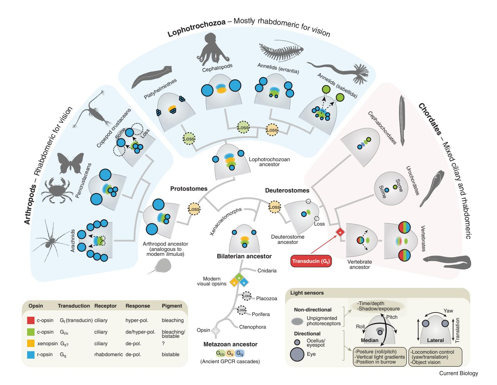
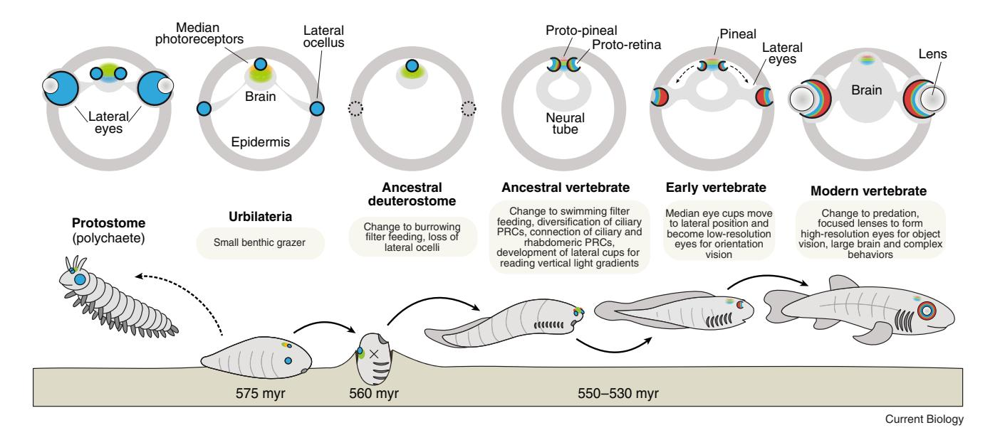
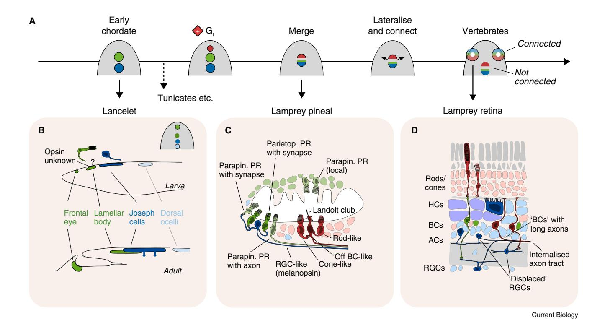
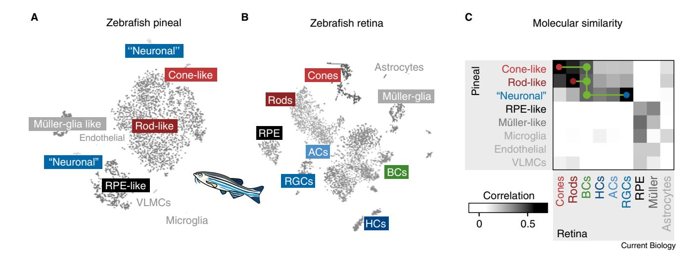
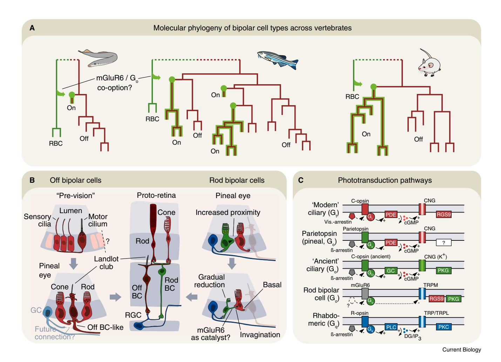
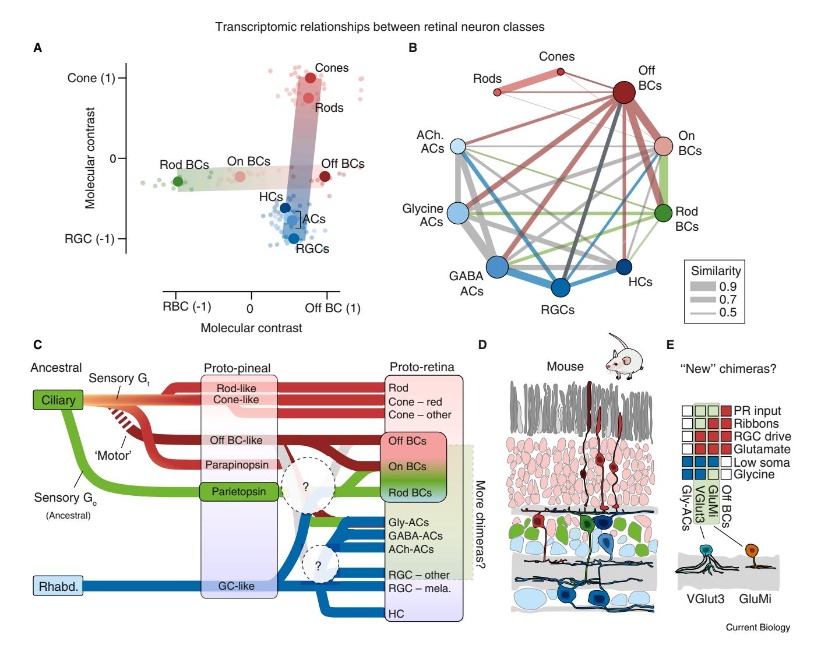

## **Evolution of the vertebrate retina by repurposing of a composite ancestral median eye**

George Kafetzis1, Michael J. Bok2, Tom Baden1,3, and Dan-Eric Nilsson2,3

1Sussex Neuroscience, University of Sussex, Brighton, East Sussex BN1 9QG, UK

2Lund Vision Group, University of Lund, 223 62 Lund, Scania, Sweden

3These authors contributed equally to the work.

Correspondence: [g.kafetzis@sussex.ac.uk](mailto:g.kafetzis@sussex.ac.uk) (G.K.), [michael.bok@biol.lu.se](mailto:michael.bok@biol.lu.se) (M.J.B.), [t.baden@sussex.ac.uk](mailto:t.baden@sussex.ac.uk) (T.B.), [dan-e.nilsson@biol.lu.se](mailto:dan-e.nilsson@biol.lu.se) (D.-E.N.)

<https://doi.org/10.1016/j.cub.2025.12.028>

### SUMMARY

The vertebrate retina is a uniquely complex and evolutionarily conserved structure, combining ciliary (rod and cone) and rhabdomeric (ganglion, amacrine and horizontal cells) photoreceptor lineages within a multilayered circuit. This arrangement contrasts with the ancestral bilaterian cephalic pattern, where rhabdomeric photoreceptors dominate lateral eyes and ciliary photoreceptors are largely limited to unpigmented, non-visual median positions. Here, we make a case that the vertebrate retina evolved through the lateralization of a complex median photoreceptive organ already containing both photoreceptor types. This shift likely followed the loss of lateral rhabdomeric eyes in a burrowing, suspension-feeding deuterostome ancestor that retained a pool of median photoreceptors. In the early chordates leading to vertebrates, this structure diversified into the pineal/parapineal complex and lateral retinas. Central to this transformation was the emergence of a bipolar cellular identity, linking ciliary and rhabdomeric circuits — an unusual feature in animal nervous systems. We suggest that bipolar cells predate the retina and have dual evolutionary origins: Off bipolar cells deriving from a ciliary 'effector' lineage and rod-On bipolar cells deriving from a chimeric sensory cell. This model explains key similarities between the retina and the pineal gland and supports a scenario in which vertebrate vision emerged by integrating and repurposing preexisting circuits. It reframes the retina not as a *de novo* innovation, but as a modified and lateralized solution to sensory challenges faced by early chordates.

### Introduction

At the core of both visual and non-visual photoreception in animals lie photoreceptor cells, broadly categorized as ciliary or rhabdomeric, a distinction historically based on their structural adaptations for housing visual pigments[1–3](#page-11-0). Even when their characteristic membrane specializations — cilia or rhabdomeric microvilli — are absent, photoreceptors can still be reliably identified by the opsins they express[4](#page-11-0) . Both lineages are ancient and widespread across bilaterians[5](#page-11-0),[6](#page-11-0) , with the origin of many of their components predating neural photoreception, or even animals[7](#page-11-0) .

In most protostomes, including arthropods, molluscs, and annelids, lateral eyes or ocelli are composed exclusively of rhabdomeric photoreceptors, while ciliary photoreceptors are typically located in the brain and serve non-visual roles. Vertebrates stand in contrast: their image-forming eyes are built from ciliary photoreceptors — rods and cones — which ultimately feed into neurons with rhabdomeric characteristics — ganglion, amacrine and horizontal cells. Some of these even express rhabdomeric opsins, melanopsin[8–10](#page-11-0), forming part of a two-photoreceptortype circuit. The two systems are connected by bipolar cells[11,](#page-11-0) which exhibit features characteristic of both ciliary and rhabdomeric neuron[s3](#page-11-0) . Vertebrate eyes are thus fundamentally different to the paired lateral eyes in the rest of the animal kingdom, suggesting a unique evolutionary background.

The vertebrate retina's layered complexity is exceptional comprising over 100 neuronal types — and comparable to that of the cerebral corte[x12–15](#page-11-0). Yet, unlike the cortex, the retina is ancient and conserved across all vertebrates[3](#page-11-0) , implying that its core architecture was already established in the last common vertebrate ancestor. This raises the question: how did the vertebrate eye diverge so radically from those of other bilaterians?

In this review, we survey the positions and potential roles of rhabdomeric and ciliary photoreceptors in the head of bilaterians and reconstruct a plausible set of evolutionary events and causes leading to the unique condition in vertebrates. We see a pattern of major photoreceptor repurposing, brought about by a series of life-style changes from early deuterostomes, through early chordates to vertebrates. From this evolutionary background, we unravel the origin of vertebrate retinal neurons and their circuits and explain the striking cell-type similarities between the retina and the pineal gland.

### Reconstructing the bilaterian ancestral condition

To address the bilaterian ancestral condition, we survey the distribution of cephalic photoreceptors in bilaterians, focusing on adult forms to avoid ambiguities in larval morphology. Photoreceptors are identified by their expression of major opsin families: r-opsins (including melanopsin), c-opsins or xenopsins[16.](#page-11-0) Based on this classification, we mapped their positions in the head

**Figure 1. Position and type of photoreceptor cells in the head of bilaterians.**

Schematic dorsal view of the head of selected bilaterians. A complete survey, including all bilaterian phyla and subgroups will be published elsewhere — here we only show representative animal groups needed to reconstruct ancestral forms of protostomes, deuterostomes and bilateria (based on the papers cited as references[1,7,16](#page-11-0),[18](#page-11-0),[30,](#page-11-0)[40](#page-12-0)[,126](#page-14-0),[161–179](#page-15-0)). We indicate the position for photoreceptors in imaging eyes (large circles), simple directional ocelli (small circles) or non-directional clusters (diffuse ellipses). The important distinction is between photoreceptors in paired lateral organs (irrespective if they point sideways or forwards) and median clusters in the brain or close to it. Colours indicate rhabdomeric versus ciliary photoreceptors with their specific opsins and transduction pathways. Reconstruction of ancestral protostome and bilaterian conditions suggest ciliary photoreceptors exclusively as unpigmented (non-directional) median clusters in the brain and rhabdomeric photoreceptors in paired lateral eyes or ocelli, as well as in pigmented median ocelli. Vertebrates stand out as exceptions, with lateral eyes as well as a median pineal/parapineal containing ciliary photoreceptors, pre-synaptically connected to neurons of rhabdomeric origin. Because deuterostomes lack paired lateral eyes/ocelli with primary rhabdomeric photoreceptors, we suggest these were lost in a deuterostome ancestor adopting a burrowing filter-feeding lifestyle[19,20](#page-11-0) with reduced need for locomotory steering. Vertebrate eyes are then derived from remaining median photoreceptors, explaining their unorthodox components and circuits. The lower right panel suggests typical functional roles for paired lateral versus median photoreceptors. (Silhouettes from PhyloPic.org.)

region and their association with screening pigment (Figure 1), excluding non-cephalic and poorly characterized types.

Two main locations for cephalic photoreceptors emerged: paired lateral and median. Lateral photoreceptors range from simple bilateral sensors to complex image-forming eyes and are consistently associated with screening pigment. They provide directionality and suggest a primary role in guiding locomotion via phototaxis or vision. Median photoreceptors, by contrast, appear as clusters either unpaired or bilaterally paired near or in the brain. Many of these are unpigmented and presumed to function in circadian entrainment or light-based physiological regulation. Some, however, are pigmented and likely serve directional functions, such as posture control[17](#page-11-0).

In protostomes, lateral photoreceptors are exclusively rhabdomeric, while median photoreceptors include both ciliary and rhabdomeric types. Ciliary median photoreceptors typically lack screening pigment and express c-opsin — except in Spiralia, where xenopsin is a common alternative[18](#page-11-0). Phylogenetic analysis suggests xenopsin was present in the last bilaterian ancestor but lost in deuterostomes and arthropods[16.](#page-11-0) Whether

## **Current Biology**

### Review

Figure 2. Repeated lifestyle changes drove the unique evolution of vertebrate eyes.

Cross-section diagrams of likely photoreceptor (PRC) and eye structures in the heads of ancestral bilaterians (top), with presumed ancient lifestyles (bottom). Colour and graphical representations of photoreceptors refer to Figure 1. Approximate times in million years before present are indicated for key evolutionary stages54.

xenopsin and c-opsin were ancestrally co-expressed or expressed in separate cells remains unresolved.

A reconstruction of a fundamental ancestral bilaterian cephalic photoreceptive system would therefore feature: ciliary photoreceptors, unpigmented, median, and expressing c-opsin/xenopsin; and rhabdomeric photoreceptors, pigmented and located both laterally and medially as well as unpigmented medially. This typical pattern contrasts with vertebrates, where the lateral eyes combine ciliary photoreceptors and rhabdomeric neurons. Cephalochordates and urochordates, which lack lateral eyes entirely, retain various, but unwired, combinations of ciliary and rhabdomeric photoreceptors in median positions. This suggests a loss of ancestral lateral rhabdomeric eyes in early deuterostomes, with new lateral eyes evolving later from median components in early chordates or vertebrates.

This scenario aligns with the hypothesis that ancestral deuterostomes adopted a burrowing, suspension-feeding lifestyle 19,20, reducing the need for optical guidance of locomotion (Figure 2). Hemichordates, cephalochordates, and larval lampreys still show traits of this sessile mode of life. Based on similarities between the retina and the pineal gland, a median origin of the vertebrate retina was also suggested previously3,21. Our findings support this idea and suggest the reasons for this unique arrangement.

A second major difference between vertebrates and all other bilaterians is the molecular identity of their ciliary phototransduction machinery: vertebrates uniquely use 'modern' c-opsins such as rhodopsin, coupled to a newly invented 'fast' G-protein (Gt/ transducin). By contrast, non-vertebrate ciliary photoreceptors tend to use more ancient c-opsin variants that work through ancient G-proteins such as Gs, Gi and, importantly, Go. As elaborated below, the molecular fingerprints of these distinct phototransduction elements are critical in reconstructing the evolutionary history of the vertebrate eye.

### **Functional roles of lateral versus median** photoreceptors

Photoreceptor placement reflects functional demands (Figure 1, bottom right). Lateral photoreceptors, associated with screening pigment, are suited for phototaxis or vision. Paired directional photoreceptors support simple steering (yaw control) while the evolution of imaging vision adds detection of optic flow, enabling both yaw and translational motion control to improve locomotory guidance. Fast, synaptically connected photoreceptors are needed for this role, typically fulfilled by rhabdomeric cells in protostomes, which appears to be the ancestral bilaterian condition6.

Unpigmented median photoreceptors in the brain are slower, sometimes paracrine-signalling ciliary cells. These typically support physiological regulation, such as circadian entrainment6,17 Some median photoreceptors, particularly rhabdomeric types shielded by pigment, serve directional functions like body posture control. In insects, for example, the dorsal ocelli measure pitch and roll using low-resolution inputs from overhead light fields22-24. This task is distinct from yaw or translational control, which is handled by lateral photoreceptors monitoring movement along the ground plane25. Pitch and roll can also be detected by optic flow in imaging lateral eyes, but in free water a median eye monitoring the dorsal light field can provide more reliable information with fewer neural computations.

This functional dichotomy explains why cephalic photoreceptors in bilaterians are placed laterally for steering and movement, and medially for time tracking and posture control. It also sheds light on why early deuterostomes - adopting a largely sessile lifestyle 19,20 - could afford to lose lateral eyes. Cephalochordates likely adapted the median eye for semi-mobile filter feeding, while urochordates retained only rudimentary photoreceptive structures, in line with their sessile lifestyle and extreme morphological modification26,27.

Median and lateral photoreceptor systems are evolutionarily flexible in protostomes too. Jumping spider primary eyes derive from median ocelli that have assumed lateral visual roles[28](#page-11-0). In copepod crustaceans, lateral eyes are lost, and in some cases, such as *Copilia*, the nauplius eye has been repurposed to support imaging vision[29](#page-11-0). In tube-dwelling fan worms, lateral eyes have become rudimentary while new photoreceptors evolved on the tentacles using a c-opsin previously only found in the brain of polychaetes[30.](#page-11-0) Scallop eyes, which contain both ciliary and rhabdomeric retinas, are less informative because they are extracephalic structures that express photoreceptor genes in a novel location (the mantle edge, not the head)[31](#page-11-0).

And yet, the vertebrate retina may represent the most extreme transformation: a complex lateral visual organ evolved from a median photoreceptive system, ultimately supporting high-resolution vision and image processing. This shift involved not only changes in position but also a fundamental rewiring of ancestral photoreceptor cell types and circuits.

This major sensory transformation may have been triggered by the first whole genome duplication that set vertebrates apart from other chordates[32.](#page-11-0) Despite the very different evolutionary history of protostome and vertebrate lateral eyes, in both cases, the output to the brain has rhabdomeric origin — a link that may explain the apparently ubiquitous association between eye development and the homeobox gene *Pax6*[6](#page-11-0) .

### Bleaching opsins and the emergence of pigment epithelium

Rhabdomeric opsins are invariably bistable, meaning that the chromophore (retinal) is constitutively bound to the opsin and can be re-isomerised by light. By contrast, many ciliary opsins, including all variants used in vertebrate rods and cones, are mono-stable, and lose the chromophore after it has been photo-isomerised to all-trans configuration[33.](#page-11-0) This transition was linked to the displacement of the counterion[34](#page-12-0) from position 181 (typical of rhabdomeric, bistable opsins) to 113 (in ciliary, bleaching opsins), which also endowed ciliary photoreceptors with higher G protein activation, likely at the expense of pigment photo-reversibility[33.](#page-11-0) The resultant bleaching opsins need to be recycled, a task likely initially accomplished in a different subcellular compartment of the photoreceptor[35](#page-12-0). However, presumably relatively soon after, acquisition of the interphotoreceptor retinoid-binding protein (IRBP) by horizontal gene transfer from a bacterium to the chordate ancestor made possible the shuttling of retinoids between photoreceptors and neighbouring epithelium[36,37](#page-12-0).

In protostomes, photoreceptors associated with screening pigment are exclusively of the rhabdomeric type, suggesting that this may be an ancestral association. However, in cephalochordates and urochordates, there are ciliary photoreceptors in median position embedded in screening pigment cups. The repeated involvement of ortholog genes (*Mitf* and *Otx2*) for the specification of pigment epithelium points to a common origin dating back to the chordate ancestor[38–40](#page-12-0). The late, vertebrate-specific emergence of bleaching opsins that needed recycling and increased protection from photooxidation may then account for the diversification of retina pigment epithelium functions.

### Understanding circuitry and complexity from signal ambiguity

It is often assumed that non-visual photoreceptors serve primarily to track the daily light cycle and entrain biological clocks[41.](#page-12-0) However, ambient light intensity depends on many environmental factors, including cloud cover, habitat structure, moon phase, and particularly for aquatic species, water depth and quality. Light levels vary by six to eight orders of magnitude between day and night yet changes in cloud cover or depth in water can easily obscure or mimic these shifts[42–44.](#page-12-0) Even body orientation can alter detected light intensity; consequently, a non-directional light signal is a highly ambiguous proxy for time.

Because these variables — depth, time, weather and orientation — all contribute to changes in light intensity, animals need mechanisms to disentangle the causes. Biological clocks are one such mechanism,relying on internal oscillators to average light signals over many cycles. Another strategy involves spectral comparison: for instance, depth and time cause different changes of spectral composition. This principle is exploited in polychaete larvae, where circuits integrating inputs from both ciliary and rhabdomeric photoreceptors regulate depth-dependent swimming behaviour[s45](#page-12-0). We suggest that newly connected ciliary and rhabdomeric photoreceptor[s3,21](#page-11-0) helped to discriminate time from depth in the chordate lineage leading to vertebrates. Such a dual-receptor system, ciliary and rhabdomeric with different spectral tuning and response speeds, is well suited for the purpose.

A third means of reducing ambiguity is to sample vertical light gradients[42](#page-12-0), which can reveal spatial and spectral differences related to depth, time of day, weather, and habitat openness. This requires some spatial resolution, particularly in the vertical plane, and benefits from photoreceptors with distinct kinetics, gain and/or spectral sensitivities[46](#page-12-0). We hypothesize that the vertebrate retina began as lateral parts of a median eye, optimized for reading vertical light gradients to guide choice of behaviour and habitat as well as posture stabilization.

The fossilrecord of chordates from the late and middle Cambrian reveals many eyeless animals, such as vetulicolians, yunnanozoans and *Pikaia*, but also animals with obvious paired eyes, such as conodonts, myllokunmingids, *Haikouichtys* and *Metaspriggina*[47–49.](#page-12-0) The recent discovery of an early Cambrian fish with two pairs of eye[s50](#page-12-0) suggests the lateral cups of a median eye were originally duplicated. It is conceivable that one pair specialized in locomotory guidance and shifted to lateral position, whereas the other pair was lost or reduced into the current pineal complex.

We further hypothesize that the introduced spatial resolution gradually became exploited also for locomotory orientation, leading to separation and complete lateralization of the retina. Later in evolution, focused optics allowed for high spatial resolution required for object discrimination[51.](#page-12-0) This innovation also called for the introduction of eye movements to stabilise the image and to allow for high resolution in limited parts of the visual field. The remaining median structure persisted as the pineal and parapineal organs. Much of this transformation likely occurred during the early Cambrian period[52](#page-12-0).

### Differences between photoreceptors of vertebrates and other chordates

The largely sessile cephalochordate amphioxus is a distant vertebrate relative that retains four separate sets of median

**Figure 3. Deuterostome median and lateral eyes.**

(A) Suggested timeline for the emergence of median and lateral eye components leading to modern vertebrate lateral eyes. Note that the emergence of a 'modern ciliary' (red, Gt) identity postdates non-vertebrate chordates. (B) Lancelets (amphioxus) have four median photoreceptors: two anterior clusters are 'ancient' ciliary (Go, green), while the two posterior clusters are rhabdomeric (blue). During development, the two central clusters become superimposed. (Adapted from Lacalli[180,](#page-15-0) © 2004 S. Karger AG, Basel.) (C) The pineal organ of lampreys comprises diverse populations of photoreceptors and projection neurons that form at least two independent local microcircuits: dorsorostrally, 'ancient' ciliary photoreceptors expressing parietopsin and parapinopsin (green) make ribbon synapses onto rhabdomeric projection neurons (blue), while independently, ventral 'modern' ciliary rod- and cone-like photoreceptors make basal ribbon contacts onto Landolt-club-bearing ciliary projection neurons (red). (Schematic adapted from Wada *et al.*[108](#page-13-0) and Ekstro¨ m and Meissl[181.](#page-15-0)) (D) The lamprey retina has a vertebrate-typical tri-layered organization, with modern-ciliary rods and cones (red) feeding into diverse populations of bipolar cells (BCs) of unclear ancestry (depicted green and dark red) that in turn feed into rhabdomeric ganglion and amacrine cells (RGCs and ACs, blue). Horizontal cells (HCs, rhabdomeric, blue) with notably large somata slot above the bipolar cells. Note that, in lamprey, many inner retinal neurons including their main axons are 'displaced' compared to their positions in other vertebrates ([Box](#page-9-0) 2). Moreover, some bipolar-like neurons project directly to the brain. (Schematic adapted from Baden[182](#page-15-0).)

photoreceptor clusters, two ciliary and two rhabdomeric (Figure 3A,B), and there have been different attempts to homologise amphioxus photoreceptors with those of the vertebrate retina and pineal gland[21,](#page-11-0)[40,53.](#page-12-0) However, cephalochordates are not as closely related to vertebrates as the urochordates[3](#page-11-0)[,54](#page-12-0) (sea squirts and salps), which have very reduced sets of photoreceptors.

It remains unclear if cephalochordate photoreceptor systems represent an ancestral chordate system or a separate solution to their specific lifestyle. Cephalochordates and urochordates also lack 'modern' vertebrate-like ciliary photoreceptors that work through Gt — instead, their ciliary photoreceptors work though the ancestral Gi/o. The vertebrate introduction of Gt may have been a response to the need of faster transduction associated with new functional roles.

### Retina-like circuitry in the pineal gland: the vertebrate's 'third eye'

In contrast to the light-sensitive organs of cephalochordates and urochordates, the vertebrate pineal/parapineal complex shows clear signs that ancestral ciliary and rhabdomeric photoreceptor types, once separate, were brought together into a single structure[3](#page-11-0) . Lampreys, for example, feature a highly ordered pineal gland that includes a substantial anatomical and functional diversity of neurons (Figure 3C). These neurons are systematically positioned in different parts of this ancient median eye, one part 'modern' ciliary (Gt), and the other part a complex mixture of 'ancient' ciliary photoreceptors (Go) and rhabdomeric projection neurons. Both sides form local microcircuits, each with their own axons towards the brain[55–58](#page-12-0). Critically, however, there are no known synaptic bridges between the 'modern' and 'ancient' parts. Instead, the two sides may represent the result of two or more median eyes that have merged into a common eyecup, but without synaptically interconnecting their neuronal hardware. We posit that connections likely came soon after the already complex median eye had begun to lateralise and split off, enabled by preexisting neuronal elements on both sides (Figure 3A–D).

Anatomical, functional, and developmental evidence has long linked the pineal gland to the retina[3,21](#page-11-0),[59–63](#page-12-0). Both structures develop from the embryonic diencephalon, and interference with retinoic acid signalling during development can result in a 'median-retina', distant from eye optics which develop from the surface ectoderm[64,65](#page-12-0). The shared ancestry of retinal and pineal

**Figure 4. Transcriptomic comparison of zebrafish pineal and retina.** (A,B) A UMAP — Uniform Manifold Approximation and Projection — representation of single-cell transcriptomic data extracted from zebrafish pineal (A) and retina (B) and annotated cell classes (VLMCs, vascular leptomeningeal cells; RPE, retina pigment epithelium; other abbreviations as in the [Figure](#page-4-0) 3 legend). (Modified based on clustering as shown in Zheng *et al.*[69](#page-12-0).) For pineal data, see also Shainer *et al.*[74.](#page-13-0) (C) Correlation matrix of pseudobulk scRNA transcriptomic clusters based on (A,B), comparing pineal and retinal cell clusters. Note molecularly intermediate position of retinal bipolar cells between pineal rods/cones and pineal 'neurons'. (Adapted from Zheng *et al.*[69](#page-12-0) with permission from John Wiley and Sons.)

circuits is also inscribed into their cellular and molecular makeup[6,](#page-11-0)[66–69.](#page-12-0) For example, single-cell transcriptomic data from zebrafish point at pineal homologs to both rods and cones (including Gt), as well as retina-like ganglion cells and support cells including Mu¨ ller glia and an 'unpigmented' pigment-epithelium[69](#page-12-0) (Figure 4A,B). While in zebrafish a clear transcriptomic pineal homolog to bipolar cells has not been described, retinal bipolar cells occupy a molecularly intermediate position between pineal ciliary and rhabdomeric systems, hinting at a chimeric origin (Figure 4C). Moreover, as elaborated below, the apparent lack of obvious bipolar cell homologs in the zebrafish pineal gland may also link with their generally reduced neural complexity compared to that of earlier diverging vertebrates[70–74.](#page-12-0)

Nevertheless, in both zebrafish and lampreys, the unambiguous presence of both pineal rods and cones, including pigment epithelial cells, strongly argues that both photoreceptor systems predate the lateral eye. Cones and rods likely appeared in relatively close succession in a median position in early vertebrate ancestors to extend the dynamic range of their increasingly complex eye. This view is also strongly supported by recent comparative transcriptomic work on retinal photoreceptors, which consistently identify rods as the most molecularly distinct of all visual ciliary photoreceptors[75](#page-13-0).

### Two independent origins of bipolar cells?

Bipolar cells are a defining feature of the vertebrate retina and central to its unique organization. Unlike most sensory systems, which employ a single synaptic relay, the vertebrate retina contains two distinct synaptic layers — the outer and inner plexiform layers — connected by bipolar cells[11](#page-11-0). These cells relay input from rods and cones of the outer retina to the amacrine and ganglion cells of the inner retina[76,77.](#page-13-0) Bipolar cells thus bridge 'modern' ciliary (Gt) and 'ancient' (Gq) rhabdomeric photoreceptor systems. In the case of On bipolar cells, they do so, at least in part, by hijacking 'ancient' ciliary phototransduction elements (Go), which in the retina works downstream of the metabotropic glutamate receptor mGluR6, rather than an opsin.

Bipolar cells are classically divided into three groups: Off-cone bipolar cells, On-cone bipolar cells and rod-On bipolar cells. These categories reflect differences in anatomy, connectivity and molecular makeup[78–81](#page-13-0), including glutamate receptor expression[82–87](#page-13-0). While Off-cone and rod-On bipolar cells can contact both rods and cones, On-cone bipolar cells tend to be truly cone-specific[11](#page-11-0),[46.](#page-12-0) In general, the parallel existence of On- and Off-type bipolar cells reflects a need for *pathway splitting* in the retina: On bipolar cells signal light increments, while Off bipolars signal light decrements. This division allows the visual system to represent both brightening and dimming with high sensitivity, improving dynamic range and coding efficiency in downstream circuits[11.](#page-11-0)

Transcriptomic studies in mouse, zebrafish and lamprey have shown that rod bipolar cells are molecularly the most distinct among the three, consistently clustering apart from both Onand Off-cone bipolar cells[88–91](#page-13-0) ([Figure](#page-6-0) 5A). Moreover, On- and Off-cone bipolar cells do not always form two neat molecular camps — in zebrafish, for example, they are notably intermingled[89.](#page-13-0) These findings support two potential evolutionary scenarios: either all bipolar cells share a common ancestor followed by initial diversification of 'rod' from 'cone' types, or rod and cone bipolar cells have separate evolutionary origins. A third scenario[21](#page-11-0),[92,](#page-13-0) where rod bipolar cells emerge late, following a duplication from preexisting On-cone bipolar cells, is not molecularly plausible in the light of recent findings[88,89,91](#page-13-0) ([Figure](#page-6-0) 5A).

As elaborated in the following, combination of these molecular insights with a median, pineal-gland-like ancestry of the vertebrate retina points to a single parsimonious explanation: two separate origins. Specifically, we suggest that Off-cone bipolar cells derive from the 'modern' ciliary side ([Figure](#page-6-0) 5B), while rod bipolar cells likely descend from an 'ancient' ciliary lineage of

Figure 5. Two evolutionary origins of retinal bipolar cells?

(A) Molecular relationships of scRNA transcriptomically defined bipolar cell types in lamprey, zebrafish and mouse as indicated. (Trees modified from papers cited as references 89-91.) Note that rod bipolar cells (RBCs, green) consistently cluster apart from all other bipolar cells. Note also that lamprey cone-bipolar cells are dominated by Off-types (dark red) with a single putative On-type (green lining), and that On- and Off-cone types of zebrafish are molecularly intermingled. We posit that RBCs and Off-cone BCs have distinct evolutionary origins, and that On-cone BCs emerged, possibly more than once, by co-option of mGluR6 and associated molecular machinery from RBCs onto ancestrally Off-types. (B) Suggested sequence of events leading to Off-cone-bipolar cells (left) and rod bipolar cells (right). Retinal off BCs (middle, dark red) may link with pineal ciliary projection neurons that have a Landolt club in place of a photosensitive outer segment. These cells are already postsynaptic to pineal rods and cones, and a connection onto the nearby rhabdomeric ganglion cells (blue) could explain their origin. Preceding pineal circuits, these neurons may link with a motor-ciliary heritage originally in place to stir cerebro-spinal fluids (top left, adapted from Jékely99). By contrast, retinal rod bipolar cells (green) may link with pineal parietopsin photoreceptors, which are already presynaptic to rhabdomeric ganglion cells. Connection of parietopsin cells onto pineal rods and cones, possibly facilitated by mGluR6, may explain their input circuits in the retina. (C) Comparison of phototransduction components across different photoreceptor lineages as indicated. Note the molecularly 'chimeric' relationship of rod-bipolar cells compared to 'modern ciliary' (Gt, red), 'ancient ciliary' (Go, green) and rhabdomeric lineages (Gg, blue).

photoreceptors that nonetheless display various rhabdomeric properties (Figure 5C). On-cone bipolar cells then emerged later, possibly more than once, when already diversified Off-cone bipolar cells co-opted the glutamate receptor machinery from rod bipolar cells.

### Off-cone bipolar cells may have emerged from a ciliary 'motor' lineage

The ventral region of the lamprey pineal organ comprises at least three anatomically and molecularly distinct types of ciliary neurons72,93: pineal rods, pineal cones, and at least one additional type that lacks an obvious photosensitive outer segment and forms a long axon that projects to the brain. Like Off bipolar cells, this third neuron receives direct, basal, ribbon-mediated inputs from both rods and cones56,70,72. Moreover, it features a Landolt club-like structure94, a mitochondria-packed cilium that protrudes into the lumen56,95. The function of Landolt clubs remains poorly understood. However, their presence in interneurons (rather than primary sensory neurons), ventricular protrusion95–97 and otherwise unexplained mitochondrial density tentatively point at a ciliary 'motor' ancestry 98-100. Within the retina, Landolt clubs are strongly associated with Off bipolar cells, particularly in non-mammalian vertebrates such as birds, reptiles, amphibians and  $fish^{101-106}$ , where they are found in cells that terminate in the upper 'Off' layers of the inner retina - closest to rods and cones. This association is especially clear in sharks107.

Several additional features link these pineal neurons to retinal Off bipolar cells. First, Off bipolar cells form basal, rather than

### Box 1. Lamprey pineal parietopsin photoreceptors: ciliary or 'chimeric'?

Ciliary and rhabdomeric photosensitive systems work via ancestrally distinct opsins with different properties, and each plug into molecularly distinct phototransduction cascades[183](#page-15-0) that ultimately result in signals with opposite polarity[184](#page-15-0). 'Modern' ciliary systems (Gt) are negatively coupled to the opening of a cation channel and therefore hyperpolarise in response to light (Off cells). By contrast, rhabdomeric photoreceptors depolarise (On cells, [Figure](#page-6-0) 5C).

Parietopsin photoreceptors combine key elements of both the above, plus additional elements that are not usually found in either system. At the input, the opsin itself is ciliary[185,186](#page-15-0), although its photochemical properties place it intermediate to visual ciliary and rhabdomeric opsins[187.](#page-15-0) Inactivation of parietopsin occurs via β-arrestin[108,](#page-13-0) as used in modern rhabdomeric systems (but see Kawano-Yamashita *et al.*[188](#page-15-0)). Next, parietopsin works through Go, an ancestral G-protein cascade that is distinct from the vertebrate-specific Gt used in rod and cone photoreceptors, or the ancestral Gq used in rhabdomeric systems. Importantly, Go-based phototransduction is 'molecularly promiscuous' in the sense that it routinely associates with both ciliary and rhabdomeric photoreceptor lineages across bilaterians (for example, papers cited as references[7](#page-11-0)[,161,162,189](#page-15-0)) and might thus serve to molecularly bridge these two otherwise rarely associated systems. However, unlike in other systems, such as scallops[190,191,](#page-15-0) pineal parietopsin-associated Go inhibits phosphodiesterase (PDE)[126](#page-14-0), the functional opposite of guanylyl cyclase (GC). While this does preserve the depolarising polarity of Go photoreceptors, it is notable that PDE is the effector complex of Gt-coupled ciliary photoreceptors[183](#page-15-0), not Go. In other words, these photoreceptors depolarise, like rhabdomeric ones, but they do so by likely hijacking and inverting the traditional effector sequence of ciliary photoreceptors.

Interestingly, rod bipolar cells appear to have taken on additional chimeric properties. For example, their effector channel, TRPM[192–194](#page-15-0), aligns more closely with the rhabdomeric TRP/TRPL family[195–198](#page-16-0) than with ciliary cyclic nucleotide gated (CNG) channels[199,200.](#page-16-0)

invaginating, synapses — mirroring basal ribbon contacts in the pineal gland[56,72.](#page-12-0) Second, physiological recordings have revealed ventral pineal neurons that spike in response to achromatic Off stimuli, likely reflecting Landolt-club-bearing neurons summing input from pineal rods and cones[55,57,58,](#page-12-0)[108–110](#page-13-0). Third, in lampreys, some inner retinal neurons downstream of rods and cones 'still' project directly to the brai[n111,112](#page-13-0). Relatedly, some cone bipolar cells of teleost fish[113](#page-13-0),[114](#page-13-0) and mammals[115,116](#page-14-0) can fire sodium-based action potentials, not from an axon hillock but from presynaptic compartments, preserving their presumed ancestral axonal firing position. Fourth, despite their axon, pineal neurons bearing Landolt clubs also form occasional local ribbon synapses onto unknown targets[56,](#page-12-0) suggesting early synaptic flexibility. This capacity may have been co-opted to connect to pineal ganglion cells, eventually reducing the need forlong axons.

### Rod bipolar cells may derive from a 'chimeric' parietopsin photoreceptor

In comparison to the achromatic Off profiles of the ventral ciliary region, the lamprey rostrolateral pineal gland contains additional populations of ganglion-like cells. Some are On cells and express melanopsin[71,73](#page-12-0),[117–119](#page-14-0), a rhabdomeric opsin still used in some retinal ganglion[9](#page-11-0),[120](#page-14-0), horizontal[10](#page-11-0)[,121](#page-14-0) and even bipolar cells[8](#page-11-0),[122.](#page-14-0) Some are chromatically opponent, excited at long and inhibited at short wavelengths[55,57](#page-12-0),[58,](#page-12-0)[108–110](#page-13-0) — reminiscent of the similarly constructed spectral depth gauge of *Platynereis* larvae[45.](#page-12-0)

Presynaptic to these rostrolaterally located pineal ganglion cells are two types of photoreceptor: parapinopsin- and parietopsin-expressing neuron[s70](#page-12-0)[,108,](#page-13-0)[123–125.](#page-14-0) Both have ciliary outer segments, are glutamatergic and use ribbon synapses[70](#page-12-0),[108,](#page-13-0) but at least the parietopsin cells appear to be chimeric, combining phototransduction characteristics of 'ancient' ciliary (Go), 'modern' ciliary (Gt), and rhabdomeric photoreceptors (Box 1).

Several molecular and functional features link lamprey pineal parietopsin photoreceptors to vertebrate retinal rod-On bipolar cells. First, both are On cells: in the case of pineal parietopsin photoreceptors, this property is a consequence of an 'inverted' phototransduction pathway[108](#page-13-0)[,126;](#page-14-0) in the case of rod-bipolar cells, it is the consequence of their inverted glutamate response (Box 1). This inversion is caused by mGluR6, a metabotropic glutamate receptor which, like parietopsin, works through Go [85](#page-13-0)[,127.](#page-14-0) Beyond rod bipolars, mGluR6 and Go are also found in On-cone bipolar cells but at notably lower expression outside of mammals[89,91.](#page-13-0)

The molecular presence of retinal rod bipolar cells in lampreys[91,](#page-13-0) zebrafish[89](#page-13-0) and mice[90](#page-13-0) strongly indicates that these cells are ancestral to the vertebrate eye. Beyond their unique molecular profiles [\(Figure](#page-6-0) 5A), rod bipolar cells are also anatomical and functional outliers amongst bipolar cells[11](#page-11-0)[,89](#page-13-0). In teleost fish and mammals, rod bipolar cells tend to terminate jammed up against retinal ganglion cell somata, with large axon terminals in some species such as goldfish bearing up to 50 ribbons, compared to the two to three ribbons per terminal in most other bipolar types[89,](#page-13-0)[128–131.](#page-14-0) On the dendritic side, they uniquely make invaginating synapses with rods[80,](#page-13-0) a feature linked to mGluR6, which not only modulates the synapse but also organizes it structurally[132–135.](#page-14-0) Next, although in mammals their output is relayed via A2 amacrine cells[136](#page-14-0), lamprey retinas lack clear A2 orthologs and their closest molecular analogues lack gap junction proteins[91.](#page-13-0) Thus, the A2 relay likely emerged later, and rod bipolars may have originally connected directly to ganglion cells[137–139.](#page-14-0) In support of this, mouse rod bipolar cells transiently connect to ganglion cells during development[140](#page-14-0),[141](#page-14-0).

Together, these data suggest that lamprey pineal circuits representtwo ancestral visual modules: a ciliary sensory-effector circuit giving rise to Off bipolar cells, and a chimeric, parietopsin-based photoreceptor system feeding into rhabdomeric ganglion-like neurons — prefiguring rod bipolar cells and the On-pathway.

On-cone bipolar cells then probably came later, following cooption of the molecular machinery associated with mGluR6 from rod bipolar cells onto an otherwise Off bipolar cell. This notion is also tentatively supported by On bipolar cells' approximate

Figure 6. Evolution of retinal neurons.

(A) Molecular relatedness of retinal neurons computed on mean pseudobulk transcriptomic relatedness of retinal neuron classes based on Hahn et al.88. The dataset was organized into a 176 x 176 two-dimensional matrix of pairwise pseudobulk-transcripomic similarity (0:1) with eleven retinal cell sub-classes (RGCs, ACsGABA, ACsGiycine, ACsAcetylcholine, BCsOff, BCsRod, HCs, Rods, Cones, Müller glia). For simplicity, Müller glia data were excluded. 'Molecular contrasts' were then calculated as normalized similarity to pairs of retinal neuron sub-classes: 'cone' versus 'RGC' (y-axis) and rod BC versus Off BC (x-axis), each anchored to the mean across species. We then computed each entry's 'molecular contrast' position between each pair of anchor cell sub-classes such that the anchors scored 1 or -1, while an equidistant intermediate entry scored 0. Small symbols illustrate individual species, while large symbols denote their corresponding mean. Note that all bipolar cells are molecularly intermediate between rods/cones and RGCs, and On-cone bipolar cells (On BCs) are molecularly intermediate between rod BCs and Off BCs. HCs and different populations of ACs (GABA/Glycine/Acetylcholinergic) all cluster near RGCs; however, note that some are also close to Off cone BCs. (B) As (A) but showing mean pseudo-bulk transcriptomic similarity between each retinal neuron sub-class as labelled. Pairwise molecular similarity summarizes the average transcriptomic similarity between each retinal sub-class as detailed above. Line strength indicates similarity from 1 (identical) to 0 (zero similarity). For clarity, we thresholded this graphical representation at a similarity of 0.45, which approximately corresponds to the 'baseline' similarity between retinal neurons and the Müller glia. (C) Proposed evolutionary timeline and likely instances of chimerization between ancient photoreceptor lineages, leading first to a pineal-like organization and eventually to the vertebrate retina. (D) Schematic of mouse retina with neurons colour-coded by their putative ancestral lineage. (E) Overview of 'modern ciliary' versus 'rhabdomerio' traits found in murine VGlut3 and GluMi cells. BC, bipolar cells; AC, amacrine cell; RGC, retinal ganglion cell.

intermediate molecular position between the other types (Figure 6A,B), the finding that non-mammalian bipolar cells routinely co-express 'On'- and 'Off'-acting glutamate receptors or transporters (for example, Hellevik et al. 89) and the fact that some bipolar cells display an On-Off functional identity 142,143, a trait that appears to be accentuated in the pharmacological absence of inhibition from amacrine cells 144,144

### Completing the retina

With bipolar cells in place to synaptically bridge the 'modern' ciliary side (Gt) to the 'ancient' ciliary (Go) and rhabdomeric (Go) side, the foundational architecture of the retina began to crystallize. From this scaffold emerged the characteristic laminar structure seen in all vertebrates: three nuclear layers (outer, inner and ganglion cell layers) interleaved with two synaptic layers (the

### Box 2. Hagfish: introduction of lamination and displaced cells?

Nearly all vertebrate retinas come not only with a tri-layered organisation but with each retinal neuron class occupying distinct and characteristic positions. The only known exception occurs in hagfish, whose 'apparent' bi-layered retina resembles the pineal organ and supports evolution scenarios wherein the emergence of interneurons like bipolar cells have led to a laminar expansion by the introduction of the middle layer[3,21](#page-11-0). However, recent molecular evidence cements hagfish as monophyletic with lampreys[32,](#page-11-0)[201](#page-16-0), which have a tri-layered retina like all other vertebrates. The unusual retinal lamination in hagfish therefore likely represents a regressed state rather than an early vertebrate transition point. This notion is also strongly supported by the presence of retinal interneuron markers in hagfish, including PKC-α, which labels On bipolar cells in diverse vertebrate retinas[139](#page-14-0)[,202–204](#page-16-0). The evolutionary transition that we propose here from two disconnected, bi-layered pineal-like circuits into the combined, tri-layered arrangement that characterises vertebrate retinas (compare [Figure](#page-4-0) 3C,D and [Figure](#page-6-0) 5B) would presumably initially lack clear positional instructions. A relative spatial rearrangement of the rhabdomeric system 'wrapping around' the ciliary system — reminiscent of the developmental superposition of rhabdomeric and ciliary median eyes in amphioxous[163](#page-15-0)[,205,206](#page-16-0) — would presumably result in ganglion cell axons running sandwiched between the resultant inner nuclear and ganglion cell layers. Such an 'internalised' projection pattern 'still' exists in lampreys and hagfish[112](#page-13-0), hinting that this might represent the ancestral vertebrate state[207.](#page-16-0) Beyond ganglion cell axons, an initial lack of positional instructions might catalyse novel cellular interactions and chimerization of properties, and result in some cells inextricably occupying ectopic positions. Displaced amacrine cells, occupying the ganglion cell layer, are one well-characterised case, but there are several others. For example, ectopic bipolar cells are occasionally found in the photoreceptor layer of turtles and salamanders[208,209](#page-16-0) or in the ganglion cell layer of mice[210](#page-16-0). Similarly, displaced ganglion cells at the inner nuclear and plexiform layers exist broadly across vertebrates[211](#page-16-0),[212](#page-16-0), including in early diverging vertebrates like lampreys[213](#page-16-0) and shark[s214,](#page-16-0) where their numbers routinely reach or even exceed their orthotopic counterparts. Long dismissed as ontogenetic aberrations, we posit they might instead delineate transitional rearrangements in space; from two side-by-side systems like in the pineal organ to eventually a wired up, vertebrate retina.

outer and inner plexiform layers)[13](#page-11-0); for hagfish and a discussion of 'displaced cells', see Box 2. The outer and inner plexiform layers therefore link, respectively, with the preexisting synaptic architectures within the 'modern' and 'ancient' sides of the original median eye. Lateral modulation provided by horizontal and amacrine cells likely emerged relatively soon after. Despite evolutionary divergence among species, this basic five-cell-class circuit remains conserved across vertebrates.

This conservation extends to many retinal subtypes ([Box](#page-10-0) 3). Rods and major cone types are preserved with remarkable fidelity across vertebrate lineages[75](#page-13-0)[,146,147](#page-14-0). Horizontal cells are perhaps equally well preserved[148,](#page-14-0) alongside further retinal neuron types that appear to be universal, or at least almost universal[88,91](#page-13-0). These include melanopsin-expressing retinal ganglion cells[88,91,](#page-13-0) alpha-type ganglion cells[88](#page-13-0), rod bipolar cells[89,91,](#page-13-0) and several types of amacrine cell, including starburst amacrine cells[91,](#page-13-0)[149](#page-14-0), integral elements of mammalian motion circuits[150,151.](#page-14-0) These patterns suggest that once the retinal template was established — likely in early vertebrate evolution its major components remained stable, with innovations layered atop rather than replacing ancestral structures.

And yet, it remains surprisingly difficult to reliably categorise retinal neuron types into clear ciliary and rhabdomeric lineages. Instead, the evolutionary record contains numerous hints of 'chimerization' — the blending of ancestrally ciliary and rhabdomeric lineages into new cell types [\(Figure](#page-8-0) 6A–E). We have argued that bipolar cells are one such case, but there are other candidate systems. For example, phototransduction in some rhabdomeric melanopsin-expressing retinal ganglion cells seems to also deploy ciliary-like signalling pathway[s152–154](#page-14-0) (but see Contreras *et al.*[155\)](#page-15-0). Within amacrine cells, many GABAergic types structurally[15](#page-11-0) and molecularly[88](#page-13-0) resemble ganglion cells, but many glycinergic types are quite distinct, and additionally display similarities with bipolar cells; both tend to be 'small-field' and stratify vertically ratherthan horizontally across the retin[a11,](#page-11-0)[156,](#page-15-0) especiallyoutside of mammal[s105](#page-13-0)[,129](#page-14-0). In some cases, putative links between amacrine and bipolar cells are particularly striking ([Figure](#page-8-0) 6E): murine VGlut3 cells[157,](#page-15-0) though amacrine, are part-glycinergic, part-glutamatergic and excite ganglion cells like bipolar cells[158.](#page-15-0) Conversely, murine GluMi cells, though classed as bipolar[90](#page-13-0), are monopolar and resemble amacrine cells functionally and structurally[159.](#page-15-0) A third example might be PR6[146,](#page-14-0) the accessory member of the tetrapod double con[e75,](#page-13-0)[147,](#page-14-0)[160.](#page-15-0) Together, its fundamentally chimeric origin may have endowed the retinawith its exceptional plasticity and capacity for functional specialization.

### Discussion

We have argued that the vertebrate retina likely evolved from a complex median eye that combined ciliary and rhabdomeric photoreceptor systems to disambiguate environmental light cues. As this structure evolved lateral compartments, it formed the foundation for the paired eyes of vertebrates, integrating ancient sensory elements into a unique, layered circuit. Central to this transformation was the emergence of bipolar cells, bridging 'modern' and 'ancient' median circuits. These neurons were not new, however: rather, they were part of two distinct, ancestrally disconnected median circuits. This evolutionary trajectory, distinct from other bilaterians, reflects the retina's chimeric origins and functional diversification. Ultimately, the retina's complexity and connectivity suggest it emerged not de novo, but from an already elaborate ancestral photoreceptor system. We have presented hypotheses for a functional repurposing of ancient median photoreceptive systems into the modern vertebrate retina and pineal. These hypotheses are testable by comparison of transcriptomic profiles of retinal and pineal cells with median photoreceptor systems in cephalochordates, urochordates and hemichordates. Further such comparisons with echinoderms, xenoturbellids and protostomes may unravel the process by

### Box 3. Evolution of retinal cell classes and types.

Rods and cones: The retina of the last common vertebrate ancestor probably comprised four types of single cones (red, green, blue, UV: PR1–4, respectively) plus rods (PR0)[146](#page-14-0). Putative homologs to at least two of these, rods and 'red' cones (PR0 and PR1), are also found in the pineal[93](#page-13-0)[,215–221](#page-16-0). In support, pineal cone-like cells express iodopsin[215](#page-16-0),[221](#page-16-0), the red-opsin variant that is also found in retinas of modern birds[222.](#page-16-0) In extant vertebrates, rods and red cones usually feed into common postsynaptic circuits[46](#page-12-0), and in birds, this connectivity motif is taken over by the principal member of double cones, which are also ancestrally red[75](#page-13-0),[147](#page-14-0). Moreover, no extant sighted vertebrate is known to completely lack rods, and presumed 'rod-only' species, such as some whales, appear to comprise cone-like neurons that have lost their photosensitive outer segment[s223](#page-16-0). Together, these insights strongly suggest that both rods and red cones are an ancestral remit of the pre-lateralisation median eye. Beyond red, the four ancestral single cones form a transcriptomic sequence from red via green to blue and finally UV (PR1–4)[75](#page-13-0). It seems reasonable to suggest that this is their sequence of ancestry. However, whether, like PR0 and PR1, PR2–4 also predate the eye remains unclear. The generally muted spectral abilities of animals that lack object vision[51](#page-12-0) hints that the expansion into more than one cone type postdated the introduction of (high resolution) object vision with large eyes and ocular muscles.

In the retina, rods and cones tend to be electrically coupled via gap junctions[224–226.](#page-16-0) This connectivity motif, also referred to as the 'secondary rod pathway', is under neuromodulatory control[227,228](#page-16-0). In the pineal, there has been no direct demonstration of rodcone coupling, but other types of pineal ciliary photoreceptors can be intimately coupled to form a dense functional syncytium[70,](#page-12-0)[124](#page-14-0)[,229.](#page-16-0) It therefore seems plausible to suggest that rod-cone coupling is similarly ancestral.

Horizontal cells: Horizontal cells make 'synaptically unusual' feedforward and feedback inhibitory connections between photoreceptors[148,](#page-14-0)[230](#page-16-0),[231](#page-16-0). Lampreys have four types (H1–4) that are likely at least in part homologous to those of birds[91](#page-13-0). It therefore seems likely that horizontal cells diversified very early and have since remained relatively stable. Many horizontal cells express melanopsi[n121,](#page-14-0)[232](#page-16-0), an ancestrally rhabdomeric opsin, and their anatomy and molecular composition generally point to a rhabdomeric origin[2](#page-11-0),[233](#page-16-0). However, they are molecularly distant from retinal ganglion cells, and their exact evolutionary relationship remains unclear. In early diverging species, such as lampreys but also sharks and rays, horizontal cells often come in multiple rows of very large somata that routinely make up half or even more of the total retinal volume[234](#page-16-0). This trait is generally less obvious in late diverging lineages, including fish, but also birds and mammals. Plausibly, horizontal cells originally fulfilled key retinal functions[235](#page-17-0) that were later part-superseded by new downstream circuitry.

Bipolar cells: Bipolar cells may have two pre-retinal origins, as argued in the foregoing: one for Off bipolar cells, and one for rod bipolar cells. This leaves On-cone bipolar cells. We speculate that On bipolar cells are ancestrally Off, following the co-option of glutamate receptor systems from rod bipolar cells. In support, mGluR6 is consistently expressed at very high levels in RBCs across species, while outside of mammals, mGluR6 expression in On-cone bipolar cells can be low. This situation is further complicated by the notion that, beyond mGluR6, also other glutamate receptor systems can impart an 'On-physiology' under specific physiological conditions[236–241](#page-17-0). One prominent alternative On-system includes excitatory amino acid transporters (EAATs), which are also present in lampreys, alongside mGluR6[91.](#page-13-0) Outside the probably atypical case of mammals[46,](#page-12-0) the question of how to truly separate 'On' from 'Off' types remains largely unresolved.

Amacrine cells: Amacrine cells (ACs) remain the most diverse and least understood class of retinal neuron. Most are predominately rhabdomeric[2](#page-11-0),[233.](#page-16-0) Traditionally, ACs are subdivided by their neurotransmitter systems, which often approximately map onto distinct anatomical traits. For example, GABAergic amacrine cells tend to be large and anatomically resemble key aspects of ganglion cells. Glycinergic ACs tend to be small and often stretch across multiple strata of the inner retina to provide vertical connectivity — in many aspects reminiscent of bipolar cells rather than ganglion cells. Acetylcholinergic ACs are different still — many are flat and radially organised, including the starburst amacrine cells that sit at the heart of mammalian direction selective circuits[151](#page-14-0). And yet, cholinergic ACs are ancient and prominently feature in lampreys[91](#page-13-0) as well as zebrafish[242.](#page-17-0) While it remains unclear when and how ACs entered the picture, their origin, like for all other retinal neuron classes, must predate the last common vertebrate ancestor. This makes it tempting to search for signatures of amacrine-like neurons in the pineal. While no obvious pineal amacrine cell homolog has been demonstrated, this might in part be because of a lack of data.

In the meanwhile, it seems prudent to note that many of the key neurotransmitter systems used by ACs — GABA, acetylcholine and glycine — exist as various immunohistochemical gradients across the pineal[243–246](#page-17-0). However, it also seems noteworthy that specifically the diversity of amacrine cells displays major gains across the vertebrate tree of life, from a mere handful in lampreys[91](#page-13-0), to a few dozen types in fish[242,](#page-17-0) to nearly 70 types in mice[247](#page-17-0). Perhaps amacrine cells are a key substrate upon which modern evolutionary pressures continue to act when shaping retinal performance as animals explore new visual niches.

Retinal ganglion cells: Retinal ganglions cells (RGCs) likely predate the eye, in the sense that at least some of them probably are sister types with pineal ganglion cells. Presumably, the so-called intrinsically photosensitive ganglion cells (ipRGCs), which express melanopsin[9](#page-11-0),[119,120,](#page-14-0) are some of the oldest. Alpha cells, which notably include the midget and parasol cells of the human eye, are potentially not far behind[88](#page-13-0). The origin of the many other types remains unclear; however, it seems noteworthy that, unlike amacrine cells, already lampreys have nearly as many transcriptomic ganglion cell types as mice do — and notably more than we have in our own eyes[88,91](#page-13-0). Perhaps, a large ganglion cell diversity is an ancestral trait of the vertebrate eye.

Together, it seems reasonable to suggest that the four cone types, the two synaptic layers, and more generally the high diversity of neurons found in the retina but not in the pineal are consequences of the introduction of motion detection, for example for optic flow analysis, and later for high-resolution object vision.

which deuterostome photoreception diverged so dramatically from that of protostomes.

In parallel, our understanding of the molecular, structural and functional organisation of the pineal organ needs to be brought on par with its retinal counterpart. For example, volumetric electron microscopy can contribute high-resolution, ultrastructural connectivity maps and morphological feature identification (for example, Landolt clubs). At the same time, transcriptomics approaches can provide essential insights on putative homologies and the molecular evolution of essential retinal signalling strategies (for example, mGluR6). Combined insights from the former approaches can then guide functional validation experiments to explore the extent of retina-like functional properties and connectivity within the pineal.

### **ACKNOWLEDGMENTS**

Funding was provided by the Wellcome Trust (Investigator Award in Science 220277/Z20/Z to T.B.), the Swedish Research Council (2024-05245 to D.-E.N. and 2020-03200 to M.J.B.) the European Research Council (ERC-StG ''NeuroVisEco'' 677687 to T.B. and ERC-AdG ''Cones4Action'' covered under the UK's EPSRC guarantee scheme EP/Z533981/1 to T.B.), the Human Frontiers Science Programme (RGP0012025 to T.B. and M.J.B.), UKRI (BBSRC, BB/R014817/1 and BB/W013509/1 to T.B.), the Leverhulme Trust (PLP-2017-005, RPG-2021-026 and RPG-2-23-042 to T.B., DS-2017-011 to G.K.) and the Lister Institute for Preventive Medicine (T.B.). This research was funded in part by the Wellcome Trust (220277/Z20/Z). To promote Open Access, the authors have applied a CC BY public copyright licence to any Author Accepted Manuscript version arising from this submission.

### **DECLARATION OF INTERESTS**

The authors declare no competing interests.

### **REFERENCES**

- 1. Eakin, R.M., and [Brandenburger,](http://refhub.elsevier.com/S0960-9822(25)01676-8/sref1) J.L. (1981). Fine structure of the eyes of Pseudoceros canadensis (Turbellaria, Polycladida). [Zoomorphology](http://refhub.elsevier.com/S0960-9822(25)01676-8/sref1) *98*, [1–16](http://refhub.elsevier.com/S0960-9822(25)01676-8/sref1).
- 2. Arendt, D. (2008). The evolution of cell types in animals: [emerging](http://refhub.elsevier.com/S0960-9822(25)01676-8/sref2) principles from [molecular](http://refhub.elsevier.com/S0960-9822(25)01676-8/sref2) studies. Nat. Rev. Genet. *9*, 868–882.
- 3. Lamb, T.D., Collin, S.P., and Pugh, E.N., Jr. (2007). [Evolution](http://refhub.elsevier.com/S0960-9822(25)01676-8/sref3) of the vertebrate eye: Opsins, [photoreceptors,](http://refhub.elsevier.com/S0960-9822(25)01676-8/sref3) retina and eye cup. Nat. Rev. Neurosci. *8*, [960–976.](http://refhub.elsevier.com/S0960-9822(25)01676-8/sref3)
- 4. Porter, M.L., Blasic, J.R., Bok, M.J., [Cameron,](http://refhub.elsevier.com/S0960-9822(25)01676-8/sref4) E.G., Pringle, T., Cronin, T.W., and [Robinson,](http://refhub.elsevier.com/S0960-9822(25)01676-8/sref4) P.R. (2012). Shedding new light on opsin evolution. [Proc.](http://refhub.elsevier.com/S0960-9822(25)01676-8/sref4) Biol. Sci. *279*, 3–14.
- 5. Arendt, D., and Wittbrodt, J. (2001). [Reconstructing](http://refhub.elsevier.com/S0960-9822(25)01676-8/sref5) the eyes of Urbilateria. Philos. Trans. R. Soc. Lond. B Biol. Sci. *356*, [1545–1563](http://refhub.elsevier.com/S0960-9822(25)01676-8/sref5).
- 6. Tosches, M.A., and Arendt, D. (2013). The bilaterian [forebrain:](http://refhub.elsevier.com/S0960-9822(25)01676-8/sref6) an evolutionary chimaera. Curr. Opin. Neurobiol. *23*, [1080–1089.](http://refhub.elsevier.com/S0960-9822(25)01676-8/sref6)
- 7. Oakley, T.H., and Speiser, D.I. (2015). How [complexity](http://refhub.elsevier.com/S0960-9822(25)01676-8/sref7) originates: The [evolution](http://refhub.elsevier.com/S0960-9822(25)01676-8/sref7) of animal eyes. Annu. Rev. Ecol. Evol. Syst. *46*, 237–260.
- 8. [Matos-Cruz,](http://refhub.elsevier.com/S0960-9822(25)01676-8/sref8) V., Hattar, S., and Halpern, M.E. (2010). Diversity of [melanopsin-expressing](http://refhub.elsevier.com/S0960-9822(25)01676-8/sref8) cells in the zebrafish retina. Invest. Ophthalmol. Vis. Sci. *51*, [681.](http://refhub.elsevier.com/S0960-9822(25)01676-8/sref8)
- 9. Hattar, S., Liao, H.W., Takao, M., [Berson,](http://refhub.elsevier.com/S0960-9822(25)01676-8/sref9) D.M., and Yau, K.W. (2002). [Melanopsin-containing](http://refhub.elsevier.com/S0960-9822(25)01676-8/sref9) retinal ganglion cells: architecture, projections, and intrinsic [photosensitivity.](http://refhub.elsevier.com/S0960-9822(25)01676-8/sref9) Science *295*, 1065–1070.
- 10. Morera, L.P., Dı´az, N.M., and Guido, M.E. (2016). [Horizontal](http://refhub.elsevier.com/S0960-9822(25)01676-8/sref10) cells expressing melanopsin x are novel [photoreceptors](http://refhub.elsevier.com/S0960-9822(25)01676-8/sref10) in the avian inner retina. Proc. Natl. Acad. Sci. USA *113*, [13215–13220.](http://refhub.elsevier.com/S0960-9822(25)01676-8/sref10)

- 11. Euler, T., [Haverkamp,](http://refhub.elsevier.com/S0960-9822(25)01676-8/sref11) S., Schubert, T., and Baden, T. (2014). Retinal bipolar cells: [elementary](http://refhub.elsevier.com/S0960-9822(25)01676-8/sref11) building blocks of vision. Nat. Rev. Neurosci. *15*, [507–519](http://refhub.elsevier.com/S0960-9822(25)01676-8/sref11).
- 12. Baden, T. (2024). The [vertebrate](http://refhub.elsevier.com/S0960-9822(25)01676-8/sref12) retina: a window into the evolution of [computation](http://refhub.elsevier.com/S0960-9822(25)01676-8/sref12) in the brain. Curr. Opin. Behav. Sci. *57*, 101391.
- 13. Baden, T., Euler, T., and Berens, P. (2020). [Understanding](http://refhub.elsevier.com/S0960-9822(25)01676-8/sref13) the retinal basis of vision across species. Nat. Rev. [Neurosci.](http://refhub.elsevier.com/S0960-9822(25)01676-8/sref13) *21*, 5–20.
- 14. Gollisch, T., and Meister, M. (2009). Eye smarter than [scientists](http://refhub.elsevier.com/S0960-9822(25)01676-8/sref14) believed: Neural [computations](http://refhub.elsevier.com/S0960-9822(25)01676-8/sref14) in circuits of the retina. Neuron *65*, 150–164.
- 15. Masland, R.H. (2001). The [fundamental](http://refhub.elsevier.com/S0960-9822(25)01676-8/sref15) plan of the retina. Nat. Neurosci. *4*, [877–886.](http://refhub.elsevier.com/S0960-9822(25)01676-8/sref15)
- 16. [Ramirez,](http://refhub.elsevier.com/S0960-9822(25)01676-8/sref16) M.D., Pairett, A.N., Pankey, M.S., Serb, J.M., Speiser, D.I., [Swafford,](http://refhub.elsevier.com/S0960-9822(25)01676-8/sref16) A.J., and Oakley, T.H. (2016). The last common ancestor of most bilaterian animals [possessed](http://refhub.elsevier.com/S0960-9822(25)01676-8/sref16) at least nine opsins. Genome Biol. Evol. *8*, [3640–3652.](http://refhub.elsevier.com/S0960-9822(25)01676-8/sref16)
- 17. Nilsson, D.-E. (2021). The [diversity](http://refhub.elsevier.com/S0960-9822(25)01676-8/sref17) of eyes and vision. Annu. Rev. Vis. Sci. *7*, [19–41](http://refhub.elsevier.com/S0960-9822(25)01676-8/sref17).
- 18. Do¨ ring, C.C., Kumar, S., Tumu, S.C., [Kourtesis,](http://refhub.elsevier.com/S0960-9822(25)01676-8/sref18) I., and Hausen, H. (2020). The visual pigment xenopsin is [widespread](http://refhub.elsevier.com/S0960-9822(25)01676-8/sref18) in protostome eyes and impacts the view on eye [evolution.](http://refhub.elsevier.com/S0960-9822(25)01676-8/sref18) eLife *9*, e55193.
- 19. Lowe, C.J., Clarke, D.N., [Medeiros,](http://refhub.elsevier.com/S0960-9822(25)01676-8/sref19) D.M., Rokhsar, D.S., and Gerhart, J. (2015). The [deuterostome](http://refhub.elsevier.com/S0960-9822(25)01676-8/sref19) context of chordate origins. Nature *520*, [456–465](http://refhub.elsevier.com/S0960-9822(25)01676-8/sref19).
- 20. Swalla, B.J. (2024). [Deuterostome](http://refhub.elsevier.com/S0960-9822(25)01676-8/sref20) ancestors and chordate origins. Integr. Comp. Biol. *64*, [1175–1181](http://refhub.elsevier.com/S0960-9822(25)01676-8/sref20).
- 21. Lamb, T.D. (2013). Evolution of [phototransduction,](http://refhub.elsevier.com/S0960-9822(25)01676-8/sref21) vertebrate photore[ceptors](http://refhub.elsevier.com/S0960-9822(25)01676-8/sref21) and retina. Prog. Retin. Eye Res. *36*, 52–119.
- 22. Berry, R., van Kleef, J., and Stange, G. (2007). The [mapping](http://refhub.elsevier.com/S0960-9822(25)01676-8/sref22) of visual space by [dragonfly](http://refhub.elsevier.com/S0960-9822(25)01676-8/sref22) lateral ocelli. J. Comp. Physiol. A *193*, 495–513.
- 23. Krapp, H.G. (2009). Ocelli. Curr. Biol. *19*, [R435–R437](http://refhub.elsevier.com/S0960-9822(25)01676-8/sref23).
- 24. Stange, G. (1981). The ocellar [component](http://refhub.elsevier.com/S0960-9822(25)01676-8/sref24) of flight equilibrium control in [dragonflies.](http://refhub.elsevier.com/S0960-9822(25)01676-8/sref24) J. Comp. Physiol. A *141*, 335–347.
- 25. [Alexander,](http://refhub.elsevier.com/S0960-9822(25)01676-8/sref25) E., Cai, L.T., Fuchs, S., Hladnik, T.C., Zhang, Y., Subramanian, V., Guilbeault, N.C., Vijayakumar, C., [Arunachalam,](http://refhub.elsevier.com/S0960-9822(25)01676-8/sref25) M., Juntti, S.A., *et al*. (2022). Optic flow in the natural habitats of [zebrafish](http://refhub.elsevier.com/S0960-9822(25)01676-8/sref25) supports spatial biases in visual [self-motion](http://refhub.elsevier.com/S0960-9822(25)01676-8/sref25) estimation. Curr. Biol. *32*, 5008– [5021.e8.](http://refhub.elsevier.com/S0960-9822(25)01676-8/sref25)
- 26. Berna´ , L., and [Alvarez-Valin,](http://refhub.elsevier.com/S0960-9822(25)01676-8/sref26) F. (2014). Evolutionary genomics of fast evolving tunicates. Genome Biol. Evol. *6*, [1724–1738](http://refhub.elsevier.com/S0960-9822(25)01676-8/sref26).
- 27. Holland, L.Z. (2016). Tunicates. Curr. Biol. *26*, [R146–R152.](http://refhub.elsevier.com/S0960-9822(25)01676-8/sref27)
- 28. Chong, K.L., Grahn, A., Perl, C.D., and [Sumner-Rooney,](http://refhub.elsevier.com/S0960-9822(25)01676-8/sref28) L. (2024). Allometry and ecology shape eye size [evolution](http://refhub.elsevier.com/S0960-9822(25)01676-8/sref28) in spiders. Curr. Biol. *34*, 3178– [3188.e5.](http://refhub.elsevier.com/S0960-9822(25)01676-8/sref28)
- 29. [Gregory,](http://refhub.elsevier.com/S0960-9822(25)01676-8/sref29) R.L., Ross, H.E., and Moray, N. (1964). The curious eye of Copilia. Nature *201*, [1166–1168.](http://refhub.elsevier.com/S0960-9822(25)01676-8/sref29)
- 30. Bok, M.J., Porter, M.L., and Nilsson, D.-E. (2017). [Phototransduction](http://refhub.elsevier.com/S0960-9822(25)01676-8/sref30) in fan worm radiolar eyes. Curr. Biol. *27*, [R698–R699.](http://refhub.elsevier.com/S0960-9822(25)01676-8/sref30)
- 31. Audino, J.A., Marian, J.E.A.R., [Wanninger,](http://refhub.elsevier.com/S0960-9822(25)01676-8/sref31) A., and Lopes, S.G.B.C. (2015). [Development](http://refhub.elsevier.com/S0960-9822(25)01676-8/sref31) of the pallial eye in Nodipecten nodosus (Mollusca: Bivalvia): insights into early visual performance in scallops. [Zoomorphol](http://refhub.elsevier.com/S0960-9822(25)01676-8/sref31)ogy *134*, [403–415](http://refhub.elsevier.com/S0960-9822(25)01676-8/sref31).
- 32. Yu, D., Ren, Y., Uesaka, M., Beavan, A.J.S., [Muffato,](http://refhub.elsevier.com/S0960-9822(25)01676-8/sref32) M., Shen, J., Li, Y., Sato, I., Wan, W., Clark, J.W., *et al*. (2024). Hagfish genome [elucidates](http://refhub.elsevier.com/S0960-9822(25)01676-8/sref32) vertebrate [whole-genome](http://refhub.elsevier.com/S0960-9822(25)01676-8/sref32) duplication events and their evolutionary con[sequences.](http://refhub.elsevier.com/S0960-9822(25)01676-8/sref32) Nat. Ecol. Evol. *8*, 519–535.
- 33. Terakita, A., [Kawano-Yamashita,](http://refhub.elsevier.com/S0960-9822(25)01676-8/sref33) E., and Koyanagi, M. (2012). Evolution and diversity of opsins. Wiley [Interdiscip.](http://refhub.elsevier.com/S0960-9822(25)01676-8/sref33) Rev. Membr. Transp. Signal. *1*, [104–111](http://refhub.elsevier.com/S0960-9822(25)01676-8/sref33).

- 34. Terakita, A., Koyanagi, M., [Tsukamoto,](http://refhub.elsevier.com/S0960-9822(25)01676-8/sref34) H., Yamashita, T., Miyata, T., and Shichida, Y. (2004). Counterion [displacement](http://refhub.elsevier.com/S0960-9822(25)01676-8/sref34) in the molecular evolution of the [rhodopsin](http://refhub.elsevier.com/S0960-9822(25)01676-8/sref34) family. Nat. Struct. Mol. Biol. *11*, 284–289.
- 35. [Kusakabe,](http://refhub.elsevier.com/S0960-9822(25)01676-8/sref35) T.G., Takimoto, N., Jin, M., and Tsuda, M. (2009). Evolution and the origin of the visual retinoid cycle in [vertebrates.](http://refhub.elsevier.com/S0960-9822(25)01676-8/sref35) Philos. Trans. R. Soc. B Biol. Sci. *364*, [2897–2910.](http://refhub.elsevier.com/S0960-9822(25)01676-8/sref35)
- 36. Kalluraya, C.A., Weitzel, A.J., Tsu, B.V., and [Daugherty,](http://refhub.elsevier.com/S0960-9822(25)01676-8/sref36) M.D. (2023). Bacterial origin of a key [innovation](http://refhub.elsevier.com/S0960-9822(25)01676-8/sref36) in the evolution of the vertebrate eye. Proc. Natl. Acad. Sci. USA *120*, [e2214815120](http://refhub.elsevier.com/S0960-9822(25)01676-8/sref36).
- 37. Redmond, A.K., and [McLysaght,](http://refhub.elsevier.com/S0960-9822(25)01676-8/sref37) A. (2023). Horizontal transfer of vertebrate vision gene IRBP into the chordate [ancestor.](http://refhub.elsevier.com/S0960-9822(25)01676-8/sref37) Proc. Natl. Acad. Sci. USA *120*, [e2310390120](http://refhub.elsevier.com/S0960-9822(25)01676-8/sref37).
- 38. Nguyen, M.-T.T., and Arnheiter, H. (2000). Signaling and [transcriptional](http://refhub.elsevier.com/S0960-9822(25)01676-8/sref38) regulation in early mammalian eye [development:](http://refhub.elsevier.com/S0960-9822(25)01676-8/sref38) a link between FGF and MITF. [Development](http://refhub.elsevier.com/S0960-9822(25)01676-8/sref38) *127*, 3581–3591.
- 39. Fatieieva, Y., [Galimullina,](http://refhub.elsevier.com/S0960-9822(25)01676-8/sref39) R., Isaev, S., Klimovich, A., Lemaire, L.A., and Adameyko, I. (2025). Melanocytes and [photosensory](http://refhub.elsevier.com/S0960-9822(25)01676-8/sref39) organs share a common ancestry that [illuminates](http://refhub.elsevier.com/S0960-9822(25)01676-8/sref39) the origins of the neural crest. Com[mun.](http://refhub.elsevier.com/S0960-9822(25)01676-8/sref39) Biol. *8*, 1092.
- 40. Vopalensky, P., Pergner, J., Liegertova, M., [Benito-Gutierrez,](http://refhub.elsevier.com/S0960-9822(25)01676-8/sref40) E., Arendt, D., and Kozmik, Z. (2012). Molecular analysis of the [amphioxus](http://refhub.elsevier.com/S0960-9822(25)01676-8/sref40) frontal eye unravels the [evolutionary](http://refhub.elsevier.com/S0960-9822(25)01676-8/sref40) origin of the retina and pigment cells of the vertebrate eye. Proc. Natl. Acad. Sci. USA *109*, [15383–15388.](http://refhub.elsevier.com/S0960-9822(25)01676-8/sref40)
- 41. Foster, R.G. (1998). [Shedding](http://refhub.elsevier.com/S0960-9822(25)01676-8/sref41) light on the biological clock. Neuron *20*, [829–832](http://refhub.elsevier.com/S0960-9822(25)01676-8/sref41).
- 42. Nilsson, D.-E., Smolka, J., and Bok, M. (2022). The vertical [light-gradient](http://refhub.elsevier.com/S0960-9822(25)01676-8/sref42) and its potential impact on animal [distribution](http://refhub.elsevier.com/S0960-9822(25)01676-8/sref42) and behavior. Front. Ecol. Evol. *10*, [951328.](http://refhub.elsevier.com/S0960-9822(25)01676-8/sref42)
- 43. Tyler, J., and Jerlov, N.G. (1968). Optical [Oceanography](http://refhub.elsevier.com/S0960-9822(25)01676-8/sref43) (Elsevier), pp. [731–732.](http://refhub.elsevier.com/S0960-9822(25)01676-8/sref43)
- 44. Warrant, E., [Johnsen,](http://refhub.elsevier.com/S0960-9822(25)01676-8/sref44) S., and Nilsson, D.-E. (2020). Light and visual environments. In The Senses: A [Comprehensive](http://refhub.elsevier.com/S0960-9822(25)01676-8/sref44) Reference, second edition, B. Fritzsch, ed. [\(Elsevier\),](http://refhub.elsevier.com/S0960-9822(25)01676-8/sref44) pp. 4–30.
- 45. Veraszto´ , C., Gu¨ hmann, M., Jia, H., Rajan, V.B.V., [Bezares-Caldero´](http://refhub.elsevier.com/S0960-9822(25)01676-8/sref45) n, L.A., Pin˜ [eiro-Lopez,](http://refhub.elsevier.com/S0960-9822(25)01676-8/sref45) C., Randel, N., Shahidi, R., Michiels, N.K., Yokoyama, S., *et al*. (2018). Ciliary and rhabdomeric [photoreceptor-cell](http://refhub.elsevier.com/S0960-9822(25)01676-8/sref45) circuits form a spectral depth gauge in marine [zooplankton.](http://refhub.elsevier.com/S0960-9822(25)01676-8/sref45) eLife *7*, e36440.
- 46. Baden, T. (2024). Ancestral [photoreceptor](http://refhub.elsevier.com/S0960-9822(25)01676-8/sref46) diversity as the basis of visual [behaviour.](http://refhub.elsevier.com/S0960-9822(25)01676-8/sref46) Nat. Ecol. Evol. *8*, 374–386.
- 47. [Garcı´a-Bellido,](http://refhub.elsevier.com/S0960-9822(25)01676-8/sref47) D.C., Lee, M.S.Y., Edgecombe, G.D., Jago, J.B., Gehling, J.G., and Paterson, J.R. (2014). A new [vetulicolian](http://refhub.elsevier.com/S0960-9822(25)01676-8/sref47) from Australia and its bearing on the chordate affinities of an enigmatic [Cambrian](http://refhub.elsevier.com/S0960-9822(25)01676-8/sref47) group. BMC [Evol.](http://refhub.elsevier.com/S0960-9822(25)01676-8/sref47) Biol. *14*, 214.
- 48. [Nanglu,](http://refhub.elsevier.com/S0960-9822(25)01676-8/sref48) K., Cole, S.R., Wright, D.F., and Souto, C. (2023). Worms and gills, plates and spines: the [evolutionary](http://refhub.elsevier.com/S0960-9822(25)01676-8/sref48) origins and incredible disparity of [deuterostomes](http://refhub.elsevier.com/S0960-9822(25)01676-8/sref48) revealed by fossils, genes, and development. Biol. Rev. *98*, [316–351.](http://refhub.elsevier.com/S0960-9822(25)01676-8/sref48)
- 49. Mussini, G., Smith, M.P., Vinther, J., Rahman, I.A., [Murdock,](http://refhub.elsevier.com/S0960-9822(25)01676-8/sref49) D.J.E., Harper, D.A.T., and Dunn, F.S. (2024). A new [interpretation](http://refhub.elsevier.com/S0960-9822(25)01676-8/sref49) of *Pikaia* reveals the origins of the chordate body plan. Curr. Biol. *34*, [2980–2989.e2](http://refhub.elsevier.com/S0960-9822(25)01676-8/sref49).
- 50. Lei, X., Zhang, S., Cong, P., Vinther, J., [Gabbott,](http://refhub.elsevier.com/S0960-9822(25)01676-8/sref50) S., Wei, F., and Xu, X. (2026). Four [camera-type](http://refhub.elsevier.com/S0960-9822(25)01676-8/sref50) eyes in the earliest vertebrates from the Cambrian Period. Nature *650*, [150–155.](http://refhub.elsevier.com/S0960-9822(25)01676-8/sref50)
- 51. Nilsson, D.-E. (2022). The [evolution](http://refhub.elsevier.com/S0960-9822(25)01676-8/sref51) of visual roles ancient vision versus object vision. Front. [Neuroanat.](http://refhub.elsevier.com/S0960-9822(25)01676-8/sref51) *16*, 789375.
- 52. Carlisle, E., Yin, Z., Pisani, D., and [Donoghue,](http://refhub.elsevier.com/S0960-9822(25)01676-8/sref52) P.C.J. (2024). Ediacaran origin and [Ediacaran-Cambrian](http://refhub.elsevier.com/S0960-9822(25)01676-8/sref52) diversification of Metazoa. Sci. Adv. *10*, [eadp7161.](http://refhub.elsevier.com/S0960-9822(25)01676-8/sref52)
- 53. Lacalli, T.C. (1997). Frontal eye circuitry, rostral sensory [pathways](http://refhub.elsevier.com/S0960-9822(25)01676-8/sref53) and brain [organization](http://refhub.elsevier.com/S0960-9822(25)01676-8/sref53) in amphioxus larvae: evidence from 3D reconstructions. Philos. Trans. R. Soc. Lond. B Biol. Sci. *351*, [243–263.](http://refhub.elsevier.com/S0960-9822(25)01676-8/sref53)

- 54. Carlisle, E., Yin, Z., Pisani, D., and [Donoghue,](http://refhub.elsevier.com/S0960-9822(25)01676-8/sref54) P.C.J. (2024). Ediacaran origin and [Ediacaran-Cambrian](http://refhub.elsevier.com/S0960-9822(25)01676-8/sref54) diversification of Metazoa. Sci. Adv. *10*, [eadp7161.](http://refhub.elsevier.com/S0960-9822(25)01676-8/sref54)
- 55. (1973). Visual Centers in the Brain, R. Jung, ed. [\(Springer\).](http://refhub.elsevier.com/S0960-9822(25)01676-8/sref55)
- 56. Ekstrom, P. (1987). Photoreceptors and [CSF-contacting](http://refhub.elsevier.com/S0960-9822(25)01676-8/sref56) neurons in the pineal organ of a teleost fish have direct axonal [connections](http://refhub.elsevier.com/S0960-9822(25)01676-8/sref56) with the brain: an [HRP-electron-microscopic](http://refhub.elsevier.com/S0960-9822(25)01676-8/sref56) study. J. Neurosci. *7*, 987–995.
- 57. Korf, H.-W., Liesner, R., Meissl, H., and Kirk, A. (1981). Pineal [complex](http://refhub.elsevier.com/S0960-9822(25)01676-8/sref57) of the clawed toad, Xenopus laevis Daud.: [Structure](http://refhub.elsevier.com/S0960-9822(25)01676-8/sref57) and function. Cell Tissue Res. *216*, [113–130.](http://refhub.elsevier.com/S0960-9822(25)01676-8/sref57)
- 58. Uchida, K., and Morita, Y. (1994). Spectral sensitivity and [mechanism](http://refhub.elsevier.com/S0960-9822(25)01676-8/sref58) of interaction between inhibitory and excitatory responses of [photosensory](http://refhub.elsevier.com/S0960-9822(25)01676-8/sref58) pineal [neurons.](http://refhub.elsevier.com/S0960-9822(25)01676-8/sref58) Pflu¨ g. Arch. *427*, 373–377.
- 59. Kalluraya, C.A., Weitzel, A.J., Tsu, B.V., and [Daugherty,](http://refhub.elsevier.com/S0960-9822(25)01676-8/sref59) M.D. (2023). Bacterial origin of a key [innovation](http://refhub.elsevier.com/S0960-9822(25)01676-8/sref59) in the evolution of the vertebrate eye. Proc. Natl. Acad. Sci. USA *120*, [e2214815120](http://refhub.elsevier.com/S0960-9822(25)01676-8/sref59).
- 60. [Rodrigues,](http://refhub.elsevier.com/S0960-9822(25)01676-8/sref60) M.M., Hackett, J., Gaskins, R., Wiggert, B., Lee, L., Redmond, M., and Chader, G.J. (1986). [Interphotoreceptor](http://refhub.elsevier.com/S0960-9822(25)01676-8/sref60) retinoid-binding protein in retinal rod cells and pineal gland. Invest. [Ophthalmol.](http://refhub.elsevier.com/S0960-9822(25)01676-8/sref60) Vis. Sci. *27*, [844–850.](http://refhub.elsevier.com/S0960-9822(25)01676-8/sref60)
- 61. Mano, H., Asaoka, Y., Kojima, D., and Fukada, Y. (2019). [Brain-specific](http://refhub.elsevier.com/S0960-9822(25)01676-8/sref61) [homeobox](http://refhub.elsevier.com/S0960-9822(25)01676-8/sref61) Bsx specifies identity of pineal gland between serially homologous [photoreceptive](http://refhub.elsevier.com/S0960-9822(25)01676-8/sref61) organs in zebrafish. Commun. Biol. *2*, 364.
- 62. Kasahara, T., Okano, T., [Yoshikawa,](http://refhub.elsevier.com/S0960-9822(25)01676-8/sref62) T., Yamazaki, K., and Fukada, Y. (2000). Rod-type transducin α-subunit mediates a [phototransduction](http://refhub.elsevier.com/S0960-9822(25)01676-8/sref62) pathway in the chicken pineal gland. J. [Neurochem.](http://refhub.elsevier.com/S0960-9822(25)01676-8/sref62) *75*, 217–224.
- 63. Nishida, A., [Furukawa,](http://refhub.elsevier.com/S0960-9822(25)01676-8/sref63) A., Koike, C., Tano, Y., Aizawa, S., Matsuo, I., and Furukawa, T. (2003). Otx2 homeobox gene controls retinal [photoreceptor](http://refhub.elsevier.com/S0960-9822(25)01676-8/sref63) cell fate and pineal gland [development.](http://refhub.elsevier.com/S0960-9822(25)01676-8/sref63) Nat. Neurosci. *6*, 1255–1263.
- 64. Creuzet, S., Vincent, C., and Couly, G. (2005). Neural crest [derivatives](http://refhub.elsevier.com/S0960-9822(25)01676-8/sref64) in ocular and periocular [structures.](http://refhub.elsevier.com/S0960-9822(25)01676-8/sref64) Int. J. Dev. Biol. *49*, 161–171.
- 65. Cvekl, A., and [Ashery-Padan,](http://refhub.elsevier.com/S0960-9822(25)01676-8/sref65) R. (2014). The cellular and molecular mechanisms of vertebrate lens [development.](http://refhub.elsevier.com/S0960-9822(25)01676-8/sref65) Dev. Camb. Engl. *141*, [4432–4447](http://refhub.elsevier.com/S0960-9822(25)01676-8/sref65).
- 66. Fritzsch, B., and Martin, P.R. (2022). Vision and retina [evolution:](http://refhub.elsevier.com/S0960-9822(25)01676-8/sref66) How to develop a retina. IBRO [Neurosci.](http://refhub.elsevier.com/S0960-9822(25)01676-8/sref66) Rep. *12*, 240–248.
- 67. Klein, D.C. (2004). The 2004 [Aschoff/Pittendrigh](http://refhub.elsevier.com/S0960-9822(25)01676-8/sref67) Lecture: Theory of the origin of the pineal gland — a tale of conflict and [resolution.](http://refhub.elsevier.com/S0960-9822(25)01676-8/sref67) J. Biol. [Rhythms](http://refhub.elsevier.com/S0960-9822(25)01676-8/sref67) *19*, 264–279.
- 68. Mano, H., and [Fukada,](http://refhub.elsevier.com/S0960-9822(25)01676-8/sref68) Y. (2007). A median third eye: Pineal gland retraces evolution of vertebrate [photoreceptive](http://refhub.elsevier.com/S0960-9822(25)01676-8/sref68) organs† . Photochem. Photobiol. *83*, [11–18](http://refhub.elsevier.com/S0960-9822(25)01676-8/sref68).
- 69. Zheng, J., Song, W., Zhou, Y., Li, X., Wang, M., and [Zhang,](http://refhub.elsevier.com/S0960-9822(25)01676-8/sref69) C. (2024). [Cross-species](http://refhub.elsevier.com/S0960-9822(25)01676-8/sref69) single-cell landscape of vertebrate pineal gland. J. Pineal Res. *76*, [e12927](http://refhub.elsevier.com/S0960-9822(25)01676-8/sref69).
- 70. [Kawano-Yamashita,](http://refhub.elsevier.com/S0960-9822(25)01676-8/sref70) E., Terakita, A., Koyanagi, M., Shichida, Y., Oishi, T., and Tamotsu, S. (2007). [Immunohistochemical](http://refhub.elsevier.com/S0960-9822(25)01676-8/sref70) characterization of a par[apinopsin-containing](http://refhub.elsevier.com/S0960-9822(25)01676-8/sref70) photoreceptor cell involved in the ultraviolet/green [discrimination](http://refhub.elsevier.com/S0960-9822(25)01676-8/sref70) in the pineal organ of the river lamprey Lethenteron japonicum. J. Exp. Biol. *210*, [3821–3829.](http://refhub.elsevier.com/S0960-9822(25)01676-8/sref70)
- 71. Lamanna, F., [Hervas-Sotomayor,](http://refhub.elsevier.com/S0960-9822(25)01676-8/sref71) F., Oel, A.P., Jandzik, D., Sobrido-Camea´ n, D., [Santos-Dura´](http://refhub.elsevier.com/S0960-9822(25)01676-8/sref71) n, G.N., Martik, M.L., Stundl, J., Green, S.A., Bru¨ ning, T., *et al*. (2023). A lamprey neural cell type atlas [illuminates](http://refhub.elsevier.com/S0960-9822(25)01676-8/sref71) the origins of the vertebrate brain. Nat. Ecol. Evol. *7*, [1714–1728](http://refhub.elsevier.com/S0960-9822(25)01676-8/sref71).
- 72. Pu, G.A., and Dowling, J.E. (1981). Anatomical and [physiological](http://refhub.elsevier.com/S0960-9822(25)01676-8/sref72) characteristics of pineal [photoreceptor](http://refhub.elsevier.com/S0960-9822(25)01676-8/sref72) cell in the larval lamprey, Petromyzon marinus. J. [Neurophysiol.](http://refhub.elsevier.com/S0960-9822(25)01676-8/sref72) *46*, 1018–1038.
- 73. Sape` de, D., Chaigne, C., Blader, P., and Cau, E. (2020). [Functional](http://refhub.elsevier.com/S0960-9822(25)01676-8/sref73) het[erogeneity](http://refhub.elsevier.com/S0960-9822(25)01676-8/sref73) in the pineal projection neurons of zebrafish. Mol. Cell. Neurosci. *103*, [103468](http://refhub.elsevier.com/S0960-9822(25)01676-8/sref73).

- 74. Shainer, I., Michel, M., Marquart, G.D., [Bhandiwad,](http://refhub.elsevier.com/S0960-9822(25)01676-8/sref74) A.A., Zmora, N., Ben-Moshe Livne, Z., Zohar, Y., Hazak, A., [Mazon,](http://refhub.elsevier.com/S0960-9822(25)01676-8/sref74) Y., Fo¨ rster, D., *et al*. (2019). [Agouti-related](http://refhub.elsevier.com/S0960-9822(25)01676-8/sref74) protein 2 is a new player in the teleost stress response system. Curr. Biol. *29*, [2009–2019.e7.](http://refhub.elsevier.com/S0960-9822(25)01676-8/sref74)
- 75. Tommasini, D., [Yoshimatsu,](http://refhub.elsevier.com/S0960-9822(25)01676-8/sref75) T., Puthussery, T., Baden, T., and Shekhar, K. (2025). Comparative [transcriptomic](http://refhub.elsevier.com/S0960-9822(25)01676-8/sref75) insights into the evolution of vertebrate [photoreceptor](http://refhub.elsevier.com/S0960-9822(25)01676-8/sref75) types. Curr. Biol. *35*, 2228–2239.e4.
- 76. Wa¨ ssle, H. (2004). Parallel processing in the [mammalian](http://refhub.elsevier.com/S0960-9822(25)01676-8/sref76) retina. Nat. Rev. [Neurosci.](http://refhub.elsevier.com/S0960-9822(25)01676-8/sref76) *5*, 747–757.
- 77. Roska, B., and Werblin, F. (2001). Vertical [interactions](http://refhub.elsevier.com/S0960-9822(25)01676-8/sref77) across ten parallel, stacked [representations](http://refhub.elsevier.com/S0960-9822(25)01676-8/sref77) in the mammalian retina. Nature *410*, 583–587.
- 78. Hopkins, J.M., and Boycott, B.B. (1995). [Synapses](http://refhub.elsevier.com/S0960-9822(25)01676-8/sref78) between cones and diffuse bipolar cells of a primate retina. J. [Neurocytol.](http://refhub.elsevier.com/S0960-9822(25)01676-8/sref78) *24*, 680–694.
- 79. Dowling, J.E., Boycott, B.B., and Wells, G.P. (1997). [Organization](http://refhub.elsevier.com/S0960-9822(25)01676-8/sref79) of the primate retina: electron [microscopy.](http://refhub.elsevier.com/S0960-9822(25)01676-8/sref79) Proc. R. Soc. Lond. B Biol. Sci. *166*, [80–111](http://refhub.elsevier.com/S0960-9822(25)01676-8/sref79).
- 80. Kolb, H. (1970). [Organization](http://refhub.elsevier.com/S0960-9822(25)01676-8/sref80) of the outer plexiform layer of the primate retina: electron microscopy of [Golgi-impregnated](http://refhub.elsevier.com/S0960-9822(25)01676-8/sref80) cells. Philos. Trans. R. Soc. Lond. B Biol. Sci. *258*, [261–283.](http://refhub.elsevier.com/S0960-9822(25)01676-8/sref80)
- 81. Dowling, J.E. (2012). The Retina: An [Approachable](http://refhub.elsevier.com/S0960-9822(25)01676-8/sref81) Part of the Brain (Harvard [University](http://refhub.elsevier.com/S0960-9822(25)01676-8/sref81) Press).
- 82. DeVries, S.H., and [Schwartz,](http://refhub.elsevier.com/S0960-9822(25)01676-8/sref82) E.A. (1999). Kainate receptors mediate synaptic [transmission](http://refhub.elsevier.com/S0960-9822(25)01676-8/sref82) between cones and ''Off'' bipolar cells in a mammalian retina. Nature *397*, [157–160.](http://refhub.elsevier.com/S0960-9822(25)01676-8/sref82)
- 83. DeVries, S.H. (2000). Bipolar cells use kainate and AMPA [receptors](http://refhub.elsevier.com/S0960-9822(25)01676-8/sref83) to filter visual [information](http://refhub.elsevier.com/S0960-9822(25)01676-8/sref83) into separate channels. Neuron *28*, 847–856.
- 84. Saito, T., and Kaneko, A. (1983). Ionic [mechanisms](http://refhub.elsevier.com/S0960-9822(25)01676-8/sref84) underlying the responses of [off-center](http://refhub.elsevier.com/S0960-9822(25)01676-8/sref84) bipolar cells in the carp retina. I. Studies on responses evoked by light. J. Gen. Physiol. *81*, [589–601.](http://refhub.elsevier.com/S0960-9822(25)01676-8/sref84)
- 85. Masu, M., Iwakabe, H., Tagawa, Y., Miyoshi, T., [Yamashita,](http://refhub.elsevier.com/S0960-9822(25)01676-8/sref85) M., Fukuda, Y., Sasaki, H., Hiroi, K., Nakamura, Y., [Shigemoto,](http://refhub.elsevier.com/S0960-9822(25)01676-8/sref85) R., *et al*. (1995). Specific deficit of the ON response in visual [transmission](http://refhub.elsevier.com/S0960-9822(25)01676-8/sref85) by targeted disruption of the mGIuR6 gene. Cell *80*, [757–765.](http://refhub.elsevier.com/S0960-9822(25)01676-8/sref85)
- 86. Nomura, A., [Shigemoto,](http://refhub.elsevier.com/S0960-9822(25)01676-8/sref86) R., Nakamura, Y., Okamoto, N., Mizuno, N., and Nakanishi, S. (1994). [Developmentally](http://refhub.elsevier.com/S0960-9822(25)01676-8/sref86) regulated postsynaptic localization of a [metabotropic](http://refhub.elsevier.com/S0960-9822(25)01676-8/sref86) glutamate receptor in rat rod bipolar cells. Cell *77*, [361–369.](http://refhub.elsevier.com/S0960-9822(25)01676-8/sref86)
- 87. [Greferath,](http://refhub.elsevier.com/S0960-9822(25)01676-8/sref87) U., Gru¨ nert, U., and Wa¨ ssle, H. (1990). Rod bipolar cells in the mammalian retina show protein kinase C-like [immunoreactivity.](http://refhub.elsevier.com/S0960-9822(25)01676-8/sref87) J. Comp. Neurol. *301*, [433–442.](http://refhub.elsevier.com/S0960-9822(25)01676-8/sref87)
- 88. Hahn, J., [Monavarfeshani,](http://refhub.elsevier.com/S0960-9822(25)01676-8/sref88) A., Qiao, M., Kao, A.H., Ko¨ lsch, Y., Kumar, A., Kunze, V.P., Rasys, A.M., Richardson, R., [Wekselblatt,](http://refhub.elsevier.com/S0960-9822(25)01676-8/sref88) J.B., *et al*. (2023). Evolution of neuronal cell classes and types in the [vertebrate](http://refhub.elsevier.com/S0960-9822(25)01676-8/sref88) retina. Nature *624*, [415–424.](http://refhub.elsevier.com/S0960-9822(25)01676-8/sref88)
- 89. Hellevik, A.M., [Mardoum,](http://refhub.elsevier.com/S0960-9822(25)01676-8/sref89) P., Hahn, J., Ko¨ lsch, Y., D'Orazi, F.D., Suzuki, S.C., Godinho, L., [Lawrence,](http://refhub.elsevier.com/S0960-9822(25)01676-8/sref89) O., Rieke, F., Shekhar, K., *et al*. (2024). Ancient origin of the rod bipolar cell pathway in the [vertebrate](http://refhub.elsevier.com/S0960-9822(25)01676-8/sref89) retina. Nat. Ecol. Evol. *8*, [1165–1179](http://refhub.elsevier.com/S0960-9822(25)01676-8/sref89).
- 90. Shekhar, K., Lapan, S.W., Whitney, I.E., Tran, N.M., [Macosko,](http://refhub.elsevier.com/S0960-9822(25)01676-8/sref90) E.Z., Kowalczyk, M., Adiconis, X., Levin, J.Z., Nemesh, J., [Goldman,](http://refhub.elsevier.com/S0960-9822(25)01676-8/sref90) M., *et al*. (2016). [Comprehensive](http://refhub.elsevier.com/S0960-9822(25)01676-8/sref90) classification of retinal bipolar neurons by single-cell [transcriptomics.](http://refhub.elsevier.com/S0960-9822(25)01676-8/sref90) Cell *166*, 1308–1323.e30.
- 91. Wang, J., Zhang, L., Cavallini, M., Pahlevan, A., Sun, J., [Morshedian,](http://refhub.elsevier.com/S0960-9822(25)01676-8/sref91) A., Fain, G.L., Sampath, A.P., and Peng, Y.-R. (2024). Molecular [character](http://refhub.elsevier.com/S0960-9822(25)01676-8/sref91)ization of the sea lamprey retina illuminates the [evolutionary](http://refhub.elsevier.com/S0960-9822(25)01676-8/sref91) origin of retinal cell types. Nat. [Commun.](http://refhub.elsevier.com/S0960-9822(25)01676-8/sref91) *15*, 10761.
- 92. [Frederiksen,](http://refhub.elsevier.com/S0960-9822(25)01676-8/sref92) R., Peng, Y.-R., Sampath, A.P., and Fain, G.L. (2025). Evolution of rod bipolar cells and rod vision. J. Physiol. *603*, [6503–6515.](http://refhub.elsevier.com/S0960-9822(25)01676-8/sref92)
- 93. Vigh, B., [Vigh-Teichmann,](http://refhub.elsevier.com/S0960-9822(25)01676-8/sref93) I., Aros, B., and Oksche, A. (1985). Sensory cells of the ''rod-'' and [''cone-type''](http://refhub.elsevier.com/S0960-9822(25)01676-8/sref93) in the pineal organ of Rana esculenta, as revealed by [immunoreaction](http://refhub.elsevier.com/S0960-9822(25)01676-8/sref93) against opsin and by the presence of an oil (lipid) droplet. Cell Tissue Res. *240*, [143–148.](http://refhub.elsevier.com/S0960-9822(25)01676-8/sref93)

- 94. Landolt, E. (1871). Beitrag zur [Anatomie](http://refhub.elsevier.com/S0960-9822(25)01676-8/sref94) der Retina vom Frosch, Salamander und Triton. Arch. Fu¨r [Mikrosk.](http://refhub.elsevier.com/S0960-9822(25)01676-8/sref94) Anat. *7*, 81–100.
- 95. Vigh, B., [Vigh-Teichmann,](http://refhub.elsevier.com/S0960-9822(25)01676-8/sref95) I., Ro¨ hlich, P., and Oksche, A. (1983). Cerebrospinal [fluid-contacting](http://refhub.elsevier.com/S0960-9822(25)01676-8/sref95) neurons, sensory pinealocytes and Landolt's clubs of the retina as revealed by means of an [electron-microscopic](http://refhub.elsevier.com/S0960-9822(25)01676-8/sref95) im[munoreaction](http://refhub.elsevier.com/S0960-9822(25)01676-8/sref95) against opsin. Cell Tissue Res. *233*, 539–548.
- 96. Vigh, B., and [Vigh-Teichmann,](http://refhub.elsevier.com/S0960-9822(25)01676-8/sref96) I. (1998). Actual problems of the cerebrospinal [fluid-contacting](http://refhub.elsevier.com/S0960-9822(25)01676-8/sref96) neurons. Microsc. Res. Tech. *41*, 57–83.
- 97. [Vigh-Teichmann,](http://refhub.elsevier.com/S0960-9822(25)01676-8/sref97) I., Korf, H.-W., Nu¨ rnberger, F., Oksche, A., Vigh, B., and Olsson, R. (1983). [Opsin-immunoreactive](http://refhub.elsevier.com/S0960-9822(25)01676-8/sref97) outer segments in the pineal and [parapineal](http://refhub.elsevier.com/S0960-9822(25)01676-8/sref97) organs of the lamprey (Lampetra fluviatilis), the eel (Anguilla anguilla), and the rainbow trout (Salmo [gairdneri\).](http://refhub.elsevier.com/S0960-9822(25)01676-8/sref97) Cell Tissue Res. *230*, [289–307.](http://refhub.elsevier.com/S0960-9822(25)01676-8/sref97)
- 98. Brodrick, E., and Je´ kely, G. (2023). [Photobehaviours](http://refhub.elsevier.com/S0960-9822(25)01676-8/sref98) guided by simple [photoreceptor](http://refhub.elsevier.com/S0960-9822(25)01676-8/sref98) systems. Anim. Cogn. *26*, 1817–1835.
- 99. Je´ kely, G. (2011). Origin and early [evolution](http://refhub.elsevier.com/S0960-9822(25)01676-8/sref99) of neural circuits for the control of ciliary [locomotion.](http://refhub.elsevier.com/S0960-9822(25)01676-8/sref99) Proc. Biol. Sci. *278*, 914–922.
- 100. Olstad, E.W., Ringers, C., Hansen, J.N., Wens, A., Brandt, C., [Wachten,](http://refhub.elsevier.com/S0960-9822(25)01676-8/sref100) D., Yaksi, E., and [Jurisch-Yaksi,](http://refhub.elsevier.com/S0960-9822(25)01676-8/sref100) N. (2019). Ciliary beating compartmentalizes [cerebrospinal](http://refhub.elsevier.com/S0960-9822(25)01676-8/sref100) fluid flow in the brain and regulates ventricular development. Curr. Biol. *29*, [229–241.e6](http://refhub.elsevier.com/S0960-9822(25)01676-8/sref100).
- 101. Hazlett, L.D., Hazlett, J.C., and Meyer, D.B. (1975). [Landolt's](http://refhub.elsevier.com/S0960-9822(25)01676-8/sref101) club in the [Japanese](http://refhub.elsevier.com/S0960-9822(25)01676-8/sref101) quail retina: a fine structural study. Exp. Eye Res. *20*, 407–416.
- 102. Locket, N.A. (1970). [Landolt's](http://refhub.elsevier.com/S0960-9822(25)01676-8/sref102) club in the retina of the African lungfish, Protopterus [aethiopicus,](http://refhub.elsevier.com/S0960-9822(25)01676-8/sref102) heckel. Vision Res. *10*, 299–306, I–VI.
- 103. Quesada, A., and Ge´ nis-Ga´ lvez, J.M. (1985). [Morphological](http://refhub.elsevier.com/S0960-9822(25)01676-8/sref103) and structural study of [Landolt's](http://refhub.elsevier.com/S0960-9822(25)01676-8/sref103) club in the chick retina. J. Morphol. *184*, 205–214.
- 104. [Hendrickson,](http://refhub.elsevier.com/S0960-9822(25)01676-8/sref104) A. (1966). Landolt's club in the amphibian retina: a Golgi and electron microscope study. Invest. [Ophthalmol.](http://refhub.elsevier.com/S0960-9822(25)01676-8/sref104) *5*, 484–496.
- 105. Gu¨ nther, A., Dedek, K., [Haverkamp,](http://refhub.elsevier.com/S0960-9822(25)01676-8/sref105) S., Irsen, S., Briggman, K.L., and Mouritsen, H. (2021). Double cones and the diverse [connectivity](http://refhub.elsevier.com/S0960-9822(25)01676-8/sref105) of pho[toreceptors](http://refhub.elsevier.com/S0960-9822(25)01676-8/sref105) and bipolar cells in an avian retina. J. Neurosci. Off. J. Soc. Neurosci. *41*, [5015–5028.](http://refhub.elsevier.com/S0960-9822(25)01676-8/sref105)
- 106. Wu, S.M., Gao, F., and Maple, B.R. (2000). Functional [architecture](http://refhub.elsevier.com/S0960-9822(25)01676-8/sref106) of synapses in the inner retina: Segregation of visual signals by [stratification](http://refhub.elsevier.com/S0960-9822(25)01676-8/sref106) of bipolar cell axon terminals. J. Neurosci. *20*, [4462–4470](http://refhub.elsevier.com/S0960-9822(25)01676-8/sref106).
- 107. [Witkovsky,](http://refhub.elsevier.com/S0960-9822(25)01676-8/sref107) P., and Stell, W.K. (1973). Retinal structure in the smooth dogfish, *Mustelus canis* : Light [microscopy](http://refhub.elsevier.com/S0960-9822(25)01676-8/sref107) of bipolar cells. J. Comp. Neurol. *148*, [47–59.](http://refhub.elsevier.com/S0960-9822(25)01676-8/sref107)
- 108. Wada, S., [Kawano-Yamashita,](http://refhub.elsevier.com/S0960-9822(25)01676-8/sref108) E., Sugihara, T., Tamotsu, S., Koyanagi, M., and Terakita, A. (2021). Insights into the [evolutionary](http://refhub.elsevier.com/S0960-9822(25)01676-8/sref108) origin of the pineal color [discrimination](http://refhub.elsevier.com/S0960-9822(25)01676-8/sref108) mechanism from the river lamprey. BMC [Biol.](http://refhub.elsevier.com/S0960-9822(25)01676-8/sref108) *19*, 188.
- 109. Dodt, E., and Heerd, E. [\(1962\).](http://refhub.elsevier.com/S0960-9822(25)01676-8/sref109) Mode of action of pineal nerve fibers in frogs. J. [Neurophysiol.](http://refhub.elsevier.com/S0960-9822(25)01676-8/sref109) *25*, 405–429.
- 110. Morita, Y. (1966). [Entladungsmuster](http://refhub.elsevier.com/S0960-9822(25)01676-8/sref110) pinealer Neurone der Regenbogenforelle (Salmo irideus) bei Belichtung des [Zwischenhirns.](http://refhub.elsevier.com/S0960-9822(25)01676-8/sref110) Pflu¨ g. Arch. Fu¨r Gesamte Physiol. [Menschen](http://refhub.elsevier.com/S0960-9822(25)01676-8/sref110) Tiere *289*, 155–167.
- 111. Fletcher, L.N., [Coimbra,](http://refhub.elsevier.com/S0960-9822(25)01676-8/sref111) J.P., Rodger, J., Potter, I.C., Gill, H.S., Dunlop, S.A., and Collin, S.P. (2014). [Classification](http://refhub.elsevier.com/S0960-9822(25)01676-8/sref111) of retinal ganglion cells in the southern hemisphere lamprey Geotria australis [\(Cyclostomata\).](http://refhub.elsevier.com/S0960-9822(25)01676-8/sref111) J. Comp. Neurol. *522*, [750–771.](http://refhub.elsevier.com/S0960-9822(25)01676-8/sref111)
- 112. Fritzsch, B., and Collin, S.P. (1990). Dendritic [distribution](http://refhub.elsevier.com/S0960-9822(25)01676-8/sref112) of two populations of ganglion cells and the [retinopetal](http://refhub.elsevier.com/S0960-9822(25)01676-8/sref112) fibers in the retina of the silver lamprey [\(Ichthyomyzon](http://refhub.elsevier.com/S0960-9822(25)01676-8/sref112) unicuspis). Vis. Neurosci. *4*, 533–545.
- 113. Baden, T., Esposti, F., Nikolaev, A., and [Lagnado,](http://refhub.elsevier.com/S0960-9822(25)01676-8/sref113) L. (2011). Spikes in retinal bipolar cells phase-lock to visual stimuli with [millisecond](http://refhub.elsevier.com/S0960-9822(25)01676-8/sref113) precision. Curr. Biol. *21*, [1859–1869.](http://refhub.elsevier.com/S0960-9822(25)01676-8/sref113)
- 114. Dreosti, E., Esposti, F., Baden, T., and [Lagnado,](http://refhub.elsevier.com/S0960-9822(25)01676-8/sref114) L. (2011). In vivo evidence that retinal bipolar cells generate spikes [modulated](http://refhub.elsevier.com/S0960-9822(25)01676-8/sref114) by light. Nat. [Neurosci.](http://refhub.elsevier.com/S0960-9822(25)01676-8/sref114) *14*, 951–952.

- 115. Puthussery, T., [Venkataramani,](http://refhub.elsevier.com/S0960-9822(25)01676-8/sref115) S., Gayet-Primo, J., Smith, R.G., and Taylor, W.R. (2013). NaV1.1 channels in axon initial [segments](http://refhub.elsevier.com/S0960-9822(25)01676-8/sref115) of bipolar cells augment input to [magnocellular](http://refhub.elsevier.com/S0960-9822(25)01676-8/sref115) visual pathways in the primate retina. J. Neurosci. *33*, [16045–16059.](http://refhub.elsevier.com/S0960-9822(25)01676-8/sref115)
- 116. Saszik, S., and DeVries, S.H. (2012). A [mammalian](http://refhub.elsevier.com/S0960-9822(25)01676-8/sref116) retinal bipolar cell uses both graded changes in membrane voltage and [all-or-nothing](http://refhub.elsevier.com/S0960-9822(25)01676-8/sref116) Na+ spikes to encode light. J. [Neurosci.](http://refhub.elsevier.com/S0960-9822(25)01676-8/sref116) Off. J. Soc. Neurosci. *32*, [297–307](http://refhub.elsevier.com/S0960-9822(25)01676-8/sref116).
- 117. Bailey, M.J., and Cassone, V.M. (2005). [Melanopsin](http://refhub.elsevier.com/S0960-9822(25)01676-8/sref117) expression in the chick retina and pineal gland. Mol. Brain Res. *134*, [345–348.](http://refhub.elsevier.com/S0960-9822(25)01676-8/sref117)
- 118. Provencio, I., Rollag, M.D., and Castrucci, A.M. (2002). [Photoreceptive](http://refhub.elsevier.com/S0960-9822(25)01676-8/sref118) net in the [mammalian](http://refhub.elsevier.com/S0960-9822(25)01676-8/sref118) retina. Nature *415*, 493.
- 119. Provencio, I., [Rodriguez,](http://refhub.elsevier.com/S0960-9822(25)01676-8/sref119) I.R., Jiang, G., Hayes, W.P., Moreira, E.F., and Rollag, M.D. (2000). A novel human opsin in the inner retina. J. [Neurosci.](http://refhub.elsevier.com/S0960-9822(25)01676-8/sref119) Off. J. Soc. [Neurosci.](http://refhub.elsevier.com/S0960-9822(25)01676-8/sref119) *20*, 600–605.
- 120. Berson, D.M., Dunn, F.A., and Takao, M. (2002). [Phototransduction](http://refhub.elsevier.com/S0960-9822(25)01676-8/sref120) by retinal ganglion cells that set the [circadian](http://refhub.elsevier.com/S0960-9822(25)01676-8/sref120) clock. Science *295*, [1070–1073.](http://refhub.elsevier.com/S0960-9822(25)01676-8/sref120)
- 121. [Bellingham,](http://refhub.elsevier.com/S0960-9822(25)01676-8/sref121) J., Whitmore, D., Philp, A.R., Wells, D.J., and Foster, R.G. (2002). Zebrafish [melanopsin:](http://refhub.elsevier.com/S0960-9822(25)01676-8/sref121) isolation, tissue localisation and phylogenetic position. Brain Res. Mol. Brain Res. *107*, [128–136.](http://refhub.elsevier.com/S0960-9822(25)01676-8/sref121)
- 122. Tomonari, S., Takagi, A., [Akamatsu,](http://refhub.elsevier.com/S0960-9822(25)01676-8/sref122) S., Noji, S., and Ohuchi, H. (2005). A non-canonical [photopigment,](http://refhub.elsevier.com/S0960-9822(25)01676-8/sref122) melanopsin, is expressed in the differentiating ganglion, [horizontal,](http://refhub.elsevier.com/S0960-9822(25)01676-8/sref122) and bipolar cells of the chicken retina. Dev. Dyn. *234*, [783–790.](http://refhub.elsevier.com/S0960-9822(25)01676-8/sref122)
- 123. [Kawano-Yamashita,](http://refhub.elsevier.com/S0960-9822(25)01676-8/sref123) E., Koyanagi, M., Wada, S., Tsukamoto, H., Nagata, T., and Terakita, A. (2015). Activation of [transducin](http://refhub.elsevier.com/S0960-9822(25)01676-8/sref123) by bistable pigment [parapinopsin](http://refhub.elsevier.com/S0960-9822(25)01676-8/sref123) in the pineal organ of lower vertebrates. PLoS One *10*, [e0141280](http://refhub.elsevier.com/S0960-9822(25)01676-8/sref123).
- 124. Koyanagi, M., Kawano, E., [Kinugawa,](http://refhub.elsevier.com/S0960-9822(25)01676-8/sref124) Y., Oishi, T., Shichida, Y., Tamotsu, S., and [Terakita,](http://refhub.elsevier.com/S0960-9822(25)01676-8/sref124) A. (2004). Bistable UV pigment in the lamprey pineal. Proc. Natl. Acad. Sci. USA *101*, [6687–6691.](http://refhub.elsevier.com/S0960-9822(25)01676-8/sref124)
- 125. Wada, S., Shen, B., [Kawano-Yamashita,](http://refhub.elsevier.com/S0960-9822(25)01676-8/sref125) E., Nagata, T., Hibi, M., Tamotsu, S., Koyanagi, M., and Terakita, A. (2018). Color [opponency](http://refhub.elsevier.com/S0960-9822(25)01676-8/sref125) with a single kind of bistable opsin in the [zebrafish](http://refhub.elsevier.com/S0960-9822(25)01676-8/sref125) pineal organ. Proc. Natl. Acad. Sci. USA *115*, [11310–11315.](http://refhub.elsevier.com/S0960-9822(25)01676-8/sref125)
- 126. Su, C.-Y., Luo, D.-G., Terakita, A., [Shichida,](http://refhub.elsevier.com/S0960-9822(25)01676-8/sref126) Y., Liao, H.-W., Kazmi, M.A., Sakmar, T.P., and Yau, K.-W. (2006). Parietal-eye [phototransduction](http://refhub.elsevier.com/S0960-9822(25)01676-8/sref126) components and their potential evolutionary [implications.](http://refhub.elsevier.com/S0960-9822(25)01676-8/sref126) Science *311*, [1617–1621.](http://refhub.elsevier.com/S0960-9822(25)01676-8/sref126)
- 127. Dhingra, A., Jiang, M., Wang, T.-L., Lyubarsky, A., [Savchenko,](http://refhub.elsevier.com/S0960-9822(25)01676-8/sref127) A., Bar-Yehuda, T., Sterling, P., [Birnbaumer,](http://refhub.elsevier.com/S0960-9822(25)01676-8/sref127) L., and Vardi, N. (2002). Light response of retinal On bipolar cells [requires](http://refhub.elsevier.com/S0960-9822(25)01676-8/sref127) a specific splice variant of Gαo. J. Neurosci. *22*, [4878–4884.](http://refhub.elsevier.com/S0960-9822(25)01676-8/sref127)
- 128. [Connaughton,](http://refhub.elsevier.com/S0960-9822(25)01676-8/sref128) V.P., Graham, D., and Nelson, R. (2004). Identification and [morphological](http://refhub.elsevier.com/S0960-9822(25)01676-8/sref128) classification of horizontal, bipolar, and amacrine cells within the [zebrafish](http://refhub.elsevier.com/S0960-9822(25)01676-8/sref128) retina. J. Comp. Neurol. *477*, 371–385.
- 129. Li, Y.N., Matsui, J.I., and Dowling, J.E. (2009). [Specificity](http://refhub.elsevier.com/S0960-9822(25)01676-8/sref129) of the horizontal [cell-photoreceptor](http://refhub.elsevier.com/S0960-9822(25)01676-8/sref129) connections in the zebrafish (Danio rerio) retina. J. Comp. Neurol. *516*, [442–453](http://refhub.elsevier.com/S0960-9822(25)01676-8/sref129).
- 130. Sherry, D.M., and Yazulla, S. (1993). [Goldfish](http://refhub.elsevier.com/S0960-9822(25)01676-8/sref130) bipolar cells and axon terminal [patterns:](http://refhub.elsevier.com/S0960-9822(25)01676-8/sref130) a Golgi study. J. Comp. Neurol. *329*, 188–200.
- 131. von Gersdorff, H., Vardi, E., [Matthews,](http://refhub.elsevier.com/S0960-9822(25)01676-8/sref131) G., and Sterling, P. (1996). Evidence that vesicles on the [synaptic](http://refhub.elsevier.com/S0960-9822(25)01676-8/sref131) ribbon of retinal bipolar neurons can be rapidly released. Neuron *16*, [1221–1227](http://refhub.elsevier.com/S0960-9822(25)01676-8/sref131).
- 132. [Martemyanov,](http://refhub.elsevier.com/S0960-9822(25)01676-8/sref132) K.A., and Sampath, A.P. (2017). The transduction cascade in retinal On-bipolar cells: Signal [processing](http://refhub.elsevier.com/S0960-9822(25)01676-8/sref132) and disease. Annu. Rev. Vis. Sci. *3*, [25–51](http://refhub.elsevier.com/S0960-9822(25)01676-8/sref132).
- 133. Neuille´ , M., [Morgans,](http://refhub.elsevier.com/S0960-9822(25)01676-8/sref133) C.W., Cao, Y., Orhan, E., Michiels, C., Sahel, J.-A., Audo, I., Duvoisin, R.M., [Martemyanov,](http://refhub.elsevier.com/S0960-9822(25)01676-8/sref133) K.A., and Zeitz, C. (2015). LRIT3 is essential to localize TRPM1 to the dendritic tips of [depolarizing](http://refhub.elsevier.com/S0960-9822(25)01676-8/sref133) bipolar cells and may play a role in cone synapse [formation.](http://refhub.elsevier.com/S0960-9822(25)01676-8/sref133) Eur. J. Neurosci. *42*, [1966–1975.](http://refhub.elsevier.com/S0960-9822(25)01676-8/sref133)

- 134. Tummala, S.R., Dhingra, A., Fina, M.E., Li, J.J., [Ramakrishnan,](http://refhub.elsevier.com/S0960-9822(25)01676-8/sref134) H., and Vardi, N. (2016). Lack of mG luR6-related cascade [elements](http://refhub.elsevier.com/S0960-9822(25)01676-8/sref134) leads to retrograde trans-synaptic effects on rod [photoreceptor](http://refhub.elsevier.com/S0960-9822(25)01676-8/sref134) synapses via matrix-associated proteins. Eur. J. Neurosci. *43*, [1509–1522](http://refhub.elsevier.com/S0960-9822(25)01676-8/sref134).
- 135. Tummala, S.R., [Neinstein,](http://refhub.elsevier.com/S0960-9822(25)01676-8/sref135) A., Fina, M.E., Dhingra, A., and Vardi, N. (2014). [Localization](http://refhub.elsevier.com/S0960-9822(25)01676-8/sref135) of Cacna1s to On bipolar dendritic tips requires [mGluR6-related](http://refhub.elsevier.com/S0960-9822(25)01676-8/sref135) cascade elements. Investig. Opthalmology Vis. Sci. *55*, [1483.](http://refhub.elsevier.com/S0960-9822(25)01676-8/sref135)
- 136. Mills, S.L., and Massey, S.C. (1995). [Differential](http://refhub.elsevier.com/S0960-9822(25)01676-8/sref136) properties of two gap junctional [pathways](http://refhub.elsevier.com/S0960-9822(25)01676-8/sref136) made by AII amacrine cells. Nature *377*, 734–737.
- 137. Frederiksen, R., Fain, G.L., and Sampath, A.P. (2022). A [hyperpolarizing](http://refhub.elsevier.com/S0960-9822(25)01676-8/sref137) rod bipolar cell in the sea lamprey, [Petromyzon](http://refhub.elsevier.com/S0960-9822(25)01676-8/sref137) marinus. J. Exp. Biol. *225*, [jeb243949](http://refhub.elsevier.com/S0960-9822(25)01676-8/sref137).
- 138. Ashmore, J.F., and Falk, G. (1976). Absolute [sensitivity](http://refhub.elsevier.com/S0960-9822(25)01676-8/sref138) of rod bipolar cells in a [dark-adapted](http://refhub.elsevier.com/S0960-9822(25)01676-8/sref138) retina. Nature *263*, 248–249.
- 139. [Schlemermeyer,](http://refhub.elsevier.com/S0960-9822(25)01676-8/sref139) E., and Chappell, R.L. (1996). Two classes of bipolar cell in the retina of the skate Raja erinacea. J. [Neurocytol.](http://refhub.elsevier.com/S0960-9822(25)01676-8/sref139) *25*, 625–635.
- 140. Morgan, J.L., Soto, F., Wong, R.O.L., and [Kerschensteiner,](http://refhub.elsevier.com/S0960-9822(25)01676-8/sref140) D. (2011). Development of cell [type-specific](http://refhub.elsevier.com/S0960-9822(25)01676-8/sref140) connectivity patterns of converging excitatory axons in the retina. Neuron *71*, [1014–1021.](http://refhub.elsevier.com/S0960-9822(25)01676-8/sref140)
- 141. Tien, N.-W., Soto, F., and [Kerschensteiner,](http://refhub.elsevier.com/S0960-9822(25)01676-8/sref141) D. (2017). Homeostatic plasticity shapes [cell-type-specific](http://refhub.elsevier.com/S0960-9822(25)01676-8/sref141) wiring in the retina. Neuron *94*, 656– [665.e4.](http://refhub.elsevier.com/S0960-9822(25)01676-8/sref141)
- 142. Pang, J.-J., Gao, F., and Wu, S.M. (2012). [Ionotropic](http://refhub.elsevier.com/S0960-9822(25)01676-8/sref142) glutamate receptors mediate OFF responses in [light-adapted](http://refhub.elsevier.com/S0960-9822(25)01676-8/sref142) ON bipolar cells. Vision Res. *68*, [48–58](http://refhub.elsevier.com/S0960-9822(25)01676-8/sref142).
- 143. Wong, K.Y., and [Dowling,](http://refhub.elsevier.com/S0960-9822(25)01676-8/sref143) J.E. (2005). Retinal bipolar cell input mechanisms in giant danio. III. ON-OFF bipolar cells and their [color-opponent](http://refhub.elsevier.com/S0960-9822(25)01676-8/sref143) mechanisms. J. [Neurophysiol.](http://refhub.elsevier.com/S0960-9822(25)01676-8/sref143) *94*, 265–272.
- 144. Franke, K., Berens, P., [Schubert,](http://refhub.elsevier.com/S0960-9822(25)01676-8/sref144) T., Bethge, M., Euler, T., and Baden, T. (2017). Inhibition decorrelates visual feature [representations](http://refhub.elsevier.com/S0960-9822(25)01676-8/sref144) in the inner retina. Nature *542*, [439–444](http://refhub.elsevier.com/S0960-9822(25)01676-8/sref144).
- 145. Wang, X., Roberts, P.A., [Yoshimatsu,](http://refhub.elsevier.com/S0960-9822(25)01676-8/sref145) T., Lagnado, L., and Baden, T. (2023). Amacrine cells [differentially](http://refhub.elsevier.com/S0960-9822(25)01676-8/sref145) balance zebrafish color circuits in the central and [peripheral](http://refhub.elsevier.com/S0960-9822(25)01676-8/sref145) retina. Cell Rep. *42*, 112055.
- 146. Baden, T., [Angueyra,](http://refhub.elsevier.com/S0960-9822(25)01676-8/sref146) J.M., Bosten, J.M., Collin, S.P., Conway, B.R., Cortesi, F., Dedek, K., Euler, T., [Flamarique,](http://refhub.elsevier.com/S0960-9822(25)01676-8/sref146) I.N., Franklin, A., *et al*. (2025). A standardized [nomenclature](http://refhub.elsevier.com/S0960-9822(25)01676-8/sref146) for the rods and cones of the vertebrate retina. PLoS Biol. *23*, [e3003157.](http://refhub.elsevier.com/S0960-9822(25)01676-8/sref146)
- 147. Liu, Y., Hurley, E.C., Ogawa, Y., Gause, M., [Toomey,](http://refhub.elsevier.com/S0960-9822(25)01676-8/sref147) M.B., Myers, C.A., and Corbo, J.C. (2025). Avian [photoreceptor](http://refhub.elsevier.com/S0960-9822(25)01676-8/sref147) homologies and the origin of [double](http://refhub.elsevier.com/S0960-9822(25)01676-8/sref147) cones. Curr. Biol. *35*, 2474.
- 148. Gu¨ nther, A., Balaji, V., [Leberecht,](http://refhub.elsevier.com/S0960-9822(25)01676-8/sref148) B., Forst, J.J., Rotov, A.Y., Woldt, T., [Abdulazhanova,](http://refhub.elsevier.com/S0960-9822(25)01676-8/sref148) D., Mouritsen, H., and Dedek, K. (2025). Morphology and [connectivity](http://refhub.elsevier.com/S0960-9822(25)01676-8/sref148) of retinal horizontal cells in two avian species. Front. Cell. [Neurosci.](http://refhub.elsevier.com/S0960-9822(25)01676-8/sref148) *19*, 1558605.
- 149. Li, Y., Yu, S., Jia, X., Qiu, X., and He, J. (2024). Defining [morphologically](http://refhub.elsevier.com/S0960-9822(25)01676-8/sref149) and genetically distinct [GABAergic/cholinergic](http://refhub.elsevier.com/S0960-9822(25)01676-8/sref149) amacrine cell subtypes in the [vertebrate](http://refhub.elsevier.com/S0960-9822(25)01676-8/sref149) retina. PLoS Biol. *22*, e3002506.
- 150. Ding, H., Smith, R.G., [Poleg-Polsky,](http://refhub.elsevier.com/S0960-9822(25)01676-8/sref150) A., Diamond, J.S., and Briggman, K.L. (2016). [Species-specific](http://refhub.elsevier.com/S0960-9822(25)01676-8/sref150) wiring for direction selectivity in the mammalian retina. Nature *535*, [105–110](http://refhub.elsevier.com/S0960-9822(25)01676-8/sref150).
- 151. Euler, T., Detwiler, P.B., and Denk, W. (2002). [Directionally](http://refhub.elsevier.com/S0960-9822(25)01676-8/sref151) selective calcium signals in [dendrites](http://refhub.elsevier.com/S0960-9822(25)01676-8/sref151) of starburst amacrine cells. Nature *418*, [845–852](http://refhub.elsevier.com/S0960-9822(25)01676-8/sref151).
- 152. Jiang, Z., Yue, [W.W.S.,](http://refhub.elsevier.com/S0960-9822(25)01676-8/sref152) Chen, L., Sheng, Y., and Yau, K.-W. (2018). Cyclic-nucleotide- and [HCN-channel-mediated](http://refhub.elsevier.com/S0960-9822(25)01676-8/sref152) phototransduction in intrinsically [photosensitive](http://refhub.elsevier.com/S0960-9822(25)01676-8/sref152) retinal ganglion cells. Cell *175*, 652–664.e12.
- 153. Chen, L., Li, G., Jiang, Z., and Yau, K.-W. (2023). Unusual [phototransduc](http://refhub.elsevier.com/S0960-9822(25)01676-8/sref153)tion via [cross-motif](http://refhub.elsevier.com/S0960-9822(25)01676-8/sref153) signaling from Gq to adenylyl cyclase in intrinsically photosensitive [retinalganglion](http://refhub.elsevier.com/S0960-9822(25)01676-8/sref153) cells. Proc. Natl. Acad. Sci. USA *120*, [e2216599120.](http://refhub.elsevier.com/S0960-9822(25)01676-8/sref153)

- 154. Li, G., Chen, L., Jiang, Z., and Yau, K.-W. (2023). [Coexistence](http://refhub.elsevier.com/S0960-9822(25)01676-8/sref154) within one cell of microvillous and ciliary [phototransductions](http://refhub.elsevier.com/S0960-9822(25)01676-8/sref154) across M1- through M6-IpRGCs. Proc. Natl. Acad. Sci. USA *120*, [e2315282120](http://refhub.elsevier.com/S0960-9822(25)01676-8/sref154).
- 155. Contreras, E., Bhoi, J.D., Sonoda, T., [Birnbaumer,](http://refhub.elsevier.com/S0960-9822(25)01676-8/sref155) L., and Schmidt, T.M. (2023). Melanopsin activates divergent [phototransduction](http://refhub.elsevier.com/S0960-9822(25)01676-8/sref155) pathways in intrinsically [photosensitive](http://refhub.elsevier.com/S0960-9822(25)01676-8/sref155) retinal ganglion cell subtypes. eLife *12*, [e80749](http://refhub.elsevier.com/S0960-9822(25)01676-8/sref155).
- 156. Kolb, H. (1997). Amacrine cells of the mammalian retina: [neurocircuitry](http://refhub.elsevier.com/S0960-9822(25)01676-8/sref156) and [functional](http://refhub.elsevier.com/S0960-9822(25)01676-8/sref156) roles. Eye Lond. Engl. *11*, 904–923.
- 157. Haverkamp, S., and Wa¨ ssle, H. (2004). [Characterization](http://refhub.elsevier.com/S0960-9822(25)01676-8/sref157) of an amacrine cell type of the mammalian retina [immunoreactive](http://refhub.elsevier.com/S0960-9822(25)01676-8/sref157) for vesicular glutamate [transporter](http://refhub.elsevier.com/S0960-9822(25)01676-8/sref157) 3. J. Comp. Neurol. *468*, 251–263.
- 158. Lee, S., Zhang, Y., Chen, M., Zhou, Z.J.J.Z.J., Amthor, F.R., [Takahashi,](http://refhub.elsevier.com/S0960-9822(25)01676-8/sref158) E.S., Oyster, C.W., Chiao, C.C., Masland, R.H., [Fremeau,](http://refhub.elsevier.com/S0960-9822(25)01676-8/sref158) R.T., *et al*. (2016). Segregated [glycine-glutamate](http://refhub.elsevier.com/S0960-9822(25)01676-8/sref158) co-transmission from vGluT3 amacrine cells to [contrast-suppressed](http://refhub.elsevier.com/S0960-9822(25)01676-8/sref158) and contrast-enhanced retinal [circuits.](http://refhub.elsevier.com/S0960-9822(25)01676-8/sref158) Neuron *90*, 27–34.
- 159. Della Santina, L., Kuo, S.P., [Yoshimatsu,](http://refhub.elsevier.com/S0960-9822(25)01676-8/sref159) T., Okawa, H., Suzuki, S.C., Hoon, M., [Tsuboyama,](http://refhub.elsevier.com/S0960-9822(25)01676-8/sref159) K., Rieke, F., and Wong, R.O.L. (2016). Glutamatergic monopolar [interneurons](http://refhub.elsevier.com/S0960-9822(25)01676-8/sref159) provide a novel pathway of excitation in the mouse retina. Curr. Biol. *26*, [2070–2077.](http://refhub.elsevier.com/S0960-9822(25)01676-8/sref159)
- 160. Baden, T. (2024). From water to land: Evolution of [photoreceptor](http://refhub.elsevier.com/S0960-9822(25)01676-8/sref160) circuits for vision in air. PLoS Biol. *22*, [e3002422](http://refhub.elsevier.com/S0960-9822(25)01676-8/sref160).
- 161. Krishnan, A., Mustafa, A., Alme´ n, M.S., [Fredriksson,](http://refhub.elsevier.com/S0960-9822(25)01676-8/sref161) R., Williams, M.J., and Schio¨ th, H.B. (2015). Evolutionary hierarchy of [vertebrate-like](http://refhub.elsevier.com/S0960-9822(25)01676-8/sref161) heterotrimeric G protein families. Mol. [Phylogenet.](http://refhub.elsevier.com/S0960-9822(25)01676-8/sref161) Evol. *91*, 27–40.
- 162. Vo¨ cking, O., [Macias-Mun˜](http://refhub.elsevier.com/S0960-9822(25)01676-8/sref162) oz, A., Jaeger, S.J., and Oakley, T.H. (2022). Deep diversity: extensive variation in the [components](http://refhub.elsevier.com/S0960-9822(25)01676-8/sref162) of complex visual [systems](http://refhub.elsevier.com/S0960-9822(25)01676-8/sref162) across animals. Cells *11*, 3966.
- 163. Pergner, J., and Kozmik, Z. (2017). Amphioxus [photoreceptors](http://refhub.elsevier.com/S0960-9822(25)01676-8/sref163) insights into the evolution of [vertebrate](http://refhub.elsevier.com/S0960-9822(25)01676-8/sref163) opsins, vision and circadian rhythmicity. Int. J. Dev. Biol. *61*, [665–681](http://refhub.elsevier.com/S0960-9822(25)01676-8/sref163).
- 164. Arendt, D., [Tessmar-Raible,](http://refhub.elsevier.com/S0960-9822(25)01676-8/sref164) K., Snyman, H., Dorresteijn, A.W., and Wittbrodt, J. (2004). Ciliary photoreceptors with a [vertebrate-type](http://refhub.elsevier.com/S0960-9822(25)01676-8/sref164) opsin in an [invertebrate](http://refhub.elsevier.com/S0960-9822(25)01676-8/sref164) brain. Science *306*, 869–871.
- 165. [Backfisch,](http://refhub.elsevier.com/S0960-9822(25)01676-8/sref165) B., Veedin Rajan, V.B., Fischer, R.M., Lohs, C., Arboleda, E., [Tessmar-Raible,](http://refhub.elsevier.com/S0960-9822(25)01676-8/sref165) K., and Raible, F. (2013). Stable transgenesis in the marine annelid Platynereis dumerilii sheds new light on [photoreceptor](http://refhub.elsevier.com/S0960-9822(25)01676-8/sref165) evolution. Proc. Natl. Acad. Sci. USA *110*, [193–198](http://refhub.elsevier.com/S0960-9822(25)01676-8/sref165).
- 166. Battelle, B.-A., Ryan, J.F., [Kempler,](http://refhub.elsevier.com/S0960-9822(25)01676-8/sref166) K.E., Saraf, S.R., Marten, C.E., Warren, W.C., Minx, P.J., [Montague,](http://refhub.elsevier.com/S0960-9822(25)01676-8/sref166) M.J., Green, P.J., Schmidt, S.A., *et al*. (2016). Opsin repertoire and [expression](http://refhub.elsevier.com/S0960-9822(25)01676-8/sref166) patterns in horseshoe crabs: Evidence from the genome of Limulus polyphemus [\(Arthropoda:](http://refhub.elsevier.com/S0960-9822(25)01676-8/sref166) Chelicerata). Genome Biol. Evol. *8*, [1571–1589.](http://refhub.elsevier.com/S0960-9822(25)01676-8/sref166)
- 167. Bonade` , M., Ogura, A., Corre, E., Bassaglia, Y., and [Bonnaud-Ponticelli,](http://refhub.elsevier.com/S0960-9822(25)01676-8/sref167) L. (2020). Diversity of light sensing molecules and their [expression](http://refhub.elsevier.com/S0960-9822(25)01676-8/sref167) during the [embryogenesis](http://refhub.elsevier.com/S0960-9822(25)01676-8/sref167) of the cuttlefish (Sepia officinalis). Front. Physiol. *11*, [521989](http://refhub.elsevier.com/S0960-9822(25)01676-8/sref167).
- 168. Braun, K., and Stach, T. (2017). Structure and [ultrastructure](http://refhub.elsevier.com/S0960-9822(25)01676-8/sref168) of eyes and brains of Thalia [democratica](http://refhub.elsevier.com/S0960-9822(25)01676-8/sref168) (Thaliacea, Tunicata, Chordata). J. Morphol. *278*, [1421–1437](http://refhub.elsevier.com/S0960-9822(25)01676-8/sref168).
- 169. De Vivo, G., Crocetta, F., Ferretti, M., Feuda, R., and [D'Aniello,](http://refhub.elsevier.com/S0960-9822(25)01676-8/sref169) S. (2023). Duplication and losses of opsin genes in [lophotrochozoan](http://refhub.elsevier.com/S0960-9822(25)01676-8/sref169) evolution. Mol. Biol. Evol. *40*, [msad066.](http://refhub.elsevier.com/S0960-9822(25)01676-8/sref169)
- 170. Esposito, R., Racioppi, C., Pezzotti, M.R., Branno, M., [Locascio,](http://refhub.elsevier.com/S0960-9822(25)01676-8/sref170) A., Ristoratore, F., and [Spagnuolo,](http://refhub.elsevier.com/S0960-9822(25)01676-8/sref170) A. (2015). The ascidian pigmented sensory organs: structures and [developmental](http://refhub.elsevier.com/S0960-9822(25)01676-8/sref170) programs. Genesis *53*, 15–33.
- 171. Friedrich, M. (2025). Newly discovered [harvestmen](http://refhub.elsevier.com/S0960-9822(25)01676-8/sref171) relict eyes eyeing for their functions. [BioEssays](http://refhub.elsevier.com/S0960-9822(25)01676-8/sref171) *47*, 2400194.
- 172. Fukuzawa, S., Kawaguchi, T., [Shimomura,](http://refhub.elsevier.com/S0960-9822(25)01676-8/sref172) T., Kubo, Y., and Tsukamoto, H. (2025). [Characterization](http://refhub.elsevier.com/S0960-9822(25)01676-8/sref172) and engineering of a blue-sensitive, Gi/obiased, and bistable ciliary opsin from a fan worm. [Biochemistry](http://refhub.elsevier.com/S0960-9822(25)01676-8/sref172) *64*, [1020–1031.](http://refhub.elsevier.com/S0960-9822(25)01676-8/sref172)

- 173. Maselli, V., Al-Soudy, A.-S., Norcia, M., Galdiero, S., Palladino, S., Cirillo, E., Polese, G., and Di Cosmo, A. (2025). Extraocular photoreception in optic lobes, suckers, and skin of Octopus vulgaris. Integr. Zool. [https://](https://doi.org/10.1111/1749-4877.13002) [doi.org/10.1111/1749-4877.13002.](https://doi.org/10.1111/1749-4877.13002)
- 174. McElroy, K.E., Audino, J.A., and Serb, J.M. (2023). [Molluscan](http://refhub.elsevier.com/S0960-9822(25)01676-8/sref174) genomes reveal extensive differences in [photopigment](http://refhub.elsevier.com/S0960-9822(25)01676-8/sref174) evolution across the phylum. Mol. Biol. Evol. *40*, [msad263.](http://refhub.elsevier.com/S0960-9822(25)01676-8/sref174)
- 175. [Rawlinson,](http://refhub.elsevier.com/S0960-9822(25)01676-8/sref175) K.A., Lapraz, F., Ballister, E.R., Terasaki, M., Rodgers, J., McDowell, R.J., Girstmair, J., Criswell, K.E., [Boldogkoi,](http://refhub.elsevier.com/S0960-9822(25)01676-8/sref175) M., Simpson, F., *et al*. (2019). Extraocular, rod-like [photoreceptors](http://refhub.elsevier.com/S0960-9822(25)01676-8/sref175) in a flatworm express xenopsin [photopigment.](http://refhub.elsevier.com/S0960-9822(25)01676-8/sref175) eLife *8*, e45465.
- 176. Shettigar, N., Joshi, A., Dalmeida, R., Gopalkrishna, R., [Chakravarthy,](http://refhub.elsevier.com/S0960-9822(25)01676-8/sref176) A., Patnaik, S., Mathew, M., [Palakodeti,](http://refhub.elsevier.com/S0960-9822(25)01676-8/sref176) D., and Gulyani, A. (2017). Hierarchies in light sensing and dynamic [interactions](http://refhub.elsevier.com/S0960-9822(25)01676-8/sref176) between ocular and extraocular sensory networks in a flatworm. Sci. Adv. *3*, [e1603025](http://refhub.elsevier.com/S0960-9822(25)01676-8/sref176).
- 177. [Sumner-Rooney,](http://refhub.elsevier.com/S0960-9822(25)01676-8/sref177) L. (2023). Distributed' vision and the architecture of animal visual systems. J. Exp. Biol. *226*, [jeb245392.](http://refhub.elsevier.com/S0960-9822(25)01676-8/sref177)
- 178. Velarde, R.A., Sauer, C.D., Walden, K.K.O., [Fahrbach,](http://refhub.elsevier.com/S0960-9822(25)01676-8/sref178) S.E., and Robertson, H.M. (2005). Pteropsin: A [vertebrate-like](http://refhub.elsevier.com/S0960-9822(25)01676-8/sref178) non-visual opsin expressed in the honey bee brain. Insect Biochem. Mol. Biol. *35*, [1367–1377](http://refhub.elsevier.com/S0960-9822(25)01676-8/sref178).
- 179. [Yamashita,](http://refhub.elsevier.com/S0960-9822(25)01676-8/sref179) T., Fujii, K., Fujiyabu, C., Sakai, K., and Shiga, Y. (2025). Molecular diversity of [protostome](http://refhub.elsevier.com/S0960-9822(25)01676-8/sref179) non-visual opsin arthropsin. iScience *28*, [112989](http://refhub.elsevier.com/S0960-9822(25)01676-8/sref179).
- 180. Lacalli, T.C. (2004). Sensory systems in [Amphioxus:](http://refhub.elsevier.com/S0960-9822(25)01676-8/sref180) A window on the ancestral chordate [condition.](http://refhub.elsevier.com/S0960-9822(25)01676-8/sref180) Brain. Behav. Evol. *64*, 148–162.
- 181. Ekstro¨ m, P., and Meissl, H. (2003). Evolution of [photosensory](http://refhub.elsevier.com/S0960-9822(25)01676-8/sref181) pineal organs in new light: the fate of neuroendocrine [photoreceptors.](http://refhub.elsevier.com/S0960-9822(25)01676-8/sref181) Philos. Trans. R. Soc. B Biol. Sci. *358*, [1679–1700.](http://refhub.elsevier.com/S0960-9822(25)01676-8/sref181)
- 182. Baden, T. (2020). Vertebrate vision: Lessons from [non-model](http://refhub.elsevier.com/S0960-9822(25)01676-8/sref182) species. [Semin.](http://refhub.elsevier.com/S0960-9822(25)01676-8/sref182) Cell Dev. Biol. *106*, 1–4.
- 183. Yau, K.-W., and Hardie, R.C. (2009). [Phototransduction](http://refhub.elsevier.com/S0960-9822(25)01676-8/sref183) motifs and variations. Cell *139*, [246–264](http://refhub.elsevier.com/S0960-9822(25)01676-8/sref183).
- 184. Fain, G.L., Hardie, R., and Laughlin, S.B. (2010). [Phototransduction](http://refhub.elsevier.com/S0960-9822(25)01676-8/sref184) and the evolution of [photoreceptors.](http://refhub.elsevier.com/S0960-9822(25)01676-8/sref184) Curr. Biol. *20*, R114–R124.
- 185. Gu¨ hmann, M., Porter, M.L., and Bok, M.J. (2022). The [gluopsins:](http://refhub.elsevier.com/S0960-9822(25)01676-8/sref185) Opsins without the retinal [binding](http://refhub.elsevier.com/S0960-9822(25)01676-8/sref185) lysine. Cells *11*, 2441.
- 186. Gyoja, F., Sato, K., [Yamashita,](http://refhub.elsevier.com/S0960-9822(25)01676-8/sref186) T., and Kusakabe, T.G. (2025). An extensive survey of [vertebrate-specific,](http://refhub.elsevier.com/S0960-9822(25)01676-8/sref186) nonvisual opsins identifies a novel subfamily, [Q113-bistable](http://refhub.elsevier.com/S0960-9822(25)01676-8/sref186) opsin. Genome Biol. Evol. *17*, evaf032.
- 187. Sakai, K., Imamoto, Y., Su, C.-Y., [Tsukamoto,](http://refhub.elsevier.com/S0960-9822(25)01676-8/sref187) H., Yamashita, T., Terakita, A., Yau, K.-W., and Shichida, Y. (2012). [Photochemical](http://refhub.elsevier.com/S0960-9822(25)01676-8/sref187) nature of parietopsin. [Biochemistry](http://refhub.elsevier.com/S0960-9822(25)01676-8/sref187) *51*, 1933–1941.
- 188. [Kawano-Yamashita,](http://refhub.elsevier.com/S0960-9822(25)01676-8/sref188) E., Koyanagi, M., Shichida, Y., Oishi, T., Tamotsu, S., and Terakita, A. (2011). [Beta-arrestin](http://refhub.elsevier.com/S0960-9822(25)01676-8/sref188) functionally regulates the nonbleaching pigment [parapinopsin](http://refhub.elsevier.com/S0960-9822(25)01676-8/sref188) in lamprey pineal. PLoS One *6*, e16402.
- 189. [Plachetzki,](http://refhub.elsevier.com/S0960-9822(25)01676-8/sref189) D.C., and Oakley, T.H. (2007). Key transitions during the evolution of animal [phototransduction:](http://refhub.elsevier.com/S0960-9822(25)01676-8/sref189) novelty, ''tree-thinking,'' co-option, and [co-duplication.](http://refhub.elsevier.com/S0960-9822(25)01676-8/sref189) Integr. Comp. Biol. *47*, 759–769.
- 190. Kojima, D., Terakita, A., Ishikawa, T., [Tsukahara,](http://refhub.elsevier.com/S0960-9822(25)01676-8/sref190) Y., Maeda, A., and Shichida, Y. (1997). A novel Go-mediated [phototransduction](http://refhub.elsevier.com/S0960-9822(25)01676-8/sref190) cascade in scallop visual cells. J. Biol. Chem. *272*, [22979–22982.](http://refhub.elsevier.com/S0960-9822(25)01676-8/sref190)
- 191. McReynolds, J.S., and Gorman, A.L.F. (1970). [Photoreceptor](http://refhub.elsevier.com/S0960-9822(25)01676-8/sref191) potentials of opposite polarity in the eye of the scallop, pecten [irradians.](http://refhub.elsevier.com/S0960-9822(25)01676-8/sref191) J. Gen. Physiol. *56*, [376–391.](http://refhub.elsevier.com/S0960-9822(25)01676-8/sref191)
- 192. Koike, C., Obara, T., Uriu, Y., [Numata,](http://refhub.elsevier.com/S0960-9822(25)01676-8/sref192) T., Sanuki, R., Miyata, K., Koyasu, T., Ueno, S., Funabiki, K., Tani, A., *et al*. (2010). TRPM1 is a [component](http://refhub.elsevier.com/S0960-9822(25)01676-8/sref192) of the retinal ON bipolar cell [transduction](http://refhub.elsevier.com/S0960-9822(25)01676-8/sref192) channel in the mGluR6 cascade. Proc. Natl. Acad. Sci. USA *107*, [332–337](http://refhub.elsevier.com/S0960-9822(25)01676-8/sref192).
- 193. [Morgans,](http://refhub.elsevier.com/S0960-9822(25)01676-8/sref193) C.W., Zhang, J., Jeffrey, B.G., Nelson, S.M., Burke, N.S., Duvoisin, R.M., and Brown, R.L. (2009). TRPM1 is [required](http://refhub.elsevier.com/S0960-9822(25)01676-8/sref193) for the depolarizing light response in retinal [ON-bipolar](http://refhub.elsevier.com/S0960-9822(25)01676-8/sref193) cells. Proc. Natl. Acad. Sci. USA *106*, [19174–19178.](http://refhub.elsevier.com/S0960-9822(25)01676-8/sref193)

- 194. Shen, Y., Heimel, J.A., [Kamermans,](http://refhub.elsevier.com/S0960-9822(25)01676-8/sref194) M., Peachey, N.S., Gregg, R.G., and Nawy, S. (2009). A transient receptor [potential-like](http://refhub.elsevier.com/S0960-9822(25)01676-8/sref194) channel mediates synaptic [transmission](http://refhub.elsevier.com/S0960-9822(25)01676-8/sref194) in rod bipolar cells. J. Neurosci. Off. J. Soc. Neurosci. *29*, [6088–6093](http://refhub.elsevier.com/S0960-9822(25)01676-8/sref194).
- 195. Cosens, D.J., and Manning, A. (1969). Abnormal [electroretinogram](http://refhub.elsevier.com/S0960-9822(25)01676-8/sref195) from a [Drosophila](http://refhub.elsevier.com/S0960-9822(25)01676-8/sref195) mutant. Nature *224*, 285–287.
- 196. Reuss, H., Mojet, M.H., Chyb, S., and Hardie, R.C. (1997). In vivo [analysis](http://refhub.elsevier.com/S0960-9822(25)01676-8/sref196) of the drosophila [light-sensitive](http://refhub.elsevier.com/S0960-9822(25)01676-8/sref196) channels, TRP and TRPL. Neuron *19*, [1249–1259.](http://refhub.elsevier.com/S0960-9822(25)01676-8/sref196)
- 197. Hardie, R.C., and Minke, B. (1992). The trp gene is [essential](http://refhub.elsevier.com/S0960-9822(25)01676-8/sref197) for a light-activated Ca2+ channel in Drosophila [photoreceptors.](http://refhub.elsevier.com/S0960-9822(25)01676-8/sref197) Neuron *8*, 643–651.
- 198. [Niemeyer,](http://refhub.elsevier.com/S0960-9822(25)01676-8/sref198) B.A., Suzuki, E., Scott, K., Jalink, K., and Zuker, C.S. (1996). The Drosophila [light-activated](http://refhub.elsevier.com/S0960-9822(25)01676-8/sref198) conductance is composed of the two [channels](http://refhub.elsevier.com/S0960-9822(25)01676-8/sref198) TRP and TRPL. Cell *85*, 651–659.
- 199. Fesenko, E.E., [Kolesnikov,](http://refhub.elsevier.com/S0960-9822(25)01676-8/sref199) S.S., and Lyubarsky, A.L. (1985). Induction by cyclic GMP of cationic [conductance](http://refhub.elsevier.com/S0960-9822(25)01676-8/sref199) in plasma membrane of retinal rod outer [segment.](http://refhub.elsevier.com/S0960-9822(25)01676-8/sref199) Nature *313*, 310–313.
- 200. Karpen, J.W., [Zimmerman,](http://refhub.elsevier.com/S0960-9822(25)01676-8/sref200) A.L., Stryer, L., and Baylor, D.A. (1988). Gating kinetics of the [cyclic-GMP-activated](http://refhub.elsevier.com/S0960-9822(25)01676-8/sref200) channel of retinal rods: flash photolysis and [voltage-jump](http://refhub.elsevier.com/S0960-9822(25)01676-8/sref200) studies. Proc. Natl. Acad. Sci. USA *85*, [1287–1291.](http://refhub.elsevier.com/S0960-9822(25)01676-8/sref200)
- 201. Marle´taz, F., [Timoshevskaya,](http://refhub.elsevier.com/S0960-9822(25)01676-8/sref201) N., Timoshevskiy, V.A., Parey, E., Simakov, O., [Gavriouchkina,](http://refhub.elsevier.com/S0960-9822(25)01676-8/sref201) D., Suzuki, M., Kubokawa, K., Brenner, S., Smith, J.J., *et al*. (2024). The hagfish genome and the evolution of [vertebrates.](http://refhub.elsevier.com/S0960-9822(25)01676-8/sref201) Nature *627*, [811–820.](http://refhub.elsevier.com/S0960-9822(25)01676-8/sref201)
- 202. Dong, E.M., and Allison, W.T. (2021). [Vertebrate](http://refhub.elsevier.com/S0960-9822(25)01676-8/sref202) features revealed in the [rudimentary](http://refhub.elsevier.com/S0960-9822(25)01676-8/sref202) eye of the Pacific hagfish (Eptatretus stoutii). Proc. R. Soc. B Biol. Sci. *288*, [20202187](http://refhub.elsevier.com/S0960-9822(25)01676-8/sref202).
- 203. Haverkamp, S., and Wa¨ ssle, H. (2000). [Immunocytochemical](http://refhub.elsevier.com/S0960-9822(25)01676-8/sref203) analysis of the mouse retina. J. Comp. [Neurol.](http://refhub.elsevier.com/S0960-9822(25)01676-8/sref203) *424*, 1–23.
- 204. Koistinaho, J., and Sagar, S.M. (1994). [Localization](http://refhub.elsevier.com/S0960-9822(25)01676-8/sref204) of protein kinase C [subspecies](http://refhub.elsevier.com/S0960-9822(25)01676-8/sref204) in the rabbit retina. Neurosci. Lett. *177*, 15–18.
- 205. Castro, A., Becerra, M., Manso, M.J., and Anado´ n, R. (2015). [Neuronal](http://refhub.elsevier.com/S0960-9822(25)01676-8/sref205) organization of the brain in the adult amphioxus ( *[Branchiostoma](http://refhub.elsevier.com/S0960-9822(25)01676-8/sref205) lanceolatum* ): A study with acetylated tubulin [immunohistochemistry:](http://refhub.elsevier.com/S0960-9822(25)01676-8/sref205) Neuronal [populations](http://refhub.elsevier.com/S0960-9822(25)01676-8/sref205) in the adult amphioxus brain. J. Comp. Neurol. *523*, [2211–2232.](http://refhub.elsevier.com/S0960-9822(25)01676-8/sref205)
- 206. Lacalli, T. (2018). Amphioxus, motion detection, and the [evolutionary](http://refhub.elsevier.com/S0960-9822(25)01676-8/sref206) origin of the vertebrate [retinotectal](http://refhub.elsevier.com/S0960-9822(25)01676-8/sref206) map. EvoDevo *9*, 6.
- 207. Fritzsch, B. (1991). [Ontogenetic](http://refhub.elsevier.com/S0960-9822(25)01676-8/sref207) clues to the phylogeny of the visual system. In The [Changing](http://refhub.elsevier.com/S0960-9822(25)01676-8/sref207) Visual System, P. Bagnoli, and W. Hodos, eds. [\(Springer](http://refhub.elsevier.com/S0960-9822(25)01676-8/sref207) US), pp. 33–49.
- 208. Kouyama, N., and Ohtsuka, T. (1985). Quantitative [morphological](http://refhub.elsevier.com/S0960-9822(25)01676-8/sref208) study of the outer nuclear layer in the turtle retina. Brain Res. *345*, [200–203.](http://refhub.elsevier.com/S0960-9822(25)01676-8/sref208)
- 209. Maple, B.R., [Zhang,](http://refhub.elsevier.com/S0960-9822(25)01676-8/sref209) J., Pang, J.-J., Gao, F., and Wu, S.M. (2005). Characterization of displaced bipolar cells in the tiger [salamander](http://refhub.elsevier.com/S0960-9822(25)01676-8/sref209) retina. Vision Res. *45*, [697–705.](http://refhub.elsevier.com/S0960-9822(25)01676-8/sref209)
- 210. Gu¨ nhan, E., van der List, D., and [Chalupa,](http://refhub.elsevier.com/S0960-9822(25)01676-8/sref210) L.M. (2003). Ectopic photoreceptors and cone bipolar cells in the [developing](http://refhub.elsevier.com/S0960-9822(25)01676-8/sref210) and mature retina. J. [Neurosci.](http://refhub.elsevier.com/S0960-9822(25)01676-8/sref210) *23*, 1383.
- 211. Duda, S., Block, C.T., Pradhan, D.R., [Arzhangnia,](http://refhub.elsevier.com/S0960-9822(25)01676-8/sref211) Y., Klaiber, A., Greschner, M., and Puller, C. (2025). Spatial [distribution](http://refhub.elsevier.com/S0960-9822(25)01676-8/sref211) and functional integration of [displaced](http://refhub.elsevier.com/S0960-9822(25)01676-8/sref211) retinal ganglion cells. Sci. Rep. *15*, 7123.
- 212. Pang, J.-J., and Wu, S.M. (2011). Morphology and [immunoreactivity](http://refhub.elsevier.com/S0960-9822(25)01676-8/sref212) of retrogradely [double-labeled](http://refhub.elsevier.com/S0960-9822(25)01676-8/sref212) ganglion cells in the mouse retina. Invest. [Ophthalmol.](http://refhub.elsevier.com/S0960-9822(25)01676-8/sref212) Vis. Sci. *52*, 4886–4896.
- 213. Rubinson, K., and Cain, H. (1989). Neural [differentiation](http://refhub.elsevier.com/S0960-9822(25)01676-8/sref213) in the retina of the larval sea lamprey [\(Petromyzon](http://refhub.elsevier.com/S0960-9822(25)01676-8/sref213) marinus). Vis. Neurosci. *3*, 241–248.
- 214. Stell, W.K., and [Witkovsky,](http://refhub.elsevier.com/S0960-9822(25)01676-8/sref214) P. (1973). Retinal structure in the smooth dogfish, *Mustelus canis*: General description and light [microscopy](http://refhub.elsevier.com/S0960-9822(25)01676-8/sref214) of giant [ganglion](http://refhub.elsevier.com/S0960-9822(25)01676-8/sref214) cells. J. Comp. Neurol. *148*, 1–31.

- 215. Tamotsu, S., Oishi, T., Nakao, K., Fukada, Y., Shichida, Y., [Yoshizawa,](http://refhub.elsevier.com/S0960-9822(25)01676-8/sref215) T., and Morita, Y. (1994). [Localization](http://refhub.elsevier.com/S0960-9822(25)01676-8/sref215) of iodopsin and rod-opsin immunoreactivity in the retina and pineal complex of the river lamprey, [Lampetra](http://refhub.elsevier.com/S0960-9822(25)01676-8/sref215) [japonica.](http://refhub.elsevier.com/S0960-9822(25)01676-8/sref215) Cell Tissue Res. *278*, 1–10.
- 216. Masai, I., [Heisenberg,](http://refhub.elsevier.com/S0960-9822(25)01676-8/sref216) C.-P., Barth, K.A., Macdonald, R., Adamek, S., and Wilson, S.W. (1997). floating head and [masterblind](http://refhub.elsevier.com/S0960-9822(25)01676-8/sref216) regulate neuronal [patterning](http://refhub.elsevier.com/S0960-9822(25)01676-8/sref216) in the roof of the forebrain. Neuron *18*, 43–57.
- 217. Mano, H., Kojima, D., and Fukada, Y. (1999). [Exo-rhodopsin:](http://refhub.elsevier.com/S0960-9822(25)01676-8/sref217) a novel rhodopsin [expressed](http://refhub.elsevier.com/S0960-9822(25)01676-8/sref217) in the zebrafish pineal gland. Mol. Brain Res. *73*, [110–118](http://refhub.elsevier.com/S0960-9822(25)01676-8/sref217).
- 218. Kojima, D., Dowling, J.E., and Fukada, Y. (2008). Probing [pineal-specific](http://refhub.elsevier.com/S0960-9822(25)01676-8/sref218) gene expression with transgenic zebrafish. [Photochem.](http://refhub.elsevier.com/S0960-9822(25)01676-8/sref218) Photobiol. *84*, [1011–1015.](http://refhub.elsevier.com/S0960-9822(25)01676-8/sref218)
- 219. Clanton, J.A., Hope, K.D., and Gamse, J.T. (2013). Fgf [signaling](http://refhub.elsevier.com/S0960-9822(25)01676-8/sref219) governs cell fate in the zebrafish pineal [complex.](http://refhub.elsevier.com/S0960-9822(25)01676-8/sref219) Dev. Camb. Engl. *140*, 323–332.
- 220. Cau, E., Ronsin, B., Bessie`re, L., and Blader, P. (2019). A [Notch-medi](http://refhub.elsevier.com/S0960-9822(25)01676-8/sref220)ated, temporal [asymmetry](http://refhub.elsevier.com/S0960-9822(25)01676-8/sref220) in BMP pathway activation promotes photoreceptor subtype [diversification.](http://refhub.elsevier.com/S0960-9822(25)01676-8/sref220) PLoS Biol. *17*, e2006250.
- 221. Araki, M., Fukada, Y., Shichida, Y., [Yoshizawa,](http://refhub.elsevier.com/S0960-9822(25)01676-8/sref221) T., and Tokunaga, F. (1992). Differentiation of both rod and cone types of [photoreceptors](http://refhub.elsevier.com/S0960-9822(25)01676-8/sref221) in the in vivo and in vitro [developing](http://refhub.elsevier.com/S0960-9822(25)01676-8/sref221) pineal glands of the quail. Dev. Brain Res. *65*, [85–92](http://refhub.elsevier.com/S0960-9822(25)01676-8/sref221).
- 222. Oishi, T., Kawata, A., Hayashi, T., Fukada, Y., [Shichida,](http://refhub.elsevier.com/S0960-9822(25)01676-8/sref222) Y., and Yoshizawa, T. (1990). [Immunohistochemical](http://refhub.elsevier.com/S0960-9822(25)01676-8/sref222) localization of iodopsin in the retina of the chicken and [Japanese](http://refhub.elsevier.com/S0960-9822(25)01676-8/sref222) quail. Cell Tissue Res. *261*, 397–401.
- 223. Schweikert, L.E., Fasick, J.I., and Grace, M.S. (2016). [Evolutionary](http://refhub.elsevier.com/S0960-9822(25)01676-8/sref223) loss of cone [photoreception](http://refhub.elsevier.com/S0960-9822(25)01676-8/sref223) in balaenid whales reveals circuit stability in the [mammalian](http://refhub.elsevier.com/S0960-9822(25)01676-8/sref223) retina. J. Comp. Neurol. *524*, 2873–2885.
- 224. Smith, R.G., Freed, M.A., and Sterling, P. (1986). [Microcircuitry](http://refhub.elsevier.com/S0960-9822(25)01676-8/sref224) of the [dark-adapted](http://refhub.elsevier.com/S0960-9822(25)01676-8/sref224) cat retina: functional architecture of the rod-cone network. J. Neurosci. Off. J. Soc. Neurosci. *6*, [3505–3517.](http://refhub.elsevier.com/S0960-9822(25)01676-8/sref224)
- 225. Raviola, E., and Gilula, N.B. (1973). Gap junctions between [photorecep](http://refhub.elsevier.com/S0960-9822(25)01676-8/sref225)tor cells in the [vertebrate](http://refhub.elsevier.com/S0960-9822(25)01676-8/sref225) retina. Proc. Natl. Acad. Sci. USA *70*, [1677–1681.](http://refhub.elsevier.com/S0960-9822(25)01676-8/sref225)
- 226. Ishibashi, M., Keung, J., [Morgans,](http://refhub.elsevier.com/S0960-9822(25)01676-8/sref226) C.W., Aicher, S.A., Carroll, J.R., Singer, J.H., Jia, L., Li, W., [Fahrenfort,](http://refhub.elsevier.com/S0960-9822(25)01676-8/sref226) I., Ribelayga, C.P., *et al*. (2022). Analysis of rod/cone gap junctions from the [reconstruction](http://refhub.elsevier.com/S0960-9822(25)01676-8/sref226) of mouse [photoreceptor](http://refhub.elsevier.com/S0960-9822(25)01676-8/sref226) terminals. eLife *11*, e73039.
- 227. [Ribelayga,](http://refhub.elsevier.com/S0960-9822(25)01676-8/sref227) C., Cao, Y., and Mangel, S.C. (2008). The circadian clock in the retina controls rod-cone [coupling.](http://refhub.elsevier.com/S0960-9822(25)01676-8/sref227) Neuron *59*, 790–801.
- 228. Cao, J., [Ribelayga,](http://refhub.elsevier.com/S0960-9822(25)01676-8/sref228) C.P., and Mangel, S.C. (2021). A circadian clock in the retina [regulates](http://refhub.elsevier.com/S0960-9822(25)01676-8/sref228) rod-cone gap junction coupling and neuronal light responses via activation of [adenosine](http://refhub.elsevier.com/S0960-9822(25)01676-8/sref228) A2A receptors. Front. Cell. Neurosci. *14*, [605067](http://refhub.elsevier.com/S0960-9822(25)01676-8/sref228).
- 229. Tamotsu, S., Korf, H.-W., Morita, Y., and Oksche, A. (1990). [Immunocy](http://refhub.elsevier.com/S0960-9822(25)01676-8/sref229)tochemical localization of serotonin and [photoreceptor-specific](http://refhub.elsevier.com/S0960-9822(25)01676-8/sref229) proteins [\(rod-opsin,](http://refhub.elsevier.com/S0960-9822(25)01676-8/sref229) S-antigen) in the pineal complex of the river lamprey, Lampetra japonica, with special reference to [photoneuroendocrine](http://refhub.elsevier.com/S0960-9822(25)01676-8/sref229) cells. Cell Tissue Res. *262*, [205–216.](http://refhub.elsevier.com/S0960-9822(25)01676-8/sref229)
- 230. Chapot, C.A., Euler, T., and [Schubert,](http://refhub.elsevier.com/S0960-9822(25)01676-8/sref230) T. (2017). How do horizontal cells 'talk' to cone [photoreceptors?](http://refhub.elsevier.com/S0960-9822(25)01676-8/sref230) Different levels of complexity at the conehorizontal cell synapse. J. Physiol. *595*, [5495–5506](http://refhub.elsevier.com/S0960-9822(25)01676-8/sref230).
- 231. Behrens, C., Yadav, S.C., [Korympidou,](http://refhub.elsevier.com/S0960-9822(25)01676-8/sref231) M.M., Zhang, Y., Haverkamp, S., Irsen, S., [Schaedler,](http://refhub.elsevier.com/S0960-9822(25)01676-8/sref231) A., Lu, X., Liu, Z., Lause, J., *et al*. (2022). Retinal horizontal cells use different synaptic sites for global [feedforward](http://refhub.elsevier.com/S0960-9822(25)01676-8/sref231) and local feedback signaling. Curr. Biol. *32*, [545–558.e5](http://refhub.elsevier.com/S0960-9822(25)01676-8/sref231).
- 232. Sun, L., [Kawano-Yamashita,](http://refhub.elsevier.com/S0960-9822(25)01676-8/sref232) E., Nagata, T., Tsukamoto, H., Furutani, Y., Koyanagi, M., and Terakita, A. (2014). Distribution of [mammalian-like](http://refhub.elsevier.com/S0960-9822(25)01676-8/sref232) melanopsin in [cyclostome](http://refhub.elsevier.com/S0960-9822(25)01676-8/sref232) retinas exhibiting a different extent of visual [functions.](http://refhub.elsevier.com/S0960-9822(25)01676-8/sref232) PLoS One *9*, e108209.
- 233. Arendt, D. (2003). Evolution of eyes and [photoreceptor](http://refhub.elsevier.com/S0960-9822(25)01676-8/sref233) cell types. Int. J. Dev. Biol. *47*, [563–571.](http://refhub.elsevier.com/S0960-9822(25)01676-8/sref233)
- 234. Ali, M.-A., and Anctil, M. (1976). Retinas of Fishes [\(Springer](http://refhub.elsevier.com/S0960-9822(25)01676-8/sref234) Berlin Hei[delberg\)](http://refhub.elsevier.com/S0960-9822(25)01676-8/sref234).

- 235. Peirson, S.N., Halford, S., and Foster, R.G. (2009). The [evolution](http://refhub.elsevier.com/S0960-9822(25)01676-8/sref235) of irradiance detection: [melanopsin](http://refhub.elsevier.com/S0960-9822(25)01676-8/sref235) and the non-visual opsins. Philos. Trans. R. Soc. B Biol. Sci. *364*, [2849–2865.](http://refhub.elsevier.com/S0960-9822(25)01676-8/sref235)
- 236. Grant, G.B., and Dowling, J.E. (1995). A [glutamate-activated](http://refhub.elsevier.com/S0960-9822(25)01676-8/sref236) chloride current in [cone-driven](http://refhub.elsevier.com/S0960-9822(25)01676-8/sref236) ON bipolar cells of the white perch retina. J. Neurosci. *15*, [3852–3862](http://refhub.elsevier.com/S0960-9822(25)01676-8/sref236).
- 237. Grant, G.B., and Dowling, J.E. (1996). On bipolar cell [responses](http://refhub.elsevier.com/S0960-9822(25)01676-8/sref237) in the teleost retina are generated by two distinct mechanisms. J. [Neurophysiol.](http://refhub.elsevier.com/S0960-9822(25)01676-8/sref237) *76*, [3842–3849](http://refhub.elsevier.com/S0960-9822(25)01676-8/sref237).
- 238. Veruki, M.L., Mørkve, S.H., and Hartveit, E. (2006). [Activation](http://refhub.elsevier.com/S0960-9822(25)01676-8/sref238) of a presynaptic glutamate transporter regulates synaptic [transmission](http://refhub.elsevier.com/S0960-9822(25)01676-8/sref238) through electrical signaling. Nat. Neurosci. *9*, [1388–1396](http://refhub.elsevier.com/S0960-9822(25)01676-8/sref238).
- 239. [Wersinger,](http://refhub.elsevier.com/S0960-9822(25)01676-8/sref239) E., Schwab, Y., Sahel, J.-A., Rendon, A., Pow, D.V., Picaud, S., and Roux, M.J. (2006). The glutamate [transporter](http://refhub.elsevier.com/S0960-9822(25)01676-8/sref239) EAAT5 works as a [presynaptic](http://refhub.elsevier.com/S0960-9822(25)01676-8/sref239) receptor in mouse rod bipolar cells. J. Physiol. *577*, 221–234.
- 240. Niklaus, S., Glasauer, S.M.K., [Kovermann,](http://refhub.elsevier.com/S0960-9822(25)01676-8/sref240) P., Farshori, K.F., Cadetti, L., Fru¨ h, S., Rieser, N.N., [Gesemann,](http://refhub.elsevier.com/S0960-9822(25)01676-8/sref240) M., Zang, J., Fahlke, C., *et al*. (2024). Glutamate [transporters](http://refhub.elsevier.com/S0960-9822(25)01676-8/sref240) are involved in direct inhibitory synaptic transmission in the [vertebrate](http://refhub.elsevier.com/S0960-9822(25)01676-8/sref240) retina. Open Biol. *14*, 240140.
- 241. Rauen, T., Rothstein, J.D., and Wa¨ ssle, H. (1996). Differential [expression](http://refhub.elsevier.com/S0960-9822(25)01676-8/sref241) of three glutamate [transporter](http://refhub.elsevier.com/S0960-9822(25)01676-8/sref241) subtypes in the rat retina. Cell Tissue Res. *286*, [325–336](http://refhub.elsevier.com/S0960-9822(25)01676-8/sref241).

- 242. Li, Y., Yu, S., Jia, X., Qiu, X., and He, J. (2024). Defining [morphologically](http://refhub.elsevier.com/S0960-9822(25)01676-8/sref242) and genetically distinct [GABAergic/cholinergic](http://refhub.elsevier.com/S0960-9822(25)01676-8/sref242) amacrine cell subtypes in the [vertebrate](http://refhub.elsevier.com/S0960-9822(25)01676-8/sref242) retina. PLoS Biol. *22*, e3002506.
- 243. Meissl, H., and Ekstro¨ m, P. (1991). Action of [gamma-aminobutyric](http://refhub.elsevier.com/S0960-9822(25)01676-8/sref243) acid (GABA) in the isolated [photosensory](http://refhub.elsevier.com/S0960-9822(25)01676-8/sref243) pineal organ. Brain Res. *562*, 71–78.
- 244. Meissl, H., and George, S.R. (1985). Effect of GABA and its [antagonists,](http://refhub.elsevier.com/S0960-9822(25)01676-8/sref244) bicuculline and picrotoxin, on nerve cell discharges of the [photosensory](http://refhub.elsevier.com/S0960-9822(25)01676-8/sref244) pineal organ of the frog, Rana [esculenta.](http://refhub.elsevier.com/S0960-9822(25)01676-8/sref244) Brain Res. *332*, 39–46.
- 245. Ekstro¨ m, P., van Veen, T., Bruun, A., and Ehinger, B. (1987). [GABA-im](http://refhub.elsevier.com/S0960-9822(25)01676-8/sref245)munoreactive neurons in the [photosensory](http://refhub.elsevier.com/S0960-9822(25)01676-8/sref245) pineal organ of the rainbow trout: two distinct neuronal [populations.](http://refhub.elsevier.com/S0960-9822(25)01676-8/sref245) Cell Tissue Res. *250*, 87–92.
- 246. Wake, K., Ueck, M., and Oksche, A. (1974). [Acetylcholinesterase-con](http://refhub.elsevier.com/S0960-9822(25)01676-8/sref246)taining nerve cells in the pineal complex and [subcommissural](http://refhub.elsevier.com/S0960-9822(25)01676-8/sref246) area of the frogs, Rana ridibunda and Rana [esculenta.](http://refhub.elsevier.com/S0960-9822(25)01676-8/sref246) Cell Tissue Res. *154*, [423–442.](http://refhub.elsevier.com/S0960-9822(25)01676-8/sref246)
- 247. Yan, W., [Laboulaye,](http://refhub.elsevier.com/S0960-9822(25)01676-8/sref247) M.A., Tran, N.M., Whitney, I.E., Benhar, I., and Sanes, J.R. (2020). Mouse retinal cell atlas: Molecular [identification](http://refhub.elsevier.com/S0960-9822(25)01676-8/sref247) of over sixty amacrine cell types. J. [Neurosci.](http://refhub.elsevier.com/S0960-9822(25)01676-8/sref247) Off. J. Soc. Neurosci. *40*, [5177–5195.](http://refhub.elsevier.com/S0960-9822(25)01676-8/sref247)