# Oxygen-free metabolism in the bird inner retina supported by the pecten

https://doi.org/10.1038/s41586-025-09978-w

Received: 10 April 2025

Accepted: 28 November 2025

Published online: 21 January 2026

Christian Damsgaard1,2™, Mia Viuf Skøtt1, Catherine J. A. Williams1,2,3, Hans Malte1, Camilla Kruse Kidmose1, Morten Busk4, Karin Dedek5,6, Andreas H. Konradsen1, Anne Sofie Stengel Rasmussen1, Jesper Skovhus Thomsen7, Anna V. G. T. Mikkelsen1, Katrine S. Johannsen1, Mikkel Vendelbo7,8, Niels Peter Revsbech1, Coen P. H. Elemans9, Henrik Mouritsen5,6, Joanna Kalucka2,7,10, Lin Lin7,10, Nina Kerting Iversen11, Tobias Wang1, Henrik Lauridsen12 & Jens Randel Nyengaard13,14

Neural tissues are exceptionally sensitive to oxygen deprivation and rely on a dense network of blood vessels to support their extraordinarily high metabolic demands for oxygen, nutrients and clearance of waste products1-4. In birds, one of the metabolically most demanding neural tissue—the retina—lacks internal blood vessels5,6. This raises the question of how such a metabolically demanding neural tissue can function without blood perfusion. Here we show that, while the photoreceptor outer segments in the outer retina have access to oxygen, the inner bird retina operates under chronic anoxia, supported by anaerobic glycolysis in the retinal neurons. We provide evidence that the pecten oculi-a uniquely vascularized structure in the vitreous humour of birds, the function of which has been debated for centuries5-9—supplies the anoxic inner retina with glucose and removes lactic acid. We suggest that the pecten's metabolic support of the bird retina's anoxia tolerance enabled first the evolution of a thick cell-dense, avascular retina, which secondarily served as an exaptation enabling retinal function during high-altitude migrations.

The extraordinarily high metabolism of neural tissues in warm-blooded animals requires a continuous and ample supply of oxygen and nutrients to support aerobic metabolism1-4. Reductions in neural tissue blood flow quickly lead to oxygen deprivation, which rapidly induces irreversible tissue damage4,10,11. The naked mole rat brain represents the most anoxia-tolerant neural tissue described in warm-blooded animals, tolerating minutes of anoxia exposure12.

The retina of the eye is one of the most metabolically active types of neural tissue13. It is supported by oxygen and nutrient supply from the choroidal capillaries behind the photoreceptors14 (Fig. 1a,b). In many animals, extra blood vessels in the retina are required at the cost of interfering with light transmission to the photoreceptors  $^{6,15\text{--}18}.$  Thus, retinal function is constrained by a compromise between the need for a transparent light path, a need for densely packed cells and an adequate supply of nutrients16,19. This trade-off is particularly pronounced in vertebrates with cell-dense retinas, where the expanded nuclei and synaptic layers enlarge the thickness of the entire retina and, consequently, enlarge the diffusion distance from the source of oxygen and nutrients, the choroid, to the most distant retinal neurons 16,18,19. While mammals with thick retinas secure oxygen and nutrient supply through internal retinal vascularization18,20, the retina of birds lacks internal blood vessels altogether5,6. This is extraordinary because birds have

the thickest retinas and, therefore, the longest diffusion distance among vertebrates16, combined with retinal cells that are densely packed and highly metabolically active21,22. As the most extreme example, the avascular retina of short-toed snake eagles (Circaetus gallicus) is 630 um thick23, which is more than fourfold thicker than the oxygen diffusion limit in mammalian retinas 18,20,24 and 25 times the typical diffusion distance of 25–30  $\mu m$  in the mammalian brain25,26. Diffusion constraints to retinal oxygen supply are exacerbated when birds fly at high altitudes: at 10 km altitude, the arterial oxygen partial pressure  $(p_{\Omega_a})$  is only 27% of that at sea level27, significantly impairing diffusive retinal oxygen supply. This means that birds must possess alternative mechanisms to meet the typical high retinal energy demands28. This raises the question of how they achieve this physiological feat.

A specialized ocular structure of birds and lizards, termed the pecten oculi and conus papillaris, respectively (Fig. 1a and Extended Data Fig. 1), may potentially be involved in supporting retinal function. These structures are thin convoluted membranes consisting of parallel pleats of densely packed capillaries and pigmented cells within the vitreous humour. The established hypothesis is that these structures supplement the retina with the additional oxygen needed to maintain retinal oxygenation (Fig. 1b (i)). However, this hypothesis has never been confirmed by intraocular oxygen flux measurements. Here we

Department of Biology, Aarhus University, Aarhus, Denmark. Aarhus Institute of Advanced Studies, Aarhus University, Aarhus, Denmark. Department of Animal and Veterinary Sciences, Aarhus University, Tiele, Denmark, Department of Experimental Clinical Oncology, Aarhus University Hospital, Aarhus, Denmark, Neurosensory/Animal Navigation Group, Carl von Ossietzky Universität Oldenburg, Oldenburg, Germany. Research Centre for Neurosensory Sciences, Carl von Ossietzky Universität Oldenburg, Oldenburg, Germany. Department of Biomedicine, Aarhus University, Aarhus, Denmark. Bepartment of Nuclear Medicine and PET, Aarhus University Hospital, Aarhus, Denmark. Sound Communication and Behavior Group, Department of Biology, University of Southern Denmark, Odense, Denmark, 10Steno Diabetes Center Aarhus, Aarhus University Hospital, Aarhus, Denmark, 11Center for Functionally Integrative Neuroscience, Department of Clinical Medicine, Aarhus University, Aarhus, Denmark. 12 Department of Clinical Medicine, Aarhus University, Aarhus, Denmark. 13 Core Center for Molecular Morphology, Department of Clinical Medicine, Aarhus University, Aarhus, Denmark. 14 Department of Pathology, Aarhus University Hospital, Aarhus, Denmark. 59 e-mail: cd@bio.au.dk

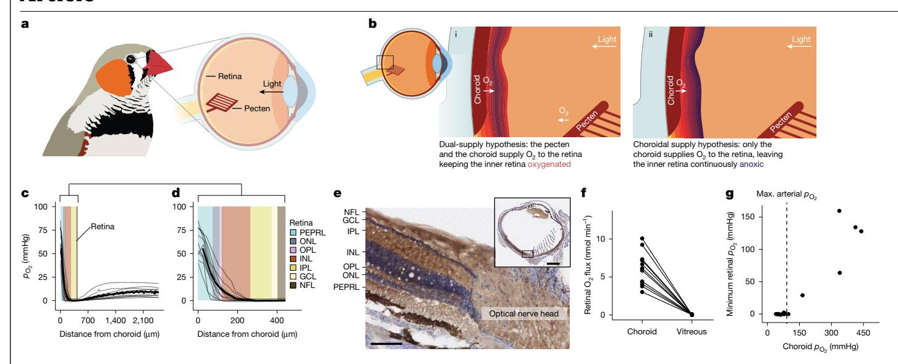

Fig. 1 | Oxygen diffusion dynamics in the bird retina. a, The pecten oculi is a vascular structure in the vitreous humour of the bird eye. b, Contrasting hypotheses of the pecten contributing (i) or not contributing (ii) to retinal oxygen supply.  $\mathbf{c}$ , Individual (faded lines) and mean (solid line) whole-eye  $p_{02}$ profiles show a steep oxygen diffusion gradient from the choroid and a shallow gradient from the pecten. The coloured boxes are the averaged thicknesses of each retinal layer. GCL, ganglion cell layer; INL/IPL, inner nuclear/plexiform layer; NFL, nerve fibre layer; ONL/OPL, outer nuclear/plexiform layer; PEPRL, pigment epithelium and photoreceptor layer.  ${\bf d}$ , Retinal  $p_{02}$  profiles show

plexiform and the ganglion cell layers. e, The tissue hypoxia marker pimonidazole (brown) accumulates more in the inner retina than in the vascularized optical nerve head. Nuclei are stained blue. n = 5. Scale bars, 100  $\mu$ m (main image) and 2 mm (inset). f, Oxygen diffusion flux model shows much less retinal O2 flux from the pecten compared with the choroid. g, Experimental increase in blood oxygen increases inner retinal  $p_{02}$  above anoxia (measured in the inner plexiform and ganglion cell layer), but only when 50% above maximal arterial  $p_{02}$  of normoxic conditions.

anoxia in the inner retinal layers, including complete anoxia in the inner

present and test an alternative hypothesis (Fig. 1b (ii)): the pecten does not contribute to retinal oxygen supply and, consequently, the bird retina has overcome its diffusional oxygen supply limitation by evolving tolerance to continuous tissue anoxia.

#### The bird retina operates in anoxia

We measured the  $p_{0}$ , through the eyes of anaesthetized zebra finches (*Taeniopygia guttata*) with  $p_{O_2}$ -sensitive microsensors placed on an automated micromanipulator2930 (Methods). The  $p_{O_2}$  profiles measured during ventilation with normoxic air (inspiratory  $p_{02} \approx 159 \text{ mmHg}$ ) show a steeply declining  $p_{02}$  gradient from the choroid through the retina, resulting in full anoxia in the inner retina (Fig. 1c,d). Mapping our experimentally measured  $p_{\Omega_2}$  profiles onto the retinal morphology in finches reveals an oxygen gradient from normoxia to hypoxia in the photoreceptor layer. This high photoreceptor oxygen consumption leads to anoxia in the inner plexiform, ganglion cell and nerve fibre layers (Fig. 1d). This finding is corroborated by an accumulation of pimonidazole, a marker of tissue hypoxia31, in the inner retina compared with in the more oxygenated photoreceptor layer and optical nerve head (Fig. 1e).

Furthermore, the  $p_{0}$ , profiles enable us to model oxygen diffusion rates from the pecten and choroid (Methods). This model suggests that, during ventilation with normoxic air, the pecten provides much less oxygen flux to the retina  $(0.037 \text{ nmol min}^{-1}, \text{s.d.} = 0.031, n = 11)$  than the choroid (6.2 nmol min-1, s.d. = 2.2, n = 11;  $t_{10} = 9.0$ , P < 0.001, paired t-test), contributing only 0.76% (s.d. = 0.75, n = 11) of the total retinal oxygen supply (Fig. 1c,d,f), which is visually observed as a steeper oxygen diffusion gradient to the retina from the choroid compared with the gradient from the vitreous humour (Fig. 1c). To test whether inner retinal anoxia is a consequence of an oxygen diffusion limitation, we experimentally raised the systemic and, therefore, choroidal  $p_{0}$ , by ventilation with pure  $O_2$  (inspiratory  $p_{O_2} \approx 760$  mmHg; Methods). These data show that the inner retina remains fully anoxic until the choroid  $p_{0_2}$  exceeds around 150 mmHg, which is 50% higher than the maximal arterial  $p_{02}$  of around 100 mmHg in normoxic birds32,33 (Fig. 1g), suggesting that the inner retina must be anoxic under all normal physiological conditions.

Together, our data show that oxygen diffusion limits the retinal oxygen supply and that the inner retina of zebra finches is fully anoxic under normal physiological conditions. In conclusion, we provide data against the prevailing hypothesis. Our data indicate that the pecten does not function as the primary oxygen supplier to the avian retina, resulting in inner retinal anoxia.

#### Anaerobic glycolytic energy metabolism

Having identified chronic anoxia in the retina, we next sought to identify by what pathways retinal cells are still able to produce energy over an extreme oxygen gradient from full oxygenation to anoxia. We first used spatial transcriptomics34 to measure the tissue distribution of transcripts associated with metabolic energy production, and subsequently superimposed the retinal oxygen distribution onto the same tissue images to link whole-transcriptome gene expression to tissue oxygenation (Fig. 2a). Mapping the aggregated expression scores of genes associated with major energy-producing metabolic pathways on the tissue sections showed that genes involved in glycolysis had elevated expression scores in the anoxic inner retinal layers compared to oxygenated outer retinal layers (Fig. 2b). Consistently, genes associated with oxidative phosphorylation and β-oxidation of fatty acids had low expression scores in the anoxic inner retina compared with the oxygenated outer retina (Fig. 2c,d). Moreover, glycolysis expression scores showed a strong negative correlation with modelled retinal  $p_{O_2}$  ( $F_{1,940} = 752$ , P < 0.001, adjusted  $R^2$  ( $R_{adj}^2$ ) = 0.44, linear model; Fig. 2e), and a positive correlation was observed for oxidative phosphorylation scores ( $F_{1,940} = 337, P < 0.001, R_{adj}^2 = 0.26,$ linear model; Fig. 2f) and  $\beta$ -oxidation of fatty acids ( $F_{1,940} = 611$ , P < 0.001,  $R_{\text{adi}}^2 = 0.39$ , linear model; Fig. 2g). These high glycolysis scores in the anoxic inner retina indicate that anaerobic glycolysis fuels inner retinal ATP production.

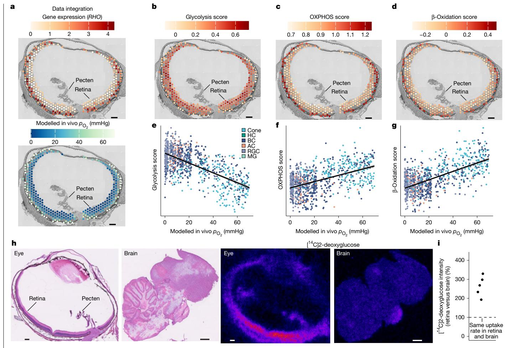

Fig. 2 | Anaerobic glycolysis in the inner, anoxic bird retina. a, Spatial gene expression (n = 4) as exemplified with RHO (rhodopsin) expression, which is exclusive to the outer retina, and models of in vivo  $p_{02}$  were integrated to link whole-transcriptome gene expression to tissue oxygenation. Expression levels represent unitless variance-stabilized expression values, adjusted for sequencing depth across spots. b-g, Tissue mapping of aggregated gene expression scores for genes associated with glycolysis (b), oxidative phosphorylation (OXPHOS;  $\mathbf{c}$ ) and fatty acid degradation ( $\beta$ -oxidation;  $\mathbf{d}$ ) that are linked to the modelled tissue  $p_{02}$  ( ${\bf e}$ ,  ${\bf f}$  and  ${\bf g}$ , respectively). Pathway scores

are unitless enrichment scores calculated from the average expression of all genes in a pathway relative to a set of randomly selected control genes. For  $\mathbf{e} - \mathbf{g}$ , the points represent individual gene expression spots. For **a-d**, scale bars, 250 µm. AC, amacrine cells; BC, bipolar cells; HC, horizontal cells; MG, Müller glia cells; RGC, retinal ganglion cells. h,i, Spatial map of radiolabelled 2-deoxyglucose uptake shows higher glucose uptake in the retina compared with in the brain. Imaging (**h**) and quantification (**i**) are shown. n = 5. Scale bars, 250 µm (columns 1 and 3) and 1 mm (columns 2 and 4).

However, an alternative interpretation of these findings is that glycolysis provides intermediates for the pentose phosphate pathway that produces NADPH to fuel antioxidant systems. However, in contrast to the high glycolysis scores in the inner retina, we do not find similar spatial division between the inner and outer retina in the expression of genes involved in the pentose phosphate pathway or the major antioxidant systems (Extended Data Fig. 2). Together, these findings further indicate that the anoxic inner retina relies on anaerobic glycolysis to fuel ATP production in the bird retina.

Given the sparse ATP yield from anaerobic glycolysis, retinal tissue must take up glucose at a high rate to support the retinal ATP demand. Yet, just as with retinal oxygen diffusion, retinal glucose supply is also constrained by a lack of internal blood vessels. To assess whether the retina indeed takes up glucose and at an elevated rate, we systemically injected zebra finches with [14C]2-deoxyglucose and mapped its distribution in the brain and retina using autoradiography (Fig. 2h). The retina indeed takes up glucose and has  $2.56 \pm 0.17$  times higher area-specific [14C]2-deoxyglucose accumulation compared with the mean uptake in whole midsagittal brain tissue sections ( $t_4$  = 8.92, P = 0.00172, paired t-test; Fig. 2i). Together, the inner retinal anoxia, antioxidant-independent glycolytic gene expression and high retinal glucose uptake rates suggest that anaerobic glycolysis fuels ATP production in the retina, which seems to be sustained by high rates of glucose supply, despite its lack of internal blood vessels.

#### Metabolite exchange in the pecten

We next sought to identify the mechanisms by which (1) the retina is supplied with glucose and (2) lactic acid is removed, both essential to energy and pH homeostasis during anaerobic metabolism. From the spatial transcriptome data, we identify that the gene encoding glucose transporter 1 (GLUT1, also known as SLC2A1), which is known to facilitate transmembrane glucose transport35, is highly expressed in the pecten compared to the retina ( $log_2[fold change(FC)] = 2.09$ ; Fig. 3a-c). We measured a trans-pecten glucose concentration difference from 25.9 mM (s.d. = 2.64, n = 7) in the blood plasma to 14.9 mM (s.d. = 3.44, n = 7) in the eye's vitreous humour ( $t_6 = 8.45$ , P < 0.001, paired t-test; Fig. 3d). The high GLUT1 expression and the glucose concentration gradient indicate that the pecten facilitates glucose transport from the blood to the vitreous humour through GLUT1 and that the vitreous humour seems to function as a glucose reservoir for the glycolytic inner retina.

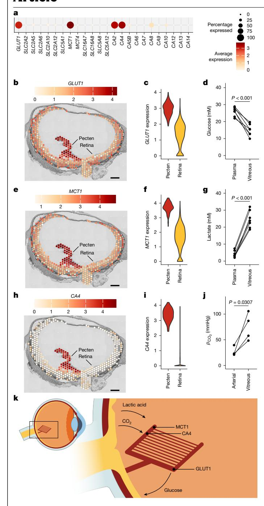

**Fig. 3 | Metabolite and CO2 exchange of the pecten. a**, Comparative expression analysis of glucose and lactate transporters as well as carbonic anhydrases in the pecten shows high expression of *GLUT1*, *MCT1*, *CA2* and *CA4* in the pecten. *n* = 4. **b**,**c**,**e**,**f**,**h**,**i**, Specifically, the expression of the glucose transporter *GLUT1* (**b**,**c**), the high-affinity monocarboxylate transporter *MCT1* (**e**,**f**) and extracellular carbonic anhydrase *CA4* (**h**,**i**) is higher in the pecten than in the retina. Imaging (**b**,**e**,**h**) and quantification (**c**,**f**,**i**) are shown. **d**,**g**,**j**, Trans-pecten gradients of glucose (**d**), lactate (**g**) and CO2 (**j**) show glucose, lactate and CO2 diffusion across the pecten. Connected points represent values from individual animals, and differences in mean values were tested using two-sided paired *t*-tests (glucose: *t*6 = 8.45, *P* = 1.5 × 10−4, *n* = 7; lactate: *t*6 = 14.7, *P* = 6.17 × 10−6, *n* = 7; CO2: *t*3 = 3.86, *P* = 0.0307, *n* = 4). **k**, Model for the exchange of glucose, lactic acid and CO2 between the blood and retina through the proteins lining the pecten. Expression levels represent unitless variance-stabilized expression values, adjusted for sequencing depth across spots. Scale bars, 250 µm.

Moreover, the gene encoding monocarboxylate transporter 1 (*MCT1*, also known as *SLC16A1*)—a high-affinity proton-linked lactate symporter[36—](#page-6-30)is highly expressed in the pecten compared with in the retina (log2[FC] = 2.70; Fig. [3a,e,f](#page-3-0)), and the lactate concentration was much higher in the vitreous humour (24.6 mM, s.d. = 5.03, *n* = 7) than in the blood plasma (4.20 mM, s.d. = 1.95, *n* = 7; *t*6 = 14.7, *P* < 0.001, paired *t*-test; Fig. [3g](#page-3-0)). Together, these findings indicate that lactic acid is released from the retina into the vitreous and subsequently transported to the blood through MCT1 transporters in the pecten. Finally, we documented a strong expression of *CA4* in the pecten (log2[FC] = 6.30; Fig. [3a,h,i\)](#page-3-0), and the partial pressure of CO2 (*p*CO2 ) was higher in the vitreous humour (74.7 mmHg, s.d. = 26.4, *n* = 4) than in the arterial blood (26.6 mmHg, s.d. = 8.67, *n* = 4; *t*3 = 3.86, *P* = 0.0307, paired *t*-test; Fig. [3j](#page-3-0)), indicating a role of the pecten in ocular CO2 removal.

Collectively, these data indicate that the pecten provides metabolic support for anaerobic metabolism to the anoxic inner retina and serves as a reverse exchanger of glucose, lactic acid and CO2 between the retina and the blood (Fig. [3k](#page-3-0)).

### **Müller-cell-mediated metabolite exchange**

Our results establish the extraordinary contribution of pecten to retinal glucose supply, and the pronounced ability of the retina to take up glucose despite its lack of intraretinal vessels for blood perfusion. However, these data do not reveal how glucose and lactic acid are exchanged between the vitreous and retina, where the internal limiting membrane may impose a diffusion barrier for vitreoretinal exchange[37](#page-6-31). To identify whether potential retinal cell types could enable this exchange, we generated a single-cell transcriptome atlas of the adult zebra finch retina (*n* = 6 animals, 40,496 cells; Extended Data Fig. 3). We show a distinct expression pattern of key metabolite transporters between retinal neurons and Müller cells (Fig. [4a](#page-4-0)) that are specialized glial cells, with end-feet within the internal limiting membrane. Retinal neurons ubiquitously express *MCT4* (also known as *SLC16A3*)—a low affinity proton-linked lactate symporter, likely to support lactic acid removal but the expression is lower in Müller cells (log2[FC] = −0.76; Fig. [4a\)](#page-4-0). In contrast to retinal neurons, Müller cells highly express both *MCT1* and *GLUT1* (log2[FC] = 7.3 and 3.0, respectively; Fig. [4a](#page-4-0)). Cross-species analysis of metabolite transporters across published single-cell datasets shows that the dual high expression of *MCT1* and *GLUT1* is confined to birds (Extended Data Fig. 4). Immunolabelling supports the high expression of both proteins in zebra finch Müller cells (visualized by vimentin; Extended Data Figs. 5 and 6). Both proteins are highly abundant in the Müller cell end-feet (Fig. [4b,c\)](#page-4-0). Finally, two key genes in gluconeogenesis (phosphoenolpyruvate carboxykinase (*PCK1*) and fructose-1,6-bisphosphatase (*FBP1*)) displayed low expression across retinal cell types (Fig. [4a](#page-4-0)).

Based on their characteristic gene-expression profile and the localized abundance of MCT1 and GLUT1 in Müller cell end-feet (Fig. [4a–c\)](#page-4-0), we propose that these cellular processes constitute a glycolysis metabolite exchange surface at the interface between the retina and the vitreous (Fig. [4d,e\)](#page-4-0). Owing to concentration gradients between the two compartments, the end-feet positioned at the vitreoretinal boundary probably enable transcellular transport of glucose from the vitreous into the Müller cells, likely by involving GLUT1, and lactic acid from the Müller cells outward to the vitreous, probably by involving MCT1. On the retinal side of the inner limiting membrane, the inner retinal neurons will use glucose and produce lactic acid, which is expected to lead to strong concentration gradients in the opposite direction as seen from the Müller cell perspective. We therefore suggest that the Müller cells mediate glucose supply to and lactic acid removal from the retinal extracellular fluid driven by concentration gradients of the two metabolites and involving MCT1 and GLUT1. Consistent with this transport role, Müller cells lack the expression of key gluconeogenic enzymes, suggesting that these cells do not synthesize glucose

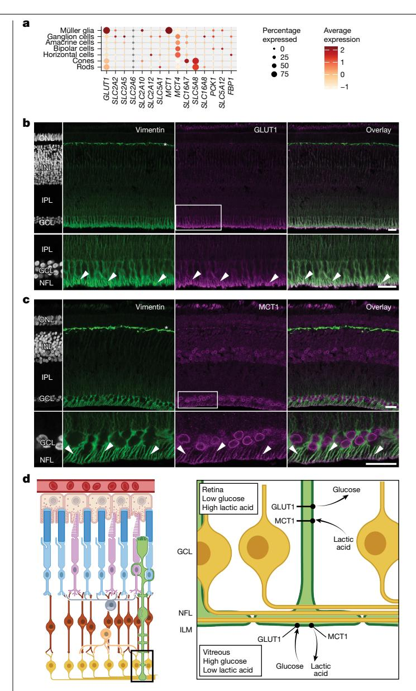

Fig. 4 | Müller-cell-mediated nutrient exchange. a, Single-cell atlas of the zebra finch retina (n = 6), showing expression of MCT4 across all cell types and high expression of GLUT1 and MCT1 in Müller cells. b,c, Immunolabelling confirms GLUT1 (b) and MCT1 (c) abundance in Müller cells, labelled by vimentin, with strong localization in the end-feet (arrowheads) (n = 2). Note that vimentin antibodies also labelled potential horizontal cell processes (asterisks), while MCT1 antibodies showed additional labelling of cell nuclei (see also Extended Data Fig. 6). The areas marked by rectangles are shown at a higher magnification. Scale bars, 20 μm. d, Suggested mechanism for Müller-cell-mediated nutrient exchange, whereby transcellular glucose and lactic acid transport through Müller cells driven by metabolite gradients connects retinal anaerobic glycolysis to pecten oculi nutrient exchange. ILM, inner limiting membrane.

from lactate. Considering all evidence at present, we propose that the Müller cells mediate the co-exchange of glucose and lactic acid to support anaerobic glycolysis in the anoxic inner retina, therefore linking pecten nutrient exchange to anaerobic glycolysis in the inner retina.

#### **Evolution of retinal anoxia tolerance**

We next examined the evolutionary origin of retinal anoxia tolerance and performed retinal  $p_{0_2}$  measurements in all major clades of non-avian reptiles (lizards, turtles and crocodiles), chickens (representing the Galloanseres that diverged from the rest of birds 90 million years ago) and pigeons (Columbimorpha) in addition to zebra finches (Australaves)38. This comparative analysis shows that, across the avian clades, only 0.75-5.1% of the total retinal oxygen flux originates from the pecten and that 34-57% of the retina is severely hypoxic  $(p_{0s} < 5 \text{ mmHg})$  (Fig. 5a-c). In contrast to birds, retinal anoxia was not found in non-avian reptiles, where the choroidal oxygen supply was sufficient to maintain retinal oxygenation (Fig. 5a). The most parsimonious explanation is that retinal anoxia tolerance originated in the crown group of birds after the divergence from crocodiles (Fig. 5e). Notably, the thickening of the retina co-occurred in the same phylogenetic interval and seems to have evolved through higher photoreceptor and ganglion cell densities in the retina. Together, these data suggest co-evolution of retinal anoxia tolerance and thick, cell-dense retina in the crown group of birds.

If retinal anoxia tolerance had already evolved in the most recent common ancestor of extant birds, we predict similar molecular mechanisms of retinal energy metabolism and nutrient supply in all extant bird species and that they are different compared with those of the reptiles. To test this prediction, we extended the zebra finch spatial transcriptomics analysis to the eyes of chickens (Gallus gallus), pigeons (Columba livia) and anoles (Anolis carolinensis). Integration of the four datasets suggests that the pecten oculi and the conus papillaris have similar gene expression profiles (Extended Data Fig. 7), indicating similar evolutionary ancestry. The pecten within the eyes of these bird species also highly express GLUT1, MCT1 and CA4 for glucose supply and removal of lactic acid and CO2 compared with the retina (Extended Data Fig. 8), but only CA4 was upregulated in the conus papillaris compared with in the retina in the anole. These comparative data on in vivo retinal oxygen level and tissue transcript distribution in birds and reptiles make anoxia tolerance a common trait among birds, supported by the development of enhanced nutrient exchange capacity of the conus/ pecten structure in early bird evolution.

#### Discussion

Our study reveals an impressive anoxia tolerance in the inner bird retina. Our findings are interesting, as neural tissues of warm-blooded animals are generally considered to be highly vulnerable in anoxia, rapidly leading to cellular dysfunction, which is a key factor limiting general cellular performance and tissue resilience against insufficient gas exchange1-4. The anoxic phenotype of the inner bird retina differs substantially from that of organisms adapted to survive periodic environmental anoxia, where the impaired oxygen uptake is expected to result in anoxia in all tissues for a restricted period (for example, submerged, overwintering turtles and crucian carp or subterranean naked mole rats). In birds, it is solely the inner retina that is anoxic, where the necessary exchange of glycolytic substrates and anaerobic end products is achieved through supply and clearance through other oxygenated tissues in the body.

We show that the key ocular tissue facilitating the critical exchange of metabolites to the retina is almost certainly the pecten oculi. Until now, the function of this tissue has been highly debated, and the competing hypotheses regarding its function have had little support from direct experimental measurements5-9,16. Our direct assessment of the function of the pecten enables us to confidently reject the hypothesis that the pecten provides sufficient retinal oxygen supply to maintain retinal oxygenation39-43. Instead, our results suggest that the pecten probably exchanges metabolites between the blood and the vitreous humour of the eye to support the high glycolytic activity of the anoxic inner retina. We further propose that the Müller cell end-feet function as a vitreoretinal exchange surface, probably mediating the exchange of glucose and lactic acid between the retina and the pecten. Our data further suggest that the pecten participates in ocular CO2 removal based on the elevated vitreous  $p_{CO_2}$ , which is not found in mammals44, and the expression of extracellular membrane-bound carbonic

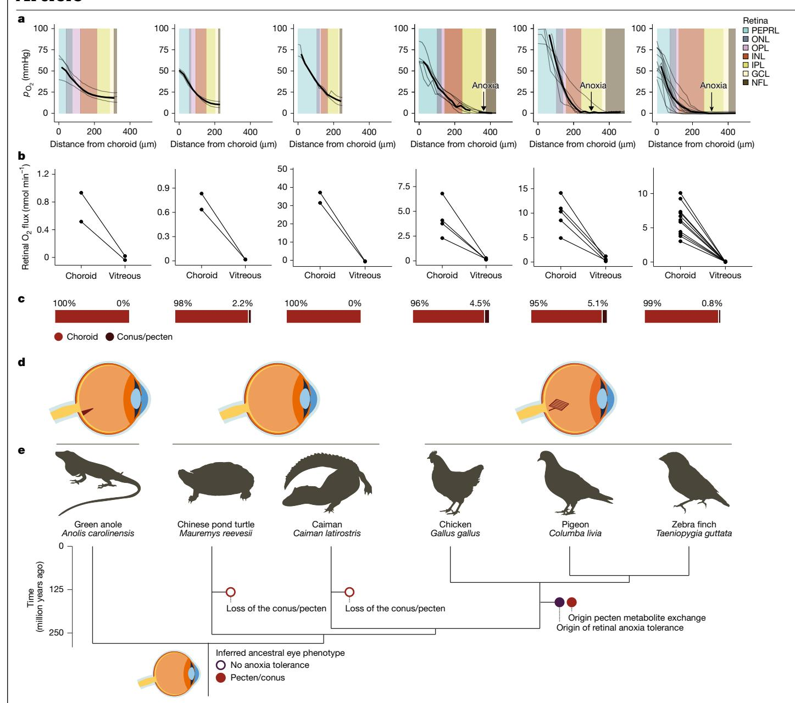

Fig. 5 | Co-evolution of retinal anoxia tolerance and morphology. a,  $p_{\rm O_2}$  profiling in the retina mapped onto retinal morphology with annotations of retinal cell layers shows anoxia in the inner retina of birds but not reptiles. b,c, The vast majority of retinal  $\rm O_2$  comes from the choroid irrespective of the absence or presence of a conus or pecten, visualized as absolute (eye-size

dependent) values ( $\mathbf{b}$ ) and averaged, fractional (eye-size independent) values ( $\mathbf{c}$ ).  $\mathbf{d}$ ,  $\mathbf{e}$ , Sampled species ( $\mathbf{e}$ ), including their ocular phenotype ( $\mathbf{d}$ ) and phylogenetic relationship. The phylogenetic tree is annotated with the most parsimonious model for reptile eye evolution, showing co-evolution of retinal anoxia tolerance, the pecten and a thick retina in a common ancestor of extant birds.

anhydrase 4. These findings indicate that photoreceptor aerobic metabolism releases some  $CO_2$  into the vitreous humour, from which it is then taken up by the blood across the pecten. The role of the pecten in ocular pH-regulation through  $CO_2$  and lactic acid removal is supported by a 0.21 reduction in intraocular pH after pecten ablation in chicken  $^{45}$ . These essential functions of the pecten in nutrient and pH homeostasis are probably the main explanations for why the pecten is present in the eyes of all bird species, despite its obvious disadvantages of blocking incoming light to the photoreceptors located beneath it. Electrophysiological recordings of retinal function during pharmacological manipulations of ocular metabolite levels to further investigate the effect of pecten nutrient exchange on retinal function should be performed in the near future.

Retinal anoxia tolerance also helps explain how retinal function and vision can be maintained during high-altitude migration in birds. While

systemic tissues receive increased blood flow during high-altitude hypoxia, the inner avascular bird retina cannot recruit additional capillaries and relies solely on simple diffusion from the choroid. However, arterial  $p_{\rm O_2}$  drops by 73% at the extreme altitudes encountered during some bird migration, leading to an expected proportional reduction in the retina's oxygen diffusion gradient27. Thus, the origin of retinal anoxia tolerance in early bird evolution most likely served as an exaptation for maintaining retinal function and avoiding retinal cell death during hypobaric hypoxia, crucial for high-altitude migrations.

Our data show that anoxia tolerance is present in the three sampled bird species, but we find no indications of this in non-avian reptiles. We also show that the expression of metabolite transporters in the pecten is similar across the sampled bird species. Thus, retinal anoxia tolerance most likely originated in the phylogenetic interval leading to extant birds after the split from the ancestors of crocodiles and may

therefore already have been present in dinosaurs. Furthermore, the gene expression profile of the anole conus is similar to the bird pecten but lacks the strong expression of key glycolysis-related metabolite transporters. Thus, if the anole conus represents the ancestral phenotype of the conus/pecten structure, our data suggest that it was originally a vitreal extension of the choroid that later coopted into nutrient exchange in the crown group of extant birds. Thus, anoxia tolerance and the pecten's metabolic function were most likely in place before the extensive radiation of the major clades of birds after the Cretaceous–Paleogene extinction event more than 66 million years ago[38](#page-6-32).

#### **Online content**

Any methods, additional references, Nature Portfolio reporting summaries, source data, extended data, supplementary information, acknowledgements, peer review information; details of author contributions and competing interests; and statements of data and code availability are available at [https://doi.org/10.1038/s41586-025-09978-w.](https://doi.org/10.1038/s41586-025-09978-w)

- 1. Erecińska, M. & Silver, I. A. Tissue oxygen tension and brain sensitivity to hypoxia. *Respir. Physiol.* **128**, 263–276 (2001).
- 2. Tuo, Q. Z., Zhang, S. T. & Lei, P. Mechanisms of neuronal cell death in ischemic stroke and their therapeutic implications. *Med. Res. Rev.* **42**, 259–305 (2022).
- 3. Radak, D. et al. Apoptosis and acute brain ischemia in ischemic stroke. *Curr. Vasc. Pharmacol.* **15**, 115–122 (2017).
- 4. Lipton, P. Ischemic cell death in brain neurons. *Physiol. Rev.* **79**, 1431–1568 (1999).
- 5. Meyer, D. B. in *The Visual System in Vertebrates. Handbook of Sensory Physiology* Vol. 7 (ed. Crescitelli, F.) (Springer, 1977).
- 6. Walls, G. L. *The Vertebrate Eye and its Adaptive Radiation* (Cranbrook Institute of Science, 1942).
- 7. Mann, I. C. The function of the pecten. *Br. J. Ophthalmol.* **8**, 209 (1924).
- 8. Brach, V. The functional significance of the avian pecten: a review. *Condor* **79**, 321–327 (1977).
- 9. Borrichius, O. & Coringius, H. *Hermetis, Ægyptiorum, et Chemicorum Sapientia* (Petri Hauboldi, 1674).
- 10. Caprara, C. & Grimm, C. From oxygen to erythropoietin: relevance of hypoxia for retinal development, health and disease. *Prog. Retin. Eye Res.* **31**, 89–119 (2012).
- 11. Kaur, C., Foulds, W. S. & Ling, E.-A. Hypoxia-ischemia and retinal ganglion cell damage. *Clin. Ophthalmol.* **2**, 879–889 (2008).
- 12. Park, T. J. et al. Fructose-driven glycolysis supports anoxia resistance in the naked mole-rat. *Science* **356**, 307–311 (2017).
- 13. Ames, A. III Energy requirements of CNS cells as related to their function and to their vulnerability to ischemia: a commentary based on studies on retina. *Can. J. Physiol. Pharmacol.* **70**, S158–S164 (1992).
- 14. Nickla, D. L. & Wallman, J. The multifunctional choroid. *Prog. Retin. Eye Res.* **29**, 144–168 (2010).
- 15. Country, M. W. Retinal metabolism: a comparative look at energetics in the retina. *Brain Res.* **1672**, 50–57 (2017).
- 16. Damsgaard, C. & Country, M. W. The opto-respiratory compromise: balancing oxygen supply and light transmittance in the retina. *Physiology* **37**, 101–113 (2022).
- 17. Franze, K. et al. Muller cells are living optical fibers in the vertebrate retina. *Proc. Natl. Acad. Sci. USA* **104**, 8287–8292 (2007). 18. Chase, J. The evolution of retinal vascularization in mammals: a comparison of vascular
- and avascular retinae. *Ophthalmology* **89**, 1518–1525 (1982).
- 19. Damsgaard, C. et al. Retinal oxygen supply shaped the functional evolution of the vertebrate eye. *eLife* **8**, e52153 (2019).
- 20. Buttery, R. G., Hinrichsen, C. F. L., Weller, W. L. & Haight, J. R. How thick should a retina be? A comparative study of mammalian species with and without intraretinal vasculature. *Vis. Res.* **31**, 169–187 (1991).

- 21. Tommasini, D., Yoshimatsu, T., Puthussery, T., Baden, T. & Shekhar, K. Comparative transcriptomic insights into the evolution of vertebrate photoreceptor types. *Curr. Biol.* **35**, 2228–2239 (2025).
- 22. Hurley, J. B. Retina metabolism and metabolism in the pigmented epithelium: a busy intersection. *Ann. Rev. Vis. Sci.* **7**, 665–692 (2021).
- 23. Potier, S., Mitkus, M. & Kelber, A. Visual adaptations of diurnal and nocturnal raptors. *Semin. Cell Dev. Biol.* **106**, 116–126 (2020).
- 24. Dollery, C. T., Bulpitt, C. J. & Kohner, E. M. Oxygen supply to the retina from the retinal and choroidal circulations at normal and increased arterial oxygen tensions. *Invest. Ophthalmol. Vis. Sci.* **8**, 588–594 (1969).
- 25. Pawlik, G., Rackl, A. & Bing, R. J. Quantitative capillary topography and blood flow in the cerebral cortex of cats: an in vivo microscopic study. *Brain Res.* **208**, 35–58 (1981).
- 26. Isaacs, K. R., Anderson, B. J., Alcantara, A. A., Black, J. E. & Greenough, W. T. Exercise and the brain: angiogenesis in the adult rat cerebellum after vigorous physical activity and motor skill learning. *J. Cereb. Blood Flow Metab.* **12**, 110–119 (1992).
- 27. Black, C. P. & Tenney, S. M. Oxygen transport during progressive hypoxia in high-altitude and sea-level waterfowl. *Respir. Physiol.* **39**, 217–239 (1980).
- 28. Christensen, N. K., Beedholm, K. & Damsgaard, C. Short communication: maintained visual performance in birds under high altitude hypoxia. *Comp. Biochem. Physiol. A* **296**, 111691 (2024).
- 29. Linsenmeier, R. A. & Braun, R. D. Oxygen distribution and consumption in the cat retina during normoxia and hypoxemia. *J. Gen. Physiol.* **99**, 177–197 (1992).
- 30. Yu, D.-Y., Cringle, S. J., Alder, V. A., Su, E. & Yu, P. K. Intraretinal oxygen distribution and choroidal regulation in the avascular retina of guinea pigs. *Am. J. Physiol.* **270**, H965–H973 (1996).
- 31. Raleigh, J. A. et al. Hypoxia and vascular endothelial growth factor expression in human squamous cell carcinomas using pimonidazole as a hypoxia marker. *Cancer Res.* **58**, 3765–3768 (1998).
- 32. Butler, P. & Taylor, E. Responses of the respiratory and cardiovascular systems of chickens and pigeons to changes in PaO2 and PaCO2. *Respir. Physiol.* **21**, 351–363 (1974).
- 33. Shams, H. & Scheid, P. Respiration and blood gases in the duck exposed to normocapnic and hypercapnic hypoxia. *Respir. Physiol.* **67**, 1–12 (1987).
- 34. Stahl, P. L. et al. Visualization and analysis of gene expression in tissue sections by spatial transcriptomics. *Science* **353**, 78–82 (2016).
- 35. Mueckler, M. & Thorens, B. The SLC2 (GLUT) family of membrane transporters. *Mol. Aspects Med.* **34**, 121–138 (2013).
- 36. Halestrap, A. P. The SLC16 gene family–structure, role and regulation in health and disease. *Mol. Aspects Med.* **34**, 337–349 (2013).
- 37. Peynshaert, K., Devoldere, J., Minnaert, A.-K., De Smedt, S. C. & Remaut, K. Morphology and composition of the inner limiting membrane: species-specific variations and relevance toward drug delivery research. *Curr. Eye Res.* **44**, 465–475 (2019).
- 38. Stiller, J. et al. Complexity of avian evolution revealed by family-level genomes. *Nature* **629**, 851–860 (2024).
- 39. Mann, I. C. On the development of the fissural and associated regions in the eye of the chick, with some observations on the mammal. *J. Anat.* **55**, 113 (1921).
- 40. Wingstrand, K. G. & Munk, O. *The Pecten Oculi of the Pigeon with Particular Regard to its Function* (Kommissionaer: Munksgaard, 1965).
- 41. Jasiński, A. Fine structure of capillaries in the pecten oculi of the sparrow, *Passer domesticus*. *Zeitschr. Zellforsch. Mikrosk. Anat.* **146**, 281–292 (1973).
- 42. Kauth, H. & Sommer, H. The ferment carbonic anhydrase in the animal body. IV. On the function of the pecten in the bird's eye. *Biol. Zbl* **72**, 196–209 (1953).
- 43. Pettigrew, J. D., Wallman, J. & Wildsoet, C. F. Saccadic oscillations facilitate ocular perfusion from the avian pecten. *Nature* **343**, 362–363 (1990).
- 44. Davson, H. & Luck, C. A comparative study of the total carbon dioxide in the ocular fluids, cerebrospinal fluid, and plasma of some mammalian species. *J. Physiol.* **132**, 454 (1956).
- 45. Brach, V. The effect of intraocular ablation of the pecten oculi of the chicken. *Invest. Ophthalmol. Vis. Sci.* **14**, 166–168 (1975).

**Publisher's note** Springer Nature remains neutral with regard to jurisdictional claims in published maps and institutional affiliations.

Springer Nature or its licensor (e.g. a society or other partner) holds exclusive rights to this article under a publishing agreement with the author(s) or other rightsholder(s); author self-archiving of the accepted manuscript version of this article is solely governed by the terms of such publishing agreement and applicable law.

© The Author(s), under exclusive licence to Springer Nature Limited 2026

### Methods

#### Animals and housing

All animals, except for the ones used at the University of Oldenburg (Germany), were purchased from local dealers and housed at Aarhus University (Denmark) for at least 7 days before experimentation at a 12 h-12 h light-dark cycle at 25-28 °C. All animals had ad libitum access to water. Non-avian reptiles were fed 2-3 times weekly. Birds had ad libitum access to food. Anoles were given vitamin supplements weekly.

Adult, mix-sex common pigeons (C. livia), domestic fowls (G. gallus) and zebra finches (T. guttata) were housed in a birdcage with conspecifics ( $h \times w \times l = 2 \times 1 \times 2 \text{ m}^3$ ), green anoles (A. carolinensis) in a terrarium with hiding material ( $0.9 \times 0.5 \times 0.5 \text{ m}^3$ ), Chinese pond turtles (Maure-mys reevesii) in an aquarium ( $0.5 \times 0.5 \times 1 \text{ m}^3$ ) with a basking platform and a heat lamp and broad-snouted caimans ( $Caiman \ latirostris$ ) were housed in an aquaria ( $1 \times 1 \times 1 \text{ m}^3$ ) with a dry basking platform.

All animal procedures were performed with permission from the Danish Inspectorate for Animal Experimentation within the Danish Ministry of Food, Agriculture, and Fisheries, Danish Veterinary and Food Administration (permit numbers 2019-15-0201-00288 and 2022-15-0201-01278).

Zebra finches used for GLUT1 and MCT1 immunostaining were bred in the indoor animal facility of the University of Oldenburg under the natural photoperiod with ad libitum access to food and water. All of the animal procedures were performed in accordance with local, national and EU guidelines for the use of animals in research and were approved by the Animal Care and Use Committees of the Niedersächsisches Landesamt für Verbraucherschutz und Lebensmittelsicherheit (Oldenburg, Germany).

#### Retinal gas profiling in birds and reptiles

Anaesthesia was induced by placing the animals in a plastic cylinder receiving a constant flow of air mixed with isoflurane. When the animal lost its righting reflex, a drop of lidocaine was placed on the glottis, and the animal was intubated, connected to intermittent positive pressure mechanical ventilation (SAV04 ventilator, Vetronics), and ventilated at species-specific minute ventilation with air mixed with isoflurane. These are anaesthetic conditions previously shown to produce normal electroretinograms in birds46. Blood oxygen saturation (Animal Oximeter Pod, AD Instruments) and end-expiratory  $p_{CO_2}$  (Harvard Apparatus) were recorded on Powerlab 16/35 using LabChart (AD Instruments). The core body temperature was regulated using a heating pad connected to a homeothermic controller with rectal feedback. The depth of anaesthesia was confirmed by the absence of nociceptive withdrawal reflexes through toe pinch approximately every 15 min. Turtles were premedicated with 2 mg kg-1 atropine in PBS intraperitoneally to minimize the large intraventricular right-to-left shunt present under isoflurane anaesthesia in chelonians47-49. This ensured stable isoflurane anaesthesia and stable cardiac shunts, such that choroidal  $p_{0}$ , reflected inspired  $p_{0}$ , rather than being affected by a variable and large cardiac shunt. Anaesthesia parameters are provided in Extended

With the head in lateral recumbency, lidocaine was placed on the eye to provide local anaesthesia and therefore analgesia. A needle was used to make a small puncture in the cornea and iris, ventral to the horizontal midline, after which an oxygen microsensor (Unisense), with a tip diameter of  $10-25~\mu m$ , was inserted through the corneal and iridial punctures to enter the vitreous of the eye. Then, using a motor-controlled micromanipulator (Zeiss) $^{50}$ , the microsensor penetrated the vitreous and the retina in steps of  $10-25~\mu m$ , depending on the oxygen microsensor diameter, with a measuring period of 1~s, while  $p_{02}$  was recorded at each step using Sensor Trace Suite (Unisense). Recordings were performed in the vitreal-to-choroidal direction only to avoid retinal detachment on retraction. The microsensor was two-point calibrated in a solution of  $20~g~l^{-1}$  sodium ascorbate in 0.1~mM

sodium hydroxide for a zero reference and in water bubbled with air for an atmospheric  $p_{\mathrm{O}_2}$  value at core body temperature. The validity of the zero reference was confirmed in the birds where the  $p_{\mathrm{O}_2}$  profile flatlined in the retina, that is, the  $p_{\mathrm{O}_2}$  gradient was zero, de facto representing anoxia. The median  $p_{\mathrm{O}_2}$  within flatlined segments of the  $p_{\mathrm{O}_2}$  profiles was 0.3 mmHg (range –1.0 to 3.9 mmHg), representing strong accuracy of the oxygen microsensor at anoxia. For the individual, flatlined  $p_{\mathrm{O}_2}$  profiles, the flatlined  $p_{\mathrm{O}_2}$  values were used as a new zero-reference, which was used to correct the entire measured profile. To test the effect of high  $p_{\mathrm{O}_2}$  on retinal oxygenation, an additional six finches were instrumented as above, but ventilated on pure  $\mathrm{O}_2$  instead of air

 $p_{\rm O_2}$  profiles were evaluated visually and removed if they contained peaks from ventilation artefacts. The  $p_{\rm O_2}$  profiles were mapped to retinal morphology by  $p_{\rm O_2}$  markers of retinal morphology. The choroid position in the  $p_{\rm O_2}$  profile was identified as the depth where we identified a sharp  $p_{\rm O_2}$  peak that developed over around 100  $\mu \rm m$  and then rapidly declined when the microsensor moved in the vitreal-to-choroidal direction  $^{29.51}$ . The retinal–vitreous interface was first approximated from the depth of the choroidal  $p_{\rm O_2}$  peak and the transverse retinal thickness. Then, the position of the retinal–vitreous interface was identified as the depth where the  $p_{\rm O_2}$  trace changed from a curvilinear trace to a linear trace, signifying a transition from oxygen consumption in retinal cells to simple diffusion in the vitreous  $^{51}$ . As the lens obstructs the measurement of a perpendicular retinal  $p_{\rm O_2}$  profile, the depth of the measurements was rescaled to the true transverse retinal thickness of the central retina determined from histological sections.

Vitreous  $p_{\rm CO_2}$  levels were determined in four finches that were instrumented as described above, while vitreous  $p_{\rm CO_2}$  was measured once in the central vitreous humour using a 50  $\mu$ m tip diameter CO2 microsensor (Supplementary Information).

After oxygen measurements, lidocaine was placed on the cornea of the other eye, two punctures were made in the cornea using a needle, and 0.2–1 ml of 250 nM MitoTracker Deep Red (Thermo Fisher Scientific) in PBS were injected into one hole until the vitreous humour had been replaced with MitoTracker solution. After 20 min, the animal was euthanized (400 mg kg $^{-1}$ pentobarbital, intracardiac) and the eye was fixed in 4% formalin at 4 °C. MitoTracker staining was conducted in all species; however, it was unavailable during the experiments on the caimans.

#### Mitochondrial distribution

The transverse distribution of mitochondria was measured to model the layer-specific oxygen consumption rate in the retina (see the 'Oxygen diffusion modelling' section below). Eyes were cryopreserved in 30% sucrose and embedded in optimal cutting temperature (OCT) compound (Tissue-Tek, Sakura Finetek), snap-frozen in isopentane/liquid nitrogen and stored at  $-80\,^{\circ}\text{C}$ . Tissue sections were obtained from the transverse midline of the eye at 10  $\mu\text{m}$  on a cryostat and placed on adhesive glass slides. The slides were stained with 4',6-diamidino-2-phenylindole (DAPI) for 5 min to visualize cell nuclei, cover-slipped with fluoromount, allowed to dry in the dark and then sealed with nail varnish. The slides were imaged using a microscope (Leica, DM6000 B) with a ×20 objective. The relative mitochondrial distribution through the retina was recorded at five randomly distributed places using ImageJ.

#### Oxygen diffusion modelling

We modelled the diffusion of oxygen from choroid and vitreous to the oxygen-consuming retina using a spherically symmetric shell geometry. This enabled us to obtain the  $p_{\mathrm{O}_2}$  profile through the retina and into the vitreous humour, and to calculate the  $\mathrm{O}_2$  flux at any point. The model enabled us to estimate the relative contribution of the choroid and pecten to the oxygen consumption of the retina. The model made it possible to find the volume-specific oxygen consumption of retinal

tissue that best fitted the measured profile (Extended Data Fig. 9 and Supplementary Information).

#### Glucose uptake and pimonidazole staining

To compare glucose uptake in retinal and brain tissue and to stain hypoxic cells, five finches received the anoxia/hypoxia marker pimonidazole  $^{31,52}$  (-60 mg kg $^{-1}$ ) and  $[^{14}\text{C}]2$ -deoxyglucose (-5 MBq kg $^{-1}$ ) intraperitoneally in 400  $\mu$ l saline. The birds were left undisturbed for 60 min and decapitated, and the eyes and brains were sampled and cryo-embedded. Eyes and brains were sectioned in the transverse plane and the mid-sagittal plane, respectively, at 20  $\mu$ m on a cryostat. The sections were exposed for 6 days at  $-20~^{\circ}\text{C}$  to a phosphor-imaging screen shielded by lead plates (to reduce contamination by background radiation) and imaged using a Amersham Typhoon laser scanner platform (GE Healthcare Life Sciences).

Selected cryosections were thawed and fixed in neutral buffered formalin, and endogenous peroxidases were blocked with H2O2. The sections were subsequently rinsed in PBS and slides transferred to LabVision Autostainer 480 (LabVision). To prevent non-specific background staining, the sections were treated with a protein blocking solution (Dako, X0909). Next, the slides were incubated for 40 min with the primary antibody, rabbit polyclonal antibody against pimonidazole (Pab2627 from Hypoxyprobe). The primary antibody was detected using the anti-rabbit IgG-horseradish peroxidase-conjugated polymers with a 30 min incubation time (EnVision rabbit reagent, K4003; DakoCytomation). Finally, the sections were counterstained with Mayers haematoxylin. The stained sections were then digitalized at a high resolution by the Hamamatsu NanoZoomer 2.0 HT slide scanner (Hamamatsu Photonics). To estimate [14C]2-deoxyglucose accumulation in the brain and retina, we co-registered the autoradiography images and images of the same pimonidazole-stained tissue section. We then generated regions of interest covering either brain or retinal tissues based on the histological sections and measured the background-corrected area-specific intensities on the autoradiography images in the same regions of interest using ImageJ.

#### **Spatial transcriptomics**

Finches (n=4), chickens (n=1), pigeons (n=1), and anoles (n=2) were euthanized by flushing individual plastic containers with 5% isoflurane in air to reach deep anaesthesia, confirmed by loss of righting response and negative withdrawal to deep toe pinch (within 1:30 min to 4:00 min) followed by decapitation. The eyes were immediately resected, individually cryoembedded and cryosectioned as described in the 'Mitochondrial distribution' section. The sections were placed on gene expression slides (10x Genomics) and processed using the Visum Spatial Gene Expression Reagent Kit for fresh frozen sections, using a permeabilization time of 15 min. The libraries were prepared and sequenced using the Illumina HiSeq platform, generating pair-end reads of 150 bp.

SpaceRanger 2.1.0 (10x Genomics) was used to align raw reads to the genomes of zebra finches (TaeGut1) and chicken (GRCg7b) from Ensembl release 109 and to the genome of the rock pigeon (Cliv\_2.1) and green anole (AnoCar3.1) from NCBI and to map the reads to the eye sections. Initial clustering analyses for each species were performed using the FindNeighbors()- and FindClusters()- functions in Seurat53. Data were integrated using a canonical correlation analysis to account for batch effects between samples and enhance cluster resolution. Clusters outside the retina, the pecten or the optical nerve head were removed. The most abundant cell type within each gene expression spot was identified using spatial deconvolution54 based on the single-cell atlas generated as described below.

To map gene expression of entire metabolic pathways, gene lists from KEGG pathways of glycolysis, oxidative phosphorylation, pentose phosphate shunt, fatty acid degradation and glutathione metabolism were used to calculate the pathway module scores for each gene expression

spot as the average gene expression of the gene set compared with a randomly selected control gene set. Pathway module scores were only calculated for spatial transcriptomics, where metabolic gene expression is preserved in its in vivo state by flash-freezing the tissues.

To link whole-transcriptome gene expression to tissue  $p_{\mathrm{O}_2}$  in zebra finches, we computed an averaged retinal  $p_{\mathrm{O}_2}$  profile, outlined the choroid on the spatial transcriptomics sections, calculated the distance from the choroid to the midpoint of each gene expression spot and interpolated the  $p_{\mathrm{O}_2}$  of each gene expression spot based on the choroid-to-spot distance and the in vivo  $p_{\mathrm{O}_2}$  profile.

#### Single-cell transcriptomics in zebra finch retina

Six zebra finches were euthanized as described for spatial transcriptomics, and the retinal pigment epithelium, neural retina and pecten oculi from one eye were immediately dissected out in a Petri dish with ice-cold Earle's balanced salt solution (EBSS), cut into smaller pieces with iris scissors and incubated in 20 U ml-1 papain (Worthington; 37 °C, 30 min, 300 rpm). The cell suspension was slowly triturated 15 times with a 1 ml pipette tip, the cloudy supernatant was centrifuged (at room temperature, 5 min, 300g), and the resulting cell pellet was resuspended in EBSS containing 10 mg l-1 BSA, 10 mg l-1 ovomucoid inhibitor and 2,000 U ml-1 deoxyribonuclease I. The cells were washed by placing them on top of a column of EBSS containing 10 mg l-1BSA and 10 mg l-1 ovomucoid inhibitor followed by centrifugation (6 min, 70g, room temperature). The cell pellet was resuspended in PBS containing 0.25% BSA and 2 mM EDTA, the cell concentration was determined by flow cytometry using Hoechst 33342 to identify cells from debris and the viability was assessed using propidium iodide (Supplementary Information), and cells were immediately processed using the Chromium Next GEM Single Cell 3' Reagent Kit (dual index; v.3.1., 10x Genomics) and sequenced as described for spatial transcriptomics. This protocol allowed us to obtain single-cell gene expression profiles of the neural retina and epithelial pecten cells, but we were unable to obtain data from retinal pigment epithelium and endothelial cells.

Gene expression matrices were generated using CellRanger software v.7.1.0 (10x genomics) by aligning the raw reads to the zebra finch genome. Expression data were corrected for ambient RNA contamination using the SoupX R package55, and doublets (3,595) were identified and removed using the DoubletFinder R package56, providing a dataset of 40,496 cells. Data were combined, clustered and integrated as for spatial gene expression analysis. Each gene expression cluster was annotated based on canonical marker genes for the major retinal cell types57, and cluster identities were verified by mapping their tissue location onto the spatial transcriptomics retinal sections using spatial deconvolution54.

The zebra finch single-cell gene expression patterns were compared to published data from 16 other species  $^{57-59}$ . Raw gene expression matrices were imported, and cell type identities were transferred from a mouse reference dataset to each dataset using Seurat's anchor-based label transfer workflow  $^{53}$ .

#### Immunolabelling of GLUT1 and MCT1

Zebra finches were euthanized by decapitation. Eyes were enucleated, and the anterior part of the eye was cut off with a razor blade. The vitreous humour was gently removed from the resulting eyecup, which was then immersion-fixed for 30 min in 2% paraformaldehyde and 3% sucrose in PBS (if not stated otherwise). Eye cups were washed three times in PBS and passed through sucrose solutions (10%, 20% and 30% in PBS) until they sank. After embedding in OCT, vertical sections (25  $\mu$ m) were cut on a cryostat. Slices were washed in PBS and then incubated in primary antibody solution, containing 0.3% Triton X-100 in PBS, for at least 16 h at 4 °C. The following primary antibodies were used: GLUT1, Alomone Labs, AGT-021, rabbit polyclonal, 1:250; MCT1, Alomone Labs, AMT-011, rabbit polyclonal, 1:1,000; Sox2, Santa Cruz, sc-365823, mouse monoclonal, 1:50; vimentin, Synaptic Systems, 172004, guinea pig

polyclonal, 1:1,000 and 1:3,000. After washing steps in PBS, secondary antibodies (Alexa Fluor 488 and 568, Thermo Fisher Scientific, 1:500 and 1:1,000; Alexa Fluor 647, Jackson ImmunoResearch, 1:250) were applied for 2 h at room temperature. The slices were mounted in Vectashield Mowiol containing DAPI. In one set of controls, the specificity of the primary antibodies (GLUT1, Alomone, AGT-021; MCT1, Alomone, AMT-011) was tested by preadsorbing them with their respective immunization peptide obtained from the antibody manufacturer (GLUT1, BLP-GT021; MCT1, BLP-MT011) at 4 °C overnight. In a second set of controls, the primary antibody was omitted.

Image stacks were acquired on a laser-scanning confocal microscope (Leica SP8) equipped with oil objectives ( $\times$ 40/1.3 NA;  $\times$ 63/1.4 NA), with pixel sizes between 40 and 55 nm. Stacks were adjusted in Fiji60 using the Subtract background and Enhance contrast functions. Images in Fig. 4b,c were linearly filtered for presentation purposes. For the images shown in Extended Data Fig. 6b,c, confocal stacks were acquired using the same settings as for the non-pre-adsorbed MCT1 and GLUT1 control stainings, and image stacks were processed identically. The same applies to the control stainings without primary antibody (Extended Data Fig. 6b,c). Unless stated otherwise, we show maximum projections of confocal stacks originating from one zebra finch (n = 1). Similar results were obtained when labelling cryosections of entire zebra finch eyes (n = 2) with the same markers.

#### Vitreous and plasma glucose and lactic acid levels

Seven zebra finches were euthanized as in the spatial transcriptomics experiments. The vitreous humour was sampled using a syringe fitted with a 27 G hypodermic needle, and blood was sampled by venous drainage after decapitation. Blood was centrifuged (room temperature, 4g, 3 min) to remove red blood cells, and plasma and vitreous samples were stored at -70 °C. Plasma and vitreous levels of L-lactate and glucose were measured using an L-lactate colourimetric assay kit (Abcam) and a Glucose (GO) assay kit (Sigma-Aldrich), respectively.

#### **Micro-CT imaging**

Whole heads of formalin-fixed zebra finches and green anoles were stained with 2.5% Lugol's solution (8.33 g l $^{-1}$ l $_2$ ,16.66 g l $^{-1}$ KI) and scanned by micro-CT to visualize the pecten oculi and conus papillaris. To map the pecten's arterial supply, zebra finches were euthanized and perfused through the heart with the radiopaque polymer Microfil (Flow-Tech), cured for 30 min, then formalin-fixed and scanned. Imaging was performed on a CoreTOM system (TESCAN) with an integrating detector (80 kVp, 15 W, 300 ms integration, isotropic voxel size 6  $\mu m$  for green anole and 4.5/9  $\mu m$  for zebra finch eye/whole head; around 10 h per scan).

#### **Statistics**

Wilcoxon rank-sum tests were used to test for differential gene expression between tissues or cell types using the FindMarkers() function in Seurat. A paired t-test was used to test for differences in metabolite concentration between plasma and vitreous, differences in  $p_{\rm CO_2}$  between vitreous and end-expiratory  $p_{\rm CO_2}$ , and differences in [ $^{14}$ C]2-deoxyglucose intensities between brain and retina. All tests were two-sided, with a significance level of 0.05. Sample sizes were not predetermined statistically. Animals and samples were not randomized, and investigators were not blinded.

#### **Reporting summary**

Further information on research design is available in the Nature Portfolio Reporting Summary linked to this article.

#### **Data availability**

The raw and aligned spatial and scRNA-seq data generated here are available at the Gene Expression Omnibus (GEO) (GSE309408).

Comparative datasets were from lamprey (GSE236005), zebrafish (GSE237214), anole (GSE237205), chicken (GSE159107), opossum (GSE237207), ferret (GSE237203), pig (GSE237209), sheep (GSE237211), cow (GSE237202), shrew (GSE237213), marmoset (GSE237206), squirrel (GSE237212), *Peromyscus* (GSE237208), *Phabdomys* (GSE237210), macaque (PRJCA002731) and mouse (SCP2560). Processed bird and reptile data are available online (https://linlab.au.dk/Damsgaard\_lab/CETA/). Imaging data of the micro-CT imaged zebra finch and green anole samples are available at Figshare61 (https://doi.org/10.6084/m9.figshare.30608753.v3). Source data are provided with this paper.

#### **Code availability**

No custom code was used in this study. All analyses were performed using standard software packages as described in the Methods.

-  Akhlagh Moayed, A., Hariri, S., Choh, V. & Bizheva, K. Correlation of visually evoked intrinsic optical signals and electroretinograms recorded from chicken retina with a combined functional optical coherence tomography and electroretinography system. J. Biomed. Opt. 17. 016011 (2012).
-  Greunz, E. M. et al. Elimination of intracardiac shunting provides stable gas anesthesia in tortoises. Sci. Rep. 8, 17124 (2018).
- Williams, C. J., Malte, C. L., Malte, H., Bertelsen, M. F. & Wang, T. Ectothermy and cardiac shunts profoundly slow the equilibration of inhaled anaesthetics in a multi-compartment model. Sci. Rep. 10. 17157 (2020).
-  Kristensen, L. et al. Effect of atropine and propofol on the minimum anaesthetic concentration of isoflurane in the freshwater turtle *Trachemys scripta* (yellow-bellied slider). Vet. Anaesth. Analq. 50, 180–187 (2023).
-  Yu, D. Y. & Cringle, S. J. Oxygen distribution and consumption within the retina in vascularised and avascular retinas and in animal models of retinal disease. *Prog. Retin. Eye Res.* 20, 175–208 (2001).
-  Damsgaard, C. et al. A novel acidification mechanism for greatly enhanced oxygen supply to the fish retina. eLife 9, e58995 (2020).
-  Busk, M. et al. PET imaging of tumor hypoxia using 18F-labeled pimonidazole. Acta Oncol. 52, 1300–1307 (2013).
-  Hao, Y. et al. Dictionary learning for integrative, multimodal and scalable single-cell analysis. Nat. Biotechnol. 42, 293–304 (2024).
-  Dong, M. et al. SCDC: bulk gene expression deconvolution by multiple single-cell RNA sequencing references. *Brief. Bioinform.* 22, 416–427 (2020).
-  Young, M. D. & Behjati, S. SoupX removes ambient RNA contamination from droplet-based single-cell RNA sequencing data. Gigascience 9, giaa151 (2020).
-  McGinnis, C. S., Murrow, L. M. & Gartner, Z. J. DoubletFinder: doublet detection in single-cell RNA sequencing data using artificial nearest neighbors. Cell Syst. 8, 329–337 (2019).
-  Hahn, J. et al. Evolution of neuronal cell classes and types in the vertebrate retina. Nature 624, 415–424 (2023).
- Li, J. et al. Comprehensive single-cell atlas of the mouse retina. iScience 27, 109916 (2024).
-  Wang, J. et al. Molecular characterization of the sea lamprey retina illuminates the evolutionary origin of retinal cell types. Nat. Commun. 15, 10761 (2024).
-  Schindelin, J. et al. Fiji: an open-source platform for biological-image analysis. Nat. Methods 9, 676–682 (2012).
-  Damsgaard, C. et al. Data for 'Oxygen-free metabolism in the bird inner retina supported by the pecten'. Figshare https://doi.org/10.6084/m9.figshare.30608753.v3 (2025).

Acknowledgements We thank R. Buchanan, C. Wandborg, S. Olsen and H. Meldgaard for help with animal handling; T. Mikkelsen for help with cryosectioning; J. Orthmann for technical assistance; J. J. Forst for help with one zebra finch dissection; the staff at the Core Facility Fluorescence Microscopy of the Carl von Ossietzky Universität Oldenburg, AU core facilities for bioimaging and flow cytometry; L. B. Pedersen for CO2 sensor construction, E. E. Petersen for laboratory assistance, J. B. Hurley, M. Bayley, M. Andersen and J. S. Theriault for manuscript feedback; and D. Altshuler, E. Gutierrez and L. Østergaard for project feedback Funding was from the Carlsberg Foundation (C.D., CF18-0658; H.L., CF21-0605), the Lundbeck Foundation (C.D., R346-2020-1210; J.R.N., R480-2024-960), the European Union's Horizon 2020 research and innovation program under the Marie Skłodowska-Curie grant agreement (no. 754513) (C.D.), Aarhus University Research Foundation (C.D.), the Villum Foundation (C.D.), the Grundfos Foundation (N.P.R.), the Novo Nordisk Foundation (C.D., NNF24OC0095924; C.P.H.E., NFF20OC0063964), the Velux Foundations (H.L., 00022458), Deutsche Forschungsgemeinschaft (DFG, 395940726, SFB 1372 'Magnetoreception and navigation in vertebrates'; and 533653176, EXC 3051 'NaviSense' to H. Mouritsen and K.D.), and the European Research Council (under the European Union's Horizon 2020 research and  $innovation\ programme,\ grant\ agreement\ no.\ 810002,\ Synergy\ grant:\ Quantum Birds\ awarded$ to H. Mouritsen)

**Author contributions** C.D. proposed the study. C.D., M.V.S., C.J.A.W., H. Malte, M.B., K.D., M.V., H. Mouritsen, J.K., L.L., N.K.I., T.W., H.L. and J.R.N. designed the experiments. C.D., M.V.S., C.J.A.W., C.K.K. and A.H.K. measured retinal gases. M.V.S., M.B. and K.D. performed tissue staining and imaging. H. Malte performed oxygen diffusion modelling. C.D. and M.B.

performed autoradiography. C.D. performed spatial and single-cell transcriptomics. C.K.K. and A.V.G.T.M. measured metabolite levels. C.D., A.S.S.R., J.S.T. and H.L. performed micro-CT imaging. C.D., M.B., C.P.H.E., N.P.R., M.V., H. Mouritsen, J.K., L.L., T.W., H.L. and J.R.N. contributed essential resources, infrastructure and funding. C.D., M.V.S., H. Malte, C.K.K., M.B., K.D., H. Mouritsen, K.S.J., L.L. and H.L. analysed the experimental data. C.D. prepared the paper with input from all of the authors.

**Competing interests** The authors declare no competing interests.

#### **Additional information**

**Supplementary information** The online version contains supplementary material available at [https://doi.org/10.1038/s41586-025-09978-w.](https://doi.org/10.1038/s41586-025-09978-w)

**Correspondence and requests for materials** should be addressed to Christian Damsgaard. **Peer review information** *Nature* thanks Michael Berenbrink, Tom Baden, Rui Chen and the other, anonymous, reviewer(s) for their contribution to the peer review of this work. Peer reviewer reports are available.

**Reprints and permissions information** is available at<http://www.nature.com/reprints>.

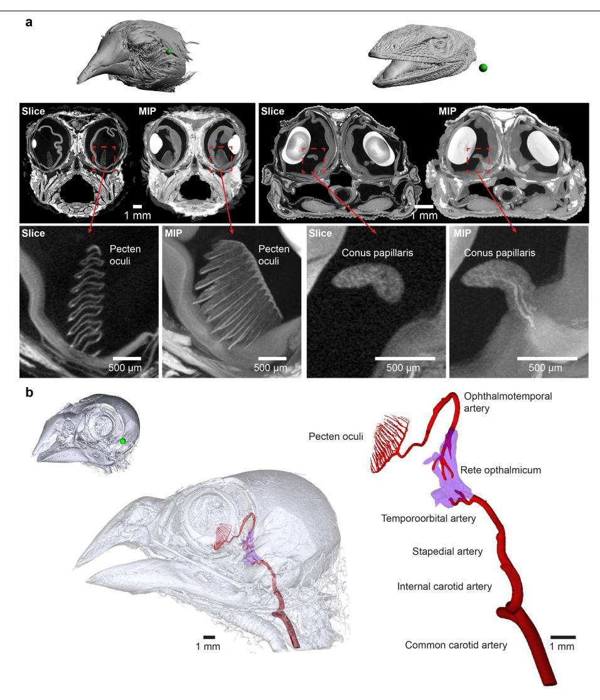

**Extended Data Fig. 1 | Structure of the avian pecten oculi and reptilian conus papillaris. a**, transversal virtual slices and maximum intensity projections (MIP) of diffusible iodine-based contrast-enhanced micro-CT images showing the pecten oculi of the avian zebrafinch (*Taeniopygia guttata*) (left, n = 1) and the conus papillaris of reptilian green anole (*Anolis carolinensis*) (right, n = 1). While the pecten oculi presents as a feather-like structure with a large surface area, the conus papillaris is a smaller cone-like structure. **b**, model of the

arterial blood supply to the pecten oculi in the zebra finch from vascular casting followed by micro-CT imaging. The arterial blood supply to the pecten oculi derives from the ophthalmotemporal artery originating in the rete opthalmicum, which is ultimately supplied by the common carotid artery. The fully interactive model (rotate, pan, zoom, toggle layers, adjust transparency) is provided separately as Supplementary 3D Model 1 (3D PDF).

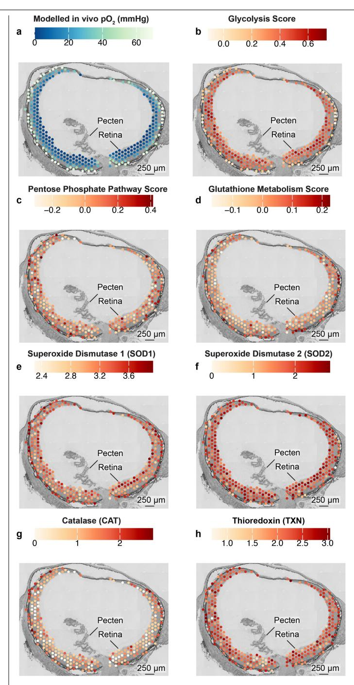

**Extended Data Fig. 2 | Spatial distribution of redox metabolism in the bird retina. a**, Modelled in vivo *p*O2 mapped onto tissue sections. **b-d**, Tissue mapping of aggregated gene expression scores for genes associated with glycolysis, pentose phosphate pathway, and glutathione metabolism shows that glycolysis is not linked to redox metabolism (n = 4). **e-h**, This conclusion was supported by uniform expression patterns of *SOD1*, *SOD2*, *CAT*, and *TXN*. Expression levels of individual genes represent unitless variance-stabilized expression values, adjusted for sequencing depth across spots. Pathway scores are unitless enrichment scores calculated from the average expression of all genes in a pathway relative to a set of randomly selected control genes.

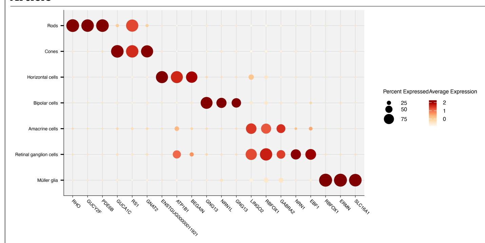

**Extended Data Fig. 3 | Single cell atlas of zebra finch retinal cells.** Gene expression markers of the major retinal cell types in zebra finches (n = 6 birds, 40,496 cells). Dots are colour-coded for average expression levels, and dot sizes are proportional to the proportion of cells of each cell type with non-zero expression.

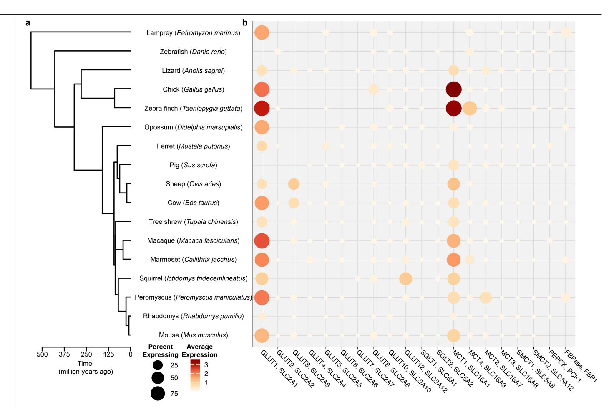

**Extended Data Fig. 4 | Metabolite transport expression in vertebrate Müller glia cells. a**, Phylogenetic relationship among species included in the analysis. **b**, gene expression pattern of key metabolite transporter genes in Müller glia cells shows high expression of *GLUT1* and *MCT1* in bird Müller glia cells.

Dots are colour-coded for average expression levels, and dot sizes are proportional to the proportion of cells of each cell type with non-zero expression. Data are from this study (zebra finch) and published studies[57](#page-9-10)–[59](#page-9-11).

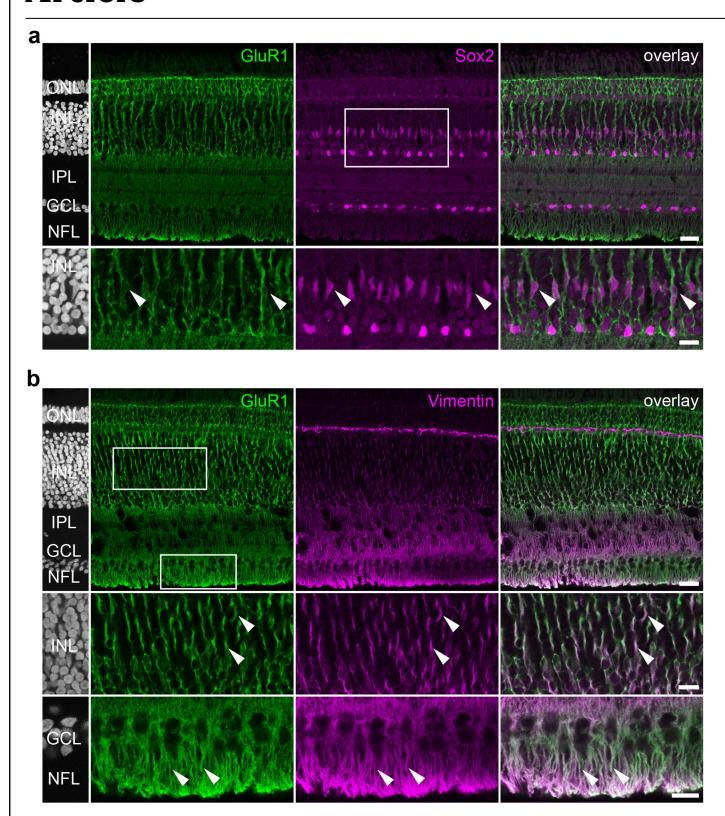

**Extended Data Fig. 5 | Vimentin is a marker for Müller cells in the zebra finch retina. a**, Sox2 labels Müller cell nuclei which show a distinct shape and are surrounded by GluR1 positive membranes (arrowheads), spanning from the nerve fibre layer to the end of the outer nuclear layer. **b**, GluR1 and vimentin almost fully colocalize in the zebra finch retina (arrowheads), establishing vimentin as a marker for Müller cells in this species. For these stainings, the retina was fixed in 2% paraformaldehyde. Areas marked by rectangles are shown in higher magnification. GCL, ganglion cell layer; INL/IPL, inner nuclear/plexiform layer; NFL, nerve fibre layer; ONL, outer nuclear layer. Scale bars: 20 µm; higher magnification images: 10 µm. n = 2.

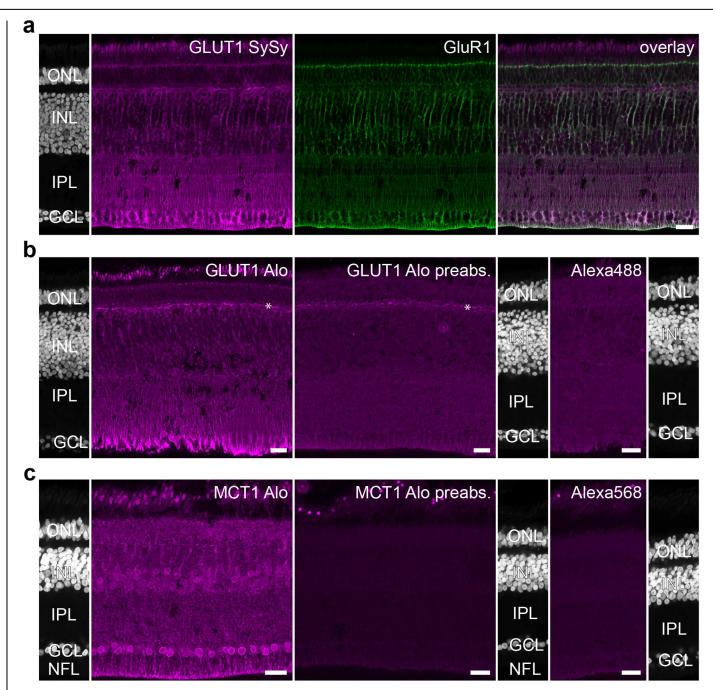

**Extended Data Fig. 6 | Specificity of GLUT1 and MCT1 antibodies. a**, An anti-GLUT1 antibody from guinea pig (Synaptic Systems, 419 005), which targeted a different epitope in the GLUT1 protein as the one used in Fig. [4b](#page-4-0) (Alomone, AGT-021), also labelled Müller glia cells (visualized by GluR1) with prominent GLUT1 staining in Müller cell endfeet. **b**, Pre-adsorption of the GLUT1 antibody (Alomone) with the immunization peptide eliminated the Müller cell staining, leaving a weak staining in the outer plexiform layer (asterisk) which is likely unspecific. Secondary antibody control for the GLUT1 staining (obtained by omitting the primary antibody). **c**, Pre-adsorption of the MCT antibody (Alomone) with the immunization peptide eliminated the Müller cell staining and the nucleic staining in the inner nuclear and ganglion cell layer. Blastp analysis revealed a homology of the antibody to Sox12 and Sox11 which are expressed in both layers in the chicken retina (data based on Yamagata et al., 2021). Secondary antibody control for the MCT1 staining (obtained by omitting the primary antibody). Please note that confocal stacks for GLUT1/ MCT1, pre-adsorbed antibodies, and secondary antibody controls were scanned and processed identically. Images were not filtered. GCL, ganglion cell layer; INL/IPL, inner nuclear/plexiform layer; NFL, nerve fibre layer; ONL, outer nuclear layer. Scale bars: 20 µm. n = 2.

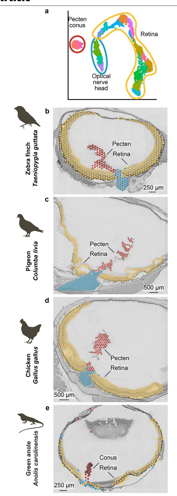

**Extended Data Fig. 7 | Similar gene expression profiles of the conus and pecten. a**) Integration and cluster analysis of gene expression spots group ocular tissues from zebra finches (**b**, n = 4), pigeons (**c**, n = 1), chickens (**d**, n = 1), and anoles (**e**, n = 2) into 17 gene expression clusters. Mapping the gene expression clusters back to tissue morphology identifies distinct gene expression clusters of the pecten/conus, retina, and optical nerve head.

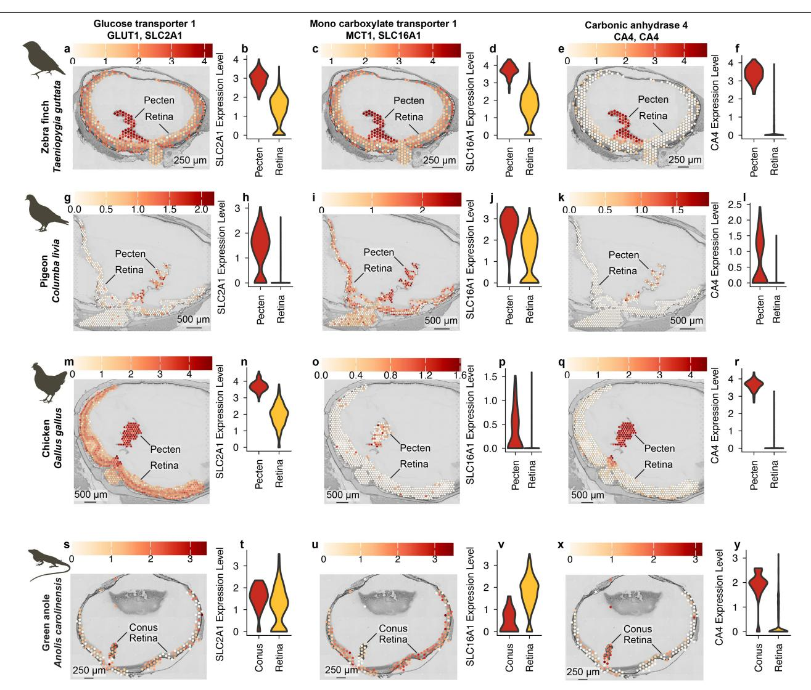

**Extended Data Fig. 8 | Transcript distribution in the birds' pecten and anole conus. a,c,e,g,i,k,m,o,q,s,u,x**, Tissue sections of zebra finch (n = 4), pigeon (n = 1), chicken (n = 1), and green anole (n = 1) eyes colour-coded for expression of the glucose transporter *GLUT1* (*SLC2A1*; **a,g,m,s**), monocarboxylate transporter *MCT1* (*SLC16A1*; **c,i,o,u**) and carbonic anhydrase 4 (*CA4*; **e,k,q,x**). Expression levels represent unitless variance-stabilized expression values,

adjusted for sequencing depth across spots. **b,d,f,h,j,l,n,p,r,t,v,y**, Violin plots showing variance-stabilized expression levels across gene-expression spots covering the pecten (birds) or conus (anole) (red) and the neural retina (yellow) for the corresponding genes. Note that panels for the zebra finch in **a**-**f** are from Fig. [3](#page-3-0) and are included here for comparison with pigeon, chicken, and anoles.

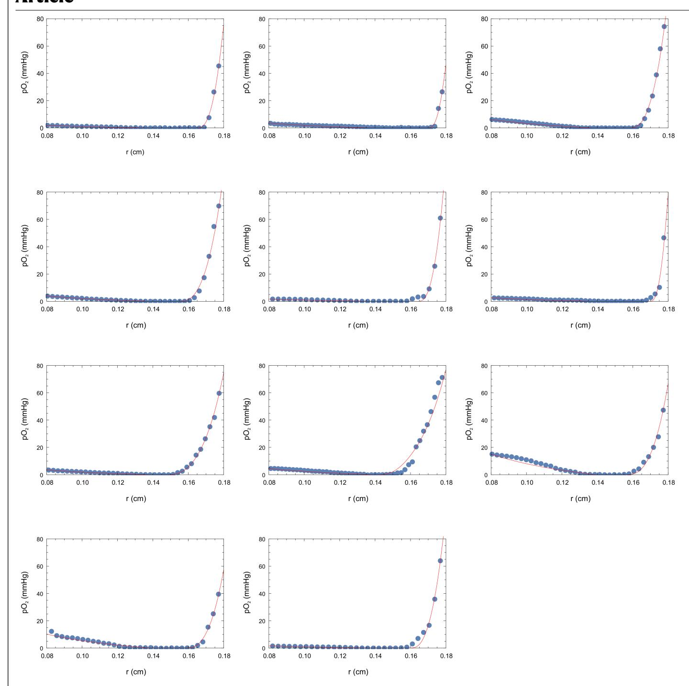

**Extended Data Fig. 9 | Model fits for estimating retinal oxygen consumption.** Measured (blue points) and modelled (red lines) oxygen partial pressure profiles were used to estimate the uninhibited and realized oxygen consumption rates of the retina and the oxygen fluxes from the choroid and the pecten. The 11 panels

show the data from 11 individual anaesthetized zebra finches measured during ventilation with air. Data are plotted as a function of eye radius, where r = 0.18 cm represents the position of the choroid.

#### **Extended Data Table 1 | Summary of species-specific anaesthesia and instrumentation**

|                | Induction time (min) | Airflow (I min -1 ) | Induction isoflurane (%) | Intubation tube size | Peak inspiratory pressure (cmH 2 O) | Maintenance isoflurane (%) | Ventilation rate (min -1 ) | Lidocaine dose (mg ml -1 ) | Blood oxygen saturation (%) | Rectal tempera ture (°C) | Mito- Tracker volume (ml) |
|----------------|----------------------------|-----------------------------------|--------------------------|-------------------------|---------------------------------------------------------|----------------------------------|---------------------------------------------|---------------------------------------------|--------------------------------------|-----------------------------------|------------------------------------|
| Pigeon         | 3 – 5                      | 1                                 | 3                        | ID 2.5 OD 3.7        | 8                                                       | 2 – 2.5                          | 16                                          | 1 – 5                                       | 90 – 100                             | 40                                | 1                                  |
| Chicken        | 3 – 5                      | 1                                 | 3                        | ID 2.5 OD 3.7        | 8                                                       | 2 – 2.5                          | 20 – 22                                     | 2                                           | 93 – 100                             | 40                                | 1                                  |
| Zebra finch | 3 – 5                      | 0.5                               | 3                        | 18G venflon          | 6                                                       | 2 – 2.5                          | 36 – 42                                     | 2                                           | 94 – 100                             | 42                                | 0.5                                |
| Green anole | 10 – 15                    | 0.5                               | 5                        | 24G venflon          | 4 – 5                                                   | 2.5 – 4                          | 10                                          | 2                                           | 84 – 100                             | 28                                | 0.2                                |
| Turtle         | 20 – 60                    | 0.5                               | 5                        | 24G venflon          | 8                                                       | 2.5 – 4                          | 4                                           | 2                                           | NA                                   | 28                                | 0.2                                |
| Caiman         | ~45                        | 0.5                               | 5                        | ID 3.0 OD 4.2        | 6 – 8                                                   | 1.5 – 2                          | 1 – 2                                       | 2                                           | NA                                   | 28                                | NA                                 |

Induction time is the time it took for the animal to obtain a surgical plane of anaesthesia; Airflow is the volume of air entering the induction chamber per minute during induction; Lidocaine dose is the concentration used on the glottis and both eyes. Intervals for the various parameters refer to the minimum and maximum values.

| Corresponding author(s):                | Christian Damsgaard |
|-----------------------------------------|---------------------|
| Last updated by author(s): Nov 19, 2025 |                     |

# Reporting Summary

Nature Portfolio wishes to improve the reproducibility of the work that we publish. This form provides structure for consistency and transparency in reporting. For further information on Nature Portfolio policies, see our Editorial Policies and the Editorial Policy Checklist.

| Statistics |  |  |
|------------|--|--|

|     | For all statistical analyses, confirm that the following items are present in the figure legend, table legend, main text, or Methods section.                                                                                                                 |
|-----|---------------------------------------------------------------------------------------------------------------------------------------------------------------------------------------------------------------------------------------------------------------|
| n/a | Confirmed                                                                                                                                                                                                                                                     |
|     | The exact sample size (n) for each experimental group/condition, given as a discrete number and unit of measurement                                                                                                                                           |
|     | A statement on whether measurements were taken from distinct samples or whether the same sample was measured repeatedly                                                                                                                                       |
|     | The statistical test(s) used AND whether they are one- or two-sided Only common tests should be described solely by name; describe more complex techniques in the Methods section.                                                                         |
|     | A description of all covariates tested                                                                                                                                                                                                                        |
|     | A description of any assumptions or corrections, such as tests of normality and adjustment for multiple comparisons                                                                                                                                           |
|     | A full description of the statistical parameters including central tendency (e.g. means) or other basic estimates (e.g. regression coefficient) AND variation (e.g. standard deviation) or associated estimates of uncertainty (e.g. confidence intervals) |
|     | For null hypothesis testing, the test statistic (e.g. F, t, r) with confidence intervals, effect sizes, degrees of freedom and P value noted Give P values as exact values whenever suitable.                                                              |
|     | For Bayesian analysis, information on the choice of priors and Markov chain Monte Carlo settings                                                                                                                                                              |
|     | For hierarchical and complex designs, identification of the appropriate level for tests and full reporting of outcomes                                                                                                                                        |
|     | Estimates of effect sizes (e.g. Cohen's d, Pearson's r), indicating how they were calculated                                                                                                                                                                  |
|     | Our web collection on statistics for biologists contains articles on many of the points above.                                                                                                                                                                |
|     |                                                                                                                                                                                                                                                               |

## Software and code

Policy information about availability of computer code

Data collection Ocular oxygen and CO2 measurements were recorded in Unisense Profiler software. Arterial saturation and expiratory pCO2 were recorded in LabChart Pro 8.0.

Data analysis Image data was analysed in Fiji. All statistical and gene expression analyses were performed in R.

For manuscripts utilizing custom algorithms or software that are central to the research but not yet described in published literature, software must be made available to editors and reviewers. We strongly encourage code deposition in a community repository (e.g. GitHub). See the Nature Portfolio guidelines for submitting code & software for further information.

## Data

Policy information about availability of data

All manuscripts must include a data availability statement. This statement should provide the following information, where applicable:

- Accession codes, unique identifiers, or web links for publicly available datasets
- A description of any restrictions on data availability
- For clinical datasets or third party data, please ensure that the statement adheres to our policy

Raw data within figures are available in the source data. The raw and aligned spatial and single-cell RNA-seq data generated here are available in GEO (GSE309408). Comparative datasets were from lamprey (GSE236005), zebrafish (GSE237214), anole (GSE237205), chicken (GSE159107), opossum (GSE237207), ferret

(GSE237203), pig (GSE237209), sheep (GSE237211), cow (GSE237202), shrew (GSE237213), marmoset (GSE237206), squirrel (GSE237212), Peromyscus (GSE237208), Phabdomys (GSE237210), macaque (PRJCA002731) and mouse (SCP2560). Processed bird and reptile data are available here https://linlab.au.dk/ Damsgaard\_lab/CETA/ .

Imaging data of the micro-CT imaged zebra finch and green anole samples are available here https://doi.org/10.6084/m9.figshare.30608753.v3.

## Research involving human participants, their data, or biological material

Policy information about studies with human participants or human data. See also policy information about sex, gender (identity/presentation), and sexual orientation and race, ethnicity and racism.

Reporting on sex and gender *Use the terms sex (biological attribute) and gender (shaped by social and cultural circumstances) carefully in order to avoid confusing both terms. Indicate if findings apply to only one sex or gender; describe whether sex and gender were considered in study design; whether sex and/or gender was determined based on self-reporting or assigned and methods used. Provide in the source data disaggregated sex and gender data, where this information has been collected, and if consent has*

> *been obtained for sharing of individual-level data; provide overall numbers in this Reporting Summary. Please state if this information has not been collected.*

*Report sex- and gender-based analyses where performed, justify reasons for lack of sex- and gender-based analysis.*

Reporting on race, ethnicity, or other socially relevant groupings

*Please specify the socially constructed or socially relevant categorization variable(s) used in your manuscript and explain why they were used. Please note that such variables should not be used as proxies for other socially constructed/relevant variables (for example, race or ethnicity should not be used as a proxy for socioeconomic status).* 

*Provide clear definitions of the relevant terms used, how they were provided (by the participants/respondents, the researchers, or third parties), and the method(s) used to classify people into the different categories (e.g. self-report, census or administrative data, social media data, etc.)* 

*Please provide details about how you controlled for confounding variables in your analyses.*

Population characteristics *Describe the covariate-relevant population characteristics of the human research participants (e.g. age, genotypic information, past and current diagnosis and treatment categories). If you filled out the behavioural & social sciences study design questions and have nothing to add here, write "See above."*

Recruitment *Describe how participants were recruited. Outline any potential self-selection bias or other biases that may be present and how these are likely to impact results.*

Ethics oversight *Identify the organization(s) that approved the study protocol.*

Note that full information on the approval of the study protocol must also be provided in the manuscript.

# Field-specific reporting

|               |                               | Please select the one below that is the best fit for your research. If you are not sure, read the appropriate sections before making your selection. |
|---------------|-------------------------------|------------------------------------------------------------------------------------------------------------------------------------------------------|
| Life sciences | Behavioural & social sciences | Ecological, evolutionary & environmental sciences                                                                                                    |

For a reference copy of the document with all sections, see nature.com/documents/nr-reporting-summary-flat.pdf

# Life sciences study design

All studies must disclose on these points even when the disclosure is negative.

Sample size Each individual animal represent one data point.

Data exclusions pO2 partial pressure profiles were excluded if they contained ventilation artifacts.

Doublet cells were removed from the single cell data set.

Replication All experiments were performed with multiple replicates per species/treatment to ensure reproducibility of the results

Randomization NA

Blinding NA

# Reporting for specific materials, systems and methods

We require information from authors about some types of materials, experimental systems and methods used in many studies. Here, indicate whether each material, system or method listed is relevant to your study. If you are not sure if a list item applies to your research, read the appropriate section before selecting a response.

| Materials & experimental systems |                               | Methods |                        |
|----------------------------------|-------------------------------|---------|------------------------|
| n/a                              | Involved in the study         | n/a     | Involved in the study  |
|                                  | Antibodies                    |         | ChIP-seq               |
|                                  | Eukaryotic cell lines         |         | Flow cytometry         |
|                                  | Palaeontology and archaeology |         | MRI-based neuroimaging |
|                                  | Animals and other organisms   |         |                        |
|                                  | Clinical data                 |         |                        |
|                                  | Dual use research of concern  |         |                        |
|                                  | Plants                        |         |                        |
|                                  |                               |         |                        |
|                                  |                               |         |                        |

## Antibodies

#### Antibodies used PRIMARY ANTIBODIES

Anti-pimonidazole adducts (rabbit polyclonal): Hypoxyprobe (Burlington, MA, USA); PAb2627. Application: IHC on cryosections (HRP polymer detection).

GLUT1/SLC2A1 (rabbit polyclonal). Alomone Labs (Jerusalem, Israel); AGT-021. Application: IF on 25 μm retinal cryosections (1:250). MCT1/SLC16A1 (rabbit polyclonal; clone n/a). Alomone Labs; AMT-011. Application: IF (1:1000).

SOX2 (mouse monoclonal). Santa Cruz Biotechnology (Dallas, TX, USA); sc-365823. Application: IF (1:50).

Vimentin (guinea pig polyclonal; clone n/a). Synaptic Systems (Göttingen, Germany); 172004. Application: IF (1:1000 and 1:3000).

#### SECONDARY ANTIBODIES

Anti-rabbit HRP polymer (EnVision+ Single Reagent, Rabbit). K4003, Dako (Glostrup, Denmark). Alexa Fluor 488 & 568 secondaries (species-appropriate). Thermo Fisher Scientific; 1:500–1:1000. Alexa Fluor 647 secondary (species-appropriate). Jackson ImmunoResearch; 1:250.

Validation Anti-pimonidazole adducts (Hypoxyprobe PAb2627; IHC on avian retina): Manufacturer states specificity for covalent pimonidazole adducts formed under hypoxia and validation for IHC/IF. In-study validation: retinal labeling confined to regions expected to be hypoxic based on retinal oxygen measurements in the corresponding retinal regions.

GLUT1/SLC2A1 (Alomone AGT-021; IF on zebra finch retina): Datasheet lists validation for IF/IHC and a conserved epitope across species. In-study validation: peptide pre-adsorption with the immunizing peptide (BLP-GT021) abolished signal; primary-omission negatives were blank; orthogonal concordance with single-cell/spatial transcriptomics (SLC2A1 enrichment in Müller glia). MCT1/SLC16A1 (Alomone AMT-011; IF on zebra finch retina): Datasheet lists validation for IF/IHC and an extracellular epitope. Instudy validation: peptide pre-adsorption (BLP-MT011) abolished signal; primary-omission negatives were blank; pattern (including Müller end-feet) matched predictions for lactate handling and scRNA-seq data.

SOX2 (Santa Cruz sc-365823; IF on zebra finch retina): Manufacturer reports validation for IF/IHC. In-study validation: primaryomission negatives; expected nuclear labeling of Müller-glia–like cells with characteristic radial context; agreement with scRNA-seq showing SOX2 expression in Müller clusters.

Vimentin (Synaptic Systems 172004; IF on zebra finch retina): Manufacturer reports validation for IF/IHC. In-study validation: primary-omission negatives; classic Müller-glia intermediate-filament pattern (radial fibers spanning retina), as expected for this marker.

# Animals and other research organisms

Policy information about studies involving animals; ARRIVE guidelines recommended for reporting animal research, and Sex and Gender in Research

Laboratory animals Common pigeons (Columba livia) Domestic fowls (Gallus gallus) Zebra finches (Taeniopygia guttata) Green anoles (Anolis carolinensis) Chinese pond turtles (Mauremys reevesii) Broad-snouted caimans (Caiman latirostris)

Wild animals The study did not involve wild animals

Reporting on sex Sex was not termined

Field-collected samples The study did not involve field-collected samples

Ethics oversight Danish Inspectorate for Animal Experimentation within the Danish Ministry of Food, Agriculture, and Fisheries, Danish Veterinary and Food Administration (Permit numbers 2019-15-0201-00288 and 2022-15-0201-01278). All animal procedures in Oldenburg were performed in accordance with local, national and EU guidelines for the use of animals in research and were approved by the Animal Care and Use Committees of the Niedersächsisches Landesamt für Verbraucherschutz und Lebensmittelsicherheit (Oldenburg, Germany).

Note that full information on the approval of the study protocol must also be provided in the manuscript.

# Plants

| Seed stocks           | Plants were not used in this study |
|-----------------------|------------------------------------|
|                       |                                    |
| Novel plant genotypes | Plants were not used in this study |
|                       |                                    |
|                       |                                    |
| Authentication        | Plants were not used in this study |
|                       |                                    |
|                       |                                    |

## Flow Cytometry

### Plots

Confirm that:

The axis labels state the marker and fluorochrome used (e.g. CD4-FITC).

The axis scales are clearly visible. Include numbers along axes only for bottom left plot of group (a 'group' is an analysis of identical markers).

All plots are contour plots with outliers or pseudocolor plots.

A numerical value for number of cells or percentage (with statistics) is provided.

#### Methodology

Sample preparation Six zebra finches were euthanised, and the retinal pigment epithelium, neural retina and pecten oculi from one eye was immediately dissected out in a petri dish with ice-cold Earle's Balanced Salt Solution (EBSS), cut into smaller pieces with iris scissors, and incubated in 20 u ml–1 papain (Worthington, Lakewood, NJ) (37C, 30 min, 300 rpm). The cell suspension was slowly triturated 15 times with a 1 ml pipette tip, the cloudy supernatant was centrifuged (RT, 5 min, 300 g), and the resulting cell pellet was resuspended in EBSS containing 10 mg l–1 bovine serum albumin (BSA), 10 mg l–1 ovomucoid inhibitor and 2,000 u ml–1 deoxyribonuclease I. The cells were washed by placing them on top of a column of EBSS containing 10 mg l–1 BSA and 10 mg l–1 ovomucoid inhibitor followed by centrifugation (6 min, 70 g, RT). The cell pellet was resuspended in PBS containing 0.25% BSA and 2 mmol l–1 EDTA.

Instrument NovoCyte 3000 flow cytometer equipped with three lasers (405 nm, 488 nm and 640 nm) and 13 fluorescence detectors (Agilent, Santa Clara, CA)

Software Data was recorded in NovoExpress and analysed in FlowJo.

Cell population abundance Not relevant. Flow cytometry was only used to determine cell concentration of Hoechst-positive cells.

Gating strategy Hoechst 33342 was used as a permeable DNA dye to identify cells from debris. Propidium iodide was added to discriminate between live and dead cells. The viability was determined as Hoechst positive and PI negative cells. Absolute count of was determined among all Hoechst positive cells.

Tick this box to confirm that a figure exemplifying the gating strategy is provided in the Supplementary Information.