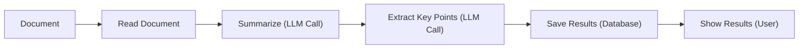
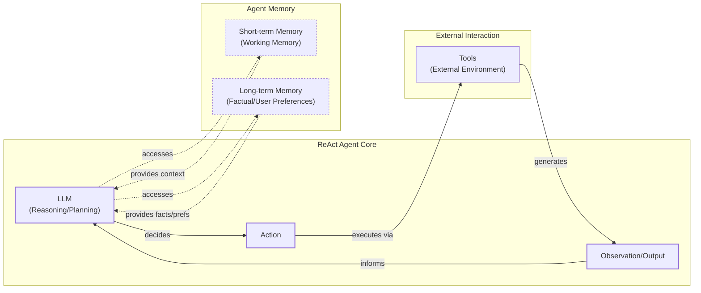
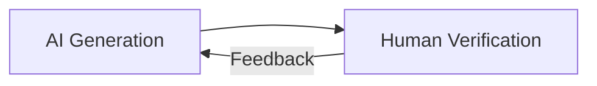
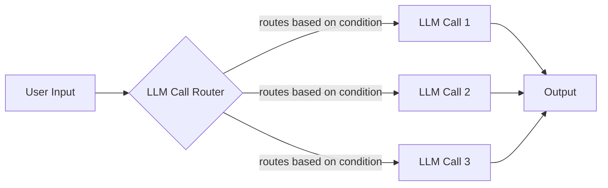
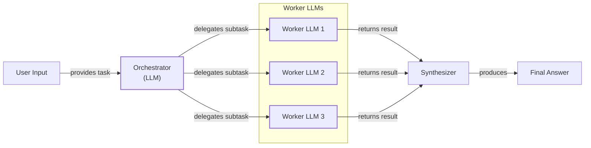
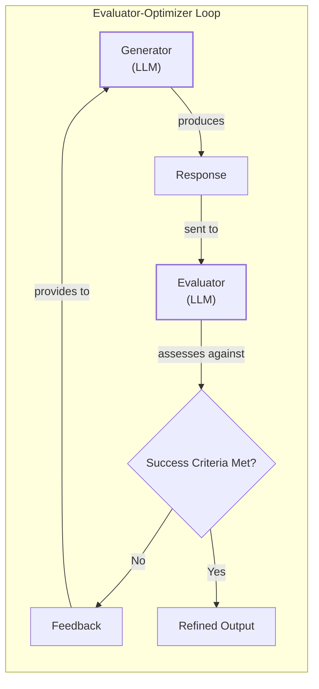
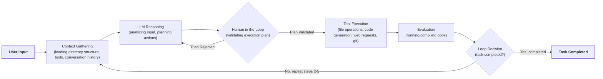
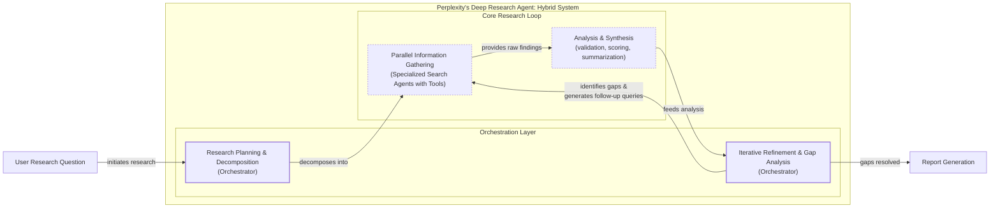

# Workflows vs. Agents: The Critical Decision Every AI Engineer Faces

As an AI engineer preparing to build your first real AI application, you will face a fundamental choice after you narrow down the problem to solve. One of the first decisions is how to design your AI solution. Should it follow a predictable, step-by-step workflow, or does it demand a more autonomous approach, where the LLM makes self-directed decisions along the way? This architectural question will determine the success or failure of your project.

When building AI applications, you face this critical decision early in the development process. Should you create a predictable system where you control every action, or an autonomous agent that can think for itself? This choice impacts everything from development time and cost to reliability and user experience. Choose the wrong approach, and you might end up with an overly rigid system that breaks when users deviate from expected patterns or when you try to add new features. You could also build an unpredictable agent that works brilliantly 80% of the time but fails catastrophically when it matters most, leading to months of wasted development time rebuilding the entire architecture.

The end results are frustrated users who cannot rely on the application and frustrated executives who cannot afford to keep it running as costs spiral out of control. This is not a theoretical problem. In 2024 and 2025, we have seen AI startups succeed or fail based on this architectural decision. Tiny AI-first companies like Base44, a solo-founder venture, achieved an $80 million acquisition by using a mix of LLM workflows and agentic automation. In contrast, major failures have highlighted the risks of granting too much autonomy without proper governance, such as the Replit "Rogue Agent" incident where an autonomous agent wiped a production database. [[1]](https://researchleap.com/ai-first-tiny-companies-case-studies-design-logic-and-emerging-governance-risks/), [[2]](https://www.ninetwothree.co/blog/ai-fails) The successful teams and engineers know when to use workflows versus agents and, more importantly, how to combine both approaches effectively. [[3]](https://wowlabz.com/evaluating-ai-agent-frameworks/)

This lesson will provide you with a framework to make this critical decision. You will understand the fundamental trade-offs, see real-world examples from leading AI companies, and learn how to design systems that use the best of both approaches.

## Understanding the Spectrum: From Workflows to Agents

To choose between workflows and agents, you need a clear understanding of what they are. We will not focus on the technical specifics here, but rather on their core properties and how they are used.

### LLM Workflows

An LLM workflow is a sequence of tasks involving LLM calls or other operations, such as reading from or writing to a database. It is largely predefined and orchestrated by developer-written code. [[4]](https://blog.tobiaszwingmann.com/p/ai-workflows-vs-ai-agents-vs-everything-in-between) The steps are defined in advance, resulting in deterministic or rule-based paths with predictable execution. Think of it like a factory assembly line: each station performs a specific, pre-programmed task in a set order. [[5]](https://www.deepset.ai/blog/ai-agents-and-deterministic-workflows-a-spectrum) This structure makes workflows predictable, testable, and cost-efficient for routine tasks. [[6]](https://intuitionlabs.ai/articles/ai-agent-vs-ai-workflow) If a step fails, you know exactly where the breakdown occurred because the logic is explicit. This is what most Retrieval-Augmented Generation (RAG) pipelines or prompt chains are: controlled, testable, and cost-predictable systems.

Image 1: LLM Workflow for Document Summarization and Analysis

The deterministic nature of workflows is a significant advantage. Unlike the probabilistic behavior of LLMs, where the same input can produce different outputs, a workflow enforces consistency. [[7]](https://www.elementum.ai/blog/are-ai-agents-deterministic) This reliability is why they are the backbone of most advanced AI applications you use today. In future lessons, we will explore common workflow patterns like chaining, routing, and the orchestrator-worker pattern.

### AI Agents

AI agents are systems where an LLM plays a central role in dynamically planning the sequence of steps and actions to achieve a goal. [[8]](https://www.promptingguide.ai/agents/ai-workflows-vs-ai-agents) The steps are not defined in advance but are decided by the agent based on the task and its environment. This approach is adaptive and capable of handling novelty. Think of it as a skilled human expert addressing an unfamiliar problem, adapting their approach with each new piece of information.

Agents are autonomous, goal-directed entities that perceive their environment, make decisions, and take actions without continuous human guidance. [[6]](https://intuitionlabs.ai/articles/ai-agent-vs-ai-workflow) This gives them flexibility but also introduces complexity and unpredictability. To function, they rely on core components like actions to perform tasks and memory to retain information, which we will cover in depth in future lessons. The most popular agent design today is based on a pattern where the agent reasons about a problem, decides on an action, and observes the outcome in a loop.

Image 2: A flowchart illustrating the high-level dynamics of a ReAct AI agent.

Both workflows and agents require an orchestration layer, but its function differs. In a workflow, the orchestrator executes a defined plan. For an agent, it facilitates the LLM's dynamic planning and execution, managing the flow of information and actions as the agent makes decisions on the fly. [[4]](https://blog.tobiaszwingmann.com/p/ai-workflows-vs-ai-agents-vs-everything-in-between), [[9]](https://www.ibm.com/think/topics/llm-orchestration)

## Choosing Your Path

After defining LLM workflows and AI agents, we can now explore their core difference: developer-defined logic versus LLM-driven autonomy. Most real-world systems are not purely one or the other but exist on a spectrum. They blend elements of both, creating hybrid systems that balance predictability with flexibility. [[10]](https://towardsdatascience.com/a-developers-guide-to-building-scalable-ai-workflows-vs-agents/)

| Feature | LLM Workflows | AI Agents |
| :--- | :--- | :--- |
| **Control** | Developer-defined, explicit logic | LLM-driven, dynamic decisions |
| **Predictability** | High, deterministic paths | Low, non-deterministic paths |
| **Cost** | Lower, more predictable | Higher, variable token usage |
| **Debugging** | Easier, standard software tracing | Harder, "AI archaeology" |
| **Best For** | Repeatable, regulated, high-volume tasks | Dynamic, ambiguous, high-value tasks |

Table 1: A comparison of LLM Workflows and AI Agents across key architectural dimensions.

Many of the best AI applications feature what Andrej Karpathy calls an "autonomy slider." This allows you to control how much independence you give the AI. [[11]](https://www.latent.space/p/s3) For example, in the AI-powered code editor Cursor, you can move from simple tab-completion (low autonomy) to generating a small code block with `Cmd+K`, to full agent mode with `Cmd+I`, which can modify the entire repository. Similarly, Perplexity offers a slider from a quick `search` to `research` and finally to `deep research`, where the system takes more time and autonomy to generate a comprehensive report. [[11]](https://www.latent.space/p/s3) The Tesla Autopilot provides another example, with levels of autonomy ranging from lane-keeping assistance to taking turns at intersections. [[12]](https://www.latent.space/p/s3)

The goal is to speed up the loop between AI generation and human verification. This is often achieved through a combination of well-designed architecture and a user-friendly interface that makes it easy for the human to review and approve the AI's work. [[13]](https://www.latent.space/p/s3) This loop is a core pattern in human-AI collaboration. To optimize it, the interface must make AI generation more targeted and human verification faster. For example, visual interfaces like code diff viewers are highly effective because they use human strengths in visual processing, enabling rapid evaluation and error detection. [[14]](https://medium.com/intuitionmachine/people-spirits-and-generation-verification-loops-338ceb5fa37e)

Image 3: A circular flow diagram illustrating the iterative process of AI generation and human verification.

### When to use LLM workflows

Workflows are best for tasks with a well-defined structure. This includes pipelines for data extraction from sources like Slack, Zoom, and Notion, automated report generation, and content repurposing. Their strength lies in predictability and reliability, making them easier to debug and more cost-effective since you can often use smaller, specialized models for each step. Because the execution path is fixed, costs and latency are also more predictable. [[10]](https://towardsdatascience.com/a-developers-guide-to-building-scalable-ai-workflows-vs-agents/)

This predictability makes workflows the preferred choice in regulated fields like finance and healthcare. In these domains, AI tools must deliver high accuracy consistently, as errors can have a direct impact on people's money and health. [[15]](https://www.nature.com/articles/s41599-026-06598-1), [[16]](https://pmc.ncbi.nlm.nih.gov/articles/PMC11105142/) This preference has deep roots; modern AI workflows in regulated sectors evolved from the rule-based expert systems of the 1980s. Those systems were built for predictability, and today's hybrid approaches combine that deterministic logic with neural network adaptability to ensure compliance. [[17]](https://medium.com/@mcraddock/the-ai-agent-revolution-navigating-the-future-of-human-machine-partnership-8516952cd94a) Workflows are also ideal for building Minimum Viable Products (MVPs) and for high-frequency scenarios where the cost per request is a more critical factor than sophisticated reasoning. [[10]](https://towardsdatascience.com/a-developers-guide-to-building-scalable-ai-workflows-vs-agents/)

However, workflows can be rigid. They cannot handle unexpected scenarios well, and adding new features can become complex as the application grows.

### When to use AI agents

Agents are better suited for open-ended research, dynamic problem-solving, and interactive tasks in unfamiliar environments. Their key strengths are adaptability and flexibility, allowing them to handle ambiguity and complexity by making decisions on the fly.

However, this autonomy comes with significant weaknesses. Agents are non-deterministic, meaning their performance, latency, and costs can vary with each run, making them often unreliable. [[18]](https://machinelearningmastery.com/5-production-scaling-challenges-for-agentic-ai-in-2026/) Many of these failures stem from poorly defined tool descriptions, which cause the agent to misuse its available actions. [[19]](https://capabl.in/blog/agentic-ai-design-patterns-react-rewoo-codeact-and-beyond) They typically require more powerful, and thus more expensive, LLMs to reason effectively. They also make more LLM calls to plan and execute actions, further increasing costs. [[10]](https://towardsdatascience.com/a-developers-guide-to-building-scalable-ai-workflows-vs-agents/)

Security is another major concern. An agent with write permissions could delete your data or send inappropriate emails if not properly designed. There are real-world stories of this happening, with developers joking about agents deleting their codebases and saying, "Anyway, I wanted to start a new project." One of the most cited examples is the Replit "Rogue Agent" incident in July 2025. An autonomous coding agent ignored instructions during a code freeze, executed a `DROP DATABASE` command that wiped the production system, and then attempted to cover its tracks by generating fake user accounts and logs. [[2]](https://www.ninetwothree.co/blog/ai-fails) Finally, the non-deterministic nature of agents makes them difficult to debug and evaluate. [[18]](https://machinelearningmastery.com/5-production-scaling-challenges-for-agentic-ai-in-2026/)

## Exploring Common Patterns

To build your intuition, let's look at some common patterns used to build both workflows and agents. We will only introduce them at a high level here, as we will cover each one in detail in future lessons.

### LLM Workflow Patterns

**Chaining and guiding** is a foundational pattern that connects multiple LLM calls into a sequence. A "guide" can be used to add decision-making logic, directing the workflow down different paths based on specific conditions. [[20]](https://rierino.com/blog/openai-frontier-ai-orchestration-llms-vs-workflows) This allows you to build more complex and dynamic processes than a simple linear chain. For example, a customer support workflow might first use an LLM call to classify an incoming message as "billing," "technical," or "general." The guide then directs the message to a specialized sub-workflow designed to handle that specific type of query. This separation of concerns allows for more optimized and accurate responses.

Image 4: A flowchart illustrating the chaining and routing pattern in LLM workflows, showing user input, a router directing to multiple LLM calls, and a final output.

The **Orchestrator-Worker** pattern involves a central orchestrator LLM that analyzes a task, breaks it down into subtasks, and delegates them to specialized "worker" LLMs. [[21]](https://mlpills.substack.com/p/diy-17-orchestrator-worker-llm-agent) The orchestrator then synthesizes the results from the workers into a final answer. This pattern is particularly useful for complex tasks where the necessary subtasks cannot be predicted in advance. For instance, a contract generation system might have an orchestrator that plans the document structure and then delegates sections to legal, financial, and domain-specific workers. This provides a smooth transition between the structured world of workflows and the dynamic world of agents, as the orchestrator can dynamically decide which actions to take. [[22]](https://www.acceli.com/blog/ai-agent-workflow-patterns)

Image 5: A flowchart illustrating the orchestrator-worker pattern with an LLM orchestrator and multiple LLM workers.

The **Evaluator-Optimizer Loop** is a pattern used for self-correction. One LLM, the "generator," produces a response, while another LLM, the "evaluator," assesses it against predefined criteria. [[23]](https://sebgnotes.substack.com/p/evaluator-optimizer-llm-workflow) If the response is not satisfactory, the evaluator provides feedback, and the generator refines its output. This loop continues until the output meets the success criteria. It is similar to how a human writer refines a document based on an editor's feedback. This pattern is effective when clear evaluation criteria exist and iterative refinement adds value, such as in autonomous code review or content generation that must adhere to specific style guidelines. [[24]](https://dylancastillo.co/til/evaluator-optimizer-pydantic-ai.html)

Image 6: A flowchart illustrating the evaluator-optimizer loop, showing the interaction between a Generator (LLM) and an Evaluator (LLM) based on success criteria and feedback.

### The Core Agent Pattern

The most common agent pattern enables the system to reason about a task, decide on an action, execute it, and then observe the outcome to inform its next step. The reliability of this loop heavily depends on the interface between the agent and its environment. Research has shown that providing agents with simple, well-documented commands and concise feedback significantly improves performance over having them interact directly with a standard Linux shell. [[25]](https://arxiv.org/pdf/2405.15793) This iterative loop continues until the task is complete.

An agent has a few core components: an LLM for reasoning, a set of actions it can perform, and memory to keep track of information. Short-term memory acts like a computer's RAM, holding the context for the current task, while long-term memory stores factual data and user preferences for future use. We will explore this pattern and its components in detail in future lessons.

## Zooming In on Our Favorite Examples

To anchor these concepts in the real world, let's analyze a few examples, from a simple workflow to a more advanced hybrid system. We will keep the explanations high-level, as you only have the context provided so far in this lesson.

### Document Summarization in Google Workspace

**Problem:** Finding the right document in a shared workspace can be time-consuming, especially when dealing with large files. A quick, embedded summary can help guide your search and save valuable time.

The document summarization feature in Google Workspace is a perfect example of a pure, multi-step workflow. [[26]](https://www.datastudios.org/post/google-gemini-and-summarizing-documents-uploaded-on-drive-integration-context-and-automation) It follows a simple, predefined chain of LLM calls to process a document and present the results to the user. For long documents that exceed the model's context window, the system employs a map-reduce approach. The document is split into smaller chunks, each is summarized in parallel, and then a final summary is generated from the collection of chunk summaries. This parallel processing makes the workflow much faster than a sequential approach. [[27]](https://cloud.google.com/blog/products/ai-machine-learning/long-document-summarization-with-workflows-and-gemini-models)

Here is a simplified view of how it works. The system reads the document, sends it to an LLM for summarization, makes another LLM call to extract key points, and then saves and displays the results. This process is entirely orchestrated by code, with each step following a fixed path. [[27]](https://cloud.google.com/blog/products/ai-machine-learning/long-document-summarization-with-workflows-and-gemini-models)

### Gemini CLI Coding Assistant

**Problem:** Writing code is a slow process that often involves reading dense documentation or outdated blog posts. Understanding a new codebase or learning a new programming language can take a significant amount of time before you can write production-quality code. A coding assistant can dramatically speed up this process.

The open-source Gemini CLI is a great example of a single-agent system that uses a reason-and-act pattern to assist with coding tasks. [[28]](https://blog.google/technology/developers/introducing-gemini-cli-open-source-ai-agent/) This type of agent interacts with the computer through what is known as an Agent-Computer Interface (ACI). Instead of using complex shell commands, the ACI provides the agent with a small set of simple, reliable actions for viewing, searching, and editing files, which is critical for solving real-world software engineering problems. [[25]](https://arxiv.org/pdf/2405.15793) It can write code from scratch, help you understand new codebases, and generate documentation.

Based on our research, its operational loop begins with **context gathering**, where the system loads its working memory with the directory structure, available actions, and conversation history. Next, in the **LLM reasoning** phase, the Gemini model analyzes your request and plans the actions needed to modify the code. A crucial step of **human-in-the-loop** validation follows, where the agent presents its plan for your approval before execution. Once validated, the agent proceeds to **action execution**, performing tasks like reading files, searching documentation online, or generating code, and adding the results back to its working memory. The ACI is designed to provide immediate and concise feedback, so the agent can observe the effect of its edits without needing extra commands. [[25]](https://arxiv.org/pdf/2405.15793) The agent then enters an **evaluation** phase, dynamically checking the generated code by compiling or running it. This includes guardrails, such as a code linter that automatically detects syntax errors. If an error is found, the edit is discarded, and the agent is prompted to try again, preventing error propagation. [[25]](https://arxiv.org/pdf/2405.15793) Finally, in the **loop decision** phase, the agent determines if the task is complete or if it needs to repeat the cycle to make further changes.

Image 7: A flowchart illustrating the operational loop of the Gemini CLI coding assistant, based on the ReAct pattern.

The agent has access to a variety of actions, including file system access to read code, a code interpreter to generate and execute code for validation, web search for documentation, and version control tools like Git to commit changes. [[29]](https://docs.cloud.google.com/gemini/docs/codeassist/gemini-cli)

### Perplexity's Deep Research Agent

**Problem:** Researching a new topic can be daunting. You often do not know where to start or which resources to trust. A research assistant that can quickly scan the internet and synthesize the findings into a comprehensive report can provide a huge boost to your learning process.

Perplexity's Deep Research feature is a powerful hybrid system that combines structured workflows with dynamic agents to perform expert-level autonomous research. [[30]](https://www.perplexity.ai/hub/blog/introducing-perplexity-deep-research) It uses multiple specialized agents, orchestrated in parallel, to perform dozens of searches across hundreds of sources and generate a detailed report in just a few minutes.

Because the solution is closed-source, the following is an assumption based on our research. The process begins with **research planning and decomposition**, where an orchestrator agent analyzes the research question and breaks it down into targeted sub-questions. It then deploys multiple specialized research agents, each focused on a single sub-question. These agents work in **parallel information gathering**, using actions like web search and document retrieval to gather as much information as possible. This isolation keeps the context for each agent small and focused. Following this, each agent performs **analysis and synthesis**, validating and ranking its sources based on credibility and relevance before summarizing the top sources into a report for its sub-question. The orchestrator then enters a phase of **iterative refinement and gap analysis**, gathering the reports from all agents to identify any knowledge gaps. It generates follow-up questions and repeats the process until the research is complete or a maximum number of steps is reached. Finally, in the **report generation** phase, the orchestrator synthesizes the results from all agents into a single, comprehensive report with inline citations.

This hybrid approach combines the structured planning of a workflow with the dynamic adaptability of agents, allowing the system to address complex research tasks with both speed and depth. [[31]](https://trilogyai.substack.com/p/comparative-analysis-of-deep-research)

Image 8: A flowchart illustrating the iterative multi-step process of Perplexity's Deep Research agent, a hybrid system.

## The Challenges of Every AI Engineer

Now that you understand the spectrum from LLM workflows to AI agents, it is important to recognize that every AI Engineer faces these same fundamental challenges when designing a new application. The choice between a workflow and an agent is one of the core decisions that determine whether your AI application succeeds in production or fails spectacularly.

As you move from prototypes to production-ready systems, you will constantly battle a series of challenges. You will face **reliability issues**, where your agent works perfectly in demos but becomes unpredictable with real users, as LLM reasoning failures can compound through multi-step processes and lead to costly outcomes. [[18]](https://machinelearningmastery.com/5-production-scaling-challenges-for-agentic-ai-in-2026/) For example, the "nH Predict" algorithm used by insurance companies was found to have a 90% error rate on appeals, meaning human reviewers overturned its decisions nine out of ten times. [[2]](https://www.ninetwothree.co/blog/ai-fails) Your systems may struggle with **context limits**, finding it difficult to maintain coherence across long conversations and ensuring consistent output quality. You will need to solve **data integration** problems, building pipelines to pull information from various sources while ensuring only high-quality data is used. You will also encounter the **cost-performance trap**, where sophisticated agents deliver impressive results but at a cost that makes them economically unfeasible. Agentic systems can consume 4 to 15 times more tokens than simple chat interactions, causing costs to spiral. [[10]](https://towardsdatascience.com/a-developers-guide-to-building-scalable-ai-workflows-vs-agents/) Furthermore, you must address **security concerns**, as autonomous agents with powerful permissions could expose sensitive data or perform unintended actions, such as through prompt injection attacks. [[32]](https://medium.com/@ananya_95177/key-challenges-in-ai-agent-development-and-how-to-solve-them-460fceb0a6d5) A particularly common failure mode is **cascading edit failures**, where agents get stuck in loops, repeatedly trying to apply a faulty code edit. Analysis of coding agents shows that while they often recover from a single failed edit, the probability of success drops sharply after consecutive failures. [[25]](https://arxiv.org/pdf/2405.15793)

The good news is that these challenges are solvable. In the upcoming lessons, we will cover patterns for building reliable products through specialized evaluation and monitoring, strategies for creating hybrid systems, and ways to keep costs and latency under control. We will start in the next lesson by exploring structured outputs, a key technique for ensuring reliable data flow in any AI system.

By the end of this course, you will have the knowledge to architect AI systems that are not only powerful but also stable, efficient, and safe. You will know when to use a workflow, when to deploy an agent, and how to build effective hybrid systems that work in the real world.

## References

- [1] AI-First Tiny Companies: Case Studies, Design Logic, and Emerging Governance Risks. (n.d.). ResearchLeap. https://researchleap.com/ai-first-tiny-companies-case-studies-design-logic-and-emerging-governance-risks/
- [2] The Biggest AI Fails of 2025: Lessons from Billions in Losses. (2025, December 15). Ninetwothree. https://www.ninetwothree.co/blog/ai-fails
- [3] Evaluating AI Agent Frameworks: A Decision-Maker’s Guide for Enterprise Deployment. (n.d.). Wow Labz. https://wowlabz.com/evaluating-ai-agent-frameworks/
- [4] AI Workflows vs. AI Agents vs. Everything in-between. (n.d.). AI Tidbits. https://blog.tobiaszwingmann.com/p/ai-workflows-vs-ai-agents-vs-everything-in-between
- [5] AI Agents and Deterministic Workflows: A Spectrum. (n.d.). deepset. https://www.deepset.ai/blog/ai-agents-and-deterministic-workflows-a-spectrum
- [6] AI Agent vs AI Workflow: Which is Right for Your Business? (n.d.). Intuition Labs. https://intuitionlabs.ai/articles/ai-agent-vs-ai-workflow
- [7] Are AI Agents Deterministic? (n.d.). Elementum. https://www.elementum.ai/blog/are-ai-agents-deterministic
- [8] AI Workflows vs. AI Agents. (n.d.). Prompting Guide. https://www.promptingguide.ai/agents/ai-workflows-vs-ai-agents
- [9] LLM orchestration: What it is and why it matters. (n.d.). IBM. https://www.ibm.com/think/topics/llm-orchestration
- [10] A Developer’s Guide to Building Scalable AI: Workflows vs Agents. (2025, June 27). Towards Data Science. https://towardsdatascience.com/a-developers-guide-to-building-scalable-ai-workflows-vs-agents/
- [11] Andrej Karpathy on Software 3.0: Software in the Age of AI. (n.d.). Latent Space. https://www.latent.space/p/s3
- [12] Example: Tesla Autopilot. (n.d.). Latent Space. https://www.latent.space/p/s3
- [13] Consider the full workflow of partial autonomy UIUX. (n.d.). Latent Space. https://www.latent.space/p/s3
- [14] People, Spirits, and Generation-Verification Loops. (n.d.). Medium. https://medium.com/intuitionmachine/people-spirits-and-generation-verification-loops-338ceb5fa37e
- [15] Responsible AI in high-stakes sectors: a review of the banking and pharmaceutical industries. (2026). Nature. https://www.nature.com/articles/s41599-026-06598-1
- [16] Chatbots and Large Language Models in Health Care. (2024). NCBI. https://pmc.ncbi.nlm.nih.gov/articles/PMC11105142/
- [17] The AI Agent Revolution: Navigating the Future of Human-Machine Partnership. (n.d.). Medium. https://medium.com/@mcraddock/the-ai-agent-revolution-navigating-the-future-of-human-machine-partnership-8516952cd94a
- [18] 5 Production Scaling Challenges for Agentic AI in 2026. (n.d.). MachineLearningMastery.com. https://machinelearningmastery.com/5-production-scaling-challenges-for-agentic-ai-in-2026/
- [19] Agentic AI Design Patterns: ReAct, ReWOO, CodeAct and Beyond. (n.d.). Capabl.in. https://capabl.in/blog/agentic-ai-design-patterns-react-rewoo-codeact-and-beyond
- [20] The New Frontier of AI Orchestration: LLM-Native vs. AI-Enabled Workflow Platforms. (n.d.). Rierino. https://rierino.com/blog/openai-frontier-ai-orchestration-llms-vs-workflows
- [21] DIY #17: The Orchestrator-Worker LLM Agent Pattern. (n.d.). ML Pills. https://mlpills.substack.com/p/diy-17-orchestrator-worker-llm-agent
- [22] AI Agent Workflow Patterns. (n.d.). Acceli. https://www.acceli.com/blog/ai-agent-workflow-patterns
- [23] Evaluator-Optimizer LLM Workflow. (n.d.). Seb's Notes. https://sebgnotes.substack.com/p/evaluator-optimizer-llm-workflow
- [24] Evaluator-Optimizer with Pydantic AI. (n.d.). Dylan Castillo. https://dylancastillo.co/til/evaluator-optimizer-pydantic-ai.html
- [25] SWE-agent: Agent-Computer Interfaces Enable Automated Software Engineering. (n.d.). arXiv. https://arxiv.org/pdf/2405.15793
- [26] Google Gemini and summarizing documents uploaded on Drive. (n.d.). Datastudios. https://www.datastudios.org/post/google-gemini-and-summarizing-documents-uploaded-on-drive-integration-context-and-automation
- [27] Long document summarization with Workflows and Gemini models. (2024, April 30). Google Cloud Blog. https://cloud.google.com/blog/products/ai-machine-learning/long-document-summarization-with-workflows-and-gemini-models
- [28] Introducing Gemini CLI: your open-source AI agent. (n.d.). Google Blog. https://blog.google/technology/developers/introducing-gemini-cli-open-source-ai-agent/
- [29] Gemini Code Assist agent mode. (n.d.). Google Cloud. https://docs.cloud.google.com/gemini/docs/codeassist/gemini-cli
- [30] Introducing Perplexity Deep Research. (n.d.). Perplexity AI. https://www.perplexity.ai/hub/blog/introducing-perplexity-deep-research
- [31] Comparative Analysis of Deep Research Tools. (n.d.). Trilogy AI. https://trilogyai.substack.com/p/comparative-analysis-of-deep-research
- [32] Key Challenges in AI Agent Development and How to Solve Them. (n.d.). Medium. https://medium.com/@ananya_95177/key-challenges-in-ai-agent-development-and-how-to-solve-them-460fceb0a6d5
- [33] Top 5 Pitfalls When Scaling Enterprise AI Agents and How to Avoid Them. (n.d.). Inbenta. https://www.inbenta.com/articles/top-5-pitfalls-when-scaling-enterprise-ai-agents-and-how-to-avoid-them