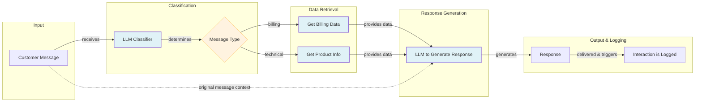
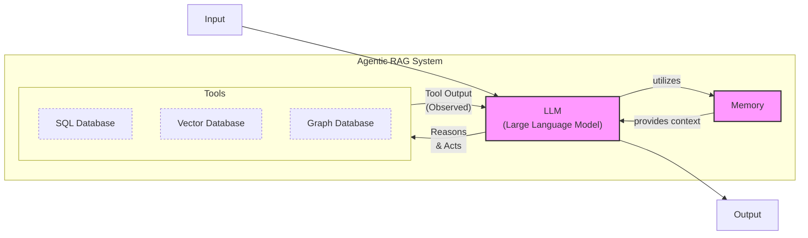
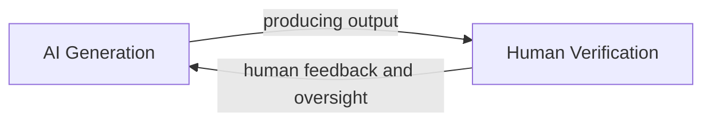
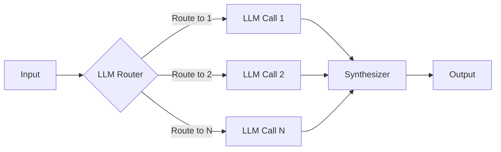
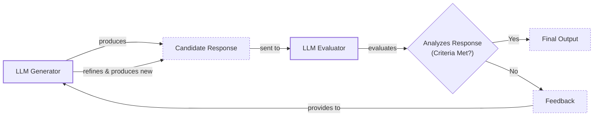
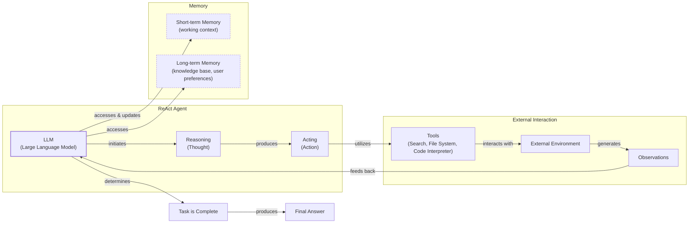
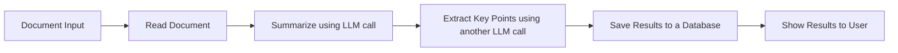

# Workflows vs. Agents: Choosing the Right Architecture for Your AI Application

As an AI engineer preparing to build your first real AI application, after narrowing down the problem you want to solve, one key decision is how to design your AI solution. Should it follow a predictable, step-by-step workflow, or does it demand a more autonomous approach, where the LLM makes self-directed decisions along the way? Thus, one of the fundamental questions that will determine the success or failure of your project is: How should you architect your AI system?

When building AI applications, engineers face this critical architectural decision early in their development process. Should you create a predictable, step-by-step workflow where you control every action, or should you build an autonomous agent that can think and decide for itself? This is one of the key decisions that will impact everything from development time and costs to reliability and user experience.

Choose the wrong approach, and you might end up with an overly rigid system that breaks when users deviate from expected patterns, or an unpredictable agent that works brilliantly 80% of the time but fails catastrophically when it matters most. We have seen real-world examples in 2024 and 2025 where this architectural decision was a primary factor in the success or failure of AI startups [[1]](https://www.ninetwothree.co/blog/ai-fails), [[2]](https://researchleap.com/ai-first-tiny-companies-case-studies-design-logic-and-emerging-governance-risks/). The successful teams and engineers know when to use workflows versus agents and, more importantly, how to combine both approaches effectively. A poorly chosen architecture can lead to months of wasted development time, frustrated users, and unsustainable operational costs.

In this lesson, we will provide you with a framework to make this critical decision confidently. We will explore the fundamental trade-offs between LLM workflows and AI agents, examine real-world examples from leading AI companies, and show you how to design robust systems that leverage the best of both worlds. By the end, you will be equipped to choose the right path for your AI applications.

## Understanding the Spectrum: From Workflows to Agents

To start, let's look at what LLM workflows and AI agents are. At this point, we will not focus on the technical specifics but on their core properties and how they are used.

An LLM workflow is a sequence of tasks that involves LLM calls and other operations, such as reading from a database or writing to a file system. These workflows are largely predefined and orchestrated by developer-written code [[3]](https://www.anthropic.com/engineering/building-effective-agents). The steps are defined in advance, resulting in deterministic or rule-based paths with predictable execution. Think of it like a factory assembly line, where each station performs a specific, pre-programmed task in a set order. This provides reliability and control.


Image 1: A flowchart illustrating a simple LLM workflow for customer support.

In contrast, AI agents are systems where an LLM plays a central role in dynamically planning the sequence of steps and actions needed to achieve a goal [[4]](https://decodingml.substack.com/p/llmops-for-production-agentic-rag), [[5]](https://cloud.google.com/discover/what-are-ai-agents). Instead of following a fixed path, the agent reasons about the task and its environment to decide what to do next. This makes them adaptive and capable of handling novel situations. An agent is like a skilled human expert tackling an unfamiliar problem, adapting their approach with each new piece of information. In future lessons, we will explore the core components of agents, including their ability to use actions, manage memory, and employ reasoning patterns like ReAct.


Image 2: Architecture of a simple Agentic RAG (Retrieval Augmented Generation) system.

Both workflows and agents require an orchestration layer, but its function differs significantly. In a workflow, the orchestrator executes a predefined plan, like a conductor leading an orchestra with a finished score [[23]](https://blog.tobiaszwingmann.com/p/ai-workflows-vs-ai-agents-vs-everything-in-between). For an agent, the orchestrator facilitates the LLM's dynamic planning and execution, acting more like a jazz ensemble leader who sets the theme but allows for improvisation [[26]](https://www.promptingguide.ai/agents/ai-workflows-vs-ai-agents). As we move forward, we will see how these architectural differences shape the capabilities and limitations of AI systems.

## Choosing Your Path

The core difference between these two approaches comes down to a trade-off: developer-defined logic versus LLM-driven autonomy. Workflows prioritize predictability and control, while agents prioritize flexibility and adaptation [[6]](https://www.youtube.com/watch?v=kQxr-uOxw2o&t=1s).

LLM workflows are best suited for tasks where the structure is well-defined and repeatable. This includes pipelines for data extraction, automated report generation, and content repurposing, like turning an article into a series of social media posts. Their strength lies in predictability, reliability, and easier debugging [[20]](https://towardsdatascience.com/a-developers-guide-to-building-scalable-ai-workflows-vs-agents/). Because the steps are fixed, costs and latency are more consistent. This makes them ideal for enterprise applications, especially in regulated fields like finance and healthcare, where accuracy and auditability are non-negotiable [[36]](https://www.nature.com/articles/s41599-026-06598-1), [[40]](https://pmc.ncbi.nlm.nih.gov/articles/PMC11105142/). However, workflows can be rigid. They struggle with unexpected scenarios, and adding new features can become complex over time.

AI agents, on the other hand, excel at open-ended research, dynamic problem-solving, and interactive tasks in unfamiliar environments. Their ability to adapt makes them powerful for complex scenarios like debugging code or handling intricate customer support issues. However, this autonomy comes with significant weaknesses. Agents are more prone to errors, and their non-deterministic nature makes performance, latency, and costs unpredictable [[18]](https://machinelearningmastery.com/5-production-scaling-challenges-for-agentic-ai-in-2026/). They often require larger, more expensive models to reason effectively, and their autonomous actions can introduce security risks. Famously, some early users of autonomous coding agents reported that the agents deleted their entire production databases, leading to jokes in the community about getting a fresh start on a new project [[1]](https://www.ninetwothree.co/blog/ai-fails).

This trade-off is not just theoretical. A 2026 benchmark of architectures for financial document extraction found that a reflexive, self-correcting loop (an agent-like pattern) achieved the highest F1-score (0.943) but at 2.3 times the cost of a simpler sequential pipeline [[54]](https://arxiv.org/html/2603.22651v1). Choosing an agent often means explicitly prioritizing performance over cost.

In reality, most production systems are not purely one or the other. They exist on a spectrum, blending elements of both to create hybrid solutions. A key concept in designing these systems is the "autonomy slider," an idea discussed by Andrej Karpathy [[15]](https://www.latent.space/p/s3). This slider allows you to determine how much control the LLM has versus the human user. For example, in the AI-powered code editor Cursor, you can move from simple tab-completion (low autonomy) to letting an agent rewrite your entire repository (high autonomy). Similarly, Perplexity offers a slider from a quick search to a "deep research" mode that gives the agent more freedom.

The goal is to create a fast and effective AI generation and human verification loop. The AI generates suggestions or actions, and the human quickly validates them. This is often achieved through a combination of well-designed architecture and a thoughtful user interface that makes verification easy. This human-in-the-loop (HITL) model is not just a design best practice; it is becoming a regulatory requirement. Frameworks like the EU AI Act mandate meaningful human oversight for high-risk AI systems, making the verification loop a cornerstone of compliant AI engineering in critical domains [[55]](https://www.firstsource.com/insights/blogs/ensuring-safety-and-ethical-compliance-agentic-ai-systems).


Image 3: A circular flow diagram illustrating the "AI Generation and Human Verification Loop".

This hybrid approach allows you to leverage the strengths of both paradigms: the reliability of workflows for predictable tasks and the flexibility of agents for the parts of a problem that require dynamic reasoning.

## Exploring Common Patterns

To build effective AI applications, it is helpful to understand the common design patterns for both workflows and agents. These patterns are the building blocks you will use to construct more complex systems.

### LLM Workflow Patterns

Workflows are all about orchestrating LLM calls and other tools in a structured way. Here are a few foundational patterns.

**Chaining and routing** is the simplest form of automation. It involves linking multiple LLM calls together, where the output of one step becomes the input for the next. You can also add routers, which are decision points that guide the workflow down different paths based on certain conditions. This pattern is useful for breaking a complex task into a series of smaller, more manageable steps.


Image 4: A flowchart illustrating the "Chaining and Routing" pattern for LLM workflows.

The **orchestrator-worker** pattern introduces a more dynamic element. A central "orchestrator" LLM analyzes a user's intent, breaks the task down into sub-tasks, and delegates them to specialized "worker" LLMs [[46]](https://mlpills.substack.com/p/diy-17-orchestrator-worker-llm-agent). Each worker might have a specific skill, like analyzing technical data or crafting marketing copy. The orchestrator then synthesizes the results from the workers into a final answer. This pattern provides a smooth transition from rigid workflows toward more agentic behavior.

```mermaid
flowchart LR
  %% Orchestrator and Input
  subgraph Orchestrator["Orchestrator LLM"]
    A["Input"]
    O["Orchestrator LLM"]
  end

  A -- "receives" --> O
  O -- "dynamically<br/>decomposes task" --> ST["Subtasks"]

  %% Worker Layer
  subgraph Workers["Worker LLMs"]
    W1["Worker LLM 1"]
    W2["Worker LLM 2"]
    WN["Worker LLM N"]
  end

  ST -- "delegates to" --> W1
  ST -- "delegates to" --> W2
  ST -- "delegates to" --> WN

  W1 -- "processes &<br/>returns" --> R1["Worker Results"]
  W2 -- "processes &<br/>returns" --> R2["Worker Results"]
  WN -- "processes &<br/>returns" --> RN["Worker Results"]

  R1 -- "feeds into" --> O
  R2 -- "feeds into" --> O
  RN -- "feeds into" --> O

  O -- "synthesizes results &<br/>produces" --> FA["Final Answer"]

  %% Visual grouping (without custom styling)
  classDef llmComponent
  classDef dataFlow
  class O,W1,W2,WN llmComponent
  class A,ST,R1,R2,RN,FA dataFlow
```
Image 5: A flowchart illustrating the Orchestrator-Worker pattern for LLM workflows.

The **evaluator-optimizer loop** is a pattern for self-correction. One LLM, the "generator," produces a response. A second LLM, the "evaluator," assesses that response against a set of criteria and provides feedback [[28]](https://dylancastillo.co/til/evaluator-optimizer-pydantic-ai.html). This feedback is then passed back to the generator, which refines its output. This loop continues until the response meets the desired quality, mimicking the iterative process a human writer might use when refining a document with an editor. However, this pattern’s effectiveness degrades significantly on open-ended or ambiguous tasks. The loop can stagnate if the evaluator provides noisy or inconsistent feedback [[57]](https://openreview.net/forum?id=TIOFvhliLA). Furthermore, as complexity increases, coordination overhead and compounding errors can cause performance to collapse, with some studies showing error amplification of over 17x in multi-agent systems without careful design [[58]](https://arxiv.org/html/2512.08296v1).


Image 6: A flowchart illustrating the "Evaluator-Optimizer" loop for LLM workflows.

### Core Components of a ReAct AI Agent

Many of these agentic patterns have roots in classic AI and robotics. For decades, autonomous systems have used a **Sense-Plan-Act (SPA)** architecture, where an agent perceives its environment, creates a plan, and then executes it [[56]](https://wednesday.is/writing-articles/building-intelligent-agents-agentic-ai-architecture-patterns). The ReAct pattern can be seen as a modern, LLM-native evolution of this fundamental idea.

While there are many types of agents, one of the most powerful and widely used patterns is **ReAct (Reason and Act)**. This pattern allows an agent to automatically decide what action to take, interpret the output of that action, and repeat the process until a task is complete. Almost all modern agents in the industry use the ReAct pattern in some form.

A ReAct agent consists of several core components:
*   An **LLM** to reason, plan, and interpret the outputs from actions.
*   A set of **actions** (also known as tools) that allow the agent to interact with its external environment, such as searching the web or accessing a database. We will cover actions in detail in Lesson 6.
*   **Short-term memory**, which serves as the agent's working memory for the current task, much like RAM in a computer.
*   **Long-term memory**, which stores factual data and user preferences across sessions. We will explore memory in depth in Lesson 9.

The agent operates in a continuous loop: it reasons about the task, selects an action, observes the result, and then uses that observation to reason about the next step. We will explain this pattern in detail in Lessons 7 and 8.


Image 7: A high-level ReAct AI agent illustrating the continuous loop of reasoning and acting, interaction with tools and the environment, and memory integration.

These patterns provide a vocabulary for designing AI systems. The goal is not to master them overnight but to build an intuition for the different tools available. In the coming lessons, we will dive deep into each one.

## Zooming In on Our Favorite Examples

To anchor these concepts in the real world, let's look at a few examples, moving from a simple workflow to a complex hybrid system. We will keep these explanations high-level, focusing on the architecture rather than deep technical details.

### Document Summarization in Google Workspace: A Simple Workflow

A common problem in team environments is finding the right information within large documents. A quick, embedded summary can save a lot of time. The document summarization feature in Google Workspace is a perfect example of a pure, multi-step workflow [[32]](https://www.datastudios.org/post/google-gemini-and-summarizing-documents-uploaded-on-drive-integration-context-and-automation), [[33]](https://cloud.google.com/blog/products/ai-machine-learning/long-document-summarization-with-workflows-and-gemini-models).


Image 8: A flowchart illustrating a simple LLM workflow for document summarization and analysis by Gemini in Google Workspace.

This workflow follows a simple, predefined chain of LLM calls:
1.  The system reads the content of a document.
2.  An LLM call is made to generate a summary.
3.  Another LLM call extracts key points from that summary.
4.  The results are saved and then displayed to the user.

Each step is clearly defined and executed in a fixed order. There is no dynamic decision-making; it is a straightforward, reliable process.

### Gemini CLI: A Single-Agent System for Coding

Writing code can be a slow process, involving reading documentation and understanding new codebases. An AI coding assistant can significantly speed this up. The open-source Gemini CLI is a great example of a single-agent system built for this purpose [[4]](https://docs.cloud.google.com/gemini/docs/codeassist/gemini-cli), [[5]](https://blog.google/innovation-and-ai/technology/developers-tools/introducing-gemini-cli-open-source-ai-agent/). It uses a ReAct-style architecture to help developers write, debug, and understand code.

```mermaid
flowchart LR
    %% Start of the Gemini CLI operational loop
    A["User Input"] -->|"Initiates"| B["Context Gathering<br/>(Directory, Tools, History)"]

    %% Agent Core Processing
    B -->|"Provides context"| C["LLM Reasoning<br/>(Analyze Input, Plan Actions)"]
    C -->|"Proposes plan"| D["Human in the Loop<br/>(Validate Execution Plan)"]

    %% Action and Feedback Loop
    D -->|"Approved plan"| E["Tool Execution<br/>(File Ops, Web Requests, Code Gen)"]
    E -->|"Generates"| F["Tool Output"]
    F -->|"Feeds into"| G["Evaluation<br/>(Run or Compile Code)"]

    %% Decision Point
    G -->|"Results"| H{"Loop Decision<br/>(Task Complete?)"}

    %% Loop Back or End
    H -- "No<br/>(Iterate)" --> C
    H -- "Yes<br/>(Task Done)" --> I["End"]
```


Image 9: Flowchart illustrating the operational loop of the Gemini CLI coding assistant, leveraging the ReAct pattern.

The operational loop looks like this:
1.  **Context Gathering:** The agent loads its working memory, including the directory structure, available actions, and conversation history.
2.  **LLM Reasoning:** The Gemini model analyzes the user's request and plans a series of actions to accomplish it.
3.  **Human in the Loop:** The user is asked to validate the proposed plan before execution.
4.  **Tool Execution:** The agent executes actions like reading files, searching documentation online, or generating code.
5.  **Evaluation:** It dynamically evaluates the results, for instance, by trying to compile the generated code.
6.  **Loop Decision:** The agent determines if the task is complete or if it needs to iterate again, refining its plan based on the new information.

This system is more flexible than a simple workflow because it can dynamically choose its actions, but it is still a single agent focused on a specific domain.

### Perplexity Deep Research: A Hybrid System

Researching a new topic can be daunting. It is often hard to know where to start. A research assistant that can scan the internet and synthesize a report can be a huge productivity booster. Perplexity's Deep Research feature is a powerful example of a hybrid system that combines agentic reasoning with workflow patterns to perform expert-level research [[8]](https://www.usaii.org/ai-insights/what-is-perplexity-deep-research-a-detailed-overview), [[9]](https://www.perplexity.ai/hub/blog/introducing-perplexity-deep-research).

This system uses multiple specialized agents, orchestrated in parallel, to perform dozens of searches across hundreds of sources and generate a comprehensive report in minutes. While the exact implementation is closed-source, we can infer its likely architecture based on common patterns.

```mermaid
flowchart LR
  %% Process Start
  A["Research Planning & Decomposition<br/>(Orchestrator breaks down question, deploys agents)"]

  %% Information Gathering Phase
  B["Parallel Information Gathering<br/>(Specialized search agents use tools)"]

  %% Analysis Phase
  C["Analysis & Synthesis<br/>(Agents validate, score, rank, summarize sources)"]

  %% Iterative Refinement Phase
  D["Iterative Refinement & Gap Analysis<br/>(Orchestrator identifies gaps, generates follow-up queries)"]

  %% Final Output
  E["Report Generation<br/>(Orchestrator generates final comprehensive report with inline citations)"]

  %% Primary Flow
  A -- "initiates" --> B
  B -- "provides raw info" --> C
  C -- "sends analyzed data" --> D

  %% Iteration Loop
  D -- "identifies gaps &<br/>generates follow-up queries" --> B

  %% Completion
  D -- "completes research" --> E

  %% Visual grouping for Orchestrator and Agent roles
  classDef orchestrator stroke-width:2px
  classDef agent stroke-dasharray:3,3

  class A,D,E orchestrator
  class B,C agent
```


Image 10: A flowchart illustrating the iterative multi-step process of Perplexity's Deep Research agent.

Here is a simplified overview of how it could work:
1.  **Research Planning & Decomposition:** An orchestrator agent analyzes the research question and breaks it down into targeted sub-questions, deploying multiple worker agents to handle each one.
2.  **Parallel Information Gathering:** Specialized search agents run in parallel, using actions like web search to gather information for their assigned sub-question.
3.  **Analysis & Synthesis:** Each agent validates, scores, and ranks its sources based on credibility and relevance, then summarizes the top results.
4.  **Iterative Refinement & Gap Analysis:** The orchestrator gathers the results and identifies knowledge gaps. It then generates follow-up queries and repeats the process until the research is complete.
5.  **Report Generation:** Finally, the orchestrator synthesizes all the information into a single, coherent report with inline citations.

Building such a system involves significant engineering challenges. Because the specialized agents run in parallel with isolated contexts, the orchestrator must provide a very detailed upfront plan. The sub-agents can produce inconsistent or conflicting results that the orchestrator must then reconcile [[59]](https://castro.fm/episode/Hw2UdH). This architecture also risks "context rot," where verbose outputs from many agents overwhelm the main agent's context window, requiring sub-agents to be designed to return only concise, essential summaries [[60]](https://milvus.io/blog/keeping-ai-agents-grounded-context-engineering-strategies-that-prevent-context-rot-using-milvus.md).

This hybrid model combines the structured planning of the orchestrator-worker pattern with the dynamic, adaptive reasoning of individual agents, allowing it to tackle complex, open-ended research tasks effectively.

## The Challenges of Every AI Engineer

Now that you understand the spectrum from LLM workflows to AI agents, it is important to recognize that every AI engineer faces these same fundamental challenges when designing a new application. The choice of architecture is one of the core decisions that determine whether your AI application succeeds in production or fails spectacularly.

As you start building, you will encounter a set of common problems:
*   **Reliability Issues:** Agents that work perfectly in demos can become unpredictable with real users. LLM reasoning failures can compound, and research shows this error propagation behaves differently depending on the architecture. Errors in chain-like workflows tend to advance stepwise, while in agentic systems with a central hub, a single failure can cause an immediate cascade across the entire system [[61]](https://arxiv.org/html/2603.04474v1).
*   **Context Limits:** Systems can struggle to maintain coherence across long conversations, losing track of their original purpose. Ensuring consistent output quality across different agent specializations is a continuous challenge.
*   **Data Integration:** Building pipelines to pull information from various sources like Slack, web APIs, and databases is complex. You must ensure that only high-quality data is passed to your AI system to avoid the "garbage-in, garbage-out" problem.
*   **Cost-Performance Trap:** Sophisticated agents can deliver impressive results but may cost a fortune per user interaction, making them economically unfeasible for many applications. Agents can consume 4-15 times more tokens than simple chat interactions [[20]](https://towardsdatascience.com/a-developers-guide-to-building-scalable-ai-workflows-vs-agents/).
*   **Security Concerns:** Autonomous agents with powerful write permissions could send incorrect emails, delete critical files, or expose sensitive data. Mitigating these risks requires engineering practices like running agents in secure sandboxes and "red-teaming" to find vulnerabilities [[64]](https://www.ibm.com/think/insights/ethics-governance-agentic-ai). This autonomy also raises complex questions of legal responsibility for an agent's actions, pushing the boundaries of existing regulations [[65]](https://www.lookout.com/blog/ethical-implications-of-ai).
*   **Debugging and Observability:** Agentic systems are notoriously difficult to debug due to their non-deterministic nature. Without robust observability—tools for tracing an agent's reasoning and decision paths—engineers cannot diagnose why a system failed, leading some to argue that visibility is more important than control [[62]](https://www.digitalapplied.com/blog/ai-workflow-orchestration-platforms-comparison), [[63]](https://dev.to/whoffagents/why-observability-matters-more-than-orchestration-in-multi-agent-ai-4h19).

The good news is that these challenges are solvable. In the upcoming lessons, we will cover patterns for building reliable products. We will start in the next lesson by exploring structured outputs, a key technique for controlling LLM responses. Later, we will dive into evaluation and monitoring pipelines, strategies for building hybrid systems, and ways to keep costs and latency under control.

By the end of this course, you will have the knowledge to architect AI systems that are not only powerful but also robust, efficient, and safe. You will know when to use a workflow, when to deploy an agent, and how to build effective hybrid systems that work in the messy, unpredictable real world.

## References

- [1] The Biggest AI Fails of 2025: Lessons from Billions in Losses. (2025, December 15). Ninetwothree. https://www.ninetwothree.co/blog/ai-fails
- [2] AI-First Tiny Companies: Case Studies, Design Logic and Emerging Governance Risks. (2025). ResearchLeap. https://researchleap.com/ai-first-tiny-companies-case-studies-design-logic-and-emerging-governance-risks/
- [3] Building effective agents. (2024, December 19). Anthropic. https://www.anthropic.com/engineering/building-effective-agents
- [4] Exploring the difference between agents and workflows. (n.d.). Decoding ML. https://decodingml.substack.com/p/llmops-for-production-agentic-rag
- [5] What is an AI agent? (2026, April 2). Google Cloud. https://cloud.google.com/discover/what-are-ai-agents
- [6] Real Agents vs. Workflows: The Truth Behind AI 'Agents'. (2025, July 12). YouTube. https://www.youtube.com/watch?v=kQxr-uOxw2o&t=1s
- [7] A Developer’s Guide to Building Scalable AI: Workflows vs Agents. (2025, June 27). Towards Data Science. https://towardsdatascience.com/a-developers-guide-to-building-scalable-ai-workflows-vs-agents/
- [8] What is Perplexity Deep Research? A Detailed Overview. (n.d.). USAii. https://www.usaii.org/ai-insights/what-is-perplexity-deep-research
- [9] Introducing Perplexity Deep Research. (n.d.). Perplexity. https://www.perplexity.ai/hub/blog/introducing-perplexity-deep-research
- [10] Comparative analysis of Deep Research tools. (n.d.). Trilogy AI. https://trilogyai.substack.com/p/comparative-analysis-of-deep-research
- [13] Cursor. (n.d.). Cursor. https://cursor.com/
- [15] Andrej Karpathy on Software 3.0: Software in the Age of AI. (2025, June 17). Latent Space. https://www.latent.space/p/s3
- [16] Building human-in-the-loop agentic workflows. (n.d.). Towards Data Science. https://towardsdatascience.com/building-human-in-the-loop-agentic-workflows/
- [17] Cursor launches always-on AI. (n.d.). Perplexity. https://www.perplexity.ai/page/cursor-launches-always-on-ai-c-FTRkrOi_QoOEw6NafRR1fw
- [18] Davies, N. (2026, March 20). 5 Production Scaling Challenges for Agentic AI in 2026. MachineLearningMastery.com. https://machinelearningmastery.com/5-production-scaling-challenges-for-agentic-ai-in-2026/
- [19] Key challenges in AI agent development and how to solve them. (n.d.). Medium. https://medium.com/@ananya_95177/key-challenges-in-ai-agent-development-and-how-to-solve-them-460fceb0a6d5
- [20] Quach, H. (2025, June 27). A Developer’s Guide to Building Scalable AI: Workflows vs Agents. Towards Data Science. https://towardsdatascience.com/a-developers-guide-to-building-scalable-ai-workflows-vs-agents/
- [21] Top 5 Pitfalls When Scaling Enterprise AI Agents and How to Avoid Them. (n.d.). Inbenta. https://www.inbenta.com/articles/top-5-pitfalls-when-scaling-enterprise-ai-agents-and-how-to-avoid-them
- [22] AI Agent vs. AI Workflow. (n.d.). Intuition Labs. https://intuitionlabs.ai/articles/ai-agent-vs-ai-workflow
- [23] Zwingmann, T. (n.d.). AI Workflows vs AI Agents vs everything in-between. AI that works. https://blog.tobiaszwingmann.com/p/ai-workflows-vs-ai-agents-vs-everything-in-between
- [25] Rierino, A. (n.d.). OpenAI and the Frontier of AI Orchestration: LLMs vs Workflows. Rierino. https://rierino.com/blog/openai-frontier-ai-orchestration-llms-vs-workflows
- [26] AI Workflows vs AI Agents. (n.d.). Prompting Guide. https://www.promptingguide.ai/agents/ai-workflows-vs-ai-agents
- [27] What is LLM orchestration? (n.d.). IBM. https://www.ibm.com/think/topics/llm-orchestration
- [28] Castillo, D. (n.d.). Evaluator-optimizer workflow with Pydantic AI. Dylan Castillo. https://dylancastillo.co/til/evaluator-optimizer-pydantic-ai.html
- [29] Evaluator-Optimizer LLM Workflow. (n.d.). Seb's Notes. https://sebgnotes.substack.com/p/evaluator-optimizer-llm-workflow
- [30] Spring AI Agentic Patterns. (2025, January 21). Spring. https://spring.io/blog/2025/01/21/spring-ai-agentic-patterns
- [31] Agentic AI: A Deep Dive into the Evaluator-Optimizer Workflow and GAIA Benchmark. (n.d.). AI in Plain English. https://ai.plainenglish.io/agentic-ai-a-deep-dive-into-the-evaluator-optimizer-workflow-and-gaia-benchmark-7c1e4257982e
- [32] Google Gemini and summarizing documents uploaded on Drive: integration, context, and automation. (n.d.). Data Studios. https://www.datastudios.org/post/google-gemini-and-summarizing-documents-uploaded-on-drive-integration-context-and-automation
- [33] Long document summarization with Workflows and Gemini models. (2024, April 30). Google Cloud Blog. https://cloud.google.com/blog/products/ai-machine-learning/long-document-summarization-with-workflows-and-gemini-models
- [34] Generative AI in Google Workspace Privacy Hub. (n.d.). Google Workspace Knowledge. https://knowledge.workspace.google.com/admin/gemini/generative-ai-in-google-workspace-privacy-hub
- [36] Responsible AI in healthcare and finance: A comparative analysis. (2026). Nature. https://www.nature.com/articles/s41599-026-06598-1
- [37] Practical Guide for LLMs in the Financial Industry. (n.d.). CFA Institute. https://rpc.cfainstitute.org/research/the-automation-ahead-content-series/practical-guide-for-llms-in-the-financial-industry
- [38] Maximizing compliance: Integrating Gen AI into the financial regulatory framework. (n.d.). IBM. https://www.ibm.com/think/insights/maximizing-compliance-integrating-gen-ai-into-the-financial-regulatory-framework
- [39] How financial services can harness LLMs safely & effectively. (n.d.). FinTech Magazine. https://fintechmagazine.com/news/how-financial-services-can-harness-llms-safely-effectively
- [40] Large Language Models in Healthcare. (n.d.). PMC. https://pmc.ncbi.nlm.nih.gov/articles/PMC11105142/
- [41] Are AI Agents Deterministic? (n.d.). Elementum.ai. https://www.elementum.ai/blog/are-ai-agents-deterministic
- [43] AI Agent vs. AI Workflow. (n.d.). Intuition Labs. https://intuitionlabs.ai/articles/ai-agent-vs-ai-workflow
- [44] LLM reasoning has striking similarities with human cognition, Brown researchers find. (2026, January). The Brown Daily Herald. https://www.browndailyherald.com/article/2026/01/llm-reasoning-has-striking-similarities-with-human-cognition-brown-researchers-find
- [45] AI Agents and Deterministic Workflows: A Spectrum. (n.d.). deepset. https://www.deepset.ai/blog/ai-agents-and-deterministic-workflows-a-spectrum
- [46] DIY #17: Orchestrator-Worker LLM Agent. (n.d.). ML Pills. https://mlpills.substack.com/p/diy-17-orchestrator-worker-llm-agent
- [47] Orchestrator-Workers Pattern. (n.d.). Claude Cookbook. https://platform.claude.com/cookbook/patterns-agents-orchestrator-workers
- [48] The Orchestrator Pattern: Routing Conversations to Specialized AI Agents. (n.d.). Dev.to. https://dev.to/akshaygupta1996/the-orchestrator-pattern-routing-conversations-to-specialized-ai-agents-33h8
- [49] Building Self-Healing AI with Orchestrator & Reflexion Patterns. (n.d.). Stevens Online. https://online.stevens.edu/blog/building-self-healing-ai-orchestrator-reflexion-patterns/
- [50] AI Agent Workflow Patterns. (n.d.). Acceli. https://www.acceli.com/blog/ai-agent-workflow-patterns
- [51] Evaluating AI Agent Frameworks. (n.d.). Wow Labz. https://wowlabz.com/evaluating-ai-agent-frameworks/
- [52] AI Agent Evaluation: Frameworks, Strategies, and Best Practices. (n.d.). Medium. https://medium.com/online-inference/ai-agent-evaluation-frameworks-strategies-and-best-practices-9dc3cfdf9892
- [53] A Developer’s Guide to Building Scalable AI: Workflows vs Agents. (n.d.). Towards Data Science. https://towardsdatascience.com/a-developers-guide-to-building-scalable-ai-workflows-vs-agents/
- [54] Benchmarking Multi-Agent Architectures for Financial Document Extraction. (2026). arXiv. https://arxiv.org/html/2603.22651v1
- [55] Ensuring Safety and Ethical Compliance in Agentic AI Systems. (n.d.). Firstsource. https://www.firstsource.com/insights/blogs/ensuring-safety-and-ethical-compliance-agentic-ai-systems
- [56] Building Intelligent Agents: Agentic AI Architecture Patterns. (n.d.). Wednesday.is. https://wednesday.is/writing-articles/building-intelligent-agents-agentic-ai-architecture-patterns
- [57] Feedback Descent: A Framework for Optimizing Text with Textual Feedback. (2025). OpenReview. https://openreview.net/forum?id=TIOFvhliLA
- [58] Domain-Dependent Scaling Laws for Multi-Agent Systems. (2025). arXiv. https://arxiv.org/html/2512.08296v1
- [59] Implementing Parallel Specialized Agents. (n.d.). Castro.fm. https://castro.fm/episode/Hw2UdH
- [60] Keeping AI Agents Grounded: Context Engineering Strategies. (n.d.). Milvus.io. https://milvus.io/blog/keeping-ai-agents-grounded-context-engineering-strategies-that-prevent-context-rot-using-milvus.md
- [61] Modeling Error Cascades in Large Language Model-based Multi-Agent Systems. (2026). arXiv. https://arxiv.org/html/2603.04474v1
- [62] AI Workflow Orchestration Platforms Comparison. (n.d.). Digital Applied. https://www.digitalapplied.com/blog/ai-workflow-orchestration-platforms-comparison
- [63] Why Observability Matters More Than Orchestration in Multi-Agent AI. (n.d.). Dev.to. https://dev.to/whoffagents/why-observability-matters-more-than-orchestration-in-multi-agent-ai-4h19
- [64] Ethics and Governance in the Age of Agentic AI. (n.d.). IBM. https://www.ibm.com/think/insights/ethics-governance-agentic-ai
- [65] The Ethical Implications of Agentic AI. (n.d.). Lookout. https://www.lookout.com/blog/ethical-implications-of-ai