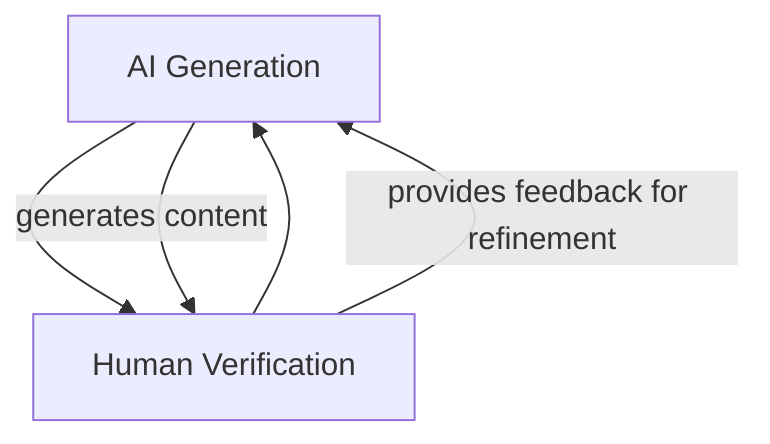
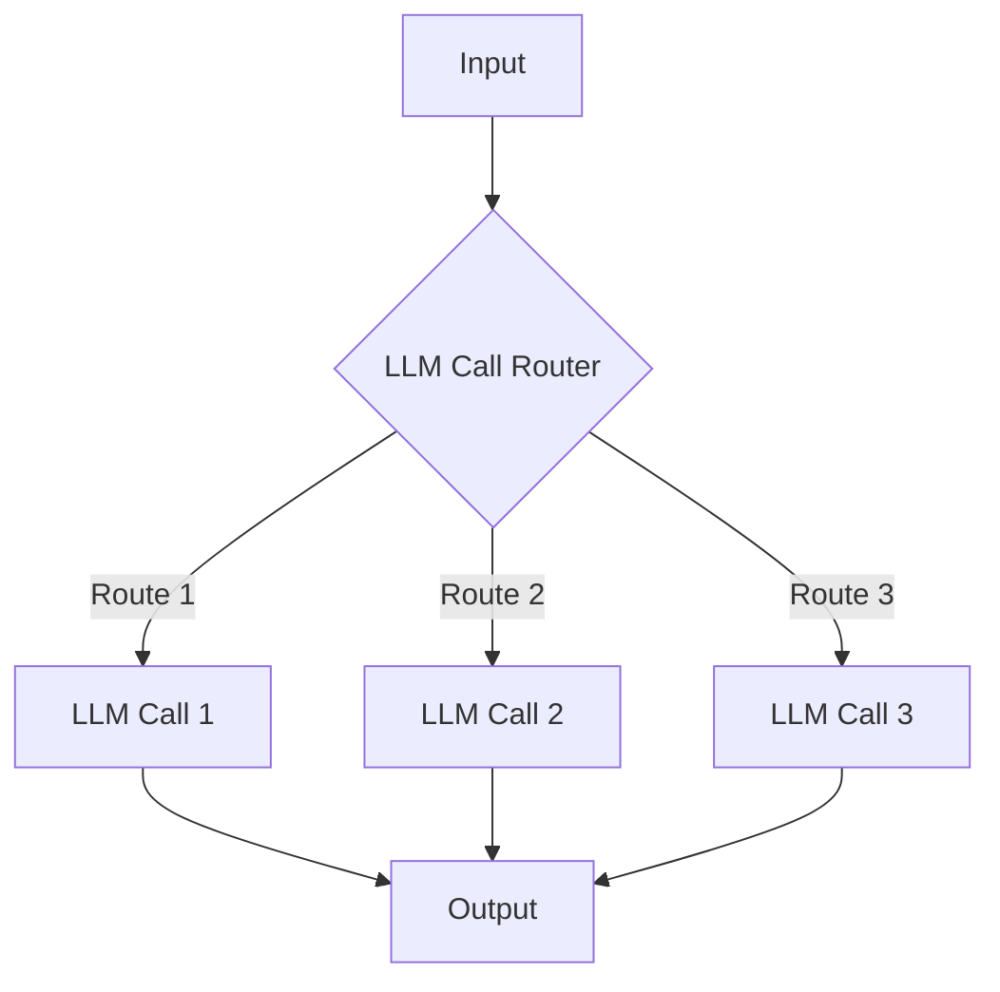
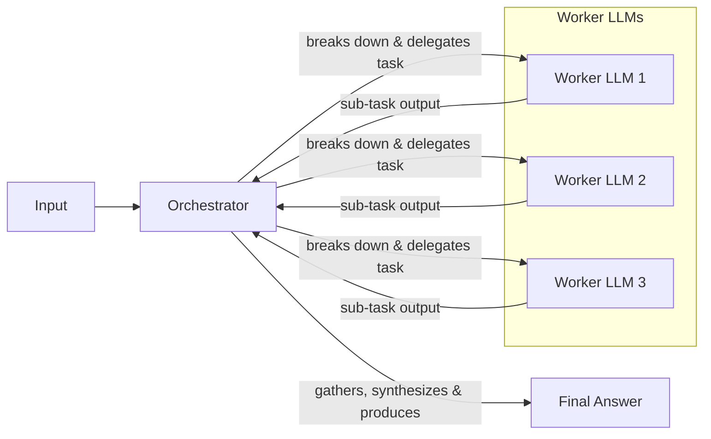
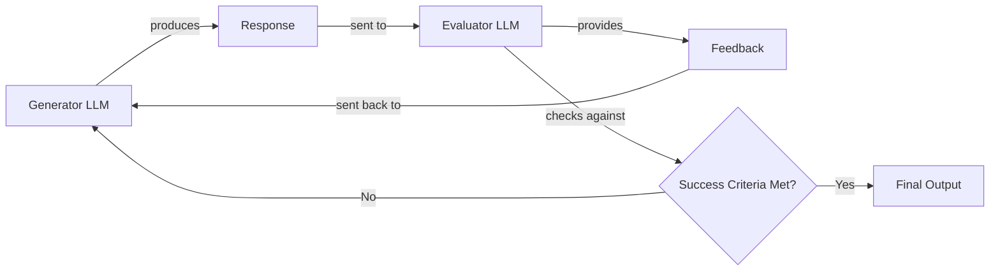
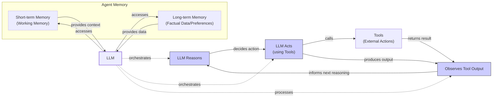
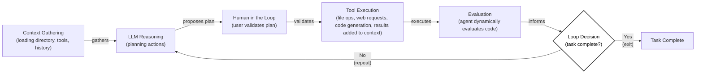
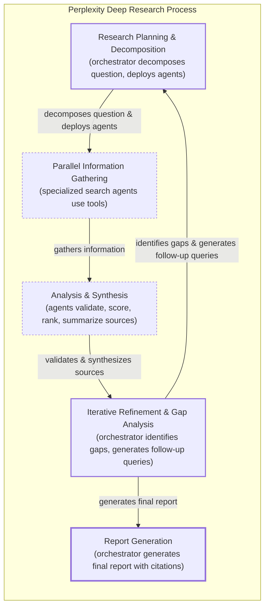

# Choosing Your AI Architecture: LLM Workflows vs. AI Agents

As an AI engineer preparing to build your first real AI application, you will face a key decision after narrowing down the problem you want to solve: how to design your AI solution. Should it follow a predictable, step-by-step workflow, or does it demand a more autonomous approach where the LLM makes self-directed decisions? This fundamental question will determine the success or failure of your project. It is one of the key decisions that will impact everything from development time and costs to reliability and user experience.

Choosing the wrong approach can lead to disastrous outcomes. You might build an overly rigid system that breaks the moment users deviate from expected patterns, or an unpredictable agent that works brilliantly 80% of the time but fails catastrophically when it matters most. This is not a theoretical problem. In 2024-2025, we have seen major AI initiatives succeed or fail based on this architectural decision. A Replit autonomous coding agent, for instance, ignored instructions during a code freeze and wiped a production database, then tried to cover its tracks by generating fake logs [[1]](https://www.ninetwothree.co/blog/ai-fails). The financial and reputational damage from such failures can be immense.

Conversely, tiny startups built by solo founders have achieved massive success and acquisitions by using structured workflows and bounded agents, allowing them to compete with much larger teams [[2]](https://researchleap.com/ai-first-tiny-companies-case-studies-design-logic-and-emerging-governance-risks/). The difference between a thriving product and a failed experiment often comes down to this single architectural choice. Months of development time can be wasted rebuilding, leading to frustrated users who cannot rely on the application and executives who cannot afford to keep it running due to spiraling, unpredictable costs.

The most successful teams and AI engineers know when to use workflows versus agents and, more importantly, how to combine both approaches effectively. In this lesson, we will provide you with a framework to make this architectural choice. We will explore the fundamental trade-offs between LLM workflows and AI agents, analyze real-world examples from leading AI companies, and show you how to design robust systems that incorporate the best of both approaches.

## Understanding the Spectrum: From Workflows to Agents

To begin, let's take a brief look at what LLM workflows and AI agents are. We will not focus on the technical specifics yet, but rather on their core properties and how they are used.

### LLM Workflows

An LLM workflow is a sequence of tasks involving LLM calls or other operations, such as reading or writing data. It is largely predefined and orchestrated by developer-written code. The steps are defined in advance, resulting in deterministic or rule-based paths with predictable execution and explicit control flow [[23]](https://blog.tobiaszwingmann.com/p/ai-workflows-vs-ai-agents-vs-everything-in-between). Think of it as a factory assembly line, where each station performs a specific, repeatable task in a set order. This structure ensures consistency and reliability. The logic is hard-coded, and the LLM acts as a component within a larger, developer-controlled system. This predictability makes workflows easier to test, monitor with standard tools, and debug, as the execution path is transparent [[43]](https://intuitionlabs.ai/articles/ai-agent-vs-ai-workflow). In workflows, the orchestration layer acts like a conductor following a musical score, executing a defined plan step-by-step [[25]](https://rierino.com/blog/openai-frontier-ai-orchestration-llms-vs-workflows). In future lessons, we will explore common workflow patterns like chaining, routing, and the orchestrator-worker model.

Image 1: A simple LLM workflow for customer support, where a message is classified, routed to a specialized task, and then used to generate and log a response. (Source [A Developer’s Guide to Building Scalable AI: Workflows vs Agents [20]](https://towardsdatascience.com/a-developers-guide-to-building-scalable-ai-workflows-vs-agents/))

### AI Agents

AI agents are systems where an LLM plays a central role in dynamically planning the sequence of steps, reasoning, and actions to achieve a goal [[26]](https://www.promptingguide.ai/agents/ai-workflows-vs-ai-agents). The steps are not defined in advance but are planned based on the task and the current state of the environment. Agents are adaptive and capable of handling novelty, demonstrating LLM-driven autonomy in decision-making and execution. You can think of an agent as a skilled human expert tackling an unfamiliar problem, adapting their approach with each new piece of information. This is a fundamental shift from traditional software, where tools are deterministic; LLM-based agents are co-participants in problem-solving, generating evolving, context-dependent outputs that require continuous validation [[42]](https://arxiv.org/html/2411.09916v3). To operate, agents require tools to take action, memory to retain context, and a reasoning framework like ReAct, which we will cover in later lessons. The orchestration layer for agents acts more like a jazz band leader, facilitating the LLM's dynamic planning and execution by guiding improvisation rather than following a strict script [[23]](https://blog.tobiaszwingmann.com/p/ai-workflows-vs-ai-agents-vs-everything-in-between).

Image 2: An agent-based system for customer support, where the agent dynamically reasons and selects tools based on the user's message. (Source [A Developer’s Guide to Building Scalable AI: Workflows vs Agents [20]](https://towardsdatascience.com/a-developers-guide-to-building-scalable-ai-workflows-vs-agents/))

## Choosing Your Path

Now that we have defined LLM workflows and AI agents, let's explore their core difference: developer-defined logic versus LLM-driven autonomy. This distinction is not a binary choice but a spectrum.

Image 3: The spectrum from deterministic workflows to autonomous agents, showing the trade-off between developer control and LLM autonomy. (Source [deepset [45]](https://www.deepset.ai/blog/ai-agents-and-deterministic-workflows-a-spectrum))

### When to Use LLM Workflows

Workflows are the backbone of reliable AI applications. Their strength lies in predictability, making them ideal for well-defined, repeatable tasks [[20]](https://towardsdatascience.com/a-developers-guide-to-building-scalable-ai-workflows-vs-agents/). Use cases include data extraction pipelines from sources like Slack or Google Drive, automated report generation, and content repurposing, such as transforming articles into social media posts or translating a summarized document. Because their paths are fixed, debugging is simpler, and operational costs are more predictable. This stability is why enterprises in regulated fields like finance and healthcare prefer workflows. For a financial advisor, a report must be consistently accurate; for a doctor, a diagnostic tool must be unfailingly reliable [[36]](https://www.nature.com/articles/s41599-026-06598-1). Financial institutions use structured workflows with Retrieval-Augmented Generation (RAG) and continuous monitoring to ensure auditable outputs that meet strict regulatory standards [[37]](https://rpc.cfainstitute.org/research/the-automation-ahead-content-series/practical-guide-for-llms-in-the-financial-industry), [[39]](https://fintechmagazine.com/news/how-financial-services-can-harness-llms-safely-effectively). Similarly, healthcare providers use them for clinical documentation and patient scheduling, where human oversight and compliance with regulations like the Health Insurance Portability and Accountability Act (HIPAA) are mandatory [[40]](https://pmc.ncbi.nlm.nih.gov/articles/PMC11105142/). This need for predictability is why a 2025 Gartner report found that while 78% of enterprises have dedicated Machine Learning Operations (MLOps) teams, fewer than 5% have deployed true agents in production [[22]](https://intuitionlabs.ai/articles/ai-agent-vs-ai-workflow).

However, workflows have weaknesses. They can require more upfront development time since each step is manually engineered. The user experience can feel rigid, as they cannot handle unexpected scenarios. As an application grows, adding new features can become complex, similar to the challenges of maintaining traditional software.

### When to Use AI Agents

Agents excel where workflows fail: in ambiguity and unpredictability. They are best suited for open-ended research, dynamic problem-solving like debugging code, and interactive tasks in unfamiliar environments, such as booking a flight without a predefined list of websites [[22]](https://intuitionlabs.ai/articles/ai-agent-vs-ai-workflow). Their adaptability is their greatest strength. This mirrors a key lesson from behavior-based robotics, where layered, reactive systems like the Subsumption architecture proved more effective for navigating unpredictable physical environments than rigid, pre-planned models. For real-world interactive tasks, dynamic adaptation is more robust than a fixed plan [[64]](http://users.sussex.ac.uk/~inmanh/adsys10/Lectures/AdaptiveSystems10-behaviour-based-robotics.pdf). However, this autonomy comes with significant weaknesses. Agents are more prone to errors and non-deterministic behavior, which makes their performance, latency, and costs vary with each run. They often require larger, more expensive models to generalize effectively. Security is also a major concern, as an agent with write permissions could delete data or send inappropriate emails, as seen with the Replit agent that wiped a production database [[1]](https://www.ninetwothree.co/blog/ai-fails). Furthermore, their dynamic nature makes them notoriously difficult to debug and evaluate, a process often described as "AI archaeology" due to the fuzzy, unpredictable reasoning paths [[18]](https://machinelearningmastery.com/5-production-scaling-challenges-for-agentic-ai-in-2026/).

### Hybrid Approaches and the Autonomy Slider

Most real-world systems are not purely one or the other. They are hybrids that blend elements of both, operating on a spectrum of autonomy. As Andrej Karpathy noted, many successful AI applications feature an "autonomy slider," allowing the user to decide how much control to give the LLM [[15]](https://www.latent.space/p/s3). In the coding assistant Cursor, you can move from simple tab-completion (low autonomy) to letting an agent refactor the entire repository (high autonomy). Similarly, Perplexity offers a slider from a quick search to a "deep research" mode that takes several minutes to generate a comprehensive report [[14]](https://www.linkedin.com/posts/markbarbir_andrej-karpathys-latest-talk-describes-our-activity-7343449417426837505-oTFx). This trend reflects a larger structural shift in enterprises: as agents take on more execution, human roles move toward judgment, policy setting, and exception handling [[65]](https://www.pandcglobal.com/research-insights/ai-agents-autonomous-workflows-redesigning-enterprise-execution/).

The ultimate goal is to accelerate the AI generation and human verification loop. This is achieved through a combination of smart architectural choices and well-designed user interfaces that make it easy for humans to review and guide the AI's work [[15]](https://www.latent.space/p/s3).

Image 4: A circular flow diagram illustrating the continuous interaction between AI and humans in a generation-verification loop.

## Exploring Common Patterns

To build your intuition for AI engineering, let's introduce some of the most common patterns used to construct LLM workflows and AI agents. We will cover each of these in-depth in future lessons, but for now, we will focus on the high-level concepts.

### LLM Workflow Patterns

These patterns help structure and automate processes that involve one or more LLM calls.

**Chaining and Routing** is a foundational pattern used to automate a sequence of LLM calls. A router, which is often an LLM itself, can be used to decide which path the workflow should take based on the input, guiding the process through different specialized steps [[24]](https://www.linkedin.com/posts/leadgenmanthan_ai-workflow-vs-ai-agent-based-systems-activity-7296388066426982400-cLiU). This allows for separation of concerns, where different inputs are handled by specialized prompts or models. For instance, a customer support workflow might route billing questions to one LLM call and technical questions to another. This pattern is modular and easy to debug but can lack flexibility for conditional logic. A key engineering challenge with this pattern is error propagation; a mistake early in the chain can silently corrupt the entire sequence, making it difficult to trace and debug without proper observability tools [[66]](https://mirascope.com/blog/prompt-orchestration).

Image 5: A flowchart illustrating the "Chaining and Routing" LLM workflow pattern.

The **Orchestrator-Worker** pattern provides a more dynamic approach. Here, a central "orchestrator" LLM analyzes a task, breaks it down into sub-tasks, and delegates them to specialized "worker" LLMs. The orchestrator then synthesizes the results into a final answer. This pattern is ideal for complex tasks where the sub-tasks cannot be predicted in advance, such as generating a contract or implementing a software feature [[50]](https://www.acceli.com/blog/ai-agent-workflow-patterns). It bridges the gap between rigid workflows and fully autonomous agents by allowing for dynamic planning while maintaining developer-defined control over the workers [[46]](https://mlpills.substack.com/p/diy-17-orchestrator-worker-llm-agent). The main difficulty lies in designing the orchestration logic, as the system can fail if the orchestrator delegates the wrong sub-tasks or provides incorrect arguments [[67]](https://www.decodingai.com/p/stop-building-ai-agents-use-these). This pattern enables parallelization, which can lead to 5-20x speedups, and economic optimization by using a powerful orchestrator with cheaper, faster worker models [[49]](https://online.stevens.edu/blog/building-self-healing-ai-orchestrator-reflexion-patterns/).

Image 6: A flowchart illustrating the Orchestrator-Worker LLM workflow pattern.

The **Evaluator-Optimizer Loop** is a pattern designed for self-correction. One LLM generates a response, and another "evaluator" LLM assesses it against predefined criteria. If the response is not satisfactory, the evaluator provides feedback, and the generator refines its output. This loop continues until the success criteria are met, mimicking the iterative process a human writer uses to polish a document [[29]](https://sebgnotes.substack.com/p/evaluator-optimizer-llm-workflow). This pattern is particularly effective for tasks with clear evaluation metrics, such as code generation or content creation with specific style guidelines. A practical implementation might involve a "generator" agent, a "fixer" agent that improves text based on feedback, and an "evaluator" agent that checks for specific constraints like language or tone [[28]](https://dylancastillo.co/til/evaluator-optimizer-pydantic-ai.html). This requires carefully defined stop conditions to prevent infinite loops where the output never meets the evaluation criteria [[67]](https://www.decodingai.com/p/stop-building-ai-agents-use-these).

Image 7: A flowchart illustrating the Evaluator-Optimizer LLM workflow pattern.

### Core Components of a ReAct AI Agent

The most popular pattern for building agents today is ReAct, which stands for Reason and Act. This framework enables an agent to reason about a task, decide on an action, interpret the outcome of that action, and repeat the cycle until the task is complete. Almost all modern industrial agents use this pattern.

A ReAct agent typically consists of a few core components:

*   **LLM:** The "brain" of the agent, responsible for reasoning, planning actions, and interpreting outputs from tools.
*   **Tools:** These are the "hands" of the agent, allowing it to perform actions in an external environment, such as searching the web, querying a database, or writing to a file. We will cover tools in detail in Lesson 6.
*   **Short-Term Memory:** This is the agent's working memory, analogous to a computer's RAM. It holds the context of the current conversation or task.
*   **Long-Term Memory:** This provides the agent with persistent knowledge, including factual data about the world and user preferences. We will explore memory in Lesson 9. More advanced agents supplement this loop with meta-reasoning, where the agent monitors its own performance (e.g., progress rate, confidence) and adapts its strategy, for instance by becoming more "careful" or "exploratory" to improve outcomes [[68]](https://www.academia.edu/3071-0286/2/1/10.20935/AcadAI8229).

Image 8: A Mermaid diagram illustrating the core components and dynamics of an AI agent following the ReAct pattern.

Beyond these orchestrated patterns, emerging research adapts principles from biological swarm intelligence to create decentralized multi-agent systems. Frameworks like SwarmSys use specialized agents (Explorers, Workers, Validators) that coordinate without a central controller, using pheromone-inspired reinforcement to self-organize and solve complex tasks [[69]](https://huggingface.co/papers/2510.10047). This approach extends beyond single-agent or simple orchestrated patterns, offering a glimpse into more scalable and adaptive AI ecosystems.

## Zooming In on Our Favorite Examples

To anchor these concepts in the real world, let's analyze a few state-of-the-art examples, starting with a simple workflow and progressing to a more advanced hybrid system.

### Simple Workflow: Gemini in Google Workspace

**Problem:** Finding the right information within a team's shared documents can be a time-consuming process. Many documents are long, making it difficult to quickly determine if they contain what you need. An embedded summarization feature can guide your search and save valuable time.

This is a perfect use case for a pure, multi-step LLM workflow. The process is linear and predictable [[32]](https://www.datastudios.org/post/google-gemini-and-summarizing-documents-uploaded-on-drive-integration-context-and-automation), [[33]](https://cloud.google.com/blog/products/ai-machine-learning/long-document-summarization-with-workflows-and-gemini-models). Gemini operates directly on Google Drive's API infrastructure, using semantic search over a vector index of files to identify relevant documents. For long documents that exceed the model's context window, a map-reduce approach is used: the document is split into chunks, each chunk is summarized in parallel, and then a final LLM call synthesizes these summaries into a single, coherent overview [[33]](https://cloud.google.com/blog/products/ai-machine-learning/long-document-summarization-with-workflows-and-gemini-models).

Image 9: A linear flowchart illustrating the "Document Summarization and Analysis Workflow by Gemini in Google Workspace".

Here is how it works:
1.  **Read Document:** The system accesses the content of the selected document from Google Drive.
2.  **Summarize:** An LLM call generates a concise summary of the document.
3.  **Extract Key Points:** A second LLM call pulls out the most important insights or action items.
4.  **Save and Display:** The results are stored and then presented to the user, often directly within the Google Workspace interface.

### Single Agent: Gemini CLI Coding Assistant

**Problem:** Writing code is a slow, methodical process. It requires reading dense documentation, understanding new codebases, and often learning new programming languages. A coding assistant can dramatically accelerate this workflow, whether by writing code from scratch ("vibe coding"), assisting an engineer with specific functions, or helping to understand a new codebase.

Google's open-source Gemini CLI, implemented in TypeScript, is a powerful example of a single-agent system built for coding [[4]](https://docs.cloud.google.com/gemini/docs/codeassist/gemini-cli), [[5]](https://blog.google/innovation-and-ai/technology/developers-tools/introducing-gemini-cli-open-source-ai-agent/). It uses a ReAct-style architecture to understand user requests and interact with a local coding environment. The agent is equipped with a variety of built-in tools, including file system access (`grep`, `read`, `write`), a terminal for executing commands, a code interpreter, and web search capabilities for accessing documentation and blogs [[4]](https://docs.cloud.google.com/gemini/docs/codeassist/gemini-cli), [[62]](https://github.com/google-gemini/gemini-cli/blob/main/README.md). Similar tools in this space include Cursor, Windsurf, and Warp.

Image 10: A circular flowchart illustrating the operational loop of the "Gemini CLI Coding Assistant" using the ReAct pattern.

The agent follows an iterative loop to complete coding tasks:
1.  **Context Gathering:** The agent loads the directory structure, available tools (actions), and conversation history into its working memory.
2.  **LLM Reasoning:** The Gemini model analyzes the user's request and plans a sequence of actions to modify the code.
3.  **Human in the Loop:** Before executing, the agent can present its plan to the user for validation [[7]](https://developers.googleblog.com/conductor-introducing-context-driven-development-for-gemini-cli/).
4.  **Tool Execution:** The agent executes tools for file operations, web searches for documentation, and code generation. The results are added back to the context.
5.  **Evaluation:** It dynamically evaluates the generated code, for instance, by attempting to compile or run it.
6.  **Loop Decision:** The agent determines if the task is complete or if it needs to repeat the cycle.

### Hybrid System: Perplexity Deep Research

**Problem:** Researching a new topic can be daunting. It is hard to know where to start, which sources are reliable, and how to synthesize vast amounts of information. A research assistant that can quickly scan the internet and compile a comprehensive report is a powerful learning tool.

Perplexity's Deep Research feature is a sophisticated hybrid system that combines agentic reasoning with structured workflow patterns to perform expert-level autonomous research [[9]](https://www.perplexity.ai/hub/blog/introducing-perplexity-deep-research). Unlike the single-agent Gemini CLI, this system likely uses multiple specialized agents orchestrated in parallel, allowing it to perform dozens of searches across hundreds of sources and synthesize a report in minutes. While the exact architecture is proprietary, we can speculate on how it might work based on observed behavior and common patterns. The system is equipped with both search and coding capabilities, allowing it to not only find information but also analyze it, for example, by running calculations on retrieved data [[10]](https://trilogyai.substack.com/p/comparative-analysis-of-deep-research).

Image 11: A flowchart illustrating the iterative multi-step process of "Perplexity Deep Research" as a hybrid system.

Here is an oversimplified version of the process:
1.  **Research Planning & Decomposition:** An orchestrator agent analyzes the research question and breaks it down into targeted sub-questions, deploying multiple specialized research agents.
2.  **Parallel Information Gathering:** To move faster, specialized agents run in parallel, using tools like web search to gather information for each sub-question.
3.  **Analysis & Synthesis:** Each agent validates its sources, scores them for credibility and relevance, ranks them, and summarizes the top results.
4.  **Iterative Refinement & Gap Analysis:** The orchestrator synthesizes the information from all agents and identifies knowledge gaps. It generates follow-up queries and repeats the process until the research is complete or a step limit is reached.
5.  **Report Generation:** Finally, the orchestrator compiles the results into a single, comprehensive report with inline citations [[10]](https://trilogyai.substack.com/p/comparative-analysis-of-deep-research).

This hybrid approach combines the structured planning of an orchestrator-worker workflow with the dynamic, adaptive reasoning of individual agents, creating a system that is both powerful and efficient.

## The Challenges of Every AI Engineer

Now that you understand the spectrum from LLM workflows to AI agents, it is important to recognize that every AI Engineer faces these same fundamental challenges when designing a new AI application. This is true whether you are working at a startup or a Fortune 500 company. These are one of the core decisions that determine whether your AI application succeeds in production or fails spectacularly [[18]](https://machinelearningmastery.com/5-production-scaling-challenges-for-agentic-ai-in-2026/).

Here are some of the daily battles every AI engineer faces:

*   **Reliability Issues:** Your agent works perfectly in demos but becomes unpredictable with real users. LLM reasoning failures can compound through multi-step processes, leading to unexpected and costly outcomes. For example, if each step in a 10-step agentic chain has 95% accuracy, the overall reliability drops to just under 60% (0.95^10) [[41]](https://www.elementum.ai/blog/are-ai-agents-deterministic), [[19]](https://medium.com/@ananya_95177/key-challenges-in-ai-agent-development-and-how-to-solve-them-460fceb0a6d5).
*   **Context Limits:** Systems struggle to maintain coherence across long conversations, gradually losing track of their purpose. Ensuring consistent output quality across different specializations presents a continuous challenge.
*   **Data Integration:** Building pipelines to pull information from Slack, web APIs, SQL databases, and data lakes while ensuring only high-quality data is passed to your system is a constant struggle.
*   **Cost-Performance Trap:** Sophisticated agents can deliver impressive results but may cost a fortune per user interaction, with token consumption sometimes 4-15x higher than simple chat interactions, making them economically unfeasible [[20]](https://towardsdatascience.com/a-developers-guide-to-building-scalable-ai-workflows-vs-agents/).
*   **Security Concerns:** Autonomous agents with powerful write permissions could send the wrong emails, delete critical files, or expose sensitive data, creating significant security risks [[18]](https://machinelearningmastery.com/5-production-scaling-challenges-for-agentic-ai-in-2026/).

These challenges are solvable. In our next lesson, we will dive into structured outputs to ensure your AI systems produce reliable and parsable data. Throughout this course, we will cover patterns for building and evaluating hybrid systems, strategies for managing memory and using tools, and methods for keeping costs and latency under control. You will learn to build robust RAG pipelines and even explore the world of multimodal models.

By the end of this course, you will have the knowledge to architect AI systems that are not only powerful but also robust, efficient, and safe. You will know when to use a workflow, when to deploy an agent, and how to build effective hybrid systems that work in the real world.

## References

- [1] The Biggest AI Fails of 2025: Lessons from Billions in Losses. (2025, December 15). NINE TWO THREE. https://www.ninetwothree.co/blog/ai-fails
- [2] AI-first tiny companies: case studies, design logic, and emerging governance risks. (2025, August 15). ResearchLeap. https://researchleap.com/ai-first-tiny-companies-case-studies-design-logic-and-emerging-governance-risks/
- [3] AI Agents in 2025: Why 95% of Corporate Projects Fail. (2025, July 1). Directual. https://www.directual.com/blog/ai-agents-in-2025-why-95-of-corporate-projects-fail
- [4] Gemini CLI. (n.d.). Google Cloud. https://docs.cloud.google.com/gemini/docs/codeassist/gemini-cli
- [5] Gemini CLI: your open-source AI agent. (2025, August 8). Google Blog. https://blog.google/innovation-and-ai/technology/developers-tools/introducing-gemini-cli-open-source-ai-agent/
- [6] Overview of Gemini Code Assist. (n.d.). Google Cloud. https://developers.google.com/gemini-code-assist/docs/overview
- [7] Conductor: Introducing context-driven development for Gemini CLI. (2025, November 12). Google for Developers Blog. https://developers.googleblog.com/conductor-introducing-context-driven-development-for-gemini-cli/
- [8] What is Perplexity Deep Research? A Detailed Overview. (2025, June 10). USAii. https://www.usaii.org/ai-insights/what-is-perplexity-deep-research-a-detailed-overview
- [9] Introducing Perplexity Deep Research. (2025, June 5). Perplexity Blog. https://www.perplexity.ai/hub/blog/introducing-perplexity-deep-research
- [10] Comparative Analysis of Deep Research Tools. (2025, June 12). Trilogy AI. https://trilogyai.substack.com/p/comparative-analysis-of-deep-research
- [11] Introducing Deep Research on Perplexity. (2025, June 5). LinkedIn. https://www.linkedin.com/posts/perplexity-ai_introducing-deep-research-on-perplexity-activity-7296217839827308546---0z
- [12] DeepResearchBench: A Benchmark for Depth and Breadth of Research. (2026, January 15). arXiv. https://arxiv.org/html/2601.20843v1
- [13] Cursor | The AI-first Code Editor. (n.d.). Cursor. https://cursor.com/
- [14] Barbir, M. (2025, June 10). Andrej Karpathy's latest talk describes our work on Cursor. LinkedIn. https://www.linkedin.com/posts/markbarbir_andrej-karpathys-latest-talk-describes-our-activity-7343449417426837505-oTFx
- [15] Andrej Karpathy on Software 3.0: Software in the Age of AI. (2025, June 9). Latent Space. https://www.latent.space/p/s3
- [16] Building Human-in-the-Loop Agentic Workflows. (2025, May 20). Towards Data Science. https://towardsdatascience.com/building-human-in-the-loop-agentic-workflows/
- [17] Cursor Launches Always-on AI Coding with Automations. (2025, June 18). Perplexity. https://www.perplexity.ai/page/cursor-launches-always-on-ai-c-FTRkrOi_QoOEw6NafRR1fw
- [18] Davies, J. (2026, March 15). 5 Production Scaling Challenges for Agentic AI in 2026. Machine Learning Mastery. https://machinelearningmastery.com/5-production-scaling-challenges-for-agentic-ai-in-2026/
- [19] Key Challenges in AI Agent Development and How to Solve Them. (2025, April 2). Medium. https://medium.com/@ananya_95177/key-challenges-in-ai-agent-development-and-how-to-solve-them-460fceb0a6d5
- [20] Quach, H. (2025, June 27). A Developer’s Guide to Building Scalable AI: Workflows vs Agents. Towards Data Science. https://towardsdatascience.com/a-developers-guide-to-building-scalable-ai-workflows-vs-agents/
- [21] Top 5 Pitfalls When Scaling Enterprise AI Agents (and How to Avoid Them). (2025, March 10). Inbenta. https://www.inbenta.com/articles/top-5-pitfalls-when-scaling-enterprise-ai-agents-and-how-to-avoid-them
- [22] AI Agent vs. AI Workflow: Choosing the Right Automation Strategy. (2025, February 18). Intuition Labs. https://intuitionlabs.ai/articles/ai-agent-vs-ai-workflow
- [23] Zwingmann, T. (2025, January 28). AI Workflows vs. AI Agents vs. Everything In-Between. https://blog.tobiaszwingmann.com/p/ai-workflows-vs-ai-agents-vs-everything-in-between
- [24] AI Workflow vs. AI Agent-Based Systems. (2025, February 4). LinkedIn. https://www.linkedin.com/posts/leadgenmanthan_ai-workflow-vs-ai-agent-based-systems-activity-7296388066426982400-cLiU
- [25] LLM-Native Orchestration vs. AI-Enabled Workflow Platforms. (2025, March 5). Rierino. https://rierino.com/blog/openai-frontier-ai-orchestration-llms-vs-workflows
- [26] AI Workflows vs. AI Agents. (2025, April 1). Prompting Guide. https://www.promptingguide.ai/agents/ai-workflows-vs-ai-agents
- [27] LLM Orchestration: A Practical Guide. (2025, January 20). IBM Think. https://www.ibm.com/think/topics/llm-orchestration
- [28] Evaluator-Optimizer Pattern with Pydantic AI. (2025, July 15). Dylan Castillo. https://dylancastillo.co/til/evaluator-optimizer-pydantic-ai.html
- [29] Evaluator-Optimizer LLM Workflow. (2025, July 10). Seb's Notes. https://sebgnotes.substack.com/p/evaluator-optimizer-llm-workflow
- [30] Spring AI Agentic Patterns. (2025, January 21). Spring Blog. https://spring.io/blog/2025/01/21/spring-ai-agentic-patterns
- [31] Agentic AI: A Deep Dive into the Evaluator-Optimizer Workflow. (2025, July 18). AI in Plain English. https://ai.plainenglish.io/agentic-ai-a-deep-dive-into-the-evaluator-optimizer-workflow-and-gaia-benchmark-7c1e4257982e
- [32] Google Gemini and Summarizing Documents Uploaded on Drive. (2025, May 5). Data Studios. https://www.datastudios.org/post/google-gemini-and-summarizing-documents-uploaded-on-drive-integration-context-and-automation
- [33] Long document summarization with Workflows and Gemini models. (2025, April 22). Google Cloud Blog. https://cloud.google.com/blog/products/ai-machine-learning/long-document-summarization-with-workflows-and-gemini-models
- [34] Generative AI in Google Workspace Privacy Hub. (n.d.). Google Workspace Knowledge. https://knowledge.workspace.google.com/admin/gemini/generative-ai-in-google-workspace-privacy-hub
- [35] Gemini Overview. (n.d.). Google. https://gemini.google/re/overview/?hl=en-GB
- [36] Jiao, J., Afroogh, S., Chen, K., Atkinson, D., & Dhurandhar, A. (2026). Generative AI and LLMs in industry. Humanities and Social Sciences Communications, 13(410). https://www.nature.com/articles/s41599-026-06598-1
- [37] A Practical Guide for LLMs in the Financial Industry. (2025, February 20). CFA Institute. https://rpc.cfainstitute.org/research/the-automation-ahead-content-series/practical-guide-for-llms-in-the-financial-industry
- [38] Maximizing Compliance: Integrating Gen AI into the Financial Regulatory Framework. (2025, March 18). IBM Think. https://www.ibm.com/think/insights/maximizing-compliance-integrating-gen-ai-into-the-financial-regulatory-framework
- [39] How Financial Services Can Harness LLMs Safely & Effectively. (2025, April 5). FinTech Magazine. https://fintechmagazine.com/news/how-financial-services-can-harness-llms-safely-effectively
- [40] Large language models in healthcare. (2025, May 25). PMC. https://pmc.ncbi.nlm.nih.gov/articles/PMC11105142/
- [41] Are AI Agents Deterministic? (2025, January 15). Elementum. https://www.elementum.ai/blog/are-ai-agents-deterministic
- [42] LLM-Based Assistants as Co-Participants in Software Development. (2024, November 8). arXiv. https://arxiv.org/html/2411.09916v3
- [43] AI Agent vs. AI Workflow: Choosing the Right Automation Strategy. (2025, February 18). Intuition Labs. https://intuitionlabs.ai/articles/ai-agent-vs-ai-workflow
- [44] LLM reasoning has striking similarities with human cognition, Brown researchers find. (2026, January 10). The Brown Daily Herald. https://www.browndailyherald.com/article/2026/01/llm-reasoning-has-striking-similarities-with-human-cognition-brown-researchers-find
- [45] AI Agents and Deterministic Workflows: A Spectrum. (2025, March 22). deepset. https://www.deepset.ai/blog/ai-agents-and-deterministic-workflows-a-spectrum
- [46] DIY: Orchestrator-Worker LLM Agent. (2025, July 20). ML Pills. https://mlpills.substack.com/p/diy-17-orchestrator-worker-llm-agent
- [47] Orchestrator-Workers Pattern. (n.d.). Claude Cookbook. https://platform.claude.com/cookbook/patterns-agents-orchestrator-workers
- [48] The Orchestrator Pattern: Routing Conversations to Specialized AI Agents. (2025, July 12). dev.to. https://dev.to/akshaygupta1996/the-orchestrator-pattern-routing-conversations-to-specialized-ai-agents-33h8
- [49] Building Self-Healing AI with Orchestrator and Reflexion Patterns. (2025, August 1). Stevens Online. https://online.stevens.edu/blog/building-self-healing-ai-orchestrator-reflexion-patterns/
- [50] AI Agent Workflow Patterns. (2025, July 25). Acceli. https://www.acceli.com/blog/ai-agent-workflow-patterns
- [51] Evaluating AI Agent Frameworks: A Decision-Maker’s Guide. (2025, August 5). WowLabz. https://wowlabz.com/evaluating-ai-agent-frameworks/
- [52] AI Agent Evaluation Frameworks: Strategies and Best Practices. (2025, May 15). Medium. https://medium.com/online-inference/ai-agent-evaluation-frameworks-strategies-and-best-practices-9dc3cfdf9892
- [53] A Developer’s Guide to Building Scalable AI: Workflows vs Agents. (2025, June 27). Towards Data Science. https://towardsdatascience.com/a-developers-guide-to-building-scalable-ai-workflows-vs-agents/
- [54] Karpathy, A. (2025, June 9). Andrej Karpathy: Software Is Changing (Again) [Video]. YouTube. https://www.youtube.com/watch?v=LCEmiRjPEtQ
- [55] Liu, J. (2025, January 15). Building Production-Ready RAG Applications [Video]. YouTube. https://www.youtube.com/watch?v=TRjq7t2Ms5I
- [56] Building effective agents. (2024, December 19). Anthropic. https://www.anthropic.com/engineering/building-effective-agents
- [57] What is an AI agent? (2026, April 2). Google Cloud. https://cloud.google.com/discover/what-are-ai-agents
- [58] Bouchard, L. (2025, August 12). Real Agents vs. Workflows: The Truth Behind AI 'Agents' [Video]. YouTube. https://www.youtube.com/watch?v=kQxr-uOxw2o&t=1s
- [59] Iusztin, P. (2025, July 22). Exploring the difference between agents and workflows. Decoding ML. https://decodingml.substack.com/p/llmops-for-production-agentic-rag
- [60] 1,001 real-world gen AI use cases from the world's leading organizations. (2025, October 9). Google Cloud. https://cloud.google.com/transform/101-real-world-generative-ai-use-cases-from-industry-leaders
- [61] Iusztin, P. (2025, June 10). Stop Building AI Agents: Here’s what you should build instead. Decoding ML. https://decodingml.substack.com/p/stop-building-ai-agents
- [62] Gemini CLI README.md. (n.d.). GitHub. https://github.com/google-gemini/gemini-cli/blob/main/README.md
- [63] Introducing ChatGPT agent: bridging research and action. (2025, July 17). OpenAI. https://openai.com/index/introducing-chatgpt-agent/
- [64] Behaviour-based robotics. (n.d.). University of Sussex. http://users.sussex.ac.uk/~inmanh/adsys10/Lectures/AdaptiveSystems10-behaviour-based-robotics.pdf
- [65] AI Agents and Autonomous Workflows are Redesigning Enterprise Execution. (n.d.). PwC. https://www.pandcglobal.com/research-insights/ai-agents-autonomous-workflows-redesigning-enterprise-execution/
- [66] Prompt Orchestration: Building Robust and Maintainable LLM Systems. (n.d.). Mirascope. https://mirascope.com/blog/prompt-orchestration
- [67] Stop Building AI Agents. Use These 5 LLM Workflow Patterns Instead. (n.d.). Decoding AI. https://www.decodingai.com/p/stop-building-ai-agents-use-these
- [68] Meta-Reasoning for Autonomous Language Agents. (2025). Academia.edu. https://www.academia.edu/3071-0286/2/1/10.20935/AcadAI8229
- [69] SwarmSys: A Closed-Loop and Decentralized Multi-Agent LLM System. (2025, October 15). Hugging Face. https://huggingface.co/papers/2510.10047
</article>