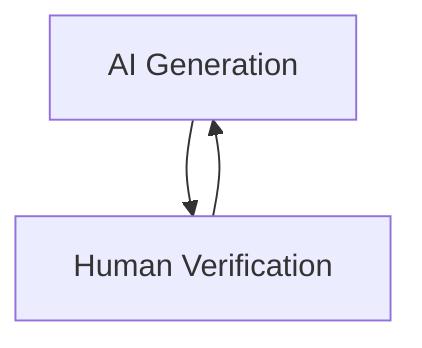
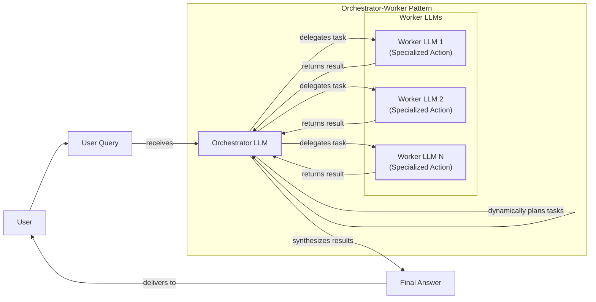
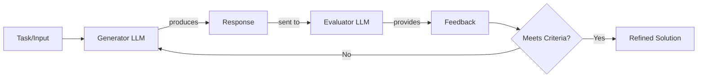
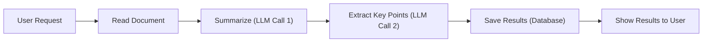
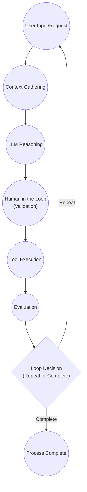

# Workflows vs. Agents: The Critical Architectural Choice for AI Engineers

As an AI engineer preparing to build your first real AI application, after narrowing down the problem you want to solve, one key decision is how to design your AI solution. Should it follow a predictable, step-by-step workflow, or does it demand a more autonomous approach, where the LLM makes self-directed decisions along the way? Thus, one of the fundamental questions that will determine the success or failure of your project is: How should you architect your AI system?

When building AI applications, you face this critical architectural decision early in the development process. Should you create a predictable, step-by-step workflow where you control every action, or should you build an autonomous agent that can think and decide for itself? This is one of the key decisions that will impact everything from development time and costs to reliability and user experience.

Choose the wrong approach, and you might end up with an overly rigid system that breaks when users deviate from expected patterns, or an unpredictable agent that works brilliantly 80% of the time but fails catastrophically when it matters most. Months of development time can be wasted rebuilding the entire architecture, leading to frustrated users who cannot rely on the application and frustrated executives who cannot afford to keep it running. In 2024 and 2025, we have seen billion-dollar AI startups succeed or fail based primarily on this architectural decision. The successful teams and engineers know when to use workflows versus agents and, more importantly, how to combine both approaches effectively.

By the end of this lesson, you will have a framework to make this critical decision with confidence. You will understand the fundamental trade-offs, see real-world examples from leading AI companies, and learn how to design systems that leverage the best of both approaches.

## Understanding the Spectrum: From Workflows to Agents

To choose between workflows and agents, you need a clear understanding of what they are. While the terms are often used interchangeably, they represent distinct architectural philosophies. We will focus on their properties and how they are used, rather than their technical specifics for now.

**LLM workflows** are sequences of tasks involving LLM calls or other operations, orchestrated by developer-written code. The steps are defined in advance, resulting in deterministic or rule-based paths with predictable execution and explicit control flow. Think of a workflow as a factory assembly line: each station performs a specific, predefined task in a set order. The process is reliable and consistent, but it is not designed to handle unexpected variations. This predictability makes workflows easier to debug and their operational costs more manageable, as you can often leverage smaller, specialized models for each sub-task. We will explore common workflow patterns like chaining, routing, and the orchestrator-worker model in future lessons [[23]](https://blog.tobiaszwingmann.com/p/ai-workflows-vs-ai-agents-vs-everything-in-between), [[26]](https://www.promptingguide.ai/agents/ai-workflows-vs-ai-agents).

**AI agents**, on the other hand, are systems where an LLM plays a central role in dynamically deciding the sequence of steps, reasoning, and actions to achieve a goal [[43]](https://intuitionlabs.ai/articles/ai-agent-vs-ai-workflow). The steps are not defined in advance but are planned based on the task and the current state of the environment. This gives agents the flexibility to adapt to new situations and handle ambiguity. An agent is like a skilled human expert tackling an unfamiliar problem, adapting on the fly after each "Eureka!" moment. This autonomy is what makes agents powerful, but it also introduces unpredictability in performance, latency, and cost [[20]](https://towardsdatascience.com/a-developers-guide-to-building-scalable-ai-workflows-vs-agents/). In upcoming lessons, we will delve into the core components of agents, such as actions, memory, and the ReAct (Reason and Act) framework.

Both workflows and agents require an orchestration layer, but its function differs significantly. In a workflow, the orchestrator executes a developer-defined plan, following a fixed script [[23]](https://blog.tobiaszwingmann.com/p/ai-workflows-vs-ai-agents-vs-everything-in-between). It is a top-down, command-and-control system. In an agent, the orchestrator facilitates the LLM's dynamic planning and execution. It acts more like a supportive framework, providing the agent with the resources it needs to make its own decisions. The key distinction lies in where the control resides: with the developer’s code or with the LLM’s reasoning process [[26]](https://www.promptingguide.ai/agents/ai-workflows-vs-ai-agents).

## Choosing Your Path

In the previous section, we defined LLM workflows and AI agents independently. Now, we will explore their core difference: developer-defined logic versus LLM-driven autonomy in reasoning and action selection.

Workflows are the right choice when the task is well-defined and the steps are repeatable. They are ideal for automating structured processes like data extraction pipelines, generating standardized reports, or handling routine customer service queries. Because their paths are predictable, workflows offer high reliability and are easier to debug, test, and monitor [[20]](https://towardsdatascience.com/a-developers-guide-to-building-scalable-ai-workflows-vs-agents/). This makes them a preferred choice in enterprise settings and regulated fields like finance and healthcare, where consistency and auditability are critical. For example, a financial report must be accurate every time, and a medical diagnostic tool cannot afford to be unpredictably creative. Workflows are also great for building Minimum Viable Products (MVPs) quickly, as you can hardcode the core features and ensure they work reliably. If your application handles thousands of requests per minute and the cost per request is a major concern, workflows are almost always the better option.

AI agents shine when tasks are open-ended, ambiguous, or require dynamic problem-solving [[43]](https://intuitionlabs.ai/articles/ai-agent-vs-ai-workflow). Use cases include complex research and synthesis, advanced code debugging, or interactive customer support for non-standard issues. The agent's ability to reason and adapt its plan makes it powerful for navigating unfamiliar environments, like booking a flight without being told which specific websites to use. However, this autonomy comes with significant trade-offs. Agents are inherently non-deterministic, which means their performance, latency, and costs can vary with each run. They are more prone to errors, and debugging their "thought process" can feel like "AI archaeology" [[18]](https://machinelearningmastery.com/5-production-scaling-challenges-for-agentic-ai-in-2026/). They often require larger, more expensive LLMs and can incur high operational costs from multiple reasoning steps. There are even stories of early agent users having their codebases accidentally deleted, leading to jokes like, "Anyway, I wanted to start a new project."

The fundamental difference in predictability stems from their computational structure. Workflows follow explicit, often linear execution paths with a known number of steps, making costs and latency calculable. Agents, however, rely on recursive loops where the LLM's opaque reasoning process dynamically selects the next action. This can lead to unpredictable execution paths and token consumption, making them harder to debug and control without strict guardrails [[70]](https://towardsdatascience.com/a-developers-guide-to-building-scalable-ai-workflows-vs-agents/).

In reality, most production systems are not purely one or the other. They exist on a spectrum between rigid workflows and fully autonomous agents. As Andrej Karpathy noted, many of the best AI applications feature an "autonomy slider," allowing you to control how much independence you give the AI [[15]](https://www.latent.space/p/s3). For example, in the AI-powered code editor Cursor, you can go from simple tab completion (low autonomy) to letting an agent rewrite your entire repository (high autonomy). Similarly, Perplexity offers a slider from a basic search to a "deep research" mode that takes several minutes to generate a comprehensive report.



Image 1: A circular flow diagram illustrating the iterative AI generation and human verification loop, emphasizing the goal of accelerating the process.

This concept of an autonomy slider is tied to the human-in-the-loop process. The ultimate goal is to speed up the cycle of AI generation and human verification, as shown in Image 1. By designing smart workflows and intuitive user interfaces, you can make it easy for humans to quickly validate the AI's output, creating a powerful and efficient hybrid system that combines the best of both worlds [[15]](https://www.latent.space/p/s3). This model of human-AI collaboration is now being embedded in a new generation of low-code and no-code platforms. These tools allow developers to visually design workflows, set the level of AI autonomy, and define explicit human verification points, making it easier to build hybrid systems with the right balance of control and flexibility [[83]](https://www.emergentmind.com/topics/low-code-llm-systems).

## Exploring Common Patterns

To build your intuition for AI engineering, let's explore some of the most common patterns used to construct both workflows and agents. We will keep these explanations high-level for now, as each of these patterns will be covered in detail in future lessons.

### LLM Workflows

Workflows are built by composing simpler, predictable steps. Here are a few foundational patterns.

**Chaining and routing** is often the first step in automating a process. It involves linking multiple LLM calls together, where the output of one call becomes the input for the next. You can also add a routing step, where an LLM classifies the user's input and directs it to the most appropriate chain or tool. This allows you to handle different types of requests with specialized logic, making your system more modular and efficient.

```mermaid
flowchart LR
    A["Input"] --> B{"LLM-based Router<br/>(Classifies Input)"}
    B -->| "Classification 1" | C1["LLM Call 1"]
    B -->| "Classification 2" | C2["LLM Call 2"]
    B -->| "Classification 3" | C3["LLM Call 3"]
    C1 --> D["Final Output"]
    C2 --> D
    C3 --> D
```

Image 2: Flowchart illustrating the Chaining and Routing pattern for LLM workflows.

The **orchestrator-worker** pattern introduces a layer of dynamic planning. A central "orchestrator" LLM analyzes the user's intent, breaks down the task into smaller sub-tasks, and delegates them to specialized "worker" LLMs [[46]](https://mlpills.substack.com/p/diy-17-orchestrator-worker-llm-agent), [[47]](https://platform.claude.com/cookbook/patterns-agents-orchestrator-workers). Each worker is optimized for a specific function, like performing a technical analysis or a market assessment. The orchestrator then synthesizes the results from the workers into a final, comprehensive answer. This pattern bridges the gap between rigid workflows and full autonomy, allowing the system to dynamically decide which actions to take. This pattern directly mirrors principles from human organizational management. The orchestrator acts like a manager, defining the strategy and owning the final outcome, while the workers are specialists focused on execution [[75]](https://sebgnotes.substack.com/p/multi-agent-design-applying-human). Frameworks like MetaGPT take this analogy further, creating virtual "assembly lines" with agents assigned roles like Product Manager or QA Engineer to collaboratively build software [[77]](https://xue-guang.com/post/llm-marl/).



Image 3: A hierarchical diagram illustrating the "Orchestrator-Worker" pattern.

The **evaluator-optimizer loop** is a pattern for self-correction. It uses two LLMs: a "generator" that produces an initial response and an "evaluator" that critiques the response based on a set of criteria [[29]](https://sebgnotes.substack.com/p/evaluator-optimizer-llm-workflow). If the response is not good enough, the evaluator provides feedback, which is sent back to the generator to create a revised version. This loop continues until the output meets the desired quality or a set number of iterations is reached. It is similar to how a human writer refines a document based on an editor's feedback. In practice, implementing this pattern requires careful engineering. To prevent infinite loops and manage costs, you need to set clear exit criteria and "circuit breakers." The evaluation criteria must be machine-readable and business-relevant, and the system needs a plan for graceful failure if a high-quality solution is not found within a set number of attempts [[29]](https://sebgnotes.substack.com/p/evaluator-optimizer-llm-workflow).



Image 4: A feedback loop diagram illustrating the "Evaluator-Optimizer" pattern.

### AI Agents

The most common and powerful agent pattern today is ReAct, which stands for Reason and Act. This framework enables an agent to autonomously decide what action to take, interpret the output of that action, and repeat the process until the task is complete.

A ReAct agent has a few core components:
*   An **LLM** that serves as the "brain," responsible for reasoning and planning.
*   A set of **actions (tools)** that allow the agent to interact with its environment, such as searching the web or querying a database. We will cover actions in depth in Lesson 6.
*   **Short-term memory** that acts as the agent's working memory, similar to a computer's RAM, holding the context of the current task.
*   **Long-term memory** that stores factual knowledge and user preferences across sessions. We will explore memory in Lesson 9.

The agent operates in a loop: it observes its environment, reasons about what to do next, takes an action, and then observes the result. This cycle continues until the goal is achieved. Nearly all state-of-the-art agents in the industry use some form of the ReAct pattern, and we will dedicate Lessons 7 and 8 to exploring it in detail. The ReAct pattern is foundational, but more advanced architectures are emerging. The **Plan-and-Act** model, for instance, uses a dedicated "planner" LLM to create a multi-step strategy before an "executor" LLM begins taking actions. Another technique is **self-reflection**, where an agent critiques its own work and previous actions to learn from mistakes and improve its plan iteratively [[56]](https://medium.com/@dzianisv/vibe-engineering-langchains-tool-calling-agent-vs-react-agent-and-modern-llm-agent-architectures-bdd480347692).

```mermaid
flowchart LR
  %% Agent Core Components
  subgraph "Agent Core"
    LLM["LLM<br/>(Thought/Reason)"]
    STM["Short-term Memory"]
    LTM["Long-term Memory"]
  end

  %% External Interaction
  subgraph "External Interaction"
    Tools["Tools<br/>(Action)"]
    Environment["Environment<br/>(Observation)"]
  end

  %% Primary Loop: Observe -> Reason -> Act
  Environment -- "provides observation" --> LLM
  LLM -- "decides action" --> Tools
  Tools -- "executes action" --> Environment

  %% Memory Interactions
  LLM -- "reads/writes" --> STM
  STM -- "informs reasoning" -.-> LLM
  LLM -- "accesses/updates" --> LTM
  LTM -- "provides long-term context" -.-> LLM

  %% Visual grouping
  classDef store stroke-dasharray:3,3
  classDef exec stroke-width:2px
  class LLM,Tools exec
  class STM,LTM store
```

Image 5: A flowchart illustrating the high-level dynamics of a ReAct (Reason and Act) AI agent, showing a continuous loop involving an LLM, Tools, and Environment, with interactions from Short-term and Long-term Memory.

## Zooming In on Our Favorite Examples

To anchor these concepts in the real world, let's analyze a few state-of-the-art examples, starting with a simple workflow and moving to more complex hybrid systems. We will keep these explanations high-level and intuitive.

### Document Summarization in Google Workspace (Workflow)

A common problem in any organization is finding the right information. Documents can be long and dense, making it a time-consuming process to figure out which one contains what you need. A quick, embedded summarization feature can guide your search and save valuable time.

The "Summarize this doc" feature in Google Workspace is a perfect example of a pure, multi-step workflow. It follows a predictable chain of LLM calls to deliver a consistent result [[32]](https://www.datastudios.org/post/google-gemini-and-summarizing-documents-uploaded-on-drive-integration-context-and-automation), [[33]](https://cloud.google.com/blog/products/ai-machine-learning/long-document-summarization-with-workflows-and-gemini-models). The process is straightforward: the system reads the document, sends its content to an LLM to generate a summary, makes another LLM call to extract key points, saves the results, and then displays them to you. Each step is hardcoded, ensuring the output is reliable and the process is efficient.



Image 6: A sequential flowchart illustrating the "Document Summarization and Analysis Workflow by Gemini in Google Workspace".

### Gemini CLI Coding Assistant (Agent)

Writing code is often a slow and meticulous process. It involves reading documentation, understanding new codebases, and learning new programming languages. An AI coding assistant can dramatically speed up this process.

Google's open-source Gemini CLI is a powerful example of a single-agent system built for coding [[4]](https://docs.cloud.google.com/gemini/docs/codeassist/gemini-cli), [[5]](https://blog.google/innovation-and-ai/technology/developers-tools/introducing-gemini-cli-open-source-ai-agent/). It uses a ReAct (Reason and Act) architecture to help with tasks like writing code from scratch, generating documentation, or understanding an existing codebase. Here is a high-level look at how it operates:
1.  **Context Gathering:** The system begins by loading the current state, which includes the directory structure, available actions (tools), and the conversation history.
2.  **LLM Reasoning:** The Gemini model analyzes your request and the current context to create a plan of action.
3.  **Human in the Loop:** Before executing, the agent often presents its plan to you for validation, ensuring you remain in control.
4.  **Tool Execution:** The agent executes the approved actions. These can include reading files with `grep`, searching the web for documentation, interpreting and running code, or committing changes with `git`. The results of these actions are added back to the context.
5.  **Evaluation:** It dynamically evaluates the outcome, for instance, by trying to compile or run the code it just wrote to see if it works.
6.  **Loop Decision:** The agent then decides if the task is complete or if it needs to repeat the cycle of reasoning and action to further refine the solution.

This iterative loop allows the agent to tackle complex coding tasks autonomously, but with human oversight. This decision loop is conceptually similar to architectures used in video game AI to create adaptive non-player characters (NPCs). Techniques like **behavior trees** allow game developers to define complex sequences of actions and reactions based on the game's state, enabling NPCs to respond to player actions in a structured yet flexible way [[80]](https://lutpub.lut.fi/bitstream/handle/10024/170271/bachelorsthesis_salek_md_peash_been.pdf?sequence=1&isAllowed=y).



Image 7: Circular flowchart illustrating the operational loop of the "Gemini CLI Coding Assistant".

### Perplexity Deep Research (Hybrid System)

Researching a new topic can be daunting. You often do not know where to start, and sifting through countless articles, papers, and videos is a massive time investment. A research assistant that can quickly scan the internet and compile a comprehensive report is a game-changer.

Perplexity's Deep Research feature is a fascinating hybrid system that combines structured workflows with multiple specialized agents to perform expert-level research [[9]](https://www.perplexity.ai/hub/blog/introducing-perplexity-deep-research), [[10]](https://trilogyai.substack.com/p/comparative-analysis-of-deep-research). Unlike the single-agent approach of Gemini CLI, this system orchestrates a team of agents in parallel, allowing it to perform dozens of searches across hundreds of sources and synthesize a report in just a few minutes. Since the solution is closed-source, what follows is an educated guess based on public information. This approach draws parallels to optimization strategies from supply chain logistics. By decomposing a large request (the order) into smaller, parallelizable sub-tasks (manufacturing and sourcing components) and then synthesizing the results, the system dramatically compresses the time-to-completion and improves efficiency [[86]](https://aiviewer.ai/tools/perplexity-computer/).

Here is a simplified view of how it could work:
1.  **Research Planning & Decomposition:** An orchestrator agent analyzes your research question and breaks it down into a series of targeted sub-questions. This is a classic orchestrator-worker pattern.
2.  **Parallel Information Gathering:** For each sub-question, specialized search agents are deployed in parallel. Each agent uses tools like web search and document retrieval to gather as much relevant information as possible. Working in isolation with a focused query keeps each agent's context small and its reasoning sharp.
3.  **Analysis & Synthesis:** Each agent then validates its sources, scoring them for credibility and relevance. It ranks the top sources and summarizes them into a concise report for its specific sub-question.
4.  **Iterative Refinement & Gap Analysis:** The orchestrator collects the reports from all the worker agents and analyzes them to identify any knowledge gaps. If information is missing, it generates follow-up queries and repeats the process until the research is complete or a step limit is reached.
5.  **Report Generation:** Finally, the orchestrator synthesizes the findings from all agents into a single, comprehensive report, complete with inline citations.

This hybrid architecture combines the structured planning of a workflow with the dynamic, adaptive reasoning of multiple agents, creating a system that is both powerful and efficient.

```mermaid
flowchart LR
  %% Process Start
  A["User Research Question"]

  %% Orchestration and Planning
  B["Research Planning & Decomposition<br/>(Orchestrator)"]

  %% Parallel Execution
  C["Parallel Information Gathering<br/>(Specialized Search Agents)"]

  %% Analysis Phase
  D["Analysis & Synthesis<br/>(Individual Agents)"]

  %% Iterative Refinement
  E["Iterative Refinement & Gap Analysis<br/>(Orchestrator)"]

  %% Final Output
  F["Report Generation"]

  %% Flow connections
  A -- "initiates" --> B
  B -- "decomposes & assigns" --> C
  C -- "gathers data" --> D
  D -- "synthesizes findings" --> E
  E -- "identifies gaps & refines" --> C
  E -- "finalizes" --> F

  %% Visual differentiation
  classDef orchestrator stroke-width:2px
  classDef agent stroke-dasharray:5,5
  class B,E orchestrator
  class C,D agent
```



Image 8: An iterative multi-step process diagram for "Perplexity Deep Research" showing the flow from user question to report generation, highlighting parallel execution and iterative refinement.

## The Challenges of Every AI Engineer

Now that you understand the spectrum from LLM workflows to AI agents, it is important to recognize that every AI engineer—whether at a startup or a Fortune 500 company—faces these same fundamental challenges when designing a new AI application. The architectural decisions you make will determine whether your product succeeds in production or fails spectacularly.

As you start building, you will constantly battle a series of engineering realities. Your agent might work perfectly in a demo but become unpredictable with real users, as LLM reasoning failures can compound through multi-step processes and lead to costly outcomes. Researchers have identified specific failure modes for long-running agents, such as "mid-stuck" behaviors, where an agent gets caught in a non-productive loop due to poor planning or error propagation [[54]](https://arxiv.org/html/2603.19685v1). Your system may struggle to maintain coherence across long conversations, losing track of its original purpose. You will need to build robust data pipelines to pull information from various sources like Slack, web APIs, and databases, all while ensuring that only high-quality data reaches your model. You will have to manage the trade-off between the depth of observability and performance, as logging every detail can introduce significant latency and cost [[61]](https://freeplay.ai/blog/llm-observability).

You will also face the cost-performance trap: a sophisticated agent might deliver impressive results but at a cost per interaction that makes it economically unfeasible. Furthermore, security will be a constant concern. An autonomous agent with powerful write permissions could accidentally delete critical files, send the wrong emails, or expose sensitive data if not properly sandboxed and monitored [[18]](https://machinelearningmastery.com/5-production-scaling-challenges-for-agentic-ai-in-2026/). To address these safety issues, some are adapting principles from engineering control systems. For example, Control Barrier Functions (CBFs) can act as a "safety filter" that computationally verifies if a proposed action is safe before it is executed, preventing an agent from taking catastrophic actions like deleting critical files [[62]](https://aixiv.science/pdf/aixiv.251207.000004).

The good news is that these challenges are solvable. In upcoming lessons, we will systematically tackle each of these issues. You will learn battle-tested patterns for building reliable systems, proven strategies for managing context, and practical approaches for handling multimodal data. We will also cover evaluation and monitoring pipelines—frameworks that let you deploy with confidence. Your path forward as an AI engineer is about mastering these realities. By the end of this course, you will have the knowledge to architect AI systems that are not only powerful but also robust, efficient, and safe. You will know when to use a workflow, when to deploy an agent, and how to build effective hybrid systems that work in the messy, unpredictable real world.

## References

- [4] https://docs.cloud.google.com/gemini/docs/codeassist/gemini-cli
- [5] https://blog.google/innovation-and-ai/technology/developers-tools/introducing-gemini-cli-open-source-ai-agent/
- [9] https://www.perplexity.ai/hub/blog/introducing-perplexity-deep-research
- [10] https://trilogyai.substack.com/p/comparative-analysis-of-deep-research
- [15] https://www.latent.space/p/s3
- [18] https://machinelearningmastery.com/5-production-scaling-challenges-for-agentic-ai-in-2026/
- [20] https://towardsdatascience.com/a-developers-guide-to-building-scalable-ai-workflows-vs-agents/
- [23] https://blog.tobiaszwingmann.com/p/ai-workflows-vs-ai-agents-vs-everything-in-between
- [26] https://www.promptingguide.ai/agents/ai-workflows-vs-ai-agents
- [29] https://sebgnotes.substack.com/p/evaluator-optimizer-llm-workflow
- [32] https://www.datastudios.org/post/google-gemini-and-summarizing-documents-uploaded-on-drive-integration-context-and-automation
- [33] https://cloud.google.com/blog/products/ai-machine-learning/long-document-summarization-with-workflows-and-gemini-models
- [43] https://intuitionlabs.ai/articles/ai-agent-vs-ai-workflow
- [46] https://mlpills.substack.com/p/diy-17-orchestrator-worker-llm-agent
- [47] https://platform.claude.com/cookbook/patterns-agents-orchestrator-workers
- [54] https://arxiv.org/html/2603.19685v1
- [56] https://medium.com/@dzianisv/vibe-engineering-langchains-tool-calling-agent-vs-react-agent-and-modern-llm-agent-architectures-bdd480347692
- [61] https://freeplay.ai/blog/llm-observability
- [62] https://aixiv.science/pdf/aixiv.251207.000004
- [70] https://towardsdatascience.com/a-developers-guide-to-building-scalable-ai-workflows-vs-agents/
- [75] https://sebgnotes.substack.com/p/multi-agent-design-applying-human
- [77] https://xue-guang.com/post/llm-marl/
- [80] https://lutpub.lut.fi/bitstream/handle/10024/170271/bachelorsthesis_salek_md_peash_been.pdf?sequence=1&isAllowed=y
- [83] https://www.emergentmind.com/topics/low-code-llm-systems
- [86] https://aiviewer.ai/tools/perplexity-computer/