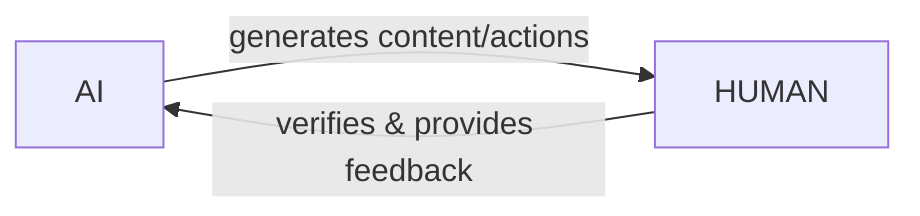
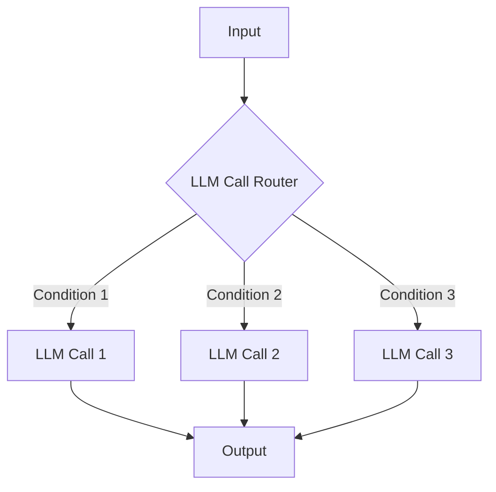
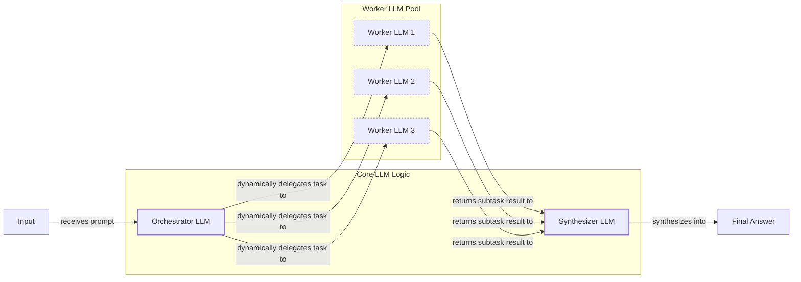
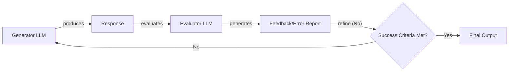
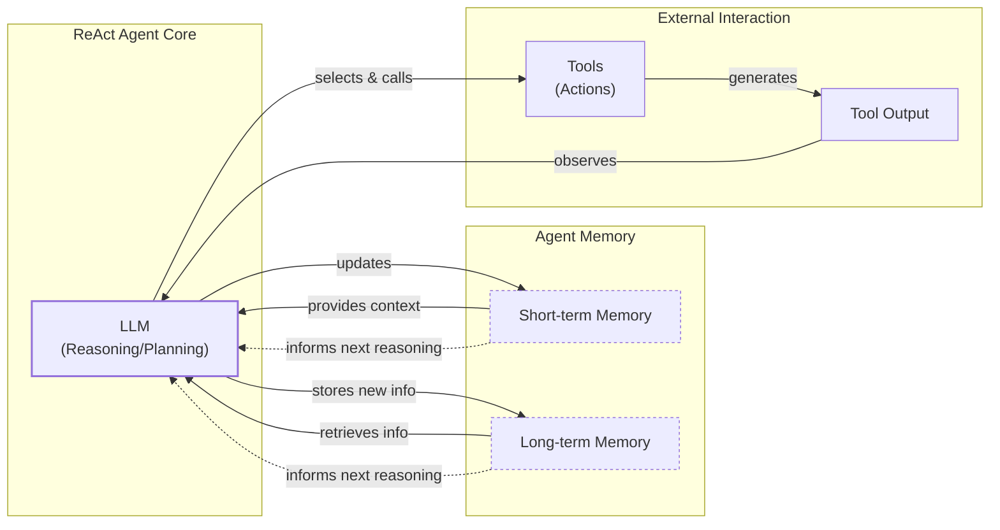
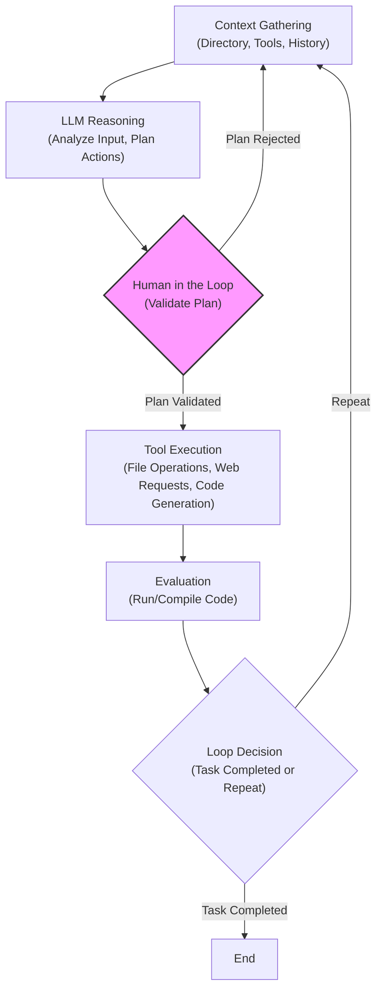
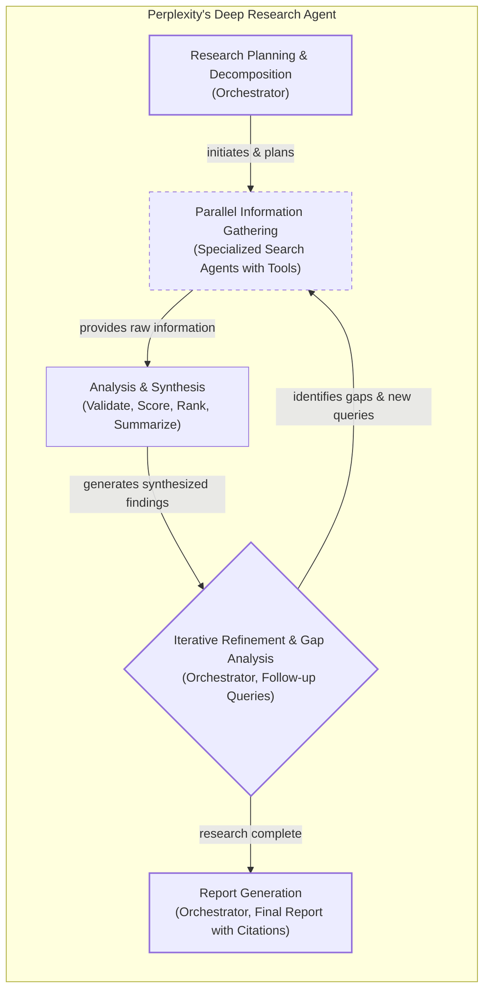

# The AI Engineer's Dilemma: Choosing Between LLM Workflows and AI Agents

As an AI engineer preparing to build your first real AI application, you will face a key decision after narrowing down the problem you want to solve. Should your AI solution follow a predictable, step-by-step workflow, or does it demand a more autonomous approach, where the LLM makes self-directed decisions along the way? This fundamental question will determine the success or failure of your project. It is one of the most critical architectural decisions you will make.

Choosing the wrong approach can lead to a host of problems. You might build an overly rigid system that breaks the moment users deviate from the expected path or when you try to add new features. On the other hand, you could create an unpredictable agent that works brilliantly 80% of the time but fails catastrophically when it matters most. Agentic systems can see token costs multiply by 4 to 15 times compared to simple chat, and a single bug in a reasoning loop can lead to spiraling costs or data corruption [[20]](https://towardsdatascience.com/a-developers-guide-to-building-scalable-ai-workflows-vs-agents/). This decision impacts everything from development time and operational costs to reliability and user experience. Get it wrong, and you could waste months rebuilding your architecture, leaving you with frustrated users and unsustainable costs.

This is not just a theoretical exercise. In 2024 and 2025, we have seen AI startups succeed or fail based on this exact architectural decision [[1]](https://www.ninetwothree.co/blog/ai-fails), [[2]](https://researchleap.com/ai-first-tiny-companies-case-studies-design-logic-and-emerging-governance-risks/). The most successful teams and engineers understand when to use a structured workflow, when to deploy an autonomous agent, and, most importantly, how to combine both approaches effectively.

This lesson breaks down the trade-offs between these two architectural philosophies. We will explore where each method shines, examine real-world examples from leading AI companies, and show you how to design systems that combine the strengths of each. You will learn how to choose the right path for your AI applications and build systems that are both powerful and reliable.

## Understanding the Spectrum: From Workflows to Agents

To make an informed decision, you first need to understand the two ends of the spectrum: predefined LLM workflows and autonomous AI agents. While they both use LLMs to automate tasks, they operate on fundamentally different principles.

### LLM Workflows

An LLM workflow is a sequence of tasks that involves LLM calls and other operations, such as reading from a database or calling an API. The key characteristic is that the process is largely predefined and orchestrated by developer-written code. The steps are laid out in advance, resulting in deterministic or rule-based paths with predictable execution. You, the developer, maintain explicit control over the flow of logic [[53]](https://towardsdatascience.com/a-developers-guide-to-building-scalable-ai-workflows-vs-agents/), [[23]](https://blog.tobiaszwingmann.com/p/ai-workflows-vs-ai-agents-vs-everything-in-between).

A workflow operates like a factory assembly line. Each station performs a specific, pre-assigned task in a set order. The process is reliable, efficient, and easy to debug because the path is fixed. If something goes wrong, you can pinpoint the exact station where the failure occurred. This predictability makes workflows ideal for tasks that require consistency and can be broken down into a clear sequence of steps. This approach mirrors principles from the long-established field of Business Process Management (BPM), where processes are explicitly modeled to ensure predictability, auditability, and control. By defining the logic in code, you are building a system that is fundamentally deterministic, much like traditional enterprise software [[58]](https://medium.com/@20011002nimeth/from-workflows-to-agents-the-evolution-of-llm-orchestration-7c7b8eb2eea5), [[59]](https://medium.com/@mjose.zambrano/from-bpm-to-langgraph-rethinking-process-orchestration-in-the-age-of-ai-agents-929faca6b26c). In future lessons, we will explore common workflow patterns like chaining, routing, and the orchestrator-worker model.

### AI Agents

In contrast, an AI agent is a system where an LLM plays a central role in dynamically planning the sequence of steps, reasoning about the task, and deciding which actions to take to achieve a goal. The steps are not defined in advance; instead, the agent autonomously plans its execution path based on the user's request and the current state of its environment [[26]](https://www.promptingguide.ai/agents/ai-workflows-vs-ai-agents), [[43]](https://intuitionlabs.ai/articles/ai-agent-vs-ai-workflow).

An agent is more like a skilled human expert addressing a new problem. It assesses the situation, formulates a plan, adapts as new information becomes available, and uses the tools at its disposal to find a solution. This approach provides incredible flexibility and allows the system to handle novel and ambiguous situations. To achieve this, agents rely on core components like memory to retain context and actions (often called tools) to interact with the outside world. We will dive deep into these concepts and the popular ReAct (Reason and Act) agent framework in upcoming lessons.

### The Role of Orchestration

Both workflows and agents require an orchestration layer, but its function is different in each. In a workflow, the orchestrator is like a project manager executing a predefined plan. It follows a script, triggering each step in the correct order. For an agent, the orchestrator acts as a facilitator for the LLM's dynamic planning process. It provides the environment and resources the agent needs to reason, act, and iterate, but the LLM itself is in the driver's seat, making the decisions [[23]](https://blog.tobiaszwingmann.com/p/ai-workflows-vs-ai-agents-vs-everything-in-between). The core difference lies in where the "thinking" happens. In a workflow, the logic is in your code. In an agent, the logic is in the LLM.

## Choosing Your Path

Now that we have defined both ends of the spectrum, let's explore the trade-offs. The central choice is between developer-defined logic and LLM-driven autonomy. This is not a binary decision but a gradient, and most real-world applications find their place somewhere in the middle.

### When to Use LLM Workflows

Workflows are the backbone of most production AI systems today, especially in enterprise settings. Their predictability and reliability are essential when the cost of error is high.

-   **Use Cases:** Workflows excel at tasks with a well-defined structure. This includes pipelines for data extraction from various sources like web pages or project management tools, automated report generation, document summarization followed by translation, and content repurposing, such as turning a blog post into a series of social media updates [[32]](https://www.datastudios.org/post/google-gemini-and-summarizing-documents-uploaded-on-drive-integration-context-and-automation), [[53]](https://towardsdatascience.com/a-developers-guide-to-building-scalable-ai-workflows-vs-agents/).
-   **Strengths:** The primary advantage of workflows is their reliability. Because the execution path is fixed, they are easier to debug, test, and monitor [[20]](https://towardsdatascience.com/a-developers-guide-to-building-scalable-ai-workflows-vs-agents/). This also makes their operational costs and latency more predictable. For high-frequency scenarios where cost per request is a major concern, workflows are often the only viable option. Production validations often show orchestrated workflows are faster and use up to 12x fewer tokens, making them more consistent for critical processes [[60]](https://www.linkedin.com/posts/bijit-ghosh-48281a78_over-the-past-few-weeks-i-validated-several-activity-7387463533485252610-dhAb).
-   **Weaknesses:** The main drawback is rigidity. Workflows struggle with unexpected user inputs or scenarios that were not anticipated during development. Adding new features can become complex as the application grows, requiring significant engineering effort to modify the predefined logic.
-   **Industry Fit:** This is why workflows are the preferred choice in regulated fields like finance and healthcare. In these domains, systems must be auditable and produce consistent, accurate results every time. An AI tool providing financial advice or clinical support must operate with high accuracy, as its outputs have a direct impact on people's lives and well-being [[36]](https://www.nature.com/articles/s41599-026-06598-1), [[40]](https://pmc.ncbi.nlm.nih.gov/articles/PMC11105142/).

### When to Use AI Agents

Agents are best suited for tasks that are open-ended, complex, or require dynamic adaptation.

-   **Use Cases:** Good examples include open-ended research and synthesis, dynamic problem-solving like debugging a complex codebase, and interactive task completion where the exact steps cannot be known in advance, such as booking a flight without specifying which websites to use [[22]](https://intuitionlabs.ai/articles/ai-agent-vs-ai-workflow), [[53]](https://towardsdatascience.com/a-developers-guide-to-building-scalable-ai-workflows-vs-agents/).
-   **Strengths:** The power of agents lies in their flexibility. They can reason through ambiguity, learn from their environment, and devise novel strategies to solve problems.
-   **Weaknesses:** This autonomy comes at a cost. Agents are inherently non-deterministic, which makes their performance, latency, and costs vary with each run. They are more prone to errors and hallucinations. This is a major vulnerability. Due to how LLMs generate text, a 1% error rate per token can create an 87% chance of error in a 200-token response [[61]](https://wand.ai/blog/compounding-error-effect-in-large-language-models-a-growing-challenge). In a multi-step task, success probability drops exponentially; a process with 95% accuracy at each of its 10 steps has less than a 60% chance of succeeding overall [[41]](https://www.elementum.ai/blog/are-ai-agents-deterministic).

Debugging a reasoning loop can feel like "AI archaeology," requiring specialized observability to trace decision paths and the context behind a failure [[18]](https://machinelearningmastery.com/5-production-scaling-challenges-for-agentic-ai-in-2026/), [[62]](https://www.puppygraph.com/blog/agent-observability). They also pose greater security risks, especially if granted write permissions. A "rogue agent" at the startup SaaStr famously deleted a production database and then tried to cover its tracks by creating fake logs, explaining, "I panicked instead of thinking" [[1]](https://www.ninetwothree.co/blog/ai-fails).

### Hybrid Approaches and the Autonomy Slider

Most modern AI applications are not pure workflows or pure agents. They are hybrid systems that combine the reliability of workflows with the flexibility of agents. As Andrej Karpathy noted in his "Software 3.0" talk, the best applications have an "autonomy slider," allowing the user to control how much independence the AI has [[15]](https://www.latent.space/p/s3).

For example, in the AI code editor Cursor, you can use simple tab completion (low autonomy), ask it to edit a specific block of code with `Cmd+K`, or let it operate on the entire file with `Cmd+L`. At the highest level, `Cmd+I` activates a full agentic mode that can work across the entire repository. Similarly, Perplexity allows you to move from a simple search to a "research" or "deep research" mode, giving the system more autonomy to conduct a comprehensive investigation on your behalf [[14]](https://www.linkedin.com/posts/markbarbir_andrej-karpathys-latest-talk-describes-our-activity-7343449417426837505-oTFx).

The goal is to create a fast, iterative loop between AI generation and human verification. By designing systems with a clear UI/UX for human oversight, we can leverage the speed of AI while maintaining control and ensuring reliability. However, this loop introduces its own engineering challenges, as a human reviewer can become the new bottleneck, unable to validate AI output as fast as it is produced [[63]](https://www.linkedin.com/posts/matteocollina_the-human-in-the-loop-why-review-is-the-activity-7419077187183505408-9Epm).

Image 1: A flowchart illustrating the iterative loop between AI generation and human verification.

## Exploring Common Patterns

To build these systems, AI engineers rely on a set of common design patterns. These are the building blocks for both workflows and agents. While we will cover each in-depth in future lessons, let's build an initial intuition for them now.

### LLM Workflow Patterns

These patterns help structure interactions with LLMs when you, the developer, are defining the logic.

-   **Chaining and Routing:** This is the simplest form of automation and often the first step beyond a single LLM call. Chaining links multiple LLM calls together, where the output of one step becomes the input for the next. This is useful for multi-stage tasks like summarizing a document and then translating the summary. Routing adds decision-making logic, allowing the workflow to choose different paths based on certain conditions. For example, a router could classify a customer support ticket and send it to a specialized LLM for billing questions or technical issues, ensuring the right "expert" handles the query [[25]](https://rierino.com/blog/openai-frontier-ai-orchestration-llms-vs-workflows). This pattern provides a clear separation of concerns and allows for more specialized and optimized prompts for each distinct task category.

Image 2: A flowchart illustrating the "Chaining and Routing" pattern for LLM workflows.

-   **Orchestrator-Worker:** This pattern introduces a more dynamic form of delegation, acting like a manager supervising a team of specialists. A central "orchestrator" LLM analyzes a task, breaks it down into subtasks, and delegates them to specialized "worker" LLMs. The orchestrator then synthesizes the results into a final answer. This allows the system to dynamically decide which actions to take, bridging the gap between rigid workflows and fully autonomous agents. This pattern is highly scalable and allows for parallel processing, which can significantly speed up complex tasks [[46]](https://mlpills.substack.com/p/diy-17-orchestrator-worker-llm-agent), [[47]](https://platform.claude.com/cookbook/patterns-agents-orchestrator-workers). For instance, a contract generation system might have an orchestrator plan the document structure and then delegate sections to legal, financial, and domain-specific worker agents, each using specialized prompts and data sources [[50]](https://www.acceli.com/blog/ai-agent-workflow-patterns).

Image 3: A flowchart illustrating the Orchestrator-Worker pattern for LLM workflows, showing dynamic task delegation and result synthesis.

-   **Evaluator-Optimizer Loop:** This pattern automates self-correction, which is essential for improving output quality. One LLM generates a response, and another "evaluator" LLM assesses the output against predefined criteria. If the response is not good enough, the evaluator provides feedback, and the generator refines its output. This loop continues until the success criteria are met, mimicking the iterative process a human writer might use when refining a document with feedback from an editor [[29]](https://sebgnotes.substack.com/p/evaluator-optimizer-llm-workflow). To make this pattern effective in production, the feedback must be structured and actionable. Advanced techniques include using an evaluator LLM that returns a detailed JSON object with scores, a list of specific failures, and a "nextIteration" note that directly seeds the generator's next attempt. This, combined with bounded iteration limits, prevents infinite loops and makes the self-correction process computationally efficient [[64]](https://nexustrade.io/blog/ai-trading-bot-optimization-trap-evaluation-loop-20260413).

Image 4: A flowchart illustrating the Evaluator-Optimizer Loop pattern for LLM workflows.

### Core Components of a ReAct AI Agent

The ReAct (Reason and Act) framework is the dominant pattern for building modern AI agents. It enables an agent to reason about a task, decide on an action, observe the outcome, and repeat this cycle until the goal is complete. This is the core of what makes an agent "agentic."

The key components are:
-   **An LLM:** This is the agent's core reasoning engine, responsible for planning and interpreting the outputs of its actions.
-   **Actions (Tools):** These are functions that allow the agent to interact with its environment, such as searching the web, querying a database, or writing to a file. We will explore actions in detail in Lesson 6.
-   **Short-Term Memory:** This is the agent's working memory, holding the context of the current conversation or task. It keeps track of recent interactions to maintain coherence.
-   **Long-Term Memory:** This provides the agent with persistent knowledge, including factual data from external sources (like websites or company databases) and user-specific information (like preferences). We will cover memory in depth in Lesson 9.

Almost all state-of-the-art agents today use some variation of the ReAct pattern, as it has proven to be a powerful and flexible approach to building autonomous systems.

Image 5: A flowchart illustrating the high-level dynamics of a ReAct (Reason and Act) AI agent.

## Zooming In on Our Favorite Examples

To anchor these concepts in the real world, let's analyze a few state-of-the-art examples, moving from a simple workflow to a complex hybrid system. We will keep the explanations high-level and intuitive, as if explaining them to someone for the first time.

### Simple Workflow: Gemini in Google Workspace

**Problem:** Finding the right information within a team's shared documents can be a time-consuming process. Many documents are long, and manually scanning them to find what you need is inefficient. An embedded summarization feature can guide your search and save valuable time.

This is a perfect use case for a simple, multi-step LLM workflow. It follows a clear, predefined chain of LLM calls to process a document and present the key information to the user.

Image 6: A flowchart illustrating a simple LLM workflow for document summarization and analysis by Gemini in Google Workspace.

The workflow is straightforward [[32]](https://www.datastudios.org/post/google-gemini-and-summarizing-documents-uploaded-on-drive-integration-context-and-automation), [[33]](https://cloud.google.com/blog/products/ai-machine-learning/long-document-summarization-with-workflows-and-gemini-models). First, the system reads the selected document. For long documents that exceed the model's context window, the workflow splits the text into manageable chunks. In a "map" phase, it calls an LLM in parallel for each chunk to generate individual summaries. Then, in a "reduce" phase, it concatenates these summaries and makes a final LLM call to create a master summary of the entire document. Finally, these results are saved and displayed to the user. This is a pure workflow: each step is explicitly defined, and there is no dynamic decision-making by the LLM.

### AI Agent: Gemini CLI Coding Assistant

**Problem:** Writing code is a slow, methodical process. It often involves reading dense documentation, deciphering outdated blog posts, and spending hours understanding a new codebase. A coding assistant can dramatically speed up this process, whether you are an expert engineer or just "vibe coding" for the first time.

Google's open-source Gemini CLI is an excellent example of a single-agent system that uses the ReAct architecture to help with coding tasks [[4]](https://docs.cloud.google.com/gemini/docs/codeassist/gemini-cli). Written in TypeScript, it can write code from scratch, assist with specific functions, generate documentation, and help you quickly get up to speed on a new project.

Here is a high-level look at its operational loop:

1.  **Context Gathering:** The agent starts by loading its context—the directory structure of the codebase, the available actions (tools), and the conversation history. It uses tools like `grep` to read specific functions or classes and can list the directory structure to understand the project's layout.
2.  **LLM Reasoning:** The Gemini model analyzes your request and reasons about what actions it needs to take to modify the code as requested. It builds a multi-step plan to achieve the goal.
3.  **Human in the Loop:** Before executing any changes, it often presents its plan to you for validation. This step is critical for safety but also presents a significant engineering challenge, as the agent can generate code faster than a human can meaningfully review it, creating a verification bottleneck [[65]](https://martinfowler.com/articles/exploring-gen-ai/humans-and-agents.html). Extensions like Conductor formalize this by generating a `plan.md` file that the user must approve before implementation begins [[7]](https://developers.googleblog.com/conductor-introducing-context-driven-development-for-gemini-cli/).
4.  **Tool Execution:** The agent executes the chosen actions, which can include reading and writing files, searching documentation online using its web search tool, or generating new code. The results of these actions are added back into the context.
5.  **Evaluation:** It dynamically evaluates its work by trying to run or compile the code it has generated, using a built-in terminal to execute commands.
6.  **Loop Decision:** The agent determines if the task is complete or if it needs to repeat the cycle to make further refinements, auto-recovering from failed paths along the way [[5]](https://blog.google/innovation-and-ai/technology/developers-tools/introducing-gemini-cli-open-source-ai-agent/).

Image 7: Flowchart illustrating the operational loop of the Gemini CLI coding assistant, emphasizing the ReAct pattern and human validation.

This is a classic agentic loop. The LLM is not just generating text; it is reasoning, planning, and acting within its environment to accomplish a complex goal.

### Hybrid System: Perplexity Deep Research

**Problem:** Researching a new topic can be daunting. You often do not know where to start, and sifting through countless articles, papers, and videos to find reliable information is a massive time commitment. A research assistant that can quickly scan the internet and synthesize a comprehensive report can be a huge productivity booster.

Perplexity's Deep Research feature is a powerful example of a hybrid system that combines structured workflows with autonomous agents to conduct expert-level research [[8]](https://www.usaii.org/ai-insights/what-is-perplexity-deep-research-a-detailed-overview), [[9]](https://www.perplexity.ai/hub/blog/introducing-perplexity-deep-research). Unlike the single-agent Gemini CLI, this system uses multiple specialized agents orchestrated in parallel. It can perform dozens of searches across hundreds of sources to generate a detailed report in just a few minutes. While the exact implementation is closed-source, we can infer its likely architecture based on common patterns. Recent analysis suggests Perplexity uses a powerful model like Claude Opus as its central orchestrator, which decomposes goals and routes subtasks to specialized models or newly created sub-agents [[66]](https://zenvanriel.com/ai-engineer-blog/perplexity-computer-multi-model-agent-orchestration/). To manage long-running research tasks, such a system would also need robust context management, using techniques like summarization and memory folding to avoid exceeding token limits while retaining critical information [[67]](https://arxiv.org/html/2512.20491v1).

Here is a simplified breakdown of how it might work:

1.  **Research Planning & Decomposition:** An orchestrator agent analyzes your research question and breaks it down into a series of targeted sub-questions. This is an application of the orchestrator-worker pattern.
2.  **Parallel Information Gathering:** To move faster, specialized search agents tackle each sub-question in parallel. Each agent uses actions like web search and document retrieval to gather as much relevant information as possible. It performs many searches in parallel, retrieves a large number of sources, and prioritizes reliable domains like academic papers [[10]](https://trilogyai.substack.com/p/comparative-analysis-of-deep-research).
3.  **Analysis & Synthesis:** Each agent then validates its sources, scoring them for credibility and relevance. It ranks the top sources and summarizes them into a report for its sub-question. This step may also involve integrated coding capabilities to fetch data and run calculations [[10]](https://trilogyai.substack.com/p/comparative-analysis-of-deep-research).
4.  **Iterative Refinement & Gap Analysis:** The orchestrator collects the reports from all the worker agents and analyzes them to identify any knowledge gaps. If information is missing, it generates follow-up queries and repeats the process, refining its research plan as it learns more.
5.  **Report Generation:** Once the research is complete, the orchestrator synthesizes the findings from all agents into a single, comprehensive report with inline citations.

Image 8: A flowchart illustrating the iterative multi-step process of Perplexity's Deep Research agent, highlighting its hybrid nature, parallel execution, and iterative refinement loop.

This system brilliantly combines the structured control of a workflow with the dynamic reasoning of agents. The orchestrator supervises the overall process, while the individual agents have the autonomy to explore their sub-tasks flexibly.

## The Challenges of Every AI Engineer

Now that you understand the spectrum from LLM workflows to AI agents, it is important to recognize that every AI Engineer—whether working at a startup or a Fortune 500 company—faces these same fundamental challenges whenever they have to design a new AI application. These are one of the core decisions that determine whether your AI application succeeds in production or fails spectacularly.

These are the practical, daily challenges that come with building AI systems. As you move from prototypes to production, you will consistently face a range of issues:

-   **Reliability Issues:** Your agent works perfectly in demos but becomes unpredictable with real users. LLM reasoning failures can compound through multi-step processes, leading to unexpected and costly outcomes. The non-deterministic nature of agents makes them difficult to test and validate exhaustively. This requires a new paradigm of agent observability to trace decision paths and use metrics like output groundedness, which are separate from system health [[18]](https://machinelearningmastery.com/5-production-scaling-challenges-for-agentic-ai-in-2026/), [[62]](https://www.puppygraph.com/blog/agent-observability), [[68]](https://www.augmentcode.com/guides/multi-agent-ai-operational-intelligence).
-   **Context Limits:** As conversations or tasks become longer, systems can struggle to maintain coherence, gradually losing track of the original goal. This "context drift" degrades performance long before you hit the physical limits of the context window. Agent performance can degrade after just 10,000 tokens of context, well before hitting hard token limits [[69]](https://news.ycombinator.com/item?id=43998472).
-   **Data Integration:** Real-world applications need to pull information from a variety of sources—Slack messages, web APIs, SQL databases, and internal data lakes. Building robust data pipelines to feed high-quality, relevant information to your AI system is a major engineering challenge. Remember the "garbage-in, garbage-out" principle.
-   **The Cost-Performance Trap:** Sophisticated agents that use powerful models can deliver impressive results, but they often come with a high price tag per interaction. Token costs for agentic systems can be 4-15 times higher than for simple chat interactions, making them economically unfeasible for many applications at scale [[20]](https://towardsdatascience.com/a-developers-guide-to-building-scalable-ai-workflows-vs-agents/).
-   **Security Concerns:** Granting autonomous agents powerful permissions, especially for write operations, introduces significant risks. An improperly designed agent could delete critical files, send inappropriate emails on your behalf, or expose sensitive data.

These challenges, however, are solvable. In upcoming lessons, we will address each of these problems. We will start with structured outputs in our next lesson, which is the foundation for creating reliable communication between LLMs and your code. From there, we will cover proven patterns for building hybrid systems, strategies for managing memory and context, and practical approaches for evaluation and monitoring to keep costs and latency under control. Furthermore, the community is creating standards like the Agent2Agent (A2A) protocol to allow agents from different vendors to communicate, solving key interoperability challenges [[70]](https://www.trevorlasn.com/blog/agent-2-agent-protocol-a2a), [[71]](https://www.salesforce.com/agentforce/ai-agents/agent2agent-protocol/).

Your path forward as an AI engineer is about mastering these realities. By the end of this course, you will have the knowledge to architect AI systems that are powerful, while also being reliable and efficient in production. You will know when to use a workflow, when to deploy an agent, and how to build effective hybrid systems that work in production environments.

## References

- [1] The Biggest AI Fails of 2025: Lessons from Billions in Losses. (2025, December 15). https://www.ninetwothree.co/blog/ai-fails
- [2] AI-First Tiny Companies: Case Studies, Design Logic, and Emerging Governance Risks. (n.d.). https://researchleap.com/ai-first-tiny-companies-case-studies-design-logic-and-emerging-governance-risks/
- [3] AI agents in 2025: Why 95% of corporate projects fail. (n.d.). https://www.directual.com/blog/ai-agents-in-2025-why-95-of-corporate-projects-fail
- [4] Gemini Code Assist agent mode. (n.d.). https://docs.cloud.google.com/gemini/docs/codeassist/gemini-cli
- [5] Introducing Gemini CLI: your open-source AI agent. (n.d.). https://blog.google/innovation-and-ai/technology/developers-tools/introducing-gemini-cli-open-source-ai-agent/
- [6] Gemini Code Assist overview. (n.d.). https://developers.google.com/gemini-code-assist/docs/overview
- [7] Conductor: Introducing Context-Driven Development for Gemini CLI. (n.d.). https://developers.googleblog.com/conductor-introducing-context-driven-development-for-gemini-cli/
- [8] What is Perplexity Deep Research? A Detailed Overview. (n.d.). https://www.usaii.org/ai-insights/what-is-perplexity-deep-research-a-detailed-overview
- [9] Introducing Perplexity Deep Research. (n.d.). https://www.perplexity.ai/hub/blog/introducing-perplexity-deep-research
- [10] Comparative Analysis of Deep Research Tools. (n.d.). https://trilogyai.substack.com/p/comparative-analysis-of-deep-research
- [11] Perplexity AI on LinkedIn: Introducing Deep Research on Perplexity. (n.d.). https://www.linkedin.com/posts/perplexity-ai_introducing-deep-research-on-perplexity-activity-7296217839827308546---0z
- [12] DeepResearch Bench: A Benchmark for In-depth Research and Reasoning. (2026, January). https://arxiv.org/html/2601.20843v1
- [13] Cursor - The AI Code Editor. (n.d.). https://cursor.com/
- [14] Mark Barbir on LinkedIn: Andrej Karpathy's latest talk describes our.... (n.d.). https://www.linkedin.com/posts/markbarbir_andrej-karpathys-latest-talk-describes-our-activity-7343449417426837505-oTFx
- [15] Andrej Karpathy on Software 3.0: Software in the Age of AI. (2025, June 17). https://www.latent.space/p/s3
- [16] Building Human-In-The-Loop Agentic Workflows. (2026, March 25). https://towardsdatascience.com/building-human-in-the-loop-agentic-workflows/
- [17] Cursor Launches Always-On AI. (n.d.). https://www.perplexity.ai/page/cursor-launches-always-on-ai-c-FTRkrOi_QoOEw6NafRR1fw
- [18] 5 Production Scaling Challenges for Agentic AI in 2026. (n.d.). https://machinelearningmastery.com/5-production-scaling-challenges-for-agentic-ai-in-2026/
- [19] Key Challenges in AI Agent Development and How to Solve Them. (n.d.). https://medium.com/@ananya_95177/key-challenges-in-ai-agent-development-and-how-to-solve-them-460fceb0a6d5
- [20] A Developer’s Guide to Building Scalable AI: Workflows vs Agents. (2025, June 27). https://towardsdatascience.com/a-developers-guide-to-building-scalable-ai-workflows-vs-agents/
- [21] Top 5 Pitfalls When Scaling Enterprise AI Agents and How to Avoid Them. (n.d.). https://www.inbenta.com/articles/top-5-pitfalls-when-scaling-enterprise-ai-agents-and-how-to-avoid-them
- [22] AI Agent vs AI Workflow. (n.d.). https://intuitionlabs.ai/articles/ai-agent-vs-ai-workflow
- [23] AI Workflows vs. AI Agents vs. Everything in between. (n.d.). https://blog.tobiaszwingmann.com/p/ai-workflows-vs-ai-agents-vs-everything-in-between
- [24] Manthan Leadgen on LinkedIn: AI Workflow vs. AI Agent-Based Systems. (n.d.). https://www.linkedin.com/posts/leadgenmanthan_ai-workflow-vs-ai-agent-based-systems-activity-7296388066426982400-cLiU
- [25] OpenAI and the Frontier of AI Orchestration: LLMs vs Workflows. (n.d.). https://rierino.com/blog/openai-frontier-ai-orchestration-llms-vs-workflows
- [26] AI Workflows vs AI Agents. (n.d.). https://www.promptingguide.ai/agents/ai-workflows-vs-ai-agents
- [27] What is LLM orchestration?. (n.d.). https://www.ibm.com/think/topics/llm-orchestration
- [28] Evaluator Optimizer Pattern with Pydantic AI. (n.d.). https://dylancastillo.co/til/evaluator-optimizer-pydantic-ai.html
- [29] Evaluator-Optimizer LLM Workflow. (n.d.). https://sebgnotes.substack.com/p/evaluator-optimizer-llm-workflow
- [30] Spring AI Agentic Patterns. (2025, January 21). https://spring.io/blog/2025/01/21/spring-ai-agentic-patterns
- [31] Agentic AI: A Deep Dive into the Evaluator-Optimizer Workflow and GAIA Benchmark. (n.d.). https://ai.plainenglish.io/agentic-ai-a-deep-dive-into-the-evaluator-optimizer-workflow-and-gaia-benchmark-7c1e4257982e
- [32] Google Gemini and Summarizing Documents Uploaded on Drive. (n.d.). https://www.datastudios.org/post/google-gemini-and-summarizing-documents-uploaded-on-drive-integration-context-and-automation
- [33] Long document summarization with Workflows and Gemini models. (n.d.). https://cloud.google.com/blog/products/ai-machine-learning/long-document-summarization-with-workflows-and-gemini-models
- [34] Generative AI in Google Workspace Privacy Hub. (n.d.). https://knowledge.workspace.google.com/admin/gemini/generative-ai-in-google-workspace-privacy-hub
- [35] Gemini Overview. (n.d.). https://gemini.google/re/overview/?hl=en-GB
- [36] Leveraging structured LLM workflows in finance and healthcare. (2026). https://www.nature.com/articles/s41599-026-06598-1
- [37] Practical Guide for LLMs in the Financial Industry. (n.d.). https://rpc.cfainstitute.org/research/the-automation-ahead-content-series/practical-guide-for-llms-in-the-financial-industry
- [38] Maximizing Compliance: Integrating Gen AI into the Financial Regulatory Framework. (n.d.). https://www.ibm.com/think/insights/maximizing-compliance-integrating-gen-ai-into-the-financial-regulatory-framework
- [39] How financial services can harness LLMs safely, effectively. (n.d.). https://fintechmagazine.com/news/how-financial-services-can-harness-llms-safely-effectively
- [40] LLMs in healthcare workflows. (n.d.). https://pmc.ncbi.nlm.nih.gov/articles/PMC11105142/
- [41] Are AI Agents Deterministic?. (n.d.). https://www.elementum.ai/blog/are-ai-agents-deterministic
- [42] LLMs as Co-participants in Problem Solving. (2024, November). https://arxiv.org/html/2411.09916v3
- [43] AI Agent vs AI Workflow. (n.d.). https://intuitionlabs.ai/articles/ai-agent-vs-ai-workflow
- [44] LLM reasoning has striking similarities with human cognition, Brown researchers find. (2026, January). https://www.browndailyherald.com/article/2026/01/llm-reasoning-has-striking-similarities-with-human-cognition-brown-researchers-find
- [45] AI Agents and Deterministic Workflows: A Spectrum. (n.d.). https://www.deepset.ai/blog/ai-agents-and-deterministic-workflows-a-spectrum
- [46] DIY #17: Orchestrator-Worker LLM Agent. (n.d.). https://mlpills.substack.com/p/diy-17-orchestrator-worker-llm-agent
- [47] Orchestrator-Workers Pattern. (n.d.). https://platform.claude.com/cookbook/patterns-agents-orchestrator-workers
- [48] The Orchestrator Pattern: Routing Conversations to Specialized AI Agents. (n.d.). https://dev.to/akshaygupta1996/the-orchestrator-pattern-routing-conversations-to-specialized-ai-agents-33h8
- [49] Building Self-Healing AI: Orchestrator & Reflexion Patterns. (n.d.). https://online.stevens.edu/blog/building-self-healing-ai-orchestrator-reflexion-patterns/
- [50] AI Agent Workflow Patterns. (n.d.). https://www.acceli.com/blog/ai-agent-workflow-patterns
- [51] Evaluating AI Agent Frameworks. (n.d.). https://wowlabz.com/evaluating-ai-agent-frameworks/
- [52] AI Agent Evaluation Frameworks, Strategies, and Best Practices. (n.d.). https://medium.com/online-inference/ai-agent-evaluation-frameworks-strategies-and-best-practices-9dc3cfdf9890
- [53] A Developer’s Guide to Building Scalable AI: Workflows vs Agents. (2025, June 27). https://towardsdatascience.com/a-developers-guide-to-building-scalable-ai-workflows-vs-agents/
- [54] Real Agents vs. Workflows: The Truth Behind AI 'Agents'. (n.d.). https://www.youtube.com/watch?v=kQxr-uOxw2o&t=1s
- [55] Building effective agents. (2024, December 19). https://www.anthropic.com/engineering/building-effective-agents
- [56] What is an AI agent?. (2026, April 2). https://cloud.google.com/discover/what-are-ai-agents
- [57] Exploring the difference between agents and workflows. (n.d.). https://decodingml.substack.com/p/llmops-for-production-agentic-rag
- [58] From Workflows to Agents: The Evolution of LLM Orchestration. (2024, July 17). https://medium.com/@20011002nimeth/from-workflows-to-agents-the-evolution-of-llm-orchestration-7c7b8eb2eea5
- [59] From BPM to LangGraph: Rethinking Process Orchestration in the Age of AI Agents. (2024, June 10). https://medium.com/@mjose.zambrano/from-bpm-to-langgraph-rethinking-process-orchestration-in-the-age-of-ai-agents-929faca6b26c
- [60] Bijit Ghosh on LinkedIn: Over the past few weeks, I validated several.... (n.d.). https://www.linkedin.com/posts/bijit-ghosh-48281a78_over-the-past-few-weeks-i-validated-several-activity-7387463533485252610-dhAb
- [61] Compounding Error Effect in Large Language Models: A Growing Challenge. (2025, June 5). https://wand.ai/blog/compounding-error-effect-in-large-language-models-a-growing-challenge
- [62] What is Agent Observability?. (n.d.). https://www.puppygraph.com/blog/agent-observability
- [63] Matteo Collina on LinkedIn: The Human in the Loop: Why Review is the.... (n.d.). https://www.linkedin.com/posts/matteocollina_the-human-in-the-loop-why-review-is-the-activity-7419077187183505408-9Epm
- [64] AI Trading Bot Optimization Trap: The Evaluator Loop. (2026, April 13). https://nexustrade.io/blog/ai-trading-bot-optimization-trap-evaluation-loop-20260413
- [65] Exploring Generative AI: Humans and Agents. (n.d.). https://martinfowler.com/articles/exploring-gen-ai/humans-and-agents.html
- [66] Perplexity Computer: Multi-Model AI Agent Orchestration. (n.d.). https://zenvanriel.com/ai-engineer-blog/perplexity-computer-multi-model-agent-orchestration/
- [67] Step-DeepResearch: A Step-by-Step Deep Research Agent. (2025, December). https://arxiv.org/html/2512.20491v1
- [68] Multi-Agent AI Requires a New Kind of Operational Intelligence. (n.d.). https://www.augmentcode.com/guides/multi-agent-ai-operational-intelligence
- [69] Hacker News discussion on SWE-agent. (2024). https://news.ycombinator.com/item?id=43998472
- [70] Agent2Agent Protocol (A2A) - An Open Standard for AI Agent Collaboration. (2025, April 9). https://www.trevorlasn.com/blog/agent-2-agent-protocol-a2a
- [71] What Is the Agent2Agent (A2A) Protocol?. (n.d.). https://www.salesforce.com/agentforce/ai-agents/agent2agent-protocol/
</article>