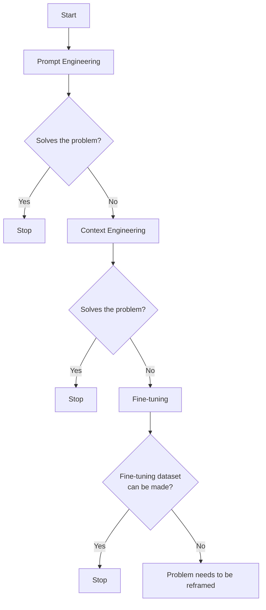
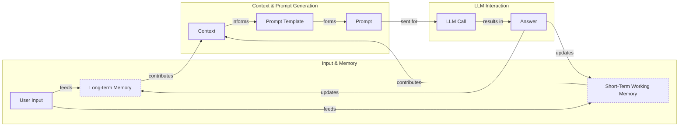
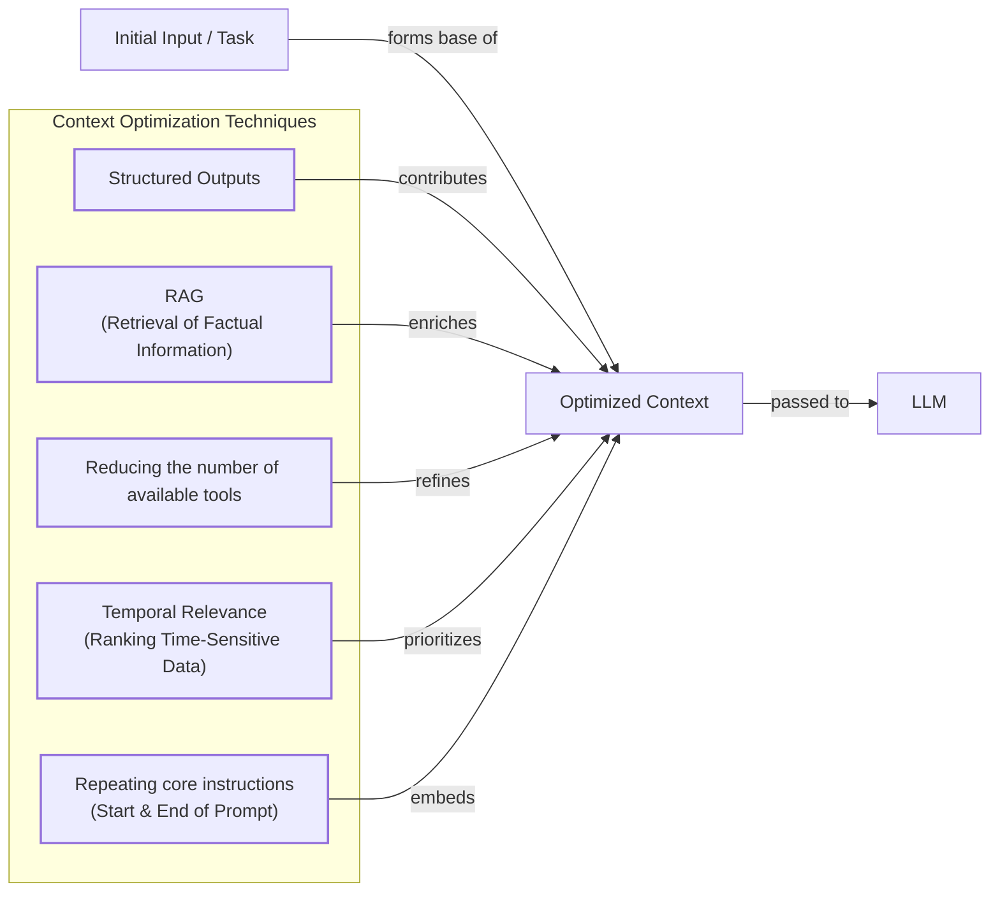
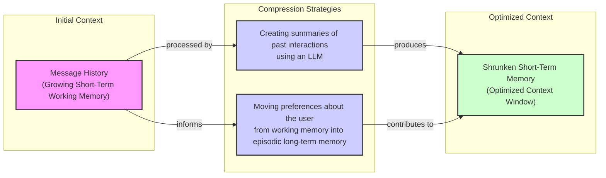
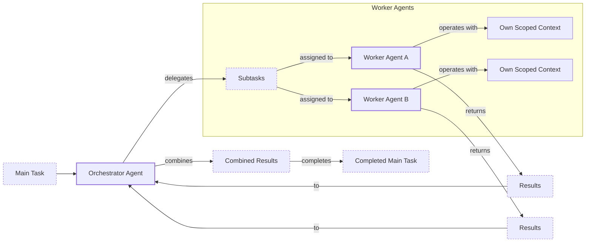

# Context Engineering: The #1 Skill for AI Engineers

AI applications have evolved rapidly. In 2022, we had simple chatbots for question-answering. By 2023, Retrieval-Augmented Generation (RAG) systems connected LLMs to domain-specific knowledge [[26]](https://www.securityindustry.org/2024/07/16/understanding-the-evolution-from-classic-chatbots-to-rag-chatbots-to-ai-powered-assistants/). The year 2024 brought us tool-using agents that could perform actions. Now, we are building memory-enabled agents that remember past interactions and maintain state over time [[27]](https://pagergpt.ai/ai-chatbot/evolution-of-ai-chatbots).

In our last lesson, we explored how to choose between AI agents and LLM workflows. As these applications grow more complex, prompt engineering, a practice that once served us well, is showing its limits. It optimizes single LLM calls but fails when managing systems with memory, tools, and long interaction histories. The sheer volume of information an agent might need—past conversations, user data, documents, and action descriptions—has grown exponentially [[31]](https://www.langchain.com/blog/context-engineering-for-agents).

Simply stuffing all this into a prompt is not a viable strategy. This is where context engineering comes in. It is the discipline of orchestrating this entire information ecosystem to ensure the LLM gets exactly what it needs, when it needs it. This skill is becoming a core foundation for AI engineering.

## From prompt to context engineering

Prompt engineering, while effective for simple tasks, is designed for single, stateless interactions. It treats each call to an LLM as a new, isolated event. This approach breaks down in stateful applications where context must be preserved and managed across multiple turns.

As a conversation or task progresses, the context grows. Without a strategy to manage this growth, the LLM’s performance degrades. This is context decay: the model gets confused by the noise of an ever-expanding history and starts to lose track of the original instructions or key information [[1]](https://atlan.com/know/llm-context-window-limitations/), [[3]](https://www.trychroma.com/research/context-rot).

Even with large context windows, a physical limit exists for what you can include. Furthermore, on the operational side, every token adds to the cost and latency of an LLM call [[21]](https://packmind.com/context-engineering-ai-coding/what-is-contextops/). Simply putting everything into the context creates a slow, expensive, and underperforming system. We will explore these concepts in more detail in upcoming lessons, including memory in Lesson 9 and RAG in Lesson 10.

On a recent project, we learned this the hard way. We were working with a model that supported a million-token context window, so we thought, "What could go wrong?" We stuffed everything in: our research, guidelines, examples, and user history. The result was an LLM workflow that took 30 minutes to run and produced low-quality outputs.

This is where context engineering becomes essential. It shifts the focus from crafting static prompts to building dynamic systems that manage information flow. As an AI engineer, your job is to select only the most critical pieces of context for each LLM call. This makes your applications accurate, fast, and cost-effective.

## Understanding context engineering

Context engineering is about finding the best way to arrange parts of your application's memory into the context that is passed to an LLM to get the best possible results. It is a solution to an optimization problem where you retrieve the right parts of both your short-term and long-term memory to solve a specific task without overwhelming the model [[41]](https://www.decodingai.com/p/context-engineering-2025s-1-skill). For example, when you ask a cooking agent for a recipe, you do not give it the entire cookbook. Instead, you retrieve the specific recipe, along with personal context like allergies or taste preferences. This precise selection ensures the model receives only the essential information.

Andrej Karpathy offered a great analogy: LLMs are like a new kind of operating system where the model is the CPU and its context window is the RAM [[31]](https://www.langchain.com/blog/context-engineering-for-agents/), [[33]](https://atlan.com/know/working-memory-llms/). Just as an operating system manages what fits into your computer’s limited RAM, context engineering manages what information occupies the model’s limited context window.

Context engineering does not replace prompt engineering. Instead, you can see prompt engineering as a subset of context engineering. You still need to learn how to write good prompts while gathering the right context and fitting it into your prompt without breaking the LLM [[41]](https://www.decodingai.com/p/context-engineering-2025s-1-skill).

| Dimension | Prompt Engineering | Context Engineering |
| --- | --- | --- |
| Scope | Single interaction optimization | Entire information ecosystem |
| State Management | Stateless function | Stateful due to memory |
| Focus | How to phrase tasks | What information to provide |

Table 1: A comparison of prompt engineering and context engineering.

Context engineering is the new fine-tuning. While fine-tuning has its place, it is expensive, time-consuming, and inflexible. Data changes constantly, making fine-tuning a last resort. For most enterprise use cases, you get better results faster and more cheaply with context engineering [[52]](https://memgraph.com/blog/prompt-engineering-vs-context-engineering). It allows for rapid iteration and adaptation to evolving data without altering the core model, a key advantage in dynamic environments.

When you start a new AI project, your decision-making process for guiding the LLM should look like the one presented in Image 1.



Image 1: A flowchart illustrating the decision-making workflow for choosing between Prompt Engineering, Context Engineering, and Fine-tuning when building new AI applications.

For instance, if you build an agent to process internal Slack messages, you do not need to fine-tune a model on your company’s communication style. It is more effective to use a powerful reasoning model and engineer the context to retrieve specific messages and enable actions like creating tasks or drafting emails. Throughout this course, we will show you how to solve most industry problems using only context engineering.

## What makes up the context

To master context engineering, you first need to understand what "context" actually is. It is everything the LLM sees in a single turn, dynamically assembled from various memory components before being passed to the model.

The high-level workflow, as presented in Image 2, begins when a user input triggers the system to pull relevant information from both long-term and short-term memory. This information is assembled into the final context, inserted into a prompt template, and sent to the LLM. The LLM’s answer then updates the memory, and the cycle repeats.



Image 2: A high-level workflow diagram illustrating how context is connected to the prompt template and prompt in an LLM application.

These components are grouped into two main categories. We will explain them intuitively for now, as we have future dedicated lessons for all of them.

**Short-term working memory** is the state of the agent for the current task or conversation. It is volatile and changes with each interaction, helping the agent maintain a coherent dialogue and make immediate decisions. It can include some or all of these components [[12]](https://www.dailydoseofds.com/llmops-crash-course-part-8/):

*   **User input:** The most recent query or command from the user.
*   **Message history:** The log of the current conversation, allowing the LLM to understand the flow and previous turns.
*   **Agent's internal thoughts:** The reasoning steps the agent takes to decide on its next action.
*   **Action calls and outputs:** The results from any actions the agent has performed, providing information from external systems.

**Long-term memory** is more persistent and stores information across sessions, allowing the AI system to remember things beyond a single conversation. We divide it into three types, drawing parallels from human memory [[38]](https://www.analyticsvidhya.com/blog/2026/01/how-does-llm-memory-work/). An AI system can include some or all of them:

*   **Procedural memory:** This is knowledge encoded directly in the code. It includes the system prompt, which sets the agent's overall behavior. It also includes the definitions of available actions and schemas for structured outputs, which guide the format of its responses. Think of this as the agent's built-in skills [[39]](https://skymod.tech/why-memory-matters-in-llm-agents-short-term-vs-long-term-memory-architectures/).
*   **Episodic memory:** This is memory of specific past experiences, like user preferences or previous interactions. It's used to help the agent personalize its responses based on individual users. We typically store this in vector or graph databases for efficient retrieval [[40]](https://labelstud.io/learningcenter/episodic-vs-persistent-memory-in-llms/).
*   **Semantic memory:** This is the agent’s general knowledge base. It can be internal, like company documents, or external, accessed via the internet through API calls or web scraping. This memory provides the factual information the agent needs to answer questions [[37]](https://www.datacamp.com/blog/how-does-llm-memory-work).

If this seems like a lot, bear with us. We will cover all these concepts in-depth in future lessons, including structured outputs in Lesson 4, tools in Lesson 6, memory in Lesson 9, and RAG in Lesson 10.![An illustration of an AI agent's architecture, showing the user input leading to the agent, which then accesses action tools and short-term memory. The short-term memory is expanded with various context elements like user input, tool schemas, user facts, internal chatter, and retrieved facts to form the context for a prompt. This prompt is then sent back to the agent. The agent also interacts with long-term memory via RAG tools, which access databases (SQL, Vector, Graph) and MCP servers. The long-term memory can also be unloaded to episodic memory.](https://i.imgur.com/k2H57wA.png)

Image 3: A detailed illustration of how all the context engineering components work together inside an AI agent (Image by DECODING ML)

The key takeaway is that these components are not static. They are dynamically re-computed for every single interaction. For each conversation turn or new task, the short-term memory grows, or the long-term memory can change. Context engineering involves knowing how to select the right pieces from this vast memory pool to construct the most effective prompt for the task at hand.

## Production implementation challenges

Now that we understand what makes up the context, let's look at the core challenges of implementing it in production. These challenges all revolve around a single question: *"How can I keep my context as small as possible while providing enough information to the LLM?"*

Here are four common issues that come up when building AI applications:

1.  **The context window challenge:** Every AI model has a limited context window, the maximum amount of information (tokens) it can process at once. Think of it like your computer's RAM. If your machine has only 32GB of RAM, that is all it can use at one time. While context windows are getting larger, they are not infinite, and treating them as such leads to other problems [[16]](https://www.comet.com/site/blog/context-window/).

2.  **Information overload:** Just because you can fit a lot of information into the context does not mean you should. Too much context reduces the performance of the LLM by confusing it. This is known as the "lost-in-the-middle" or "needle in the haystack" problem, where LLMs are known for remembering information best at the beginning and end of the context window [[56]](https://www.linkedin.com/pulse/lost-middle-lesson-failing-ai-agents-backwards-anthony-dejohn-01k2e). Information in the middle is often overlooked, and performance can drop long before the physical context limit is reached [[58]](https://dev.to/thousand_miles_ai/the-lost-in-the-middle-problem-why-llms-ignore-the-middle-of-your-context-window-3al2).

3.  **Context drift:** This occurs when conflicting versions of the truth accumulate in the memory over time [[6]](https://galileo.ai/blog/production-llm-monitoring-strategies). For example, the memory might contain two conflicting statements: "*The user's budget is $500*" and later "*The user's budget is $1,000*." This is not a quantum physics experiment; it is a data conflict that confuses the LLM. Without a mechanism to resolve these conflicts, the model's responses become unreliable [[8]](https://thenewstack.io/context-rot-enterprise-ai-llms/).

4.  **Tool confusion:** This arises in two main ways. First, adding too many tools to an agent can confuse the LLM about the best one for the job [[18]](https://www.getmaxim.ai/articles/context-window-management-strategies-for-long-context-ai-agents-and-chatbots/). Second, confusion can occur when tool descriptions are poorly written or overlap. If the distinctions between actions are unclear, even a human would struggle to choose the right one [[41]](https://www.decodingai.com/p/context-engineering-2025s-1-skill).

## Key strategies for context optimization

Initially, most AI applications were chatbots over single knowledge bases. Today, modern AI solutions must manage multiple knowledge bases, tools, and complex conversational histories. Context engineering is about managing this complexity while meeting performance, latency, and cost requirements.

Here are four popular context engineering strategies used across the industry:

### Selecting the right context

Retrieving the right information from memory is a critical first step. A common mistake is to provide everything at once, assuming that models with large context windows can handle it. As we have discussed, the "lost-in-the-middle" problem often leads to poor performance, increased latency, and higher costs [[59]](https://atlan.com/know/llm-context-window-limitations/).

To solve this, consider these approaches:

*   **Use structured outputs:** Define clear schemas for what the LLM should return. This allows you to pass only the necessary, structured information to downstream steps. We will cover this in detail in Lesson 4.
*   **Use RAG:** Instead of providing entire documents, use RAG to fetch only the specific chunks of text needed to answer a user's question. This is a core topic we will explore in Lesson 10.
*   **Reduce the number of available actions:** Rather than giving an agent access to every available action, use various strategies to delegate action subsets to specialized components. For example, a typical pattern is to leverage the orchestrator-worker pattern to delegate subtasks to specialized agents. Studies have shown that applying RAG to tool descriptions and keeping selections under 30 can triple tool selection accuracy [[41]](https://www.decodingai.com/p/context-engineering-2025s-1-skill).
*   **Rank time-sensitive data:** For time-sensitive information, rank it by date and filter out anything no longer relevant [[12]](https://www.dailydoseofds.com/llmops-crash-course-part-8/).
*   **Repeat core instructions:** For the most important instructions, repeat them at both the start and the end of the prompt. This uses the model's tendency to pay more attention to the context edges, ensuring core instructions are not lost [[57]](https://promptmetheus.com/resources/llm-knowledge-base/lost-in-the-middle-effect).



Image 4: An architecture diagram showing how various context optimization techniques contribute to an optimized context for an LLM.

### Context compression

As message history grows in short-term working memory, you must manage past interactions to keep your context window in check. You cannot simply drop past conversation turns, as the LLM still needs to remember what happened. Instead, you need ways to compress key facts from the past.

You can do this through:

1.  **Creating summaries of past interactions:** Use an LLM to replace a long, detailed history with a concise overview [[11]](https://oneuptime.com/blog/post/2026-01-30-context-compression/view).
2.  **Moving user preferences to long-term memory:** Transfer user preferences from working memory to long-term episodic memory. This keeps the working context clean while ensuring preferences are remembered for future sessions.
3.  **Deduplication:** Remove redundant information from the context to avoid repetition [[12]](https://www.dailydoseofds.com/llmops-crash-course-part-8/).



Image 5: A process flow diagram illustrating context compression strategies.

### Isolating Context

Another powerful strategy is to isolate context by splitting information across multiple agents or LLM workflows. This technique is similar to tool isolation but applies to the entire context. The key idea is that instead of one agent with a massive, cluttered context window, you can have a team of agents, each with a smaller, focused context [[48]](https://www.vellum.ai/blog/multi-agent-systems-building-with-context-engineering).

We often implement this using an orchestrator-worker pattern, where a central orchestrator agent breaks down a problem and assigns sub-tasks to specialized worker agents [[47]](https://gurusup.com/blog/multi-agent-orchestration-guide). Each worker operates in its own isolated context, improving focus and allowing for parallel processing. We will cover this pattern in more detail in Lesson 5.



Image 6: An interaction diagram illustrating the orchestrator-worker pattern for context isolation.

### Format Optimizations

Finally, the way you format the context matters. Models are sensitive to structure, and using clear delimiters can improve performance. Common strategies are to use XML tags to wrap different pieces of context (e.g., `<user_query>`, `<documents>`) and prefer YAML over JSON for structured data, as it is more token-efficient [[41]](https://www.decodingai.com/p/context-engineering-2025s-1-skill).

You always have to understand what is passed to the LLM. Seeing exactly what occupies your context window at every step is key to mastering context engineering. This is usually done by properly monitoring your traces, tracking what happens at each step, and understanding the inputs and outputs. As this is a significant step to go from proof-of-concept to production, we will have dedicated lessons on this topic.

## Here is an example

Let's connect the theory with a concrete example. Consider these common real-world scenarios:

*   **Healthcare:** An AI assistant accesses a patient's medical history, current symptoms, and the latest medical literature to provide personalized diagnostic support [[43]](https://www.mdpi.com/2079-9292/13/15/2961).
*   **Financial Services:** An AI system integrates with CRMs and calendars, combining real-time market data with client information to generate tailored financial advice.
*   **Project Management:** An AI system accesses enterprise tools like CRMs, Slack, and task managers to automatically understand project requirements and update tasks.
*   **Content Creator Assistant:** An AI agent uses your research, past content, and personality traits to understand what and how to create a given piece of content.

Let's walk through a specific query to see context engineering in action with the healthcare assistant. A user asks: `I have a headache. What can I do to stop it? I would prefer not to take any medicine.`

Before the AI attempts to answer, a context engineering system performs several steps:

1.  It retrieves the user's patient history, known allergies, and lifestyle habits from episodic memory.
2.  It queries a medical database for non-pharmacological headache remedies from semantic memory.
3.  It assembles the key units of information from both memory types into the final context.
4.  It formats this information into a structured prompt and calls the LLM.
5.  Finally, it presents a personalized, context-aware answer to the user.

Here is a simplified Python example showing how you might structure the prompt for the LLM, using XML tags to format the different context elements. Notice the clear structure and ordering [[41]](https://www.decodingai.com/p/context-engineering-2025s-1-skill).

```python
SYSTEM_PROMPT = """
You are a helpful and cautious AI healthcare assistant. Your goal is to provide safe, non-medicinal advice. Do not provide medical diagnoses.

<INSTRUCTIONS>
1. Analyze the user's query and the provided context.
2. Use the patient history to understand their health profile and preferences.
3. Use the retrieved medical knowledge to form your recommendation.
4. If you lack sufficient information, ask clarifying questions.
5. Always prioritize safety and advise consulting a doctor for serious issues.
</INSTRUCTIONS>

<PATIENT_HISTORY>
{retrieved_patient_history}
</PATIENT_HISTORY>

<MEDICAL_KNOWLEDGE>
{retrieved_medical_articles}
</MEDICAL_KNOWLEDGE>

<CONVERSATION_HISTORY>
{formatted_chat_history}
</CONVERSATION_HISTORY>

<USER_QUERY>
{user_query}
</USER_QUERY>

Based on all the information above, provide a helpful response.
"""
```

To build such a system, you need a robust tech stack. Here is a potential stack we recommend and will use throughout this course:

*   **LLM:** Gemini as a multimodal, reasoning, and cost-effective LLM API provider.
*   **Orchestration:** LangGraph for defining stateful, agentic workflows.
*   **Databases:** PostgreSQL, MongoDB, Redis, Qdrant, and Neo4j. Often, it is effective to keep it simple, as you can achieve much with only PostgreSQL or MongoDB.
*   **Observability:** Opik or LangSmith for evaluation and trace monitoring.

## Connecting context engineering to AI engineering

Context engineering is more of an art than a science. It is about developing the intuition to craft effective prompts, select the right information from memory, and arrange context for optimal results. This discipline helps you determine the minimal yet essential information an LLM needs to perform at its best.

It is important to understand that context engineering cannot be learned in isolation. It is a complex field that combines:

1.  **AI Engineering:** Implement practical solutions such as LLM workflows, RAG, AI Agents, and evaluation pipelines.
2.  **Software Engineering (SWE):** Build your AI product with code that is not just functional, but also scalable and maintainable, and design architectures that can grow with your product's needs.
3.  **Data Engineering:** Design data pipelines that feed curated and validated data into the memory layer.
4.  **Operations (Ops):** Deploy agents on the proper infrastructure to ensure they are reproducible, maintainable, observable, and scalable, including automating processes with CI/CD pipelines.

Our goal with this course is to teach you how to combine these skills to build production-ready AI products. In the world of AI, we should all think in systems rather than isolated components, having a mindset shift from developers to architects.

In the next lesson, we will explore structured outputs. We will also see how context engineering is a recurring theme when we learn about tools, memory, and RAG in future lessons.

## References

- [1] LLM Context Window Limitations: Impacts, Risks, & Fixes in 2026. (n.d.). Atlan. https://atlan.com/know/llm-context-window-limitations/
- [2] Context rot. (2025). Chroma. https://www.trychroma.com/research/context-rot
- [3] Production LLM Monitoring Strategies. (n.d.). Galileo. https://galileo.ai/blog/production-llm-monitoring-strategies
- [4] Navigating the Shifting Sands: Understanding and Mitigating Data Drift in LLMs. (n.d.). Coforge. https://www.coforge.com/what-we-know/blog/navigating-the-shifting-sands-understanding-and-mitigating-data-drift-in-llms
- [5] Context Rot in Enterprise AI: Why It Happens and How to Fix It. (2026, February). The New Stack. https://thenewstack.io/context-rot-enterprise-ai-llms/
- [6] Context Compression in LLM Applications. (2026, January 30). OneUptime. https://oneuptime.com/blog/post/2026-01-30-context-compression/view
- [7] Context Engineering: Memory and Temporal Context. (n.d.). Daily Dose of Data Science. https://www.dailydoseofds.com/llmops-crash-course-part-8/
- [8] Efficient Context Management in LLM Agents. (2025, December). JetBrains Research. https://blog.jetbrains.com/research/2025/12/efficient-context-management/
- [9] Context Window: What It Is and Why It Matters for AI Agents. (2025, December 23). Comet. https://www.comet.com/site/blog/context-window/
- [10] Context Window Optimization for LLM Applications. (n.d.). DataHub. https://datahub.com/blog/context-window-optimization/
- [11] Context Window Management Strategies for Long-Context AI Agents and Chatbots. (n.d.). Maxim.ai. https://www.getmaxim.ai/articles/context-window-management-strategies-for-long-context-ai-agents-and-chatbots/
- [12] Context Engineering for AI Coding: a Practical Intro to ContextOps. (n.d.). Packmind. https://packmind.com/context-engineering-ai-coding/what-is-contextops/
- [13] Context Engineering for Observability: How to Deliver the Right Data to LLMs. (n.d.). Mezmo. https://www.mezmo.com/learn-observability/context-engineering-for-observability-how-to-deliver-the-right-data-to-llms
- [14] AI Context Engineering: A Comprehensive Guide. (n.d.). Sombra. https://sombrainc.com/blog/ai-context-engineering-guide
- [15] Context Engineering: AI's Foundation of Reliable, High-Performing Models. (n.d.). Glean. https://www.glean.com/blog/context-engineering-ai-the-foundation-of-reliable-high-performing-models
- [16] Understanding the Evolution: From Classic Chatbots to RAG Chatbots to AI-Powered Assistants. (2024, July 16). Security Industry Association. https://www.securityindustry.org/2024/07/16/understanding-the-evolution-from-classic-chatbots-to-rag-chatbots-to-ai-powered-assistants/
- [17] The Evolution of AI Chatbots. (n.d.). pagergpt.ai. https://pagergpt.ai/ai-chatbot/evolution-of-ai-chatbots
- [18] When did AI chatbots start? (n.d.). Dante AI. https://www.dante-ai.com/news/when-did-ai-chatbots-start
- [19] Context Engineering for Agents. (2025, July 2). LangChain Blog. https://blog.langchain.com/context-engineering-for-agents/
- [20] Context Engineering vs. Prompt Engineering: Key Differences Explained. (n.d.). Glean. https://www.glean.com/perspectives/context-engineering-vs-prompt-engineering-key-differences-explained
- [21] Working Memory in LLMs. (n.d.). Atlan. https://atlan.com/know/working-memory-llms/
- [22] From Vibe Coding to Context Engineering: A Blueprint for Production-Grade GenAI Systems. (n.d.). Sundeep Teki. https://www.sundeepteki.org/blog/from-vibe-coding-to-context-engineering-a-blueprint-for-production-grade-genai-systems
- [23] How does LLM Memory Work? (n.d.). DataCamp. https://www.datacamp.com/blog/how-does-llm-memory-work
- [24] How does LLM Memory Work? (2026, January). Analytics Vidhya. https://www.analyticsvidhya.com/blog/2026/01/how-does-llm-memory-work/
- [25] Why Memory Matters in LLM Agents: Short-Term vs. Long-Term Memory Architectures. (n.d.). Skymod. https://skymod.tech/why-memory-matters-in-llm-agents-short-term-vs-long-term-memory-architectures/
- [26] Episodic vs. Persistent Memory in LLMs. (n.d.). Label Studio. https://labelstud.io/learningcenter/episodic-vs-persistent-memory-in-llms/
- [27] Context Engineering: 2025’s #1 Skill in AI. (2025). Decoding AI. https://www.decodingai.com/p/context-engineering-2025s-1-skill
- [28] Prompt Engineering in Healthcare. (2025). MDPI. https://www.mdpi.com/2079-9292/13/15/2961
- [29] Effective Context Engineering for AI Agents. (n.d.). Anthropic. https://www.anthropic.com/engineering/effective-context-engineering-for-ai-agents
- [30] Multi-Agent Orchestration Patterns for Production. (n.d.). Beam.ai. https://beam.ai/agentic-insights/multi-agent-orchestration-patterns-production
- [31] Multi-Agent Orchestration Guide. (n.d.). GuruSup. https://gurusup.com/blog/multi-agent-orchestration-guide
- [32] Multi-Agent Systems: Building with Context Engineering. (n.d.). Vellum.ai. https://www.vellum.ai/blog/multi-agent-systems-building-with-context-engineering
- [33] Deterministic AI Orchestration: A Platform Architecture for Autonomous Development. (n.d.). Praetorian. https://www.praetorian.com/blog/deterministic-ai-orchestration-a-platform-architecture-for-autonomous-development/
- [34] Prompt engineering vs context engineering. (2026, March 13). Memgraph. https://memgraph.com/blog/prompt-engineering-vs-context-engineering
- [35] Context Engineering for Observability. (n.d.). Mezmo. https://www.mezmo.com/learn-observability/context-engineering-for-observability-how-to-deliver-the-right-data-to-llms
- [36] Context Engineering. (n.d.). Instinctools. https://www.instinctools.com/blog/context-engineering/
- [37] Context Engineering vs. Prompt Engineering. (n.d.). Neo4j. https://neo4j.com/blog/agentic-ai/context-engineering-vs-prompt-engineering/
- [38] Lost in the Middle: A Lesson in Failing AI Agents Backwards. (n.d.). LinkedIn. https://www.linkedin.com/pulse/lost-middle-lesson-failing-ai-agents-backwards-anthony-dejohn-01k2e
- [39] Lost-in-the-Middle Effect. (n.d.). Promptmetheus. https://promptmetheus.com/resources/llm-knowledge-base/lost-in-the-middle-effect
- [40] The 'Lost in the Middle' Problem: Why LLMs Ignore the Middle of Your Context Window. (n.d.). dev.to. https://dev.to/thousand_miles_ai/the-lost-in-the-middle-problem-why-llms-ignore-the-middle-of-your-context-window-3al2
- [41] LLM Context Window Limitations. (n.d.). Atlan. https://atlan.com/know/llm-context-window-limitations/
- [42] Needle in a Haystack: Optimizing Retrieval and RAG over Long Context Windows. (n.d.). BigData Boutique. https://bigdataboutique.com/blog/needle-in-haystack-optimizing-retrieval-and-rag-over-long-context-windows-5dfb3c
- [43] A Survey of Context Engineering for Large Language Models. (2025, July). arXiv. https://arxiv.org/pdf/2507.13334
- [44] Context Engineering: A Guide With Examples. (n.d.). DataCamp. https://www.datacamp.com/blog/context-engineering
- [45] Context Engineering - What it is, and techniques to consider. (n.d.). LlamaIndex. https://www.llamaindex.ai/blog/context-engineering-what-it-is-and-techniques-to-consider
- [46] The rise of "context engineering". (2025, June 23). LangChain Blog. https://blog.langchain.com/the-rise-of-context-engineering/
- [47] Karpathy, A. (n.d.). X. https://x.com/karpathy/status/1937902205765607626
- [48] lenadroid. (n.d.). X. https://x.com/lenadroid/status/1943685060785524824
- [49] Own your context window. (n.d.). GitHub. https://github.com/humanlayer/12-factor-agents/blob/main/content/factor-03-own-your-context-window.md
- [50] Context Engineering Guide. (2025, July 5). AI Newsletter. https://nlp.elvissaravia.com/p/context-engineering-guide
- [51] What is Context Engineering? (n.d.). Pinecone. https://www.pinecone.io/learn/context-engineering/