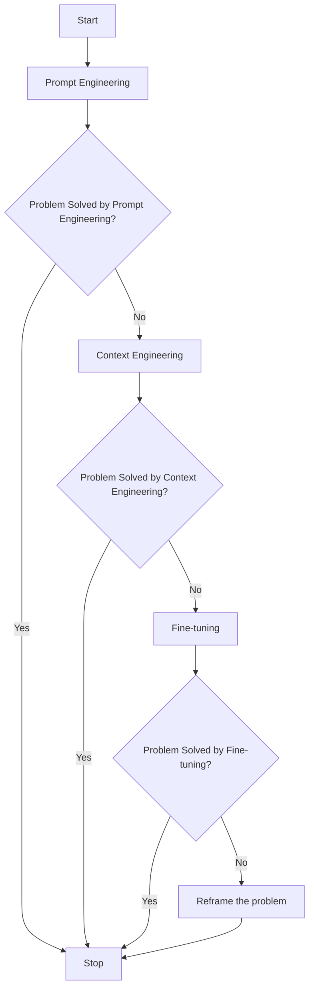
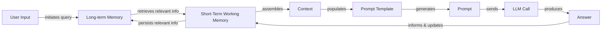
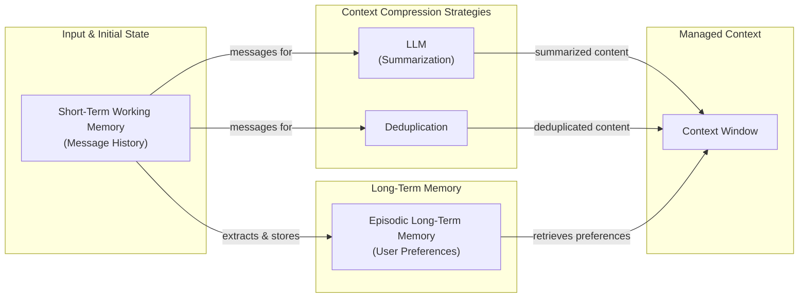
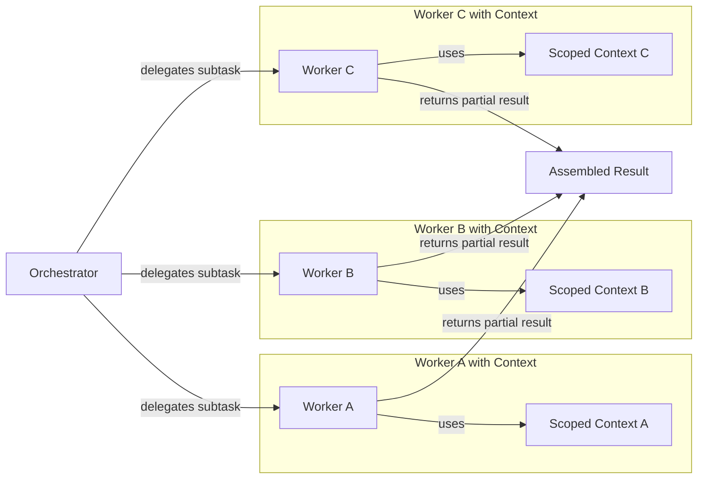

# Lesson 3: Context Engineering

## When prompt engineering breaks

AI applications have evolved rapidly. In 2022, we had simple chatbots for question-answering, which operated on predefined scripts and struggled with complex queries. By 2023, Retrieval-Augmented Generation (RAG) systems connected LLMs to domain-specific knowledge, allowing for more contextual responses but limited to providing information. 2024 brought us tool-using agents that could perform actions. Now, we are building memory-enabled agents that remember past interactions and build relationships over time [[26]](https://www.securityindustry.org/2024/07/16/understanding-the-evolution-from-classic-chatbots-to-rag-chatbots-to-ai-powered-assistants/).

In our last lesson, we explored how to choose between AI agents and LLM workflows when designing a system. As these applications grow more complex, prompt engineering, a practice that once served us well, is showing its limits. It optimizes single LLM calls but fails when managing systems with memory, actions, and long interaction histories. The sheer volume of information an agent might need—past conversations, user data, documents, and action descriptions—has grown exponentially. Simply stuffing all this into a prompt is not a viable strategy.

The discipline of context engineering addresses these challenges by orchestrating this entire information ecosystem to ensure the LLM gets exactly what it needs, when it needs it [[22]](https://arxiv.org/pdf/2507.13334). This skill is becoming a core foundation for AI engineering.

## From Prompt to Context Engineering

Prompt engineering, while effective for simple tasks, is designed for single, stateless interactions. It treats each call to an LLM as a new, isolated event. This approach breaks down in stateful applications where context must be preserved and managed across multiple turns [[25]](https://www.datacamp.com/blog/context-engineering).

As a conversation or task progresses, the context grows. Without a strategy to manage this growth, the LLM’s performance degrades. This is context decay: the model gets confused by the noise of an ever-expanding history. A 2025 study of 18 frontier models confirmed that performance degrades non-uniformly as input length increases, a phenomenon termed "context rot" [[1]](https://www.trychroma.com/research/context-rot). It starts to lose track of the original instructions or key information. We will explore these concepts in more detail in upcoming lessons, including memory in Lesson 9 and RAG in Lesson 10.

Even with large context windows, a physical limit exists for what you can include. Also, on the operational side, every token adds to the cost and latency of an LLM call [[16]](https://www.comet.com/site/blog/context-window/). Simply putting everything into the context creates a slow, expensive, and underperforming system.

On a recent project, we learned this the hard way. We were working with a model that supported a two-million-token context window, so we thought, "*What could go wrong*?" We stuffed everything in: our research, guidelines, examples, and user history. The result was an LLM workflow that took 30 minutes to run and produced low-quality outputs [[19]](https://www.decodingai.com/p/context-engineering-2025s-1-skill).

The need for context engineering becomes clear, shifting the focus from crafting static prompts to building dynamic systems that manage information flow. As an AI Engineer, your job is to select only the most critical pieces of context for each LLM call. This makes your applications accurate, fast, and cost-effective [[20]](https://blog.langchain.com/the-rise-of-context-engineering/).

## Understanding Context Engineering

Context engineering is about finding the best way to arrange parts of your memory into the context that is passed to the LLM to squeeze out the best results. Formally, it is an optimization problem: finding the ideal set of functions to assemble a context that maximizes the quality of the LLM's output for a given task [[22]](https://arxiv.org/pdf/2507.13334). For example, when you ask a cooking agent for a recipe, you do not give it the entire cookbook. Instead, you retrieve the specific recipe, along with personal context like allergies or taste preferences. This precise selection ensures the model receives only the essential information.

Andrej Karpathy offered a great analogy for this: LLMs are like a new kind of operating system, where the model acts as the CPU and its context window functions as the RAM [[19]](https://www.decodingai.com/p/context-engineering-2025s-1-skill), [[31]](https://www.langchain.com/blog/context-engineering-for-agents). Just as an operating system manages what fits into RAM, context engineering curates what occupies the model’s working memory. Everything outside the context window—like vector stores or conversation logs—is like disk storage: vast and passive, requiring an explicit "load" operation to influence the model's reasoning [[33]](https://atlan.com/know/working-memory-llms/).

Context engineering is not replacing prompt engineering. Instead, you can intuitively see prompt engineering as a part of context engineering. You still need to learn how to write good prompts while gathering the right context and stuffing it into your prompt without breaking the LLM [[19]](https://www.decodingai.com/p/context-engineering-2025s-1-skill).

| Dimension | Prompt Engineering | Context Engineering |
| --- | --- | --- |
| Scope | Single interaction optimization | Entire information ecosystem |
| State Management | Stateless function | Stateful due to memory |
| Focus | How to phrase tasks | What information to provide |

Table 1: A comparison of prompt engineering and context engineering.

Context engineering is the new fine-tuning. While fine-tuning has its place, it is expensive, time-consuming, and inflexible. Data changes constantly, making fine-tuning a last resort. For most enterprise use cases, you get better results faster and more cheaply with context engineering [[51]](https://www.linkedin.com/posts/denis-panjuta_prompt-engineering-vs-context-engineering-activity-7363945251180322816-1q_m). It allows for rapid iteration and adaptation to evolving data without altering the core model, a key advantage in dynamic environments [[52]](https://memgraph.com/blog/prompt-engineering-vs-context-engineering).

When you start a new AI project, your decision-making process for guiding the LLM should look like the one presented in Image 1.



Image 1: Flowchart illustrating the decision-making process for choosing a key strategy to guide an LLM.

For instance, if you build an agent to process internal Slack messages, you do not need to fine-tune a model on your company’s communication style. It is more effective to use a powerful reasoning model and engineer the context to retrieve specific messages and enable actions like creating tasks or drafting emails. Throughout this course, we will show you how to solve most industry problems using only context engineering.

## What Makes Up the Context

To master context engineering, you first need to understand what "context" actually is. It is everything the LLM sees in a single turn, dynamically assembled from various memory components before being passed to the model [[21]](https://www.llamaindex.ai/blog/context-engineering-what-it-is-and-techniques-to-consider). The high-level workflow begins when a user input triggers the system to pull relevant information from both long-term and short-term memory. This information is assembled into the final context, inserted into a prompt template, and sent to the LLM. The LLM’s response then updates the memory, and the cycle repeats.



Image 2: A flowchart illustrating the high-level workflow of how context is assembled and used in an LLM application.

These components are grouped into two main categories. We will explain them intuitively for now, as we have future dedicated lessons for all of them.

### Short-Term Working Memory

Short-term working memory is the state of the agent for the current task or conversation. It is volatile and changes with each interaction, helping the agent maintain a coherent dialogue and make immediate decisions [[37]](https://www.datacamp.com/blog/how-does-llm-memory-work). This is physically implemented in the GPU's memory via the Key-Value (KV) cache, which stores representations of tokens for efficient access during generation [[36]](https://atlan.com/know/working-memory-llms/). It can include some or all of these components:
*   **User input:** The most recent query or command from the user.
*   **Message history:** The log of the current conversation, allowing the LLM to understand the flow and previous turns.
*   **Agent's internal thoughts:** The reasoning steps the agent takes to decide on its next action.
*   **Action calls and outputs:** The results from any actions the agent has performed, providing information from external systems.

### Long-Term Memory

Long-term memory is more persistent and stores information across sessions, allowing the AI system to remember things beyond a single conversation. We divide it into three types, drawing parallels from human memory [[19]](https://www.decodingai.com/p/context-engineering-2025s-1-skill). An AI system can include some or all of them:
*   **Procedural memory:** This is knowledge encoded directly in the code. It includes the system prompt, which sets the agent's overall behavior. It also includes the definitions of available actions and schemas for structured outputs, which guide the format of its responses. This can be considered the agent's built-in skills [[38]](https://www.analyticsvidhya.com/blog/2026/01/how-does-llm-memory-work/).
*   **Episodic memory:** This is memory of specific past experiences, like user preferences or previous interactions. It is used to help the agent personalize its responses based on individual users. We typically store this in vector or graph databases for efficient retrieval, allowing the agent to recall past events and conversations [[39]](https://skymod.tech/why-memory-matters-in-llm-agents-short-term-vs-long-term-memory-architectures/).
*   **Semantic memory:** This is the agent’s general knowledge base. It can be internal, like company documents, or external, accessed via the internet through API calls. This memory provides the factual information the agent needs to answer questions, grounding its responses in real-world knowledge [[38]](https://www.analyticsvidhya.com/blog/2026/01/how-does-llm-memory-work/).

If this seems like a lot, bear with us. We will cover all these concepts in-depth in future lessons, including structured outputs (Lesson 4), actions (Lesson 6), memory (Lesson 9), RAG (Lesson 10), and working with multimodal data (Lesson 11).

https://substackcdn.com/image/fetch/f_auto,q_auto:good,fl_progressive:steep/https%3A%2F%2Fsubstack-post-media.s3.amazonaws.com%2Fpublic%2Fimages%2F39dce26a-e51e-4167-ac9e-ca28c45b53a6_1115x708.png

Image 3: A detailed illustration of how all the context engineering components work together inside an AI agent (Source [DECODING ML](https://www.decodingai.com/p/context-engineering-2025s-1-skill) [[19]](https://www.decodingai.com/p/context-engineering-2025s-1-skill))

The key takeaway is that these components are not static. They are dynamically re-computed for every single interaction. For each conversation turn or new task, the short-term memory grows, or the long-term memory can change. Context engineering involves knowing how to select the right pieces from this vast memory pool to construct the most effective prompt for the task at hand.

## Production Implementation Challenges

Now that we understand what makes up the context, let's look at the core challenges of implementing it in production. These challenges all revolve around a single question: *"How can I keep my context as small as possible while providing enough information to the LLM?"*

Here are four common issues that come up when building AI applications.

**The context window challenge** arises because every AI model has a limited context window, the maximum amount of information (tokens) it can process at once [[16]](https://www.comet.com/site/blog/context-window/). This is similar to your computer's RAM. If your machine has only 32GB of RAM, that is all it can use at one time. While context windows are getting larger, they are not infinite. For long-running agentic workflows, context from conversation history and tool outputs accumulates with each step, quickly approaching these limits and leading to failures [[2]](https://redis.io/blog/context-window-overflow/).

**Information overload** is another problem. Just because you can fit a lot of information into the context does not mean you should. Too much context reduces the performance of the LLM by confusing it. This is known as the "lost-in-the-middle" or "needle in the haystack" problem, where LLMs exhibit a U-shaped attention curve, remembering information best at the beginning and end of the context window [[56]](https://www.linkedin.com/pulse/lost-middle-lesson-failing-ai-agents-backwards-anthony-dejohn-01k2e). Information in the middle is often overlooked, and performance can drop by over 30% long before the physical context limit is reached [[58]](https://dev.to/thousand_miles_ai/the-lost-in-the-middle-problem-why-llms-ignore-the-middle-of-your-context-window-3al2), [[59]](https://atlan.com/know/llm-context-window-limitations/).

**Context drift** occurs when conflicting versions of truth accumulate in the memory over time. For example, the memory might contain two conflicting statements: "*My cat is white*" and "*My cat is black*" [[19]](https://www.decodingai.com/p/context-engineering-2025s-1-skill). This is not Schrodinger's Cat quantum physics experiment; it is a data conflict that confuses the LLM. Without a mechanism to resolve these conflicts, the model's responses become unreliable, eroding user trust as the system's behavior becomes unpredictable [[6]](https://galileo.ai/blog/production-llm-monitoring-strategies), [[7]](https://www.coforge.com/what-we-know/blog/navigating-the-shifting-sands-understanding-and-mitigating-data-drift-in-llms). This problem is amplified in multi-agent systems, where it manifests as "interagent misalignment" as agents operate on inconsistent shared states, a challenge similar to maintaining cache coherence in distributed computing [[74]](https://www.oreilly.com/radar/why-multi-agent-systems-need-memory-engineering/).

**Tool confusion** is the final challenge, which arises in two main ways. First, adding too many actions to an agent can confuse the LLM about the best one for the job, a problem that can appear with over 100 tools. Second, confusion can occur when tool descriptions are poorly written or overlap. The Gorilla benchmark shows that nearly all models perform worse when given more than one tool. If the distinctions between actions are unclear, even a human would struggle to choose the right one [[19]](https://www.decodingai.com/p/context-engineering-2025s-1-skill).

## Key Strategies for Context Optimization

Initially, most AI applications were chatbots over single knowledge bases. Today, modern AI solutions must manage multiple knowledge bases, tools, and complex conversational histories. Context engineering is about managing this complexity while meeting performance, latency, and cost requirements.

Here are four popular context engineering strategies used across the industry.

### Selecting the Right Context

Retrieving the right information from memory is a critical first step. A common mistake is to provide everything at once, assuming that models with large context windows can handle it. As we have discussed, the "lost-in-the-middle" problem often leads to poor performance, increased latency, and higher costs [[59]](https://atlan.com/know/llm-context-window-limitations/). To solve this, you can use several techniques: use structured outputs to pass only necessary information downstream (more on this in Lesson 4); use RAG with reranking to fetch only the most relevant factual information required (more on this in Lesson 10) [[12]](https://www.dailydoseofds.com/llmops-crash-course-part-8/); and reduce the number of available actions to avoid confusing the LLM. Studies show that limiting the selection to under 30 tools can triple the agent's selection accuracy [[25]](https://www.datacamp.com/blog/context-engineering). For time-sensitive information, rank it by date and filter out anything no longer relevant. Finally, for the most important instructions, repeat them at both the start and the end of the prompt. This uses the model's tendency to pay more attention to the context edges, ensuring core instructions are not lost [[19]](https://www.decodingai.com/p/context-engineering-2025s-1-skill).

```mermaid
flowchart LR
  %% External Sources and Initial Input
  subgraph "Input & Sources"
    A["User Input"]
    KB["Knowledge Base<br/>(RAG Source)"]
  end

  %% Context Optimization Layer
  subgraph "Context Optimization Layer"
    B["Raw Context Aggregation"]
    C["RAG Retrieval"]
    D["Tool Selection<br/>(Reducing Tools)"]
    E["Temporal Filtering<br/>(Temporal Relevance)"]
    F["Structured Output<br/>Formatting"]
    G["Instruction Reinforcement<br/>(Repeating Core Instructions)"]
    H["Optimized Context"]
  end

  %% Core AI System
  subgraph "Core AI System"
    I["Large Language Model<br/>(LLM)"]
  end

  %% Output
  J["System Response"]

  %% Data Flow
  A -- "provides" --> B
  KB -- "informs retrieval" --> C
  B -- "initial context" --> C
  C -- "retrieved context" --> D
  D -- "filtered tools & context" --> E
  E -- "time-relevant context" --> F
  F -- "formatted context" --> G
  G -- "final optimized context" --> H
  H -- "input prompt" --> I
  I -- "generates" --> J
```



Image 4: An architecture diagram showing how context optimization techniques work together in a larger AI system before reaching the LLM.

### Context Compression

As message history grows in short-term working memory, you must manage past interactions to keep your context window in check. You cannot simply drop past conversation turns, as the LLM still needs to remember what happened. Instead, you need ways to compress key facts from the past. You can do this by creating summaries of past interactions with an LLM, moving user preferences to long-term episodic memory, and using techniques like extractive summarization, sentence pruning, and semantic deduplication to remove redundant information [[11]](https://oneuptime.com/blog/post/2026-01-30-context-compression/view), [[12]](https://www.dailydoseofds.com/llmops-crash-course-part-8/).



Image 5: A flowchart illustrating context compression strategies to manage the context window.

### Isolating Context

Another powerful strategy is to isolate context by splitting information across multiple agents or LLM workflows. This technique is similar to tool isolation but is more general, referring to the whole context. The key idea is that instead of one agent with a massive, cluttered context window, you can have a team of agents, each with a smaller, focused context [[31]](https://www.langchain.com/blog/context-engineering-for-agents). We often implement this using an orchestrator-worker pattern, where a central orchestrator agent breaks down a problem and assigns sub-tasks to specialized worker agents [[46]](https://beam.ai/agentic-insights/multi-agent-orchestration-patterns-production). Each worker operates in its own isolated context, which prevents cross-domain hallucinations and can reduce token consumption by 60-70% [[47]](https://gurusup.com/blog/multi-agent-orchestration-guide). We will cover this pattern in more detail in Lesson 5.



Image 6: An architecture diagram illustrating the orchestrator-worker pattern for context isolation.

### Format Optimizations

The way you format the context matters. Models are sensitive to structure, and using clear delimiters can improve performance. Common strategies are to use XML tags to wrap different pieces of context, which helps the model distinguish between different types of information [[44]](https://www.anthropic.com/engineering/effective-context-engineering-for-ai-agents). Also, when providing structured data as input, YAML is often more token-efficient than JSON, which helps save space in your context window [[19]](https://www.decodingai.com/p/context-engineering-2025s-1-skill).

A more advanced, hardware-aware strategy involves optimizing the Key-Value (KV) cache, which stores intermediate attention calculations during inference. For agentic workflows with both fixed (e.g., system prompt) and dynamic (e.g., user query) parts, selectively reusing cached values from the fixed segments can dramatically reduce latency. Systems like CacheSlide use techniques to manage this reuse, recomputing only a small subset of tokens to maintain accuracy while achieving significant speedups [[68]](https://www.usenix.org/system/files/fast26-liu-yang.pdf).

To conclude, you always have to understand what is passed to the LLM. Seeing exactly what occupies your context window at every step is key to mastering context engineering. Usually, this is done by properly monitoring your traces, tracking what happens at each step, and understanding what the inputs and outputs are. As this is a significant step to go from PoC to production, we will have dedicated lessons on this.

## Here is an Example

Let's connect the theory and strategies discussed earlier with a concrete example. Consider these common real-world scenarios where context engineering is vital:
*   **Healthcare:** An AI assistant accesses a patient's medical history, current symptoms, and the latest medical literature to provide personalized diagnostic support [[41]](https://www.decodingai.com/p/context-engineering-2025s-1-skill). This requires careful handling of sensitive data and ensuring recommendations are grounded in verified medical knowledge.
*   **Financial Services:** AI systems integrate with enterprise tools like Customer Relationship Management (CRM) systems and calendars, combining real-time market data and client information to generate tailored financial advice. The context must be current and accurate to avoid costly errors.
*   **Project Management:** AI systems access enterprise infrastructure like CRMs, Slack, and task managers to automatically understand project requirements, then add and update project tasks. This involves synthesizing information from multiple, often unstructured, sources.
*   **Content Creator Assistant:** An AI agent uses your research, past content, and personality traits to understand what and how to create a given piece of content, maintaining a consistent voice and style.
*   **Robotics and Embodied AI:** An autonomous robot's memory must fuse multimodal data from text, vision, and proprioception. Context engineering here involves managing spatial memory, meeting real-time latency constraints, and enabling cross-modal retrieval to ground the agent in its physical environment [[69]](https://arxiv.org/html/2603.07670v1).

Let's walk through a specific query to see context engineering in action with the healthcare assistant scenario. A user asks: `I have a headache. What can I do to stop it? I would prefer not to take any medicine.`

Before the AI attempts to answer, a context engineering system performs several steps:
1.  It retrieves the user's patient history, known allergies, and lifestyle habits from episodic memory. This step personalizes the interaction [[19]](https://www.decodingai.com/p/context-engineering-2025s-1-skill).
2.  It queries a medical database for non-pharmacological headache remedies from semantic memory, ensuring the advice is factually sound.
3.  It assembles this information, along with the user's query and the conversation history, into a structured prompt.
4.  The prompt is sent to the LLM, which generates a personalized, safe, and relevant recommendation.
5.  The interaction is logged, and any new preferences are saved back to the user's episodic memory for future use.

Here is a simplified Python example showing how you might structure the context and prompt for the LLM, using XML tags to format the different context elements.

```python
SYSTEM_PROMPT = """
You are a helpful and cautious AI healthcare assistant. Your goal is to provide safe, non-medicinal advice. Do not provide medical diagnoses.

<INSTRUCTIONS>
1. Analyze the user's query and the provided context.
2. Use the patient history to understand their health profile and preferences.
3. Use the retrieved medical knowledge to form your recommendation.
4. If you lack sufficient information, ask clarifying questions.
5. Always prioritize safety and advise consulting a doctor for serious issues.
</INSTRUCTIONS>

<PATIENT_HISTORY>
{retrieved_patient_history}
</PATIENT_HISTORY>

<MEDICAL_KNOWLEDGE>
{retrieved_medical_articles}
</MEDICAL_KNOWLEDGE>

<CONVERSATION_HISTORY>
{formatted_chat_history}
</CONVERSATION_HISTORY>

<USER_QUERY>
{user_query}
</USER_QUERY>

Based on all the information above, provide a helpful response.
"""
```

Still, the key relies on the system around it that brings in the proper context to populate the system prompt. To build such a system, you need a robust tech stack. Here is a potential stack we recommend and will use throughout this course:
*   **LLM:** Gemini as a multimodal, reasoning, and cost-effective LLM API provider.
*   **Orchestration:** LangGraph for defining stateful, agentic workflows [[65]](https://www.scalablepath.com/machine-learning/langgraph).
*   **Databases:** PostgreSQL, MongoDB, Redis, Qdrant, and Neo4j. Often, it is effective to keep it simple, as you can achieve much with only PostgreSQL or MongoDB.
*   **Observability:** Opik or LangSmith for evaluation and trace monitoring [[16]](https://www.comet.com/site/blog/context-window/).

## Connecting Context Engineering to AI Engineering

Mastering context engineering is less about learning a specific algorithm and more about building intuition. It is the art of knowing how to structure prompts, what information to include, and how to order it for maximum impact.

This skill does not exist in a vacuum. It is a multidisciplinary practice that sits at the intersection of several key engineering fields [[19]](https://www.decodingai.com/p/context-engineering-2025s-1-skill).

**AI Engineering:** Implement practical solutions such as LLM workflows, RAG, AI Agents, and evaluation pipelines. This involves understanding the capabilities and limitations of different models and architectures.

**Software Engineering (SWE):** Build your AI product with code that is not just functional, but also scalable and maintainable. This means designing robust APIs, managing dependencies, and writing clean, testable code.

**Data Engineering:** Design data pipelines that feed curated and validated data into the memory layer. For example, building a reliable pipeline to keep your RAG knowledge base fresh and accurate is a data engineering challenge.

**Operations (Ops):** Deploy agents on the proper infrastructure to ensure they are reproducible, maintainable, observable, and scalable, including automating processes with CI/CD pipelines.

Our goal with this course is to teach you how to combine these skills to build production-ready AI products. In the world of AI, we should all think in systems rather than isolated components, having a mindset shift from developers to architects.

This lesson has laid the foundation for why managing context is so critical. The next logical step is to control what comes *out* of the LLM. In our next lesson, we will dive into structured outputs, a technique that forces the model to respond in a predictable, machine-readable format. This technique is essential for connecting the probabilistic outputs of LLMs with the deterministic, structured code of your application, and it is a pattern we will use throughout the rest of the course.

## References

- [1] https://www.trychroma.com/research/context-rot
- [2] https://redis.io/blog/context-window-overflow/
- [3] https://www.trychroma.com/research/context-rot
- [6] https://galileo.ai/blog/production-llm-monitoring-strategies
- [7] https://www.coforge.com/what-we-know/blog/navigating-the-shifting-sands-understanding-and-mitigating-data-drift-in-llms
- [11] https://oneuptime.com/blog/post/2026-01-30-context-compression/view
- [12] https://www.dailydoseofds.com/llmops-crash-course-part-8/
- [16] https://www.comet.com/site/blog/context-window/
- [19] https://www.decodingai.com/p/context-engineering-2025s-1-skill
- [20] https://blog.langchain.com/the-rise-of-context-engineering/
- [21] https://www.llamaindex.ai/blog/context-engineering-what-it-is-and-techniques-to-consider
- [22] https://arxiv.org/pdf/2507.13334
- [25] https://www.datacamp.com/blog/context-engineering
- [26] https://www.securityindustry.org/2024/07/16/understanding-the-evolution-from-classic-chatbots-to-rag-chatbots-to-ai-powered-assistants/
- [31] https://www.langchain.com/blog/context-engineering-for-agents/
- [33] https://atlan.com/know/working-memory-llms/
- [36] https://atlan.com/know/working-memory-llms/
- [37] https://www.datacamp.com/blog/how-does-llm-memory-work
- [38] https://www.analyticsvidhya.com/blog/2026/01/how-does-llm-memory-work/
- [39] https://skymod.tech/why-memory-matters-in-llm-agents-short-term-vs-long-term-memory-architectures/
- [41] https://www.decodingai.com/p/context-engineering-2025s-1-skill
- [44] https://www.anthropic.com/engineering/effective-context-engineering-for-ai-agents
- [46] https://beam.ai/agentic-insights/multi-agent-orchestration-patterns-production
- [47] https://gurusup.com/blog/multi-agent-orchestration-guide
- [51] https://www.linkedin.com/posts/denis-panjuta_prompt-engineering-vs-context-engineering-activity-7363945251180322816-1q_m
- [52] https://memgraph.com/blog/prompt-engineering-vs-context-engineering
- [56] https://www.linkedin.com/pulse/lost-middle-lesson-failing-ai-agents-backwards-anthony-dejohn-01k2e
- [58] https://dev.to/thousand_miles_ai/the-lost-in-the-middle-problem-why-llms-ignore-the-middle-of-your-context-window-3al2
- [59] https://atlan.com/know/llm-context-window-limitations/
- [65] https://www.scalablepath.com/machine-learning/langgraph
- [66] https://openreview.net/pdf/2cb74ae648f650e37d77885eb6ef22c93d1860dc.pdf
- [68] https://www.usenix.org/system/files/fast26-liu-yang.pdf
- [69] https://arxiv.org/html/2603.07670v1
- [74] https://www.oreilly.com/radar/why-multi-agent-systems-need-memory-engineering/
</article>