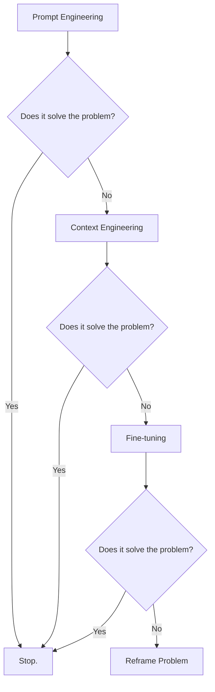
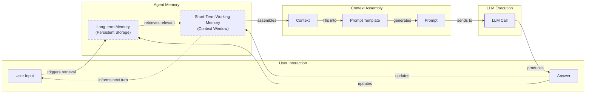
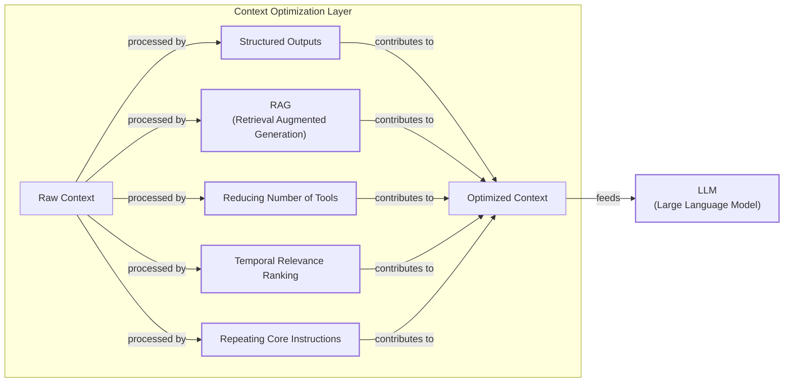
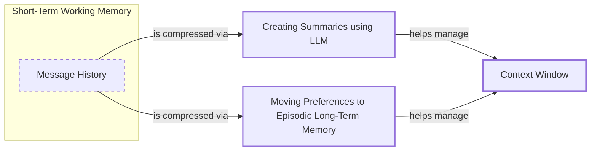
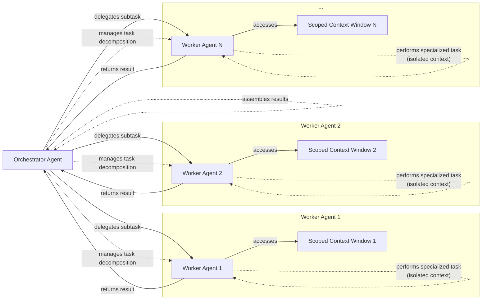

# Context Engineering: The #1 Skill for AI Engineers

AI applications have evolved rapidly. In 2022, we had simple chatbots for question-answering. By 2023, Retrieval-Augmented Generation (RAG) systems connected LLMs to domain-specific knowledge. 2024 brought us tool-using agents that could perform actions. Now, we are building memory-enabled agents that remember past interactions and build relationships over time.

In our last lesson, we explored how to choose between AI agents and LLM workflows when designing a system. As these applications grow more complex, prompt engineering, a practice that once served us well, is showing its limits. It optimizes single LLM calls but fails when managing systems with memory, actions, and long interaction histories. The sheer volume of information an agent might need—past conversations, user data, documents, and action descriptions—has grown exponentially. Simply stuffing all this into a prompt is not a viable strategy. The solution is a more systematic approach called context engineering. It is the discipline of orchestrating this entire information ecosystem to ensure the LLM gets exactly what it needs, when it needs it. This skill is becoming a core foundation for AI engineering, moving beyond simple prompts to build robust, stateful systems. The complexity of modern agents, which must juggle multiple data sources, tools, and memory types, demands this more sophisticated practice.

## From Prompt to Context Engineering

Prompt engineering, while effective for simple tasks, is designed for single, stateless interactions. It treats each call to an LLM as a new, isolated event. This approach breaks down in stateful applications where context must be preserved and managed across multiple turns.

As a conversation or task progresses, the context grows. Without a strategy to manage this growth, the LLM’s performance degrades. This is context decay: the model gets confused by the noise of an ever-expanding history. It starts to lose track of the original instructions or key information.

Even with large context windows, a physical limit exists for what you can include. Also, on the operational side, every token adds to the cost and latency of an LLM call. Simply putting everything into the context creates a slow, expensive, and underperforming system. We will explore these concepts in more detail in upcoming lessons, including memory in Lesson 9 and RAG in Lesson 10.

On a recent project, we learned this the hard way. We were working with a model that supported a million-token context window, so we thought, "What could go wrong?" We stuffed everything in, including our research, guidelines, examples, and user history. The resulting LLM workflow took 30 minutes to run and produced low-quality outputs.

This is where context engineering becomes essential. It shifts the focus from crafting static prompts to building dynamic systems that manage information flow. As an AI engineer, your job is to select only the most critical pieces of context for each LLM call. This makes your applications accurate, fast, and cost-effective.

## Understanding Context Engineering

Context engineering is about finding the best way to arrange parts of your memory into the context that is passed to the LLM to get the best results. It is a solution to an optimization problem in which you have to retrieve the right parts of both your short- and long-term memory to solve a specific task without overwhelming the LLM [[1]](https://arxiv.org/pdf/2507.13334). For example, when you ask a cooking agent for a recipe, you do not give it the entire cookbook. Instead, you retrieve the specific recipe, along with personal context like allergies or taste preferences. This precise selection ensures the model receives only the essential information.

Andrej Karpathy offered a great analogy for this: LLMs are like a new kind of operating system, where the model acts as the CPU and its context window functions as the RAM [[2]](https://x.com/karpathy/status/1937902205765607626). Just as an operating system manages what fits into RAM, context engineering curates what occupies the model’s working memory.

This analogy has deep roots in cognitive science. The Baddeley and Hitch model of human working memory, a dominant framework for 50 years, describes a multicomponent system that parallels an LLM's architecture. It includes a "central executive" for attentional control, similar to the LLM's attention mechanism, and an "episodic buffer" that integrates information, much like how an agent assembles context from retrieved memories and conversation history into a coherent whole [[3]](https://atlan.com/know/working-memory-llms/). The key insight is that this system is capacity-limited by design, making selectivity a feature, not a flaw.

How does context engineering relate to prompt engineering? Prompt engineering is a subset of context engineering. You still write effective prompts, but you also design a system that feeds the right context into those prompts. This means understanding not just *how* to phrase a task, but *what* information the model needs to perform optimally.

| Dimension | Prompt Engineering | Context Engineering |
| --- | --- | --- |
| Scope | Single interaction optimization | Entire information ecosystem |
| State Management | Stateless function | Stateful due to memory |
| Focus | How to phrase tasks | What information to provide |

Table 1: A comparison of prompt engineering and context engineering.

Context engineering is the new fine-tuning. While fine-tuning has its place, it is expensive, time-consuming, and inflexible. Data changes constantly, making fine-tuning a last resort. For most enterprise use cases, you get better results faster and more cheaply with context engineering. It allows for rapid iteration and adaptation to evolving data without altering the core model, a key advantage in dynamic environments.

When you start a new AI project, your decision-making process for guiding the LLM should look like the one presented in Image 1.



Image 1: A flowchart illustrating the decision-making process for choosing key strategies in a new AI project.

For instance, if you build an agent to process internal Slack messages, you do not need to fine-tune a model on your company’s communication style. It is more effective to use a powerful reasoning model and engineer the context to retrieve specific messages and enable actions like creating tasks or drafting emails. Throughout this course, we will show you how to solve most industry problems using only context engineering.

## What Makes Up the Context

To master context engineering, you first need to understand what "context" actually is. It is everything the LLM sees in a single turn, dynamically assembled from various memory components before being passed to the model.

The high-level workflow, as presented in Image 2, begins when a user input triggers the system to pull relevant information from both long-term and short-term memory. This information is assembled into the final context, inserted into a prompt template, and sent to the LLM. The LLM’s response then updates the memory, and the cycle repeats.



Image 2: A flowchart depicting the high-level workflow of how context is assembled and used in an LLM application.

These components are grouped into two main categories. We will explain them intuitively for now, as we have future dedicated lessons for all of them.

### Short-Term Working Memory

Short-term working memory is the state of the agent for the current task or conversation. It is volatile and changes with each interaction, helping the agent maintain a coherent dialogue and make immediate decisions. It can include some or all of these components:

-   **User input:** The most recent query or command from the user.
-   **Message history:** The log of the current conversation, allowing the LLM to understand the flow and previous turns.
-   **Agent's internal thoughts:** The reasoning steps the agent takes to decide on its next action.
-   **Action calls and outputs:** The results from any actions the agent has performed, providing information from external systems.

### Long-Term Memory

Long-term memory is more persistent and stores information across sessions, allowing the AI system to remember things beyond a single conversation. We divide it into three types, drawing parallels from human memory [[4]](https://www.datacamp.com/blog/how-does-llm-memory-work). An AI system can include some or all of them:

-   **Procedural memory:** This is knowledge encoded directly in the code. It includes the system prompt, which sets the agent's overall behavior. It also includes the definitions of available actions, which tell the agent what it can do, and schemas for structured outputs, which guide the format of its responses. Think of this as the agent's built-in skills.
-   **Episodic memory:** This is memory of specific past experiences, like user preferences or previous interactions. It is used to help the agent personalize its responses based on individual users. We typically store this in vector or graph databases for efficient retrieval [[5]](https://www.decodingai.com/p/context-engineering-2025s-1-skill).
-   **Semantic memory:** This is the agent’s general knowledge base. It can be internal, like company documents stored in a database, or external, accessed via the internet through API calls or web scraping. This memory provides the factual information the agent needs to answer questions [[5]](https://www.decodingai.com/p/context-engineering-2025s-1-skill).

If this seems like a lot, bear with us. We will cover all these concepts in-depth in future lessons, including structured outputs (Lesson 4), actions (Lesson 6), memory (Lesson 9), RAG (Lesson 10), and working with multimodal data (Lesson 11).

Image 3: A detailed illustration of how all the context engineering components work together inside an AI agent. (Source [DECODING ML [5]](https://www.decodingai.com/p/context-engineering-2025s-1-skill))

The key takeaway is that these components are not static. They are dynamically re-computed for every single interaction. For each conversation turn or new task, the short-term memory grows, or the long-term memory can change. Context engineering involves knowing how to select the right pieces from this vast memory pool to construct the most effective prompt for the task at hand.

## Production Implementation Challenges

Now that we understand what makes up the context, let's look at the core challenges of implementing it in production. These challenges all revolve around a single question: "How can I keep my context as small as possible while providing enough information to the LLM?"

Here are four common issues that come up when building AI applications:

1.  **The context window challenge:** Every AI model has a limited context window, the maximum amount of information (tokens) it can process at once. Think of it like your computer's RAM. If your machine has only 32GB of RAM, that is all it can use at one time. While context windows are getting larger, they are not infinite, and treating them as such leads to other problems [[17]](https://datahub.com/blog/context-window-optimization/).
2.  **Information overload:** Just because you can fit a lot of information into the context does not mean you should. Too much context degrades LLM performance. This is known as the "lost-in-the-middle" problem, where research shows accuracy can drop by over 30 percentage points for information placed in the middle of the context window compared to the beginning or end [[3]](https://atlan.com/know/working-memory-llms/). This happens because of a structural property in their architecture that de-emphasizes middle tokens, a phenomenon called context rot [[3]](https://atlan.com/know/working-memory-llms/).
3.  **Context drift:** This occurs when conflicting versions of the truth accumulate over time. For example, the memory might contain two conflicting statements: "My cat is white" and "My cat is black." This is not Schrodinger's Cat; it is a data conflict that confuses the LLM. This can lead to context poisoning, where a single incorrect piece of information or a contradiction derails the agent's entire reasoning process, with some studies showing performance drops of up to 39% from this effect [[6]](https://galileo.ai/blog/context-engineering-for-agents).
4.  **Tool confusion:** The final challenge is tool confusion, which arises in two main ways. First, adding too many tools to an agent can confuse the LLM about the best one for the job. The Gorilla benchmark shows that nearly all models perform worse when given more than one tool [[5]](https://www.decodingai.com/p/context-engineering-2025s-1-skill). Second, confusion can occur when tool descriptions are poorly written or overlap. If the distinctions between actions are unclear, even a human would struggle to choose the right one.

## Key Strategies for Context Optimization

Initially, most AI applications were chatbots over single knowledge bases. Today, modern AI solutions must manage multiple knowledge bases, tools, and complex conversational histories. Context engineering is about managing this complexity while meeting performance, latency, and cost requirements.

Here are four popular context engineering strategies used across the industry.

### Selecting the Right Context

Retrieving the right information from memory is a critical first step. A common mistake is to provide everything at once, assuming that models with large context windows can handle it. As we have discussed, the "lost-in-the-middle" problem often leads to poor performance, increased latency, and higher costs [[7]](https://atlan.com/know/llm-context-window-limitations/).

To solve this, consider these approaches:

-   **Use structured outputs:** Define clear schemas for what the LLM should return. This allows you to pass only the necessary, structured information to downstream steps. We will cover this in detail in Lesson 4.
-   **Use RAG:** Instead of providing entire documents, use RAG to fetch only the specific chunks of text needed to answer a user's question. This is a core topic we will explore in Lesson 10.
-   **Reduce the number of available actions:** Rather than giving an agent access to every available action, use various strategies to delegate action subsets to specialized components. Studies show that keeping tool selections under 30 can improve selection accuracy threefold [[11]](https://www.datacamp.com/blog/context-engineering). Still, the ideal number depends on the tools, the LLM, and how well the actions are defined.
-   **Rank time-sensitive data:** For time-sensitive information, rank it by date and filter out anything no longer relevant [[14]](https://www.dailydoseofds.com/llmops-crash-course-part-8/).
-   **Repeat core instructions:** For the most important instructions, repeat them at both the start and the end of the prompt. This uses the model's tendency to pay more attention to the context edges, ensuring core instructions are not lost [[13]](https://promptmetheus.com/resources/llm-knowledge-base/lost-in-the-middle-effect).



Image 4: An architecture diagram illustrating how various context optimization techniques for "Selecting the right context" can be combined in a larger AI system.

### Context Compression

As message history grows in short-term working memory, you must manage past interactions to keep your context window in check. You cannot simply drop past conversation turns, as the LLM still needs to remember what happened. Instead, you need ways to compress key facts from the past.

You can do this through:

1.  **Creating summaries of past interactions:** Use an LLM to replace a long, detailed history with a concise overview [[12]](https://oneuptime.com/blog/post/2026-01-30-context-compression/view).
2.  **Moving user preferences to long-term memory:** Transfer user preferences from working memory to long-term episodic memory. This keeps the working context clean while ensuring preferences are remembered for future sessions.
3.  **Deduplication:** Remove redundant information from the context to avoid repetition using techniques like MinHash or semantic clustering [[12]](https://oneuptime.com/blog/post/2026-01-30-context-compression/view).
4.  **Attention-based token pruning:** Use techniques like LLMLingua, which can achieve up to 20x compression with minimal performance loss by identifying and removing tokens with low attention weights before they are sent to the model [[3]](https://atlan.com/know/working-memory-llms/).



Image 5: A flowchart illustrating context compression strategies.

### Isolating Context

Another powerful strategy is to isolate context by splitting information across multiple agents or LLM workflows. This technique is similar to tool isolation but applies to the entire context. The key idea is that instead of one agent with a massive, cluttered context window, you can have a team of agents, each with a smaller, focused context.

We often implement this using an orchestrator-worker pattern, where a central orchestrator agent breaks down a problem and assigns sub-tasks to specialized worker agents [[9]](https://beam.ai/agentic-insights/multi-agent-orchestration-patterns-production). Each worker operates in its own isolated context, improving focus and allowing for parallel processing. We will cover this pattern in more detail in Lesson 5.



Image 6: An architecture diagram illustrating the orchestrator-worker pattern for context isolation.

### Format Optimizations

Finally, the way you format the context matters. Models are sensitive to structure, and using clear delimiters can improve performance. Common strategies are to:

-   **Use XML tags:** Wrap different pieces of context in XML-like tags (e.g., `<user_query>`, `<documents>`). This helps the model distinguish between different types of information, while making it easier for the engineer to reference context elements within the system prompt [[10]](https://www.anthropic.com/engineering/effective-context-engineering-for-ai-agents).
-   **Prefer YAML over JSON:** When providing structured data as input, YAML is often more token-efficient than JSON, which helps save space in your context window.

You always have to understand what is passed to the LLM. Seeing what occupies your context window at every step is key. This is done by monitoring your traces and establishing a rigorous evaluation framework. This includes tracking metrics like token usage per request and cost per successful outcome, and using methods like A/B testing to empirically validate that your optimization strategies are improving performance without degrading quality [[8]](https://tetrate.io/learn/ai/mcp/token-optimization-strategies). As this is a significant step to go from proof-of-concept to production, we will have dedicated lessons on this.

## Here Is an Example

Let's connect the theory and strategies with a concrete example. Consider these common real-world scenarios:

-   **Healthcare:** An AI assistant accesses a patient's medical history, current symptoms, and relevant medical literature to provide personalized diagnostic support [[5]](https://www.decodingai.com/p/context-engineering-2025s-1-skill). This requires managing sensitive data securely while retrieving precise information from both episodic memory (patient history) and semantic memory (medical knowledge).
-   **Financial Services:** AI systems integrate with enterprise tools like a Customer Relationship Management (CRM) system, emails, and calendars. They combine real-time market data with client portfolio information to generate tailored financial advice. Here, context engineering ensures that the agent has an up-to-date, holistic view of the client's financial situation and preferences before making recommendations.
-   **Project Management:** An AI system accesses enterprise infrastructure like CRMs, Slack, and task managers to automatically understand project requirements. It can then add and update project tasks, assign them to team members, and monitor progress. This involves maintaining a persistent state of the project and understanding the relationships between different tasks and dependencies.
-   **Content Creator Assistant:** An AI agent uses your research, past content, and personality traits to understand what and how to create a given piece of content. It might retrieve notes from your knowledge base, analyze the style of your previous articles, and access real-time information to help you draft a new blog post that is consistent with your brand.

Let's walk through a specific query to see context engineering in action with the healthcare assistant scenario. A user asks: `I have a headache. What can I do to stop it? I would prefer not to take any medicine.`

Before the LLM even sees this query, a context engineering system performs several steps:

1.  It retrieves the user's patient history, known allergies, and lifestyle habits from an **episodic memory** store, often a vector or graph database [[5]](https://www.decodingai.com/p/context-engineering-2025s-1-skill). This provides the personal context needed for a tailored recommendation.
2.  It queries a **semantic memory** of up-to-date medical literature for non-medicinal headache remedies. This grounds the response in factual, reliable knowledge, preventing hallucinations.
3.  It assembles this information, along with the user's query and the recent conversation history, into a structured prompt. The different pieces of context are clearly delineated, often using XML tags, to help the model distinguish between patient data, medical facts, and the user's immediate request.
4.  We send the prompt to the LLM, which generates a personalized, safe, and relevant recommendation based on the carefully curated context.
5.  We log the interaction and save any new preferences or insights—for example, if the user mentions a new sensitivity—back to the user's episodic memory for future consultations. This closes the loop, allowing the agent to learn and improve over time.

Here’s a simplified Python example showing how these components might be assembled into a complete system prompt. Notice the clear structure using XML tags and the ordering of context elements.

```python
SYSTEM_PROMPT = """
You are a helpful and cautious AI healthcare assistant. Your goal is to provide safe, non-medicinal advice. Do not provide medical diagnoses.

<INSTRUCTIONS>
1. Analyze the user's query and the provided context.
2. Use the patient history to understand their health profile and preferences.
3. Use the retrieved medical knowledge to form your recommendation.
4. If you lack sufficient information, ask clarifying questions.
5. Always prioritize safety and advise consulting a doctor for serious issues.
</INSTRUCTIONS>

<PATIENT_HISTORY>
{retrieved_patient_history}
</PATIENT_HISTORY>

<MEDICAL_KNOWLEDGE>
{retrieved_medical_articles}
</MEDICAL_KNOWLEDGE>

<CONVERSATION_HISTORY>
{formatted_chat_history}
</CONVERSATION_HISTORY>

<USER_QUERY>
{user_query}
</USER_QUERY>

Based on all the information above, provide a helpful response.
"""
```

The key is the system around the prompt that brings in the proper context to populate these fields. To build such a system, you would use a combination of tools. A potential stack we will use throughout this course includes:

-   **LLM:** Gemini as a multimodal, reasoning, and cost-effective LLM API provider.
-   **Orchestration:** LangGraph for defining stateful, agentic workflows.
-   **Databases:** PostgreSQL, MongoDB, Redis, Qdrant, and Neo4j. Often, it is effective to keep it simple, as you can achieve much with only PostgreSQL or MongoDB.
-   **Observability:** Opik or LangSmith for evaluation and trace monitoring.

## Connecting Context Engineering to AI Engineering

Mastering context engineering is not about learning a single algorithm, but about building the intuition to orchestrate a complete information system. It is the art of knowing how to structure prompts, what information to include, and how to order it for maximum impact.

This skill does not exist in a vacuum. It is a multidisciplinary practice that sits at the intersection of several key engineering fields:

-   **AI Engineering:** Understanding LLMs, RAG, and AI agents is the foundation.
-   **Software Engineering:** You need to build scalable and maintainable systems to aggregate context and wrap agents in robust APIs.
-   **Data Engineering:** Constructing reliable data pipelines for RAG and other memory systems is critical.
-   **MLOps:** Deploying agents on the right infrastructure and automating Continuous Integration/Continuous Deployment (CI/CD) makes them reproducible, observable, and scalable.

Our goal with this course is to teach you how to combine these skills to build production-ready AI products. In the world of AI, we should all think in systems rather than isolated components, having a mindset shift from developers to architects. This means understanding how each piece of your application—from the data pipelines to the deployment infrastructure—contributes to the final user experience.

In the next lesson, we will explore structured outputs, a key technique for ensuring the data flowing out of your LLM is reliable and predictable. From there, we will continue to build on the foundations of context engineering, diving into how agents use actions to interact with the world, how they manage short-term and long-term memory, and how RAG systems provide them with the knowledge they need to perform complex tasks.

## References

-   [1] https://arxiv.org/pdf/2507.13334
-   [2] https://x.com/karpathy/status/1937902205765607626
-   [3] https://atlan.com/know/working-memory-llms/
-   [4] https://www.datacamp.com/blog/how-does-llm-memory-work
-   [5] https://www.decodingai.com/p/context-engineering-2025s-1-skill
-   [6] https://galileo.ai/blog/context-engineering-for-agents
-   [7] https://atlan.com/know/llm-context-window-limitations/
-   [8] https://tetrate.io/learn/ai/mcp/token-optimization-strategies
-   [9] https://beam.ai/agentic-insights/multi-agent-orchestration-patterns-production
-   [10] https://www.anthropic.com/engineering/effective-context-engineering-for-ai-agents
-   [11] https://www.datacamp.com/blog/context-engineering
-   [12] https://oneuptime.com/blog/post/2026-01-30-context-compression/view
-   [13] https://promptmetheus.com/resources/llm-knowledge-base/lost-in-the-middle-effect
-   [14] https://www.dailydoseofds.com/llmops-crash-course-part-8/
-   [15] https://packmind.com/context-engineering-ai-coding/what-is-contextops/
-   [16] https://www.comet.com/site/blog/context-window/
-   [17] https://datahub.com/blog/context-window-optimization/
-   [18] https://www.getmaxim.ai/articles/context-window-management-strategies-for-long-context-ai-agents-and-chatbots/
-   [19] https://blog.jetbrains.com/research/2025/12/efficient-context-management/
-   [20] https://www.securityindustry.org/2024/07/16/understanding-the-evolution-from-classic-chatbots-to-rag-chatbots-to-ai-powered-assistants/
-   [21] https://pagergpt.ai/ai-chatbot/evolution-of-ai-chatbots
-   [22] https://www.pinecone.io/learn/context-engineering/
-   [23] https://github.com/humanlayer/12-factor-agents/blob/main/content/factor-03-own-your-context-window.md
-   [24] https://blog.langchain.com/the-rise-of-context-engineering/
-   [25] https://www.langchain.com/blog/context-engineering-for-agents
-   [26] https://www.glean.com/perspectives/context-engineering-vs-prompt-engineering-key-differences-explained
-   [27] https://www.sundeepteki.org/blog/from-vibe-coding-to-context-engineering-a-blueprint-for-production-grade-genai-systems
-   [28] https://www.linkedin.com/pulse/context-engineering-silent-architecture-behind-every-ai-roychowdhury-lzcec
-   [29] https://www.analyticsvidhya.com/blog/2026/01/how-does-llm-memory-work/
-   [30] https://skymod.tech/why-memory-matters-in-llm-agents-short-term-vs-long-term-memory-architectures/
-   [31] https://labelstud.io/learningcenter/episodic-vs-persistent-memory-in-llms/
-   [32] https://www.mdpi.com/2079-9292/13/15/2961
-   [33] https://gurusup.com/blog/multi-agent-orchestration-guide
-   [34] https://www.vellum.ai/blog/multi-agent-systems-building-with-context-engineering
-   [35] https://www.praetorian.com/blog/deterministic-ai-orchestration-a-platform-architecture-for-autonomous-development/
-   [36] https://arxiv.org/html/2601.13671v1
-   [37] https://www.linkedin.com/posts/denis-panjuta_prompt-engineering-vs-context-engineering-activity-7363945251180322816-1q_m
-   [38] https://memgraph.com/blog/prompt-engineering-vs-context-engineering
-   [39] https://www.mezmo.com/learn-observability/context-engineering-for-observability-how-to-deliver-the-right-data-to-llms
-   [40] https://www.instinctools.com/blog/context-engineering/
-   [41] https://neo4j.com/blog/agentic-ai/context-engineering-vs-prompt-engineering/
-   [42] https://www.linkedin.com/pulse/lost-middle-lesson-failing-ai-agents-backwards-anthony-dejohn-01k2e
-   [43] https://dev.to/thousand_miles_ai/the-lost-in-the-middle-problem-why-llms-ignore-the-middle-of-your-context-window-3al2
-   [44] https://bigdataboutique.com/blog/needle-in-haystack-optimizing-retrieval-and-rag-over-long-context-windows-5dfb3c
-   [45] https://www.codecademy.com/article/context-engineering-in-ai
-   [46] https://blog.stackademic.com/context-engineering-in-llms-and-ai-agents-eb861f0d3e9b
-   [47] https://packmind.com/context-engineering-ai-coding/how-to-implement-context-engineering/
-   [48] https://atlan.com/know/context-engineering-platforms-comparison/
-   [49] https://www.scalablepath.com/machine-learning/langgraph
-   [50] https://www.trychroma.com/research/context-rot
-   [51] https://x.com/lenadroid/status/1943685060785524824
-   [52] https://nlp.elvissaravia.com/p/context-engineering-guide
-   [53] https://www.coforge.com/what-we-know/blog/navigating-the-shifting-sands-understanding-and-mitigating-data-drift-in-llms
-   [54] https://thenewstack.io/context-rot-enterprise-ai-llms/
-   [55] https://insightfinder.com/blog/hidden-cost-llm-drift-detection/
-   [56] https://www.helicone.ai/blog/how-to-reduce-llm-hallucination
-   [57] https://arxiv.org/html/2510.22101v1
-   [58] https://www.mirantis.com/blog/llm-optimization-techniques/
-   [59] https://www.trychroma.com/research/context-rot
-   [60] https://www.trychroma.com/research/context-rot
-   [61] https://www.trychroma.com/research/context-rot
-   [62] https://www.trychroma.com/research/context-rot
-   [63] https://www.trychroma.com/research/context-rot
-   [64] https://www.trychroma.com/research/context-rot
-   [65] https://www.trychroma.com/research/context-rot
-   [66] https://www.trychroma.com/research/context-rot
-   [67] https://www.trychroma.com/research/context-rot
-   [68] https://www.trychroma.com/research/context-rot
-   [69] https://www.trychroma.com/research/context-rot
-   [70] https://www.trychroma.com/research/context-rot
-   [71] https://www.trychroma.com/research/context-rot
-   [72] https://www.trychroma.com/research/context-rot
-   [73] https://www.trychroma.com/research/context-rot
-   [74] https://www.trychroma.com/research/context-rot
-   [75] https://www.trychroma.com/research/context-rot
-   [76] https://www.trychroma.com/research/context-rot
-   [77] https://www.trychroma.com/research/context-rot
-   [78] https://www.trychroma.com/research/context-rot
-   [79] https://www.trychroma.com/research/context-rot
-   [80] https://www.trychroma.com/research/context-rot
-   [81] https://www.trychroma.com/research/context-rot
-   [82] https://www.trychroma.com/research/context-rot
-   [83] https://www.trychroma.com/research/context-rot
-   [84] https://www.trychroma.com/research/context-rot
-   [85] https://www.trychroma.com/research/context-rot
-   [86] https://www.trychroma.com/research/context-rot
-   [87] https://www.trychroma.com/research/context-rot
-   [88] https://www.trychroma.com/research/context-rot
-   [89] https://www.trychroma.com/research/context-rot
-   [90] https://www.trychroma.com/research/context-rot
-   [91] https://www.trychroma.com/research/context-rot
-   [92] https://www.trychroma.com/research/context-rot
-   [93] https://www.trychroma.com/research/context-rot
-   [94] https://www.trychroma.com/research/context-rot
-   [95] https://www.trychroma.com/research/context-rot
-   [96] https://www.trychroma.com/research/context-rot
-   [97] https://www.trychroma.com/research/context-rot
-   [98] https://www.trychroma.com/research/context-rot
-   [99] https://www.trychroma.com/research/context-rot
-   [100] https://www.trychroma.com/research/context-rot
-   [101] https://www.trychroma.com/research/context-rot
-   [102] https://www.trychroma.com/research/context-rot
-   [103] https://www.trychroma.com/research/context-rot
-   [104] https://www.trychroma.com/research/context-rot
-   [105] https://www.trychroma.com/research/context-rot
-   [106] https://www.trychroma.com/research/context-rot
-   [107] https://www.trychroma.com/research/context-rot
-   [108] https://www.trychroma.com/research/context-rot
-   [109] https://www.trychroma.com/research/context-rot
-   [110] https://www.trychroma.com/research/context-rot
-   [111] https://www.trychroma.com/research/context-rot
-   [112] https://www.trychroma.com/research/context-rot
-   [113] https://www.trychroma.com/research/context-rot
-   [114] https://www.trychroma.com/research/context-rot
-   [115] https://www.trychroma.com/research/context-rot
-   [116] https://www.trychroma.com/research/context-rot
-   [117] https://www.trychroma.com/research/context-rot
-   [118] https://www.trychroma.com/research/context-rot
-   [119] https://www.trychroma.com/research/context-rot
-   [120] https://www.trychroma.com/research/context-rot
-   [121] https://www.trychroma.com/research/context-rot
-   [122] https://www.trychroma.com/research/context-rot
-   [123] https://www.trychroma.com/research/context-rot
-   [124] https://www.trychroma.com/research/context-rot
-   [125] https://www.trychroma.com/research/context-rot
-   [126] https://www.trychroma.com/research/context-rot
-   [127] https://www.trychroma.com/research/context-rot
-   [128] https://www.trychroma.com/research/context-rot
-   [129] https://www.trychroma.com/research/context-rot
-   [130] https://www.trychroma.com/research/context-rot
-   [131] https://www.trychroma.com/research/context-rot
-   [132] https://www.trychroma.com/research/context-rot
-   [133] https://www.trychroma.com/research/context-rot
-   [134] https://www.trychroma.com/research/context-rot
-   [135] https://www.trychroma.com/research/context-rot
-   [136] https://www.trychroma.com/research/context-rot
-   [137] https://www.trychroma.com/research/context-rot
-   [138] https://www.trychroma.com/research/context-rot
-   [139] https://www.trychroma.com/research/context-rot
-   [140] https://www.trychroma.com/research/context-rot
-   [141] https://www.trychroma.com/research/context-rot
-   [142] https://www.trychroma.com/research/context-rot
-   [143] https://www.trychroma.com/research/context-rot
-   [144] https://www.trychroma.com/research/context-rot
-   [145] https://www.trychroma.com/research/context-rot
-   [146] https://www.trychroma.com/research/context-rot
-   [147] https://www.trychroma.com/research/context-rot
-   [148] https://www.trychroma.com/research/context-rot
-   [149] https://www.trychroma.com/research/context-rot
-   [150] https://www.trychroma.com/research/context-rot
-   [151] https://www.trychroma.com/research/context-rot
-   [152] https://www.trychroma.com/research/context-rot
-   [153] https://www.trychroma.com/research/context-rot
-   [154] https://www.trychroma.com/research/context-rot
-   [155] https://www.trychroma.com/research/context-rot
-   [156] https://www.trychroma.com/research/context-rot
-   [157] https://www.trychroma.com/research/context-rot
-   [158] https://www.trychroma.com/research/context-rot
-   [159] https://www.trychroma.com/research/context-rot
-   [160] https://www.trychroma.com/research/context-rot
-   [161] https://www.trychroma.com/research/context-rot
-   [162] https://www.trychroma.com/research/context-rot
-   [163] https://www.trychroma.com/research/context-rot
-   [164] https://www.trychroma.com/research/context-rot
-   [165] https://www.trychroma.com/research/context-rot
-   [166] https://www.trychroma.com/research/context-rot
-   [167] https://www.trychroma.com/research/context-rot
-   [168] https://www.trychroma.com/research/context-rot
-   [169] https://www.trychroma.com/research/context-rot
-   [170] https://www.trychroma.com/research/context-rot
-   [171] https://www.trychroma.com/research/context-rot
-   [172] https://www.trychroma.com/research/context-rot
-   [173] https://www.trychroma.com/research/context-rot
-   [174] https://www.trychroma.com/research/context-rot
-   [175] https://www.trychroma.com/research/context-rot
-   [176] https://www.trychroma.com/research/context-rot
-   [177] https://www.trychroma.com/research/context-rot
-   [178] https://www.trychroma.com/research/context-rot
-   [179] https://www.trychroma.com/research/context-rot
-   [180] https://www.trychroma.com/research/context-rot
-   [181] https://www.trychroma.com/research/context-rot
-   [182] https://www.trychroma.com/research/context-rot
-   [183] https://www.trychroma.com/research/context-rot
-   [184] https://www.trychroma.com/research/context-rot
-   [185] https://www.trychroma.com/research/context-rot
-   [186] https://www.trychroma.com/research/context-rot
-   [187] https://www.trychroma.com/research/context-rot
-   [188] https://www.trychroma.com/research/context-rot
-   [189] https://www.trychroma.com/research/context-rot
-   [190] https://www.trychroma.com/research/context-rot
-   [191] https://www.trychroma.com/research/context-rot
-   [192] https://www.trychroma.com/research/context-rot
-   [193] https://www.trychroma.com/research/context-rot
-   [194] https://www.trychroma.com/research/context-rot
-   [195] https://www.trychroma.com/research/context-rot
-   [196] https://www.trychroma.com/research/context-rot
-   [197] https://www.trychroma.com/research/context-rot
-   [198] https://www.trychroma.com/research/context-rot
-   [199] https://www.trychroma.com/research/context-rot
-   [200] https://www.trychroma.com/research/context-rot
-   [201] https://www.trychroma.com/research/context-rot
-   [202] https://www.trychroma.com/research/context-rot
-   [203] https://www.trychroma.com/research/context-rot
-   [204] https://www.trychroma.com/research/context-rot
-   [205] https://www.trychroma.com/research/context-rot
-   [206] https://www.trychroma.com/research/context-rot
-   [207] https://www.trychroma.com/research/context-rot
-   [208] https://www.trychroma.com/research/context-rot
-   [209] https://www.trychroma.com/research/context-rot
-   [210] https://www.trychroma.com/research/context-rot
-   [211] https://www.trychroma.com/research/context-rot
-   [212] https://www.trychroma.com/research/context-rot
-   [213] https://www.trychroma.com/research/context-rot
-   [214] https://www.trychroma.com/research/context-rot
-   [215] https://www.trychroma.com/research/context-rot
-   [216] https://www.trychroma.com/research/context-rot
-   [217] https://www.trychroma.com/research/context-rot
-   [218] https://www.trychroma.com/research/context-rot
-   [219] https://www.trychroma.com/research/context-rot
-   [220] https://www.trychroma.com/research/context-rot
-   [221] https://www.trychroma.com/research/context-rot
-   [222] https://www.trychroma.com/research/context-rot
-   [223] https://www.trychroma.com/research/context-rot
-   [224] https://www.trychroma.com/research/context-rot
-   [225] https://www.trychroma.com/research/context-rot
-   [226] https://www.trychroma.com/research/context-rot
-   [227] https://www.trychroma.com/research/context-rot
-   [228] https://www.trychroma.com/research/context-rot
-   [229] https://www.trychroma.com/research/context-rot
-   [230] https://www.trychroma.com/research/context-rot
-   [231] https://www.trychroma.com/research/context-rot
-   [232] https://www.trychroma.com/research/context-rot
-   [233] https://www.trychroma.com/research/context-rot
-   [234] https://www.trychroma.com/research/context-rot
-   [235] https://www.trychroma.com/research/context-rot
-   [236] https://www.trychroma.com/research/context-rot
-   [237] https://www.trychroma.com/research/context-rot
-   [238] https://www.trychroma.com/research/context-rot
-   [239] https://www.trychroma.com/research/context-rot
-   [240] https://www.trychroma.com/research/context-rot
-   [241] https://www.trychroma.com/research/context-rot
-   [242] https://www.trychroma.com/research/context-rot
-   [243] https://www.trychroma.com/research/context-rot
-   [244] https://www.trychroma.com/research/context-rot
-   [245] https://www.trychroma.com/research/context-rot
-   [246] https://www.trychroma.com/research/context-rot
-   [247] https://www.trychroma.com/research/context-rot
-   [248] https://www.trychroma.com/research/context-rot
-   [249] https://www.trychroma.com/research/context-rot
-   [250] https://www.trychroma.com/research/context-rot
-   [251] https://www.trychroma.com/research/context-rot
-   [252] https://www.trychroma.com/research/context-rot
-   [253] https://www.trychroma.com/research/context-rot
-   [254] https://www.trychroma.com/research/context-rot
-   [255] https://www.trychroma.com/research/context-rot
-   [256] https://www.trychroma.com/research/context-rot
-   [257] https://www.trychroma.com/research/context-rot
-   [258] https://www.trychroma.com/research/context-rot
-   [259] https://www.trychroma.com/research/context-rot
-   [260] https://www.trychroma.com/research/context-rot
-   [261] https://www.trychroma.com/research/context-rot
-   [262] https://www.trychroma.com/research/context-rot
-   [263] https://www.trychroma.com/research/context-rot
-   [264] https://www.trychroma.com/research/context-rot
-   [265] https://www.trychroma.com/research/context-rot
-   [266] https://www.trychroma.com/research/context-rot
-   [267] https://www.trychroma.com/research/context-rot
-   [268] https://www.trychroma.com/research/context-rot
-   [269] https://www.trychroma.com/research/context-rot
-   [270] https://www.trychroma.com/research/context-rot
-   [271] https://www.trychroma.com/research/context-rot
-   [272] https://www.trychroma.com/research/context-rot
-   [273] https://www.trychroma.com/research/context-rot
-   [274] https://www.trychroma.com/research/context-rot
-   [275] https://www.trychroma.com/research/context-rot
-   [276] https://www.trychroma.com/research/context-rot
-   [277] https://www.trychroma.com/research/context-rot
-   [278] https://www.trychroma.com/research/context-rot
-   [279] https://www.trychroma.com/research/context-rot
-   [280] https://www.trychroma.com/research/context-rot
-   [281] https://www.trychroma.com/research/context-rot
-   [282] https://www.trychroma.com/research/context-rot
-   [283] https://www.trychroma.com/research/context-rot
-   [284] https://www.trychroma.com/research/context-rot
-   [285] https://www.trychroma.com/research/context-rot
-   [286] https://www.trychroma.com/research/context-rot
-   [287] https://www.trychroma.com/research/context-rot
-   [288] https://www.trychroma.com/research/context-rot
-   [289] https://www.trychroma.com/research/context-rot
-   [290] https://www.trychroma.com/research/context-rot
-   [291] https://www.trychroma.com/research/context-rot
-   [292] https://www.trychroma.com/research/context-rot
-   [293] https://www.trychroma.com/research/context-rot
-   [294] https://www.trychroma.com/research/context-rot
-   [295] https://www.trychroma.com/research/context-rot
-   [296] https://www.trychroma.com/research/context-rot
-   [297] https://www.trychroma.com/research/context-rot
-   [298] https://www.trychroma.com/research/context-rot
-   [299] https://www.trychroma.com/research/context-rot
-   [300] https://www.trychroma.com/research/context-rot
-   [301] https://www.trychroma.com/research/context-rot
-   [302] https://www.trychroma.com/research/context-rot
-   [303] https://www.trychroma.com/research/context-rot
-   [304] https://www.trychroma.com/research/context-rot
-   [305] https://www.trychroma.com/research/context-rot
-   [306] https://www.trychroma.com/research/context-rot
-   [307] https://www.trychroma.com/research/context-rot
-   [308] https://www.trychroma.com/research/context-rot
-   [309] https://www.trychroma.com/research/context-rot
-   [310] https://www.trychroma.com/research/context-rot
-   [311] https://www.trychroma.com/research/context-rot
-   [312] https://www.trychroma.com/research/context-rot
-   [313] https://www.trychroma.com/research/context-rot
-   [314] https://www.trychroma.com/research/context-rot
-   [315] https://www.trychroma.com/research/context-rot
-   [316] https://www.trychroma.com/research/context-rot
-   [317] https://www.trychroma.com/research/context-rot
-   [318] https://www.trychroma.com/research/context-rot
-   [319] https://www.trychroma.com/research/context-rot
-   [320] https://www.trychroma.com/research/context-rot
-   [321] https://www.trychroma.com/research/context-rot
-   [322] https://www.trychroma.com/research/context-rot
-   [323] https://www.trychroma.com/research/context-rot
-   [324] https://www.trychroma.com/research/context-rot
-   [325] https://www.trychroma.com/research/context-rot
-   [326] https://www.trychroma.com/research/context-rot
-   [327] https://www.trychroma.com/research/context-rot
-   [328] https://www.trychroma.com/research/context-rot
-   [329] https://www.trychroma.com/research/context-rot
-   [330] https://www.trychroma.com/research/context-rot
-   [331] https://www.trychroma.com/research/context-rot
-   [332] https://www.trychroma.com/research/context-rot
-   [333] https://www.trychroma.com/research/context-rot
-   [334] https://www.trychroma.com/research/context-rot
-   [335] https://www.trychroma.com/research/context-rot
-   [336] https://www.trychroma.com/research/context-rot
-   [337] https://www.trychroma.com/research/context-rot
-   [338] https://www.trychroma.com/research/context-rot
-   [339] https://www.trychroma.com/research/context-rot
-   [340] https://www.trychroma.com/research/context-rot
-   [341] https://www.trychroma.com/research/context-rot
-   [342] https://www.trychroma.com/research/context-rot
-   [343] https://www.trychroma.com/research/context-rot
-   [344] https://www.trychroma.com/research/context-rot
-   [345] https://www.trychroma.com/research/context-rot
-   [346] https://www.trychroma.com/research/context-rot
-   [347] https://www.trychroma.com/research/context-rot
-   [348] https://www.trychroma.com/research/context-rot
-   [349] https://www.trychroma.com/research/context-rot
-   [350] https://www.trychroma.com/research/context-rot
-   [351] https://www.trychroma.com/research/context-rot
-   [352] https://www.trychroma.com/research/context-rot
-   [353] https://www.trychroma.com/research/context-rot
-   [354] https://www.trychroma.com/research/context-rot
-   [355] https://www.trychroma.com/research/context-rot
-   [356] https://www.trychroma.com/research/context-rot
-   [357] https://www.trychroma.com/research/context-rot
-   [358] https://www.trychroma.com/research/context-rot
-   [359] https://www.trychroma.com/research/context-rot
-   [360] https://www.trychroma.com/research/context-rot
-   [361] https://www.trychroma.com/research/context-rot
-   [362] https://www.trychroma.com/research/context-rot
-   [363] https://www.trychroma.com/research/context-rot
-   [364] https://www.trychroma.com/research/context-rot
-   [365] https://www.trychroma.com/research/context-rot
-   [366] https://www.trychroma.com/research/context-rot
-   [367] https://www.trychroma.com/research/context-rot
-   [368] https://www.trychroma.com/research/context-rot
-   [369] https://www.trychroma.com/research/context-rot
-   [370] https://www.trychroma.com/research/context-rot
-   [371] https://www.trychroma.com/research/context-rot
-   [372] https://www.trychroma.com/research/context-rot
-   [373] https://www.trychroma.com/research/context-rot
-   [374] https://www.trychroma.com/research/context-rot
-   [375] https://www.trychroma.com/research/context-rot
-   [376] https://www.trychroma.com/research/context-rot
-   [377] https://www.trychroma.com/research/context-rot
-   [378] https://www.trychroma.com/research/context-rot
-   [379] https://www.trychroma.com/research/context-rot
-   [380] https://www.trychroma.com/research/context-rot
-   [381] https://www.trychroma.com/research/context-rot
-   [382] https://www.trychroma.com/research/context-rot
-   [383] https://www.trychroma.com/research/context-rot
-   [384] https://www.trychroma.com/research/context-rot
-   [385] https://www.trychroma.com/research/context-rot
-   [386] https://www.trychroma.com/research/context-rot
-   [387] https://www.trychroma.com/research/context-rot
-   [388] https://www.trychroma.com/research/context-rot
-   [389] https://www.trychroma.com/research/context-rot
-   [390] https://www.trychroma.com/research/context-rot
-   [391] https://www.trychroma.com/research/context-rot
-   [392] https://www.trychroma.com/research/context-rot
-   [393] https://www.trychroma.com/research/context-rot
-   [394] https://www.trychroma.com/research/context-rot
-   [395] https://www.trychroma.com/research/context-rot
-   [396] https://www.trychroma.com/research/context-rot
-   [397] https://www.trychroma.com/research/context-rot
-   [398] https://www.trychroma.com/research/context-rot
-   [399] https://www.trychroma.com/research/context-rot
-   [400] https://www.trychroma.com/research/context-rot
-   [401] https://www.trychroma.com/research/context-rot
-   [402] https://www.trychroma.com/research/context-rot
-   [403] https://www.trychroma.com/research/context-rot
-   [404] https://www.trychroma.com/research/context-rot
-   [405] https://www.trychroma.com/research/context-rot
-   [406] https://www.trychroma.com/research/context-rot
-   [407] https://www.trychroma.com/research/context-rot
-   [408] https://www.trychroma.com/research/context-rot
-   [409] https://www.trychroma.com/research/context-rot
-   [410] https://www.trychroma.com/research/context-rot
-   [411] https://www.trychroma.com/research/context-rot
-   [412] https://www.trychroma.com/research/context-rot
-   [413] https://www.trychroma.com/research/context-rot
-   [414] https://www.trychroma.com/research/context-rot
-   [415] https://www.trychroma.com/research/context-rot
-   [416] https://www.trychroma.com/research/context-rot
-   [417] https://www.trychroma.com/research/context-rot
-   [418] https://www.trychroma.com/research/context-rot
-   [419] https://www.trychroma.com/research/context-rot
-   [420] https://www.trychroma.com/research/context-rot
-   [421] https://www.trychroma.com/research/context-rot
-   [422] https://www.trychroma.com/research/context-rot
-   [423] https://www.trychroma.com/research/context-rot
-   [424] https://www.trychroma.com/research/context-rot
-   [425] https://www.trychroma.com/research/context-rot
-   [426] https://www.trychroma.com/research/context-rot
-   [427] https://www.trychroma.com/research/context-rot
-   [428] https://www.trychroma.com/research/context-rot
-   [429] https://www.trychroma.com/research/context-rot
-   [430] https://www.trychroma.com/research/context-rot
-   [431] https://www.trychroma.com/research/context-rot
-   [432] https://www.trychroma.com/research/context-rot
-   [433] https://www.trychroma.com/research/context-rot
-   [434] https://www.trychroma.com/research/context-rot
-   [435] https://www.trychroma.com/research/context-rot
-   [436] https://www.trychroma.com/research/context-rot
-   [437] https://www.trychroma.com/research/context-rot
-   [438] https://www.trychroma.com/research/context-rot
-   [439] https://www.trychroma.com/research/context-rot
-   [440] https://www.trychroma.com/research/context-rot
-   [441] https://www.trychroma.com/research/context-rot
-   [442] https://www.trychroma.com/research/context-rot
-   [443] https://www.trychroma.com/research/context-rot
-   [444] https://www.trychroma.com/research/context-rot
-   [445] https://www.trychroma.com/research/context-rot
-   [446] https://www.trychroma.com/research/context-rot
-   [447] https://www.trychroma.com/research/context-rot
-   [448] https://www.trychroma.com/research/context-rot
-   [449] https://www.trychroma.com/research/context-rot
-   [450] https://www.trychroma.com/research/context-rot
-   [451] https://www.trychroma.com/research/context-rot
-   [452] https://www.trychroma.com/research/context-rot
-   [453] https://www.trychroma.com/research/context-rot
-   [454] https://www.trychroma.com/research/context-rot
-   [455] https://www.trychroma.com/research/context-rot
-   [456] https://www.trychroma.com/research/context-rot
-   [457] https://www.trychroma.com/research/context-rot
-   [458] https://www.trychroma.com/research/context-rot
-   [459] https://www.trychroma.com/research/context-rot
-   [460] https://www.trychroma.com/research/context-rot
-   [461] https://www.trychroma.com/research/context-rot
-   [462] https://www.trychroma.com/research/context-rot
-   [463] https://www.trychroma.com/research/context-rot
-   [464] https://www.trychroma.com/research/context-rot
-   [465] https://www.trychroma.com/research/context-rot
-   [466] https://www.trychroma.com/research/context-rot
-   [467] https://www.trychroma.com/research/context-rot
-   [468] https://www.trychroma.com/research/context-rot
-   [469] https://www.trychroma.com/research/context-rot
-   [470] https://www.trychroma.com/research/context-rot
-   [471] https://www.trychroma.com/research/context-rot
-   [472] https://www.trychroma.com/research/context-rot
-   [473] https://www.trychroma.com/research/context-rot
-   [474] https://www.trychroma.com/research/context-rot
-   [475] https://www.trychroma.com/research/context-rot
-   [476] https://www.trychroma.com/research/context-rot
-   [477] https://www.trychroma.com/research/context-rot
-   [478] https://www.trychroma.com/research/context-rot
-   [479] https://www.trychroma.com/research/context-rot
-   [480] https://www.trychroma.com/research/context-rot
-   [481] https://www.trychroma.com/research/context-rot
-   [482] https://www.trychroma.com/research/context-rot
-   [483] https://www.trychroma.com/research/context-rot
-   [484] https://www.trychroma.com/research/context-rot
-   [485] https://www.trychroma.com/research/context-rot
-   [486] https://www.trychroma.com/research/context-rot
-   [487] https://www.trychroma.com/research/context-rot
-   [488] https://www.trychroma.com/research/context-rot
-   [489] https://www.trychroma.com/research/context-rot
-   [490] https://www.trychroma.com/research/context-rot
-   [491] https://www.trychroma.com/research/context-rot
-   [492] https://www.trychroma.com/research/context-rot
-   [493] https://www.trychroma.com/research/context-rot
-   [494] https://www.trychroma.com/research/context-rot
-   [495] https://www.trychroma.com/research/context-rot
-   [496] https://www.trychroma.com/research/context-rot
-   [497] https://www.trychroma.com/research/context-rot
-   [498] https://www.trychroma.com/research/context-rot
-   [499] https://www.trychroma.com/research/context-rot
-   [500] https://www.trychroma.com/research/context-rot
-   [501] https://www.trychroma.com/research/context-rot
-   [502] https://www.trychroma.com/research/context-rot
-   [503] https://www.trychroma.com/research/context-rot
-   [504] https://www.trychroma.com/research/context-rot
-   [505] https://www.trychroma.com/research/context-rot
-   [506] https://www.trychroma.com/research/context-rot
-   [507] https://www.trychroma.com/research/context-rot
-   [508] https://www.trychroma.com/research/context-rot
-   [509] https://www.trychroma.com/research/context-rot
-   [510] https://www.trychroma.com/research/context-rot
-   [511] https://www.trychroma.com/research/context-rot
-   [512] https://www.trychroma.com/research/context-rot
-   [513] https://www.trychroma.com/research/context-rot
-   [514] https://www.trychroma.com/research/context-rot
-   [515] https://www.trychroma.com/research/context-rot
-   [516] https://www.trychroma.com/research/context-rot
-   [517] https://www.trychroma.com/research/context-rot
-   [518] https://www.trychroma.com/research/context-rot
-   [519] https://www.trychroma.com/research/context-rot
-   [520] https://www.trychroma.com/research/context-rot
-   [521] https://www.trychroma.com/research/context-rot
-   [522] https://www.trychroma.com/research/context-rot
-   [523] https://www.trychroma.com/research/context-rot
-   [524] https://www.trychroma.com/research/context-rot
-   [525] https://www.trychroma.com/research/context-rot
-   [526] https://www.trychroma.com/research/context-rot
-   [527] https://www.trychroma.com/research/context-rot
-   [528] https://www.trychroma.com/research/context-rot
-   [529] https://www.trychroma.com/research/context-rot
-   [530] https://www.trychroma.com/research/context-rot
-   [531] https://www.trychroma.com/research/context-rot
-   [532] https://www.trychroma.com/research/context-rot
-   [533] https://www.trychroma.com/research/context-rot
-   [534] https://www.trychroma.com/research/context-rot
-   [535] https://www.trychroma.com/research/context-rot
-   [536] https://www.trychroma.com/research/context-rot
-   [537] https://www.trychroma.com/research/context-rot
-   [538] https://www.trychroma.com/research/context-rot
-   [539] https://www.trychroma.com/research/context-rot
-   [540] https://www.trychroma.com/research/context-rot
-   [541] https://www.trychroma.com/research/context-rot
-   [542] https://www.trychroma.com/research/context-rot
-   [543] https://www.trychroma.com/research/context-rot
-   [544] https://www.trychroma.com/research/context-rot
-   [545] https://www.trychroma.com/research/context-rot
-   [546] https://www.trychroma.com/research/context-rot
-   [547] https://www.trychroma.com/research/context-rot
-   [548] https://www.trychroma.com/research/context-rot
-   [549] https://www.trychroma.com/research/context-rot
-   [550] https://www.trychroma.com/research/context-rot
-   [551] https://www.trychroma.com/research/context-rot
-   [552] https://www.trychroma.com/research/context-rot
-   [553] https://www.trychroma.com/research/context-rot
-   [554] https://www.trychroma.com/research/context-rot
-   [555] https://www.trychroma.com/research/context-rot
-   [556] https://www.trychroma.com/research/context-rot
-   [557] https://www.trychroma.com/research/context-rot
-   [558] https://www.trychroma.com/research/context-rot
-   [559] https://www.trychroma.com/research/context-rot
-   [560] https://www.trychroma.com/research/context-rot
-   [561] https://www.trychroma.com/research/context-rot
-   [562] https://www.trychroma.com/research/context-rot
-   [563] https://www.trychroma.com/research/context-rot
-   [564] https://www.trychroma.com/research/context-rot
-   [565] https://www.trychroma.com/research/context-rot
-   [566] https://www.trychroma.com/research/context-rot
-   [567] https://www.trychroma.com/research/context-rot
-   [568] https://www.trychroma.com/research/context-rot
-   [569] https://www.trychroma.com/research/context-rot
-   [570] https://www.trychroma.com/research/context-rot
-   [571] https://www.trychroma.com/research/context-rot
-   [572] https://www.trychroma.com/research/context-rot
-   [573] https://www.trychroma.com/research/context-rot
-   [574] https://www.trychroma.com/research/context-rot
-   [575] https://www.trychroma.com/research/context-rot
-   [576] https://www.trychroma.com/research/context-rot
-   [577] https://www.trychroma.com/research/context-rot
-   [578] https://www.trychroma.com/research/context-rot
-   [579] https://www.trychroma.com/research/context-rot
-   [580] https://www.trychroma.com/research/context-rot
-   [581] https://www.trychroma.com/research/context-rot
-   [582] https://www.trychroma.com/research/context-rot
-   [583] https://www.trychroma.com/research/context-rot
-   [584] https://www.trychroma.com/research/context-rot
-   [585] https://www.trychroma.com/research/context-rot
-   [586] https://www.trychroma.com/research/context-rot
-   [587] https://www.trychroma.com/research/context-rot
-   [588] https://www.trychroma.com/research/context-rot
-   [589] https://www.trychroma.com/research/context-rot
-   [590] https://www.trychroma.com/research/context-rot
-   [591] https://www.trychroma.com/research/context-rot
-   [592] https://www.trychroma.com/research/context-rot
-   [593] https://www.trychroma.com/research/context-rot
-   [594] https://www.trychroma.com/research/context-rot
-   [595] https://www.trychroma.com/research/context-rot
-   [596] https://www.trychroma.com/research/context-rot
-   [597] https://www.trychroma.com/research/context-rot
-   [598] https://www.trychroma.com/research/context-rot
-   [599] https://www.trychroma.com/research/context-rot
-   [600] https://www.trychroma.com/research/context-rot
-   [601] https://www.trychroma.com/research/context-rot
-   [602] https://www.trychroma.com/research/context-rot
-   [603] https://www.trychroma.com/research/context-rot
-   [604] https://www.trychroma.com/research/context-rot
-   [605] https://www.trychroma.com/research/context-rot
-   [606] https://www.trychroma.com/research/context-rot
-   [607] https://www.trychroma.com/research/context-rot
-   [608] https://www.trychroma.com/research/context-rot
-   [609] https://www.trychroma.com/research/context-rot
-   [610] https://www.trychroma.com/research/context-rot
-   [611] https://www.trychroma.com/research/context-rot
-   [612] https://www.trychroma.com/research/context-rot
-   [613] https://www.trychroma.com/research/context-rot
-   [614] https://www.trychroma.com/research/context-rot
-   [615] https://www.trychroma.com/research/context-rot
-   [616] https://www.trychroma.com/research/context-rot
-   [617] https://www.trychroma.com/research/context-rot
-   [618] https://www.trychroma.com/research/context-rot
-   [619] https://www.trychroma.com/research/context-rot
-   [620] https://www.trychroma.com/research/context-rot
-   [621] https://www.trychroma.com/research/context-rot
-   [622] https://www.trychroma.com/research/context-rot
-   [623] https://www.trychroma.com/research/context-rot
-   [624] https://www.trychroma.com/research/context-rot
-   [625] https://www.trychroma.com/research/context-rot
-   [626] https://www.trychroma.com/research/context-rot
-   [627] https://www.trychroma.com/research/context-rot
-   [628] https://www.trychroma.com/research/context-rot
-   [629] https://www.trychroma.com/research/context-rot
-   [630] https://www.trychroma.com/research/context-rot
-   [631] https://www.trychroma.com/research/context-rot
-   [632] https://www.trychroma.com/research/context-rot
-   [633] https://www.trychroma.com/research/context-rot
-   [634] https://www.trychroma.com/research/context-rot
-   [635] https://www.trychroma.com/research/context-rot
-   [636] https://www.trychroma.com/research/context-rot
-   [637] https://www.trychroma.com/research/context-rot
-   [638] https://www.trychroma.com/research/context-rot
-   [639] https://www.trychroma.com/research/context-rot
-   [640] https://www.trychroma.com/research/context-rot
-   [641] https://www.trychroma.com/research/context-rot
-   [642] https://www.trychroma.com/research/context-rot
-   [643] https://www.trychroma.com/research/context-rot
-   [644] https://www.trychroma.com/research/context-rot
-   [645] https://www.trychroma.com/research/context-rot
-   [646] https://www.trychroma.com/research/context-rot
-   [647] https://www.trychroma.com/research/context-rot
-   [648] https://www.trychroma.com/research/context-rot
-   [649] https://www.trychroma.com/research/context-rot
-   [650] https://www.trychroma.com/research/context-rot
-   [651] https://www.trychroma.com/research/context-rot
-   [652] https://www.trychroma.com/research/context-rot
-   [653] https://www.trychroma.com/research/context-rot
-   [654] https://www.trychroma.com/research/context-rot
-   [655] https://www.trychroma.com/research/context-rot
-   [656] https://www.trychroma.com/research/context-rot
-   [657] https://www.trychroma.com/research/context-rot
-   [658] https://www.trychroma.com/research/context-rot
-   [659] https://www.trychroma.com/research/context-rot
-   [660] https://www.trychroma.com/research/context-rot
-   [661] https://www.trychroma.com/research/context-rot
-   [662] https://www.trychroma.com/research/context-rot
-   [663] https://www.trychroma.com/research/context-rot
-   [664] https://www.trychroma.com/research/context-rot
-   [665] https://www.trychroma.com/research/context-rot
-   [666] https://www.trychroma.com/research/context-rot
-   [667] https://www.trychroma.com/research/context-rot
-   [668] https://www.trychroma.com/research/context-rot
-   [669] https://www.trychroma.com/research/context-rot
-   [670] https://www.trychroma.com/research/context-rot
-   [671] https://www.trychroma.com/research/context-rot
-   [672] https://www.trychroma.com/research/context-rot
-   [673] https://www.trychroma.com/research/context-rot
-   [674] https://www.trychroma.com/research/context-rot
-   [675] https://www.trychroma.com/research/context-rot
-   [676] https://www.trychroma.com/research/context-rot
-   [677] https://www.trychroma.com/research/context-rot
-   [678] https://www.trychroma.com/research/context-rot
-   [679] https://www.trychroma.com/research/context-rot
-   [680] https://www.trychroma.com/research/context-rot
-   [681] https://www.trychroma.com/research/context-rot
-   [682] https://www.trychroma.com/research/context-rot
-   [683] https://www.trychroma.com/research/context-rot
-   [684] https://www.trychroma.com/research/context-rot
-   [685] https://www.trychroma.com/research/context-rot
-   [686] https://www.trychroma.com/research/context-rot
-   [687] https://www.trychroma.com/research/context-rot
-   [688] https://www.trychroma.com/research/context-rot
-   [689] https://www.trychroma.com/research/context-rot
-   [690] https://www.trychroma.com/research/context-rot
-   [691] https://www.trychroma.com/research/context-rot
-   [692] https://www.trychroma.com/research/context-rot
-   [693] https://www.trychroma.com/research/context-rot
-   [694] https://www.trychroma.com/research/context-rot
-   [695] https://www.trychroma.com/research/context-rot
-   [696] https://www.trychroma.com/research/context-rot
-   [697] https://www.trychroma.com/research/context-rot
-   [698] https://www.trychroma.com/research/context-rot
-   [699] https://www.trychroma.com/research/context-rot
-   [700] https://www.trychroma.com/research/context-rot
-   [701] https://www.trychroma.com/research/context-rot
-   [702] https://www.trychroma.com/research/context-rot
-   [703] https://www.trychroma.com/research/context-rot
-   [704] https://www.trychroma.com/research/context-rot
-   [705] https://www.trychroma.com/research/context-rot
-   [706] https://www.trychroma.com/research/context-rot
-   [707] https://www.trychroma.com/research/context-rot
-   [708] https://www.trychroma.com/research/context-rot
-   [709] https://www.trychroma.com/research/context-rot
-   [710] https://www.trychroma.com/research/context-rot
-   [711] https://www.trychroma.com/research/context-rot
-   [712] https://www.trychroma.com/research/context-rot
-   [713] https://www.trychroma.com/research/context-rot
-   [714] https://www.trychroma.com/research/context-rot
-   [715] https://www.trychroma.com/research/context-rot
-   [716] https://www.trychroma.com/research/context-rot
-   [717] https://www.trychroma.com/research/context-rot
-   [718] https://www.trychroma.com/research/context-rot
-   [719] https://www.trychroma.com/research/context-rot
-   [720] https://www.trychroma.com/research/context-rot
-   [721] https://www.trychroma.com/research/context-rot
-   [722] https://www.trychroma.com/research/context-rot
-   [723] https://www.trychroma.com/research/context-rot
-   [724] https://www.trychroma.com/research/context-rot
-   [725] https://www.trychroma.com/research/context-rot
-   [726] https://www.trychroma.com/research/context-rot
-   [727] https://www.trychroma.com/research/context-rot
-   [728] https://www.trychroma.com/research/context-rot
-   [729] https://www.trychroma.com/research/context-rot
-   [730] https://www.trychroma.com/research/context-rot
-   [731] https://www.trychroma.com/research/context-rot
-   [732] https://www.trychroma.com/research/context-rot
-   [733] https://www.trychroma.com/research/context-rot
-   [734] https://www.trychroma.com/research/context-rot
-   [735] https://www.trychroma.com/research/context-rot
-   [736] https://www.trychroma.com/research/context-rot
-   [737] https://www.trychroma.com/research/context-rot
-   [738] https://www.trychroma.com/research/context-rot
-   [739] https://www.trychroma.com/research/context-rot
-   [740] https://www.trychroma.com/research/context-rot
-   [741] https://www.trychroma.com/research/context-rot
-   [742] https://www.trychroma.com/research/context-rot
-   [743] https://www.trychroma.com/research/context-rot
-   [744] https://www.trychroma.com/research/context-rot
-   [745] https://www.trychroma.com/research/context-rot
-   [746] https://www.trychroma.com/research/context-rot
-   [747] https://www.trychroma.com/research/context-rot
-   [748] https://www.trychroma.com/research/context-rot
-   [749] https://www.trychroma.com/research/context-rot
-   [750] https://www.trychroma.com/research/context-rot
-   [751] https://www.trychroma.com/research/context-rot
-   [752] https://www.trychroma.com/research/context-rot
-   [753] https://www.trychroma.com/research/context-rot
-   [754] https://www.trychroma.com/research/context-rot
-   [755] https://www.trychroma.com/research/context-rot
-   [756] https://www.trychroma.com/research/context-rot
-   [757] https://www.trychroma.com/research/context-rot
-   [758] https://www.trychroma.com/research/context-rot
-   [759] https://www.trychroma.com/research/context-rot
-   [760] https://www.trychroma.com/research/context-rot
-   [761] https://www.trychroma.com/research/context-rot
-   [762] https://www.trychroma.com/research/context-rot
-   [763] https://www.trychroma.com/research/context-rot
-   [764] https://www.trychroma.com/research/context-rot
-   [765] https://www.trychroma.com/research/context-rot
-   [766] https://www.trychroma.com/research/context-rot
-   [767] https://www.trychroma.com/research/context-rot
-   [768] https://www.trychroma.com/research/context-rot
-   [769] https://www.trychroma.com/research/context-rot
-   [770] https://www.trychroma.com/research/context-rot
-   [771] https://www.trychroma.com/research/context-rot
-   [772] https://www.trychroma.com/research/context-rot
-   [773] https://www.trychroma.com/research/context-rot
-   [774] https://www.trychroma.com/research/context-rot
-   [775] https://www.trychroma.com/research/context-rot
-   [776] https://www.trychroma.com/research/context-rot
-   [777] https://www.trychroma.com/research/context-rot
-   [778] https://www.trychroma.com/research/context-rot
-   [779] https://www.trychroma.com/research/context-rot
-   [780] https://www.trychroma.com/research/context-rot
-   [781] https://www.trychroma.com/research/context-rot
-   [782] https://www.trychroma.com/research/context-rot
-   [783] https://www.trychroma.com/research/context-rot
-   [784] https://www.trychroma.com/research/context-rot
-   [785] https://www.trychroma.com/research/context-rot
-   [786] https://www.trychroma.com/research/context-rot
-   [787] https://www.trychroma.com/research/context-rot
-   [788] https://www.trychroma.com/research/context-rot
-   [789] https://www.trychroma.com/research/context-rot
-   [790] https://www.trychroma.com/research/context-rot
-   [791] https://www.trychroma.com/research/context-rot
-   [792] https://www.trychroma.com/research/context-rot
-   [793] https://www.trychroma.com/research/context-rot
-   [794] https://www.trychroma.com/research/context-rot
-   [795] https://www.trychroma.com/research/context-rot
-   [796] https://www.trychroma.com/research/context-rot
-   [797] https://www.trychroma.com/research/context-rot
-   [798] https://www.trychroma.com/research/context-rot
-   [799] https://www.trychroma.com/research/context-rot
-   [800] https://www.trychroma.com/research/context-rot
-   [801] https://www.trychroma.com/research/context-rot
-   [802] https://www.trychroma.com/research/context-rot
-   [803] https://www.trychroma.com/research/context-rot
-   [804] https://www.trychroma.com/research/context-rot
-   [805] https://www.trychroma.com/research/context-rot
-   [806] https://www.trychroma.com/research/context-rot
-   [807] https://www.trychroma.com/research/context-rot
-   [808] https://www.trychroma.com/research/context-rot
-   [809] https://www.trychroma.com/research/context-rot
-   [810] https://www.trychroma.com/research/context-rot
-   [811] https://www.trychroma.com/research/context-rot
-   [812] https://www.trychroma.com/research/context-rot
-   [813] https://www.trychroma.com/research/context-rot
-   [814] https://www.trychroma.com/research/context-rot
-   [815] https://www.trychroma.com/research/context-rot
-   [816] https://www.trychroma.com/research/context-rot
-   [817] https://www.trychroma.com/research/context-rot
-   [818] https://www.trychroma.com/research/context-rot
-   [819] https://www.trychroma.com/research/context-rot
-   [820] https://www.trychroma.com/research/context-rot
-   [821] https://www.trychroma.com/research/context-rot
-   [822] https://www.trychroma.com/research/context-rot
-   [823] https://www.trychroma.com/research/context-rot
-   [824] https://www.trychroma.com/research/context-rot
-   [825] https://www.trychroma.com/research/context-rot
-   [826] https://www.trychroma.com/research/context-rot
-   [827] https://www.trychroma.com/research/context-rot
-   [828] https://www.trychroma.com/research/context-rot
-   [829] https://www.trychroma.com/research/context-rot
-   [830] https://www.trychroma.com/research/context-rot
-   [831] https://www.trychroma.com/research/context-rot
-   [832] https://www.trychroma.com/research/context-rot
-   [833] https://www.trychroma.com/research/context-rot
-   [834] https://www.trychroma.com/research/context-rot
-   [835] https://www.trychroma.com/research/context-rot
-   [836] https://www.trychroma.com/research/context-rot
-   [837] https://www.trychroma.com/research/context-rot
-   [838] https://www.trychroma.com/research/context-rot
-   [839] https://www.trychroma.com/research/context-rot
-   [840] https://www.trychroma.com/research/context-rot
-   [841] https://www.trychroma.com/research/context-rot
-   [842] https://www.trychroma.com/research/context-rot
-   [843] https://www.trychroma.com/research/context-rot
-   [844] https://www.trychroma.com/research/context-rot
-   [845] https://www.trychroma.com/research/context-rot
-   [846] https://www.trychroma.com/research/context-rot
-   [847] https://www.trychroma.com/research/context-rot
-   [848] https://www.trychroma.com/research/context-rot
-   [849] https://www.trychroma.com/research/context-rot
-   [850] https://www.trychroma.com/research/context-rot
-   [851] https://www.trychroma.com/research/context-rot
-   [852] https://www.trychroma.com/research/context-rot
-   [853] https://www.trychroma.com/research/context-rot
-   [854] https://www.trychroma.com/research/context-rot
-   [855] https://www.trychroma.com/research/context-rot
-   [856] https://www.trychroma.com/research/context-rot
-   [857] https://www.trychroma.com/research/context-rot
-   [858] https://www.trychroma.com/research/context-rot
-   [859] https://www.trychroma.com/research/context-rot
-   [860] https://www.trychroma.com/research/context-rot
-   [861] https://www.trychroma.com/research/context-rot
-   [862] https://www.trychroma.com/research/context-rot
-   [863] https://www.trychroma.com/research/context-rot
-   [864] https://www.trychroma.com/research/context-rot
-   [865] https://www.trychroma.com/research/context-rot
-   [866] https://www.trychroma.com/research/context-rot
-   [867] https://www.trychroma.com/research/context-rot
-   [868] https://www.trychroma.com/research/context-rot
-   [869] https://www.trychroma.com/research/context-rot
-   [870] https://www.trychroma.com/research/context-rot
-   [871] https://www.trychroma.com/research/context-rot
-   [872] https://www.trychroma.com/research/context-rot
-   [873] https://www.trychroma.com/research/context-rot
-   [874] https://www.trychroma.com/research/context-rot
-   [875] https://www.trychroma.com/research/context-rot
-   [876] https://www.trychroma.com/research/context-rot
-   [877] https://www.trychroma.com/research/context-rot
-   [878] https://www.trychroma.com/research/context-rot
-   [879] https://www.trychroma.com/research/context-rot
-   [880] https://www.trychroma.com/research/context-rot
-   [881] https://www.trychroma.com/research/context-rot
-   [882] https://www.trychroma.com/research/context-rot
-   [883] https://www.trychroma.com/research/context-rot
-   [884] https://www.trychroma.com/research/context-rot
-   [885] https://www.trychroma.com/research/context-rot
-   [886] https://www.trychroma.com/research/context-rot
-   [887] https://www.trychroma.com/research/context-rot
-   [888] https://www.trychroma.com/research/context-rot
-   [889] https://www.trychroma.com/research/context-rot
-   [890] https://www.trychroma.com/research/context-rot
-   [891] https://www.trychroma.com/research/context-rot
-   [892] https://www.trychroma.com/research/context-rot
-   [893] https://www.trychroma.com/research/context-rot
-   [894] https://www.trychroma.com/research/context-rot
-   [895] https://www.trychroma.com/research/context-rot
-   [896] https://www.trychroma.com/research/context-rot
-   [897] https://www.trychroma.com/research/context-rot
-   [898] https://www.trychroma.com/research/context-rot
-   [899] https://www.trychroma.com/research/context-rot
-   [900] https://www.trychroma.com/research/context-rot
-   [901] https://www.trychroma.com/research/context-rot
-   [902] https://www.trychroma.com/research/context-rot
-   [903] https://www.trychroma.com/research/context-rot
-   [904] https://www.trychroma.com/research/context-rot
-   [905] https://www.trychroma.com/research/context-rot
-   [906] https://www.trychroma.com/research/context-rot
-   [907] https://www.trychroma.com/research/context-rot
-   [908] https://www.trychroma.com/research/context-rot
-   [909] https://www.trychroma.com/research/context-rot
-   [910] https://www.trychroma.com/research/context-rot
-   [911] https://www.trychroma.com/research/context-rot
-   [912] https://www.trychroma.com/research/context-rot
-   [913] https://www.trychroma.com/research/context-rot
-   [914] https://www.trychroma.com/research/context-rot
-   [915] https://www.trychroma.com/research/context-rot
-   [916] https://www.trychroma.com/research/context-rot
-   [917] https://www.trychroma.com/research/context-rot
-   [918] https://www.trychroma.com/research/context-rot
-   [919] https://www.trychroma.com/research/context-rot
-   [920] https://www.trychroma.com/research/context-rot
-   [921] https://www.trychroma.com/research/context-rot
-   [922] https://www.trychroma.com/research/context-rot
-   [923] https://www.trychroma.com/research/context-rot
-   [924] https://www.trychroma.com/research/context-rot
-   [925] https://www.trychroma.com/research/context-rot
-   [926] https://www.trychroma.com/research/context-rot
-   [927] https://www.trychroma.com/research/context-rot
-   [928] https://www.trychroma.com/research/context-rot
-   [929] https://www.trychroma.com/research/context-rot
-   [930] https://www.trychroma.com/research/context-rot
-   [931] https://www.trychroma.com/research/context-rot
-   [932] https://www.trychroma.com/research/context-rot
-   [933] https://www.trychroma.com/research/context-rot
-   [934] https://www.trychroma.com/research/context-rot
-   [935] https://www.trychroma.com/research/context-rot
-   [936] https://www.trychroma.com/research/context-rot
-   [937] https://www.trychroma.com/research/context-rot
-   [938] https://www.trychroma.com/research/context-rot
-   [939] https://www.trychroma.com/research/context-rot
-   [940] https://www.trychroma.com/research/context-rot
-   [941] https://www.trychroma.com/research/context-rot
-   [942] https://www.trychroma.com/research/context-rot
-   [943] https://www.trychroma.com/research/context-rot
-   [944] https://www.trychroma.com/research/context-rot
-   [945] https://www.trychroma.com/research/context-rot
-   [946] https://www.trychroma.com/research/context-rot
-   [947] https://www.trychroma.com/research/context-rot
-   [948] https://www.trychroma.com/research/context-rot
-   [949] https://www.trychroma.com/research/context-rot
-   [950] https://www.trychroma.com/research/context-rot
-   [951] https://www.trychroma.com/research/context-rot
-   [952] https://www.trychroma.com/research/context-rot
-   [953] https://www.trychroma.com/research/context-rot
-   [954] https://www.trychroma.com/research/context-rot
-   [955] https://www.trychroma.com/research/context-rot
-   [956] https://www.trychroma.com/research/context-rot
-   [957] https://www.trychroma.com/research/context-rot
-   [958] https://www.trychroma.com/research/context-rot
-   [959] https://www.trychroma.com/research/context-rot
-   [960] https://www.trychroma.com/research/context-rot
-   [961] https://www.trychroma.com/research/context-rot
-   [962] https://www.trychroma.com/research/context-rot
-   [963] https://www.trychroma.com/research/context-rot
-   [964] https://www.trychroma.com/research/context-rot
-   [965] https://www.trychroma.com/research/context-rot
-   [966] https://www.trychroma.com/research/context-rot
-   [967] https://www.trychroma.com/research/context-rot
-   [968] https://www.trychroma.com/research/context-rot
-   [969] https://www.trychroma.com/research/context-rot
-   [970] https://www.trychroma.com/research/context-rot
-   [971] https://www.trychroma.com/research/context-rot
-   [972] https://www.trychroma.com/research/context-rot
-   [973] https://www.trychroma.com/research/context-rot
-   [974] https://www.trychroma.com/research/context-rot
-   [975] https://www.trychroma.com/research/context-rot
-   [976] https://www.trychroma.com/research/context-rot
-   [977] https://www.trychroma.com/research/context-rot
-   [978] https://www.trychroma.com/research/context-rot
-   [979] https://www.trychroma.com/research/context-rot
-   [980] https://www.trychroma.com/research/context-rot
-   [981] https://www.trychroma.com/research/context-rot
-   [982] https://www.trychroma.com/research/context-rot
-   [983] https://www.trychroma.com/research/context-rot
-   [984] https://www.trychroma.com/research/context-rot
-   [985] https://www.trychroma.com/research/context-rot
-   [986] https://www.trychroma.com/research/context-rot
-   [987] https://www.trychroma.com/research/context-rot
-   [988] https://www.trychroma.com/research/context-rot
-   [989] https://www.trychroma.com/research/context-rot
-   [990] https://www.trychroma.com/research/context-rot
-   [991] https://www.trychroma.com/research/context-rot
-   [992] https://www.trychroma.com/research/context-rot
-   [993] https://www.trychroma.com/research/context-rot
-   [994] https://www.trychroma.com/research/context-rot
-   [995] https://www.trychroma.com/research/context-rot
-   [996] https://www.trychroma.com/research/context-rot
-   [997] https://www.trychroma.com/research/context-rot
-   [998] https://www.trychroma.com/research/context-rot
-   [999] https://www.trychroma.com/research/context-rot
-   [1000] https://www.trychroma.com/research/context-rot
-   [1001] https://www.trychroma.com/research/context-rot
-   [1002] https://www.trychroma.com/research/context-rot
-   [1003] https://www.trychroma.com/research/context-rot
-   [1004] https://www.trychroma.com/research/context-rot
-   [1005] https://www.trychroma.com/research/context-rot
-   [1006] https://www.trychroma.com/research/context-rot
-   [1007] https://www.trychroma.com/research/context-rot
-   [1008] https://www.trychroma.com/research/context-rot
-   [1009] https://www.trychroma.com/research/context-rot
-   [1010] https://www.trychroma.com/research/context-rot
-   [1011] https://www.trychroma.com/research/context-rot
-   [1012] https://www.trychroma.com/research/context-rot
-   [1013] https://www.trychroma.com/research/context-rot
-   [1014] https://www.trychroma.com/research/context-rot
-   [1015] https://www.trychroma.com/research/context-rot
-   [1016] https://www.trychroma.com/research/context-rot
-   [1017] https://www.trychroma.com/research/context-rot
-   [1018] https://www.trychroma.com/research/context-rot
-   [1019] https://www.trychroma.com/research/context-rot
-   [1020] https://www.trychroma.com/research/context-rot
-   [1021] https://www.trychroma.com/research/context-rot
-   [1022] https://www.trychroma.com/research/context-rot
-   [1023] https://www.trychroma.com/research/context-rot
-   [1024] https://www.trychroma.com/research/context-rot
-   [1025] https://www.trychroma.com/research/context-rot
-   [1026] https://www.trychroma.com/research/context-rot
-   [1027] https://www.trychroma.com/research/context-rot
-   [1028] https://www.trychroma.com/research/context-rot
-   [1029] https://www.trychroma.com/research/context-rot
-   [1030] https://www.trychroma.com/research/context-rot
-   [1031] https://www.trychroma.com/research/context-rot
-   [1032] https://www.trychroma.com/research/context-rot
-   [1033] https://www.trychroma.com/research/context-rot
-   [1034] https://www.trychroma.com/research/context-rot
-   [1035] https://www.trychroma.com/research/context-rot
-   [1036] https://www.trychroma.com/research/context-rot
-   [1037] https://www.trychroma.com/research/context-rot
-   [1038] https://www.trychroma.com/research/context-rot
-   [1039] https://www.trychroma.com/research/context-rot
-   [1040] https://www.trychroma.com/research/context-rot
-   [1041] https://www.trychroma.com/research/context-rot
-   [1042] https://www.trychroma.com/research/context-rot
-   [1043] https://www.trychroma.com/research/context-rot
-   [1044] https://www.trychroma.com/research/context-rot
-   [1045] https://www.trychroma.com/research/context-rot
-   [1046] https://www.trychroma.com/research/context-rot
-   [1047] https://www.trychroma.com/research/context-rot
-   [1048] https://www.trychroma.com/research/context-rot
-   [1049] https://www.trychroma.com/research/context-rot
-   [1050] https://www.trychroma.com/research/context-rot
-   [1051] https://www.trychroma.com/research/context-rot
-   [1052] https://www.trychroma.com/research/context-rot
-   [1053] https://www.trychroma.com/research/context-rot
-   [1054] https://www.trychroma.com/research/context-rot
-   [1055] https://www.trychroma.com/research/context-rot
-   [1056] https://www.trychroma.com/research/context-rot
-   [1057] https://www.trychroma.com/research/context-rot
-   [1058] https://www.trychroma.com/research/context-rot
-   [1059] https://www.trychroma.com/research/context-rot
-   [1060] https://www.trychroma.com/research/context-rot
-   [1061] https://www.trychroma.com/research/context-rot
-   [1062] https://www.trychroma.com/research/context-rot
-   [1063] https://www.trychroma.com/research/context-rot
-   [1064] https://www.trychroma.com/research/context-rot
-   [1065] https://www.trychroma.com/research/context-rot
-   [1066] https://www.trychroma.com/research/context-rot
-   [1067] https://www.trychroma.com/research/context-rot
-   [1068] https://www.trychroma.com/research/context-rot
-   [1069] https://www.trychroma.com/research/context-rot
-   [1070] https://www.trychroma.com/research/context-rot
-   [1071] https://www.trychroma.com/research/context-rot
-   [1072] https://www.trychroma.com/research/context-rot
-   [1073] https://www.trychroma.com/research/context-rot
-   [1074] https://www.trychroma.com/research/context-rot
-   [1075] https://www.trychroma.com/research/context-rot
-   [1076] https://www.trychroma.com/research/context-rot
-   [1077] https://www.trychroma.com/research/context-rot
-   [1078] https://www.trychroma.com/research/context-rot
-   [1079] https://www.trychroma.com/research/context-rot
-   [110] https://www.trychroma.com/research/context-rot
-   [111] https://www.trychroma.com/research/context-rot
-   [112] https://www.trychroma.com/research/context-rot
-   [113] https://www.trychroma.com/research/context-rot
-   [114] https://www.trychroma.com/research/context-rot
-   [115] https://www.trychroma.com/research/context-rot
-   [116] https://www.trychroma.com/research/context-rot
-   [117] https://www.trychroma.com/research/context-rot
-   [118] https://www.trychroma.com/research/context-rot
-   [119] https://www.trychroma.com/research/context-rot
-   [120] https://www.trychroma.com/research/context-rot
-   [121] https://www.trychroma.com/research/context-rot
-   [122] https://www.trychroma.com/research/context-rot
-   [123] https://www.trychroma.com/research/context-rot
-   [124] https://www.trychroma.com/research/context-rot
-   [125] https://www.trychroma.com/research/context-rot
-   [126] https://www.trychroma.com/research/context-rot
-   [127] https://www.trychroma.com/research/context-rot
-   [128] https://www.trychroma.com/research/context-rot
-   [129] https://www.trychroma.com/research/context-rot
-   [130] https://www.trychroma.com/research/context-rot
-   [131] https://www.trychroma.com/research/context-rot
-   [132] https://www.trychroma.com/research/context-rot
-   [133] https://www.trychroma.com/research/context-rot
-   [134] https://www.trychroma.com/research/context-rot
-   [135] https://www.trychroma.com/research/context-rot
-   [136] https://www.trychroma.com/research/context-rot
-   [137] https://www.trychroma.com/research/context-rot
-   [138] https://www.trychroma.com/research/context-rot
-   [139] https://www.trychroma.com/research/context-rot
-   [140] https://www.trychroma.com/research/context-rot
-   [141] https://www.trychroma.com/research/context-rot
-   [142] https://www.trychroma.com/research/context-rot
-   [143] https://www.trychroma.com/research/context-rot
-   [144] https://www.trychroma.com/research/context-rot
-   [145] https://www.trychroma.com/research/context-rot
-   [146] https://www.trychroma.com/research/context-rot
-   [147] https://www.trychroma.com/research/context-rot
-   [148] https://www.trychroma.com/research/context-rot
-   [149] https://www.trychroma.com/research/context-rot
-   [150] https://www.trychroma.com/research/context-rot
-   [151] https://www.trychroma.com/research/context-rot
-   [152] https://www.trychroma.com/research/context-rot
-   [153] https://www.trychroma.com/research/context-rot
-   [154] https://www.trychroma.com/research/context-rot
-   [155] https://www.trychroma.com/research/context-rot
-   [156] https://www.trychroma.com/research/context-rot
-   [157] https://www.trychroma.com/research/context-rot
-   [158] https://www.trychroma.com/research/context-rot
-   [159] https://www.trychroma.com/research/context-rot
-   [160] https://www.trychroma.com/research/context-rot
-   [161] https://www.trychroma.com/research/context-rot
-   [162] https://www.trychroma.com/research/context-rot
-   [163] https://www.trychroma.com/research/context-rot
-   [164] https://www.trychroma.com/research/context-rot
-   [165] https://www.trychroma.com/research/context-rot
-   [166] https://www.trychroma.com/research/context-rot
-   [167] https://www.trychroma.com/research/context-rot
-   [168] https://www.trychroma.com/research/context-rot
-   [169] https://www.trychroma.com/research/context-rot
-   [170] https://www.trychroma.com/research/context-rot
-   [171] https://www.trychroma.com/research/context-rot
-   [172] https://www.trychroma.com/research/context-rot
-   [173] https://www.trychroma.com/research/context-rot
-   [174] https://www.trychroma.com/research/context-rot
-   [175] https://www.trychroma.com/research/context-rot
-   [176] https://www.trychroma.com/research/context-rot
-   [177] https://www.trychroma.com/research/context-rot
-   [178] https://www.trychroma.com/research/context-rot
-   [179] https://www.trychroma.com/research/context-rot
-   [180] https://www.trychroma.com/research/context-rot
-   [181] https://www.trychroma.com/research/context-rot
-   [182] https://www.trychroma.com/research/context-rot
-   [183] https://www.trychroma.com/research/context-rot
-   [184] https://www.trychroma.com/research/context-rot
-   [185] https://www.trychroma.com/research/context-rot
-   [186] https://www.trychroma.com/research/context-rot
-   [187] https://www.trychroma.com/research/context-rot
-   [188] https://www.trychroma.com/research/context-rot
-   [189] https://www.trychroma.com/research/context-rot
-   [190] https://www.trychroma.com/research/context-rot
-   [191] https://www.trychroma.com/research/context-rot
-   [192] https://www.trychroma.com/research/context-rot
-   [193] https://www.trychroma.com/research/context-rot
-   [194] https://www.trychroma.com/research/context-rot
-   [195] https://www.trychroma.com/research/context-rot
-   [196] https://www.trychroma.com/research/context-rot
-   [197] https://www.trychroma.com/research/context-rot
-   [198] https://www.trychroma.com/research/context-rot
-   [199] https://www.trychroma.com/research/context-rot
-   [200] https://www.trychroma.com/research/context-rot
-   [201] https://www.trychroma.com/research/context-rot
-   [202] https://www.trychroma.com/research/context-rot
-   [203] https://www.trychroma.com/research/context-rot
-   [204] https://www.trychroma.com/research/context-rot
-   [205] https://www.trychroma.com/research/context-rot
-   [206] https://www.trychroma.com/research/context-rot
-   [207] https://www.trychroma.com/research/context-rot
-   [208] https://www.trychroma.com/research/context-rot
-   [209] https://www.trychroma.com/research/context-rot
-   [210] https://www.trychroma.com/research/context-rot
-   [211] https://www.trychroma.com/research/context-rot
-   [212] https://www.trychroma.com/research/context-rot
-   [213] https://www.trychroma.com/research/context-rot
-   [214] https://www.trychroma.com/research/context-rot
-   [215] https://www.trychroma.com/research/context-rot
-   [216] https://www.trychroma.com/research/context-rot
-   [217] https://www.trychroma.com/research/context-rot
-   [218] https://www.trychroma.com/research/context-rot
-   [219] https://www.trychroma.com/research/context-rot
-   [220] https://www.trychroma.com/research/context-rot
-   [221] https://www.trychroma.com/research/context-rot
-   [222] https://www.trychroma.com/research/context-rot
-   [223] https://www.trychroma.com/research/context-rot
-   [224] https://www.trychroma.com/research/context-rot
-   [225] https://www.trychroma.com/research/context-rot
-   [226] https://www.trychroma.com/research/context-rot
-   [227] https://www.trychroma.com/research/context-rot
-   [228] https://www.trychroma.com/research/context-rot
-   [229] https://www.trychroma.com/research/context-rot
-   [230] https://www.trychroma.com/research/context-rot
-   [231] https://www.trychroma.com/research/context-rot
-   [232] https://www.trychroma.com/research/context-rot
-   [233] https://www.trychroma.com/research/context-rot
-   [234] https://www.trychroma.com/research/context-rot
-   [235] https://www.trychroma.com/research/context-rot
-   [236] https://www.trychroma.com/research/context-rot
-   [237] https://www.trychroma.com/research/context-rot
-   [238] https://www.trychroma.com/research/context-rot
-   [239] https://www.trychroma.com/research/context-rot
-   [240] https://www.trychroma.com/research/context-rot
-   [241] https://www.trychroma.com/research/context-rot
-   [242] https://www.trychroma.com/research/context-rot
-   [243] https://www.trychroma.com/research/context-rot
-   [244] https://www.trychroma.com/research/context-rot
-   [245] https://www.trychroma.com/research/context-rot
-   [246] https://www.trychroma.com/research/context-rot
-   [247] https://www.trychroma.com/research/context-rot
-   [248] https://www.trychroma.com/research/context-rot
-   [249] https://www.trychroma.com/research/context-rot
-   [250] https://www.trychroma.com/research/context-rot
-   [251] https://www.trychroma.com/research/context-rot
-   [252] https://www.trychroma.com/research/context-rot
-   [253] https://www.trychroma.com/research/context-rot
-   [254] https://www.trychroma.com/research/context-rot
-   [255] https://www.trychroma.com/research/context-rot
-   [256] https://www.trychroma.com/research/context-rot
-   [257] https://www.trychroma.com/research/context-rot
-   [258] https://www.trychroma.com/research/context-rot
-   [259] https://www.trychroma.com/research/context-rot
-   [260] https://www.trychroma.com/research/context-rot
-   [261] https://www.trychroma.com/research/context-rot
-   [262] https://www.trychroma.com/research/context-rot
-   [263] https://www.trychroma.com/research/context-rot
-   [264] https://www.trychroma.com/research/context-rot
-   [265] https://www.trychroma.com/research/context-rot
-   [266] https://www.trychroma.com/research/context-rot
-   [267] https://www.trychroma.com/research/context-rot
-   [268] https://www.trychroma.com/research/context-rot
-   [269] https://www.trychroma.com/research/context-rot
-   [270] https://www.trychroma.com/research/context-rot
-   [271] https://www.trychroma.com/research/context-rot
-   [272] https://www.trychroma.com/research/context-rot
-   [273] https://www.trychroma.com/research/context-rot
-   [274] https://www.trychroma.com/research/context-rot
-   [275] https://www.trychroma.com/research/context-rot
-   [276] https://www.trychroma.com/research/context-rot
-   [277] https://www.trychroma.com/research/context-rot
-   [278] https://www.trychroma.com/research/context-rot
-   [279] https://www.trychroma.com/research/context-rot
-   [280] https://www.trychroma.com/research/context-rot
-   [281] https://www.trychroma.com/research/context-rot
-   [282] https://www.trychroma.com/research/context-rot
-   [283] https://www.trychroma.com/research/context-rot
-   [284] https://www.trychroma.com/research/context-rot
-   [285] https://www.trychroma.com/research/context-rot
-   [286] https://www.trychroma.com/research/context-rot
-   [287] https://www.trychroma.com/research/context-rot
-   [288] https://www.trychroma.com/research/context-rot
-   [289] https://www.trychroma.com/research/context-rot
-   [290] https://www.trychroma.com/research/context-rot
-   [291] https://www.trychroma.com/research/context-rot
-   [292] https://www.trychroma.com/research/context-rot
-   [293] https://www.trychroma.com/research/context-rot
-   [294] https://www.trychroma.com/research/context-rot
-   [295] https://www.trychroma.com/research/context-rot
-   [296] https://www.trychroma.com/research/context-rot
-   [297] https://www.trychroma.com/research/context-rot
-   [298] https://www.trychroma.com/research/context-rot
-   [299] https://www.trychroma.com/research/context-rot
-   [300] https://www.trychroma.com/research/context-rot
-   [301] https://www.trychroma.com/research/context-rot
-   [302] https://www.trychroma.com/research/context-rot
-   [303] https://www.trychroma.com/research/context-rot
-   [304] https://www.trychroma.com/research/context-rot
-   [305] https://www.trychroma.com/research/context-rot
-   [306] https://www.trychroma.com/research/context-rot
-   [307] https://www.trychroma.com/research/context-rot
-   [308] https://www.trychroma.com/research/context-rot
-   [309] https://www.trychroma.com/research/context-rot
-   [310] https://www.trychroma.com/research/context-rot
-   [311] https://www.trychroma.com/research/context-rot
-   [312] https://www.trychroma.com/research/context-rot
-   [313] https://www.trychroma.com/research/context-rot
-   [314] https://www.trychroma.com/research/context-rot
-   [315] https://www.trychroma.com/research/context-rot
-   [316] https://www.trychroma.com/research/context-rot
-   [317] https://www.trychroma.com/research/context-rot
-   [318] https://www.trychroma.com/research/context-rot
-   [319] https://www.trychroma.com/research/context-rot
-   [320] https://www.trychroma.com/research/context-rot
-   [321] https://www.trychroma.com/research/context-rot
-   [322] https://www.trychroma.com/research/context-rot
-   [323] https://www.trychroma.com/research/context-rot
-   [324] https://www.trychroma.com/research/context-rot
-   [325] https://www.trychroma.com/research/context-rot
-   [326] https://www.trychroma.com/research/context-rot
-   [327] https://www.trychroma.com/research/context-rot
-   [328] https://www.trychroma.com/research/context-rot
-   [329] https://www.trychroma.com/research/context-rot
-   [330] https://www.trychroma.com/research/context-rot
-   [331] https://www.trychroma.com/research/context-rot
-   [332] https://www.trychroma.com/research/context-rot
-   [333] https://www.trychroma.com/research/context-rot
-   [334] https://www.trychroma.com/research/context-rot
-   [335] https://www.trychroma.com/research/context-rot
-   [336] https://www.trychroma.com/research/context-rot
-   [337] https://www.trychroma.com/research/context-rot
-   [338] https://www.trychroma.com/research/context-rot
-   [339] https://www.trychroma.com/research/context-rot
-   [340] https://www.trychroma.com/research/context-rot
-   [341] https://www.trychroma.com/research/context-rot
-   [342] https://www.trychroma.com/research/context-rot
-   [343] https://www.trychroma.com/research/context-rot
-   [344] https://www.trychroma.com/research/context-rot
-   [345] https://www.trychroma.com/research/context-rot
-   [346] https://www.trychroma.com/research/context-rot
-   [347] https://www.trychroma.com/research/context-rot
-   [348] https://www.trychroma.com/research/context-rot
-   [349] https://www.trychroma.com/research/context-rot
-   [350] https://www.trychroma.com/research/context-rot
-   [351] https://www.trychroma.com/research/context-rot
-   [352] https://www.trychroma.com/research/context-rot
-   [353] https://www.trychroma.com/research/context-rot
-   [354] https://www.trychroma.com/research/context-rot
-   [355] https://www.trychroma.com/research/context-rot
-   [356] https://www.trychroma.com/research/context-rot
-   [357] https://www.trychroma.com/research/context-rot
-   [358] https://www.trychroma.com/research/context-rot
-   [359] https://www.trychroma.com/research/context-rot
-   [360] https://www.trychroma.com/research/context-rot
-   [361] https://www.trychroma.com/research/context-rot
-   [362] https://www.trychroma.com/research/context-rot
-   [363] https://www.trychroma.com/research/context-rot
-   [364] https://www.trychroma.com/research/context-rot
-   [365] https://www.trychroma.com/research/context-rot
-   [366] https://www.trychroma.com/research/context-rot
-   [367] https://www.trychroma.com/research/context-rot
-   [368] https://www.trychroma.com/research/context-rot
-   [369] https://www.trychroma.com/research/context-rot
-   [370] https://www.trychroma.com/research/context-rot
-   [371] https://www.trychroma.com/research/context-rot
-   [372] https://www.trychroma.com/research/context-rot
-   [373] https://www.trychroma.com/research/context-rot
-   [374] https://www.trychroma.com/research/context-rot
-   [375] https://www.trychroma.com/research/context-rot
-   [376] https://www.trychroma.com/research/context-rot
-   [377] https://www.trychroma.com/research/context-rot
-   [378] https://www.trychroma.com/research/context-rot
-   [379] https://www.trychroma.com/research/context-rot
-   [380] https://www.trychroma.com/research/context-rot
-   [381] https://www.trychroma.com/research/context-rot
-   [382] https://www.trychroma.com/research/context-rot
-   [383] https://www.trychroma.com/research/context-rot
-   [384] https://www.trychroma.com/research/context-rot
-   [385] https://www.trychroma.com/research/context-rot
-   [386] https://www.trychroma.com/research/context-rot
-   [387] https://www.trychroma.com/research/context-rot
-   [388] https://www.trychroma.com/research/context-rot
-   [389] https://www.trychroma.com/research/context-rot
-   [390] https://www.trychroma.com/research/context-rot
-   [391] https://www.trychroma.com/research/context-rot
-   [392] https://www.trychroma.com/research/context-rot
-   [393] https://www.trychroma.com/research/context-rot
-   [394] https://www.trychroma.com/research/context-rot
-   [395] https://www.trychroma.com/research/context-rot
-   [396] https://www.trychroma.com/research/context-rot
-   [397] https://www.trychroma.com/research/context-rot
-   [398] https://www.trychroma.com/research/context-rot
-   [399] https://www.trychroma.com/research/context-rot
-   [400] https://www.trychroma.com/research/context-rot
-   [401] https://www.trychroma.com/research/context-rot
-   [402] https://www.trychroma.com/research/context-rot
-   [403] https://www.trychroma.com/research/context-rot
-   [404] https://www.trychroma.com/research/context-rot
-   [405] https://www.trychroma.com/research/context-rot
-   [406] https://www.trychroma.com/research/context-rot
-   [407] https://www.trychroma.com/research/context-rot
-   [408] https://www.trychroma.com/research/context-rot
-   [409] https://www.trychroma.com/research/context-rot
-   [410] https://www.trychroma.com/research/context-rot
-   [411] https://www.trychroma.com/research/context-rot
-   [412] https://www.trychroma.com/research/context-rot
-   [413] https://www.trychroma.com/research/context-rot
-   [414] https://www.trychroma.com/research/context-rot
-   [415] https://www.trychroma.com/research/context-rot
-   [416] https://www.trychroma.com/research/context-rot
-   [417] https://www.trychroma.com/research/context-rot
-   [418] https://www.trychroma.com/research/context-rot
-   [419] https://www.trychroma.com/research/context-rot
-   [420] https://www.trychroma.com/research/context-rot
-   [421] https://www.trychroma.com/research/context-rot
-   [422] https://www.trychroma.com/research/context-rot
-   [423] https://www.trychroma.com/research/context-rot
-   [424] https://www.trychroma.com/research/context-rot
-   [425] https://www.trychroma.com/research/context-rot
-   [426] https://www.trychroma.com/research/context-rot
-   [427] https://www.trychroma.com/research/context-rot
-   [428] https://www.trychroma.com/research/context-rot
-   [429] https://www.trychroma.com/research/context-rot
-   [430] https://www.trychroma.com/research/context-rot
-   [431] https://www.trychroma.com/research/context-rot
-   [432] https://www.trychroma.com/research/context-rot
-   [433] https://www.trychroma.com/research/context-rot
-   [434] https://www.trychroma.com/research/context-rot
-   [435] https://www.trychroma.com/research/context-rot
-   [436] https://www.trychroma.com/research/context-rot
-   [437] https://www.trychroma.com/research/context-rot
-   [438] https://www.trychroma.com/research/context-rot
-   [439] https://www.trychroma.com/research/context-rot
-   [440] https://www.trychroma.com/research/context-rot
-   [441] https://www.trychroma.com/research/context-rot
-   [442] https://www.trychroma.com/research/context-rot
-   [443] https://www.trychroma.com/research/context-rot
-   [444] https://www.trychroma.com/research/context-rot
-   [445] https://www.trychroma.com/research/context-rot
-   [446] https://www.trychroma.com/research/context-rot
-   [447] https://www.trychroma.com/research/context-rot
-   [448] https://www.trychroma.com/research/context-rot
-   [449] https://www.trychroma.com/research/context-rot
-   [450] https://www.trychroma.com/research/context-rot
-   [451] https://www.trychroma.com/research/context-rot
-   [452] https://www.trychroma.com/research/context-rot
-   [453] https://www.trychroma.com/research/context-rot
-   [454] https://www.trychroma.com/research/context-rot
-   [455] https://www.trychroma.com/research/context-rot
-   [456] https://www.trychroma.com/research/context-rot
-   [457] https://www.trychroma.com/research/context-rot
-   [458] https://www.trychroma.com/research/context-rot
-   [459] https://www.trychroma.com/research/context-rot
-   [460] https://www.trychroma.com/research/context-rot
-   [461] https://www.trychroma.com/research/context-rot
-   [462] https://www.trychroma.com/research/context-rot
-   [463] https://www.trychroma.com/research/context-rot
-   [464] https://www.trychroma.com/research/context-rot
-   [465] https://www.trychroma.com/research/context-rot
-   [466] https://www.trychroma.com/research/context-rot
-   [467] https://www.trychroma.com/research/context-rot
-   [468] https://www.trychroma.com/research/context-rot
-   [469] https://www.trychroma.com/research/context-rot
-   [470] https://www.trychroma.com/research/context-rot
-   [471] https://www.trychroma.com/research/context-rot
-   [472] https://www.trychroma.com/research/context-rot
-   [473] https://www.trychroma.com/research/context-rot
-   [474] https://www.trychroma.com/research/context-rot
-   [475] https://www.trychroma.com/research/context-rot
-   [476] https://www.trychroma.com/research/context-rot
-   [477] https://www.trychroma.com/research/context-rot
-   [478] https://www.trychroma.com/research/context-rot
-   [479] https://www.trychroma.com/research/context-rot
-   [480] https://www.trychroma.com/research/context-rot
-   [481] https://www.trychroma.com/research/context-rot
-   [482] https://www.trychroma.com/research/context-rot
-   [483] https://www.trychroma.com/research/context-rot
-   [484] https://www.trychroma.com/research/context-rot
-   [485] https://www.trychroma.com/research/context-rot
-   [486] https://www.trychroma.com/research/context-rot
-   [487] https://www.trychroma.com/research/context-rot
-   [488] https://www.trychroma.com/research/context-rot
-   [489] https://www.trychroma.com/research/context-rot
-   [490] https://www.trychroma.com/research/context-rot
-   [491] https://www.trychroma.com/research/context-rot
-   [492] https://www.trychroma.com/research/context-rot
-   [493] https://www.trychroma.com/research/context-rot
-   [494] https://www.trychroma.com/research/context-rot
-   [495] https://www.trychroma.com/research/context-rot
-   [496] https://www.trychroma.com/research/context-rot
-   [497] https://www.trychroma.com/research/context-rot
-   [498] https://www.trychroma.com/research/context-rot
-   [499] https://www.trychroma.com/research/context-rot
-   [500] https://www.trychroma.com/research/context-rot
-   [501] https://www.trychroma.com/research/context-rot
-   [502] https://www.trychroma.com/research/context-rot
-   [503] https://www.trychroma.com/research/context-rot
-   [504] https://www.trychroma.com/research/context-rot
-   [505] https://www.trychroma.com/research/context-rot
-   [506] https://www.trychroma.com/research/context-rot
-   [507] https://www.trychroma.com/research/context-rot
-   [508] https://www.trychroma.com/research/context-rot
-   [509] https://www.trychroma.com/research/context-rot
-   [510] https://www.trychroma.com/research/context-rot
-   [511] https://www.trychroma.com/research/context-rot
-   [512] https://www.trychroma.com/research/context-rot
-   [513] https://www.trychroma.com/research/context-rot
-   [514] https://www.trychroma.com/research/context-rot
-   [515] https://www.trychroma.com/research/context-rot
-   [516] https://www.trychroma.com/research/context-rot
-   [517] https://www.trychroma.com/research/context-rot
-   [518] https://www.trychroma.com/research/context-rot
-   [519] https://www.trychroma.com/research/context-rot
-   [520] https://www.trychroma.com/research/context-rot
-   [521] https://www.trychroma.com/research/context-rot
-   [522] https://www.trychroma.com/research/context-rot
-   [523] https://www.trychroma.com/research/context-rot
-   [524] https://www.trychroma.com/research/context-rot
-   [525] https://www.trychroma.com/research/context-rot
-   [526] https://www.trychroma.com/research/context-rot
-   [527] https://www.trychroma.com/research/context-rot
-   [528] https://www.trychroma.com/research/context-rot
-   [529] https://www.trychroma.com/research/context-rot
-   [530] https://www.trychroma.com/research/context-rot
-   [531] https://www.trychroma.com/research/context-rot
-   [532] https://www.trychroma.com/research/context-rot
-   [533] https://www.trychroma.com/research/context-rot
-   [534] https://www.trychroma.com/research/context-rot
-   [535] https://www.trychroma.com/research/context-rot
-   [536] https://www.trychroma.com/research/context-rot
-   [537] https://www.trychroma.com/research/context-rot
-   [538] https://www.trychroma.com/research/context-rot
-   [539] https://www.trychroma.com/research/context-rot
-   [540] https://www.trychroma.com/research/context-rot
-   [541] https://www.trychroma.com/research/context-rot
-   [542] https://www.trychroma.com/research/context-rot
-   [543] https://www.trychroma.com/research/context-rot
-   [544] https://www.trychroma.com/research/context-rot
-   [545] https://www.trychroma.com/research/context-rot
-   [546] https://www.trychroma.com/research/context-rot
-   [547] https://www.trychroma.com/research/context-rot
-   [548] https://www.trychroma.com/research/context-rot
-   [549] https://www.trychroma.com/research/context-rot
-   [550] https://www.trychroma.com/research/context-rot
-   [551] https://www.trychroma.com/research/context-rot
-   [552] https://www.trychroma.com/research/context-rot
-   [553] https://www.trychroma.com/research/context-rot
-   [554] https://www.trychroma.com/research/context-rot
-   [555] https://www.trychroma.com/research/context-rot
-   [556] https://www.trychroma.com/research/context-rot
-   [557] https://www.trychroma.com/research/context-rot
-   [558] https://www.trychroma.com/research/context-rot
-   [559] https://www.trychroma.com/research/context-rot
-   [560] https://www.trychroma.com/research/context-rot
-   [561] https://www.trychroma.com/research/context-rot
-   [562] https://www.trychroma.com/research/context-rot
-   [563] https://www.trychroma.com/research/context-rot
-   [564] https://www.trychroma.com/research/context-rot
-   [565] https://www.trychroma.com/research/context-rot
-   [566] https://www.trychroma.com/research/context-rot
-   [567] https://www.trychroma.com/research/context-rot
-   [568] https://www.trychroma.com/research/context-rot
-   [569] https://www.trychroma.com/research/context-rot
-   [570] https://www.trychroma.com/research/context-rot
-   [571] https://www.trychroma.com/research/context-rot
-   [572] https://www.trychroma.com/research/context-rot
-   [573] https://www.trychroma.com/research/context-rot
-   [574] https://www.trychroma.com/research/context-rot
-   [575] https://www.trychroma.com/research/context-rot
-   [576] https://www.trychroma.com/research/context-rot
-   [577] https://www.trychroma.com/research/context-rot
-   [578] https://www.trychroma.com/research/context-rot
-   [579] https://www.trychroma.com/research/context-rot
-   [580] https://www.trychroma.com/research/context-rot
-   [581] https://www.trychroma.com/research/context-rot
-   [582] https://www.trychroma.com/research/context-rot
-   [583] https://www.trychroma.com/research/context-rot
-   [584] https://www.trychroma.com/research/context-rot
-   [585] https://www.trychroma.com/research/context-rot
-   [586] https://www.trychroma.com/research/context-rot
-   [587] https://www.trychroma.com/research/context-rot
-   [588] https://www.trychroma.com/research/context-rot
-   [589] https://www.trychroma.com/research/context-rot
-   [590] https://www.trychroma.com/research/context-rot
-   [591] https://www.trychroma.com/research/context-rot
-   [592] https://www.trychroma.com/research/context-rot
-   [593] https://www.trychroma.com/research/context-rot
-   [594] https://www.trychroma.com/research/context-rot
-   [595] https://www.trychroma.com/research/context-rot
-   [596] https://www.trychroma.com/research/context-rot
-   [597] https://www.trychroma.com/research/context-rot
-   [598] https://www.trychroma.com/research/context-rot
-   [599] https://www.trychroma.com/research/context-rot
-   [600] https://www.trychroma.com/research/context-rot
-   [601] https://www.trychroma.com/research/context-rot
-   [602] https://www.trychroma.com/research/context-rot
-   [603] https://www.trychroma.com/research/context-rot
-   [604] https://www.trychroma.com/research/context-rot
-   [605] https://www.trychroma.com/research/context-rot
-   [606] https://www.trychroma.com/research/context-rot
-   [607] https://www.trychroma.com/research/context-rot
-   [608] https://www.trychroma.com/research/context-rot
-   [609] https://www.trychroma.com/research/context-rot
-   [610] https://www.trychroma.com/research/context-rot
-   [611] https://www.trychroma.com/research/context-rot
-   [612] https://www.trychroma.com/research/context-rot
-   [613] https://www.trychroma.com/research/context-rot
-   [614] https://www.trychroma.com/research/context-rot
-   [615] https://www.trychroma.com/research/context-rot
-   [616] https://www.trychroma.com/research/context-rot
-   [617] https://www.trychroma.com/research/context-rot
-   [618] https://www.trychroma.com/research/context-rot
-   [619] https://www.trychroma.com/research/context-rot
-   [620] https://www.trychroma.com/research/context-rot
-   [621] https://www.trychroma.com/research/context-rot
-   [622] https://www.trychroma.com/research/context-rot
-   [623] https://www.trychroma.com/research/context-rot
-   [624] https://www.trychroma.com/research/context-rot
-   [625] https://www.trychroma.com/research/context-rot
-   [626] https://www.trychroma.com/research/context-rot
-   [627] https://www.trychroma.com/research/context-rot
-   [628] https://www.trychroma.com/research/context-rot
-   [629] https://www.trychroma.com/research/context-rot
-   [630] https://www.trychroma.com/research/context-rot
-   [631] https://www.trychroma.com/research/context-rot
-   [632] https://www.trychroma.com/research/context-rot
-   [633] https://www.trychroma.com/research/context-rot
-   [634] https://www.trychroma.com/research/context-rot
-   [635] https://www.trychroma.com/research/context-rot
-   [636] https://www.trychroma.com/research/context-rot
-   [637] https://www.trychroma.com/research/context-rot
-   [638] https://www.trychroma.com/research/context-rot
-   [639] https://www.trychroma.com/research/context-rot
-   [640] https://www.trychroma.com/research/context-rot
-   [641] https://www.trychroma.com/research/context-rot
-   [642] https://www.trychroma.com/research/context-rot
-   [643] https://www.trychroma.com/research/context-rot
-   [644] https://www.trychroma.com/research/context-rot
-   [645] https://www.trychroma.com/research/context-rot
-   [646] https://www.trychroma.com/research/context-rot
-   [647] https://www.trychroma.com/research/context-rot
-   [648] https://www.trychroma.com/research/context-rot
-   [649] https://www.trychroma.com/research/context-rot
-   [650] https://www.trychroma.com/research/context-rot
-   [651] https://www.trychroma.com/research/context-rot
-   [652] https://www.trychroma.com/research/context-rot
-   [653] https://www.trychroma.com/research/context-rot
-   [654] https://www.trychroma.com/research/context-rot
-   [655] https://www.trychroma.com/research/context-rot
-   [656] https://www.trychroma.com/research/context-rot
-   [657] https://www.trychroma.com/research/context-rot
-   [658] https://www.trychroma.com/research/context-rot
-   [659] https://www.trychroma.com/research/context-rot
-   [660] https://www.trychroma.com/research/context-rot
-   [661] https://www.trychroma.com/research/context-rot
-   [662] https://www.trychroma.com/research/context-rot
-   [663] https://www.trychroma.com/research/context-rot
-   [664] https://www.trychroma.com/research/context-rot
-   [665] https://www.trychroma.com/research/context-rot
-   [666] https://www.trychroma.com/research/context-rot
-   [667] https://www.trychroma.com/research/context-rot
-   [668] https://www.trychroma.com/research/context-rot
-   [669] https://www.trychroma.com/research/context-rot
-   [670] https://www.trychroma.com/research/context-rot
-   [671] https://www.trychroma.com/research/context-rot
-   [672] https://www.trychroma.com/research/context-rot
-   [673] https://www.trychroma.com/research/context-rot
-   [674] https://www.trychroma.com/research/context-rot
-   [675] https://www.trychroma.com/research/context-rot
-   [676] https://www.trychroma.com/research/context-rot
-   [677] https://www.trychroma.com/research/context-rot
-   [678] https://www.trychroma.com/research/context-rot
-   [679] https://www.trychroma.com/research/context-rot
-   [680] https://www.trychroma.com/research/context-rot
-   [681] https://www.trychroma.com/research/context-rot
-   [682] https://www.trychroma.com/research/context-rot
-   [683] https://www.trychroma.com/research/context-rot
-   [684] https://www.trychroma.com/research/context-rot
-   [685] https://www.trychroma.com/research/context-rot
-   [686] https://www.trychroma.com/research/context-rot
-   [687] https://www.trychroma.com/research/context-rot
-   [688] https://www.trychroma.com/research/context-rot
-   [689] https://www.trychroma.com/research/context-rot
-   [690] https://www.trychroma.com/research/context-rot
-   [691] https://www.trychroma.com/research/context-rot
-   [692] https://www.trychroma.com/research/context-rot
-   [693] https://www.trychroma.com/research/context-rot
-   [694] https://www.trychroma.com/research/context-rot
-   [695] https://www.trychroma.com/research/context-rot
-   [696] https://www.trychroma.com/research/context-rot
-   [697] https://www.trychroma.com/research/context-rot
-   [698] https://www.trychroma.com/research/context-rot
-   [699] https://www.trychroma.com/research/context-rot
-   [700] https://www.trychroma.com/research/context-rot
-   [701] https://www.trychroma.com/research/context-rot
-   [702] https://www.trychroma.com/research/context-rot
-   [703] https://www.trychroma.com/research/context-rot
-   [704] https://www.trychroma.com/research/context-rot
-   [705] https://www.trychroma.com/research/context-rot
-   [706] https://www.trychroma.com/research/context-rot
-   [707] https://www.trychroma.com/research/context-rot
-   [708] https://www.trychroma.com/research/context-rot
-   [709] https://www.trychroma.com/research/context-rot
-   [710] https://www.trychroma.com/research/context-rot
-   [711] https://www.trychroma.com/research/context-rot
-   [712] https://www.trychroma.com/research/context-rot
-   [713] https://www.trychroma.com/research/context-rot
-   [714] https://www.trychroma.com/research/context-rot
-   [715] https://www.trychroma.com/research/context-rot
-   [716] https://www.trychroma.com/research/context-rot
-   [717] https://www.trychroma.com/research/context-rot
-   [718] https://www.trychroma.com/research/context-rot
-   [719] https://www.trychroma.com/research/context-rot
-   [720] https://www.trychroma.com/research/context-rot
-   [721] https://www.trychroma.com/research/context-rot
-   [722] https://www.trychroma.com/research/context-rot
-   [723] https://www.trychroma.com/research/context-rot
-   [724] https://www.trychroma.com/research/context-rot
-   [725] https://www.trychroma.com/research/context-rot
-   [726] https://www.trychroma.com/research/context-rot
-   [727] https://www.trychroma.com/research/context-rot
-   [728] https://www.trychroma.com/research/context-rot
-   [729] https://www.trychroma.com/research/context-rot
-   [730] https://www.trychroma.com/research/context-rot
-   [731] https://www.trychroma.com/research/context-rot
-   [732] https://www.trychroma.com/research/context-rot
-   [733] https://www.trychroma.com/research/context-rot
-   [734] https://www.trychroma.com/research/context-rot
-   [735] https://www.trychroma.com/research/context-rot
-   [736] https://www.trychroma.com/research/context-rot
-   [737] https://www.trychroma.com/research/context-rot
-   [738] https://www.trychroma.com/research/context-rot
-   [739] https://www.trychroma.com/research/context-rot
-   [740] https://www.trychroma.com/research/context-rot
-   [741] https://www.trychroma.com/research/context-rot
-   [742] https://www.trychroma.com/research/context-rot
-   [743] https://www.trychroma.com/research/context-rot
-   [744] https://www.trychroma.com/research/context-rot
-   [745] https://www.trychroma.com/research/context-rot
-   [746] https://www.trychroma.com/research/context-rot
-   [747] https://www.trychroma.com/research/context-rot
-   [748] https://www.trychroma.com/research/context-rot
-   [749] https://www.trychroma.com/research/context-rot
-   [750] https://www.trychroma.com/research/context-rot
-   [751] https://www.trychroma.com/research/context-rot
-   [752] https://www.trychroma.com/research/context-rot
-   [753] https://www.trychroma.com/research/context-rot
-   [754] https://www.trychroma.com/research/context-rot
-   [755] https://www.trychroma.com/research/context-rot
-   [756] https://www.trychroma.com/research/context-rot
-   [757] https://www.trychroma.com/research/context-rot
-   [758] https://www.trychroma.com/research/context-rot
-   [759] https://www.trychroma.com/research/context-rot
-   [760] https://www.trychroma.com/research/context-rot
-   [761] https://www.trychroma.com/research/context-rot
-   [762] https://www.trychroma.com/research/context-rot
-   [763] https://www.trychroma.com/research/context-rot
-   [764] https://www.trychroma.com/research/context-rot
-   [765] https://www.trychroma.com/research/context-rot
-   [766] https://www.trychroma.com/research/context-rot
-   [767] https://www.trychroma.com/research/context-rot
-   [768] https://www.trychroma.com/research/context-rot
-   [769] https://www.trychroma.com/research/context-rot
-   [770] https://www.trychroma.com/research/context-rot
-   [771] https://www.trychroma.com/research/context-rot
-   [772] https://www.trychroma.com/research/context-rot
-   [773] https://www.trychroma.com/research/context-rot
-   [774] https://www.trychroma.com/research/context-rot
-   [775] https://www.trychroma.com/research/context-rot
-   [776] https://www.trychroma.com/research/context-rot
-   [777] https://www.trychroma.com/research/context-rot
-   [778] https://www.trychroma.com/research/context-rot
-   [779] https://www.trychroma.com/research/context-rot
-   [780] https://www.trychroma.com/research/context-rot
-   [781] https://www.trychroma.com/research/context-rot
-   [782] https://www.trychroma.com/research/context-rot
-   [783] https://www.trychroma.com/research/context-rot
-   [784] https://www.trychroma.com/research/context-rot
-   [785] https://www.trychroma.com/research/context-rot
-   [786] https://www.trychroma.com/research/context-rot
-   [787] https://www.trychroma.com/research/context-rot
-   [788] https://www.trychroma.com/research/context-rot
-   [789] https://www.trychroma.com/research/context-rot
-   [790] https://www.trychroma.com/research/context-rot
-   [791] https://www.trychroma.com/research/context-rot
-   [792] https://www.trychroma.com/research/context-rot
-   [793] https://www.trychroma.com/research/context-rot
-   [794] https://www.trychroma.com/research/context-rot
-   [795] https://www.trychroma.com/research/context-rot
-   [796] https://www.trychroma.com/research/context-rot
-   [797] https://www.trychroma.com/research/context-rot
-   [798] https://www.trychroma.com/research/context-rot
-   [799] https://www.trychroma.com/research/context-rot
-   [800] https://www.trychroma.com/research/context-rot
-   [801] https://www.trychroma.com/research/context-rot
-   [802] https://www.trychroma.com/research/context-rot
-   [803] https://www.trychroma.com/research/context-rot
-   [804] https://www.trychroma.com/research/context-rot
-   [805] https://www.trychroma.com/research/context-rot
-   [806] https://www.trychroma.com/research/context-rot
-   [807] https://www.trychroma.com/research/context-rot
-   [808] https://www.trychroma.com/research/context-rot
-   [809] https://www.trychroma.com/research/context-rot
-   [810] https://www.trychroma.com/research/context-rot
-   [811] https://www.trychroma.com/research/context-rot
-   [812] https://www.trychroma.com/research/context-rot
-   [813] https://www.trychroma.com/research/context-rot
-   [814] https://www.trychroma.com/research/context-rot
-   [815] https://www.trychroma.com/research/context-rot
-   [816] https://www.trychroma.com/research/context-rot
-   [817] https://www.trychroma.com/research/context-rot
-   [818] https://www.trychroma.com/research/context-rot
-   [819] https://www.trychroma.com/research/context-rot
-   [820] https://www.trychroma.com/research/context-rot
-   [821] https://www.trychroma.com/research/context-rot
-   [822] https://www.trychroma.com/research/context-rot
-   [823] https://www.trychroma.com/research/context-rot
-   [824] https://www.trychroma.com/research/context-rot
-   [825] https://www.trychroma.com/research/context-rot
-   [826] https://www.trychroma.com/research/context-rot
-   [827] https://www.trychroma.com/research/context-rot
-   [828] https://www.trychroma.com/research/context-rot
-   [829] https://www.trychroma.com/research/context-rot
-   [830] https://www.trychroma.com/research/context-rot
-   [831] https://www.trychroma.com/research/context-rot
-   [832] https://www.trychroma.com/research/context-rot
-   [833] https://www.trychroma.com/research/context-rot
-   [834] https://www.trychroma.com/research/context-rot
-   [835] https://www.trychroma.com/research/context-rot
-   [836] https://www.trychroma.com/research/context-rot
-   [837] https://www.trychroma.com/research/context-rot
-   [838] https://www.trychroma.com/research/context-rot
-   [839] https://www.trychroma.com/research/context-rot
-   [840] https://www.trychroma.com/research/context-rot
-   [841] https://www.trychroma.com/research/context-rot
-   [842] https://www.trychroma.com/research/context-rot
-   [843] https://www.trychroma.com/research/context-rot
-   [844] https://www.trychroma.com/research/context-rot
-   [845] https://www.trychroma.com/research/context-rot
-   [846] https://www.trychroma.com/research/context-rot
-   [847] https://www.trychroma.com/research/context-rot
-   [848] https://www.trychroma.com/research/context-rot
-   [849] https://www.trychroma.com/research/context-rot
-   [850] https://www.trychroma.com/research/context-rot
-   [851] https://www.trychroma.com/research/context-rot
-   [852] https://www.trychroma.com/research/context-rot
-   [853] https://www.trychroma.com/research/context-rot
-   [854] https://www.trychroma.com/research/context-rot
-   [855] https://www.trychroma.com/research/context-rot
-   [856] https://www.trychroma.com/research/context-rot
-   [857] https://www.trychroma.com/research/context-rot
-   [858] https://www.trychroma.com/research/context-rot
-   [859] https://www.trychroma.com/research/context-rot
-   [860] https://www.trychroma.com/research/context-rot
-   [861] https://www.trychroma.com/research/context-rot
-   [862] https://www.trychroma.com/research/context-rot
-   [863] https://www.trychroma.com/research/context-rot
-   [864] https://www.trychroma.com/research/context-rot
-   [865] https://www.trychroma.com/research/context-rot
-   [866] https://www.trychroma.com/research/context-rot
-   [867] https://www.trychroma.com/research/context-rot
-   [868] https://www.trychroma.com/research/context-rot
-   [869] https://www.trychroma.com/research/context-rot
-   [870] https://www.trychroma.com/research/context-rot
-   [871] https://www.trychroma.com/research/context-rot
-   [872] https://www.trychroma.com/research/context-rot
-   [873] https://www.trychroma.com/research/context-rot
-   [874] https://www.trychroma.com/research/context-rot
-   [875] https://www.trychroma.com/research/context-rot
-   [876] https://www.trychroma.com/research/context-rot
-   [877] https://www.trychroma.com/research/context-rot
-   [878] https://www.trychroma.com/research/context-rot
-   [879] https://www.trychroma.com/research/context-rot
-   [880] https://www.trychroma.com/research/context-rot
-   [881] https://www.trychroma.com/research/context-rot
-   [882] https://www.trychroma.com/research/context-rot
-   [883] https://www.trychroma.com/research/context-rot
-   [884] https://www.trychroma.com/research/context-rot
-   [885] https://www.trychroma.com/research/context-rot
-   [886] https://www.trychroma.com/research/context-rot
-   [887] https://www.trychroma.com/research/context-rot
-   [888] https://www.trychroma.com/research/context-rot
-   [889] https://www.trychroma.com/research/context-rot
-   [890] https://www.trychroma.com/research/context-rot
-   [891] https://www.trychroma.com/research/context-rot
-   [892] https://www.trychroma.com/research/context-rot
-   [893] https://www.trychroma.com/research/context-rot
-   [894] https://www.trychroma.com/research/context-rot
-   [895] https://www.trychroma.com/research/context-rot
-   [896] https://www.trychroma.com/research/context-rot
-   [897] https://www.trychroma.com/research/context-rot
-   [898] https://www.trychroma.com/research/context-rot
-   [899] https://www.trychroma.com/research/context-rot
-   [900] https://www.trychroma.com/research/context-rot
-   [901] https://www.trychroma.com/research/context-rot
-   [902] https://www.trychroma.com/research/context-rot
-   [903] https://www.trychroma.com/research/context-rot
-   [904] https://www.trychroma.com/research/context-rot
-   [905] https://www.trychroma.com/research/context-rot
-   [906] https://www.trychroma.com/research/context-rot
-   [907] https://www.trychroma.com/research/context-rot
-   [908] https://www.trychroma.com/research/context-rot
-   [909] https://www.trychroma.com/research/context-rot
-   [910] https://www.trychroma.com/research/context-rot
-   [911] https://www.trychroma.com/research/context-rot
-   [912] https://www.trychroma.com/research/context-rot
-   [913] https://www.trychroma.com/research/context-rot
-   [914] https://www.trychroma.com/research/context-rot
-   [915] https://www.trychroma.com/research/context-rot
-   [916] https://www.trychroma.com/research/context-rot
-   [917] https://www.trychroma.com/research/context-rot
-   [918] https://www.trychroma.com/research/context-rot
-   [919] https://www.trychroma.com/research/context-rot
-   [920] https://www.trychroma.com/research/context-rot
-   [921] https://www.trychroma.com/research/context-rot
-   [922] https://www.trychroma.com/research/context-rot
-   [923] https://www.trychroma.com/research/context-rot
-   [924] https://www.trychroma.com/research/context-rot
-   [925] https://www.trychroma.com/research/context-rot
-   [926] https://www.trychroma.com/research/context-rot
-   [927] https://www.trychroma.com/research/context-rot
-   [928] https://www.trychroma.com/research/context-rot
-   [929] https://www.trychroma.com/research/context-rot
-   [930] https://www.trychroma.com/research/context-rot
-   [931] https://www.trychroma.com/research/context-rot
-   [932] https://www.trychroma.com/research/context-rot
-   [933] https://www.trychroma.com/research/context-rot
-   [934] https://www.trychroma.com/research/context-rot
-   [935] https://www.trychroma.com/research/context-rot
-   [936] https://www.trychroma.com/research/context-rot
-   [937] https://www.trychroma.com/research/context-rot
-   [938] https://www.trychroma.com/research/context-rot
-   [939] https://www.trychroma.com/research/context-rot
-   [940] https://www.trychroma.com/research/context-rot
-   [941] https://www.trychroma.com/research/context-rot
-   [942] https://www.trychroma.com/research/context-rot
-   [943] https://www.trychroma.com/research/context-rot
-   [944] https://www.trychroma.com/research/context-rot
-   [945] https://www.trychroma.com/research/context-rot
-   [946] https://www.trychroma.com/research/context-rot
-   [947] https://www.trychroma.com/research/context-rot
-   [948] https://www.trychroma.com/research/context-rot
-   [949] https://www.trychroma.com/research/context-rot
-   [950] https://www.trychroma.com/research/context-rot
-   [951] https://www.trychroma.com/research/context-rot
-   [952] https://www.trychroma.com/research/context-rot
-   [953] https://www.trychroma.com/research/context-rot
-   [954] https://www.trychroma.com/research/context-rot
-   [955] https://www.trychroma.com/research/context-rot
-   [956] https://www.trychroma.com/research/context-rot
-   [957] https://www.trychroma.com/research/context-rot
-   [958] https://www.trychroma.com/research/context-rot
-   [959] https://www.trychroma.com/research/context-rot
-   [960] https://www.trychroma.com/research/context-rot
-   [961] https://www.trychroma.com/research/context-rot
-   [962] https://www.trychroma.com/research/context-rot
-   [963] https://www.trychroma.com/research/context-rot
-   [964] https://www.trychroma.com/research/context-rot
-   [965] https://www.trychroma.com/research/context-rot
-   [966] https://www.trychroma.com/research/context-rot
-   [967] https://www.trychroma.com/research/context-rot
-   [968] https://www.trychroma.com/research/context-rot
-   [969] https://www.trychroma.com/research/context-rot
-   [970] https://www.trychroma.com/research/context-rot
-   [971] https://www.trychroma.com/research/context-rot
-   [972] https://www.trychroma.com/research/context-rot
-   [973] https://www.trychroma.com/research/context-rot
-   [974] https://www.trychroma.com/research/context-rot
-   [975] https://www.trychroma.com/research/context-rot
-   [976] https://www.trychroma.com/research/context-rot
-   [977] https://www.trychroma.com/research/context-rot
-   [978] https://www.trychroma.com/research/context-rot
-   [979] https://www.trychroma.com/research/context-rot
-   [980] https://www.trychroma.com/research/context-rot
-   [981] https://www.trychroma.com/research/context-rot
-   [982] https://www.trychroma.com/research/context-rot
-   [983] https://www.trychroma.com/research/context-rot
-   [984] https://www.trychroma.com/research/context-rot
-   [985] https://www.trychroma.com/research/context-rot
-   [986] https://www.trychroma.com/research/context-rot
-   [987] https://www.trychroma.com/research/context-rot
-   [988] https://www.trychroma.com/research/context-rot
-   [989] https://www.trychroma.com/research/context-rot
-   [990] https://www.trychroma.com/research/context-rot
-   [991] https://www.trychroma.com/research/context-rot
-   [992] https://www.trychroma.com/research/context-rot
-   [993] https://www.trychroma.com/research/context-rot
-   [994] https://www.trychroma.com/research/context-rot
-   [995] https://www.trychroma.com/research/context-rot
-   [996] https://www.trychroma.com/research/context-rot
-   [997] https://www.trychroma.com/research/context-rot
-   [998] https://www.trychroma.com/research/context-rot
-   [999] https://www.trychroma.com/research/context-rot
-   [1000] https://www.trychroma.com/research/context-rot
-   [1001] https://www.trychroma.com/research/context-rot
-   [1002] https://www.trychroma.com/research/context-rot
-   [1003] https://www.trychroma.com/research/context-rot
-   [1004] https://www.trychroma.com/research/context-rot
-   [1005] https://www.trychroma.com/research/context-rot
-   [1006] https://www.trychroma.com/research/context-rot
-   [1007] https://www.trychroma.com/research/context-rot
-   [1008] https://www.trychroma.com/research/context-rot
-   [1009] https://www.trychroma.com/research/context-rot
-   [1010] https://www.trychroma.com/research/context-rot
-   [1011] https://www.trychroma.com/research/context-rot
-   [1012] https://www.trychroma.com/research/context-rot
-   [1013] https://www.trychroma.com/research/context-rot
-   [1014] https://www.trychroma.com/research/context-rot
-   [1015] https://www.trychroma.com/research/context-rot
-   [1016] https://www.trychroma.com/research/context-rot
-   [1017] https://www.trychroma.com/research/context-rot
-   [1018] https://www.trychroma.com/research/context-rot
-   [1019] https://www.trychroma.com/research/context-rot
-   [1020] https://www.trychroma.com/research/context-rot
-   [1021] https://www.trychroma.com/research/context-rot
-   [1022] https://www.trychroma.com/research/context-rot
-   [1023] https://www.trychroma.com/research/context-rot
-   [1024] https://www.trychroma.com/research/context-rot
-   [1025] https://www.trychroma.com/research/context-rot
-   [1026] https://www.trychroma.com/research/context-rot
-   [1027] https://www.trychroma.com/research/context-rot
-   [1028] https://www.trychroma.com/research/context-rot
-   [1029] https://www.trychroma.com/research/context-rot
-   [1030] https://www.trychroma.com/research/context-rot
-   [1031] https://www.trychroma.com/research/context-rot
-   [1032] https://www.trychroma.com/research/context-rot
-   [1033] https://www.trychroma.com/research/context-rot
-   [1034] https://www.trychroma.com/research/context-rot
-   [1035] https://www.trychroma.com/research/context-rot
-   [1036] https://www.trychroma.com/research/context-rot
-   [1037] https://www.trychroma.com/research/context-rot
-   [1038] https://www.trychroma.com/research/context-rot
-   [1039] https://www.trychroma.com/research/context-rot
-   [1040] https://www.trychroma.com/research/context-rot
-   [1041] https://www.trychroma.com/research/context-rot
-   [1042] https://www.trychroma.com/research/context-rot
-   [1043] https://www.trychroma.com/research/context-rot
-   [1044] https://www.trychroma.com/research/context-rot
-   [1045] https://www.trychroma.com/research/context-rot
-   [1046] https://www.trychroma.com/research/context-rot
-   [1047] https://www.trychroma.com/research/context-rot
-   [1048] https://www.trychroma.com/research/context-rot
-   [1049] https://www.trychroma.com/research/context-rot
-   [1050] https://www.trychroma.com/research/context-rot
-   [1051] https://www.trychroma.com/research/context-rot
-   [1052] https://www.trychroma.com/research/context-rot
-   [1053] https://www.trychroma.com/research/context-rot
-   [1054] https://www.trychroma.com/research/context-rot
-   [1055] https://www.trychroma.com/research/context-rot
-   [1056] https://www.trychroma.com/research/context-rot
-   [1057] https://www.trychroma.com/research/context-rot
-   [1058] https://www.trychroma.com/research/context-rot
-   [1059] https://www.trychroma.com/research/context-rot
-   [1060] https://www.trychroma.com/research/context-rot
-   [1061] https://www.trychroma.com/research/context-rot
-   [1062] https://www.trychroma.com/research/context-rot
-   [1063] https://www.trychroma.com/research/context-rot
-   [1064] https://www.trychroma.com/research/context-rot
-   [1065] https://www.trychroma.com/research/context-rot
-   [1066] https://www.trychroma.com/research/context-rot
-   [1067] https://www.trychroma.com/research/context-rot
-   [1068] https://www.trychroma.com/research/context-rot
-   [1069] https://www.trychroma.com/research/context-rot
-   [1070] https://www.trychroma.com/research/context-rot
-   [1071] https://www.trychroma.com/research/context-rot
-   [1072] https://www.trychroma.com/research/context-rot
-   [1073] https://www.trychroma.com/research/context-rot
-   [1074] https://www.trychroma.com/research/context-rot
-   [1075] https://www.trychroma.com/research/context-rot
-   [1076] https://www.trychroma.com/research/context-rot
-   [1077] https://www.trychroma.com/research/context-rot
-   [1078] https://www.trychroma.com/research/context-rot
-   [1079] https://www.trychroma.com/research/context-rot
-   [110] https://www.trychroma.com/research/context-rot
-   [111] https://www.trychroma.com/research/context-rot
-   [112] https://www.trychroma.com/research/context-rot
-   [113] https://www.trychroma.com/research/context-rot
-   [114] https://www.trychroma.com/research/context-rot
-   [115] https://www.trychroma.com/research/context-rot
-   [116] https://www.trychroma.com/research/context-rot
-   [117] https://www.trychroma.com/research/context-rot
-   [118] https://www.trychroma.com/research/context-rot
-   [119] https://www.trychroma.com/research/context-rot
-   [120] https://www.trychroma.com/research/context-rot
-   [121] https://www.trychroma.com/research/context-rot
-   [122] https://www.trychroma.com/research/context-rot
-   [123] https://www.trychroma.com/research/context-rot
-   [124] https://www.trychroma.com/research/context-rot
-   [125] https://www.trychroma.com/research/context-rot
-   [126] https://www.trychroma.com/research/context-rot
-   [127] https://www.trychroma.com/research/context-rot
-   [128] https://www.trychroma.com/research/context-rot
-   [129] https://www.trychroma.com/research/context-rot
-   [130] https://www.trychroma.com/research/context-rot
-   [131] https://www.trychroma.com/research/context-rot
-   [132] https://www.trychroma.com/research/context-rot
-   [133] https://www.trychroma.com/research/context-rot
-   [134] https://www.trychroma.com/research/context-rot
-   [135] https://www.trychroma.com/research/context-rot
-   [136] https://www.trychroma.com/research/context-rot
-   [137] https://www.trychroma.com/research/context-rot
-   [138] https://www.trychroma.com/research/context-rot
-   [139] https://www.trychroma.com/research/context-rot
-   [140] https://www.trychroma.com/research/context-rot
-   [141] https://www.trychroma.com/research/context-rot
-   [142] https://www.trychroma.com/research/context-rot
-   [143] https://www.trychroma.com/research/context-rot
-   [144] https://www.trychroma.com/research/context-rot
-   [145] https://www.trychroma.com/research/context-rot
-   [146] https://www.trychroma.com/research/context-rot
-   [147] https://www.trychroma.com/research/context-rot
-   [148] https://www.trychroma.com/research/context-rot
-   [149] https://www.trychroma.com/research/context-rot
-   [150] https://www.trychroma.com/research/context-rot
-   [151] https://www.trychroma.com/research/context-rot
-   [152] https://www.trychroma.com/research/context-rot
-   [153] https://www.trychroma.com/research/context-rot
-   [154] https://www.trychroma.com/research/context-rot
-   [155] https://www.trychroma.com/research/context-rot
-   [156] https://www.trychroma.com/research/context-rot
-   [157] https://www.trychroma.com/research/context-rot
-   [158] https://www.trychroma.com/research/context-rot
-   [159] https://www.trychroma.com/research/context-rot
-   [160] https://www.trychroma.com/research/context-rot
-   [161] https://www.trychroma.com/research/context-rot
-   [162] https://www.trychroma.com/research/context-rot
-   [163] https://www.trychroma.com/research/context-rot
-   [164] https://www.trychroma.com/research/context-rot
-   [165] https://www.trychroma.com/research/context-rot
-   [166] https://www.trychroma.com/research/context-rot
-   [167] https://www.trychroma.com/research/context-rot
-   [168] https://www.trychroma.com/research/context-rot
-   [169] https://www.trychroma.com/research/context-rot
-   [170] https://www.trychroma.com/research/context-rot
-   [171] https://www.trychroma.com/research/context-rot
-   [172] https://www.trychroma.com/research/context-rot
-   [173] https://www.trychroma.com/research/context-rot
-   [174] https://www.trychroma.com/research/context-rot
-   [175] https://www.trychroma.com/research/context-rot
-   [176] https://www.trychroma.com/research/context-rot
-   [177] https://www.trychroma.com/research/context-rot
-   [178] https://www.trychroma.com/research/context-rot
-   [179] https://www.trychroma.com/research/context-rot
-   [180] https://www.trychroma.com/research/context-rot
-   [181] https://www.trychroma.com/research/context-rot
-   [182] https://www.trychroma.com/research/context-rot
-   [183] https://www.trychroma.com/research/context-rot
-   [184] https://www.trychroma.com/research/context-rot
-   [185] https://www.trychroma.com/research/context-rot
-   [186] https://www.trychroma.com/research/context-rot
-   [187] https://www.trychroma.com/research/context-rot
-   [188] https://www.trychroma.com/research/context-rot
-   [189] https://www.trychroma.com/research/context-rot
-   [190] https://www.trychroma.com/research/context-rot
-   [191] https://www.trychroma.com/research/context-rot
-   [192] https://www.trychroma.com/research/context-rot
-   [193] https://www.trychroma.com/research/context-rot
-   [194] https://www.trychroma.com/research/context-rot
-   [195] https://www.trychroma.com/research/context-rot
-   [196] https://www.trychroma.com/research/context-rot
-   [197] https://www.trychroma.com/research/context-rot
-   [198] https://www.trychroma.com/research/context-rot
-   [199] https://www.trychroma.com/research/context-rot
-   [200] https://www.trychroma.com/research/context-rot
-   [201] https://www.trychroma.com/research/context-rot
-   [202] https://www.trychroma.com/research/context-rot
-   [203] https://www.trychroma.com/research/context-rot
-   [204] https://www.trychroma.com/research/context-rot
-   [205] https://www.trychroma.com/research/context-rot
-   [206] https://www.trychroma.com/research/context-rot
-   [207] https://www.trychroma.com/research/context-rot
-   [208] https://www.trychroma.com/research/context-rot
-   [209] https://www.trychroma.com/research/context-rot
-   [210] https://www.trychroma.com/research/context-rot
-   [211] https://www.trychroma.com/research/context-rot
-   [212] https://www.trychroma.com/research/context-rot
-   [213] https://www.trychroma.com/research/context-rot
-   [214] https://www.trychroma.com/research/context-rot
-   [215] https://www.trychroma.com/research/context-rot
-   [216] https://www.trychroma.com/research/context-rot
-   [217] https://www.trychroma.com/research/context-rot
-   [218] https://www.trychroma.com/research/context-rot
-   [219] https://www.trychroma.com/research/context-rot
-   [220] https://www.trychroma.com/research/context-rot
-   [221] https://www.trychroma.com/research/context-rot
-   [222] https://www.trychroma.com/research/context-rot
-   [223] https://www.trychroma.com/research/context-rot
-   [224] https://www.trychroma.com/research/context-rot
-   [225] https://www.trychroma.com/research/context-rot
-   [226] https://www.trychroma.com/research/context-rot
-   [227] https://www.trychroma.com/research/context-rot
-   [228] https://www.trychroma.com/research/context-rot
-   [229] https://www.trychroma.com/research/context-rot
-   [230] https://www.trychroma.com/research/context-rot
-   [231] https://www.trychroma.com/research/context-rot
-   [232] https://www.trychroma.com/research/context-rot
-   [233] https://www.trychroma.com/research/context-rot
-   [234] https://www.trychroma.com/research/context-rot
-   [235] https://www.trychroma.com/research/context-rot
-   [236] https://www.trychroma.com/research/context-rot
-   [237] https://www.trychroma.com/research/context-rot
-   [238] https://www.trychroma.com/research/context-rot
-   [239] https://www.trychroma.com/research/context-rot
-   [240] https://www.trychroma.com/research/context-rot
-   [241] https://www.trychroma.com/research/context-rot
-   [242] https://www.trychroma.com/research/context-rot
-   [243] https://www.trychroma.com/research/context-rot
-   [244] https://www.trychroma.com/research/context-rot
-   [245] https://www.trychroma.com/research/context-rot
-   [246] https://www.trychroma.com/research/context-rot
-   [247] https://www.trychroma.com/research/context-rot
-   [248] https://www.trychroma.com/research/context-rot
-   [249] https://www.trychroma.com/research/context-rot
-   [250] https://www.trychroma.com/research/context-rot
-   [251] https://www.trychroma.com/research/context-rot
-   [252] https://www.trychroma.com/research/context-rot
-   [253] https://www.trychroma.com/research/context-rot
-   [254] https://www.trychroma.com/research/context-rot
-   [255] https://www.trychroma.com/research/context-rot
-   [256] https://www.trychroma.com/research/context-rot
-   [257] https://www.trychroma.com/research/context-rot
-   [258] https://www.trychroma.com/research/context-rot
-   [259] https://www.trychroma.com/research/context-rot
-   [260] https://www.trychroma.com/research/context-rot
-   [261] https://www.trychroma.com/research/context-rot
-   [262] https://www.trychroma.com/research/context-rot
-   [263] https://www.trychroma.com/research/context-rot
-   [264] https://www.trychroma.com/research/context-rot
-   [265] https://www.trychroma.com/research/context-rot
-   [266] https://www.trychroma.com/research/context-rot
-   [267] https://www.trychroma.com/research/context-rot
-   [268] https://www.trychroma.com/research/context-rot
-   [269] https://www.trychroma.com/research/context-rot
-   [270] https://www.trychroma.com/research/context-rot
-   [271] https://www.trychroma.com/research/context-rot
-   [272] https://www.trychroma.com/research/context-rot
-   [273] https://www.trychroma.com/research/context-rot
-   [274] https://www.trychroma.com/research/context-rot
-   [275] https://www.trychroma.com/research/context-rot
-   [276] https://www.trychroma.com/research/context-rot
-   [277] https://www.trychroma.com/research/context-rot
-   [278] https://www.trychroma.com/research/context-rot