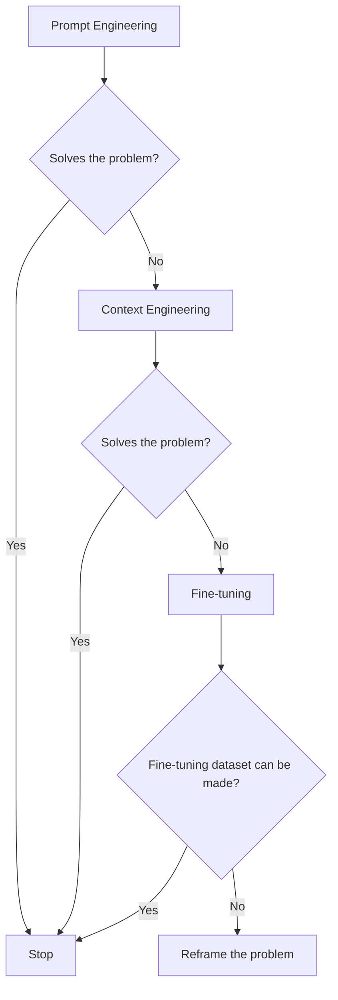
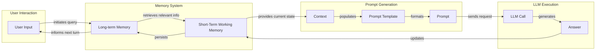
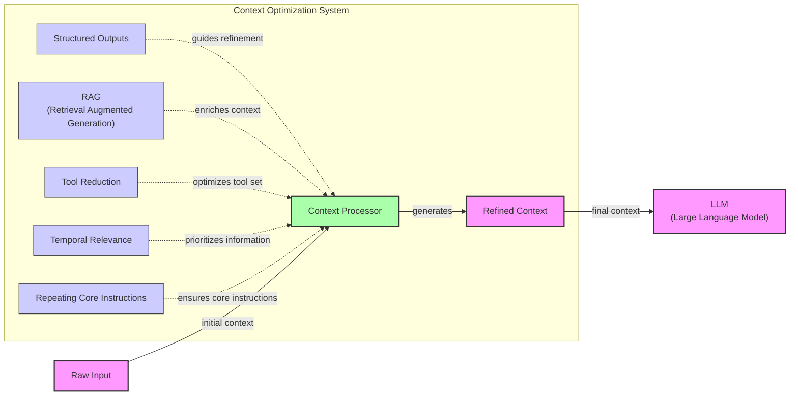
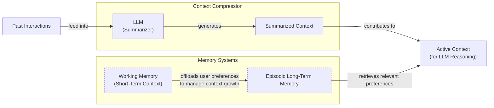
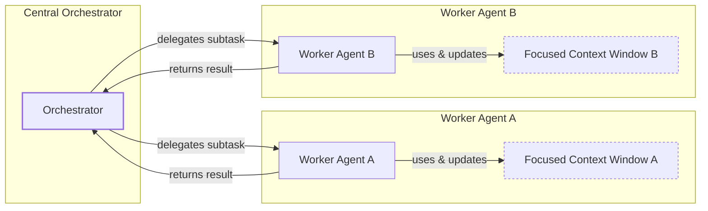

# Context Engineering: 2025’s #1 Skill in AI

## When Prompt Engineering Breaks

AI applications have evolved rapidly. In 2022, we had simple chatbots for question-answering. By 2023, Retrieval-Augmented Generation (RAG) systems connected LLMs to domain-specific knowledge. 2024 brought us tool-using agents that could perform actions. Now, we are building memory-enabled agents that remember past interactions and build relationships over time [[26]](https://www.securityindustry.org/2024/07/16/understanding-the-evolution-from-classic-chatbots-to-rag-chatbots-to-ai-powered-assistants/), [[30]](https://www.linkedin.com/posts/ai-apps-central_most-people-put-all-ai-systems-in-the-same-activity-7438555783077793792-UEUm).

In our last lesson, we explored how to choose between AI agents and LLM workflows when designing a system. As these applications grow more complex, prompt engineering, a practice that once served us well, is showing its limits. It optimizes single LLM calls but fails when managing systems with memory, actions, and long interaction histories [[52]](https://memgraph.com/blog/prompt-engineering-vs-context-engineering). The sheer volume of information an agent might need has grown exponentially. This includes past conversations, user data, documents, and action descriptions [[31]](https://www.langchain.com/blog/context-engineering-for-agents/). Simply stuffing all this into a prompt is not a viable strategy [[1]](https://www.decodingai.com/p/context-engineering-2025s-1-skill).

This is where context engineering comes in. It is the discipline of orchestrating this entire information ecosystem to ensure the LLM gets exactly what it needs, when it needs it. This skill is becoming a core foundation for AI engineering, and in this lesson, we will explore its principles, challenges, and practical applications [[23]](https://sombrainc.com/blog/ai-context-engineering-guide).

## From Prompt to Context Engineering

Prompt engineering, while effective for simple tasks, is designed for single, stateless interactions. It treats each call to an LLM as a new, isolated event. This approach breaks down in stateful applications where context must be preserved and managed across multiple turns [[51]](https://www.linkedin.com/posts/denis-panjuta_prompt-engineering-vs-context-engineering-activity-7363945251180322816-1q_m).

As a conversation or task progresses, the context grows. Without a strategy to manage this growth, the LLM’s performance degrades. This is context decay: the model gets confused by the noise of an ever-expanding history. It starts to lose track of the original instructions or key information [[3]](https://www.trychroma.com/research/context-rot).

Even with large context windows, a physical limit exists for what you can include. Also, on the operational side, every token adds to the cost and latency of an LLM call [[16]](https://www.comet.com/site/blog/context-window/). Simply putting everything into the context creates a slow, expensive, and underperforming system. We will explore these concepts in more detail in upcoming lessons, including memory in Lesson 9 and RAG in Lesson 10.

On a recent project, we learned this the hard way. We were working with a model that supported a million-token context window, so we thought, "*What could go wrong?*" We stuffed everything in: our research, guidelines, examples, and user history. The result was an LLM workflow that took 30 minutes to run and produced low-quality outputs [[1]](https://www.decodingai.com/p/context-engineering-2025s-1-skill).

These limitations make context engineering essential. It shifts the focus from crafting static prompts to building dynamic systems that manage information flow [[25]](https://www.glean.com/blog/context-engineering-ai-the-foundation-of-reliable-high-performing-models). As an AI engineer, your job is to select only the most critical pieces of context for each LLM call. This makes your applications accurate, fast, and cost-effective.

## Understanding Context Engineering

Context engineering is about finding the best way to arrange parts of your memory into the context that is passed to the LLM to squeeze out the best results. It is a solution to an optimization problem where you have to retrieve the right parts of both your short and long-term memory to solve a specific task without overwhelming the model [[1]](https://www.decodingai.com/p/context-engineering-2025s-1-skill), [[22]](https://www.mezmo.com/learn-observability/context-engineering-for-observability-how-to-deliver-the-right-data-to-llms). For example, when you ask a cooking agent for a recipe, you do not give it the entire cookbook. Instead, you retrieve the specific recipe, along with personal context like allergies or taste preferences. This precise selection ensures the model receives only the essential information.

Andrej Karpathy offered a great analogy for this: LLMs are like a new kind of operating system, where the model acts as the CPU and its context window functions as the RAM [[31]](https://www.langchain.com/blog/context-engineering-for-agents/), [[33]](https://atlan.com/know/working-memory-llms/). Just as an operating system manages what fits into RAM, context engineering curates what occupies the model’s working memory.

Context engineering is not replacing prompt engineering. Instead, you can intuitively see prompt engineering as a part of context engineering. You still work with prompts. Thus, learning how to write them effectively is still a critical skill. But on top of that, it is important to know how to incorporate the right context into the prompt without compromising the LLM's performance [[1]](https://www.decodingai.com/p/context-engineering-2025s-1-skill).

Table 1: A comparison of prompt engineering and context engineering.

| Dimension | Prompt Engineering | Context Engineering |
| --- | --- | --- |
| Scope | Single interaction optimization | Entire information ecosystem |
| State Management | Stateless function | Stateful due to memory |
| Focus | How to phrase tasks | What information to provide |

Context engineering is the new fine-tuning. While fine-tuning has its place, it is expensive, time-consuming, and inflexible [[51]](https://www.linkedin.com/posts/denis-panjuta_prompt-engineering-vs-context-engineering-activity-7363945251180322816-1q_m). Data changes constantly, making fine-tuning a last resort. For most enterprise use cases, you get better results faster and more cheaply with context engineering [[53]](https://www.mezmo.com/learn-observability/context-engineering-for-observability-how-to-deliver-the-right-data-to-llms). It allows for rapid iteration and adaptation to evolving data without altering the core model, a key advantage in dynamic environments. This approach avoids the computational resources and specialized expertise required for retraining, offering a more agile path to reliable AI applications.

When you start a new AI project, your decision-making process for guiding the LLM should look like the one presented in Image 1.



Image 1: Decision-making workflow for choosing an LLM strategy

For instance, when building an agent to process internal Slack messages, you do not need to fine-tune a model on your company’s communication style. It is more effective to use a powerful reasoning model and engineer the context to retrieve specific Slack messages and enable actions like creating tasks or drafting emails [[54]](https://www.instinctools.com/blog/context-engineering/). Throughout this course, we will show you how to solve most industry use cases using only context engineering.

## What Makes Up the Context

To master context engineering, you first need to understand what "context" actually is. It is everything the LLM sees in a single turn, dynamically assembled from various memory components before being passed to the model [[35]](https://www.linkedin.com/pulse/context-engineering-silent-architecture-behind-every-ai-roychowdhury-lzcec).

The high-level workflow begins when a user input triggers the system to pull relevant information from both long-term and short-term memory. This information is assembled into the final context, inserted into a prompt template, and sent to the LLM. The LLM’s response then updates the memory, and the cycle repeats. This is illustrated in Image 2.



Image 2: High-level workflow of LLM answer generation with memory components.

These components are grouped into two main categories. We will explain them intuitively for now, as we have future dedicated lessons for all of them.

### Short-Term Working Memory

Short-term working memory is the state of the agent for the current task or conversation. It is volatile and changes with each interaction, helping the agent maintain a coherent dialogue and make immediate decisions. It can include some or all of these components [[39]](https://skymod.tech/why-memory-matters-in-llm-agents-short-term-vs-long-term-memory-architectures/):

*   **User input:** The most recent query or command from the user.
*   **Message history:** The log of the current conversation, allowing the LLM to understand the flow and previous turns.
*   **Agent's internal thoughts:** The reasoning steps the agent takes to decide on its next action.
*   **Action calls and outputs:** The results from any actions the agent has performed, providing information from external systems.

### Long-Term Memory

Long-term memory is more persistent and stores information across sessions, allowing the AI system to remember things beyond a single conversation. We divide it into three types, drawing parallels from human memory [[37]](https://www.datacamp.com/blog/how-does-llm-memory-work). An AI system can include some or all of them:

*   **Procedural memory:** This is knowledge encoded directly in the code. It includes the system prompt, which sets the agent's overall behavior. It also includes the definitions of available actions, which tell the agent what it can do, and schemas for structured outputs, which guide the format of its responses. This memory represents the agent's built-in skills.
*   **Episodic memory:** This is memory of specific past experiences, like user preferences or previous interactions. It is used to help the agent personalize its responses based on individual users. We typically store this in vector or graph databases for efficient retrieval [[40]](https://labelstud.io/learningcenter/episodic-vs-persistent-memory-in-llms/).
*   **Semantic memory:** This is the agent’s general knowledge base. It can be internal, like company documents stored in a data lake, or external, accessed via the internet through API calls or web scraping. This memory provides the factual information the agent needs to answer questions [[38]](https://www.analyticsvidhya.com/blog/2026/01/how-does-llm-memory-work/).

While these memory systems often use techniques associated with RAG, it is important to distinguish between the two. Traditional RAG systems typically connect an LLM to a static knowledge base for querying. In contrast, an agent's memory is a dynamic system that continuously incorporates new information from its own actions and environmental feedback, allowing it to learn from experience [[66]](https://arxiv.org/html/2512.23343v1).

If this seems like a lot, bear with us. We will cover all these concepts in-depth in future lessons, including structured outputs (Lesson 4), actions (Lesson 6), memory (Lesson 9), RAG (Lesson 10), and working with multimodal data in Lesson 11.

Image 3: A detailed illustration of how all the context engineering components work together inside an AI agent (Source [Decoding AI Magazine [[1]](https://www.decodingai.com/p/context-engineering-2025s-1-skill)])

The key takeaway is that these components are not static. They are dynamically re-computed for every single interaction. For each conversation turn or new task, the short-term memory grows, or the long-term memory can change.

Context engineering involves knowing how to select the right pieces from this vast memory pool to construct the most effective prompt for the task at hand.

## Production Implementation Challenges

Now that we understand what makes up the context, let's look at the core challenges of implementing it in production. These challenges all revolve around a single question: *"How can I keep my context as small as possible while providing enough information to the LLM?"*

Here are four common issues that come up when building AI applications:

1.  **The context window challenge:** Every AI model has a limited context window, the maximum amount of information (tokens) it can process at once [[16]](https://www.comet.com/site/blog/context-window/). This limit is analogous to your computer's RAM. If your machine has only 32GB of RAM, that is all it can use at one time. While context windows are getting larger, they are not infinite, and treating them as such leads to other problems.

2.  **Information overload:** Just because you can fit a lot of information into the context does not mean you should. Too much context reduces the performance of the LLM by confusing it [[2]](https://redis.io/blog/context-window-overflow/). This is known as the "lost-in-the-middle" or "needle in the haystack" problem, where LLMs are known for remembering information best at the beginning and end of the context window. Information in the middle is often overlooked, and performance can drop by over 30% long before the physical context limit is reached [[56]](https://www.linkedin.com/pulse/lost-middle-lesson-failing-ai-agents-backwards-anthony-dejohn-01k2e), [[58]](https://dev.to/thousand_miles_ai/the-lost-in-the-middle-problem-why-llms-ignore-the-middle-of-your-context-window-3al2), [[59]](https://atlan.com/know/llm-context-window-limitations/).

3.  **Context drift:** This occurs when conflicting versions of the truth accumulate in the memory over time. For example, the memory might contain two conflicting statements: "*My cat is white*" and "*My cat is black.*" This is not a quantum physics experiment; it is a data conflict that confuses the LLM [[6]](https://galileo.ai/blog/production-llm-monitoring-strategies). Without a mechanism to resolve these conflicts, the model's responses become unreliable [[8]](https://thenewstack.io/context-rot-enterprise-ai-llms/). These conflicts can be categorized into two types: *inter-context conflicts*, where contradictions exist within the provided context, and *context-memory conflicts*, where external information clashes with the model’s internal, parametric knowledge [[67]](https://arxiv.org/html/2508.01273v1).

4.  **Action confusion:** The final challenge is action confusion, which arises in two main ways. First, adding too many actions to an agent can confuse the LLM about the best one for the job [[1]](https://www.decodingai.com/p/context-engineering-2025s-1-skill). Second, confusion can occur when action descriptions are poorly written or overlap. If the distinctions between actions are unclear, even a human would struggle to choose the right one [[27]](https://pagergpt.ai/ai-chatbot/evolution-of-ai-chatbots). These challenges highlight the need for systematic optimization strategies.

## Key Strategies for Context Optimization

Initially, most AI applications were chatbots over single knowledge bases. Today, modern AI solutions must manage multiple knowledge bases, actions, and complex conversational histories. Context engineering is about managing this complexity while meeting performance, latency, and cost requirements.

Here are four popular context engineering strategies used across the industry:

### Selecting the Right Context

Retrieving the right information from memory is a critical first step. A common mistake is to provide everything at once, assuming that models with large context windows can handle it. As we have discussed, the "lost-in-the-middle" problem often leads to poor performance, increased latency, and higher costs [[59]](https://atlan.com/know/llm-context-window-limitations/).

To solve this, consider these approaches:

*   **Use structured outputs:** Define clear schemas for what the LLM should return. This allows you to pass only the necessary, structured information to downstream steps. We will cover this in detail in Lesson 4.
*   **Use RAG:** Instead of providing entire documents, use RAG to fetch only the specific chunks of text needed to answer a user's question. This is a core topic we will explore in Lesson 10.
*   **Reduce the number of available actions:** Rather than giving an agent access to every available action, use various strategies to delegate action subsets to specialized components. For example, a typical pattern is to use the orchestrator-worker pattern to delegate subtasks to specialized agents [[48]](https://www.vellum.ai/blog/multi-agent-systems-building-with-context-engineering). Studies show that limiting the selection to under 30 actions can triple the agent's selection accuracy, though the ideal number depends on the actions, the LLM, and action definitions [[1]](https://www.decodingai.com/p/context-engineering-2025s-1-skill). Evaluating your system's performance on business metrics is the only way to determine the right number, a topic we will cover in future lessons.
*   **Rank time-sensitive data:** For time-sensitive information, rank it by date and filter out anything no longer relevant [[12]](https://www.dailydoseofds.com/llmops-crash-course-part-8/).
*   **Repeat core instructions:** For the most important instructions, repeat them at both the start and the end of the prompt. This uses the model's tendency to pay more attention to the context edges, ensuring core instructions are not lost [[57]](https://promptmetheus.com/resources/llm-knowledge-base/lost-in-the-middle-effect). The effectiveness of this is not just theoretical; one study on long-context models found that explicitly instructing the model to recall relevant information before analysis improved accuracy by over 150% on a debugging task [[68]](https://arxiv.org/html/2402.13718v2). This works because the second instance of the instruction can attend bidirectionally to the first, reinforcing its importance [[69]](https://arxiv.org/html/2512.14982v1).



Image 4: Diagram illustrating context optimization strategies within an AI system before context reaches the LLM.

### Context Compression

As message history grows in short-term working memory, you must manage past interactions to keep your context window in check. You cannot simply drop past conversation turns, as the LLM still needs to remember what happened. Instead, you need ways to compress key facts from the past [[14]](https://blog.jetbrains.com/research/2025/12/efficient-context-management/).

You can do this through:

1.  **Creating summaries of past interactions:** Use an LLM to replace a long, detailed history with a concise overview.
2.  **Moving user preferences to long-term memory:** Transfer user preferences from working memory to long-term episodic memory. This keeps the working context clean while ensuring preferences are remembered for future sessions.
3.  **Deduplication:** Remove redundant information from the context to avoid repetition [[11]](https://oneuptime.com/blog/post/2026-01-30-context-compression/view).

More advanced methods draw inspiration from operating systems and human cognition, using techniques like *virtual context paging* to swap information between active and archival memory, or creating compressed *gist memories* that act as a global index to the full context [[66]](https://arxiv.org/html/2512.23343v1).



Image 5: Diagram illustrating context compression techniques and memory management.

### Isolating Context

Another powerful strategy is to isolate context by splitting information across multiple agents or LLM workflows [[31]](https://www.langchain.com/blog/context-engineering-for-agents/). This technique is similar to action isolation (explained in `Selecting the right context`), but it is more general, referring to the whole context. The key idea is that instead of one agent with a massive, cluttered context window, you can have a team of agents, each with a smaller, focused context.



Image 6: Mermaid diagram illustrating the orchestrator-worker pattern for context isolation.

We often implement this using an orchestrator-worker pattern, where a central orchestrator agent breaks down a problem and assigns sub-tasks to specialized worker agents [[46]](https://beam.ai/agentic-insights/multi-agent-orchestration-patterns-production). Each worker operates in its own isolated context, improving focus and allowing for parallel processing. We will cover this pattern in more detail in Lesson 5.

### Format Optimization

Finally, the way you format the context matters. Models are sensitive to structure, and using clear delimiters can improve performance. Common strategies are to use XML tags to wrap different pieces of context (e.g., `<user_query>`, `<documents>`). This helps the model distinguish between different types of information, while making it easier for the engineer to reference context elements within the system prompt [[44]](https://www.anthropic.com/engineering/effective-context-engineering-for-ai-agents). When providing structured data as input, YAML is often more token-efficient than JSON, which helps save space in your context window [[1]](https://www.decodingai.com/p/context-engineering-2025s-1-skill).

You always have to understand what is passed to the LLM. Seeing exactly what occupies your context window at every step is key to mastering context engineering. Usually this is done by properly monitoring your traces, tracking what happens at each step, and understanding what the inputs and outputs are [[18]](https://www.getmaxim.ai/articles/context-window-management-strategies-for-long-context-ai-agents-and-chatbots/). As this is a significant step to go from PoC to production, we will have dedicated lessons on this.

## Here is an Example

Context engineering is not just a theoretical concept; we apply it to build powerful AI systems in various domains. In healthcare, an AI assistant can access a patient's history, current symptoms, and relevant medical literature to suggest personalized diagnoses [[41]](https://www.decodingai.com/p/context-engineering-2025s-1-skill). In finance, an agent might integrate with a company's Customer Relationship Management (CRM) system, calendars, and financial data to make decisions based on user preferences. For project management, an AI system can access enterprise tools like CRMs, Slack, and task managers to automatically understand project requirements and update tasks. The applications extend to smart infrastructure, where ontology-based context models help IoT systems make real-time decisions about energy management [[70]](https://www.mdpi.com/2673-4591/112/1/71). The growing importance of this discipline is reflected in the industry, with companies like Cognizant reportedly deploying thousands of context engineers to industrialize agentic AI [[71]](https://www.ardoq.com/blog/context-engineering-ai).

Let's walk through a concrete example. Suppose a user asks a healthcare assistant: `I have a headache. What can I do to stop it? I would prefer not to take any medicine.`

Before the LLM even sees this query, a context engineering system gets to work:

1.  It retrieves the user's patient history, known allergies, and lifestyle habits from an **episodic memory** store, often a vector or graph database [[39]](https://skymod.tech/why-memory-matters-in-llm-agents-short-term-vs-long-term-memory-architectures/).
2.  It queries a **semantic memory** of up-to-date medical literature for non-medicinal headache remedies [[36]](https://atlan.com/know/working-memory-llms/).
3.  It assembles this information, along with the user's query and the conversation history, into a structured prompt.
4.  We send the prompt to the LLM, which generates a personalized, safe, and relevant recommendation.
5.  We log the interaction and save any new preferences back to the user's episodic memory.

Here’s a simplified Python example showing how these components might be assembled into a complete system prompt. Notice the clear structure and ordering, using XML tags to delineate context sections.

```python
SYSTEM_PROMPT = """
You are a helpful and cautious AI healthcare assistant. Your goal is to provide safe, non-medicinal advice. Do not provide medical diagnoses.

<INSTRUCTIONS>
1. Analyze the user's query and the provided context.
2. Use the patient history to understand their health profile and preferences.
3. Use the retrieved medical knowledge to form your recommendation.
4. If you lack sufficient information, ask clarifying questions.
5. Always prioritize safety and advise consulting a doctor for serious issues.
</INSTRUCTIONS>

<PATIENT_HISTORY>
{retrieved_patient_history}
</PATIENT_HISTORY>

<MEDICAL_KNOWLEDGE>
{retrieved_medical_articles}
</MEDICAL_KNOWLEDGE>

<CONVERSATION_HISTORY>
{formatted_chat_history}
</CONVERSATION_HISTORY>

<USER_QUERY>
{user_query}
</USER_QUERY>

Based on all the information above, provide a helpful response.
"""
```

Still, the key relies on the system around it that brings in the proper context to populate the system prompt. To build such a system, you would use a combination of tools. Here is a potential tech stack we recommend and will use throughout this course:

*   **LLM:** Gemini as a multimodal, reasoning, and cost-effective LLM API provider.
*   **Orchestration:** LangGraph for defining stateful, agentic workflows [[65]](https://www.scalablepath.com/machine-learning/langgraph).
*   **Databases:** PostgreSQL, MongoDB, Redis, Qdrant, or Neo4j. Often, it is effective to keep it simple, as you can achieve much with only PostgreSQL or MongoDB.
*   **Observability:** Opik or LangSmith for evaluation and trace monitoring [[64]](https://atlan.com/know/context-engineering-platforms-comparison/).

## Connecting Context Engineering to AI Engineering

Mastering context engineering is about developing the intuition to craft effective prompts, select the right information from memory, and arrange context for optimal results. This discipline helps you determine the minimal yet essential information an LLM needs to perform at its best. Some compare it to design thinking for AI, while others see it as a form of Enterprise Architecture, curating business context for reliable decision-making [[72]](https://uxdesign.cc/context-engineering-a-repeatable-ai-workflow-for-product-designers-8d7b55b83b2b), [[71]](https://www.ardoq.com/blog/context-engineering-ai).

It is a multidisciplinary practice that sits at the intersection of several key engineering fields [[21]](https://packmind.com/context-engineering-ai-coding/what-is-contextops/):

1.  **AI Engineering:** Understanding LLMs, RAG, and AI agents is the foundation.
2.  **Software Engineering (SWE):** You need to build scalable and maintainable systems to aggregate context and wrap agents in reliable APIs.
3.  **Data Engineering:** Constructing reliable data pipelines for RAG and other memory systems is critical.
4.  **Operations (Ops):** Deploying agents on the right infrastructure and automating Continuous Integration/Continuous Deployment (CI/CD) makes them reproducible, maintainable, observable, and scalable. This also includes integrating data governance practices to ensure privacy and auditability. For example, production systems must implement policy filters for Personally Identifiable Information (PII) redaction or field masking and maintain detailed audit logs to track how context was used to generate an output [[73]](https://www.celigo.com/blog/context-engineering-best-practices-data-integration/).

Our goal with this course is to teach you how to combine these skills to build production-ready AI products. In the world of AI, you should think in systems rather than isolated components, having a mindset shift from developers to architects.

In the next lesson, we will explore structured outputs.

## Conclusion

This lesson introduced context engineering, the discipline of designing and managing the information an LLM receives. We have seen how it evolved from prompt engineering to address the needs of complex, stateful AI applications. By understanding the components of context, the challenges of production implementation, and the key optimization strategies, you are better equipped to build reliable and efficient AI systems.

The core takeaway is that context quality often matters more than context quantity. By carefully selecting, compressing, isolating, and formatting information, you can guide your LLM to produce better results while managing costs and latency. As we move forward in this course, these principles will be a recurring theme, forming the foundation for building advanced AI agents and workflows.

## References

- [1] Iusztin, P. (2025, July 22). *Context Engineering: 2025’s #1 Skill in AI*. Decoding AI Magazine. https://www.decodingai.com/p/context-engineering-2025s-1-skill
- [2] Redis. (2025). *Don’t Let Your LLM App Suffer From Context Window Overflow*. https://redis.io/blog/context-window-overflow/
- [3] Hong, K., Troynikov, A., & Huber, J. (2025, July). *Context Rot: How Increasing Input Tokens Impacts LLM Performance*. Chroma. https://www.trychroma.com/research/context-rot
- [4] Falconer, S. (n.d.). *Four Design Patterns for Event-Driven, Multi-Agent Systems*. Confluent. https://www.confluent.io/blog/event-driven-multi-agent-systems/
- [5] Mei, L., Yao, J., Ge, Y., et al. (2025). *A Survey of Context Engineering for Large Language Models*. arXiv. https://arxiv.org/pdf/2507.13334
- [6] Galileo. (n.d.). *Production LLM Monitoring Strategies: A Practical Guide for AI Engineers*. https://galileo.ai/blog/production-llm-monitoring-strategies
- [7] Panjuta, D. (2025, May 3). *Prompt Engineering vs Context Engineering*. LinkedIn. https://www.linkedin.com/posts/denis-panjuta_prompt-engineering-vs-context-engineering-activity-7363945251180322816-1q_m
- [8] The New Stack. (2026, February). *Context Rot Is the Silent Killer of Enterprise AI LLMs*. https://thenewstack.io/context-rot-enterprise-ai-llms/
- [9] InsightFinder. (n.d.). *The Hidden Cost of LLM Drift: Why Detection is Just the Beginning*. https://insightfinder.com/blog/hidden-cost-llm-drift-detection/
- [10] Helicone. (n.d.). *How to Reduce LLM Hallucinations: A Comprehensive Guide*. https://www.helicone.ai/blog/how-to-reduce-llm-hallucination
- [11] OneUptime. (2026, January 30). *How to Build Context Compression*. https://oneuptime.com/blog/post/2026-01-30-context-compression/view
- [12] Daily Dose of DS. (n.d.). *LLMOps Crash Course Part 8: Memory and Temporal Context*. https://www.dailydoseofds.com/llmops-crash-course-part-8/
- [13] Liu, Z., et al. (2025). *Context Compression via Sub-Task Description Summarization for SLM-based Relevance Ranking*. arXiv. https://arxiv.org/html/2510.22101v1
- [14] JetBrains Research. (2025, December). *Efficient Context Management for LLM Agents*. https://blog.jetbrains.com/research/2025/12/efficient-context-management/
- [15] Sahin, S. (2025, May 15). *The Common Failure Points of LLM RAG Systems and How to Overcome Them*. Medium. https://medium.com/@sahin.samia/the-common-failure-points-of-llm-rag-systems-and-how-to-overcome-them-926d9090a88f
- [16] Comet. (n.d.). *Context Window: What It Is and Why It Matters for AI Agents*. https://www.comet.com/site/blog/context-window/
- [17] DataHub. (n.d.). *How to Optimize Your Context Window for Better LLM Performance*. https://datahub.com/blog/context-window-optimization/
- [18] Maxim.ai. (n.d.). *Context Window Management Strategies for Long-Context AI Agents and Chatbots*. https://www.getmaxim.ai/articles/context-window-management-strategies-for-long-context-ai-agents-and-chatbots/
- [19] Santhanam, A. (2025, May 22). *Your LLM Hits the Token Limit*. LinkedIn. https://www.linkedin.com/posts/aditya-santhanam_your-llm-hits-the-token-limit-conversation-activity-7425863566190260224-Pz6v
- [20] JetBrains Research. (2025, December). *Efficient Context Management*. https://blog.jetbrains.com/research/2025/12/efficient-context-management/
- [21] Packmind. (n.d.). *Why AI coding assistants fail without context: an introduction to ContextOps*. https://packmind.com/context-engineering-ai-coding/what-is-contextops/
- [22] Mezmo. (n.d.). *Context Engineering for Observability: How to Deliver the Right Data to LLMs*. https://www.mezmo.com/learn-observability/context-engineering-for-observability-how-to-deliver-the-right-data-to-llms
- [23] Sombra. (n.d.). *AI Context Engineering: A Comprehensive Guide*. https://sombrainc.com/blog/ai-context-engineering-guide
- [24] Glean. (n.d.). *Context Engineering for AI: The Foundation of Reliable, High-Performing Models*. https://www.glean.com/blog/context-engineering-ai-the-foundation-of-reliable-high-performing-models
- [25] Glean. (n.d.). *Context Engineering vs. Prompt Engineering: Key Differences Explained*. https://www.glean.com/perspectives/context-engineering-vs-prompt-engineering-key-differences-explained
- [26] Security Industry Association. (2024, July 16). *Understanding the Evolution from Classic Chatbots to RAG Chatbots to AI-Powered Assistants*. https://www.securityindustry.org/2024/07/16/understanding-the-evolution-from-classic-chatbots-to-rag-chatbots-to-ai-powered-assistants/
- [27] PagerGPT. (n.d.). *The Evolution of AI Chatbots*. https://pagergpt.ai/ai-chatbot/evolution-of-ai-chatbots
- [28] Dante AI. (n.d.). *When Did AI Chatbots Start? A Brief History*. https://www.dante-ai.com/news/when-did-ai-chatbots-start
- [29] AI Apps Central. (2025, June 10). *Most people put all AI systems in the same bucket*. LinkedIn. https://www.linkedin.com/posts/ai-apps-central_most-people-put-all-ai-systems-in-the-same-activity-7438555783077793792-UEUm
- [30] AI Apps Central. (2025, June 10). *Most people put all AI systems in the same bucket*. LinkedIn. https://www.linkedin.com/posts/ai-apps-central_most-people-put-all-ai-systems-in-the-same-activity-7438555783077793792-UEUm
- [31] LangChain Blog. (2025, July 2). *Context Engineering for Agents*. https://www.langchain.com/blog/context-engineering-for-agents/
- [32] Glean. (n.d.). *Context Engineering vs. Prompt Engineering*. https://www.glean.com/perspectives/context-engineering-vs-prompt-engineering-key-differences-explained
- [33] Atlan. (n.d.). *Working Memory in LLMs*. https://atlan.com/know/working-memory-llms/
- [34] Teki, S. (n.d.). *From Vibe-Coding to Context-Engineering: A Blueprint for Production-Grade GenAI Systems*. https://www.sundeepteki.org/blog/from-vibe-coding-to-context-engineering-a-blueprint-for-production-grade-genai-systems
- [35] Roychowdhury, A. (2025, July 1). *Context Engineering: The Silent Architecture Behind Every AI Agent*. LinkedIn. https://www.linkedin.com/pulse/context-engineering-silent-architecture-behind-every-ai-roychowdhury-lzcec
- [36] Atlan. (n.d.). *Working Memory in LLMs*. https://atlan.com/know/working-memory-llms/
- [37] DataCamp. (n.d.). *How Does LLM Memory Work?*. https://www.datacamp.com/blog/how-does-llm-memory-work
- [38] Analytics Vidhya. (2026, January). *How Does LLM Memory Work?*. https://www.analyticsvidhya.com/blog/2026/01/how-does-llm-memory-work/
- [39] Skymod. (n.d.). *Why Memory Matters in LLM Agents: Short-Term vs. Long-Term Memory Architectures*. https://skymod.tech/why-memory-matters-in-llm-agents-short-term-vs-long-term-memory-architectures/
- [40] Label Studio. (n.d.). *Episodic vs. Persistent Memory in LLMs*. https://labelstud.io/learningcenter/episodic-vs-persistent-memory-in-llms/
- [41] Iusztin, P. (2025, July 22). *Context Engineering: 2025’s #1 Skill in AI*. Decoding AI. https://www.decodingai.com/p/context-engineering-2025s-1-skill
- [42] MDPI. (2025). *Prompt Engineering in Healthcare*. https://www.mdpi.com/2079-9292/13/15/2961
- [43] MDPI. (2025). *Prompt Engineering in Healthcare*. https://www.mdpi.com/2079-9292/13/15/2961
- [44] Anthropic. (n.d.). *Effective Context Engineering for AI Agents*. https://www.anthropic.com/engineering/effective-context-engineering-for-ai-agents
- [45] Beam.ai. (n.d.). *Multi-Agent Orchestration Patterns for Production*. https://beam.ai/agentic-insights/multi-agent-orchestration-patterns-production
- [46] Beam.ai. (n.d.). *Multi-Agent Orchestration Patterns for Production*. https://beam.ai/agentic-insights/multi-agent-orchestration-patterns-production
- [47] GuruSup. (n.d.). *A Multi-Agent Orchestration Guide*. https://gurusup.com/blog/multi-agent-orchestration-guide
- [48] Vellum.ai. (n.d.). *Multi-Agent Systems: Building with Context Engineering*. https://www.vellum.ai/blog/multi-agent-systems-building-with-context-engineering
- [49] Praetorian. (n.d.). *Deterministic AI Orchestration: A Platform Architecture for Autonomous Development*. https://www.praetorian.com/blog/deterministic-ai-orchestration-a-platform-architecture-for-autonomous-development/
- [50] arXiv. (2026). *Specialized Agents in Multi-Agent Systems*. https://arxiv.org/html/2601.13671v1
- [51] Panjuta, D. (2025, May 3). *Prompt Engineering vs. Context Engineering*. LinkedIn. https://www.linkedin.com/posts/denis-panjuta_prompt-engineering-vs-context-engineering-activity-7363945251180322816-1q_m
- [52] Memgraph. (n.d.). *Prompt Engineering vs. Context Engineering*. https://memgraph.com/blog/prompt-engineering-vs-context-engineering
- [53] Mezmo. (n.d.). *Context Engineering for Observability*. https://www.mezmo.com/learn-observability/context-engineering-for-observability-how-to-deliver-the-right-data-to-llms
- [54] Instinctools. (n.d.). *Context Engineering*. https://www.instinctools.com/blog/context-engineering/
- [55] Neo4j. (n.d.). *Agentic AI: Context Engineering vs. Prompt Engineering*. https://neo4j.com/blog/agentic-ai/context-engineering-vs-prompt-engineering/
- [56] DeJohn, A. (2025, June 20). *Lost in the Middle: A Lesson in Failing AI Agents (Backwards)*. LinkedIn. https://www.linkedin.com/pulse/lost-middle-lesson-failing-ai-agents-backwards-anthony-dejohn-01k2e
- [57] Promptmetheus. (n.d.). *Lost-in-the-Middle Effect*. https://promptmetheus.com/resources/llm-knowledge-base/lost-in-the-middle-effect
- [58] Thousand Miles AI. (n.d.). *The "Lost in the Middle" Problem: Why LLMs Ignore the Middle of Your Context Window*. DEV Community. https://dev.to/thousand_miles_ai/the-lost-in-the-middle-problem-why-llms-ignore-the-middle-of-your-context-window-3al2
- [59] Atlan. (n.d.). *LLM Context Window Limitations*. https://atlan.com/know/llm-context-window-limitations/
- [60] BigData Boutique. (n.d.). *Needle in a Haystack: Optimizing Retrieval and RAG over Long Context Windows*. https://bigdataboutique.com/blog/needle-in-haystack-optimizing-retrieval-and-rag-over-long-context-windows-5dfb3c
- [61] Codecademy. (n.d.). *Context Engineering in AI*. https://www.codecademy.com/article/context-engineering-in-ai
- [62] Stackademic. (n.d.). *Context Engineering in LLMs and AI Agents*. https://blog.stackademic.com/context-engineering-in-llms-and-ai-agents-eb861f0d3e9b
- [63] Packmind. (n.d.). *How to Implement Context Engineering*. https://packmind.com/context-engineering-ai-coding/how-to-implement-context-engineering/
- [64] Atlan. (n.d.). *Context Engineering Platforms Comparison*. https://atlan.com/know/context-engineering-platforms-comparison/
- [65] Scalable Path. (n.d.). *LangGraph*. https://www.scalablepath.com/machine-learning/langgraph
- [66] Liang, J., et al. (2025). *AI Meets Brain: A Unified Survey on Memory Systems from Cognitive Neuroscience to Autonomous Agents*. arXiv. https://arxiv.org/html/2512.23343v1
- [67] Mei, L., et al. (2025). *A Survey of Context Engineering for Large Language Models*. arXiv. https://arxiv.org/html/2508.01273v1
- [68] Zhang, Y., et al. (2024). *∞Bench: Extending Long Context Evaluation Beyond 100K Tokens*. arXiv. https://arxiv.org/html/2402.13718v2
- [69] Belrose, N., et al. (2025). *Prompt Repetition Improves Non-Reasoning LLMs*. arXiv. https://arxiv.org/html/2512.14982v1
- [70] MDPI. (2025). *A Context-Aware Big Data Framework for Smart Building Applications*. https://www.mdpi.com/2673-4591/112/1/71
- [71] Ardoq. (n.d.). *What is Context Engineering and Why Should Enterprise Architects Care?*. https://www.ardoq.com/blog/context-engineering-ai
- [72] UX Collective. (2024). *Context Engineering: A Repeatable AI Workflow for Product Designers*. https://uxdesign.cc/context-engineering-a-repeatable-ai-workflow-for-product-designers-8d7b55b83b2b
- [73] Celigo. (n.d.). *Context Engineering Best Practices for Enterprise AI*. https://www.celigo.com/blog/context-engineering-best-practices-data-integration/