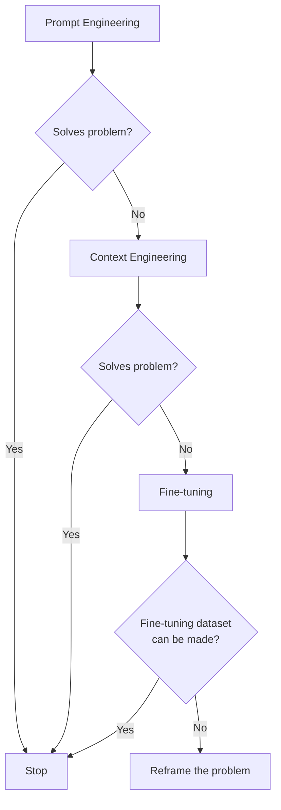
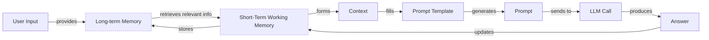
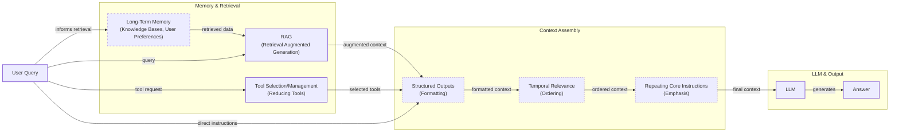
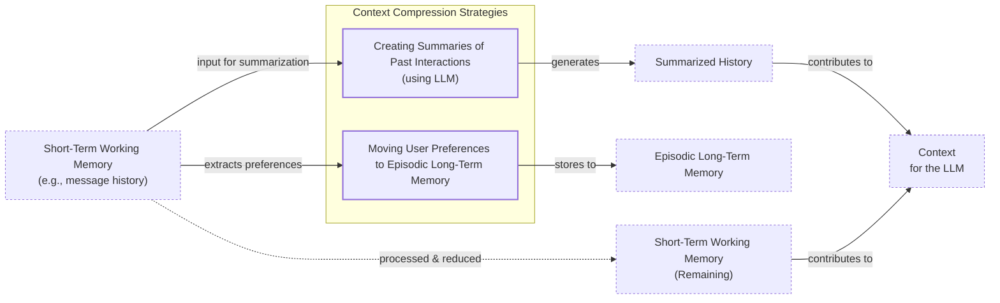
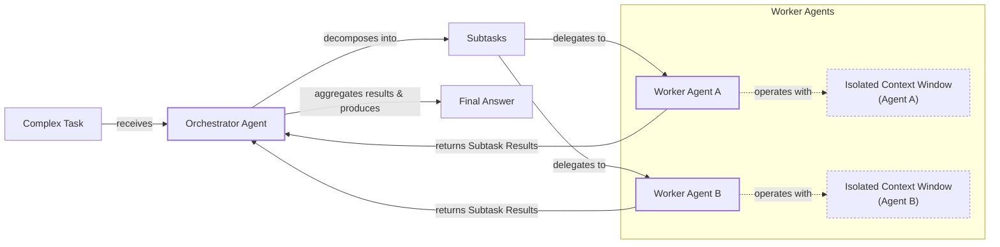

# Lesson 3: Context Engineering

AI applications have evolved rapidly. In 2022, we had simple chatbots for question-answering. By 2023, Retrieval-Augmented Generation (RAG) systems connected LLMs to domain-specific knowledge. 2024 brought us tool-using agents that could perform actions. Now, we are building memory-enabled agents that remember past interactions and build relationships over time [[26]](https://www.securityindustry.org/2024/07/16/understanding-the-evolution-from-classic-chatbots-to-rag-chatbots-to-ai-powered-assistants/).

In our last lesson, we explored how to choose between AI agents and LLM workflows when designing a system. As these applications grow more complex, prompt engineering, a practice that once served us well, is showing its limits. It optimizes single LLM calls but fails when managing systems with memory, actions, and long interaction histories. The sheer volume of information an agent might need—past conversations, user data, documents, and action descriptions—has grown exponentially. Simply stuffing all this into a prompt is not a viable strategy [[31]](https://www.langchain.com/blog/context-engineering-for-agents/). This is where context engineering comes in. It is the discipline of orchestrating this entire information ecosystem to ensure the LLM gets exactly what it needs, when it needs it. This skill is becoming a core foundation for AI engineering.

## From Prompt to Context Engineering

Prompt engineering, while effective for simple tasks, is designed for single, stateless interactions. It treats each call to an LLM as a new, isolated event [[23]](https://sombrainc.com/blog/ai-context-engineering-guide). This approach breaks down in stateful applications where context must be preserved and managed across multiple turns.

As a conversation or task progresses, the context grows. Without a strategy to manage this growth, the LLM’s performance degrades. This is context decay: the model gets confused by the noise of an ever-expanding history. It starts to lose track of the original instructions or key information [[59]](https://atlan.com/know/llm-context-window-limitations/).

Even with large context windows, a physical limit exists for what you can include. Also, on the operational side, every token adds to the cost and latency of an LLM call [[16]](https://www.comet.com/site/blog/context-window/). Simply putting everything into the context creates a slow, expensive, and underperforming system. We will explore these concepts in more detail in upcoming lessons, including memory in Lesson 9 and RAG in Lesson 10.

On a recent project, we learned this the hard way. We were working with a model that supported a two-million-token context window, so we thought, "*What could go wrong*?" We stuffed everything in: our research, guidelines, examples, and reviews. The result was an LLM workflow that took 30 minutes to run and produced low-quality outputs.

This is where context engineering becomes essential. It shifts the focus from crafting static prompts to building dynamic systems that manage information flow. As an AI engineer, your job is to select only the most critical pieces of context for each LLM call. This makes your applications accurate, fast, and cost-effective.

## Understanding Context Engineering

Context engineering involves finding the optimal way to arrange information from your application's memory into the context passed to an LLM. It is a solution to an optimization problem where you retrieve the right parts from your short-term and long-term memory to solve a specific task without overwhelming the model [[22]](https://www.mezmo.com/learn-observability/context-engineering-for-observability-how-to-deliver-the-right-data-to-llms). For example, when you ask a cooking agent for a recipe, you do not give it the entire cookbook. Instead, you retrieve the specific recipe, along with personal context like allergies or taste preferences. This precise selection ensures the model receives only the essential information.

Andrej Karpathy explains that LLMs are like a new kind of operating system where the model is the CPU and its context window is the RAM. Just as an operating system manages what fits into your computer’s limited RAM, context engineering manages what information occupies the model’s limited context window [[31]](https://www.langchain.com/blog/context-engineering-for-agents/).

How does context engineering relate to prompt engineering? It's simple. Prompt engineering is a subset of context engineering. You still write effective prompts, but you also design a system that feeds the right context into those prompts [[52]](https://memgraph.com/blog/prompt-engineering-vs-context-engineering). This means understanding not just *how* to phrase a task, but *what* information the model needs to perform optimally.

| Dimension | Prompt Engineering | Context Engineering |
| --- | --- | --- |
| Scope | Single interaction optimization | Entire information ecosystem |
| State Management | Stateless function | Stateful due to memory |
| Focus | How to phrase tasks | What information to provide |

Table 1: A comparison of prompt engineering and context engineering.

Context engineering is the new fine-tuning. While fine-tuning has its place, it is expensive, time-consuming, and inflexible. Data changes constantly, making fine-tuning a last resort. For most enterprise use cases, you get better results faster and more cheaply with context engineering [[51]](https://www.linkedin.com/posts/denis-panjuta_prompt-engineering-vs-context-engineering-activity-7363945251180322816-1q_m). It allows for rapid iteration and adaptation to evolving data without altering the core model, a key advantage in dynamic environments. This approach avoids the computational resources and specialized expertise required for retraining, offering a more agile path to reliable AI applications.

When you start a new AI project, your decision-making process for guiding the LLM should look like the one presented in Image 1.


Image 1: Flowchart illustrating the decision-making process for choosing an AI strategy.

For instance, if you build an agent to process internal Slack messages, you do not need to fine-tune a model on your company’s communication style. It is more effective to use a powerful reasoning model and engineer the context to retrieve specific messages and enable actions like creating tasks or drafting emails. Throughout this course, we will show you how to solve most industry problems using only context engineering.

## What Makes Up the Context

To master context engineering, you first need to understand what "context" actually is. It is everything the LLM sees in a single turn, dynamically assembled from various memory components before being passed to the model.

The high-level workflow, as presented in Image 2, begins when a user input triggers the system to pull relevant information from both long-term and short-term memory. This information is assembled into the final context, inserted into a prompt template, and sent to the LLM. The LLM’s answer then updates the memory, and the cycle repeats.


Image 2: High-level workflow of context building and utilization in an LLM application.

These components are grouped into two main categories. We will explain them intuitively for now, as we have future dedicated lessons for all of them.

### Short-Term Working Memory

Short-term working memory is the state of the agent for the current task or conversation. It is volatile and changes with each interaction, helping the agent maintain a coherent dialogue and make immediate decisions. It can include some or all of these components [[39]](https://skymod.tech/why-memory-matters-in-llm-agents-short-term-vs-long-term-memory-architectures/):

- **User input:** The most recent query or command from the user.
- **Message history:** The log of the current conversation, allowing the LLM to understand the flow and previous turns.
- **Agent's internal thoughts:** The reasoning steps the agent takes to decide on its next action.
- **Action calls and outputs:** The results from any actions the agent has performed, providing information from external systems.

### Long-Term Memory

Long-term memory is more persistent and stores information across sessions, allowing the AI system to remember things beyond a single conversation. We divide it into three types, drawing parallels from human memory [[37]](https://www.datacamp.com/blog/how-does-llm-memory-work). As before, an AI system can include some or all of them:

- **Procedural memory:** This is knowledge encoded directly in the code. It includes the system prompt, which sets the agent's overall behavior. It also includes the definitions of available actions, which tell the agent what it can do and schemas for structured outputs, which guide the format of its responses. Think of this as the agent's built-in skills.
- **Episodic memory:** This is memory of specific past experiences, like user preferences or previous interactions. It's used to help the agent personalize its responses based on individual users. We typically store this in vector or graph databases for efficient retrieval [[40]](https://labelstud.io/learningcenter/episodic-vs-persistent-memory-in-llms/).
- **Semantic memory:** This is the agent’s general knowledge base. It can be internal, like company documents stored in a data lake, or external, accessed via the internet through API calls or web scraping. This memory provides the factual information the agent needs to answer questions [[38]](https://www.analyticsvidhya.com/blog/2026/01/how-does-llm-memory-work/).

If this seems like a lot, bear with us. We will cover all these concepts in-depth in future lessons, including structured outputs (Lesson 4), actions (Lesson 6), memory (Lesson 9), RAG (Lesson 10), and working with multimodal data in Lesson 11.
Image 3: A detailed illustration of how all the context engineering components work together inside an AI agent. (Source [DECODING ML](https://www.decodingml.com))

The key takeaway is that these components are not static. They are dynamically re-computed for every single interaction. For each conversation turn or new task, the short-term memory grows, or the long-term memory can change. Context engineering involves knowing how to select the right pieces from this vast memory pool to construct the most effective prompt for the task at hand.

## Production Implementation Challenges

Now that we understand what makes up the context, let's look at the core challenges of implementing it in production. These challenges all revolve around a single question: *"How can I keep my context as small as possible while providing enough information to the LLM?"*

Here are four common issues that come up when building AI applications:

1.  **The context window challenge:** Every AI model has a limited context window, the maximum amount of information (tokens) it can process at once. Think of it like your computer's RAM. If your machine has only 32GB of RAM, that is all it can use at one time. While context windows are getting larger, they are not infinite, and treating them as such leads to other problems [[16]](https://www.comet.com/site/blog/context-window/).

2.  **Information overload:** Just because you can fit a lot of information into the context does not mean you should. Too much context reduces the performance of the LLM by confusing it. This is known as the "lost-in-the-middle" or "needle in the haystack" problem, where LLMs are known for remembering information best at the beginning and end of the context window. Performance can drop long before the physical context limit is reached; benchmarks show that even models with large context windows see performance degrade at 100K tokens, and multi-turn conversation accuracy can drop by nearly 40% compared to single-turn tasks [[71]](https://www.adaline.ai/blog/top-agentic-llm-models-frameworks-for-2026), [[73]](https://reinteractive.com/articles/ai-real-world-use-cases/solving-ai-agent-amnesia-context-rot-and-lost-in-the-middle). This overload can also lead to specific failure modes like *poisoning* (compounding hallucinations), *distraction* from irrelevant data, and *confusion* between multiple tasks [[72]](https://cursor.directory/plugins/context-engineering), [[56]](https://www.linkedin.com/pulse/lost-middle-lesson-failing-ai-agents-backwards-anthony-dejohn-01k2e), [[58]](https://dev.to/thousand_miles_ai/the-lost-in-the-middle-problem-why-llms-ignore-the-middle-of-your-context-window-3al2).

3.  **Context drift:** This occurs when conflicting versions of truth accumulate over time. For example, the memory might contain two conflicting statements: "*The user's budget is $500*" and later "*The user's budget is $1,000*." This data conflict confuses the LLM. Over long interactions, this can lead to "agent drift," where an agent's behavior degrades, with studies showing task success can drop by over 40% after just a few dozen interactions [[74]](https://arxiv.org/html/2601.04170v1). Without a mechanism to resolve these conflicts, the model's responses become unreliable [[6]](https://galileo.ai/blog/production-llm-monitoring-strategies), [[8]](https://thenewstack.io/context-rot-enterprise-ai-llms/).

4.  **Tool confusion:** This arises in two main ways. First, adding too many actions to an agent (often 100+) can confuse the LLM about the best one for the job. Second, confusion can occur when tool descriptions are poorly written or overlap. If the distinctions between actions are unclear, even a human would struggle to choose the right one [[27]](https://pagergpt.ai/ai-chatbot/evolution-of-ai-chatbots).

## Key Strategies for Context Optimization

Initially, most AI applications were chatbots over single knowledge bases. Today, modern AI solutions must manage multiple knowledge bases, tools, and complex conversational histories. Context engineering is about managing this complexity while meeting performance, latency, and cost requirements. A useful framework for this is the "Four-Bucket Mitigation" strategy: **write** context to external storage, **select** only relevant information, **compress** it, and **isolate** it across specialized components [[72]](https://cursor.directory/plugins/context-engineering).

Here are four popular context engineering strategies used across the industry:

### Selecting the Right Context

Retrieving the right information from memory is a critical first step. A common mistake is to provide everything at once, assuming that models with large context windows can handle it. As we've discussed, the "lost-in-the-middle" problem often leads to poor performance, increased latency, and higher costs [[59]](https://atlan.com/know/llm-context-window-limitations/).

To solve this, consider these approaches:

-   **Use structured outputs:** Define clear schemas for what the LLM should return. This allows you to pass only the necessary, structured information to downstream steps. We will cover this in detail in Lesson 4.
-   **Use RAG:** Instead of providing entire documents, use RAG to fetch only the specific chunks of text needed to answer a user's question. Advanced RAG techniques further refine this by transforming the user's query for better retrieval, or re-ranking the retrieved chunks for relevance before passing them to the LLM [[67]](https://www.sundeepteki.org/blog/context-engineering-a-framework-for-robust-generative-ai-systems). This is a core topic we will explore in Lesson 10.
-   **Reduce the number of available actions:** Rather than giving an agent access to every available action, use various strategies to delegate action subsets to specialized components. For example, a typical pattern is to leverage the orchestrator-worker pattern to delegate subtasks to specialized agents. Limiting the selection to under 30 tools can triple selection accuracy. The ideal number depends on your specific tools and model, so evaluation against business metrics is essential to find the right balance. We will learn how to do this in future lessons.
-   **Rank time-sensitive data:** For time-sensitive information, rank it by date and filter out anything no longer relevant [[12]](https://www.dailydoseofds.com/llmops-crash-course-part-8/).
-   **Repeat core instructions:** For the most important instructions, repeat them at both the start and the end of the prompt. This uses the model's tendency to pay more attention to the context edges, ensuring core instructions are not lost [[57]](https://promptmetheus.com/resources/llm-knowledge-base/lost-in-the-middle-effect).


Image 4: System diagram illustrating context selection strategies for an LLM, including RAG, tool management, and context assembly stages.

### Context Compression

As message history grows in short-term working memory, you must manage past interactions to keep your context window in check. You cannot simply drop past conversation turns, as the LLM still needs to remember what happened. Instead, you need ways to compress key facts from the past.

You can do this through:

1.  **Creating summaries of past interactions:** Use an LLM to replace a long, detailed history with a concise overview [[14]](https://blog.jetbrains.com/research/2025/12/efficient-context-management/).
2.  **Moving user preferences to long-term memory:** Transfer user preferences from working memory to long-term episodic memory. This keeps the working context clean while ensuring preferences are remembered for future sessions.
3.  **Deduplication:** Remove redundant information from the context to avoid repetition [[11]](https://oneuptime.com/blog/post/2026-01-30-context-compression/view).


Image 5: A flowchart illustrating context compression strategies, showing how short-term memory is processed into summarized history and reduced memory for LLM context, with user preferences moved to long-term memory.

### Isolating Context

Another powerful strategy is to isolate context by splitting information across multiple agents or LLM workflows. This technique is similar to tool isolation but it's more general, referring to the whole context. The key idea is that instead of one agent with a massive, cluttered context window, you can have a team of agents, each with a smaller, focused context [[48]](https://www.vellum.ai/blog/multi-agent-systems-building-with-context-engineering).

We often implement this using an orchestrator-worker pattern, where a central orchestrator agent breaks down a problem and assigns sub-tasks to specialized worker agents [[46]](https://beam.ai/agentic-insights/multi-agent-orchestration-patterns-production). Each worker operates in its own isolated context, improving focus and allowing for parallel processing. We will cover this pattern in more detail in Lesson 5.


Image 6: An architecture diagram illustrating the Orchestrator-Worker pattern for context isolation.

### Format Optimization

Finally, the way you format the context matters. Models are sensitive to structure, and using clear delimiters can improve performance. Common strategies are to:

-   **Use XML tags:** Wrap different pieces of context in XML-like tags (e.g., `<user_query>`, `<documents>`). This helps the model distinguish between different types of information, while making it easier for the engineer to reference context elements within the system prompt [[44]](https://www.anthropic.com/engineering/effective-context-engineering-for-ai-agents).
-   **Prefer YAML over JSON:** When providing structured data as input, YAML is often more token-efficient than JSON, which helps save space in your context window.

You always have to understand what is passed to the LLM. Seeing exactly what occupies your context window at every step is key to mastering context engineering. This is done by monitoring your traces, tracking what happens at each step, and understanding the inputs and outputs [[18]](https://www.getmaxim.ai/articles/context-window-management-strategies-for-long-context-ai-agents-and-chatbots/). For RAG systems, observability tools can measure specific metrics like **Contextual Precision** (is the retrieved information relevant?) and **Contextual Recall** (was all the relevant information retrieved?), which helps you quantitatively assess the quality of your context [[106]](https://www.comet.com/site/blog/llm-evaluation-frameworks/). As this is a significant step to go from PoC to production, we will have dedicated lessons on this.

## Here is an Example

Let's connect the theory and strategies discussed earlier with concrete examples. Consider several common real-world scenarios:

-   **Healthcare:** An AI assistant accesses a patient's medical history, current symptoms, and the latest medical literature to provide personalized diagnostic support [[41]](https://www.decodingai.com/p/context-engineering-2025s-1-skill).
-   **Financial Services:** AI systems integrate with enterprise tools like Customer Relationship Management (CRM) systems, emails, and calendars, combining real-time market data and client portfolio information to generate tailored financial advice and reports.
-   **Project Management:** AI systems access enterprise infrastructure like CRMs, Slack, and task managers to automatically understand project requirements, then add and update project tasks.
-   **Content Creator Assistant:** An AI agent uses your research, past content, and personality traits to understand what and how to create a given piece of content.

Let's walk through a specific query to see context engineering in action with the healthcare assistant scenario. A user asks: `I have a headache. What can I do to stop it? I would prefer not to take any medicine.`

Before the AI attempts to answer, a context engineering system performs several steps:

1.  It retrieves the user's patient history, known allergies, and lifestyle habits from episodic memory.
2.  It queries a medical database for non-pharmacological headache remedies from semantic memory.
3.  It uses various tools to assemble the key units of information from both memory types into the final context.
4.  It formats this information into a structured prompt and calls the LLM.
5.  Finally, it presents a personalized, context-aware answer to the user.

Here is a simplified Python example showing how you might structure the context and prompt for the LLM, using XML tags to format the different context elements. Notice the clear structure and ordering of the prompt components [[41]](https://www.decodingai.com/p/context-engineering-2025s-1-skill).

```python
SYSTEM_PROMPT = """
You are a helpful and cautious AI healthcare assistant. Your goal is to provide safe, non-medicinal advice. Do not provide medical diagnoses.

<INSTRUCTIONS>
1. Analyze the user's query and the provided context.
2. Use the patient history to understand their health profile and preferences.
3. Use the retrieved medical knowledge to form your recommendation.
4. If you lack sufficient information, ask clarifying questions.
5. Always prioritize safety and advise consulting a doctor for serious issues.
</INSTRUCTIONS>

<PATIENT_HISTORY>
{retrieved_patient_history}
</PATIENT_HISTORY>

<MEDICAL_KNOWLEDGE>
{retrieved_medical_articles}
</MEDICAL_KNOWLEDGE>

<CONVERSATION_HISTORY>
{formatted_chat_history}
</CONVERSATION_HISTORY>

<USER_QUERY>
{user_query}
</USER_QUERY>

Based on all the information above, provide a helpful response.
"""
```

To build such a system, you need a robust tech stack. Here is a potential stack we recommend and will use throughout this course:

-   **LLM:** Gemini as a multimodal, reasoning, and cost-effective LLM API provider.
-   **Orchestration:** LangGraph for defining stateful, agentic workflows [[65]](https://www.scalablepath.com/machine-learning/langgraph).
-   **Databases:** PostgreSQL, MongoDB, Redis, Qdrant, and Neo4j. While specialized vector databases like Qdrant can offer lower tail latency, benchmarks on production-scale workloads show that general-purpose databases like PostgreSQL with extensions (e.g., pgvector) can deliver higher throughput at comparable latency, without the added operational complexity of managing a separate system [[75]](https://www.linkedin.com/posts/aman-kohli-9a9b00a7_pgvector-vs-qdrant-do-you-really-need-activity-7419746651747115008-fnT3), [[77]](https://www.tigerdata.com/blog/pgvector-vs-qdrant). Often, it is effective to keep it simple, as you can achieve much with only PostgreSQL or MongoDB.
-   **Observability:** Opik or LangSmith for evaluation and trace monitoring [[16]](https://www.comet.com/site/blog/context-window/).

## Connecting Context Engineering to AI Engineering

Context engineering is more of an art than a science. It is about developing the intuition to craft effective prompts, select the right information from memory, and arrange context for optimal results. This intuition is often built through iterative refinement, such as tuning context summarization prompts on complex agent traces to find the right balance between detail and brevity [[80]](https://www.anthropic.com/engineering/effective-context-engineering-for-ai-agents). This discipline helps you determine the minimal yet essential information an LLM needs to perform at its best.

It's important to understand that context engineering, or AI engineering for that matter, cannot be learned in isolation. It parallels historical knowledge curation practices and intersects with ethical AI, as carefully managed context is key for both business intelligence and bias mitigation [[91]](https://www.ardoq.com/blog/context-engineering-ai), [[98]](https://www.nature.com/articles/s41746-025-01503-7). It is a complex field that combines:

1.  **AI Engineering:** Implement practical solutions such as LLM workflows, RAG, AI Agents, and evaluation pipelines.
2.  **Software Engineering:** Build your AI product with code that is not just functional, but also scalable and maintainable, and design architectures that can grow with your product's needs [[23]](https://sombrainc.com/blog/ai-context-engineering-guide).
3.  **Data Engineering:** Constructing reliable data pipelines for RAG and other memory systems is critical [[24]](https://www.decube.io/post/master-data-pipeline-architecture-best-practices-for-engineers).
4.  **Operations (Ops):** Deploy agents on the proper infrastructure to ensure they are reproducible, maintainable, observable, and scalable, including automating processes with CI/CD pipelines [[21]](https://packmind.com/context-engineering-ai-coding/what-is-contextops/).

Our goal with this course is to teach you how to combine these skills to build production-ready AI products, shifting your mindset from a developer of isolated components to an architect of AI systems.

In the next lesson, we will explore structured outputs.

## References

- [1] Mei, L., Yao, J., Ge, Y., Wang, Y., Bi, B., Cai, Y., Liu, J., Li, M., Li, Z., Zhang, D., Zhou, C., Mao, J., Xia, T., Guo, J., & Liu, S. (2025, July 17). A survey of context engineering for large language models. arXiv.org. https://arxiv.org/pdf/2507.13334
- [2] Context Engineering: A Guide With Examples. (n.d.). DataCamp. https://www.datacamp.com/blog/context-engineering
- [3] Context Engineering Guide. (n.d.). nlp.elvissaravia.com. https://nlp.elvissaravia.com/p/context-engineering-guide
- [4] Falconer, S. (n.d.). Four design patterns for Event-Driven, Multi-Agent systems. Confluent. https://www.confluent.io/blog/event-driven-multi-agent-systems/
- [6] Galileo. (n.d.). Production LLM Monitoring Strategies. galileo.ai. https://galileo.ai/blog/production-llm-monitoring-strategies
- [8] The New Stack. (n.d.). Context Rot in Enterprise AI with LLMs. thenewstack.io. https://thenewstack.io/context-rot-enterprise-ai-llms/
- [11] OneUptime. (2026, January 30). How to Build Context Compression. oneuptime.com. https://oneuptime.com/blog/post/2026-01-30-context-compression/view
- [12] Daily Dose of DS. (n.d.). LLMOps Crash Course Part 8. dailydoseofds.com. https://www.dailydoseofds.com/llmops-crash-course-part-8/
- [14] JetBrains Research. (2025, December). Efficient Context Management. blog.jetbrains.com. https://blog.jetbrains.com/research/2025/12/efficient-context-management/
- [16] Comet. (2025, December 23). Context Window: What It Is and Why It Matters for AI Agents. comet.com. https://www.comet.com/site/blog/context-window/
- [18] Maxim.ai. (n.d.). Context Window Management Strategies for Long-Context AI Agents and Chatbots. getmaxim.ai. https://www.getmaxim.ai/articles/context-window-management-strategies-for-long-context-ai-agents-and-chatbots/
- [21] Packmind. (2026, April 3). Why AI coding assistants fail without context : an introduction to ContextOps. packmind.com. https://packmind.com/context-engineering-ai-coding/what-is-contextops/
- [22] Mezmo. (n.d.). Context Engineering for Observability: How to Deliver the Right Data to LLMs. mezmo.com. https://www.mezmo.com/learn-observability/context-engineering-for-observability-how-to-deliver-the-right-data-to-llms
- [23] Sombra. (n.d.). AI Context Engineering Guide. sombrainc.com. https://sombrainc.com/blog/ai-context-engineering-guide
- [24] Decube. (n.d.). Master Data Pipeline Architecture: Best Practices for Engineers. decube.io. https://www.decube.io/post/master-data-pipeline-architecture-best-practices-for-engineers
- [26] Security Industry Association. (2024, July 16). Understanding the Evolution: From Classic Chatbots to RAG Chatbots to AI-Powered Assistants. securityindustry.org. https://www.securityindustry.org/2024/07/16/understanding-the-evolution-from-classic-chatbots-to-rag-chatbots-to-ai-powered-assistants/
- [27] PagerGPT. (n.d.). Evolution of AI Chatbots. pagergpt.ai. https://pagergpt.ai/ai-chatbot/evolution-of-ai-chatbots
- [31] The LangChain Team. (2025, July 2). Context Engineering. LangChain Blog. https://blog.langchain.com/context-engineering-for-agents/
- [37] DataCamp. (n.d.). How Does LLM Memory Work. datacamp.com. https://www.datacamp.com/blog/how-does-llm-memory-work
- [38] Analytics Vidhya. (2026, January). How Does LLM Memory Work. analyticsvidhya.com. https://www.analyticsvidhya.com/blog/2026/01/how-does-llm-memory-work/
- [39] Skymod. (n.d.). Why Memory Matters in LLM Agents: Short-Term vs. Long-Term Memory Architectures. skymod.tech. https://skymod.tech/why-memory-matters-in-llm-agents-short-term-vs-long-term-memory-architectures/
- [40] Label Studio. (n.d.). Episodic vs. Persistent Memory in LLMs. labelstud.io. https://labelstud.io/learningcenter/episodic-vs-persistent-memory-in-llms/
- [41] Iusztin, P. (2025). Context Engineering: 2025’s #1 Skill in AI. Decoding AI. https://www.decodingai.com/p/context-engineering-2025s-1-skill
- [44] Anthropic. (n.d.). Effective Context Engineering for AI Agents. anthropic.com. https://www.anthropic.com/engineering/effective-context-engineering-for-ai-agents
- [46] Beam.ai. (n.d.). Multi-Agent Orchestration Patterns in Production. beam.ai. https://beam.ai/agentic-insights/multi-agent-orchestration-patterns-production
- [48] Vellum.ai. (n.d.). Multi-Agent Systems: Building with Context Engineering. vellum.ai. https://www.vellum.ai/blog/multi-agent-systems-building-with-context-engineering
- [51] Panjuta, D. (2025). Prompt Engineering vs. Context Engineering. LinkedIn. https://www.linkedin.com/posts/denis-panjuta_prompt-engineering-vs-context-engineering-activity-7363945251180322816-1q_m
- [52] Memgraph. (n.d.). Prompt Engineering vs. Context Engineering. memgraph.com. https://memgraph.com/blog/prompt-engineering-vs-context-engineering
- [56] DeJohn, A. (n.d.). Lost in the Middle: A Lesson in Failing AI Agents Backwards. LinkedIn. https://www.linkedin.com/pulse/lost-middle-lesson-failing-ai-agents-backwards-anthony-dejohn-01k2e
- [57] Promptmetheus. (n.d.). Lost-in-the-Middle Effect. promptmetheus.com. https://promptmetheus.com/resources/llm-knowledge-base/lost-in-the-middle-effect
- [58] Thousand Miles AI. (n.d.). The 'Lost in the Middle' Problem: Why LLMs Ignore the Middle of Your Context Window. dev.to. https://dev.to/thousand_miles_ai/the-lost-in-the-middle-problem-why-llms-ignore-the-middle-of-your-context-window-3al2
- [59] Atlan. (n.d.). LLM Context Window Limitations: Impacts, Risks, & Fixes in 2026. atlan.com. https://atlan.com/know/llm-context-window-limitations/
- [65] Scalable Path. (n.d.). LangGraph. scalablepath.com. https://www.scalablepath.com/machine-learning/langgraph
- [67] Teki, S. (n.d.). Context Engineering: A Framework for Robust Generative AI Systems. sundeepteki.org. https://www.sundeepteki.org/blog/context-engineering-a-framework-for-robust-generative-ai-systems
- [71] Adaline.ai. (2026). Top Agentic LLM Models & Frameworks for 2026. adaline.ai. https://www.adaline.ai/blog/top-agentic-llm-models-frameworks-for-2026
- [72] Cursor. (n.d.). Context Engineering. cursor.directory. https://cursor.directory/plugins/context-engineering
- [73] Reinteractive. (n.d.). Solving AI Agent Amnesia: Context Rot and Lost in the Middle. reinteractive.com. https://reinteractive.com/articles/ai-real-world-use-cases/solving-ai-agent-amnesia-context-rot-and-lost-in-the-middle
- [74] Agent Drift in Continuous Deployments of Large Language Model-based Agents. (2026, January 4). arXiv.org. https://arxiv.org/html/2601.04170v1
- [75] Kohli, A. (2025). pgvector vs Qdrant. LinkedIn. https://www.linkedin.com/posts/aman-kohli-9a9b00a7_pgvector-vs-qdrant-do-you-really-need-activity-7419746651747115008-fnT3
- [77] Tiger Analytics. (n.d.). pgvector vs Qdrant. tigerdata.com. https://www.tigerdata.com/blog/pgvector-vs-qdrant
- [80] Anthropic. (n.d.). Effective Context Engineering for AI Agents. anthropic.com. https://www.anthropic.com/engineering/effective-context-engineering-for-ai-agents
- [91] Ardoq. (n.d.). Context Engineering & AI. ardoq.com. https://www.ardoq.com/blog/context-engineering-ai
- [98] McCradden, M. D., et al. (2025). A framework for the lifecycle of bias in healthcare artificial intelligence. npj Digital Medicine. https://www.nature.com/articles/s41746-025-01503-7
- [106] Comet. (n.d.). LLM Evaluation Frameworks. comet.com. https://www.comet.com/site/blog/llm-evaluation-frameworks/