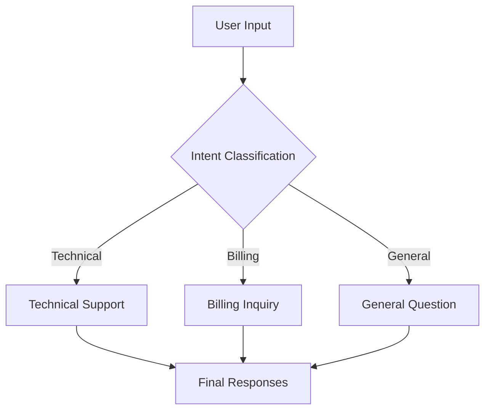
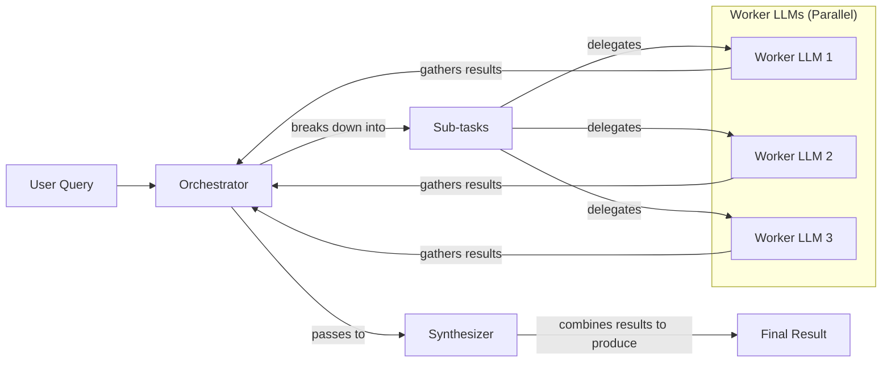

# Basic Workflow Patterns for LLM Applications

In the last lesson, we covered context engineering, the art of feeding the right information to an LLM. Now, we will tackle a fundamental challenge: getting structured and reliable information *out* of an LLM. When building AI applications, a single, complex LLM call often falls short. It’s like asking a new hire to write, research, and edit a report all in one go—you might get something, but the quality will be inconsistent.

We’ve learned this lesson in production. Trying to cram too many instructions into one prompt creates a system that’s hard to debug, expensive to run, and prone to errors. Instead of building monolithic prompts, we need to think in terms of modular, interconnected workflows. This approach is fundamental to building reliable and scalable AI systems.

This lesson explores the foundational patterns for building these workflows. We will cover how to chain multiple LLM calls sequentially, run them in parallel to save time, use routing to handle different tasks, and orchestrate complex jobs with multiple specialized components. By the end, you will know how to move beyond single prompts and start architecting robust LLM-powered applications.

## The Challenge with Complex Single LLM Calls

Attempting to solve a multi-step problem with a single, complex LLM call is a common anti-pattern. While it seems efficient, it introduces several challenges that make systems brittle and hard to maintain.

First, debugging becomes a nightmare. When a monolithic prompt fails, it’s difficult to pinpoint which instruction the model misunderstood. Second, you lose modularity. Updating one part of the task requires rewriting and re-testing the entire prompt, which is inefficient. Third, long and complex prompts are more susceptible to the "lost-in-the-middle" problem, where the model ignores information buried in the center of the context window [[2]](https://dev.to/thousand_miles_ai/the-lost-in-the-middle-problem-why-llms-ignore-the-middle-of-your-context-window-3al2). Finally, these prompts often consume more tokens than necessary and produce less reliable outputs, as the model struggles to juggle multiple, sometimes conflicting, instructions [[1]](https://www.mdpi.com/2079-9292/13/23/4712).

Let's look at a practical example. We will build a system that generates a Frequently Asked Questions (FAQ) page from several documents about renewable energy.

1.  First, we set up our environment by importing the necessary libraries, initializing the Gemini client, and defining our model ID. We will use `gemini-2.5-flash` for these examples because it is fast and cost-effective.
    ```python
    import asyncio
    from enum import Enum
    import random
    import time
    
    from pydantic import BaseModel, Field
    from google import genai
    from google.genai import types
    
    from lessons.utils import env, pretty_print
    
    env.load(required_env_vars=["GOOGLE_API_KEY"])
    
    client = genai.Client()
    
    MODEL_ID = "gemini-2.5-flash"
    ```

2.  Next, we define three mock webpages that will serve as our source content.
    ```python
    webpage_1 = {
        "title": "The Benefits of Solar Energy",
        "content": """
        Solar energy is a renewable powerhouse, offering numerous environmental and economic benefits.
        By converting sunlight into electricity through photovoltaic (PV) panels, it reduces reliance on fossil fuels,
        thereby cutting down greenhouse gas emissions. Homeowners who install solar panels can significantly
        lower their monthly electricity bills, and in some cases, sell excess power back to the grid.
        While the initial installation cost can be high, government incentives and long-term savings make
        it a financially viable option for many. Solar power is also a key component in achieving energy
        independence for nations worldwide.
        """,
    }
    
    webpage_2 = {
        "title": "Understanding Wind Turbines",
        "content": """
        Wind turbines are towering structures that capture kinetic energy from the wind and convert it into
        electrical power. They are a critical part of the global shift towards sustainable energy.
        Turbines can be installed both onshore and offshore, with offshore wind farms generally producing more
        consistent power due to stronger, more reliable winds. The main challenge for wind energy is its
        intermittency—it only generates power when the wind blows. This necessitates the use of energy
        storage solutions, like large-scale batteries, to ensure a steady supply of electricity.
        """,
    }
    
    webpage_3 = {
        "title": "Energy Storage Solutions",
        "content": """
        Effective energy storage is the key to unlocking the full potential of renewable sources like solar
        and wind. Because these sources are intermittent, storing excess energy when it's plentiful and
        releasing it when it's needed is crucial for a stable power grid. The most common form of
        large-scale storage is pumped-hydro storage, but battery technologies, particularly lithium-ion,
        are rapidly becoming more affordable and widespread. These batteries can be used in homes, businesses,
        and at the utility scale to balance energy supply and demand, making our energy system more
        resilient and reliable.
        """,
    }
    
    all_sources = [webpage_1, webpage_2, webpage_3]
    
    combined_content = "\n\n".join(
        [f"Source Title: {source['title']}\nContent: {source['content']}" for source in all_sources]
    )
    ```

3.  Now, we create a single, complex prompt that asks the model to generate questions, provide answers, and cite sources all at once. We also define Pydantic models to structure the output.
    ```python
    # This prompt tries to do everything at once: generate questions, find answers,
    # and cite sources. This complexity can often confuse the model.
    n_questions = 10
    prompt_complex = f"""
    Based on the provided content from three webpages, generate a list of exactly {n_questions} frequently asked questions (FAQs).
    For each question, provide a concise answer derived ONLY from the text.
    After each answer, you MUST include a list of the 'Source Title's that were used to formulate that answer.
    
    <provided_content>
    {combined_content}
    </provided_content>
    """.strip()
    
    # Pydantic classes for structured outputs
    class FAQ(BaseModel):
        """A FAQ is a question and answer pair, with a list of sources used to answer the question."""
        question: str = Field(description="The question to be answered")
        answer: str = Field(description="The answer to the question")
        sources: list[str] = Field(description="The sources used to answer the question")
    
    class FAQList(BaseModel):
        """A list of FAQs"""
        faqs: list[FAQ] = Field(description="A list of FAQs")
    
    # Generate FAQs
    config = types.GenerateContentConfig(
        response_mime_type="application/json",
        response_schema=FAQList
    )
    response_complex = client.models.generate_content(
        model=MODEL_ID,
        contents=prompt_complex,
        config=config
    )
    result_complex = response_complex.parsed
    ```
    It outputs:
    ```json
    {
      "question": "What is solar energy and how does it work?",
      "answer": "Solar energy is a renewable powerhouse that converts sunlight into electricity through photovoltaic (PV) panels.",
      "sources": [
        "The Benefits of Solar Energy"
      ]
    }
    ```

While this output seems reasonable, the more complex the instructions, the more likely the model is to make mistakes. For instance, it might fail to cite all relevant sources or generate an incorrect number of questions. This unreliability makes it risky for production systems.

## The Power of Modularity: Why Chain LLM Calls?

To build more reliable systems, we can break down complex tasks into smaller, sequential steps. This pattern is known as prompt chaining, where the output of one LLM call becomes the input for the next [[35]](https://productschool.com/blog/artificial-intelligence/ai-agent-orchestration-patterns). It’s a classic "divide and conquer" strategy that brings the principles of modular software design to AI engineering.

Chaining offers several key benefits:
*   **Improved modularity:** Each LLM call focuses on a single, well-defined sub-task. This separation of concerns makes the system easier to understand, maintain, and extend [[36]](https://www.decodingai.com/p/stop-building-ai-agents-use-these).
*   **Enhanced accuracy:** Simple, targeted prompts are less confusing for the model, which generally leads to more accurate and reliable outputs.
*   **Easier debugging:** When a failure occurs, you can isolate the problem to a specific step in the chain. This makes it much faster to identify and fix issues compared to debugging one large, complex prompt.
*   **Increased flexibility:** You can swap, update, or optimize individual components of the chain without affecting the rest of the workflow. For example, you could use a fast, cost-effective model for a simple classification step and a more powerful model for a complex generation task.

However, this approach is not without its trade-offs. Chaining multiple LLM calls increases latency, as you have to wait for each call to complete sequentially. It can also increase costs due to the higher number of API calls and total tokens used. Furthermore, there is a risk of information loss between steps; for example, a summarization step might inadvertently remove a key detail that a subsequent translation step needs [[41]](https://medium.com/@fabiolalli/a-practical-guide-to-prompt-engineering-techniques-and-their-use-cases-5f8574e2cd9a). Despite these downsides, the gains in reliability and maintainability often make chaining the superior approach for production systems.

## Building a Sequential Workflow: FAQ Generation Pipeline

Let's refactor our FAQ generation example into a three-step sequential workflow:
1.  **Generate Questions**: Create a list of questions based on the source content.
2.  **Answer Questions**: For each question, generate a concise answer.
3.  **Find Sources**: For each question-answer pair, identify the source documents.

This modular approach allows us to create specialized prompts for each step, improving the overall quality and consistency of the output.

Image 1: A flowchart illustrating the sequential FAQ generation pipeline.
```mermaid
flowchart LR
  "Input Content" --> "Generate Questions"
  "Generate Questions" --> "Answer Questions"
  "Answer Questions" --> "Find Sources"
```

1.  First, we create a function dedicated to generating a list of questions. This prompt focuses only on creating relevant questions, making its task clear and simple.
    ```python
    class QuestionList(BaseModel):
        """A list of questions"""
        questions: list[str] = Field(description="A list of questions")
    
    prompt_generate_questions = """
    Based on the content below, generate a list of {n_questions} relevant and distinct questions that a user might have.
    
    <provided_content>
    {combined_content}
    </provided_content>
    """.strip()
    
    def generate_questions(content: str, n_questions: int = 10) -> list[str]:
        """
        Generate a list of questions based on the provided content.
    
        Args:
            content: The combined content from all sources
    
        Returns:
            list: A list of generated questions
        """
        config = types.GenerateContentConfig(
            response_mime_type="application/json",
            response_schema=QuestionList
        )
        response_questions = client.models.generate_content(
            model=MODEL_ID,
            contents=prompt_generate_questions.format(n_questions=n_questions, combined_content=content),
            config=config
        )
    
        return response_questions.parsed.questions
    
    # Test the question generation function
    questions = generate_questions(combined_content, n_questions=10)
    ```
    It outputs:
    ```text
    What are the primary environmental and economic benefits of solar energy?
    ```

2.  Next, we define a function to answer a single question using only the provided content. This ensures the answers are grounded in the source material.
    ```python
    prompt_answer_question = """
    Using ONLY the provided content below, answer the following question.
    The answer should be concise and directly address the question.
    
    <question>
    {question}
    </question>
    
    <provided_content>
    {combined_content}
    </provided_content>
    """.strip()
    
    def answer_question(question: str, content: str) -> str:
        """
        Generate an answer for a specific question using only the provided content.
    
        Args:
            question: The question to answer
            content: The combined content from all sources
    
        Returns:
            str: The generated answer
        """
        answer_response = client.models.generate_content(
            model=MODEL_ID,
            contents=prompt_answer_question.format(question=question, combined_content=content),
        )
        return answer_response.text
    
    # Test the answer generation function
    test_question = questions[0]
    test_answer = answer_question(test_question, combined_content)
    ```
    It outputs:
    ```text
    The primary environmental benefit of solar energy is cutting down greenhouse gas emissions by reducing reliance on fossil fuels. Economically, it allows homeowners to significantly lower their monthly electricity bills and potentially sell excess power back to the grid.
    ```

3.  The third function identifies which of the original documents were used to generate the answer. This step adds traceability to our system.
    ```python
    class SourceList(BaseModel):
        """A list of source titles that were used to answer the question"""
        sources: list[str] = Field(description="A list of source titles that were used to answer the question")
    
    prompt_find_sources = """
    You will be given a question and an answer that was generated from a set of documents.
    Your task is to identify which of the original documents were used to create the answer.
    
    <question>
    {question}
    </question>
    
    <answer>
    {answer}
    </answer>
    
    <provided_content>
    {combined_content}
    </provided_content>
    """.strip()
    
    def find_sources(question: str, answer: str, content: str) -> list[str]:
        """
        Identify which sources were used to generate an answer.
    
        Args:
            question: The original question
            answer: The generated answer
            content: The combined content from all sources
    
        Returns:
            list: A list of source titles that were used
        """
        config = types.GenerateContentConfig(
            response_mime_type="application/json",
            response_schema=SourceList
        )
        sources_response = client.models.generate_content(
            model=MODEL_ID,
            contents=prompt_find_sources.format(question=question, answer=answer, combined_content=content),
            config=config
        )
        return sources_response.parsed.sources
    
    # Test the source finding function
    test_sources = find_sources(test_question, test_answer, combined_content)
    ```
    It outputs:
    ```text
    The Benefits of Solar Energy
    ```

4.  Finally, we combine these functions into a sequential workflow. We generate all questions first, then loop through each one to generate an answer and find its sources.
    ```python
    def sequential_workflow(content, n_questions=10) -> list[FAQ]:
        """
        Execute the complete sequential workflow for FAQ generation.
    
        Args:
            content: The combined content from all sources
    
        Returns:
            list: A list of FAQs with questions, answers, and sources
        """
        # Generate questions
        questions = generate_questions(content, n_questions)
    
        # Answer and find sources for each question sequentially
        final_faqs = []
        for question in questions:
            # Generate an answer for the current question
            answer = answer_question(question, content)
    
            # Identify the sources for the generated answer
            sources = find_sources(question, answer, content)
    
            faq = FAQ(
                question=question,
                answer=answer,
                sources=sources
            )
            final_faqs.append(faq)
    
        return final_faqs
    
    # Execute the sequential workflow (measure time for comparison)
    start_time = time.monotonic()
    sequential_faqs = sequential_workflow(combined_content, n_questions=4)
    end_time = time.monotonic()
    print(f"Sequential processing completed in {end_time - start_time:.2f} seconds")
    ```
    It outputs:
    ```text
    Sequential processing completed in 22.20 seconds
    ```

This sequential process took over 20 seconds for just four questions. While reliable, it is not very fast. The next thing we want to explain is how to optimize this for speed.

## Optimizing Sequential Workflows With Parallel Processing

While the sequential workflow improves reliability, it can be slow because it processes each question one by one. We can significantly speed this up by parallelizing independent tasks. In our FAQ example, the processing for each question (answering and source finding) is independent of the others. This makes it a perfect candidate for parallel execution.

We can implement this using Python's `asyncio` library to handle concurrent API calls [[26]](https://santhalakshminarayana.github.io/blog/concurrency-patterns-python), [[27]](https://medium.com/@sizanmahmud08/python-concurrency-showdown-asyncio-vs-threading-vs-multiprocessing-which-should-you-choose-in-31205161899a).

1.  First, we create asynchronous versions of our `answer_question` and `find_sources` functions.
    ```python
    async def answer_question_async(question: str, content: str) -> str:
        """
        Async version of answer_question function.
        """
        prompt = prompt_answer_question.format(question=question, combined_content=content)
        response = await client.aio.models.generate_content(
            model=MODEL_ID,
            contents=prompt
        )
        return response.text
    
    async def find_sources_async(question: str, answer: str, content: str) -> list[str]:
        """
        Async version of find_sources function.
        """
        prompt = prompt_find_sources.format(question=question, answer=answer, combined_content=content)
        config = types.GenerateContentConfig(
            response_mime_type="application/json",
            response_schema=SourceList
        )
        response = await client.aio.models.generate_content(
            model=MODEL_ID,
            contents=prompt,
            config=config
        )
        return response.parsed.sources
    
    async def process_question_parallel(question: str, content: str) -> FAQ:
        """
        Process a single question by generating answer and finding sources in parallel.
        """
        answer = await answer_question_async(question, content)
        sources = await find_sources_async(question, answer, content)
        return FAQ(
            question=question,
            answer=answer,
            sources=sources
        )
    ```

2.  Next, we define the parallel workflow. After generating the initial list of questions, we use `asyncio.gather` to execute the processing for all questions concurrently.
    ```python
    async def parallel_workflow(content: str, n_questions: int = 10) -> list[FAQ]:
        """
        Execute the complete parallel workflow for FAQ generation.
    
        Args:
            content: The combined content from all sources
    
        Returns:
            list: A list of FAQs with questions, answers, and sources
        """
        # Generate questions (this step remains synchronous)
        questions = generate_questions(content, n_questions)
    
        # Process all questions in parallel
        tasks = [process_question_parallel(question, content) for question in questions]
        parallel_faqs = await asyncio.gather(*tasks)
    
        return parallel_faqs
    
    # Execute the parallel workflow (measure time for comparison)
    start_time = time.monotonic()
    parallel_faqs = await parallel_workflow(combined_content, n_questions=4)
    end_time = time.monotonic()
    print(f"Parallel processing completed in {end_time - start_time:.2f} seconds")
    ```
    It outputs:
    ```text
    Parallel processing completed in 8.98 seconds
    ```

By running the tasks in parallel, we reduced the execution time from 22.20 seconds to just 8.98 seconds—a significant improvement.

This highlights the trade-offs between the two approaches. Sequential processing is predictable and easier to debug, but slower. Parallel processing offers a substantial speed boost and better resource utilization, but requires more complex error handling.

⚠️ A word of caution: when making many parallel API calls, you can easily hit rate limits, especially with free-tier accounts [[9]](https://tianpan.co/blog/2026-03-11-llm-api-resilience-production). Production systems need robust error handling, such as exponential backoff with jitter, to manage these limits gracefully.

## Introducing Dynamic Behavior: Routing and Conditional Logic

So far, our workflows have been static. They follow a fixed path regardless of the input. However, many real-world applications require dynamic behavior. Not all inputs should be processed in the same way. This is where routing comes in.

Routing uses conditional logic to direct a workflow down different paths based on the input or an intermediate state [[36]](https://www.decodingai.com/p/stop-building-ai-agents-use-these). A common pattern is to use an LLM call to classify the input and then use that classification to make a branching decision. For example, a customer support system might route a query to a specialized handler for technical support, billing, or general questions.

This approach continues the "divide and conquer" principle. Instead of creating a single, monolithic prompt that tries to handle every possible case, we create specialized prompts for each path. This keeps our prompts focused, easier to maintain, and generally more accurate.

## Building a Basic Routing Workflow

Let's build a simple routing workflow for a customer service system. The goal is to classify a user's intent and then pass the query to a specialized handler.

Image 2: A flowchart illustrating the routing workflow for customer service intent classification.


1.  First, we define the possible intents and create a Pydantic model to structure the classification output.
    ```python
    class IntentEnum(str, Enum):
        """
        Defines the allowed values for the 'intent' field.
        Inheriting from 'str' ensures that the values are treated as strings.
        """
        TECHNICAL_SUPPORT = "Technical Support"
        BILLING_INQUIRY = "Billing Inquiry"
        GENERAL_QUESTION = "General Question"
    
    class UserIntent(BaseModel):
        """
        Defines the expected response schema for the intent classification.
        """
        intent: IntentEnum = Field(description="The intent of the user's query")
    
    prompt_classification = """
    Classify the user's query into one of the following categories.
    
    <categories>
    {categories}
    </categories>
    
    <user_query>
    {user_query}
    </user_query>
    """.strip()
    
    
    def classify_intent(user_query: str) -> IntentEnum:
        """Uses an LLM to classify a user query."""
        prompt = prompt_classification.format(
            user_query=user_query,
            categories=[intent.value for intent in IntentEnum]
        )
        config = types.GenerateContentConfig(
            response_mime_type="application/json",
            response_schema=UserIntent
        )
        response = client.models.generate_content(
            model=MODEL_ID,
            contents=prompt,
            config=config
        )
        return response.parsed.intent
    
    
    query_1 = "My internet connection is not working."
    intent_1 = classify_intent(query_1)
    ```
    It outputs:
    ```text
    IntentEnum.TECHNICAL_SUPPORT
    ```

2.  Next, we define specialized prompts for each intent: technical support, billing, and general questions.
    ```python
    prompt_technical_support = """
    You are a helpful technical support agent.
    
    Here's the user's query:
    <user_query>
    {user_query}
    </user_query>
    
    Provide a helpful first response, asking for more details like what troubleshooting steps they have already tried.
    """.strip()
    
    prompt_billing_inquiry = """
    You are a helpful billing support agent.
    
    Here's the user's query:
    <user_query>
    {user_query}
    </user_query>
    
    Acknowledge their concern and inform them that you will need to look up their account, asking for their account number.
    """.strip()
    
    prompt_general_question = """
    You are a general assistant.
    
    Here's the user's query:
    <user_query>
    {user_query}
    </user_query>
    
    Apologize that you are not sure how to help.
    """.strip()
    ```

3.  Finally, we create a handler function that takes the user query and the classified intent, and routes it to the appropriate prompt.
    ```python
    def handle_query(user_query: str, intent: str) -> str:
        """Routes a query to the correct handler based on its classified intent."""
        if intent == IntentEnum.TECHNICAL_SUPPORT:
            prompt = prompt_technical_support.format(user_query=user_query)
        elif intent == IntentEnum.BILLING_INQUIRY:
            prompt = prompt_billing_inquiry.format(user_query=user_query)
        elif intent == IntentEnum.GENERAL_QUESTION:
            prompt = prompt_general_question.format(user_query=user_query)
        else:
            prompt = prompt_general_question.format(user_query=user_query)
        response = client.models.generate_content(
            model=MODEL_ID,
            contents=prompt
        )
        return response.text
    
    
    response_1 = handle_query(query_1, intent_1)
    ```
    It outputs:
    ```text
    Hello there! I'm sorry to hear you're having trouble with your internet connection. That can definitely be frustrating.
    
    To help me understand what's going on and assist you best, could you please provide a few more details?
    
    1.  **What exactly are you experiencing?** For example, are you not seeing your Wi-Fi network, is your Wi-Fi connected but no websites are loading, or are there any specific error messages?
    2.  **What device are you trying to connect with?** (e.g., a laptop, phone, desktop PC)
    3.  **Have you already tried any troubleshooting steps yourself?** For instance, have you tried:
        *   Restarting your computer or device?
        *   Restarting your Wi-Fi router and modem (unplugging them for 30 seconds and plugging them back in)?
        *   Checking if other devices can connect to the internet?
    
    Once I have a bit more information, I'll be happy to guide you through some potential solutions.
    ```

This routing pattern allows us to build a more organized and maintainable system. Each component has a single responsibility, making the overall workflow easier to manage and scale.

## Orchestrator-Worker Pattern: Dynamic Task Decomposition

The patterns we have seen so far—chaining, parallelization, and routing—are powerful, but they rely on pre-defined steps. What if a task is so complex that you cannot predict the necessary sub-tasks in advance? This is where the orchestrator-worker pattern comes in.

In this workflow, a central "orchestrator" LLM dynamically analyzes a complex task, breaks it down into smaller sub-tasks, and delegates them to specialized "worker" LLMs [[16]](https://agents.kour.me/orchestrator-worker/). The orchestrator then gathers the results from the workers and a "synthesizer" LLM combines them into a final, coherent response [[32]](https://mlpills.substack.com/p/diy-17-orchestrator-worker-llm-agent).

The key advantage of this pattern is its flexibility. Unlike a fixed parallel workflow, the sub-tasks are not pre-defined; they are determined at runtime by the orchestrator based on the specific input. This makes it ideal for handling unpredictable and multifaceted queries, such as a customer support request that involves a billing issue, a product return, and an order status update all at once.

Image 3: A flowchart illustrating the orchestrator-worker pattern, showing the flow from a user query through an orchestrator, parallel worker LLMs, a synthesizer, to a final result.


Let's implement this pattern for our customer support system.

1.  First, we define the orchestrator. Its job is to analyze a complex user query and break it down into a list of structured tasks.
    ```python
    class QueryTypeEnum(str, Enum):
        """The type of query to be handled."""
        BILLING_INQUIRY = "BillingInquiry"
        PRODUCT_RETURN = "ProductReturn"
        STATUS_UPDATE = "StatusUpdate"
    
    class Task(BaseModel):
        """A task to be performed."""
        query_type: QueryTypeEnum = Field(description="The type of query to be handled.")
        invoice_number: str | None = Field(description="The invoice number to be used for the billing inquiry.", default=None)
        product_name: str | None = Field(description="The name of the product to be returned.", default=None)
        reason_for_return: str | None = Field(description="The reason for returning the product.", default=None)
        order_id: str | None = Field(description="The order ID to be used for the status update.", default=None)
    
    class TaskList(BaseModel):
        """A list of tasks to be performed."""
        tasks: list[Task] = Field(description="A list of tasks to be performed.")
    
    prompt_orchestrator = f"""
    You are a master orchestrator. Your job is to break down a complex user query into a list of sub-tasks.
    Each sub-task must have a "query_type" and its necessary parameters.
    
    The possible "query_type" values and their required parameters are:
    1. "{QueryTypeEnum.BILLING_INQUIRY.value}": Requires "invoice_number".
    2. "{QueryTypeEnum.PRODUCT_RETURN.value}": Requires "product_name" and "reason_for_return".
    3. "{QueryTypeEnum.STATUS_UPDATE.value}": Requires "order_id".
    
    Here's the user's query.
    
    <user_query>
    {{query}}
    </user_query>
    """.strip()
    
    
    def orchestrator(query: str) -> list[Task]:
        """Breaks down a complex query into a list of tasks."""
        prompt = prompt_orchestrator.format(query=query)
        config = types.GenerateContentConfig(
            response_mime_type="application/json",
            response_schema=TaskList
        )
        response = client.models.generate_content(
            model=MODEL_ID,
            contents=prompt,
            config=config
        )
        return response.parsed.tasks
    ```

2.  Next, we define our specialized workers. We will have one for billing inquiries, one for product returns, and one for order status updates. For this example, these workers will simulate backend actions and return structured data.
    ```python
    # Billing Worker
    class BillingTask(BaseModel):
        query_type: QueryTypeEnum = Field(default=QueryTypeEnum.BILLING_INQUIRY)
        invoice_number: str
        user_concern: str
        action_taken: str
        resolution_eta: str

    def handle_billing_worker(invoice_number: str, original_user_query: str) -> BillingTask:
        # ... implementation details ...
        pass

    # Product Return Worker
    class ReturnTask(BaseModel):
        query_type: QueryTypeEnum = Field(default=QueryTypeEnum.PRODUCT_RETURN)
        product_name: str
        reason_for_return: str
        rma_number: str
        shipping_instructions: str

    def handle_return_worker(product_name: str, reason_for_return: str) -> ReturnTask:
        # ... implementation details ...
        pass

    # Order Status Worker
    class StatusTask(BaseModel):
        query_type: QueryTypeEnum = Field(default=QueryTypeEnum.STATUS_UPDATE)
        order_id: str
        current_status: str
        carrier: str
        tracking_number: str
        expected_delivery: str

    def handle_status_worker(order_id: str) -> StatusTask:
        # ... implementation details ...
        pass
    ```

3.  The synthesizer's role is to take the structured outputs from all the workers and compose a single, friendly, and coherent message for the customer.
    ```python
    prompt_synthesizer = """
    You are a master communicator. Combine several distinct pieces of information from our support team into a single, well-formatted, and friendly email to a customer.
    
    Here are the points to include, based on the actions taken for their query:
    <points>
    {formatted_results}
    </points>
    
    Combine these points into one cohesive response.
    Start with a friendly greeting (e.g., "Dear Customer," or "Hi there,") and end with a polite closing (e.g., "Sincerely," or "Best regards,").
    Ensure the tone is helpful and professional.
    """.strip()
    
    
    def synthesizer(results: list[Task]) -> str:
        # ... implementation details ...
        pass
    ```

4.  Finally, we create the main pipeline that ties everything together. It takes a user query, runs the orchestrator to get the list of tasks, dispatches each task to the appropriate worker, and then uses the synthesizer to generate the final response.
    ```python
    def process_user_query(user_query):
        """Processes a query using the Orchestrator-Worker-Synthesizer pattern."""
        # 1. Run orchestrator
        tasks_list = orchestrator(user_query)
        
        # 2. Run workers
        worker_results = []
        if tasks_list:
            for task in tasks_list:
                if task.query_type == QueryTypeEnum.BILLING_INQUIRY:
                    worker_results.append(handle_billing_worker(task.invoice_number, user_query))
                # ... other workers
        
        # 3. Run synthesizer
        if worker_results:
            final_user_message = synthesizer(worker_results)
            pretty_print.wrapped(
                text=final_user_message,
                title="Final synthesized response",
                header_color=pretty_print.Color.GREEN
            )

    complex_customer_query = """
    Hi, I'm writing to you because I have a question about invoice #INV-7890. It seems higher than I expected.
    Also, I would like to return the 'SuperWidget 5000' I bought because it's not compatible with my system.
    Finally, can you give me an update on my order #A-12345?
    """.strip()

    process_user_query(complex_customer_query)
    ```
    It outputs:
    ```text
    Dear Customer,
    
    Thank you for reaching out to us. Here is a summary of the actions we've taken regarding your query:
    
    Regarding your BillingInquiry:
      - Invoice Number: INV-7890
      - Your Stated Concern: "It seems higher than I expected."
      - Our Action: An investigation (Case ID: INV_CASE_5641) has been opened regarding your concern.
      - Expected Resolution: We will get back to you within 2 business days.
    
    Regarding your ProductReturn:
      - Product: SuperWidget 5000
      - Reason for Return: "it's not compatible with my system"
      - Return Authorization (RMA): RMA-65825
      - Instructions: Please pack the 'SuperWidget 5000' securely in its original packaging if possible. Include all accessories and manuals. Write the RMA number (RMA-65825) clearly on the outside of the package. Ship to: Returns Department, 123 Automation Lane, Tech City, TC 98765.
    
    Regarding your StatusUpdate:
      - Order ID: A-12345
      - Current Status: Shipped
      - Carrier: SuperFast Shipping
      - Tracking Number: SF252924
      - Delivery Estimate: Tomorrow
    
    We hope this information is helpful. Please let us know if you have any other questions.
    
    Best regards,
    The Support Team
    ```

This pattern demonstrates how to build a sophisticated, dynamic, and modular AI system capable of handling complex, unpredictable user requests by combining the strengths of multiple specialized components.