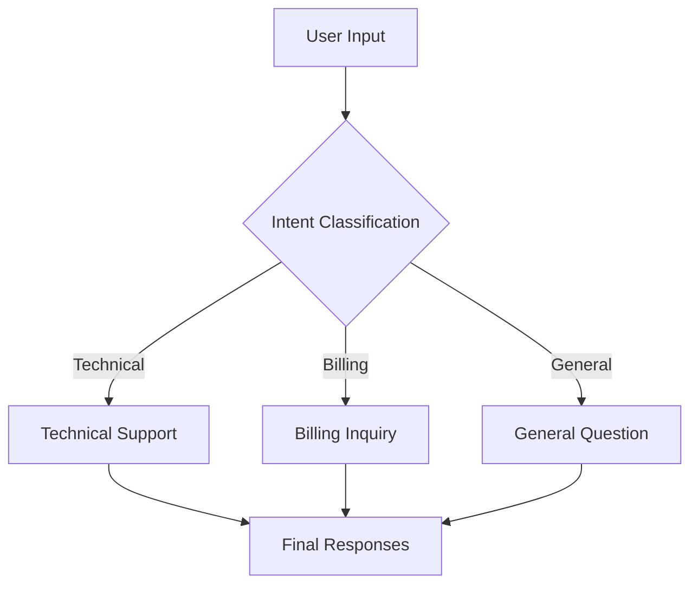
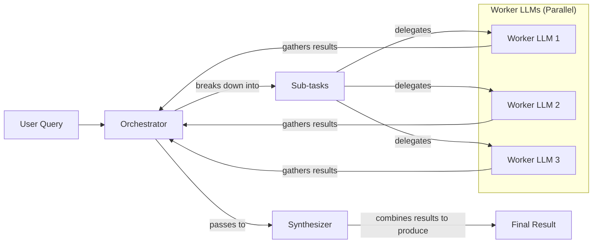

# Basic Workflow Patterns for LLM Applications

In our last lesson, we covered structured outputs, the art of getting reliable and machine-readable data *out* of an LLM. Now, we will build on that foundation to construct more complex systems. When building AI applications, a single, complex LLM call often falls short. It’s like asking a new hire to write, research, and edit a report all in one go—you might get something, but the quality will be inconsistent.

We’ve learned this lesson in production. Trying to cram too many instructions into one prompt creates a system that’s hard to debug, expensive to run, and prone to errors. Instead of building monolithic prompts, we need to think in terms of modular, interconnected workflows. This approach is fundamental to building reliable and scalable AI systems.

This lesson explores the foundational patterns for building these workflows. We will cover how to chain multiple LLM calls sequentially, run them in parallel to save time, use routing to handle different tasks, and orchestrate complex jobs with multiple specialized components. By the end, you will know how to move beyond single prompts and start architecting robust LLM-powered applications.

## The Challenge with Complex Single LLM Calls

Attempting to solve a multi-step problem with a single, complex LLM call is a common anti-pattern. While it seems efficient, it introduces several challenges that make systems brittle and hard to maintain. This approach often leads to a trade-off where the convenience of a single prompt is outweighed by a significant drop in reliability and control, which is unacceptable for production-grade applications.

One of the biggest issues is the difficulty in debugging. When a monolithic prompt fails or produces an unexpected result, it is nearly impossible to pinpoint which specific instruction the model misunderstood or ignored. You are left with a black box, making it difficult to iterate and improve. In contrast, a modular system allows you to isolate failures to a specific component, which is much easier to fix [[36]](https://www.decodingai.com/p/stop-building-ai-agents-use-these).

Furthermore, this lack of modularity makes the system rigid. If you need to update one part of the task—say, change the tone of the output or add a new data point to extract—you have to rework and re-test the entire prompt. This is inefficient and slows down development. A modular design allows you to update or replace individual components without affecting the rest of the system.

Complex prompts are also more vulnerable to the "lost-in-the-middle" problem. Research has shown that LLMs pay the most attention to the beginning and end of their context window, often ignoring or misinterpreting information in the middle [[2]](https://dev.to/thousand_miles_ai/the-lost-in-the-middle-problem-why-llms-ignore-the-middle-of-your-context-window-3al2). As you add more instructions and data to a single prompt, you increase the risk that critical details will be lost in this "middle" section, leading to incomplete or incorrect outputs.

Finally, studies indicate that as the number of requirements in a prompt increases, an LLM's ability to follow all of them diminishes [[5]](https://arxiv.org/html/2505.13360v1). This can lead to higher token consumption for prompts that try to do too much, and ultimately, less reliable outputs as the model struggles to juggle multiple, sometimes conflicting, instructions [[1]](https://www.mdpi.com/2079-9292/13/23/4712).

Let's look at a practical example. We will build a system that generates a Frequently Asked Questions (FAQ) page from several documents about renewable energy.

1.  First, we set up our environment by importing the necessary libraries, initializing the Gemini client, and defining our model ID. We will use `gemini-2.5-flash` for these examples because it is fast and cost-effective.
    ```python
    import asyncio
    from enum import Enum
    import random
    import time
    
    from pydantic import BaseModel, Field
    from google import genai
    from google.genai import types
    
    from lessons.utils import env, pretty_print
    
    env.load(required_env_vars=["GOOGLE_API_KEY"])
    
    client = genai.Client()
    
    MODEL_ID = "gemini-2.5-flash"
    ```

2.  Next, we define three mock webpages that will serve as our source content.
    ```python
    webpage_1 = {
        "title": "The Benefits of Solar Energy",
        "content": """
        Solar energy is a renewable powerhouse, offering numerous environmental and economic benefits.
        By converting sunlight into electricity through photovoltaic (PV) panels, it reduces reliance on fossil fuels,
        thereby cutting down greenhouse gas emissions. Homeowners who install solar panels can significantly
        lower their monthly electricity bills, and in some cases, sell excess power back to the grid.
        While the initial installation cost can be high, government incentives and long-term savings make
        it a financially viable option for many. Solar power is also a key component in achieving energy
        independence for nations worldwide.
        """,
    }
    
    webpage_2 = {
        "title": "Understanding Wind Turbines",
        "content": """
        Wind turbines are towering structures that capture kinetic energy from the wind and convert it into
        electrical power. They are a critical part of the global shift towards sustainable energy.
        Turbines can be installed both onshore and offshore, with offshore wind farms generally producing more
        consistent power due to stronger, more reliable winds. The main challenge for wind energy is its
        intermittency—it only generates power when the wind blows. This necessitates the use of energy
        storage solutions, like large-scale batteries, to ensure a steady supply of electricity.
        """,
    }
    
    webpage_3 = {
        "title": "Energy Storage Solutions",
        "content": """
        Effective energy storage is the key to unlocking the full potential of renewable sources like solar
        and wind. Because these sources are intermittent, storing excess energy when it's plentiful and
        releasing it when it's needed is crucial for a stable power grid. The most common form of
        large-scale storage is pumped-hydro storage, but battery technologies, particularly lithium-ion,
        are rapidly becoming more affordable and widespread. These batteries can be used in homes, businesses,
        and at the utility scale to balance energy supply and demand, making our energy system more
        resilient and reliable.
        """,
    }
    
    all_sources = [webpage_1, webpage_2, webpage_3]
    
    combined_content = "\n\n".join(
        [f"Source Title: {source['title']}\nContent: {source['content']}" for source in all_sources]
    )
    ```

3.  Now, we create a single, complex prompt that asks the model to generate questions, provide answers, and cite sources all at once. We also define Pydantic models to structure the output.
    ```python
    # This prompt tries to do everything at once: generate questions, find answers,
    # and cite sources. This complexity can often confuse the model.
    n_questions = 10
    prompt_complex = f"""
    Based on the provided content from three webpages, generate a list of exactly {n_questions} frequently asked questions (FAQs).
    For each question, provide a concise answer derived ONLY from the text.
    After each answer, you MUST include a list of the 'Source Title's that were used to formulate that answer.
    
    <provided_content>
    {combined_content}
    </provided_content>
    """.strip()
    
    # Pydantic classes for structured outputs
    class FAQ(BaseModel):
        """A FAQ is a question and answer pair, with a list of sources used to answer the question."""
        question: str = Field(description="The question to be answered")
        answer: str = Field(description="The answer to the question")
        sources: list[str] = Field(description="The sources used to answer the question")
    
    class FAQList(BaseModel):
        """A list of FAQs"""
        faqs: list[FAQ] = Field(description="A list of FAQs")
    
    # Generate FAQs
    config = types.GenerateContentConfig(
        response_mime_type="application/json",
        response_schema=FAQList
    )
    response_complex = client.models.generate_content(
        model=MODEL_ID,
        contents=prompt_complex,
        config=config
    )
    result_complex = response_complex.parsed
    ```
    It outputs:
    ```json
    {
      "question": "Why is energy storage crucial for renewable energy sources like solar and wind?",
      "answer": "Effective energy storage is key to unlocking the full potential of renewable sources because it allows storing excess energy when plentiful and releasing it when needed, which is crucial for a stable power grid.",
      "sources": [
        "Energy Storage Solutions",
        "Understanding Wind Turbines"
      ]
    }
    ```

While this output seems reasonable, it hides potential inconsistencies. For example, the model might correctly identify that an answer comes from multiple sources, as seen above. However, in many cases, it might only cite a single source even when the information is synthesized from several documents. This unreliability makes the single-prompt approach risky for production systems where accuracy and traceability are essential.

## The Power of Modularity: Why Chain LLM Calls?

To build more reliable systems, we can break down complex tasks into smaller, sequential steps. This pattern is known as prompt chaining, where the output of one LLM call becomes the input for the next [[35]](https://productschool.com/blog/artificial-intelligence/ai-agent-orchestration-patterns). It’s a classic "divide and conquer" strategy that brings the principles of modular software design to AI engineering. By decomposing a large problem into a series of focused sub-tasks, we gain more control and predictability over the final output.

Chaining offers several key benefits that directly address the shortcomings of monolithic prompts:
*   **Improved modularity:** Each LLM call focuses on a single, well-defined sub-task. This separation of concerns makes the system easier to understand, maintain, and extend. You can think of each prompt in the chain as a distinct function with a clear purpose [[36]](https://www.decodingai.com/p/stop-building-ai-agents-use-these).
*   **Enhanced accuracy:** Simple, targeted prompts are less confusing for the model. By reducing the cognitive load on the LLM at each step, you generally get more accurate and reliable outputs.
*   **Easier debugging:** When a failure occurs, you can isolate the problem to a specific link in the chain. This makes it much faster to identify and fix issues compared to debugging one large, complex prompt. Observability tools can trace the inputs and outputs of each step, providing a clear view of where things went wrong.
*   **Increased flexibility:** You can swap, update, or optimize individual components of the chain without affecting the rest of the workflow. For example, you could use a fast, cost-effective model for a simple classification step and a more powerful model for a complex generation task.

However, this approach is not without its trade-offs. Chaining multiple LLM calls increases latency, as you have to wait for each call to complete sequentially. It can also increase costs due to the higher number of API calls and total tokens used. Furthermore, there is a risk of information loss between steps; for example, a summarization step might inadvertently remove a key detail that a subsequent translation step needs [[41]](https://medium.com/@fabiolalli/a-practical-guide-to-prompt-engineering-techniques-and-their-use-cases-5f8574e2cd9a). Another subtle issue is that some instructions may lose their intended meaning when separated. Certain tasks might require the model to consider multiple constraints simultaneously, and splitting them apart can lead to a loss of context. Despite these downsides, the gains in reliability and maintainability often make chaining the superior approach for production systems.

## Building a Sequential Workflow: FAQ Generation Pipeline

Let's refactor our FAQ generation example into a three-step sequential workflow. This modular approach will give us more control and produce more reliable results. The pipeline will consist of three distinct stages:
1.  **Generate Questions**: Create a list of relevant questions based on the source content.
2.  **Answer Questions**: For each generated question, formulate a concise answer.
3.  **Find Sources**: For each question-answer pair, identify the original source documents.

This structure allows us to use a specialized prompt for each step, ensuring that the LLM has a clear and focused task at every stage. By breaking the problem down, we can debug each part independently and have greater confidence in the final output.

Image 1: A flowchart illustrating the sequential FAQ generation pipeline.
```mermaid
flowchart LR
  "Input Content" --> "Generate Questions"
  "Generate Questions" --> "Answer Questions"
  "Answer Questions" --> "Find Sources"
```

1.  First, we create a function dedicated to generating a list of questions. The prompt is simple and direct: it asks the model to generate a specific number of questions based on the provided content. We use a Pydantic model, `QuestionList`, to ensure the output is a well-formatted list of strings.
    ```python
    class QuestionList(BaseModel):
        """A list of questions"""
        questions: list[str] = Field(description="A list of questions")
    
    prompt_generate_questions = """
    Based on the content below, generate a list of {n_questions} relevant and distinct questions that a user might have.
    
    <provided_content>
    {combined_content}
    </provided_content>
    """.strip()
    
    def generate_questions(content: str, n_questions: int = 10) -> list[str]:
        """
        Generate a list of questions based on the provided content.
    
        Args:
            content: The combined content from all sources
    
        Returns:
            list: A list of generated questions
        """
        config = types.GenerateContentConfig(
            response_mime_type="application/json",
            response_schema=QuestionList
        )
        response_questions = client.models.generate_content(
            model=MODEL_ID,
            contents=prompt_generate_questions.format(n_questions=n_questions, combined_content=content),
            config=config
        )
    
        return response_questions.parsed.questions
    
    # Test the question generation function
    questions = generate_questions(combined_content, n_questions=10)
    ```
    It outputs:
    ```text
    What are the primary environmental and economic benefits of solar energy?
    ```

2.  Next, we define a function to answer a single question. This prompt instructs the model to use *only* the provided content to formulate a concise answer. This constraint is crucial for building a system grounded in facts and preventing the model from hallucinating information.
    ```python
    prompt_answer_question = """
    Using ONLY the provided content below, answer the following question.
    The answer should be concise and directly address the question.
    
    <question>
    {question}
    </question>
    
    <provided_content>
    {combined_content}
    </provided_content>
    """.strip()
    
    def answer_question(question: str, content: str) -> str:
        """
        Generate an answer for a specific question using only the provided content.
    
        Args:
            question: The question to answer
            content: The combined content from all sources
    
        Returns:
            str: The generated answer
        """
        answer_response = client.models.generate_content(
            model=MODEL_ID,
            contents=prompt_answer_question.format(question=question, combined_content=content),
        )
        return answer_response.text
    
    # Test the answer generation function
    test_question = questions[0]
    test_answer = answer_question(test_question, combined_content)
    ```
    It outputs:
    ```text
    The primary environmental benefit of solar energy is cutting down greenhouse gas emissions by reducing reliance on fossil fuels. Economically, it allows homeowners to significantly lower their monthly electricity bills and potentially sell excess power back to the grid.
    ```

3.  The third function in our chain is responsible for source attribution. It takes a question and its generated answer, and identifies which of the original documents were used. This step is vital for traceability and allows users to verify the information.
    ```python
    class SourceList(BaseModel):
        """A list of source titles that were used to answer the question"""
        sources: list[str] = Field(description="A list of source titles that were used to answer the question")
    
    prompt_find_sources = """
    You will be given a question and an answer that was generated from a set of documents.
    Your task is to identify which of the original documents were used to create the answer.
    
    <question>
    {question}
    </question>
    
    <answer>
    {answer}
    </answer>
    
    <provided_content>
    {combined_content}
    </provided_content>
    """.strip()
    
    def find_sources(question: str, answer: str, content: str) -> list[str]:
        """
        Identify which sources were used to generate an answer.
    
        Args:
            question: The original question
            answer: The generated answer
            content: The combined content from all sources
    
        Returns:
            list: A list of source titles that were used
        """
        config = types.GenerateContentConfig(
            response_mime_type="application/json",
            response_schema=SourceList
        )
        sources_response = client.models.generate_content(
            model=MODEL_ID,
            contents=prompt_find_sources.format(question=question, answer=answer, combined_content=content),
            config=config
        )
        return sources_response.parsed.sources
    
    # Test the source finding function
    test_sources = find_sources(test_question, test_answer, combined_content)
    ```
    It outputs:
    ```text
    The Benefits of Solar Energy
    ```

4.  Finally, we combine these functions into a single `sequential_workflow`. This function orchestrates the entire process: it generates all the questions first, then iterates through each one, calling the answer and source-finding functions in sequence.
    ```python
    def sequential_workflow(content, n_questions=10) -> list[FAQ]:
        """
        Execute the complete sequential workflow for FAQ generation.
    
        Args:
            content: The combined content from all sources
    
        Returns:
            list: A list of FAQs with questions, answers, and sources
        """
        # Generate questions
        questions = generate_questions(content, n_questions)
    
        # Answer and find sources for each question sequentially
        final_faqs = []
        for question in questions:
            # Generate an answer for the current question
            answer = answer_question(question, content)
    
            # Identify the sources for the generated answer
            sources = find_sources(question, answer, content)
    
            faq = FAQ(
                question=question,
                answer=answer,
                sources=sources
            )
            final_faqs.append(faq)
    
        return final_faqs
    
    # Execute the sequential workflow (measure time for comparison)
    start_time = time.monotonic()
    sequential_faqs = sequential_workflow(combined_content, n_questions=4)
    end_time = time.monotonic()
    print(f"Sequential processing completed in {end_time - start_time:.2f} seconds")
    ```
    It outputs:
    ```text
    Sequential processing completed in 22.20 seconds
    ```

This sequential process took over 20 seconds to generate just four FAQs. While the modular approach gives us more reliable and traceable results, the latency is a significant drawback. For applications that require faster responses, this might not be acceptable. The next thing we want to explain is how to optimize this workflow for speed without sacrificing its modular benefits.

## Optimizing Sequential Workflows With Parallel Processing

While our sequential workflow improves reliability, it can be slow because it processes each question one by one. We can significantly speed this up by parallelizing independent tasks. In our FAQ example, the processing for each question (answering and source finding) is independent of the others. This makes it a perfect candidate for parallel execution. By running these tasks concurrently, we can dramatically reduce the total processing time.

We can implement this using Python's `asyncio` library, which is designed for handling concurrent I/O-bound operations like API calls. This allows our application to send multiple requests to the LLM at the same time and wait for all of them to complete, rather than waiting for each one individually [[26]](https://santhalakshminarayana.github.io/blog/concurrency-patterns-python), [[27]](https://medium.com/@sizanmahmud08/python-concurrency-showdown-asyncio-vs-threading-vs-multiprocessing-which-should-you-choose-in-31205161899a).

1.  First, we create asynchronous versions of our `answer_question` and `find_sources` functions using the `async` and `await` keywords. The `google-genai` library provides an `aio` (asynchronous I/O) client for this purpose. We also create a wrapper function, `process_question_parallel`, that combines these two steps for a single question.
    ```python
    async def answer_question_async(question: str, content: str) -> str:
        """
        Async version of answer_question function.
        """
        prompt = prompt_answer_question.format(question=question, combined_content=content)
        response = await client.aio.models.generate_content(
            model=MODEL_ID,
            contents=prompt
        )
        return response.text
    
    async def find_sources_async(question: str, answer: str, content: str) -> list[str]:
        """
        Async version of find_sources function.
        """
        prompt = prompt_find_sources.format(question=question, answer=answer, combined_content=content)
        config = types.GenerateContentConfig(
            response_mime_type="application/json",
            response_schema=SourceList
        )
        response = await client.aio.models.generate_content(
            model=MODEL_ID,
            contents=prompt,
            config=config
        )
        return response.parsed.sources
    
    async def process_question_parallel(question: str, content: str) -> FAQ:
        """
        Process a single question by generating answer and finding sources in parallel.
        """
        answer = await answer_question_async(question, content)
        sources = await find_sources_async(question, answer, content)
        return FAQ(
            question=question,
            answer=answer,
            sources=sources
        )
    ```

2.  Next, we define the parallel workflow. After generating the initial list of questions (which remains a synchronous step), we create a list of asynchronous tasks—one for each question. We then use `asyncio.gather` to execute all these tasks concurrently.
    ```python
    async def parallel_workflow(content: str, n_questions: int = 10) -> list[FAQ]:
        """
        Execute the complete parallel workflow for FAQ generation.
    
        Args:
            content: The combined content from all sources
    
        Returns:
            list: A list of FAQs with questions, answers, and sources
        """
        # Generate questions (this step remains synchronous)
        questions = generate_questions(content, n_questions)
    
        # Process all questions in parallel
        tasks = [process_question_parallel(question, content) for question in questions]
        parallel_faqs = await asyncio.gather(*tasks)
    
        return parallel_faqs
    
    # Execute the parallel workflow (measure time for comparison)
    start_time = time.monotonic()
    parallel_faqs = await parallel_workflow(combined_content, n_questions=4)
    end_time = time.monotonic()
    print(f"Parallel processing completed in {end_time - start_time:.2f} seconds")
    ```
    It outputs:
    ```text
    Parallel processing completed in 8.98 seconds
    ```

By running the tasks in parallel, we reduced the execution time from 22.20 seconds to just 8.98 seconds—a significant improvement of over 60%. This demonstrates the power of parallelization for optimizing I/O-bound workflows.

This highlights the trade-offs between the two approaches. Sequential processing is predictable and easier to debug, but slower. Parallel processing offers a substantial speed boost and better resource utilization, but requires more complex error handling.

⚠️ A word of caution: when making many parallel API calls, you can easily hit rate limits, especially with free-tier accounts which often have limits like 20 calls per minute [[9]](https://tianpan.co/blog/2026-03-11-llm-api-resilience-production). Production systems need robust error handling, such as exponential backoff with jitter, to manage these limits gracefully and prevent your application from failing under load.

## Introducing Dynamic Behavior: Routing and Conditional Logic

So far, our workflows have been static. They follow a fixed, predetermined path regardless of the input. However, many real-world applications require dynamic behavior. Not all inputs should be processed in the same way. A customer asking for a refund needs a different response than someone asking for technical support. This is where routing comes in.

Routing uses conditional logic to direct a workflow down different paths based on the input or an intermediate state [[36]](https://www.decodingai.com/p/stop-building-ai-agents-use-these). A common and powerful pattern is to use an LLM call itself to make the routing decision. By asking the model to classify the input, we can dynamically choose the most appropriate next step. For example, a customer service system can classify an incoming query's intent and route it to a specialized handler for technical support, billing, or general questions.

This approach is another application of the "divide and conquer" principle. Instead of creating a single, monolithic prompt that tries to handle every possible scenario—which can confuse the model and hurt performance—we create specialized prompts for each path. This keeps our prompts focused, easier to maintain, and generally more accurate. By adding this layer of intelligence at the beginning of our workflow, we can build more adaptable and robust systems that respond appropriately to a wide range of inputs.

## Building a Basic Routing Workflow

Let's build a simple routing workflow for a customer service system. The goal is to create a preliminary step that classifies a user's query intent and then routes it to a specialized prompt or handler. This ensures that each type of query receives a tailored and appropriate response.

Image 2: A flowchart illustrating the routing workflow for customer service intent classification.


1.  First, we define the possible intents using a Python `Enum` and create a Pydantic model to structure the classification output. This ensures that the LLM's classification will always be one of our predefined categories. The prompt for this step is straightforward: it asks the model to classify the user's query into one of the provided categories.
    ```python
    class IntentEnum(str, Enum):
        """
        Defines the allowed values for the 'intent' field.
        Inheriting from 'str' ensures that the values are treated as strings.
        """
        TECHNICAL_SUPPORT = "Technical Support"
        BILLING_INQUIRY = "Billing Inquiry"
        GENERAL_QUESTION = "General Question"
    
    class UserIntent(BaseModel):
        """
        Defines the expected response schema for the intent classification.
        """
        intent: IntentEnum = Field(description="The intent of the user's query")
    
    prompt_classification = """
    Classify the user's query into one of the following categories.
    
    <categories>
    {categories}
    </categories>
    
    <user_query>
    {user_query}
    </user_query>
    """.strip()
    
    
    def classify_intent(user_query: str) -> IntentEnum:
        """Uses an LLM to classify a user query."""
        prompt = prompt_classification.format(
            user_query=user_query,
            categories=[intent.value for intent in IntentEnum]
        )
        config = types.GenerateContentConfig(
            response_mime_type="application/json",
            response_schema=UserIntent
        )
        response = client.models.generate_content(
            model=MODEL_ID,
            contents=prompt,
            config=config
        )
        return response.parsed.intent
    
    
    query_1 = "My internet connection is not working."
    query_2 = "I think there is a mistake on my last invoice."
    query_3 = "What are your opening hours?"
    
    intent_1 = classify_intent(query_1)
    intent_2 = classify_intent(query_2)
    intent_3 = classify_intent(query_3)
    ```
    It outputs:
    ```text
    IntentEnum.TECHNICAL_SUPPORT
    IntentEnum.BILLING_INQUIRY
    IntentEnum.GENERAL_QUESTION
    ```

2.  Next, we define specialized prompts for each intent. Each prompt gives the LLM a specific role (e.g., "technical support agent") and guides it to provide a relevant response. This is far more effective than a single generic prompt.
    ```python
    prompt_technical_support = """
    You are a helpful technical support agent.
    
    Here's the user's query:
    <user_query>
    {user_query}
    </user_query>
    
    Provide a helpful first response, asking for more details like what troubleshooting steps they have already tried.
    """.strip()
    
    prompt_billing_inquiry = """
    You are a helpful billing support agent.
    
    Here's the user's query:
    <user_query>
    {user_query}
    </user_query>
    
    Acknowledge their concern and inform them that you will need to look up their account, asking for their account number.
    """.strip()
    
    prompt_general_question = """
    You are a general assistant.
    
    Here's the user's query:
    <user_query>
    {user_query}
    </user_query>
    
    Apologize that you are not sure how to help.
    """.strip()
    ```

3.  Finally, we create a `handle_query` function that acts as our router. It takes the user query and the classified intent, and then uses a simple `if/elif/else` block to select the appropriate prompt and generate the final response.
    ```python
    def handle_query(user_query: str, intent: str) -> str:
        """Routes a query to the correct handler based on its classified intent."""
        if intent == IntentEnum.TECHNICAL_SUPPORT:
            prompt = prompt_technical_support.format(user_query=user_query)
        elif intent == IntentEnum.BILLING_INQUIRY:
            prompt = prompt_billing_inquiry.format(user_query=user_query)
        elif intent == IntentEnum.GENERAL_QUESTION:
            prompt = prompt_general_question.format(user_query=user_query)
        else:
            prompt = prompt_general_question.format(user_query=user_query)
        response = client.models.generate_content(
            model=MODEL_ID,
            contents=prompt
        )
        return response.text
    
    
    response_1 = handle_query(query_1, intent_1)
    response_2 = handle_query(query_2, intent_2)
    response_3 = handle_query(query_3, intent_3)
    ```
    It outputs:
    ```text
    Hello there! I'm sorry to hear you're having trouble with your internet connection...
    I'm sorry to hear you think there might be a mistake on your last invoice...
    I apologize, but I'm not sure how to help with that...
    ```

This routing pattern allows us to build a more organized and maintainable system. Each component has a single responsibility, making the overall workflow easier to manage and scale as we add more intents or more complex handling logic.

## Orchestrator-Worker Pattern: Dynamic Task Decomposition

The patterns we have seen so far—chaining, parallelization, and routing—are powerful, but they rely on pre-defined steps. What if a task is so complex that you cannot predict the necessary sub-tasks in advance? This is where the orchestrator-worker pattern comes in. It introduces a higher level of dynamic behavior, allowing an AI system to reason about a problem and construct a plan on the fly.

In this workflow, a central "orchestrator" LLM acts as a project manager. It analyzes a complex task, breaks it down into smaller, actionable sub-tasks, and delegates them to specialized "worker" components [[16]](https://agents.kour.me/orchestrator-worker/). These workers can be other LLM calls, tools, or even other workflows. After the workers complete their assignments, a "synthesizer" LLM gathers their outputs and combines them into a final, coherent response [[32]](https://mlpills.substack.com/p/diy-17-orchestrator-worker-llm-agent).

The key advantage of this pattern is its flexibility. Unlike a fixed parallel workflow where the tasks are known beforehand, the orchestrator determines the sub-tasks at runtime based on the specific input. This makes it ideal for handling unpredictable and multifaceted queries, such as a customer support request that involves a billing issue, a product return, and an order status update all at once.

Image 3: A flowchart illustrating the orchestrator-worker pattern, showing the flow from a user query through an orchestrator, parallel worker LLMs, a synthesizer, to a final result.


Let's implement this pattern for our customer support system to handle a query involving multiple, distinct issues.

1.  First, we define the orchestrator. Its job is to analyze a complex user query and break it down into a list of structured tasks, each with a specific `query_type` and the necessary parameters.
    ```python
    class QueryTypeEnum(str, Enum):
        """The type of query to be handled."""
        BILLING_INQUIRY = "BillingInquiry"
        PRODUCT_RETURN = "ProductReturn"
        STATUS_UPDATE = "StatusUpdate"
    
    class Task(BaseModel):
        """A task to be performed."""
        query_type: QueryTypeEnum = Field(description="The type of query to be handled.")
        invoice_number: str | None = Field(description="The invoice number to be used for the billing inquiry.", default=None)
        product_name: str | None = Field(description="The name of the product to be returned.", default=None)
        reason_for_return: str | None = Field(description="The reason for returning the product.", default=None)
        order_id: str | None = Field(description="The order ID to be used for the status update.", default=None)
    
    class TaskList(BaseModel):
        """A list of tasks to be performed."""
        tasks: list[Task] = Field(description="A list of tasks to be performed.")
    
    prompt_orchestrator = f"""
    You are a master orchestrator. Your job is to break down a complex user query into a list of sub-tasks.
    Each sub-task must have a "query_type" and its necessary parameters.
    
    The possible "query_type" values and their required parameters are:
    1. "{QueryTypeEnum.BILLING_INQUIRY.value}": Requires "invoice_number".
    2. "{QueryTypeEnum.PRODUCT_RETURN.value}": Requires "product_name" and "reason_for_return".
    3. "{QueryTypeEnum.STATUS_UPDATE.value}": Requires "order_id".
    
    Here's the user's query.
    
    <user_query>
    {{query}}
    </user_query>
    """.strip()
    
    
    def orchestrator(query: str) -> list[Task]:
        """Breaks down a complex query into a list of tasks."""
        prompt = prompt_orchestrator.format(query=query)
        config = types.GenerateContentConfig(
            response_mime_type="application/json",
            response_schema=TaskList
        )
        response = client.models.generate_content(
            model=MODEL_ID,
            contents=prompt,
            config=config
        )
        return response.parsed.tasks
    ```

2.  Next, we define our specialized workers. For this example, these workers will simulate backend actions (like opening an investigation or generating an RMA number) and return structured data using Pydantic models.
    ```python
    # Billing Worker
    class BillingTask(BaseModel):
        query_type: QueryTypeEnum = Field(default=QueryTypeEnum.BILLING_INQUIRY)
        # ... fields
    
    def handle_billing_worker(invoice_number: str, original_user_query: str) -> BillingTask:
        # ... implementation
        pass
    
    # Product Return Worker
    class ReturnTask(BaseModel):
        query_type: QueryTypeEnum = Field(default=QueryTypeEnum.PRODUCT_RETURN)
        # ... fields
    
    def handle_return_worker(product_name: str, reason_for_return: str) -> ReturnTask:
        # ... implementation
        pass
    
    # Order Status Worker
    class StatusTask(BaseModel):
        query_type: QueryTypeEnum = Field(default=QueryTypeEnum.STATUS_UPDATE)
        # ... fields
    
    def handle_status_worker(order_id: str) -> StatusTask:
        # ... implementation
        pass
    ```

3.  The synthesizer's role is to take the structured outputs from all the workers and compose a single, friendly, and coherent message for the customer. It formats the results from each worker into a clear, easy-to-read summary.
    ```python
    prompt_synthesizer = """
    You are a master communicator. Combine several distinct pieces of information from our support team into a single, well-formatted, and friendly email to a customer.
    
    Here are the points to include, based on the actions taken for their query:
    <points>
    {formatted_results}
    </points>
    
    Combine these points into one cohesive response.
    Start with a friendly greeting (e.g., "Dear Customer," or "Hi there,") and end with a polite closing (e.g., "Sincerely," or "Best regards,").
    Ensure the tone is helpful and professional.
    """.strip()
    
    
    def synthesizer(results: list[Task]) -> str:
        # ... implementation to format results and call the LLM
        pass
    ```

4.  Finally, we create the main pipeline that ties everything together. It takes a user query, runs the orchestrator to get the list of tasks, dispatches each task to the appropriate worker (which could be done in parallel), and then uses the synthesizer to generate the final response.
    ```python
    def process_user_query(user_query):
        """Processes a query using the Orchestrator-Worker-Synthesizer pattern."""
        # 1. Run orchestrator
        tasks_list = orchestrator(user_query)
        
        # 2. Run workers
        worker_results = []
        if tasks_list:
            for task in tasks_list:
                if task.query_type == QueryTypeEnum.BILLING_INQUIRY:
                    worker_results.append(handle_billing_worker(task.invoice_number, user_query))
                elif task.query_type == QueryTypeEnum.PRODUCT_RETURN:
                    worker_results.append(handle_return_worker(task.product_name, task.reason_for_return))
                elif task.query_type == QueryTypeEnum.STATUS_UPDATE:
                    worker_results.append(handle_status_worker(task.order_id))
        
        # 3. Run synthesizer
        if worker_results:
            final_user_message = synthesizer(worker_results)
            pretty_print.wrapped(
                text=final_user_message,
                title="Final synthesized response",
                header_color=pretty_print.Color.GREEN
            )

    complex_customer_query = """
    Hi, I'm writing to you because I have a question about invoice #INV-7890. It seems higher than I expected.
    Also, I would like to return the 'SuperWidget 5000' I bought because it's not compatible with my system.
    Finally, can you give me an update on my order #A-12345?
    """.strip()

    process_user_query(complex_customer_query)
    ```
    It outputs:
    ```text
    Dear Customer,
    
    Thank you for reaching out to us. Here is a summary of the actions we've taken regarding your query:
    
    Regarding your BillingInquiry:
      - Invoice Number: INV-7890
      - Your Stated Concern: "It seems higher than I expected."
      - Our Action: An investigation (Case ID: INV_CASE_5641) has been opened regarding your concern.
      - Expected Resolution: We will get back to you within 2 business days.
    
    Regarding your ProductReturn:
      - Product: SuperWidget 5000
      - Reason for Return: "it's not compatible with my system"
      - Return Authorization (RMA): RMA-65825
      - Instructions: Please pack the 'SuperWidget 5000' securely in its original packaging if possible. Include all accessories and manuals. Write the RMA number (RMA-65825) clearly on the outside of the package. Ship to: Returns Department, 123 Automation Lane, Tech City, TC 98765.
    
    Regarding your StatusUpdate:
      - Order ID: A-12345
      - Current Status: Shipped
      - Carrier: SuperFast Shipping
      - Tracking Number: SF252924
      - Delivery Estimate: Tomorrow
    
    We hope this information is helpful. Please let us know if you have any other questions.
    
    Best regards,
    The Support Team
    ```

This pattern demonstrates how to build a sophisticated, dynamic, and modular AI system capable of handling complex, unpredictable user requests by combining the strengths of multiple specialized components.

## Conclusion

In this lesson, we have moved from single, complex prompts to building robust, modular LLM workflows. We have seen how breaking down tasks into smaller, manageable steps using patterns like chaining, parallelization, routing, and orchestrator-worker leads to more reliable, maintainable, and scalable AI applications. These patterns are not just theoretical concepts; they are the fundamental building blocks you will use to solve real-world problems.

By mastering these techniques, you gain the ability to design systems that are both powerful and predictable. You can debug them more easily, optimize them for speed and cost, and adapt them to new requirements with confidence. These workflow patterns solve a majority of production problems and provide a solid foundation before moving on to more complex, autonomous agents. In our next lesson, we will explore how to give our workflows the ability to interact with the outside world by using tools and function calling.

## References

- [1] Gozzi, M., & Di Maio, F. (2024). Comparative Analysis of Prompt Strategies for Large Language Models: Single-Task vs. Multitask Prompts. *Electronics*, 13(23), 4712. https://www.mdpi.com/2079-9292/13/23/4712
- [2] The "Lost in the Middle" Problem — Why LLMs Ignore the Middle of Your Context Window. (2026). DEV Community. https://dev.to/thousand_miles_ai/the-lost-in-the-middle-problem-why-llms-ignore-the-middle-of-your-context-window-3al2
- [5] Yang, C., Shi, Y., Ma, Q., Liu, M. X., Kästner, C., & Wu, T. (2025). What Prompts Don’t Say: Understanding and Managing Underspecification in LLM Prompts. *arXiv preprint arXiv:2505.13360*. https://arxiv.org/html/2505.13360v1
- [9] LLM API Resilience in Production: Rate Limits, Failover, and the Hidden Costs of Naive Retry Logic. (2026). Tian Pan. https://tianpan.co/blog/2026-03-11-llm-api-resilience-production
- [12] A Beginner's Guide to LLM Intent Classification for Chatbots. (2025). Vellum. https://www.vellum.ai/blog/how-to-build-intent-detection-for-your-chatbot
- [16] Pattern: Orchestrator-Worker (Coordinator). (2025). Kour.me. https://agents.kour.me/orchestrator-worker/
- [26] Santhosh, L. (2025). Concurrency Patterns in Python. https://santhalakshminarayana.github.io/blog/concurrency-patterns-python
- [27] Mahmud, S. (2025). Python Concurrency Showdown: Asyncio vs. Threading vs. Multiprocessing. Medium. https://medium.com/@sizanmahmud08/python-concurrency-showdown-asyncio-vs-threading-vs-multiprocessing-which-should-you-choose-in-31205161899a
- [32] DIY #17: Orchestrator-Worker LLM Agent Pattern. (2025). ML Pills. https://mlpills.substack.com/p/diy-17-orchestrator-worker-llm-agent
- [35] AI Agent Orchestration Patterns. (2025). Product School. https://productschool.com/blog/artificial-intelligence/ai-agent-orchestration-patterns
- [36] Iusztin, P. (2025). Stop Building AI Agents. Use These 5 LLM Workflows Instead. Decoding AI. https://www.decodingai.com/p/stop-building-ai-agents-use-these
- [41] Lalli, F. (2025). A Practical Guide to Prompt Engineering Techniques and Their Use Cases. Medium. https://medium.com/@fabiolalli/a-practical-guide-to-prompt-engineering-techniques-and-their-use-cases-5f8574e2cd9a

</article>