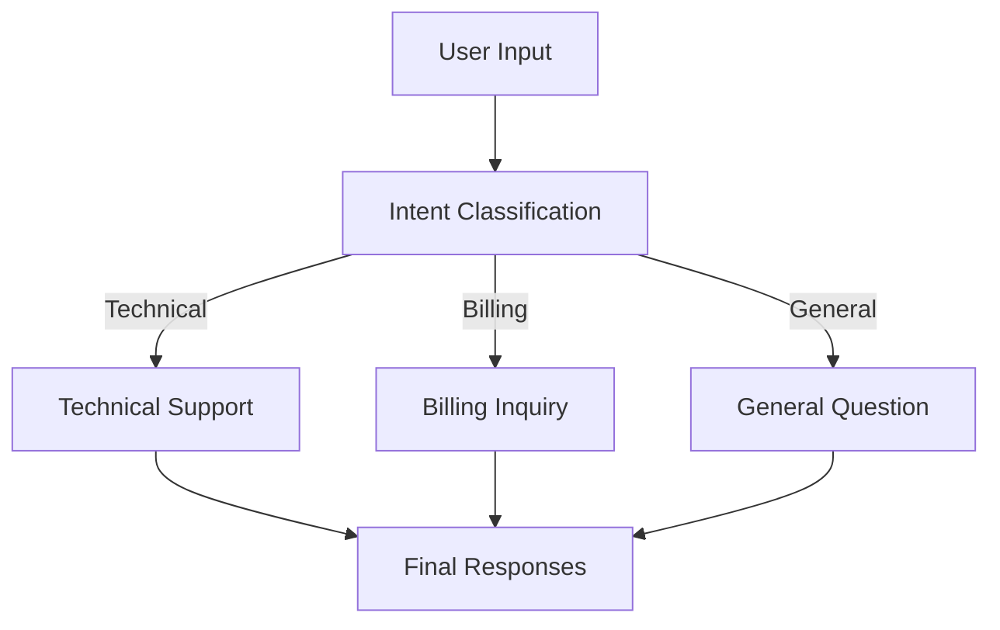
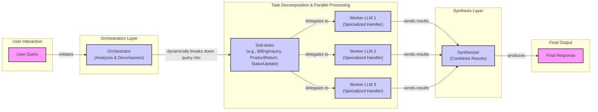

# Basic Workflow Ingredients: Implementing Chaining, Routing, Parallelization, and the Orchestrator-Worker Pattern

In our previous lessons, we built a solid foundation in AI Engineering. We mapped the agent landscape, distinguished between structured workflows and autonomous agents, and explored context engineering and structured outputs. Now, we will dive into the fundamental patterns that bring these concepts to life. We are moving from single, isolated LLM calls to building multi-step, intelligent systems.

This lesson is about the basic ingredients for cooking up robust LLM applications: prompt chaining, parallelization, routing, and the orchestrator-worker pattern. We will explain why breaking down a complex problem into smaller, manageable steps is almost always a better strategy than asking an LLM to do everything at once. Through practical examples using Google Gemini, you will learn to build a sequential FAQ generation pipeline, a dynamic customer support router, and a sophisticated orchestrator that delegates tasks to specialized workers.

## The Challenge with Complex Single LLM Calls

A common mistake when starting with LLMs is to cram too many instructions into a single, monolithic prompt. The thinking goes, "The model is powerful, so I'll just tell it everything I want, all at once." This approach might work for simple demos, but it quickly falls apart in production. Complex, multi-step tasks assigned in a single call often lead to unreliable and inconsistent outputs.

Why does this happen? First, when a monolithic prompt fails, it is difficult to debug. You get a flawed output, but you have no visibility into which part of the instruction the model misunderstood. Second, this approach lacks modularity. If you need to update one part of the logic, you have to rewrite and re-test the entire prompt, which is inefficient and error-prone.

Furthermore, long and complex prompts are more susceptible to the "lost-in-the-middle" problem [[2]](#-2). LLMs tend to pay more attention to the beginning and end of their context window, often ignoring crucial details buried in the middle. Finally, trying to do too much in one go can lead to higher token consumption and less predictable results, as the model struggles to juggle multiple constraints simultaneously [[1]](#-1).

Let's see this in action. We will start by setting up our environment to use the Google Gemini API.

1.  First, we import the necessary libraries and initialize the Gemini client. We will use `gemini-2.5-flash`, a model that is both fast and cost-effective, making it great for these kinds of tasks.
    ```python
    import asyncio
    from enum import Enum
    import random
    import time
    
    from pydantic import BaseModel, Field
    from google import genai
    from google.genai import types
    
    from lessons.utils import env
    
    env.load(required_env_vars=["GOOGLE_API_KEY"])
    
    client = genai.Client()
    
    MODEL_ID = "gemini-2.5-flash"
    ```
    It outputs:
    ```text
    Trying to load environment variables from /path/to/your/project/.env
    Environment variables loaded successfully.
    Both GOOGLE_API_KEY and GEMINI_API_KEY are set. Using GOOGLE_API_KEY.
    ```

2.  Next, we will use three mock webpages about renewable energy as our source content.
    ```python
    webpage_1 = {
        "title": "The Benefits of Solar Energy",
        "content": "...",
    }
    
    webpage_2 = {
        "title": "Understanding Wind Turbines",
        "content": "...",
    }
    
    webpage_3 = {
        "title": "Energy Storage Solutions",
        "content": "...",
    }
    
    all_sources = [webpage_1, webpage_2, webpage_3]
    
    # We'll combine the content for the LLM to process
    combined_content = "\n\n".join(
        [f"Source Title: {source['title']}\nContent: {source['content']}" for source in all_sources]
    )
    ```

3.  Now, we will create a complex prompt that asks the LLM to generate questions, find answers, and cite sources all in one go. We will also define Pydantic models to structure the output.
    ```python
    # This prompt tries to do everything at once: generate questions, find answers,
    # and cite sources. This complexity can often confuse the model.
    n_questions = 10
    prompt_complex = f"""
    Based on the provided content from three webpages, generate a list of exactly {n_questions} frequently asked questions (FAQs).
    For each question, provide a concise answer derived ONLY from the text.
    After each answer, you MUST include a list of the 'Source Title's that were used to formulate that answer.
    
    <provided_content>
    {combined_content}
    </provided_content>
    """.strip()
    
    # Pydantic classes for structured outputs
    class FAQ(BaseModel):
        """A FAQ is a question and answer pair, with a list of sources used to answer the question."""
        question: str = Field(description="The question to be answered")
        answer: str = Field(description="The answer to the question")
        sources: list[str] = Field(description="The sources used to answer the question")
    
    class FAQList(BaseModel):
        """A list of FAQs"""
        faqs: list[FAQ] = Field(description="A list of FAQs")
    
    # Generate FAQs
    config = types.GenerateContentConfig(
        response_mime_type="application/json",
        response_schema=FAQList
    )
    response_complex = client.models.generate_content(
        model=MODEL_ID,
        contents=prompt_complex,
        config=config
    )
    result_complex = response_complex.parsed
    ```
    It outputs:
    ```text
    {
      "question": "What is solar energy and how does it work?",
      "answer": "Solar energy is a renewable powerhouse that converts sunlight into electricity through photovoltaic (PV) panels.",
      "sources": [
        "The Benefits of Solar Energy"
      ]
    }
    ...
    {
      "question": "Why is energy storage crucial for renewable energy sources like solar and wind?",
      "answer": "Effective energy storage is key to unlocking the full potential of renewable sources because it allows storing excess energy when plentiful and releasing it when needed, which is crucial for a stable power grid.",
      "sources": [
        "Energy Storage Solutions",
        "Understanding Wind Turbines"
      ]
    }
    ```

While this output looks reasonable, the approach is brittle. For more complex instructions, the model might start missing details, like failing to cite all relevant sources for an answer that draws from multiple documents. The more you ask for in a single prompt, the higher the chance of error. This is where modularity becomes a powerful ally.

## The Power of Modularity: Why Chain LLM Calls?

Instead of a single, complex prompt, we can break down the task into a series of smaller, simpler steps. This is the core idea behind prompt chaining: connecting multiple LLM calls sequentially, where the output of one step becomes the input for the next [[16]](#-16), [[17]](#-17). It is a classic divide-and-conquer strategy applied to AI engineering.

This modular approach offers several advantages [[18]](#-18), [[19]](#-19). First, it improves accuracy. Simpler, more focused prompts are less ambiguous and lead to more reliable outputs from the LLM. Each call has a single responsibility, reducing the cognitive load on the model.

Second, it makes your system easier to debug. When a chained workflow fails, you can inspect the output of each step to pinpoint exactly where things went wrong. This is far more effective than trying to diagnose a failure from a single, opaque output.

Third, it enhances flexibility. You can swap, update, or optimize individual components of the chain without affecting the others. For example, you could use a fast, cost-effective model like Gemini Flash for a simple classification step and a more powerful model like Gemini Pro for a complex generation step.

However, chaining is not without its trade-offs. It can increase latency, as you are making multiple sequential API calls, and also be more expensive due to the increased token count across multiple prompts. Simple linear chains can also be brittle, as an error in one step can propagate and derail the entire sequence [[38]](#-38). Furthermore, there is a risk of information loss between steps; for instance, if an early summarization step is too aggressive, critical details might be lost before they reach a later translation step [[22]](#-22). Poorly designed decomposition can also introduce unnecessary complexity and overhead, or even lose important context that was only apparent when the instructions were kept together [[67]](#-67). Despite these challenges, the gains in reliability and maintainability often make chaining the superior choice for production systems.

## Building a Sequential Workflow: FAQ Generation Pipeline

Let's refactor our FAQ generation task into a three-step sequential workflow:
1.  **Generate Questions:** The first LLM call will generate a list of questions based on the source content.
2.  **Answer Questions:** For each question, a second LLM call will generate a concise answer.
3.  **Find Sources:** For each question-and-answer pair, a third LLM call will identify the source documents used.

Image 1: A Mermaid flowchart illustrating the sequential FAQ generation pipeline.
```mermaid
flowchart LR
  "Input Content" --> "Generate Questions"
  "Generate Questions" --> "Answer Questions"
  "Answer Questions" --> "Find Sources"
```

This approach breaks the problem down into manageable parts, making the process more robust and easier to debug.

1.  First, we create a function to generate a list of questions. This prompt has a single, clear goal.
    ```python
    class QuestionList(BaseModel):
        """A list of questions"""
        questions: list[str] = Field(description="A list of questions")
    
    prompt_generate_questions = """
    Based on the content below, generate a list of {n_questions} relevant and distinct questions that a user might have.
    
    <provided_content>
    {combined_content}
    </provided_content>
    """.strip()
    
    def generate_questions(content: str, n_questions: int = 10) -> list[str]:
        """
        Generate a list of questions based on the provided content.
        """
        config = types.GenerateContentConfig(
            response_mime_type="application/json",
            response_schema=QuestionList
        )
        response_questions = client.models.generate_content(
            model=MODEL_ID,
            contents=prompt_generate_questions.format(n_questions=n_questions, combined_content=content),
            config=config
        )
    
        return response_questions.parsed.questions
    
    # Test the function
    questions = generate_questions(combined_content, n_questions=10)
    ```
    It outputs:
    ```text
    What are the primary environmental and economic benefits of solar energy?
    How do homeowners financially benefit from installing solar panels?
    ...
    ```

2.  Next, we define a function to answer a single question using the provided content.
    ```python
    prompt_answer_question = """
    Using ONLY the provided content below, answer the following question.
    The answer should be concise and directly address the question.
    
    <question>
    {question}
    </question>
    
    <provided_content>
    {combined_content}
    </provided_content>
    """.strip()
    
    def answer_question(question: str, content: str) -> str:
        """
        Generate an answer for a specific question using only the provided content.
        """
        answer_response = client.models.generate_content(
            model=MODEL_ID,
            contents=prompt_answer_question.format(question=question, combined_content=content),
        )
        return answer_response.text
    
    # Test the function
    test_question = questions[0]
    test_answer = answer_question(test_question, combined_content)
    ```
    It outputs:
    ```text
    The primary environmental benefit of solar energy is cutting down greenhouse gas emissions by reducing reliance on fossil fuels. Economically, it allows homeowners to significantly lower their monthly electricity bills and potentially sell excess power back to the grid.
    ```

3.  Finally, we create a function that identifies which source titles were used to generate a given answer.
    ```python
    class SourceList(BaseModel):
        """A list of source titles that were used to answer the question"""
        sources: list[str] = Field(description="A list of source titles that were used to answer the question")
    
    prompt_find_sources = """
    You will be given a question and an answer that was generated from a set of documents.
    Your task is to identify which of the original documents were used to create the answer.
    
    <question>
    {question}
    </question>
    
    <answer>
    {answer}
    </answer>
    
    <provided_content>
    {combined_content}
    </provided_content>
    """.strip()
    
    def find_sources(question: str, answer: str, content: str) -> list[str]:
        """
        Identify which sources were used to generate an answer.
        """
        config = types.GenerateContentConfig(
            response_mime_type="application/json",
            response_schema=SourceList
        )
        sources_response = client.models.generate_content(
            model=MODEL_ID,
            contents=prompt_find_sources.format(question=question, answer=answer, combined_content=content),
            config=config
        )
        return sources_response.parsed.sources
    
    # Test the function
    test_sources = find_sources(test_question, test_answer, combined_content)
    ```
    It outputs:
    ```text
    The Benefits of Solar Energy
    ```

4.  Now, we combine these functions into a sequential workflow. We iterate through each generated question, answering it and finding its sources one by one.
    ```python
    def sequential_workflow(content, n_questions=10) -> list[FAQ]:
        """
        Execute the complete sequential workflow for FAQ generation.
        """
        # Generate questions
        questions = generate_questions(content, n_questions)
    
        # Answer and find sources for each question sequentially
        final_faqs = []
        for question in questions:
            # Generate an answer for the current question
            answer = answer_question(question, content)
    
            # Identify the sources for the generated answer
            sources = find_sources(question, answer, content)
    
            faq = FAQ(
                question=question,
                answer=answer,
                sources=sources
            )
            final_faqs.append(faq)
    
        return final_faqs
    
    # Execute the sequential workflow
    start_time = time.monotonic()
    sequential_faqs = sequential_workflow(combined_content, n_questions=4)
    end_time = time.monotonic()
    print(f"Sequential processing completed in {end_time - start_time:.2f} seconds")
    ```
    It outputs:
    ```text
    Sequential processing completed in 22.20 seconds
    
    {
      "question": "What are the primary financial benefits of installing solar panels for homeowners, and are there any initial costs to consider?",
      "answer": "The primary financial benefits of installing solar panels for homeowners are significantly lowered monthly electricity bills and, in some cases, the ability to sell excess power back to the grid. The initial installation cost can be high.",
      "sources": [
        "The Benefits of Solar Energy"
      ]
    }
    ...
    ```
This sequential workflow is more reliable and transparent than our initial monolithic prompt. However, processing four questions took over 20 seconds. Since the processing for each question is independent of the others, we can do better.

## Optimizing Sequential Workflows With Parallel Processing

While the sequential workflow improves reliability, it can be slow. Each step must wait for the previous one to complete, and we process each question one after the other. We can significantly speed things up by running independent tasks in parallel [[18]](#-18). In our FAQ example, the process of answering and finding sources for one question does not depend on the results for another. This makes it a perfect candidate for parallelization.

We will use Python’s `asyncio` library to handle concurrent LLM calls. This allows us to send multiple requests to the Gemini API at the same time and wait for them all to complete, drastically reducing the total processing time.

💡 A word of caution: when running many calls in parallel, you can easily hit the API's rate limits, especially with free-tier accounts. Production systems need robust error handling, such as exponential backoff with jitter, to manage rate-limiting errors gracefully [[9]](#-9). Beyond rate limits, parallel execution introduces more complex failure modes. Issues with synchronization, event ordering, and state management can arise, especially in frameworks that manage resumable workflows. For example, some SDKs might struggle to match responses to requests when multiple identical function calls are made in parallel, leading to API rejections [[68]](#-68).

1.  First, we create asynchronous versions of our `answer_question` and `find_sources` functions. Notice the `async def` syntax and the use of `await` for the API call.
    ```python
    async def answer_question_async(question: str, content: str) -> str:
        """
        Async version of answer_question function.
        """
        prompt = prompt_answer_question.format(question=question, combined_content=content)
        response = await client.aio.models.generate_content(
            model=MODEL_ID,
            contents=prompt
        )
        return response.text
    
    async def find_sources_async(question: str, answer: str, content: str) -> list[str]:
        """
        Async version of find_sources function.
        """
        prompt = prompt_find_sources.format(question=question, answer=answer, combined_content=content)
        config = types.GenerateContentConfig(
            response_mime_type="application/json",
            response_schema=SourceList
        )
        response = await client.aio.models.generate_content(
            model=MODEL_ID,
            contents=prompt,
            config=config
        )
        return response.parsed.sources
    ```

2.  Next, we define a function to process a single question in parallel. It generates the answer and finds the sources concurrently, although in this implementation, finding sources depends on the answer, so it runs sequentially within this small task. The main parallelization happens across different questions.
    ```python
    async def process_question_parallel(question: str, content: str) -> FAQ:
        """
        Process a single question by generating answer and finding sources in parallel.
        """
        answer = await answer_question_async(question, content)
        sources = await find_sources_async(question, answer, content)
        return FAQ(
            question=question,
            answer=answer,
            sources=sources
        )
    ```

3.  Finally, we create our parallel workflow. It first generates the questions synchronously, then uses `asyncio.gather` to execute the `process_question_parallel` function for all questions concurrently.
    ```python
    async def parallel_workflow(content: str, n_questions: int = 10) -> list[FAQ]:
        """
        Execute the complete parallel workflow for FAQ generation.
        """
        # Generate questions (this step remains synchronous)
        questions = generate_questions(content, n_questions)
    
        # Process all questions in parallel
        tasks = [process_question_parallel(question, content) for question in questions]
        parallel_faqs = await asyncio.gather(*tasks)
    
        return parallel_faqs
    
    # Execute the parallel workflow
    start_time = time.monotonic()
    parallel_faqs = await parallel_workflow(combined_content, n_questions=4)
    end_time = time.monotonic()
    print(f"Parallel processing completed in {end_time - start_time:.2f} seconds")
    ```
    It outputs:
    ```text
    Parallel processing completed in 8.98 seconds
    
    {
      "question": "What are the primary environmental and economic benefits of using solar energy?",
      "answer": "The primary environmental benefit of solar energy is cutting down greenhouse gas emissions by reducing reliance on fossil fuels.\n\nThe primary economic benefits include significantly lower monthly electricity bills, the ability to sell excess power back to the grid, long-term savings, and contributing to energy independence for nations.",
      "sources": [
        "The Benefits of Solar Energy"
      ]
    }
    ...
    ```
By running the tasks in parallel, we reduced the execution time from 22.20 seconds to just 8.98 seconds—a significant improvement. While sequential processing offers predictability and easier debugging, parallelization provides a powerful way to optimize for speed and resource utilization when tasks are independent [[46]](#-46). These patterns are not new; they draw from decades of research in distributed computing. Concepts like the actor model, which treats concurrent processes as independent "actors" that communicate via messages, provide a solid theoretical foundation for building scalable and fault-tolerant LLM workflows [[69]](#-69).

## Introducing Dynamic Behavior: Routing and Conditional Logic

So far, our workflows have been linear or predictably parallel. But what if the path of execution needs to change based on the input? This is where routing comes in. Routing, or conditional logic, allows you to dynamically direct a workflow down different paths based on the input or an intermediate state [[18]](#-18).

This is another application of the "divide-and-conquer" principle. Instead of creating a single, complex prompt that tries to handle every possible scenario, you create specialized prompts for different cases and use a classifier to route the input to the appropriate one. For example, a customer support system could classify an incoming query as "Technical Support," "Billing Inquiry," or "General Question" and then pass it to a handler specifically designed for that intent.

An LLM itself can serve as the classifier, making the routing decision based on its understanding of the input. This creates a branching workflow that is both intelligent and adaptable, allowing you to build more sophisticated and context-aware systems. From a system design perspective, this pattern draws on established principles like Command Query Responsibility Segregation (CQRS), where different paths are optimized for different types of operations [[69]](#-69). Building a reliable router also requires a focus on evaluation. In production, you would need to measure the "decision quality" of your classifier to ensure that queries are consistently sent down the correct path, as a misrouted task can lead to a poor output even if all the specialized handlers are working perfectly [[70]](#-70).

## Building a Basic Routing Workflow

Let's build a simple routing system for a customer service chatbot. The system will first classify the user's intent and then route the query to a specialized handler.

Image 2: A Mermaid flowchart illustrating a routing workflow for customer service intent classification.


This pattern ensures that each type of query receives a tailored and appropriate response.

1.  First, we define the possible intents using a Pydantic model and create a classification function. This function asks the LLM to categorize a user query into one of three intents: `TECHNICAL_SUPPORT`, `BILLING_INQUIRY`, or `GENERAL_QUESTION`.
    ```python
    class IntentEnum(str, Enum):
        """
        Defines the allowed values for the 'intent' field.
        """
        TECHNICAL_SUPPORT = "Technical Support"
        BILLING_INQUIRY = "Billing Inquiry"
        GENERAL_QUESTION = "General Question"
    
    class UserIntent(BaseModel):
        """
        Defines the expected response schema for the intent classification.
        """
        intent: IntentEnum = Field(description="The intent of the user's query")
    
    prompt_classification = """
    Classify the user's query into one of the following categories.
    
    <categories>
    {categories}
    </categories>
    
    <user_query>
    {user_query}
    </user_query>
    """.strip()
    
    
    def classify_intent(user_query: str) -> IntentEnum:
        """Uses an LLM to classify a user query."""
        prompt = prompt_classification.format(
            user_query=user_query,
            categories=[intent.value for intent in IntentEnum]
        )
        config = types.GenerateContentConfig(
            response_mime_type="application/json",
            response_schema=UserIntent
        )
        response = client.models.generate_content(
            model=MODEL_ID,
            contents=prompt,
            config=config
        )
        return response.parsed.intent
    
    
    query_1 = "My internet connection is not working."
    query_2 = "I think there is a mistake on my last invoice."
    query_3 = "What are your opening hours?"
    
    intent_1 = classify_intent(query_1)
    intent_2 = classify_intent(query_2)
    intent_3 = classify_intent(query_3)
    ```
    It outputs:
    ```text
    Intent 1: IntentEnum.TECHNICAL_SUPPORT
    Intent 2: IntentEnum.BILLING_INQUIRY
    Intent 3: IntentEnum.GENERAL_QUESTION
    ```

2.  Next, we define specialized prompts for each intent. Each prompt gives the LLM a specific persona and instructions for how to respond.
    ```python
    prompt_technical_support = """
    You are a helpful technical support agent.
    
    Here's the user's query:
    <user_query>
    {user_query}
    </user_query>
    
    Provide a helpful first response, asking for more details like what troubleshooting steps they have already tried.
    """.strip()
    
    prompt_billing_inquiry = """
    You are a helpful billing support agent.
    
    Here's the user's query:
    <user_query>
    {user_query}
    </user_query>
    
    Acknowledge their concern and inform them that you will need to look up their account, asking for their account number.
    """.strip()
    
    prompt_general_question = """
    You are a general assistant.
    
    Here's the user's query:
    <user_query>
    {user_query}
    </user_query>
    
    Apologize that you are not sure how to help.
    """.strip()
    ```

3.  Finally, we create a `handle_query` function that acts as our router. It takes the user's query and the classified intent, and then calls the appropriate prompt handler.
    ```python
    def handle_query(user_query: str, intent: str) -> str:
        """Routes a query to the correct handler based on its classified intent."""
        if intent == IntentEnum.TECHNICAL_SUPPORT:
            prompt = prompt_technical_support.format(user_query=user_query)
        elif intent == IntentEnum.BILLING_INQUIRY:
            prompt = prompt_billing_inquiry.format(user_query=user_query)
        elif intent == IntentEnum.GENERAL_QUESTION:
            prompt = prompt_general_question.format(user_query=user_query)
        else:
            prompt = prompt_general_question.format(user_query=user_query)
        response = client.models.generate_content(
            model=MODEL_ID,
            contents=prompt
        )
        return response.text
    
    
    response_1 = handle_query(query_1, intent_1)
    response_2 = handle_query(query_2, intent_2)
    response_3 = handle_query(query_3, intent_3)
    ```
    The response for the technical query is:
    ```text
    Hello there! I'm sorry to hear you're having trouble with your internet connection. That can definitely be frustrating.
    
    To help me understand what's going on and assist you best, could you please provide a few more details?
    ...
    ```
    And for the billing query:
    ```text
    I'm sorry to hear you think there might be a mistake on your last invoice. I can definitely help you look into that!
    
    To access your account and investigate the charges, could you please provide your account number?
    ```
This routing pattern allows us to build a more organized and effective system where each component has a clear, single responsibility.

## Orchestrator-Worker Pattern: Dynamic Task Decomposition

The final pattern we will explore is the orchestrator-worker pattern. This is a more advanced workflow where a central "orchestrator" LLM dynamically breaks down a complex task into smaller, distinct subtasks. It then delegates these subtasks to specialized "worker" components, which can be other LLM calls or external tools. Finally, a "synthesizer" combines the results from the workers into a single, coherent response [[18]](#-18), [[32]](#-32).

This pattern is extremely powerful for handling unpredictable, multifaceted queries where the necessary steps are not known in advance. The key difference from simple parallelization is its flexibility; the orchestrator determines the subtasks at runtime based on the specific input, rather than following a predefined plan [[19]](#-19).

However, this flexibility comes with trade-offs. The N+1 LLM calls (one for the orchestrator, N for the workers) increase both latency and cost. Therefore, this pattern is not suitable for simple tasks or when the subtasks are always predictable; in those cases, simpler parallelization is more efficient. Common failure modes include the orchestrator generating a poor or irrelevant task breakdown, or workers failing to return useful content. A common optimization strategy is to use a highly capable model (like Gemini Pro) for the orchestrator and faster, cheaper models (like Gemini Flash) for the more narrowly-defined worker tasks [[17]](#-17), [[18]](#-18).

Image 3: A Mermaid flowchart illustrating the orchestrator-worker pattern, showing the flow from a user query through orchestration, parallel task processing by specialized worker LLMs, synthesis, and finally to a combined response.


Let's build a customer service system that can handle a query involving a billing issue, a product return, and an order status update—all at once.

1.  First, we define the orchestrator. Its job is to parse a complex query and break it down into a list of structured tasks. We use Pydantic models to define the task schemas.
    ```python
    class QueryTypeEnum(str, Enum):
        """The type of query to be handled."""
        BILLING_INQUIRY = "BillingInquiry"
        PRODUCT_RETURN = "ProductReturn"
        STATUS_UPDATE = "StatusUpdate"
    
    class Task(BaseModel):
        """A task to be performed."""
        query_type: QueryTypeEnum = Field(description="The type of query to be handled.")
        invoice_number: str | None = Field(description="The invoice number to be used for the billing inquiry.", default=None)
        product_name: str | None = Field(description="The name of the product to be returned.", default=None)
        reason_for_return: str | None = Field(description="The reason for returning the product.", default=None)
        order_id: str | None = Field(description="The order ID to be used for the status update.", default=None)
    
    class TaskList(BaseModel):
        """A list of tasks to be performed."""
        tasks: list[Task] = Field(description="A list of tasks to be performed.")
    
    prompt_orchestrator = f"""
    You are a master orchestrator. Your job is to break down a complex user query into a list of sub-tasks.
    Each sub-task must have a "query_type" and its necessary parameters.
    
    The possible "query_type" values and their required parameters are:
    1. "{QueryTypeEnum.BILLING_INQUIRY.value}": Requires "invoice_number".
    2. "{QueryTypeEnum.PRODUCT_RETURN.value}": Requires "product_name" and "reason_for_return".
    3. "{QueryTypeEnum.STATUS_UPDATE.value}": Requires "order_id".
    
    Here's the user's query.
    
    <user_query>
    {{query}}
    </user_query>
    """.strip()
    
    
    def orchestrator(query: str) -> list[Task]:
        """Breaks down a complex query into a list of tasks."""
        prompt = prompt_orchestrator.format(query=query)
        config = types.GenerateContentConfig(
            response_mime_type="application/json",
            response_schema=TaskList
        )
        response = client.models.generate_content(
            model=MODEL_ID,
            contents=prompt,
            config=config
        )
        return response.parsed.tasks
    ```

2.  Next, we implement our specialized workers. Each worker handles one type of task. For this example, they will simulate backend actions and return structured data.
    ```python
    # Billing worker (handle_billing_worker)
    def handle_billing_worker(invoice_number: str, original_user_query: str) -> BillingTask:
        # ... implementation ...
    
    # Product return worker (handle_return_worker)
    def handle_return_worker(product_name: str, reason_for_return: str) -> ReturnTask:
        # ... implementation ...
    
    # Order status worker (handle_status_worker)
    def handle_status_worker(order_id: str) -> StatusTask:
        # ... implementation ...
    ```

3.  We then create a synthesizer. This component takes the structured outputs from all the workers and uses an LLM to compose a single, user-friendly response.
    ```python
    prompt_synthesizer = """
    You are a master communicator. Combine several distinct pieces of information from our support team into a single, well-formatted, and friendly email to a customer.
    
    Here are the points to include, based on the actions taken for their query:
    <points>
    {formatted_results}
    </points>
    
    Combine these points into one cohesive response.
    Start with a friendly greeting (e.g., "Dear Customer," or "Hi there,") and end with a polite closing (e.g., "Sincerely," or "Best regards,").
    Ensure the tone is helpful and professional.
    """.strip()
    
    
    def synthesizer(results: list[Task]) -> str:
        """Combines structured results from workers into a single user-facing message."""
        # ... implementation to format results and call the LLM ...
    ```

4.  Finally, we tie everything together in a main pipeline function and test it with a complex query.
    ```python
    def process_user_query(user_query):
        """Processes a query using the Orchestrator-Worker-Synthesizer pattern."""
    
        # 1. Run orchestrator
        tasks_list = orchestrator(user_query)
        
        # 2. Run workers
        worker_results = []
        if tasks_list:
            for task in tasks_list:
                if task.query_type == QueryTypeEnum.BILLING_INQUIRY:
                    worker_results.append(handle_billing_worker(task.invoice_number, user_query))
                # ... other workers ...
    
        # 3. Run synthesizer
        if worker_results:
            final_user_message = synthesizer(worker_results)
            # ... print final message ...
    
    # Test with a complex query
    complex_customer_query = """
    Hi, I'm writing to you because I have a question about invoice #INV-7890. It seems higher than I expected.
    Also, I would like to return the 'SuperWidget 5000' I bought because it's not compatible with my system.
    Finally, can you give me an update on my order #A-12345?
    """.strip()
    
    process_user_query(complex_customer_query)
    ```
    The orchestrator first deconstructs the query into three distinct tasks:
    ```text
    Deconstructed task 1:
    {
      "query_type": "BillingInquiry",
      "invoice_number": "INV-7890",
      ...
    }
    Deconstructed task 2:
    {
      "query_type": "ProductReturn",
      "product_name": "SuperWidget 5000",
      ...
    }
    Deconstructed task 3:
    {
      "query_type": "StatusUpdate",
      "order_id": "A-12345",
      ...
    }
    ```
    Each worker processes its assigned task, and the synthesizer combines their outputs into a single, helpful email:
    ```text
    Final synthesized response:
    
    Dear Customer,
    
    Thank you for reaching out. Here is an update on your requests:
    
    Regarding your BillingInquiry:
      - Invoice Number: INV-7890
      - Your Stated Concern: "It seems higher than I expected."
      - Our Action: An investigation (Case ID: INV_CASE_...) has been opened regarding your concern.
      - Expected Resolution: We will get back to you within 2 business days.
    
    Regarding your ProductReturn:
      - Product: SuperWidget 5000
      - Reason for Return: "it's not compatible with my system"
      - Return Authorization (RMA): RMA-...
      - Instructions: Please pack the 'SuperWidget 5000' securely...
    
    Regarding your StatusUpdate:
      - Order ID: A-12345
      - Current Status: Shipped
      - Carrier: SuperFast Shipping
      - Tracking Number: SF...
      - Delivery Estimate: Tomorrow
    
    If you have any other questions, please let us know.
    
    Best regards,
    The Support Team
    ```
This pattern demonstrates how to build a system that is both powerful and flexible, capable of handling complex and unpredictable user needs in a structured and reliable way. To take this further, you could implement a self-correction loop, where the orchestrator reviews the worker outputs and retries or revises the plan if the results are unsatisfactory—a pattern known as Reflexion [[17]](#-17). In a production setting, you would also need to implement robust evaluation to measure task success and factual accuracy [[70]](#-70). The orchestrator-worker pattern is not just for chatbots; it is being adapted for real-time control systems in industrial automation and robotics, where a manager LLM decomposes high-level goals for specialized operator LLMs that control physical modules [[71]](#-71), [[72]](#-72).

## References

- [1] [Lost in the Middle: How Language Models Use Long Contexts](https://dev.to/thousand_miles_ai/the-lost-in-the-middle-problem-why-llms-ignore-the-middle-of-your-context-window-3al2)
- [2] [Unpacking the bias of large language models MIT](https://dev.to/thousand_miles_ai/the-lost-in-the-middle-problem-why-llms-ignore-the-middle-of-your-context-window-3al2)
- [3] [Found in the Middle calibration](https://dev.to/thousand_miles_ai/the-lost-in-the-middle-problem-why-llms-ignore-the-middle-of-your-context-window-3al2)
- [4] [Multi-scale Positional Encoding (Ms-PoE)](https://dev.to/thousand_miles_ai/the-lost-in-the-middle-problem-why-llms-ignore-the-middle-of-your-context-window-3al2)
- [5] [Comparative Analysis of Prompt Strategies for Large Language Models: Single-Task vs. Multitask Prompts](https://www.mdpi.com/2079-9292/13/23/4712)
- [6] [FLARE framework analysis of GPT-4 Turbo](https://aclanthology.org/2025.ommm-1.4.pdf)
- [7] [ZeMPE benchmark for multi-problem prompts](https://aclanthology.org/2025.gem-1.14.pdf)
- [8] [Underspecification analysis of complex prompts](https://arxiv.org/html/2505.13360v1)
- [9] [LLM API Resilience in Production](https://tianpan.co/blog/2026-03-11-llm-api-resilience-production)
- [10] [LLM-Based Prompt Routing](https://www.emergentmind.com/topics/llm-based-prompt-routing)
- [11] [How to Build Intent Detection for Your Chatbot](https://www.vellum.ai/blog/how-to-build-intent-detection-for-your-chatbot)
- [12] [Top 5 LLM Routing Techniques](https://www.getmaxim.ai/articles/top-5-llm-routing-techniques/)
- [13] [Universal Model Routing for dynamic LLM pools](https://arxiv.org/html/2502.08773v1)
- [14] [Multi-LLM Routing Strategies on AWS](https://aws.amazon.com/blogs/machine-learning/multi-llm-routing-strategies-for-generative-ai-applications-on-aws/)
- [15] [Orchestrator-Worker pattern for dynamic task decomposition](https://agents.kour.me/orchestrator-worker/)
- [16] [DIY #17 Orchestrator-Worker LLM Agent](https://mlpills.substack.com/p/diy-17-orchestrator-worker-llm-agent)
- [17] [Building Self-Healing AI with Orchestrator-Reflexion Patterns](https://online.stevens.edu/blog/building-self-healing-ai-orchestrator-reflexion-patterns/)
- [18] [Patterns for Agents: Orchestrator-Workers](https://platform.claude.com/cookbook/patterns-agents-orchestrator-workers)
- [19] [LLMOps in Production: Case Studies](https://www.zenml.io/blog/llmops-in-production-457-case-studies-of-what-actually-works)
- [20] [LLMOps in Production: More Case Studies](https://www.zenml.io/blog/llmops-in-production-287-more-case-studies-of-what-actually-works)
- [21] [How Tool Chaining Fails in Production](https://futureagi.substack.com/p/how-tool-chaining-fails-in-production)
- [22] [ChainRAG: A Progressive Retrieval Framework](https://aclanthology.org/2025.acl-long.1089.pdf)
- [23] [Context Engineering Strategies to Prevent Context Rot](https://milvus.io/blog/keeping-ai-agents-grounded-context-engineering-strategies-that-prevent-context-rot-using-milvus.md)
- [24] [Context Isolation Through Subagent Architectures](https://www.morphllm.com/context-rot)
- [25] [Concurrency Patterns in Python with Asyncio](https://santhalakshminarayana.github.io/blog/concurrency-patterns-python)
- [26] [Python Concurrency Showdown: Asyncio vs. Threading vs. Multiprocessing](https://medium.com/@sizanmahmud08/python-concurrency-showdown-asyncio-vs-threading-vs-multiprocessing-which-should-you-choose-in-31205161899a)
- [27] [Python Concurrency and Parallelism](https://testdriven.io/blog/python-concurrency-parallelism/)
- [28] [Concurrency and Parallelism in Python](https://dev.to/nkpydev/concurrency-and-parallelism-in-python-threads-multiprocessing-and-async-programming-64d)
- [29] [Concurrency in Async/Await and Threading](https://blog.jetbrains.com/pycharm/2025/06/concurrency-in-async-await-and-threading/)
- [30] [Synthesizing Results in Orchestrator-Worker Pattern](https://platform.claude.com/cookbook/patterns-agents-orchestrator-workers)
- [31] [Synthesizing Results in Orchestrator-Worker LLM Agent](https://mlpills.substack.com/p/diy-17-orchestrator-worker-llm-agent)
- [32] [LLM Orchestration Frameworks for Customer Service](https://masterofcode.com/blog/llm-orchestration)
- [33] [Advanced Customer Support with Multi-Agent Workflow](https://www.socure.com/tech-blog/build-advanced-customer-support-llm-multi-agent-workflow)
- [34] [AI Agent Orchestration Patterns](https://productschool.com/blog/artificial-intelligence/ai-agent-orchestration-patterns)
- [35] [Stop Building AI Agents, Use These 3 Patterns Instead](https://www.decodingai.com/p/stop-building-ai-agents-use-these)
- [36] [AI Orchestration Platform](https://fayedigital.com/blog/ai-orchestration-platform/)
- [37] [Choosing the Right Orchestration Pattern for Multi-Agent Systems](https://www.kore.ai/blog/choosing-the-right-orchestration-pattern-for-multi-agent-systems)
- [38] [Building Self-Healing AI with Orchestrator-Reflexion Patterns](https://online.stevens.edu/blog/building-self-healing-ai-orchestrator-reflexion-patterns/)
- [39] [Five Proven Prompt Engineering Techniques](https://www.lennysnewsletter.com/p/five-proven-prompt-engineering-techniques)
- [40] [A Practical Guide to Prompt Engineering Techniques](https://medium.com/@fabiolalli/a-practical-guide-to-prompt-engineering-techniques-and-their-use-cases-5f8574e2cd9a)
- [41] [10 Prompt Engineering Techniques](https://www.scrum.org/resources/blog/10-prompt-engineering-techniques-super-simple-explanation)
- [42] [Decomposing Complex Tasks with Prompting](https://nmu.libguides.com/c.php?g=1474877&p=10982145)
- [43] [Prompt Engineering Techniques](https://www.k2view.com/blog/prompt-engineering-techniques/)
- [44] [Orchestrating Multi-Step LLM Chains: Best Practices](https://deepchecks.com/orchestrating-multi-step-llm-chains-best-practices/)
- [45] [LLM Workflow Patterns](https://mlpills.substack.com/p/issue-110-llm-workflow-patterns)
- [46] [Compounding Error Effect in Large Language Models](https://wand.ai/blog/compounding-error-effect-in-large-language-models-a-growing-challenge)
- [47] [SPRINT: Interleaved Planning and Parallel Execution](https://scalingintelligence.stanford.edu/pubs/sprint.pdf)
- [48] [Multi-Agent Patterns in ADK for Google Gemini](https://developers.googleblog.com/developers-guide-to-multi-agent-patterns-in-adk/)
- [49] [Agentic AI Design Patterns](https://www.linkedin.com/posts/chiragsubramanian_agentic-ai-design-patterns-my-practical-activity-7416830806939230208-nRFc)
- [50] [Modular Workflow Patterns for AI Engineers](https://www.decodingai.com/p/stop-building-ai-agents-use-these)
- [51] [Prompt Design for Orchestrator LLMs](https://mlpills.substack.com/p/issue-110-llm-workflow-patterns)
- [52] [Orchestrator-Workers Pattern for Unpredictable Queries](https://platform.claude.com/cookbook/patterns-agents-orchestrator-workers)
- [53] [Orchestrator-Workers for Unpredictable Tasks](https://www.anthropic.com/engineering/building-effective-agents????__hstc=43401018.9b17c4d3051a2af3f924a8d9f62fbbee.1757203200284.1757203200285.1757203200286.1&__hssc=43401018.1.1757203200287&__hsfp=2825657416)
- [54] [AI Prompt Orchestration Techniques and Tools](https://www.scoutos.com/blog/ai-prompt-orchestration-techniques-and-tools-you-need)
- [55] [Teaching AI Engineers with Modular Workflows](https://www.decodingai.com/p/stop-building-ai-agents-use-these)
- [56] [Modular Workflow Patterns for Teaching AI](https://mlpills.substack.com/p/issue-110-llm-workflow-patterns)
- [57] [Design Pattern: Prompt Chaining](https://datalearningscience.com/p/design-pattern-prompt-chaining-building)
- [58] [Prompt Chaining for Building Reliable LLM Apps](https://blog.udemy.com/prompt-chaining/)
- [59] [Agentic Design Pattern: Prompt Chaining](https://agentic-design.ai/patterns/prompt-chaining)
- [60] [Notebook code for the lesson](https://github.com/towardsai/course-ai-agents/blob/dev/lessons/05_workflow_patterns/notebook.ipynb)
- [61] [Prompt Chaining Guide](https://www.promptingguide.ai/techniques/prompt_chaining)
- [62] [Building Effective Agents - Anthropic](https://www.anthropic.com/engineering/building-effective-agents)
- [63] [Claude 4 Best Practices](https://docs.anthropic.com/en/docs/build-with-claude/prompt-engineering/claude-4-best-practices)
- [64] [LangGraph Workflows](https://langchain-ai.github.io/langgraphjs/tutorials/workflows)
- [65] [Basic Multi-LLM Workflows](https://github.com/hugobowne/building-with-ai/blob/main/notebooks/01-agentic-continuum.ipynb)
- [66] [Chain Prompts - Anthropic](https://docs.anthropic.com/en/docs/build-with-claude/prompt-engineering/chain-prompts)
- [67] [How task decomposition and smaller LLMs can make AI more affordable](https://www.amazon.science/blog/how-task-decomposition-and-smaller-llms-can-make-ai-more-affordable)
- [68] [Parallel tool execution fails during resumable agent workflows](https://github.com/ag-ui-protocol/ag-ui/issues/1334)
- [69] [Lessons I've Learned Building Distributed Systems with CQRS and Event Sourcing](https://hackernoon.com/lessons-ive-learned-building-distributed-systems-with-cqrs-and-event-sourcing-ece284ecc1a1)
- [70] [The LLM Evaluation Guide](https://www.braintrust.dev/articles/llm-evaluation-guide)
- [71] [A multi-agent system based on large language models for enhancing industrial automation](https://atpinfo.de/wp-content/uploads/2025/04/xia.pdf)
- [72] [A Hybrid AI/LLM Architecture for Real-Time Decision Support in Industrial Batch Processes](https://www.mdpi.com/2673-2688/7/2/51)