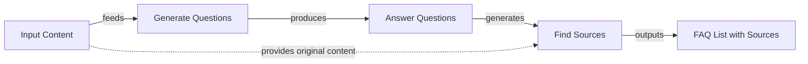
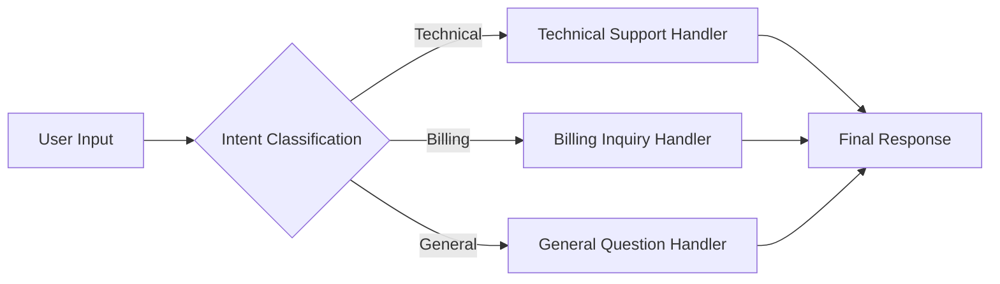
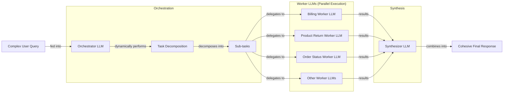

# Basic Workflow Ingredients

In our previous lessons, we built a solid foundation in AI Engineering. We navigated the agent landscape, distinguished between rule-based workflows and autonomous agents, and dived into context engineering and structured outputs. These skills are essential for controlling the information that goes into and comes out of an LLM. Now, we will tackle the core logic that connects multiple LLM calls into a coherent system.

A common mistake when starting is to build a single, massive prompt that tries to do everything at once. We’ve been there. On an early project, we tried to generate a full article—research, outline, draft, and SEO keywords—in one shot. The result was a mess. The output was inconsistent, hard to debug, and failed silently in unpredictable ways. This "monolithic" approach is the AI equivalent of writing an entire application in a single function. It is unreliable and doesn't scale.

Modular workflow patterns provide a solution. Instead of one giant leap, we take a series of smaller, more reliable steps. In this lesson, we will explore the fundamental building blocks for creating robust LLM applications: chaining, parallelization, routing, and the orchestrator-worker pattern. We will show you how to move from complex, error-prone prompts to modular, predictable workflows using practical, hands-on examples with the Google Gemini API.

## The Challenge with Complex Single LLM Calls

Attempting to solve a multi-step problem with a single, complex LLM call is often a recipe for unreliability. While it might seem efficient to pack all instructions into one prompt, this approach introduces several challenges that make systems difficult to build and maintain. When a monolithic prompt fails, it’s hard to know why. The error could be in any of the multiple instructions you provided. Debugging becomes a process of trial and error, tweaking the prompt and hoping for the best. This approach also lacks modularity. If you need to update one part of the logic, you risk breaking everything else.

Furthermore, long and complex prompts are more susceptible to the "lost-in-the-middle" problem. A 2023 study from Stanford, UC Berkeley, and Samaya AI found that LLMs exhibit a U-shaped performance curve, paying the most attention to information at the beginning and end of their context window. Crucial details buried in the middle are often ignored, causing accuracy to drop dramatically [[1]](https://dev.to/thousand_miles_ai/the-lost-in-the-middle-problem-why-llms-ignore-the-middle-of-your-context-window-3al2). This happens because of architectural biases like causal attention masking, where early tokens get more cumulative attention, and positional encoding decay, which weakens the signal from middle tokens.

Complex prompts also increase the likelihood of parsing failures and inconsistent outputs. A study analyzing GPT-4 Turbo found that few-shot prompts with multiple examples caused a 52.9% error rate, primarily due to the model failing to adhere to the specified output format [[2]](https://aclanthology.org/2025.ommm-1.4.pdf). As the number of requirements in a prompt increases, instruction-following accuracy drops. For example, GPT-4o's accuracy can fall from 98.7% with one requirement to 85% with nineteen [[3]](https://arxiv.org/html/2505.13360v1). Finally, these prompts can be token-inefficient, as the model has to process a large set of instructions for every single call.

Let's look at a practical example. We want to generate a Frequently Asked Questions (FAQ) page from a set of documents about renewable energy.

1.  First, we set up our environment by importing the necessary libraries, loading our API key, and initializing the Gemini client. We will use the `gemini-2.5-flash` model, which is fast and cost-effective for these tasks.
    ```python
    from lessons.utils import env
    from google import genai
    from google.genai import types
    
    env.load(required_env_vars=["GOOGLE_API_KEY"])
    
    client = genai.Client()
    MODEL_ID = "gemini-2.5-flash"
    ```

2.  We define three mock webpages about solar, wind, and energy storage that will serve as our source content.
    ```python
    webpage_1 = {
        "title": "The Benefits of Solar Energy",
        "content": """
        Solar energy is a renewable powerhouse, offering numerous environmental and economic benefits.
        By converting sunlight into electricity through photovoltaic (PV) panels, it reduces reliance on fossil fuels,
        thereby cutting down greenhouse gas emissions. Homeowners who install solar panels can significantly
        lower their monthly electricity bills, and in some cases, sell excess power back to the grid.
        While the initial installation cost can be high, government incentives and long-term savings make
        it a financially viable option for many. Solar power is also a key component in achieving energy
        independence for nations worldwide.
        """,
    }
    
    webpage_2 = {
        "title": "Understanding Wind Turbines",
        "content": """
        Wind turbines are towering structures that capture kinetic energy from the wind and convert it into
        electrical power. They are a critical part of the global shift towards sustainable energy.
        Turbines can be installed both onshore and offshore, with offshore wind farms generally producing more
        consistent power due to stronger, more reliable winds. The main challenge for wind energy is its
        intermittency—it only generates power when the wind blows. This necessitates the use of energy
        storage solutions, like large-scale batteries, to ensure a steady supply of electricity.
        """,
    }
    
    webpage_3 = {
        "title": "Energy Storage Solutions",
        "content": """
        Effective energy storage is the key to unlocking the full potential of renewable sources like solar
        and wind. Because these sources are intermittent, storing excess energy when it's plentiful and
        releasing it when it's needed is crucial for a stable power grid. The most common form of
        large-scale storage is pumped-hydro storage, but battery technologies, particularly lithium-ion,
        are rapidly becoming more affordable and widespread. These batteries can be used in homes, businesses,
        and at the utility scale to balance energy supply and demand, making our energy system more
        resilient and reliable.
        """,
    }
    
    all_sources = [webpage_1, webpage_2, webpage_3]
    
    combined_content = "\n\n".join(
        [f"Source Title: {source['title']}\nContent: {source['content']}" for source in all_sources]
    )
    ```

3.  Now, we create a single, complex prompt that asks the model to generate questions, find answers, and cite sources all at once. We use Pydantic models to define the structured output we expect, a technique we covered in Lesson 4.
    ```python
    from pydantic import BaseModel, Field

    # Pydantic classes for structured outputs
    class FAQ(BaseModel):
        """A FAQ is a question and answer pair, with a list of sources used to answer the question."""
        question: str = Field(description="The question to be answered")
        answer: str = Field(description="The answer to the question")
        sources: list[str] = Field(description="The sources used to answer the question")
    
    class FAQList(BaseModel):
        """A list of FAQs"""
        faqs: list[FAQ] = Field(description="A list of FAQs")
    
    n_questions = 10
    prompt_complex = f"""
    Based on the provided content from three webpages, generate a list of exactly {n_questions} frequently asked questions (FAQs).
    For each question, provide a concise answer derived ONLY from the text.
    After each answer, you MUST include a list of the 'Source Title's that were used to formulate that answer.
    
    <provided_content>
    {combined_content}
    </provided_content>
    """.strip()
    
    config = types.GenerateContentConfig(
        response_mime_type="application/json",
        response_schema=FAQList
    )
    response_complex = client.models.generate_content(
        model=MODEL_ID,
        contents=prompt_complex,
        config=config
    )
    result_complex = response_complex.parsed
    ```
    It outputs:
    ```json
    {
      "question": "What is solar energy and how does it work?",
      "answer": "Solar energy is a renewable powerhouse that converts sunlight into electricity through photovoltaic (PV) panels.",
      "sources": [
        "The Benefits of Solar Energy"
      ]
    }
    {
      "question": "What are the environmental benefits of using solar energy?",
      "answer": "Solar energy reduces reliance on fossil fuels, thereby cutting down greenhouse gas emissions.",
      "sources": [
        "The Benefits of Solar Energy"
      ]
    }
    ...
    ```

While this output looks reasonable, this approach is fragile. The more complex the instructions, the higher the chance of failure. For instance, the model might miss that an answer is derived from multiple sources or generate an output that doesn't perfectly match the requested JSON format. This unreliability makes it unsuitable for production systems.

## The Power of Modularity: Why Chain LLM Calls?

Instead of relying on a single, complex prompt, a more robust approach is to break down the task into a series of smaller, focused steps. This is the core idea behind prompt chaining: connecting multiple LLM calls sequentially, where the output of one step becomes the input for the next [[4]](https://www.decodingai.com/p/stop-building-ai-agents-use-these), [[5]](https://datalearningscience.com/p/design-pattern-prompt-chaining-building). This "divide-and-conquer" strategy mirrors how humans approach complex problems and brings several engineering benefits to AI systems.

The primary advantage is improved modularity. Each LLM call in the chain has a single responsibility, making the system easier to understand, test, and maintain. This focus also leads to enhanced accuracy. Simpler, targeted prompts are less ambiguous and generally produce more reliable outputs. You can further refine each step’s output by tuning sampling parameters like temperature and top-p. For stages requiring factual accuracy, such as extracting source information, a low temperature (e.g., 0.0) ensures deterministic and consistent outputs. For more creative steps, like generating diverse questions, a higher temperature can be used to increase variety [[6]](https://ai.google.dev/gemini-api/docs/prompting-strategies). An empirical study comparing single-task prompts versus multitask prompts found that while there's no universal rule, single-task prompts often outperform for certain models and tasks [[7]](https://www.mdpi.com/2079-9292/13/23/4712).

Debugging becomes much easier. If a step fails, you can isolate the problem to a specific link in the chain instead of trying to untangle a massive, all-in-one prompt [[8]](https://mlpills.substack.com/p/issue-110-llm-workflow-patterns). This also gives you flexibility. You can swap out, update, or optimize individual components without affecting the rest of the workflow. For example, you might use a fast, cost-effective model for a simple classification step and a more powerful model for a complex generation task. This model specialization is a key optimization strategy. Lighter, faster models are often sufficient for simpler tasks like initial question generation, while more capable (and expensive) models can be reserved for complex steps that require deeper reasoning, like source attribution [[9]](https://deepchecks.com/orchestrating-multi-step-llm-chains-best-practices/). The prompt for each step should also be calibrated to the model’s capability; less capable models benefit from more explicit, step-by-step instructions [[10]](https://milvus.io/ai-quick-reference/in-what-ways-might-prompt-engineering-differ-for-rag-when-using-a-smaller-or-less-capable-llm-versus-a-very-large-llm-think-about-explicit-instructions-and-structure-needed).

However, chaining is not without its trade-offs. It can increase latency and cost, as it requires multiple sequential API calls. There is also a risk of information loss between steps. As context is passed from one call to the next, important details can be diluted or dropped, a problem known as context degradation [[11]](https://futureagi.substack.com/p/how-tool-chaining-fails-in-production). Some instructions might also lose their meaning when separated from the broader context of the original task. Despite these challenges, the gains in reliability and maintainability often make chaining the superior choice for building production-grade AI applications.

## Building a Sequential Workflow: FAQ Generation Pipeline

Let's refactor our complex FAQ generation prompt into a more reliable sequential workflow. We will break the task into three distinct steps:
1.  Generate a list of questions.
2.  For each question, generate an answer.
3.  For each answer, identify the sources.

This approach gives us more control and makes the process easier to debug. By decomposing the problem, we can craft a specialized prompt for each subtask, improving the overall quality and consistency of the final output [[12]](https://medium.com/@fabiolalli/a-practical-guide-to-prompt-engineering-techniques-and-their-use-cases-5f8574e2cd9a), [[13]](https://www.scrum.org/resources/blog/10-prompt-engineering-techniques-super-simple-explanation).

Image 1: A flowchart illustrating the sequential FAQ generation pipeline.


1.  First, we create a function dedicated solely to generating questions from the provided content. This prompt is simple and focused: given the text, produce a list of relevant questions. We define a `QuestionList` Pydantic model to ensure the output is a clean list of strings, a practice we established in Lesson 4 for reliable data structures.
    ```python
    class QuestionList(BaseModel):
        """A list of questions"""
        questions: list[str] = Field(description="A list of questions")
    
    prompt_generate_questions = """
    Based on the content below, generate a list of {n_questions} relevant and distinct questions that a user might have.
    
    <provided_content>
    {combined_content}
    </provided_content>
    """.strip()
    
    def generate_questions(content: str, n_questions: int = 10) -> list[str]:
        """
        Generate a list of questions based on the provided content.
        """
        config = types.GenerateContentConfig(
            response_mime_type="application/json",
            response_schema=QuestionList
        )
        response_questions = client.models.generate_content(
            model=MODEL_ID,
            contents=prompt_generate_questions.format(n_questions=n_questions, combined_content=content),
            config=config
        )
    
        return response_questions.parsed.questions
    
    questions = generate_questions(combined_content, n_questions=10)
    ```
    It outputs:
    ```text
    What are the primary environmental and economic benefits of solar energy?
    How do homeowners financially benefit from installing solar panels?
    ...
    ```

2.  Next, we define a function to answer a single question. This prompt instructs the model to use *only* the provided content, which helps ground the response and prevent hallucinations. This separation of concerns ensures the model is not distracted by other tasks and can focus entirely on generating a concise and accurate answer based on the source material.
    ```python
    prompt_answer_question = """
    Using ONLY the provided content below, answer the following question.
    The answer should be concise and directly address the question.
    
    <question>
    {question}
    </question>
    
    <provided_content>
    {combined_content}
    </provided_content>
    """.strip()
    
    def answer_question(question: str, content: str) -> str:
        """
        Generate an answer for a specific question using only the provided content.
        """
        answer_response = client.models.generate_content(
            model=MODEL_ID,
            contents=prompt_answer_question.format(question=question, combined_content=content),
        )
        return answer_response.text
    
    test_question = questions[0]
    test_answer = answer_question(test_question, combined_content)
    ```
    It outputs:
    ```text
    The primary environmental benefit of solar energy is cutting down greenhouse gas emissions by reducing reliance on fossil fuels. Economically, it allows homeowners to significantly lower their monthly electricity bills and potentially sell excess power back to the grid.
    ```

3.  Our final function identifies the sources used to generate a given answer. This step is crucial for traceability and allows users to verify the information. The prompt provides the question, the generated answer, and the original content, asking the model to act as a fact-checker and pinpoint the exact source titles. This adds a layer of accountability to our workflow.
    ```python
    class SourceList(BaseModel):
        """A list of source titles that were used to answer the question"""
        sources: list[str] = Field(description="A list of source titles that were used to answer the question")
    
    prompt_find_sources = """
    You will be given a question and an answer that was generated from a set of documents.
    Your task is to identify which of the original documents were used to create the answer.
    
    <question>
    {question}
    </question>
    
    <answer>
    {answer}
    </answer>
    
    <provided_content>
    {combined_content}
    </provided_content>
    """.strip()
    
    def find_sources(question: str, answer: str, content: str) -> list[str]:
        """
        Identify which sources were used to generate an answer.
        """
        config = types.GenerateContentConfig(
            response_mime_type="application/json",
            response_schema=SourceList
        )
        sources_response = client.models.generate_content(
            model=MODEL_ID,
            contents=prompt_find_sources.format(question=question, answer=answer, combined_content=content),
            config=config
        )
        return sources_response.parsed.sources

    test_sources = find_sources(test_question, test_answer, combined_content)
    ```
    It outputs:
    ```text
    ['The Benefits of Solar Energy']
    ```

4.  Now, we combine these functions into a single sequential workflow. We first generate all the questions, then loop through each one to generate an answer and find its sources. This step-by-step process ensures that each part of the task is completed correctly before moving on to the next, resulting in a more predictable and reliable outcome.
    ```python
    import time

    def sequential_workflow(content, n_questions=10) -> list[FAQ]:
        """
        Execute the complete sequential workflow for FAQ generation.
        """
        questions = generate_questions(content, n_questions)
    
        final_faqs = []
        for question in questions:
            answer = answer_question(question, content)
            sources = find_sources(question, answer, content)
            faq = FAQ(question=question, answer=answer, sources=sources)
            final_faqs.append(faq)
    
        return final_faqs
    
    start_time = time.monotonic()
    sequential_faqs = sequential_workflow(combined_content, n_questions=4)
    end_time = time.monotonic()
    print(f"Sequential processing completed in {end_time - start_time:.2f} seconds")
    ```
    It outputs:
    ```text
    Sequential processing completed in 22.20 seconds
    ```
    The final list of FAQs is now clean, structured, and traceable. Each question has a grounded answer and a clear source attribution. This modular approach gives us confidence in the output. While this sequential process is reliable, it took over 20 seconds to process just four questions. Next, we will see how to optimize this with parallel processing.

## Optimizing Sequential Workflows With Parallel Processing

The sequential workflow is robust but slow because each step waits for the previous one to complete. However, the tasks of answering each question and finding its sources are independent of one another. This means we can run them in parallel to significantly reduce the total processing time. This pattern is especially effective for I/O-bound operations like LLM API calls, where the program spends most of its time waiting for a network response [[14]](https://testdriven.io/blog/python-concurrency-parallelism/).

We will use Python's `asyncio` library to handle concurrent API calls. This allows us to send multiple requests to the Gemini API at the same time and wait for all of them to complete, rather than processing them one by one. `asyncio` is generally faster than threading for I/O-bound tasks because it uses an event loop managed by the Python interpreter, avoiding the overhead of operating system thread switching [[15]](https://medium.com/@sizanmahmud08/python-concurrency-showdown-asyncio-vs-threading-vs-multiprocessing-which-should-you-choose-in-31205161899a).

1.  First, we create asynchronous versions of our `answer_question` and `find_sources` functions. These `async` functions use `await` to make non-blocking API calls with `client.aio.models.generate_content`. We also create a wrapper function, `process_question_parallel`, that generates the answer and finds the sources for a single question. This encapsulates the logic for processing one FAQ item.
    ```python
    import asyncio
    
    async def answer_question_async(question: str, content: str) -> str:
        """Async version of answer_question function."""
        prompt = prompt_answer_question.format(question=question, combined_content=content)
        response = await client.aio.models.generate_content(
            model=MODEL_ID,
            contents=prompt
        )
        return response.text
    
    async def find_sources_async(question: str, answer: str, content: str) -> list[str]:
        """Async version of find_sources function."""
        prompt = prompt_find_sources.format(question=question, answer=answer, combined_content=content)
        config = types.GenerateContentConfig(
            response_mime_type="application/json",
            response_schema=SourceList
        )
        response = await client.aio.models.generate_content(
            model=MODEL_ID,
            contents=prompt,
            config=config
        )
        return response.parsed.sources
    
    async def process_question_parallel(question: str, content: str) -> FAQ:
        """Process a single question by generating answer and finding sources."""
        answer = await answer_question_async(question, content)
        sources = await find_sources_async(question, answer, content)
        return FAQ(question=question, answer=answer, sources=sources)
    ```

2.  Next, we define the main parallel workflow. It starts by generating the questions synchronously, just as before. Then, it creates a list of asynchronous tasks—one for each question—and uses `asyncio.gather` to run them all concurrently. This function collects all the awaitable tasks and runs them in parallel, returning a list of the results once all have completed.
    ```python
    async def parallel_workflow(content: str, n_questions: int = 10) -> list[FAQ]:
        """Execute the complete parallel workflow for FAQ generation."""
        questions = generate_questions(content, n_questions)
    
        tasks = [process_question_parallel(question, content) for question in questions]
        parallel_faqs = await asyncio.gather(*tasks)
    
        return parallel_faqs
    
    start_time = time.monotonic()
    parallel_faqs = await parallel_workflow(combined_content, n_questions=4)
    end_time = time.monotonic()
    print(f"Parallel processing completed in {end_time - start_time:.2f} seconds")
    ```
    It outputs:
    ```text
    Parallel processing completed in 8.98 seconds
    ```

By running the tasks in parallel, we reduced the execution time from 22.20 seconds to just 8.98 seconds. This is a significant improvement.

<aside>
💡

Be mindful of API rate limits when running parallel calls. Most services, especially on free tiers, limit the number of requests per minute. If you exceed this limit, your calls will fail. Production systems should implement robust error handling with strategies like exponential backoff and jitter to manage these limits gracefully [[16]](https://beeceptor.com/docs/tutorials/gemini-AI-error-simulation/), [[17]](https://tianpan.co/blog/2026-03-11-llm-api-resilience-production). For even greater resilience, you can use a circuit breaker pattern, which automatically halts traffic to a failing service after a certain threshold of errors, preventing cascading failures [[18]](https://portkey.ai/blog/retries-fallbacks-and-circuit-breakers-in-llm-apps).

</aside>

Here is a quick comparison of the two approaches:

| Dimension | Sequential Processing | Parallel Processing |
| :--- | :--- | :--- |
| **Speed** | Slower, processes one task at a time. | Faster, processes independent tasks concurrently. |
| **Debugging** | Easier, as the execution order is predictable. | More complex due to concurrent operations. |
| **Complexity** | Simpler to implement and understand. | Requires handling of asynchronous code. |
| **Resource Use**| Lower, as it uses resources sequentially. | Higher, as it utilizes more resources simultaneously. |

*Table 1: A comparison of sequential vs. parallel processing for our FAQ workflow.*

Furthermore, identifying bottlenecks or quality degradation in parallel workflows requires proper instrumentation. Observability patterns like distributed tracing allow you to monitor the performance of each subtask independently. By creating a "span" for each LLM call or tool execution, you can track latency, token usage, and error rates for every step, making it easier to pinpoint the source of a slowdown or failure [[19]](https://medium.com/@zakariabenhadi/a-practical-guide-to-observability-for-llm-applications-logs-traces-and-quality-metrics-c29568ef52eb).

Parallel processing is a powerful optimization, but our workflows so far have been linear. The next step is to introduce conditional logic to handle more dynamic and complex scenarios.

## Introducing Dynamic Behavior: Routing and Conditional Logic

So far, our workflows have followed a fixed path. But real-world applications often need to make decisions. Not all inputs should be treated the same way. For example, a customer service bot needs to distinguish between a billing question and a technical issue and handle each differently. This is where routing comes in. An LLM acting as a classifier can be prone to specific failure modes, such as misinterpreting the context, hallucinating a non-existent category, or invoking the wrong tool or workflow path even when its reasoning seems correct [[20]](https://medium.com/@adnanmasood/a-field-guide-to-llm-failure-modes-5ffaeeb08e80).

Routing introduces conditional logic into your workflow, allowing it to branch into different paths based on the input or an intermediate state. It’s another application of the "divide-and-conquer" principle. Instead of creating a single, monolithic prompt that tries to handle every possible scenario, you create specialized prompts for each case. An initial LLM call acts as a classifier, analyzing the input and deciding which specialized path to take [[4]](https://www.decodingai.com/p/stop-building-ai-agents-use-these), [[21]](https://www.emergentmind.com/topics/llm-based-prompt-routing), [[22]](https://www.getmaxim.ai/articles/top-5-llm-routing-techniques/), [[23]](https://aws.amazon.com/blogs/machine-learning/multi-llm-routing-strategies-for-generative-ai-applications-on-aws/). This can be implemented through various techniques, including semantic routing (using embeddings to find the most similar path), intent-based routing (classifying the user's goal), or cascading (starting with a cheap model and escalating to a more powerful one if needed).

This approach keeps your prompts focused and optimized for a single task, which generally leads to higher accuracy and more reliable performance. It also makes the system more maintainable, as you can update or improve one branch of the logic without affecting the others. In the next section, we’ll build a simple routing workflow for a customer support system.

## Building a Basic Routing Workflow

Let's build a practical routing system for a customer service application. The goal is to classify an incoming user query into one of three categories—`Technical Support`, `Billing Inquiry`, or `General Question`—and then route it to a specialized handler. This pattern is essential for creating chatbots that can provide accurate and relevant responses by understanding the user's intent [[24]](https://www.vellum.ai/blog/how-to-build-intent-detection-for-your-chatbot).

Image 2: A flowchart illustrating a routing workflow for customer service intent classification.


1.  First, we define our intents using a Python `Enum` and a Pydantic model to structure the classifier's output. The prompt asks the LLM to categorize the user's query based on the provided list of intents. This initial classification step is the core of the routing logic, determining which path the workflow will follow.
    ```python
    from enum import Enum
    
    class IntentEnum(str, Enum):
        TECHNICAL_SUPPORT = "Technical Support"
        BILLING_INQUIRY = "Billing Inquiry"
        GENERAL_QUESTION = "General Question"
    
    class UserIntent(BaseModel):
        intent: IntentEnum = Field(description="The intent of the user's query")
    
    prompt_classification = """
    Classify the user's query into one of the following categories.
    
    <categories>
    {categories}
    </categories>
    
    <user_query>
    {user_query}
    </user_query>
    """.strip()
    
    def classify_intent(user_query: str) -> IntentEnum:
        """Uses an LLM to classify a user query."""
        prompt = prompt_classification.format(
            user_query=user_query,
            categories=[intent.value for intent in IntentEnum]
        )
        config = types.GenerateContentConfig(
            response_mime_type="application/json",
            response_schema=UserIntent
        )
        response = client.models.generate_content(
            model=MODEL_ID,
            contents=prompt,
            config=config
        )
        return response.parsed.intent

    query_1 = "My internet connection is not working."
    intent_1 = classify_intent(query_1)
    ```
    It outputs:
    ```text
    IntentEnum.TECHNICAL_SUPPORT
    ```

2.  Next, we create specialized prompts for each intent. Each prompt is tailored to a specific task. The technical support prompt focuses on gathering troubleshooting details, the billing prompt aims to verify the user's account, and the general question prompt provides a polite fallback for out-of-scope queries. This specialization is key to improving response quality.
    ```python
    prompt_technical_support = """
    You are a helpful technical support agent. Provide a helpful first response, asking for more details like what troubleshooting steps they have already tried.
    
    Here's the user's query: <user_query>{user_query}</user_query>
    """.strip()
    
    prompt_billing_inquiry = """
    You are a helpful billing support agent. Acknowledge their concern and inform them that you will need to look up their account, asking for their account number.
    
    Here's the user's query: <user_query>{user_query}</user_query>
    """.strip()
    
    prompt_general_question = """
    You are a general assistant. Apologize that you are not sure how to help.
    
    Here's the user's query: <user_query>{user_query}</user_query>
    """.strip()
    ```

3.  Finally, we create a `handle_query` function that acts as our router. It takes the user's query and the classified intent, then calls the appropriate handler to generate a response. This simple conditional logic is the "routing" part of the workflow, directing the flow of execution based on the classifier's decision.
    ```python
    def handle_query(user_query: str, intent: str) -> str:
        """Routes a query to the correct handler based on its classified intent."""
        if intent == IntentEnum.TECHNICAL_SUPPORT:
            prompt = prompt_technical_support.format(user_query=user_query)
        elif intent == IntentEnum.BILLING_INQUIRY:
            prompt = prompt_billing_inquiry.format(user_query=user_query)
        else:
            prompt = prompt_general_question.format(user_query=user_query)
        response = client.models.generate_content(model=MODEL_ID, contents=prompt)
        return response.text
    
    response_1 = handle_query(query_1, intent_1)
    ```
    It outputs:
    ```text
    Hello there! I'm sorry to hear you're having trouble with your internet connection. That can definitely be frustrating. To help me understand what's going on and assist you best, could you please provide a few more details?
    ...
    ```
This routing pattern provides a clean, modular way to handle different types of requests. However, it relies on pre-defined paths. To improve the robustness of this classifier, especially for semantically adjacent intents like a "billing dispute" versus an "account access issue," you can employ more advanced techniques. Providing few-shot examples in the prompt for each category can significantly improve accuracy. For even more complex cases, you can fine-tune a smaller classifier model on domain-specific data or use a semantic routing approach that matches user query embeddings against reference embeddings for each intent [[23]](https://aws.amazon.com/blogs/machine-learning/multi-llm-routing-strategies-for-generative-ai-applications-on-aws/). For tasks where the necessary steps are unpredictable, we need an even more dynamic approach.

## Orchestrator-Worker Pattern: Dynamic Task Decomposition

Routing works well when you have a fixed set of paths, but what about complex queries where the subtasks themselves are not known in advance? For these scenarios, we can use the Orchestrator-Worker pattern. Here, a central "orchestrator" LLM analyzes the user's request, dynamically breaks it down into smaller, actionable subtasks, and delegates them to specialized "worker" components [[25]](https://agents.kour.me/orchestrator-worker/), [[26]](https://mlpills.substack.com/p/diy-17-orchestrator-worker-llm-agent), [[27]](https://platform.claude.com/cookbook/patterns-agents-orchestrator-workers). Once the workers complete their tasks, a final "synthesizer" LLM combines their outputs into a single, cohesive response.

The key advantage of this pattern is its flexibility. Unlike parallelization with pre-defined tasks, the orchestrator determines the necessary steps at runtime based on the specific input. This makes it perfect for handling unpredictable, multifaceted requests. Because many worker tasks involve I/O-bound operations like API calls, they can be executed in parallel with low overhead, potentially yielding 5-20x speed improvements over purely sequential processing [[28]](https://online.stevens.edu/blog/building-self-healing-ai-orchestrator-reflexion-patterns/). The orchestrator's prompt is critical; it must be designed to effectively break down unpredictable queries into distinct, delegable subtasks. Using structured output formats like XML or JSON for the subtask descriptions helps ensure the workers receive clear and machine-readable instructions [[27]](https://platform.claude.com/cookbook/patterns-agents-orchestrator-workers).

Image 3: A flowchart illustrating the Orchestrator-Worker pattern.


Let's implement this pattern to handle a complex customer query involving a billing issue, a product return, and an order status request.

1.  The orchestrator's job is to parse the user's query and break it down into a list of structured tasks. We define a `TaskList` Pydantic model to ensure the output is a valid list of `Task` objects, each with a `query_type` and the necessary parameters.
    ```python
    import random
    
    class QueryTypeEnum(str, Enum):
        """The type of query to be handled."""
        BILLING_INQUIRY = "BillingInquiry"
        PRODUCT_RETURN = "ProductReturn"
        STATUS_UPDATE = "StatusUpdate"
    
    class Task(BaseModel):
        """A task to be performed."""
        query_type: QueryTypeEnum = Field(description="The type of query to be handled.")
        invoice_number: str | None = Field(description="The invoice number to be used for the billing inquiry.", default=None)
        product_name: str | None = Field(description="The name of the product to be returned.", default=None)
        reason_for_return: str | None = Field(description="The reason for returning the product.", default=None)
        order_id: str | None = Field(description="The order ID to be used for the status update.", default=None)
    
    class TaskList(BaseModel):
        """A list of tasks to be performed."""
        tasks: list[Task] = Field(description="A list of tasks to be performed.")
    
    prompt_orchestrator = f"""
    You are a master orchestrator. Your job is to break down a complex user query into a list of sub-tasks.
    Each sub-task must have a "query_type" and its necessary parameters.
    
    The possible "query_type" values and their required parameters are:
    1. "{QueryTypeEnum.BILLING_INQUIRY.value}": Requires "invoice_number".
    2. "{QueryTypeEnum.PRODUCT_RETURN.value}": Requires "product_name" and "reason_for_return".
    3. "{QueryTypeEnum.STATUS_UPDATE.value}": Requires "order_id".
    
    Here's the user's query.
    
    <user_query>
    {{query}}
    </user_query>
    """.strip()
    
    
    def orchestrator(query: str) -> list[Task]:
        """Breaks down a complex query into a list of tasks."""
        prompt = prompt_orchestrator.format(query=query)
        config = types.GenerateContentConfig(
            response_mime_type="application/json",
            response_schema=TaskList
        )
        response = client.models.generate_content(
            model=MODEL_ID,
            contents=prompt,
            config=config
        )
        return response.parsed.tasks
    ```

2.  Each worker is a specialized function responsible for handling one type of subtask. For this example, we have workers for billing, product returns, and order status. These functions simulate interacting with backend systems (e.g., opening an investigation, generating an RMA) and return structured data.
    ```python
    class BillingTask(BaseModel):
        query_type: QueryTypeEnum = Field(default=QueryTypeEnum.BILLING_INQUIRY)
        invoice_number: str
        user_concern: str
        action_taken: str
        resolution_eta: str
    
    prompt_billing_worker_extractor = """
    You are a specialized assistant. A user has a query regarding invoice '{invoice_number}'.
    From the full user query provided below, extract the specific concern or question the user has voiced about this particular invoice.
    Respond with ONLY the extracted concern/question. If no specific concern is mentioned beyond a general inquiry about the invoice, state 'General inquiry regarding the invoice'.
    
    Here's the user's query:
    <user_query>
    {original_user_query}
    </user_query>
    
    Extracted concern about invoice {invoice_number}:
    """.strip()
    
    def handle_billing_worker(invoice_number: str, original_user_query: str) -> BillingTask:
        extraction_prompt = prompt_billing_worker_extractor.format(invoice_number=invoice_number, original_user_query=original_user_query)
        response = client.models.generate_content(model=MODEL_ID, contents=extraction_prompt)
        extracted_concern = response.text
        investigation_id = f"INV_CASE_{random.randint(1000, 9999)}"
        eta_days = 2
        return BillingTask(invoice_number=invoice_number, user_concern=extracted_concern, action_taken=f"An investigation (Case ID: {investigation_id}) has been opened regarding your concern.", resolution_eta=f"{eta_days} business days")
    
    class ReturnTask(BaseModel):
        query_type: QueryTypeEnum = Field(default=QueryTypeEnum.PRODUCT_RETURN)
        product_name: str
        reason_for_return: str
        rma_number: str
        shipping_instructions: str
    
    def handle_return_worker(product_name: str, reason_for_return: str) -> ReturnTask:
        rma_number = f"RMA-{random.randint(10000, 99999)}"
        shipping_instructions = f"Please pack the '{product_name}' securely... Ship to: Returns Department, 123 Automation Lane, Tech City, TC 98765."
        return ReturnTask(product_name=product_name, reason_for_return=reason_for_return, rma_number=rma_number, shipping_instructions=shipping_instructions)
    
    class StatusTask(BaseModel):
        query_type: QueryTypeEnum = Field(default=QueryTypeEnum.STATUS_UPDATE)
        order_id: str
        current_status: str
        carrier: str
        tracking_number: str
        expected_delivery: str
    
    def handle_status_worker(order_id: str) -> StatusTask:
        possible_statuses = [{"status": "Shipped", "carrier": "SuperFast Shipping", "tracking": f"SF{random.randint(100000, 999999)}", "delivery_estimate": "Tomorrow"}]
        status_details = random.choice(possible_statuses)
        return StatusTask(order_id=order_id, current_status=status_details["status"], carrier=status_details["carrier"], tracking_number=status_details["tracking"], expected_delivery=status_details["delivery_estimate"])
    ```

3.  The synthesizer takes the structured results from all the workers and uses an LLM to craft a single, user-friendly response that addresses all parts of the original query. This final step is crucial for presenting the information in a clear and helpful manner, ensuring a good user experience [[26]](https://mlpills.substack.com/p/diy-17-orchestrator-worker-llm-agent).
    ```python
    prompt_synthesizer = """
    You are a master communicator. Combine several distinct pieces of information from our support team into a single, well-formatted, and friendly email to a customer.
    
    Here are the points to include, based on the actions taken for their query:
    <points>
    {formatted_results}
    </points>
    
    Combine these points into one cohesive response.
    Start with a friendly greeting (e.g., "Dear Customer," or "Hi there,") and end with a polite closing (e.g., "Sincerely," or "Best regards,").
    Ensure the tone is helpful and professional.
    """.strip()
    
    
    def synthesizer(results: list[Task]) -> str:
        """Combines structured results from workers into a single user-facing message."""
        bullet_points = []
        for res in results:
            point = f"Regarding your {res.query_type}:\n"
            if res.query_type == QueryTypeEnum.BILLING_INQUIRY:
                res: BillingTask = res
                point += f"  - Invoice Number: {res.invoice_number}\n  - Your Stated Concern: \"{res.user_concern}\"\n  - Our Action: {res.action_taken}\n  - Expected Resolution: We will get back to you within {res.resolution_eta}."
            elif res.query_type == QueryTypeEnum.PRODUCT_RETURN:
                res: ReturnTask = res
                point += f"  - Product: {res.product_name}\n  - Reason for Return: \"{res.reason_for_return}\"\n  - Return Authorization (RMA): {res.rma_number}\n  - Instructions: {res.shipping_instructions}"
            elif res.query_type == QueryTypeEnum.STATUS_UPDATE:
                res: StatusTask = res
                point += f"  - Order ID: {res.order_id}\n  - Current Status: {res.current_status}\n  - Carrier: {res.carrier}\n  - Tracking Number: {res.tracking_number}\n  - Delivery Estimate: {res.expected_delivery}"
            bullet_points.append(point)
    
        formatted_results = "\n\n".join(bullet_points)
        prompt = prompt_synthesizer.format(formatted_results=formatted_results)
        response = client.models.generate_content(model=MODEL_ID, contents=prompt)
        return response.text
    ```

4.  Finally, we tie everything together in a main processing function. However, this pattern introduces its own complexities. The orchestrator can become a performance bottleneck and a single point of failure. It also must manage a growing context window, holding the initial query, all intermediate worker results, and the final synthesized response, which can become a challenge for very complex tasks with many sub-steps [[29]](https://gurusup.com/blog/agent-orchestration-patterns). Let's test it with a complex query.
    ```python
    def process_user_query(user_query):
        """Processes a query using the Orchestrator-Worker-Synthesizer pattern."""
        tasks_list = orchestrator(user_query)
        
        worker_results = []
        if tasks_list:
            for task in tasks_list:
                if task.query_type == QueryTypeEnum.BILLING_INQUIRY:
                    worker_results.append(handle_billing_worker(task.invoice_number, user_query))
                elif task.query_type == QueryTypeEnum.PRODUCT_RETURN:
                    worker_results.append(handle_return_worker(task.product_name, task.reason_for_return))
                elif task.query_type == QueryTypeEnum.STATUS_UPDATE:
                    worker_results.append(handle_status_worker(task.order_id))

        if worker_results:
            final_user_message = synthesizer(worker_results)
            print(final_user_message)

    complex_customer_query = """
    Hi, I'm writing to you because I have a question about invoice #INV-7890. It seems higher than I expected.
    Also, I would like to return the 'SuperWidget 5000' I bought because it's not compatible with my system.
    Finally, can you give me an update on my order #A-12345?
    """.strip()
    
    process_user_query(complex_customer_query)
    ```
    The orchestrator first deconstructs the query into three distinct tasks. Then, the appropriate workers are executed. Finally, the synthesizer combines the results into one clear response:
    ```text
    Dear Customer,
    
    Thank you for reaching out to us. Here is a summary of the actions we've taken regarding your query:
    
    Regarding your BillingInquiry:
      - Invoice Number: INV-7890
      - Your Stated Concern: "It seems higher than I expected."
      - Our Action: An investigation (Case ID: INV_CASE_4291) has been opened regarding your concern.
      - Expected Resolution: We will get back to you within 2 business days.
    
    Regarding your ProductReturn:
      - Product: SuperWidget 5000
      - Reason for Return: "it's not compatible with my system"
      - Return Authorization (RMA): RMA-58249
      - Instructions: Please pack the 'SuperWidget 5000' securely...
    
    Regarding your StatusUpdate:
      - Order ID: A-12345
      - Current Status: Shipped
      - Carrier: SuperFast Shipping
      - Tracking Number: SF259861
      - Delivery Estimate: Tomorrow
    
    We hope this addresses all your concerns. Please let us know if you have any other questions.
    
    Best regards,
    The Support Team
    ```
The Orchestrator-Worker pattern is a powerful way to build flexible and scalable AI systems that can handle complex, unpredictable tasks by breaking them down into manageable pieces.

## Conclusion

In this lesson, we moved beyond single, monolithic prompts and explored four fundamental workflow patterns for building robust LLM applications. We started with **prompt chaining**, breaking down complex tasks into a reliable sequence of smaller steps. We then optimized that sequence using **parallelization**, reducing latency by running independent tasks concurrently. From there, we introduced dynamic behavior with **routing**, using an LLM to classify inputs and direct them to specialized handlers. Finally, we explored the **Orchestrator-Worker** pattern, a flexible approach for dynamically decomposing unpredictable tasks at runtime.

These patterns—chaining, parallelization, routing, and orchestration—are not just theoretical concepts; they are the essential building blocks for almost any production-grade AI system. They are modern adaptations of established software engineering principles from microservices and event-driven architectures, like sagas and scatter-gather patterns, augmented with LLM-based reasoning [[30]](https://docs.aws.amazon.com/pdfs/prescriptive-guidance/latest/agentic-ai-patterns/agentic-ai-patterns.pdf). By mastering them, you gain the ability to create applications that are more reliable, modular, and maintainable, finding use in fields from customer service to interactive storytelling and digital content creation [[31]](https://arxiv.org/html/2503.11733v1). These workflows provide the control and predictability needed to move from simple prototypes to scalable solutions. In our upcoming lessons, we will build on this foundation as we explore how to give our systems the ability to take action with tools (Lesson 6), implement reasoning patterns (Lesson 7), and manage memory (Lesson 9).

## References

- [1] The "Lost in the Middle" Problem — Why LLMs Ignore the Middle of Your Context Window. (2026). *dev.to*. https://dev.to/thousand_miles_ai/the-lost-in-the-middle-problem-why-llms-ignore-the-middle-of-your-context-window-3al2
- [2] FLARE framework analyzes GPT-4 Turbo 'Inconclusive' classifications. (2025). *aclanthology.org*. https://aclanthology.org/2025.ommm-1.4.pdf
- [3] Underspecification analysis: prompts with more requirements. (2025). *arxiv.org*. https://arxiv.org/html/2505.13360v1
- [4] Stop Building AI Agents. Use These Workflow Patterns Instead. (n.d.). *Decoding AI*. https://www.decodingai.com/p/stop-building-ai-agents-use-these
- [5] Design Pattern: Prompt Chaining - Building Reliable LLM Workflows. (n.d.). *Data Learning Science*. https://datalearningscience.com/p/design-pattern-prompt-chaining-building
- [6] Prompting strategies. (n.d.). *Google AI*. https://ai.google.dev/gemini-api/docs/prompting-strategies
- [7] Gozzi, M., & Di Maio, F. (2024). Comparative Analysis of Prompt Strategies for Large Language Models: Single-Task vs. Multitask Prompts. *Electronics*, *13*(23), 4712. https://www.mdpi.com/2079-9292/13/23/4712
- [8] LLM Workflow Patterns. (n.d.). *ML Pills*. https://mlpills.substack.com/p/issue-110-llm-workflow-patterns
- [9] Orchestrating Multi-Step LLM Chains: Best Practices. (n.d.). *Deepchecks*. https://deepchecks.com/orchestrating-multi-step-llm-chains-best-practices/
- [10] Prompt engineering for RAG. (n.d.). *Milvus*. https://milvus.io/ai-quick-reference/in-what-ways-might-prompt-engineering-differ-for-rag-when-using-a-smaller-or-less-capable-llm-versus-a-very-large-llm-think-about-explicit-instructions-and-structure-needed
- [11] How Tool Chaining Fails in Production LLM Agents and How to Fix It. (n.d.). *FutureAGI*. https://futureagi.substack.com/p/how-tool-chaining-fails-in-production
- [12] A practical guide to prompt engineering techniques and their use cases. (n.d.). *Medium*. https://medium.com/@fabiolalli/a-practical-guide-to-prompt-engineering-techniques-and-their-use-cases-5f8574e2cd9a
- [13] 10 Prompt Engineering Techniques (Super Simple Explanation). (n.d.). *scrum.org*. https://www.scrum.org/resources/blog/10-prompt-engineering-techniques-super-simple-explanation
- [14] parallelism-concurrency-and-asyncio-in-python-by-example-tes. (n.d.). *testdriven.io*. https://testdriven.io/blog/python-concurrency-parallelism/
- [15] Python Concurrency Showdown: Asyncio vs. Threading vs. Multiprocessing. (n.d.). *Medium*. https://medium.com/@sizanmahmud08/python-concurrency-showdown-asyncio-vs-threading-vs-multiprocessing-which-should-you-choose-in-31205161899a
- [16] Simulating Gemini AI API Rate Limiting Errors. (n.d.). *Beeceptor*. https://beeceptor.com/docs/tutorials/gemini-AI-error-simulation/
- [17] Pan, T. (2026, March 11). LLM API Resilience in Production: Rate Limits, Failover, and the Hidden Costs of Naive Retry Logic. *tianpan.co*. https://tianpan.co/blog/2026-03-11-llm-api-resilience-production
- [18] Retries, Fallbacks, and Circuit Breakers in LLM Apps. (n.d.). *Portkey*. https://portkey.ai/blog/retries-fallbacks-and-circuit-breakers-in-llm-apps
- [19] A Practical Guide to Observability for LLM Applications: Logs, Traces, and Quality Metrics. (n.d.). *Medium*. https://medium.com/@zakariabenhadi/a-practical-guide-to-observability-for-llm-applications-logs-traces-and-quality-metrics-c29568ef52eb
- [20] A Field Guide to LLM Failure Modes. (n.d.). *Medium*. https://medium.com/@adnanmasood/a-field-guide-to-llm-failure-modes-5ffaeeb08e80
- [21] LLM-Based Prompt Routing. (n.d.). *Emergent Mind*. https://www.emergentmind.com/topics/llm-based-prompt-routing
- [22] Top 5 LLM Routing Techniques. (n.d.). *Maxim*. https://www.getmaxim.ai/articles/top-5-llm-routing-techniques/
- [23] Multi-LLM routing strategies for generative AI applications on AWS. (n.d.). *AWS*. https://aws.amazon.com/blogs/machine-learning/multi-llm-routing-strategies-for-generative-ai-applications-on-aws/
- [24] A Beginner's Guide to LLM Intent Classification for Chatbots. (n.d.). *Vellum*. https://www.vellum.ai/blog/how-to-build-intent-detection-for-your-chatbot
- [25] The Orchestrator-Worker Pattern. (n.d.). *Kour*. https://agents.kour.me/orchestrator-worker/
- [26] DIY #17 Orchestrator-Worker LLM Agent Pattern. (n.d.). *ML Pills*. https://mlpills.substack.com/p/diy-17-orchestrator-worker-llm-agent
- [27] Orchestrator-workers pattern. (n.d.). *Claude*. https://platform.claude.com/cookbook/patterns-agents-orchestrator-workers
- [28] Building a Self-Healing AI Orchestrator with Reflexion Patterns. (n.d.). *Stevens Institute of Technology*. https://online.stevens.edu/blog/building-self-healing-ai-orchestrator-reflexion-patterns/
- [29] Agent Orchestration Patterns. (n.d.). *Gurusup*. https://gurusup.com/blog/agent-orchestration-patterns
- [30] Agentic AI on AWS. (n.d.). *AWS*. https://docs.aws.amazon.com/pdfs/prescriptive-guidance/latest/agentic-ai-patterns/agentic-ai-patterns.pdf
- [31] Zhu, Y., et al. (2025). *LLM-empowered Agents for Language Learning: A Survey on Storytelling and Role-playing*. arXiv. https://arxiv.org/html/2503.11733v1