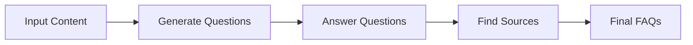
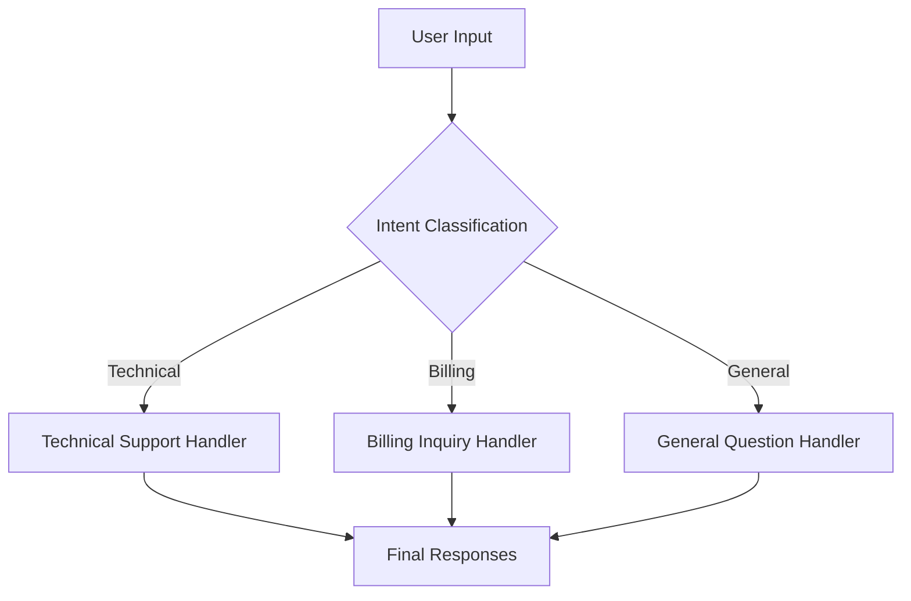

# Lesson 5: Basic Workflow Patterns

In our previous lessons, we laid the groundwork for AI Engineering. We explored the agent landscape, distinguished between rule-based LLM workflows and autonomous AI agents, managed information flow with context engineering, and ensured reliable data extraction using structured outputs. Now, we will tackle the fundamental patterns for building robust LLM applications: workflows.

This lesson explores the essential components for building these workflows: chaining multiple LLM calls, parallelizing them for speed, implementing routing with conditional logic, and using the orchestrator-worker pattern for dynamic tasks. We will explain why breaking down complex problems into smaller, manageable steps is more effective than relying on a single, monolithic LLM call. These patterns are not entirely new; they are the modern evolution of long-standing principles from traditional software engineering, particularly from Business Process Management (BPM), adapted for the probabilistic nature of LLMs [[31]](https://medium.com/@mjose.zambrano/from-bpm-to-langgraph-rethinking-process-orchestration-in-the-age-of-ai-agents-929faca6b26c).

Through practical examples using the Google Gemini library, you will learn how to build a sequential workflow for FAQ generation and a routing workflow for customer service. Mastering these techniques is a crucial step toward constructing sophisticated and reliable LLM applications, forming the building blocks for both deterministic workflows and more complex agentic systems.

## The Challenge with Complex Single LLM Calls

When you first start building with LLMs, the temptation is to solve every problem with a single, massive prompt. You describe the entire task, provide all the context, and hope for the best. While this can work for simple tasks, it quickly becomes a bottleneck in production systems. A single, large LLM call for a complex, multi-step task is problematic for several reasons.

First, it’s difficult to pinpoint errors. If the output is wrong, where did the model fail? Was it in understanding the input, performing a specific sub-task, or formatting the final result? Without clear intermediate steps, debugging becomes a nightmare. A monolithic prompt acts like a black box, making it nearly impossible to trace the source of a failure. This is especially true for parsing errors, which one study found to be a dominant failure mode in complex few-shot prompts, accounting for over 70% of errors [[3]](https://aclanthology.org/2025.ommm-1.4.pdf).

Second, this approach lacks modularity. You cannot update or improve one part of the process without rewriting the entire prompt, which is inefficient and error-prone. Imagine wanting to change just the formatting of your output; with a single prompt, you risk unintentionally altering the logic for data extraction or analysis. This tight coupling makes the system brittle and hard to maintain.

Furthermore, long contexts increase the likelihood of the "lost-in-the-middle" problem. Research has consistently shown that LLMs exhibit a U-shaped performance curve, paying most attention to information at the beginning and end of the context window while often ignoring what is in the middle [[2]](https://dev.to/thousand_miles_ai/the-lost-in-the-middle-problem-why-llms-ignore-the-middle-of-your-context-window-3al2). This bias is structural, stemming from architectural features like causal attention masking and positional encoding decay. As you stuff more instructions and data into a single prompt, you create a larger "middle" where critical information can be overlooked.

Finally, complex prompts can lead to higher token consumption and less reliable outputs. Studies show that as the number of requirements in a prompt increases, model accuracy drops. For example, one analysis found that GPT-4o's accuracy fell from 98.7% on single-requirement prompts to 85% on prompts with 19 requirements [[5]](https://arxiv.org/html/2505.13360v1). The model struggles to juggle multiple, sometimes conflicting, instructions at once, leading to inconsistent and unpredictable results.

Let's demonstrate this with a practical example. Our goal is to generate a set of Frequently Asked Questions (FAQs) from several documents about renewable energy.

1.  First, we set up our environment by initializing the Gemini client and defining our model. We will use `gemini-2.5-flash` for these examples, which is fast and cost-effective.
    ```python
    import asyncio
    from enum import Enum
    import random
    import time

    from pydantic import BaseModel, Field
    from google import genai
    from google.genai import types

    from lessons.utils import env, pretty_print

    env.load(required_env_vars=["GOOGLE_API_KEY"])
    client = genai.Client()
    MODEL_ID = "gemini-2.5-flash"
    ```

2.  We will use three mock webpages as our source content.
    ```python
    webpage_1 = {
        "title": "The Benefits of Solar Energy",
        "content": """
        Solar energy is a renewable powerhouse, offering numerous environmental and economic benefits.
        By converting sunlight into electricity through photovoltaic (PV) panels, it reduces reliance on fossil fuels,
        thereby cutting down greenhouse gas emissions. Homeowners who install solar panels can significantly
        lower their monthly electricity bills, and in some cases, sell excess power back to the grid.
        While the initial installation cost can be high, government incentives and long-term savings make
        it a financially viable option for many. Solar power is also a key component in achieving energy
        independence for nations worldwide.
        """,
    }
    
    webpage_2 = {
        "title": "Understanding Wind Turbines",
        "content": """
        Wind turbines are towering structures that capture kinetic energy from the wind and convert it into
        electrical power. They are a critical part of the global shift towards sustainable energy.
        Turbines can be installed both onshore and offshore, with offshore wind farms generally producing more
        consistent power due to stronger, more reliable winds. The main challenge for wind energy is its
        intermittency—it only generates power when the wind blows. This necessitates the use of energy
        storage solutions, like large-scale batteries, to ensure a steady supply of electricity.
        """,
    }
    
    webpage_3 = {
        "title": "Energy Storage Solutions",
        "content": """
        Effective energy storage is the key to unlocking the full potential of renewable sources like solar
        and wind. Because these sources are intermittent, storing excess energy when it's plentiful and
        releasing it when it's needed is crucial for a stable power grid. The most common form of
        large-scale storage is pumped-hydro storage, but battery technologies, particularly lithium-ion,
        are rapidly becoming more affordable and widespread. These batteries can be used in homes, businesses,
        and at the utility scale to balance energy supply and demand, making our energy system more
        resilient and reliable.
        """,
    }

    all_sources = [webpage_1, webpage_2, webpage_3]
    combined_content = "\n\n".join(
        [f"Source Title: {source['title']}\nContent: {source['content']}" for source in all_sources]
    )
    ```

3.  Now, we will create a single, complex prompt that asks the LLM to generate questions, find answers, and cite sources all at once.
    ```python
    class FAQ(BaseModel):
        """A FAQ is a question and answer pair, with a list of sources used to answer the question."""
        question: str = Field(description="The question to be answered")
        answer: str = Field(description="The answer to the question")
        sources: list[str] = Field(description="The sources used to answer the question")

    class FAQList(BaseModel):
        """A list of FAQs"""
        faqs: list[FAQ] = Field(description="A list of FAQs")

    n_questions = 10
    prompt_complex = f"""
    Based on the provided content from three webpages, generate a list of exactly {n_questions} frequently asked questions (FAQs).
    For each question, provide a concise answer derived ONLY from the text.
    After each answer, you MUST include a list of the 'Source Title's that were used to formulate that answer.
    
    <provided_content>
    {combined_content}
    </provided_content>
    """.strip()

    config = types.GenerateContentConfig(
        response_mime_type="application/json",
        response_schema=FAQList
    )
    response_complex = client.models.generate_content(
        model=MODEL_ID,
        contents=prompt_complex,
        config=config
    )
    result_complex = response_complex.parsed
    ```
    It outputs:
    ```json
    {
      "question": "What is solar energy and how does it work?",
      "answer": "Solar energy is a renewable powerhouse that converts sunlight into electricity through photovoltaic (PV) panels.",
      "sources": [
        "The Benefits of Solar Energy"
      ]
    }
    {
      "question": "What are the environmental benefits of using solar energy?",
      "answer": "Solar energy reduces reliance on fossil fuels, thereby cutting down greenhouse gas emissions.",
      "sources": [
        "The Benefits of Solar Energy"
      ]
    }
    ...
    ```

While the output might seem acceptable at first glance, this approach is brittle. The more complex the instructions, the higher the chance of inaccuracies. For example, the model might fail to cite all relevant sources for an answer or generate questions that are not fully answered by the provided text. To build a more reliable system, we need to break this task down.

## The Power of Modularity: Why Chain LLM Calls?

A more manageable solution for complex tasks is to divide and conquer using prompt chaining. This technique involves connecting multiple LLM calls sequentially, where the output of one step becomes the input for the next. It’s a simple yet powerful way to bring modularity and reliability to your AI applications.

The benefits of this approach are significant. First, you get improved modularity. Each LLM call focuses on a specific, well-defined sub-task, making the system easier to build, test, and maintain. This leads to enhanced accuracy, as simpler, targeted prompts generally produce better and more reliable outputs. Debugging also becomes much easier. If a step fails, you can isolate the issue to a specific link in the chain instead of trying to decipher a single, complex failure.

Chaining also offers increased flexibility. You can swap, update, or optimize individual components independently. For instance, you could use a fast, cost-effective model for a simple classification step and a more powerful model for a complex generation task. This allows you to fine-tune performance and cost for your specific needs. This "divide-and-conquer" strategy is effective because it provides cognitive focus; by isolating objectives for each step, you reduce the model's cognitive load and make it easier to localize failures. Empirical studies have confirmed that chaining outperforms monolithic prompts for multi-stage generation tasks, demonstrating its practical benefits [[32]](https://www.getmaxim.ai/articles/prompt-chaining-for-ai-engineers-a-practical-guide-to-improving-llm-output-quality/).

However, prompt chaining is not without its downsides. Breaking a task into multiple steps can increase costs, as it requires more API calls and thus more tokens. It also introduces higher latency since you have to wait for multiple calls to complete. There is also a risk of information loss or cumulative error, where a mistake in an early step propagates and amplifies through the chain [[22]](https://futureagi.substack.com/p/how-tool-chaining-fails-in-production). This can be modeled as a stepwise error accumulation, where the reliability can decay with the length of the chain [[33]](https://arxiv.org/html/2603.04474v1). Finally, some instructions may only make sense together; splitting them can cause a loss of critical context, as the model in a later step lacks the full picture that was available at the beginning. Despite these trade-offs, the control and reliability gained from modularity often outweigh the drawbacks for production systems.

## Building a Sequential Workflow: FAQ Generation Pipeline

Let's refactor our FAQ generation example into a 3-step sequential workflow:
1.  Generate Questions
2.  Answer Questions
3.  Find Sources

This approach breaks down the complex task into focused, manageable steps, leading to more consistent and traceable results. By decomposing the problem, we gain better control over each part of the process, which improves both the reliability and the quality of the final output. This method mirrors how humans often tackle complex problems—by breaking them into smaller, sequential actions.


Image 1: A flowchart illustrating the sequential FAQ generation pipeline.

### 1. Generate Questions

The first step is to generate a list of relevant questions from the source content. This isolates the task of question generation, allowing the LLM to focus entirely on identifying key topics and formulating meaningful questions without being distracted by the need to answer them simultaneously. We define a Pydantic model, `QuestionList`, to ensure the output is a structured list of strings.

The prompt is straightforward, asking the model to generate a specific number of questions based on the provided text.
```python
class QuestionList(BaseModel):
    """A list of questions"""
    questions: list[str] = Field(description="A list of questions")

prompt_generate_questions = """
Based on the content below, generate a list of {n_questions} relevant and distinct questions that a user might have.

<provided_content>
{combined_content}
</provided_content>
""".strip()

def generate_questions(content: str, n_questions: int = 10) -> list[str]:
    """
    Generate a list of questions based on the provided content.
    """
    config = types.GenerateContentConfig(
        response_mime_type="application/json",
        response_schema=QuestionList
    )
    response_questions = client.models.generate_content(
        model=MODEL_ID,
        contents=prompt_generate_questions.format(n_questions=n_questions, combined_content=content),
        config=config
    )
    return response_questions.parsed.questions

questions = generate_questions(combined_content, n_questions=10)
```
It outputs a list of questions like this:
```text
What are the primary environmental and economic benefits of solar energy?
How do homeowners financially benefit from installing solar panels?
What is the main process by which wind turbines generate electricity?
...
```

### 2. Answer Each Question

With a list of questions, the next step is to generate an answer for each one. We create a function, `answer_question`, that takes a single question and the source content. The prompt instructs the model to provide a concise answer derived *only* from the provided text. This focus is crucial for preventing hallucinations and ensuring the answers are grounded in the source material. By processing one question at a time, we allow the model to dedicate its full attention to finding the most relevant information for that specific query.

```python
prompt_answer_question = """
Using ONLY the provided content below, answer the following question.
The answer should be concise and directly address the question.

<question>
{question}
</question>

<provided_content>
{combined_content}
</provided_content>
""".strip()

def answer_question(question: str, content: str) -> str:
    """
    Generate an answer for a specific question using only the provided content.
    """
    answer_response = client.models.generate_content(
        model=MODEL_ID,
        contents=prompt_answer_question.format(question=question, combined_content=content),
    )
    return answer_response.text
```

### 3. Find the Sources

After generating an answer, the final step is to identify which of the original documents were used. This is essential for traceability and building trust with the user. Our `find_sources` function takes the question, the generated answer, and the original content. The prompt asks the model to act as a fact-checker, cross-referencing the answer with the source documents and listing the titles of the documents that support the answer. This separation of concerns ensures that the source attribution is a deliberate verification step, rather than an afterthought.

```python
class SourceList(BaseModel):
    """A list of source titles that were used to answer the question"""
    sources: list[str] = Field(description="A list of source titles that were used to answer the question")

prompt_find_sources = """
You will be given a question and an answer that was generated from a set of documents.
Your task is to identify which of the original documents were used to create the answer.

<question>
{question}
</question>

<answer>
{answer}
</answer>

<provided_content>
{combined_content}
</provided_content>
""".strip()

def find_sources(question: str, answer: str, content: str) -> list[str]:
    """
    Identify which sources were used to generate an answer.
    """
    config = types.GenerateContentConfig(
        response_mime_type="application/json",
        response_schema=SourceList
    )
    sources_response = client.models.generate_content(
        model=MODEL_ID,
        contents=prompt_find_sources.format(question=question, answer=answer, combined_content=content),
        config=config
    )
    return sources_response.parsed.sources
```

### 4. Putting It All Together

Now we combine these functions into a complete sequential workflow. The `sequential_workflow` function first generates all the questions. Then, it iterates through each question, calling the `answer_question` and `find_sources` functions in sequence. The results are collected into a list of structured `FAQ` objects. This step-by-step process is clear, easy to follow, and much more robust than our initial monolithic approach.

```python
def sequential_workflow(content, n_questions=10) -> list[FAQ]:
    """
    Execute the complete sequential workflow for FAQ generation.
    """
    questions = generate_questions(content, n_questions)
    final_faqs = []
    for question in questions:
        answer = answer_question(question, content)
        sources = find_sources(question, answer, content)
        faq = FAQ(question=question, answer=answer, sources=sources)
        final_faqs.append(faq)
    return final_faqs

start_time = time.monotonic()
sequential_faqs = sequential_workflow(combined_content, n_questions=4)
end_time = time.monotonic()
print(f"Sequential processing completed in {end_time - start_time:.2f} seconds")
```
It outputs:
```text
Sequential processing completed in 22.20 seconds
```
And the final result is a list of structured `FAQ` objects:
```json
{
  "question": "What are the primary financial benefits of installing solar panels for homeowners, and are there any initial costs to consider?",
  "answer": "The primary financial benefits of installing solar panels for homeowners are significantly lowered monthly electricity bills and, in some cases, the ability to sell excess power back to the grid. The initial installation cost can be high.",
  "sources": [
    "The Benefits of Solar Energy"
  ]
}
...
```
This sequential workflow is more robust and easier to debug, but it can be slow. Notice the total execution time. Next, we will see how to optimize this by running independent steps in parallel.

## Optimizing Sequential Workflows With Parallel Processing

While our sequential workflow is reliable, its total execution time is the sum of all its individual steps. Since the process of answering each question is independent of the others, we can significantly speed things up by running these tasks in parallel. This is a common optimization that can dramatically reduce latency, especially for batch processing tasks. The key insight here is that LLM API calls are I/O-bound; most of the time is spent waiting for the network response, not on local CPU computation. Concurrency allows us to use this waiting time effectively by sending off multiple requests at once.

We can implement a parallel version of our workflow using Python’s `asyncio` library, which is purpose-built for handling I/O-bound concurrency without the overhead of traditional multi-threading [[23]](https://santhalakshminarayana.github.io/blog/concurrency-patterns-python).

1.  First, we need asynchronous versions of our `answer_question` and `find_sources` functions. The `google-genai` library provides an async client (`client.aio`) for this purpose. The `async def` syntax defines a coroutine, a special function that can be paused and resumed, and `await` is used to pause execution until the I/O operation (the API call) is complete.
    ```python
    async def answer_question_async(question: str, content: str) -> str:
        """
        Async version of answer_question function.
        """
        prompt = prompt_answer_question.format(question=question, combined_content=content)
        response = await client.aio.models.generate_content(
            model=MODEL_ID,
            contents=prompt
        )
        return response.text

    async def find_sources_async(question: str, answer: str, content: str) -> list[str]:
        """
        Async version of find_sources function.
        """
        prompt = prompt_find_sources.format(question=question, answer=answer, combined_content=content)
        config = types.GenerateContentConfig(
            response_mime_type="application/json",
            response_schema=SourceList
        )
        response = await client.aio.models.generate_content(
            model=MODEL_ID,
            contents=prompt,
            config=config
        )
        return response.parsed.sources
    ```

2.  Next, we create a function that processes a single question. This function now orchestrates the answering and source-finding steps for one question.
    ```python
    async def process_question_parallel(question: str, content: str) -> FAQ:
        """
        Process a single question by generating answer and finding sources in parallel.
        """
        answer = await answer_question_async(question, content)
        sources = await find_sources_async(question, answer, content)
        return FAQ(
            question=question,
            answer=answer,
            sources=sources
        )
    ```

3.  Finally, we create our main parallel workflow. We first generate all questions synchronously, then create a list of tasks (coroutines to be executed). `asyncio.gather(*tasks)` is the key here; it runs all the tasks concurrently and waits for all of them to complete before returning the results.
    ```python
    async def parallel_workflow(content: str, n_questions: int = 10) -> list[FAQ]:
        """
        Execute the complete parallel workflow for FAQ generation.
        """
        questions = generate_questions(content, n_questions)
        tasks = [process_question_parallel(question, content) for question in questions]
        parallel_faqs = await asyncio.gather(*tasks)
        return parallel_faqs

    start_time = time.monotonic()
    parallel_faqs = await parallel_workflow(combined_content, n_questions=4)
    end_time = time.monotonic()
    print(f"Parallel processing completed in {end_time - start_time:.2f} seconds")
    ```
    It outputs:
    ```text
    Parallel processing completed in 8.98 seconds
    ```
As you can see, the parallel workflow completed in less than half the time of the sequential one. This demonstrates the power of parallelization for optimizing performance. However, there are trade-offs to consider. Parallel processing can be more complex to implement and debug. More importantly, making many concurrent API calls can quickly exhaust your rate limits [[9]](https://tianpan.co/blog/2026-03-11-llm-api-resilience-production). In production systems, you need to manage this with strategies like exponential backoff with jitter, retry budgets, and request queuing to avoid overwhelming the API.

For more robust, production-grade systems that handle high volumes, many engineers adopt patterns from event-driven architecture (EDA). Instead of directly calling functions asynchronously, you can use a message queue (like RabbitMQ or Kafka) to manage tasks. Each task to be processed is sent as a message to a queue, and independent "worker" services consume these messages in parallel. This approach naturally handles load balancing, provides better fault tolerance, and decouples the components of your workflow, making the system more scalable and resilient [[35]](https://www.freecodecamp.org/news/how-message-queues-make-distributed-systems-more-reliable/).

## Introducing Dynamic Behavior: Routing and Conditional Logic

So far, our workflows have been static. They follow a fixed path of execution, whether sequential or parallel. But what if you need your system to behave differently based on the input? This is where routing comes in. Routing, or conditional logic, allows you to create dynamic workflows that direct inputs to different specialized handlers.

This is another application of the "divide-and-conquer" principle. Instead of trying to create a single, monolithic prompt that can handle every possible input, you create multiple specialized prompts, each optimized for a specific type of task. An initial LLM call then acts as a classifier, analyzing the input and deciding which specialized handler is the best fit. For example, a customer support bot could use a semantic router to classify an incoming query as a "Billing Issue" or "Technical Problem" and direct it to the appropriate downstream process [[11]](https://www.vellum.ai/blog/how-to-build-intent-detection-for-your-chatbot).

However, the raw output of a classifier LLM can be unreliable or overconfident. To build a more robust router, you can apply confidence score calibration. Techniques like temperature scaling adjust the model's output probabilities to better reflect its actual accuracy [[36]](https://latitude.so/blog/5-methods-for-calibrating-llm-confidence-scores). This allows you to set a reliable threshold; if the calibrated confidence for a classification is below this threshold, the system can trigger a fallback, such as escalating the query to a human agent or a more powerful model [[37]](https://assets.amazon.science/9f/8f/5573088f450d840e7b4d4a9ffe3e/label-with-confidence-effective-confidence-calibration-and-ensembles-in-llm-powered-classification.pdf). This routing logic can also be implemented using event-driven patterns, where the classified intent is published as an event that different handlers can subscribe to, further decoupling the system's components [[38]](https://towardsdatascience.com/deep-dive-into-llamaindex-workflow-event-driven-llm-architecture-8011f41f851a/).

This pattern is essential for building applications that can handle diverse inputs gracefully. It keeps each component focused and maintainable, improving the overall reliability and performance of the system.

## Building a Basic Routing Workflow

Let's build a simple routing workflow for a customer service system. The goal is to classify a user's query and route it to one of three specialized handlers: Technical Support, Billing Inquiry, or General Question. This allows us to provide more relevant and helpful responses by using prompts tailored to each specific intent.


Image 2: A flowchart illustrating a customer service routing workflow.

1.  First, we define our possible intents using a Pydantic model and an `Enum`. This provides a structured way to represent the different categories. The `classify_intent` function then uses the LLM to determine the intent of a given user query, returning one of the predefined `IntentEnum` values.
    ```python
    class IntentEnum(str, Enum):
        TECHNICAL_SUPPORT = "Technical Support"
        BILLING_INQUIRY = "Billing Inquiry"
        GENERAL_QUESTION = "General Question"

    class UserIntent(BaseModel):
        intent: IntentEnum = Field(description="The intent of the user's query")

    prompt_classification = """
    Classify the user's query into one of the following categories.
    
    <categories>
    {categories}
    </categories>
    
    <user_query>
    {user_query}
    </user_query>
    """.strip()

    def classify_intent(user_query: str) -> IntentEnum:
        """Uses an LLM to classify a user query."""
        prompt = prompt_classification.format(
            user_query=user_query,
            categories=[intent.value for intent in IntentEnum]
        )
        config = types.GenerateContentConfig(
            response_mime_type="application/json",
            response_schema=UserIntent
        )
        response = client.models.generate_content(
            model=MODEL_ID,
            contents=prompt,
            config=config
        )
        return response.parsed.intent
    ```

2.  Next, we define a specialized prompt for each intent. Each prompt is tailored to the specific context, guiding the LLM to generate an appropriate response. For example, the technical support prompt asks for troubleshooting details, while the billing prompt asks for an account number.
    ```python
    prompt_technical_support = """
    You are a helpful technical support agent.
    Here's the user's query:
    <user_query>
    {user_query}
    </user_query>
    Provide a helpful first response, asking for more details like what troubleshooting steps they have already tried.
    """.strip()
    
    prompt_billing_inquiry = """
    You are a helpful billing support agent.
    Here's the user's query:
    <user_query>
    {user_query}
    </user_query>
    Acknowledge their concern and inform them that you will need to look up their account, asking for their account number.
    """.strip()
    
    prompt_general_question = """
    You are a general assistant.
    Here's the user's query:
    <user_query>
    {user_query}
    </user_query>
    Apologize that you are not sure how to help.
    """.strip()
    ```

3.  Finally, we create a `handle_query` function that acts as our router. It takes the user's query and its classified intent, and then uses simple conditional logic to select and execute the correct prompt.
    ```python
    def handle_query(user_query: str, intent: str) -> str:
        """Routes a query to the correct handler based on its classified intent."""
        if intent == IntentEnum.TECHNICAL_SUPPORT:
            prompt = prompt_technical_support.format(user_query=user_query)
        elif intent == IntentEnum.BILLING_INQUIRY:
            prompt = prompt_billing_inquiry.format(user_query=user_query)
        else:
            prompt = prompt_general_question.format(user_query=user_query)

        response = client.models.generate_content(
            model=MODEL_ID,
            contents=prompt
        )
        return response.text
    ```

4.  Let's test it with a few different queries. For a technical issue, the query is classified as `TECHNICAL_SUPPORT`, and the system returns a helpful response asking for more details.
    ```python
    query_1 = "My internet connection is not working."
    intent_1 = classify_intent(query_1)
    response_1 = handle_query(query_1, intent_1)
    ```
    It outputs:
    ```text
    Hello there! I'm sorry to hear you're having trouble with your internet connection...
    To help me understand what's going on... could you please provide a few more details?
    1.  **What exactly are you experiencing?**
    2.  **What device are you trying to connect with?**
    3.  **Have you already tried any troubleshooting steps yourself?**
    ```
This routing pattern is a cornerstone of building scalable and maintainable AI applications. It allows you to create robust systems that can handle a wide variety of inputs gracefully. To make this system even more robust in production, you could enhance it with the confidence calibration we discussed earlier. After classifying the intent, you would also get a confidence score. If that score is below a predefined threshold, instead of routing to another LLM, the workflow could route the query to a human support agent for review, ensuring that ambiguous cases are handled correctly [[37]](https://assets.amazon.science/9f/8f/5573088f450d840e7b4d4a9ffe3e/label-with-confidence-effective-confidence-calibration-and-ensembles-in-llm-powered-classification.pdf).

## Orchestrator-Worker Pattern: Dynamic Task Decomposition

The patterns we have seen so far—chaining, parallelization, and routing—are powerful, but they rely on pre-defined workflows. What happens when you face a complex problem where the necessary steps cannot be known in advance? This is where the orchestrator-worker pattern comes in.

In this workflow, a central "orchestrator" LLM dynamically breaks down a complex task into smaller sub-tasks. It then delegates these sub-tasks to specialized "worker" LLMs (or tools) and synthesizes their results into a final, cohesive response [[16]](https://agents.kour.me/orchestrator-worker/). The key difference from the parallelization pattern is its flexibility. The sub-tasks are not pre-defined; they are determined by the orchestrator at runtime based on the specific input. The orchestrator acts as a project manager, analyzing the high-level goal and deciding on the necessary steps, while the workers are the specialists who execute them [[17]](https://mlpills.substack.com/p/diy-17-orchestrator-worker-llm-agent).

This pattern is ideal for complex, unpredictable tasks like analyzing a user query that contains multiple, distinct requests, and has found applications in fields like supply chain optimization and financial risk analysis. For instance, one real-world supply chain agent used this pattern to reduce data processing time by 40% and improve planning accuracy significantly [[39]](https://arxiv.org/html/2509.03811v1). For example, a customer might ask about an invoice, request to return a product, and ask for an order status update all in one message. An orchestrator can parse this complex query, identify the three separate sub-tasks, and dispatch them to the appropriate workers.

```mermaid
flowchart LR
  %% Start
  A["Complex User Query"]

  %% Orchestration
  subgraph Orchestration
    B["Orchestrator LLM"]
    C["Task Decomposition"]
  end

  %% Worker Execution
  subgraph "Worker Execution"
    D["Sub-tasks"]
    E["Worker LLMs"]
  end

  %% Synthesis
  subgraph Synthesis
    F["Synthesizer LLM"]
  end

  %% Final Output
  G["Cohesive Final Response"]

  %% Flow
  A -- "received by" --> B
  B -- "dynamically performs" --> C
  C -- "delegates multiple" --> D
  D -- "execute in parallel" --> E
  E -- "results gathered by" --> F
  F -- "produces" --> G

  %% Visual grouping
  classDef llmComponent stroke-width:2px
  class B,E,F llmComponent
```


Image 3: A flowchart illustrating the Orchestrator-Worker pattern.

Let's build an example to handle such a multi-part customer query.

1.  First, we define the `orchestrator` function. Its job is to analyze the user's query and break it down into a list of structured tasks, each with a specific `query_type` and the necessary parameters. The prompt clearly defines the available task types and their required inputs, guiding the LLM to produce a structured plan.
    ```python
    class QueryTypeEnum(str, Enum):
        BILLING_INQUIRY = "BillingInquiry"
        PRODUCT_RETURN = "ProductReturn"
        STATUS_UPDATE = "StatusUpdate"

    class Task(BaseModel):
        query_type: QueryTypeEnum
        invoice_number: str | None = None
        product_name: str | None = None
        reason_for_return: str | None = None
        order_id: str | None = None

    class TaskList(BaseModel):
        tasks: list[Task]

    prompt_orchestrator = f"""
    You are a master orchestrator. Your job is to break down a complex user query into a list of sub-tasks.
    Each sub-task must have a "query_type" and its necessary parameters.
    
    The possible "query_type" values and their required parameters are:
    1. "{QueryTypeEnum.BILLING_INQUIRY.value}": Requires "invoice_number".
    2. "{QueryTypeEnum.PRODUCT_RETURN.value}": Requires "product_name" and "reason_for_return".
    3. "{QueryTypeEnum.STATUS_UPDATE.value}": Requires "order_id".
    
    Here's the user's query.
    <user_query>
    {{query}}
    </user_query>
    """.strip()
    
    def orchestrator(query: str) -> list[Task]:
        """Breaks down a complex query into a list of tasks."""
        prompt = prompt_orchestrator.format(query=query)
        config = types.GenerateContentConfig(response_mime_type="application/json", response_schema=TaskList)
        response = client.models.generate_content(model=MODEL_ID, contents=prompt, config=config)
        return response.parsed.tasks
    ```

2.  Next, we define our specialized workers. For this example, we will simulate the backend logic. In a real system, these workers might call external APIs or query databases. Each worker is a focused function that handles one specific task type.
    ```python
    def handle_billing_worker(invoice_number: str, original_user_query: str) -> BillingTask:
        # ... (simulates opening an investigation)
    
    def handle_return_worker(product_name: str, reason_for_return: str) -> ReturnTask:
        # ... (simulates generating an RMA number)
    
    def handle_status_worker(order_id: str) -> StatusTask:
        # ... (simulates fetching order status)
    ```

3.  After the workers have processed their tasks, we need a `synthesizer` to combine their structured outputs into a single, user-friendly response. This final LLM call takes the structured data from the workers and crafts a natural language summary for the customer.
    ```python
    prompt_synthesizer = """
    You are a master communicator. Combine several distinct pieces of information from our support team into a single, well-formatted, and friendly email to a customer.
    
    Here are the points to include, based on the actions taken for their query:
    <points>
    {formatted_results}
    </points>
    
    Combine these points into one cohesive response.
    """.strip()
    
    def synthesizer(results: list[Task]) -> str:
        # ... (formats worker results and calls LLM to generate a cohesive message)
    ```

4.  Finally, we tie everything together in a main processing function that orchestrates the entire flow from query decomposition to final response synthesis.
    ```python
    def process_user_query(user_query):
        """Processes a query using the Orchestrator-Worker-Synthesizer pattern."""
        tasks_list = orchestrator(user_query)
        worker_results = []
        if tasks_list:
            for task in tasks_list:
                if task.query_type == QueryTypeEnum.BILLING_INQUIRY:
                    worker_results.append(handle_billing_worker(task.invoice_number, user_query))
                elif task.query_type == QueryTypeEnum.PRODUCT_RETURN:
                    worker_results.append(handle_return_worker(task.product_name, task.reason_for_return))
                elif task.query_type == QueryTypeEnum.STATUS_UPDATE:
                    worker_results.append(handle_status_worker(task.order_id))
        
        if worker_results:
            final_user_message = synthesizer(worker_results)
            pretty_print.wrapped(text=final_user_message, title="Final synthesized response")
    ```

5.  Let's test it with a complex query that involves a billing question, a product return, and an order status request.
    ```python
    complex_customer_query = """
    Hi, I'm writing to you because I have a question about invoice #INV-7890. It seems higher than I expected.
    Also, I would like to return the 'SuperWidget 5000' I bought because it's not compatible with my system.
    Finally, can you give me an update on my order #A-12345?
    """.strip()
    
    process_user_query(complex_customer_query)
    ```
    The orchestrator first deconstructs the query into three distinct tasks. Then, the corresponding workers execute, and finally, the synthesizer combines their outputs into a single, organized response for the customer.
    ```text
    Dear Customer,

    Here is an update on your recent queries:

    Regarding your BillingInquiry:
      - Invoice Number: INV-7890
      - Your Stated Concern: "It seems higher than I expected."
      - Our Action: An investigation (Case ID: INV_CASE_5914) has been opened regarding your concern.
      - Expected Resolution: We will get back to you within 2 business days.

    Regarding your ProductReturn:
      - Product: SuperWidget 5000
      - Reason for Return: "it's not compatible with my system"
      - Return Authorization (RMA): RMA-65123
      - Instructions: Please pack the 'SuperWidget 5000' securely...

    Regarding your StatusUpdate:
      - Order ID: A-12345
      - Current Status: Shipped
      - Carrier: SuperFast Shipping
      - Tracking Number: SF259833
      - Delivery Estimate: Tomorrow

    We hope this information is helpful. Please let us know if you have any other questions.

    Best regards,
    Your Support Team
    ```
This pattern provides a scalable and flexible architecture for handling complex, multi-step tasks where the exact sequence of operations is not known in advance. This architecture can be extended further with iterative feedback loops. Instead of a single-pass decomposition, advanced orchestrators can use the results from workers to reflect and revise their initial plan. Patterns like "evaluator-optimizer" or even training the orchestrator with reinforcement learning allow the system to dynamically re-delegate tasks, creating a more adaptive and self-correcting workflow [[15]](https://www.anthropic.com/engineering/building-effective-agents), [[40]](https://www.emergentmind.com/topics/dynamic-orchestration-strategy).

## Conclusion

In this lesson, we have explored four fundamental workflow patterns that are the building blocks of almost any production-grade LLM application. We started by understanding the limitations of single, complex LLM calls and saw how breaking tasks down improves reliability.

We then built a sequential workflow using prompt chaining, which gives us modularity and clear, debuggable steps. We optimized it with parallel processing to significantly reduce latency. We introduced dynamic behavior with a routing workflow, allowing our system to adapt to different types of input. Finally, we explored the orchestrator-worker pattern, a flexible approach for handling complex, unpredictable tasks by dynamically decomposing them.

These patterns, while tailored for LLMs, build on decades of work in software engineering. They are a modern implementation of ideas from traditional Business Process Management (BPM), which also focuses on breaking down complex work into manageable, repeatable steps. The key difference is the replacement of rigid, rule-based gateways with flexible, LLM-driven decision-making [[31]](https://medium.com/@mjose.zambrano/from-bpm-to-langgraph-rethinking-process-orchestration-in-the-age-of-ai-agents-929faca6b26c).

Furthermore, as these patterns mature, they are becoming more accessible through low-code and no-code platforms. These tools provide visual builders that allow domain experts, not just AI engineers, to chain models, define routing logic, and orchestrate complex workflows using drag-and-drop interfaces [[41]](https://www.techaheadcorp.com/blog/ai-orchestrator-role-in-managing-llms-apis/). While the scalability of these visual builders for complex production cases is still debated, they represent a significant trend in democratizing AI development [[42]](https://www.linkedin.com/posts/harrison-chase-961287118_i-am-not-excited-about-visual-workflow-builders-activity-7381369384101072896-TImz).

These patterns—chaining, parallelization, routing, and orchestration—provide the control and reliability needed to move from simple prototypes to robust AI systems. In our next lesson, we will build upon this foundation by giving our workflows the ability to interact with the outside world through tools and function calling.

## References
- [1] Gozzi, M., & Di Maio, F. (2024). Comparative Analysis of Prompt Strategies for Large Language Models: Single-Task vs. Multitask Prompts. *Electronics*, *13*(23), 4712. [https://www.mdpi.com/2079-9292/13/23/4712](https://www.mdpi.com/2079-9292/13/23/4712)
- [2] The "Lost in the Middle" Problem — Why LLMs Ignore the Middle of Your Context Window. (n.d.). *dev.to*. [https://dev.to/thousand_miles_ai/the-lost-in-the-middle-problem-why-llms-ignore-the-middle-of-your-context-window-3al2](https://dev.to/thousand_miles_ai/the-lost-in-the-middle-problem-why-llms-ignore-the-middle-of-your-context-window-3al2)
- [3] FLARE: A Framework for Large-scale, Automated, and Reproducible Evaluation of Language Models. (2025). *aclanthology.org*. [https://aclanthology.org/2025.ommm-1.4.pdf](https://aclanthology.org/2025.ommm-1.4.pdf)
- [4] ZeMPE: A Zero-shot Multiple-Problem-Evaluation Benchmark for Large Language Models. (2025). *aclanthology.org*. [https://aclanthology.org/2025.gem-1.14.pdf](https://aclanthology.org/2025.gem-1.14.pdf)
- [5] Underspecification in Instruction-Following. (2025). *arxiv.org*. [https://arxiv.org/html/2505.13360v1](https://arxiv.org/html/2505.13360v1)
- [6] ClippingGPT: A case study of LLM-powered tutor. (2024). *zenml.io*. [https://www.zenml.io/blog/llmops-in-production-457-case-studies-of-what-actually-works](https://www.zenml.io/blog/llmops-in-production-457-case-studies-of-what-actually-works)
- [7] LLMOps in Production: 287 More Case Studies of What Actually Works. (2024). *zenml.io*. [https://www.zenml.io/blog/llmops-in-production-287-more-case-studies-of-what-actually-works](https://www.zenml.io/blog/llmops-in-production-287-more-case-studies-of-what-actually-works)
- [8] Saravia, E. (n.d.). Prompt Chaining Guide. *promptingguide.ai*. [https://www.promptingguide.ai/techniques/prompt_chaining](https://www.promptingguide.ai/techniques/prompt_chaining)
- [9] Pan, T. (2026). LLM API Resilience in Production. *tianpan.co*. [https://tianpan.co/blog/2026-03-11-llm-api-resilience-production](https://tianpan.co/blog/2026-03-11-llm-api-resilience-production)
- [10] LLM-Based Prompt Routing. (n.d.). *emergentmind.com*. [https://www.emergentmind.com/topics/llm-based-prompt-routing](https://www.emergentmind.com/topics/llm-based-prompt-routing)
- [11] A Beginner's Guide to LLM Intent Classification for Chatbots. (n.d.). *vellum.ai*. [https://www.vellum.ai/blog/how-to-build-intent-detection-for-your-chatbot](https://www.vellum.ai/blog/how-to-build-intent-detection-for-your-chatbot)
- [12] Top 5 LLM Routing Techniques. (n.d.). *getmaxim.ai*. [https://www.getmaxim.ai/articles/top-5-llm-routing-techniques/](https://www.getmaxim.ai/articles/top-5-llm-routing-techniques/)
- [13] Universal Model Routing by Capturing Correctness. (2025). *arxiv.org*. [https://arxiv.org/html/2502.08773v1](https://arxiv.org/html/2502.08773v1)
- [14] Multi-LLM routing strategies for generative AI applications on AWS. (n.d.). *aws.amazon.com*. [https://aws.amazon.com/blogs/machine-learning/multi-llm-routing-strategies-for-generative-ai-applications-on-aws/](https://aws.amazon.com/blogs/machine-learning/multi-llm-routing-strategies-for-generative-ai-applications-on-aws/)
- [15] Building effective agents. (n.d.). *anthropic.com*. [https://www.anthropic.com/engineering/building-effective-agents](https://www.anthropic.com/engineering/building-effective-agents)
- [16] Pattern: Orchestrator-Worker (Coordinator). (n.d.). *agents.kour.me*. [https://agents.kour.me/orchestrator-worker/](https://agents.kour.me/orchestrator-worker/)
- [17] DIY #17 Orchestrator-Worker LLM Agent Pattern. (n.d.). *mlpills.substack.com*. [https://mlpills.substack.com/p/diy-17-orchestrator-worker-llm-agent](https://mlpills.substack.com/p/diy-17-orchestrator-worker-llm-agent)
- [18] Building a Self-Healing AI Orchestrator with Reflexion Patterns. (n.d.). *online.stevens.edu*. [https://online.stevens.edu/blog/building-self-healing-ai-orchestrator-reflexion-patterns/](https://online.stevens.edu/blog/building-self-healing-ai-orchestrator-reflexion-patterns/)
- [19] Orchestrator-workers cookbook. (n.d.). *claude.com*. [https://platform.claude.com/cookbook/patterns-agents-orchestrator-workers](https://platform.claude.com/cookbook/patterns-agents-orchestrator-workers)
- [20] Iusztin, P. (n.d.). Stop building AI agents. Use these 5 patterns instead. *decodingai.com*. [https://www.decodingai.com/p/stop-building-ai-agents-use-these](https://www.decodingai.com/p/stop-building-ai-agents-use-these)
- [21] Compounding Error Effect in Large Language Models. (n.d.). *wand.ai*. [https://wand.ai/blog/compounding-error-effect-in-large-language-models-a-growing-challenge](https://wand.ai/blog/compounding-error-effect-in-large-language-models-a-growing-challenge)
- [22] How Tool Chaining Fails in Production LLM Agents and How to Fix It. (n.d.). *futureagi.substack.com*. [https://futureagi.substack.com/p/how-tool-chaining-fails-in-production](https://futureagi.substack.com/p/how-tool-chaining-fails-in-production)
- [23] Asynchronous or Concurrency Patterns in Python with Asyncio. (n.d.). *santhalakshminarayana.github.io*. [https://santhalakshminarayana.github.io/blog/concurrency-patterns-python](https://santhalakshminarayana.github.io/blog/concurrency-patterns-python)
- [24] Python Concurrency Showdown: Asyncio vs. Threading vs. Multiprocessing. (n.d.). *medium.com*. [https://medium.com/@sizanmahmud08/python-concurrency-showdown-asyncio-vs-threading-vs-multiprocessing-which-should-you-choose-in-31205161899a](https://medium.com/@sizanmahmud08/python-concurrency-showdown-asyncio-vs-threading-vs-multiprocessing-which-should-you-choose-in-31205161899a)
- [25] Concurrency and Parallelism in Python. (n.d.). *testdriven.io*. [https://testdriven.io/blog/python-concurrency-parallelism/](https://testdriven.io/blog/python-concurrency-parallelism/)
- [26] Concurrency and Parallelism in Python. (n.d.). *dev.to*. [https://dev.to/nkpydev/concurrency-and-parallelism-in-python-threads-multiprocessing-and-async-programming-64d](https://dev.to/nkpydev/concurrency-and-parallelism-in-python-threads-multiprocessing-and-async-programming-64d)
- [27] Concurrency in Async/Await and Threading. (2025). *blog.jetbrains.com*. [https://blog.jetbrains.com/pycharm/2025/06/concurrency-in-async-await-and-threading/](https://blog.jetbrains.com/pycharm/2025/06/concurrency-in-async-await-and-threading/)
- [28] Google's Guide to Multi-Agent Patterns in ADK. (n.d.). *developers.googleblog.com*. [https://developers.googleblog.com/developers-guide-to-multi-agent-patterns-in-adk/](https://developers.googleblog.com/developers-guide-to-multi-agent-patterns-in-adk/)
- [29] Agentic AI Design Patterns. (n.d.). *linkedin.com*. [https://www.linkedin.com/posts/chiragsubramanian_agentic-ai-design-patterns-my-practical-activity-7416830806939230208-nRFc](https://www.linkedin.com/posts/chiragsubramanian_agentic-ai-design-patterns-my-practical-activity-7416830806939230208-nRFc)
- [30] The Orchestrator-Worker Pattern. (n.d.). *mlpills.substack.com*. [https://mlpills.substack.com/p/issue-110-llm-workflow-patterns](https://mlpills.substack.com/p/issue-110-llm-workflow-patterns)
- [31] Zambrano, M. J. (n.d.). From BPM to LangGraph: Rethinking Process Orchestration in the Age of AI Agents. *medium.com*. [https://medium.com/@mjose.zambrano/from-bpm-to-langgraph-rethinking-process-orchestration-in-the-age-of-ai-agents-929faca6b26c](https://medium.com/@mjose.zambrano/from-bpm-to-langgraph-rethinking-process-orchestration-in-the-age-of-ai-agents-929faca6b26c)
- [32] Prompt Chaining for AI Engineers: A Practical Guide to Improving LLM Output Quality. (n.d.). *getmaxim.ai*. [https://www.getmaxim.ai/articles/prompt-chaining-for-ai-engineers-a-practical-guide-to-improving-llm-output-quality/](https://www.getmaxim.ai/articles/prompt-chaining-for-ai-engineers-a-practical-guide-to-improving-llm-output-quality/)
- [33] Modeling Error Propagation in Large-Language-Model-based Multi-Agent Systems. (2026). *arxiv.org*. [https://arxiv.org/html/2603.04474v1](https://arxiv.org/html/2603.04474v1)
- [34] On the Reliability of Large Language Models. (2025). *arxiv.org*. [https://arxiv.org/html/2505.24187v1](https://arxiv.org/html/2505.24187v1)
- [35] How Message Queues Make Distributed Systems More Reliable and Scalable. (n.d.). *freecodecamp.org*. [https://www.freecodecamp.org/news/how-message-queues-make-distributed-systems-more-reliable/](https://www.freecodecamp.org/news/how-message-queues-make-distributed-systems-more-reliable/)
- [36] 5 Methods for Calibrating LLM Confidence Scores. (n.d.). *latitude.so*. [https://latitude.so/blog/5-methods-for-calibrating-llm-confidence-scores](https://latitude.so/blog/5-methods-for-calibrating-llm-confidence-scores)
- [37] Label with Confidence: Effective Confidence Calibration and Ensembles in LLM-powered Classification. (n.d.). *assets.amazon.science*. [https://assets.amazon.science/9f/8f/5573088f450d840e7b4d4a9ffe3e/label-with-confidence-effective-confidence-calibration-and-ensembles-in-llm-powered-classification.pdf](https://assets.amazon.science/9f/8f/5573088f450d840e7b4d4a9ffe3e/label-with-confidence-effective-confidence-calibration-and-ensembles-in-llm-powered-classification.pdf)
- [38] Deep Dive into LlamaIndex Workflow: Event-Driven LLM Architecture. (n.d.). *towardsdatascience.com*. [https://towardsdatascience.com/deep-dive-into-llamaindex-workflow-event-driven-llm-architecture-8011f41f851a/](https://towardsdatascience.com/deep-dive-into-llamaindex-workflow-event-driven-llm-architecture-8011f41f851a/)
- [39] SCPA: A Supply Chain Planning Agent with Dynamic Task Decomposition and Iterative Planning. (2025). *arxiv.org*. [https://arxiv.org/html/2509.03811v1](https://arxiv.org/html/2509.03811v1)
- [40] Dynamic Orchestration Strategy. (n.d.). *emergentmind.com*. [https://www.emergentmind.com/topics/dynamic-orchestration-strategy](https://www.emergentmind.com/topics/dynamic-orchestration-strategy)
- [41] AI Orchestrator: Its Role in Managing LLMs & APIs. (n.d.). *techaheadcorp.com*. [https://www.techaheadcorp.com/blog/ai-orchestrator-role-in-managing-llms-apis/](https://www.techaheadcorp.com/blog/ai-orchestrator-role-in-managing-llms-apis/)
- [42] Chase, H. (n.d.). Post on Visual Workflow Builders. *linkedin.com*. [https://www.linkedin.com/posts/harrison-chase-961287118_i-am-not-excited-about-visual-workflow-builders-activity-7381369384101072896-TImz](https://www.linkedin.com/posts/harrison-chase-961287118_i-am-not-excited-about-visual-workflow-builders-activity-7381369384101072896-TImz)