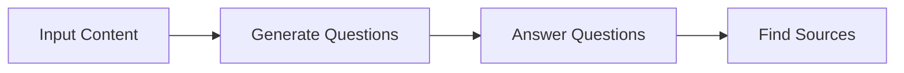
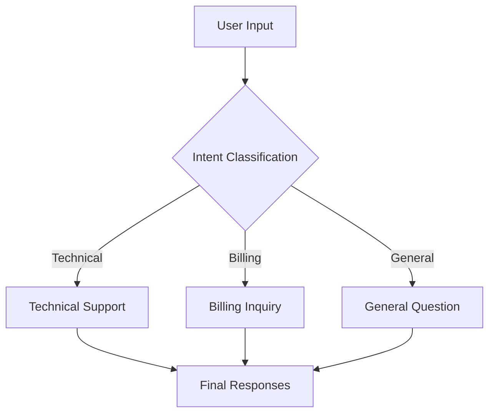
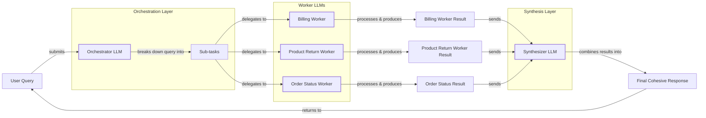

# Lesson 5: Basic Workflow Ingredients

In the last lesson, we covered context engineering, the art of feeding the right information to an LLM. We learned that simply stuffing all available information into a massive context window is a recipe for slow, expensive, and unreliable AI systems. This lesson builds on that foundation by tackling the other side of the equation: how to orchestrate multiple LLM calls to build robust and predictable applications.

As we move from simple prompts to complex, multi-step tasks, we quickly find that a single LLM call is not enough. In production, you will rarely solve a problem with one prompt. Instead, you will design systems of LLM calls that work together. These systems, which we call LLM workflows, are the building blocks of almost every production-grade AI application, from sophisticated content generation pipelines to the early stages of agentic systems.

This lesson explores the fundamental patterns for building these workflows: chaining LLM calls sequentially, running them in parallel, routing them with conditional logic, and using an orchestrator to dynamically manage tasks. We will show you why breaking down complex problems into smaller, manageable steps is a core principle of AI Engineering.

## The Challenge with Complex Single LLM Calls

When you first start building with LLMs, it is tempting to write a single, complex prompt that does everything at once. You might ask the model to analyze a document, extract key information, generate a summary, and format the output as a JSON object, all in one go. While this can work for simple demos, it quickly falls apart in production.

A single, monolithic prompt is difficult to debug. When it fails, you are left with a single, messy output and no clear way to pinpoint what went wrong. Was the model confused by one of the instructions? Did it fail to find the right information? Without visibility into the intermediate steps, you are flying blind. This approach also lacks modularity. If you want to improve one part of the task, you have to rewrite the entire prompt, which risks breaking other parts.

Furthermore, long and complex prompts are more susceptible to the "lost-in-the-middle" problem we discussed in Lesson 3. As the context grows, the model can lose track of instructions, leading to unreliable and inconsistent outputs [[2]](https://dev.to/thousand_miles_ai/the-lost-in-the-middle-problem-why-llms-ignore-the-middle-of-your-context-window-3al2). Trying to do too much in one call also increases token consumption unnecessarily.

Let's look at a practical example. We will start with our coding setup, which we will use throughout this lesson.

1.  First, we set up our environment and initialize the Gemini client. We will use `gemini-2.5-flash`, a fast and cost-effective model suitable for our examples.
    ```python
    import asyncio
    from enum import Enum
    import random
    import time
    
    from pydantic import BaseModel, Field
    from google import genai
    from google.genai import types
    
    from lessons.utils import env
    
    env.load(required_env_vars=["GOOGLE_API_KEY"])
    
    client = genai.Client()
    
    MODEL_ID = "gemini-2.5-flash"
    ```

2.  Next, we will use mock webpage content about renewable energy as our source material.
    ```python
    webpage_1 = {
        "title": "The Benefits of Solar Energy",
        "content": """
        Solar energy is a renewable powerhouse, offering numerous environmental and economic benefits.
        By converting sunlight into electricity through photovoltaic (PV) panels, it reduces reliance on fossil fuels,
        thereby cutting down greenhouse gas emissions. Homeowners who install solar panels can significantly
        lower their monthly electricity bills, and in some cases, sell excess power back to the grid.
        While the initial installation cost can be high, government incentives and long-term savings make
        it a financially viable option for many. Solar power is also a key component in achieving energy
        independence for nations worldwide.
        """,
    }
    
    webpage_2 = {
        "title": "Understanding Wind Turbines",
        "content": """
        Wind turbines are towering structures that capture kinetic energy from the wind and convert it into
        electrical power. They are a critical part of the global shift towards sustainable energy.
        Turbines can be installed both onshore and offshore, with offshore wind farms generally producing more
        consistent power due to stronger, more reliable winds. The main challenge for wind energy is its
        intermittency—it only generates power when the wind blows. This necessitates the use of energy
        storage solutions, like large-scale batteries, to ensure a steady supply of electricity.
        """,
    }
    
    webpage_3 = {
        "title": "Energy Storage Solutions",
        "content": """
        Effective energy storage is the key to unlocking the full potential of renewable sources like solar
        and wind. Because these sources are intermittent, storing excess energy when it's plentiful and
        releasing it when it's needed is crucial for a stable power grid. The most common form of
        large-scale storage is pumped-hydro storage, but battery technologies, particularly lithium-ion,
        are rapidly becoming more affordable and widespread. These batteries can be used in homes, businesses,
        and at the utility scale to balance energy supply and demand, making our energy system more
        resilient and reliable.
        """,
    }
    
    all_sources = [webpage_1, webpage_2, webpage_3]
    
    # We'll combine the content for the LLM to process
    combined_content = "\n\n".join(
        [f"Source Title: {source['title']}\nContent: {source['content']}" for source in all_sources]
    )
    ```

3.  Now, we will write a complex prompt that asks the model to generate questions, find answers, and cite sources all at once. We will use the structured output techniques we learned in Lesson 4 to get a JSON response.
    ```python
    # Pydantic classes for structured outputs
    class FAQ(BaseModel):
        """A FAQ is a question and answer pair, with a list of sources used to answer the question."""
        question: str = Field(description="The question to be answered")
        answer: str = Field(description="The answer to the question")
        sources: list[str] = Field(description="The sources used to answer the question")
    
    class FAQList(BaseModel):
        """A list of FAQs"""
        faqs: list[FAQ] = Field(description="A list of FAQs")
    
    # This prompt tries to do everything at once: generate questions, find answers,
    # and cite sources. This complexity can often confuse the model.
    n_questions = 10
    prompt_complex = f"""
    Based on the provided content from three webpages, generate a list of exactly {n_questions} frequently asked questions (FAQs).
    For each question, provide a concise answer derived ONLY from the text.
    After each answer, you MUST include a list of the 'Source Title's that were used to formulate that answer.
    
    <provided_content>
    {combined_content}
    </provided_content>
    """.strip()
    
    # Generate FAQs
    config = types.GenerateContentConfig(
        response_mime_type="application/json",
        response_schema=FAQList
    )
    response_complex = client.models.generate_content(
        model=MODEL_ID,
        contents=prompt_complex,
        config=config
    )
    result_complex = response_complex.parsed
    ```
    It outputs:
    ```json
    {
      "question": "What is solar energy and how does it work?",
      "answer": "Solar energy is a renewable powerhouse that converts sunlight into electricity through photovoltaic (PV) panels.",
      "sources": [
        "The Benefits of Solar Energy"
      ]
    }
    ...
    {
      "question": "Why is energy storage crucial for renewable energy sources like solar and wind?",
      "answer": "Effective energy storage is key to unlocking the full potential of renewable sources because it allows storing excess energy when plentiful and releasing it when needed, which is crucial for a stable power grid.",
      "sources": [
        "Energy Storage Solutions",
        "Understanding Wind Turbines"
      ]
    }
    ```

While this output looks acceptable, the more complex the instructions, the more likely inaccuracies become. For example, the model might occasionally miss a source or generate a question that is not directly answered by the text. This "all-in-one" approach is brittle.

## The Power of Modularity: Why Chain LLM Calls?

The solution to the problems of monolithic prompts is modularity. Prompt chaining is the practice of breaking down a complex task into a sequence of smaller, more focused sub-tasks [[18]](https://www.promptingguide.ai/techniques/prompt_chaining). Each sub-task is handled by a separate LLM call, and the output of one step becomes the input for the next. This "divide and conquer" strategy is a cornerstone of reliable AI engineering [[36]](https://www.decodingai.com/p/stop-building-ai-agents-use-these).

Chaining offers several advantages. First, it improves modularity. Each LLM call has a single responsibility, making the system easier to understand, test, and maintain. If you need to improve the question generation logic, you can modify that specific prompt without affecting the answer generation or source finding steps. This isolation makes debugging much simpler. If a step fails, you know exactly which part of the chain to inspect. This modularity also enables more precise, quantitative evaluation. Instead of a single pass/fail judgment on a monolithic output, you can apply targeted metrics at each step. For example, in an agentic workflow, you could use a `Task Completion` metric for the final output, while using a `Tool Correctness` metric to verify each intermediate action. This per-step analysis, often facilitated by evaluation frameworks like DeepEval, is essential for isolating errors and reliably improving system performance [[61]](https://www.confident-ai.com/blog/llm-evaluation-metrics-everything-you-need-for-llm-evaluation).

Second, accuracy is enhanced. Simpler, more targeted prompts are less likely to confuse the model, leading to more reliable outputs for each sub-task. This reduces the risk of errors compounding, a common issue in complex, single-prompt systems [[22]](https://futureagi.substack.com/p/how-tool-chaining-fails-in-production).

Third, it provides flexibility. You can swap out components of the chain independently. For example, you might use a powerful model like Gemini Pro for a complex reasoning step but a faster, cheaper model like Gemini Flash for a simple formatting task. This allows you to optimize for both performance and cost.

However, chaining is not without its downsides. It can increase latency and cost, as it requires multiple API calls instead of one. There is also a risk of context degradation, where important information from early steps is lost or diluted by the time the final step is reached [[22]](https://futureagi.substack.com/p/how-tool-chaining-fails-in-production). Finally, some tasks are inherently holistic and lose meaning when broken down. Despite these trade-offs, for most complex production tasks, the benefits of modularity and reliability far outweigh the drawbacks.

## Building a Sequential Workflow: FAQ Generation Pipeline

Let's apply the principle of prompt chaining to our FAQ generation task. We will break it down into a three-step sequential workflow:

1.  **Generate Questions:** The first LLM call will read the source content and generate a list of relevant questions.
2.  **Answer Questions:** For each question, a second LLM call will generate a concise answer based on the content.
3.  **Find Sources:** For each question-and-answer pair, a third LLM call will identify the original source titles.

Image 1: A Mermaid flowchart diagram illustrating the sequential FAQ generation pipeline.


This approach gives us clear, inspectable outputs at each stage, making the entire process more robust.

1.  First, we create a function to generate a list of questions. This function focuses on a single task, asking the model only to create questions, which improves reliability.
    ```python
    class QuestionList(BaseModel):
        """A list of questions"""
        questions: list[str] = Field(description="A list of questions")
    
    prompt_generate_questions = """
    Based on the content below, generate a list of {n_questions} relevant and distinct questions that a user might have.
    
    <provided_content>
    {combined_content}
    </provided_content>
    """.strip()
    
    def generate_questions(content: str, n_questions: int = 10) -> list[str]:
        """
        Generate a list of questions based on the provided content.
    
        Args:
            content: The combined content from all sources
    
        Returns:
            list: A list of generated questions
        """
        config = types.GenerateContentConfig(
            response_mime_type="application/json",
            response_schema=QuestionList
        )
        response_questions = client.models.generate_content(
            model=MODEL_ID,
            contents=prompt_generate_questions.format(n_questions=n_questions, combined_content=content),
            config=config
        )
    
        return response_questions.parsed.questions
    ```
    It outputs:
    ```text
    ['What are the primary environmental and economic benefits of solar energy?', 'How do homeowners financially benefit from installing solar panels?', 'What is the main process by which wind turbines generate electricity?', 'What is the primary challenge of wind energy, and how is it addressed?', 'Why is effective energy storage crucial for renewable energy sources like solar and wind?', 'What are some common large-scale energy storage methods mentioned?', 'Are there government incentives available for solar panel installation?', 'What is the difference in power consistency between onshore and offshore wind farms?', 'How do energy storage solutions make the energy system more resilient and reliable?', 'Can excess solar power generated by homeowners be sold back to the grid?']
    ```

2.  Next, a function to answer a single question. This prompt is highly focused, instructing the model to use only the provided content.
    ```python
    prompt_answer_question = """
    Using ONLY the provided content below, answer the following question.
    The answer should be concise and directly address the question.
    
    <question>
    {question}
    </question>
    
    <provided_content>
    {combined_content}
    </provided_content>
    """.strip()
    
    def answer_question(question: str, content: str) -> str:
        """
        Generate an answer for a specific question using only the provided content.
    
        Args:
            question: The question to answer
            content: The combined content from all sources
    
        Returns:
            str: The generated answer
        """
        answer_response = client.models.generate_content(
            model=MODEL_ID,
            contents=prompt_answer_question.format(question=question, combined_content=content),
        )
        return answer_response.text
    ```
    It outputs:
    ```text
    The primary environmental benefit of solar energy is cutting down greenhouse gas emissions by reducing reliance on fossil fuels. Economically, it allows homeowners to significantly lower their monthly electricity bills and potentially sell excess power back to the grid.
    ```

3.  Finally, we create a function to find the sources for a given answer. This step adds traceability, which is essential for production systems.
    ```python
    class SourceList(BaseModel):
        """A list of source titles that were used to answer the question"""
        sources: list[str] = Field(description="A list of source titles that were used to answer the question")
    
    prompt_find_sources = """
    You will be given a question and an answer that was generated from a set of documents.
    Your task is to identify which of the original documents were used to create the answer.
    
    <question>
    {question}
    </question>
    
    <answer>
    {answer}
    </answer>
    
    <provided_content>
    {combined_content}
    </provided_content>
    """.strip()
    
    def find_sources(question: str, answer: str, content: str) -> list[str]:
        """
        Identify which sources were used to generate an answer.
    
        Args:
            question: The original question
            answer: The generated answer
            content: The combined content from all sources
    
        Returns:
            list: A list of source titles that were used
        """
        config = types.GenerateContentConfig(
            response_mime_type="application/json",
            response_schema=SourceList
        )
        sources_response = client.models.generate_content(
            model=MODEL_ID,
            contents=prompt_find_sources.format(question=question, answer=answer, combined_content=content),
            config=config
        )
        return sources_response.parsed.sources
    ```
    It outputs:
    ```text
    ['The Benefits of Solar Energy']
    ```

4.  With these three functions, we can build our sequential workflow. We first generate all the questions, then loop through them, answering each one and finding its sources sequentially.
    ```python
    def sequential_workflow(content, n_questions=10) -> list[FAQ]:
        """
        Execute the complete sequential workflow for FAQ generation.
    
        Args:
            content: The combined content from all sources
    
        Returns:
            list: A list of FAQs with questions, answers, and sources
        """
        # Generate questions
        questions = generate_questions(content, n_questions)
    
        # Answer and find sources for each question sequentially
        final_faqs = []
        for question in questions:
            # Generate an answer for the current question
            answer = answer_question(question, content)
    
            # Identify the sources for the generated answer
            sources = find_sources(question, answer, content)
    
            faq = FAQ(
                question=question,
                answer=answer,
                sources=sources
            )
            final_faqs.append(faq)
    
        return final_faqs
    
    # Execute the sequential workflow (measure time for comparison)
    start_time = time.monotonic()
    sequential_faqs = sequential_workflow(combined_content, n_questions=4)
    end_time = time.monotonic()
    print(f"Sequential processing completed in {end_time - start_time:.2f} seconds")
    ```
    It outputs:
    ```text
    Sequential processing completed in 22.20 seconds
    ```

This chained approach is more verbose, but the resulting system is far more reliable and easier to debug than our initial monolithic prompt. However, running each step for each question one by one is slow. The total execution time for just four questions was over 20 seconds. We can do better.

## Optimizing Sequential Workflows With Parallel Processing

While some steps in our workflow are inherently sequential (we need a question before we can answer it), others are not. The process of answering each question is independent of the others. This is a perfect opportunity for parallelization, a pattern where we run multiple independent tasks concurrently to reduce overall latency [[46]](https://mlpills.substack.com/p/issue-110-llm-workflow-patterns). The potential speedup from parallelization is governed by a principle from distributed computing known as Amdahl's Law. The law states that the maximum improvement is limited by the fraction of the task that must be performed sequentially. Even with infinite parallel resources, a workflow that is 20% sequential can never be more than 5x faster. This highlights the importance of identifying and minimizing sequential bottlenecks in your design [[62]](https://arxiv.org/html/2603.12229v1).

We can significantly speed up our FAQ generation by processing each question in parallel. Instead of a slow loop, we can use Python's `asyncio` library to send multiple requests to the Gemini API at the same time. This overlaps the network waiting time for each call, leading to a dramatic reduction in total execution time [[26]](https://santhalakshminarayana.github.io/blog/concurrency-patterns-python), [[27]](https://medium.com/@sizanmahmud08/python-concurrency-showdown-asyncio-vs-threading-vs-multiprocessing-which-should-you-choose-in-31205161899a).

A word of caution: when running many calls in parallel, you can easily hit the API's rate limits. Free tiers often have limits like 20 requests per minute. In a production system, you would need to implement rate limit handling, such as exponential backoff with jitter, to manage this [[9]](https://tianpan.co/blog/2026-03-11-llm-api-resilience-production). For our example, we will keep the number of parallel tasks small.

1.  First, we need asynchronous versions of our `answer_question` and `find_sources` functions. The `google-genai` library provides an async client (`client.aio.models.generate_content`) for this purpose.
    ```python
    async def answer_question_async(question: str, content: str) -> str:
        """
        Async version of answer_question function.
        """
        prompt = prompt_answer_question.format(question=question, combined_content=content)
        response = await client.aio.models.generate_content(
            model=MODEL_ID,
            contents=prompt
        )
        return response.text
    
    async def find_sources_async(question: str, answer: str, content: str) -> list[str]:
        """
        Async version of find_sources function.
        """
        prompt = prompt_find_sources.format(question=question, answer=answer, combined_content=content)
        config = types.GenerateContentConfig(
            response_mime_type="application/json",
            response_schema=SourceList
        )
        response = await client.aio.models.generate_content(
            model=MODEL_ID,
            contents=prompt,
            config=config
        )
        return response.parsed.sources
    ```

2.  Next, we create a function that processes a single question by running the answer generation and source finding steps concurrently.
    ```python
    async def process_question_parallel(question: str, content: str) -> FAQ:
        """
        Process a single question by generating answer and finding sources in parallel.
        """
        answer = await answer_question_async(question, content)
        sources = await find_sources_async(question, answer, content)
        return FAQ(
            question=question,
            answer=answer,
            sources=sources
        )
    ```

3.  Finally, we wrap this in our main parallel workflow. The `generate_questions` step remains synchronous, but we then use `asyncio.gather` to execute `process_question_parallel` for all questions at the same time.
    ```python
    async def parallel_workflow(content: str, n_questions: int = 10) -> list[FAQ]:
        """
        Execute the complete parallel workflow for FAQ generation.
    
        Args:
            content: The combined content from all sources
    
        Returns:
            list: A list of FAQs with questions, answers, and sources
        """
        # Generate questions (this step remains synchronous)
        questions = generate_questions(content, n_questions)
    
        # Process all questions in parallel
        tasks = [process_question_parallel(question, content) for question in questions]
        parallel_faqs = await asyncio.gather(*tasks)
    
        return parallel_faqs
    
    # Execute the parallel workflow (measure time for comparison)
    start_time = time.monotonic()
    parallel_faqs = await parallel_workflow(combined_content, n_questions=4)
    end_time = time.monotonic()
    print(f"Parallel processing completed in {end_time - start_time:.2f} seconds")
    ```
    It outputs:
    ```text
    Parallel processing completed in 8.98 seconds
    ```

Another practical challenge with parallel processing is handling potentially redundant or conflicting outputs. If multiple parallel workers generate similar information, you need a strategy to merge and deduplicate their results. A common approach is to add a final 'synthesizer' step, where another LLM call is used to consolidate the parallel outputs into a single, coherent response [[63]](https://blog.bytebytego.com/p/how-openai-gemini-and-claude-use).

By running the independent tasks in parallel, we reduced the total processing time from over 22 seconds to just under 9 seconds—a more than 2x speedup. For a larger number of questions, the improvement would be even more significant. This demonstrates the power of combining sequential and parallel patterns to build efficient and scalable workflows.

## Introducing Dynamic Behavior: Routing and Conditional Logic

So far, our workflows have been deterministic. The steps are fixed, and the data flows along a single path. However, real-world applications often require dynamic behavior. We need to make decisions based on the input and route the workflow down different paths. This is where the routing pattern comes in. This shift from a fixed, deterministic path to a dynamic, conditional one is analogous to the evolution of behavior systems in video games. Early game characters followed rigid, pre-defined scripts or decision trees. Modern systems, however, are moving towards more dynamic agents that can perceive their environment and make decisions in real-time, creating more emergent and believable behavior [[64]](https://arxiv.org/html/2601.23206v1).

Routing uses conditional logic to direct the flow of a workflow. A common way to implement this is to use an LLM as a classifier. In the first step, the LLM analyzes the user's input to determine their intent. Based on that intent, the workflow then branches to a specialized handler or prompt designed for that specific case [[12]](https://www.vellum.ai/blog/how-to-build-intent-detection-for-your-chatbot).

This pattern continues the "divide and conquer" principle. Instead of writing one massive prompt that tries to handle every possible user query, we create multiple, smaller prompts, each optimized for a single type of task. This separation of concerns makes the system more reliable and easier to maintain. For example, in a customer support system, you might have separate handlers for technical support, billing inquiries, and general questions. Routing ensures that each query is handled by the most appropriate logic.

## Building a Basic Routing Workflow

Let's build a simple routing workflow for a customer service chatbot. The system will first classify a user's query into one of three intents: `Technical Support`, `Billing Inquiry`, or `General Question`. Then, it will route the query to a specialized handler that generates an appropriate first response.

Image 2: A Mermaid flowchart diagram illustrating a basic routing workflow for customer service.


This pattern ensures that each type of query gets a tailored and helpful response.

1.  First, we define our intents and create a classification function. Using Pydantic's `Enum` and structured outputs, we can get a reliable classification from the LLM.
    ```python
    class IntentEnum(str, Enum):
        """
        Defines the allowed values for the 'intent' field.
        Inheriting from 'str' ensures that the values are treated as strings.
        """
        TECHNICAL_SUPPORT = "Technical Support"
        BILLING_INQUIRY = "Billing Inquiry"
        GENERAL_QUESTION = "General Question"
    
    class UserIntent(BaseModel):
        """
        Defines the expected response schema for the intent classification.
        """
        intent: IntentEnum = Field(description="The intent of the user's query")
    
    prompt_classification = """
    Classify the user's query into one of the following categories.
    
    <categories>
    {categories}
    </categories>
    
    <user_query>
    {user_query}
    </user_query>
    """.strip()
    
    
    def classify_intent(user_query: str) -> IntentEnum:
        """Uses an LLM to classify a user query."""
        prompt = prompt_classification.format(
            user_query=user_query,
            categories=[intent.value for intent in IntentEnum]
        )
        config = types.GenerateContentConfig(
            response_mime_type="application/json",
            response_schema=UserIntent
        )
        response = client.models.generate_content(
            model=MODEL_ID,
            contents=prompt,
            config=config
        )
        return response.parsed.intent
    ```
    For the query `My internet connection is not working.`, it correctly classifies the intent as `TECHNICAL_SUPPORT`.

2.  Next, we define specialized prompts for each handler. Each prompt is tailored to provide a helpful first response for its specific intent.
    ```python
    prompt_technical_support = """
    You are a helpful technical support agent.
    
    Here's the user's query:
    <user_query>
    {user_query}
    </user_query>
    
    Provide a helpful first response, asking for more details like what troubleshooting steps they have already tried.
    """.strip()
    
    prompt_billing_inquiry = """
    You are a helpful billing support agent.
    
    Here's the user's query:
    <user_query>
    {user_query}
    </user_query>
    
    Acknowledge their concern and inform them that you will need to look up their account, asking for their account number.
    """.strip()
    
    prompt_general_question = """
    You are a general assistant.
    
    Here's the user's query:
    <user_query>
    {user_query}
    </user_query>
    
    Apologize that you are not sure how to help.
    """.strip()
    ```

3.  Finally, we create a `handle_query` function that acts as our router. It takes the user's query and the classified intent, then calls the appropriate prompt to generate the final response.
    ```python
    def handle_query(user_query: str, intent: str) -> str:
        """Routes a query to the correct handler based on its classified intent."""
        if intent == IntentEnum.TECHNICAL_SUPPORT:
            prompt = prompt_technical_support.format(user_query=user_query)
        elif intent == IntentEnum.BILLING_INQUIRY:
            prompt = prompt_billing_inquiry.format(user_query=user_query)
        elif intent == IntentEnum.GENERAL_QUESTION:
            prompt = prompt_general_question.format(user_query=user_query)
        else:
            prompt = prompt_general_question.format(user_query=user_query)
        response = client.models.generate_content(
            model=MODEL_ID,
            contents=prompt
        )
        return response.text
    ```
    For a technical support query, it outputs a helpful response:
    ```text
    Hello there! I'm sorry to hear you're having trouble with your internet connection. That can definitely be frustrating.
    
    To help me understand what's going on and assist you best, could you please provide a few more details?
    ...
    ```
This simple routing workflow demonstrates how to build more dynamic and intelligent systems. By classifying intent first, we can provide much more relevant and specialized responses than a single, general-purpose prompt ever could. While effective for clear-cut cases, this simple router doesn't handle ambiguity well. What if the intent classifier is uncertain? Production-grade systems often incorporate confidence scores and fallback logic. If the classification confidence is below a certain threshold, the workflow can route the query to a human agent for review or to a different LLM-powered handler that asks the user clarifying questions to resolve the ambiguity [[65]](https://medium.com/@mr.murga/enhancing-intent-classification-and-error-handling-in-agentic-llm-applications-df2917d0a3cc).

## Orchestrator-Worker Pattern: Dynamic Task Decomposition

The final pattern we will explore is the orchestrator-worker pattern. This is a more advanced workflow where a central "orchestrator" LLM dynamically breaks down a complex task into smaller sub-tasks. It then delegates these sub-tasks to specialized "worker" LLMs (or functions) and, finally, synthesizes their results into a cohesive response [[16]](https://agents.kour.me/orchestrator-worker/), [[32]](https://mlpills.substack.com/p/diy-17-orchestrator-worker-llm-agent).

This pattern is particularly powerful for unpredictable tasks where the necessary steps cannot be known in advance [[19]](https://platform.claude.com/cookbook/patterns-agents-orchestrator-workers). Unlike our parallel FAQ example where the sub-tasks were predefined, an orchestrator analyzes the user's query at runtime to decide what needs to be done. For example, a complex customer support query might involve a billing question, a product return, and an order status update all at once. An orchestrator can identify these distinct sub-tasks and dispatch them to the appropriate workers.

This dynamic delegation introduces significant complexity, making observability critical. To effectively debug and monitor these systems, engineers often use distributed tracing to track the flow of a request across the orchestrator and various workers. More advanced patterns like Reflexion even build self-correction loops, where a 'critic' worker evaluates the output of another worker and provides feedback for an automated retry, enabling the system to heal from its own errors [[66]](https://online.stevens.edu/blog/building-self-healing-ai-orchestrator-reflexion-patterns/), [[67]](https://tetrate.io/learn/ai/multi-agent-systems).

From an architectural standpoint, the orchestrator-worker pattern aligns well with established principles for building resilient, scalable systems. Many production implementations use event-driven architectures, where the orchestrator publishes tasks to a message queue and workers subscribe to relevant topics. This decouples the components, preventing the orchestrator from becoming a single point of failure. This approach is often built on serverless platforms and may use patterns like the saga pattern to manage consistency across long-running, multi-step tasks [[68]](https://wjaets.com/sites/default/files/fulltext_pdf/WJAETS-2025-1078.pdf), [[69]](https://www.linkedin.com/posts/andrewyng_new-short-course-on-serverless-llm-apps-activity-7163588055667343360-KmjU).

Image 3: A Mermaid flowchart diagram illustrating the orchestrator-worker pattern with dynamic task decomposition, delegation, and synthesis by LLMs.


Let's build a system that can handle a multi-part customer query.

1.  First, we define the orchestrator. Its job is to parse a user query and break it down into a list of structured tasks. We use Pydantic to define the schema for these tasks, ensuring the orchestrator's output is predictable.
    ```python
    class QueryTypeEnum(str, Enum):
        """The type of query to be handled."""
        BILLING_INQUIRY = "BillingInquiry"
        PRODUCT_RETURN = "ProductReturn"
        STATUS_UPDATE = "StatusUpdate"
    
    class Task(BaseModel):
        """A task to be performed."""
        query_type: QueryTypeEnum = Field(description="The type of query to be handled.")
        invoice_number: str | None = Field(description="The invoice number to be used for the billing inquiry.", default=None)
        product_name: str | None = Field(description="The name of the product to be returned.", default=None)
        reason_for_return: str | None = Field(description="The reason for returning the product.", default=None)
        order_id: str | None = Field(description="The order ID to be used for the status update.", default=None)
    
    class TaskList(BaseModel):
        """A list of tasks to be performed."""
        tasks: list[Task] = Field(description="A list of tasks to be performed.")
    
    prompt_orchestrator = f"""
    You are a master orchestrator. Your job is to break down a complex user query into a list of sub-tasks.
    Each sub-task must have a "query_type" and its necessary parameters.
    
    The possible "query_type" values and their required parameters are:
    1. "{QueryTypeEnum.BILLING_INQUIRY.value}": Requires "invoice_number".
    2. "{QueryTypeEnum.PRODUCT_RETURN.value}": Requires "product_name" and "reason_for_return".
    3. "{QueryTypeEnum.STATUS_UPDATE.value}": Requires "order_id".
    
    Here's the user's query.
    
    <user_query>
    {{query}}
    </user_query>
    """.strip()
    
    
    def orchestrator(query: str) -> list[Task]:
        """Breaks down a complex query into a list of tasks."""
        prompt = prompt_orchestrator.format(query=query)
        config = types.GenerateContentConfig(
            response_mime_type="application/json",
            response_schema=TaskList
        )
        response = client.models.generate_content(
            model=MODEL_ID,
            contents=prompt,
            config=config
        )
        return response.parsed.tasks
    ```

2.  Next, we define our workers. For this example, these will be simple Python functions that simulate interacting with backend systems (e.g., a billing system, a returns database). Each worker handles one specific `query_type`.
    ```python
    # Billing Worker Implementation
    class BillingTask(BaseModel):
        # ... (schema for billing task result)
    
    def handle_billing_worker(invoice_number: str, original_user_query: str) -> BillingTask:
        # ... (simulates opening an investigation)
    
    # Product Return Worker
    class ReturnTask(BaseModel):
        # ... (schema for return task result)
    
    def handle_return_worker(product_name: str, reason_for_return: str) -> ReturnTask:
        # ... (simulates generating an RMA number)
    
    # Order Status Worker
    class StatusTask(BaseModel):
        # ... (schema for status task result)
    
    def handle_status_worker(order_id: str) -> StatusTask:
        # ... (simulates fetching order status)
    ```

3.  After the workers have done their jobs, we need a synthesizer. This is another LLM call that takes the structured outputs from all the workers and combines them into a single, user-friendly response [[32]](https://mlpills.substack.com/p/diy-17-orchestrator-worker-llm-agent).
    ```python
    prompt_synthesizer = """
    You are a master communicator. Combine several distinct pieces of information from our support team into a single, well-formatted, and friendly email to a customer.
    
    Here are the points to include, based on the actions taken for their query:
    <points>
    {formatted_results}
    </points>
    
    Combine these points into one cohesive response.
    Start with a friendly greeting (e.g., "Dear Customer," or "Hi there,") and end with a polite closing (e.g., "Sincerely," or "Best regards,").
    Ensure the tone is helpful and professional.
    """.strip()
    
    
    def synthesizer(results: list[Task]) -> str:
        """Combines structured results from workers into a single user-facing message."""
        # ... (formats worker results and calls the synthesizer prompt)
    ```

4.  Finally, we tie everything together in a main pipeline function. This function takes the raw user query, calls the orchestrator, dispatches tasks to the appropriate workers, and sends their results to the synthesizer.
    ```python
    def process_user_query(user_query):
        """Processes a query using the Orchestrator-Worker-Synthesizer pattern."""
    
        # 1. Run orchestrator
        tasks_list = orchestrator(user_query)
        
        # 2. Run workers
        worker_results = []
        if tasks_list:
            for task in tasks_list:
                if task.query_type == QueryTypeEnum.BILLING_INQUIRY:
                    worker_results.append(handle_billing_worker(task.invoice_number, user_query))
                # ... (other worker dispatches)
    
        # 3. Run synthesizer
        if worker_results:
            final_user_message = synthesizer(worker_results)
            # ... (print final response)
    ```

5.  Let's test it with a complex query that requires all three workers.
    ```python
    complex_customer_query = """
    Hi, I'm writing to you because I have a question about invoice #INV-7890. It seems higher than I expected.
    Also, I would like to return the 'SuperWidget 5000' I bought because it's not compatible with my system.
    Finally, can you give me an update on my order #A-12345?
    """.strip()
    
    process_user_query(complex_customer_query)
    ```
    The orchestrator correctly deconstructs the query into three distinct tasks:
    ```json
    {
      "query_type": "BillingInquiry",
      "invoice_number": "INV-7890",
      ...
    }
    {
      "query_type": "ProductReturn",
      "product_name": "SuperWidget 5000",
      "reason_for_return": "it's not compatible with my system",
      ...
    }
    {
      "query_type": "StatusUpdate",
      "order_id": "A-12345",
      ...
    }
    ```
    The workers process these tasks, and the synthesizer combines their outputs into a single, coherent email:
    ```text
    Dear Customer,
    
    Thank you for reaching out to us. Here's an update on your recent requests:
    
    Regarding your BillingInquiry:
      - Invoice Number: INV-7890
      - Your Stated Concern: "It seems higher than I expected."
      - Our Action: An investigation (Case ID: INV_CASE_5183) has been opened regarding your concern.
      - Expected Resolution: We will get back to you within 2 business days.
    
    Regarding your ProductReturn:
      - Product: SuperWidget 5000
      - Reason for Return: "it's not compatible with my system"
      - Return Authorization (RMA): RMA-66914
      - Instructions: Please pack the 'SuperWidget 5000' securely...
    
    Regarding your StatusUpdate:
      - Order ID: A-12345
      - Current Status: Delivered
      - Carrier: Local Courier
      - Tracking Number: LC95893
      - Delivery Estimate: Delivered yesterday
    
    If you have any further questions, please don't hesitate to contact us.
    
    Sincerely,
    The Support Team
    ```
This example shows the power of the orchestrator-worker pattern. It provides the flexibility to handle complex, unpredictable user queries by dynamically decomposing them into manageable sub-tasks.

## Conclusion

In this lesson, we have moved beyond single, monolithic prompts and explored the fundamental patterns for building robust LLM workflows. We have seen how breaking down complex tasks into smaller, more focused steps using prompt chaining improves reliability and makes systems easier to debug. We have learned to optimize these workflows by running independent tasks in parallel, drastically reducing latency. We have also introduced dynamic behavior with routing, allowing our systems to make decisions and adapt to different inputs. Finally, we explored the orchestrator-worker pattern, a powerful technique for dynamically decomposing and delegating tasks in complex, unpredictable scenarios. These patterns are not confined to text-based applications; they are also used in fields like autonomous driving to coordinate multimodal data flows from various sensors for perception and decision-making [[70]](https://www2.eecs.berkeley.edu/Pubs/TechRpts/2025/EECS-2025-110.pdf).

These patterns—chaining, parallelization, routing, and orchestration—are not just theoretical concepts; they are the essential building blocks you will use every day as an AI Engineer. They provide the control, modularity, and reliability needed to move from simple demos to production-grade applications.

In our next lesson, we will take another step up the agentic ladder by giving our workflows the ability to interact with the outside world. We will dive into agent tools and function calling, learning how to empower LLMs to take action.

## References

- [1] Liu, N. F., Lin, K., Hewitt, J., Paranjape, A., Bevilacqua, M., Petroni, F., & Liang, P. (2023). Lost in the Middle: How Language Models Use Long Contexts. *arXiv preprint arXiv:2307.03172*.
- [2] Brown, T. (2020, May 28). *The "Lost in the Middle" Problem — Why LLMs Ignore the Middle of Your Context Window*. DEV Community. https://dev.to/thousand_miles_ai/the-lost-in-the-middle-problem-why-llms-ignore-the-middle-of-your-context-window-3al2
- [3] FLARE: A Framework for Large-Scale Analysis and Remediation of Errors. (2025). *aclanthology.org*. https://aclanthology.org/2025.ommm-1.4.pdf
- [4] ZeMPE: A Zero-shot Multiple-Problem Evaluation Benchmark. (2025). *aclanthology.org*. https://aclanthology.org/2025.gem-1.14.pdf
- [5] Understanding Underspecification in Language Models. (2025). *arxiv.org*. https://arxiv.org/html/2505.13360v1
- [8] *429 on Vertex AI API: How to send 5-20 parallel gemini-api requests without hitting free tier limits?* (2024, May 22). Stack Overflow. https://stackoverflow.com/questions/79924021/429-on-vertex-ai-api-how-to-send-5-20-parallel-gemini-api-requests-without-hitt
- [9] Pan, T. (2026, March 11). *Building Production-Ready LLM Applications: A Guide to API Resilience*. tianpan.co. https://tianpan.co/blog/2026-03-11-llm-api-resilience-production
- [11] EmergentMind. (n.d.). *LLM-Based Prompt Routing*. Retrieved from https://www.emergentmind.com/topics/llm-based-prompt-routing
- [12] Sharma, A. (2024, October 10). *A Beginner's Guide to LLM Intent Classification for Chatbots*. Vellum AI Blog. https://www.vellum.ai/blog/how-to-build-intent-detection-for-your-chatbot
- [13] Maxim. (n.d.). *Top 5 LLM Routing Techniques*. Retrieved from https://www.getmaxim.ai/articles/top-5-llm-routing-techniques/
- [14] Universal Model Routing for Dynamic LLM Pools. (2025). *arxiv.org*. https://arxiv.org/html/2502.08773v1
- [15] AWS Machine Learning Blog. (n.d.). *Multi-LLM routing strategies for generative AI applications on AWS*. Retrieved from https://aws.amazon.com/blogs/machine-learning/multi-llm-routing-strategies-for-generative-ai-applications-on-aws/
- [16] Kour, A. (n.d.). *Orchestrator-Worker Pattern*. Agents. Retrieved from https://agents.kour.me/orchestrator-worker/
- [17] ML Pills. (n.d.). *DIY #17: Orchestrator-Worker LLM Agent*. Retrieved from https://mlpills.substack.com/p/diy-17-orchestrator-worker-llm-agent
- [18] Saravia, E. (n.d.). *Prompt Chaining Guide*. Prompting Guide. https://www.promptingguide.ai/techniques/prompt_chaining
- [19] Anthropic. (n.d.). *Orchestrator-Workers*. Claude Cookbook. https://platform.claude.com/cookbook/patterns-agents-orchestrator-workers
- [20] ZenML. (2025, January 20). *LLMOps in Production: 457 Case Studies of What Actually Works*. https://www.zenml.io/blog/llmops-in-production-457-case-studies-of-what-actually-works
- [21] ZenML. (n.d.). *LLMOps in Production: 287 More Case Studies of What Actually Works*. Retrieved from https://www.zenml.io/blog/llmops-in-production-287-more-case-studies-of-what-actually-works
- [22] FutureAGI. (n.d.). *How Tool Chaining Fails in Production LLM Agents and How to Fix It*. Retrieved from https://futureagi.substack.com/p/how-tool-chaining-fails-in-production
- [23] ChainRAG: A Progressive Retrieval Framework. (2025). *aclanthology.org*. https://aclanthology.org/2025.acl-long.1089.pdf
- [24] Milvus. (n.d.). *Keeping AI Agents Grounded: Context Engineering Strategies*. Retrieved from https://milvus.io/blog/keeping-ai-agents-grounded-context-engineering-strategies-that-prevent-context-rot-using-milvus.md
- [25] MorphLLM. (n.d.). *Context Rot*. Retrieved from https://www.morphllm.com/context-rot
- [26] Santhosh, L. (n.d.). *Concurrency Patterns in Python*. GitHub Pages. https://santhalakshminarayana.github.io/blog/concurrency-patterns-python
- [27] Mahmud, S. (2024, May 22). *Python Concurrency Showdown: Asyncio vs. Threading vs. Multiprocessing*. Medium. https://medium.com/@sizanmahmud08/python-concurrency-showdown-asyncio-vs-threading-vs-multiprocessing-which-should-you-choose-in-31205161899a
- [28] TestDriven.io. (n.d.). *Python Concurrency and Parallelism by Example*. Retrieved from https://testdriven.io/blog/python-concurrency-parallelism/
- [29] NK. (2024, February 19). *Concurrency and Parallelism in Python*. DEV Community. https://dev.to/nkpydev/concurrency-and-parallelism-in-python-threads-multiprocessing-and-async-programming-64d
- [30] JetBrains. (2025, June). *Concurrency in Async/Await and Threading*. PyCharm Blog. https://blog.jetbrains.com/pycharm/2025/06/concurrency-in-async-await-and-threading/
- [31] Anthropic. (n.d.). *Orchestrator-Workers*. Claude Cookbook. https://platform.claude.com/cookbook/patterns-agents-orchestrator-workers
- [32] ML Pills. (n.d.). *DIY #17: Orchestrator-Worker LLM Agent*. Retrieved from https://mlpills.substack.com/p/diy-17-orchestrator-worker-llm-agent
- [33] Master of Code. (n.d.). *LLM Orchestration*. Retrieved from https://masterofcode.com/blog/llm-orchestration
- [34] Socure. (n.d.). *Build Advanced Customer Support LLM Multi-Agent Workflow*. Retrieved from https://www.socure.com/tech-blog/build-advanced-customer-support-llm-multi-agent-workflow
- [35] Product School. (n.d.). *AI Agent Orchestration Patterns*. Retrieved from https://productschool.com/blog/artificial-intelligence/ai-agent-orchestration-patterns
- [36] Iusztin, P. (n.d.). *Stop Building AI Agents. Use These Workflow Patterns Instead*. Decoding AI. https://www.decodingai.com/p/stop-building-ai-agents-use-these
- [38] Kore.ai. (n.d.). *Choosing the Right Orchestration Pattern for Multi-Agent Systems*. Retrieved from https://www.kore.ai/blog/choosing-the-right-orchestration-pattern-for-multi-agent-systems
- [39] Stevens Institute of Technology. (n.d.). *Building Self-Healing AI with Orchestrator-Reflexion Patterns*. Retrieved from https://online.stevens.edu/blog/building-self-healing-ai-orchestrator-reflexion-patterns/
- [40] Lenny's Newsletter. (n.d.). *Five Proven Prompt Engineering Techniques*. Retrieved from https://www.lennysnewsletter.com/p/five-proven-prompt-engineering-techniques
- [41] Lalli, F. (2024, February 21). *A Practical Guide to Prompt Engineering Techniques and Their Use Cases*. Medium. https://medium.com/@fabiolalli/a-practical-guide-to-prompt-engineering-techniques-and-their-use-cases-5f8574e2cd9a
- [42] Scrum.org. (n.d.). *10 Prompt Engineering Techniques: A Super Simple Explanation*. Retrieved from https://www.scrum.org/resources/blog/10-prompt-engineering-techniques-super-simple-explanation
- [43] Northern Michigan University. (n.d.). *Chain-of-Thought Prompting*. LibGuides. https://nmu.libguides.com/c.php?g=1474877&p=10982145
- [44] K2View. (n.d.). *Prompt Engineering Techniques*. Retrieved from https://www.k2view.com/blog/prompt-engineering-techniques/
- [45] Deepchecks. (n.d.). *Orchestrating Multi-Step LLM Chains: Best Practices*. Retrieved from https://deepchecks.com/orchestrating-multi-step-llm-chains-best-practices/
- [46] ML Pills. (n.d.). *Issue #110: LLM Workflow Patterns*. Retrieved from https://mlpills.substack.com/p/issue-110-llm-workflow-patterns
- [47] Wand.ai. (n.d.). *Compounding Error Effect in Large Language Models*. Retrieved from https://wand.ai/blog/compounding-error-effect-in-large-language-models-a-growing-challenge
- [48] SPRINT: A Framework for Interleaved Planning and Parallel Execution. (n.d.). *Stanford University*. https://scalingintelligence.stanford.edu/pubs/sprint.pdf
- [49] Saboo, S. (2025, December 16). *Developer’s guide to multi-agent patterns in ADK*. Google for Developers. https://developers.googleblog.com/developers-guide-to-multi-agent-patterns-in-adk/
- [50] Subramanian, C. (2024, May 22). *Agentic AI Design Patterns*. LinkedIn. https://www.linkedin.com/posts/chiragsubramanian_agentic-ai-design-patterns-my-practical-activity-7416830806939230208-nRFc
- [51] Iusztin, P. (n.d.). *Stop Building AI Agents. Use These Workflow Patterns Instead*. Decoding AI. https://www.decodingai.com/p/stop-building-ai-agents-use-these
- [52] ML Pills. (n.d.). *Issue #110: LLM Workflow Patterns*. Retrieved from https://mlpills.substack.com/p/issue-110-llm-workflow-patterns
- [53] Anthropic. (n.d.). *Orchestrator-Workers*. Claude Cookbook. https://platform.claude.com/cookbook/patterns-agents-orchestrator-workers
- [54] Anthropic. (n.d.). *Building Effective Agents*. Retrieved from https://www.anthropic.com/engineering/building-effective-agents
- [55] Scoutos. (n.d.). *AI Prompt Orchestration Techniques and Tools You Need*. Retrieved from https://www.scoutos.com/blog/ai-prompt-orchestration-techniques-and-tools-you-need
- [56] Iusztin, P. (n.d.). *Stop Building AI Agents. Use These Workflow Patterns Instead*. Decoding AI. https://www.decodingai.com/p/stop-building-ai-agents-use-these
- [57] ML Pills. (n.d.). *Issue #110: LLM Workflow Patterns*. Retrieved from https://mlpills.substack.com/p/issue-110-llm-workflow-patterns
- [58] Data Learning Science. (n.d.). *Design Pattern: Prompt Chaining*. Retrieved from https://datalearningscience.com/p/design-pattern-prompt-chaining-building
- [59] Udemy. (n.d.). *Prompt Chaining*. Retrieved from https://blog.udemy.com/prompt-chaining/
- [60] Agentic Design. (n.d.). *Prompt Chaining*. Retrieved from https://agentic-design.ai/patterns/prompt-chaining
- [61] Confident AI. (2026, February 23). *LLM Evaluation Metrics: The Ultimate LLM Evaluation Guide*. https://www.confident-ai.com/blog/llm-evaluation-metrics-everything-you-need-for-llm-evaluation
- [62] Language Model Teams as Distributed Systems. (2026). *arxiv.org*. https://arxiv.org/html/2603.12229v1
- [63] ByteByteGo. (n.d.). *How OpenAI, Gemini and Claude Use Multi-Agent System Architecture*. https://blog.bytebytego.com/p/how-openai-gemini-and-claude-use
- [64] Agentic SLM-based Framework for Dynamic Content Generation in Video Games. (2026). *arxiv.org*. https://arxiv.org/html/2601.23206v1
- [65] Murga, M. (n.d.). *Enhancing Intent Classification and Error Handling in Agentic LLM Applications*. Medium. https://medium.com/@mr.murga/enhancing-intent-classification-and-error-handling-in-agentic-llm-applications-df2917d0a3cc
- [66] Stevens Institute of Technology. (n.d.). *Building Self-Healing AI with Orchestrator-Reflexion Patterns*. https://online.stevens.edu/blog/building-self-healing-ai-orchestrator-reflexion-patterns/
- [67] Tetrate. (n.d.). *Multi-Agent Systems (MAS) and AI*. https://tetrate.io/learn/ai/multi-agent-systems
- [68] Adaptations of Microservice Architecture Patterns for Distributed LLM Deployments. (2025). *wjaets.com*. https://wjaets.com/sites/default/files/fulltext_pdf/WJAETS-2025-1078.pdf
- [69] Ng, A. (2024, February 15). *New short course on Serverless LLM apps*. LinkedIn. https://www.linkedin.com/posts/andrewyng_new-short-course-on-serverless-llm-apps-activity-7163588055667343360-KmjU
- [70] A Robust Multimodal Perception Stack for High-Speed Autonomous Racecars. (2025). *eecs.berkeley.edu*. https://www2.eecs.berkeley.edu/Pubs/TechRpts/2025/EECS-2025-110.pdf