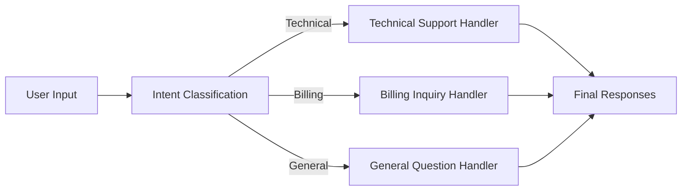
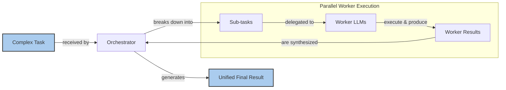

# Stop Building Monolithic LLM Calls. Use Workflows.

In our previous lessons, we built a solid foundation in AI Engineering. We mapped the agent landscape, distinguished between rule-based workflows and autonomous agents, and explored context engineering. Now, we will tackle a fundamental challenge: moving beyond single, monolithic LLM calls to build robust, multi-step systems.

I remember a project where we were building a content generation pipeline. The goal was to take a long, unstructured document and produce a summary, a list of keywords, a set of social media posts, and a structured JSON object with key metadata. Our first instinct was to build a single, massive prompt that did everything. It seemed efficient. The first iteration worked, but it was slow, expensive, and the outputs were wildly inconsistent. Sometimes the JSON was malformed; other times, the summary missed the main point. Debugging was a nightmare.

This experience taught us a critical lesson: instead of relying on one giant leap of logic, we can break down complex problems into smaller, manageable steps using workflow patterns. This article explores the fundamental patterns for building these workflows: chaining, parallelization, routing, and the orchestrator-worker model. By mastering these, you will learn how to construct sophisticated and reliable LLM applications that are easier to debug, maintain, and scale. In this lesson, we will explore the problems with complex, single LLM calls, see how to build sequential workflows by chaining multiple focused prompts, learn how to speed up workflows by running independent tasks in parallel, implement dynamic behavior using routing and conditional logic, and use the orchestrator-worker pattern for dynamic task decomposition.

## Section 1 - The Challenge with Complex Single LLM Calls

Trying to solve a multi-step problem with a single, complex LLM call is an anti-pattern. While it might seem efficient, it introduces a host of issues that make production systems brittle and unpredictable. A monolithic prompt makes it nearly impossible to pinpoint where things go wrong. If the final output is incorrect, was it a failure in understanding the first instruction, a mistake in the third step, or an issue with the final formatting? Without clear intermediate results, you are left guessing. This lack of modularity also means that improving one part of the logic can unintentionally degrade another.

Furthermore, long and complex prompts are more susceptible to the "lost-in-the-middle" problem. A 2023 study by researchers from Stanford, UC Berkeley, and Samaya AI found that LLMs exhibit a U-shaped performance curve when retrieving information from long contexts. They pay the most attention to the beginning and end of their context window, often ignoring crucial information buried in the middle. This isn't just a quirk; it's a structural bias rooted in the Transformer architecture itself. Two primary causes have been identified: **causal attention masking**, where early tokens naturally receive more cumulative attention, and **positional encoding decay**, which creates a "dead zone" for tokens in the middle, far from both the start and the end. Stuffing too many instructions into one prompt increases the risk that some will be overlooked, leading to less reliable outputs [[2]](https://dev.to/thousand_miles_ai/the-lost-in-the-middle-problem-why-llms-ignore-the-middle-of-your-context-window-3al2), [[1]](https://www.mdpi.com/2079-9292/13/23/4712), [[5]](https://arxiv.org/html/2505.13360v1).

Monolithic prompts also suffer from issues like **instruction neglect**, where the model overlooks parts of a long prompt, and **contextual drift**, where it loses track of the initial context as it processes a lengthy request. This can lead to error amplification, where a small misinterpretation early on cascades into a major failure in the final output. Studies have shown that as the number of requirements in a single prompt increases, model accuracy steadily drops. For example, GPT-4o's accuracy can fall from 98.7% on a single requirement to 85% on a prompt with 19 requirements [[19]](https://www.linkedin.com/posts/talalkhan_small-chained-prompts-big-monolithic-ones-activity-7373354959968354304-Y8mw), [[20]](https://aman.ai/primers/ai/agentic-design-patterns/), [[5]](https://arxiv.org/html/2505.13360v1).

Let's look at a practical example. We will use the Google Gemini API to generate a Frequently Asked Questions (FAQ) page from a few mock web pages about renewable energy.

### Setup

First, we set up our environment and initialize the Gemini client. We will use `gemini-1.5-flash`, a model that balances speed and cost.

```python
import asyncio
from enum import Enum
import random
import time

from pydantic import BaseModel, Field
from google import genai
from google.genai import types

from lessons.utils import env

env.load(required_env_vars=["GOOGLE_API_KEY"])

client = genai.Client()
MODEL_ID = "gemini-1.5-flash"
```

Next, we define our source content—three mock web pages on solar, wind, and energy storage.

```python
webpage_1 = {
    "title": "The Benefits of Solar Energy",
    "content": """
    Solar energy is a renewable powerhouse...
    """,
}

webpage_2 = {
    "title": "Understanding Wind Turbines",
    "content": """
    Wind turbines are towering structures...
    """,
}

webpage_3 = {
    "title": "Energy Storage Solutions",
    "content": """
    Effective energy storage is the key...
    """,
}

all_sources = [webpage_1, webpage_2, webpage_3]

combined_content = "\n\n".join(
    [f"Source Title: {source['title']}\nContent: {source['content']}" for source in all_sources]
)
```

### A Practical Example

Now, we will create a complex prompt that asks the LLM to generate questions, find answers, and cite sources all in one go.

```python
# This prompt tries to do everything at once: generate questions, find answers,
# and cite sources. This complexity can often confuse the model.
n_questions = 10
prompt_complex = f"""
Based on the provided content from three webpages, generate a list of exactly {n_questions} frequently asked questions (FAQs).
For each question, provide a concise answer derived ONLY from the text.
After each answer, you MUST include a list of the 'Source Title's that were used to formulate that answer.

<provided_content>
{combined_content}
</provided_content>
""".strip()

# Pydantic classes for structured outputs
class FAQ(BaseModel):
    """A FAQ is a question and answer pair, with a list of sources used to answer the question."""
    question: str = Field(description="The question to be answered")
    answer: str = Field(description="The answer to the question")
    sources: list[str] = Field(description="The sources used to answer the question")

class FAQList(BaseModel):
    """A list of FAQs"""
    faqs: list[FAQ] = Field(description="A list of FAQs")

# Generate FAQs
config = types.GenerateContentConfig(
    response_mime_type="application/json",
    response_schema=FAQList
)
response_complex = client.models.generate_content(
    model=MODEL_ID,
    contents=prompt_complex,
    config=config
)
result_complex = response_complex.parsed
```

It outputs:

```text
{
  "question": "Why is energy storage crucial for renewable energy sources like solar and wind?",
  "answer": "Effective energy storage is key to unlocking the full potential of renewable sources because it allows storing excess energy when plentiful and releasing it when needed, which is crucial for a stable power grid.",
  "sources": [
    "Energy Storage Solutions",
    "Understanding Wind Turbines"
  ]
}
```

The output looks reasonable at first glance. However, the more complex the instructions become, the higher the chance of inaccuracies. For example, the model might miss that an answer is derived from multiple sources or fail to follow the JSON format perfectly every time. This unreliability is a major blocker for production systems.

## Section 2 - The Power of Modularity: Why Chain LLM Calls?

Instead of a single monolithic prompt, we can break down the task into a sequence of simpler, focused steps. This approach, known as prompt chaining, connects multiple LLM calls where the output of one step becomes the input for the next. It is a classic "divide and conquer" strategy that aligns with the Unix philosophy of using small, specialized tools that do one thing well [[17]](https://www.promptingguide.ai/techniques/prompt_chaining), [[16]](https://docs.anthropic.com/en/docs/build-with-claude/prompt-engineering/chain-prompts), [[19]](https://www.linkedin.com/posts/talalkhan_small-chained-prompts-big-monolithic-ones-activity-7373354959968354304-Y8mw).

Chaining offers several advantages over a single-prompt approach. This modularity is rooted in established software engineering principles like **separation of concerns** and **progressive refinement**, which reduce cognitive load for both the developer and the model. These concepts are not new; they are borrowed from fields like Business Process Management (BPM), where complex processes have long been modeled as a series of modular, interconnected steps [[15]](https://www.decodingai.com/p/stop-building-ai-agents-use-these), [[21]](https://www.sundeepteki.org/advice/the-definitive-guide-to-prompt-engineering-from-principles-to-production), [[22]](https://arxiv.org/html/2509.13487v1), [[23]](https://ceur-ws.org/Vol-4099/ER25_PAD_Costa.pdf).

**Improved modularity** is the most significant benefit. Each LLM call in the chain handles a specific, well-defined sub-task. This makes the system easier to understand, maintain, and update. You can work on one component without worrying about breaking others.

**Enhanced accuracy** is another key outcome. Simpler, more targeted prompts are less confusing for the LLM, leading to more reliable and consistent outputs for each step. This reduces the likelihood of the model misunderstanding instructions or generating incomplete results [[3]](https://aclanthology.org/2025.ommm-1.4.pdf).

**Easier debugging** naturally follows from modularity. When a workflow fails, you can inspect the input and output of each step to pinpoint the exact point of failure. This is far more effective than trying to debug a single, opaque LLM call.

**Increased flexibility** allows you to swap, update, or optimize individual components independently. You could, for instance, use a fast, cost-effective model for a simple classification step and a more powerful, expensive model for a complex generation task within the same workflow.

However, chaining is not a silver bullet. It can increase latency, as you have to wait for multiple sequential API calls to complete. It can also be more expensive due to higher overall token usage. There is also a risk of information loss between steps. Without careful management, chained workflows can suffer from **context rot**, where the quality of information degrades from one step to the next as noise accumulates. Furthermore, some instructions may only make sense together and lose their intended meaning when split across multiple prompts. Empirical studies show that the assumption of simpler, single-task prompts always outperforming complex ones is not universally true; performance is highly dependent on the specific model's architecture [[14]](https://futureagi.substack.com/p/how-tool-chaining-fails-in-production), [[1]](https://www.mdpi.com/2079-9292/13/23/4712).

## Section 3 - Building a Sequential Workflow: FAQ Generation Pipeline

Let's refactor our FAQ generation task into a three-step sequential workflow:
1.  Generate a list of questions.
2.  For each question, generate an answer.
3.  For each answer, identify the sources.

This modular approach gives us more control and makes the process more reliable.

Image 1: A flowchart illustrating the sequential FAQ generation pipeline.
```mermaid
flowchart LR
  "Input Content" --> "Generate Questions"
  "Generate Questions" --> "Answer Questions"
  "Answer Questions" --> "Find Sources"
```

### Step 1: Generating Questions

First, we create a function that focuses only on generating questions from the provided content. This isolates the task of question ideation, allowing the model to concentrate on creating relevant and diverse inquiries without being distracted by the need to answer them simultaneously. The prompt is simple and direct, asking for a specific number of questions based on the text.

To ensure a structured output, we define a Pydantic model, `QuestionList`, which specifies that the response should be a list of strings. As we learned in Lesson 4, this creates a clear contract with the LLM. The prompt itself is straightforward, instructing the model to generate a list of relevant questions based on the provided content.

```python
class QuestionList(BaseModel):
    """A list of questions"""
    questions: list[str] = Field(description="A list of questions")

prompt_generate_questions = """
Based on the content below, generate a list of {n_questions} relevant and distinct questions that a user might have.

<provided_content>
{combined_content}
</provided_content>
""".strip()

def generate_questions(content: str, n_questions: int = 10) -> list[str]:
    """
    Generate a list of questions based on the provided content.
    """
    config = types.GenerateContentConfig(
        response_mime_type="application/json",
        response_schema=QuestionList
    )
    response_questions = client.models.generate_content(
        model=MODEL_ID,
        contents=prompt_generate_questions.format(n_questions=n_questions, combined_content=content),
        config=config
    )

    return response_questions.parsed.questions

# Test the question generation function
questions = generate_questions(combined_content, n_questions=10)
```

It outputs a list of questions like this:

```text
What are the primary environmental and economic benefits of solar energy?
How do homeowners financially benefit from installing solar panels?
What is the main process by which wind turbines generate electricity?
...
```

### Step 2: Answering Each Question

Next, we create a function dedicated to answering a single question. The prompt explicitly instructs the model to use *only* the provided content, which helps ground the answer and prevent hallucinations. By handling one question at a time, we ensure the model's full attention is on generating a concise and accurate response for that specific query. This focused approach is less prone to errors compared to asking the model to answer multiple questions at once, as it minimizes the cognitive load on the LLM for each individual call.

```python
prompt_answer_question = """
Using ONLY the provided content below, answer the following question.
The answer should be concise and directly address the question.

<question>
{question}
</question>

<provided_content>
{combined_content}
</provided_content>
""".strip()

def answer_question(question: str, content: str) -> str:
    """
    Generate an answer for a specific question using only the provided content.
    """
    answer_response = client.models.generate_content(
        model=MODEL_ID,
        contents=prompt_answer_question.format(question=question, combined_content=content),
    )
    return answer_response.text

# Test the answer generation function
test_question = questions[0]
test_answer = answer_question(test_question, combined_content)
```

It outputs a focused answer:

```text
The primary environmental benefit of solar energy is cutting down greenhouse gas emissions by reducing reliance on fossil fuels. Economically, it allows homeowners to significantly lower their monthly electricity bills and potentially sell excess power back to the grid.
```

### Step 3: Finding the Sources

Finally, a function to identify which of the original documents were used to formulate the answer. This step is crucial for traceability and fact-checking. The prompt provides the question and the generated answer as context, asking the model to act as a verifier and pinpoint the source titles. This separation makes the sourcing task more reliable than trying to do it simultaneously with answer generation. We again use a Pydantic model, `SourceList`, to enforce a structured list of source titles in the output.

```python
class SourceList(BaseModel):
    """A list of source titles that were used to answer the question"""
    sources: list[str] = Field(description="A list of source titles that were used to answer the question")

prompt_find_sources = """
You will be given a question and an answer that was generated from a set of documents.
Your task is to identify which of the original documents were used to create the answer.

<question>
{question}
</question>

<answer>
{answer}
</answer>

<provided_content>
{combined_content}
</provided_content>
""".strip()

def find_sources(question: str, answer: str, content: str) -> list[str]:
    """
    Identify which sources were used to generate an answer.
    """
    config = types.GenerateContentConfig(
        response_mime_type="application/json",
        response_schema=SourceList
    )
    sources_response = client.models.generate_content(
        model=MODEL_ID,
        contents=prompt_find_sources.format(question=question, answer=answer, combined_content=content),
        config=config
    )
    return sources_response.parsed.sources

# Test the source finding function
test_sources = find_sources(test_question, test_answer, combined_content)
```

It outputs the correct source:

```text
['The Benefits of Solar Energy']
```

### Putting It All Together: The Sequential Workflow

Now, we combine these functions into a single sequential workflow. The `sequential_workflow` function first calls `generate_questions` to get the list of questions. Then, it iterates through each question, calling `answer_question` and `find_sources` in sequence. Each completed FAQ object, containing the question, answer, and sources, is appended to a final list. This step-by-step process ensures that each part of the task is handled with precision, leading to a high-quality final output.

```python
def sequential_workflow(content, n_questions=10) -> list[FAQ]:
    """
    Execute the complete sequential workflow for FAQ generation.
    """
    # Generate questions
    questions = generate_questions(content, n_questions)

    # Answer and find sources for each question sequentially
    final_faqs = []
    for question in questions:
        # Generate an answer for the current question
        answer = answer_question(question, content)

        # Identify the sources for the generated answer
        sources = find_sources(question, answer, content)

        faq = FAQ(
            question=question,
            answer=answer,
            sources=sources
        )
        final_faqs.append(faq)

    return final_faqs

# Execute the sequential workflow (measure time for comparison)
start_time = time.monotonic()
sequential_faqs = sequential_workflow(combined_content, n_questions=4)
end_time = time.monotonic()
print(f"Sequential processing completed in {end_time - start_time:.2f} seconds")
```

It outputs:

```text
Sequential processing completed in 22.20 seconds

{
  "question": "What are the primary financial benefits of installing solar panels for homeowners, and are there any initial costs to consider?",
  "answer": "The primary financial benefits of installing solar panels for homeowners are significantly lowered monthly electricity bills and, in some cases, the ability to sell excess power back to the grid. The initial installation cost can be high.",
  "sources": [
    "The Benefits of Solar Energy"
  ]
}
...
```

By breaking the task into a chain, we have created a more robust and debuggable system. Each step is simple and focused, which leads to more reliable results. However, processing four questions took over 20 seconds. This latency might be unacceptable for many real-time applications.
<aside>
💡 For even better results, you can tune the model's parameters for each step in the chain. For example, you could use a higher `temperature` for the `generate_questions` step to encourage more creative and diverse questions. For the `answer_question` and `find_sources` steps, a lower `temperature` would produce more deterministic and factually accurate outputs, improving traceability and reducing hallucinations [[25]](https://promptengineering.org/prompt-engineering-with-temperature-and-top-p/).
</aside>

## Section 4 - Optimizing Sequential Workflows With Parallel Processing

Our sequential workflow processes each question one by one. However, the tasks for each question—answering it and finding its sources—are independent of the others. This is a perfect opportunity for parallelization. By running these independent tasks concurrently, we can significantly reduce the total processing time. LLM API calls are I/O-bound tasks, meaning the program spends most of its time waiting for a response from the network. Concurrency allows the program to make other API calls during these waiting periods, rather than sitting idle.

### Implementing the Parallel Workflow with asyncio

We can implement this using Python’s `asyncio` library, which is well-suited for I/O-bound operations like making API calls to an LLM. It allows our program to initiate multiple API requests without waiting for each one to complete, effectively overlapping the wait times and improving overall throughput. We will create asynchronous versions of our `answer_question` and `find_sources` functions using the `async` and `await` keywords. The `async def` syntax defines a coroutine, a special function that can be paused and resumed, and `await` is used to pause the execution until the I/O operation (the API call) is complete [[12]](https://santhalakshminarayana.github.io/blog/concurrency-patterns-python), [[13]](https://medium.com/@sizanmahmud08/python-concurrency-showdown-asyncio-vs-threading-vs-multiprocessing-which-should-you-choose-in-31205161899a).

```python
async def answer_question_async(question: str, content: str) -> str:
    """
    Async version of answer_question function.
    """
    prompt = prompt_answer_question.format(question=question, combined_content=content)
    response = await client.aio.models.generate_content(
        model=MODEL_ID,
        contents=prompt
    )
    return response.text

async def find_sources_async(question: str, answer: str, content: str) -> list[str]:
    """
    Async version of find_sources function.
    """
    prompt = prompt_find_sources.format(question=question, answer=answer, combined_content=content)
    config = types.GenerateContentConfig(
        response_mime_type="application/json",
        response_schema=SourceList
    )
    response = await client.aio.models.generate_content(
        model=MODEL_ID,
        contents=prompt,
        config=config
    )
    return response.parsed.sources
```

Next, we define a function to process a single question by running its sub-tasks in parallel.

```python
async def process_question_parallel(question: str, content: str) -> FAQ:
    """
    Process a single question by generating answer and finding sources in parallel.
    """
    answer = await answer_question_async(question, content)
    sources = await find_sources_async(question, answer, content)
    return FAQ(
        question=question,
        answer=answer,
        sources=sources
    )
```

Finally, we create the main parallel workflow. The question generation step remains sequential, but we then use `asyncio.gather` to execute the processing for all questions concurrently. This function takes a list of awaitable tasks and runs them all at the same time, collecting the results once they are all complete.

```python
async def parallel_workflow(content: str, n_questions: int = 10) -> list[FAQ]:
    """
    Execute the complete parallel workflow for FAQ generation.
    """
    # Generate questions (this step remains synchronous)
    questions = generate_questions(content, n_questions)

    # Process all questions in parallel
    tasks = [process_question_parallel(question, content) for question in questions]
    parallel_faqs = await asyncio.gather(*tasks)

    return parallel_faqs

# Execute the parallel workflow (measure time for comparison)
start_time = time.monotonic()
parallel_faqs = await parallel_workflow(combined_content, n_questions=4)
end_time = time.monotonic()
print(f"Parallel processing completed in {end_time - start_time:.2f} seconds")
```

It outputs:

```text
Parallel processing completed in 8.98 seconds

{
  "question": "What are the primary environmental and economic benefits of using solar energy?",
  "answer": "The primary environmental benefit of solar energy is cutting down greenhouse gas emissions by reducing reliance on fossil fuels.\n\nThe primary economic benefits include significantly lower monthly electricity bills, the ability to sell excess power back to the grid, long-term savings, and contributing to energy independence for nations.",
  "sources": [
    "The Benefits of Solar Energy"
  ]
}
...
```

### Sequential vs. Parallel: A Comparison

By parallelizing the independent tasks, we reduced the execution time from 22.20 seconds to just 8.98 seconds—a more than 2x speedup. While parallel processing offers a significant performance boost, it also introduces complexity. You must be mindful of API rate limits, as firing off many requests at once can easily exceed your quota. Production systems require robust error handling, rate limiting, and exponential backoff strategies to manage this. Wrapping each step in try-catch blocks and implementing a retry budget can prevent a single failing call from bringing down the entire workflow [[4]](https://tianpan.co/blog/2026-03-11-llm-api-resilience-production), [[32]](https://deepchecks.com/orchestrating-multi-step-llm-chains-best-practices/).

The utility of parallelization extends beyond simple optimization. It enables entirely new applications, particularly in creative fields. For example, systems for interactive storytelling use parallel LLM calls to simultaneously explore multiple "what-if" narrative branches, allowing for richer and more dynamic user experiences than a purely linear approach could offer [[26]](https://aclanthology.org/2025.wnu-1.16.pdf).

## Section 5 - Introducing Dynamic Behavior: Routing and Conditional Logic

So far, our workflows have been linear. Every input goes through the same sequence of steps. But what if you need to handle different types of inputs in different ways? This is where routing comes in. Routing introduces conditional logic into your workflow, allowing you to direct inputs down different paths based on their characteristics. It is a useful way to manage complexity and keep your prompts specialized. Instead of one monolithic prompt that tries to handle every possible case, you create multiple, specialized prompts and use a router to choose the right one [[15]](https://www.decodingai.com/p/stop-building-ai-agents-use-these).

An LLM itself can act as the router. By giving it a classification task, you can use its output to make branching decisions in your code. This adheres to the "divide and conquer" principle: keep each component focused on a single responsibility. This pattern is common in digital media production, where a routing step can direct simple tasks like generating metadata to a fast, inexpensive model, while sending complex creative tasks like scriptwriting to a more powerful, high-performance model. This optimizes both cost and quality across the workflow [[27]](https://latitude.so/blog/dynamic-llm-routing-tools-and-frameworks).

Beyond simple classification, more advanced workflows can use **semantic routing**. This technique involves converting the user query into a vector embedding and comparing its similarity to a database of example queries for each route. This approach is often more robust for handling nuanced or ambiguous inputs. For example, Amazon Bedrock uses this method to dynamically route prompts between different models, reporting cost savings of up to 30% while maintaining quality [[28]](https://aws.amazon.com/blogs/machine-learning/multi-llm-routing-strategies-for-generative-ai-applications-on-aws/). This allows for a more flexible and adaptive system that can handle a wider range of user inputs effectively.

## Section 6 - Building a Basic Routing Workflow

Let's build a simple routing workflow for a customer service system. The goal is to classify an incoming user query and route it to the appropriate specialized handler. This is a common pattern used to direct different types of customer requests—such as billing questions, technical support issues, or general inquiries—to the correct downstream process, ensuring that each query is handled by the most suitable logic.

Image 2: A flowchart illustrating a customer service routing workflow.


### Step 1: Intent Classification

First, we define the possible intents and create a function to classify a user's query using the LLM. We use Pydantic to define an `Enum` for our intents, which ensures that the model's classification will always be one of the allowed values. This adds a layer of validation and makes our routing logic more robust. The `UserIntent` Pydantic model defines the expected JSON schema for the response, and the prompt instructs the model to classify the query into one of the predefined categories.

```python
class IntentEnum(str, Enum):
    """
    Defines the allowed values for the 'intent' field.
    """
    TECHNICAL_SUPPORT = "Technical Support"
    BILLING_INQUIRY = "Billing Inquiry"
    GENERAL_QUESTION = "General Question"

class UserIntent(BaseModel):
    """
    Defines the expected response schema for the intent classification.
    """
    intent: IntentEnum = Field(description="The intent of the user's query")

prompt_classification = """
Classify the user's query into one of the following categories.

<categories>
{categories}
</categories>

<user_query>
{user_query}
</user_query>
""".strip()


def classify_intent(user_query: str) -> IntentEnum:
    """Uses an LLM to classify a user query."""
    prompt = prompt_classification.format(
        user_query=user_query,
        categories=[intent.value for intent in IntentEnum]
    )
    config = types.GenerateContentConfig(
        response_mime_type="application/json",
        response_schema=UserIntent
    )
    response = client.models.generate_content(
        model=MODEL_ID,
        contents=prompt,
        config=config
    )
    return response.parsed.intent
```

Let's test it with a few queries to see how the classification works in practice.

```python
query_1 = "My internet connection is not working."
intent_1 = classify_intent(query_1)
print(intent_1)
```

It outputs:

```text
IntentEnum.TECHNICAL_SUPPORT
```

### Step 2: Defining Specialized Handlers

Next, we define specialized prompts for each intent. Each prompt is tailored to a specific type of query, giving the LLM a clear role and context. For technical support, the prompt asks for troubleshooting details. For billing, it requests an account number. For general questions, it provides a polite fallback. This is much more effective than a single, generic prompt that tries to handle everything.

```python
prompt_technical_support = """
You are a helpful technical support agent.

Here's the user's query:
<user_query>
{user_query}
</user_query>

Provide a helpful first response, asking for more details like what troubleshooting steps they have already tried.
""".strip()

prompt_billing_inquiry = """
You are a helpful billing support agent.

Here's the user's query:
<user_query>
{user_query}
</user_query>

Acknowledge their concern and inform them that you will need to look up their account, asking for their account number.
""".strip()

prompt_general_question = """
You are a general assistant.

Here's the user's query:
<user_query>
{user_query}
</user_query>

Apologize that you are not sure how to help.
""".strip()
```

Finally, we create a `handle_query` function that uses the classified intent to route the query to the correct prompt. This function acts as the core of our routing logic, using a simple `if/elif/else` structure to direct the flow of execution. It takes the user query and the classified intent as input, selects the appropriate prompt, and calls the LLM to generate the final response.

```python
def handle_query(user_query: str, intent: str) -> str:
    """Routes a query to the correct handler based on its classified intent."""
    if intent == IntentEnum.TECHNICAL_SUPPORT:
        prompt = prompt_technical_support.format(user_query=user_query)
    elif intent == IntentEnum.BILLING_INQUIRY:
        prompt = prompt_billing_inquiry.format(user_query=user_query)
    elif intent == IntentEnum.GENERAL_QUESTION:
        prompt = prompt_general_question.format(user_query=user_query)
    else:
        prompt = prompt_general_question.format(user_query=user_query)
    response = client.models.generate_content(
        model=MODEL_ID,
        contents=prompt
    )
    return response.text
```

Now, when we process a query, it gets routed to the correct specialized handler, which provides a tailored response.

```python
response_1 = handle_query(query_1, intent_1)
```

It outputs:

```text
Hello there! I'm sorry to hear you're having trouble with your internet connection. That can definitely be frustrating.

To help me understand what's going on and assist you best, could you please provide a few more details?
...
```

This routing pattern makes the system more robust and maintainable. Each handler has a single responsibility, and you can add new intents or modify existing ones without rewriting a monolithic prompt [[6]](https://www.vellum.ai/blog/how-to-build-intent-detection-for-your-chatbot).

## Section 7 - Orchestrator-Worker Pattern: Dynamic Task Decomposition

The final pattern we will cover is the orchestrator-worker pattern. This is a more advanced workflow where a central "orchestrator" LLM dynamically breaks down a complex task into smaller sub-tasks and delegates them to specialized "worker" components. The results from the workers are then collected and often synthesized into a final, cohesive response.

### Understanding the Orchestrator-Worker Pattern

This pattern is ideal for complex problems where the necessary steps cannot be predicted in advance. The key difference from simple parallelization is its flexibility: sub-tasks are not pre-defined but are determined at runtime by the orchestrator based on the specific input. This allows the system to adapt to a wide variety of unpredictable queries, making it a useful architecture for sophisticated agentic systems [[7]](https://agents.kour.me/orchestrator-worker/), [[8]](https://mlpills.substack.com/p/diy-17-orchestrator-worker-llm-agent), [[9]](https://platform.claude.com/cookbook/patterns-agents-orchestrator-workers).

However, this pattern introduces trade-offs. It requires multiple LLM calls (one for the orchestrator and one for each worker, plus a synthesizer), which increases latency and cost. The orchestrator can also become a single point of failure; if it misunderstands the goal or creates a poor plan, the entire workflow can fail. It is therefore best avoided for simple, linear tasks where a sequential chain is more efficient [[33]](https://beam.ai/agentic-insights/multi-agent-orchestration-patterns-production), [[7]](https://agents.kour.me/orchestrator-worker/).

Image 3: A flowchart illustrating the orchestrator-worker pattern.


### A Practical Example: Multi-Task Customer Support

Let's implement this for our customer service example. A user might have a single query that involves multiple distinct tasks, such as a billing question, a product return, and an order status update.

### Implementation Details

1.  **The Orchestrator:** The orchestrator's job is to analyze the user's query and break it down into a list of structured tasks. The prompt clearly defines the possible task types and their required parameters, guiding the LLM to produce a machine-readable plan. This step is critical, as the quality of the decomposition directly impacts the effectiveness of the entire workflow. The orchestrator must accurately identify each sub-task and extract all necessary parameters from the user's free-form text.

    ```python
    class QueryTypeEnum(str, Enum):
        BILLING_INQUIRY = "BillingInquiry"
        PRODUCT_RETURN = "ProductReturn"
        STATUS_UPDATE = "StatusUpdate"
    
    class Task(BaseModel):
        query_type: QueryTypeEnum
        invoice_number: str | None = None
        product_name: str | None = None
        reason_for_return: str | None = None
        order_id: str | None = None
    
    class TaskList(BaseModel):
        tasks: list[Task]
    
    prompt_orchestrator = f"""
    You are a master orchestrator. Your job is to break down a complex user query into a list of sub-tasks...
    
    Here's the user's query.
    <user_query>
    {{query}}
    </user_query>
    """.strip()
    
    def orchestrator(query: str) -> list[Task]:
        """Breaks down a complex query into a list of tasks."""
        prompt = prompt_orchestrator.format(query=query)
        config = types.GenerateContentConfig(
            response_mime_type="application/json",
            response_schema=TaskList
        )
        response = client.models.generate_content(
            model=MODEL_ID,
            contents=prompt,
            config=config
        )
        return response.parsed.tasks
    ```

2.  **The Workers:** We define specialized worker functions for each task type. These workers might call other LLMs, query databases, or interact with external APIs. For this example, they will simulate these actions and return structured data. Each worker is a self-contained unit of logic with a single responsibility, which makes the system modular and easy to extend.

    ```python
    # Billing Worker
    def handle_billing_worker(invoice_number: str, original_user_query: str) -> BillingTask:
        # ... uses an LLM to extract the specific concern and simulates opening an investigation
        ...
    
    # Return Worker
    def handle_return_worker(product_name: str, reason_for_return: str) -> ReturnTask:
        # ... simulates generating an RMA number and return instructions
        ...
    
    # Status Worker
    def handle_status_worker(order_id: str) -> StatusTask:
        # ... simulates fetching order status from a backend
        ...
    ```

3.  **The Synthesizer:** After the workers complete their tasks, a synthesizer LLM combines their structured outputs into a single, user-friendly response. This step is crucial for presenting the results in a coherent and easy-to-understand format. The synthesizer's prompt is designed to take a list of structured results and weave them into a natural language message.

    ```python
    prompt_synthesizer = """
    You are a master communicator. Combine several distinct pieces of information from our support team into a single, well-formatted, and friendly email to a customer.
    
    Here are the points to include, based on the actions taken for their query:
    <points>
    {formatted_results}
    </points>
    
    Combine these points into one cohesive response.
    """.strip()
    
    def synthesizer(results: list[BaseModel]) -> str:
        # ... formats worker results and calls the LLM to generate a cohesive message
        ...
    ```

4.  **The Pipeline:** Finally, we tie everything together in a main pipeline function that coordinates the entire workflow. This function first calls the orchestrator to get the task list, then iterates through the tasks, dispatching each one to the appropriate worker. Once all workers have returned their results, it passes them to the synthesizer to generate the final response.

    ```python
    def process_user_query(user_query):
        """Processes a query using the Orchestrator-Worker-Synthesizer pattern."""
        # 1. Run orchestrator
        tasks_list = orchestrator(user_query)
    
        # 2. Run workers
        worker_results = []
        for task in tasks_list:
            if task.query_type == QueryTypeEnum.BILLING_INQUIRY:
                worker_results.append(handle_billing_worker(task.invoice_number, user_query))
            # ... dispatch to other workers
    
        # 3. Run synthesizer
        final_user_message = synthesizer(worker_results)
        print(final_user_message)
    ```

Let's test it with a complex query that requires all three workers.

```python
complex_customer_query = """
Hi, I'm writing to you because I have a question about invoice #INV-7890. It seems higher than I expected.
Also, I would like to return the 'SuperWidget 5000' I bought because it's not compatible with my system.
Finally, can you give me an update on my order #A-12345?
""".strip()

process_user_query(complex_customer_query)
```

First, the orchestrator deconstructs the query into three distinct tasks:

```text
Deconstructed task 1:
{
  "query_type": "BillingInquiry",
  "invoice_number": "INV-7890",
  ...
}

Deconstructed task 2:
{
  "query_type": "ProductReturn",
  "product_name": "SuperWidget 5000",
  "reason_for_return": "not compatible with my system",
  ...
}

Deconstructed task 3:
{
  "query_type": "StatusUpdate",
  "order_id": "A-12345",
  ...
}
```

Then, each worker executes its specialized function, producing structured results. Finally, the synthesizer combines these results into a single, clear response for the customer.

```text
Dear Customer,

Thank you for reaching out. Here is a summary of the actions we've taken regarding your query:

Regarding your BillingInquiry:
  - Invoice Number: INV-7890
  - Your Stated Concern: "The invoice seems higher than expected."
  - Our Action: An investigation (Case ID: INV_CASE_5641) has been opened regarding your concern.
  - Expected Resolution: We will get back to you within 2 business days.

Regarding your ProductReturn:
  - Product: SuperWidget 5000
  - Reason for Return: "it's not compatible with my system"
  - Return Authorization (RMA): RMA-61989
  - Instructions: Please pack the 'SuperWidget 5000' securely...

Regarding your StatusUpdate:
  - Order ID: A-12345
  - Current Status: Shipped
  - Carrier: SuperFast Shipping
  - Tracking Number: SF252702
  - Delivery Estimate: Tomorrow

We hope this addresses all your concerns. Please let us know if you have any other questions.

Best regards,
Your Support Team
```

Effective context management is essential for this pattern. A key principle is to pass only the minimal effective context to each worker, rather than the full conversation history. This avoids **context pollution**, reduces token costs, and keeps each worker's focus clean. In production, this is often managed with event-driven architectures using tools like Kafka to handle tasks asynchronously at scale. By combining dynamic decomposition with careful systems design, the orchestrator-worker pattern provides a scalable architecture for many advanced agentic systems [[7]](https://agents.kour.me/orchestrator-worker/), [[34]](https://www.confluent.io/blog/event-driven-multi-agent-systems/).

## Conclusion

We have moved from the limitations of single, monolithic prompts to the utility of modular workflows. By breaking down complex tasks into smaller, focused steps, we gain reliability, debuggability, and flexibility. We have seen how to implement sequential chains for ordered tasks, use parallelization to drastically reduce latency, and apply routing for dynamic, conditional logic. Finally, the orchestrator-worker pattern gives us a framework for dynamically decomposing and delegating tasks at runtime.

These patterns—chaining, parallelization, routing, and orchestration—are not just theoretical concepts; they are the essential building blocks for almost any production-grade LLM application. They represent a shift in thinking from prompt engineering to systems engineering. In the upcoming lessons, we will build upon these foundations as we explore how to give our workflows the ability to take action with tools, implement reasoning loops, and manage memory.

## References

- [1] Gozzi, M., & Di Maio, F. (2024). Comparative Analysis of Prompt Strategies for Large Language Models: Single-Task vs. Multitask Prompts. Electronics, 13(23), 4712. [https://www.mdpi.com/2079-9292/13/23/4712](https://www.mdpi.com/2079-9292/13/23/4712)
- [2] The "Lost in the Middle" Problem — Why LLMs Ignore the Middle of Your Context Window. (2026). dev.to. [https://dev.to/thousand_miles_ai/the-lost-in-the-middle-problem-why-llms-ignore-the-middle-of-your-context-window-3al2](https://dev.to/thousand_miles_ai/the-lost-in-the-middle-problem-why-llms-ignore-the-middle-of-your-context-window-3al2)
- [3] FLARE: A Framework for Large Language Model-based Agent Reliability Evaluation. (2025). [https://aclanthology.org/2025.ommm-1.4.pdf](https://aclanthology.org/2025.ommm-1.4.pdf)
- [4] Tian, P. (2026). LLM API Resilience in Production: Rate Limits, Failover, and the Hidden Costs of Naive Retry Logic. [https://tianpan.co/blog/2026-03-11-llm-api-resilience-production](https://tianpan.co/blog/2026-03-11-llm-api-resilience-production)
- [5] Underspecification in Instruction-Following. (2025). [https://arxiv.org/html/2505.13360v1](https://arxiv.org/html/2505.13360v1)
- [6] A Beginner's Guide to LLM Intent Classification for Chatbots. (n.d.). Vellum. [https://www.vellum.ai/blog/how-to-build-intent-detection-for-your-chatbot](https://www.vellum.ai/blog/how-to-build-intent-detection-for-your-chatbot)
- [7] Pattern: Orchestrator-Worker (Coordinator). (n.d.). [https://agents.kour.me/orchestrator-worker/](https://agents.kour.me/orchestrator-worker/)
- [8] DIY #17: Orchestrator-Worker LLM Agent. (n.d.). mlpills.substack.com. [https://mlpills.substack.com/p/diy-17-orchestrator-worker-llm-agent](https://mlpills.substack.com/p/diy-17-orchestrator-worker-llm-agent)
- [9] Orchestrator-Workers Workflow. (n.d.). Claude Cookbook. [https://platform.claude.com/cookbook/patterns-agents-orchestrator-workers](https://platform.claude.com/cookbook/patterns-agents-orchestrator-workers)
- [10] Orchestrator-Workers Workflow. (n.d.). Claude Cookbook. [https://platform.claude.com/cookbook/patterns-agents-orchestrator-workers](https://platform.claude.com/cookbook/patterns-agents-orchestrator-workers)
- [11] DIY #17: Orchestrator-Worker LLM Agent. (n.d.). mlpills.substack.com. [https://mlpills.substack.com/p/diy-17-orchestrator-worker-llm-agent](https://mlpills.substack.com/p/diy-17-orchestrator-worker-llm-agent)
- [12] Concurrency patterns in Python. (n.d.). [https://santhalakshminarayana.github.io/blog/concurrency-patterns-python](https://santhalakshminarayana.github.io/blog/concurrency-patterns-python)
- [13] Python Concurrency Showdown: Asyncio vs. Threading vs. Multiprocessing. (n.d.). Medium. [https://medium.com/@sizanmahmud08/python-concurrency-showdown-asyncio-vs-threading-vs-multiprocessing-which-should-you-choose-in-31205161899a](https://medium.com/@sizanmahmud08/python-concurrency-showdown-asyncio-vs-threading-vs-multiprocessing-which-should-you-choose-in-31205161899a)
- [14] How Tool Chaining Fails in Production LLM Agents and How to Fix It. (n.d.). futureagi.substack.com. [https://futureagi.substack.com/p/how-tool-chaining-fails-in-production](https://futureagi.substack.com/p/how-tool-chaining-fails-in-production)
- [15] Iusztin, P. (2024). Stop Building AI Agents. Use These 3 Patterns Instead. Decoding AI. [https://www.decodingai.com/p/stop-building-ai-agents-use-these](https://www.decodingai.com/p/stop-building-ai-agents-use-these)
- [16] Chain Prompts. (n.d.). Anthropic. [https://docs.anthropic.com/en/docs/build-with-claude/prompt-engineering/chain-prompts](https://docs.anthropic.com/en/docs/build-with-claude/prompt-engineering/chain-prompts)
- [17] Saravia, E. (n.d.). Prompt Chaining Guide. PromptingGuide.ai. [https://www.promptingguide.ai/techniques/prompt_chaining](https://www.promptingguide.ai/techniques/prompt_chaining)
- [18] FLARE: A Framework for Large Language Model-based Agent Reliability Evaluation. (2025). [https://aclanthology.org/2025.ommm-1.4.pdf](https://aclanthology.org/2025.ommm-1.4.pdf)
- [19] Khan, T. (2024). Small, chained prompts > big, monolithic ones. LinkedIn. [https://www.linkedin.com/posts/talalkhan_small-chained-prompts-big-monolithic-ones-activity-7373354959968354304-Y8mw](https://www.linkedin.com/posts/talalkhan_small-chained-prompts-big-monolithic-ones-activity-7373354959968354304-Y8mw)
- [20] Agentic Design Patterns. (n.d.). aman.ai. [https://aman.ai/primers/ai/agentic-design-patterns/](https://aman.ai/primers/ai/agentic-design-patterns/)
- [21] Teki, S. (n.d.). The Definitive Guide to Prompt Engineering: From Principles to Production. [https://www.sundeepteki.org/advice/the-definitive-guide-to-prompt-engineering-from-principles-to-production](https://www.sundeepteki.org/advice/the-definitive-guide-to-prompt-engineering-from-principles-to-production)
- [22] Modular AI Workflow Generation. (2025). [https://arxiv.org/html/2509.13487v1](https://arxiv.org/html/2509.13487v1)
- [23] Costa, A., & Franceschetti, D. (2025). LLM4BPMNGen: A Modular and Flexible Tool for Generating BPMN Models with LLMs. [https://ceur-ws.org/Vol-4099/ER25_PAD_Costa.pdf](https://ceur-ws.org/Vol-4099/ER25_PAD_Costa.pdf)
- [24] Singh, A. (n.d.). Context Engineering: Bringing Engineering Rigor to LLM App Development. [https://addyo.substack.com/p/context-engineering-bringing-engineering](https://addyo.substack.com/p/context-engineering-bringing-engineering)
- [25] Prompt Engineering with Temperature and Top_p. (n.d.). promptengineering.org. [https://promptengineering.org/prompt-engineering-with-temperature-and-top-p/](https://promptengineering.org/prompt-engineering-with-temperature-and-top-p/)
- [26] Narrative Studio: A Production-Ready Environment for Structured Narrative Exploration. (2025). [https://aclanthology.org/2025.wnu-1.16.pdf](https://aclanthology.org/2025.wnu-1.16.pdf)
- [27] Dynamic LLM Routing: Tools and Frameworks. (n.d.). Latitude. [https://latitude.so/blog/dynamic-llm-routing-tools-and-frameworks](https://latitude.so/blog/dynamic-llm-routing-tools-and-frameworks)
- [28] Multi-LLM routing strategies for generative AI applications on AWS. (n.d.). AWS Machine Learning Blog. [https://aws.amazon.com/blogs/machine-learning/multi-llm-routing-strategies-for-generative-ai-applications-on-aws/](https://aws.amazon.com/blogs/machine-learning/multi-llm-routing-strategies-for-generative-ai-applications-on-aws/)
- [29] Multi-Agent Orchestration Patterns for Production. (n.d.). Beam. [https://beam.ai/agentic-insights/multi-agent-orchestration-patterns-production](https://beam.ai/agentic-insights/multi-agent-orchestration-patterns-production)
- [30] Pattern: Orchestrator-Worker (Coordinator). (n.d.). [https://agents.kour.me/orchestrator-worker/](https://agents.kour.me/orchestrator-worker/)
- [31] Event-Driven Multi-Agent Systems with Apache Kafka. (n.d.). Confluent. [https://www.confluent.io/blog/event-driven-multi-agent-systems/](https://www.confluent.io/blog/event-driven-multi-agent-systems/)
- [32] Orchestrating Multi-Step LLM Chains: Best Practices. (n.d.). Deepchecks. [https://deepchecks.com/orchestrating-multi-step-llm-chains-best-practices/](https://deepchecks.com/orchestrating-multi-step-llm-chains-best-practices/)
- [33] Multi-Agent Orchestration Patterns for Production. (n.d.). Beam. [https://beam.ai/agentic-insights/multi-agent-orchestration-patterns-production](https://beam.ai/agentic-insights/multi-agent-orchestration-patterns-production)
- [34] Event-Driven Multi-Agent Systems with Apache Kafka. (n.d.). Confluent. [https://www.confluent.io/blog/event-driven-multi-agent-systems/](https://www.confluent.io/blog/event-driven-multi-agent-systems/)