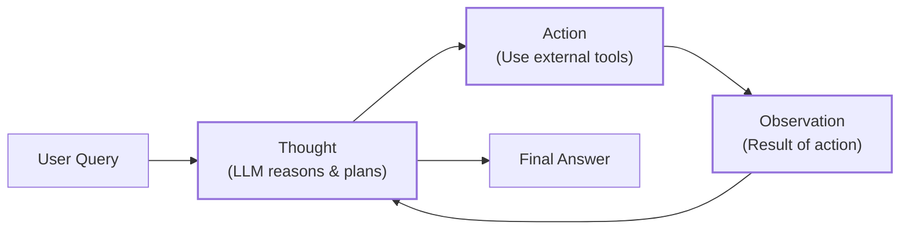
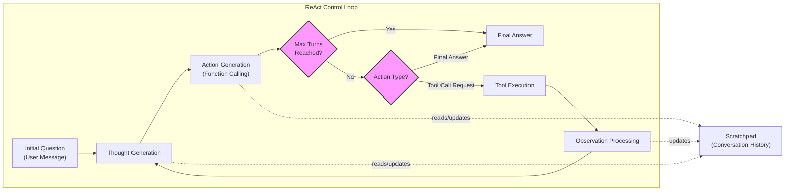

# Lesson 8: Building a ReAct Agent From Scratch

In our last lesson, we explored the theoretical foundations of AI agent planning, focusing on how frameworks like ReAct enable LLMs to reason and act. We learned that ReAct agents break down complex problems by interleaving a `Thought → Action → Observation` cycle. This pattern allows them to interact with external tools, process feedback, and dynamically adjust their strategy [[1]](https://arxiv.org/pdf/2210.03629). While theory is essential, true understanding comes from building.

This lesson is 100% practical. We will shift from theory to implementation and build a minimal ReAct agent from the ground up using only Python and the Gemini API. We will implement the full reasoning and acting loop: defining a mock tool, generating thoughts, selecting actions with function calling, executing the tool, processing observations, and orchestrating the entire process in a turn-based control loop.

By the end, you will have a concrete mental model of how these agents work under the hood. This practical knowledge is what allows you to debug, customize, and extend agentic systems in your own projects.

Here is a high-level overview of the ReAct loop we are about to build.


Image 1: A flowchart illustrating the fundamental ReAct (Reasoning and Acting) loop.

## Setup and Environment

Before we start building, we need to set up our Python environment. A clean and correctly configured setup ensures that your code runs smoothly and that the outputs match the expected traces we will analyze later. This process is crucial for reproducibility and provides the foundation for our agent. This lesson follows the code from the associated notebook, so you can run it side-by-side.

First, we load our `GOOGLE_API_KEY` from an environment file. We use a simple utility function for this, which is good practice for managing secrets and keeping them out of your source code.
```python
from lessons.utils import env

env.load(required_env_vars=["GOOGLE_API_KEY"])
```
It outputs:
```text
Trying to load environment variables from `/path/to/your/project/.env`
Environment variables loaded successfully.
```

Next, we import the necessary packages. We will use `google-genai` for interacting with the Gemini API, which provides the core LLM functionality. For data modeling and validation, we will use `pydantic`, which helps enforce structure on our data, a concept we covered in Lesson 4. We also import standard Python libraries like `enum` and `typing` for creating clean and type-safe code.
```python
from enum import Enum
from pydantic import BaseModel, Field
from typing import List

from google import genai
from google.genai import types

from lessons.utils import pretty_print
```

With the imports in place, we initialize the Gemini client. This object will handle all our API requests to the model.
```python
client = genai.Client()
```
It outputs:
```text
Both GOOGLE_API_KEY and GEMINI_API_KEY are set. Using GOOGLE_API_KEY.
```

Finally, we define the model we will use. For this lesson, we will use `gemini-2.5-flash`. This model is fast and cost-effective, making it an excellent choice for development and experimentation where rapid iteration is key [[22]](https://www.philschmid.de/langgraph-gemini-2-5-react-agent). With the client and model ID in place, we are ready to define the external capabilities our agent can use.

```python
MODEL_ID = "gemini-2.5-flash"
```

## Tool Layer: Mock Search Implementation

An agent's power comes from its ability to interact with the outside world through tools. In a production system, these tools might call a Google Search API, query a database, or interact with a CRM [[27]](https://medium.com/google-cloud/building-react-agents-from-scratch-a-hands-on-guide-using-gemini-ffe4621d90ae). For this lesson, however, we will use a mock `search` tool.

### Tool Design Philosophy

Using a mock tool is a deliberate choice that serves a clear educational purpose. It allows us to isolate the core mechanics of the ReAct framework without getting bogged down in the complexities of real-world API integrations. This approach offers several advantages for learning [[12]](https://www.dailydoseofds.com/ai-agents-crash-course-part-10-with-implementation/):
-   **Focus on ReAct:** It keeps the focus squarely on the `Thought → Action → Observation` loop, which is the main topic of this lesson.
-   **No Dependencies:** It eliminates the need for external API keys or libraries, making the code self-contained and easy to run.
-   **Predictable Responses:** It provides deterministic outputs, which is essential for testing our agent's logic and understanding its behavior in a controlled environment. When the tool's response is predictable, we can more easily debug how the agent reasons about that response.

### Implementation

Our mock `search` function is a simple Python function. It takes a `query` string and returns a predefined response based on the query's content. The docstring is critically important; it serves as the description the LLM will see when deciding whether to use this tool. A clear and descriptive docstring is key to effective tool use, as we discussed in Lesson 6.
```python
def search(query: str) -> str:
    """Search for information about a specific topic or query.

    Args:
        query (str): The search query or topic to look up.
    """
    query_lower = query.lower()

    # Predefined responses for demonstration
    if all(word in query_lower for word in ["capital", "france"]):
        return "Paris is the capital of France and is known for the Eiffel Tower."
    elif "react" in query_lower:
        return "The ReAct (Reasoning and Acting) framework enables LLMs to solve complex tasks by interleaving thought generation, action execution, and observation processing."

    # Generic response for unhandled queries
    return f"Information about '{query}' was not found."
```
If the query contains "capital" and "france", it returns a specific fact. For any other query, it returns a "not found" message. This fallback behavior is crucial for testing how the agent handles failed actions and adapts its strategy.

To manage our tools, we use a `TOOL_REGISTRY`. This dictionary maps the tool's name to the callable function itself. This allows our agent to plan with symbolic tool names, which our code can then resolve to the actual Python functions for execution.
```python
TOOL_REGISTRY = {
    search.__name__: search,
}
```

### Real-World Context

This mock tool, while simple, is a perfect stand-in for a real-world API. In a production application, you could swap this function with one that calls an external service like Google Search or a private knowledge base [[28]](https://atalupadhyay.wordpress.com/2025/11/25/building-a-real-time-web-searching-ai-agent-with-langchain-and-google-gemini/). As long as the function signature and docstring remain consistent, the agent's core logic does not need to change. This modular design, where the tool's implementation is abstracted away from the agent's reasoning process, is a key principle of building scalable and maintainable agentic systems [[29]](https://ai.google.dev/gemini-api/docs/langgraph-example).

## Thought Phase: Prompt Construction and Generation

The first step in the ReAct cycle is "Thought." This is where the agent analyzes the user's query, considers its available tools and conversation history, and plans its next move. We guide this process with a carefully constructed prompt that provides the LLM with all the necessary context to make an informed decision.

To inform the LLM about available tools, we will create a helper function that generates a minimal XML description from our `TOOL_REGISTRY`. This function iterates through the tools, extracts their docstrings, and formats them into a structured XML block. Using XML tags like `<tool>` and `<description>` is a robust prompting strategy that helps the model clearly distinguish different parts of the prompt, improving its ability to follow instructions [[35]](https://ai.google.dev/gemini-api/docs/prompting-strategies).
```python
def build_tools_xml_description(tools: dict[str, callable]) -> str:
    """Build a minimal XML description of tools using only their docstrings."""
    lines = []
    for tool_name, fn in tools.items():
        doc = (fn.__doc__ or "").strip()
        lines.append(f"\t<tool name=\"{tool_name}\">")
        if doc:
            lines.append(f"\t\t<description>")
            for line in doc.split("\n"):
                lines.append(f"\t\t\t{line}")
            lines.append(f"\t\t</description>")
        lines.append("\t</tool>")
    return "\n".join(lines)

tools_xml = build_tools_xml_description(TOOL_REGISTRY)
```

This XML block is then inserted into our `PROMPT_TEMPLATE_THOUGHT`. The prompt instructs the model to act as a decider, using the tool descriptions and conversation history to formulate its next thought. The `{conversation}` placeholder will be dynamically filled with the ongoing dialogue history at each step of the loop.
```python
PROMPT_TEMPLATE_THOUGHT = f"""
You are deciding the next best step for reaching the user goal. You have some tools available to you.

Available tools:
<tools>
{tools_xml}
</tools>

Conversation so far:
<conversation>
{{conversation}}
</conversation>

State your next thought about what to do next as one short paragraph focused on the next action you intend to take and why.
Avoid repeating the same strategies that didn't work previously. Prefer different approaches.
""".strip()
```
Let's inspect the final prompt to see exactly what the model will receive.
```python
print(PROMPT_TEMPLATE_THOUGHT)
```
It outputs:
```text
You are deciding the next best step for reaching the user goal. You have some tools available to you.

Available tools:
<tools>
	<tool name="search">
		<description>
			Search for information about a specific topic or query.
			
			Args:
			    query (str): The search query or topic to look up.
		</description>
	</tool>
</tools>

Conversation so far:
<conversation>
{conversation}
</conversation>

State your next thought about what to do next as one short paragraph focused on the next action you intend to take and why.
Avoid repeating the same strategies that didn't work previously. Prefer different approaches.
```
The output shows that the prompt now contains a clear description of the `search` tool, ready for the LLM to use in its reasoning process. This structured context is essential for the model to understand its capabilities.

Finally, we implement the `generate_thought` function. It takes the current conversation history, formats the complete prompt with the tool descriptions, calls the Gemini model, and returns the generated thought as a clean text string. This function encapsulates the "Reason" part of the ReAct cycle.
```python
def generate_thought(conversation: str, tool_registry: dict[str, callable]) -> str:
    """Generate a thought as plain text (no structured output)."""
    tools_xml = build_tools_xml_description(tool_registry)
    prompt = PROMPT_TEMPLATE_THOUGHT.format(conversation=conversation, tools_xml=tools_xml)

    response = client.models.generate_content(
        model=MODEL_ID,
        contents=prompt
    )
    return response.text.strip()
```
With a coherent thought generated, the agent must now decide whether to call a tool or conclude with a final answer. This brings us to the "Action" phase.

## Action Phase: Function Calling and Parsing

The "Action" phase is where the agent translates its thought into a concrete step. It either selects a tool to use or, if it has enough information, provides a final answer to the user. We will use Gemini's native function calling capability for this, which is more robust and reliable than manually parsing text [[9]](https://ai.google.dev/gemini-api/docs/function-calling).

### System Prompt Strategy

Our prompt for the action phase is focused on the high-level decision. We do not need to include tool descriptions in the text, because we will pass the Python functions directly to the Gemini API. The API automatically extracts the function name, docstring (as the description), and parameter information from the function's signature. This separation of concerns, where the prompt handles strategic guidance and the API configuration handles tool specifics, keeps our prompts clean and makes tool management much easier.

We define two prompt templates. The first is for the standard action-selection step. The second is a special prompt to force a final answer, which we will use as a safety mechanism to prevent infinite loops.
```python
PROMPT_TEMPLATE_ACTION = """
You are selecting the best next action to reach the user goal.

Conversation so far:
<conversation>
{conversation}
</conversation>

Respond either with a tool call (with arguments) or a final answer if you can confidently conclude.
""".strip()

# Dedicated prompt used when we must force a final answer
PROMPT_TEMPLATE_ACTION_FORCED = """
You must now provide a final answer to the user.

Conversation so far:
<conversation>
{conversation}
</conversation>

Provide a concise final answer that best addresses the user's goal.
""".strip()
```

### Function Calling Implementation

To handle the two possible outcomes (a tool call or a final answer), we define two Pydantic models. This provides the structured output validation we discussed in Lesson 4, ensuring that the data flowing from the LLM to our application code is predictable and type-safe.
```python
class ToolCallRequest(BaseModel):
    """A request to call a tool with its name and arguments."""
    tool_name: str = Field(description="The name of the tool to call.")
    arguments: dict = Field(description="The arguments to pass to the tool.")


class FinalAnswer(BaseModel):
    """A final answer to present to the user when no further action is needed."""
    text: str = Field(description="The final answer text to present to the user.")
```

The `generate_action` function orchestrates this phase. If `force_final` is `True` or no tools are provided, it uses the dedicated prompt to generate a `FinalAnswer`. Otherwise, it passes the available tools to the `generate_content` call via the `tools` parameter in the `GenerateContentConfig`.
```python
def generate_action(conversation: str, tool_registry: dict[str, callable] | None = None, force_final: bool = False) -> (ToolCallRequest | FinalAnswer):
    """Generate an action by passing tools to the LLM and parsing function calls or final text.

    When force_final is True or no tools are provided, the model is instructed to produce a final answer and tool calls are disabled.
    """
    # Use a dedicated prompt when forcing a final answer or no tools are provided
    if force_final or not tool_registry:
        prompt = PROMPT_TEMPLATE_ACTION_FORCED.format(conversation=conversation)
        response = client.models.generate_content(
            model=MODEL_ID,
            contents=prompt
        )
        return FinalAnswer(text=response.text.strip())

    # Default action prompt
    prompt = PROMPT_TEMPLATE_ACTION.format(conversation=conversation)

    # Provide the available tools to the model; disable auto-calling so we can parse and run ourselves
    tools = list(tool_registry.values())
    config = types.GenerateContentConfig(
        tools=tools,
        automatic_function_calling={"disable": True}
    )
    response = client.models.generate_content(
        model=MODEL_ID,
        contents=prompt,
        config=config
    )

    # Extract the function call from the response (if present)
    candidate = response.candidates[0]
    parts = candidate.content.parts
    if parts and getattr(parts[0], "function_call", None):
        name = parts[0].function_call.name
        args = dict(parts[0].function_call.args) if parts[0].function_call.args is not None else {}
        return ToolCallRequest(tool_name=name, arguments=args)
    
    # Otherwise, it's a final answer
    final_answer = "".join(part.text for part in candidate.content.parts)
    return FinalAnswer(text=final_answer.strip())
```
We set `automatic_function_calling={"disable": True}` because we want to parse the tool call ourselves and execute it within our control loop. This gives us full control over the agent's execution flow. The logic then checks the response: if it contains a `function_call` object, it parses the name and arguments into our `ToolCallRequest` model. If not, it assumes the response is a text-based final answer and wraps it in our `FinalAnswer` model.

### Error Handling

The option to force a final answer is a crucial safety mechanism. In a ReAct loop, we need a way to terminate gracefully, for example, after a certain number of turns, to avoid infinite loops or excessive costs [[17]](https://medium.com/google-cloud/building-react-agents-from-scratch-a-hands-on-guide-using-gemini-ffe4621d90ae). This flag lets us instruct the model to conclude its work and provide a usable output. Additionally, our control loop will need to handle potential errors during tool execution, such as an invalid tool name or a network failure. We will see how this is managed in the next section.

## Control Loop: Messages, Scratchpad, and Orchestration

Now we arrive at the heart of our agent: the control loop. This is the orchestrator that brings together the Thought, Action, and Observation phases into a coherent, iterative process. To manage the state of the conversation, we will use a "scratchpad" that logs every step of the interaction, serving as the agent's short-term working memory.


Image 2: A detailed flowchart illustrating the ReAct control loop, emphasizing the orchestration of the Thought, Action, and Observation phases within a turn-based iteration, including conditional logic for loop termination and the role of the scratchpad.

### Message Structure Foundation

We start by defining data structures to represent each message in the dialogue. `MessageRole` is an `Enum` that categorizes each interaction, such as a user query, an internal thought, or a tool's observation. The `Message` class is a Pydantic model that holds the role and content for each step, ensuring our conversation history is structured and easy to parse.
```python
class MessageRole(str, Enum):
    """Enumeration for the different roles a message can have."""
    USER = "user"
    THOUGHT = "thought"
    TOOL_REQUEST = "tool request"
    OBSERVATION = "observation"
    FINAL_ANSWER = "final answer"


class Message(BaseModel):
    """A message with a role and content, used for all message types."""
    role: MessageRole = Field(description="The role of the message in the ReAct loop.")
    content: str = Field(description="The textual content of the message.")

    def __str__(self) -> str:
        """Provides a user-friendly string representation of the message."""
        return f"{self.role.value.capitalize()}: {self.content}"
```
We also create a helper function to print these messages in a color-coded, readable format. This will make it easy to trace the agent's execution flow and debug its behavior.
```python
def pretty_print_message(message: Message, turn: int, max_turns: int, header_color: str = pretty_print.Color.YELLOW, is_forced_final_answer: bool = False) -> None:
    if not is_forced_final_answer:
        title = f"{message.role.value.capitalize()} (Turn {turn}/{max_turns}):"
    else:
        title = f"{message.role.value.capitalize()} (Forced):"

    pretty_print.wrapped(
        text=message.content,
        title=title,
        header_color=header_color,
    )
```

### The Scratchpad: The Agent's Working Memory

The `Scratchpad` class manages the list of `Message` objects. Its `append` method not only stores a new message but can also print it verbosely, giving us a real-time trace of the agent's process. The `to_string` method serializes the entire history into a single string, which is then fed back into the model's context for the next turn. This mechanism is crucial for maintaining coherence across multiple steps [[8]](https://www.neradot.com/post/building-a-python-react-agent-class-a-step-by-step-guide).
```python
class Scratchpad:
    """Container for ReAct messages with optional pretty-print on append."""

    def __init__(self, max_turns: int) -> None:
        self.messages: List[Message] = []
        self.max_turns: int = max_turns
        self.current_turn: int = 1

    def set_turn(self, turn: int) -> None:
        self.current_turn = turn

    def append(self, message: Message, verbose: bool = False, is_forced_final_answer: bool = False) -> None:
        self.messages.append(message)
        if verbose:
            role_to_color = {
                MessageRole.USER: pretty_print.Color.RESET,
                MessageRole.THOUGHT: pretty_print.Color.ORANGE,
                MessageRole.TOOL_REQUEST: pretty_print.Color.GREEN,
                MessageRole.OBSERVATION: pretty_print.Color.YELLOW,
                MessageRole.FINAL_ANSWER: pretty_print.Color.CYAN,
            }
            header_color = role_to_color.get(message.role, pretty_print.Color.YELLOW)
            pretty_print_message(
                message=message,
                turn=self.current_turn,
                max_turns=self.max_turns,
                header_color=header_color,
                is_forced_final_answer=is_forced_final_answer,
            )

    def to_string(self) -> str:
        return "\n".join(str(m) for m in self.messages)
```

### The Control Loop Architecture

Finally, the `react_agent_loop` function implements the core orchestration logic. This function is the engine that drives the agent forward.
-   It initializes the `Scratchpad` and adds the initial user question.
-   It then enters a loop that runs for a maximum number of turns (`max_turns`). In each turn, it generates a `Thought`, then an `Action`.
-   If the action is a `FinalAnswer`, the loop terminates and returns the answer.
-   If the action is a `ToolCallRequest`, it executes the corresponding tool from the `TOOL_REGISTRY`.
-   If the loop reaches its `max_turns` limit, it calls `generate_action` one last time with `force_final=True` to ensure a conclusive response.

### Integrated Observation Processing

A key part of the loop is how it handles observations. After a tool is called, its output is captured as an `Observation`. This step includes robust error handling: if the tool execution fails, the error message itself becomes the observation. This allows the agent to reason about the failure in its next thought phase and potentially try a different approach. The observation is then formatted as a `Message` and appended to the scratchpad, closing the loop and preparing the context for the next iteration.
```python
def react_agent_loop(initial_question: str, tool_registry: dict[str, callable], max_turns: int = 5, verbose: bool = False) -> str:
    """
    Implements the main ReAct (Thought -> Action -> Observation) control loop.
    Uses a unified message class for the scratchpad.
    """
    scratchpad = Scratchpad(max_turns=max_turns)

    # Add the user's question to the scratchpad
    user_message = Message(role=MessageRole.USER, content=initial_question)
    scratchpad.append(user_message, verbose=verbose)

    for turn in range(1, max_turns + 1):
        scratchpad.set_turn(turn)

        # Generate a thought based on the current scratchpad
        thought_content = generate_thought(
            scratchpad.to_string(),
            tool_registry,
        )
        thought_message = Message(role=MessageRole.THOUGHT, content=thought_content)
        scratchpad.append(thought_message, verbose=verbose)

        # Generate an action based on the current scratchpad
        action_result = generate_action(
            scratchpad.to_string(),
            tool_registry=tool_registry,
        )

        # If the model produced a final answer, return it
        if isinstance(action_result, FinalAnswer):
            final_answer = action_result.text
            final_message = Message(role=MessageRole.FINAL_ANSWER, content=final_answer)
            scratchpad.append(final_message, verbose=verbose)
            return final_answer

        # Otherwise, it is a tool request
        if isinstance(action_result, ToolCallRequest):
            action_name = action_result.tool_name
            action_params = action_result.arguments

            # Add the action to the scratchpad
            params_str = ", ".join([f"{k}='{v}'" for k, v in action_params.items()])
            action_content = f"{action_name}({params_str})"
            action_message = Message(role=MessageRole.TOOL_REQUEST, content=action_content)
            scratchpad.append(action_message, verbose=verbose)

            # Run the action and get the observation
            observation_content = ""
            tool_function = tool_registry.get(action_name)
            if tool_function:
                try:
                    observation_content = tool_function(**action_params)
                except Exception as e:
                    observation_content = f"Error executing tool '{action_name}': {e}"
            else:
                observation_content = f"Unknown tool '{action_name}'. Available tools: {list(tool_registry.keys())}"


            # Add the observation to the scratchpad
            observation_message = Message(role=MessageRole.OBSERVATION, content=observation_content)
            scratchpad.append(observation_message, verbose=verbose)

        # Check if the maximum number of turns has been reached. If so, force the action selector to produce a final answer
        if turn == max_turns:
            forced_action = generate_action(
                scratchpad.to_string(),
                force_final=True,
            )
            if isinstance(forced_action, FinalAnswer):
                final_answer = forced_action.text
            else:
                final_answer = "Unable to produce a final answer within the allotted turns."
            final_message = Message(role=MessageRole.FINAL_ANSWER, content=final_answer)
            scratchpad.append(final_message, verbose=verbose, is_forced_final_answer=True)
            return final_answer
```

### Extension Possibilities

This implementation provides a solid foundation, but it is just the beginning. You could extend this basic loop in several ways. You could add more sophisticated tools, such as a code interpreter or a database query tool. You could implement a more advanced memory system, allowing the agent to retain information across sessions, a topic we will cover in Lesson 9. You could also explore more complex reasoning patterns, such as self-correction or reflection, where the agent critiques its own thoughts and actions to improve its performance over time [[6]](https://arxiv.org/pdf/2504.19678).

## Tests and Traces: Success and Graceful Fallback

With our agent fully implemented, it is time to test it. Analyzing the execution traces is the best way to understand how the agent reasons and acts. We will run two tests: one with a question our mock tool can answer, and one with a question it cannot. This will validate the end-to-end cycle and demonstrate how the agent handles both success and failure.

### Successful Run

First, let's ask a straightforward factual question that our mock `search` tool is designed to handle: `"What is the capital of France?"`. We will set `max_turns=2` and `verbose=True` to see the detailed trace.
```python
# A straightforward question requiring a search.
question = "What is the capital of France?"
final_answer = react_agent_loop(question, TOOL_REGISTRY, max_turns=2, verbose=True)
```
The trace clearly shows the ReAct cycle in action. In the first turn, the `User` message containing the initial question is added to the scratchpad. The agent then generates a `Thought`, correctly identifying that it needs to use the `search` tool for a factual lookup. This leads to a `Tool request`, where it formulates the call `search(query='capital of France')`. The tool executes, and its output is captured as an `Observation`: "Paris is the capital of France and is known for the Eiffel Tower."

In the second turn, the agent processes this new information. Its `Thought` reflects that the answer has been found and it is ready to conclude. It then generates a `Final answer`, providing the correct and concise response: "Paris is the capital of France." This trace confirms that our agent can successfully use a tool to find information and complete a task within its turn budget. The action phase correctly produced a `ToolCallRequest`, and the control loop executed it, captured the observation, and concluded gracefully.

### Graceful Fallback

Now, let's test the agent's resilience. We will ask a question that our mock tool cannot answer: `"What is the capital of Italy?"`. This will test the agent's ability to handle tool failures and adapt its strategy.
```python
# A query our mock tool doesn't know how to answer, demonstrating fallback.
question = "What is the capital of Italy?"
final_answer = react_agent_loop(question, TOOL_REGISTRY, max_turns=2, verbose=True)
```
The trace for this run demonstrates the agent's ability to handle failure and adapt its reasoning. In the first turn, the agent follows the same initial steps, generating a `Thought` and a `Tool request` for `search(query='capital of Italy')`. However, the `Observation` is the fallback message: "Information about 'capital of Italy' was not found."

This is where the agent's adaptive reasoning becomes apparent. In the second turn, its `Thought` is a direct response to the previous failure. It acknowledges the failed search and changes its strategy, deciding to try a broader search for just "Italy". This shows the agent is not just blindly repeating actions but is actively reasoning about the feedback it receives. This second `Tool request` also fails, as it is not one of our predefined queries.

Because the agent has now reached the `max_turns` limit of 2, the control loop triggers the forced final answer mechanism. The agent correctly and honestly reports that it was unable to find the information. This test validates several key features: the agent's ability to reason about tool failures, its capacity to adapt its strategy, and the robustness of the control loop's forced termination, which ensures the agent always provides a conclusive response [[17]](https://medium.com/google-cloud/building-react-agents-from-scratch-a-hands-on-guide-using-gemini-ffe4621d90ae).

## Conclusion

By building a ReAct agent from scratch, we have moved beyond theory and gained practical insight into the mechanics of agentic AI. We have seen how a simple loop of `Thought → Action → Observation`, orchestrated with clear prompts and structured data models, allows an LLM to reason, plan, and interact with external tools. This foundational understanding of the control loop is essential for any AI engineer.

You now have a working implementation that you can extend, debug, and customize. This foundation is critical. As we move forward in the course, we will build upon these concepts to explore more advanced topics. In our next lessons, we will dive into agent memory and knowledge, showing how agents can remember past interactions and learn over time. We will also take a deep dive into Retrieval-Augmented Generation (RAG), a powerful technique for connecting agents to vast knowledge bases.

The principles we have covered here—clear tool definitions, structured state management, and a robust control loop—are the building blocks of almost any agentic system you will encounter or build.

## References

- [1] Yao, S., Zhao, J., Yu, D., Du, N., Shafran, I., Narasimhan, K., & Cao, Y. (2022). ReAct: Synergizing Reasoning and Acting in Language Models. arXiv. https://arxiv.org/pdf/2210.03629
- [2] ReAct Agent - IBM. (n.d.). IBM. https://www.ibm.com/think/topics/react-agent
- [3] AI Agent Planning - IBM. (n.d.). IBM. https://www.ibm.com/think/topics/ai-agent-planning
- [4] Zhang, B., & S., E. (2024, December 19). Building effective agents. Anthropic. https://www.anthropic.com/engineering/building-effective-agents
- [5] ReAct agent from scratch with Gemini 2.5 and LangGraph. (n.d.). Google AI for Developers. https://ai.google.dev/gemini-api/docs/langgraph-example
- [6] Ferrag, M. A., Tihanyi, N., & Debbah, M. (2025). From LLM Reasoning to Autonomous AI Agents: A Comprehensive Review. arXiv. https://arxiv.org/pdf/2504.19678
- [7] Shankar, A. (2024, June 10). Building ReAct Agents from Scratch using Gemini. Medium. https://medium.com/google-cloud/building-react-agents-from-scratch-a-hands-on-guide-using-gemini-ffe4621d90ae
- [8] Downie, A., & Finio, M. (n.d.). AI Agent Orchestration - IBM. IBM. https://www.ibm.com/think/topics/ai-agent-orchestration
- [9] Function calling. (n.d.). Google AI for Developers. https://ai.google.dev/gemini-api/docs/function-calling
- [10] Neradot. (2024, November 5). Building a Python ReAct Agent Class: A Step-by-Step Guide. Neradot. https://www.neradot.com/post/building-a-python-react-agent-class-a-step-by-step-guide
- [11] Roelants, P. (2024, January 21). Implement a simple ReAct Agent using OpenAI function calling. Peter Roelants. https://peterroelants.github.io/posts/react-openai-function-calling/
- [12] Daily Dose of DS. (2025, April 15). Implementing ReAct Agentic Pattern From Scratch. Daily Dose of DS. https://www.dailydoseofds.com/ai-agents-crash-course-part-10-with-implementation/
- [13] Building ReAct agents from scratch teaches the Think-Act-Observe loop. (2024, June 10). Medium. https://medium.com/google-cloud/building-react-agents-from-scratch-a-hands-on-guide-using-gemini-ffe4621d90ae
- [14] Implementing ReAct from scratch teaches Thought → Action → Observation → Answer loop. (2025, April 15). Daily Dose of DS. https://blog.dailydoseofds.com/p/implement-react-agentic-pattern-from
- [15] LangChain ReAct agent guide teaches structured problem-solving. (2025, August 15). LateNode. https://latenode.com/blog/ai-frameworks-technical-infrastructure/langchain-setup-tools-agents-memory/langchain-react-agent-complete-implementation-guide-working-examples-2025
- [16] Microsoft Agent Framework implements ReAct/SPAR. (2024, July 1). GenMind. https://genmind.ch/posts/Building-ReAct-Agents-with-Microsoft-Agent-Framework-From-Theory-to-Production/
- [17] A hands-on guide to building minimal ReAct agents using Gemini. (2024, June 10). Medium. https://medium.com/google-cloud/building-react-agents-from-scratch-a-hands-on-guide-using-gemini-ffe4621d90ae
- [18] Building a minimal ReAct agent from scratch using Gemini 2.5 Pro or 2.0 Flash with LangGraph. (2025, March 31). Phil Schmid. https://www.philschmid.de/langgraph-gemini-2-5-react-agent
- [19] Official Google guide on minimal ReAct agent with Gemini and LangGraph. (n.d.). Google AI for Developers. https://ai.google.dev/gemini-api/docs/langgraph-example
- [20] Setting Up the Environment for a Gemini-based ReAct agent. (2024, June 10). Medium. https://medium.com/google-cloud/building-react-agents-from-scratch-a-hands-on-guide-using-gemini-ffe4621d90ae
- [21] Using Gemini with OpenAI Agents SDK. (2024, May 29). OpenAI Community. https://community.openai.com/t/using-gemini-with-openai-agents-sdk/1307262
- [22] Environment setup for a Gemini-based ReAct agent with LangGraph. (2025, March 31). Phil Schmid. https://www.philschmid.de/langgraph-gemini-2-5-react-agent
- [23] Official Google guide for Gemini ReAct agent setup. (n.d.). Google AI for Developers. https://ai.google.dev/gemini-api/docs/langgraph-example
- [24] Building an AI coding agent with Python and Gemini. (2024, July 1). freeCodeCamp.org. https://www.freecodecamp.org/news/build-an-ai-coding-agent-with-python-and-gemini/
- [25] OrchDAG: Complex Tool Orchestration in Multi-turn Interactions with Plan DAGs. (2025, October 9). arXiv. https://arxiv.org/html/2510.24663v1
- [26] OrchDAG: Complex Tool Orchestration in Multi-turn Interactions with Plan DAGs. (2025, October 9). Amazon Science. https://www.amazon.science/publications/orchdag-complex-tool-orchestration-in-multi-turn-interactions-with-plan-dags
- [27] Building ReAct agents with Gemini that integrate external APIs. (2024, June 10). Medium. https://medium.com/google-cloud/building-react-agents-from-scratch-a-hands-on-guide-using-gemini-ffe4621d90ae
- [28] Building a real-time web searching AI agent with LangChain and Google Gemini. (2025, November 25). Atal Upadhyay. https://atalupadhyay.wordpress.com/2025/11/25/building-a-real-time-web-searching-ai-agent-with-langchain-and-google-gemini/
- [29] Official Google guide for building a ReAct agent with Gemini and LangGraph. (n.d.). Google AI for Developers. https://ai.google.dev/gemini-api/docs/langgraph-example
- [30] Real-world agent examples with Gemini 3. (2024, July 1). Google for Developers. https://developers.googleblog.com/real-world-agent-examples-with-gemini-3/
- [31] Engineering the Thought-Action-Observation loop for AI agents. (2024, May 22). Towards AI. https://pub.towardsai.net/beyond-the-prompt-engineering-the-thought-action-observation-loop-2e1fd99114d2
- [32] AI Agents through the Thought-Action-Observation (TAO) Cycle. (2024, May 22). Stackademic. https://blog.stackademic.com/ai-agents-iv-ai-agents-through-the-thought-action-observation-tao-cycle-3dfe2eb76629
- [33] Agent Steps and Structure. (n.d.). Hugging Face. https://huggingface.co/learn/agents-course/unit1/agent-steps-and-structure
- [34] Hugging Face Agents Course material. (n.d.). DataCamp. https://projector-video-pdf-converter.datacamp.com/42942/chapter2.pdf
- [35] Prompt design strategies. (n.d.). Google AI for Developers. https://ai.google.dev/gemini-api/docs/prompting-strategies
- [36] Iusztin, P. (2025, November 18). Building Production ReAct Agents From Scratch Is Simple. Decoding AI. https://www.decodingai.com/p/building-production-react-agents
- [37] Neradot. (2024, November 5). Building a Python React Agent Class: A Step-by-Step Guide. Neradot. https://www.neradot.com/post/building-a-python-react-agent-class-a-step-by-step-guide
- [38] Roelants, P. (2024, January 21). Implement a simple ReAct Agent using OpenAI function calling. Peter Roelants. https://peterroelants.github.io/posts/react-openai-function-calling/
- [39] Daily Dose of DS. (2025, April 15). Implementing ReAct Agentic Pattern From Scratch. Daily Dose of DS. https://www.dailydoseofds.com/ai-agents-crash-course-part-10-with-implementation/
- [40] Schmid, P. (2025, March 31). ReAct agent from scratch with Gemini 2.5 and LangGraph. Phil Schmid. https://www.philschmid.de/langgraph-gemini-2-5-react-agent
- [41] ReAct agent from scratch with Gemini 2.5 and LangGraph. (n.d.). Google AI for Developers. https://ai.google.dev/gemini-api/docs/langgraph-example
- [42] Stryker, C. (n.d.). AI Agent Planning - IBM. IBM. https://www.ibm.com/think/topics/ai-agent-planning
- [43] Downie, A., & Finio, M. (n.d.). AI Agent Orchestration - IBM. IBM. https://www.ibm.com/think/topics/ai-agent-orchestration
- [44] Shankar, A. (2024, June 10). Building ReAct Agents from Scratch using Gemini. Medium. https://medium.com/google-cloud/building-react-agents-from-scratch-a-hands-on-guide-using-gemini-ffe4621d90ae
- [45] Ferrag, M. A., Tihanyi, N., & Debbah, M. (2025). From LLM Reasoning to Autonomous AI Agents: A Comprehensive Review. arXiv. https://arxiv.org/pdf/2504.19678
- [46] Bergmann, D. (n.d.). ReAct Agent - IBM. IBM. https://www.ibm.com/think/topics/react-agent
- [47] Yao, S., Zhao, J., Yu, D., Du, N., Shafran, I., Narasimhan, K., & Cao, Y. (2022). ReAct: Synergizing Reasoning and Acting in Language Models. arXiv. https://arxiv.org/pdf/2210.03629