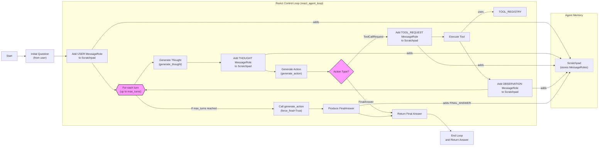

# Building a ReAct Agent From Scratch: A Step-by-Step Guide

In our previous lessons, we built a solid foundation in AI engineering. We mapped the agent landscape, distinguished between LLM workflows and autonomous agents, and mastered context engineering and structured outputs. We then explored function calling and the theory behind agentic reasoning patterns like ReAct. Now, it is time to put that theory into practice.

This lesson is 100% hands-on. We will build a minimal ReAct agent from scratch using only Python and the Gemini API. By implementing the full Thought → Action → Observation loop ourselves, we will demystify what happens inside frameworks like LangGraph or CrewAI. This hands-on approach provides a concrete mental model of how these systems work, giving you the confidence to build, debug, and extend agents for your own applications.

We will walk through the entire process, step-by-step:
1.  Setting up the environment.
2.  Defining a mock tool and a tool registry.
3.  Generating thoughts to guide the agent's reasoning.
4.  Selecting actions with function calling.
5.  Orchestrating the cycle with a control loop and scratchpad.
6.  Testing the agent to see it succeed and handle failures gracefully.

Let’s get started.

## Setup and Environment

Our first step is to set up the Python environment. This ensures your code runs smoothly and that the outputs match the traces we will analyze later. We will initialize the Gemini client, which will serve as the "brain" of our agent.

1. We begin by loading our `GOOGLE_API_KEY` from the environment variables. Our utility function handles this, making sure the key is available for the Gemini client.
    ```python
    from lessons.utils import env
    
    env.load(required_env_vars=["GOOGLE_API_KEY"])
    ```
    It outputs:
    ```text
    Trying to load environment variables from /path/to/your/project/.env
    Environment variables loaded successfully.
    ```

2. Next, we import the necessary packages. We will use `google-genai` for the LLM, `pydantic` for data structures, and `enum` and `typing` for clear type definitions. Our custom `pretty_print` utility will help visualize the agent's traces.
    ```python
    from enum import Enum
    from pydantic import BaseModel, Field
    from typing import List
    
    from google import genai
    from google.genai import types
    
    from lessons.utils import pretty_print
    ```

3. We initialize the Gemini client. This object is our gateway to the Gemini models.
    ```python
    client = genai.Client()
    ```
    It outputs:
    ```text
    Both GOOGLE_API_KEY and GEMINI_API_KEY are set. Using GOOGLE_API_KEY.
    ```

4. Finally, we define the model we will use. For this lesson, we will use `gemini-1.5-flash`, a model that is both fast and cost-effective, making it ideal for our development and testing purposes.
    ```python
    MODEL_ID = "gemini-1.5-flash"
    ```

With the client and model ID in place, our environment is ready. Now, we can define an external capability for our agent to use: a search tool.

## Tool Layer: Mock Search Implementation

To give our agent the ability to act, we need to provide it with tools. For this lesson, we will implement a mock search tool. Instead of making real API calls to a service like Google Search, this tool will return predefined, predictable responses.

This approach has several advantages for learning. It keeps the focus squarely on the ReAct mechanics without the distraction of handling external API keys, network latency, or unpredictable results. It also makes our agent's behavior deterministic, which is essential for testing and understanding the control loop.

1. Our mock `search` function is simple. It takes a string query and returns a hardcoded response if the query matches a known pattern. If the query is not recognized, it returns a "not found" message. The function's docstring is important, as it describes what the tool does. As we learned in Lesson 6, modern LLMs use these docstrings to understand when and how to use a tool.
    ```python
    def search(query: str) -> str:
        """Search for information about a specific topic or query.
    
        Args:
            query (str): The search query or topic to look up.
        """
        query_lower = query.lower()
    
        # Predefined responses for demonstration
        if all(word in query_lower for word in ["capital", "france"]):
            return "Paris is the capital of France and is known for the Eiffel Tower."
        elif "react" in query_lower:
            return "The ReAct (Reasoning and Acting) framework enables LLMs to solve complex tasks by interleaving thought generation, action execution, and observation processing."
    
        # Generic response for unhandled queries
        return f"Information about '{query}' was not found."
    ```

2. To manage our tools, we create a `TOOL_REGISTRY`. This dictionary maps the tool's name (the string name of the Python function) to the function object itself. This registry allows our agent to plan with symbolic tool names, which our code can then safely resolve to the actual functions for execution.
    ```python
    TOOL_REGISTRY = {
        search.__name__: search,
    }
    ```

In a production system, you could easily swap this mock function with a real one that calls an external API, like Google Search or a private knowledge base. As long as the function signature and the purpose described in the docstring remain consistent, the agent's logic does not need to change. This modular design is a key principle of building robust AI systems.

## Thought Phase: Prompt Construction and Generation

The first step in the ReAct cycle is "Thought." This is where the agent analyzes the user's query and its history to decide on the next best action. We will implement this by creating a dedicated prompt that instructs the LLM to generate a single paragraph explaining its reasoning.

1. We start by defining a function, `build_tools_xml_description`, that converts our `TOOL_REGISTRY` into a minimal XML format. This function takes the docstring from each tool and wraps it in `<tool>` and `<description>` tags. Using XML helps the LLM clearly distinguish the tool definitions from other parts of the prompt. This structured approach is a recommended best practice. According to Google's own documentation for Gemini, using clear delimiters like XML tags helps the model distinguish between different parts of a prompt, such as instructions and context, which leads to more reliable responses [[10]](https://ai.google.dev/gemini-api/docs/prompting-strategies).
    ```python
    def build_tools_xml_description(tools: dict[str, callable]) -> str:
        """Build a minimal XML description of tools using only their docstrings."""
        lines = []
        for tool_name, fn in tools.items():
            doc = (fn.__doc__ or "").strip()
            lines.append(f"\t<tool name=\"{tool_name}\">")
            if doc:
                lines.append(f"\t\t<description>")
                for line in doc.split("\n"):
                    lines.append(f"\t\t\t{line}")
                lines.append(f"\t\t</description>")
            lines.append("\t</tool>")
        return "\n".join(lines)
    
    tools_xml = build_tools_xml_description(TOOL_REGISTRY)
    ```

2. Next, we define the prompt template for the thought generation phase. It includes the available tools (in our generated XML format), the conversation history, and clear instructions for the model to state its next thought.
    ```python
    PROMPT_TEMPLATE_THOUGHT = f"""
    You are deciding the next best step for reaching the user goal. You have some tools available to you.
    
    Available tools:
    <tools>
    {tools_xml}
    </tools>
    
    Conversation so far:
    <conversation>
    {{conversation}}
    </conversation>
    
    State your next thought about what to do next as one short paragraph focused on the next action you intend to take and why.
    Avoid repeating the same strategies that didn't work previously. Prefer different approaches.
    """.strip()
    ```

3. Let's inspect the final prompt to see exactly what the LLM will receive.
    ```python
    print(PROMPT_TEMPLATE_THOUGHT)
    ```
    It outputs:
    ```text
    You are deciding the next best step for reaching the user goal. You have some tools available to you.
    
    Available tools:
    <tools>
        <tool name="search">
            <description>
                Search for information about a specific topic or query.
                
                Args:
                    query (str): The search query or topic to look up.
            </description>
        </tool>
    </tools>
    
    Conversation so far:
    <conversation>
    {conversation}
    </conversation>
    
    State your next thought about what to do next as one short paragraph focused on the next action you intend to take and why.
    Avoid repeating the same strategies that didn't work previously. Prefer different approaches.
    ```
    The output shows the clear structure, with the `<tool>` block containing the `search` function's docstring and a placeholder for the ongoing `{conversation}`.

4. Finally, we implement the `generate_thought` function. It takes the current conversation history, formats the prompt template, and calls the Gemini API to generate the thought as plain text.
    ```python
    def generate_thought(conversation: str, tool_registry: dict[str, callable]) -> str:
        """Generate a thought as plain text (no structured output)."""
        tools_xml = build_tools_xml_description(tool_registry)
        prompt = PROMPT_TEMPLATE_THOUGHT.format(conversation=conversation, tools_xml=tools_xml)
    
        response = client.models.generate_content(
            model=MODEL_ID,
            contents=prompt
        )
        return response.text.strip()
    ```

With a coherent thought generated, the agent now has a plan. The next step is to translate this plan into a concrete action, which could be either calling a tool or providing a final answer to the user.

## Action Phase: Function Calling and Parsing

After generating a thought, the agent must decide on an action. This could be calling one of its available tools or, if it has enough information, providing a final answer. We will implement this "Action" phase using Gemini's native function calling capabilities.

A key design choice here is to separate the prompt for generating actions from the one for generating thoughts. The thought prompt includes detailed tool descriptions to help the LLM reason about *what* to do. In contrast, the action prompt focuses only on the high-level decision. We pass the tool definitions directly to the Gemini API via its `tools` configuration parameter. The API handles the low-level details of presenting the tool signatures to the model, which keeps our action prompt clean and focused on strategy.

1. We start by defining two prompt templates. The first, `PROMPT_TEMPLATE_ACTION`, is for general use. The second, `PROMPT_TEMPLATE_ACTION_FORCED`, is a special-purpose prompt we will use to force the agent to provide a final answer, which is useful for ensuring the agent terminates gracefully.
    ```python
    PROMPT_TEMPLATE_ACTION = """
    You are selecting the best next action to reach the user goal.
    
    Conversation so far:
    <conversation>
    {conversation}
    </conversation>
    
    Respond either with a tool call (with arguments) or a final answer if you can confidently conclude.
    """.strip()
    
    # Dedicated prompt used when we must force a final answer
    PROMPT_TEMPLATE_ACTION_FORCED = """
    You must now provide a final answer to the user.
    
    Conversation so far:
    <conversation>
    {conversation}
    </conversation>
    
    Provide a concise final answer that best addresses the user's goal.
    """.strip()
    ```

2. We define Pydantic models to represent the two possible outcomes of the action phase: a `ToolCallRequest` or a `FinalAnswer`. This provides the structure we need for parsing the model's response.
    ```python
    class ToolCallRequest(BaseModel):
        """A request to call a tool with its name and arguments."""
        tool_name: str = Field(description="The name of the tool to call.")
        arguments: dict = Field(description="The arguments to pass to the tool.")
    
    
    class FinalAnswer(BaseModel):
        """A final answer to present to the user when no further action is needed."""
        text: str = Field(description="The final answer text to present to the user.")
    ```

3. Now, we implement the `generate_action` function. This is the core of the action phase. It selects the appropriate prompt, configures the Gemini client with the available tools, and calls the model. The `automatic_function_calling={"disable": True}` setting is important here; it tells the client not to execute the function call automatically, allowing us to parse the response and handle it within our control loop.
    ```python
    def generate_action(conversation: str, tool_registry: dict[str, callable] | None = None, force_final: bool = False) -> (ToolCallRequest | FinalAnswer):
        """Generate an action by passing tools to the LLM and parsing function calls or final text.
    
        When force_final is True or no tools are provided, the model is instructed to produce a final answer and tool calls are disabled.
        """
        # Use a dedicated prompt when forcing a final answer or no tools are provided
        if force_final or not tool_registry:
            prompt = PROMPT_TEMPLATE_ACTION_FORCED.format(conversation=conversation)
            response = client.models.generate_content(
                model=MODEL_ID,
                contents=prompt
            )
            return FinalAnswer(text=response.text.strip())
    
        # Default action prompt
        prompt = PROMPT_TEMPLATE_ACTION.format(conversation=conversation)
    
        # Provide the available tools to the model; disable auto-calling so we can parse and run ourselves
        tools = list(tool_registry.values())
        config = types.GenerateContentConfig(
            tools=tools,
            automatic_function_calling={"disable": True}
        )
        response = client.models.generate_content(
            model=MODEL_ID,
            contents=prompt,
            config=config
        )
    
        # Extract the function call from the response (if present)
        candidate = response.candidates[0]
        parts = candidate.content.parts
        if parts and getattr(parts[0], "function_call", None):
            name = parts[0].function_call.name
            args = dict(parts[0].function_call.args) if parts[0].function_call.args is not None else {}
            return ToolCallRequest(tool_name=name, arguments=args)
        
        # Otherwise, it's a final answer
        final_answer = "".join(part.text for part in candidate.content.parts)
        return FinalAnswer(text=final_answer.strip())
    ```
    The `force_final` flag is a crucial feature for production-ready agents. It provides a mechanism to terminate the agent's loop cleanly, for example, after a maximum number of turns has been reached. This prevents infinite loops and ensures the user always receives a response.

With the thought and action phases implemented, we have all the pieces needed to build the complete ReAct control loop.

## Control Loop: Messages, Scratchpad, Orchestration

The control loop is the heart of our ReAct agent. It orchestrates the Thought → Action → Observation cycle, managing the flow of information and making decisions at each step. To do this, we need a way to track the history of the interaction. We will use a "scratchpad" that stores a sequence of messages, each with a specific role.

1. First, we define the structure for our messages. A `MessageRole` enum categorizes each message, and a `Message` Pydantic model holds the content and role. This structured approach makes it easy to trace the agent's activity. This explicit categorization is not just for readability; it is critical for the agent's cognitive loop. Research on agentic systems has identified "Message Faults," where assigning the wrong role—for instance, labeling a tool observation as a user message—can break the model's reasoning chain and cause it to lose context across turns [[11]](https://arxiv.org/html/2604.08906v1).
    ```python
    class MessageRole(str, Enum):
        """Enumeration for the different roles a message can have."""
        USER = "user"
        THOUGHT = "thought"
        TOOL_REQUEST = "tool request"
        OBSERVATION = "observation"
        FINAL_ANSWER = "final answer"
    
    
    class Message(BaseModel):
        """A message with a role and content, used for all message types."""
        role: MessageRole = Field(description="The role of the message in the ReAct loop.")
        content: str = Field(description="The textual content of the message.")
    
        def __str__(self) -> str:
            """Provides a user-friendly string representation of the message."""
            return f"{self.role.value.capitalize()}: {self.content}"
    ```

2. We create a helper function to pretty-print these messages. This will give us a clear, color-coded trace of the agent's execution, which is invaluable for debugging.
    ```python
    def pretty_print_message(message: Message, turn: int, max_turns: int, header_color: str = pretty_print.Color.YELLOW, is_forced_final_answer: bool = False) -> None:
        if not is_forced_final_answer:
            title = f"{message.role.value.capitalize()} (Turn {turn}/{max_turns}):"
        else:
            title = f"{message.role.value.capitalize()} (Forced):"
    
        pretty_print.wrapped(
            text=message.content,
            title=title,
            header_color=header_color,
        )
    ```

3. The `Scratchpad` class manages the list of messages. Its `append` method adds a new message and can optionally print it. The `to_string` method serializes the entire history into a single string, which we will pass to the LLM as context.
    ```python
    class Scratchpad:
        """Container for ReAct messages with optional pretty-print on append."""
    
        def __init__(self, max_turns: int) -> None:
            self.messages: List[Message] = []
            self.max_turns: int = max_turns
            self.current_turn: int = 1
    
        def set_turn(self, turn: int) -> None:
            self.current_turn = turn
    
        def append(self, message: Message, verbose: bool = False, is_forced_final_answer: bool = False) -> None:
            self.messages.append(message)
            if verbose:
                role_to_color = {
                    MessageRole.USER: pretty_print.Color.RESET,
                    MessageRole.THOUGHT: pretty_print.Color.ORANGE,
                    MessageRole.TOOL_REQUEST: pretty_print.Color.GREEN,
                    MessageRole.OBSERVATION: pretty_print.Color.YELLOW,
                    MessageRole.FINAL_ANSWER: pretty_print.Color.CYAN,
                }
                header_color = role_to_color.get(message.role, pretty_print.Color.YELLOW)
                pretty_print_message(
                    message=message,
                    turn=self.current_turn,
                    max_turns=self.max_turns,
                    header_color=header_color,
                    is_forced_final_answer=is_forced_final_answer,
                )
    
        def to_string(self) -> str:
            return "\n".join(str(m) for m in self.messages)
    ```

4. Now we can implement the main control loop, `react_agent_loop`. This function ties everything together. It iterates up to a maximum number of turns, generating a thought and an action in each turn. If the action is a `FinalAnswer`, the loop terminates. If it is a `ToolCallRequest`, the function executes the tool, captures the output as an "Observation," and appends it to the scratchpad before starting the next turn. If the loop reaches `max_turns`, it calls `generate_action` one last time with `force_final=True` to ensure a graceful exit. This `force_final` mechanism is an example of implementing persistence and recovery, a key principle in designing reliable agentic workflows. Instead of looping indefinitely, the agent has a built-in strategy to handle roadblocks and ensure it can terminate gracefully, which is essential for production systems [[10]](https://ai.google.dev/gemini-api/docs/prompting-strategies).
    ```python
    def react_agent_loop(initial_question: str, tool_registry: dict[str, callable], max_turns: int = 5, verbose: bool = False) -> str:
        """
        Implements the main ReAct (Thought -> Action -> Observation) control loop.
        Uses a unified message class for the scratchpad.
        """
        scratchpad = Scratchpad(max_turns=max_turns)
    
        # Add the user's question to the scratchpad
        user_message = Message(role=MessageRole.USER, content=initial_question)
        scratchpad.append(user_message, verbose=verbose)
    
        for turn in range(1, max_turns + 1):
            scratchpad.set_turn(turn)
    
            # Generate a thought based on the current scratchpad
            thought_content = generate_thought(
                scratchpad.to_string(),
                tool_registry,
            )
            thought_message = Message(role=MessageRole.THOUGHT, content=thought_content)
            scratchpad.append(thought_message, verbose=verbose)
    
            # Generate an action based on the current scratchpad
            action_result = generate_action(
                scratchpad.to_string(),
                tool_registry=tool_registry,
            )
    
            # If the model produced a final answer, return it
            if isinstance(action_result, FinalAnswer):
                final_answer = action_result.text
                final_message = Message(role=MessageRole.FINAL_ANSWER, content=final_answer)
                scratchpad.append(final_message, verbose=verbose)
                return final_answer
    
            # Otherwise, it is a tool request
            if isinstance(action_result, ToolCallRequest):
                action_name = action_result.tool_name
                action_params = action_result.arguments
    
                # Add the action to the scratchpad
                params_str = ", ".join([f"{k}='{v}'" for k, v in action_params.items()])
                action_content = f"{action_name}({params_str})"
                action_message = Message(role=MessageRole.TOOL_REQUEST, content=action_content)
                scratchpad.append(action_message, verbose=verbose)
    
                # Run the action and get the observation
                observation_content = ""
                tool_function = tool_registry[action_name]
                try:
                    observation_content = tool_function(**action_params)
                except Exception as e:
                    observation_content = f"Error executing tool '{action_name}': {e}"
    
                # Add the observation to the scratchpad
                observation_message = Message(role=MessageRole.OBSERVATION, content=observation_content)
                scratchpad.append(observation_message, verbose=verbose)
    
            # Check if the maximum number of turns has been reached. If so, force the action selector to produce a final answer
            if turn == max_turns:
                forced_action = generate_action(
                    scratchpad.to_string(),
                    force_final=True,
                )
                if isinstance(forced_action, FinalAnswer):
                    final_answer = forced_action.text
                else:
                    final_answer = "Unable to produce a final answer within the allotted turns."
                final_message = Message(role=MessageRole.FINAL_ANSWER, content=final_answer)
                scratchpad.append(final_message, verbose=verbose, is_forced_final_answer=True)
                return final_answer
    ```
<aside>
💡 A common failure mode in agentic loops is repetitive or degraded reasoning. According to Gemini's documentation, this can sometimes be caused by setting the model's temperature parameter below the default of 1.0 for complex reasoning tasks. While we are not configuring temperature in this lesson, it is a key parameter to be aware of when debugging agent behavior in production [[10]](https://ai.google.dev/gemini-api/docs/prompting-strategies).
</aside>

This implementation provides a complete, end-to-end ReAct agent. The flowchart below visualizes the entire process, from the initial user question to the final answer, showing how the scratchpad is updated at each step of the loop.


Image 1: A flowchart illustrating the end-to-end ReAct control loop, as implemented by the `react_agent_loop` function.

## Tests and Traces: Success and Graceful Fallback

With our agent fully implemented, it is time to test it. By analyzing the output traces, we can validate that the control loop, tool integration, and termination logic all work as expected. We will run two tests: a straightforward question to demonstrate a successful run, and an unsupported query to see how the agent handles failure and gracefully falls back.

1. First, we test with a simple factual question: `"What is the capital of France?"`. We set `max_turns=2` and `verbose=True` to see the detailed trace.
    ```python
    # A straightforward question requiring a search.
    question = "What is the capital of France?"
    final_answer = react_agent_loop(question, TOOL_REGISTRY, max_turns=2, verbose=True)
    ```
    The agent executes perfectly. In the first turn, it generates a `Thought` identifying the need for a search, makes a `Tool request` to our mock `search` tool, and receives an `Observation` with the correct answer. In the second turn, it generates another `Thought` acknowledging it has the answer and concludes with a `Final answer`. This confirms that the core Thought → Action → Observation → Thought → Answer loop is working correctly. The action phase correctly generates a `ToolCallRequest`, and the control loop executes the tool and captures the observation, all within the turn budget.

2. Now, let's try a query that our mock tool cannot answer: `"What is the capital of Italy?"`.
    ```python
    # An unknown/unsupported query for the mock tool.
    question = "What is the capital of Italy?"
    final_answer = react_agent_loop(question, TOOL_REGISTRY, max_turns=2, verbose=True)
    ```
    This trace demonstrates the agent's resilience. In the first turn, it attempts to search for "capital of Italy," but the `Observation` returns the "not found" message. In the second turn, the agent adapts its strategy. Its `Thought` reflects a new approach: trying a broader search for just "Italy". When that also fails, the loop reaches its `max_turns` limit. The `force_final` mechanism is triggered, and the agent generates a `Final answer (Forced)` admitting it could not find the information. This test validates our error handling and graceful termination logic.

These tests confirm our from-scratch implementation of the ReAct agent is behaving as expected. It can successfully use tools to find answers and can adapt its strategy and terminate cleanly when it encounters information it cannot find.

## Conclusion

By building a ReAct agent from the ground up, we have demystified the core mechanics that power modern AI agents. We have moved beyond theory and implemented a functional Thought-Action-Observation loop, complete with tool use, state management via a scratchpad, and a robust control flow. This hands-on experience provides a concrete mental model that is essential for any AI engineer.

Even if you ultimately use a framework like LangGraph or CrewAI in production, this foundational understanding is invaluable. You now know what is happening under the hood, which empowers you to debug more effectively, customize agent behavior with confidence, and make better architectural decisions. You have learned how to structure prompts for reasoning, integrate external tools, manage conversation history, and orchestrate the entire agentic cycle.

This lesson is a critical step in your journey from Python developer to AI Engineer. The simple loop we built is the foundation for more sophisticated production systems. Real-world applications often combine this ReAct pattern with others, like the orchestrator-worker or evaluator-optimizer patterns, to handle complex, open-ended tasks reliably [[12]](https://levelup.gitconnected.com/your-multi-agent-system-works-in-a-demo-production-is-a-different-story-2f8ff6350664). Furthermore, these principles are not limited to text-based tasks; they are being adapted to control embodied agents, allowing robots to use physical tools and navigate the real world [[13]](https://www2.eecs.berkeley.edu/Pubs/TechRpts/2025/EECS-2025-59.pdf). In our upcoming lessons, we will build on this foundation as we explore more advanced topics like agent memory and Retrieval-Augmented Generation (RAG).

## References

- [1] Yao, S., Zhao, J., Yu, D., Du, N., Shafran, I., Narasimhan, K., & Cao, Y. (2022). ReAct: Synergizing Reasoning and Acting in Language Models. [https://arxiv.org/pdf/2210.03629](https://arxiv.org/pdf/2210.03629)
- [2] ReAct Agent - IBM. [https://www.ibm.com/think/topics/react-agent](https://www.ibm.com/think/topics/react-agent)
- [3] AI Agent Planning - IBM. [https://www.ibm.com/think/topics/ai-agent-planning](https://www.ibm.com/think/topics/ai-agent-planning)
- [4] Building effective agents - Anthropic. [https://www.anthropic.com/engineering/building-effective-agents](https://www.anthropic.com/engineering/building-effective-agents)
- [5] ReAct agent from scratch with Gemini 2.5 and LangGraph. [https://ai.google.dev/gemini-api/docs/langgraph-example](https://ai.google.dev/gemini-api/docs/langgraph-example)
- [6] From LLM Reasoning to Autonomous AI Agents - ArXiv. [https://arxiv.org/pdf/2504.19678](https://arxiv.org/pdf/2504.19678)
- [7] Building ReAct Agents from Scratch using Gemini - Medium. [https://medium.com/google-cloud/building-react-agents-from-scratch-a-hands-on-guide-using-gemini-ffe4621d90ae](https://medium.com/google-cloud/building-react-agents-from-scratch-a-hands-on-guide-using-gemini-ffe4621d90ae)
- [8] AI Agent Orchestration - IBM. [https://www.ibm.com/think/topics/ai-agent-orchestration](https://www.ibm.com/think/topics/ai-agent-orchestration)
- [9] Gemini Function Calling Documentation. [https://ai.google.dev/gemini-api/docs/function-calling](https://ai.google.dev/gemini-api/docs/function-calling)
- [10] Prompt design strategies - Google AI for Developers. [https://ai.google.dev/gemini-api/docs/prompting-strategies](https://ai.google.dev/gemini-api/docs/prompting-strategies)
- [11] On the Brittleness of Agentic Frameworks - ArXiv. [https://arxiv.org/html/2604.08906v1](https://arxiv.org/html/2604.08906v1)
- [12] Your Multi-Agent System Works in a Demo. Production Is a Different Story. - GitConnected. [https://levelup.gitconnected.com/your-multi-agent-system-works-in-a-demo-production-is-a-different-story-2f8ff6350664](https://levelup.gitconnected.com/your-multi-agent-system-works-in-a-demo-production-is-a-different-story-2f8ff6350664)
- [13] Designing LLM based agents to interact with the embodied world - EECS at UC Berkeley. [https://www2.eecs.berkeley.edu/Pubs/TechRpts/2025/EECS-2025-59.pdf](https://www2.eecs.berkeley.edu/Pubs/TechRpts/2025/EECS-2025-59.pdf)