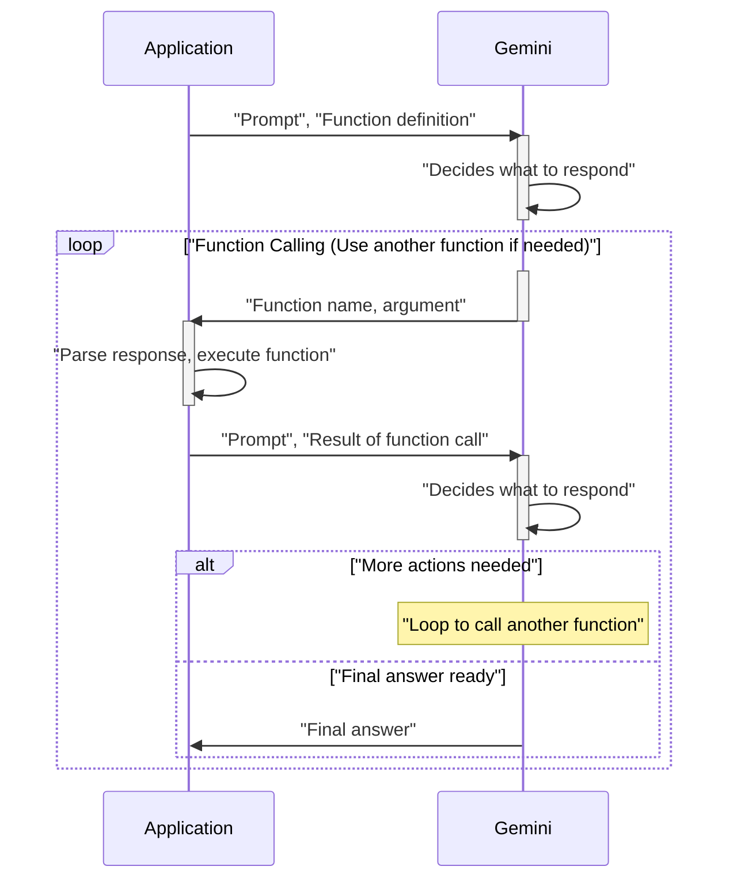
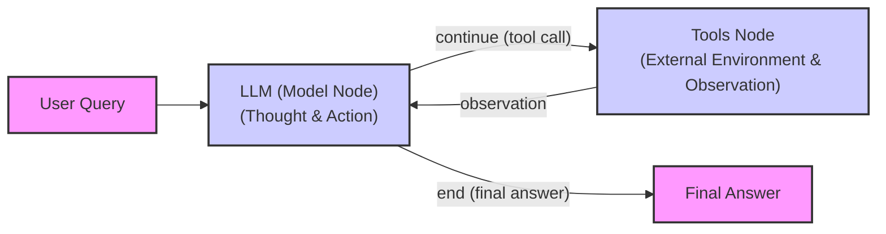

# Build a ReAct Agent From Scratch

In the last lesson, we explored the theoretical foundations of agentic reasoning, focusing on the ReAct framework. We learned how agents can break down complex problems by interleaving thought, action, and observation. While understanding the theory is important, the real learning happens when you build it yourself. Frameworks like LangGraph, LangChain, or CrewAI are powerful, but their abstractions can sometimes hide the underlying logic that makes an agent tick, making it difficult to debug or customize your agent’s behavior [[1]](https://www.dailydoseofds.com/ai-agents-crash-course-part-10-with-implementation/).

This lesson is 100% practical. We will build a minimal ReAct agent from scratch using only Python and the Gemini API. By implementing the complete Thought → Action → Observation loop, you will gain a concrete mental model of how these systems operate. This hands-on experience provides the practical knowledge needed to build robust AI systems. We will define a mock tool, generate thoughts, select actions with function calling, execute those actions, and orchestrate the entire process in a turn-based control loop.

By the end, you will have a working agent and the confidence to extend, debug, and customize it for your own applications.

## Setup and Environment

Our first step is to set up the Python environment to ensure everything runs smoothly. This involves loading API keys, importing the necessary libraries, and initializing the Gemini client. A clean and correctly configured environment is the foundation of any reproducible software project. Our goal is to create a setup that allows you to follow along with the notebook seamlessly and verify that your outputs match the expected traces we will analyze later.

1.  First, we load our `GOOGLE_API_KEY` from an environment file. We use a custom utility function for this, which is a good practice for managing credentials securely and keeping them out of your source code.
    ```python
    from lessons.utils import env

    env.load(required_env_vars=["GOOGLE_API_KEY"])
    ```
    It outputs:
    ```text
    Trying to load environment variables from .../.env
    Environment variables loaded successfully.
    ```

2.  Next, we import the required packages. We will use `google-genai` for interacting with the Gemini API. `pydantic` is essential for data validation and creating structured data models, which, as we learned in Lesson 4, are critical for building reliable AI systems. `enum` and `typing` help us write clean, type-safe Python code. Finally, our custom `pretty_print` utility will help visualize the agent's execution trace in a readable format.
    ```python
    from enum import Enum
    from pydantic import BaseModel, Field
    from typing import List

    from google import genai
    from google.genai import types

    from lessons.utils import pretty_print
    ```

3.  We initialize the Gemini client. This object is our main interface for making API calls to the Gemini models.
    ```python
    client = genai.Client()
    ```
    It outputs:
    ```text
    Both GOOGLE_API_KEY and GEMINI_API_KEY are set. Using GOOGLE_API_KEY.
    ```

4.  Finally, we define the model we will use. For this lesson, we will use `gemini-2.5-flash`. It is designed for speed and efficiency, making it an excellent choice for the rapid, iterative calls that are typical in agentic loops, especially during development and experimentation.
    ```python
    MODEL_ID = "gemini-2.5-flash"
    ```

With the client and model ready, we can now define the external capabilities our agent will use.

## Tool Layer: Mock Search Implementation

To build a ReAct agent, we need to give it tools to interact with the world. In a production system, these might be real API calls to a search engine, a database, or an internal service. For this lesson, however, we will use a mock search tool. This approach has several educational benefits that make it ideal for learning the core mechanics of ReAct.

First, it simplifies the learning process. By using a mock tool, we can focus entirely on the agent's reasoning and action loop without getting bogged down in the complexities of API integrations, authentication, or managing external dependencies. This isolates the ReAct pattern, making it easier to understand and debug.

Second, it provides predictable, consistent responses. Real-world APIs can be unreliable or return varied results. A mock tool gives us deterministic behavior, which is essential for testing and ensuring our agent behaves as expected. When an agent misbehaves, we can be confident the issue lies in its reasoning logic, not in an unexpected response from an external service. This is similar to the role of mock objects in traditional software unit testing.

Finally, this approach makes the lesson self-contained and free to run. You do not need to sign up for third-party services or manage extra API keys.

Our mock search tool is a simple Python function that mimics a real search engine. It takes a query string and returns a predefined answer if the query matches a known pattern. If the query is unrecognized, it returns a "not found" message. This simulates how a real tool would respond to both successful and unsuccessful searches. The docstring is especially important, as the LLM will use its description to understand the tool's purpose and how to call it.

1.  We implement the `search` function. The docstring serves as the "API documentation" for the LLM, explaining what the tool does and what arguments it expects. The function's logic uses `query.lower()` for case-insensitive matching and `if all(...)` to check for multiple keywords, making the mock logic slightly more robust.
    ```python
    def search(query: str) -> str:
        """Search for information about a specific topic or query.

        Args:
            query (str): The search query or topic to look up.
        """
        query_lower = query.lower()

        # Predefined responses for demonstration
        if all(word in query_lower for word in ["capital", "france"]):
            return "Paris is the capital of France and is known for the Eiffel Tower."
        elif "react" in query_lower:
            return "The ReAct (Reasoning and Acting) framework enables LLMs to solve complex tasks by interleaving thought generation, action execution, and observation processing."

        # Generic response for unhandled queries
        return f"Information about '{query}' was not found."
    ```

2.  We also create a `TOOL_REGISTRY`, a dictionary that maps the tool's name to its function object. This registry allows our agent's control loop to dynamically look up and execute the correct function based on the name provided by the LLM.
    ```python
    TOOL_REGISTRY = {
        search.__name__: search,
    }
    ```

This simple, modular setup is powerful. In a real-world application, you could easily swap this mock function with a call to the Google Search API, a query to a vector database for RAG, or an internal tool that books appointments, without changing any of the agent's core logic. The docstring and function signature provide a consistent interface that acts as a contract the agent relies on. As long as the replacement tool honors this contract, the agent can use it seamlessly. This modularity is a key production strategy, allowing you to start with simple mocks and progressively integrate real external APIs or domain-specific knowledge bases as your agent matures [[2]](https://medium.com/google-cloud/building-react-agents-from-scratch-a-hands-on-guide-using-gemini-ffe4621d90ae). With our tool layer in place, we can now build the agent's reasoning capabilities.

## Thought Phase: Prompt Construction and Generation

The first step in the ReAct loop is "Thought." This is where the agent reasons about the user's query and the conversation history to decide on the next best action. To guide this process, we need to construct a prompt that gives the LLM all the necessary context.

Our thought-generation prompt includes three key pieces of information: the tools available to the agent, the conversation history so far, and a clear instruction to state its next thought. We will format the tool descriptions using XML tags, a common technique that helps the model clearly distinguish between different parts of the prompt [[3]](https://ai.google.dev/gemini-api/docs/prompting-strategies). This structured approach improves clarity and guides the model's output effectively.

1.  First, we create a helper function to build an XML description of our tools from the `TOOL_REGISTRY`. This function reads the docstring of each tool and formats it into a structured `<tool>` block.
    ```python
    def build_tools_xml_description(tools: dict[str, callable]) -> str:
        """Build a minimal XML description of tools using only their docstrings."""
        lines = []
        for tool_name, fn in tools.items():
            doc = (fn.__doc__ or "").strip()
            lines.append(f"\t<tool name=\"{tool_name}\">")
            if doc:
                lines.append(f"\t\t<description>")
                for line in doc.split("\n"):
                    lines.append(f"\t\t\t{line}")
                lines.append(f"\t\t</description>")
            lines.append("\t</tool>")
        return "\n".join(lines)

    tools_xml = build_tools_xml_description(TOOL_REGISTRY)
    ```

2.  Next, we define the prompt template. It instructs the agent to analyze the situation and state its next thought as a short paragraph. Placeholders for `tools_xml` and `conversation` allow us to dynamically inject context.
    ```python
    PROMPT_TEMPLATE_THOUGHT = f"""
    You are deciding the next best step for reaching the user goal. You have some tools available to you.

    Available tools:
    <tools>
    {tools_xml}
    </tools>

    Conversation so far:
    <conversation>
    {{conversation}}
    </conversation>

    State your next thought about what to do next as one short paragraph focused on the next action you intend to take and why.
    Avoid repeating the same strategies that didn't work previously. Prefer different approaches.
    """.strip()
    ```

3.  Let's print the template to see exactly what the LLM will receive. The output clearly shows the `<tool>` block containing the `search` tool's description and the `<conversation>` placeholder.
    ```python
    print(PROMPT_TEMPLATE_THOUGHT)
    ```
    It outputs:
    ```text
    You are deciding the next best step for reaching the user goal. You have some tools available to you.

    Available tools:
    <tools>
        <tool name="search">
            <description>
                Search for information about a specific topic or query.
                
                Args:
                    query (str): The search query or topic to look up.
            </description>
        </tool>
    </tools>

    Conversation so far:
    <conversation>
    {conversation}
    </conversation>

    State your next thought about what to do next as one short paragraph focused on the next action you intend to take and why.
    Avoid repeating the same strategies that didn't work previously. Prefer different approaches.
    ```

4.  Finally, we implement the `generate_thought` function. It takes the current conversation history, formats the prompt, calls the Gemini API, and returns the model's generated thought as a clean string.
    ```python
    def generate_thought(conversation: str, tool_registry: dict[str, callable]) -> str:
        """Generate a thought as plain text (no structured output)."""
        tools_xml = build_tools_xml_description(tool_registry)
        prompt = PROMPT_TEMPLATE_THOUGHT.format(conversation=conversation, tools_xml=tools_xml)

        response = client.models.generate_content(
            model=MODEL_ID,
            contents=prompt
        )
        return response.text.strip()
    ```

It is important to note that the structure of this prompt is not arbitrary. Explicitly instructing the model to state its "thought" is a form of prompt engineering that enforces the first step of the ReAct cycle [[4]](https://www.decodingai.com/p/building-production-react-agents). By guiding the LLM to follow a specific format, we turn a passive text generator into an active problem solver that verbalizes its reasoning before acting. This explicit reasoning step is what makes the agent’s behavior transparent and easier to debug.

For more advanced implementations, insights from cognitive science can further refine this phase. Research has shown that humans often regulate their behavior more effectively using second-person self-talk ("You should...") rather than first-person ("I should..."). Applying this to the thought-generation prompt—by framing instructions as if the agent is coaching itself—could potentially improve its planning and execution on complex tasks [[5]](http://dolcoslab.beckman.illinois.edu/sites/default/files/DolcosS%26Albarracin_2014_EJSP.pdf).

With a coherent thought generated, the agent has a plan. The next step is to translate this plan into a concrete action, which could be either calling a tool or providing a final answer to the user.

## Action Phase: Function Calling and Parsing

After the "Thought" phase, the agent moves to the "Action" phase. Here, it decides whether to use a tool to gather more information or to provide a final answer if it has enough context. We will implement this using Gemini's native function calling capabilities.

### System Prompt Strategy

A key design choice here is to separate the prompts for thought and action. The thought prompt includes detailed tool descriptions in XML to help the LLM reason about *what* to do. The action prompt, however, is simpler. It focuses on the high-level decision: "should I call a tool or answer now?". We do not need to manually include tool schemas in the action prompt because we will pass the Python tool functions directly to the Gemini API via its `tools` configuration.

### Automatic Tool Integration

This is a powerful feature of modern LLM APIs like Gemini [[6]](https://ai.google.dev/gemini-api/docs/function-calling). The API automatically inspects the Python function's signature (`def search(query: str)`) and its docstring to create a schema that the model can understand and use for function calling. This separation of concerns keeps our action prompt clean and focused on strategic guidance. It also makes tool management much easier; you can add or modify tools just by updating the Python functions, without having to rewrite your prompts.


Image 1: A sequence diagram of Gemini's function calling in a ReAct agent's action phase, showing the loop for tool use and providing a final answer.

### Implementation

1.  We define two prompt templates for the action phase. The first is the default prompt, which asks the model to decide between a tool call and a final answer. The second is a specialized one used to *force* the agent to provide a final answer. This is a crucial safety mechanism for preventing infinite loops and ensuring the agent terminates gracefully.
    ```python
    PROMPT_TEMPLATE_ACTION = """
    You are selecting the best next action to reach the user goal.

    Conversation so far:
    <conversation>
    {conversation}
    </conversation>

    Respond either with a tool call (with arguments) or a final answer if you can confidently conclude.
    """.strip()

    # Dedicated prompt used when we must force a final answer
    PROMPT_TEMPLATE_ACTION_FORCED = """
    You must now provide a final answer to the user.

    Conversation so far:
    <conversation>
    {conversation}
    </conversation>

    Provide a concise final answer that best addresses the user's goal.
    """.strip()
    ```

2.  We create Pydantic models to represent the two possible outcomes of the action phase: a `ToolCallRequest` or a `FinalAnswer`. As discussed in Lesson 4, this provides a structured, validated way to handle the model's output.
    ```python
    class ToolCallRequest(BaseModel):
        """A request to call a tool with its name and arguments."""
        tool_name: str = Field(description="The name of the tool to call.")
        arguments: dict = Field(description="The arguments to pass to the tool.")


    class FinalAnswer(BaseModel):
        """A final answer to present to the user when no further action is needed."""
        text: str = Field(description="The final answer text to present to the user.")
    ```

3.  The `generate_action` function orchestrates this phase. It selects the appropriate prompt, configures the Gemini client with the available tools, and calls the model. We set `automatic_function_calling={"disable": True}` because we want to manage the execution loop ourselves. The function then parses the response to determine if the model generated a function call or a text-based final answer.
    ```python
    def generate_action(conversation: str, tool_registry: dict[str, callable] | None = None, force_final: bool = False) -> (ToolCallRequest | FinalAnswer):
        """Generate an action by passing tools to the LLM and parsing function calls or final text.

        When force_final is True or no tools are provided, the model is instructed to produce a final answer and tool calls are disabled.
        """
        # Use a dedicated prompt when forcing a final answer or no tools are provided
        if force_final or not tool_registry:
            prompt = PROMPT_TEMPLATE_ACTION_FORCED.format(conversation=conversation)
            response = client.models.generate_content(
                model=MODEL_ID,
                contents=prompt
            )
            return FinalAnswer(text=response.text.strip())

        # Default action prompt
        prompt = PROMPT_TEMPLATE_ACTION.format(conversation=conversation)

        # Provide the available tools to the model; disable auto-calling so we can parse and run ourselves
        tools = list(tool_registry.values())
        config = types.GenerateContentConfig(
            tools=tools,
            automatic_function_calling={"disable": True}
        )
        response = client.models.generate_content(
            model=MODEL_ID,
            contents=prompt,
            config=config
        )

        # Extract the function call from the response (if present)
        candidate = response.candidates[0]
        parts = candidate.content.parts
        if parts and getattr(parts[0], "function_call", None):
            name = parts[0].function_call.name
            args = dict(parts[0].function_call.args) if parts[0].function_call.args is not None else {}
            return ToolCallRequest(tool_name=name, arguments=args)
        
        # Otherwise, it's a final answer
        final_answer = "".join(part.text for part in candidate.content.parts)
        return FinalAnswer(text=final_answer.strip())
    ```
    The logic to parse the response checks for a `function_call` attribute on the response parts. If present, it extracts the tool name and arguments and returns a `ToolCallRequest`. If not, it concatenates the text parts and returns a `FinalAnswer`. This robustly handles both cases. Any errors in parsing or unexpected model behavior would ideally be caught in the main control loop, which can then decide whether to retry or terminate.

## Control Loop: Messages, Scratchpad, Orchestration

Now we will build the main control loop that orchestrates the entire Thought → Action → Observation cycle. This loop is the heart of the agent, managing the conversation history, executing actions, and processing observations to tie together all the components we have built.

### Message Structure Foundation

At the core of our loop is a `Scratchpad`, which acts as the agent's short-term memory. It stores a sequence of messages representing every step of the interaction: the user's initial query, the agent's internal thoughts, the tool calls it makes, the observations it receives, and the final answer. This structured history is crucial for the agent to maintain context and make coherent decisions across multiple turns.

1.  We start by defining the data structures for our messages. `MessageRole` is an `Enum` that categorizes each message type, providing clarity and type safety. The `Message` class is a Pydantic model that holds the role and content for each entry in the scratchpad.
    ```python
    class MessageRole(str, Enum):
        """Enumeration for the different roles a message can have."""
        USER = "user"
        THOUGHT = "thought"
        TOOL_REQUEST = "tool request"
        OBSERVATION = "observation"
        FINAL_ANSWER = "final answer"


    class Message(BaseModel):
        """A message with a role and content, used for all message types."""
        role: MessageRole = Field(description="The role of the message in the ReAct loop.")
        content: str = Field(description="The textual content of the message.")

        def __str__(self) -> str:
            """Provides a user-friendly string representation of the message."""
            return f"{self.role.value.capitalize()}: {self.content}"
    ```
    This structured approach is fundamental to the agent's performance. Proper role categorization helps the model maintain context across turns for coherent reasoning [[7]](https://www.linkedin.com/posts/akash-ghosh-7b0210302_python-ai-gemini-activity-7383075419429769216-iGgX). Research confirms that models rely on consistent scratchpad formatting to reason effectively; inconsistencies can disrupt performance and make error recovery more difficult [[8]](https://alignment.anthropic.com/2025/distill-paraphrases/).

2.  To make the agent's process easy to follow, we create a helper function to pretty-print each message. This will give us a clear, color-coded trace of the agent's execution, which is invaluable for debugging.
    ```python
    def pretty_print_message(message: Message, turn: int, max_turns: int, header_color: str = pretty_print.Color.YELLOW, is_forced_final_answer: bool = False) -> None:
        if not is_forced_final_answer:
            title = f"{message.role.value.capitalize()} (Turn {turn}/{max_turns}):"
        else:
            title = f"{message.role.value.capitalize()} (Forced):"

        pretty_print.wrapped(
            text=message.content,
            title=title,
            header_color=header_color,
        )
    ```

3.  The `Scratchpad` class manages the list of messages. Its `append` method adds a new message and, if `verbose` is enabled, prints it to the console. It also tracks the current turn number to provide context in the logs. The `to_string` method serializes the entire history into a single string to be passed to the LLM.
    ```python
    class Scratchpad:
        """Container for ReAct messages with optional pretty-print on append."""

        def __init__(self, max_turns: int) -> None:
            self.messages: List[Message] = []
            self.max_turns: int = max_turns
            self.current_turn: int = 1

        def set_turn(self, turn: int) -> None:
            self.current_turn = turn

        def append(self, message: Message, verbose: bool = False, is_forced_final_answer: bool = False) -> None:
            self.messages.append(message)
            if verbose:
                role_to_color = {
                    MessageRole.USER: pretty_print.Color.RESET,
                    MessageRole.THOUGHT: pretty_print.Color.ORANGE,
                    MessageRole.TOOL_REQUEST: pretty_print.Color.GREEN,
                    MessageRole.OBSERVATION: pretty_print.Color.YELLOW,
                    MessageRole.FINAL_ANSWER: pretty_print.Color.CYAN,
                }
                header_color = role_to_color.get(message.role, pretty_print.Color.YELLOW)
                pretty_print_message(
                    message=message,
                    turn=self.current_turn,
                    max_turns=self.max_turns,
                    header_color=header_color,
                    is_forced_final_answer=is_forced_final_answer,
                )

        def to_string(self) -> str:
            return "\n".join(str(m) for m in self.messages)
    ```

### Control Loop Architecture

The `react_agent_loop` function is the engine of our agent. It initializes the scratchpad and iterates through the ReAct cycle for a defined number of turns.

The loop's architecture is simple but powerful:
1.  It starts with the user's question.
2.  In each turn, it generates a `Thought` based on the entire history in the scratchpad.
3.  It then generates an `Action` (either a `ToolCallRequest` or a `FinalAnswer`).
4.  If it is a `FinalAnswer`, the loop terminates and returns the answer.
5.  If it is a `ToolCallRequest`, it moves to the observation phase.

### Integrated Observation Processing

This is where the agent interacts with its environment.
1.  The loop looks up the requested tool in the `TOOL_REGISTRY`.
2.  It executes the tool function with the arguments provided by the LLM. A `try...except` block handles any potential errors during execution, ensuring the agent does not crash.
3.  The result of the tool call (or the error message) is formatted as an `Observation` message.
4.  This new message is appended to the scratchpad.

This closes the loop. The observation from the current turn becomes part of the context for the next turn's `Thought` phase, allowing the agent to learn and adapt its strategy based on new information.

### Complete Implementation

Here is the full `react_agent_loop` function. It orchestrates the entire process, including the termination condition. If the agent reaches the `max_turns` limit without producing a final answer, it calls `generate_action` one last time with `force_final=True`, ensuring a graceful exit.

```python
def react_agent_loop(initial_question: str, tool_registry: dict[str, callable], max_turns: int = 5, verbose: bool = False) -> str:
    """
    Implements the main ReAct (Thought -> Action -> Observation) control loop.
    Uses a unified message class for the scratchpad.
    """
    scratchpad = Scratchpad(max_turns=max_turns)

    # Add the user's question to the scratchpad
    user_message = Message(role=MessageRole.USER, content=initial_question)
    scratchpad.append(user_message, verbose=verbose)

    for turn in range(1, max_turns + 1):
        scratchpad.set_turn(turn)

        # Generate a thought based on the current scratchpad
        thought_content = generate_thought(
            scratchpad.to_string(),
            tool_registry,
        )
        thought_message = Message(role=MessageRole.THOUGHT, content=thought_content)
        scratchpad.append(thought_message, verbose=verbose)

        # Generate an action based on the current scratchpad
        action_result = generate_action(
            scratchpad.to_string(),
            tool_registry=tool_registry,
        )

        # If the model produced a final answer, return it
        if isinstance(action_result, FinalAnswer):
            final_answer = action_result.text
            final_message = Message(role=MessageRole.FINAL_ANSWER, content=final_answer)
            scratchpad.append(final_message, verbose=verbose)
            return final_answer

        # Otherwise, it is a tool request
        if isinstance(action_result, ToolCallRequest):
            action_name = action_result.tool_name
            action_params = action_result.arguments

            # Add the action to the scratchpad
            params_str = ", ".join([f"{k}='{v}'" for k, v in action_params.items()])
            action_content = f"{action_name}({params_str})"
            action_message = Message(role=MessageRole.TOOL_REQUEST, content=action_content)
            scratchpad.append(action_message, verbose=verbose)

            # Run the action and get the observation
            observation_content = ""
            tool_function = tool_registry[action_name]
            try:
                observation_content = tool_function(**action_params)
            except Exception as e:
                observation_content = f"Error executing tool '{action_name}': {e}"

            # Add the observation to the scratchpad
            observation_message = Message(role=MessageRole.OBSERVATION, content=observation_content)
            scratchpad.append(observation_message, verbose=verbose)

        # Check if the maximum number of turns has been reached. If so, force the action selector to produce a final answer
        if turn == max_turns:
            forced_action = generate_action(
                scratchpad.to_string(),
                force_final=True,
            )
            if isinstance(forced_action, FinalAnswer):
                final_answer = forced_action.text
            else:
                final_answer = "Unable to produce a final answer within the allotted turns."
            final_message = Message(role=MessageRole.FINAL_ANSWER, content=final_answer)
            scratchpad.append(final_message, verbose=verbose, is_forced_final_answer=True)
            return final_answer
```
This iterative cycle is analogous to feedback loops in other engineering disciplines. It mirrors the rapid iterations of Agile software development, where quick feedback enables continuous course correction [[9]](https://revelry.co/insights/development/feedback-loops/). The structured Thought-Action-Observation sequence also parallels the checklists used in high-stakes domains like aviation, ensuring systematic error-checking at each step [[10]](https://huggingface.co/learn/agents-course/unit1/agent-steps-and-structure).

This basic implementation can be extended with more sophisticated features. For example, one could add more complex tools, a dedicated memory module for long-term persistence (which we will cover in Lesson 9), or more advanced error handling logic like automated retries with backoff.


Image 2: A flowchart illustrating the ReAct control loop with LangGraph implementation concepts.

## Tests and Traces: Success and Graceful Fallback

With our agent fully implemented, it is time to test it. By analyzing the execution traces, we can verify that the Thought-Action-Observation loop works as designed and that the agent can handle both successful queries and situations where it needs to fail gracefully.

### Successful Execution

Let’s start with a straightforward factual question that our mock `search` tool can answer: *"What is the capital of France?"* We will run the agent for a maximum of two turns and enable verbose logging to see each step.

1.  We call our `react_agent_loop` with the question.
    ```python
    # A straightforward question requiring a search.
    question = "What is the capital of France?"
    final_answer = react_agent_loop(question, TOOL_REGISTRY, max_turns=2, verbose=True)
    ```
    It outputs:
    ```text
    User (Turn 1/2):
    What is the capital of France?

    Thought (Turn 1/2):
    The user is asking for the capital of France. I can use the search tool to find this information.

    Tool request (Turn 1/2):
    search(query='capital of France')

    Observation (Turn 1/2):
    Paris is the capital of France and is known for the Eiffel Tower.

    Thought (Turn 2/2):
    The search tool provided the answer directly. I can now formulate the final answer.

    Final answer (Turn 2/2):
    Paris is the capital of France.
    ```
    The trace clearly shows the ReAct cycle in action. In the first turn, the agent thinks, decides to use the `search` tool, and receives an observation. This observation directly informs the thought in the second turn, where the agent recognizes it has the answer and provides it, successfully completing the task.

This pattern of iterative reasoning and tool use is not just academic; it is used in high-stakes production systems. For example, financial institutions use ReAct-style agents for fraud detection, where an agent might analyze transaction data, search for related patterns, and escalate to a human if necessary. This structured, verifiable reasoning is essential for building reliable systems in critical domains [[11]](https://towardsai.net/p/machine-learning/production-ready-ai-agents-8-patterns-that-actually-work-with-real-examples-from-bank-of-america-coinbase-uipath).

### Graceful Fallback

Now, let's test a query that our mock tool cannot answer: *"What is the capital of Italy?"* This will test the agent's ability to handle tool failures and adapt its strategy.

1.  We run the loop again with the new question.
    ```python
    # A question that the mock search tool does not support, to test fallback
    question = "What is the capital of Italy?"
    final_answer = react_agent_loop(question, TOOL_REGISTRY, max_turns=2, verbose=True)
    ```
    It outputs:
    ```text
    User (Turn 1/2):
    What is the capital of Italy?

    Thought (Turn 1/2):
    The user is asking for the capital of Italy. I will use the search tool to find this information.

    Tool request (Turn 1/2):
    search(query='capital of Italy')

    Observation (Turn 1/2):
    Information about 'capital of Italy' was not found.

    Thought (Turn 2/2):
    The previous search for "capital of Italy" failed. I will try a broader search for just "Italy" to see if I can find any relevant information that might lead me to the capital.

    Tool request (Turn 2/2):
    search(query='Italy')

    Observation (Turn 2/2):
    Information about 'Italy' was not found.

    Final answer (Forced):
    I'm sorry, but I was unable to find the capital of Italy using the available tools.
    ```
    This trace demonstrates the agent's resilience. After the first search fails, the agent does not give up. In its second thought, it formulates a new, broader strategy—a primitive form of problem-solving. When that also fails and it hits the `max_turns` limit, the control loop triggers the `force_final` flag. This results in a final, honest admission that it could not find the answer. This graceful fallback is a key feature of a robust agent.

This `max_turns` mechanism can be seen as a basic safety feature, analogous to principles from aviation. Just as pilots maintain manual proficiency and follow checklists to prevent over-reliance on automation, the turn limit ensures the agent cannot get stuck in unproductive loops, maintaining predictable behavior. This kind of built-in guardrail is essential for designing safer, more reliable agents [[12]](https://www.nature.com/articles/s41746-026-02410-1).

These tests confirm that our end-to-end implementation is working correctly. The agent can successfully use tools to find answers and can adapt and terminate gracefully when it cannot. This hands-on validation provides a solid baseline for extending the agent with richer tools and more complex behaviors in later lessons.

## Conclusion

We have successfully built a ReAct agent from scratch, moving from individual components to a fully orchestrated control loop. By implementing the Thought-Action-Observation cycle ourselves, we have demystified what happens inside agentic frameworks. You now have a concrete mental model of how an agent reasons about a problem, selects and executes tools, and learns from observations to achieve its goals.

This foundational understanding is one of the core skills you should master as an AI Engineer. It gives you the ability to design, debug, and extend custom agents with confidence, moving beyond simply using pre-built frameworks.

This is Lesson 8 of our AI Agents Foundations series. In our next lessons, we will build upon this foundation, exploring more advanced topics like agent memory and Retrieval-Augmented Generation (RAG). The principles you have learned here will be essential as we construct more sophisticated and capable AI systems.

## References

- [1] Daily Dose of DS. (2024, June 10). *AI Agents Crash Course - Part 10: ReAct Framework with Implementation*. [https://www.dailydoseofds.com/ai-agents-crash-course-part-10-with-implementation/](https://www.dailydoseofds.com/ai-agents-crash-course-part-10-with-implementation/)
- [2] Shankar, A. (2024, June 10). *Building ReAct Agents from Scratch using Gemini*. Medium. [https://medium.com/google-cloud/building-react-agents-from-scratch-a-hands-on-guide-using-gemini-ffe4621d90ae](https://medium.com/google-cloud/building-react-agents-from-scratch-a-hands-on-guide-using-gemini-ffe4621d90ae)
- [3] *Prompt design strategies*. (n.d.). Google AI for Developers. [https://ai.google.dev/gemini-api/docs/prompting-strategies](https://ai.google.dev/gemini-api/docs/prompting-strategies)
- [4] Iusztin, P. (2025, November 18). *Building Production ReAct Agents From Scratch Is Simple*. Decoding AI. [https://www.decodingai.com/p/building-production-react-agents](https://www.decodingai.com/p/building-production-react-agents)
- [5] Dolcos, S., & Albarracin, D. (2014). *The inner speech of behavioral regulation*. European Journal of Social Psychology. [http://dolcoslab.beckman.illinois.edu/sites/default/files/DolcosS%26Albarracin_2014_EJSP.pdf](http://dolcoslab.beckman.illinois.edu/sites/default/files/DolcosS%26Albarracin_2014_EJSP.pdf)
- [6] *Function calling*. (n.d.). Google AI for Developers. [https://ai.google.dev/gemini-api/docs/function-calling](https://ai.google.dev/gemini-api/docs/function-calling)
- [7] Ghosh, A. (2024). *Post on Gemini CLI agent*. LinkedIn. [https://www.linkedin.com/posts/akash-ghosh-7b0210302_python-ai-gemini-activity-7383075419429769216-iGgX](https://www.linkedin.com/posts/akash-ghosh-7b0210302_python-ai-gemini-activity-7383075419429769216-iGgX)
- [8] Pinhanez, C. et al. (2025). *Distilling Step-by-Step! Out-of-Distribution Generalization for Large Language Models using Paraphrased Self-Explanation*. Anthropic. [https://alignment.anthropic.com/2025/distill-paraphrases/](https://alignment.anthropic.com/2025/distill-paraphrases/)
- [9] *Optimizing Feedback Loops for Iterative Agile Development*. (n.d.). Revelry. [https://revelry.co/insights/development/feedback-loops/](https://revelry.co/insights/development/feedback-loops/)
- [10] *Agent steps and structure*. (n.d.). Hugging Face. [https://huggingface.co/learn/agents-course/unit1/agent-steps-and-structure](https://huggingface.co/learn/agents-course/unit1/agent-steps-and-structure)
- [11] Iusztin, P. (2024). *Production-Ready AI Agents: 8 Patterns that Actually Work*. Towards AI. [https://towardsai.net/p/machine-learning/production-ready-ai-agents-8-patterns-that-actually-work-with-real-examples-from-bank-of-america-coinbase-uipath](https://towardsai.net/p/machine-learning/production-ready-ai-agents-8-patterns-that-actually-work-with-real-examples-from-bank-of-america-coinbase-uipath)
- [12] Singh, I., et al. (2026). *From aviation safety to AI safety: learning from the past to build a safer future*. npj Digital Medicine. [https://www.nature.com/articles/s41746-026-02410-1](https://www.nature.com/articles/s41746-026-02410-1)
</article>