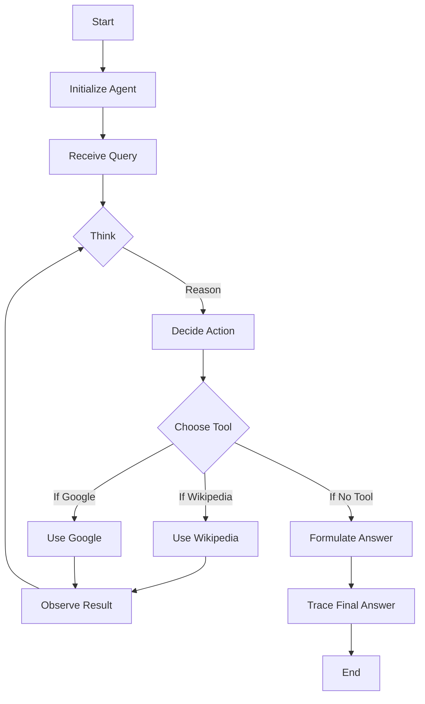

# Lesson 8: Building a ReAct Agent From Scratch

In our previous lessons, we have built a solid foundation in AI engineering. We have explored the agent landscape, learned to distinguish between LLM workflows and autonomous agents, and mastered context engineering and structured outputs. We have also covered the basics of giving agents tools and an introduction to planning frameworks like ReAct.

Now, it is time to put theory into practice. This lesson is 100% hands-on. We will build a minimal ReAct agent from scratch using only Python and the Gemini API, implementing the full Thought → Action → Observation loop.

## Why Build From Scratch?

When we started building our writing agent, we initially used LangGraph to implement the ReAct pattern. We thought its graph model would make the system cleaner. But we found ourselves fighting the framework. Simple if-else logic and basic loops became hours of work as we tried to force our Python code into a graph paradigm that felt unnatural and added complexity without real value.

Frustrated, we did what we always do when we are stuck: we opened the source code. Reading LangGraph’s implementation of the ReAct loop gave us the concrete mental model we couldn’t get from the documentation. Understanding how they handled thought generation, tool execution, and state management became the foundation for building our own robust agent.

Frameworks often fall short in production. Their abstractions can limit access to new features, and opinionated models can make simple logic overly complicated. By building from scratch, you gain a deep understanding of how these systems work, giving you the confidence to debug, extend, and customize agents for any use case.

This lesson will give you that hands-on experience. We will walk through setting up the environment, implementing a mock tool, generating thoughts, using function calling for actions, building the control loop, and testing the final agent to see how it succeeds and handles failure.

## Setup and Environment

Our first step is to set up the Python environment to ensure everything runs smoothly. This involves loading our API keys, importing the necessary packages, and initializing the Gemini client. The goal is to create a reproducible setup so you can follow along and get the same results. A clean and well-defined environment is the first step toward building any production-ready application.

1.  First, we load our environment variables. We use a simple helper function to load the `GOOGLE_API_KEY` from a `.env` file in our project root. This practice keeps sensitive keys out of your source code, which is a critical security measure for any application.
    ```python
    from lessons.utils import env

    env.load(required_env_vars=["GOOGLE_API_KEY"])
    ```
    It outputs:
    ```text
    Trying to load environment variables from `.../.env`
    Environment variables loaded successfully.
    ```
2.  Next, we import the key packages we will use throughout the lesson. This includes `google.genai` for interacting with the Gemini API, `pydantic` for data validation and defining structured data models, and standard Python libraries like `enum` for creating clear, readable enumerations for roles or tool names, and `typing` for type hints. We also import a `pretty_print` utility to make our agent's traces easier to follow.
    ```python
    from enum import Enum
    from pydantic import BaseModel, Field
    from typing import List

    from google import genai
    from google.genai import types

    from lessons.utils import pretty_print
    ```
3.  With the API key loaded, we initialize the Gemini client. This object will be our main interface for all communication with the Gemini models. It handles authentication and the underlying HTTP requests, allowing us to focus on the logic of our agent.
    ```python
    client = genai.Client()
    ```
    It outputs:
    ```text
    Both GOOGLE_API_KEY and GEMINI_API_KEY are set. Using GOOGLE_API_KEY.
    ```
4.  Finally, we define the model we will use. We will use `gemini-2.5-flash`, a model that is both fast and cost-effective, making it ideal for development and for tasks that do not require deep, multi-step reasoning. For more complex agents that need to perform more sophisticated planning, a `pro` model might be more suitable.
    ```python
    MODEL_ID = "gemini-2.5-flash"
    ```

With our client and model ready, we can now define the external capabilities our agent will use.

## Tool Layer: Mock Search Implementation

An agent’s power comes from its ability to interact with the world through tools. For this lesson, we will create a mock search tool instead of calling a real API. This approach offers several educational benefits.

### Tool Design Philosophy

Using a mock tool is a deliberate choice that helps us isolate and understand the core mechanics of the ReAct framework. First, it simplifies the learning process by removing external dependencies. You do not need to sign up for a search API or manage extra keys, allowing you to focus entirely on the agent's logic. Second, it provides predictable and deterministic responses. When teaching or debugging, knowing exactly what a tool will return for a given input is invaluable. It allows you to test specific reasoning paths and error-handling scenarios without the variability of a live API. This controlled environment is perfect for understanding the Thought-Action-Observation cycle in a clear, step-by-step manner.

1.  Our mock `search` tool is a simple Python function. It takes a string query and returns a string response. The docstring is important, as it explains to the LLM what the tool does and what arguments it expects. This documentation is the primary way the agent learns about the tool's capabilities.
    ```python
    def search(query: str) -> str:
        """Search for information about a specific topic or query.

        Args:
            query (str): The search query or topic to look up.
        """
        query_lower = query.lower()

        # Predefined responses for demonstration
        if all(word in query_lower for word in ["capital", "france"]):
            return "Paris is the capital of France and is known for the Eiffel Tower."
        elif "react" in query_lower:
            return "The ReAct (Reasoning and Acting) framework enables LLMs to solve complex tasks by interleaving thought generation, action execution, and observation processing."

        # Generic response for unhandled queries
        return f"Information about '{query}' was not found."
    ```
    The function uses simple string matching to return one of two predefined answers. If the query does not match, it returns a "not found" message. This fallback behavior is crucial for testing how the agent handles situations where a tool fails to provide the needed information.

2.  To manage our tools, we create a `TOOL_REGISTRY`. This dictionary maps the tool’s name to its function. This allows the agent to plan using a symbolic name (`"search"`) while our code safely resolves it to the actual Python function for execution.
    ```python
    TOOL_REGISTRY = {
        search.__name__: search,
    }
    ```

### From Mock to Production

In a production system, you could easily swap this mock function with a real API call to Google Search, a domain-specific knowledge base, or any other external service. The key is to preserve the function signature and docstring. As long as the new function accepts the same arguments and its docstring accurately describes its purpose, the agent’s reasoning logic does not need to change. This modular design makes the agent extensible and adaptable to real-world requirements. With our tool defined, the next step is to teach the agent how to think about using it [[27]](https://medium.com/google-cloud/building-react-agents-from-scratch-a-hands-on-guide-using-gemini-ffe4621d90ae), [[28]](https://atalupadhyay.wordpress.com/2025/11/25/building-a-real-time-web-searching-ai-agent-with-langchain-and-google-gemini/), [[29]](https://ai.google.dev/gemini-api/docs/langgraph-example).

## Thought Phase: Prompt Construction and Generation

The "Thought" phase is where the agent reasons about the task and plans its next move. This is not an abstract process; we guide it with a carefully crafted prompt that provides the necessary context, including what tools are available and what the overall goal is. The quality of this prompt directly influences the quality of the agent's reasoning. We separate the thought and action phases to improve clarity and debugging, allowing for more complex reasoning before the agent commits to a specific action.

1.  First, we need a way to describe our tools to the LLM. We create a helper function, `build_tools_xml_description`, that converts our `TOOL_REGISTRY` into a minimal XML format. This function programmatically extracts the docstring from each tool and wraps it in `<tool>` and `<description>` tags. Using XML is a robust prompt engineering technique that helps the model clearly distinguish the tool definitions from other parts of the prompt, such as the conversation history or user query.
    ```python
    def build_tools_xml_description(tools: dict[str, callable]) -> str:
        """Build a minimal XML description of tools using only their docstrings."""
        lines = []
        for tool_name, fn in tools.items():
            doc = (fn.__doc__ or "").strip()
            lines.append(f"\t<tool name=\"{tool_name}\">")
            if doc:
                lines.append(f"\t\t<description>")
                for line in doc.split("\n"):
                    lines.append(f"\t\t\t{line}")
                lines.append(f"\t\t</description>")
            lines.append("\t</tool>")
        return "\n".join(lines)
    ```
2.  Next, we define the prompt template for the thought generation step. This template instructs the agent to analyze the situation, consider its available tools, and state its next thought as a short paragraph. It includes placeholders for the tool descriptions (`{tools_xml}`) and the conversation history (`{conversation}`), which we will populate dynamically. The conversation history provides the necessary state for the otherwise stateless LLM call, allowing it to make informed decisions based on past interactions.
    ```python
    tools_xml = build_tools_xml_description(TOOL_REGISTRY)

    PROMPT_TEMPLATE_THOUGHT = f"""
    You are deciding the next best step for reaching the user goal. You have some tools available to you.

    Available tools:
    <tools>
    {tools_xml}
    </tools>

    Conversation so far:
    <conversation>
    {{conversation}}
    </conversation>

    State your next thought about what to do next as one short paragraph focused on the next action you intend to take and why.
    Avoid repeating the same strategies that didn't work previously. Prefer different approaches.
    """.strip()
    ```
    Inspecting the full prompt reveals how these pieces fit together. The model sees a clear structure: its role, the tools it can use, the history of the interaction, and a direct instruction on how to formulate its thought.
    It outputs:
    ```text
    You are deciding the next best step for reaching the user goal. You have some tools available to you.

    Available tools:
    <tools>
        <tool name="search">
            <description>
                Search for information about a specific topic or query.

                Args:
                    query (str): The search query or topic to look up.
            </description>
        </tool>
    </tools>

    Conversation so far:
    <conversation>
    {conversation}
    </conversation>

    State your next thought about what to do next as one short paragraph focused on the next action you intend to take and why.
    Avoid repeating the same strategies that didn't work previously. Prefer different approaches.
    ```
3.  Finally, we implement the `generate_thought` function. It takes the current conversation history, constructs the full prompt by filling in the placeholders, and calls the Gemini model. It returns the model's raw text response, which represents the agent's internal monologue or "thought."
    ```python
    def generate_thought(conversation: str, tool_registry: dict[str, callable]) -> str:
        """Generate a thought as plain text (no structured output)."""
        tools_xml = build_tools_xml_description(tool_registry)
        prompt = PROMPT_TEMPLATE_THOUGHT.format(conversation=conversation, tools_xml=tools_xml)

        response = client.models.generate_content(
            model=MODEL_ID,
            contents=prompt
        )
        return response.text.strip()
    ```

With a coherent thought generated, the agent now needs to translate that thought into a concrete action, whether it is calling a tool or providing a final answer [[2]](https://ai.google.dev/gemini-api/docs/prompting-strategies).

## Action Phase: Function Calling and Parsing

The "Action" phase is where the agent commits to a specific step. It decides whether to use a tool to gather more information or, if it has enough context, to provide a final answer to the user. We will implement this using Gemini’s native function calling capabilities, which is a more reliable and structured approach than trying to parse actions from plain text.

### System Prompt Strategy

A key design choice here is to separate the prompts for thought and action. The thought prompt includes detailed tool descriptions to help the LLM reason about *what* to do. The action prompt, however, focuses only on the high-level decision. We do not need to include tool signatures or detailed descriptions in the action prompt because we pass the tool functions directly to the Gemini API's `tools` configuration.

### Automatic Tool Integration

The client automatically extracts their signatures and docstrings, handling the low-level formatting for us. This separation of concerns keeps our action prompt clean and focused on strategic decision-making, while letting the API handle the technical details of function calling. This automatic integration is a powerful feature of modern LLM APIs, as it simplifies prompt management and reduces the risk of errors that can arise from manually formatting complex tool schemas.

1.  We start by defining two prompt templates. `PROMPT_TEMPLATE_ACTION` is the default prompt, asking the model to either call a tool or provide a final answer. `PROMPT_TEMPLATE_ACTION_FORCED` is a special-purpose prompt we will use to ensure the agent terminates gracefully. It instructs the model to provide a final answer without calling any more tools.
    ```python
    PROMPT_TEMPLATE_ACTION = """
    You are selecting the best next action to reach the user goal.

    Conversation so far:
    <conversation>
    {conversation}
    </conversation>

    Respond either with a tool call (with arguments) or a final answer if you can confidently conclude.
    """.strip()

    # Dedicated prompt used when we must force a final answer
    PROMPT_TEMPLATE_ACTION_FORCED = """
    You must now provide a final answer to the user.

    Conversation so far:
    <conversation>
    {conversation}
    </conversation>

    Provide a concise final answer that best addresses the user's goal.
    """.strip()
    ```
2.  To handle the model’s output, we define two Pydantic models: `ToolCallRequest` and `FinalAnswer`. These models create a structured contract for the two possible outcomes of the action phase, ensuring the output is predictable and easy to parse.
    ```python
    class ToolCallRequest(BaseModel):
        """A request to call a tool with its name and arguments."""
        tool_name: str = Field(description="The name of the tool to call.")
        arguments: dict = Field(description="The arguments to pass to the tool.")


    class FinalAnswer(BaseModel):
        """A final answer to present to the user when no further action is needed."""
        text: str = Field(description="The final answer text to present to the user.")
    ```
3.  The `generate_action` function orchestrates this phase. It takes the conversation history and an optional `force_final` flag.
    ```python
    def generate_action(conversation: str, tool_registry: dict[str, callable] | None = None, force_final: bool = False) -> (ToolCallRequest | FinalAnswer):
        """Generate an action by passing tools to the LLM and parsing function calls or final text.

        When force_final is True or no tools are provided, the model is instructed to produce a final answer and tool calls are disabled.
        """
        # Use a dedicated prompt when forcing a final answer or no tools are provided
        if force_final or not tool_registry:
            prompt = PROMPT_TEMPLATE_ACTION_FORCED.format(conversation=conversation)
            response = client.models.generate_content(
                model=MODEL_ID,
                contents=prompt
            )
            return FinalAnswer(text=response.text.strip())

        # Default action prompt
        prompt = PROMPT_TEMPLATE_ACTION.format(conversation=conversation)

        # Provide the available tools to the model; disable auto-calling so we can parse and run ourselves
        tools = list(tool_registry.values())
        config = types.GenerateContentConfig(
            tools=tools,
            automatic_function_calling={"disable": True}
        )
        response = client.models.generate_content(
            model=MODEL_ID,
            contents=prompt,
            config=config
        )

        # Extract the function call from the response (if present)
        candidate = response.candidates[0]
        parts = candidate.content.parts
        if parts and getattr(parts[0], "function_call", None):
            name = parts[0].function_call.name
            args = dict(parts[0].function_call.args) if parts[0].function_call.args is not None else {}
            return ToolCallRequest(tool_name=name, arguments=args)
        
        # Otherwise, it's a final answer
        final_answer = "".join(part.text for part in candidate.content.parts)
        return FinalAnswer(text=final_answer.strip())
    ```
    If `force_final` is `True`, it uses the specialized prompt and returns a `FinalAnswer`. Otherwise, it sends the default prompt along with the available tools to the Gemini API. We set `automatic_function_calling={"disable": True}` because we want to parse the response ourselves, giving us full control over the execution flow. The function then inspects the response. If the model returns a `function_call` object, we parse its name and arguments into our `ToolCallRequest` model. If not, we treat the text response as a `FinalAnswer`.

### Error Handling

This explicit parsing logic, combined with error handling, ensures our agent can robustly interpret the LLM's decisions. For instance, if the model generates a malformed response or tries to call a non-existent tool, our control loop (which we will build next) can catch the error, log it as an observation, and allow the agent to reason about the failure in its next turn. The `force_final` flag is another simple but powerful mechanism for control. It allows us to prevent infinite loops by forcing the agent to conclude its work after a set number of turns, ensuring a graceful exit. Now that we have the "Thought" and "Action" components, we can build the control loop that brings them together [[17]](https://medium.com/google-cloud/building-react-agents-from-scratch-a-hands-on-guide-using-gemini-ffe4621d90ae).

## Control Loop: Messages, Scratchpad, Orchestration

The control loop is the heart of our ReAct agent. It orchestrates the Thought → Action → Observation cycle, manages the agent's memory via a "scratchpad," and ensures the process terminates correctly. This loop transforms our separate components into a dynamic, stateful system that can iteratively solve problems.


Image 1: Flowchart of the ReAct agent's control loop

### Message Structure Foundation

Before building the loop, we need a solid foundation for tracking the agent's state. We do this by defining a structured message system.

1.  The `MessageRole` enum categorizes each entry in the conversation history (e.g., `USER`, `THOUGHT`, `TOOL_REQUEST`). The `Message` model is a Pydantic class that holds the role and content for each step. This structured approach is essential for maintaining a clear, debuggable trace of the agent's reasoning process.
    ```python
    class MessageRole(str, Enum):
        """Enumeration for the different roles a message can have."""
        USER = "user"
        THOUGHT = "thought"
        TOOL_REQUEST = "tool request"
        OBSERVATION = "observation"
        FINAL_ANSWER = "final answer"


    class Message(BaseModel):
        """A message with a role and content, used for all message types."""
        role: MessageRole = Field(description="The role of the message in the ReAct loop.")
        content: str = Field(description="The textual content of the message.")

        def __str__(self) -> str:
            """Provides a user-friendly string representation of the message."""
            return f"{self.role.value.capitalize()}: {self.content}"
    ```
2.  We also create a helper function to print messages with color-coding. Visualizing each step makes it much easier to follow the agent's logic and debug issues during development.
    ```python
    def pretty_print_message(message: Message, turn: int, max_turns: int, header_color: str = pretty_print.Color.YELLOW, is_forced_final_answer: bool = False) -> None:
        if not is_forced_final_answer:
            title = f"{message.role.value.capitalize()} (Turn {turn}/{max_turns}):"
        else:
            title = f"{message.role.value.capitalize()} (Forced):"

        pretty_print.wrapped(
            text=message.content,
            title=title,
            header_color=header_color,
        )
    ```
3.  The `Scratchpad` class acts as the agent's short-term working memory. It manages the list of `Message` objects, provides an `append` method to add new steps, and tracks the current turn number. Its `to_string()` method serializes the entire history into a single string, which we feed back to the LLM as context for the next turn.
    ```python
    class Scratchpad:
        """Container for ReAct messages with optional pretty-print on append."""

        def __init__(self, max_turns: int) -> None:
            self.messages: List[Message] = []
            self.max_turns: int = max_turns
            self.current_turn: int = 1

        def set_turn(self, turn: int) -> None:
            self.current_turn = turn

        def append(self, message: Message, verbose: bool = False, is_forced_final_answer: bool = False) -> None:
            self.messages.append(message)
            if verbose:
                role_to_color = {
                    MessageRole.USER: pretty_print.Color.RESET,
                    MessageRole.THOUGHT: pretty_print.Color.ORANGE,
                    MessageRole.TOOL_REQUEST: pretty_print.Color.GREEN,
                    MessageRole.OBSERVATION: pretty_print.Color.YELLOW,
                    MessageRole.FINAL_ANSWER: pretty_print.Color.CYAN,
                }
                header_color = role_to_color.get(message.role, pretty_print.Color.YELLOW)
                pretty_print_message(
                    message=message,
                    turn=self.current_turn,
                    max_turns=self.max_turns,
                    header_color=header_color,
                    is_forced_final_answer=is_forced_final_answer,
                )

        def to_string(self) -> str:
            return "\n".join(str(m) for m in self.messages)
    ```

### Control Loop Architecture

Finally, we implement the `react_agent_loop` function. This is where everything comes together. The function orchestrates the turn-based iteration, manages the scratchpad, executes actions, and handles termination conditions.

```python
def react_agent_loop(initial_question: str, tool_registry: dict[str, callable], max_turns: int = 5, verbose: bool = False) -> str:
    """
    Implements the main ReAct (Thought -> Action -> Observation) control loop.
    Uses a unified message class for the scratchpad.
    """
    scratchpad = Scratchpad(max_turns=max_turns)

    # Add the user's question to the scratchpad
    user_message = Message(role=MessageRole.USER, content=initial_question)
    scratchpad.append(user_message, verbose=verbose)

    for turn in range(1, max_turns + 1):
        scratchpad.set_turn(turn)

        # Generate a thought based on the current scratchpad
        thought_content = generate_thought(
            scratchpad.to_string(),
            tool_registry,
        )
        thought_message = Message(role=MessageRole.THOUGHT, content=thought_content)
        scratchpad.append(thought_message, verbose=verbose)

        # Generate an action based on the current scratchpad
        action_result = generate_action(
            scratchpad.to_string(),
            tool_registry=tool_registry,
        )

        # If the model produced a final answer, return it
        if isinstance(action_result, FinalAnswer):
            final_answer = action_result.text
            final_message = Message(role=MessageRole.FINAL_ANSWER, content=final_answer)
            scratchpad.append(final_message, verbose=verbose)
            return final_answer

        # Otherwise, it is a tool request
        if isinstance(action_result, ToolCallRequest):
            action_name = action_result.tool_name
            action_params = action_result.arguments

            # Add the action to the scratchpad
            params_str = ", ".join([f"{k}='{v}'" for k, v in action_params.items()])
            action_content = f"{action_name}({params_str})"
            action_message = Message(role=MessageRole.TOOL_REQUEST, content=action_content)
            scratchpad.append(action_message, verbose=verbose)

            # Run the action and get the observation
            observation_content = ""
            tool_function = tool_registry[action_name]
            try:
                observation_content = tool_function(**action_params)
            except Exception as e:
                observation_content = f"Error executing tool '{action_name}': {e}"

            # Add the observation to the scratchpad
            observation_message = Message(role=MessageRole.OBSERVATION, content=observation_content)
            scratchpad.append(observation_message, verbose=verbose)

        # Check if the maximum number of turns has been reached. If so, force the action selector to produce a final answer
        if turn == max_turns:
            forced_action = generate_action(
                scratchpad.to_string(),
                force_final=True,
            )
            if isinstance(forced_action, FinalAnswer):
                final_answer = forced_action.text
            else:
                final_answer = "Unable to produce a final answer within the allotted turns."
            final_message = Message(role=MessageRole.FINAL_ANSWER, content=final_answer)
            scratchpad.append(final_message, verbose=verbose, is_forced_final_answer=True)
            return final_answer
```

The loop starts with the user's initial question. In each turn, it generates a `thought`, then an `action`. If the action is a `FinalAnswer`, the loop terminates. If it is a `ToolCallRequest`, the loop executes the tool, captures the output as an `observation`, adds it to the scratchpad, and continues to the next turn.

### Integrated Observation Processing

This integration of the observation is the critical step that "closes the loop," allowing the agent to learn from its actions and refine its strategy in the subsequent thought phase. The `try...except` block ensures that if a tool fails, the error is captured and logged as an observation. This allows the agent to reason about the failure and potentially try a different tool or approach in the next turn, making the system more resilient.

If the loop reaches `max_turns`, it calls `generate_action` one last time with `force_final=True` to guarantee termination. This forced termination is not just a practical hack; it is a necessary guardrail against a known failure mode where ReAct agents can get stuck repeating the same thoughts and actions. The original ReAct paper even suggested switching to a different reasoning strategy, like Chain-of-Thought, if the agent fails to find an answer within a set number of steps. Our `max_turns` limit serves a similar purpose, ensuring the agent eventually stops and provides a response [[7]](https://www.decodingai.com/p/building-production-react-agents), [[32]](https://blog.stackademic.com/ai-agents-iv-ai-agents-through-the-thought-action-observation-tao-cycle-3dfe2eb76629), [[10]](https://medium.com/@deejairesearcher/react-paper-explained-simply-how-language-models-can-think-and-act-f500395f88db).

### Extension Possibilities

This complete loop gives us a functioning ReAct agent. While this implementation is minimal, it provides a solid foundation. You could extend it by adding more sophisticated tools, such as a calculator or a database query function. You could also implement more advanced error handling, like a retry mechanism with backoff for failing tools. For more complex reasoning, you could even explore hybrid patterns, where the agent might switch between ReAct and other planning strategies based on the task's nature.

Now, let’s test our agent to see how it behaves in both successful and unsuccessful scenarios.

## Tests and Traces: Success and Graceful Fallback

With our agent fully implemented, it is time to validate its behavior. We will run two tests: one with a straightforward question that our mock tool can answer, and another with a query it cannot handle. Analyzing the output traces will show us how the agent succeeds and, more importantly, how it handles failure. This step is crucial for building trust in the agent's reliability.

1.  First, let's ask a question our mock `search` tool is designed to answer: `"What is the capital of France?"`. We will run the loop for a maximum of two turns and set `verbose=True` to see the full trace.
    ```python
    # A straightforward question requiring a search.
    question = "What is the capital of France?"
    final_answer = react_agent_loop(question, TOOL_REGISTRY, max_turns=2, verbose=True)
    ```
    The output trace clearly shows the ReAct cycle in action:
    - **User (Turn 1/2):** The initial question, "What is the capital of France?", is logged.
    - **Thought (Turn 1/2):** The agent reasons that it needs to find the capital and decides the `search` tool is appropriate for this factual lookup. Its thought is: "I need to find the capital of France. The `search` tool can help me find this information."
    - **Tool request (Turn 1/2):** It correctly formulates the tool call: `search(query='capital of France')`. This demonstrates its ability to translate its thought into a concrete, executable action.
    - **Observation (Turn 1/2):** The mock tool returns the predefined answer: "Paris is the capital of France and is known for the Eiffel Tower." This result is fed back into the agent's context.
    - **Thought (Turn 2/2):** The agent processes the observation, concludes it now has the necessary information, and prepares to deliver the final answer. Its thought is: "The search result provides the answer. I can now formulate the final response."
    - **Final Answer (Turn 2/2):** The agent provides the correct answer, "Paris is the capital of France," and the loop terminates successfully.

    This trace confirms that our agent can successfully reason, use a tool, process the observation, and provide a final answer, all within its turn budget. The step-by-step log makes the entire process transparent and easy to debug.

2.  Now, let's test the agent's fallback behavior with a query our mock tool does not know: `"What is the capital of Italy?"`. This tests the agent's resilience and its ability to handle tool failures gracefully.
    ```python
    # An unsupported question to test fallback behavior.
    question = "What is the capital of Italy?"
    final_answer = react_agent_loop(question, TOOL_REGISTRY, max_turns=2, verbose=True)
    ```
    The trace for this query demonstrates the agent's adaptive strategy:
    - **Turn 1:** The agent thinks, calls `search(query='capital of Italy')`, and receives the observation: "Information about 'capital of Italy' was not found." This is a critical moment where a less robust agent might fail or get stuck.
    - **Turn 2:** Observing the failure, our agent adapts. Its next thought reflects this: "The first search failed. I will try a broader query to see if I can find any relevant information about Italy in general." It then calls `search(query='Italy')`, hoping to find related information. This also fails, returning another "not found" observation.
    - **Final Answer (Forced):** Since the `max_turns` limit of 2 has been reached, the control loop triggers the forced final answer mechanism. The agent is prompted to conclude based on the available information. It generates the final answer: "I'm sorry, but I couldn't find information about the capital of Italy."

This second test is critical. It shows that our agent does not get stuck in a loop of failed attempts. It tries a different strategy and, when the turn limit is hit, it exits gracefully with a helpful message. This behavior, including the use of a maximum iteration limit, is essential for building robust agents that can handle the unpredictability of real-world tools and data [[17]](https://medium.com/google-cloud/building-react-agents-from-scratch-a-hands-on-guide-using-gemini-ffe4621d90ae).

## Conclusion

By building a ReAct agent from the ground up, we have uncovered the core engineering patterns behind modern AI agents. We have seen how a simple loop of Thought, Action, and Observation, orchestrated in pure Python, can create a system capable of reasoning, using tools, and adapting to new information. This foundational pattern is the building block for sophisticated systems, from `ClinicalAgents` that use ReAct-like loops to reason over medical knowledge bases, to scientific discovery agents like `ChemToolAgent` that orchestrate complex experiments, and even enterprise systems where a central ReAct agent can delegate tasks to a team of specialized agents. This hands-on approach provides a concrete mental model that frameworks can sometimes obscure.

Even if you use a framework like LangGraph in production, understanding these core mechanics is one of the most important skills you can develop as an AI Engineer. You now have the foundation to confidently debug, customize, and extend agentic systems to solve real-world problems.

This lesson is part of our AI Agents Foundations series. You have learned how to implement the core reasoning loop. In our next lessons, we will build on this foundation, exploring how to equip agents with memory (Lesson 9) and how to connect them to vast knowledge bases with Retrieval-Augmented Generation (Lesson 10) [[11]](https://arxiv.org/html/2603.26182v1), [[12]](https://arxiv.org/html/2510.09901v2), [[13]](https://www.salesforce.com/agentforce/ai-agents/react-agents/).

## References

- [1] https://arxiv.org/pdf/2210.03629
- [2] https://ai.google.dev/gemini-api/docs/prompting-strategies
- [3] https://www.ibm.com/think/topics/ai-agent-planning
- [4] https://medium.com/google-cloud/building-react-agents-from-scratch-a-hands-on-guide-using-gemini-ffe4621d90ae
- [5] https://www.philschmid.de/langgraph-gemini-2-5-react-agent
- [6] https://community.openai.com/t/converting-a-react-prompt-to-use-function-calling/264914
- [7] https://www.decodingai.com/p/building-production-react-agents
- [8] https://www.neradot.com/post/building-a-python-react-agent-class-a-step-by-step-guide
- [9] https://machinelearningmastery.com/building-react-agents-with-langgraph-a-beginners-guide/
- [10] https://medium.com/@deejairesearcher/react-paper-explained-simply-how-language-models-can-think-and-act-f500395f88db
- [11] https://arxiv.org/html/2603.26182v1
- [12] https://arxiv.org/html/2510.09901v2
- [13] https://www.salesforce.com/agentforce/ai-agents/react-agents/
- [14] https://www.dailydoseofds.com/ai-agents-crash-course-part-10-with-implementation/
- [15] https://latenode.com/blog/ai-frameworks-technical-infrastructure/langchain-setup-tools-agents-memory/langchain-react-agent-complete-implementation-guide-working-examples-2025
- [16] https://genmind.ch/posts/Building-ReAct-Agents-with-Microsoft-Agent-Framework-From-Theory-to-Production/
- [17] https://medium.com/google-cloud/building-react-agents-from-scratch-a-hands-on-guide-using-gemini-ffe4621d90ae
- [18] https://www.philschmid.de/langgraph-gemini-2-5-react-agent
- [19] https://ai.google.dev/gemini-api/docs/langgraph-example
- [20] https://medium.com/google-cloud/building-react-agents-from-scratch-a-hands-on-guide-using-gemini-ffe4621d90ae
- [21] https://community.openai.com/t/using-gemini-with-openai-agents-sdk/1307262
- [22] https://www.philschmid.de/langgraph-gemini-2-5-react-agent
- [23] https://ai.google.dev/gemini-api/docs/langgraph-example
- [24] https://www.freecodecamp.org/news/build-an-ai-coding-agent-with-python-and-gemini/
- [25] https://arxiv.org/html/2510.24663v1
- [26] https://www.amazon.science/publications/orchdag-complex-tool-orchestration-in-multi-turn-interactions-with-plan-dags
- [27] https://medium.com/google-cloud/building-react-agents-from-scratch-a-hands-on-guide-using-gemini-ffe4621d90ae
- [28] https://atalupadhyay.wordpress.com/2025/11/25/building-a-real-time-web-searching-ai-agent-with-langchain-and-google-gemini/
- [29] https://ai.google.dev/gemini-api/docs/langgraph-example
- [30] https://developers.googleblog.com/real-world-agent-examples-with-gemini-3/
- [31] https://pub.towardsai.net/beyond-the-prompt-engineering-the-thought-action-observation-loop-2e1fd99114d2
- [32] https://blog.stackademic.com/ai-agents-iv-ai-agents-through-the-thought-action-observation-tao-cycle-3dfe2eb76629
- [33] https://huggingface.co/learn/agents-course/unit1/agent-steps-and-structure
- [34] https://projector-video-pdf-converter.datacamp.com/42942/chapter2.pdf
</article>