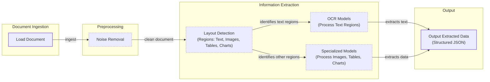
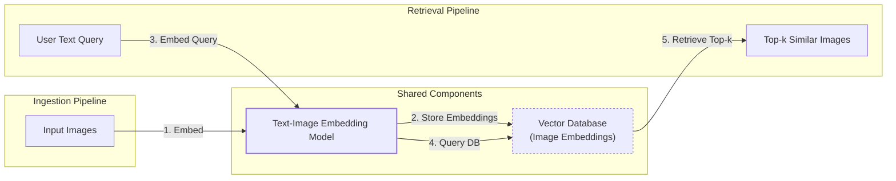
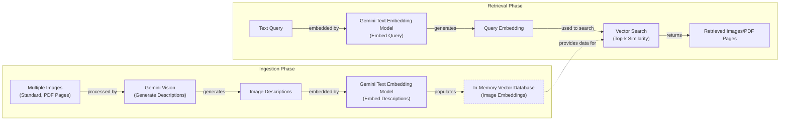
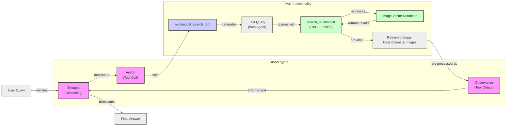

# Lesson 11: Multimodal AI

In the last ten lessons, we built a solid foundation in AI Engineering. We learned the difference between LLM workflows and AI agents, mastered context engineering, and implemented core agent patterns like ReAct and RAG. You now know how to build agents that can reason, act, and remember. But so far, we have focused almost exclusively on text.

In the real world, information is rarely just text. We work with images, charts, and complex documents every day. Enterprise data is a mix of reports, presentations, and diagrams. To build truly useful AI systems, we need to equip them to handle this multimodal reality. This lesson is the final piece of the puzzle for Part 1 of our course. We will show you how to stop translating everything into text and start building AI systems that process images and documents in their native format.

Most enterprise AI applications require multimodal capabilities. A financial analyst needs an agent that can read charts in a PDF report, not just the text around them. A doctor needs a system that can analyze medical images alongside patient notes. Text-only approaches are fundamentally limited because they lose the rich visual information embedded in these documents. Instead of wrestling with brittle OCR systems, modern AI applications use multimodal LLMs that can "see" and interpret visual data directly. This approach is simpler, faster, and far more powerful.

## Limitations of traditional document processing

To understand why multimodal LLMs are a game-changer, we first need to look at why traditional document processing methods fall short. For years, the standard approach for digitizing documents like invoices or reports has been a complex, multi-step pipeline centered around Optical Character Recognition (OCR). This process attempts to convert all visual information into machine-readable text.

A typical workflow involves loading a document, preprocessing it to remove noise, and then using a layout detection model to identify different regions like text, tables, and images. An OCR model then processes the text regions, while other specialized models might be needed for tables or charts. Finally, all this extracted data is structured, often as JSON, for downstream use.


Image 1: A flowchart illustrating the traditional document processing workflow using OCR-based systems.

This pipeline has too many moving parts, which makes the entire system rigid and fragile. If a new document format with an unsupported chart type appears, the system breaks. It is also slow and costly, as it requires multiple model calls for a single document.

The biggest issue, however, is performance. The multi-step nature of this process creates a cascade effect where errors from one stage compound in the next. Even the best OCR engines struggle with real-world documents. While they can achieve 88–94% accuracy on simple layouts, their performance drops significantly on complex documents, mixed content types, or degraded scans [[49]](https://www.llamaindex.ai/blog/ocr-accuracy). For handwriting, a character error rate (CER) of 3–5% is considered good, which is unacceptable for many applications [[49]](https://www.llamaindex.ai/blog/ocr-accuracy). Poor scan quality, such as a resolution below 300 DPI, can cause accuracy to drop by over 20% [[49]](https://www.llamaindex.ai/blog/ocr-accuracy).

Complex layouts, like nested tables, multi-column formats, or technical drawings, are where these systems truly fail. They treat the page as a flat grid of text, losing the critical spatial relationships and visual context that humans use to understand information [[49]](https://www.llamaindex.ai/blog/ocr-accuracy).

https://hackernoon.imgix.net/images/2DFAaGGO5cfymtBKn4bFFAoT6sg2-v993xj8.jpeg
Image 2: A floor plan is a classic example of a complex document where rotated text and spatial layouts are critical, posing a significant challenge for traditional OCR systems. (Source [https://hackernoon.com/complex-document-recognition-ocr-doesnt-work-and-heres-how-you-fix-it](https://hackernoon.com/complex-document-recognition-ocr-doesnt-work-and-heres-how-you-fix-it))

While this approach might work for highly specialized, niche applications, it does not scale in a world where AI agents need to be flexible, fast, and reliable. This is why modern AI systems have shifted to using multimodal LLMs like Gemini, which can interpret text, images, and PDFs as native inputs, completely bypassing the brittle OCR workflow. Let's explore how these models work.

## Foundations of multimodal LLMs

Before we write any code, it is important to have an intuition for how multimodal LLMs function. You do not need to know every technical detail—that is the job of an AI researcher. As an AI Engineer, your focus is on understanding the architecture enough to effectively use, deploy, and optimize these models.

There are two common approaches to building multimodal LLMs that combine text and image capabilities.

https://substackcdn.com/image/fetch/f_auto,q_auto:good,fl_progressive:steep/https%3A%2F%2Fsubstack-post-media.s3.amazonaws.com%2Fpublic%2Fimages%2F53956ae8-9cd8-474e-8c10-ef6bddb88164_1600x938.png
Image 3: The two main architectural approaches for multimodal LLMs. (Source [https://magazine.sebastianraschka.com/p/understanding-multimodal-llms](https://magazine.sebastianraschka.com/p/understanding-multimodal-llms))

The first is the **Unified Embedding Decoder Architecture**. In this design, images are converted into token embeddings that have the same size as text token embeddings. These image and text tokens are then simply concatenated and fed into a standard LLM decoder architecture, like a GPT or Llama model [[21]](https://magazine.sebastianraschka.com/p/understanding-multimodal-llms).

https://substackcdn.com/image/fetch/f_auto,q_auto:good,fl_progressive:steep/https%3A%2F%2Fsubstack-post-media.s3.amazonaws.com%2Fpublic%2Fimages%2F91955021-7da5-4bc4-840e-87d080152b18_1166x1400.png
Image 4: The Unified Embedding Decoder Architecture, where image and text tokens are concatenated and processed by a single LLM decoder. (Source [https://magazine.sebastianraschka.com/p/understanding-multimodal-llms](https://magazine.sebastianraschka.com/p/understanding-multimodal-llms))

The second approach is the **Cross-Modality Attention Architecture**. Here, instead of treating image tokens as part of the input sequence, their information is injected directly into the LLM's attention layers. This is done through a cross-attention mechanism, where the text embeddings can "attend to" the image embeddings at each layer of the model [[21]](https://magazine.sebastianraschka.com/p/understanding-multimodal-llms).

https://substackcdn.com/image/fetch/f_auto,q_auto:good,fl_progressive:steep/https%3A%2F%2Fsubstack-post-media.s3.amazonaws.com%2Fpublic%2Fimages%2Fd9c06055-b959-45d1-87b2-1f4e90ceaf2d_1296x1338.png
Image 5: The Cross-Modality Attention Architecture, where image information is integrated via cross-attention layers within the LLM. (Source [https://magazine.sebastianraschka.com/p/understanding-multimodal-llms](https://magazine.sebastianraschka.com/p/understanding-multimodal-llms))

Both architectures rely on a crucial component: an image encoder. This module is responsible for converting an image into a sequence of embeddings that the LLM can understand. This process is analogous to text tokenization. While text is broken down into subwords using algorithms like Byte-Pair Encoding, an image is divided into a grid of smaller patches.

https://substackcdn.com/image/fetch/f_auto,q_auto:good,fl_progressive:steep/https%3A%2F%2Fsubstack-post-media.s3.amazonaws.com%2Fpublic%2Fimages%2F0d56ea06-d202-4eb7-9e01-9aac492ee309_1522x1206.png
Image 6: A side-by-side comparison of image and text tokenization and embedding processes. (Source [https://magazine.sebastianraschka.com/p/understanding-multimodal-llms](https://magazine.sebastianraschka.com/p/understanding-multimodal-llms))

Each patch is then processed by a vision model, typically a Vision Transformer (ViT), to generate an embedding vector. The result is a sequence of embeddings, one for each patch, that captures the visual information of the image.

https://substackcdn.com/image/fetch/f_auto,q_auto:good,fl_progressive:steep/https%3A%2F%2Fsubstack-post-media.s3.amazonaws.com%2Fpublic%2Fimages%2Ffef5f8cb-c76c-4c97-9771-7fdb87d7d8cd_1600x1135.png
Image 7: A standard Vision Transformer (ViT) architecture, which processes image patches to create embeddings. (Source [https://magazine.sebastianraschka.com/p/understanding-multimodal-llms](https://magazine.sebastianraschka.com/p/understanding-multimodal-llms))

For these image embeddings to be compatible with text embeddings, they must exist in the same vector space. This is achieved through a technique called contrastive learning, pioneered by models like CLIP (Contrastive Language-Image Pre-training) [[30]](https://arxiv.org/html/2411.06284v3). During training, the model learns to map similar image-text pairs close together in the embedding space while pushing dissimilar pairs apart. This alignment allows for meaningful comparisons between modalities.

This shared embedding space is what enables semantic similarity search between text and images, a core component of multimodal RAG. We can embed a text query and an image and measure their cosine similarity to see how related they are. Popular image encoders like CLIP, OpenCLIP, and SigLIP all leverage this core architecture.

https://towardsdatascience.com/wp-content/uploads/2024/11/15d3HBNjNIXLy0oMIvJjxWw.png
Image 8: A toy representation of a multimodal embedding space where similar concepts from text and images are located close together. (Source [https://towardsdatascience.com/multimodal-embeddings-an-introduction-5dc36975966f](https://towardsdatascience.com/multimodal-embeddings-an-introduction-5dc36975966f/))

Each architectural approach has its trade-offs. The Unified Embedding approach is simpler to implement and tends to perform better on OCR-related tasks [[37]](https://arxiv.org/abs/2409.11402). The Cross-Attention approach is more computationally efficient, especially with high-resolution images, as it avoids lengthening the input sequence with image tokens [[36]](https://magazine.sebastianraschka.com/p/understanding-multimodal-llms). Hybrid models, like NVIDIA's NVLM-H, aim to combine the strengths of both [[37]](https://arxiv.org/abs/2409.11402).

By 2025, most state-of-the-art LLMs are natively multimodal. In the open-source world, we have models like Llama 4, Gemma 2, and Qwen3. In the closed-source space, GPT-5, Gemini 2.5, and Claude lead the way [[22]](https://medium.com/data-science-in-your-pocket/2025-the-year-ai-reasoning-models-took-over-a-month-by-month-review-of-frontier-breakthroughs-6ea2163f854f). The same principles can be extended to other modalities like audio and video by incorporating specialized encoders for each data type [[27]](https://sparkco.ai/blog/exploring-multimodal-llms-text-image-and-video-integration).

It is also important to distinguish these multimodal LLMs from diffusion-based image generation models like Midjourney or Stable Diffusion. Diffusion models are a separate class of generative models designed specifically for creating high-quality visual content [[19]](https://arxiv.org/html/2409.14993v3). While they can be integrated into agentic workflows as tools, they do not possess the same reasoning and understanding capabilities as multimodal LLMs.

Now that we have a foundational understanding of how these models work, let's see them in action.

## Applying multimodal LLMs to images and PDFs

To see how multimodal LLMs work in practice, we will walk through a few examples using Gemini. There are three primary ways to provide images and other media to an LLM: as raw bytes, as Base64-encoded strings, or via URLs.

**Raw bytes** are the most direct way to handle files. This method works well for one-off API calls. However, storing raw bytes in a database can be problematic, as many databases interpret the data as text and can corrupt the binary format.

**Base64 encoding** solves this storage issue by converting the binary data into a string. This format is widely used to embed images in web pages, and it ensures that our media can be safely stored in databases like PostgreSQL or MongoDB without corruption. The main downside is that Base64-encoded data is about 33% larger than the original raw bytes.

**URLs** are useful in two scenarios. For public data on the internet, you can often pass the URL directly to the LLM. For enterprise use cases that require privacy and scale, data is typically stored in a data lake like AWS S3 or Google Cloud Storage (GCS). In this setup, the LLM can fetch the media directly from the bucket, which is far more efficient than passing large files over the network.

Each method has its place. For one-off calls without storage, raw bytes are fine. For storing media in a database, Base64 is a reliable choice. For large-scale enterprise systems with a data lake, URLs are the most efficient option.

Now, let's dive into the code.

1.  First, let's look at our sample image.
    
    ```python
    def display_image(image_path: Path) -> None:
        """
        Display an image from a file path in the notebook.
    
        Args:
            image_path: Path to the image file to display
    
        Returns:
            None
        """
    
        image = IPythonImage(filename=image_path, width=400)
        display(image)
    
    
    display_image(Path("images") / "image_1.jpeg")
    ```
    
    It outputs:
    
    ```text
    <IPython.core.display.Image object>
    ```
    
2.  We will start by processing the image as raw bytes. We define a helper function to load the image, resize it, and convert it to bytes. We use the `WEBP` format because it offers good compression and quality, making it efficient for API calls.
    
    ```python
    def load_image_as_bytes(
        image_path: Path, format: Literal["WEBP", "JPEG", "PNG"] = "WEBP", max_width: int = 600, return_size: bool = False
    ) -> bytes | tuple[bytes, tuple[int, int]]:
        """
        Load an image from file path and convert it to bytes with optional resizing.
    
        Args:
            image_path: Path to the image file to load
            format: Output image format (WEBP, JPEG, or PNG). Defaults to "WEBP"
            max_width: Maximum width for resizing. If image width exceeds this, it will be resized proportionally. Defaults to 600
            return_size: If True, returns both bytes and image size tuple. Defaults to False
    
        Returns:
            bytes: Image data as bytes, or tuple of (bytes, (width, height)) if return_size is True
        """
    
        image = PILImage.open(image_path)
        if image.width > max_width:
            ratio = max_width / image.width
            new_size = (max_width, int(image.height * ratio))
            image = image.resize(new_size)
    
        byte_stream = io.BytesIO()
        image.save(byte_stream, format=format)
    
        if return_size:
            return byte_stream.getvalue(), image.size
    
        return byte_stream.getvalue()
    ```
    
3.  Let's load the image and see what the raw bytes look like.
    
    ```python
    image_bytes = load_image_as_bytes(image_path=Path("images") / "image_1.jpeg", format="WEBP")
    pretty_print.wrapped([f"Bytes `{image_bytes[:30]}...`", f"Size: {len(image_bytes)} bytes"], title="Image as Bytes")
    ```
    
    It outputs:
    
    ```text
       [93m------------------------------------------ Image as Bytes ------------------------------------------ [0m
    
        Bytes `b'RIFF`\xad\x00\x00WEBPVP8 T\xad\x00\x00P\xec\x02\x9d\x01*X\x02X\x02'...`
    
       [93m---------------------------------------------------------------------------------------------------- [0m
    
        Size: 44392 bytes
    
       [93m---------------------------------------------------------------------------------------------------- [0m
    ```
    
4.  Now, we pass these bytes to the Gemini model to generate a caption.
    
    ```python
    response = client.models.generate_content(
        model=MODEL_ID,
        contents=[
            types.Part.from_bytes(
                data=image_bytes,
                mime_type="image/webp",
            ),
            "Tell me what is in this image in one paragraph.",
        ],
    )
    pretty_print.wrapped(response.text, title="Image 1 Caption")
    ```
    
    It outputs:
    
    ```text
       [93m----------------------------------------- Image 1 Caption ----------------------------------------- [0m
    
        This striking image features a massive, dark metallic robot, its powerful form detailed with intricate circuit patterns on its head and piercing red glowing eyes. Perched playfully on its right arm is a small, fluffy grey tabby kitten, its front paw raised as if exploring or batting at the robot's armored limb, while its gaze is directed slightly off-frame. The robot's large, segmented hand is visible beneath the kitten. The background suggests an industrial or workshop environment, with hints of metal structures and natural light filtering in from an unseen window, creating a dramatic contrast between the soft, vulnerable kitten and the formidable, mechanical sentinel.
    
       [93m---------------------------------------------------------------------------------------------------- [0m
    ```
    
5.  We can easily pass multiple images to compare them.
    
    ```python
    response = client.models.generate_content(
        model=MODEL_ID,
        contents=[
            types.Part.from_bytes(
                data=load_image_as_bytes(image_path=Path("images") / "image_1.jpeg", format="WEBP"),
                mime_type="image/webp",
            ),
            types.Part.from_bytes(
                data=load_image_as_bytes(image_path=Path("images") / "image_2.jpeg", format="WEBP"),
                mime_type="image/webp",
            ),
            "What's the difference between these two images? Describe it in one paragraph.",
        ],
    )
    pretty_print.wrapped(response.text, title="Differences between images")
    ```
    
    It outputs:
    
    ```text
       [93m------------------------------------ Differences between images ------------------------------------ [0m
    
        The primary difference between the two images lies in the nature of the interaction depicted and their respective settings. In the first image, a small, grey kitten is shown curiously interacting with a large, metallic robot, gently perched on its arm within what appears to be a clean, well-lit workshop or industrial space. Conversely, the second image portrays a tense and aggressive confrontation between a fluffy white dog and a sleek black robot, both in combative stances, amidst a cluttered and grimy urban alleyway filled with trash and graffiti.
    
       [93m---------------------------------------------------------------------------------------------------- [0m
    ```
    
6.  Next, we will process the image as a Base64-encoded string.
    
    ```python
    from typing import cast
    
    
    def load_image_as_base64(
        image_path: Path, format: Literal["WEBP", "JPEG", "PNG"] = "WEBP", max_width: int = 600, return_size: bool = False
    ) -> str:
        """
        Load an image and convert it to base64 encoded string.
    
        Args:
            image_path: Path to the image file to load
            format: Output image format (WEBP, JPEG, or PNG). Defaults to "WEBP"
            max_width: Maximum width for resizing. If image width exceeds this, it will be resized proportionally. Defaults to 600
            return_size: Parameter passed to load_image_as_bytes function. Defaults to False
    
        Returns:
            str: Base64 encoded string representation of the image
        """
    
        image_bytes = load_image_as_bytes(image_path=image_path, format=format, max_width=max_width, return_size=False)
    
        return base64.b64encode(cast(bytes, image_bytes)).decode("utf-8")
    ```
    
7.  The resulting string is significantly larger, confirming the 33% size increase.
    
    ```python
    image_base64 = load_image_as_base64(image_path=Path("images") / "image_1.jpeg", format="WEBP")
    pretty_print.wrapped(
        [f"Base64: {image_base64[:100]}...`", f"Size: {len(image_base64)} characters"], title="Image as Base64"
    )
    ```
    
    It outputs:
    
    ```text
       [93m----------------------------------------- Image as Base64 ----------------------------------------- [0m
    
        Base64: UklGRmCtAABXRUJQVlA4IFStAABQ7AKdASpYAlgCPm0ylEekIqInJnQ7gOANiWdtk7FnEo2gDknjPixW9SNSb5P7IbBNhLn87Vtp...`
    
       [93m---------------------------------------------------------------------------------------------------- [0m
    
        Size: 59192 characters
    
       [93m---------------------------------------------------------------------------------------------------- [0m
    ```
    
8.  We can see the size difference clearly.
    
    ```python
    print(f"Image as Base64 is {(len(image_base64) - len(image_bytes)) / len(image_bytes) * 100:.2f}% larger than as bytes")
    ```
    
    It outputs:
    
    ```text
    Image as Base64 is 33.34% larger than as bytes
    ```
    
9.  Now, let's recompute the caption using Base64.
    
    ```python
    response = client.models.generate_content(
        model=MODEL_ID,
        contents=[
            types.Part.from_bytes(data=image_base64, mime_type="image/webp"),
            "Tell me what is in this image in one paragraph.",
        ],
    )
    response.text
    ```
    
    It outputs:
    
    ```text
    "The image features a striking contrast between a large, formidable robot and a small, adorable kitten. The robot, crafted from dark, sleek metallic armor with intricate circuitry patterns on its head, possesses piercing red glowing eyes that appear to be focused on its tiny companion. A fluffy, gray tabby kitten is playfully perched on the robot's massive metallic arm and shoulder, its small paws resting gently on the armored surface as it looks up with curiosity. The scene is set in what looks like an industrial or workshop environment, with warm light filtering in from the background, highlighting this unexpected and endearing interaction between advanced technology and natural innocence."
    ```
    
10. For public URLs, Gemini has a built-in `url_context` tool that can automatically parse webpages, PDFs, and images. We just provide the URL in the prompt.
    
    ```python
    response = client.models.generate_content(
        model=MODEL_ID,
        contents="Based on the provided paper as a PDF, tell me how ReAct works: https://arxiv.org/pdf/2210.03629",
        config=types.GenerateContentConfig(tools=[{"url_context": {}}]),
    )
    pretty_print.wrapped(response.text, title="How ReAct works")
    ```
    
    It outputs:
    
    ```text
       [93m----------------------------------------- How ReAct works ----------------------------------------- [0m
    
        
    
       
    
       ReAct is a novel paradigm for large language models (LLMs) that combines reasoning (Thought) and acting (Action) in an interleaved manner to solve diverse language and decision-making tasks. This approach allows the model to:
    
       
    
       *   **Reason to Act:** Generate verbal reasoning traces to induce, track, and update action plans, and handle exceptions.
    
       *   **Act to Reason:** Interface with and gather additional information from external sources (like knowledge bases or environments) to incorporate into its reasoning.
    
       
    
       **How it works:**
    
       
    
       Instead of just generating a direct answer (Standard prompting) or a chain of thought without external interaction (CoT), or only actions (Act-only), ReAct augments the LLM's action space to include a "language space" for generating "thoughts" or reasoning traces.
    
       
    
       1.  **Thought:** The model explicitly generates a thought, which is a verbal reasoning trace. This thought helps the model to:
    
           *   Decompose task goals and create action plans.
    
           *   Inject commonsense knowledge.
    
           *   Extract important information from observations.
    
           *   Track progress and adjust action plans.
    
           *   Handle exceptions.
    
       2.  **Action:** Based on the current thought and context, the model performs a task-specific action. This could involve:
    
           *   Searching external databases (e.g., Wikipedia API using `search[entity]` or `lookup[string]`).
    
           *   Interacting with an environment (e.g., `go to cabinet 1`, `take pepper shaker 1`).
    
           *   Finishing the task with an answer (`finish[answer]`).
    
       3.  **Observation:** The environment provides an observation feedback based on the executed action.
    
       
    
       This cycle of Thought, Action, and Observation continues until the task is completed.
    
       
    
       **Benefits of ReAct:**
    
       
    
       *   **Improved Performance:** ReAct consistently outperforms baselines that only perform reasoning or acting in isolation on tasks like question answering (HotpotQA), fact verification (FEVER), text-based games (ALFWorld), and webpage navigation (WebShop).
    
       *   **Reduced Hallucination and Error Propagation:** By interacting with external sources, ReAct can overcome issues of hallucination and error propagation common in chain-of-thought reasoning that relies solely on internal knowledge.
    
       *   **Human Interpretability and Trustworthiness:** The interleaved reasoning traces make the model's decision-making process more interpretable and trustworthy, as humans can inspect the thoughts and actions.
    
       *   **Flexibility and Generalizability:** ReAct is flexible enough to be applied to diverse tasks with different action spaces and reasoning needs, and it shows strong generalization with only a few in-context examples.
    
       *   **Human Alignment and Controllability:** Humans can control or correct the agent's behavior by editing its thoughts, enabling new forms of human-machine collaboration.
    
       
    
       For example, in a question-answering task, ReAct might first *think* about what to search, then *act* by searching Wikipedia, *observe* the results, *think* about what the results mean and what to search next, and so on, until it can *think* of the final answer and *act* to finish the task.
    
       [93m---------------------------------------------------------------------------------------------------- [0m
    ```
    
11. When working with private data lakes, the process is similar. At the time of this writing, Gemini integrates best with Google Cloud Storage. The code would look like this, where you provide the GCS URI.
    
    ```python
    # Mocked example
    response = client.models.generate_content(
        model=MODEL_ID,
        contents=[
            types.Part.from_uri(uri="gs://gemini-images/image_1.jpeg", mime_type="image/webp"),
            "Tell me what is in this image in one paragraph.",
        ],
    )
    ```
    
12. A more advanced use case is object detection. Using the structured output capabilities we discussed in Lesson 4, we can define a Pydantic model for bounding boxes and ask the LLM to detect objects in an image.
    
    ```python
    from pydantic import BaseModel, Field
    
    
    class BoundingBox(BaseModel):
        ymin: float
        xmin: float
        ymax: float
        xmax: float
        label: str = Field(
            default="The category of the object found within the bounding box. For example: cat, dog, diagram, robot."
        )
    
    
    class Detections(BaseModel):
        bounding_boxes: list[BoundingBox]
    ```
    
13. We create a prompt asking for normalized bounding box coordinates and pass it to the model with our Pydantic schema.
    
    ```python
    prompt = """
    Detect all of the prominent items in the image. 
    The box_2d should be [ymin, xmin, ymax, xmax] normalized to 0-1000.
    Also, output the label of the object found within the bounding box.
    """
    
    image_bytes, image_size = load_image_as_bytes(
        image_path=Path("images") / "image_1.jpeg", format="WEBP", return_size=True
    )
    ```
    
14. The Gemini API handles the JSON output and parsing into our Pydantic object automatically.
    
    ```python
    config = types.GenerateContentConfig(
        response_mime_type="application/json",
        response_schema=Detections,
    )
    
    response = client.models.generate_content(
        model=MODEL_ID,
        contents=[
            types.Part.from_bytes(
                data=image_bytes,
                mime_type="image/webp",
            ),
            prompt,
        ],
        config=config,
    )
    
    detections = cast(Detections, response.parsed)
    pretty_print.wrapped([f"Image size: {image_size}", *detections.bounding_boxes], title="Detections")
    ```
    
    It outputs:
    
    ```text
       [93m-------------------------------------------- Detections -------------------------------------------- [0m
    
        Image size: (600, 600)
    
       [93m---------------------------------------------------------------------------------------------------- [0m
    
        ymin=1.0 xmin=450.0 ymax=997.0 xmax=1000.0 label='robot'
    
       [93m---------------------------------------------------------------------------------------------------- [0m
    
        ymin=269.0 xmin=39.0 ymax=782.0 xmax=530.0 label='kitten'
    
       [93m---------------------------------------------------------------------------------------------------- [0m
    ```
    
15. We can then use these structured coordinates to visualize the detections on the original image.
    
    ```python
    visualize_detections(detections, Path("images") / "image_1.jpeg")
    ```
    
    It outputs:
    
    ```text
    <Figure size 640x480 with 0 Axes>
    <Figure size 800x600 with 1 Axes>
    ```
    
16. The same techniques apply to PDFs. Since we are using the same Gemini interface, the process is nearly identical to working with images. Here is a page from the famous "Attention Is All You Need" paper.
    
    ```python
    display_image(Path("images") / "attention_is_all_you_need_0.jpeg")
    ```
    
    It outputs:
    
    ```text
    <IPython.core.display.Image object>
    ```
    
17. We can pass the PDF as raw bytes and ask for a summary.
    
    ```python
    pdf_bytes = (Path("pdfs") / "attention_is_all_you_need_paper.pdf").read_bytes()
    pretty_print.wrapped(f"Bytes: {pdf_bytes[:40]}...", title="PDF bytes")
    ```
    
    It outputs:
    
    ```text
       [93m-------------------------------------------- PDF bytes -------------------------------------------- [0m
    
        Bytes: b'%PDF-1.7\n%\xe2\xe3\xcf\xd3\n24 0 obj\n<<\n/Filter /Flat'...
    
       [93m---------------------------------------------------------------------------------------------------- [0m
    ```
    
18. Let's call the model.
    
    ```python
    response = client.models.generate_content(
        model=MODEL_ID,
        contents=[
            types.Part.from_bytes(data=pdf_bytes, mime_type="application/pdf"),
            "What is this document about? Provide a brief summary of the main topics.",
        ],
    )
    pretty_print.wrapped(response.text, title="PDF Summary (as bytes)")
    ```
    
    It outputs:
    
    ```text
       [93m-------------------------------------- PDF Summary (as bytes) -------------------------------------- [0m
    
        This document introduces the **Transformer**, a novel neural network architecture designed for **sequence transduction tasks** (like machine translation).
    
       
    
       Its main topics include:
    
       
    
       1.  **Dispensing with Recurrence and Convolutions**: Unlike previous dominant models (RNNs and CNNs), the Transformer relies *solely* on **attention mechanisms**, eliminating the need for sequential computation.
    
       2.  **Attention Mechanisms**: It details the **Scaled Dot-Product Attention** and **Multi-Head Attention** as its core building blocks, explaining how they allow the model to weigh different parts of the input sequence.
    
       3.  **Parallelization and Efficiency**: The paper highlights that the Transformer's architecture allows for significantly more parallelization during training, leading to **faster training times** compared to prior models.
    
       4.  **Superior Performance**: It demonstrates that the Transformer achieves **state-of-the-art results** on machine translation tasks (English-to-German and English-to-French) and generalizes well to other tasks like English constituency parsing.
    
       5.  **Positional Encoding**: Since the model lacks recurrence or convolution, it introduces positional encodings to inject information about the relative or absolute position of tokens in the sequence.
    
       
    
       In essence, the document proposes and validates that **attention alone is sufficient** for building high-quality, efficient, and parallelizable sequence transduction models.
    
       [93m---------------------------------------------------------------------------------------------------- [0m
    ```
    
19. Or, we can use Base64 encoding.
    
    ```python
    def load_pdf_as_base64(pdf_path: Path) -> str:
        """
        Load a PDF file and convert it to base64 encoded string.
    
        Args:
            pdf_path: Path to the PDF file to load
    
        Returns:
            str: Base64 encoded string representation of the PDF
        """
    
        with open(pdf_path, "rb") as f:
            return base64.b64encode(f.read()).decode("utf-8")
    ```
    
20. Let's load the PDF.
    
    ```python
    pdf_base64 = load_pdf_as_base64(pdf_path=Path("pdfs") / "attention_is_all_you_need_paper.pdf")
    pretty_print.wrapped(f"Base64: {pdf_base64[:40]}...", title="PDF as Base64")
    ```
    
    It outputs:
    
    ```text
       [93m------------------------------------------ PDF as Base64 ------------------------------------------ [0m
    
        Base64: JVBERi0xLjcKJeLjz9MKMjQgMCBvYmoKPDwKL0Zp...
    
       [93m---------------------------------------------------------------------------------------------------- [0m
    ```
    
21. And call the LLM.
    
    ```python
    response = client.models.generate_content(
        model=MODEL_ID,
        contents=[
            "What is this document about? Provide a brief summary of the main topics.",
            types.Part.from_bytes(data=pdf_base64, mime_type="application/pdf"),
        ],
    )
    
    pretty_print.wrapped(response.text, title="PDF Summary (as base64)")
    ```
    
    It outputs:
    
    ```text
       [93m------------------------------------- PDF Summary (as base64) ------------------------------------- [0m
    
        This document introduces the **Transformer**, a novel neural network architecture for **sequence transduction models**, primarily applied to **machine translation**.
    
       
    
       Here's a brief summary of the main topics:
    
       
    
       *   **Core Innovation:** The Transformer proposes to completely abandon recurrent neural networks (RNNs) and convolutional neural networks (CNNs), relying *solely on attention mechanisms* (specifically "multi-head self-attention") for learning dependencies between input and output sequences.
    
       *   **Problem Addressed:** Traditional RNNs/CNNs suffer from inherent sequential computation, which limits parallelization and makes it difficult to efficiently learn long-range dependencies. The Transformer addresses this by allowing constant-time operations for relating any two positions in a sequence.
    
       *   **Architecture:** It maintains an encoder-decoder structure, where both the encoder and decoder are composed of stacks of self-attention and point-wise fully connected layers. Positional encodings are added to input embeddings to inject information about the order of the sequence.
    
       *   **Key Advantages:** The Transformer is significantly more parallelizable and requires substantially less training time compared to previous state-of-the-art models.
    
       *   **Performance:** It achieves new state-of-the-art results on major machine translation benchmarks (WMT 2014 English-to-German and English-to-French) and demonstrates strong generalization to other tasks, such as English constituency parsing.
    
       [93m---------------------------------------------------------------------------------------------------- [0m
    ```
    
22. To further emphasize that you can treat PDF pages as images, especially for complex layouts, let's run object detection to find the main diagram in the Transformer paper.
    
    ```python
    display_image(Path("images") / "attention_is_all_you_need_1.jpeg")
    ```
    
    It outputs:
    
    ```text
    <IPython.core.display.Image object>
    ```
    
23. We use the same object detection prompt as before.
    
    ```python
    prompt = """
    Detect all the diagrams from the provided image as 2d bounding boxes. 
    The box_2d should be [ymin, xmin, ymax, xmax] normalized to 0-1000.
    Also, output the label of the object found within the bounding box.
    """
    
    image_bytes, image_size = load_image_as_bytes(
        image_path=Path("images") / "attention_is_all_you_need_1.jpeg", format="WEBP", return_size=True
    )
    ```
    
24. Let's call the LLM.
    
    ```python
    config = types.GenerateContentConfig(
        response_mime_type="application/json",
        response_schema=Detections,
    )
    response = client.models.generate_content(
        model=MODEL_ID,
        contents=[
            types.Part.from_bytes(
                data=image_bytes,
                mime_type="image/webp",
            ),
            prompt,
        ],
        config=config,
    )
    detections = cast(Detections, response.parsed)
    pretty_print.wrapped([f"Image size: {image_size}", *detections.bounding_boxes], title="Detections")
    ```
    
    It outputs:
    
    ```text
       [93m-------------------------------------------- Detections -------------------------------------------- [0m
    
        Image size: (600, 776)
    
       [93m---------------------------------------------------------------------------------------------------- [0m
    
        ymin=88.0 xmin=309.0 ymax=515.0 xmax=681.0 label='diagram'
    
       [93m---------------------------------------------------------------------------------------------------- [0m
    ```
    
25. And visualize the result.
    
    ```python
    visualize_detections(detections, Path("images") / "attention_is_all_you_need_1.jpeg")
    ```
    
    It outputs:
    
    ```text
    <Figure size 640x480 with 0 Axes>
    <Figure size 800x600 with 1 Axes>
    ```
    
    As these examples show, modern multimodal LLMs can understand images and documents with impressive accuracy, making the old, complex OCR pipelines largely redundant.

## Foundations of multimodal RAG

One of the most common use cases for multimodal data is Retrieval-Augmented Generation (RAG), a concept we explored in depth in Lesson 10. When building custom AI applications, you will almost always need to retrieve private company data to feed into your LLM. For large documents or image collections, RAG is not just useful—it's essential. Trying to stuff thousands of PDF pages or images into an LLM's context window is unfeasible due to high costs, latency, and the "lost-in-the-middle" performance degradation.

Let's look at the architecture of a generic multimodal RAG system using text and images. The workflow is split into two main pipelines: ingestion and retrieval.

During ingestion, we take our collection of images and use a text-image embedding model to convert each one into a vector embedding. These embeddings are then stored in a vector database.

During retrieval, a user provides a text query. We use the *same* embedding model to convert this query into an embedding. This query embedding is then used to search the vector database for the `top-k` most similar image embeddings, typically using cosine similarity. Because the text and image embeddings exist in the same vector space, we can directly compare them to find visually relevant content based on a natural language description. This same logic works for any combination: text-to-image, image-to-text, or even image-to-image search. This is the core technology behind image search engines like Google Images or Apple Photos.


Image 9: A Mermaid diagram illustrating the generic architecture of a multimodal RAG system using images and text, showing ingestion and retrieval pipelines.

For our enterprise use case of performing RAG over complex documents, the state-of-the-art architecture as of 2025 is ColPali. This approach bypasses the entire traditional OCR pipeline. Instead of extracting text, it processes document pages as images directly, using a vision-language model to understand both textual and visual content simultaneously. This is particularly effective for documents rich with tables, charts, and complex layouts.

The core innovations of ColPali lie in its efficiency and retrieval mechanism. It uses a late-interaction mechanism (MaxSim) to compute fine-grained similarities between query tokens and document image patches. Instead of a single embedding for the whole document, it generates a "bag-of-embeddings"—one for each patch. This allows for a much more detailed and accurate matching process. The ColPali model is based on PaliGemma-3B and uses a SigLIP vision encoder.

https://www.snowflake.com/adobe/dynamicmedia/deliver/dm-aid--b1aa056b-f206-4c84-bcb1-5337938b10e6/sf-eng-blog-ml-0.png?preferwebp=true&quality=85
Image 10: A high-level comparison showing how ColPali simplifies the traditional document retrieval pipeline. (Source [https://www.snowflake.com/en/engineering-blog/arctic-agentic-rag-multimodal-pdf-retrieval/](https://www.snowflake.com/en/engineering-blog/arctic-agentic-rag-multimodal-pdf-retrieval/))

Compared to standard OCR pipelines, ColPali is significantly faster and more robust, with fewer points of failure. It has demonstrated superior performance on benchmarks like ViDoRe, excelling at retrieving information from visually complex documents. Now that we have covered the theory, let's build a simple version of this system from scratch.

## Implementing multimodal RAG for images, PDFs and text

Let's connect all the dots with a practical example. We will combine what we have learned about multimodal LLMs and RAG to build a simple multimodal retrieval system. Our goal is to populate an in-memory vector index with several images, including pages from the "Attention Is All You Need" paper treated as images. We will then query this index using text questions.

To keep this example simple and focused on the RAG intuition, we will not be implementing the advanced patching or late-interaction mechanisms from ColPali. Instead, we will generate a single embedding for each image.


Image 11: A Mermaid diagram illustrating the architecture of a simple multimodal RAG example.

Here is the code to build our system.

1.  First, let's display the images we will be indexing. This includes our standard test images and a few pages from the Transformer paper.
    
    ```python
    def display_image_grid(image_paths: list[Path], rows: int = 2, cols: int = 2, figsize: tuple = (8, 6)) -> None:
        """
        Display a grid of images.
    
        Args:
            image_paths: List of paths to images to display
            rows: Number of rows in the grid
            cols: Number of columns in the grid
            figsize: Figure size as (width, height)
        """
    
        fig, axes = plt.subplots(rows, cols, figsize=figsize)
        axes = axes.ravel()
    
        for idx, img_path in enumerate(image_paths[: rows * cols]):
            img = PILImage.open(img_path)
            axes[idx].imshow(img)
            axes[idx].axis("off")
    
        plt.tight_layout()
        plt.show()
    
    
    display_image_grid(
        image_paths=[
            Path("images") / "image_1.jpeg",
            Path("images") / "image_2.jpeg",
            Path("images") / "image_3.jpeg",
            Path("images") / "image_4.jpeg",
            Path("images") / "attention_is_all_you_need_1.jpeg",
            Path("images") / "attention_is_all_you_need_2.jpeg",
        ],
        rows=2,
        cols=3,
    )
    ```
    
    It outputs:
    
    ```text
    <Figure size 800x600 with 6 Axes>
    ```
    
2.  Next, we define a function to create a vector index. This function will generate a text description for each image using Gemini and then create an embedding of that description. For this simple example, our "vector index" will just be a Python list. In a production system, you would use a dedicated vector database like Qdrant, Milvus, or Pinecone.
    
    A key point here is that the Gemini Developer API we are using does not yet support direct image embedding. To work around this, we generate a detailed text description of each image and embed that text instead. While we have argued against this text-translation approach, it serves as a practical stand-in for this exercise. The good news is that the overall RAG architecture remains the same. With a true multimodal embedding model (like Voyage, Cohere, or Google's embeddings on Vertex AI), you would simply embed the image bytes directly.
    
    ```python
    # SKIPPED !
    # image_description = generate_image_description(image_bytes)
    image_embeddings = embed_with_multimodal(image_bytes)
    ```
    
    For now, we will proceed with our text-based proxy.
    
    ```python
    from typing import cast
    
    
    def create_vector_index(image_paths: list[Path]) -> list[dict]:
        """
        Create embeddings for images by generating descriptions and embedding them.
    
        This function processes a list of image paths by:
        1. Loading each image as bytes
        2. Generating a text description using Gemini Vision
        3. Creating an embedding of that description using Gemini Embeddings
    
        Args:
            image_paths (list[Path]): List of paths to image files to process
    
        Returns:
            list[dict]: List of dictionaries with the following keys:
                - content (bytes): Raw image bytes
                - type (str): Always "image"
                - filename (Path): Original image path
                - description (str): Generated image description
                - embedding (np.ndarray): Vector embedding of the description
        """
    
        vector_index = []
        for image_path in image_paths:
            image_bytes = cast(bytes, load_image_as_bytes(image_path, format="WEBP", return_size=False))
    
            image_description = generate_image_description(image_bytes)
            pretty_print.wrapped(f"`{image_description[:500]}...`", title="Generated image description:")
    
            # IMPORTANT NOTE: When working with multimodal embedding models, we can directly embed the
            # `image_bytes` instead of generating and embedding the description. Otherwise, everything
            # else remains the same within the whole RAG system.
            image_embedding = embed_text_with_gemini(image_description)
    
            vector_index.append(
                {
                    "content": image_bytes,
                    "type": "image",
                    "filename": image_path,
                    "description": image_description,
                    "embedding": image_embedding,
                }
            )
    
        return vector_index
    ```
    
3.  Here is the function that generates the image descriptions.
    
    ```python
    from io import BytesIO
    from typing import Any
    
    import numpy as np
    
    
    def generate_image_description(image_bytes: bytes) -> str:
        """
        Generate a detailed description of an image using Gemini Vision model.
    
        Args:
            image_bytes: Image data as bytes
    
        Returns:
            str: Generated description of the image
        """
    
        try:
            # Convert bytes back to PIL Image for vision model
            img = PILImage.open(BytesIO(image_bytes))
    
            # Use Gemini Vision model to describe the image
            prompt = """
            Describe this image in detail for semantic search purposes. 
            Include objects, scenery, colors, composition, text, and any other visual elements that would help someone find 
            this image through text queries.
            """
    
            response = client.models.generate_content(
                model=MODEL_ID,
                contents=[prompt, img],
            )
    
            if response and response.text:
                description = response.text.strip()
    
                return description
            else:
                print("❌ No description generated from vision model")
    
                return ""
    
        except Exception as e:
            print(f"❌ Failed to generate image description: {e}")
    
            return ""
    ```
    
4.  And here is the function for embedding the text.
    
    ```python
    def embed_text_with_gemini(content: str) -> np.ndarray | None:
        """
        Embed text content using Gemini's text embedding model.
    
        Args:
            content: Text string to embed
    
        Returns:
            np.ndarray | None: Embedding vector as numpy array or None if failed
        """
    
        try:
            result = client.models.embed_content(
                model="gemini-embedding-001",  # Gemini's text embedding model
                contents=[content],
            )
            if not result or not result.embeddings:
                print("❌ No embedding data found in response")
                return None
    
            return np.array(result.embeddings[0].values)
    
        except Exception as e:
            print(f"❌ Failed to embed text: {e}")
            return None
    ```
    
5.  Now we call `create_vector_index` to process our images.
    
    ```python
    image_paths = list(Path("images").glob("*.jpeg"))
    vector_index = create_vector_index(image_paths)
    ```
    
    It outputs:
    
    ```text
       [93m----------------------------------- Generated image description: ----------------------------------- [0m
    
        `This image is a page from a technical or scientific document, likely a research paper, textbook, or dissertation related to machine learning, deep learning, or artificial intelligence.
    
       
    
       **Overall Composition & Scenery:**
    
       The image is a vertically oriented page (A4 or similar size) with a clean, academic layout. The dominant colors are black text on a white background. The page is filled with text and features two prominent block diagrams at the top, along with a mathematical equation in the lowe...`
    
       [93m---------------------------------------------------------------------------------------------------- [0m
    
       [93m----------------------------------- Generated image description: ----------------------------------- [0m
    
        `This image is a detailed, photorealistic digital rendering or illustration depicting an unlikely interaction between a large, imposing robot and a small, delicate kitten in an industrial setting.
    
       
    
       **Objects:**
    
       *   **Robot:** The dominant figure is a large, humanoid robot, occupying the right side of the frame. Its body is constructed from dark, metallic armored plates in shades of charcoal, gunmetal, and dark grey, with visible bolts, rivets, and segmented joints suggesting a heavy, industrial d...`
    
       [93m---------------------------------------------------------------------------------------------------- [0m
    
       [93m----------------------------------- Generated image description: ----------------------------------- [0m
    
        `This image depicts a dramatic and tense confrontation between a large, fluffy white dog and a sleek, dark humanoid robot in a desolate urban alleyway.
    
       
    
       **Objects and Characters:**
    
       
    
       *   **White Dog:** Positioned on the left, a large, fluffy white dog, strongly resembling a Samoyed or other Spitz breed (like a white husky or malamute), is captured mid-lunge. Its mouth is wide open, baring sharp teeth, indicative of barking, snarling, or attacking. Its ears are forward, and its tail is high and cur...`
    
       [93m---------------------------------------------------------------------------------------------------- [0m
    
       [93m----------------------------------- Generated image description: ----------------------------------- [0m
    
        `This image is a detailed, close-up shot of an African American man intently working on the internal components of an open desktop computer tower.
    
       
    
       **Objects:**
    
       *   **Person:** An adult African American male with a neatly trimmed beard (streaked with some grey) and black-rimmed glasses is positioned on the left side, looking down with a focused expression into the computer case. His dark-skinned hands are prominent, one holding a screwdriver and the other steadying a component or pointing. He wea...`
    
       [93m---------------------------------------------------------------------------------------------------- [0m
    
       [93m----------------------------------- Generated image description: ----------------------------------- [0m
    
        `This image is a detailed technical document, likely from a research paper or academic publication, featuring a prominent diagram of the Transformer model architecture alongside explanatory text.
    
       
    
       **Overall Composition & Scenery:**
    
       The image is set against a clean white background. The top half is dominated by a multi-colored block diagram, while the bottom half contains black text organized into sections and paragraphs. A page number "3" is centered at the very bottom.
    
       
    
       **Objects & Diagram Eleme...`
    
       [93m---------------------------------------------------------------------------------------------------- [0m
    
       [93m----------------------------------- Generated image description: ----------------------------------- [0m
    
        `This image depicts a dynamic, high-energy futuristic battle scene between two humanoid robots or mechs.
    
       
    
       **Objects:**
    
       *   **Two Robots/Mechs:**
    
           *   **Left Robot:** Appears sleek and agile, made of highly reflective, polished silver or chrome metal. Its head, chest, and arms feature prominent electric blue glowing lines and accents, including a bright blue visor or eye piece. It is in the process of delivering a powerful punch with its right fist into the other robot. Its posture suggests for...`
    
       [93m---------------------------------------------------------------------------------------------------- [0m
    
       [93m----------------------------------- Generated image description: ----------------------------------- [0m
    
        `This image is a digital scan or representation of the first page of a widely recognized academic research paper. The dominant visual element is text, set against a plain white background, simulating a printed document.
    
       
    
       **Overall Composition & Layout:**
    
       The page is organized in a standard academic paper format with a title, author list, abstract, and footnotes. Text is primarily black, with a small section of red text at the very top. A vertical, faint grey text string (likely a watermark or ide...`
    
       [93m---------------------------------------------------------------------------------------------------- [0m
    ```
    
6.  Each element in our `vector_index` contains the image bytes, description, and a 3072-dimensional embedding.
    
    ```python
    vector_index[0].keys()
    # Output: dict_keys(['content', 'type', 'filename', 'description', 'embedding'])
    
    vector_index[0]["embedding"].shape
    # Output: (3072,)
    
    print(f"{vector_index[0]['description'][:150]}...")
    # Output: This image is a page from a technical or scientific document, likely a research paper, textbook, or dissertation related to machine learning, deep lea...
    ```
    
7.  Now, we define our search function. It embeds the text query and uses cosine similarity to find the `top_k` most similar image descriptions in our index.
    
    ```python
    from sklearn.metrics.pairwise import cosine_similarity
    
    
    def search_multimodal(query_text: str, vector_index: list[dict], top_k: int = 3) -> list[Any]:
        """
        Search for most similar documents to query using direct Gemini client.
    
        This function embeds the query text and compares it against pre-computed embeddings
        of document descriptions to find the most semantically similar matches.
    
        Args:
            query_text: Text query to search for
            docs: List of document dictionaries containing embeddings and metadata
            top_k: Number of top results to return. Defaults to 3
    
        Returns:
            list[Any]: List of document dictionaries with similarity scores, sorted by relevance
        """
    
        print(f"\n🔍 Embedding query: '{query_text}'")
    
        query_embedding = embed_text_with_gemini(query_text)
    
        if query_embedding is None:
            print("❌ Failed to embed query")
            return []
        else:
            print("✅ Query embedded successfully")
    
        # Calculate similarities using our custom function
        embeddings = [doc["embedding"] for doc in vector_index]
        similarities = cosine_similarity([query_embedding], embeddings).flatten()
    
        # Get top results
        top_indices = np.argsort(similarities)[::-1][:top_k]  # type: ignore
    
        results = []
        for idx in top_indices.tolist():
            results.append({**vector_index[idx], "similarity": similarities[idx]})
    
        return results
    ```
    
8.  Let's test it by searching for the Transformer architecture. The system correctly retrieves the page with the architecture diagram.
    
    ```python
    query = "what is the architecture of the transformer neural network?"
    results = search_multimodal(query, vector_index, top_k=1)
    
    if not results:
        pretty_print.wrapped("❌ No results found", title="❌")
    else:
        result = results[0]
    
        pretty_print.wrapped(
            [
                f"Similarity {result['similarity']:.3f}",
                f"Filename {result['filename']}",
                f"Description `{result['description'][:1000]}...`",
            ],
            title=f"Results for query = {query}",
        )
        display_image(Path(result["filename"]))
    ```
    
    It outputs:
    
    ```text
       [93m--------- Results for query = what is the architecture of the transformer neural network? --------- [0m
    
        Similarity 0.744
    
       [93m---------------------------------------------------------------------------------------------------- [0m
    
        Filename images/attention_is_all_you_need_1.jpeg
    
       [93m---------------------------------------------------------------------------------------------------- [0m
    
        Description `This image is a detailed technical document, likely from a research paper or academic publication, featuring a prominent diagram of the Transformer model architecture alongside explanatory text.
    
       
    
       **Overall Composition & Scenery:**
    
       The image is set against a clean white background. The top half is dominated by a multi-colored block diagram, while the bottom half contains black text organized into sections and paragraphs. A page number "3" is centered at the very bottom.
    
       
    
       **Objects & Diagram Elements:**
    
       
    
       *   **Main Diagram:** Titled "Figure 1: The Transformer - model architecture," it is a flowchart or block diagram illustrating a neural network architecture. It's broadly divided into two main vertical stacks: an **Encoder** on the left and a **Decoder** on the right.
    
       *   **Encoder (Left Stack):**
    
           *   Starts with "Inputs" at the bottom, receiving combined data from a pink "Input Embedding" rectangular block and a circular "Positional Encoding" icon.
    
           *   Above the input, a vertica...`
    
       [93m---------------------------------------------------------------------------------------------------- [0m
    
    <IPython.core.display.Image object>
    ```
    
9.  Here is another example.
    
    ```python
    query = "a kitten with a robot"
    results = search_multimodal(query, vector_index, top_k=1)
    
    if not results:
        pretty_print.wrapped("❌ No results found", title="❌")
    else:
        result = results[0]
    
        pretty_print.wrapped(
            [
                f"Similarity {result['similarity']:.3f}",
                f"Filename {result['filename']}",
                f"Description `{result['description'][:1000]}...`",
            ],
            title=f"Results for query = {query}",
        )
        display_image(Path(result["filename"]))
    ```
    
    It outputs:
    
    ```text
       [93m---------------------------- Results for query = a kitten with a robot ---------------------------- [0m
    
        Similarity 0.811
    
       [93m---------------------------------------------------------------------------------------------------- [0m
    
        Filename images/image_1.jpeg
    
       [93m---------------------------------------------------------------------------------------------------- [0m
    
        Description `This image is a detailed, photorealistic digital rendering or illustration depicting an unlikely interaction between a large, imposing robot and a small, delicate kitten in an industrial setting.
    
       
    
       **Objects:**
    
       *   **Robot:** The dominant figure is a large, humanoid robot, occupying the right side of the frame. Its body is constructed from dark, metallic armored plates in shades of charcoal, gunmetal, and dark grey, with visible bolts, rivets, and segmented joints suggesting a heavy, industrial design.
    
           *   **Head/Face:** The robot's head is highly detailed, featuring intricate circuit board patterns or etched lines across its dark surface, implying advanced technology or artificial intelligence. Its most striking feature is its eyes, which are large, glowing red lights, casting a subtle red ambient glow. The face design is angular and segmented, reminiscent of a protective helmet or mask, with no visible mouth.
    
           *   **Body:** Parts of its robust shoulder, upper arm, and a large, ...`
    
       [93m---------------------------------------------------------------------------------------------------- [0m
    
    <IPython.core.display.Image object>
    ```
    
    By treating all documents as images, we have created a unified index that can be searched with natural language. This same principle can be extended to video frames or audio spectrograms, creating a truly universal RAG system.

## Building multimodal AI agents

To bring together everything we have learned in Part 1 of this course, we will now integrate our multimodal RAG function into a ReAct agent. This will create a simple but powerful agentic RAG system that can reason about a user's query and retrieve relevant visual information to answer it.

Multimodal capabilities can be added to AI agents in several ways: by enabling the agent's core LLM to process multimodal inputs, by giving it multimodal retrieval tools like the one we just built, or by providing it with tools that can interact with external multimodal resources like PDFs, screenshots, or even video feeds.

In this example, we will create a ReAct agent using LangGraph and connect our `search_multimodal` function as a tool. The agent will receive a text query, use its reasoning capabilities to decide to call our search tool, and then use the retrieved image to formulate a final answer.


Image 12: A Mermaid diagram illustrating a multimodal ReAct agent integrated with RAG functionality, showing the reasoning loop and the interaction with a multimodal search tool and image vector database.

Here is the implementation.

1.  First, we define our `multimodal_search_tool`. This function wraps our `search_multimodal` RAG logic, making it available to the agent.
    
    ```python
    from langchain_core.tools import tool
    from langchain_google_genai import ChatGoogleGenerativeAI
    from langgraph.prebuilt import create_react_agent
    
    
    @tool
    def multimodal_search_tool(query: str) -> dict[str, Any]:
        """
        Search through a collection of images and their text descriptions to find relevant content.
    
        This tool searches through a pre-indexed collection of image-text pairs using the query
        and returns the most relevant match. The search uses multimodal embeddings to find
        semantic matches between the query and the content.
    
        Args:
            query: Text query describing what to search for (e.g., "cat", "kitten with robot")
    
        Returns:
            A formatted string containing the search result with description and similarity score
        """
    
        pretty_print.wrapped(query, title="🔍 Tool executing search for:")
    
        results = search_multimodal(query, vector_index, top_k=1)
    
        if not results:
            return {"role": "tool_result", "content": "No relevant content found for your query."}
        else:
            pretty_print.wrapped(str(results[0]["filename"]), title="🔍 Found results:")
        result = results[0]
    
        content = [
            {
                "type": "text",
                "text": f"Image description: {result['description']}",
            },
            types.Part.from_bytes(
                data=result["content"],
                mime_type="image/jpeg",
            ),
        ]
    
        return {
            "role": "tool_result",
            "content": content,
        }
    ```
    
2.  Next, we build our ReAct agent using LangGraph's `create_react_agent` helper function. We provide it with our search tool and a system prompt that guides its behavior. We will dive deeper into LangGraph in Part 2 of the course, but for now, you can think of it as a drop-in replacement for the ReAct agent we built from scratch in Lesson 8.
    
    ```python
    def build_react_agent() -> Any:
        """
        Build a ReAct agent with multimodal search capabilities.
    
        This function creates a LangGraph ReAct agent that can search through images
        and text using the multimodal_search_tool. The agent uses Gemini 2.5 Pro
        for reasoning and tool execution.
    
        Returns:
            Any: A LangGraph ReAct agent instance configured with multimodal search tools
        """
    
        tools = [multimodal_search_tool]
    
        system_prompt = """You are a helpful AI assistant that can search through images and text to answer questions.
        
        When asked about visual content like animals, objects, or scenes:
        1. Use the multimodal_search_tool to find relevant images and descriptions
        2. Carefully analyze the image or image descriptions from the search results
        3. Look for specific details like colors, features, objects, or characteristics
        4. Provide a clear, direct answer based on the search results
        5. If you can't find the specific information requested, be honest about limitations
        
        Pay special attention to:
        - Colors and visual characteristics
        - Animal features and breeds
        - Objects and their properties
        - Scene descriptions and context
        
        Always search first using your tools before attempting to answer questions about specific images or visual content.
        """
    
        agent = create_react_agent(
            model=ChatGoogleGenerativeAI(model="gemini-2.5-pro", temperature=0.1),
            tools=tools,
            prompt=system_prompt,
        )
    
        return agent
    
    react_agent = build_react_agent()
    react_agent
    ```
    
3.  Finally, we test our agent by asking it about the color of the kitten from our dataset.
    
    ```python
    try:
        test_question = "what color is my kitten?"
        pretty_print.wrapped(test_question, title="🧪 Asking question:")
    
        response = react_agent.invoke(input={"messages": test_question})
        messages = response.get("messages", [])
        if messages:
            final_message = messages[-1].content
        else:
            final_message = "No response from the agent"
        pretty_print.wrapped(final_message, title="🤖 Agent response")
    except Exception as e:
        print(f"❌ Error in ReAct agent: {e}")
    ```
    
    The agent correctly reasons that it needs to search for an image of a kitten, calls our tool, retrieves the correct image, and then uses its vision capabilities to answer the question. It outputs:
    
    ```text
     ---------------------------------------- 🧪 Asking question: ----------------------------------------
    ----------------------------------------------------------------------------------------------------
      what color is my kitten?
    ----------------------------------- 🔍 Tool executing search for: -----------------------------------
      my kitten
    ----------------------------------------------------------------------------------------------------
    
    🔍 Embedding query: 'my kitten'
    ✅ Query embedded successfully
    ----------------------------------------- 🔍 Found results: -----------------------------------------
      images/image_1.jpeg
    ----------------------------------------------------------------------------------------------------
    ----------------------------------------- 🤖 Agent response -----------------------------------------
      Based on the image, your kitten is a gray tabby. It has soft, short gray fur with darker tabby stripe patterns.
    ----------------------------------------------------------------------------------------------------
    ```
    

In this lesson, we have combined structured outputs, tools, ReAct, RAG, and multimodal capabilities to create a functional, agentic RAG proof-of-concept.

## Conclusion

This lesson completes Part 1 of our course on the fundamentals of AI Engineering. You now have a comprehensive toolkit for building sophisticated LLM workflows and AI agents that can reason, act, remember, and now, see. We have seen how moving beyond text-only systems and embracing multimodal data is not just a technical upgrade, but a necessary step to building AI that can operate in the rich, complex environments that we do.

In Part 2, we will shift from theory and isolated examples to building a complete, interconnected system. We will start our course project: a multi-agent research and writing pipeline. You will learn advanced agentic design patterns, explore modern frameworks like LangGraph in depth, and build both a research agent that can scrape the web and a writer agent that polishes that research into finished content.

## References

- [1] [https://www.llamaindex.ai/blog/ocr-accuracy](https://www.llamaindex.ai/blog/ocr-accuracy)
- [2] [https://jiffy.ai/overcoming-ocr-errors-and-limitations-with-intelligent-document-processing/](https://jiffy.ai/overcoming-ocr-errors-and-limitations-with-intelligent-document-processing/)
- [3] [https://konfuzio.com/en/chatgpt-financial-analysis/](https://konfuzio.com/en/chatgpt-financial-analysis/)
- [4] [https://techtoday.lenovo.com/sites/default/files/2025-05/Medical%20Imaging%20White%20Paper%20NVIDIA%20and%20Lenovo.pdf](https://techtoday.lenovo.com/sites/default/files/2025-05/Medical%20Imaging%20White%20Paper%20NVIDIA%20and%20Lenovo.pdf)
- [5] [https://www.ijcai.org/proceedings/2023/0581.pdf](https://www.ijcai.org/proceedings/2023/0581.pdf)
- [6] [https://www.philips.com/a-w/about/news/archive/features/2022/20221124-10-real-world-examples-of-ai-in-healthcare.html](https://www.philips.com/a-w/about/news/archive/features/2022/20221124-10-real-world-examples-of-ai-in-healthcare.html)
- [7] [https://towardsdatascience.com/integrating-multimodal-data-into-a-large-language-model-d1965b8ab00c/](https://towardsdatascience.com/integrating-multimodal-data-into-a-large-language-model-d1965b8ab00c/)
- [8] [https://www.snowflake.com/en/engineering-blog/arctic-agentic-rag-multimodal-pdf-retrieval/](https://www.snowflake.com/en/engineering-blog/arctic-agentic-rag-multimodal-pdf-retrieval/)
- [9] [https://pathway.com/developers/templates/rag/multimodal-rag](https://pathway.com/developers/templates/rag/multimodal-rag)
- [10] [https://www.usaii.org/ai-insights/multimodal-rag-explained-from-text-to-images-and-beyond](https://www.usaii.org/ai-insights/multimodal-rag-explained-from-text-to-images-and-beyond)
- [11] [https://arxiv.org/html/2409.14993v3](https://arxiv.org/html/2409.14993v3)
- [12] [https://docs.anyscale.com/llm](https://docs.anyscale.com/llm)
- [13] [https://magazine.sebastianraschka.com/p/understanding-multimodal-llms](https://magazine.sebastianraschka.com/p/understanding-multimodal-llms)
- [14] [https://medium.com/data-science-in-your-pocket/2025-the-year-ai-reasoning-models-took-over-a-month-by-month-review-of-frontier-breakthroughs-6ea2163f854f](https://medium.com/data-science-in-your-pocket/2025-the-year-ai-reasoning-models-took-over-a-month-by-month-review-of-frontier-breakthroughs-6ea2163f854f)
- [15] [https://codedesign.ai/blog/the-ultimate-guide-to-the-top-large-language-models-in-2025/](https://codedesign.ai/blog/the-ultimate-guide-to-the-top-large-language-models-in-2025/)
- [16] [https://www.preprints.org/manuscript/202508.1904](https://www.preprints.org/manuscript/202508.1904)
- [17] [https://www.promptitude.io/post/ultimate-2025-ai-language-models-comparison-gpt5-gpt-4-claude-gemini-sonar-more](https://www.promptitude.io/post/ultimate-2025-ai-language-models-comparison-gpt5-gpt-4-claude-gemini-sonar-more)
- [18] [https://sparkco.ai/blog/exploring-multimodal-llms-text-image-and-video-integration](https://sparkco.ai/blog/exploring-multimodal-llms-text-image-and-video-integration)
- [19] [https://www.emergentmind.com/topics/multimodal-llms](https://www.emergentmind.com/topics/multimodal-llms)
- [20] [https://towardsai.net/p/l/enhancing-llm-capabilities-the-power-of-multimodal-llms-and-rag](https://towardsai.net/p/l/enhancing-llm-capabilities-the-power-of-multimodal-llms-and-rag)
- [21] [https://arxiv.org/html/2411.06284v3](https://arxiv.org/html/2411.06284v3)
- [22] [https://milvus.io/blog/choose-embedding-model-rag-2026.md](https://milvus.io/blog/choose-embedding-model-rag-2026.md)
- [23] [https://eagerworks.com/blog/best-embedding-model-for-rag](https://eagerworks.com/blog/best-embedding-model-for-rag)
- [24] [https://artsmart.ai/blog/top-embedding-models-in-2025/](https://artsmart.ai/blog/top-embedding-models-in-2025/)
- [25] [https://magazine.sebastianraschka.com/p/understanding-multimodal-llms](https://magazine.sebastianraschka.com/p/understanding-multimodal-llms)
- [26] [https://arxiv.org/abs/2409.11402](https://arxiv.org/abs/2409.11402)
- [27] [https://kanerika.com/blogs/multimodal-ai-agents/](https://kanerika.com/blogs/multimodal-ai-agents/)
- [28] [https://invisibletech.ai/blog/multimodal-enterprise-ai](https://invisibletech.ai/blog/multimodal-enterprise-ai)
- [29] [https://github.com/cognitivetech/llm-research-summaries/blob/main/models-review/A-Comprehensive-Survey-and-Guide-to-Multimodal-Large-Language-Models-in-Vision-Language-Tasks.md](https://github.com/cognitivetech/llm-research-summaries/blob/main/models-review/A-Comprehensive-Survey-and-Guide-to-Multimodal-Large-Language-Models-in-Vision-Language-Tasks.md)
- [30] [https://smartdev.com/multimodal-ai-examples-how-it-works-real-world-applications-and-future-trends/](https://smartdev.com/multimodal-ai-examples-how-it-works-real-world-applications-and-future-trends/)
- [31] [https://www.ibm.com/think/topics/multimodal-llm](https://www.ibm.com/think/topics/multimodal-llm)
- [32] [https://pmc.ncbi.nlm.nih.gov/articles/PMC12479233/](https://pmc.ncbi.nlm.nih.gov/articles/PMC12479233/)
- [33] [https://www.nature.com/articles/s41598-025-98483-1](https://www.nature.com/articles/s41598-025-98483-1)
- [34] [https://learn.microsoft.com/en-us/answers/questions/5668164/why-traditional-ocr-fails-for-complex-business-doc?page=1](https://learn.microsoft.com/en-us/answers/questions/5668164/why-traditional-ocr-fails-for-complex-business-doc?page=1)
- [35] [https://www.llamaindex.ai/blog/ocr-for-tables](https://www.llamaindex.ai/blog/ocr-for-tables)
- [36] [https://discuss.ai.google.dev/t/gemini-consistently-producing-valid-pydantic-responses/98992](https://discuss.ai.google.dev/t/gemini-consistently-producing-valid-pydantic-responses/98992)
- [37] [https://www.decodingai.com/p/stop-converting-documents-to-text](https://www.decodingai.com/p/stop-converting-documents-to-text)
- [38] [https://tetrate.io/learn/ai/llm-output-parsing-structured-generation](https://tetrate.io/learn/ai/llm-output-parsing-structured-generation)
- [39] [https://python.useinstructor.com/blog/2024/10/23/structured-outputs-with-multimodal-gemini/](https://python.useinstructor.com/blog/2024/10/23/structured-outputs-with-multimodal-gemini/)
- [40] [https://pydantic.dev/articles/llm-intro](https://pydantic.dev/articles/llm-intro)
- [41] [https://opensearch.org/blog/multimodal-semantic-search/](https://opensearch.org/blog/multimodal-semantic-search/)
- [42] [https://towardsdatascience.com/multimodal-ai-search-for-business-applications-65356d011009/](https://towardsdatascience.com/multimodal-ai-search-for-business-applications-65356d011009/)
- [43] [https://assets.amazon.science/89/bf/661d950d4059930c8f1d2e449ac6/joint-visual-textual-embedding-for-multimodal-style-search.pdf](https://assets.amazon.science/89/bf/661d950d4059930c8f1d2e449ac6/joint-visual-textual-embedding-for-multimodal-style-search.pdf)
- [44] [https://zilliz.com/blog/combine-image-and-text-how-multimodal-retrieval-transforms-search](https://zilliz.com/blog/combine-image-and-text-how-multimodal-retrieval-transforms-search)
- [45] [https://huggingface.co/blog/multimodal-sentence-transformers](https://huggingface.co/blog/multimodal-sentence-transformers)
- [46] [https://github.com/towardsai/course-ai-agents/blob/dev/lessons/11_multimodal/notebook.ipynb](https://github.com/towardsai/course-ai-agents/blob/dev/lessons/11_multimodal/notebook.ipynb)
- [47] [https://www.youtube.com/watch?v=YOvxh_ma5qE](https://www.youtube.com/watch?v=YOvxh_ma5qE)
- [48] [https://www.pinecone.io/learn/series/image-search/clip/](https://www.pinecone.io/learn/series/image-search/clip/)
- [49] [https://arxiv.org/pdf/2407.01449v6](https://arxiv.org/pdf/2407.01449v6)