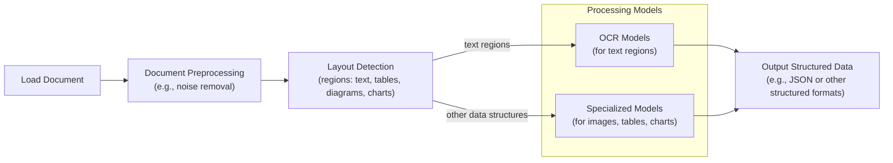
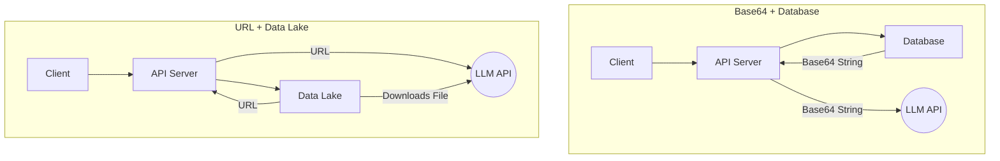
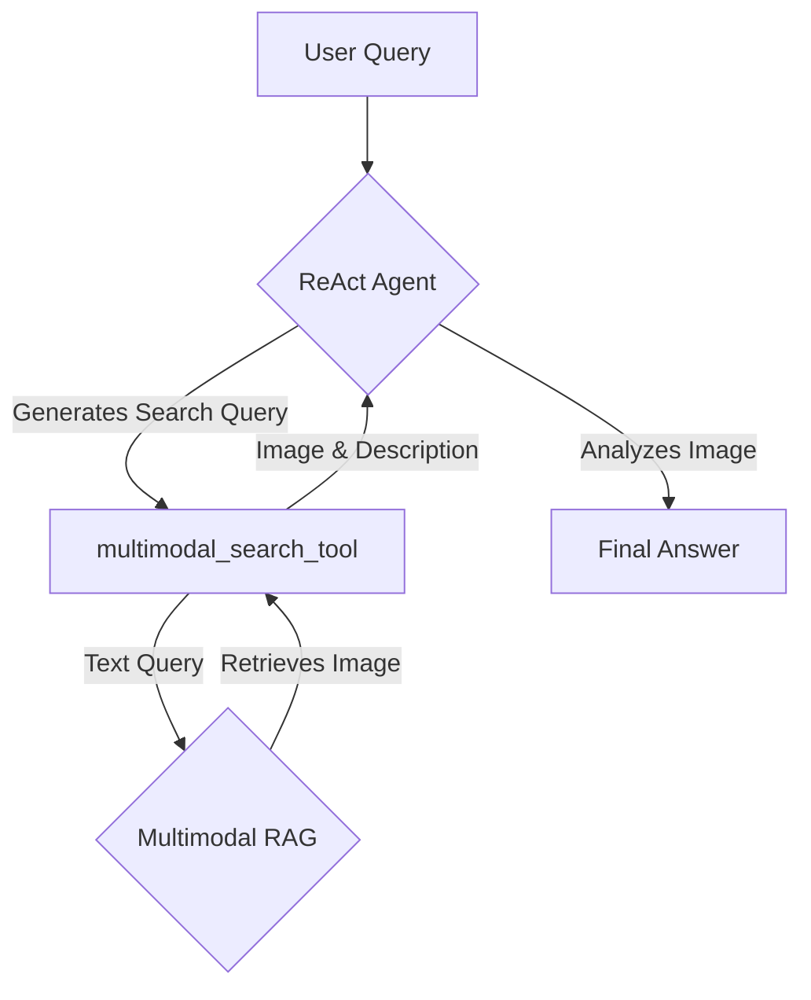

# Stop Converting Documents to Text. You're Doing It Wrong.

In the previous lessons, we built a solid foundation in AI Engineering. We learned the difference between LLM workflows and AI agents, mastered context engineering, built agents that can reason and act using tools like ReAct, and took a deep dive into Retrieval-Augmented Generation (RAG). You now have the core skills to build sophisticated AI systems. However, we have one last piece of the puzzle to put in place: multimodal data.

When I first started building AI agents, I hit a frustrating wall. I was comfortable manipulating text, but the moment I had to integrate images, audio, and especially documents like PDFs, my elegant architectures turned into messy hacks. I spent weeks building complex pipelines that tried to force everything into text. I chained Optical Character Recognition (OCR) engines to scrape PDFs, layout detection models to identify tables, and separate classifiers to handle images. It was an unreliable, slow, and expensive solution that broke every time a document layout changed. The breakthrough came when I realized I was solving the wrong problem. I did not need to convert documents to text. I needed to treat them as images.

Real-world AI applications rarely exist in a text-only vacuum. As humans, we process information visually and audibly. Enterprise applications mirror this reality, working with financial reports containing complex charts, technical documents with diagrams, and medical records with diagnostic images [[38]](https://kanerika.com/blogs/multimodal-ai-agents/), [[39]](https://invisibletech.ai/blog/multimodal-enterprise-ai). The old approach of normalizing everything to text is lossy. When you translate a complex diagram into text, you lose the spatial relationships, the colors, and the context. You lose the information that matters most. Text-only models fail to interpret the rich data in financial charts, cannot process medical imagery for diagnostics, and miss the crucial details in technical sketches [[6]](https://konfuzio.com/en/chatgpt-financial-analysis/), [[7]](https://techtoday.lenovo.com/sites/default/files/2025-05/Medical%20Imaging%20White%20Paper%20NVIDIA%20and%20Lenovo.pdf). Modern AI systems, however, can process data in its native format, preserving this rich visual information and resulting in systems that are faster, cheaper, and more performant.

In this lesson, we will explore the limitations of traditional document processing, cover the foundations of multimodal LLMs and RAG, and provide hands-on guides to building a multimodal RAG system and a ReAct agent that can reason over visual data.

## The Limitations of Traditional Document Processing

To understand the problem with old approaches, let’s dig into the limitations of traditional document processing for invoices, documentation, or reports. The core issue is that these systems try to normalize everything to text before passing it to an AI model, a flawed approach that loses a substantial amount of information. It is impossible to fully reproduce diagrams, charts, or sketches in text [[8]](https://www.ijcai.org/proceedings/2023/0581.pdf).

This problem is best illustrated by looking at OCR-based systems. A traditional document processing workflow relies on a sequence of steps to extract information from a PDF containing mixed text, diagrams, and tables [[46]](https://www.daft.ai/blog/end-to-end-distributed-pdf-processing-pipeline), [[48]](https://parseur.com/blog/document-processing-automation-guide).


Image 1: A flowchart illustrating the traditional document processing workflow using Layout detection and OCR.

This workflow has too many moving parts. It requires layout detection models, OCR models for text, and specialized models for each expected data structure, such as tables or charts. This makes the system rigid; if a document contains a chart type we do not have a model for, the pipeline fails. It is also slow and costly because we have to chain multiple model calls, and it is fragile because all these components must be maintained [[46]](https://www.daft.ai/blog/end-to-end-distributed-pdf-processing-pipeline). In practical settings, the data ingestion pipeline itself is often the primary performance bottleneck. Optimizing the sequence of parsing, layout detection, and chunking can yield greater performance improvements than swapping out the text embedding model, highlighting how delicate these multi-step systems are [[58]](https://arxiv.org/html/2407.01449v4).

Most importantly, we face significant performance challenges. The multi-step nature creates a cascade effect where errors compound at each stage. Even advanced OCR engines struggle with handwritten text, poor scans, stylized fonts, or complex layouts like nested tables and building sketches. Traditional OCR can have an accuracy of only 60% on complex documents, and even top open-source engines like Tesseract top out at 88-94% accuracy on such layouts [[3]](https://jiffy.ai/overcoming-ocr-errors-and-limitations-with-intelligent-document-processing/), [[1]](https://www.llamaindex.ai/blog/ocr-accuracy). Low-quality scans under 300 DPI can cause accuracy to drop by over 20%, and a page tilt of just five degrees can increase the Word Error Rate (WER) by 15% or more [[1]](https://www.llamaindex.ai/blog/ocr-accuracy). These systems are simply not built for the messy reality of enterprise documents.
Image 2: A building sketch showing a crawl space vent diagram, illustrating the complexity of layouts that classic OCR systems struggle to interpret. (Source [Vectorize.io](https://vectorize.io/blog/multimodal-rag-patterns))

This approach might work for highly specialized applications, but it has too many problems and does not scale in a world where AI agents need to be flexible and fast. Modern AI solutions, therefore, use multimodal LLMs that can directly interpret text, images, or PDFs as native input, completely bypassing this unstable OCR workflow.

Thus, let’s understand how multimodal LLMs work.

## Foundations of Multimodal LLMs

Before we get to the code, you need an intuition of how multimodality works. You do not need to understand every research detail, but knowing the architecture helps you use, deploy, optimize, and monitor these models effectively. There are two common approaches to building multimodal LLMs: the Unified Embedding Decoder Architecture and the Cross-modality Attention Architecture [[21]](https://magazine.sebastianraschka.com/p/understanding-multimodal-llms).
Image 3: The two main approaches to developing multimodal LLM architectures. (Source [Understanding Multimodal LLMs](https://magazine.sebastianraschka.com/p/understanding-multimodal-llms))

### Unified Embedding Decoder Architecture

In this approach, we encode the text and image separately, concatenate their embeddings into a single vector, and pass the resulting vector to the LLM [[21]](https://magazine.sebastianraschka.com/p/understanding-multimodal-llms). On top of a standard LLM architecture, you need a vision encoder that maps the image to an embedding within the same vector space as the text. When the text and image embeddings are merged, the LLM can make sense of both.
Image 4: Illustration of the unified embedding decoder architecture. (Source [Understanding Multimodal LLMs](https://magazine.sebastianraschka.com/p/understanding-multimodal-llms))

### Cross-modality Attention Architecture

In the second approach, instead of passing the image embeddings along with the text embeddings at the input, we inject them directly into the attention module [[21]](https://magazine.sebastianraschka.com/p/understanding-multimodal-llms). We still need an image encoder that projects the image into the same vector space as the text, but we inject it deeper within the architecture.
Image 5: An illustration of the Cross-Modality Attention Architecture approach. (Source [Understanding Multimodal LLMs](https://magazine.sebastianraschka.com/p/understanding-multimodal-llms))

### Image Encoders

Both architectures rely on image encoders, which we can understand by drawing a parallel between text tokenization and image patching. Just as we split text into sub-word tokens, we split images into patches [[21]](https://magazine.sebastianraschka.com/p/understanding-multimodal-llms).
Image 6: Image tokenization and embedding (left) and text tokenization and embedding (right) side by side. (Source [Understanding Multimodal LLMs](https://magazine.sebastianraschka.com/p/understanding-multimodal-llms))

Each patch is passed through a Vision Transformer (ViT), which converts it into an embedding. The output has the same structure and dimensions as text embeddings, but the two need to be aligned in the same vector space. This alignment is achieved through a linear projection module [[21]](https://magazine.sebastianraschka.com/p/understanding-multimodal-llms). The architecture of this projection module is critical for effective alignment. Empirical studies have shown that a simple two-layer MLP projector is often optimal for bridging the modality gap, performing better than both shallower one-layer and deeper four-layer alternatives [[59]](https://openreview.net/pdf?id=uQEsLZU15E). Popular image encoder models, which often leverage the core architecture of CLIP, include OpenCLIP and SigLIP [[3]](https://towardsdatascience.com/multimodal-embeddings-an-introduction-5dc36975966f/).
Image 7: Illustration of a classic Vision Transformer (ViT) setup. (Source [Understanding Multimodal LLMs](https://magazine.sebastianraschka.com/p/understanding-multimodal-llms))

These encoders are also used for multimodal RAG, allowing us to find semantic similarities between images and text. This means you can run similarity metrics between text, image, document, and audio vectors as long as they are mapped to the same vector space.
Image 8: Toy representation of multimodal embedding space. (Source [Multimodal Embeddings: An Introduction](https://towardsdatascience.com/multimodal-embeddings-an-introduction-5dc36975966f/))

The **Unified Embedding Decoder** approach is simpler to implement and generally yields higher accuracy in OCR-related tasks. The **Cross-modality Attention** approach is more computationally efficient for high-resolution images because it injects tokens directly into the attention mechanism rather than passing them all as input. Hybrid approaches also exist to combine these benefits [[36]](https://magazine.sebastianraschka.com/p/understanding-multimodal-llms), [[37]](https://arxiv.org/abs/2409.11402).

In 2025, most leading LLMs are multimodal. Open-source examples include Llama 4, Gemma 2, and Qwen3, while closed-source models include GPT-5, Gemini 2.5, and Claude [[22]](https://medium.com/data-science-in-your-pocket/2025-the-year-ai-reasoning-models-took-over-a-month-by-month-review-of-frontier-breakthroughs-6ea2163f854f), [[23]](https://codedesign.ai/blog/the-ultimate-guide-to-the-top-large-language-models-in-2025/). This same architecture can be extended to other modalities like PDFs, audio, or video by integrating specialized encoders for each data type [[27]](https://sparkco.ai/blog/exploring-multimodal-llms-text-image-and-video-integration), [[28]](https://www.emergentmind.com/topics/multimodal-llms), [[29]](https://towardsai.net/p/l/enhancing-llm-capabilities-the-power-of-multimodal-llms-and-rag).

A quick note on **Multimodal LLMs vs. Diffusion Models**: Diffusion models like Midjourney generate images from noise, while multimodal LLMs like GPT understand and sometimes generate images. They are architecturally different. In an agent workflow, diffusion models are typically used as tools, not as the core reasoning model [[19]](https://arxiv.org/html/2409.14993v3), [[21]](https://magazine.sebastianraschka.com/p/understanding-multimodal-llms).

Now that we understand how LLMs can directly process images or documents, let’s see how this works in practice.

## Applying Multimodal LLMs to Images and PDFs

To better understand how multimodal LLMs work, let’s write a few examples using Gemini to show some best practices when working with images and PDFs. There are three core ways to process multimodal data with LLMs: raw bytes, Base64, and URLs.

- **Raw bytes:** This is the easiest way to work with LLMs for one-off API calls. However, storing raw bytes in a database can lead to corruption, as most databases interpret the input as text instead of bytes.
- **Base64:** This method encodes raw bytes as strings, which is useful for storing images or documents directly in a database like PostgreSQL or MongoDB without corruption. The main downside is that the file size increases by approximately 33%.
- **URLs:** This is the standard for enterprise scenarios. Data is stored in a data lake like AWS S3 or Google Cloud Storage, and the LLM downloads the media directly from the bucket. This reduces network latency for your application, as the file never passes through your server, making it the most efficient option for scale.


Image 9: A comparison between storing multimodal data as Base64 strings in a database versus storing them as URLs in a data lake.

Now, let's dig into the code.

First, we will display our sample image.
Image 10: A sample image of a kitten and a robot used in our examples.

1.  We can process an image as raw bytes. We define a helper function to load the image and convert it to bytes, using the efficient `WEBP` format.

    ```python
    def load_image_as_bytes(
        image_path: Path, format: Literal["WEBP", "JPEG", "PNG"] = "WEBP", max_width: int = 600, return_size: bool = False
    ) -> bytes | tuple[bytes, tuple[int, int]]:
        """
        Load an image from file path and convert it to bytes with optional resizing.
        """
        image = PILImage.open(image_path)
        if image.width > max_width:
            ratio = max_width / image.width
            new_size = (max_width, int(image.height * ratio))
            image = image.resize(new_size)
    
        byte_stream = io.BytesIO()
        image.save(byte_stream, format=format)
    
        if return_size:
            return byte_stream.getvalue(), image.size
    
        return byte_stream.getvalue()
    ```

2.  We load the image as raw bytes and inspect its size.

    ```python
    image_bytes = load_image_as_bytes(image_path=Path("images") / "image_1.jpeg", format="WEBP")
    ```
    It outputs:
    ```text
    Bytes `b'RIFF`\xad\x00\x00WEBPVP8 T\xad\x00\x00P\xec\x02\x9d\x01*X\x02X\x02'...`
    Size: 44392 bytes
    ```

3.  Then, we call the LLM to generate a caption. We can also pass multiple images to compare them.

    ```python
    response = client.models.generate_content(
        model=MODEL_ID,
        contents=[
            types.Part.from_bytes(
                data=image_bytes,
                mime_type="image/webp",
            ),
            "Tell me what is in this image in one paragraph.",
        ],
    )
    ```
    It outputs:
    ```text
    This striking image features a massive, dark metallic robot, its powerful form detailed with intricate circuit patterns on its head and piercing red glowing eyes. Perched playfully on its right arm is a small, fluffy grey tabby kitten...
    ```

4.  We can also process the image as a Base64 encoded string. The logic is similar, but we encode the bytes first.

    ```python
    import base64
    from typing import cast
    
    def load_image_as_base64(
        image_path: Path, format: Literal["WEBP", "JPEG", "PNG"] = "WEBP", max_width: int = 600, return_size: bool = False
    ) -> str:
        """
        Load an image and convert it to base64 encoded string.
        """
        image_bytes = load_image_as_bytes(image_path=image_path, format=format, max_width=max_width, return_size=False)
        return base64.b64encode(cast(bytes, image_bytes)).decode("utf-8")
    
    image_base64 = load_image_as_base64(image_path=Path("images") / "image_1.jpeg", format="WEBP")
    ```
    As expected, the Base64 string is about 33% larger than the raw bytes.
    ```text
    Image as Base64 is 33.34% larger than as bytes
    ```

5.  For public URLs, Gemini’s `url_context` tool allows us to parse web pages, PDFs, and images directly.

    ```python
    response = client.models.generate_content(
        model=MODEL_ID,
        contents="Based on the provided paper as a PDF, tell me how ReAct works: https://arxiv.org/pdf/2210.03629",
        config=types.GenerateContentConfig(tools=[{"url_context": {}}]),
    )
    ```
    It outputs:
    ```text
    ReAct is a novel paradigm for large language models (LLMs) that combines reasoning (Thought) and acting (Action) in an interleaved manner to solve diverse language and decision-making tasks...
    ```

6.  For private data lakes, Gemini integrates well with Google Cloud Storage. While setting up a private bucket is beyond this lesson's scope, the code would look like this.

    ```python
    response = client.models.generate_content(
        model=MODEL_ID,
        contents=[
            types.Part.from_uri(uri="gs://gemini-images/image_1.jpeg", mime_type="image/webp"),
            "Tell me what is in this image in one paragraph.",
        ],
    )
    ```

7.  Let's try a more complex task: object detection. We use Pydantic to define the output structure, leveraging what we learned in Lesson 4.

    ```python
    from pydantic import BaseModel, Field

    class BoundingBox(BaseModel):
        ymin: float
        xmin: float
        ymax: float
        xmax: float
        label: str = Field(...)
    
    class Detections(BaseModel):
        bounding_boxes: list[BoundingBox]
    
    prompt = "Detect all prominent items. Return 2d boxes normalized to 0-1000."
    
    response = client.models.generate_content(
        model=MODEL_ID,
        contents=[types.Part.from_bytes(data=image_bytes, mime_type="image/webp"), prompt],
        config=types.GenerateContentConfig(
            response_mime_type="application/json",
            response_schema=Detections
        ),
    )
    ```
    The `response.parsed` attribute gives us a Pydantic object with the bounding boxes, which we can then visualize.

    
    Image 11: The output of our object detection script, with bounding boxes drawn around the detected items.

8.  Now, let’s process PDFs. The process is identical to images. We load the PDF as bytes and pass it to the model.

    ```python
    pdf_bytes = (Path("pdfs") / "attention_is_all_you_need_paper.pdf").read_bytes()
    
    response = client.models.generate_content(
        model=MODEL_ID,
        contents=[
            types.Part.from_bytes(data=pdf_bytes, mime_type="application/pdf"),
            "What is this document about? Provide a brief summary of the main topics.",
        ],
    )
    ```
    It outputs:
    ```text
    This document introduces the Transformer, a novel neural network architecture designed for sequence transduction tasks (like machine translation)...
    ```

9.  Finally, we can perform object detection on PDF pages by treating them as images. This is powerful for extracting diagrams or tables, a concept popularized by the ColPali paper, which demonstrated that modern Vision Language Models can retrieve documents more effectively by “looking” at them [[52]](https://www.decodingai.com/p/stop-converting-documents-to-text).

    ```python
    page_image_bytes = load_image_as_bytes("images/attention_is_all_you_need_1.jpeg")
    
    prompt = "Detect all the diagrams from the provided image as 2d bounding boxes."
    
    response = client.models.generate_content(
        model=MODEL_ID,
        contents=[types.Part.from_bytes(data=page_image_bytes, mime_type="image/webp"), prompt],
        config=types.GenerateContentConfig(
            response_mime_type="application/json",
            response_schema=Detections
        ),
    )
    ```
    This ability to understand visual layouts without OCR is powerful, but to apply it at scale across thousands of documents, we need an efficient retrieval system. This brings us to multimodal RAG.

## Foundations of Multimodal RAG

One of the most common use cases for multimodal data is RAG, a concept we explored in Lesson 10. When building custom AI applications, you will always need to retrieve private company data. For large formats like images or PDFs, RAG is even more critical. Stuffing thousands of PDF pages into an LLM’s context window is unfeasible due to the direct correlation between context size and increased latency, cost, and decreased performance.

Let's explore a generic multimodal RAG architecture using images and text as an example.

```mermaid
graph TD
    subgraph Ingestion
        A[Images] --> B{Multimodal<br>Embedding Model};
        B --> C[Image Embeddings];
        C --> D[(Vector Database)];
    end

    subgraph Retrieval
        E[User Query (Text)] --> F{Multimodal<br>Embedding Model};
        F --> G[Query Embedding];
        G --> H{Similarity Search};
        D --> H;
        H --> I[Top-K Similar Images];
    end
```
Image 12: A diagram illustrating the ingestion and retrieval pipelines of a multimodal RAG system.

This technique is heavily used in image search engines like Google or Apple Photos. When you query "pictures of dogs," the system retrieves images of dogs because the text and image embeddings reside in the same vector space, allowing for semantic similarity searches [[56]](https://opensearch.org/blog/multimodal-semantic-search/), [[57]](https://towardsdatascience.com/multimodal-ai-search-for-business-applications-65356d011009/).

For our enterprise use case of performing RAG on documents, the state-of-the-art architecture as of 2025 is ColPali. It bypasses the entire OCR pipeline by processing document pages directly as images, making it ideal for documents with tables, figures, and other complex visual layouts.
Image 13: ColPali simplifies document retrieval compared to standard methods while achieving stronger performance with better latencies. (Source [ColPali Paper](https://arxiv.org/pdf/2407.01449v6))

**Offline indexing** is the first step, where ColPali processes each document page as an image. Instead of chunking text, it divides the image into patches. This preserves the visual layout and captures both text and graphics. Each patch is then converted into an embedding vector by a Vision Language Model.

**Online querying** uses a "late interaction" mechanism. When you submit a query, it is also converted into token embeddings. The system then calculates a relevance score by finding the maximum similarity between each query token and all the document's patch embeddings. These maximum scores are summed up to get the final score for the page. This method, known as MaxSim, allows for a fine-grained comparison between the query and the document's visual content [[58]](https://arxiv.org/html/2407.01449v4).

Instead of creating a single embedding for the entire page, ColPali generates a multi-vector representation—a "bag-of-embeddings"—with one vector per image patch. The model is trained using an in-batch contrastive loss that pushes positive pairs closer and away from the hardest negatives in a batch [[58]](https://arxiv.org/html/2407.01449v4). This approach is 2-10 times faster than traditional OCR pipelines and significantly outperforms them on benchmarks like ViDoRe, achieving an 81.3% average nDCG@5 score.

Enough theory. Let's move to a concrete example where we will implement a multimodal RAG system from scratch.

## Implementing Multimodal RAG

Let's combine what we have learned in this lesson and in Lesson 10 on RAG into a multimodal RAG example. We will populate an in-memory vector database with multiple images and pages from the "Attention Is All You Need" paper, then query it with text questions. To keep it simple, we will not patch the images or use a late-interaction mechanism.

```mermaid
graph TD
    subgraph Ingestion
        A[Images & PDF Pages] --> B{Gemini<br>Image-to-Text};
        B --> C[Descriptions];
        C --> D{Gemini<br>Text Embedding};
        D --> E[Embeddings];
        E --> F[(In-Memory<br>Vector Index)];
    end

    subgraph Retrieval
        G[User Query (Text)] --> H{Gemini<br>Text Embedding};
        H --> I[Query Embedding];
        I --> J{Similarity Search};
        F --> J;
        J --> K[Top-K Similar Images];
    end
```
Image 14: A diagram of our multimodal RAG example, showing both ingestion and retrieval pipelines.

1.  First, we define a function to generate a detailed description of an image using Gemini. As the Gemini developer API does not support image embeddings directly, we will create a text description and embed that instead. This is not the recommended approach, but it allows us to demonstrate the RAG workflow simply. With a proper multimodal embedding model like Voyage AI, Cohere Embed, or OpenAI's CLIP, you would embed the image bytes directly [[31]](https://milvus.io/blog/choose-embedding-model-rag-2026.md).

    ```python
    from io import BytesIO
    
    def generate_image_description(image_bytes: bytes) -> str:
        """
        Generate a detailed description of an image using Gemini Vision model.
        """
        try:
            img = PILImage.open(BytesIO(image_bytes))
            prompt = "Describe this image in detail for semantic search purposes..."
            response = client.models.generate_content(
                model=MODEL_ID,
                contents=[prompt, img],
            )
            return response.text.strip() if response and response.text else ""
        except Exception as e:
            print(f"❌ Failed to generate image description: {e}")
            return ""
    ```

2.  Next, we define a function to create text embeddings using Gemini's embedding model.

    ```python
    def embed_text_with_gemini(content: str) -> np.ndarray | None:
        """
        Embed text content using Gemini's text embedding model.
        """
        try:
            result = client.models.embed_content(
                model="gemini-embedding-001",
                contents=[content],
            )
            return np.array(result.embeddings[0].values) if result and result.embeddings else None
        except Exception as e:
            print(f"❌ Failed to embed text: {e}")
            return None
    ```

3.  We then create our vector index, which is a list of dictionaries containing the image content, description, and embedding.

    ```python
    def create_vector_index(image_paths: list[Path]) -> list[dict]:
        """
        Create embeddings for images by generating descriptions and embedding them.
        """
        vector_index = []
        for image_path in image_paths:
            image_bytes = cast(bytes, load_image_as_bytes(image_path, format="WEBP", return_size=False))
            image_description = generate_image_description(image_bytes)
            image_embedding = embed_text_with_gemini(image_description)
            vector_index.append({
                "content": image_bytes,
                "type": "image",
                "filename": image_path,
                "description": image_description,
                "embedding": image_embedding,
            })
        return vector_index
    
    image_paths = list(Path("images").glob("*.jpeg"))
    vector_index = create_vector_index(image_paths)
    ```

4.  Finally, we define a search function that takes a text query, embeds it, and finds the most similar items in our vector index using cosine similarity.

    ```python
    from sklearn.metrics.pairwise import cosine_similarity
    
    def search_multimodal(query_text: str, vector_index: list[dict], top_k: int = 3) -> list[Any]:
        """
        Search for most similar documents to query using direct Gemini client.
        """
        query_embedding = embed_text_with_gemini(query_text)
        if query_embedding is None:
            return []
    
        embeddings = [doc["embedding"] for doc in vector_index]
        similarities = cosine_similarity([query_embedding], embeddings).flatten()
        top_indices = np.argsort(similarities)[::-1][:top_k]
    
        return [{**vector_index[idx], "similarity": similarities[idx]} for idx in top_indices]
    ```

5.  Let's test it with a query about the Transformer architecture.

    ```python
    query = "what is the architecture of the transformer neural network?"
    results = search_multimodal(query, vector_index, top_k=1)
    ```
    The system correctly retrieves the page from the "Attention Is All You Need" paper that contains the model architecture diagram, with a similarity score of 0.744.

    
    Image 15: The top search result for our query about the Transformer architecture.

While our example uses a simple in-memory index, scaling this to millions of documents introduces challenges, particularly around storage and latency. The multi-vector approach used by ColPali creates a larger memory footprint than single-vector methods. To mitigate this, techniques like token pooling can be used to reduce the number of vectors per document by clustering and averaging redundant patches (e.g., white backgrounds), retaining over 97% of the performance while reducing the embedding count by over 66% [[58]](https://arxiv.org/html/2407.01449v4).

Now that we have a working multimodal retrieval function, we can integrate it as a tool into an AI agent, allowing it to reason over visual information.

## Building Multimodal AI Agents

To take this a step further, we can integrate our RAG functionality into a ReAct agent as a tool, consolidating most of the skills you have learned in the first part of this course. Multimodal capabilities can be added to AI agents by providing multimodal inputs to the reasoning LLM, leveraging multimodal retrieval tools, or using tools that interact with external multimodal resources like PDFs or screenshots.

Our simple agent will use LangGraph to create a ReAct agent and connect our `search_multimodal` function as a tool. We will then ask the agent about the color of our kitten.


Image 16: A diagram of our multimodal ReAct agent with RAG capabilities.

1.  First, we define the `multimodal_search_tool` using LangChain's `@tool` decorator. This tool will call our `search_multimodal` function.

    ```python
    from langchain_core.tools import tool
    
    @tool
    def multimodal_search_tool(query: str) -> dict[str, Any]:
        """
        Search through a collection of images and their text descriptions to find relevant content.
        """
        results = search_multimodal(query, vector_index, top_k=1)
        if not results:
            return {"role": "tool_result", "content": "No relevant content found."}
        
        result = results[0]
        content = [
            {"type": "text", "text": f"Image description: {result['description']}"},
            types.Part.from_bytes(data=result['content'], mime_type="image/jpeg"),
        ]
        return {"role": "tool_result", "content": content}
    ```

2.  Next, we create the ReAct agent using LangGraph's `create_react_agent` function, providing it with our new tool and a system prompt that guides its behavior. We will explore LangGraph in more detail in Part 2 of the course.

    ```python
    from langgraph.prebuilt import create_react_agent
    from langchain_google_genai import ChatGoogleGenerativeAI
    
    def build_react_agent() -> Any:
        """
        Build a ReAct agent with multimodal search capabilities.
        """
        tools = [multimodal_search_tool]
        system_prompt = "You are a helpful AI assistant that can search through images and text to answer questions..."
        agent = create_react_agent(
            model=ChatGoogleGenerativeAI(model="gemini-2.5-pro", temperature=0.1),
            tools=tools,
            prompt=system_prompt,
        )
        return agent
    
    react_agent = build_react_agent()
    ```

3.  Now, let's ask our agent about the color of the kitten.

    ```python
    test_question = "what color is my kitten?"
    response = react_agent.invoke(input={"messages": test_question})
    ```
    The agent first reasons that it needs to search for "my kitten." It calls the `multimodal_search_tool`, which retrieves the image of the kitten and robot. The agent then analyzes the image and its description to provide the final answer.

    It outputs:
    ```text
    Based on the image, your kitten is a gray tabby. It has soft, short gray fur with darker tabby stripe patterns.
    ```

In this lesson, we have combined structured outputs, tools, ReAct, RAG, and multimodal data to create a proof-of-concept for an agentic multimodal RAG system.

## Conclusion

Working with multimodal data is a fundamental skill for AI engineers. Modern AI applications rarely exist in a text-only vacuum; they interact with the complex, visual, and auditory reality of the world. In this lesson, we moved away from the unstable, multi-step OCR pipelines of the past and learned that modern LLMs can natively process images and documents, preserving rich context that was previously lost.

This concludes our *AI Agents Foundations* series. We started by understanding the difference between workflows and agents, mastered context engineering and structured outputs, built robust planning capabilities with ReAct, and finally gave our agents eyes and ears. You now have the foundational blocks to build production-ready AI systems. In the next part of the course, we will move from theory to practice and begin building our central project: an interconnected research and writing agent system.

## References

- [1] OCR Accuracy Explained: How to Improve It. (n.d.). LlamaIndex. [https://www.llamaindex.ai/blog/ocr-accuracy](https://www.llamaindex.ai/blog/ocr-accuracy)
- [2] Complex Document Recognition: OCR Doesn’t Work and Here’s How You Fix It. (n.d.). HackerNoon. [https://hackernoon.com/complex-document-recognition-ocr-doesnt-work-and-heres-how-you-fix-it](https://hackernoon.com/complex-document-recognition-ocr-doesnt-work-and-heres-how-you-fix-it)
- [3] Overcoming OCR errors and limitations with intelligent document processing. (n.d.). Jiffy.ai. [https://jiffy.ai/overcoming-ocr-errors-and-limitations-with-intelligent-document-processing/](https://jiffy.ai/overcoming-ocr-errors-and-limitations-with-intelligent-document-processing/)
- [4] unstructured.io. (n.d.). Unstructured Leads in Document Parsing Quality, Benchmarks Tell the Full Story. [https://unstructured.io/blog/unstructured-leads-in-document-parsing-quality-benchmarks-tell-the-full-story](https://unstructured.io/blog/unstructured-leads-in-document-parsing-quality-benchmarks-tell-the-full-story)
- [5] Why OCR Technology Fails on Real-World Documents (and How Intelligent Document Processing Can Help). (n.d.). Netfira. [https://netfira.com/why-ocr-technology-fails-on-real-world-documents-and-how-intelligent-document-processing-can-help/](https://netfira.com/why-ocr-technology-fails-on-real-world-documents-and-how-intelligent-document-processing-can-help/)
- [6] ChatGPT for Financial Analysis. (n.d.). Konfuzio. [https://konfuzio.com/en/chatgpt-financial-analysis/](https://konfuzio.com/en/chatgpt-financial-analysis/)
- [7] Medical Imaging White Paper NVIDIA and Lenovo. (n.d.). Lenovo. [https://techtoday.lenovo.com/sites/default/files/2025-05/Medical%20Imaging%20White%20Paper%20NVIDIA%20and%20Lenovo.pdf](https://techtoday.lenovo.com/sites/default/files/2025-05/Medical%20Imaging%20White%20Paper%20NVIDIA%20and%20Lenovo.pdf)
- [8] Wang, Z., et al. (2023). Beyond Pure Text: Summarizing Financial Reports Based on Both Textual and Tabular Data. IJCAI. [https://www.ijcai.org/proceedings/2023/0581.pdf](https://www.ijcai.org/proceedings/2023/0581.pdf)
- [9] EPOCH: A Human-in-the-Loop Framework for Explainable, Private, Opinionated, Creative, and Hopeful AI in Financial Services. (n.d.). arXiv. [https://arxiv.org/html/2503.22035v1](https://arxiv.org/html/2503.22035v1)
- [10] 10 real-world examples of AI in healthcare. (n.d.). Philips. [https://www.philips.com/a-w/about/news/archive/features/2022/20221124-10-real-world-examples-of-ai-in-healthcare.html](https://www.philips.com/a-w/about/news/archive/features/2022/20221124-10-real-world-examples-of-ai-in-healthcare.html)
- [11] Integrating Multimodal Data into a Large Language Model. (n.d.). Towards Data Science. [https://towardsdatascience.com/integrating-multimodal-data-into-a-large-language-model-d1965b8ab00c/](https://towardsdatascience.com/integrating-multimodal-data-into-a-large-language-model-d1965b8ab00c/)
- [12] Evaluating Multimodal vs. Text-Based Retrieval for RAG with Snowflake Cortex. (n.d.). Snowflake. [https://www.snowflake.com/en/engineering-blog/arctic-agentic-rag-multimodal-pdf-retrieval/](https://www.snowflake.com/en/engineering-blog/arctic-agentic-rag-multimodal-pdf-retrieval/)
- [13] Multimodal RAG. (n.d.). Pathway. [https://pathway.com/developers/templates/rag/multimodal-rag](https://pathway.com/developers/templates/rag/multimodal-rag)
- [14] Multimodal RAG Explained: From Text to Images and Beyond. (n.d.). USAII. [https://www.usaii.org/ai-insights/multimodal-rag-explained-from-text-to-images-and-beyond](https://www.usaii.org/ai-insights/multimodal-rag-explained-from-text-to-images-and-beyond)
- [15] Connecting Large Language Models with the World. (n.d.). arXiv. [https://arxiv.org/html/2409.14993v3](https://arxiv.org/html/2409.14993v3)
- [16] LLMs. (n.d.). Anyscale. [https://docs.anyscale.com/llm](https://docs.anyscale.com/llm)
- [17] Raschka, S. (2024). Understanding Multimodal LLMs. [https://magazine.sebastianraschka.com/p/understanding-multimodal-llms](https://magazine.sebastianraschka.com/p/understanding-multimodal-llms)
- [18] 2025: The Year AI Reasoning Models Took Over. (n.d.). Medium. [https://medium.com/data-science-in-your-pocket/2025-the-year-ai-reasoning-models-took-over-a-month-by-month-review-of-frontier-breakthroughs-6ea2163f854f](https://medium.com/data-science-in-your-pocket/2025-the-year-ai-reasoning-models-took-over-a-month-by-month-review-of-frontier-breakthroughs-6ea2163f854f)
- [19] The Ultimate Guide to the Top Large Language Models in 2025. (n.d.). Codedesign.ai. [https://codedesign.ai/blog/the-ultimate-guide-to-the-top-large-language-models-in-2025/](https://codedesign.ai/blog/the-ultimate-guide-to-the-top-large-language-models-in-2025/)
- [20] A Comparative Analysis of Advanced Coding Language Models. (n.d.). Preprints.org. [https://www.preprints.org/manuscript/202508.1904](https://www.preprints.org/manuscript/202508.1904)
- [21] Ultimate 2025 AI Language Models Comparison. (n.d.). Promptitude. [https://www.promptitude.io/post/ultimate-2025-ai-language-models-comparison-gpt5-gpt-4-claude-gemini-sonar-more](https://www.promptitude.io/post/ultimate-2025-ai-language-models-comparison-gpt5-gpt-4-claude-gemini-sonar-more)
- [22] Exploring Multimodal LLMs: Text, Image, and Video Integration. (n.d.). SparkCognition. [https://sparkco.ai/blog/exploring-multimodal-llms-text-image-and-video-integration](https://sparkco.ai/blog/exploring-multimodal-llms-text-image-and-video-integration)
- [23] Multimodal LLMs. (n.d.). Emergent Mind. [https://www.emergentmind.com/topics/multimodal-llms](https://www.emergentmind.com/topics/multimodal-llms)
- [24] Enhancing LLM Capabilities: The Power of Multimodal LLMs and RAG. (n.d.). Towards AI. [https://towardsai.net/p/l/enhancing-llm-capabilities-the-power-of-multimodal-llms-and-rag](https://towardsai.net/p/l/enhancing-llm-capabilities-the-power-of-multimodal-llms-and-rag)
- [25] A Survey on Multimodal Large Language Models: Architectures, Tasks, and Challenges. (n.d.). arXiv. [https://arxiv.org/html/2411.06284v3](https://arxiv.org/html/2411.06284v3)
- [26] How to Choose an Embedding Model for RAG in 2026. (n.d.). Milvus. [https://milvus.io/blog/choose-embedding-model-rag-2026.md](https://milvus.io/blog/choose-embedding-model-rag-2026.md)
- [27] eager-embed-v1: The Best Open-Source Embedding Model for RAG. (n.d.). EagerWorks. [https://eagerworks.com/blog/best-embedding-model-for-rag](https://eagerworks.com/blog/best-embedding-model-for-rag)
- [28] Top Embedding Models in 2025. (n.d.). ArtSmart.ai. [https://artsmart.ai/blog/top-embedding-models-in-2025/](https://artsmart.ai/blog/top-embedding-models-in-2025/)
- [29] NVLM: Open Frontier-Class Multimodal LLMs. (n.d.). arXiv. [https://arxiv.org/abs/2409.11402](https://arxiv.org/abs/2409.11402)
- [30] Multimodal AI Agents. (n.d.). Kanerika. [https://kanerika.com/blogs/multimodal-ai-agents/](https://kanerika.com/blogs/multimodal-ai-agents/)
- [31] Multimodal Enterprise AI. (n.d.). Invisible Technologies. [https://invisibletech.ai/blog/multimodal-enterprise-ai](https://invisibletech.ai/blog/multimodal-enterprise-ai)
- [32] Multimodal AI Use Cases. (n.d.). Rasa. [https://rasa.com/blog/multimodal-ai-use-cases](https://rasa.com/blog/multimodal-ai-use-cases)
- [33] A Comprehensive Survey and Guide to Multimodal Large Language Models in Vision-Language Tasks. (n.d.). GitHub. [https://github.com/cognitivetech/llm-research-summaries/blob/main/models-review/A-Comprehensive-Survey-and-Guide-to-Multimodal-Large-Language-Models-in-Vision-Language-Tasks.md](https://github.com/cognitivetech/llm-research-summaries/blob/main/models-review/A-Comprehensive-Survey-and-Guide-to-Multimodal-Large-Language-Models-in-Vision-Language-Tasks.md)
- [34] Multimodal AI Examples: How It Works, Real-World Applications, and Future Trends. (n.d.). SmartDev. [https://smartdev.com/multimodal-ai-examples-how-it-works-real-world-applications-and-future-trends/](https://smartdev.com/multimodal-ai-examples-how-it-works-real-world-applications-and-future-trends/)
- [35] What is a multimodal LLM?. (n.d.). IBM. [https://www.ibm.com/think/topics/multimodal-llm](https://www.ibm.com/think/topics/multimodal-llm)
- [36] Multimodal large language models in radiology: a review of the state-of-the-art. (n.d.). NCBI. [https://pmc.ncbi.nlm.nih.gov/articles/PMC12479233/](https://pmc.ncbi.nlm.nih.gov/articles/PMC12479233/)
- [37] Multimodal AI in healthcare: a comprehensive review. (n.d.). Nature. [https://www.nature.com/articles/s41598-025-98483-1](https://www.nature.com/articles/s41598-025-98483-1)
- [38] End-to-end Distributed PDF Processing Pipeline. (n.d.). Daft. [https://www.daft.ai/blog/end-to-end-distributed-pdf-processing-pipeline](https://www.daft.ai/blog/end-to-end-distributed-pdf-processing-pipeline)
- [39] Why traditional OCR fails for complex business documents. (n.d.). Microsoft Learn. [https://learn.microsoft.com/en-us/answers/questions/5668164/why-traditional-ocr-fails-for-complex-business-doc?page=1](https://learn.microsoft.com/en-us/answers/questions/5668164/why-traditional-ocr-fails-for-complex-business-doc?page=1)
- [40] Document Processing Automation Guide. (n.d.). Parseur. [https://parseur.com/blog/document-processing-automation-guide](https://parseur.com/blog/document-processing-automation-guide)
- [41] OCR for Tables. (n.d.). LlamaIndex. [https://www.llamaindex.ai/blog/ocr-for-tables](https://www.llamaindex.ai/blog/ocr-for-tables)
- [42] AI PDF Data Extraction in Clinical Research. (n.d.). Intuition Labs. [https://intuitionlabs.ai/articles/ai-pdf-data-extraction-clinical-research](https://intuitionlabs.ai/articles/ai-pdf-data-extraction-clinical-research)
- [43] Gemini consistently producing valid Pydantic responses. (n.d.). Google AI. [https://discuss.ai.google.dev/t/gemini-consistently-producing-valid-pydantic-responses/98992](https://discuss.ai.google.dev/t/gemini-consistently-producing-valid-pydantic-responses/98992)
- [44] Stop Converting Documents to Text. You're Doing It Wrong. (n.d.). Decoding AI. [https://www.decodingai.com/p/stop-converting-documents-to-text](https://www.decodingai.com/p/stop-converting-documents-to-text)
- [45] LLM Output Parsing & Structured Generation. (n.d.). Tetrate. [https://tetrate.io/learn/ai/llm-output-parsing-structured-generation](https://tetrate.io/learn/ai/llm-output-parsing-structured-generation)
- [46] Structured Outputs with Multimodal Gemini. (n.d.). Instructor. [https://python.useinstructor.com/blog/2024/10/23/structured-outputs-with-multimodal-gemini/](https://python.useinstructor.com/blog/2024/10/23/structured-outputs-with-multimodal-gemini/)
- [47] Steering Large Language Models with Pydantic. (n.d.). Pydantic. [https://pydantic.dev/articles/llm-intro](https://pydantic.dev/articles/llm-intro)
- [48] Multimodal Semantic Search. (n.d.). OpenSearch. [https://opensearch.org/blog/multimodal-semantic-search/](https://opensearch.org/blog/multimodal-semantic-search/)
- [49] Multimodal AI Search for Business Applications. (n.d.). Towards Data Science. [https://towardsdatascience.com/multimodal-ai-search-for-business-applications-65356d011009/](https://towardsdatascience.com/multimodal-ai-search-for-business-applications-65356d011009/)
- [50] Joint Visual-Textual Embedding for Multimodal Style Search. (n.d.). Amazon Science. [https://assets.amazon.science/89/bf/661d950d4059930c8f1d2e449ac6/joint-visual-textual-embedding-for-multimodal-style-search.pdf](https://assets.amazon.science/89/bf/661d950d4059930c8f1d2e449ac6/joint-visual-textual-embedding-for-multimodal-style-search.pdf)
- [51] Combine Image and Text: How Multimodal Retrieval Transforms Search. (n.d.). Zilliz. [https://zilliz.com/blog/combine-image-and-text-how-multimodal-retrieval-transforms-search](https://zilliz.com/blog/combine-image-and-text-how-multimodal-retrieval-transforms-search)
- [52] Multimodal Sentence Transformers. (n.d.). Hugging Face. [https://huggingface.co/blog/multimodal-sentence-transformers](https://huggingface.co/blog/multimodal-sentence-transformers)
- [53] Fostiropoulos, I., et al. (2024). ColPali: Efficient Document Retrieval with Vision Language Models. arXiv. [https://arxiv.org/pdf/2407.01449v6](https://arxiv.org/pdf/2407.01449v6)
- [54] Talebi, S. (2024, November 13). Multimodal embeddings: An introduction. Medium. [https://towardsdatascience.com/multimodal-embeddings-an-introduction-5dc36975966f/](https://towardsdatascience.com/multimodal-embeddings-an-introduction-5dc36975966f/)
- [55] Vision language models. (n.d.). NVIDIA. [https://www.nvidia.com/en-us/glossary/vision-language-models/](https://www.nvidia.com/en-us/glossary/vision-language-models/)
- [56] Multi-modal ML with OpenAI’s CLIP. (n.d.). Pinecone. [https://www.pinecone.io/learn/series/image-search/clip/](https://www.pinecone.io/learn/series/image-search/clip/)
- [57] Talebi, S. (2024, November 13). Multimodal embeddings: An introduction. Medium. [https://towardsdatascience.com/multimodal-embeddings-an-introduction-5dc36975966f/](https://towardsdatascience.com/multimodal-embeddings-an-introduction-5dc36975966f/)
- [58] Faysse, M., et al. (2024). ColPali: Efficient Document Retrieval with Vision Language Models. arXiv. [https://arxiv.org/html/2407.01449v4](https://arxiv.org/html/2407.01449v4)
- [59] Li, K., et al. (2024). Modality Integration Rate. OpenReview. [https://openreview.net/pdf?id=uQEsLZU15E](https://openreview.net/pdf?id=uQEsLZU15E)
</article>