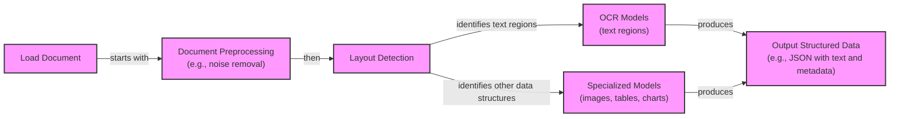
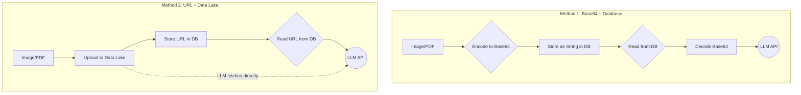
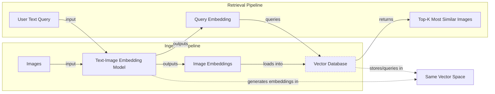
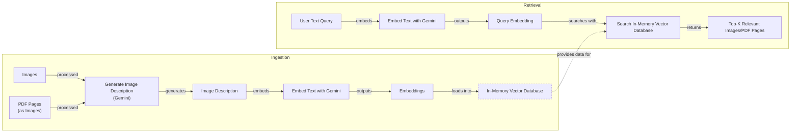
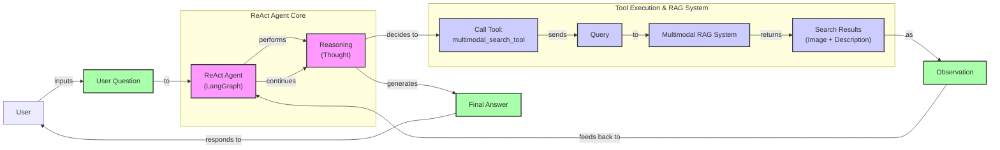

# Lesson 11: From Text to Vision with Multimodal AI

In the previous lessons, we built a solid foundation in AI Engineering. We explored the agent landscape, learned the difference between rule-based workflows and autonomous agents, and mastered context engineering, structured outputs, and the ReAct reasoning pattern. We even took a deep dive into Retrieval-Augmented Generation (RAG). So far, however, we have focused almost exclusively on a single data type: text.

But the real world is not text-only. As humans, we interact with images, documents, and videos every day. Enterprise data is no different. Financial reports are filled with charts that text-only models cannot read, technical manuals contain essential diagrams, and medical records include visual diagnostics like X-rays [[10]](https://invisibletech.ai/blog/multimodal-enterprise-ai). To build truly useful AI systems, we need to equip them with the ability to see and understand this visual information.

For years, the standard approach was to convert everything into text using Optical Character Recognition (OCR). This was a necessary but flawed workaround. Translating a complex diagram or a data-rich chart into words is like describing a painting over the phone; you lose the nuance, the spatial relationships, and the very essence of the visual information. Modern AI systems have moved beyond this limitation. Instead of translating, they interpret. Multimodal LLMs can now process images and documents in their native format, just as we do.

In this lesson, you will learn how to build AI applications that see. We will start by exploring the limitations of traditional document processing, then examine the architecture of multimodal LLMs. From there, we will move to hands-on examples, showing you how to use models like Gemini for object detection and PDF analysis. Finally, we will combine these skills with our knowledge of RAG and agents to build a complete multimodal RAG agent.

## Limitations of traditional document processing

To understand why native multimodal processing is a significant leap forward, we first need to look at the old way of doing things. For years, if you wanted an AI to understand a document like an invoice or a technical report, you had to force it through a rigid, multi-step pipeline that revolved around converting visual information into text.

This traditional workflow, illustrated in Image 1, was a cascade of specialized models. It started with preprocessing to clean up the document image, followed by layout detection to identify different regions like paragraphs, tables, and figures. Each region was then passed to a specific model: text blocks went to an OCR engine, while tables and charts were handled by other, more specialized systems. Finally, the extracted data was stitched together into a structured format like JSON [[11]](https://blog.roboflow.com/what-is-optical-character-recognition-ocr/).



Image 1: A flowchart illustrating the traditional document processing workflow, highlighting sequential and distinct processing steps.

This approach was not just complicated; it was brittle. The system was only as strong as its weakest link. If you encountered a new type of chart or a slightly different table format, the entire pipeline could fail. This made the system rigid, slow, and expensive to maintain. The reliance on rule-based systems for interpreting layouts meant that any deviation from a known template could cause the entire process to break, requiring constant manual updates and monitoring [[12]](https://learn.microsoft.com/en-us/answers/questions/5668164/why-traditional-ocr-fails-for-complex-business-doc).

The performance challenges were significant. The multi-step process created a cascade effect where errors from one stage compounded in the next. Even advanced OCR engines like Tesseract and PaddleOCR, which achieve 88–94% accuracy on simple layouts, struggle with more complex documents [[1]](https://www.llamaindex.ai/blog/ocr-accuracy). For poor-quality scans, handwritten notes, or complex layouts like nested tables, accuracy can drop dramatically. A 5-degree tilt in a scanned document, for instance, can increase the Word Error Rate (WER) by over 15% [[1]](https://www.llamaindex.ai/blog/ocr-accuracy). For handwriting, a Character Error Rate (CER) of 3–5% is considered good, which is often not enough for high-stakes applications [[1]](https://www.llamaindex.ai/blog/ocr-accuracy).

Complex documents like technical drawings or building sketches are particularly challenging. They contain a mix of rotated text, special symbols (like 'Ø' for diameter), and geometric shapes that look like text to an OCR engine. This leads to a high rate of false positives and misinterpretations. A system might confuse a square symbol '□' with part of the drawing's structure or fail to read text that is not perfectly horizontal [[13]](https://hackernoon.com/complex-document-recognition-ocr-doesnt-work-and-heres-how-you-fix-it). This fragility makes it nearly impossible to build a scalable, general-purpose document processing system with this architecture.

This is why modern AI solutions have moved on. Instead of this fragile, multi-step translation process, they use multimodal LLMs that can interpret text, images, and PDFs as native inputs, completely bypassing the old OCR workflow. Let's understand how these models work.

## Foundations of multimodal LLMs

Before we write any code, you need a high-level intuition for how multimodal LLMs work. You do not need to be an AI researcher to use them, but as an AI engineer, understanding the core concepts is essential for building, optimizing, and monitoring these systems.

At their core, multimodal LLMs are an extension of the text-only LLMs we are already familiar with. The main challenge is figuring out how to make a model that understands language also understand images. There are two common architectural approaches for this, using text-image models as our primary example.

Image 2: The two main approaches to developing multimodal LLM architectures. (Source [https://magazine.sebastianraschka.com/p/understanding-multimodal-llms](https://magazine.sebastianraschka.com/p/understanding-multimodal-llms) [[3]](https://magazine.sebastianraschka.com/p/understanding-multimodal-llms))

### Unified Embedding Decoder Architecture

The first and simpler approach is the **Unified Embedding Decoder Architecture**. Here, the image is converted into a sequence of tokens, just like text. These image tokens are then concatenated with the text tokens and fed directly into the LLM as a single, unified input sequence. The LLM processes this combined sequence without any fundamental changes to its architecture. This method is straightforward to implement because it treats all inputs, regardless of modality, as a simple sequence of tokens [[3]](https://magazine.sebastianraschka.com/p/understanding-multimodal-llms).

Image 3: An illustration of the unified embedding decoder architecture approach to building multimodal LLMs. (Source [https://magazine.sebastianraschka.com/p/understanding-multimodal-llms](https://magazine.sebastianraschka.com/p/understanding-multimodal-llms) [[3]](https://magazine.sebastianraschka.com/p/understanding-multimodal-llms))

### Cross-modality Attention Architecture

The second approach is the **Cross-modality Attention Architecture**. Instead of treating image tokens as part of the initial input, this method injects the visual information directly into the LLM's attention layers. As the LLM processes the text tokens, it uses a cross-attention mechanism to "look at" the image tokens at each step of its reasoning process. This is similar to how the original Transformer architecture handled language translation, where the decoder would pay attention to the encoder's output. This allows the model to dynamically weigh the importance of different parts of the image as it generates text [[3]](https://magazine.sebastianraschka.com/p/understanding-multimodal-llms).

Image 4: An illustration of the Cross-Modality Attention Architecture approach to building multimodal LLMs. (Source [https://magazine.sebastianraschka.com/p/understanding-multimodal-llms](https://magazine.sebastianraschka.com/p/understanding-multimodal-llms) [[3]](https://magazine.sebastianraschka.com/p/understanding-multimodal-llms))

### How Image Encoders Work

Both architectures rely on an **image encoder** to transform an image into a set of numerical representations, or embeddings. This process is analogous to text tokenization. While text is broken down into subwords using techniques like Byte-Pair Encoding, an image is divided into a grid of smaller patches [[3]](https://magazine.sebastianraschka.com/p/understanding-multimodal-llms).

Image 5: A side-by-side comparison of image and text tokenization and embedding processes. (Source [https://magazine.sebastianraschka.com/p/understanding-multimodal-llms](https://magazine.sebastianraschka.com/p/understanding-multimodal-llms) [[3]](https://magazine.sebastianraschka.com/p/understanding-multimodal-llms))

Each patch is then processed by a vision model, typically a Vision Transformer (ViT), which converts it into an embedding vector [[2]](https://arxiv.org/html/2409.14993v3). This is similar to how a text encoder generates embeddings for text tokens.

Image 6: An illustration of a classic vision transformer (ViT) setup. (Source [https://magazine.sebastianraschka.com/p/understanding-multimodal-llms](https://magazine.sebastianraschka.com/p/understanding-multimodal-llms) [[3]](https://magazine.sebastianraschka.com/p/understanding-multimodal-llms))

The final piece of the puzzle is aligning the image and text embeddings. Even if they have the same dimensions, they exist in separate vector spaces. A **linear projection module** (often just a simple linear layer) is used to map the image embeddings into the same space as the text embeddings. This alignment is crucial and is often achieved through a process called contrastive learning, which trains the model to bring embeddings of related concepts (like a picture of a dog and the text "a photo of a dog") closer together in the shared vector space [[4]](https://opensearch.org/blog/multimodal-semantic-search/).

Popular image encoders like CLIP, OpenCLIP, and SigLIP all use this core architecture. These models are not only used inside multimodal LLMs but also serve as powerful embedding models for multimodal RAG, allowing you to perform semantic similarity searches across text and images [[14]](https://www.pinecone.io/learn/series/image-search/clip/).

Image 7: A toy representation of a multimodal embedding space where text and images are co-located. (Image by Shaw Talebi from [Towards Data Science](https://towardsdatascience.com/multimodal-embeddings-an-introduction-5dc36975966f/) [[15]](https://towardsdatascience.com/multimodal-embeddings-an-introduction-5dc36975966f/))

The two architectural approaches come with different trade-offs. The **Unified Embedding Decoder Architecture** is simpler to implement and tends to perform better on OCR-related tasks [[5]](https://arxiv.org/abs/2409.11402). In contrast, the **Cross-modality Attention Architecture** is more computationally efficient, especially with high-resolution images, because it avoids lengthening the input sequence with image tokens [[5]](https://arxiv.org/abs/2409.11402). Some of the latest models, like NVIDIA's NVLM, even use a **hybrid approach** to get the best of both worlds [[5]](https://arxiv.org/abs/2409.11402).

By 2025, most state-of-the-art LLMs are natively multimodal. In the open-source world, we have models like Llama 4, Gemma 2, and Qwen3 [[6]](https://medium.com/data-science-in-your-pocket/2025-the-year-ai-reasoning-models-took-over-a-month-by-month-review-of-frontier-breakthroughs-6ea2163f854f). In the closed-source space, models like GPT-5, Gemini 2.5, and Claude 4 are leading the way [[7]](https://codedesign.ai/blog/the-ultimate-guide-to-the-top-large-language-models-in-2025/). These same principles can be extended to other modalities like PDFs, audio, and video by incorporating specialized encoders for each data type, such as Whisper for audio or Video Transformers for video [[8]](https://sparkco.ai/blog/exploring-multimodal-llms-text-image-and-video-integration), [[16]](https://www.emergentmind.com/topics/multimodal-llms).

It is also important to distinguish these multimodal LLMs from diffusion-based image generation models like Midjourney or Stable Diffusion. Diffusion models are a different family of generative models designed specifically for creating high-quality visual content [[2]](https://arxiv.org/html/2409.14993v3). While they excel at generation, they are not built for the kind of understanding and reasoning tasks that multimodal LLMs handle. However, they can be easily integrated into agentic workflows as tools for visual creation.

Now that we have an intuitive understanding of how LLMs can process images and documents, let's see how this works in practice.

## Applying multimodal LLMs to images and PDFs

To understand how multimodal LLMs work in a hands-on way, let's explore a few examples using Gemini. There are three primary ways to provide visual data to an LLM: as raw bytes, as Base64-encoded strings, or via URLs.

### Raw Bytes, Base64, and URLs

**Raw bytes** are the most direct way to handle files. You simply read the file from your disk and pass its binary content to the model. This is great for quick, one-off API calls, but it becomes problematic when you need to store this data. Most databases are designed to handle text and can corrupt binary data if not configured properly.

**Base64 encoding** solves this storage problem by converting the raw bytes into a string representation. This allows you to safely store images or documents in standard databases (like PostgreSQL or MongoDB) that are built for text. The trade-off is that Base64 strings are about 33% larger than the original binary data, which can increase storage costs and network latency.

**URLs** are the most efficient method for production systems. Instead of passing large files back and forth over the network, you provide the LLM with a link. This works for public data on the internet or, more commonly in enterprise settings, for files stored in a private data lake like AWS S3 or Google Cloud Storage. The LLM can then access the data directly, which is faster and more scalable.



Image 8: A diagram comparing database storage with Base64 encoding versus data lake storage with URLs.

Here is a quick summary of when to use each method:
*   **Raw bytes:** Best for one-off API calls where you do not need to store the data.
*   **Base64:** Ideal for storing visual data directly in a text-based database while avoiding corruption.
*   **URLs:** The preferred method for production applications using data lakes, as it minimizes data transfer and is highly efficient.

Now, let's dig into the code.

1.  First, let's look at a sample image we will be working with.
    
    
    
    Image 9: Sample image of a kitten and a robot.
    
2.  The most direct way to process an image is by loading it as raw bytes. We will define a helper function to load an image, resize it, and convert it to the efficient `WEBP` format. This format choice is intentional, as it offers excellent compression while maintaining high image quality, reducing the amount of data sent to the API and thus lowering costs and latency.
    
    ```python
    def load_image_as_bytes(
        image_path: Path, format: Literal["WEBP", "JPEG", "PNG"] = "WEBP", max_width: int = 600, return_size: bool = False
    ) -> bytes | tuple[bytes, tuple[int, int]]:
        """
        Load an image from file path and convert it to bytes with optional resizing.
    
        Args:
            image_path: Path to the image file to load
            format: Output image format (WEBP, JPEG, or PNG). Defaults to "WEBP"
            max_width: Maximum width for resizing. If image width exceeds this, it will be resized proportionally. Defaults to 600
            return_size: If True, returns both bytes and image size tuple. Defaults to False
    
        Returns:
            bytes: Image data as bytes, or tuple of (bytes, (width, height)) if return_size is True
        """
    
        image = PILImage.open(image_path)
        if image.width > max_width:
            ratio = max_width / image.width
            new_size = (max_width, int(image.height * ratio))
            image = image.resize(new_size)
    
        byte_stream = io.BytesIO()
        image.save(byte_stream, format=format)
    
        if return_size:
            return byte_stream.getvalue(), image.size
    
        return byte_stream.getvalue()
    ```
    
    Once loaded, the image is just a sequence of bytes.
    
    ```python
    image_bytes = load_image_as_bytes(image_path=Path("images") / "image_1.jpeg", format="WEBP")
    ```
    
    It outputs:
    
    ```text
    Bytes `b'RIFF`\xad\x00\x00WEBPVP8 T\xad\x00\x00P\xec\x02\x9d\x01*X\x02X\x02'...`
    Size: 44392 bytes
    ```
    
    We can then pass these bytes directly to the Gemini model to generate a caption.
    
    ```python
    response = client.models.generate_content(
        model=MODEL_ID,
        contents=[
            types.Part.from_bytes(
                data=image_bytes,
                mime_type="image/webp",
            ),
            "Tell me what is in this image in one paragraph.",
        ],
    )
    ```
    
    It outputs:
    
    ```text
    This striking image features a massive, dark metallic robot, its powerful form detailed with intricate circuit patterns on its head and piercing red glowing eyes. Perched playfully on its right arm is a small, fluffy grey tabby kitten, its front paw raised as if exploring or batting at the robot's armored limb, while its gaze is directed slightly off-frame. The robot's large, segmented hand is visible beneath the kitten. The background suggests an industrial or workshop environment, with hints of metal structures and natural light filtering in from an unseen window, creating a dramatic contrast between the soft, vulnerable kitten and the formidable, mechanical sentinel.
    ```
    
    This approach easily scales to multiple images. You can pass two images in the same call and ask the model to compare them.
    
3.  Next, let's process the same image as a Base64-encoded string. This is useful for storing the image in a text-based database. The function is straightforward: it loads the image as bytes and then encodes it.
    
    ```python
    from typing import cast
    
    
    def load_image_as_base64(
        image_path: Path, format: Literal["WEBP", "JPEG", "PNG"] = "WEBP", max_width: int = 600, return_size: bool = False
    ) -> str:
        """
        Load an image and convert it to base64 encoded string.
    
        Args:
            image_path: Path to the image file to load
            format: Output image format (WEBP, JPEG, or PNG). Defaults to "WEBP"
            max_width: Maximum width for resizing. If image width exceeds this, it will be resized proportionally. Defaults to 600
            return_size: Parameter passed to load_image_as_bytes function. Defaults to False
    
        Returns:
            str: Base64 encoded string representation of the image
        """
    
        image_bytes = load_image_as_bytes(image_path=image_path, format=format, max_width=max_width, return_size=False)
    
        return base64.b64encode(cast(bytes, image_bytes)).decode("utf-8")
    
    image_base64 = load_image_as_base64(image_path=Path("images") / "image_1.jpeg", format="WEBP")
    ```
    
    It outputs:
    
    ```text
    Base64: UklGRmCtAABXRUJQVlA4IFStAABQ7AKdASpYAlgCPm0ylEekIqInJnQ7gOANiWdtk7FnEo2gDknjPixW9SNSb5P7IbBNhLn87Vtp...`
    Size: 59192 characters
    ```
    
    As you can see, the Base64 string is about 33% larger than the raw bytes, which is a key trade-off to consider.
    
4.  For data on the public internet, you can often pass a URL directly. Gemini's `url_context` tool can fetch and parse content from web pages, PDFs, and images. Here, we ask it to explain how the ReAct framework works by providing a link to the original paper.
    
    ```python
    response = client.models.generate_content(
        model=MODEL_ID,
        contents="Based on the provided paper as a PDF, tell me how ReAct works: https://arxiv.org/pdf/2210.03629",
        config=types.GenerateContentConfig(tools=[{"url_context": {}}]),
    )
    ```
    
    It outputs:
    
    ```text
    ReAct is a novel paradigm for large language models (LLMs) that combines reasoning (Thought) and acting (Action) in an interleaved manner to solve diverse language and decision-making tasks. This approach allows the model to:
    
    *   **Reason to Act:** Generate verbal reasoning traces to induce, track, and update action plans, and handle exceptions.
    *   **Act to Reason:** Interface with and gather additional information from external sources (like knowledge bases or environments) to incorporate into its reasoning.
    
    **How it works:**
    
    Instead of just generating a direct answer (Standard prompting) or a chain of thought without external interaction (CoT), or only actions (Act-only), ReAct augments the LLM's action space to include a "language space" for generating "thoughts" or reasoning traces.
    
    1.  **Thought:** The model explicitly generates a thought, which is a verbal reasoning trace. This thought helps the model to:
        *   Decompose task goals and create action plans.
        *   Inject commonsense knowledge.
        *   Extract important information from observations.
        *   Track progress and adjust action plans.
        *   Handle exceptions.
    2.  **Action:** Based on the current thought and context, the model performs a task-specific action. This could involve:
        *   Searching external databases (e.g., Wikipedia API using `search[entity]` or `lookup[string]`).
        *   Interacting with an environment (e.g., `go to cabinet 1`, `take pepper shaker 1`).
        *   Finishing the task with an answer (`finish[answer]`).
    3.  **Observation:** The environment provides an observation feedback based on the executed action.
    
    This cycle of Thought, Action, and Observation continues until the task is completed.
    ```
    
5.  In enterprise settings, data is often stored in private data lakes like Google Cloud Storage (GCS). While the Gemini API integrates well with GCS, we will provide a mocked example for simplicity. The LLM can be given permission to access the bucket directly, which is highly efficient.
    
    ```python
    response = client.models.generate_content(
        model=MODEL_ID,
        contents=[
            types.Part.from_uri(uri="gs://gemini-images/image_1.jpeg", mime_type="image/webp"),
            "Tell me what is in this image in one paragraph.",
        ],
    )
    ```
    
6.  A more advanced use case is object detection. By combining a multimodal LLM with structured outputs (which we covered in Lesson 4), we can ask the model to identify objects and return their coordinates. First, we define the desired output structure using Pydantic models.
    
    ```python
    from pydantic import BaseModel, Field
    
    
    class BoundingBox(BaseModel):
        ymin: float
        xmin: float
        ymax: float
        xmax: float
        label: str = Field(
            default="The category of the object found within the bounding box. For example: cat, dog, diagram, robot."
        )
    
    
    class Detections(BaseModel):
        bounding_boxes: list[BoundingBox]
    ```
    
    We then provide a prompt instructing the model to detect items and return their bounding boxes, normalized to a 0-1000 scale.
    
    ```python
    prompt = """
    Detect all of the prominent items in the image. 
    The box_2d should be [ymin, xmin, ymax, xmax] normalized to 0-1000.
    Also, output the label of the object found within the bounding box.
    """
    
    config = types.GenerateContentConfig(
        response_mime_type="application/json",
        response_schema=Detections,
    )
    
    response = client.models.generate_content(
        model=MODEL_ID,
        contents=[
            types.Part.from_bytes(
                data=image_bytes,
                mime_type="image/webp",
            ),
            prompt,
        ],
        config=config,
    )
    
    detections = cast(Detections, response.parsed)
    ```
    
    It outputs:
    
    ```text
    Image size: (600, 600)
    ymin=1.0 xmin=450.0 ymax=997.0 xmax=1000.0 label='robot'
    ymin=269.0 xmin=39.0 ymax=782.0 xmax=530.0 label='kitten'
    ```
    
    Finally, we can visualize these bounding boxes on the original image.
    
    
    
    Image 10: Visualization of the detected bounding boxes for the kitten and robot.
    
7.  Working with PDFs is almost identical to working with images. You can pass a PDF as raw bytes or a Base64 string and ask the model to summarize its content. Here is a page from the famous "Attention Is All You Need" paper.
    
    
    
    Image 11: The first page of the "Attention Is All You Need" paper.
    
    By passing the PDF bytes to Gemini, we get a concise summary of its main topics.
    
    ```python
    pdf_bytes = (Path("pdfs") / "attention_is_all_you_need_paper.pdf").read_bytes()
    response = client.models.generate_content(
        model=MODEL_ID,
        contents=[
            types.Part.from_bytes(data=pdf_bytes, mime_type="application/pdf"),
            "What is this document about? Provide a brief summary of the main topics.",
        ],
    )
    ```
    
    It outputs:
    
    ```text
    This document introduces the **Transformer**, a novel neural network architecture designed for **sequence transduction tasks** (like machine translation).
    
    Its main topics include:
    
    1.  **Dispensing with Recurrence and Convolutions**: Unlike previous dominant models (RNNs and CNNs), the Transformer relies *solely* on **attention mechanisms**, eliminating the need for sequential computation.
    2.  **Attention Mechanisms**: It details the **Scaled Dot-Product Attention** and **Multi-Head Attention** as its core building blocks, explaining how they allow the model to weigh different parts of the input sequence.
    3.  **Parallelization and Efficiency**: The paper highlights that the Transformer's architecture allows for significantly more parallelization during training, leading to **faster training times** compared to prior models.
    4.  **Superior Performance**: It demonstrates that the Transformer achieves **state-of-the-art results** on machine translation tasks (English-to-German and English-to-French) and generalizes well to other tasks like English constituency parsing.
    5.  **Positional Encoding**: Since the model lacks recurrence or convolution, it introduces positional encodings to inject information about the relative or absolute position of tokens in the sequence.
    
    In essence, the document proposes and validates that **attention alone is sufficient** for building high-quality, efficient, and parallelizable sequence transduction models.
    ```
    
8.  Similarly, you can process PDFs as Base64 strings. This is particularly useful when retrieving PDF data that has been stored in a database.
    
    ```python
    def load_pdf_as_base64(pdf_path: Path) -> str:
        """
        Load a PDF file and convert it to base64 encoded string.
    
        Args:
            pdf_path: Path to the PDF file to load
    
        Returns:
            str: Base64 encoded string representation of the PDF
        """
    
        with open(pdf_path, "rb") as f:
            return base64.b64encode(f.read()).decode("utf-8")
    
    pdf_base64 = load_pdf_as_base64(pdf_path=Path("pdfs") / "attention_is_all_you_need_paper.pdf")
    response = client.models.generate_content(
        model=MODEL_ID,
        contents=[
            "What is this document about? Provide a brief summary of the main topics.",
            types.Part.from_bytes(data=pdf_base64, mime_type="application/pdf"),
        ],
    )
    ```
    
    It outputs:
    
    ```text
    This document introduces the **Transformer**, a novel neural network architecture for **sequence transduction models**, primarily applied to **machine translation**.
    
    Here's a brief summary of the main topics:
    
    *   **Core Innovation:** The Transformer proposes to completely abandon recurrent neural networks (RNNs) and convolutional neural networks (CNNs), relying *solely on attention mechanisms* (specifically "multi-head self-attention") for learning dependencies between input and output sequences.
    *   **Problem Addressed:** Traditional RNNs/CNNs suffer from inherent sequential computation, which limits parallelization and makes it difficult to efficiently learn long-range dependencies. The Transformer addresses this by allowing constant-time operations for relating any two positions in a sequence.
    *   **Architecture:** It maintains an encoder-decoder structure, where both the encoder and decoder are composed of stacks of self-attention and point-wise fully connected layers. Positional encodings are added to input embeddings to inject information about the order of the sequence.
    *   **Key Advantages:** The Transformer is significantly more parallelizable and requires substantially less training time compared to previous state-of-the-art models.
    *   **Performance:** It achieves new state-of-the-art results on major machine translation benchmarks (WMT 2014 English-to-German and English-to-French) and demonstrates strong generalization to other tasks, such as English constituency parsing.
    ```
    
9.  To further demonstrate the power of treating documents as images, we can perform object detection on a PDF page. This is particularly useful for documents with complex layouts that are difficult to parse with traditional OCR. We can ask the model to detect the main diagram in the Transformer paper.
    
    
    
    Image 12: A page from the Transformer paper containing the model architecture diagram.
    
    The model successfully identifies the diagram and returns its bounding box, which we can then visualize.
    
    
    
    Image 13: Visualization of the detected diagram on the PDF page.
    
    These examples show how well modern LLMs can understand visual information, making the old, cumbersome process of translating everything to text completely redundant.

## Foundations of multimodal RAG

One of the most powerful applications of multimodal AI is in Retrieval-Augmented Generation (RAG), a concept we explored in-depth in Lesson 10. When working with large collections of documents or images, it is impractical to fit everything into the LLM's context window. RAG solves this by retrieving only the most relevant pieces of information to answer a specific query.

A generic multimodal RAG architecture for images and text works in two phases: ingestion and retrieval.

*   **Ingestion:** During the ingestion phase, images are processed by a text-image embedding model, which generates a vector representation for each image. These embeddings are then stored in a vector database.
*   **Retrieval:** When a user submits a text query, that query is embedded using the same model. The resulting query embedding is used to search the vector database for the most similar image embeddings, typically using a metric like cosine similarity. The top-k most similar images are returned as the context for the LLM.

Because the text and image embeddings exist in the same vector space, you can perform searches across modalities, for example, using text to find images, images to find text, or images to find other similar images. This is the technology that powers modern image search engines like Google Photos.



Image 14: A diagram illustrating a generic multimodal RAG architecture using images and text.

For enterprise use cases involving complex documents, one of the most popular architectures as of 2025 is **ColPali**. It represents a paradigm shift by completely bypassing the traditional OCR pipeline. Instead of extracting text, detecting layouts, and chunking, ColPali processes document pages as images directly. This is especially effective for documents rich with tables, figures, and complex visual layouts where textual extraction would lose critical information [[9]](https://arxiv.org/pdf/2407.01449v6).

Image 15: ColPali simplifies document retrieval by processing pages as images, avoiding complex OCR pipelines. (Source [https://arxiv.org/pdf/2407.01449v6](https://arxiv.org/pdf/2407.01449v6) [[9]](https://arxiv.org/pdf/2407.01449v6))

ColPali is built on the PaliGemma-3B model and uses a SigLIP vision encoder. Its architecture introduces several key innovations:

*   **Offline Indexing:** In the ingestion pipeline, each document page is treated as an image and divided into patches. Each patch is then embedded, creating a "bag-of-embeddings" or multi-vector representation for the page. Unlike traditional methods that produce a single vector per document chunk, ColPali generates a collection of vectors for each page (e.g., 1024 patches, each with a 128-dimensional vector), capturing fine-grained details [[9]](https://arxiv.org/pdf/2407.01449v6).
*   **Late Interaction:** During retrieval, ColPali uses a late interaction mechanism. Instead of comparing a single query vector to a single document vector, it computes similarities between each query token embedding and all the document patch embeddings. The final relevance score is calculated by summing the maximum similarity scores for each query token. This allows for a more fine-grained and accurate matching process. Mathematically, this is often expressed as a normalized MaxSim operator, which calculates the final score by summing the highest similarity score for each query token and then normalizing by the number of query tokens [[17]](https://qdrant.tech/course/essentials/day-5/colbert-multivectors/).
*   **Performance:** This approach is significantly faster and more robust than traditional OCR pipelines, with reported 2-10x speedups in query latency [[9]](https://arxiv.org/pdf/2407.01449v6). On the Visual Document Retrieval (ViDoRe) benchmark, ColPali substantially outperforms baseline systems, achieving an average nDCG@5 score of 81.3% [[9]](https://arxiv.org/pdf/2407.01449v6).

While effective, this late-interaction mechanism creates significant scaling challenges. The storage footprint of multi-vector representations is large, and the computational cost of MaxSim scales with the number of query tokens, document patches, and vector dimensions. To deploy such a system at billion-document scale, optimizations are essential. A common production strategy is to use binary quantization to convert the 128-dimension float vectors into 128-bit representations and replace the expensive dot product with the much faster Hamming distance calculation. This can reduce storage by 32x and speed up similarity calculations by over 3.5x with only a minor drop in retrieval accuracy [[18]](https://blog.vespa.ai/scaling-colpali-to-billions/).

Now that we have covered the theory, let's build a simple multimodal RAG system from scratch.

## Implementing multimodal RAG for images, PDFs and text

Let's build a simple multimodal RAG system that combines what we have learned so far. We will create an in-memory vector index with a few sample images and pages from the "Attention Is All You Need" paper, and then we will query it using text.

To keep this example straightforward, we will not implement the full patching and late-interaction mechanism of ColPali. Instead, we will generate a text description for each image and embed the description. This will give you an intuition for how the end-to-end system works.



Image 16: A simplified multimodal RAG example illustrating ingestion and retrieval processes.

1.  First, let’s look at the images we will be indexing. This includes our sample images and a few pages from the Transformer paper.
    
    
    
    Image 17: A grid of images and PDF pages to be indexed.
    
2.  Next, we will define the `create_vector_index` function. This function will iterate through our images, generate a detailed description for each one using Gemini, and then embed that description. For this example, we will store everything in a simple Python list that acts as our in-memory vector database. In a real-world application, you would use a dedicated vector database with optimized indexing algorithms like HNSW for scalability.
    
    <aside>
    💡
    
    A quick note on our approach here. We are generating text descriptions and then embedding the text. This is a workaround because the Gemini API used in this example does not support direct image embedding. In a production system, you would use a dedicated multimodal embedding model (like Voyage, Cohere, or OpenAI's CLIP) to embed the image bytes directly. The rest of the RAG pipeline would remain the same, as the image and text embeddings live in the same vector space.
    
    A production implementation would look like this:
    
    ```python
    image_bytes = ...
    # This step would be skipped
    # image_description = generate_image_description(image_bytes)
    image_embeddings = embed_with_multimodal_model(image_bytes)
    ```
    
    </aside>
    
    Here is the function to generate the image descriptions. The prompt is engineered to extract as much detail as possible for effective semantic search.
    
    ```python
    def generate_image_description(image_bytes: bytes) -> str:
        """
        Generate a detailed description of an image using Gemini Vision model.
    
        Args:
            image_bytes: Image data as bytes
    
        Returns:
            str: Generated description of the image
        """
    
        try:
            # Convert bytes back to PIL Image for vision model
            img = PILImage.open(BytesIO(image_bytes))
    
            # Use Gemini Vision model to describe the image
            prompt = """
            Describe this image in detail for semantic search purposes. 
            Include objects, scenery, colors, composition, text, and any other visual elements that would help someone find 
            this image through text queries.
            """
    
            response = client.models.generate_content(
                model=MODEL_ID,
                contents=[prompt, img],
            )
    
            if response and response.text:
                description = response.text.strip()
    
                return description
            else:
                print("❌ No description generated from vision model")
    
                return ""
    
        except Exception as e:
            print(f"❌ Failed to generate image description: {e}")
    
            return ""
    ```
    
3.  We also need a function to create the text embeddings using Gemini's embedding model. This function takes a string and returns a 3072-dimensional vector.
    
    ```python
    def embed_text_with_gemini(content: str) -> np.ndarray | None:
        """
        Embed text content using Gemini's text embedding model.
    
        Args:
            content: Text string to embed
    
        Returns:
            np.ndarray | None: Embedding vector as numpy array or None if failed
        """
    
        try:
            result = client.models.embed_content(
                model="gemini-embedding-001",  # Gemini's text embedding model
                contents=[content],
            )
            if not result or not result.embeddings:
                print("❌ No embedding data found in response")
                return None
    
            return np.array(result.embeddings[0].values)
    
        except Exception as e:
            print(f"❌ Failed to embed text: {e}")
            return None
    ```
    
4.  Now we can create our vector index by calling the `create_vector_index` function on our list of images.
    
    ```python
    image_paths = list(Path("images").glob("*.jpeg"))
    vector_index = create_vector_index(image_paths)
    ```
    
    It outputs:
    
    ```text
    ✅ Successfully created 7 embeddings under the `vector_index` variable
    ```
    
5.  Finally, we define a search function that takes a text query, embeds it, and finds the `top_k` most similar items from our vector index using cosine similarity. This function is the core of our retrieval pipeline.
    
    ```python
    from sklearn.metrics.pairwise import cosine_similarity
    
    
    def search_multimodal(query_text: str, vector_index: list[dict], top_k: int = 3) -> list[Any]:
        """
        Search for most similar documents to query using direct Gemini client.
    
        This function embeds the query text and compares it against pre-computed embeddings
        of document descriptions to find the most semantically similar matches.
    
        Args:
            query_text: Text query to search for
            docs: List of document dictionaries containing embeddings and metadata
            top_k: Number of top results to return. Defaults to 3
    
        Returns:
            list[Any]: List of document dictionaries with similarity scores, sorted by relevance
        """
    
        print(f"\n🔍 Embedding query: '{query_text}'")
    
        query_embedding = embed_text_with_gemini(query_text)
    
        if query_embedding is None:
            print("❌ Failed to embed query")
            return []
        else:
            print("✅ Query embedded successfully")
    
        # Calculate similarities using our custom function
        embeddings = [doc["embedding"] for doc in vector_index]
        similarities = cosine_similarity([query_embedding], embeddings).flatten()
    
        # Get top results
        top_indices = np.argsort(similarities)[::-1][:top_k]  # type: ignore
    
        results = []
    for idx in top_indices.tolist():
        results.append({**vector_index[idx], "similarity": similarities[idx]})
    
        return results
    ```
    
6.  Let's test it with a query about the Transformer architecture.
    
    ```python
    query = "what is the architecture of the transformer neural network?"
    results = search_multimodal(query, vector_index, top_k=1)
    ```
    
    The system correctly retrieves the page from the "Attention Is All You Need" paper that contains the model architecture diagram, with a similarity score of 0.744.
    
    
    
    Image 18: The retrieved PDF page for the query about the Transformer architecture.
    
7.  Let's try another query: "a kitten with a robot".
    
    ```python
    query = "a kitten with a robot"
    results = search_multimodal(query, vector_index, top_k=1)
    ```
    
    Again, the system finds the correct image with a high similarity score of 0.811.
    
    
    
    Image 19: The retrieved image for the query "a kitten with a robot".
    
    This simple example demonstrates the core principles of multimodal RAG. By treating all visual content as images and using a shared embedding space, we can build powerful search capabilities that span different data types. This same approach can be extended to video by sampling frames or to audio by converting sound into spectrogram images.

## Building multimodal AI agents

Now, let's take our RAG system a step further and integrate it into a ReAct agent as a tool. This will consolidate many of the skills you have learned in the first part of this course, combining multimodal data handling, RAG, and agentic reasoning.

Multimodal capabilities can be added to AI agents in several ways:
1.  **Multimodal Inputs/Outputs:** The reasoning LLM behind the agent can be a multimodal model that natively accepts images, audio, or video as part of its input. This allows the agent to "see" the results of its actions directly.
2.  **Multimodal Retrieval Tools:** The agent can be equipped with tools that perform multimodal RAG, just like the one we built in the previous section. This gives the agent the ability to search through visual knowledge bases.
3.  **Other Multimodal Tools:** Agents can use tools that interact with external multimodal resources, such as analyzing a PDF from a company's knowledge base, interpreting a screenshot, or processing a video from a Zoom call.

In this example, we will focus on building a multimodal RAG agent that can query our image index to answer questions.



Image 20: A diagram illustrating a multimodal ReAct + RAG agent system flow.

1.  First, we wrap our `search_multimodal` function into a tool that the agent can call. The tool will search the vector index and return the retrieved image and its description. This makes our RAG system available as an action the agent can choose to perform.
    
    ```python
    from langchain_core.tools import tool
    
    @tool
    def multimodal_search_tool(query: str) -> dict[str, Any]:
        """
        Search through a collection of images and their text descriptions to find relevant content.
    
        This tool searches through a pre-indexed collection of image-text pairs using the query
        and returns the most relevant match. The search uses multimodal embeddings to find
        semantic matches between the query and the content.
    
        Args:
            query: Text query describing what to search for (e.g., "cat", "kitten with robot")
    
        Returns:
            A formatted string containing the search result with description and similarity score
        """
    
        results = search_multimodal(query, vector_index, top_k=1)
    
        if not results:
            return {"role": "tool_result", "content": "No relevant content found for your query."}
        
        result = results[0]
    
        content = [
            {
                "type": "text",
                "text": f"Image description: {result['description']}",
            },
            types.Part.from_bytes(
                data=result["content"],
                mime_type="image/jpeg",
            ),
        ]
    
        return {
            "role": "tool_result",
            "content": content,
        }
    ```
    
2.  Next, we create a ReAct agent using LangGraph. We will provide it with a system prompt that guides it to use our new search tool when asked about visual content. We will explore LangGraph in more detail in Part 2 of the course, but for now, you can think of it as a powerful way to build stateful, agentic applications.
    
    ```python
    def build_react_agent() -> Any:
        """
        Build a ReAct agent with multimodal search capabilities.
        """
    
        tools = [multimodal_search_tool]
    
        system_prompt = """You are a helpful AI assistant that can search through images and text to answer questions.
        
        When asked about visual content like animals, objects, or scenes:
        1. Use the multimodal_search_tool to find relevant images and descriptions
        2. Carefully analyze the image or image descriptions from the search results
        3. Look for specific details like colors, features, objects, or characteristics
        4. Provide a clear, direct answer based on the search results
        5. If you can't find the specific information requested, be honest about limitations
        
        Always search first using your tools before attempting to answer questions about specific images or visual content.
        """
    
        agent = create_react_agent(
            model=ChatGoogleGenerativeAI(model="gemini-2.5-pro", temperature=0.1),
            tools=tools,
            prompt=system_prompt,
        )
    
        return agent
    
    react_agent = build_react_agent()
    ```
    
3.  Now, let's test our agent by asking it about the color of the kitten from our dataset.
    
    ```python
    test_question = "what color is my kitten?"
    response = react_agent.invoke(input={"messages": test_question})
    ```
    
    The agent follows the ReAct loop. First, it thinks it needs to search for "my kitten". It calls the `multimodal_search_tool`, which retrieves the image of the kitten and the robot. The agent then observes this result and formulates the final answer.
    
    It outputs:
    
    ```text
    Based on the image, your kitten is a gray tabby. It has soft, short gray fur with darker tabby stripe patterns.
    ```
    
    While this example ran smoothly, it is important to recognize that multimodal agents can be brittle in production. Ambiguous visual layouts in real-world documents can cause the underlying VLM to misinterpret information, leading to incorrect tool calls. In a multi-step reasoning loop, these small errors can compound, with one faulty observation poisoning the agent's subsequent thoughts and actions, potentially causing it to fail or enter a loop [[19]](https://medium.com/@dzianisv/vibe-engineering-langchains-tool-calling-agent-vs-react-agent-and-modern-llm-agent-architectures-bdd480347692).
    
    This example successfully combines structured outputs, tools, ReAct, RAG, and multimodal data to create a simple but powerful agentic RAG system.

## Conclusion

This lesson marks the final chapter of Part 1 of our course on AI Engineering fundamentals. We have moved from a text-only world into the rich, complex landscape of multimodal AI. You have learned why traditional OCR-based systems fall short and how modern multimodal LLMs provide a more robust and efficient way to process visual information.

These skills are essential for building the next generation of AI applications. In our capstone project, you will use these multimodal techniques to build a sophisticated researcher-writer agent system, passing visual information from research papers directly to a writing agent without lossy text conversions. This was the last lesson from Part 1. In Part 2, we will shift from fundamentals to production-grade engineering, exploring advanced agentic design patterns and beginning construction of our project's core components.

## References

- [1] [OCR Accuracy Explained: How to Improve It](https://www.llamaindex.ai/blog/ocr-accuracy)
- [2] [Multi-modal Generative AI: Multi-modal LLMs, Diffusions, and the Unification](https://arxiv.org/html/2409.14993v3)
- [3] [Understanding Multimodal LLMs](https://magazine.sebastianraschka.com/p/understanding-multimodal-llms)
- [4] [Multimodal Semantic Search](https://opensearch.org/blog/multimodal-semantic-search/)
- [5] [NVLM: Open Frontier-Class Multimodal LLMs](https://arxiv.org/abs/2409.11402)
- [6] [2025: The Year AI Reasoning Models Took Over — A Month-by-Month Review of Frontier Breakthroughs](https://medium.com/data-science-in-your-pocket/2025-the-year-ai-reasoning-models-took-over-a-month-by-month-review-of-frontier-breakthroughs-6ea2163f854f)
- [7] [The Ultimate Guide to the Top Large Language Models in 2025](https://codedesign.ai/blog/the-ultimate-guide-to-the-top-large-language-models-in-2025/)
- [8] [Exploring Multimodal LLMs: Text, Image, and Video Integration](https://sparkco.ai/blog/exploring-multimodal-llms-text-image-and-video-integration)
- [9] [ColPali: Efficient Document Retrieval with Vision Language Models](https://arxiv.org/pdf/2407.01449v6)
- [10] [Multimodal enterprise AI is the next big productivity unlock](https://invisibletech.ai/blog/multimodal-enterprise-ai)
- [11] [What Is Optical Character Recognition (OCR)?](https://blog.roboflow.com/what-is-optical-character-recognition-ocr/)
- [12] [Why traditional OCR fails for complex business documents](https://learn.microsoft.com/en-us/answers/questions/5668164/why-traditional-ocr-fails-for-complex-business-doc)
- [13] [Complex Document Recognition: OCR Doesn’t Work and Here’s How You Fix It](https://hackernoon.com/complex-document-recognition-ocr-doesnt-work-and-heres-how-you-fix-it)
- [14] [Multi-modal ML with OpenAI's CLIP](https://www.pinecone.io/learn/series/image-search/clip/)
- [15] [Multimodal Embeddings: An Introduction](https://towardsdatascience.com/multimodal-embeddings-an-introduction-5dc36975966f/)
- [16] [Multimodal LLMs](https://www.emergentmind.com/topics/multimodal-llms)
- [17] [ColBERT Multi-Vectors](https://qdrant.tech/course/essentials/day-5/colbert-multivectors/)
- [18] [Scaling ColPali to billions of PDFs with Vespa](https://blog.vespa.ai/scaling-colpali-to-billions/)
- [19] [Vibe Engineering, LangChain’s Tool-Calling Agent vs ReAct Agent, and Modern LLM Agent Architectures](https://medium.com/@dzianisv/vibe-engineering-langchains-tool-calling-agent-vs-react-agent-and-modern-llm-agent-architectures-bdd480347692)