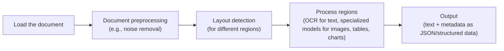
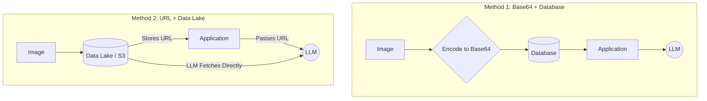
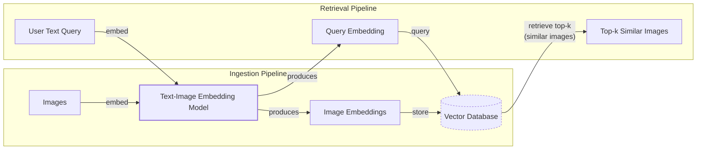
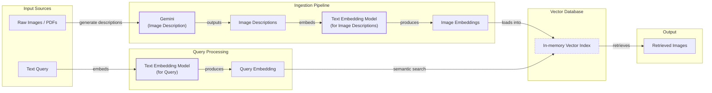
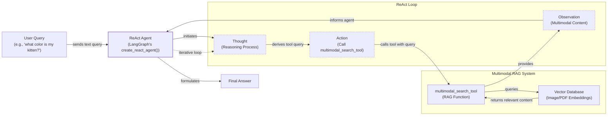

# Stop Converting Documents to Text. You're Doing It Wrong.
How to work with multimodal agents: images, PDFs, audio, and... text.

When we first started building AI agents, we hit a frustrating wall. We were comfortable manipulating text, but the moment we had to integrate multimodal data, such as images, audio, and especially documents like PDFs, our elegant architectures turned into messy hacks. We spent weeks building complex pipelines that tried to force everything into text. We chained OCR engines to scrape PDFs, layout detection models to identify tables, and separate classifiers to handle images. It was a brittle, slow, and expensive solution that broke every time a document layout changed.

The breakthrough came when we realized we were solving the wrong problem. We did not need to convert documents to text. We needed to treat them as images. Once we understood that every PDF page is effectively an image and that modern LLMs can “see” just as well as they can read, the complexity vanished. This shift is essential because real-world AI applications rarely exist in a text-only vacuum. Enterprise applications mirror this reality, working with financial reports containing complex charts, technical diagrams with intricate sketches, and medical documents with visual diagnostics.

The old approach of normalizing everything to text is lossy. When you translate a complex diagram into text, you lose spatial relationships, colors, and context. By processing data in its native format, we preserve this rich visual information, resulting in systems that are faster, cheaper, and more performant.

In this lesson, we will cover:
- The limitations of traditional document processing.
- The foundations of multimodal LLMs and RAG systems.
- How to work with images and PDFs using the Gemini API.
- How to build a multimodal RAG system and a ReAct agent.

## Limitations of traditional document processing

To understand the problem, let’s dig into the limitations of traditional document processing. For years, the standard approach for handling invoices, reports, or technical documentation was to normalize everything to text before passing it to an AI model. This workflow is flawed because a substantial amount of information is lost during the translation. It is impossible to fully reproduce diagrams, charts, or sketches in text.

A typical document processing workflow relies on a multi-step pipeline that often includes layout detection and Optical Character Recognition (OCR). For a PDF with mixed text, diagrams, and tables, the process looks like this:


Image 1: A flowchart illustrating the traditional document processing workflow.

This workflow has too many moving pieces. It requires layout detection models, OCR models for text, and specialized models for each expected data structure. This makes the system rigid; if a document contains a chart type we do not have a model for, the pipeline fails. It is also slow and costly because we have to chain multiple model calls, and it is fragile because errors at any stage can cascade and disrupt the entire process.

Most importantly, we face significant performance challenges. Even advanced OCR engines achieve only 88–94% accuracy on documents with simple layouts, and this figure drops significantly with complex formats, mixed content, or poor-quality scans [[1]](https://www.llamaindex.ai/blog/ocr-accuracy). They struggle with handwritten text, where a character error rate (CER) of 3–5% is considered good, and stylized fonts or special symbols often lead to mix-ups, like confusing a '3' for an '8' [[2]](https://hackernoon.com/complex-document-recognition-ocr-doesnt-work-and-heres-how-you-fix-it). The quality of the scan is also critical; resolution below 300 DPI can cause accuracy to drop by 20% or more, and a seemingly minor 5-degree tilt can increase word error rates by over 15% [[1]](https://www.llamaindex.ai/blog/ocr-accuracy).

These systems are often template-driven, relying on predefined positional rules that are effective for fixed layouts but break with any variation [[3]](https://www.llamaindex.ai/blog/ocr-for-tables). They lack contextual understanding, treating documents as flat grids of text without recognizing the relationships between headers, cells, and values. This leads to misalignments and lost structure, especially in documents with multi-column layouts, nested tables, or intermingled text and graphics [[4]](https://learn.microsoft.com/en-us/answers/questions/5668164/why-traditional-ocr-fails-for-complex-business-doc?page=1). The entire process is operationally complex, requiring manual scripts, complex schema management, and constant monitoring, which makes it difficult to scale [[5]](https://www.daft.ai/blog/end-to-end-distributed-pdf-processing-pipeline).

Research confirms that simply extracting unstructured text impairs a model's ability to understand documents. Attention analysis reveals that when models process raw images, their attention is scattered, but when they process text that preserves structural information (like LaTeX encoding), their attention becomes focused on key semantic regions like tables and charts [[6]](https://arxiv.org/html/2506.21600v1). This is particularly true for visually rich documents; studies show that image-based approaches significantly enhance comprehension of charts and complex layouts compared to traditional OCR parsing [[7]](https://www.sciencedirect.com/org/science/article/pii/S1546221825006630). While specialized models can excel at extracting pure structure, multimodal LLMs are superior at interpreting the actual content within that structure [[8]](https://aclanthology.org/2025.xllm-1.2.pdf).

https://substackcdn.com/image/fetch/w_1456,c_limit,f_webp,q_auto:good,fl_progressive:steep/https%3A%2F%2Fsubstack-post-media.s3.amazonaws.com%2Fpublic%2Fimages%2Fa2dc40f3-dc13-486e-853d-8404368f4d8d_1616x1000.png
Image 2: A building sketch showing a crawl space vent diagram, illustrating the complexity of layouts that classic OCR systems struggle to interpret. (Source [Vectorize.io](https://vectorize.io/blog/multimodal-rag-patterns))

This approach might work for highly specialized applications, but it has too many problems and does not scale in a world where AI agents need to be flexible and fast. That is why modern AI solutions use multimodal LLMs, such as Gemini, that can directly interpret text, images, or PDFs as native input, completely bypassing the fragile OCR workflow. Thus, let’s understand how they work.

## Foundations of multimodal LLMs

Before we write any code, you need an intuition for how multimodal LLMs work. You do not need to understand every research detail, but knowing the architecture helps you use, deploy, optimize, and monitor them. There are two common approaches to building multimodal LLMs, which we will explore using text-image models as an example: the Unified Embedding Decoder Architecture and the Cross-modality Attention Architecture.

https://substackcdn.com/image/fetch/w_1456,c_limit,f_webp,q_auto:good,fl_progressive:steep/https%3A%2F%2Fsubstack-post-media.s3.amazonaws.com%2Fpublic%2Fimages%2F76f50b57-2585-4cb8-8dda-eea5b5f81c03_1456x854.jpeg
Image 3: The two main approaches to developing multimodal LLM architectures. (Source [Understanding Multimodal LLMs](https://magazine.sebastianraschka.com/p/understanding-multimodal-llms))

### Unified Embedding Decoder Architecture

In this approach, we encode the text and image separately, concatenate their embeddings into a single vector, and pass the result to the LLM [[9]](https://magazine.sebastianraschka.com/p/understanding-multimodal-llms). On top of a standard LLM, you need a vision encoder that maps the image to an embedding in the same vector space as the text. When the text and image embeddings are merged, the LLM can make sense of both. This method is essentially an unmodified decoder-style LLM that receives a combined input of image and text token embeddings.

https://substackcdn.com/image/fetch/w_1456,c_limit,f_webp,q_auto:good,fl_progressive:steep/https%3A%2F%2Fsubstack-post-media.s3.amazonaws.com%2Fpublic%2Fimages%2Fa0979e82-2fb0-4f78-80c8-1395511e057f_1166x1400.jpeg
Image 4: Illustration of the unified embedding decoder architecture. (Source [Understanding Multimodal LLMs](https://magazine.sebastianraschka.com/p/understanding-multimodal-llms))

### Cross-modality Attention Architecture

In the second approach, instead of passing the image embeddings with the text embeddings at the input, we inject them directly into the attention module [[9]](https://magazine.sebastianraschka.com/p/understanding-multimodal-llms). We still need an image encoder that projects the image into the same vector space, but we inject it deeper within the architecture. This is related to the original Transformer architecture, which used cross-attention to combine information from an encoder (processing the source language) and a decoder (generating the target language). In a multimodal context, the image encoder's output serves a similar role to the original text encoder's output.

https://substackcdn.com/image/fetch/w_1456,c_limit,f_webp,q_auto:good,fl_progressive:steep/https%3A%2F%2Fsubstack-post-media.s3.amazonaws.com%2Fpublic%2Fimages%2Fea1b9ee4-0d19-4c3c-89db-06e779653da2_1296x1338.jpeg
Image 5: An illustration of the Cross-Modality Attention Architecture approach. (Source [Understanding Multimodal LLMs](https://magazine.sebastianraschka.com/p/understanding-multimodal-llms))

### Image Encoders

Both architectures rely on image encoders, which function similarly to text tokenizers. Just as we split text into sub-word tokens, we split images into patches [[9]](https://magazine.sebastianraschka.com/p/understanding-multimodal-llms).

https://substackcdn.com/image/fetch/w_1456,c_limit,f_webp,q_auto:good,fl_progressive:steep/https%3A%2F%2Fsubstack-post-media.s3.amazonaws.com%2Fpublic%2Fimages%2F4a7104c0-3986-4aae-b918-06c393ff824c_1456x1154.jpeg
Image 6: Image tokenization and embedding (left) and text tokenization and embedding (right) side by side. (Source [Understanding Multimodal LLMs](https://magazine.sebastianraschka.com/p/understanding-multimodal-llms))

These patches are processed by a vision transformer (ViT), which generates embeddings for each patch. The output has the same structure and dimensions as text embeddings, allowing them to be processed by the LLM. However, for the model to understand the relationship between text and image content, their embeddings must be aligned in the same vector space. This alignment is achieved through a linear projection module that maps the image patch embeddings into the text embedding space. More advanced architectures, like the Intelligent Alignment Network (IAN), use a combination of MLPs and cross-attention to better bridge the gap between visual patch features and the LLM’s semantic space [[10]](https://www.ijcai.org/proceedings/2025/0107.pdf).

The standard approach to aligning these different embedding spaces is contrastive learning. The core idea is to train the model to represent different views of the same information similarly. This is done by training on positive pairs (e.g., an image and its correct caption) and negative pairs (e.g., an image and an incorrect caption). The model learns to maximize the similarity of positive pairs and minimize the similarity of negative pairs [[11]](https://www.pinecone.io/learn/series/image-search/clip/). This process, often using a contrastive loss function, is what enables models like CLIP, OpenCLIP, and SigLIP to create a shared embedding space where text and images with similar semantic meaning are located close to each other [[12]](https://towardsdatascience.com/multimodal-embeddings-an-introduction-5dc36975966f/). These encoders are also used as embedding models in multimodal RAG systems, enabling semantic similarity searches between different data types.

https://substackcdn.com/image/fetch/w_1456,c_limit,f_webp,q_auto:good,fl_progressive:steep/https%3A%2F%2Fsubstack-post-media.s3.amazonaws.com%2Fpublic%2Fimages%2F3d4c837a-a3e5-4d60-97ce-c4d4faf4cf57_841x616.png
Image 7: Toy representation of multimodal embedding space. (Source [Multimodal Embeddings: An Introduction](https://towardsdatascience.com/multimodal-embeddings-an-introduction-5dc36975966f/))

### Trade-offs and Modern Landscape

The **Unified Embedding Decoder** approach is simpler to implement and generally yields higher accuracy in OCR-related tasks [[13]](https://arxiv.org/abs/2409.11402). The **Cross-modality Attention** approach is more computationally efficient for high-resolution images because it injects image tokens directly into the attention mechanism instead of passing them all as an input sequence [[13]](https://arxiv.org/abs/2409.11402). Hybrid approaches also exist to combine these benefits.

A significant challenge for these architectures is handling high-resolution images. Standard approaches that split an image into a grid of patches can generate thousands of tokens for a single HD image, causing computational costs to explode during the attention phase [[14]](https://www.linkedin.com/posts/rishirajgupta04_machinelearning-multimodal-llm-activity-7383016856481255424-pDaO). To manage this, models are adopting more dynamic strategies. One technique is hierarchical processing, where the model first processes a low-resolution overview and then uses attention maps to "zoom in" on semantically important regions for high-resolution analysis [[14]](https://www.linkedin.com/posts/rishirajgupta04_machinelearning-multimodal-llm-activity-7383016856481255424-pDaO). Another approach involves a "visual resolution router" that dynamically decides whether to compress each image patch based on its complexity, reducing token count by 50-70% with minimal performance loss [[15]](https://arxiv.org/html/2510.12793v1).

In 2025, most leading LLMs are multimodal. Open-source examples include Llama 4, which supports multi-million token contexts, and Qwen3, which excels in multilingual performance [[16]](https://medium.com/data-science-in-your-pocket/2025-the-year-ai-reasoning-models-took-over-a-month-by-month-review-of-frontier-breakthroughs-6ea2163f854f). Closed-source models like Gemini 2.5 Pro offer native support for video and audio with a 1M-token context window, while GPT-5 provides a unified multi-tier family with varying "thinking depth" [[16]](https://medium.com/data-science-in-your-pocket/2025-the-year-ai-reasoning-models-took-over-a-month-by-month-review-of-frontier-breakthroughs-6ea2163f854f). This architecture can be expanded to other modalities, such as PDFs, audio, or video, by integrating specialized encoders for each data type, like Whisper for audio or Video Transformers for video [[17]](https://sparkco.ai/blog/exploring-multimodal-llms-text-image-and-video-integration), [[18]](https://towardsai.net/p/l/enhancing-llm-capabilities-the-power-of-multimodal-llms-and-rag).

It is also important to distinguish multimodal LLMs from diffusion models like Midjourney or Stable Diffusion. Diffusion models generate images from noise, while multimodal LLMs understand images and can sometimes generate them, but they are architecturally different [[19]](https://arxiv.org/html/2409.14993v3). In an agent workflow, diffusion models are typically used as tools, not as the core reasoning model.

Innovations in multimodal LLM architectures are frequent. This section was not exhaustive but aimed to provide an intuition for how these models work and why they are superior to older, multi-step OCR approaches. Now that we understand how LLMs can directly process images and documents, let’s see how this works in practice.

## Applying multimodal LLMs to images and PDFs

To better understand how multimodal LLMs work, let’s write a few examples using Gemini to show some best practices when working with images and PDFs. There are three core ways to process multimodal data with LLMs: as raw bytes, Base64, and URLs.

**Raw bytes** are the simplest method for one-off API calls. However, they are not ideal for storage. Most databases are designed to handle text, and storing raw binary data can lead to corruption if the database misinterprets the bytes as a string.

**Base64** encoding solves this problem by converting binary data into a string format. This allows you to store images or documents directly in a standard database (like PostgreSQL or MongoDB) without risk of corruption. The main downside is that Base64 encoding increases the file size by approximately 33%, which can impact storage costs and network latency.

**URLs** are the standard for enterprise applications. Instead of passing large files back and forth, you store your data in a data lake like AWS S3 or Google Cloud Storage. The application then passes a URL to the LLM, which can access the file directly. This approach is the most efficient at scale because it minimizes network traffic on your application server and simplifies data management.


Image 8: A Mermaid diagram comparing methods for passing multimodal data to LLMs.

Now, let’s dig into the code. We will show you a couple of simple examples of how to manipulate images and PDFs with these methods using the Google GenAI SDK.

1.  First, let's look at our sample image.
    
    ```python
    from pathlib import Path
    from IPython.display import Image as IPythonImage
    
    def display_image(image_path: Path) -> None:
        """
        Display an image from a file path in the notebook.
        """
        image = IPythonImage(filename=image_path, width=400)
        display(image)
    
    display_image(Path("images") / "image_1.jpeg")
    ```
    
    It outputs:
    
    https://substackcdn.com/image/fetch/w_1456,c_limit,f_webp,q_auto:good,fl_progressive:steep/https%3A%2F%2Fsubstack-post-media.s3.amazonaws.com%2Fpublic%2Fimages%2F5780cbd6-133b-44fe-9352-38250d6fc611_640x640.jpeg
    
2.  We can process the image as **raw bytes**. We use the `WEBP` format because it is efficient.
    
    ```python
    import io
    from typing import Literal
    from PIL import Image as PILImage
    
    def load_image_as_bytes(
        image_path: Path, format: Literal["WEBP", "JPEG", "PNG"] = "WEBP", max_width: int = 600, return_size: bool = False
    ) -> bytes | tuple[bytes, tuple[int, int]]:
        """
        Load an image from file path and convert it to bytes with optional resizing.
        """
        image = PILImage.open(image_path)
        if image.width > max_width:
            ratio = max_width / image.width
            new_size = (max_width, int(image.height * ratio))
            image = image.resize(new_size)
    
        byte_stream = io.BytesIO()
        image.save(byte_stream, format=format)
    
        if return_size:
            return byte_stream.getvalue(), image.size
    
        return byte_stream.getvalue()
    
    image_bytes = load_image_as_bytes(image_path=Path("images") / "image_1.jpeg", format="WEBP")
    ```
    
    The raw bytes look like this:
    
    ```text
    Bytes `b'RIFF`\xad\x00\x00WEBPVP8 T\xad\x00\x00P\xec\x02\x9d\x01*X\x02X\x02'...`
    Size: 44392 bytes
    ```
    
    We can call the LLM to generate a caption or compare multiple images.
    
    ```python
    from google import genai
    from google.genai import types
    
    client = genai.Client()
    MODEL_ID = "gemini-2.5-flash"
    
    # Single image captioning
    response = client.models.generate_content(
        model=MODEL_ID,
        contents=[
            types.Part.from_bytes(data=image_bytes, mime_type="image/webp"),
            "Tell me what is in this image in one paragraph.",
        ],
    )
    print(f"Caption: {response.text}")
    
    # Comparing multiple images
    image_bytes_2 = load_image_as_bytes(image_path=Path("images") / "image_2.jpeg", format="WEBP")
    response = client.models.generate_content(
        model=MODEL_ID,
        contents=[
            types.Part.from_bytes(data=image_bytes, mime_type="image/webp"),
            types.Part.from_bytes(data=image_bytes_2, mime_type="image/webp"),
            "What's the difference between these two images? Describe it in one paragraph.",
        ],
    )
    print(f"Difference: {response.text}")
    ```
    
    It outputs:
    
    ```text
    Caption: This striking image features a massive, dark metallic robot...
    
    Difference: The primary difference between the two images lies in the nature of the interaction depicted...
    ```
    
3.  We can also process the image as a **Base64 encoded string**.
    
    ```python
    import base64
    from typing import cast
    
    def load_image_as_base64(
        image_path: Path, format: Literal["WEBP", "JPEG", "PNG"] = "WEBP", max_width: int = 600, return_size: bool = False
    ) -> str:
        """
        Load an image and convert it to base64 encoded string.
        """
        image_bytes_val = load_image_as_bytes(image_path=image_path, format=format, max_width=max_width, return_size=False)
        return base64.b64encode(cast(bytes, image_bytes_val)).decode("utf-8")
    
    image_base64 = load_image_as_base64(image_path=Path("images") / "image_1.jpeg", format="WEBP")
    ```
    
    The Base64 string is larger but prevents data corruption when stored as text.
    
    ```text
    Base64: UklGRmCtAABXRUJQVlA4IFStAABQ7AKdASpYAlgCPm0ylEekIqInJnQ7gOANiWdtk7FnEo2gDknjPixW9SNSb5P7IbBNhLn87Vtp...`
    Size: 59192 characters
    Image as Base64 is 33.34% larger than as bytes
    ```
    
    Calling the LLM with the Base64 string yields a similar caption.
    
    ```python
    response = client.models.generate_content(
        model=MODEL_ID,
        contents=[
            types.Part.from_bytes(data=image_base64, mime_type="image/webp"),
            "Tell me what is in this image in one paragraph.",
        ],
    )
    ```
    
4.  For **public URLs**, Gemini’s `url_context` tool can automatically parse web pages, PDFs, and images.
    
    ```python
    response = client.models.generate_content(
        model=MODEL_ID,
        contents="Based on the provided paper as a PDF, tell me how ReAct works: https://arxiv.org/pdf/2210.03629",
        config=types.GenerateContentConfig(tools=[{"url_context": {}}]),
    )
    ```
    
    It outputs:
    
    ```text
    ReAct is a novel paradigm for large language models (LLMs) that combines reasoning (Thought) and acting (Action) in an interleaved manner to solve diverse language and decision-making tasks...
    ```
    
5.  For **URLs from private data lakes**, Gemini works well with Google Cloud Storage buckets. This is ideal for production but complicates a simple demonstration, so here is a mocked example:
    
    ```python
    # response = client.models.generate_content(
    #     model=MODEL_ID,
    #     contents=[
    #         types.Part.from_uri(uri="gs://gemini-images/image_1.jpeg", mime_type="image/webp"),
    #         "Tell me what is in this image in one paragraph.",
    #     ],
    # )
    ```
    
6.  Let’s try a more complex task: **Object Detection**. We use Pydantic to define the output structure.
    
    ```python
    from pydantic import BaseModel, Field
    
    class BoundingBox(BaseModel):
        ymin: float
        xmin: float
        ymax: float
        xmax: float
        label: str = Field(default="The category of the object found within the bounding box.")
    
    class Detections(BaseModel):
        bounding_boxes: list[BoundingBox]
    
    prompt = """
    Detect all of the prominent items in the image. 
    The box_2d should be [ymin, xmin, ymax, xmax] normalized to 0-1000.
    """
    
    config = types.GenerateContentConfig(
        response_mime_type="application/json",
        response_schema=Detections,
    )
    
    response = client.models.generate_content(
        model=MODEL_ID,
        contents=[
            types.Part.from_bytes(data=image_bytes, mime_type="image/webp"),
            prompt,
        ],
        config=config,
    )
    detections = cast(Detections, response.parsed)
    ```
    
    It outputs:
    
    ```text
    [BoundingBox(ymin=1.0, xmin=450.0, ymax=997.0, xmax=1000.0, label='robot'), BoundingBox(ymin=269.0, xmin=39.0, ymax=782.0, xmax=530.0, label='kitten')]
    ```
    
    https://substackcdn.com/image/fetch/w_1456,c_limit,f_webp,q_auto:good,fl_progressive:steep/https%3A%2F%2Fsubstack-post-media.s3.amazonaws.com%2Fpublic%2Fimages%2Fa2eaed1f-bedb-4c33-98b3-96fa7424f0ad_566x590.png
    
7.  Now, let’s process **PDFs**. Because we use a multimodal model, the process is identical to that for images.
    
    https://substackcdn.com/image/fetch/w_1456,c_limit,f_webp,q_auto:good,fl_progressive:steep/https%3A%2F%2Fsubstack-post-media.s3.amazonaws.com%2Fpublic%2Fimages%2F6c03a7fa-24aa-4542-b09f-19647a6a06c5_2550x3300.jpeg
    
    We can pass the PDF as raw bytes:
    
    ```python
    pdf_bytes = (Path("pdfs") / "attention_is_all_you_need_paper.pdf").read_bytes()
    
    response = client.models.generate_content(
        model=MODEL_ID,
        contents=[
            types.Part.from_bytes(data=pdf_bytes, mime_type="application/pdf"),
            "What is this document about? Provide a brief summary of the main topics.",
        ],
    )
    ```
    
    It outputs:
    
    ```text
    This document introduces the Transformer, a novel neural network architecture designed for sequence transduction tasks...
    ```
    
    Or as a Base64 encoded string:
    
    ```python
    def load_pdf_as_base64(pdf_path: Path) -> str:
        with open(pdf_path, "rb") as f:
            return base64.b64encode(f.read()).decode("utf-8")
    
    pdf_base64 = load_pdf_as_base64(pdf_path=Path("pdfs") / "attention_is_all_you_need_paper.pdf")
    
    response = client.models.generate_content(
        model=MODEL_ID,
        contents=[
            "What is this document about? Provide a brief summary of the main topics.",
            types.Part.from_bytes(data=pdf_base64, mime_type="application/pdf"),
        ],
    )
    ```
    
8.  Finally, we can perform **Object Detection on PDF pages**. This is powerful for extracting diagrams or tables without OCR. We simply treat the PDF page as an image.
    
    ```python
    page_image_bytes, _ = load_image_as_bytes(
        image_path=Path("images") / "attention_is_all_you_need_1.jpeg", format="WEBP", return_size=True
    )
    
    prompt = "Detect all the diagrams from the provided image as 2d bounding boxes."
    
    response = client.models.generate_content(
        model=MODEL_ID,
        contents=[
            types.Part.from_bytes(data=page_image_bytes, mime_type="image/webp"),
            prompt,
        ],
        config=config,
    )
    ```
    
    https://substackcdn.com/image/fetch/w_1456,c_limit,f_webp,q_auto:good,fl_progressive:steep/https%3A%2F%2Fsubstack-post-media.s3.amazonaws.com%2Fpublic%2Fimages%2Fe7cb5566-8dea-4468-b307-b79b7610c7fa_667x590.png
    
    Processing PDFs as images is a concept popularized by the ColPali paper, which demonstrated that modern Vision Language Models (VLMs) can retrieve documents more effectively by “looking” at them rather than by extracting text [[20]](https://arxiv.org/pdf/2407.01449v6). This insight—treating documents as images—is the cornerstone of modern multimodal RAG systems. Let's explore how they work.

## Foundations of multimodal RAG

One of the most common use cases for multimodal data is RAG. When building custom AI apps, you will always need to retrieve private data to feed into your LLM. For large formats like images or PDFs, RAG is even more critical. Stuffing a 1,000-page PDF into the context window to answer a simple question is unfeasible due to high latency, cost, and performance degradation.

Let's explore a generic multimodal RAG architecture using images and text. The workflow has two main parts:

*   **Ingestion:** We embed images using a text-image embedding model and store these embeddings in a vector database.
*   **Retrieval:** We embed the user's text query using the same model, then query the vector database to retrieve the top-k most similar images based on cosine distance or another similarity metric. Because text and image embeddings reside in the same vector space, this works for any combination, like image-to-text search. This technique is heavily used in image search engines like Google Photos.


Image 9: A Mermaid diagram illustrating a generic multimodal RAG architecture using images and text.

For our enterprise use case of performing RAG on documents, the state-of-the-art architecture as of 2025 is ColPali [[20]](https://arxiv.org/pdf/2407.01449v6). It bypasses the entire OCR pipeline by processing document images directly, using VLMs to understand both textual and visual content. This is particularly effective for documents with complex tables, figures, and layouts.
Image 10: The ColPali architecture simplifies document retrieval compared to standard methods. (Source [ColPali: Efficient Document Retrieval with Vision Language Models](https://arxiv.org/pdf/2407.01449v6))

The core innovations of the ColPali architecture include an offline indexing pipeline and online query logic that uses a late interaction mechanism (MaxSim operator) to compute similarities between query tokens and document image patches. Instead of a single embedding vector for a document, ColPali creates multiple embedding vectors (a "bag-of-embeddings"), one for each image patch, allowing for more granular matching [[20]](https://arxiv.org/pdf/2407.01449v6). This approach is 2-10x faster and has fewer failure points than traditional OCR pipelines, outperforming all baselines on the ViDoRe benchmark with an 81.3% average nDCG@5 score [[20]](https://arxiv.org/pdf/2407.01449v6). On visually complex tasks like infographic and figure retrieval (InfoVQA, ArxivQA), the performance gap is even more stark.

The late interaction mechanism is key to this performance. For each token in the query, it finds the maximum similarity score against all patch embeddings of a document. These maximum scores are then summed up to get a final relevance score for the entire document page [[20]](https://arxiv.org/pdf/2407.01449v6). This allows for a fine-grained comparison that captures nuanced relationships between the query and specific visual details in the document. Furthermore, this process provides interpretability; by visualizing the patches with the highest similarity scores, we can see exactly which parts of the document the model focused on to answer the query [[20]](https://arxiv.org/pdf/2407.01449v6).

In practice, this means converting each document page into a high-resolution image (e.g., 300 DPI) before processing it [[21]](https://www.decodingai.com/p/the-king-of-multi-modal-rag-colpali). Production-grade systems like NVIDIA’s Nemotron RAG pipeline use this approach to achieve up to 15x faster multimodal PDF extraction compared to traditional methods [[14]](https://www.linkedin.com/posts/rishirajgupta04_machinelearning-multimodal-llm-activity-7383016856481255424-pDaO).

To deploy such systems efficiently, especially in resource-constrained environments, you must also consider optimization. The large multimodal embeddings can be compressed using techniques like scalar or product quantization, which reduce memory usage and accelerate search speed with a small trade-off in accuracy [[22]](https://milvus.io/ai-quick-reference/what-quantization-techniques-work-well-for-multimodal-embeddings). Vector databases can be further tuned by adjusting HNSW graph parameters or using batch search APIs to improve throughput [[23]](https://qdrant.tech/blog/qdrant-skills-release/).

Enough theory. Let's move to a concrete example, where we will implement a multimodal RAG system from scratch.

## Implementing multimodal RAG for images, PDFs and text

Let's connect the dots with a more complex coding example where we combine what we have learned in this lesson and Lesson 10 on RAG into a multimodal RAG exercise. We will build a simple multimodal RAG system where we populate an in-memory vector database with multiple images and PDF pages, then query it with text questions. To keep it simple, we will not patch the images or use a ColBERT reranker, but this will help build your intuition.


Image 11: Mermaid diagram illustrating the multimodal RAG example implemented in the lesson.

Now, let's dig into the code.

1.  First, we display the images that we will embed and load into our vector index.
    
    ```python
    import matplotlib.pyplot as plt
    
    def display_image_grid(image_paths: list[Path], rows: int = 2, cols: int = 2, figsize: tuple = (8, 6)) -> None:
        fig, axes = plt.subplots(rows, cols, figsize=figsize)
        axes = axes.ravel()
        for idx, img_path in enumerate(image_paths[: rows * cols]):
            img = PILImage.open(img_path)
            axes[idx].imshow(img)
            axes[idx].axis("off")
        plt.tight_layout()
        plt.show()
    
    image_paths_to_display = [
        Path("images") / "image_1.jpeg",
        Path("images") / "image_2.jpeg",
        Path("images") / "image_3.jpeg",
        Path("images") / "image_4.jpeg",
        Path("images") / "attention_is_all_you_need_1.jpeg",
        Path("images") / "attention_is_all_you_need_2.jpeg",
    ]
    display_image_grid(image_paths=image_paths_to_display, rows=2, cols=3)
    ```
    
    It outputs:
    
    
    
2.  Next, we define a function to generate descriptions for our images. Since the Gemini Dev API does not support image embeddings directly, we will use Gemini to create a text description for each image and then embed that description. This is a workaround; in a production system, you would use a dedicated multimodal embedding model like Voyage, Jina v4, or Qwen3-VL-2B to embed the image bytes directly [[24]](https://milvus.io/blog/choose-embedding-model-rag-2026.md).
    
    With a true multimodal embedding model, the code would be simpler:
    
    ```python
    # image_bytes = ...
    # # SKIPPED!
    # # image_description = generate_image_description(image_bytes)
    # image_embeddings = embed_with_multimodal(image_bytes)
    ```
    
    For now, here is our function to generate descriptions:
    
    ```python
    from io import BytesIO
    
    def generate_image_description(image_bytes: bytes) -> str:
        """
        Generate a detailed description of an image using Gemini Vision model.
        """
        try:
            img = PILImage.open(BytesIO(image_bytes))
            prompt = "Describe this image in detail for semantic search purposes..."
            response = client.models.generate_content(model=MODEL_ID, contents=[prompt, img])
            return response.text.strip() if response and response.text else ""
        except Exception as e:
            print(f"❌ Failed to generate image description: {e}")
            return ""
    ```
    
3.  We also need a function to create text embeddings using Gemini.
    
    ```python
    import numpy as np
    
    def embed_text_with_gemini(content: str) -> np.ndarray | None:
        """
        Embed text content using Gemini's text embedding model.
        """
        try:
            result = client.models.embed_content(model="gemini-embedding-001", contents=[content])
            return np.array(result.embeddings[0].values) if result and result.embeddings else None
        except Exception as e:
            print(f"❌ Failed to embed text: {e}")
            return None
    ```
    
4.  Now, we create our vector index. In a real-world application, you would use a scalable vector database with an efficient index like HNSW. For this example, a simple list of dictionaries will suffice.
    
    ```python
    def create_vector_index(image_paths: list[Path]) -> list[dict]:
        """
        Create embeddings for images by generating descriptions and embedding them.
        """
        vector_index = []
        for image_path in image_paths:
            image_bytes = cast(bytes, load_image_as_bytes(image_path, format="WEBP", return_size=False))
            image_description = generate_image_description(image_bytes)
            image_embedding = embed_text_with_gemini(image_description)
            vector_index.append({
                "content": image_bytes, "type": "image", "filename": image_path,
                "description": image_description, "embedding": image_embedding,
            })
        return vector_index
    
    image_paths = list(Path("images").glob("*.jpeg"))
    vector_index = create_vector_index(image_paths)
    ```
    
5.  Finally, we define a function to search the vector index using a text query.
    
    ```python
    from sklearn.metrics.pairwise import cosine_similarity
    from typing import Any
    
    def search_multimodal(query_text: str, vector_index: list[dict], top_k: int = 3) -> list[Any]:
        """
        Search for most similar documents to query using direct Gemini client.
        """
        query_embedding = embed_text_with_gemini(query_text)
        if query_embedding is None:
            return []
    
        embeddings = [doc["embedding"] for doc in vector_index]
        similarities = cosine_similarity([query_embedding], embeddings).flatten()
    
        top_indices = np.argsort(similarities)[::-1][:top_k]
        return [{**vector_index[idx], "similarity": similarities[idx]} for idx in top_indices]
    ```
    
6.  Let's test it with a query about the Transformer architecture. The system correctly retrieves the page from the "Attention Is All You Need" paper with a similarity score of 0.744. The model was able to match the query's semantic meaning with the generated description of the PDF page image, which detailed the Transformer model architecture diagram.
    
    ```python
    query = "what is the architecture of the transformer neural network?"
    results = search_multimodal(query, vector_index, top_k=1)
    ```
    
    
    
7.  Here is another example with the query "a kitten with a robot". It retrieves the correct image with a high similarity of 0.811 because the generated description captured the key objects ("robot", "kitten") and their interaction.
    
    ```python
    query = "a kitten with a robot"
    results = search_multimodal(query, vector_index, top_k=1)
    ```
    
    
    
    By normalizing everything to images, we used the same vector index to search for both standard images and PDF pages. This approach could be extended to other modalities like video frames or audio spectrograms.
    
    While our in-memory list serves as a simple demonstration, a production system requires more robust engineering. Best practices include using libraries like `Unstructured` for reliable PDF partitioning, storing raw assets in object storage (e.g., S3) and referencing them by URL, and using hybrid retrieval that combines vector search with keyword and metadata filtering [[25]](https://www.augmentcode.com/guides/multimodal-rag-development-12-best-practices-for-production-systems). Caching embeddings and building modular, asynchronous pipelines are also essential for managing cost and latency at scale [[25]](https://www.augmentcode.com/guides/multimodal-rag-development-12-best-practices-for-production-systems). Now that we have a functional RAG pipeline, let's see how we can integrate it into an autonomous agent.

## Building multimodal AI agents

To take this a step further, let's integrate our `search_multimodal` RAG function into a ReAct agent as a tool. This will consolidate most of the skills you have learned in Part 1 of this course.

Multimodal capabilities can be added to AI agents in three main ways: by providing multimodal inputs to the reasoning LLM, by leveraging multimodal retrieval tools, or by using tools that interact with external multimodal resources like company PDFs or user screenshots. In this example, we will create a ReAct agent using LangGraph's `create_react_agent` and connect our RAG function as a tool. The agent will use this tool to find relevant images from our vector index to answer a user's query.


Image 12: A Mermaid diagram illustrating a multimodal ReAct agent integrated with RAG functionality, emphasizing the iterative Thought-Action-Observation loop and the integration of multimodal RAG as a tool.

1.  First, we define the `multimodal_search_tool` using LangChain's `@tool` decorator.
    
    ```python
    from langchain_core.tools import tool
    
    @tool
    def multimodal_search_tool(query: str) -> dict[str, Any]:
        """
        Search through a collection of images and their text descriptions to find relevant content.
        """
        results = search_multimodal(query, vector_index, top_k=1)
        if not results:
            return {"role": "tool_result", "content": "No relevant content found."}
        
        result = results[0]
        content = [
            {"type": "text", "text": f"Image description: {result['description']}"},
            types.Part.from_bytes(data=result["content"], mime_type="image/jpeg"),
        ]
        return {"role": "tool_result", "content": content}
    ```
    
2.  Next, we create a ReAct agent using LangGraph. The system prompt guides the agent to use the search tool for visual content. We will dive deeper into LangGraph in Part 2 of the course; for now, we will use it as a drop-in replacement for a ReAct agent.
    
    ```python
    from langchain_google_genai import ChatGoogleGenerativeAI
    from langgraph.prebuilt import create_react_agent
    
    def build_react_agent() -> Any:
        tools = [multimodal_search_tool]
        system_prompt = """You are a helpful AI assistant that can search through images and text to answer questions.
        
        When asked about visual content like animals, objects, or scenes:
        1. Use the multimodal_search_tool to find relevant images and descriptions
        2. Carefully analyze the image or image descriptions from the search results
        3. Look for specific details like colors, features, objects, or characteristics
        4. Provide a clear, direct answer based on the search results
        
        Always search first using your tools before attempting to answer questions about specific images or visual content.
        """
        agent = create_react_agent(
            model=ChatGoogleGenerativeAI(model="gemini-2.5-pro", temperature=0.1),
            tools=tools,
            prompt=system_prompt,
        )
        return agent
    
    react_agent = build_react_agent()
    ```
    
    https://substackcdn.com/image/fetch/w_1456,c_limit,f_webp,q_auto:good,fl_progressive:steep/https%3A%2F%2Fsubstack-post-media.s3.amazonaws.com%2Fpublic%2Fimages%2F246dbcab-68dc-41eb-983e-4f2bf5d48fa9_1200x1200.png
    Image 13: An agent interacting with multimodal memory, retrieving context from long-term storage to inform its short-term state and generate a response.
    
3.  Now, let's ask the agent to find the color of our kitten from the indexed dataset.
    
    ```python
    test_question = "what color is my kitten?"
    response = react_agent.invoke(input={"messages": test_question})
    ```
    
    The agent follows the ReAct loop. First, it **thinks** it needs to find an image of a kitten. Then, it **acts** by calling the `multimodal_search_tool` with the query "my kitten". The tool returns the image and its description, which becomes the **observation**. Finally, the agent analyzes this observation to formulate the answer.
    
    ```text
    User: what color is my kitten?
    Calling tools: ['multimodal_search_tool']
    Agent: Based on the image, your kitten is a gray tabby. It has soft, short gray fur with darker tabby stripe patterns.
    ```
    
    
    
    In this lesson, we combined structured outputs, tools, ReAct, RAG, and multimodal data to create a proof-of-concept for an agentic RAG system.

## Conclusion

This lesson concludes Part 1 of our course on the fundamentals of AI Engineering. We have moved away from the unstable, multi-step OCR pipelines of the past and learned that modern LLMs can natively process images and documents, preserving rich context that was previously lost. You now have the foundational blocks to build production-ready AI systems that can see and read.

The principles you have learned extend far beyond document processing. In autonomous robotics, the same fusion techniques combine data from cameras and LiDAR for navigation, while in creative industries, multimodal tools now process sketches and text to enable generative design [[26]](https://www.mdpi.com/1424-8220/25/3/856), [[27]](https://arxiv.org/html/2511.05817v1). Multimodal LLMs are also being integrated with augmented reality to create context-aware training systems for complex industrial machinery [[28]](https://www.mdpi.com/2411-9660/10/2/30). Furthermore, in environmental science, these models analyze satellite imagery alongside climate reports for predictive modeling, enhancing sustainability efforts [[29]](https://www.mdpi.com/2071-1050/17/9/4134).

In Part 2, we will move from theory to practice and begin building our course's central project: an interconnected research and writing agent system. We will dive into agentic design patterns, compare modern frameworks, and use LangGraph to implement a research agent with web scraping tools and a writing workflow to convert that research into polished content.

## References

- [1] [OCR Accuracy Explained: How to Improve It](https://www.llamaindex.ai/blog/ocr-accuracy)
- [2] [Complex Document Recognition: OCR Doesn’t Work and Here’s How You Fix It](https://hackernoon.com/complex-document-recognition-ocr-doesnt-work-and-heres-how-you-fix-it)
- [3] [OCR for Tables](https://www.llamaindex.ai/blog/ocr-for-tables)
- [4] [Why Traditional OCR Fails for Complex Business Documents](https://learn.microsoft.com/en-us/answers/questions/5668164/why-traditional-ocr-fails-for-complex-business-doc?page=1)
- [5] [End-to-End Distributed PDF Processing Pipeline](https://www.daft.ai/blog/end-to-end-distributed-pdf-processing-pipeline)
- [6] [Unstructured OCR Can Be A Bottleneck for Multimodal Large Language Models in Document Understanding](https://arxiv.org/html/2506.21600v1)
- [7] [A Comparative Study on Chart Question Answering: LLMs vs. Finetuned Models](https://www.sciencedirect.com/org/science/article/pii/S1546221825006630)
- [8] [Are MLLMs Better Than OCR for Table Structure Recognition?](https://aclanthology.org/2025.xllm-1.2.pdf)
- [9] [Understanding Multimodal LLMs](https://magazine.sebastianraschka.com/p/understanding-multimodal-llms)
- [10] [MAGE: Multimodal Alignment and Generation Enhancement via Bridging Visual and Semantic Spaces](https://www.ijcai.org/proceedings/2025/0107.pdf)
- [11] [Multi-modal ML with OpenAI's CLIP](https://www.pinecone.io/learn/series/image-search/clip/)
- [12] [Multimodal Embeddings: An Introduction](https://towardsdatascience.com/multimodal-embeddings-an-introduction-5dc36975966f/)
- [13] [NVLM: Open Frontier-Class Multimodal LLMs](https://arxiv.org/abs/2409.11402)
- [14] [Handling High-Resolution Images in Multimodal LLMs](https://www.linkedin.com/posts/rishirajgupta04_machinelearning-multimodal-llm-activity-7383016856481255424-pDaO)
- [15] [ViCO: Vision-language large model with Composable resolution](https://arxiv.org/html/2510.12793v1)
- [16] [2025: The Year AI Reasoning Models Took Over — A Month-by-Month Review of Frontier Breakthroughs](https://medium.com/data-science-in-your-pocket/2025-the-year-ai-reasoning-models-took-over-a-month-by-month-review-of-frontier-breakthroughs-6ea2163f854f)
- [17] [Exploring multimodal LLMs: text, image, and video integration](https://sparkco.ai/blog/exploring-multimodal-llms-text-image-and-video-integration)
- [18] [Enhancing LLM Capabilities: The Power of Multimodal LLMs and RAG](https://towardsai.net/p/l/enhancing-llm-capabilities-the-power-of-multimodal-llms-and-rag)
- [19] [A Comprehensive Survey and Guide to Multimodal Large Language Models in Vision-Language Tasks](https://arxiv.org/html/2409.14993v3)
- [20] [ColPali: Efficient Document Retrieval with Vision Language Models](https://arxiv.org/pdf/2407.01449v6)
- [21] [The King of Multi-modal RAG: ColPali](https://www.decodingai.com/p/the-king-of-multi-modal-rag-colpali)
- [22] [What quantization techniques work well for multimodal embeddings?](https://milvus.io/ai-quick-reference/what-quantization-techniques-work-well-for-multimodal-embeddings)
- [23] [Qdrant skills release: Binary Quantization, Resharding, and more](https://qdrant.tech/blog/qdrant-skills-release/)
- [24] [How to Choose the Best Embedding Model for RAG in 2026: 10 Models Benchmarked](https://milvus.io/blog/choose-embedding-model-rag-2026.md)
- [25] [Multimodal RAG Development: 12 Best Practices for Production Systems](https://www.augmentcode.com/guides/multimodal-rag-development-12-best-practices-for-production-systems)
- [26] [A Comprehensive Review of Multi-Sensor Fusion-Based Obstacle Detection and Drivable Area Detection for Autonomous Vehicles: From the Perspective of Key Challenges](https://www.mdpi.com/1424-8220/25/3/856)
- [27] [TalkSketch: Supporting Freehand Sketching and Real-time Speech for Multimodal AI Design Ideation](https://arxiv.org/html/2511.05817v1)
- [28] [An AR-MLLM-Based Training System for Complex Machine Operation](https://www.mdpi.com/2411-9660/10/2/30)
- [29] [A Multi-Modal Deep Learning Framework for Environmental Monitoring in Mining Enterprises](https://www.mdpi.com/2071-1050/17/9/4134)