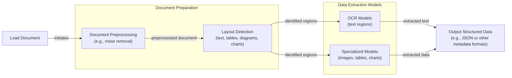
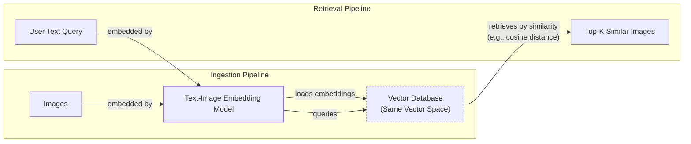
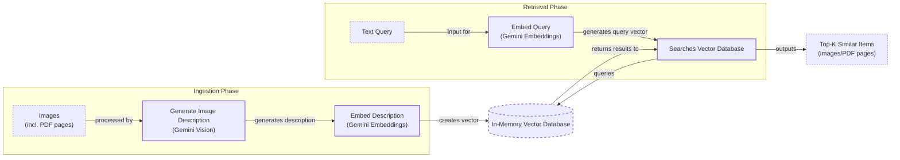
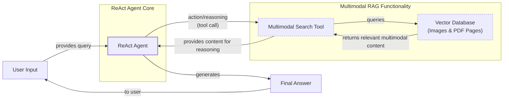

# Stop Converting Documents to Text. You're Doing It Wrong.

When we first started building AI agents, we hit a frustrating wall. We were comfortable manipulating text, but the moment we had to integrate multimodal data, such as images, audio, and especially documents like PDFs, our elegant architectures turned into messy hacks. We spent weeks building complex pipelines that tried to force everything into text. We chained OCR engines to scrape PDFs, layout detection models to identify tables, and separate classifiers to handle images. It was a brittle, slow, and expensive solution that broke every time a document layout changed.

The breakthrough came when we realized we were solving the wrong problem. We did not need to convert documents to text. We needed to treat them as images. Once we understood that every PDF page is effectively an image and that modern LLMs can “see” just as well as they can read, the complexity vanished. We could completely skip the OCR purgatory and focus on the three core inputs of an LLM: text, images, and audio.

This shift is essential because real-world AI applications rarely exist in a text-only vacuum. As human beings, we process information visually and audibly. Enterprise applications mirror this reality. They need to manipulate private data from warehouses and lakes that is inherently multimodal: financial reports with complex charts, technical diagrams, building sketches, and audio logs. Text-only approaches fall short in these scenarios; they cannot interpret a chart in a financial report, analyze an X-ray in a medical document, or understand a diagram in a technical manual [[6]](https://konfuzio.com/en/chatgpt-financial-analysis/), [[7]](https://techtoday.lenovo.com/sites/default/files/2025-05/Medical%20Imaging%20White%20Paper%20NVIDIA%20and%20Lenovo.pdf).

The old approach of normalizing everything to text is lossy. When you translate a complex diagram or a chart into text, you lose the spatial relationships, the colors, and the context. You lose the information that matters most. By processing data in its native format, we preserve this rich visual information, resulting in systems that are faster, cheaper, and significantly more performant.

Ultimately, as data is made for humans, you want the LLM to process the data as close as a human would, which often is visually. In this lesson, we will explore the foundations of multimodal LLMs, show you how to work with images and PDFs in practice, and guide you through building a multimodal ReAct agent from the ground up.

## Limitations of Traditional Document Processing

To cement the problem, let's dig deeper into the limitations of traditional document processing, such as processing invoices, documentation, or reports using AI systems. The problem can be translated to other data types like images or audio. The core idea is that previous approaches tried to normalize everything to text before passing it into an AI model, which has many flaws, as we lose a substantial amount of information during translation. For example, when encountering diagrams, charts, or sketches in a document, it is impossible to fully reproduce them in text.

This evolution represents a paradigm shift, moving from simple text recognition to sophisticated AI systems capable of understanding context [[61]](https://www.v7labs.com/blog/evolution-of-intelligent-document-processing). The core idea is that while AI cannot yet solve complex business problems end-to-end autonomously, these problems can be broken down into smaller, manageable chunks that modern models can solve with high accuracy.

The traditional document processing workflow, often used for invoices or reports, relies on several essential steps. It starts by loading a document and performing preprocessing like noise removal. Next, layout detection models identify different regions, such as text, tables, and diagrams. From there, Optical Character Recognition (OCR) models extract text from text regions, while other specialized models handle images, tables, or charts. Finally, the extracted data is structured into a format like JSON [[46]](https://www.daft.ai/blog/end-to-end-distributed-pdf-processing-pipeline), [[48]](https://parseur.com/blog/document-processing-automation-guide).


Image 1: A flowchart illustrating the traditional document processing workflow.

This workflow has too many moving pieces. We need layout detection models, OCR models for text, and specialized models for each expected data structure. This makes the system rigid; if a document contains a chart type we do not have a model for, the pipeline fails. It is also slow and costly because we have to chain multiple model calls [[47]](https://learn.microsoft.com/en-us/answers/questions/5668164/why-traditional-ocr-fails-for-complex-business-doc?page=1), [[50]](https://intuitionlabs.ai/articles/ai-pdf-data-extraction-clinical-research). The move away from fragile, multi-step systems toward end-to-end models that handle data natively is not unique to document processing. A similar evolution occurred in fields like speech recognition, where complex, rule-based pipelines were replaced by more robust, end-to-end neural networks [[62]](https://arxiv.org/html/2503.12687v1).

Most importantly, we face performance challenges. The multi-step nature creates a cascade effect where errors compound at each stage. Traditional OCR produces fragmented text blocks that require coordinate-based heuristics to reconstruct reading order, a process that is fragile and prone to errors on anything but the simplest layouts [[46]](https://www.daft.ai/blog/end-to-end-distributed-pdf-processing-pipeline). Advanced OCR engines achieve 88–94% accuracy on simple layouts but struggle with handwritten text, poor scans, stylized fonts, or complex layouts like nested tables and building sketches. For scans below 300 DPI, accuracy can drop by over 20%, and even a 5-degree tilt can increase word error rates by 15% or more [[1]](https://www.llamaindex.ai/blog/ocr-accuracy), [[2]](https://conexiom.com/blog/the-6-biggest-ocr-problems-and-how-to-overcome-them). Template-driven systems that rely on predefined positional rules are particularly brittle, breaking with even minor variations in document format [[49]](https://www.llamaindex.ai/blog/ocr-for-tables).

This approach might work for highly specialized applications, but it has too many problems and does not scale for a world of AI agents that have to be flexible and fast. That is why modern AI solutions use multimodal LLMs, such as Gemini, that can directly interpret text, images, or even PDFs as native input, completely bypassing the unstable OCR workflow. Thus, let’s understand how multimodal LLMs work.

## Foundations of Multimodal LLMs

Before we get to the code, you need an intuition of how multimodality works. You do not need to understand every research detail, but knowing the architecture helps you deploy, optimize, and monitor them. There are two common approaches to building multimodal LLMs: the Unified Embedding Decoder Architecture and the Cross-modality Attention Architecture [[21]](https://magazine.sebastianraschka.com/p/understanding-multimodal-llms).
Image 2: The two main approaches to developing multimodal LLM architectures. (Source [Understanding Multimodal LLMs [[21]](https://magazine.sebastianraschka.com/p/understanding-multimodal-llms)])

### Unified Embedding Decoder Architecture

In this approach, we encode the text and image separately, concatenate their embeddings into a single vector, and pass the resulting vector to the LLM. On top of a standard LLM architecture, you need a vision encoder that maps the image to an embedding that’s in the same vector space as the text. When the text and image embeddings are merged, the LLM can make sense of both [[21]](https://magazine.sebastianraschka.com/p/understanding-multimodal-llms).

Aligning the vision and language embedding spaces is a non-trivial challenge. To achieve stable training, a common strategy is to freeze the weights of both the pretrained vision encoder and the LLM, and only train a small "projector" module (typically a simple MLP) that sits between them. This prevents the powerful LLM's gradients from overwhelming the visual features during initial alignment, allowing for a more stable convergence [[63]](https://teendifferent.substack.com/p/stitching-vision-into-llms-a-comparative).
Image 3: Illustration of the unified embedding decoder architecture. (Source [Understanding Multimodal LLMs [[21]](https://magazine.sebastianraschka.com/p/understanding-multimodal-llms)])

### Cross-modality Attention Architecture

In the second approach, instead of passing the image embeddings along with the text embeddings at the input, we inject them directly into the attention module. We still need an image encoder that projects the image into the same vector space as the text, but we inject it deeper within the architecture [[21]](https://magazine.sebastianraschka.com/p/understanding-multimodal-llms). This method is related to the original Transformer architecture, where the decoder uses cross-attention to incorporate information from the encoder's output. In a multimodal context, the image encoder's output serves a similar role to the text encoder's output in a translation task, providing context that the decoder attends to while generating text.
Image 4: An illustration of the Cross-Modality Attention Architecture approach. (Source [Understanding Multimodal LLMs [[21]](https://magazine.sebastianraschka.com/p/understanding-multimodal-llms)])

### Image Encoders

Both architectures rely on image encoders. To understand them, we can draw a parallel between text tokenization and image patching. Just as we split text into sub-word tokens, we split images into patches [[21]](https://magazine.sebastianraschka.com/p/understanding-multimodal-llms).
Image 5: Image tokenization and embedding (left) and text tokenization and embedding (right) side by side. (Source [Understanding Multimodal LLMs [[21]](https://magazine.sebastianraschka.com/p/understanding-multimodal-llms)])

These patches are then encoded by a pretrained vision transformer (ViT). The ViT processes an image by first dividing it into a grid of smaller, fixed-size patches. Each patch is flattened into a vector and then linearly projected into an embedding space. These patch embeddings, combined with positional information, are then fed into a standard Transformer encoder. The output has the same structure and dimensions as text embeddings.
Image 6: Illustration of a classic vision transformer (ViT) setup. (Source [Understanding Multimodal LLMs [[21]](https://magazine.sebastianraschka.com/p/understanding-multimodal-llms)])

However, they need to be aligned in the same vector space, which is done through a linear projection module. This alignment is typically achieved through contrastive learning, a technique that trains the model to maximize the similarity between corresponding image-text pairs (positive pairs) while minimizing the similarity between non-corresponding pairs (negative pairs). Popular image encoder models that use this principle include CLIP, OpenCLIP, and SigLIP [[35]](https://artsmart.ai/blog/top-embedding-models-in-2025/).

Importantly, these encoders are also used in Multimodal RAG. They allow us to find semantic similarities between images and text by representing both in a shared embedding space. This means you can run similarity metrics between text, image, document, and audio vectors, enabling powerful cross-modal search capabilities [[56]](https://opensearch.org/blog/multimodal-semantic-search/), [[57]](https://towardsdatascience.com/multimodal-ai-search-for-business-applications-65356d011009/).
Image 7: Toy representation of multimodal embedding space. (Source [Multimodal Embeddings: An Introduction [[3]](https://towardsdatascience.com/multimodal-embeddings-an-introduction-5dc36975966f/)])

### Trade-offs and Modern Landscape

The **Unified Embedding Decoder** approach is simpler to implement and generally yields higher accuracy in OCR-related tasks. The **Cross-modality Attention** approach is more computationally efficient for high-resolution images because we inject tokens directly into the attention mechanism instead of passing them all as an input sequence. Hybrid approaches also exist to combine these benefits [[36]](https://magazine.sebastianraschka.com/p/understanding-multimodal-llms), [[37]](https://arxiv.org/abs/2409.11402).

In 2025, most leading LLMs are multimodal. Open-source examples include Llama 4, Gemma 3, and Qwen3, while closed-source examples include GPT-5, Gemini 2.5, and Claude 4.5 [[22]](https://medium.com/data-science-in-your-pocket/2025-the-year-ai-reasoning-models-took-over-a-month-by-month-review-of-frontier-breakthroughs-6ea2163f854f), [[23]](https://codedesign.ai/blog/the-ultimate-guide-to-the-top-large-language-models-in-2025/). These models often feature innovations like Mixture-of-Experts (MoE) architectures for efficiency and massive context windows (1M+ tokens) for processing large documents or videos natively [[22]](https://medium.com/data-science-in-your-pocket/2025-the-year-ai-reasoning-models-took-over-a-month-by-month-review-of-frontier-breakthroughs-6ea2163f854f). This architecture can be expanded to other modalities, like audio or video, by integrating specialized encoders for each data type, such as Video Transformers or models like Whisper for audio [[27]](https://sparkco.ai/blog/exploring-multimodal-llms-text-image-and-video-integration), [[28]](https://www.emergentmind.com/topics/multimodal-llms).

A quick note on **Multimodal LLMs vs. Diffusion Models**: Diffusion models like Stable Diffusion generate images from noise. Multimodal LLMs like GPT-4o understand images and can sometimes generate them, but they are architecturally different. In an agent workflow, diffusion models are typically used as tools, not as the core reasoning model [[19]](https://arxiv.org/html/2409.14993v3), [[21]](https://magazine.sebastianraschka.com/p/understanding-multimodal-llms).

Despite their power, it is important to recognize that current multimodal architectures still have limitations. They can struggle to interpret documents with highly interleaved visual elements, such as text overlaid on diagrams or nested charts, because they often lack explicit reasoning about spatial relationships and structure. Improving performance on these complex layouts remains an active area of research [[64]](https://arxiv.org/html/2603.11640v1).

Now that we understand how LLMs can directly process images or documents, let’s see how this works in practice.

## Applying Multimodal LLMs to Images and PDFs

To better understand how multimodal LLMs work, let’s write a few examples using Gemini to show some best practices when working with images and PDFs. There are three core ways to process multimodal data with LLMs: raw bytes, Base64, and URLs.

- **Raw bytes:** This is the easiest way to work with LLMs for one-off API calls. However, when storing the item in a database, it can easily get corrupted as most databases interpret the input as text instead of bytes.
- **Base64:** This method encodes raw bytes as strings, which is useful for storing images or documents directly in a database (e.g., PostgreSQL, MongoDB) without corruption. The downside is that the file size increases by approximately 33%.
- **URLs:** This is the standard for enterprise scenarios where data is stored in a data lake like AWS S3 or GCP Buckets. The LLM downloads the media directly from the bucket, reducing network latency for your application as the file never has to pass through your server. This is the most efficient option for scale.

Now, let's dig into the code. We will show you a couple of simple examples of how to manipulate images and PDFs with these three methods using the Google GenAI SDK.

1.  First, we display our sample image.

    

2.  We will process the image as **raw bytes**. We define a helper function to load an image and convert it to bytes, resizing it if necessary. We use the `WEBP` format because it is efficient.

    ```python
    def load_image_as_bytes(
        image_path: Path, format: Literal["WEBP", "JPEG", "PNG"] = "WEBP", max_width: int = 600, return_size: bool = False
    ) -> bytes | tuple[bytes, tuple[int, int]]:
        """
        Load an image from file path and convert it to bytes with optional resizing.
        """
        image = PILImage.open(image_path)
        if image.width > max_width:
            ratio = max_width / image.width
            new_size = (max_width, int(image.height * ratio))
            image = image.resize(new_size)
    
        byte_stream = io.BytesIO()
        image.save(byte_stream, format=format)
    
        if return_size:
            return byte_stream.getvalue(), image.size
    
        return byte_stream.getvalue()
    ```

3.  We load the image as bytes and inspect the output.

    ```python
    image_bytes = load_image_as_bytes(image_path=Path("images") / "image_1.jpeg", format="WEBP")
    ```

    It outputs:

    ```text
    Bytes `b'RIFF`\xad\x00\x00WEBPVP8 T\xad\x00\x00P\xec\x02\x9d\x01*X\x02X\x02'...`
    Size: 44392 bytes
    ```

4.  Then we call the LLM to generate a caption.

    ```python
    response = client.models.generate_content(
        model=MODEL_ID,
        contents=[
            types.Part.from_bytes(
                data=image_bytes,
                mime_type="image/webp",
            ),
            "Tell me what is in this image in one paragraph.",
        ],
    )
    ```

    It outputs:

    ```text
    This striking image features a massive, dark metallic robot, its powerful form detailed with intricate circuit patterns on its head and piercing red glowing eyes. Perched playfully on its right arm is a small, fluffy grey tabby kitten...
    ```

5.  We can also process the image as a **Base64 encoded string**. The logic is similar, but we encode the bytes first.

    ```python
    def load_image_as_base64(
        image_path: Path, format: Literal["WEBP", "JPEG", "PNG"] = "WEBP", max_width: int = 600, return_size: bool = False
    ) -> str:
        """
        Load an image and convert it to base64 encoded string.
        """
        image_bytes = load_image_as_bytes(image_path=image_path, format=format, max_width=max_width, return_size=False)
        return base64.b64encode(cast(bytes, image_bytes)).decode("utf-8")
    
    image_base64 = load_image_as_base64(image_path=Path("images") / "image_1.jpeg", format="WEBP")
    ```

    As expected, the Base64 string is about 33% larger than the raw bytes.

    ```text
    Image as Base64 is 33.34% larger than as bytes
    ```

6.  For **public URLs**, Gemini can automatically parse webpages, PDFs, and images using its `url_context` tool.

    ```python
    response = client.models.generate_content(
        model=MODEL_ID,
        contents="Based on the provided paper as a PDF, tell me how ReAct works: https://arxiv.org/pdf/2210.03629",
        config=types.GenerateContentConfig(tools=[{"url_context": {}}]),
    )
    ```

    It outputs:

    ```text
    ReAct is a novel paradigm for large language models (LLMs) that combines reasoning (Thought) and acting (Action) in an interleaved manner to solve diverse language and decision-making tasks...
    ```

7.  For **private URLs** from data lakes, the process is also straightforward. While Gemini integrates seamlessly with Google Cloud Storage, the following pseudo-code illustrates the general approach.

    ```python
    response = client.models.generate_content(
        model=MODEL_ID,
        contents=[
            types.Part.from_uri(uri="gs://gemini-images/image_1.jpeg", mime_type="image/webp"),
            "Tell me what is in this image in one paragraph.",
        ],
    )
    ```

8.  Let’s try a more complex task: **Object Detection**. We use Pydantic to define the output structure, a technique we covered in Lesson 4.

    ```python
    from pydantic import BaseModel, Field
    
    class BoundingBox(BaseModel):
        ymin: float
        xmin: float
        ymax: float
        xmax: float
        label: str = Field(
            default="The category of the object found within the bounding box. For example: cat, dog, diagram, robot."
        )
    
    class Detections(BaseModel):
        bounding_boxes: list[BoundingBox]
    
    prompt = """
    Detect all of the prominent items in the image. 
    The box_2d should be [ymin, xmin, ymax, xmax] normalized to 0-1000.
    Also, output the label of the object found within the bounding box.
    """
    
    config = types.GenerateContentConfig(
        response_mime_type="application/json",
        response_schema=Detections,
    )
    
    response = client.models.generate_content(
        model=MODEL_ID,
        contents=[
            types.Part.from_bytes(data=image_bytes, mime_type="image/webp"),
            prompt,
        ],
        config=config,
    )
    ```

    The model returns structured JSON, which is automatically parsed into Pydantic objects.

    ```text
    ymin=269.0 xmin=39.0 ymax=782.0 xmax=530.0 label='kitten'
    ymin=1.0 xmin=450.0 ymax=997.0 xmax=1000.0 label='robot'
    ```

    We can then visualize these bounding boxes on the original image.

    
    Image 8: Object detection results showing bounding boxes around a kitten and a robot.

9.  Now, let’s process **PDFs**. Because we use a multimodal model, the process is identical to working with images. We will use the famous "Attention Is All You Need" paper as an example.

    

10. We load the PDF as bytes and pass it to the model for summarization.

    ```python
    pdf_bytes = (Path("pdfs") / "attention_is_all_you_need_paper.pdf").read_bytes()
    
    response = client.models.generate_content(
        model=MODEL_ID,
        contents=[
            types.Part.from_bytes(data=pdf_bytes, mime_type="application/pdf"),
            "What is this document about? Provide a brief summary of the main topics.",
        ],
    )
    ```

    It outputs:

    ```text
    This document introduces the **Transformer**, a novel neural network architecture designed for **sequence transduction tasks** (like machine translation)...
    ```

11. We can also process the PDF as a Base64 string.

    ```python
    def load_pdf_as_base64(pdf_path: Path) -> str:
        with open(pdf_path, "rb") as f:
            return base64.b64encode(f.read()).decode("utf-8")
    
    pdf_base64 = load_pdf_as_base64(pdf_path=Path("pdfs") / "attention_is_all_you_need_paper.pdf")
    
    response = client.models.generate_content(
        model=MODEL_ID,
        contents=[
            "What is this document about? Provide a brief summary of the main topics.",
            types.Part.from_bytes(data=pdf_base64, mime_type="application/pdf"),
        ],
    )
    ```

12. Finally, we can perform **Object Detection on PDF pages**. This is powerful for extracting diagrams or tables. We simply treat the PDF page as an image. This concept was popularized by the ColPali paper, which demonstrated that modern Vision Language Models (VLMs) can retrieve documents more effectively by “looking” at them rather than by extracting text [[5]](https://arxiv.org/pdf/2407.01449v6).

    

13. We use the same object detection prompt and Pydantic schema as before, but this time on an image of a PDF page.

    ```python
    prompt = """
    Detect all the diagrams from the provided image as 2d bounding boxes. 
    The box_2d should be [ymin, xmin, ymax, xmax] normalized to 0-1000.
    Also, output the label of the object found within the bounding box.
    """
    image_bytes, image_size = load_image_as_bytes(
        image_path=Path("images") / "attention_is_all_you_need_1.jpeg", format="WEBP", return_size=True
    )
    #... call the model
    ```

    The model successfully identifies the diagram on the page.

    
    Image 9: Object detection results showing a bounding box around the Transformer model architecture on a PDF page.

## Foundations of Multimodal RAG

One of the most common use cases when working with multimodal data is a concept we already explored in Lesson 10: RAG. When building custom AI apps, you will always have to retrieve private company data to feed into your LLM. When working with larger data formats, such as images or PDFs, RAG becomes even more important. Stuffing over 1,000 PDF pages into your LLM to get a simple answer is unfeasible due to cost, latency, and performance degradation.

Let's explore how a generic multimodal RAG architecture looks using images and text as an example. The workflow consists of two main pipelines: ingestion and retrieval. During ingestion, images are converted to embeddings by a text-image embedding model and stored in a vector database. During retrieval, a user's text query is embedded using the same model, and the resulting vector is used to search the database for the most similar image embeddings [[56]](https://opensearch.org/blog/multimodal-semantic-search/). This technique is heavily used in consumer applications like Google Photos, where a text query like "pictures of dogs" can retrieve visually relevant images without relying on manual tags or metadata.


Image 10: A Mermaid diagram illustrating the generic multimodal RAG architecture using images and text, showing Ingestion and Retrieval pipelines with a shared vector database.

For our enterprise use case of performing RAG on documents, the state-of-the-art architecture as of 2025 is ColPali [[5]](https://arxiv.org/pdf/2407.01449v6). It bypasses the entire fragile OCR pipeline by processing document pages as images directly. This approach works especially well for documents with complex visual layouts like tables and figures.

ColPali's architecture introduces several key patterns. During **offline indexing**, it divides each document page image into patches and creates a "bag-of-embeddings" for each page—a multi-vector representation where the order of embeddings does not matter. Instead of a single vector for the whole document, ColPali generates hundreds of vectors, one for each patch. At query time, it uses a **late interaction mechanism** (MaxSim operator) to compute similarities. For each token in the query, it finds the most similar image patch from the document, and the final relevance score is the sum of these maximum similarity scores. This method is not only more accurate for visually rich documents but also 2-10x faster than traditional OCR pipelines [[5]](https://arxiv.org/pdf/2407.01449v6).

### Scaling ColPali in Production

While powerful, ColPali’s multi-vector approach introduces significant engineering challenges at scale. Storing thousands of high-dimensional vectors for every document page creates a massive memory footprint, with a single page consuming around 257 KB. Furthermore, the MaxSim late-interaction mechanism is computationally expensive, as it requires comparing every query token against every patch embedding for each candidate document [[65]](https://arxiv.org/html/2506.21601v2).

To make this approach viable in production, two main optimization strategies are used. First, the search space is reduced using a two-stage retrieval process: a fast, approximate first-pass retriever (like a standard vector search) selects a small set of candidate documents, and then the computationally intensive ColPali model reranks only these candidates [[66]](https://www.lancedb.com/blog/late-interaction-efficient-multi-modal-retrievers-need-more-than-just-a-vector-index).

Second, post-training compression techniques are applied to the patch embeddings. State-of-the-art methods like HPC-ColPali use K-Means quantization to compress patch embeddings into 1-byte indices, achieving up to a 32x reduction in storage. They also use attention-guided dynamic pruning to discard less important patches at query time, reducing late-interaction computation by up to 60% with minimal impact on accuracy [[65]](https://arxiv.org/html/2506.21601v2). These optimizations are critical for deploying ColPali-style models efficiently.

## Implementing Multimodal RAG

Let's connect the dots with a more complex coding example where we combine what we have learned in this lesson and Lesson 10 on RAG. We will build a simple multimodal RAG system where we populate an in-memory vector database with images and PDF pages (treated as images) and query it with text questions.


Image 11: A Mermaid diagram illustrating the multimodal RAG example, showing the ingestion and retrieval processes.

Now, let's dig into the code. We will use a collection of images, including pages from the "Attention Is All You Need" paper, for our vector index.

1.  First, we define a function to create our vector index. Since the Gemini API used in this example does not support direct image embeddings, we will generate a text description for each image and then embed that description. This is a workaround; in a production system, you would use a multimodal embedding model (like Voyage AI, Cohere, or OpenAI's CLIP) to embed the image bytes directly. The rest of the RAG architecture would remain the same [[31]](https://milvus.io/blog/choose-embedding-model-rag-2026.md).

    ```python
    def create_vector_index(image_paths: list[Path]) -> list[dict]:
        """
        Create embeddings for images by generating descriptions and embedding them.
        """
        vector_index = []
        for image_path in image_paths:
            image_bytes = cast(bytes, load_image_as_bytes(image_path, format="WEBP", return_size=False))
            image_description = generate_image_description(image_bytes)
            # IMPORTANT NOTE: With a multimodal embedding model, we would directly embed `image_bytes`.
            image_embedding = embed_text_with_gemini(image_description)
    
            vector_index.append({
                "content": image_bytes, "type": "image", "filename": image_path,
                "description": image_description, "embedding": image_embedding,
            })
        return vector_index
    ```

2.  The `generate_image_description` function uses Gemini to create a detailed text description for each image, which we will then embed.

    ```python
    def generate_image_description(image_bytes: bytes) -> str:
        """
        Generate a detailed description of an image using Gemini Vision model.
        """
        img = PILImage.open(BytesIO(image_bytes))
        prompt = "Describe this image in detail for semantic search purposes..."
        response = client.models.generate_content(model=MODEL_ID, contents=[prompt, img])
        return response.text.strip() if response and response.text else ""
    ```

3.  The `embed_text_with_gemini` function creates a 3072-dimensional embedding from the generated text description.

    ```python
    def embed_text_with_gemini(content: str) -> np.ndarray | None:
        """
        Embed text content using Gemini's text embedding model.
        """
        result = client.models.embed_content(
            model="gemini-embedding-001",
            contents=[content],
        )
        return np.array(result.embeddings[0].values) if result and result.embeddings else None
    ```

4.  We create the `vector_index` by processing all images in our directory. In a real-world application, this list would be a proper vector database like Qdrant or Pinecone.

    ```python
    image_paths = list(Path("images").glob("*.jpeg"))
    vector_index = create_vector_index(image_paths)
    ```

5.  Next, we define a function to search this index. It embeds the text query and uses cosine similarity to find the `top_k` most relevant images.

    ```python
    from sklearn.metrics.pairwise import cosine_similarity
    
    def search_multimodal(query_text: str, vector_index: list[dict], top_k: int = 3) -> list[Any]:
        """
        Search for most similar documents to query using direct Gemini client.
        """
        query_embedding = embed_text_with_gemini(query_text)
        if query_embedding is None:
            return []
    
        embeddings = [doc["embedding"] for doc in vector_index]
        similarities = cosine_similarity([query_embedding], embeddings).flatten()
        top_indices = np.argsort(similarities)[::-1][:top_k]
    
        return [{**vector_index[idx], "similarity": similarities[idx]} for idx in top_indices]
    ```

6.  Let's test it with a query about the Transformer architecture. The system correctly retrieves the relevant page from the research paper.

    ```python
    query = "what is the architecture of the transformer neural network?"
    results = search_multimodal(query, vector_index, top_k=1)
    ```

    The top result has a similarity score of 0.744 and is the correct image from the paper.

    

7.  Let's try another query: "a kitten with a robot". The system retrieves the correct image with a similarity score of 0.811.

    ```python
    query = "a kitten with a robot"
    results = search_multimodal(query, vector_index, top_k=1)
    ```

    

By normalizing all visual content to images, we can use the same RAG system to search across photos and document pages. This approach could be extended to video frames or audio spectrograms, creating a truly unified retrieval system.

## Building Multimodal AI Agents

To take this one step further, we can integrate our multimodal RAG functionality into a ReAct agent as a tool, consolidating the skills we have learned so far. Multimodal capabilities can be added to agents by enabling multimodal inputs for the reasoning LLM or by providing them with multimodal tools for retrieval or interaction with external resources like PDFs, screenshots, or audio files.

The agent we are building is a simplified example, but these principles scale to complex, real-world applications. In industrial settings, multimodal agents are combined with digital twin technologies for predictive maintenance, where they reason over visual sensor data from machines and textual maintenance logs to anticipate failures [[67]](https://www.linkedin.com/posts/prabhakarv1_%F0%9D%97%94%F0%9D%97%9C-%F0%9D%97%B6%F0%9D%97%BB-%F0%9D%97%A3%F0%9D%97%BF%F0%9D%97%B2%F0%9D%97%B1%F0%9D%97%B6%F0%9D%97%B0%F0%9D%98%81%F0%9D%97%B6%F0%98%83%F0%9D%97%B2-%F0%9D%97%A0%F0%9D%97%AE%F0%9D%97%B6%F0%9D%97%BB%F0%9D%98%81-activity-7369037791353098244-OXjK). In creative industries, they power interactive narrative agents in video games and assist with storyboarding in film production, retrieving visual assets and generating dialogue based on script context [[68]](https://www.microsoft.com/en-us/research/blog/geneva-uses-large-language-models-for-interactive-game-narrative-design/).

In this example, we will create a ReAct Agent using LangGraph's `create_react_agent()` and connect our `search_multimodal` function as a tool. The agent will use this tool to find relevant images based on a text query it generates.


Image 12: A Mermaid diagram illustrating the multimodal ReAct + RAG agent example.

Now, let's implement this.

1.  First, we define the `multimodal_search_tool` that our agent will use. This tool wraps our `search_multimodal` function and formats the output to include both the image description and the image data itself for the LLM to process.

    ```python
    from langchain_core.tools import tool
    
    @tool
    def multimodal_search_tool(query: str) -> dict[str, Any]:
        """
        Search through a collection of images and their text descriptions to find relevant content.
        """
        results = search_multimodal(query, vector_index, top_k=1)
        if not results:
            return {"role": "tool_result", "content": "No relevant content found."}
        
        result = results[0]
        content = [
            {"type": "text", "text": f"Image description: {result['description']}"},
            types.Part.from_bytes(data=result["content"], mime_type="image/jpeg"),
        ]
        return {"role": "tool_result", "content": content}
    ```

2.  Next, we create a ReAct agent using LangGraph. We provide a system prompt that instructs the agent on how to use the search tool to answer questions about visual content. We will explore LangGraph in more detail in Part 2 of the course.

    ```python
    from langgraph.prebuilt import create_react_agent
    from langchain_google_genai import ChatGoogleGenerativeAI
    
    def build_react_agent() -> Any:
        """
        Build a ReAct agent with multimodal search capabilities.
        """
        tools = [multimodal_search_tool]
        system_prompt = """You are a helpful AI assistant that can search through images and text to answer questions..."""
    
        agent = create_react_agent(
            model=ChatGoogleGenerativeAI(model="gemini-2.5-pro", temperature=0.1),
            tools=tools,
            prompt=system_prompt,
        )
        return agent
    
    react_agent = build_react_agent()
    ```

3.  Now, let's test the agent by asking it to find the color of our kitten from the indexed dataset.

    ```python
    test_question = "what color is my kitten?"
    response = react_agent.invoke(input={"messages": test_question})
    ```

    The agent first reasons that it needs to search for "my kitten" and calls the `multimodal_search_tool`. The tool executes, finds the most relevant image, and returns its description and data. The agent then analyzes this information to provide the final answer.

    It outputs:

    ```text
    Based on the image, your kitten is a gray tabby. It has soft, short gray fur with darker tabby stripe patterns.
    ```

    

In this lesson, we combined structured outputs, tools, ReAct, RAG, and multimodal data to create a complete agentic RAG proof-of-concept.

## Conclusion

Working with multimodal data is a fundamental skill for AI engineers. Modern AI applications rarely exist in a text-only vacuum; they interact with the complex, visual, and auditory reality of the world. In this lesson, we moved away from the unstable, multi-step OCR pipelines of the past and learned that modern LLMs can natively process images and documents, preserving rich context that was previously lost. We explored how to handle data as bytes, Base64, and URLs, and how to build agents that can reason across these modalities.

This lesson concludes Part 1 of our AI Agents Foundations series. You now have the foundational blocks to build production-ready AI systems. In Part 2, we will move from theory to practice and begin building our course's central project: an interconnected research and writing agent system. We will start with a deep dive into agentic design patterns and explore modern frameworks like LangGraph to orchestrate complex, multi-agent pipelines from start to finish.

## References

- [1] OCR Accuracy Explained: How to Improve It. (n.d.). LlamaIndex. https://www.llamaindex.ai/blog/ocr-accuracy
- [2] The 6 Biggest OCR Problems and How to Overcome Them. (n.d.). Conexiom. https://conexiom.com/blog/the-6-biggest-ocr-problems-and-how-to-overcome-them
- [3] Talebi, S. (2024, November 13). Multimodal embeddings: An introduction. Medium. https://towardsdatascience.com/multimodal-embeddings-an-introduction-5dc36975966f/
- [4] Multi-modal ML with OpenAI's CLIP. (n.d.). Pinecone. https://www.pinecone.io/learn/series/image-search/clip/
- [5] Fostiropoulos, I., et al. (2024). ColPali: Efficient Document Retrieval with Vision Language Models. arXiv. https://arxiv.org/pdf/2407.01449v6
- [6] ChatGPT for financial analysis: Use cases & limitations. (n.d.). Konfuzio. https://konfuzio.com/en/chatgpt-financial-analysis/
- [7] NVIDIA and Lenovo Accelerate Medical Imaging with AI. (n.d.). Lenovo. https://techtoday.lenovo.com/sites/default/files/2025-05/Medical%20Imaging%20White%20Paper%20NVIDIA%20and%20Lenovo.pdf
- [8] Summarizing and Understanding Tabular-Textual Financial Reports. (n.d.). IJCAI. https://www.ijcai.org/proceedings/2023/0581.pdf
- [9] The Human Element in Financial Services: Why AI Can’t Replace Empathy, Presence, Opinion, Creativity, and Hope. (n.d.). arXiv. https://arxiv.org/html/2503.22035v1
- [10] 10 real-world examples of AI in healthcare. (n.d.). Philips. https://www.philips.com/a-w/about/news/archive/features/2022/20221124-10-real-world-examples-of-ai-in-healthcare.html
- [11] How to use an LLM to create data schemas in BigQuery. (n.d.). Google Cloud Blog. https://cloud.google.com/blog/products/data-analytics/how-to-use-an-llm-to-create-data-schemas-in-bigquery
- [12] Integrating Multimodal Data into a Large Language Model. (n.d.). Towards Data Science. https://towardsdatascience.com/integrating-multimodal-data-into-a-large-language-model-d1965b8ab00c/
- [13] A Survey on Data Management for Multimodal Large Language Models. (n.d.). arXiv. https://arxiv.org/html/2505.18458v1
- [14] Multimodal RAG with unstructured.io. (n.d.). LinkedIn. https://www.linkedin.com/posts/sayandey01_generativeai-llm-rag-activity-7412381316106760192-nFx3
- [15] Evaluating Multimodal vs. Text-Based Retrieval for RAG with Snowflake Cortex. (n.d.). Snowflake. https://www.snowflake.com/en/engineering-blog/arctic-agentic-rag-multimodal-pdf-retrieval/
- [16] Multimodal RAG template with Pathway and GPT-4o. (n.d.). Pathway. https://pathway.com/developers/templates/rag/multimodal-rag
- [17] MMCTAgent: A Multimodal Agent for Reasoning Over Large Collections of Videos and Images. (n.d.). LinkedIn. https://www.linkedin.com/posts/gauravagg_mmctagent-enables-multimodal-reasoning-over-activity-7413983881181339648--PyD
- [18] Multimodal RAG Explained: From Text to Images and Beyond. (n.d.). USAII. https://www.usaii.org/ai-insights/multimodal-rag-explained-from-text-to-images-and-beyond
- [19] A Survey on the Combination of Diffusion Model and Multimodal Large Language Model. (n.d.). arXiv. https://arxiv.org/html/2409.14993v3
- [20] LLMs on Anyscale. (n.d.). Anyscale. https://docs.anyscale.com/llm
- [21] Raschka, S. (2024, October 21). Understanding multimodal LLMS. Sebastian Raschka. https://magazine.sebastianraschka.com/p/understanding-multimodal-llms
- [22] 2025: The Year AI Reasoning Models Took Over — A Month-by-Month Review of Frontier Breakthroughs. (n.d.). Medium. https://medium.com/data-science-in-your-pocket/2025-the-year-ai-reasoning-models-took-over-a-month-by-month-review-of-frontier-breakthroughs-6ea2163f854f
- [23] The Ultimate Guide to the Top Large Language Models in 2025. (n.d.). CodeDesign.ai. https://codedesign.ai/blog/the-ultimate-guide-to-the-top-large-language-models-in-2025/
- [24] Breakdown of 2025 LLM Architectures. (n.d.). LinkedIn. https://www.linkedin.com/posts/progressivethinker_this-is-the-most-essential-breakdown-of-2025-activity-7376654335319117825-a5aD
- [25] A Survey on Large Language Models for Code. (n.d.). Preprints.org. https://www.preprints.org/manuscript/202508.1904
- [26] Ultimate 2025 AI Language Models Comparison. (n.d.). Promptitude. https://www.promptitude.io/post/ultimate-2025-ai-language-models-comparison-gpt5-gpt-4-claude-gemini-sonar-more
- [27] Exploring Multimodal LLMs: Text, Image, and Video Integration. (n.d.). SparkCognition. https://sparkco.ai/blog/exploring-multimodal-llms-text-image-and-video-integration
- [28] Multimodal LLMs. (n.d.). Emergent Mind. https://www.emergentmind.com/topics/multimodal-llms
- [29] Enhancing LLM Capabilities: The Power of Multimodal LLMs and RAG. (n.d.). Towards AI. https://towardsai.net/p/l/enhancing-llm-capabilities-the-power-of-multimodal-llms-and-rag
- [30] A Comprehensive Survey on Multimodal Large Language Models. (n.d.). arXiv. https://arxiv.org/html/2411.06284v3
- [31] How to Choose the Right Embedding Model for Your RAG Application in 2026. (n.d.). Milvus. https://milvus.io/blog/choose-embedding-model-rag-2026.md
- [32] What Is Optical Character Recognition (OCR)?. (n.d.). Roboflow Blog. https://blog.roboflow.com/what-is-optical-character-recognition-ocr/
- [33] Best Embedding Models For RAG in 2025. (n.d.). GreenNode. https://greennode.ai/blog/best-embedding-models-for-rag
- [34] The 8 best AI image generators in 2025. (n.d.). Zapier. https://zapier.com/blog/best-ai-image-generator/
- [35] Top Embedding Models in 2025. (n.d.). ArtSmart.ai. https://artsmart.ai/blog/top-embedding-models-in-2025/
- [36] Understanding Multimodal LLMs. (n.d.). Sebastian Raschka's Magazine. https://magazine.sebastianraschka.com/p/understanding-multimodal-llms
- [37] NVLM: Open Frontier-Class Multimodal LLMs. (n.d.). arXiv. https://arxiv.org/abs/2409.11402
- [38] Top 6 Multimodal AI Agents: Architecture & Use Cases 2026. (n.d.). Kanerika. https://kanerika.com/blogs/multimodal-ai-agents/
- [39] The Shift to Multimodal Enterprise AI. (n.d.). Invisible Technologies. https://invisibletech.ai/blog/multimodal-enterprise-ai
- [40] Multimodal AI Use Cases. (n.d.). Rasa. https://rasa.com/blog/multimodal-ai-use-cases
- [41] A Comprehensive Survey and Guide to Multimodal Large Language Models in Vision-Language Tasks. (n.d.). GitHub. https://github.com/cognitivetech/llm-research-summaries/blob/main/models-review/A-Comprehensive-Survey-and-Guide-to-Multimodal-Large-Language-Models-in-Vision-Language-Tasks.md
- [42] Multimodal AI Examples: How It Works, Real-World Applications, and Future Trends. (n.d.). SmartDev. https://smartdev.com/multimodal-ai-examples-how-it-works-real-world-applications-and-future-trends/
- [43] What is a multimodal LLM?. (n.d.). IBM. https://www.ibm.com/think/topics/multimodal-llm
- [44] Multimodal large language models in radiology: a review. (n.d.). PMC. https://pmc.ncbi.nlm.nih.gov/articles/PMC12479233/
- [45] A review on vision large language models. (n.d.). Nature. https://www.nature.com/articles/s41598-025-98483-1
- [46] End-to-End Distributed PDF Processing Pipeline. (n.d.). Daft. https://www.daft.ai/blog/end-to-end-distributed-pdf-processing-pipeline
- [47] Why Traditional OCR Fails for Complex Business Documents. (n.d.). Microsoft Learn. https://learn.microsoft.com/en-us/answers/questions/5668164/why-traditional-ocr-fails-for-complex-business-doc?page=1
- [48] Document Processing Automation Guide. (n.d.). Parseur. https://parseur.com/blog/document-processing-automation-guide
- [49] OCR for Tables. (n.d.). LlamaIndex. https://www.llamaindex.ai/blog/ocr-for-tables
- [50] AI PDF Data Extraction in Clinical Research. (n.d.). Intuition Labs. https://intuitionlabs.ai/articles/ai-pdf-data-extraction-clinical-research
- [51] Gemini consistently producing valid Pydantic responses. (n.d.). Google AI. https://discuss.ai.google.dev/t/gemini-consistently-producing-valid-pydantic-responses/98992
- [52] Stop Converting Documents to Text. You're Doing It Wrong. (n.d.). Decoding AI. https://www.decodingai.com/p/stop-converting-documents-to-text
- [53] LLM Output Parsing and Structured Generation. (n.d.). Tetrate. https://tetrate.io/learn/ai/llm-output-parsing-structured-generation
- [54] Structured Outputs with Multimodal Gemini. (n.d.). Instructor. https://python.useinstructor.com/blog/2024/10/23/structured-outputs-with-multimodal-gemini/
- [55] LLM Intro. (n.d.). Pydantic. https://pydantic.dev/articles/llm-intro
- [56] Multimodal Semantic Search. (n.d.). OpenSearch. https://opensearch.org/blog/multimodal-semantic-search/
- [57] Multimodal AI Search for Business Applications. (n.d.). Towards Data Science. https://towardsdatascience.com/multimodal-ai-search-for-business-applications-65356d011009/
- [58] Joint Visual-Textual Embedding for Multimodal Style Search. (n.d.). Amazon Science. https://assets.amazon.science/89/bf/661d950d4059930c8f1d2e449ac6/joint-visual-textual-embedding-for-multimodal-style-search.pdf
- [59] Combine Image and Text: How Multimodal Retrieval Transforms Search. (n.d.). Zilliz. https://zilliz.com/blog/combine-image-and-text-how-multimodal-retrieval-transforms-search
- [60] Multimodal Sentence Transformers. (n.d.). Hugging Face. https://huggingface.co/blog/multimodal-sentence-transformers
- [61] The Evolution of Document Processing: From OCR to GenAI. (n.d.). V7. https://www.v7labs.com/blog/evolution-of-intelligent-document-processing
- [62] A Survey of Hybrid AI. (2025). arXiv. https://arxiv.org/html/2503.12687v1
- [63] Stitching Vision into LLMs: A Comparative Analysis of Vision Encoder and Projector Choices. (2024). TeenDifferent. https://teendifferent.substack.com/p/stitching-vision-into-llms-a-comparative
- [64] HouseMind: A Multimodal Agent for Architectural Layout Understanding and Generation. (2026). arXiv. https://arxiv.org/html/2603.11640v1
- [65] Hierarchical Patch Compression for ColPali: Efficient Multi-Vector Document Retrieval with Dynamic Pruning and Quantization. (2025). arXiv. https://arxiv.org/html/2506.21601v2
- [66] Late Interaction: Efficient Multi-Modal Retrievers Need More than Just a Vector Index. (n.d.). LanceDB. https://www.lancedb.com/blog/late-interaction-efficient-multi-modal-retrievers-need-more-than-just-a-vector-index
- [67] AI Agent-Driven Predictive Maintenance. (n.d.). LinkedIn. https://www.linkedin.com/posts/prabhakarv1_%F0%9D%97%94%F0%9D%97%9C-%F0%9D%97%B6%F0%9D%97%BB-%F0%9D%97%A3%F0%9D%97%BF%F0%9D%97%B2%F0%9D%97%B1%F0%9D%97%B6%F0%9D%97%B0%F0%9D%98%81%F0%9D%97%B6%F0%98%83%F0%9D%97%B2-%F0%9D%97%A0%F0%9D%97%AE%F0%9D%97%B6%F0%9D%97%BB%F0%9D%98%81-activity-7369037791353098244-OXjK
- [68] GENEVA uses large language models for interactive game narrative design. (n.d.). Microsoft Research. https://www.microsoft.com/en-us/research/blog/geneva-uses-large-language-models-for-interactive-game-narrative-design/