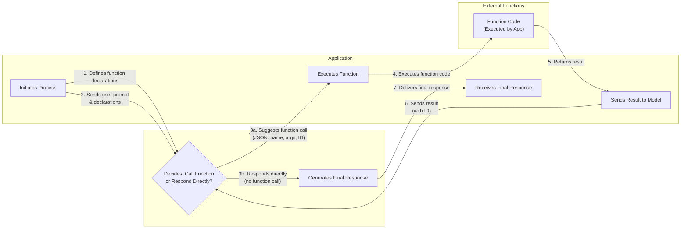
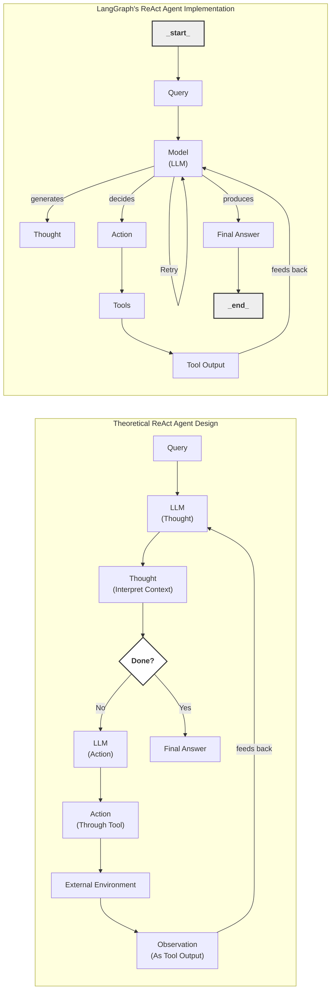

# Lesson 8: Building a ReAct Agent From Scratch

In our last lesson, we explored the theory behind agentic planning and reasoning, focusing on frameworks like ReAct. We learned how agents can break down complex problems by interleaving thought, action, and observation. But theory only takes you so far. The real understanding comes from building. Many AI frameworks abstract away the core mechanics, making it difficult to grasp what is happening under the hood. This can be frustrating when things go wrong and you need to debug a system you did not build.

This lesson is 100% practical. We will build a minimal ReAct agent from scratch using only Python and the Gemini API, following the code from our course notebook. By implementing the full Thought → Action → Observation cycle yourself, you will gain a concrete mental model of how these systems work. This hands-on experience is what gives you the confidence to build, debug, and extend agents for production.

In this lesson, we will walk through the entire process, from setting up the Python environment and defining a mock tool, to implementing the thought and action phases, orchestrating the control loop, and finally testing our agent to see it succeed and handle failure gracefully.

## Setup and Environment

Before we start building, let's ensure our environment is set up correctly. A clean setup ensures that the code runs smoothly and the outputs match what we expect, making it easier to follow along and debug. This section mirrors the initial cells of the lesson's notebook. The main goal is to get your environment ready so you can run the notebook and replicate the traces we will analyze later.

1.  First, we load our `GOOGLE_API_KEY` from the `.env` file. Our utility function, `env.load()`, handles this by reading the file and making the key available as an environment variable. This is a good practice for keeping sensitive information like API keys out of your source code.
    ```python
    from lessons.utils import env
    
    env.load(required_env_vars=["GOOGLE_API_KEY"])
    ```
    It outputs:
    ```text
    Trying to load environment variables from `/.../.env`
    Environment variables loaded successfully.
    ```

2.  Next, we import the necessary packages. We will use `google-genai` for interacting with the Gemini API, `pydantic` for creating structured data models for our actions, and standard Python libraries like `enum` and `typing` for type safety. Our custom `pretty_print` utility will help visualize the agent's traces in a readable, color-coded format.
    ```python
    from enum import Enum
    from pydantic import BaseModel, Field
    from typing import List
    
    from google import genai
    from google.genai import types
    
    from lessons.utils import pretty_print
    ```

3.  With the API key loaded, we can initialize the Gemini client. This object is our main interface for making calls to the Gemini models.
    ```python
    client = genai.Client()
    ```
    It outputs:
    ```text
    Both GOOGLE_API_KEY and GEMINI_API_KEY are set. Using GOOGLE_API_KEY.
    ```

4.  Finally, we define the model we will use. For this lesson, we will use `gemini-2.5-flash`. This model is a great choice for our purpose because it is fast and cost-effective, making it ideal for the simple reasoning and function-calling tasks our agent will perform.
    ```python
    MODEL_ID = "gemini-2.5-flash"
    ```
With our client and model ready, we can now define an external tool for our agent to use.

## Tool Layer: Mock Search Implementation

An agent's power comes from its ability to interact with the world through tools. For this lesson, we will create a simple mock `search` tool instead of integrating with a real API like Google Search. This approach has several educational benefits that are perfect for learning how ReAct works.

### Tool Design Philosophy

We are using a mock tool for a few important reasons. First, it simplifies the learning process by letting us focus entirely on the ReAct mechanics—the thought, action, and observation loop—without getting distracted by the complexities of handling real API calls, network errors, or authentication. Second, it eliminates external dependencies. You can run this code without signing up for a search API or managing extra keys. Finally, a mock tool provides predictable, consistent responses. This is a huge advantage for testing and debugging, as we know exactly what the tool should return for a given query, allowing us to isolate and understand the agent's behavior.

### Implementation Details

1.  Let's implement our mock `search` tool. The function takes a string `query` as input and returns a string as output. The docstring is critical here. It is not just a comment for developers; it is the primary description the LLM will use to understand what the tool does and when to use it. A clear and descriptive docstring is essential for reliable tool selection.
    ```python
    def search(query: str) -> str:
        """Search for information about a specific topic or query.
    
        Args:
            query (str): The search query or topic to look up.
        """
        query_lower = query.lower()
    
        # Predefined responses for demonstration
        if all(word in query_lower for word in ["capital", "france"]):
            return "Paris is the capital of France and is known for the Eiffel Tower."
        elif "react" in query_lower:
            return "The ReAct (Reasoning and Acting) framework enables LLMs to solve complex tasks by interleaving thought generation, action execution, and observation processing."
    
        # Generic response for unhandled queries
        return f"Information about '{query}' was not found."
    ```
    Our mock tool has hardcoded answers for queries about the capital of France and the ReAct framework. For any other query, it returns a "not found" message. This controlled behavior will allow us to test both success and graceful fallback scenarios later.

2.  We also create a `TOOL_REGISTRY`, which is a dictionary that maps the tool's name to its function object. This registry acts as a dispatcher, allowing our agent's control loop to dynamically look up and execute the correct function based on the name provided by the LLM.
    ```python
    TOOL_REGISTRY = {
        search.__name__: search,
    }
    ```

### Real-World Context

In a production system, you would replace this mock function with a real one that calls an external API. For example, you could integrate with Google Search, Bing, or a specialized knowledge base like a medical or legal database. The key to making this swap seamless is to maintain the same function signature (`query: str -> str`) and ensure the docstring accurately reflects the new tool's capabilities. This modular design, driven by docstrings, is a robust pattern for building extensible agents [[27]](https://medium.com/google-cloud/building-react-agents-from-scratch-a-hands-on-guide-using-gemini-ffe4621d90ae).

With a tool in place, the agent now needs a way to "think" about when and how to use it. This brings us to the first step of the ReAct cycle: the Thought phase.

## Thought Phase: Prompt Construction and Generation

The "Thought" phase is where the agent reasons about the user's goal and plans its next step. This is not just an internal state; it is an explicit piece of text generated by the LLM that we can inspect to understand its reasoning process. To guide this process, we will construct a detailed prompt template that instructs the model on how to think like a ReAct agent.

1.  First, we need a way to describe our available tools to the LLM in a format it can easily understand. We will create a helper function that converts our `TOOL_REGISTRY` into a simple XML format. This function reads the docstring from each tool and wraps it in `<tool>` and `<description>` tags. Using structured formats like XML is a powerful prompt engineering technique. It helps the model clearly distinguish different parts of the prompt, such as instructions, context, and available tools, which leads to more reliable and predictable behavior [[2]](https://ai.google.dev/gemini-api/docs/prompting-strategies).
    ```python
    def build_tools_xml_description(tools: dict[str, callable]) -> str:
        """Build a minimal XML description of tools using only their docstrings."""
        lines = []
        for tool_name, fn in tools.items():
            doc = (fn.__doc__ or "").strip()
            lines.append(f"\t<tool name=\"{tool_name}\">")
            if doc:
                lines.append(f"\t\t<description>")
                for line in doc.split("\n"):
                    lines.append(f"\t\t\t{line}")
                lines.append(f"\t\t</description>")
            lines.append("\t</tool>")
        return "\n".join(lines)
    
    tools_xml = build_tools_xml_description(TOOL_REGISTRY)
    
    PROMPT_TEMPLATE_THOUGHT = f"""
    You are deciding the next best step for reaching the user goal. You have some tools available to you.
    
    Available tools:
    <tools>
    {tools_xml}
    </tools>
    
    Conversation so far:
    <conversation>
    {{conversation}}
    </conversation>
    
    State your next thought about what to do next as one short paragraph focused on the next action you intend to take and why.
    Avoid repeating the same strategies that didn't work previously. Prefer different approaches.
    """.strip()
    ```

2.  Let's inspect the final prompt template. It clearly defines the model's role, lists the available tools within the `<tools>` block, and provides a `<conversation>` placeholder for the history of the interaction. The final instruction guides the model to produce a concise thought focused on its next action. This structure is designed to elicit the "reasoning traces" that are central to the ReAct framework [[1]](https://arxiv.org/pdf/2210.03629).
    ```python
    print(PROMPT_TEMPLATE_THOUGHT)
    ```
    It outputs:
    ```text
    You are deciding the next best step for reaching the user goal. You have some tools available to you.
    
    Available tools:
    <tools>
    	<tool name="search">
    		<description>
    			Search for information about a specific topic or query.
    			
    			Args:
    			    query (str): The search query or topic to look up.
    		</description>
    	</tool>
    </tools>
    
    Conversation so far:
    <conversation>
    {conversation}
    </conversation>
    
    State your next thought about what to do next as one short paragraph focused on the next action you intend to take and why.
    Avoid repeating the same strategies that didn't work previously. Prefer different approaches.
    ```

3.  Now, we implement the `generate_thought` function. This function is a simple wrapper that takes the current `conversation` history, formats the prompt template with the necessary information, calls the Gemini model, and returns the generated thought as a clean string.
    ```python
    def generate_thought(conversation: str, tool_registry: dict[str, callable]) -> str:
        """Generate a thought as plain text (no structured output)."""
        tools_xml = build_tools_xml_description(tool_registry)
        prompt = PROMPT_TEMPLATE_THOUGHT.format(conversation=conversation, tools_xml=tools_xml)
    
        response = client.models.generate_content(
            model=MODEL_ID,
            contents=prompt
        )
        return response.text.strip()
    ```
A thought is a plan. To execute that plan, the agent must move to the "Action" phase, where it decides whether to call a tool or conclude with a final answer.

## Action Phase: Function Calling and Parsing

The "Action" phase translates the agent's thought into a concrete, executable step. This could be a call to an external tool or a final answer to the user. We will use Gemini's native function calling feature to handle this, as it is more reliable and robust than asking the model to generate a JSON string and parsing it manually.

### System Prompt and Tool Integration Strategy

The prompt for this phase is focused on high-level decision-making. Unlike the "Thought" prompt, we do not need to include detailed tool descriptions in the prompt text itself. Instead, we pass the Python tool functions directly to the Gemini API through its `tools` configuration. The API automatically parses the function signatures and docstrings, making them available to the model as callable functions [[3]](https://ai.google.dev/gemini-api/docs/function-calling). This separation of concerns is a powerful design pattern: the prompt provides strategic guidance ("decide what to do"), while the API configuration handles the technical details of the tools. This keeps our prompts cleaner and makes managing tools much easier.

### Implementation

1.  We define two prompt templates. The first, `PROMPT_TEMPLATE_ACTION`, is for a standard action step where the model can choose between calling a tool or providing a final answer. The second, `PROMPT_TEMPLATE_ACTION_FORCED`, is a special prompt we will use to ensure our agent can terminate gracefully if it reaches an iteration limit, forcing it to provide a final answer based on the information it has.
    ```python
    PROMPT_TEMPLATE_ACTION = """
    You are selecting the best next action to reach the user goal.
    
    Conversation so far:
    <conversation>
    {conversation}
    </conversation>
    
    Respond either with a tool call (with arguments) or a final answer if you can confidently conclude.
    """.strip()
    
    # Dedicated prompt used when we must force a final answer
    PROMPT_TEMPLATE_ACTION_FORCED = """
    You must now provide a final answer to the user.
    
    Conversation so far:
    <conversation>
    {conversation}
    </conversation>
    
    Provide a concise final answer that best addresses the user's goal.
    """.strip()
    ```

2.  We define two Pydantic models to represent the possible outcomes of the action phase: a `ToolCallRequest` or a `FinalAnswer`. Using Pydantic models gives us structured, validated objects to work with, which is far more reliable than parsing raw dictionaries.
    ```python
    class ToolCallRequest(BaseModel):
        """A request to call a tool with its name and arguments."""
        tool_name: str = Field(description="The name of the tool to call.")
        arguments: dict = Field(description="The arguments to pass to the tool.")
    
    
    class FinalAnswer(BaseModel):
        """A final answer to present to the user when no further action is needed."""
        text: str = Field(description="The final answer text to present to the user.")
    ```

3.  Now we implement the `generate_action` function, the core of the action phase.
    ```python
    def generate_action(conversation: str, tool_registry: dict[str, callable] | None = None, force_final: bool = False) -> (ToolCallRequest | FinalAnswer):
        """Generate an action by passing tools to the LLM and parsing function calls or final text.
    
        When force_final is True or no tools are provided, the model is instructed to produce a final answer and tool calls are disabled.
        """
        # Use a dedicated prompt when forcing a final answer or no tools are provided
        if force_final or not tool_registry:
            prompt = PROMPT_TEMPLATE_ACTION_FORCED.format(conversation=conversation)
            response = client.models.generate_content(
                model=MODEL_ID,
                contents=prompt
            )
            return FinalAnswer(text=response.text.strip())
    
        # Default action prompt
        prompt = PROMPT_TEMPLATE_ACTION.format(conversation=conversation)
    
        # Provide the available tools to the model; disable auto-calling so we can parse and run ourselves
        tools = list(tool_registry.values())
        config = types.GenerateContentConfig(
            tools=tools,
            automatic_function_calling={"disable": True}
        )
        response = client.models.generate_content(
            model=MODEL_ID,
            contents=prompt,
            config=config
        )
    
        # Extract the function call from the response (if present)
        candidate = response.candidates[0]
        parts = candidate.content.parts
        if parts and getattr(parts[0], "function_call", None):
            name = parts[0].function_call.name
            args = dict(parts[0].function_call.args) if parts[0].function_call.args is not None else {}
            return ToolCallRequest(tool_name=name, arguments=args)
        
        # Otherwise, it's a final answer
        final_answer = "".join(part.text for part in candidate.content.parts)
        return FinalAnswer(text=final_answer.strip())
    ```
    This function has two main paths. If `force_final` is true, it uses the dedicated prompt and returns a `FinalAnswer`. Otherwise, it passes the available tools to the `generate_content` call. We set `automatic_function_calling={"disable": True}` because we want to parse the model's response and execute the tool ourselves, giving us full control over the loop. The function then inspects the response: if it contains a `function_call` object, it extracts the name and arguments and returns a `ToolCallRequest`. If not, it assumes the model has provided a final text answer and returns a `FinalAnswer`. This robust parsing logic is key to handling the model's different outputs.

Image 1: A flowchart illustrating the structured interaction between an application, the Gemini model, and external functions during the function calling process.

We now have the "Thought" and "Action" components. The final piece is the control loop that orchestrates them in the full ReAct cycle.

## Control Loop: Messages, Scratchpad, and Orchestration

The control loop orchestrates the agent's entire process, managing the Thought → Action → Observation cycle, maintaining the conversation history, executing tools, and processing their outputs. We will build this loop by treating the entire interaction as a sequence of structured messages stored in a "scratchpad," which serves as the agent's short-term memory.

1.  First, we define the structure for our messages. A `MessageRole` enum categorizes each part of the interaction (e.g., `USER`, `THOUGHT`, `TOOL_REQUEST`). The `Message` Pydantic model then holds the content and role for each step. This structured approach is fundamental for tracking the agent's state clearly and reliably, making the process transparent and easier to debug.
    ```python
    class MessageRole(str, Enum):
        """Enumeration for the different roles a message can have."""
        USER = "user"
        THOUGHT = "thought"
        TOOL_REQUEST = "tool request"
        OBSERVATION = "observation"
        FINAL_ANSWER = "final answer"
    
    
    class Message(BaseModel):
        """A message with a role and content, used for all message types."""
        role: MessageRole = Field(description="The role of the message in the ReAct loop.")
        content: str = Field(description="The textual content of the message.")
    
        def __str__(self) -> str:
            """Provides a user-friendly string representation of the message."""
            return f"{self.role.value.capitalize()}: {self.content}"
    ```

2.  We will use a helper function to pretty-print each message. This function uses our `pretty_print` utility to render the agent's traces in a color-coded format based on the message role, which makes the flow of thought, action, and observation much easier to follow.
    ```python
    def pretty_print_message(message: Message, turn: int, max_turns: int, header_color: str = pretty_print.Color.YELLOW, is_forced_final_answer: bool = False) -> None:
        if not is_forced_final_answer:
            title = f"{message.role.value.capitalize()} (Turn {turn}/{max_turns}):"
        else:
            title = f"{message.role.value.capitalize()} (Forced):"
    
        pretty_print.wrapped(
            text=message.content,
            title=title,
            header_color=header_color,
        )
    ```

3.  The `Scratchpad` class will manage our list of `Message` objects. It provides an `append` method to add new messages and optionally print them. Its `to_string` method is crucial, as it serializes the entire history into a single string that we will feed back to the LLM in each turn as context.
    ```python
    class Scratchpad:
        """Container for ReAct messages with optional pretty-print on append."""
    
        def __init__(self, max_turns: int) -> None:
            self.messages: List[Message] = []
            self.max_turns: int = max_turns
            self.current_turn: int = 1
    
        def set_turn(self, turn: int) -> None:
            self.current_turn = turn
    
        def append(self, message: Message, verbose: bool = False, is_forced_final_answer: bool = False) -> None:
            self.messages.append(message)
            if verbose:
                role_to_color = {
                    MessageRole.USER: pretty_print.Color.RESET,
                    MessageRole.THOUGHT: pretty_print.Color.ORANGE,
                    MessageRole.TOOL_REQUEST: pretty_print.Color.GREEN,
                    MessageRole.OBSERVATION: pretty_print.Color.YELLOW,
                    MessageRole.FINAL_ANSWER: pretty_print.Color.CYAN,
                }
                header_color = role_to_color.get(message.role, pretty_print.Color.YELLOW)
                pretty_print_message(
                    message=message,
                    turn=self.current_turn,
                    max_turns=self.max_turns,
                    header_color=header_color,
                    is_forced_final_answer=is_forced_final_answer,
                )
    
        def to_string(self) -> str:
            return "\n".join(str(m) for m in self.messages)
    ```

4.  Finally, we implement the `react_agent_loop` function. This is where all the components come together to execute the ReAct cycle.
    ```python
    def react_agent_loop(initial_question: str, tool_registry: dict[str, callable], max_turns: int = 5, verbose: bool = False) -> str:
        """
        Implements the main ReAct (Thought -> Action -> Observation) control loop.
        Uses a unified message class for the scratchpad.
        """
        scratchpad = Scratchpad(max_turns=max_turns)
    
        # Add the user's question to the scratchpad
        user_message = Message(role=MessageRole.USER, content=initial_question)
        scratchpad.append(user_message, verbose=verbose)
    
        for turn in range(1, max_turns + 1):
            scratchpad.set_turn(turn)
    
            # Generate a thought based on the current scratchpad
            thought_content = generate_thought(
                scratchpad.to_string(),
                tool_registry,
            )
            thought_message = Message(role=MessageRole.THOUGHT, content=thought_content)
            scratchpad.append(thought_message, verbose=verbose)
    
            # Generate an action based on the current scratchpad
            action_result = generate_action(
                scratchpad.to_string(),
                tool_registry=tool_registry,
            )
    
            # If the model produced a final answer, return it
            if isinstance(action_result, FinalAnswer):
                final_answer = action_result.text
                final_message = Message(role=MessageRole.FINAL_ANSWER, content=final_answer)
                scratchpad.append(final_message, verbose=verbose)
                return final_answer
    
            # Otherwise, it is a tool request
            if isinstance(action_result, ToolCallRequest):
                action_name = action_result.tool_name
                action_params = action_result.arguments
    
                # Add the action to the scratchpad
                params_str = ", ".join([f"{k}='{v}'" for k, v in action_params.items()])
                action_content = f"{action_name}({params_str})"
                action_message = Message(role=MessageRole.TOOL_REQUEST, content=action_content)
                scratchpad.append(action_message, verbose=verbose)
    
                # Run the action and get the observation
                observation_content = ""
                tool_function = tool_registry[action_name]
                try:
                    observation_content = tool_function(**action_params)
                except Exception as e:
                    observation_content = f"Error executing tool '{action_name}': {e}"
    
                # Add the observation to the scratchpad
                observation_message = Message(role=MessageRole.OBSERVATION, content=observation_content)
                scratchpad.append(observation_message, verbose=verbose)
    
            # Check if the maximum number of turns has been reached. If so, force the action selector to produce a final answer
            if turn == max_turns:
                forced_action = generate_action(
                    scratchpad.to_string(),
                    force_final=True,
                )
                if isinstance(forced_action, FinalAnswer):
                    final_answer = forced_action.text
                else:
                    final_answer = "Unable to produce a final answer within the allotted turns."
                final_message = Message(role=MessageRole.FINAL_ANSWER, content=final_answer)
                scratchpad.append(final_message, verbose=verbose, is_forced_final_answer=True)
                return final_answer
    ```
    The loop begins with the user's initial question. In each turn, it first generates a thought, then an action. If the action is a `FinalAnswer`, the loop terminates and returns the answer. If it is a `ToolCallRequest`, the loop looks up the tool in our `tool_registry`, executes it, and appends the result as an `OBSERVATION` message to the scratchpad. This observation becomes part of the context for the next turn, completing the cycle. If the loop reaches its `max_turns` limit, it calls `generate_action` one last time with `force_final=True` to ensure a clean exit. This structure provides a robust and transparent way to manage the agent's execution flow.

Image 2: A flowchart comparing the theoretical ReAct agent design with its LangGraph implementation, highlighting the Thought-Action-Observation loop.

With the complete loop implemented, let's test it to see how it performs on both successful and failed queries.

## Tests and Traces: Success and Graceful Fallback

Now it is time to validate our agent. We will run two tests: one with a question our mock tool can answer, and one with a question it cannot. By analyzing the detailed traces, we can verify that the full ReAct cycle—including tool execution, observation handling, and forced termination—behaves exactly as we designed it.

### Success Case

First, let's ask a simple factual question that our `search` tool is designed to answer. We will set `verbose=True` to see the full, color-coded trace of the agent's execution.

1.  We run the loop with the question "What is the capital of France?" and a limit of two turns.
    ```python
    question = "What is the capital of France?"
    final_answer = react_agent_loop(question, TOOL_REGISTRY, max_turns=2, verbose=True)
    ```
    It outputs:
    ```text
    User (Turn 1/2):
    What is the capital of France?
    
    Thought (Turn 1/2):
    I need to find the capital of France. I can use the search tool for this.
    
    Tool request (Turn 1/2):
    search(query='capital of France')
    
    Observation (Turn 1/2):
    Paris is the capital of France and is known for the Eiffel Tower.
    
    Thought (Turn 2/2):
    I have found the answer. The capital of France is Paris. I will now provide the final answer.
    
    Final answer (Turn 2/2):
    Paris is the capital of France.
    ```
    The trace shows a perfect ReAct cycle. In the first turn, the agent's **Thought** correctly identifies the need for a search. The **Tool request** shows it constructs the right call to our `search` tool. The **Observation** confirms it received the correct information from our mock tool. In the second turn, the agent's **Thought** recognizes that it has enough information, and it proceeds to generate the **Final answer**. The agent successfully solved the task well within the turn limit.

### Graceful Fallback Case

Next, let's test the agent's ability to handle a query that our mock tool does not have a predefined answer for. This will test its adaptive reasoning and the forced termination logic we built into the control loop.

1.  We ask, "What is the capital of Italy?" and keep the same two-turn limit.
    ```python
    question = "What is the capital of Italy?"
    final_answer = react_agent_loop(question, TOOL_REGISTRY, max_turns=2, verbose=True)
    ```
    It outputs:
    ```text
    User (Turn 1/2):
    What is the capital of Italy?
    
    Thought (Turn 1/2):
    I need to find the capital of Italy. I can use the search tool to find this information.
    
    Tool request (Turn 1/2):
    search(query='capital of Italy')
    
    Observation (Turn 1/2):
    Information about 'capital of Italy' was not found.
    
    Thought (Turn 2/2):
    The initial search for "capital of Italy" failed. I will try a broader search for just "Italy" to see if I can find the capital that way.
    
    Tool request (Turn 2/2):
    search(query='Italy')
    
    Observation (Turn 2/2):
    Information about 'Italy' was not found.
    
    Final answer (Forced):
    I'm sorry, but I couldn't find information about the capital of Italy using the available tools.
    ```
    This trace beautifully demonstrates the agent's resilience and the robustness of our loop. After the first search fails, the **Observation** is "Information about 'capital of Italy' was not found." The agent does not give up. In its next **Thought**, it adapts its strategy, deciding to try a broader query for just "Italy." When that also fails, it hits the `max_turns` limit. Our control loop correctly triggers the forced final answer path, and the agent provides a helpful and honest response admitting it could not find the information. This is exactly the kind of graceful failure we want in a production system.

These tests confirm that our from-scratch ReAct implementation is working correctly, providing a solid foundation for building more advanced agents.

## Conclusion

We have successfully built a minimal, yet fully functional, ReAct agent from scratch. By implementing each component—the tools, the thought and action phases, and the orchestrating control loop—we have demystified what happens inside agentic frameworks. This hands-on process provides a concrete mental model that is essential for any AI engineer. You now understand how an agent reasons about a task, decides to use a tool, processes the outcome, and iterates until it reaches a conclusion.

This foundation is the key to building more complex and robust AI systems. In our upcoming lessons, we will build on this model. We will explore how to add persistent memory so agents can learn from past interactions in Lesson 9, and we will dive deep into Retrieval-Augmented Generation (RAG) to connect them to vast knowledge bases in Lesson 10. The principles you learned here will apply directly to those more advanced topics.

## References

- [1] Yao, S., Zhao, J., Yu, D., Du, N., Shafran, I., Narasimhan, K., & Cao, Y. (2023). *ReAct: Synergizing Reasoning and Acting in Language Models*. arXiv. https://arxiv.org/pdf/2210.03629
- [2] *Prompt design strategies*. (n.d.). Google AI for Developers. https://ai.google.dev/gemini-api/docs/prompting-strategies
- [3] *Gemini Function Calling Documentation*. (n.d.). Google AI for Developers. https://ai.google.dev/gemini-api/docs/function-calling
- [4] Shankar, A. (2024, June 19). *Building ReAct Agents from Scratch using Gemini*. Medium. https://medium.com/google-cloud/building-react-agents-from-scratch-a-hands-on-guide-using-gemini-ffe4621d90ae
- [5] Schmid, P. (2025, March 31). *ReAct agent from scratch with Gemini 2.5 and LangGraph*. https://www.philschmid.de/langgraph-gemini-2-5-react-agent
- [6] *ReAct agent from scratch with Gemini 2.5 and LangGraph*. (n.d.). Google AI for Developers. https://ai.google.dev/gemini-api/docs/langgraph-example
- [7] Iusztin, P. (2025, November 18). *Building Production ReAct Agents From Scratch Is Simple*. Decoding AI. https://www.decodingai.com/p/building-production-react-agents
- [8] Neradot. (2024, November 5). *Building a Python React Agent Class: A Step-by-Step Guide*. https://www.neradot.com/post/building-a-python-react-agent-class-a-step-by-step-guide
- [9] Brownlee, J. (2024, July 1). *Building ReAct Agents with LangGraph: A Beginner’s Guide*. Machine Learning Mastery. https://machinelearningmastery.com/building-react-agents-with-langgraph-a-beginners-guide/
- [10] Daily Dose of DS. (2024, June 10). *AI Agents Crash Course - Part 10: ReAct Framework with Implementation*. https://www.dailydoseofds.com/ai-agents-crash-course-part-10-with-implementation/
- [11] Roelants, P. (2024, January 21). *Implement a simple ReAct Agent using OpenAI function calling*. https://peterroelants.github.io/posts/react-openai-function-calling/
- [12] Daily Dose of DS. (2024, June 10). *Implementing ReAct Agentic Pattern From Scratch*. https://blog.dailydoseofds.com/p/implement-react-agentic-pattern-from
- [13] LateNode. (2024, August 15). *LangChain ReAct Agent: Complete Implementation Guide with Working Examples (2025)*. https://latenode.com/blog/ai-frameworks-technical-infrastructure/langchain-setup-tools-agents-memory/langchain-react-agent-complete-implementation-guide-working-examples-2025
- [14] GenMind. (2024, July 15). *Building ReAct Agents with Microsoft Agent Framework: From Theory to Production*. https://genmind.ch/posts/Building-ReAct-Agents-with-Microsoft-Agent-Framework-From-Theory-to-Production/
- [15] *From LLM Reasoning to Autonomous AI Agents: A Comprehensive Review*. (2025, March 6). arXiv. https://arxiv.org/pdf/2504.19678
- [16] *AI Agent Planning*. (n.d.). IBM. https://www.ibm.com/think/topics/ai-agent-planning
- [17] *Building effective agents*. (2024, December 19). Anthropic. https://www.anthropic.com/engineering/building-effective-agents
- [18] *ReAct Agent*. (n.d.). IBM. https://www.ibm.com/think/topics/react-agent
- [19] *AI Agent Orchestration*. (n.d.). IBM. https://www.ibm.com/think/topics/ai-agent-orchestration
- [20] *Beyond the prompt: Engineering the Thought-Action-Observation loop*. (2024, May 29). Towards AI. https://pub.towardsai.net/beyond-the-prompt-engineering-the-thought-action-observation-loop-2e1fd99114d2
- [21] *AI Agents (IV): AI Agents through the Thought-Action-Observation (TAO) Cycle*. (2024, May 29). Stackademic. https://blog.stackademic.com/ai-agents-iv-ai-agents-through-the-thought-action-observation-tao-cycle-3dfe2eb76629
- [22] *Agent steps and structure*. (n.d.). Hugging Face. https://huggingface.co/learn/agents-course/unit1/agent-steps-and-structure
- [23] *Hugging Face Agents Course*. (n.d.). DataCamp. https://projector-video-pdf-converter.datacamp.com/42942/chapter2.pdf
- [24] *Converting a ReAct prompt to use function calling*. (2023, July 13). OpenAI Community. https://community.openai.com/t/converting-a-react-prompt-to-use-function-calling/264914
- [25] *Using Gemini with OpenAI Agents SDK*. (2024, November 21). OpenAI Community. https://community.openai.com/t/using-gemini-with-openai-agents-sdk/1307262
- [26] Upadhyay, A. (2025, November 25). *Building a real-time web searching AI agent with LangChain and Google Gemini*. https://atalupadhyay.wordpress.com/2025/11/25/building-a-real-time-web-searching-ai-agent-with-langchain-and-google-gemini/
- [27] *Real-world agent examples with Gemini 3*. (2025, July 16). Google for Developers. https://developers.googleblog.com/real-world-agent-examples-with-gemini-3/
- [28] *OrchDAG: Complex Tool Orchestration in Multi-Turn Interactions with Plan DAGs*. (2025). Amazon Science. https://www.amazon.science/publications/orchdag-complex-tool-orchestration-in-multi-turn-interactions-with-plan-dags
- [29] *OrchDAG: Complex Tool Orchestration in Multi-Turn Interactions with Plan DAGs*. (2025, October 24). arXiv. https://arxiv.org/html/2510.24663v1
- [30] *Build an AI coding agent with Python and Gemini*. (2024, July 12). freeCodeCamp.org. https://www.freecodecamp.org/news/build-an-ai-coding-agent-with-python-and-gemini/
- [31] *Thinking*. (n.d.). Google for Developers. https://docs.cloud.google.com/vertex-ai/generative-ai/docs/thinking