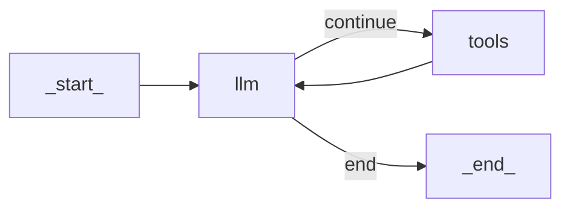

# Building a ReAct Agent From Scratch with Python and Gemini

In our last lesson, we covered the theory behind agentic planning and reasoning, focusing on frameworks like ReAct. We learned that ReAct agents solve complex tasks by interleaving a cycle of Thought, Action, and Observation. But theory only gets you so far. To truly understand how these systems work, you have to build one.

This lesson is 100% practice. We will build a minimal ReAct agent from scratch using only Python and the Gemini API. By implementing the full Thought → Action → Observation loop ourselves, we will demystify what happens under the hood of popular agentic frameworks. This hands-on approach provides a concrete mental model that is essential for debugging, extending, and confidently shipping AI agents in production.

We will walk through the entire process, step-by-step, following the code from the lesson's notebook, covering how to set up the Python environment, define a mock search tool, implement the "Thought" and "Action" phases, orchestrate the full cycle in a control loop, and finally, test the agent to see it succeed and handle failures gracefully.

Let's get started.

## Setup and Environment

The first step is to ensure our environment is correctly configured to run the code. This involves loading our API keys, importing the necessary packages, and initializing the Gemini client. A clean setup ensures that our outputs will match the expected traces as we build the agent. This initial configuration is a foundational step for any AI engineering project, ensuring that all dependencies are in place before we begin writing the core logic.

1.  We begin by loading the necessary environment variables. The `load` utility function, which we provide in the course materials, checks for a `.env` file in our project root and loads the `GOOGLE_API_KEY`. This practice keeps sensitive keys out of your source code.
    ```python
    from lessons.utils import env

    env.load(required_env_vars=["GOOGLE_API_KEY"])
    ```
    It outputs:
    ```text
    Trying to load environment variables from /path/to/your/project/.env
    Environment variables loaded successfully.
    ```

2.  Next, we import the key packages we will use throughout the lesson. We will use `google-genai` as the client for the Gemini API, `pydantic` for robust data modeling and validation, `Enum` from Python's standard library to create structured choices for our agent, and our own `pretty_print` utility for visualizing the agent's traces in a readable format.
    ```python
    from enum import Enum
    from pydantic import BaseModel, Field
    from typing import List

    from google import genai
    from google.genai import types

    from lessons.utils import pretty_print
    ```

3.  With our API key loaded, we can initialize the Gemini client. This object will be our main interface for making calls to the Gemini models.
    ```python
    client = genai.Client()
    ```
    It outputs:
    ```text
    Both GOOGLE_API_KEY and GEMINI_API_KEY are set. Using GOOGLE_API_KEY.
    ```

4.  Finally, we define a constant for the model we will be using. We will use `gemini-2.5-flash`, which is a fast and cost-effective model well-suited for the tasks in this lesson. It provides a good balance of reasoning capabilities, speed, and cost for development and prototyping.
    ```python
    MODEL_ID = "gemini-2.5-flash"
    ```

With the client and model ID in place, we are ready to define the external capabilities our agent can use.

## Tool Layer: Mock Search Implementation

To "act," an agent needs tools. In a production system, these might be complex APIs for searching databases, sending emails, or analyzing data. For this lesson, however, our goal is to focus on the ReAct mechanics, not the intricacies of API integration. Therefore, we will implement a simple mock search tool.

### Tool Design Philosophy

Using a mock tool is a deliberate choice that offers several advantages for learning. First, it simplifies the focus, allowing us to concentrate entirely on the agent's reasoning loop—the Thought-Action-Observation cycle—without getting sidetracked by the complexities of authenticating and handling real API calls. Second, it eliminates external dependencies, meaning you do not need to sign up for additional services or manage extra API keys. Most importantly, a mock tool provides predictable, hardcoded responses. This determinism is invaluable for testing and debugging. When the tool's output is consistent, we can reliably trace the agent's behavior and verify that its logic is working as expected.

### Implementation Details

Our mock `search` function simulates a knowledge source. It takes a string query and returns a predefined answer if the query matches certain keywords. If no match is found, it returns a generic "not found" message.

1.  The function's signature and docstring are critical. As we will see in the Action phase, modern LLM APIs like Gemini can automatically parse this information to understand what the tool does, what arguments it expects, and how to call it. The docstring serves as the primary documentation for the LLM.
    ```python
    def search(query: str) -> str:
        """Search for information about a specific topic or query.

        Args:
            query (str): The search query or topic to look up.
        """
        query_lower = query.lower()

        # Predefined responses for demonstration
        if all(word in query_lower for word in ["capital", "france"]):
            return "Paris is the capital of France and is known for the Eiffel Tower."
        elif "react" in query_lower:
            return "The ReAct (Reasoning and Acting) framework enables LLMs to solve complex tasks by interleaving thought generation, action execution, and observation processing."

        # Generic response for unhandled queries
        return f"Information about '{query}' was not found."
    ```

2.  We then create a `TOOL_REGISTRY`, which is a simple Python dictionary that maps the tool's name to its function object. This registry acts as a "phonebook" for our agent. When the LLM decides to use a tool by its name (e.g., `"search"`), our code will use this registry to look up and execute the corresponding Python function.
    ```python
    TOOL_REGISTRY = {
        search.__name__: search,
    }
    ```

This simple setup is surprisingly powerful. In a real-world application, you could easily swap this mock function with a call to an actual external API, like Google Search or a private knowledge base, without changing the agent's core logic [[1]](https://medium.com/google-cloud/building-react-agents-from-scratch-a-hands-on-guide-using-gemini-ffe4621d90ae). The agent only needs to know the tool's name and what it does, as described in the docstring. This modular approach is a key principle of good agent design.

With a tool ready for use, the agent now needs a way to *think* about when and how to use it.

## Thought Phase: Prompt Construction and Generation

The "Thought" phase is the reasoning core of the ReAct agent. Here, the agent analyzes the user's query and its past actions to decide what to do next. To guide this process, we need to construct a prompt that gives the LLM all the necessary context, including the tools it has available. This is a classic example of context engineering, which we covered in Lesson 3.

We will engineer a prompt that instructs the model to state its next thought as a short paragraph. This thought process is not shown to the end user but is a critical internal step that makes the agent's behavior transparent and debuggable. Using XML tags to structure the prompt is a common best practice that helps the model clearly distinguish between different types of information, such as instructions, tool definitions, and conversation history [[2]](https://ai.google.dev/gemini-api/docs/prompting-strategies).

1.  First, we create a function that converts our `TOOL_REGISTRY` into an XML-formatted string. This function iterates through the tools, extracts their docstrings, and formats them into a `<tool>` block. This block explicitly tells the model what tools are at its disposal.
    ```python
    def build_tools_xml_description(tools: dict[str, callable]) -> str:
        """Build a minimal XML description of tools using only their docstrings."""
        lines = []
        for tool_name, fn in tools.items():
            doc = (fn.__doc__ or "").strip()
            lines.append(f"\t<tool name=\"{tool_name}\">")
            if doc:
                lines.append(f"\t\t<description>")
                for line in doc.split("\n"):
                    lines.append(f"\t\t\t{line}")
                lines.append(f"\t\t</description>")
            lines.append("\t</tool>")
        return "\n".join(lines)

    tools_xml = build_tools_xml_description(TOOL_REGISTRY)
    ```

2.  Next, we define the prompt template for the thought-generation step. It includes instructions for the agent, the XML block of available tools, and a placeholder for the conversation history. The instructions guide the agent's reasoning, encouraging it to think about the next action and learn from past attempts.
    ```python
    PROMPT_TEMPLATE_THOUGHT = f"""
    You are deciding the next best step for reaching the user goal. You have some tools available to you.

    Available tools:
    <tools>
    {tools_xml}
    </tools>

    Conversation so far:
    <conversation>
    {{conversation}}
    </conversation>

    State your next thought about what to do next as one short paragraph focused on the next action you intend to take and why.
    Avoid repeating the same strategies that didn't work previously. Prefer different approaches.
    """.strip()
    ```

3.  Let's inspect the final prompt to see what the LLM will receive.
    ```python
    print(PROMPT_TEMPLATE_THOUGHT)
    ```
    It outputs:
    ```text
    You are deciding the next best step for reaching the user goal. You have some tools available to you.

    Available tools:
    <tools>
        <tool name="search">
            <description>
                Search for information about a specific topic or query.

                Args:
                    query (str): The search query or topic to look up.
            </description>
        </tool>
    </tools>

    Conversation so far:
    <conversation>
    {conversation}
    </conversation>

    State your next thought about what to do next as one short paragraph focused on the next action you intend to take and why.
    Avoid repeating the same strategies that didn't work previously. Prefer different approaches.
    ```
    The output shows the complete prompt, with the `<tool>` definition for our `search` function embedded within the `<tools>` block.

4.  Finally, we implement the `generate_thought` function. This function is a simple wrapper that takes the current conversation history, formats the prompt template with the necessary information, and calls the Gemini model to generate the next thought.
    ```python
    def generate_thought(conversation: str, tool_registry: dict[str, callable]) -> str:
        """Generate a thought as plain text (no structured output)."""
        tools_xml = build_tools_xml_description(tool_registry)
        prompt = PROMPT_TEMPLATE_THOUGHT.format(conversation=conversation, tools_xml=tools_xml)

        response = client.models.generate_content(
            model=MODEL_ID,
            contents=prompt
        )
        return response.text.strip()
    ```

A thought is just a plan. The next step is to translate that plan into a concrete, executable action.

## Action Phase: Function Calling and Parsing

After the agent has generated a "thought," it needs to decide on a concrete "action." This action can either be to use one of its tools or, if it has enough information, to provide a final answer to the user. We will implement this using Gemini's native function calling capabilities, a concept we introduced in Lesson 6.

### System Prompt Strategy

A key design choice here is to separate the strategic decision-making from the technical tool details. The prompt for the action phase will instruct the model on a high level: "decide whether to use a tool or answer." We will not include the tool descriptions directly in the prompt. This separation keeps our prompts clean and focused on the high-level goal, making them easier to manage and debug.

### Automatic Tool Integration with Gemini

Instead of manually describing tools in the prompt, we pass the Python tool functions to the Gemini API through its `tools` configuration. The API automatically inspects these functions and creates the necessary definitions for the model. It extracts the function name, uses the docstring as the tool's description, and infers the parameters from the function's signature and type hints. This powerful feature allows the model to understand and use our tools without us having to write complex prompt instructions.

### Function Calling Implementation

Let's implement the `generate_action` function, which is the core of the action phase.

1.  First, we define two prompt templates. The main template guides the model to choose between a tool call and a final answer. A second, more direct template is used to force a final answer, which is a useful mechanism to prevent infinite loops and ensure graceful termination.
    ```python
    PROMPT_TEMPLATE_ACTION = """
    You are selecting the best next action to reach the user goal.

    Conversation so far:
    <conversation>
    {conversation}
    </conversation>

    Respond either with a tool call (with arguments) or a final answer if you can confidently conclude.
    """.strip()

    # Dedicated prompt used when we must force a final answer
    PROMPT_TEMPLATE_ACTION_FORCED = """
    You must now provide a final answer to the user.

    Conversation so far:
    <conversation>
    {conversation}
    </conversation>

    Provide a concise final answer that best addresses the user's goal.
    """.strip()
    ```

2.  To handle the model's output in a structured way, we define two Pydantic models: `ToolCallRequest` and `FinalAnswer`. As we learned in Lesson 4, using Pydantic models ensures that the data we receive from the LLM is validated and easy to work with in our Python code.
    ```python
    class ToolCallRequest(BaseModel):
        """A request to call a tool with its name and arguments."""
        tool_name: str = Field(description="The name of the tool to call.")
        arguments: dict = Field(description="The arguments to pass to the tool.")


    class FinalAnswer(BaseModel):
        """A final answer to present to the user when no further action is needed."""
        text: str = Field(description="The final answer text to present to the user.")
    ```

3.  Now we implement the `generate_action` function.
    ```python
    def generate_action(conversation: str, tool_registry: dict[str, callable] | None = None, force_final: bool = False) -> (ToolCallRequest | FinalAnswer):
        """Generate an action by passing tools to the LLM and parsing function calls or final text.

        When force_final is True or no tools are provided, the model is instructed to produce a final answer and tool calls are disabled.
        """
        # Use a dedicated prompt when forcing a final answer or no tools are provided
        if force_final or not tool_registry:
            prompt = PROMPT_TEMPLATE_ACTION_FORCED.format(conversation=conversation)
            response = client.models.generate_content(
                model=MODEL_ID,
                contents=prompt
            )
            return FinalAnswer(text=response.text.strip())

        # Default action prompt
        prompt = PROMPT_TEMPLATE_ACTION.format(conversation=conversation)

        # Provide the available tools to the model; disable auto-calling so we can parse and run ourselves
        tools = list(tool_registry.values())
        config = types.GenerateContentConfig(
            tools=tools,
            automatic_function_calling={"disable": True}
        )
        response = client.models.generate_content(
            model=MODEL_ID,
            contents=prompt,
            config=config
        )

        # Extract the function call from the response (if present)
        candidate = response.candidates[0]
        parts = candidate.content.parts
        if parts and getattr(parts[0], "function_call", None):
            name = parts[0].function_call.name
            args = dict(parts[0].function_call.args) if parts[0].function_call.args is not None else {}
            return ToolCallRequest(tool_name=name, arguments=args)
        
        # Otherwise, it's a final answer
        final_answer = "".join(part.text for part in candidate.content.parts)
        return FinalAnswer(text=final_answer.strip())
    ```
    The function first checks if a final answer is being forced. If not, it formats the standard action prompt and configures the Gemini client with the available tools. We set `automatic_function_calling={"disable": True}` because we want to control the execution of the tool ourselves, which is a key part of the ReAct loop. The function then inspects the model's response. If it contains a `function_call` object, it parses the tool name and arguments into our `ToolCallRequest` model. Otherwise, it treats the response as a `FinalAnswer`.

### Handling Errors and Malformed Responses

In a production system, you cannot assume the LLM will always return a perfectly formatted response. The `generate_action` function might receive a malformed JSON or an unexpected output. While our current implementation relies on Pydantic for validation within the control loop, a more robust solution would wrap the parsing logic in a `try-except` block to catch `JSONDecodeError` or other parsing exceptions. If parsing fails, the agent could log the error and retry the `think` step, perhaps with an instruction to correct its output format. Similarly, handling unknown tool names gracefully is crucial and will be addressed in our control loop.

The `force_final` flag is an important safety mechanism. In a ReAct loop, we need a way to terminate gracefully if the agent gets stuck or exceeds a turn limit. This flag lets us instruct the model to wrap up and provide the best possible answer with the information it has.

We now have separate components for the "Thought" and "Action" phases. The next step is to orchestrate them in a control loop that executes the full ReAct cycle.

## Control Loop: Messages, Scratchpad, Orchestration

With the Thought and Action phases defined, we can now build the control loop that orchestrates the entire ReAct cycle. This loop manages the conversation history, calls the thought and action generation functions in sequence, executes tools, and processes their outputs as observations. This orchestration is the "engine" of our agent, driving it forward through the problem-solving process.

### Message Structure Foundation

To keep track of the conversation, we will use a "scratchpad," which is a list of messages. Each message represents a step in the ReAct cycle: the initial user query, the agent's internal thought, the tool call it decides to make, the observation from that tool, and finally, the final answer. A structured message format is essential for tracking this complex flow and for providing clear context to the LLM at each step.

1.  We define a structured way to represent these messages. The `MessageRole` enum categorizes each message type, providing clarity and preventing errors from simple typos. The `Message` Pydantic model provides a consistent structure for the content of each message, ensuring that every entry in our scratchpad is well-formed and validated.
    ```python
    class MessageRole(str, Enum):
        """Enumeration for the different roles a message can have."""
        USER = "user"
        THOUGHT = "thought"
        TOOL_REQUEST = "tool request"
        OBSERVATION = "observation"
        FINAL_ANSWER = "final answer"


    class Message(BaseModel):
        """A message with a role and content, used for all message types."""
        role: MessageRole = Field(description="The role of the message in the ReAct loop.")
        content: str = Field(description="The textual content of the message.")

        def __str__(self) -> str:
            """Provides a user-friendly string representation of the message."""
            return f"{self.role.value.capitalize()}: {self.content}"
    ```

2.  For clear and readable traces, we will use a helper function to pretty-print each message with a color-coded header indicating its role and the current turn. This makes it much easier to follow the agent's step-by-step execution during development and debugging.
    ```python
    def pretty_print_message(message: Message, turn: int, max_turns: int, header_color: str = pretty_print.Color.YELLOW, is_forced_final_answer: bool = False) -> None:
        if not is_forced_final_answer:
            title = f"{message.role.value.capitalize()} (Turn {turn}/{max_turns}):"
        else:
            title = f"{message.role.value.capitalize()} (Forced):"

        pretty_print.wrapped(
            text=message.content,
            title=title,
            header_color=header_color,
        )
    ```

3.  The `Scratchpad` class manages the list of messages. It has an `append` method to add new messages and optionally print them. Its `to_string` method serializes the entire history into a single string, which we will feed into our prompts to give the LLM the full context of the conversation.
    ```python
    class Scratchpad:
        """Container for ReAct messages with optional pretty-print on append."""

        def __init__(self, max_turns: int) -> None:
            self.messages: List[Message] = []
            self.max_turns: int = max_turns
            self.current_turn: int = 1

        def set_turn(self, turn: int) -> None:
            self.current_turn = turn

        def append(self, message: Message, verbose: bool = False, is_forced_final_answer: bool = False) -> None:
            self.messages.append(message)
            if verbose:
                role_to_color = {
                    MessageRole.USER: pretty_print.Color.RESET,
                    MessageRole.THOUGHT: pretty_print.Color.ORANGE,
                    MessageRole.TOOL_REQUEST: pretty_print.Color.GREEN,
                    MessageRole.OBSERVATION: pretty_print.Color.YELLOW,
                    MessageRole.FINAL_ANSWER: pretty_print.Color.CYAN,
                }
                header_color = role_to_color.get(message.role, pretty_print.Color.YELLOW)
                pretty_print_message(
                    message=message,
                    turn=self.current_turn,
                    max_turns=self.max_turns,
                    header_color=header_color,
                    is_forced_final_answer=is_forced_final_answer,
                )

        def to_string(self) -> str:
            return "\n".join(str(m) for m in self.messages)
    ```

### Control Loop Architecture

Finally, we implement the `react_agent_loop` function. This is the orchestrator. It initializes the scratchpad with the user's question and then enters a loop that runs for a maximum number of turns. Inside the loop, it sequentially generates a thought and an action.

If the action is a `FinalAnswer`, the loop terminates and returns the answer. If it is a `ToolCallRequest`, the loop looks up the corresponding function in the `TOOL_REGISTRY`, executes it, and captures the output as an `Observation`. This observation is added to the scratchpad, and the loop continues to the next turn. If the loop reaches `max_turns`, it calls `generate_action` one last time with `force_final=True` to ensure a graceful exit.

### Integrated Observation Processing and Error Handling

A robust agent must handle errors gracefully. Our loop includes logic to manage several potential failure points. When executing a tool, a `try-except` block catches any exceptions during the tool's execution, such as network errors or invalid inputs, and formats the error as an observation. This allows the agent to "see" the error and reason about it in the next turn.

Furthermore, we explicitly check if the tool name returned by the LLM exists in our `TOOL_REGISTRY`. If the model hallucinates a tool that does not exist, we generate an informative observation message telling the agent which tools are actually available. This feedback mechanism helps the agent self-correct.

```python
def react_agent_loop(initial_question: str, tool_registry: dict[str, callable], max_turns: int = 5, verbose: bool = False) -> str:
    """
    Implements the main ReAct (Thought -> Action -> Observation) control loop.
    Uses a unified message class for the scratchpad.
    """
    scratchpad = Scratchpad(max_turns=max_turns)

    # Add the user's question to the scratchpad
    user_message = Message(role=MessageRole.USER, content=initial_question)
    scratchpad.append(user_message, verbose=verbose)

    for turn in range(1, max_turns + 1):
        scratchpad.set_turn(turn)

        # Generate a thought based on the current scratchpad
        thought_content = generate_thought(
            scratchpad.to_string(),
            tool_registry,
        )
        thought_message = Message(role=MessageRole.THOUGHT, content=thought_content)
        scratchpad.append(thought_message, verbose=verbose)

        # Generate an action based on the current scratchpad
        action_result = generate_action(
            scratchpad.to_string(),
            tool_registry=tool_registry,
        )

        # If the model produced a final answer, return it
        if isinstance(action_result, FinalAnswer):
            final_answer = action_result.text
            final_message = Message(role=MessageRole.FINAL_ANSWER, content=final_answer)
            scratchpad.append(final_message, verbose=verbose)
            return final_answer

        # Otherwise, it is a tool request
        if isinstance(action_result, ToolCallRequest):
            action_name = action_result.tool_name
            action_params = action_result.arguments

            # Add the action to the scratchpad
            params_str = ", ".join([f"{k}='{v}'" for k, v in action_params.items()])
            action_content = f"{action_name}({params_str})"
            action_message = Message(role=MessageRole.TOOL_REQUEST, content=action_content)
            scratchpad.append(action_message, verbose=verbose)

            # Run the action and get the observation
            observation_content = ""
            if action_name in tool_registry:
                tool_function = tool_registry[action_name]
                try:
                    observation_content = tool_function(**action_params)
                except Exception as e:
                    observation_content = f"Error executing tool '{action_name}': {e}"
            else:
                observation_content = f"Unknown tool '{action_name}'. Available tools: {list(tool_registry.keys())}"


            # Add the observation to the scratchpad
            observation_message = Message(role=MessageRole.OBSERVATION, content=observation_content)
            scratchpad.append(observation_message, verbose=verbose)

        # Check if the maximum number of turns has been reached. If so, force the action selector to produce a final answer
        if turn == max_turns:
            forced_action = generate_action(
                scratchpad.to_string(),
                force_final=True,
            )
            if isinstance(forced_action, FinalAnswer):
                final_answer = forced_action.text
            else:
                final_answer = "Unable to produce a final answer within the allotted turns."
            final_message = Message(role=MessageRole.FINAL_ANSWER, content=final_answer)
            scratchpad.append(final_message, verbose=verbose, is_forced_final_answer=True)
            return final_answer
```

### Scaling Challenges

While this loop is effective for short tasks, scaling it beyond a few turns introduces significant engineering challenges centered on the scratchpad. As the conversation history grows, the serialized scratchpad can exceed the model's context window. Even with large context windows, models can suffer from a "lost in the middle" problem, where they struggle to recall information buried deep in the prompt [[3]](https://langwatch.ai/blog/the-6-context-engineering-challenges-stopping-ai-from-scaling-in-production). This context overload not only increases token costs and latency but can paradoxically decrease accuracy. Production-grade agentic systems require more sophisticated context management strategies, such as summarizing past turns or retrieving only the most relevant history for each step.


Image 1: A flowchart illustrating the control loop architecture of our ReAct agent.

This loop structure directly implements the ReAct pattern. It cycles through reasoning (thought), acting (tool use), and processing feedback (observation) until it reaches a conclusion. Now that we have built the complete agent, let's test it.

## Tests and Traces: Success and Graceful Fallback

With the full ReAct loop implemented, it is time to test our agent. We will run it on two different queries to validate its behavior. The first is a straightforward factual question that our mock tool can answer. The second is a query for which our tool has no information, forcing the agent to handle failure and terminate gracefully. By analyzing the printed traces, we can see the agent's step-by-step reasoning in action, which is essential for debugging and building trust in the system.

1.  First, let's ask a question our mock `search` tool is designed to handle: "What is the capital of France?". We will set `max_turns=2` and `verbose=True` to see the detailed trace.
    ```python
    # A straightforward question requiring a search.
    question = "What is the capital of France?"
    final_answer = react_agent_loop(question, TOOL_REGISTRY, max_turns=2, verbose=True)
    ```
    The output trace clearly shows the ReAct cycle:
    ```text
    User (Turn 1/2):
    What is the capital of France?

    Thought (Turn 1/2):
    I need to find the capital of France. The user is asking a direct factual question, and the `search` tool is available to find information on specific topics. I will use the `search` tool with the query "capital of France" to get the answer.

    Tool request (Turn 1/2):
    search(query='capital of France')

    Observation (Turn 1/2):
    Paris is the capital of France and is known for the Eiffel Tower.

    Thought (Turn 2/2):
    I have found the answer to the user's question. The search tool returned "Paris is the capital of France and is known for the Eiffel Tower." I will now provide the final answer to the user.

    Final answer (Turn 2/2):
    Paris is the capital of France.
    ```
    This trace is a perfect illustration of the ReAct loop in action. The initial `User` message kicks off the process. The first `Thought` shows the agent's plan: use the `search` tool for a factual lookup. The `Tool request` confirms this decision, showing the exact call. The `Observation` provides the result from our mock tool. In the second turn, the agent's `Thought` reflects on this new information, concludes it has sufficient data, and generates the `Final answer`. The process is logical, transparent, and efficient, completing the task well within the two-turn limit.

2.  Now, let's try a query that our mock tool cannot answer: "What is the capital of Italy?". This tests the agent's ability to handle failure and adapt its strategy.
    ```python
    # An unknown/unsupported query for the mock tool.
    question = "What is the capital of Italy?"
    final_answer = react_agent_loop(question, TOOL_REGISTRY, max_turns=2, verbose=True)
    ```
    The trace for this query demonstrates the agent's fallback behavior:
    ```text
    User (Turn 1/2):
    What is the capital of Italy?

    Thought (Turn 1/2):
    I need to find the capital of Italy. I will use the search tool to find this information.

    Tool request (Turn 1/2):
    search(query='capital of Italy')

    Observation (Turn 1/2):
    Information about 'capital of Italy' was not found.

    Thought (Turn 2/2):
    The search for "capital of Italy" did not return any information. I will try a broader search for just "Italy" to see if I can find any relevant information that might lead to the capital.

    Tool request (Turn 2/2):
    search(query='Italy')

    Observation (Turn 2/2):
    Information about 'Italy' was not found.

    Final answer (Forced):
    I am sorry, but I was unable to find the capital of Italy using the available tools.
    ```
    This trace highlights the agent's resilience. After the first `Observation` confirms the initial search failed, the agent's second `Thought` shows adaptive reasoning. It does not give up; instead, it formulates a new plan to try a broader query. When this second attempt also fails, the agent reaches the `max_turns` limit. Our control loop correctly identifies this and triggers the `force_final` mechanism. The resulting `Final answer (Forced)` is a polite and honest admission of failure, which is a much better outcome than hallucinating an incorrect answer.

These tests confirm that our end-to-end implementation of the ReAct loop works as expected. The agent can successfully use tools to answer questions, and it can handle tool failures and termination conditions gracefully. This simple, transparent implementation provides a solid foundation for building more complex and robust agents.

## Conclusion

We have successfully built a complete, albeit minimal, ReAct agent from scratch. By implementing each component—the tool, the thought and action phases, and the orchestrating control loop—we have gained a concrete mental model of how these reasoning systems operate. We have seen how the agent interleaves reasoning with actions and uses observations to refine its strategy, a process that mirrors human problem-solving [[1]](https://arxiv.org/pdf/2210.03629).

This hands-on experience is what separates a theoretical understanding from practical AI engineering. Even if you end up using a framework like LangGraph in production, knowing what happens under the hood is invaluable for debugging, optimization, and customization [[2]](https://www.decodingai.com/p/building-production-react-agents).

The transparency of the thought-action-observation cycle is a key advantage, enabling not just easier debugging but also advanced techniques like human-in-the-loop intervention, where developers can correct faulty reasoning traces to guide the agent [[4]](https://research.google/blog/react-synergizing-reasoning-and-acting-in-language-models/). This explicit reasoning also paves the way for self-correction mechanisms, as seen in frameworks where agents reflect on their performance to improve subsequent actions [[5]](https://huggingface.co/blog/Kseniase/reflection).

Moreover, the core ReAct pattern is not limited to text. It has been successfully adapted for multimodal environments, where agents can process and reason about visual inputs by using specialized tools for image analysis or document understanding [[6]](https://www.emergentmind.com/topics/react-style-agents).

This lesson provides a foundational building block. In the upcoming lessons, we will build upon this foundation. In Lesson 9, we will explore how to equip agents with memory to retain information across conversations. Following that, in Lesson 10, we will do a deep dive into Retrieval-Augmented Generation (RAG) to connect our agents to vast external knowledge bases.

## References

- [1] Yao, S., Zhao, J., Yu, D., Du, N., Shafran, I., Narasimhan, K., & Cao, Y. (2023). ReAct: Synergizing Reasoning and Acting in Language Models. In International Conference on Learning Representations (ICLR). https://arxiv.org/pdf/2210.03629
- [2] Paul Iusztin. (2025, November 18). Building Production ReAct Agents From Scratch Is Simple. Decoding AI. https://www.decodingai.com/p/building-production-react-agents
- [3] LangWatch. (2025, August 19). The 6 context engineering challenges stopping AI from scaling in production. https://langwatch.ai/blog/the-6-context-engineering-challenges-stopping-ai-from-scaling-in-production
- [4] Google. (2025, May 29). ReAct: Synergizing Reasoning and Acting in Language Models. Google Research. https://research.google/blog/react-synergizing-reasoning-and-acting-in-language-models/
- [5] Selin, K. (n.d.). Let's build a RAG-based agent with a reflection mechanism. Hugging Face. https://huggingface.co/blog/Kseniase/reflection
- [6] Emergent Mind. (n.d.). ReAct-style agents. https://www.emergentmind.com/topics/react-style-agents
- [7] Shankar, A. (2025, June 25). Building ReAct Agents from Scratch using Gemini. Medium. https://medium.com/google-cloud/building-react-agents-from-scratch-a-hands-on-guide-using-gemini-ffe4621d90ae
- [8] Google. (n.d.). Prompting strategies. Google AI for Developers. https://ai.google.dev/gemini-api/docs/prompting-strategies
</article>