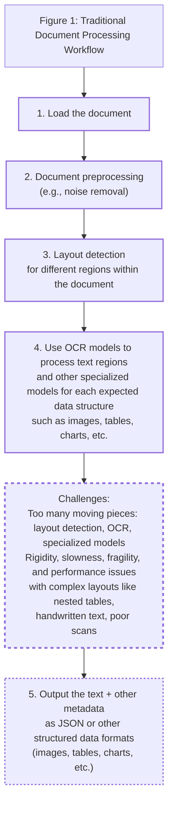
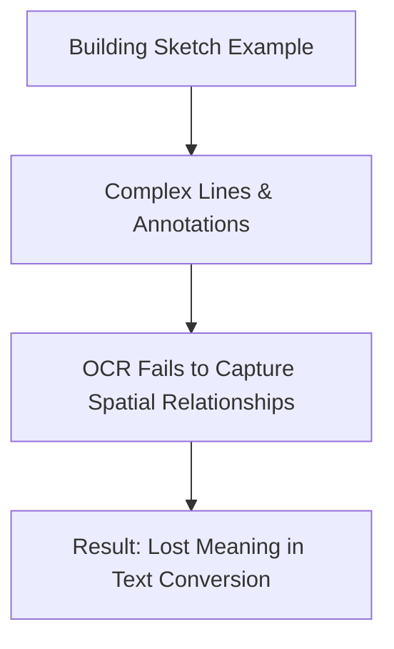
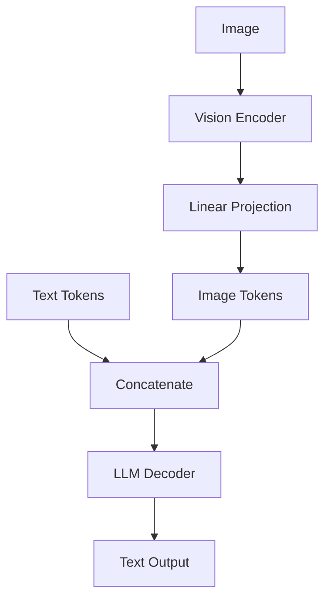
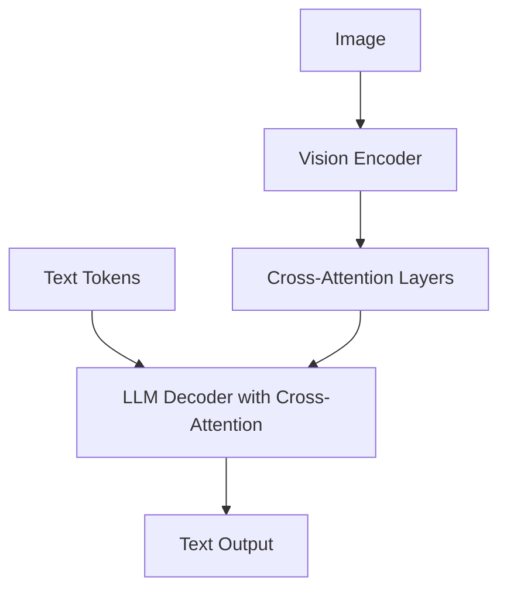
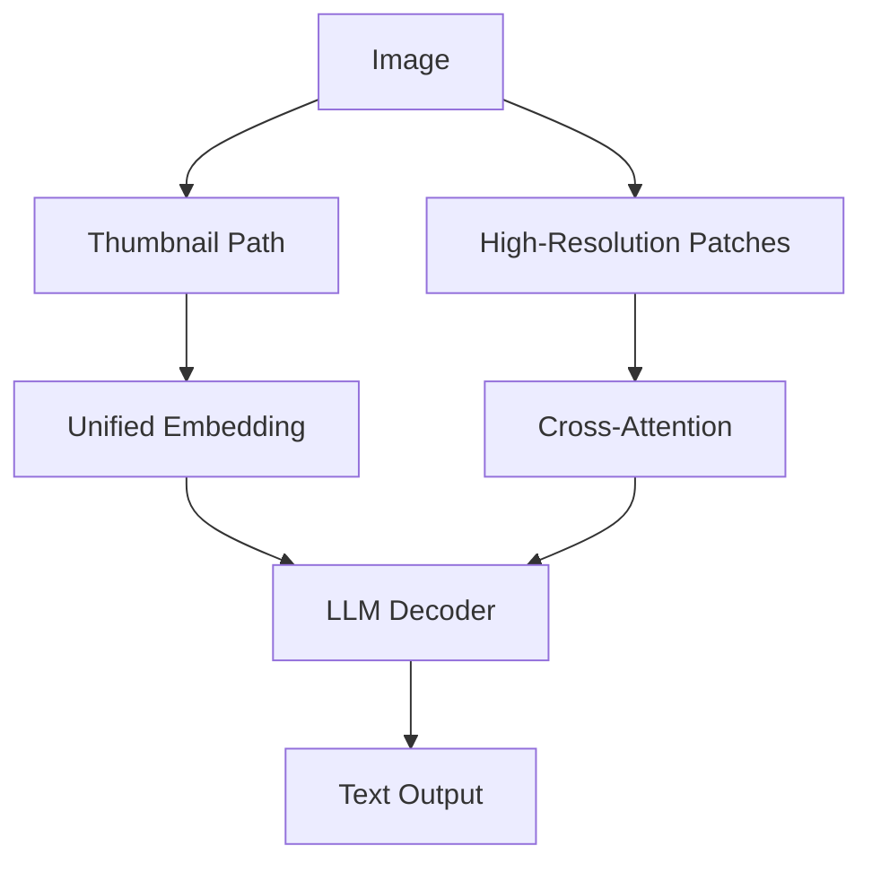
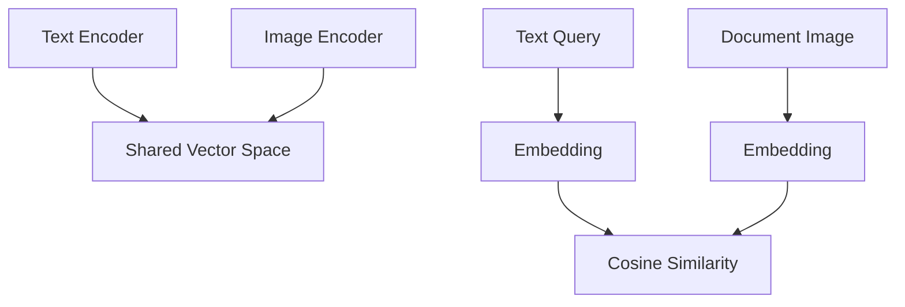
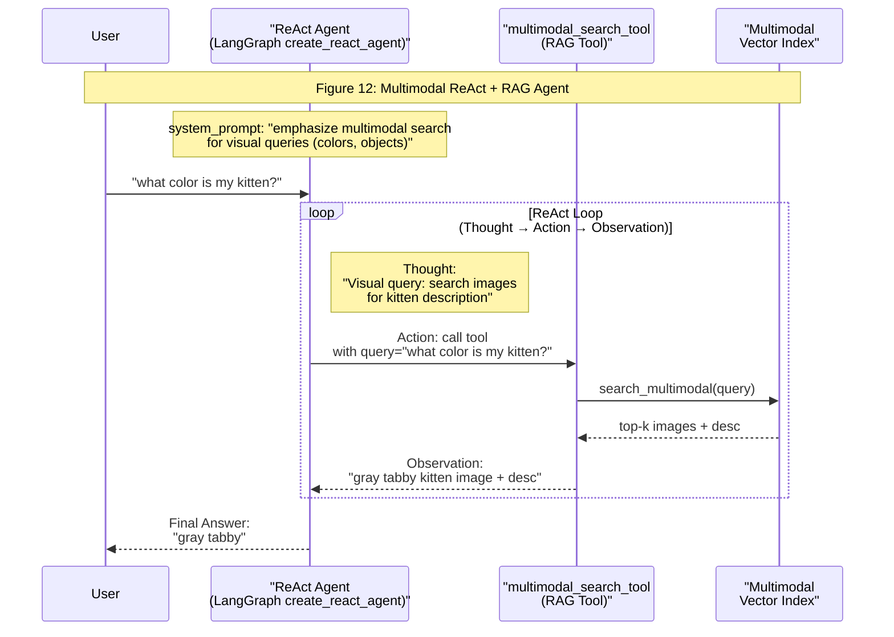

**Multimodal AI Engineering: From OCR to Native Image & Document Processing in 2025**

A few months ago we were helping a financial services client build an agent that could answer questions about their quarterly reports. The reports were full of charts, tables, and complex layouts. Our initial approach using OCR to convert everything to text produced garbled outputs and missed key insights from the visuals. The agent gave confident but wrong answers. That painful experience showed us why native multimodal processing is essential.

In previous lessons you learned how to choose between workflows and agents, manage information flow through context engineering, extract reliable data with structured outputs, implement chaining routing parallelization and orchestrator-worker patterns, equip agents with tools and function calling, apply planning and reasoning loops like ReAct, add memory across procedural episodic and semantic layers, and master advanced retrieval techniques. This lesson completes the foundation by showing how to process images, PDFs, and other visual content directly rather than forcing everything through brittle OCR pipelines. You will see why traditional document workflows fail on real enterprise content, how multimodal LLMs integrate visual information through unified embedding or cross-attention architectures, practical patterns for working with images and PDFs in different formats, the design of multimodal RAG systems built on ColPali-style multi-vector embeddings, a complete implementation of multimodal RAG for mixed image and document collections, and finally how to turn that retrieval capability into a ReAct agent that reasons over visual content. These techniques matter because most organizational data lives in visually rich PDFs, reports, diagrams, and images. Normalizing everything to text loses critical layout, spatial relationships, and graphical meaning that humans rely on every day. Native multimodal processing preserves that information, reduces pipeline complexity, improves accuracy on complex layouts, and scales better for agentic systems that must handle diverse enterprise content. In this lesson we will explore the need for multimodal AI, the limitations of traditional document processing, the foundations of multimodal LLMs, how to apply multimodal LLMs to images and PDFs, the foundations of multimodal RAG, how to implement multimodal RAG for images PDFs and text, and how to build multimodal AI agents.

## Section 1 - Introduction: The need for multimodal AI

When we first tried to build an agent that could answer questions from our company’s quarterly reports we hit a wall. The PDFs were full of charts and tables that our OCR pipeline turned into garbled text. The agent gave confident but wrong answers about revenue trends visible in the visuals. That experience revealed a fundamental problem with how most AI systems handle enterprise documents. Traditional approaches try to normalize everything to text before feeding it to an LLM. This works for clean typed paragraphs but collapses on the visually rich content that dominates real organizational data.

The core issue is information loss. When a chart’s trend line, a diagram’s component relationships, or a table’s spatial organization is forced into linear prose, meaning disappears. OCR engines achieve 88–94 percent accuracy on simple printed layouts but plateau there for mixed content or degraded scans. They treat pages as flat text grids and therefore fail on multi-column formats, nested tables, overlapping text layers, faded watermarks, and embedded graphics. Handwriting recognition typically yields 3–5 percent character error rate, which still requires human review for any high-stakes application. Scan quality below 300 DPI produces accuracy drops of 20 percent or more. A five-degree tilt can increase word error rate by 15 percent. Enterprise APIs improve the numbers on standard forms yet still degrade sharply on irregular layouts, heavy tables, or mixed handwriting and print [[12]](https://www.llamaindex.ai/blog/ocr-accuracy).

These failures appear across industries. Financial analysts querying reports lose the meaning carried by charts [[14]](https://konfuzio.com/en/chatgpt-financial-analysis/). Research assistants processing papers miss insights in diagrams. Medical teams reviewing imaging alongside notes cannot rely on text-only summaries [[15]](https://techtoday.lenovo.com/sites/default/files/2025-05/Medical%20Imaging%20White%20Paper%20NVIDIA%20and%20Lenovo.pdf). Technical teams searching documentation with embedded sketches receive incomplete answers [[9]](https://hackernoon.com/complex-document-recognition-ocr-doesnt-work-and-heres-how-you-fix-it). Building sketches, X-rays, noisy handwritten forms, and multi-page tables with merged cells all break the assumptions baked into template-driven OCR systems [[18]](https://learn.microsoft.com/en-us/answers/questions/5668164/why-traditional-ocr-fails-for-complex-business-doc). The pipelines themselves compound the problem. Layout detection fails on irregular formats. Each handoff between OCR, table extractors, and captioning models risks losing context the next stage cannot recover. The resulting systems are rigid, slow, costly, and brittle.

Modern multimodal LLMs address the root cause by processing images and documents in their native visual form [[1]](https://magazine.sebastianraschka.com/p/understanding-multimodal-llms), [[20]](https://www.decodingai.com/p/stop-converting-documents-to-text). A single model ingests text, layout, charts, diagrams, and photographs together, preserving the complete context a human reader would use. The pipeline collapses from many brittle steps into one robust forward pass. Accuracy on visually complex content improves, latency decreases, and maintenance burden shrinks. This lesson shows exactly how to build those systems. You will learn the limitations of traditional document processing, the architectural foundations of multimodal LLMs, practical patterns for working with images and PDFs in different formats, the design of multimodal RAG systems built on ColPali-style multi-vector embeddings, a complete implementation of multimodal RAG for mixed image and document collections, and finally how to turn that retrieval capability into a ReAct agent that reasons over visual content. By the end you will have the complete toolkit needed to move from isolated LLM calls to production AI agents and workflows that understand the visual world.

## Section 2: Limitations of traditional document processing

Traditional document processing pipelines reveal their fragility as soon as documents move beyond clean typed text. Enterprise content rarely fits neat templates. Financial reports interleave narrative, tables, and charts that carry essential meaning. Technical manuals combine specifications, diagrams, and annotations whose spatial relationships matter. Research papers mix prose, figures, and equations in layouts that change from one publication to the next. When these documents pass through OCR-first workflows, critical information disappears.

A typical pipeline follows five steps. First the document is loaded. Preprocessing attempts to remove noise, correct skew, and enhance contrast. Layout detection then segments the page into text blocks, tables, charts, and images. Specialized models process each region: OCR for text, table extractors for grids, captioning models for figures. Finally the system assembles extracted text, recognized tables, generated captions, and metadata into JSON or another structured format.



Figure 1: Traditional Document Processing Workflow - A top-down flowchart illustrating the sequential steps in traditional PDF document processing, highlighting key challenges after specialized model processing.

This multi-step chain creates cascading failure points. Layout detection fails on irregular formats or nested tables. OCR accuracy collapses on poor scans, faded ink, stylized fonts, or overlapping text layers. Table and chart models introduce their own errors and require constant maintenance when formats evolve. Each handoff between components risks losing context that the next stage cannot recover. The result is a system that is rigid, slow, costly, and brittle.

Performance numbers make the problem concrete. Traditional OCR engines reach 88–94 percent accuracy on high-volume simple layouts but plateau there for mixed content or degraded scans. They treat pages as flat text grids and therefore fail on multi-column formats, nested tables, overlapping text layers, faded watermarks, and embedded graphics. Handwriting recognition typically yields 3–5 percent character error rate, which still requires human review for any high-stakes application. Scan quality below 300 DPI produces accuracy drops of 20 percent or more. A five-degree tilt can increase word error rate by 15 percent. Enterprise APIs improve the numbers on standard forms yet still degrade sharply on irregular layouts, heavy tables, or mixed handwriting and print [[12]](https://www.llamaindex.ai/blog/ocr-accuracy), [[11]](https://blog.roboflow.com/what-is-optical-character-recognition-ocr/).

Real enterprise use cases expose the deeper limitations. Text-only summarization of financial reports ignores the very charts and tables that contain the most salient data, producing incomplete or factually inconsistent outputs [[14]](https://konfuzio.com/en/chatgpt-financial-analysis/). Research assistants processing papers lose the meaning carried by diagrams and spatial layouts. Medical teams reviewing imaging alongside notes cannot rely on text-only summaries [[15]](https://techtoday.lenovo.com/sites/default/files/2025-05/Medical%20Imaging%20White%20Paper%20NVIDIA%20and%20Lenovo.pdf). Technical documentation containing sketches or flowcharts loses essential geometric relationships when every element is forced into linear prose. Building sketches, X-rays, noisy handwritten forms, and multi-page tables with merged cells all break the assumptions baked into template-driven OCR systems [[18]](https://learn.microsoft.com/en-us/answers/questions/5668164/why-traditional-ocr-fails-for-complex-business-doc).



Figure 2: Building sketch showing how hard this is for classic OCR systems.

The rigidity of these pipelines compounds the problem. Most rely on predefined positional rules or templates that work only for fixed layouts. Any change in format requires manual rule updates and ongoing monitoring [[13]](https://jiffy.ai/overcoming-ocr-errors-and-limitations-with-intelligent-document-processing/). The absence of genuine contextual understanding means numbers without units, ambiguous terms, or cross-referenced data are misinterpreted [[13]](https://jiffy.ai/overcoming-ocr-errors-and-limitations-with-intelligent-document-processing/). Scaling to high document variety and volume quickly becomes unsustainable.

The fundamental flaw is that traditional approaches accept information loss as inevitable when visual content is translated to text. A chart’s trend, a diagram’s component relationships, a table’s spatial organization — these elements carry meaning that no textual description can fully reproduce. When every document is forced through the same OCR pipeline, the system inherits the weaknesses of its weakest link.

Modern multimodal LLMs address the root cause by processing images and documents in their native visual form [[1]](https://magazine.sebastianraschka.com/p/understanding-multimodal-llms). A single model ingests text, layout, charts, diagrams, and photographs together, preserving the complete context a human reader would use. The pipeline collapses from many brittle steps into one robust forward pass. Accuracy on visually complex content improves, latency decreases, and maintenance burden shrinks. The next section explains the architectural foundations that make this possible.

## Section 3: Foundations of multimodal LLMs

The architectural foundations of multimodal LLMs determine how effectively visual information reaches the reasoning engine. Two dominant design patterns have emerged. Both begin with a pretrained text-only LLM and a vision encoder, yet they integrate visual information in fundamentally different ways. Understanding these patterns gives you the intuition needed to select models, design prompts, and debug production systems.

The first pattern, unified embedding decoder architecture, keeps the LLM unchanged. An image is divided into patches, each patch is passed through a vision encoder such as CLIP or SigLIP, and the resulting features are projected into the same embedding dimension used by the LLM’s text tokens. These image tokens are then concatenated with text tokens and fed into the decoder exactly as if they were additional words. The model’s self-attention layers learn to reason jointly over both modalities because they occupy the same input sequence.



Figure 3: Unified embedding decoder architecture.

The second pattern, cross-modality attention architecture, introduces dedicated cross-attention layers inside the LLM. The vision encoder still produces patch embeddings, but instead of placing them at the beginning of the input sequence, the model attends to them from specific transformer blocks via cross-attention. This keeps the original self-attention layers focused on text while allowing visual features to influence reasoning at chosen depths. Because visual tokens never enter the main context window as additional sequence elements, the approach scales more efficiently to high-resolution images [[1]](https://magazine.sebastianraschka.com/p/understanding-multimodal-llms).



Figure 4: Cross-modality attention architecture.

A hybrid variant combines both ideas. A low-resolution thumbnail of the entire image is processed through the unified embedding path to provide global context. High-resolution patches are then routed through cross-attention layers to supply fine detail without exploding the token count. This design balances the accuracy advantages of full self-attention on global structure with the efficiency of late visual injection.



Figure 5: Hybrid architecture combining thumbnail embedding and cross-attention for high-resolution patches.

All three approaches share the same vision-encoder backbone. A pretrained model such as CLIP, OpenCLIP, or SigLIP divides the image into fixed-size patches, extracts features from each patch using a vision transformer, and produces embeddings [[4]](https://www.pinecone.io/learn/series/image-search/clip/). These embeddings must then be aligned with the LLM’s text embedding space. A linear projection layer or small multi-layer perceptron typically performs this alignment. The projector is the only component trained from scratch in many pipelines; the vision encoder and LLM weights are often frozen during initial pretraining to preserve capabilities already learned on massive unimodal corpora.

Image encoders learn representations in which semantically related images and text descriptions map to nearby vectors. This alignment, achieved through contrastive pretraining on billions of image-text pairs, is what enables zero-shot capabilities such as image classification or visual question answering [[3]](https://towardsdatascience.com/multimodal-embeddings-an-introduction-5dc36975966f), [[4]](https://www.pinecone.io/learn/series/image-search/clip/). The same alignment powers multimodal RAG: a text query and a document page treated as an image can be compared directly in the shared embedding space.



Figure 6: Text and image embeddings aligned in the same vector space.

Trade-offs between the architectures matter for production decisions. Unified embedding approaches are simpler to implement because they require no changes to the LLM’s attention mechanism. They often deliver higher accuracy on OCR-heavy tasks because every visual token participates fully in self-attention. Cross-attention architectures are more compute-efficient for high-resolution inputs because they avoid long sequences in the main transformer stack. They also make it easier to keep the original LLM weights frozen, which helps preserve text-only performance. Hybrid designs attempt to capture the best of both worlds but add implementation complexity.

Recent 2025 models illustrate these patterns in practice. Open-source families such as Llama 4, Gemma 2, Qwen3, and DeepSeek R1/V3 all ship with multimodal variants. Closed-source offerings from OpenAI, Google, and Anthropic provide native image and document understanding through the same unified or cross-attention mechanisms. While new model versions appear frequently, the underlying architectural choices remain stable.

The same encoder-based alignment techniques extend naturally to additional modalities. Separate encoders for audio spectrograms, video frame sequences, or specialized sensor data can be projected into the same embedding space. The core principle is consistent: learn a joint representation where semantic similarity is preserved across modalities. This joint space is what allows a single model to reason about relationships between text, layout, color, spatial structure, and other visual cues that OCR pipelines destroy.

These architectural foundations explain why native multimodal processing outperforms traditional OCR-first pipelines on complex enterprise documents. Visual layout, chart trends, diagram relationships, and spatial context remain available for reasoning rather than being approximated or discarded. The resulting systems are simpler to maintain, faster to execute, and more accurate on the visually rich content that dominates real organizational data.

With this foundation in place, the next section shows how these models are used in practice. You will see concrete code patterns for passing images and PDFs in multiple formats, performing object detection, and extracting structured information. These examples translate the theory into working systems you can adapt immediately.

## Section 4: Applying multimodal LLMs to images and PDFs

Three practical methods exist for supplying visual data to multimodal LLMs: raw bytes, Base64 encoding, and URLs. Each method trades off convenience, storage compatibility, and efficiency. Understanding when to use each prevents common production pitfalls such as data corruption, excessive token usage, or unnecessary network overhead.

Raw bytes are the most direct. Load the file into memory and pass the binary data with its MIME type. This approach minimizes processing steps and works well for one-off API calls where persistence is not required. The limitation appears when storing media in databases. Most databases treat binary blobs differently from text, and subtle encoding issues can corrupt the data during round-trips. For applications that only process media transiently, raw bytes remain the simplest choice.

Base64 encoding converts binary data into a text string that every database, API, and web framework can handle safely. The cost is size: Base64 representation is approximately 33 percent larger than the original bytes. For systems that store thousands of images or PDF pages directly in a relational or document database, the overhead accumulates. Nevertheless, the universal compatibility often outweighs the storage penalty, especially when avoiding dedicated object-storage services.

URLs provide the most efficient option for applications that already use cloud storage or data lakes. Instead of moving large files through application code and API payloads, the model receives a reference and fetches the content directly. Public URLs work for open internet resources. Private signed URLs from S3, GCS, or Azure Blob Storage work for enterprise data lakes, provided the model’s service account has read permission. This pattern minimizes both latency and memory pressure inside your application layer.

The choice depends on your overall architecture. Transient processing favors raw bytes. Persistent storage inside a transactional database favors Base64. Large-scale immutable storage favors URLs. All three methods are supported by Gemini, so the decision is driven by operational constraints rather than model limitations.

The following examples demonstrate each method using Gemini 2.5 Flash [[6]](https://ai.google.dev/gemini-api/docs/image-understanding). We begin with a sample image of a robot and kitten, then extend the same patterns to PDF pages from the "Attention Is All You Need" paper.

First, a helper that loads and optionally resizes an image to bytes. WEBP is used because it offers the best compression for this workload.

```python
def load_image_as_bytes(image_path, format="WEBP", max_width=600, return_size=False):
    image = PILImage.open(image_path)
    if image.width > max_width:
        ratio = max_width / image.width
        new_size = (max_width, int(image.height * ratio))
        image = image.resize(new_size)
    
    byte_stream = io.BytesIO()
    image.save(byte_stream, format=format)
    
    if return_size:
        return byte_stream.getvalue(), image.size
    return byte_stream.getvalue()
```

Loading the robot-kitten image yields 44,392 bytes. Passing those bytes with a captioning prompt produces a detailed description that captures both the technical appearance of the robot and the playful interaction with the kitten. The same image can be converted to Base64, resulting in a 59,192-character string. The 33 percent size increase is exactly as expected. Caption generation works identically.

Public URLs simplify integration for open content. Gemini's `url_context` tool lets you pass a direct link to a PDF or image [[6]](https://ai.google.dev/gemini-api/docs/image-understanding). The model downloads and processes the resource without additional code on your side.

For private data lakes the pattern is similar but uses signed URLs that the model can access directly. At the time of writing, Gemini works most reliably with Google Cloud Storage links, but the architectural principle applies to any storage system where the model has read permission. This approach avoids moving large payloads through your application layer.

Object detection illustrates a more advanced pattern. We define Pydantic models that describe the expected bounding-box output.

```python
class BoundingBox(BaseModel):
    ymin: float
    xmin: float
    ymax: float
    xmax: float
    label: str

class Detections(BaseModel):
    bounding_boxes: list[BoundingBox]
```

The prompt instructs the model to detect prominent objects and return normalized coordinates together with descriptive labels. The response contains two bounding boxes: one for the robot and one for the kitten. Visualizing those boxes on the original image confirms the predictions align with the visual content.

PDF processing follows the same three input methods. We can load the entire PDF as bytes, encode it as Base64, or reference it by URL. The first page of the transformer paper, when displayed as an image, shows the now-iconic architecture diagram. Processing the full PDF as bytes yields a concise summary that correctly identifies the paper’s contribution, its departure from recurrent and convolutional models, and its performance advantages on translation benchmarks. Base64 processing produces identical results, confirming that the input encoding does not affect understanding when handled correctly.

Treating PDF pages as images unlocks object detection on visual elements that traditional OCR cannot parse. Running the same detection prompt on a page containing the transformer diagram successfully identifies the figure and returns accurate bounding-box coordinates. This capability would be difficult or impossible to achieve with a multi-stage OCR pipeline that attempts to describe diagrams in text.

These examples illustrate why native multimodal processing outperforms OCR-first pipelines on complex enterprise content. The model receives the complete visual document, including layout, spatial relationships, color, and graphical elements that text conversion inevitably discards. The unified approach reduces moving parts, lowers latency, and improves accuracy precisely where traditional systems are weakest.

The same principles scale directly to multimodal retrieval. Instead of converting every page to text before embedding, we can embed the native visual representation. The next section explores the architecture and implementation of such retrieval systems.

## Section 5: Foundations of multimodal RAG

Context windows impose hard limits on how much visual content an LLM can examine in one pass. Even a million-token model cannot efficiently process thousands of document pages or hundreds of high-resolution images for a single query. Multimodal retrieval solves this by returning only the most relevant images, PDF pages, or other visual assets based on semantic similarity to the user’s text query.

A minimal multimodal RAG system for text and images follows a two-phase pattern. During ingestion, each image is embedded with a text-image model and the resulting vector is stored in a vector database. At query time the user’s text query is embedded with the same model, the database is searched for nearest neighbors, and the top-k most similar images are returned. Because text and image embeddings occupy the same vector space, the system supports any combination: text-to-image, image-to-text, or image-to-image retrieval.

```mermaid
flowchart LR
  %% Figure 10: Multimodal RAG Ingestion & Retrieval Pipelines + Vector Database

  %% Ingestion Pipeline (left)
  subgraph ip ["Ingestion Pipeline"]
    RawImg["Raw Images"]
    EmbedImg["Embed Images using text-image<br/>embedding model<br/>(e.g., CLIP, SigLIP, Voyage)"]
    RawImg -->|"1. Embed images"| EmbedImg
  end

  %% Central Vector Database
  VDB[(Vector Database<br/>(e.g., Milvus, Pinecone<br/>with HNSW index<br/>Image/Text Embeddings))]

  %% Retrieval Pipeline (right)
  subgraph rp ["Retrieval Pipeline"]
    UserQ["User Text Query<br/>(e.g., 'pictures of dogs')"]
    EmbedQ["Embed Query using<br/>same embedding model"]
    ImgOut["Retrieved Top-k Images<br/>(e.g., dog images)<br/>via cosine similarity"]
    UserQ -->|"1. Embed query"| EmbedQ
  end

  %% Primary data flows
  EmbedImg -->|"2. Load embeddings"| VDB
  EmbedQ -->|"2. Query Vector DB"| VDB
  VDB -->|"3. Retrieve top-k"| ImgOut

  %% Bidirectional for indexing/querying
  ip <-->|"indexing / querying"| VDB
  rp <-->|"querying / retrieval"| VDB

  %% Shared vector space highlight
  Shared["Shared Vector Space<br/>(text-to-image, image-to-text,<br/>image-to-image retrieval)"]
  Shared -.->|"enables multimodal"| VDB

  %% Advanced feature
  Hybrid["Advanced: Hybrid Search<br/>(+ captions, metadata filters)"]
  Hybrid -.-> VDB

  %% Enterprise context
  Enterprise["Enterprise Use Cases<br/>(e.g., Google Photos image search)"]
  Enterprise -.->|"Section 5: Foundations"| VDB

  %% Visual differentiation (default styling only)
  classDef db stroke-width:4px,stroke-dasharray:3,3
  classDef pipe stroke-width:2px
  class VDB db
  class RawImg,EmbedImg,UserQ,EmbedQ,ImgOut pipe
```

Figure 10: Multimodal RAG system architecture showing ingestion and retrieval pipelines with central vector database, shared embedding space, and key features.

When the collection contains PDF documents the same pattern applies if each page is treated as an image. ColPali is the leading implementation of this idea for document retrieval [[5]](https://arxiv.org/pdf/2407.01449v6). Its central innovation is to bypass the entire OCR pipeline. Traditional systems extract text, detect layout, chunk content, caption figures, and embed the resulting text. ColPali instead encodes each page image directly with a vision-language model, preserving layout, charts, tables, and spatial relationships that text conversion would destroy.

The architecture extends the multimodal LLM concepts covered earlier. A vision encoder such as SigLIP processes the page as an image, divides it into patches, and produces an embedding for each patch. Rather than collapsing those patch embeddings into a single vector, ColPali retains a multi-vector “bag of embeddings.” This representation captures fine-grained detail from different regions of the page.

Retrieval uses a late-interaction mechanism called MaxSim [[5]](https://arxiv.org/pdf/2407.01449v6), [[7]](https://huggingface.co/blog/saumitras/colpali-milvus-multimodal-rag). Each token in the query embedding is compared to every patch embedding from a candidate page. The highest similarity score for each query token is retained, and those maximum scores are summed to produce a page-level relevance score. The mechanism allows the model to match individual concepts in the query against the precise visual regions that express them, whether those regions contain text, diagrams, or both.

Empirical results on the ViDoRe benchmark demonstrate the advantage. ColPali achieves an average nDCG@5 of 81.3 percent, substantially outperforming OCR-based baselines [[5]](https://arxiv.org/pdf/2407.01449v6). The largest gains appear on visually complex tasks such as infographic understanding, scientific figure retrieval, and table-heavy financial documents. Indexing throughput also improves because the system avoids separate calls to layout detectors, OCR engines, table parsers, and captioning models. Each page is processed in a single forward pass.

The practical implications for enterprise RAG are significant. Financial analysts can query reports containing both narrative and charts without losing the meaning carried by the visuals. Technical teams can search documentation that includes schematics and flow diagrams. Research assistants can retrieve papers based on the content of their figures rather than captions that may be incomplete or misleading. In each case the retrieval system operates on the same visual representation a human reader would use.

Production implementations replace the in-memory index used in simple examples with vector databases optimized for multi-vector search. Milvus, Pinecone, and similar systems support the required similarity operations and can scale to millions of document pages [[10]](https://milvus.io/ai-quick-reference/what-are-some-realworld-applications-of-multimodal-ai). The embedding model can be swapped for any text-image model that produces compatible vectors. The core principle, embedding visual content directly and retrieving by semantic similarity in a shared space, remains constant.

The next section translates these concepts into working code. You will build a minimal multimodal RAG system that indexes both photographs and PDF pages treated as images, then answers text queries by returning the most relevant visual content. The example deliberately uses an in-memory store so every line remains visible, yet the architecture maps directly to production vector databases and native multimodal embedding models.

## Section 6: Implementing multimodal RAG for images, PDFs and text

A concrete implementation clarifies how the theoretical components fit together. The system indexes a mixture of ordinary images and PDF pages converted to images, stores their embeddings in a simple in-memory index, and answers text queries by returning the most semantically similar visual content. Although the index is mocked for clarity, the retrieval logic and embedding patterns are identical to those used in production multimodal RAG pipelines.

The example deliberately mixes image files with pages from the “Attention Is All You Need” paper. This forces the system to treat every piece of content as an image, exactly as ColPali does. In a real deployment you would replace the description-generation step with a native multimodal embedding model and swap the in-memory list for a vector database with HNSW indexing. The fundamental flow, however, stays the same.

First the images that will be indexed are displayed so you can see the test collection.

```python
display_image_grid(
    image_paths=[
        Path("images") / "image_1.jpeg",
        Path("images") / "image_2.jpeg",
        Path("images") / "image_3.jpeg",
        Path("images") / "image_4.jpeg",
        Path("images") / "attention_is_all_you_need_1.jpeg",
        Path("images") / "attention_is_all_you_need_2.jpeg",
    ],
    rows=2,
    cols=3,
)
```

The `create_vector_index` function processes each image path, generates a textual description using Gemini, embeds that description, and stores the bytes, filename, description, and embedding together. In production the description step would be removed and the image bytes would be embedded directly by a multimodal model such as Voyage Multimodal, Cohere Embed, or Google’s embedding endpoint on Vertex AI. The remainder of the RAG pipeline would be unchanged because all embeddings live in the same vector space.

```python
def create_vector_index(image_paths):
    vector_index = []
    for image_path in image_paths:
        image_bytes = load_image_as_bytes(image_path, format="WEBP")
        
        image_description = generate_image_description(image_bytes)
        image_embedding = embed_text_with_gemini(image_description)
        
        vector_index.append({
            "content": image_bytes,
            "type": "image",
            "filename": image_path,
            "description": image_description,
            "embedding": image_embedding,
        })
    return vector_index
```

The description helper calls Gemini with a detailed prompt that asks for objects, scenery, colors, composition, text, and any other visual cues that would help a text query find the image. The embedding helper uses Gemini’s text embedding endpoint to produce a 3072-dimensional vector. Both functions are deliberately simple so the retrieval logic remains the focus.

```python
def generate_image_description(image_bytes):
    response = client.models.generate_content(
        model=MODEL_ID,
        contents=["Describe this image in detail for semantic search purposes. Include objects, scenery, colors, composition, text, and any other visual elements that would help someone find this image through text queries.", 
                  types.Part.from_bytes(data=image_bytes, mime_type="image/webp")],
    )
    return response.text.strip()
```

```python
def embed_text_with_gemini(content):
    result = client.models.embed_content(
        model="gemini-embedding-001",
        contents=[content],
    )
    return np.array(result.embeddings[0].values)
```

Calling `create_vector_index` on the six test images produces a list that functions as our mock vector database. Each entry contains the raw bytes (so the image can be displayed later), the filename, the generated description, and the embedding vector. The first entry’s keys and the shape of its embedding confirm the expected structure.

The retrieval function `search_multimodal` embeds the query, computes cosine similarity against every stored embedding, and returns the top-k results ordered by similarity. This mirrors the exact pattern used by production vector databases, only without the indexing overhead.

```python
def search_multimodal(query_text, vector_index, top_k=3):
    query_embedding = embed_text_with_gemini(query_text)
    
    embeddings = [doc["embedding"] for doc in vector_index]
    similarities = cosine_similarity([query_embedding], embeddings).flatten()
    
    top_indices = np.argsort(similarities)[::-1][:top_k]
    
    results = []
    for idx in top_indices:
        results.append({**vector_index[idx], "similarity": similarities[idx]})
    
    return results
```

Testing the system with “what is the architecture of the transformer neural network?” correctly returns the page from the transformer paper that contains the famous diagram. The same index also supports purely visual queries. Asking for “a kitten with a robot” returns the test image that shows exactly that scene. Because every item in the collection was embedded as an image, the retrieval system treats photographs, technical diagrams, and PDF pages uniformly. Extending the collection to video frames (by sampling them as images) or audio spectrograms follows the identical pattern.

The implementation, although deliberately simplified, captures the essential architecture used in production multimodal RAG systems. Replacing the in-memory list with Milvus or another vector database, swapping the description step for a native multimodal embedding model, and adding metadata filters or hybrid search are straightforward extensions. The core insight, that documents can be indexed and retrieved as images rather than text, remains the foundation.

```mermaid
flowchart LR
  title Figure 11: Multimodal RAG Example

  %% Indexing Phase
  subgraph Indexing["Indexing Phase (create_vector_index)"]
    Images["Images/PDF Pages<br/>(e.g., kitten/robot,<br/>transformer diagram pages)"]
    Gemini["generate_image_description<br/>(Gemini)"]
    EmbedText["embed_text_with_gemini"]
    MockIndex["Mock Vector Index (in-memory)<br/>(list of dicts:<br/>filename, description, embedding)"]
  end

  Images -->|"1. Display to embed"| Gemini
  Gemini -->|"2. Generate desc"| EmbedText
  EmbedText -->|"3. Store embeddings"| MockIndex

  %% Real-world alternative
  subgraph RealWorld["Real-World Alternative"]
    Multimodal["Multimodal Embedding Models<br/>(Voyage, Cohere, CLIP,<br/>Google Embeddings etc.)<br/>directly on image_bytes"]
  end
  Images -.->|"skip desc step"| Multimodal
  Multimodal -.->|"use real Vector DB (HNSW)"| MockIndex

  %% Retrieval Phase
  subgraph Retrieval["Retrieval Phase (search_multimodal)"]
    Query["User Query<br/>(e.g., 'architecture of transformer'<br/>or 'kitten with robot')"]
    EmbedQuery["Embed Query"]
    Similarity["Cosine Similarity<br/>Top-k Results"]
    Results["Top Results<br/>(image + description)<br/>e.g., transformer PDF page<br/>or kitten/robot image"]
  end

  Query -->|"4. Embed query"| EmbedQuery
  EmbedQuery -->|"5. Search"| Similarity
  MockIndex -->|"retrieve"| Similarity
  Similarity --> Results

  %% Visual differentiation
  classDef mocked stroke-dasharray: 5 5
  classDef real stroke-width: 2px
  class MockIndex mocked
  class Multimodal real
```

Figure 11: Multimodal RAG example implementation showing indexing of images/PDFs with mocked text-based embeddings into an in-memory vector index, and retrieval via query embedding and cosine similarity. Highlights real-world direct multimodal embedding alternative.

The natural next step is to expose this retrieval capability as a tool that an autonomous agent can call. The following section integrates the `search_multimodal` function into a ReAct agent built with LangGraph, creating a multimodal agentic RAG system that reasons about when visual retrieval is required and then interprets the returned images to answer the user’s question.

## Section 7: Building multimodal AI agents

The retrieval system built in the previous section becomes far more powerful when an agent can decide when to use it. By wrapping `search_multimodal` as a tool, we create a ReAct agent that reasons about visual queries, calls the retrieval tool when appropriate, and interprets the returned images to formulate a final answer. This pattern combines the structured reasoning of ReAct with the visual understanding of multimodal embeddings.

Multimodal agents gain capability in three primary ways. The underlying LLM can accept image or document inputs directly. Retrieval tools can search across visual content using the same embedding space as text. Additional specialized tools can fetch screenshots, analyze audio, or process video. The example below demonstrates the first two capabilities while leaving deeper integration with external multimodal tools for later parts of the course.

The agent is constructed with LangGraph’s `create_react_agent`. The system prompt emphasizes that visual queries should trigger the multimodal search tool. This guidance helps the model recognize when internal knowledge is insufficient and retrieval is required.

```python
def build_react_agent():
    tools = [multimodal_search_tool]
    
    system_prompt = """You are a helpful AI assistant that can search through images and text to answer questions.
    
    When asked about visual content like animals, objects, or scenes:
    1. Use the multimodal_search_tool to find relevant images and descriptions
    2. Carefully analyze the image or image descriptions from the search results
    3. Look for specific details like colors, features, objects, or characteristics
    4. Provide a clear, direct answer based on the search results
    5. If you can't find the specific information requested, be honest about limitations
    
    Pay special attention to:
    - Colors and visual characteristics
    - Animal features and breeds
    - Objects and their properties
    - Scene descriptions and context
    
    Always search first using your tools before attempting to answer questions about specific images or visual content.
    """
    
    agent = create_react_agent(
        model=ChatGoogleGenerativeAI(model="gemini-2.5-pro", temperature=0.1),
        tools=tools,
        prompt=system_prompt,
    )
    
    return agent
```

The `multimodal_search_tool` simply calls the RAG function developed earlier and returns the top matching image together with its description. Because the tool returns both bytes and text, the agent can reason over the visual content directly.

Testing the agent with the query “what color is my kitten?” produces the expected ReAct trace. The agent first reasons that the query is visual and therefore requires search. It calls the tool, receives the kitten image and its description, and finally answers that the kitten is a gray tabby. The intermediate steps show the classic Thought-Action-Observation loop that ReAct uses to maintain transparency and debuggability.



Figure 12: Multimodal ReAct + RAG agent flow, highlighting ReAct loop, RAG tool integration, and LangGraph agent construction for visual queries.

The LangGraph implementation used here provides the agent runtime that will be explored in depth in Part 2 of the course [[8]](https://langchain-ai.github.io/langgraph/agents/agents/). For the moment the important takeaway is that the multimodal retrieval tool integrates naturally into the same ReAct loop you built in Lesson 8. The same pattern extends to any other multimodal tool, whether it fetches company PDFs through an MCP server, analyzes screenshots, transcribes audio, or processes video frames.

This example ties together the major themes of Part 1. Context engineering selects the relevant visual content. Structured outputs ensure the tool returns clean data. Tool calling gives the agent the ability to retrieve that content. ReAct supplies the reasoning loop that decides when retrieval is necessary. Memory could be added to remember previous visual queries. The complete system is greater than the sum of its parts.

This lesson therefore ends where the next part begins: with a working multimodal agent that can reason over both text and visual content. In Part 2 you will use these same building blocks to construct a larger research and writing agent system. The research agent will need to process diverse PDFs and images; the writing agent will benefit from seeing the original visual context rather than text-only summaries. The multimodal techniques introduced here will be indispensable for making that system robust and accurate.

The skills you have practiced across the first eleven lessons now form a complete toolkit. You can design LLM workflows or autonomous agents, manage their context, extract structured data, equip them with tools, give them memory, augment them with retrieval, and process multimodal inputs. The remaining parts of the course will show you how to combine these capabilities into production-grade systems, evaluate them rigorously, observe their behavior, optimize their cost and latency, and deploy them reliably.

The foundation is complete. The project work and advanced engineering topics that follow will deepen your mastery and give you concrete experience shipping AI systems that solve real organizational problems at scale.

## Conclusion

This lesson closes the foundational half of the course. You now understand how to move beyond OCR pipelines that normalize every document to text and instead build systems that process images, PDFs, and other visual content in its native form. The shift is not cosmetic. Native multimodal processing preserves layout, spatial relationships, color, and graphical meaning that text conversion inevitably discards. The resulting applications are simpler, faster, more accurate on complex content, and far easier to maintain.

The lesson followed the narrative arc established at the beginning of the course. We began with the real-world pain of traditional document workflows, examined why OCR-first systems fail on charts, tables, diagrams, and sketches, surveyed the architectural foundations of multimodal LLMs, demonstrated practical usage patterns with Gemini for both images and PDFs, explored the design of multimodal RAG systems built on ColPali-style multi-vector embeddings, implemented a working multimodal RAG example, and finally integrated that retrieval capability into a ReAct agent. Each step built directly on concepts introduced in Lessons 1 through 10: context engineering to select relevant visual content, structured outputs to parse detection results, tool use to expose retrieval as an action, ReAct to decide when visual search is required, and memory to maintain conversational continuity.

The capstone project you will build in Part 2 relies on these exact capabilities. The research agent must ingest PDFs and images without losing visual context; the writing agent must see the original figures and diagrams to produce accurate descriptions. The multimodal techniques covered here will be essential for making that system robust. In Part 3 you will add evaluation, observability, cost optimization, and deployment patterns so the system can run reliably in production. Part 4 gives you the opportunity to extend the same architecture with your own innovations and earn the course certificate.

The broader field of AI engineering continues to move toward systems that handle the same rich, multimodal data humans use every day. Context engineering, structured outputs, tool integration, reasoning loops, memory architectures, retrieval optimization, and native multimodal processing are the foundational skills that let you design, build, and operate those systems. The hands-on examples in this lesson, combined with the conceptual framework developed across the first eleven lessons, give you a practical starting point for any enterprise application that must reason over text, images, documents, and the relationships among them.

You now possess the complete toolkit needed to move from isolated LLM calls to production AI agents and workflows that understand the visual world. The remaining lessons will sharpen those skills through larger projects, rigorous evaluation, operational excellence, and the capstone system you will design and ship. The journey from prototype to production-grade AI is challenging, but the patterns you have learned provide a reliable map. Use them, measure their impact on your actual business metrics, and continue refining. That iterative, engineering-driven mindset is what separates successful AI products from research demonstrations.

The next part of the course begins the transition from learning individual techniques to building a complete, interconnected agent system. You will apply everything covered so far, and the multimodal foundation established in this lesson will prove indispensable. The work ahead is substantial, but you now have the conceptual and practical grounding required to succeed.

## References

- [1] Raschka, S. (2024). Understanding Multimodal LLMs. Sebastian Raschka's Magazine. https://magazine.sebastianraschka.com/p/understanding-multimodal-llms

- [2] Vision Language Models. NVIDIA Glossary. https://www.nvidia.com/en-us/glossary/vision-language-models/

- [3] Talebi, S. (2024). Multimodal Embeddings: An Introduction. Towards Data Science. https://towardsdatascience.com/multimodal-embeddings-an-introduction-5dc36975966f

- [4] Multi-modal ML with OpenAI's CLIP. Pinecone. https://www.pinecone.io/learn/series/image-search/clip/

- [5] ColPali: Efficient Document Retrieval with Vision Language Models. arXiv. https://arxiv.org/pdf/2407.01449v6

- [6] Image understanding with Gemini. Google AI for Developers. https://ai.google.dev/gemini-api/docs/image-understanding

- [7] Multimodal RAG with Colpali, Milvus and VLMs. Hugging Face Blog. https://huggingface.co/blog/saumitras/colpali-milvus-multimodal-rag

- [8] LangGraph Quickstart. LangGraph Documentation. https://langchain-ai.github.io/langgraph/agents/agents/

- [9] Complex Document Recognition: OCR Doesn't Work and Here's How You Fix It. Hackernoon. https://hackernoon.com/complex-document-recognition-ocr-doesnt-work-and-heres-how-you-fix-it

- [10] What are some real-world applications of multimodal AI? Milvus AI Quick Reference. https://milvus.io/ai-quick-reference/what-are-some-realworld-applications-of-multimodal-ai

- [11] What Is Optical Character Recognition (OCR)? Roboflow Blog. https://blog.roboflow.com/what-is-optical-character-recognition-ocr/

- [12] OCR Accuracy. LlamaIndex Blog. https://www.llamaindex.ai/blog/ocr-accuracy

- [13] Overcoming OCR Errors and Limitations with Intelligent Document Processing. Jiffy.ai. https://jiffy.ai/overcoming-ocr-errors-and-limitations-with-intelligent-document-processing/

- [14] ChatGPT Financial Analysis. Konfuzio. https://konfuzio.com/en/chatgpt-financial-analysis/

- [15] Medical Imaging White Paper. NVIDIA and Lenovo. https://techtoday.lenovo.com/sites/default/files/2025-05/Medical%20Imaging%20White%20Paper%20NVIDIA%20and%20Lenovo.pdf

- [16] Google Generative AI Embeddings. LangChain Documentation. https://python.langchain.com/docs/integrations/text_embedding/google_generative_ai/

- [17] Talebi, S. (2024). Multimodal Embeddings: An Introduction. YouTube. https://www.youtube.com/watch?v=YOvxh_ma5qE

- [18] Why Traditional OCR Fails for Complex Business Documents. Microsoft Learn. https://learn.microsoft.com/en-us/answers/questions/5668164/why-traditional-ocr-fails-for-complex-business-doc

- [19] The 8 best AI image generators in 2025. Zapier. https://zapier.com/blog/best-ai-image-generator/

- [20] Stop Converting Documents to Text. DecodingAI. https://www.decodingai.com/p/stop-converting-documents-to-text
</article>
