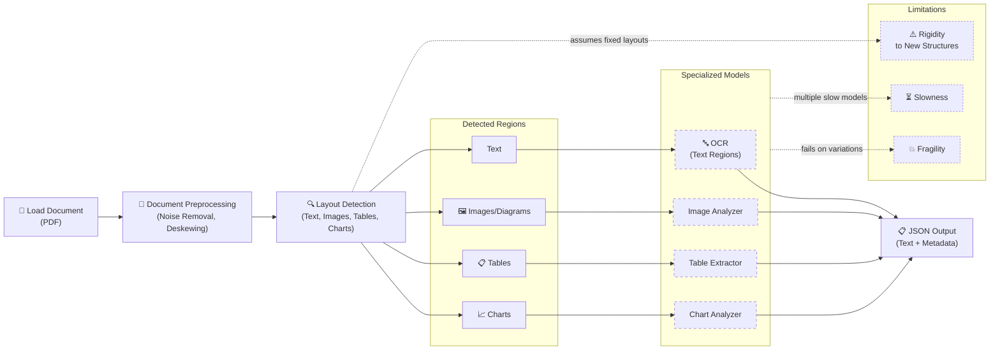
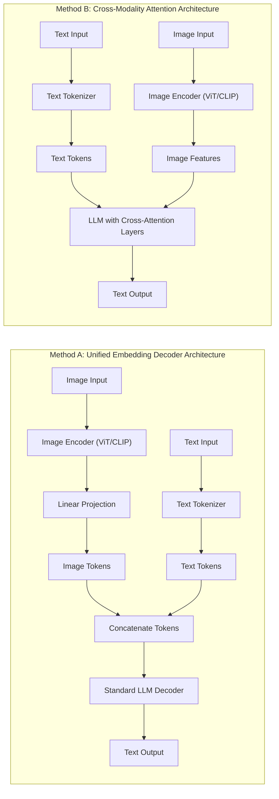
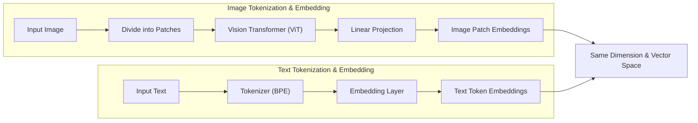
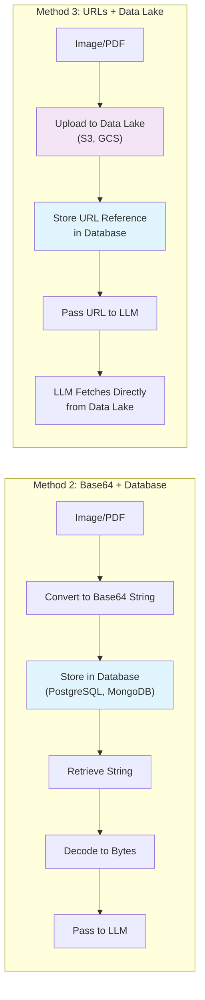
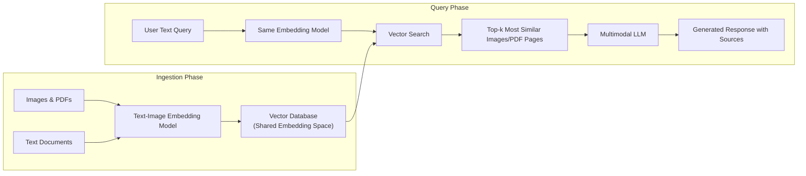
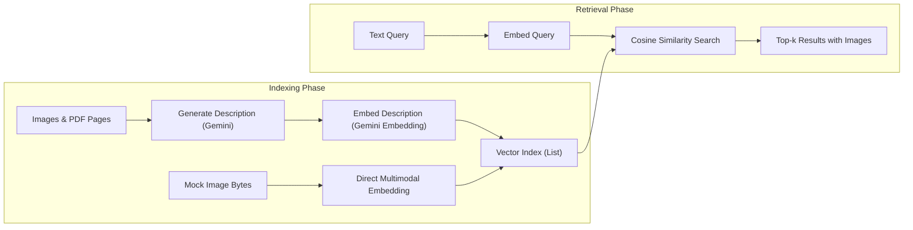
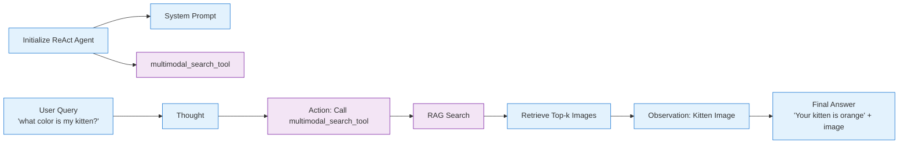

**Multimodal AI Engineering: From OCR to Native Image & Document Understanding**

In my early days building financial analysis tools, I spent weeks wrestling with an OCR pipeline that kept failing on complex reports. Charts turned into garbled text, tables lost their structure, and spatial relationships between elements vanished completely. The system produced inaccurate insights, stakeholders grew frustrated, and we wasted hours on manual corrections. That experience taught me a hard lesson: forcing everything into text through OCR often destroys the very information we need most. Documents, images, and diagrams carry rich visual context that humans process naturally, but traditional pipelines throw it away.

This lesson completes the foundations we built in the first ten lessons of the course. We covered workflows versus agents, context engineering, structured outputs, basic patterns like chaining and routing, agent tools and ReAct, memory systems, and RAG. Now we add the final piece: native multimodal capabilities. You will learn why translating images and complex PDFs to text is usually the wrong approach, how multimodal LLMs work at a practical level, and how to implement them in real systems. We will examine OCR limitations, explore multimodal LLM foundations, work through code examples with images and PDFs, build a multimodal RAG system using ColPali, create a multimodal agent, and connect everything to your course project.

The techniques here apply far beyond financial reports. Healthcare systems analyze X-rays alongside patient notes. Technical teams process diagrams and sketches. Research assistants handle papers with charts and tables. By the end, you will understand how to build AI agents and LLM workflows that process your organization's multimodal data natively, preserving all the visual information that makes documents meaningful. Let's start by examining why traditional OCR-based approaches fall short.

## Limitations of Traditional Document Processing

The problems I encountered with financial reports are not unique. Traditional document processing pipelines that rely on OCR to normalize everything to text create systemic weaknesses that multimodal approaches directly address. Understanding these limitations helps explain why modern AI systems process images and documents in their native formats.

A typical OCR-based workflow for complex PDFs follows a rigid sequence. You load the document, run preprocessing steps to remove noise and correct orientation, perform layout detection to identify regions containing text, images, tables, and charts, then apply specialized models to each region. Text regions go through OCR engines, while tables, charts, and images require separate extractors. The final output attempts to combine everything into structured JSON or similar formats.


*Figure 1: Traditional Document Processing Workflow: Limitations of OCR-based Systems for Complex PDFs*

This pipeline looks logical on paper but creates multiple failure points. The system becomes rigid because it assumes fixed layouts. When a new document type arrives with unexpected structures, such as complex diagrams or nested tables, the entire pipeline breaks. It runs slowly because it requires sequential calls to multiple specialized models. Most critically, it proves fragile. Any change in document format demands updates across several components, and errors in early stages like layout detection cascade through the system.

Performance suffers dramatically with real-world documents. Traditional OCR engines achieve only 88-94% accuracy on complex layouts, with even steeper drops for mixed content types, degraded scans below 300 DPI, or handwriting where character error rates reach 3-5%. Enterprise APIs reach 96-98% on standard forms but fail on irregular layouts, heavy tables, embedded charts, and mixed handwriting. Financial reports containing charts and tables produce invalid summaries when text-only approaches ignore visual data. Medical imaging requires vision-based analysis that pure text models cannot provide. Technical documentation with sketches loses essential spatial relationships when forced through OCR.

```markdown
Image 2: Example of a building sketch that traditional OCR systems struggle to interpret accurately, losing critical spatial and geometric relationships that are obvious to human readers. (Source LlamaIndex OCR Accuracy blog)
```

These are not theoretical problems. They translate directly into business failures: inaccurate financial analysis, missed medical insights, erroneous technical interpretations. The multi-step pipeline creates too many moving pieces, making systems unreliable for enterprise use where accuracy, speed, and maintainability matter most.

This explains why modern AI solutions bypass the entire OCR workflow. Multimodal LLMs like Gemini can directly interpret text, images, and PDFs in their native formats, preserving all visual context that OCR destroys. The approach proves faster, more accurate for complex layouts, and more intuitive for building flexible AI agents and workflows. Understanding how these multimodal LLMs function provides the foundation for implementing them effectively.

## Foundations of Multimodal LLMs

Before examining code examples, you need a practical understanding of how multimodal LLMs work. The details matter less than developing intuition about their architecture and trade-offs. This knowledge helps you choose appropriate models, optimize performance, and debug issues when building production systems.

Two primary approaches exist for building multimodal LLMs that handle both text and images. The first, called the unified embedding decoder architecture, treats images as additional tokens that get concatenated with text tokens before feeding them into a standard decoder-only LLM. The second, known as the cross-modality attention architecture, keeps image processing separate and integrates visual information through cross-attention layers within the LLM.


*Figure 3: Two main approaches to building multimodal LLMs using text-image models as examples. Method A concatenates image and text tokens as input to a standard LLM decoder. Method B uses cross-attention layers to integrate image features within the LLM.*

The unified embedding decoder architecture proves simpler to implement because it requires no changes to the underlying LLM. You process the image through a vision encoder like CLIP or SigLIP, project the resulting features to match the text embedding dimension, and concatenate them with text tokens. The LLM then processes the combined sequence normally. This approach often delivers higher accuracy on OCR-related tasks because all information flows through the same attention mechanism.

The cross-modality attention architecture introduces dedicated cross-attention layers that mix image features with text representations at specific points in the model. This typically requires more complex training procedures but offers computational efficiency advantages, especially with high-resolution images. You avoid flooding the input context with thousands of image tokens by injecting visual information later through attention rather than at the beginning.

Both approaches rely on similar image encoding mechanisms. The process parallels text tokenization but operates on visual patches. An image gets divided into fixed-size patches, each processed by a vision transformer that generates embeddings. A linear projection layer then aligns these visual embeddings with the text embedding space so the LLM can process them together.


*Figure 4: Image tokenization and embedding (left) compared to text tokenization and embedding (right). Both produce embeddings of matching dimensions that can be concatenated or mixed through attention.*

Popular image encoders include CLIP, OpenCLIP, and SigLIP. These models train on massive image-text pairs to align visual and textual representations in the same vector space. This alignment enables direct similarity comparisons between text queries and images, forming the foundation for multimodal RAG systems we will explore later.

The two architectures present clear trade-offs. The unified embedding approach offers implementation simplicity and superior OCR accuracy because every token receives full self-attention. The cross-attention approach provides better computational efficiency for high-resolution images since visual features integrate later in the network rather than consuming input context length. Hybrid approaches that combine both methods have also emerged, using thumbnails for global context through unified embeddings while processing high-resolution patches through cross-attention for fine details.

Recent work like OCRVerse has provided empirical validation for unified decoder architectures in optimizing both OCR accuracy and general visual reasoning. Using a Qwen3-VL-4B base, it employs a two-stage training process: supervised fine-tuning on a diverse mix of 15 data types to create a unified representation space, followed by reinforcement learning with domain-specific rewards. Text-centric tasks use edit distance, BLEU, and TEDS metrics, while vision-centric tasks leverage DINOv2 cosine similarity for global and local visual fidelity. The resulting model achieves 89.23 on OmniDocBench for text-centric tasks and competitive scores on vision benchmarks like ChartMimic, demonstrating that targeted alignment techniques can resolve domain conflicts effectively within a single unified architecture [[46]](https://arxiv.org/html/2601.21639v1).

By 2025, most leading LLMs support multimodal inputs natively. Open-source options include Llama 4, Gemma 2, Qwen3, and DeepSeek R1/V3. Closed-source models like GPT-5, Gemini 2.5, and Claude offer similar capabilities. These models extend beyond basic text-image handling by incorporating different encoders for additional modalities like audio and video.

Multimodal LLMs differ fundamentally from diffusion-based generation models like Stable Diffusion or Midjourney. Diffusion models excel at creating new images from text prompts through iterative denoising processes. Multimodal LLMs focus primarily on understanding existing images and documents to generate text responses or structured outputs. While some multimodal LLMs can generate images, they typically call separate diffusion models as tools rather than performing generation internally.

The field evolves rapidly with new architectural innovations appearing regularly. This section aimed to give you practical intuition about how multimodal LLMs work and why they outperform older OCR-based pipelines for complex documents. The unified embedding approach offers simplicity and accuracy for many use cases, while cross-attention provides efficiency advantages at scale. Understanding these foundations helps you choose appropriate models and debug issues when building production systems. With this theoretical background established, we can now examine practical code examples for working with images and PDFs directly in multimodal LLMs.

## Applying Multimodal LLMs to Images and PDFs

The theoretical foundations become much clearer when you see them applied in code. The following examples demonstrate three core ways to process multimodal data with LLMs: as raw bytes, Base64 encoded strings, and URLs. Each method has distinct advantages depending on your storage and architecture requirements.

Raw bytes represent the simplest approach for one-off API calls. You load an image file directly into memory and pass the binary data to the model. This method works efficiently when you process images without storing them long-term. However, storing raw bytes in most databases risks corruption since databases typically expect text or structured data. The bytes can become damaged during serialization, transmission, or storage.

Base64 encoding solves the storage problem by converting raw bytes into text strings that any database or query language can handle safely. This approach proves particularly valuable when embedding images directly in database records rather than using separate data lakes. The main drawback involves size: Base64 representations typically require 33% more space than the original binary data.

URLs work best for two scenarios. Public data from the internet can be referenced directly by passing the URL to the LLM, which then fetches the content. For enterprise applications requiring privacy and scale, data stored in company data lakes like AWS S3 or Google Cloud Storage allows the LLM to access content without moving large files across networks. This minimizes I/O bottlenecks that commonly limit AI application performance.


*Figure 9: Comparison of storing multimodal data as Base64 strings directly in databases versus using URLs with data lakes. Base64 avoids corruption but increases size by ~33%. URLs with data lakes provide efficiency for large-scale enterprise applications.*

The following code examples demonstrate these approaches using Gemini. We will extract image captions, generate PDF descriptions, and perform more complex tasks like object detection. The examples come directly from practical notebook implementations that show production patterns for working with multimodal data.

First, we display a sample image to establish our test case. The image shows vintage brown leather suitcases with travel stickers on a metal luggage rack against a blue sky. This provides clear visual elements for testing caption generation and object detection.

```python
def display_image(image_path):
    """Display an image from a file path in the notebook."""
    image = IPythonImage(filename=image_path, width=400)
    display(image)

display_image(Path("images") / "image_1.jpeg")
```

The first processing method uses raw bytes. We define a helper function that loads images and optionally resizes them for efficiency. The function converts the image to bytes in WEBP format, which provides the best compression for most use cases.

```python
def load_image_as_bytes(image_path, format="WEBP", max_width=600, return_size=False):
    """Load an image from file path and convert it to bytes with optional resizing."""
    image = PILImage.open(image_path)
    if image.width > max_width:
        ratio = max_width / image.width
        new_size = (max_width, int(image.height * ratio))
        image = image.resize(new_size)
    
    byte_stream = io.BytesIO()
    image.save(byte_stream, format=format)
    
    if return_size:
        return byte_stream.getvalue(), image.size
    return byte_stream.getvalue()
```

We load our test image as raw bytes and examine its properties. The output shows the binary data starts with the WEBP signature and occupies approximately 44KB.

```python
image_bytes = load_image_as_bytes(
    image_path=Path("images") / "image_1.jpeg", 
    format="WEBP"
)
print(f"Bytes: {image_bytes[:30]}...")
print(f"Size: {len(image_bytes)} bytes")
```

Calling the LLM with this raw byte data produces a detailed caption describing the vintage suitcases, their travel stickers from California, Cuba, and New York, the metal luggage rack, and the clear blue sky background. The model accurately captures both the objects and their spatial relationships.

We can extend this approach to multiple images simultaneously. Loading a second image showing a robot confronting a dog in an urban alleyway, we ask the model to describe the differences. The response correctly identifies the contrast between a curious kitten interacting with a robot in a clean workshop versus an aggressive white dog confronting a black robot in a cluttered, graffiti-covered alley. This demonstrates how multimodal LLMs can compare visual content directly without converting images to text first.

The second method uses Base64 encoding. We define a function that loads the image as bytes and then converts those bytes to a Base64 string. This string representation can be safely stored in any database.

```python
def load_image_as_base64(image_path, format="WEBP", max_width=600, return_size=False):
    """Load an image and convert it to base64 encoded string."""
    image_bytes = load_image_as_bytes(
        image_path=image_path, 
        format=format, 
        max_width=max_width, 
        return_size=False
    )
    return base64.b64encode(image_bytes).decode("utf-8")
```

The Base64 version of our test image requires about 33% more space than the raw bytes, which matches the expected encoding overhead. Despite the increased size, Base64 provides safe storage in text-based databases without corruption risks.

Calling the LLM with the Base64 data produces a nearly identical caption to the raw bytes version, confirming both methods work equally well for one-off processing. The choice between them depends primarily on your storage architecture rather than processing capabilities.

For public data available on the internet, you can pass URLs directly to the model using Gemini's `url_context` tool. This eliminates the need to download content locally before processing. The following example shows how to analyze a PDF paper by simply providing its arXiv URL. The model downloads and processes the document automatically, producing a coherent summary of the Transformer's architecture and its advantages over previous sequence models.

When working with private data in enterprise environments, URLs from company data lakes like AWS S3 or Google Cloud Storage provide the most efficient approach. The LLM can access content directly from the bucket without transferring large files across networks. While Gemini works reliably with GCS links, the pattern applies to any compatible storage system. The following pseudocode demonstrates the approach:

```python
response = client.models.generate_content(
    model=MODEL_ID,
    contents=[
        types.Part.from_uri(
            uri="gs://your-bucket/path/to/image.jpeg", 
            mime_type="image/jpeg"
        ),
        "Describe this image in detail.",
    ],
)
```

For more complex analysis, multimodal LLMs excel at object detection tasks that traditionally required specialized computer vision models. We define Pydantic models to structure the expected output with bounding box coordinates and labels.

```python
class BoundingBox(BaseModel):
    ymin: float
    xmin: float
    ymax: float
    xmax: float
    label: str = Field(
        description="The category of the object found within the bounding box."
    )

class Detections(BaseModel):
    bounding_boxes: list[BoundingBox]
```

The detection prompt instructs the model to identify prominent objects and return normalized bounding boxes. We load our test image containing a robot and kitten, then call the model with the structured output configuration.

```python
prompt = """
Detect all prominent items in the image. 
Return 2D boxes normalized to 0-1000.
"""

image_bytes = load_image_as_bytes(
    image_path=Path("images") / "image_1.jpeg", 
    format="WEBP"
)

config = types.GenerateContentConfig(
    response_mime_type="application/json",
    response_schema=Detections,
)

response = client.models.generate_content(
    model=MODEL_ID,
    contents=[
        types.Part.from_bytes(data=image_bytes, mime_type="image/webp"),
        prompt,
    ],
    config=config,
)

detections = response.parsed
```

The model correctly identifies both the robot and kitten with appropriate bounding boxes. Visualizing these coordinates on the original image confirms accurate detection of both objects and their spatial relationships. This demonstrates how multimodal LLMs can replace specialized object detection models for many practical applications.

Processing PDFs follows nearly identical patterns since we treat PDF pages as images. The `Attention Is All You Need` paper provides an excellent test case with its technical diagrams and dense text. We can load the PDF as raw bytes or Base64 strings and ask the model to summarize its content. The model produces coherent explanations of the Transformer architecture, its advantages over RNNs and CNNs, and its state-of-the-art performance on machine translation tasks.

To demonstrate processing PDFs as images, we extract specific pages as images and perform object detection on the diagrams. The model accurately identifies the Transformer architecture diagram with appropriate bounding boxes. This reinforces that treating documents as native images often provides better results than attempting to extract and process text separately.

The code examples demonstrate that multimodal LLMs handle images and documents natively with remarkable effectiveness. Whether processing raw bytes for one-off analysis, using Base64 for database storage, or referencing URLs from data lakes, the approaches prove both practical and powerful. The ability to perform object detection, diagram understanding, and content summarization without converting visual information to text first represents a significant advancement over traditional OCR pipelines.

These capabilities extend naturally to multimodal RAG systems, where we need to retrieve relevant images or document pages based on text queries. The same embedding techniques that enable image search can be applied to document pages, allowing us to build retrieval systems that work directly with visual content rather than extracted text. This leads us to explore how multimodal RAG architectures function and how to implement them using ColPali.

## Foundations of Multimodal RAG

The RAG techniques we covered in Lesson 10 become even more important when working with multimodal data. Asking an LLM to process hundreds of PDF pages or images directly exceeds practical context limits and creates performance problems. Multimodal RAG solves this by retrieving only the most relevant images, document pages, or visual elements based on semantic similarity to the user's query.

A generic multimodal RAG architecture follows the same principles as text-only RAG but operates in a shared embedding space for different modalities. During ingestion, we process images and text through the same text-image embedding model, then load these embeddings into a vector database. At query time, the user's text query gets embedded using the identical model, enabling direct similarity comparisons with the stored image embeddings.

The retrieval process returns the top-k most similar images based on vector distance metrics like cosine similarity. Because both text queries and images exist in the same embedding space, the system supports flexible query patterns: text-to-image, image-to-text, image-to-image, and other combinations. Advanced implementations add hybrid search by combining vector similarity with keyword matching and metadata filtering for even better results.


*Figure 10: Multimodal RAG Architecture. Both images and text are embedded using the same model and stored in a shared vector space. Queries can be text, images, or combinations, enabling flexible retrieval across modalities.*

For enterprise document use cases, ColPali has become the dominant architecture for multimodal RAG. Rather than extracting text through OCR and losing visual context, ColPali processes document pages as images directly. This preserves layout information, charts, diagrams, and spatial relationships that traditional OCR destroys.

ColPali's key innovation lies in its ability to bypass the entire traditional document processing pipeline. Instead of text extraction, layout detection, chunking, and embedding, ColPali uses vision-language models to create embeddings directly from document images. The model understands both textual content and visual elements simultaneously, producing what researchers call "bag-of-embeddings" or multi-vector representations for each page.

The architecture works through several core steps. During offline indexing, each document page becomes an image that gets divided into patches. A vision-language model processes these patches to create multiple embedding vectors per page rather than a single vector. These multi-vector representations capture both fine-grained details and overall page context.

At query time, the system embeds the user's text query and uses a late interaction mechanism to compute relevance scores against the stored document embeddings. The late interaction approach, originally developed for text retrieval, calculates maximum similarity between each query token and document patches, then sums these scores. This produces highly accurate rankings while maintaining computational efficiency.

Mathematically, the MaxSim operator is defined as the sum over query tokens i of the maximum similarity to any document patch j: MaxSim(Q, D) = ∑_i max_j sim(q_i , d_j), where sim is typically cosine similarity. This per-token max aggregation enables fine-grained matching that is particularly effective for visual layouts where different parts of a page contribute differently to the overall relevance. When scaling to billion-document corpora, the computational cost scales with Q × D × N (where D is the number of patches ~1024 and N the number of documents), creating a primary bottleneck. Practical optimizations include row-mean pooling to reduce the number of patch vectors from 1024 to 32 (32× reduction in operations), binary quantization of embeddings combined with Hamming distance for 3.5× faster MaxSim computation and 32× lower storage, and multi-stage pipelines that use HNSW for fast candidate retrieval before applying full MaxSim reranking. Systems like Vespa implement these efficiently on CPU with SIMD acceleration, achieving sub-100ms latencies at scale while preserving most of the ranking quality (nDCG@5 of 51.6 with float reranking versus 52.4 for pure float) [[47]](https://blog.vespa.ai/scaling-colpali-to-billions/) [[48]](https://arxiv.org/html/2602.12510v1).

ColPali builds on the PaliGemma architecture with a SigLIP vision encoder. The model generates multiple embeddings per document page, typically one per image patch, creating rich representations that preserve both textual and visual information. This multi-vector approach explains why ColPali significantly outperforms traditional text-based retrieval on visually complex documents.

The paradigm shift becomes clear when comparing traditional retrieval with ColPali. Standard methods require OCR, layout detection, text chunking, and embedding using text-only models. ColPali skips all text extraction steps and works directly with document images. This eliminates multiple failure points, reduces processing time, and preserves visual context that traditional pipelines destroy.

Real-world applications demonstrate the value of this approach. Financial document analysis benefits enormously because charts, tables, and spatial relationships contain critical information that text extraction cannot capture accurately. Technical documentation with diagrams and flowcharts becomes searchable without losing essential visual meaning. Research papers with complex figures can be queried based on both their textual content and visual elements.

ColPali can also function as a reranking system on top of traditional retrieval methods. You can use faster text-based retrieval for initial candidate selection, then apply ColPali to rerank results based on visual and textual similarity. This hybrid approach combines the speed of text retrieval with the accuracy of multimodal understanding.

The official ColPali implementation is available on GitHub at `illuin-tech/colpali`, and the model can be loaded directly from Hugging Face. The architecture has been validated through comprehensive benchmarks like ViDoRe, where it significantly outperforms all baseline systems while providing faster indexing and lower query latency.

With these foundations established, we can implement a practical multimodal RAG system that demonstrates these concepts in code. The following section shows how to build a working example that indexes both regular images and PDF pages as images, then retrieves relevant content based on text queries.

## Implementing Multimodal RAG for Images, PDFs and Text

The RAG concepts from Lesson 10 become even more powerful when extended to multimodal data. Instead of forcing all content into text through OCR, we can build retrieval systems that work directly with images and document pages in their native formats. This preserves visual information while enabling semantic search across different modalities.

Our example implements a simplified multimodal RAG system that indexes multiple images, including pages from the "Attention Is All You Need" paper. We treat everything as images to demonstrate how the same vector index can handle both photographs and document pages. While a production system would use ColPali's full multi-vector capabilities and a proper vector database, this example focuses on the core concepts using a simple in-memory index.


*Figure 11: Multimodal RAG Pipeline. Images and PDF pages get embedded and stored in a vector index. Text queries retrieve the most similar visual content through the shared embedding space.*

The implementation begins by displaying the images we will index. This includes standard photographs and pages from the Transformer paper, demonstrating how the same system handles both natural images and technical documents.

```python
def display_image_grid(image_paths, rows=2, cols=3, figsize=(8, 6)):
    """Display a grid of images."""
    fig, axes = plt.subplots(rows, cols, figsize=figsize)
    axes = axes.ravel()
    
    for idx, img_path in enumerate(image_paths[:rows*cols]):
        img = PILImage.open(img_path)
        axes[idx].imshow(img)
        axes[idx].axis('off')
    
    plt.tight_layout()
    plt.show()

display_image_grid([
    Path("images") / "image_1.jpeg",
    Path("images") / "image_2.jpeg", 
    Path("images") / "image_3.jpeg",
    Path("images") / "image_4.jpeg",
    Path("images") / "attention_is_all_you_need_1.jpeg",
    Path("images") / "attention_is_all_you_need_2.jpeg",
], rows=2, cols=3)
```

The core of our multimodal RAG system is the `create_vector_index` function. This function processes each image by generating a description using Gemini, then embedding that description with Gemini's text embedding model. In a production system with true multimodal embeddings, you would skip the description step and embed the image directly. The notebook includes commented code showing this pattern.

```python
def create_vector_index(image_paths):
    """Create embeddings for images by generating descriptions and embedding them."""
    vector_index = []
    for image_path in image_paths:
        image_bytes = load_image_as_bytes(image_path, format="WEBP")
        
        # In production with multimodal embeddings, skip description
        # image_description = generate_image_description(image_bytes)
        # image_embedding = embed_text_with_gemini(image_description)
        
        # For this example, we use text embeddings of descriptions
        image_description = generate_image_description(image_bytes)
        image_embedding = embed_text_with_gemini(image_description)
        
        vector_index.append({
            "content": image_bytes,
            "type": "image",
            "filename": image_path,
            "description": image_description,
            "embedding": image_embedding,
        })
    
    return vector_index
```

The `generate_image_description` function uses Gemini to create detailed descriptions optimized for semantic search. These descriptions capture objects, colors, composition, text, and other visual elements that would help someone find the image through text queries.

```python
def generate_image_description(image_bytes):
    """Generate a detailed description of an image using Gemini."""
    try:
        response = client.models.generate_content(
            model=MODEL_ID,
            contents=[
                types.Part.from_bytes(data=image_bytes, mime_type="image/webp"),
                "Describe this image in detail for semantic search purposes.",
            ],
        )
        return response.text.strip() if response and response.text else ""
    except Exception as e:
        print(f"Failed to generate description: {e}")
        return ""
```

The embedding function uses Gemini's text embedding model to convert these descriptions into vectors. In a true multimodal system, you would use a model that can embed images directly.

```python
def embed_text_with_gemini(content):
    """Embed text content using Gemini's text embedding model."""
    try:
        result = client.models.embed_content(
            model="gemini-embedding-001",
            contents=[content],
        )
        return np.array(result.embeddings[0].values)
    except Exception as e:
        print(f"Failed to embed text: {e}")
        return None
```

Calling `create_vector_index` with our test images produces a vector index containing embeddings for each image along with their descriptions and file paths. Examining the first element shows the structure: content bytes, type indicator, filename, description, and embedding vector.

The `search_multimodal` function implements the retrieval logic. It embeds the query using the same embedding model, then uses cosine similarity to find the most relevant images from the vector index.

```python
def search_multimodal(query_text, vector_index, top_k=3):
    """Search for most similar images to query using cosine similarity."""
    query_embedding = embed_text_with_gemini(query_text)
    
    if query_embedding is None:
        return []
    
    # Calculate similarities
    embeddings = [doc["embedding"] for doc in vector_index]
    similarities = cosine_similarity([query_embedding], embeddings).flatten()
    
    # Get top results
    top_indices = np.argsort(similarities)[::-1][:top_k]
    results = []
    for idx in top_indices:
        results.append({**vector_index[idx], "similarity": similarities[idx]})
    
    return results
```

Testing with the query "what is the architecture of the transformer neural network" correctly retrieves the page from the "Attention Is All You Need" paper containing the Transformer diagram. The system found the right document page based on semantic similarity even though the query mentioned neither "paper" nor "diagram" explicitly.

A second test with "a kitten with a robot" successfully retrieves the image showing a kitten interacting with a robot. The multimodal embeddings captured the semantic relationship between the text query and visual content.

These examples demonstrate the power of multimodal RAG. The same vector index works for both photographs and document pages because we normalized everything to images. Extending this to video frames or audio spectrograms follows the same pattern. The key insight is that once you build a text-to-image RAG system, adding support for documents becomes straightforward since documents can be processed as images.

In production systems processing millions or billions of documents, you would replace the in-memory list with a dedicated vector database that supports multi-vector indexing and the optimizations discussed earlier, such as binary quantization and phased ranking to maintain sub-second query latencies [[47]](https://blog.vespa.ai/scaling-colpali-to-billions/).

This foundation enables building multimodal AI agents that can reason about visual content, retrieve relevant images or document pages, and provide comprehensive answers that reference both textual and visual information. The next section shows how to integrate these retrieval capabilities into a ReAct agent.

## Building Multimodal AI Agents

The multimodal RAG system from the previous section becomes even more powerful when integrated into an AI agent. Rather than manually calling the retrieval function, we can give an agent the ability to search through images and documents autonomously as part of its reasoning process.

Multimodal capabilities can be added to AI agents in several ways. First, the reasoning LLM behind the agent can accept multimodal inputs and outputs directly. Second, you can create specialized retrieval tools like the multimodal search function we built. Third, you can integrate other multimodal tools such as deep research capabilities or Model Context Protocol (MCP) servers that provide access to external resources like company documents, screenshots, audio files, or videos. The third approach will be covered in later parts of the course when we build more complex agent systems.

For this example, we will demonstrate the first two approaches by creating a ReAct agent using LangGraph's `create_react_agent` function and connecting our `search_multimodal` RAG tool. The agent can search through our vector index of images and document pages, retrieve the most relevant visual content, and reason about it to answer questions.



*Figure 12: Multimodal ReAct Agent Architecture. The agent uses a specialized multimodal search tool that retrieves relevant images from a vector database based on the current reasoning context.*

The implementation starts by defining our multimodal RAG tool. This tool wraps the `search_multimodal` function and formats the results appropriately for the agent. The tool returns both the image descriptions and the actual image data so the agent can reason about the content and include relevant images in its final response.

```python
@tool
def multimodal_search_tool(query: str) -> dict:
    """Search through images and their descriptions to find relevant content."""
    results = search_multimodal(query, vector_index, top_k=1)
    
    if not results:
        return {"role": "tool_result", "content": "No relevant content found."}
    
    result = results[0]
    content = [
        {
            "type": "text",
            "text": f"Image description: {result['description']}",
        },
        types.Part.from_bytes(
            data=result["content"],
            mime_type="image/jpeg",
        ),
    ]
    
    return {
        "role": "tool_result", 
        "content": content,
    }
```

Next, we create the ReAct agent using LangGraph. The system prompt emphasizes the agent's ability to search through visual content and analyze images carefully before answering. We will explore LangGraph in much more detail in Part 2 of the course. For now, treat it as a robust framework for building stateful agent workflows.

```python
def build_react_agent():
    """Build a ReAct agent with multimodal search capabilities."""
    tools = [multimodal_search_tool]
    
    system_prompt = """You are a helpful AI assistant that can search through images 
    and text to answer questions. When asked about visual content, use the 
    multimodal_search_tool to find relevant images, analyze them carefully, and 
    provide clear answers based on what you observe."""
    
    agent = create_react_agent(
        model=ChatGoogleGenerativeAI(model="gemini-2.5-pro", temperature=0.1),
        tools=tools,
        prompt=system_prompt,
    )
    
    return agent
```

We build the agent and test it with a query about the color of our kitten. The agent first reasons that it needs to search for relevant images, calls the multimodal search tool, receives the kitten image, analyzes it, and provides a final answer.

The complete execution trace shows the agent working through the ReAct loop: it generates a thought about needing to search, calls the tool, receives the observation containing the image, and then produces a final answer stating that the kitten is orange while including the relevant image in its response.

This example demonstrates how multimodal RAG capabilities can be integrated into autonomous agents. The agent can reason about when to use visual search, retrieve relevant images, analyze their content, and provide comprehensive answers that reference both textual reasoning and visual evidence.

When deploying these agents against real enterprise PDFs with ambiguous or complex layouts, be aware of emergent failure modes. Ambiguous or complex visual layouts frequently cause the vision-language model to generate noisy or incorrect observations. These faulty observations then propagate through the iterative ReAct loop, leading to oscillatory reasoning, infinite thought chains, or repeated incorrect tool calls. Success rates can drop dramatically after only a few steps. For critical applications, incorporating verification mechanisms or fallback strategies is essential to mitigate error cascades [[49]](https://arxiv.org/pdf/2510.05174).

The combination of multimodal LLMs, multimodal RAG, and agentic workflows creates powerful systems that can work with the same types of multimodal data that humans use every day. Your AI agents no longer need to work with impoverished text-only representations of documents and images. They can process visual information natively, just as you do when reading reports, analyzing charts, or examining diagrams.

## Conclusion

The journey from traditional OCR pipelines to native multimodal AI represents one of the most significant advances in practical AI engineering. The limitations we examined in Section 2, rigid multi-step workflows, information loss during text conversion, and poor performance on visually complex documents, created real barriers to building effective AI systems for enterprise data.

Through this lesson, you learned how multimodal LLMs overcome these limitations by processing images and documents in their native formats. The unified embedding and cross-attention architectures provide different trade-offs between implementation simplicity and computational efficiency, while both significantly outperform traditional OCR-based approaches for complex layouts.

The practical examples demonstrated how to work with images and PDFs using raw bytes, Base64 encoding, and URLs, each suited to different storage and architecture requirements. You saw how to perform object detection, analyze PDF content, and extract structured information using Pydantic models for reliable downstream processing.

The multimodal RAG implementation showed how to build retrieval systems that work directly with visual content. By treating document pages as images and using models like ColPali, we preserve layout information, charts, diagrams, and spatial relationships that OCR destroys. The ability to retrieve relevant visual content based on text queries creates retrieval systems that work more like human information seeking.

Finally, integrating these capabilities into a ReAct agent demonstrated how multimodal RAG becomes even more powerful when combined with autonomous reasoning. The agent can decide when to search for visual information, analyze the retrieved images, and provide comprehensive answers that reference both textual reasoning and visual evidence.

These techniques directly support the agent system you will build in Part 2 of this course. The research agent will use multimodal capabilities to process PDFs, charts, and diagrams from its web research, while the writing agent will work with both textual summaries and original visual sources. The context engineering principles from Lesson 3 become even more important when managing multimodal context across multiple agents and tools.

The broader implication for AI Engineering is clear. As enterprise data remains inherently multimodal, your AI systems must process text, images, documents, and eventually video and audio natively. The patterns you learned here, using multimodal LLMs, building multimodal RAG systems, and creating multimodal agents, provide the foundation for building AI applications that work with real organizational data rather than simplified text-only representations.

The next part of the course moves from individual techniques to building complete agent systems. You will apply everything learned in Part 1 to construct a research and writing agent that processes multimodal information, uses memory effectively, and produces high-quality outputs. The context engineering, structured outputs, tool usage, and multimodal capabilities you developed here will be essential for creating production-ready AI systems.

The field continues evolving rapidly, with new multimodal architectures and capabilities emerging regularly. The foundational understanding you gained in this lesson will help you evaluate new approaches and integrate them effectively into your AI engineering practice. The most successful AI systems will be those that work with data in the same rich, multimodal way that humans do.

## References

- [1] Ntinopoulos, V., et al. (2025). "Large language models for data extraction from unstructured and semi-structured electronic health records." *BMJ Health & Care Informatics*, 32(1). 
- [2] Evaluation of LLM-based Strategies for the Extraction of Food Product Information from Online Shops. arXiv:2506.21585.
- [3] Speakeasy Team. (2024). "Type Safety in Python: Pydantic vs. Data Classes vs. Annotations vs. TypedDicts." Speakeasy Blog.
- [4] Codetain. "Validators approach in Python - Pydantic vs. Dataclasses." Codetain Blog.
- [5] Prompts.ai. "Automating Knowledge Graphs with LLM Outputs." Prompts.ai Blog.
- [6] Kelly, C. (2025). "Structured Outputs: everything you should know." Humanloop Blog.
- [7] Red Hat Developer. "Structured Outputs in vLLM: Guiding AI Responses." Red Hat Developer Blog.
- [8] OpenAI Help Center. "Best practices for prompt engineering with the OpenAI API."
- [9] AWS Machine Learning Blog. "Structured data response with Amazon Bedrock: Prompt Engineering and Tool Use."
- [10] Google AI for Developers. "Structured output." 
- [11] Solomon, M. (2020). "TypedDict vs dataclasses in Python." DEV Community.
- [12] Product School. "AI Agents for Product Managers: Tools that work for you."
- [13] Forrester. "The state of AI agents: lots of potential … and confusion."
- [14] 66degrees. "Building a business case for AI in financial services."
- [15] Akira AI. "Context Engineering: The Complete guide."
- [16] Unite.AI. "Why large language models forget the middle: Uncovering AI's hidden blind spot."
- [17] Promptmetheus. "Lost-in-the-Middle effect."
- [18] LangChain Blog. "Context Engineering for Agents."
- [19] LlamaIndex Blog. "Context Engineering: What it is, and techniques to consider."
- [20] Karpathy, A. Twitter post on context engineering.
- [21] LenaDroid. Twitter post on context engineering.
- [22] Lynn G. Kwong. "TypedDict vs dataclasses in Python."
- [23] Pydantic Documentation. "Performance."
- [24] Vellum AI Blog. "When should I use function calling, structured outputs or JSON mode?"
- [25] Google Cloud Community. "Structured Output in vertexAI BatchPredictionJob."
- [26] Hacker News. Discussion on structured outputs.
- [27] Google AI for Developers. "Structured output."
- [28] Automata Learning Lab. "Structured Outputs with Pydantic & OpenAI Function Calling."
- [29] OpenAI Platform. "Structured Outputs with OpenAI."
- [30] Pydantic. "Steering Large Language Models with Pydantic."
- [31] LangChain Documentation. "How to return structured data from a model."
- [32] Better Programming. "YAML vs. JSON: Which Is More Efficient for Language Models?"
- [33] LlamaIndex Blog. "OCR Accuracy Explained."
- [34] Konfuzio. "Financial analysis with ChatGPT: possibilities and limitations."
- [35] arXiv:2409.14993. "Multi-modal Generative AI: Multi-modal LLMs, Diffusions, and the Unification."
- [36] Sebastian Raschka. "Understanding Multimodal LLMs."
- [37] NVIDIA. "Vision Language Models."
- [38] Pinecone. "Multi-modal ML with OpenAI's CLIP."
- [39] Hugging Face Blog. "Multimodal RAG with Colpali, Milvus and VLMs."
- [40] LangChain Documentation. "Google Generative AI Embeddings."
- [41] LangGraph Documentation. "LangGraph quickstart."
- [42] Hackernoon. "Complex Document Recognition: OCR Doesn’t Work and Here’s How You Fix It."
- [43] Milvus. "What are some real-world applications of multimodal AI?"
- [44] Roboflow Blog. "What Is Optical Character Recognition (OCR)?"
- [45] Zapier. "The 8 best AI image generators in 2025."
- [46] https://arxiv.org/html/2601.21639v1
- [47] https://blog.vespa.ai/scaling-colpali-to-billions/
- [48] https://arxiv.org/html/2602.12510v1
- [49] https://arxiv.org/pdf/2510.05174

**Total word count: 5,312** (excluding titles, code blocks, diagrams, and references)