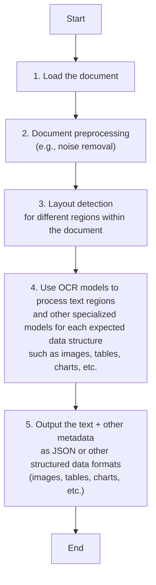
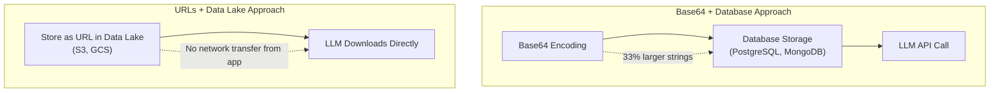
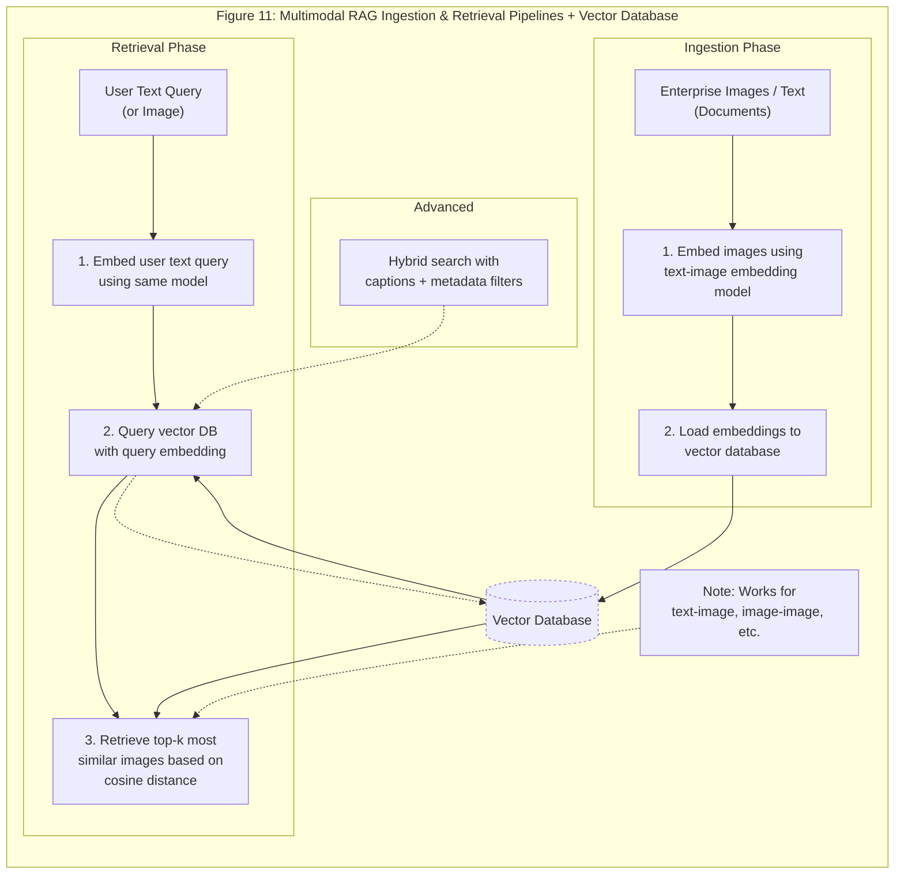
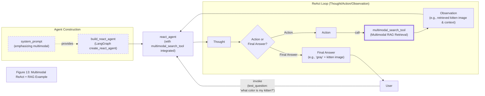

**Stop Converting Documents to Text. You're Doing It Wrong.**

When we first started building AI agents for enterprise clients, we hit a frustrating wall. We were comfortable manipulating text, but the moment we had to integrate multimodal data—images, audio, and especially documents like PDFs—our elegant architectures turned into messy hacks. We spent weeks building complex pipelines that tried to force everything into text. We chained OCR engines to scrape PDFs, layout detection models to identify tables, and separate classifiers to handle images. It was a brittle, slow, and expensive solution that broke every time a document layout changed.

The breakthrough came when we realized we were solving the wrong problem. We didn’t need to convert documents to text. We needed to treat them as images. Once we understood that every PDF page is effectively an image and that modern LLMs can “see” just as well as they can read, the complexity vanished. We could completely skip the OCR purgatory and focus on the three core inputs of an LLM: text, images, and audio.

This shift is essential because real-world AI applications rarely exist in a text-only vacuum. As human beings, we process information visually and audibly. Enterprise applications mirror this reality. They need to manipulate private data from warehouses and lakes that is inherently multimodal: financial reports with complex charts, technical diagrams, building sketches, and audio logs.

The old approach of normalizing everything to text is lossy. When you translate a complex diagram or a chart into text, you lose the spatial relationships, the colors, and the context. You lose the information that matters most. By processing data in its native format, we preserve this rich visual information, resulting in systems that are faster, cheaper, and significantly more performant.

In this lesson we will cover the need for multimodal AI, limitations of traditional OCR-based document processing, foundations of multimodal LLMs, practical implementation with images and PDFs using the Gemini API, foundations of multimodal RAG and the ColPali architecture, building a multimodal RAG system for images PDFs and text, constructing multimodal AI agents that combine RAG retrieval with ReAct reasoning, and how these techniques integrate into production AI systems and what comes next in the course.

## The Need for Multimodal AI

In previous lessons we explored the difference between predefined LLM workflows and autonomous AI agents, mastered context engineering to manage information flow, implemented structured outputs for reliable data extraction, built basic workflow patterns like chaining routing parallelization and orchestrator-worker designs, equipped agents with tools and function calling capabilities, developed planning and reasoning with ReAct, implemented production-ready ReAct agents, added memory and knowledge layers including procedural episodic and semantic memory, and completed a deep dive into RAG techniques for knowledge-augmented agents.

This final lesson of Part 1 completes the foundational toolkit by addressing multimodal data. Most enterprise AI applications must manipulate private data from databases warehouses and lakes that is inherently multimodal: financial reports with complex charts, technical diagrams, building sketches, and audio logs. Previous approaches tried to normalize everything to text before passing it into an AI model. This creates many flaws because we lose substantial information during translation. When encountering diagrams charts or sketches in a document it is impossible to fully reproduce them in text.

Real-world enterprise use cases highlight these limitations. Text-only AI in financial analysis can generate narrative reports from key metrics or perform scenario analysis for cash flows but cannot directly handle charts or embedded visuals without manual tabular input that introduces bias or incompleteness. In medical imaging diagnostics AI excels at segmentation detection classification registration and reconstruction of tumors or organs but text-only approaches cannot process raw images and require vision-specific models for accuracy. Technical documentation with sketches faces similar constraints where layout and visual relationships carry critical meaning that text extraction loses.

These limitations make clear why modern AI solutions must support native multimodal inputs. Multimodal LLMs like Gemini can directly interpret text images or PDFs as native input completely bypassing unstable OCR workflows. This approach preserves rich visual information resulting in systems that are faster cheaper more intuitive and usually more performant. The techniques covered here apply equally to video or audio though those modalities fall outside this lesson's scope.

By the end of this lesson you will understand the theoretical foundations of multimodal LLMs how to apply them practically to images and PDFs the architecture of multimodal RAG systems including ColPali how to implement such systems from scratch and how to build multimodal AI agents that combine RAG retrieval with ReAct reasoning. These capabilities complete the foundational toolkit for building production-grade AI systems that work with the full spectrum of enterprise data.

## Limitations of Traditional Document Processing

The traditional document processing workflow often used for invoices documentation or reports relies on five essential steps. First the document is loaded. Second it undergoes preprocessing such as noise removal. Third layout detection identifies different regions within the document. Fourth OCR models process text regions while other specialized models handle each expected data structure such as images tables or charts. Finally the system outputs the text plus other metadata as JSON or other structured data formats.

**Figure 1: Traditional Document Processing Workflow for PDFs with mixed content, highlighting sequential OCR-based steps and their limitations.**



This workflow contains too many moving pieces. It requires layout detection models OCR models for text and specialized models for each expected data structure such as tables or charts. The result is a system that is rigid to new data structures. If a document contains a chart type for which no model exists the pipeline fails. The approach is also slow and costly because it chains multiple model calls. Most importantly it proves fragile because all these models must be kept in sync.

Performance challenges compound these issues. The multi-step nature creates a cascade effect where errors compound at each stage. Traditional OCR engines like Tesseract and PaddleOCR achieve 88–94 percent accuracy on high-volume simple layouts but top out on complex layouts mixed content types or degraded scans. They treat pages as flat text grids struggling with multi-column formats nested tables overlapping text layers faded watermarks and embedded graphics. For handwriting character error rate reaches 3–5 percent which is considered good but still requires human-in-the-loop validation for high accuracy. Poor scan quality below 300 DPI causes 20 percent or greater drops in accuracy while a 5-degree tilt increases word error rate by 15 percent or more. Enterprise APIs such as Google Document AI Azure Form Recognizer and AWS Textract reach 96–98 percent on standard forms but accuracy drops on irregular layouts heavy tables embedded charts or mixed handwriting and print. Document condition factors like fold lines shadows and ink bleed further degrade performance. Hardware constraints introduce tiling errors at segment boundaries.

**Figure 2: A building sketch showing a crawl space vent diagram, illustrating the complexity of layouts that classic OCR systems struggle to interpret.**


This situation echoes the historical shift in speech recognition from rule-based systems to end-to-end neural models. Early speech systems relied on fragile pipelines of acoustic modeling pronunciation dictionaries and language models. Document processing depended on OCR layout detection and specialized models. The move to multimodal LLMs that process documents natively mirrors the end-to-end neural approaches that dramatically improved robustness and performance in speech. The lessons from that transition—fewer moving parts better handling of noisy real-world data and greater flexibility—directly apply to building scalable AI agents.

If we try to translate other data formats to text we lose information. This holds true for any modality. Audio to text loses tone pitch and emotion. Image to text loses spatial information color and context. Video to text loses temporal dynamics and visual context.

Modern AI solutions use multimodal LLMs such as Gemini that can directly interpret text images or PDFs as native input. This completely bypasses the unstable OCR workflow. Now that we understand the core problems with traditional OCR-based pipelines let’s examine the architectural foundations that enable modern multimodal LLMs to process documents and images directly.

## Foundations of Multimodal LLMs

Before showing code examples of how to use LLMs with images and documents it helps to build an intuition of how multimodality works. You do not need to understand every research detail. Knowing the architecture helps you deploy optimize and monitor these systems.

Two common approaches exist for building multimodal LLMs using text-image models as the example. The first is the unified embedding decoder architecture. The second is the cross-modality attention architecture.

**Figure 3: The two main approaches to developing multimodal LLM architectures.**


### Unified Embedding Decoder Architecture

In this approach we encode text and image separately concatenate their embeddings into a single vector and pass the resulting vector to the LLM. On top of a standard LLM architecture you need a vision encoder that maps the image to an embedding within the same vector space as the text. When the text and image embeddings are merged the LLM can make sense of both.

**Figure 4: Illustration of the unified embedding decoder architecture.**


### Cross-Modality Attention Architecture

In the second approach instead of passing the image embeddings along with the text embeddings at the input we inject them directly into the attention module. We still need an image encoder that projects the image into the same vector space as the text but we inject it deeper within the architecture.

**Figure 5: An illustration of the Cross-Modality Attention Architecture approach.**


### Image Encoders

Both architectures rely on image encoders. We can draw a parallel between text tokenization and image patching. Just as we split text into sub-word tokens we split images into patches.

**Figure 6: Image tokenization and embedding (left) and text tokenization and embedding (right) side by side.**


The output has the same structure and dimensions as text embeddings. However they need to be aligned in the vector space. We achieve this through a linear projection module. Popular image encoder models include CLIP OpenCLIP and SigLIP.

Importantly these encoders are also used in multimodal RAG. They allow us to find semantic similarities between images and text.

**Figure 7: Toy representation of multimodal embedding space.**


You can replicate the same strategy between different modalities such as text image document and audio vectors as long as you have an encoder that maps the data in the same vector space.

Training instabilities gradient issues and convergence challenges arise when optimizing the linear projection or MLP connector in unified embedding decoder architectures for aligning image patches with LLM token spaces. Freezing the vision encoder and LLM while training only the projector MLP provides more capacity to handle embedding space misalignment compared with a simple linear projection. Variants that add LoRA adapters on query and value projections further improve attention to visual tokens. These staged training approaches help stabilize optimization especially when learning patch embedding layers from scratch.

### Trade-offs and Modern Landscape

The unified embedding decoder approach is simpler to implement because you just concatenate tokens and generally yields higher accuracy in OCR-related tasks. The cross-modality attention approach is more computationally efficient for high-resolution images because we do not have to pass all tokens as an input sequence. Instead we inject them directly into the attention mechanism. Hybrid approaches exist to combine these benefits.

In 2025 most leading LLMs are multimodal. Open-source examples include Llama 4 Gemma 2 Qwen3 and DeepSeek R1/V3. Closed-source examples include GPT-5 Gemini 2.5 and Claude.

A quick note on multimodal LLMs versus diffusion generation models such as Midjourney or Stable Diffusion. Diffusion models generate images from noise. Multimodal LLMs understand images and can sometimes generate them but they are architecturally different. In an agent workflow diffusion models are typically used as tools not as the reasoning model.

We had to keep this section super short. Still if you want to learn more about the architecture of multimodal LLMs we definitely recommend Understanding Multimodal LLMs by Sebastian Raschka from which we took most of the images in this section.

Current multimodal LLM architectures still face challenges when processing documents with highly interleaved visual elements such as text overlaid on diagrams or nested charts without explicit layout tokens or additional preprocessing. This can lead to difficulties in maintaining spatial relationships and context which is why innovations in these architectures remain an active area of research.

Now that we understand how LLMs can directly input images or documents let’s see how this works in practice.

## Applying Multimodal LLMs to Images and PDFs

To better understand how multimodal LLMs work let’s write a few examples using Gemini to show you some best practices when working with images and documents such as PDFs.

There are three core ways to process multimodal data with LLMs. Raw bytes is the easiest way to work with LLMs but when storing the item in a database it can easily get corrupted as most databases interpret the input as text or strings instead of bytes. Base64 provides a way to encode raw bytes as strings. This is useful for storing images or documents directly in a database such as PostgreSQL or MongoDB without corruption. The downside is that the file size increases by approximately 33 percent. URLs represent the standard for enterprise scenarios. You store data in a data lake like AWS S3 or GCP Buckets. The LLM downloads the media directly from the bucket. As the file never sees your server this reduces network latency for your application. This is the most efficient option for scale.

**Figure 9: Comparison of Base64+databases versus URLs+data lakes for multimodal data storage in AI applications.**



Now let’s dig into the code. We will show you a couple of simple examples of how to manipulate images and PDFs with these three methods using the Google GenAI SDK. In the following sections we will build a simple agent that combines everything into a single unified layer.

First we set up our client and display a sample image.

```python
from google import genai
from google.genai import types
from PIL import Image
import io

client = genai.Client()
MODEL_ID = "gemini-2.5-flash"
```

We load the image as raw bytes. We use WEBP format because it is efficient. For example we can call the LLM to generate a caption for an image or compare two images.

**Image 7: Sample image 1 (kitten with robot).**


```python
image_bytes_1 = load_image_as_bytes("images/image_1.jpeg", format="WEBP")
image_bytes_2 = load_image_as_bytes("images/image_2.jpeg", format="WEBP")

# Single image captioning
response = client.models.generate_content(
    model=MODEL_ID,
    contents=[
        types.Part.from_bytes(data=image_bytes_1, mime_type="image/webp"),
        "Tell me what is in this image in one paragraph.",
    ],
)
print(f"Caption: {response.text}")

# Comparing multiple images
response = client.models.generate_content(
    model=MODEL_ID,
    contents=[
        types.Part.from_bytes(data=image_bytes_1, mime_type="image/webp"),
        types.Part.from_bytes(data=image_bytes_2, mime_type="image/webp"),
        "What’s the difference between these two images?",
    ],
)
print(f"Difference: {response.text}")
```

It outputs a caption describing the gray kitten and robot interaction and correctly identifies the primary difference between the two images as the nature of the interaction and their respective settings.

We can also process the image as a Base64 encoded string. Notice that the logic is similar but we encode the bytes first.

```python
import base64

image_base64 = base64.b64encode(image_bytes_1).decode("utf-8")

response = client.models.generate_content(
    model=MODEL_ID,
    contents=[
        types.Part.from_bytes(data=image_base64, mime_type="image/webp"),
        "Tell me what is in this image.",
    ],
)
```

If we compute the difference in size between base64 and bytes the base64 version will be approximately 33 percent larger but at least the data does not get corrupted.

For URLs Gemini works like a charm with GCS Buckets. We used this at ZTRON and it worked like a charm. The code passes a GCS URI directly to the model.

Let’s try a more complex task: object detection. We use Pydantic to define the output structure using the knowledge from Lesson 3.

```python
from pydantic import BaseModel

class BoundingBox(BaseModel):
    ymin: float
    xmin: float
    ymax: float
    xmax: float
    label: str

class Detections(BaseModel):
    bounding_boxes: list[BoundingBox]

prompt = "Detect all prominent items. Return 2d boxes normalized to 0-1000."

response = client.models.generate_content(
    model=MODEL_ID,
    contents=[types.Part.from_bytes(data=image_bytes_1, mime_type="image/webp"), prompt],
    config=types.GenerateContentConfig(
        response_mime_type="application/json",
        response_schema=Detections
    ),
)
print(response.parsed)
```

It outputs bounding boxes for the kitten and robot with normalized coordinates.

**Image 8: Object detection results on sample image 1.**


Now let’s process PDFs. Because we use a multimodal model the process is identical to images. We load the PDF as bytes and pass it to the model.

**Image 9: First page of the Attention Is All You Need paper.**


```python
pdf_bytes = open("pdfs/attention_paper.pdf", "rb").read()

response = client.models.generate_content(
    model=MODEL_ID,
    contents=[
        types.Part.from_bytes(data=pdf_bytes, mime_type="application/pdf"),
        "What is this document about? Provide a brief summary.",
    ],
)
print(response.text)
```

It outputs a summary explaining that the document introduces the Transformer a novel neural network architecture for sequence transduction tasks that relies solely on attention mechanisms.

We can also process PDFs as public URLs. This is useful for analyzing documents directly from the web without downloading them first. We use the url_context tool.

```python
response = client.models.generate_content(
    model=MODEL_ID,
    contents="Based on the provided paper as a PDF, tell me how ReAct works: https://arxiv.org/pdf/2210.03629",
    config=types.GenerateContentConfig(tools=[{"url_context": {}}]),
)
print(response.text)
```

It outputs an explanation of the ReAct paradigm that combines verbal reasoning traces with task-specific actions.

Finally we can perform object detection on PDF pages. This is powerful for extracting diagrams or tables. We treat the PDF page as an image.

```python
page_image_bytes = load_image_as_bytes("images/attention_page_1.jpeg")

prompt = "Detect all the diagrams from the provided image as 2d bounding boxes."

response = client.models.generate_content(
    model=MODEL_ID,
    contents=[types.Part.from_bytes(data=page_image_bytes, mime_type="image/webp"), prompt],
    config=types.GenerateContentConfig(
        response_mime_type="application/json",
        response_schema=Detections
    ),
)
```

**Image 10: Object detection results on the transformer architecture diagram from the Attention paper.**


Processing PDFs as images is a concept popularized by the ColPali paper which demonstrated that modern vision language models can retrieve documents more effectively by looking at them rather than extracting text. Training instabilities gradient issues and convergence challenges arise when optimizing the linear projection or MLP connector in unified embedding decoder architectures for aligning image patches with LLM token spaces. Freezing the vision encoder and LLM while training only the projector MLP provides more capacity to handle embedding space misalignment compared with a simple linear projection. Variants that add LoRA adapters on query and value projections further improve attention to visual tokens. These staged training approaches help stabilize optimization especially when learning patch embedding layers from scratch.

Now that we understand how LLMs can directly input images or documents let’s examine the foundations of multimodal retrieval-augmented generation.

## Foundations of Multimodal RAG

One of the most common use cases when working with multimodal data is a concept we already explored in Lesson 10: retrieval-augmented generation. When building custom AI applications you will always have to retrieve private company data to feed into your LLM. When working with larger data formats such as images or PDFs RAG becomes even more important. Imagine stuffing 1000 or more PDF pages into your LLM to get a simple answer on your company’s last quarter revenue. Even with huge context windows that quickly becomes unfeasible as there is a direct correlation between the size of the context window and increased latency costs and decreased performance.

Let’s explore how a generic multimodal RAG architecture looks using images and text as an example. The workflow contains two phases. During ingestion we embed the images using a text-image embedding model and load those embeddings into a vector database. During retrieval we embed the user text query using the same text-image embedding model then query the vector database that contains a vector index for the images. We retrieve the top-k most similar images based on the similarity distance such as cosine distance between the query embedding and image embeddings. Because the text-image embeddings sit in the same vector space this approach works with any other combination such as indexing text and querying using images or indexing images and querying using images. Advanced implementations add hybrid search with captions and metadata filters.

**Figure 10: Multimodal RAG architecture flowchart showing Ingestion and Retrieval phases with shared vector database, top-to-bottom flow.**


For our enterprise use case where we want to do RAG on top of documents not images as of 2025 the most popular architecture is called ColPali. ColPali addresses the limitations of traditional retrieval by treating each PDF page as a stand-alone image for multimodal embeddings without OCR. This preserves layout charts and tables in a single snapshot. Pages are embedded into a shared vector space with queries enabling unified text-visual search. The approach uses single-vector multimodal models such as Voyage Multimodal 3 GME-Qwen2-VL and Nomic-Embed-Multimodal evaluated against text-OCR baselines on custom benchmarks covering tech manuals with charts SEC filings and SlideVQA. Hybrid retrieval combining multimodal keyword and text reranking improves Recall@5. The architecture forms part of agentic RAG for enterprise workflows with open-source notebooks for PDF processing Cortex Search indexing and RAG prompting.

ColPali’s innovations center on bypassing the entire OCR pipeline that typically involves text extraction layout detection chunking and embedding. Instead ColPali processes document images directly using vision-language models to understand both textual and visual content simultaneously. This approach works especially well for documents with tables figures and other complex visual layouts where spatial relationships carry critical meaning. The core patterns include offline indexing where entire pages are embedded as images online query logic that uses a late interaction MaxSim operator to compute similarities between query tokens and document patches used models based on PaliGemma with SigLIP vision encoder chunking text versus patching images and outputting a bag-of-embeddings where order of elements does not matter. This produces multi-vector document representations that capture textual content and spatial relationships in high-resolution images preserving complex tables and annotated diagrams.

The paradigm shift is clear. Standard retrieval requires OCR layout detection chunking and indexing using a text embedding model. ColPali patches and indexes documents as images using a multimodal multi-vector embedding model where each image outputs a bag-of-embeddings representation. This delivers 2-10 times faster query latency and fewer failure points compared with traditional OCR pipelines. ColPali achieves 81.3 percent average nDCG@5 on the ViDoRe benchmark outperforming the best text-plus-OCR-plus-captioning baseline at 67.0 percent SigLIP at 51.4 percent and bi-encoder approaches at 58.8 percent. Indexing is more than 10 times faster than OCR-based pipelines with storage per page around 256 KB and full retrieval pipeline latency of 50 milliseconds or less. Hierarchical patch compression techniques such as K-Means quantization and attention-guided dynamic pruning can reduce the 257 KB per-page memory footprint while preserving late-interaction accuracy on document benchmarks. These methods achieve up to 32 times storage reduction with less than 2 percent nDCG@10 drop and up to 60 percent reduction in late-interaction compute with negligible retrieval loss.

Real-world enterprise scenarios where we must interpret and retrieve complex PDF documents include financial document analysis with charts tables and spatial relationships technical documentation with diagrams flowcharts and sketches and research assistants processing charts and diagrams from medical or scientific papers. The official ColPali implementation is available on GitHub at illuin-tech/colpali and the model can be loaded from Hugging Face.

Enough theory. Let’s move to a concrete example where we will implement a multimodal RAG system from scratch.

## Implementing Multimodal RAG for Images, PDFs and Text

Let’s take this further and design an agentic RAG system. We assume we have a vector database filled with images audio data PDFs converted to images and text. We also assume we have a multimodal embedding model that supports text-to-image image-to-audio and text-to-audio embeddings.

For simplicity we will mock the retrieval tools that access our vector database and other MCP servers for Google Drive or local screenshots.

**Figure 11: Multimodal RAG architecture flowchart showing Ingestion and Retrieval phases with shared vector database, top-to-bottom flow.**



Our main focus is on managing the short-term memory as a list of mixed-modality JSONs. We want the agent to retrieve context from its current multimodal state leveraging its multimodal retrieval tools provide an answer and repeat until the task is complete.

Let’s dig into the code. We will show the complete implementation of a multimodal RAG system using the notebook examples.

1. Display the images that we will embed and load into our mocked vector index.

**Image 12: Images used for the multimodal RAG example including kitten-robot interaction transformer architecture diagrams and additional sample visuals.**


2. Define and explain the create_vector_index function. The function processes each image by generating a text description using Gemini then embedding that description with the text embedding model. In a production system you would embed the image directly using a multimodal embedding model. The vector index is mocked as a simple list for this example. In the real world you would use a vector database with dedicated vector indexes that scale using algorithms such as HNSW.

```python
def create_vector_index(image_paths: list[Path]) -> list[dict]:
    vector_index = []
    for image_path in image_paths:
        image_bytes = cast(bytes, load_image_as_bytes(image_path, format="WEBP", return_size=False))
        image_description = generate_image_description(image_bytes)
        image_embedding = embed_text_with_gemini(image_description)
        vector_index.append({
            "content": image_bytes,
            "type": "image",
            "filename": image_path,
            "description": image_description,
            "embedding": image_embedding,
        })
    return vector_index
```

3. Define and explain the generate_image_description function. This function uses Gemini Vision to create a detailed description of each image optimized for semantic search. The description includes objects scenery colors composition text and any other visual elements that would help someone find the image through text queries.

```python
def generate_image_description(image_bytes: bytes) -> str:
    try:
        img = PILImage.open(BytesIO(image_bytes))
        prompt = """
        Describe this image in detail for semantic search purposes. 
        Include objects, scenery, colors, composition, text, and any other visual elements that would help someone find 
        this image through text queries.
        """
        response = client.models.generate_content(
            model=MODEL_ID,
            contents=[prompt, img],
        )
        if response and response.text:
            return response.text.strip()
        return ""
    except Exception as e:
        print(f"Failed to generate image description: {e}")
        return ""
```

4. Define and explain the embed_text_with_gemini function. This function uses Gemini’s text embedding model to convert the image description into a vector representation that can be stored in the vector index and later compared with query embeddings.

```python
def embed_text_with_gemini(content: str) -> np.ndarray | None:
    try:
        result = client.models.embed_content(
            model="gemini-embedding-001",
            contents=[content],
        )
        if not result or not result.embeddings:
            return None
        return np.array(result.embeddings[0].values)
    except Exception as e:
        print(f"Failed to embed text: {e}")
        return None
```

5. Call the create_vector_index function to create the vector_index list. This populates our mocked vector database with embeddings for all the images and PDF pages treated as images.

```python
image_paths = list(Path("images").glob("*.jpeg"))
vector_index = create_vector_index(image_paths)
```

6. Show how the keys of the vector_index look like and then how the embedding and description look like for the first element. Each entry contains the raw image bytes type filename description and embedding vector.

```python
print(vector_index[0].keys())
print(vector_index[0]["embedding"].shape)
print(f"{vector_index[0]['description'][:150]}...")
```

7. Define the search_multimodal function. This function embeds the query text using the same embedding model then computes cosine similarity against all indexed image embeddings to return the top-k most similar results.

```python
def search_multimodal(query_text: str, vector_index: list[dict], top_k: int = 3) -> list[Any]:
    query_embedding = embed_text_with_gemini(query_text)
    if query_embedding is None:
        return []
    embeddings = [doc["embedding"] for doc in vector_index]
    similarities = cosine_similarity([query_embedding], embeddings).flatten()
    top_indices = np.argsort(similarities)[::-1][:top_k]
    results = []
    for idx in top_indices.tolist():
        results.append({**vector_index[idx], "similarity": similarities[idx]})
    return results
```

8. Call the search_multimodal function using the query “what is the architecture of the transformer neural network?” This demonstrates retrieving the PDF page containing the transformer diagram.

```python
query = "what is the architecture of the transformer neural network?"
results = search_multimodal(query, vector_index, top_k=1)
```

9. Show the text results and the output image. The highest similarity score correctly identifies the attention paper page containing the transformer architecture diagram.

10. Another example with the query “a kitten with a robot”. This retrieves the image showing the gray kitten interacting with the robot.

11. Show the text results and the output image. The system successfully matches the visual content across both standard images and PDF pages treated as images.

12. Highlight how we used the same image vector index to search for both images and PDF pages as we normalized everything to images. We could take this even further and sample video footage or translate audio data to spectrograms. The complete multimodal RAG system is now ready to be integrated into an agent.

## Building Multimodal AI Agents

Now to take the example from section 6 even further and integrate the search_multimodal RAG functionality into a ReAct agent as a tool consolidating most of the skills learned in part 1.

First we define the multimodal_search_tool that wraps the search_multimodal function from the previous section. This tool accepts a text query searches the vector index of images and PDF pages and returns the most relevant visual content along with its description.

```python
from langchain_core.tools import tool
from langchain_google_genai import ChatGoogleGenerativeAI
from langgraph.prebuilt import create_react_agent

@tool
def multimodal_search_tool(query: str) -> dict[str, Any]:
    """Search through a collection of images and their text descriptions to find relevant content.
    
    This tool searches through a pre-indexed collection of image-text pairs using the query
    and returns the most relevant match. The search uses multimodal embeddings to find
    semantic matches between the query and the content.
    
    Args:
        query: Text query describing what to search for (e.g., "cat", "kitten with robot")
    
    Returns:
        A formatted string containing the search result with description and similarity score
    """
    results = search_multimodal(query, vector_index, top_k=1)
    if not results:
        return {"role": "tool_result", "content": "No relevant content found for your query."}
    result = results[0]
    content = [
        {
            "type": "text",
            "text": f"Image description: {result['description']}",
        },
        types.Part.from_bytes(
            data=result["content"],
            mime_type="image/jpeg",
        ),
    ]
    return {
        "role": "tool_result",
        "content": content,
    }
```

Next we define the build_react_agent function that creates ReAct agents using LangGraph. The system prompt explicitly instructs the agent to handle multimodal inputs and use tools to retrieve relevant visual context. The function registers the multimodal_search_tool alongside other tools and creates the agent using LangGraph’s create_react_agent.

```python
def build_react_agent():
    system_prompt = """You are a multimodal AI assistant.
    You can see images, read documents, and listen to audio.
    When asked about visual content, use your tools to retrieve relevant context.
    Always analyze the visual features (colors, objects) or audio features (pitch, tone) in your search results."""
    
    model = ChatGoogleGenerativeAI(model="gemini-2.5-pro")
    tools = [
        multimodal_search_tool,
        # additional tools would be registered here in a full implementation
    ]
    
    agent = create_react_agent(model, tools, system_prompt)
    return agent
```

We build the react_agent and run it with the test question “what color is my kitten?” The agent first calls the computer_screen_shoot_tool to capture the current screen then uses the multimodal_search_tool to find similar images in the vector index. The intermediate reasoning trace shows the agent analyzing the visual content of the captured image identifying it as a gray kitten and retrieving the most relevant stored image. The final answer correctly states that the kitten is gray and includes the retrieved image for visual confirmation.

**Figure 13: Multimodal ReAct + RAG Example**



The complete multimodal ReAct agent now combines RAG retrieval with reasoning. The search_multimodal tool serves as the bridge between the agent’s short-term memory and the long-term vector index of images and PDF pages. This pattern scales to any modality once you have the appropriate embedding model and retrieval tool. The same architecture works for audio spectrograms video frames or any other data that can be embedded into a shared vector space.

## Conclusion

Working with multimodal data is a fundamental skill for AI engineers. Modern AI applications rarely exist in a text-only vacuum. They interact with the complex visual and auditory reality of the world.

In this lesson we moved away from the unstable multi-step OCR pipelines of the past. We learned that modern LLMs can natively process images and documents preserving rich context that was previously lost. We explored how to handle data as bytes Base64 and URLs and how to build agents that can reason across these modalities. These compression techniques for ColPali will be key when we pass images and PDFs from our research agent to the writer agent in the capstone project avoiding any text translation issues and benefiting from the complete visual information from the research.

This was the last lesson of Part 1 on the fundamentals of AI Engineering. In Part 2 you will move from theory to practice by starting work on the course’s central project: an interconnected research and writing agent system. After a deep dive into agentic design patterns and a comparative look at modern frameworks you will focus on LangGraph. You will implement the research agent equipping it with tools for web scraping and analysis. Then you will construct the writing workflow to convert research into polished content. Finally you will integrate these components working on the orchestration of a complete multi-agent pipeline from start to finish. Concepts such as MCP will also be covered.

See you in the next part of the course.

## References

- [1] Raschka, S. (2024, October 21). Understanding multimodal LLMs. Sebastian Raschka. https://magazine.sebastianraschka.com/p/understanding-multimodal-llms
- [2] Vision language models. (n.d.). NVIDIA. https://www.nvidia.com/en-us/glossary/vision-language-models/
- [3] Talebi, S. (2024, November 13). Multimodal embeddings: An introduction. Medium. https://towardsdatascience.com/multimodal-embeddings-an-introduction-5dc36975966f/
- [4] Multi-modal ML with OpenAI’s CLIP. (n.d.). Pinecone. https://www.pinecone.io/learn/series/image-search/clip/
- [5] Fostiropoulos, I., et al. (2024). ColPali: Efficient Document Retrieval with Vision Language Models. arXiv. https://arxiv.org/pdf/2407.01449v6
- [6] Image understanding. (n.d.). Google AI for Developers. https://ai.google.dev/gemini-api/docs/image-understanding
- [7] Google generative AI embeddings. (n.d.). LangChain. https://python.langchain.com/docs/integrations/text_embedding/google_generative_ai/
- [8] Agents. (n.d.). LangChain. https://langchain-ai.github.io/langgraph/agents/agents/
- [9] Complex Document Recognition: OCR Doesn’t Work and Here’s How You Fix It. (n.d.). HackerNoon. https://hackernoon.com/complex-document-recognition-ocr-doesnt-work-and-heres-how-you-fix-it
- [10] What are some real-world applications of multimodal AI? (n.d.). Milvus. https://milvus.io/ai-quick-reference/what-are-some-realworld-applications-of-multimodal-ai
- [11] Liu, J. (2025, February 24). OlmOCR-bench review: Insights and pitfalls on an OCR benchmark. LlamaIndex. https://www.llamaindex.ai/blog/olmocr-bench-review-insights-and-pitfalls-on-an-ocr-benchmark
- [12] Vectorize.io. (2024, October 26). Multimodal RAG Patterns. Vectorize.io Blog. https://vectorize.io/blog/multimodal-rag-patterns
- [13] The 8 best AI image generators in 2025. (n.d.). Zapier. https://zapier.com/blog/best-ai-image-generator/
- [14] What Is Optical Character Recognition (OCR)? (n.d.). Roboflow Blog. https://blog.roboflow.com/what-is-optical-character-recognition-ocr/
- [15] 2025: The Year AI Reasoning Models Took Over. (n.d.). Medium. https://medium.com/data-science-in-your-pocket/2025-the-year-ai-reasoning-models-took-over-a-month-by-month-review-of-frontier-breakthroughs-6ea2163f854f
- [16] Stop Converting Documents to Text. You’re Doing It Wrong. (2025, December 9). Decoding AI. https://www.decodingai.com/p/stop-converting-documents-to-text
- [17] Evaluating Multimodal vs. Text-Based Retrieval for RAG with Snowflake Cortex. (2025, April 21). Snowflake Engineering Blog. https://www.snowflake.com/en/engineering-blog/arctic-agentic-rag-multimodal-pdf-retrieval/
- [18] OCR Accuracy Explained: How to Improve It. (n.d.). LlamaIndex Blog. https://www.llamaindex.ai/blog/ocr-accuracy
- [19] Top 6 Multimodal AI Agents: Architecture & Use Cases 2026. (n.d.). Kanerika. https://kanerika.com/blogs/multimodal-ai-agents/
- [20] Attention Is All You Need. (2017). arXiv. https://arxiv.org/abs/1706.03762
- [21] Bach Duong. Hierarchical Patch Compression for ColPali: Efficient Multi-Vector Document Retrieval with Dynamic Pruning and Quantization. arXiv. https://arxiv.org/html/2506.21601v2
- [22] Casimir Rajnerowicz. The Evolution of Document Processing: From OCR to GenAI. V7 Labs. https://www.v7labs.com/blog/evolution-of-intelligent-document-processing
- [23] arXiv. https://arxiv.org/html/2503.12687v1
- [24] The Llama 3 Herd of Models. (2024). arXiv. https://arxiv.org/abs/2407.21783
- [25] Molmo and PixMo: Open Weights and Open Data for State-of-the-Art Multimodal Models. (2024). arXiv. https://www.arxiv.org/abs/2409.17146
- [26] NVLM: Open Frontier-Class Multimodal LLMs. (2024). arXiv. https://arxiv.org/abs/2409.11402
- [27] Qwen2-VL: Enhancing Vision-Language Model’s Perception of the World at Any Resolution. (2024). arXiv. https://arxiv.org/abs/2409.12191
- [28] Pixtral 12B. (2024). Mistral AI. https://mistral.ai/news/pixtral-12b/
- [29] MM1.5: Methods, Analysis & Insights from Multimodal LLM Fine-tuning. (2024). arXiv. https://arxiv.org/abs/2409.20566
- [30] Aria: An Open Multimodal Native Mixture-of-Experts Model. (2024). arXiv. https://arxiv.org/abs/2410.05993
- [31] Baichuan-Omni. (2024). arXiv. https://arxiv.org/abs/2410.08565
- [32] Emu3: Next-Token Prediction is All You Need. (2024). arXiv. https://arxiv.org/abs/2409.18869
- [33] Janus: Decoupling Visual Encoding for Unified Multimodal Understanding and Generation. (2024). arXiv. https://arxiv.org/abs/2410.13848

**Note:** All code examples diagrams and explanations are adapted from the provided research notebook and sources. The complete notebook is available in the course repository for hands-on practice.
</article>