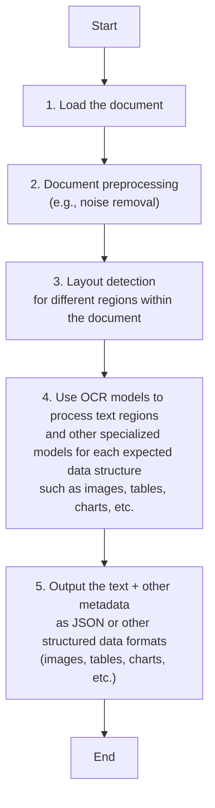

**Stop Converting Documents to Text: Building Multimodal AI Agents and RAG Systems That Actually Work**

When I first started building AI agents, I hit a frustrating wall. I was comfortable manipulating text, but the moment I had to integrate multimodal data—images, audio, and especially documents like PDFs—my elegant architectures turned into messy hacks. I spent weeks building complex pipelines that tried to force everything into text. I chained OCR engines to scrape PDFs, layout detection models to identify tables, and separate classifiers to handle images. It was a brittle, slow, and expensive solution that broke every time a document layout changed.

The breakthrough came when I realized I was solving the wrong problem. I didn’t need to convert documents to text. I needed to treat them as images. Once I understood that every PDF page is effectively an image and that modern LLMs can “see” just as well as they can read, the complexity vanished. I could completely skip the OCR purgatory and focus on the three core inputs of an LLM: text, images, and audio.

This shift is essential because real-world AI applications rarely exist in a text-only vacuum. As human beings, we process information visually and audibly. Enterprise applications mirror this reality. They need to manipulate private data from warehouses and lakes that is inherently multimodal: financial reports with complex charts, technical diagrams, building sketches, and audio logs.

The old approach of normalizing everything to text is lossy. When you translate a complex diagram or a chart into text, you lose the spatial relationships, the colors, and the context. You lose the information that matters most. By processing data in its native format, we preserve this rich visual information, resulting in systems that are faster, cheaper, and significantly more performant.

Ultimately, as data is made for humans, you want the LLM to process the data as close as a human would, which often is visually.

Here is what we will cover:

- The need for multimodal AI and why text-only approaches fall short in enterprise settings.
- Limitations of traditional document processing pipelines based on OCR.
- Foundations of multimodal LLMs, including the two primary architectural approaches.
- Practical implementation with images and PDFs using the Gemini API, covering bytes, Base64, and URLs.
- Foundations of multimodal RAG and the ColPali architecture.
- Building a multimodal RAG system for images, PDFs, and text.
- Constructing multimodal AI agents that combine RAG retrieval with ReAct reasoning.
- How these techniques integrate into production AI systems and what comes next in the course.

**The need for multimodal AI**

We want to process multimodal data to access our surroundings. However, the rise of multimodal LLMs is driven by a more subtle force: enterprise requirements. Enterprise applications work heavily with documents. The most critical example illustrating the need for multimodal data is processing PDF documents. Once we walk through this example, you will see how this core problem maps to other modalities like image, audio, or video.

Previously, we tried to normalize everything to text before passing it into an AI model. This approach has many flaws because we lose a substantial amount of information during translation. For example, when encountering diagrams, charts, or sketches in a document, it is impossible to fully reproduce them in text.

The traditional document processing workflow, often used for invoices, documentation, or reports, relies on the following four essential steps:

1. Document Preprocessing (e.g., Noise Removal)
2. Layout Detection (Text, Tables, Diagrams)
3. OCR Models (for Text) & Specialized Models (for Tables, Diagrams)
4. Output Structured Data (JSON/Metadata)

This workflow has too many moving pieces. We need layout detection models, OCR models for text, and specialized models for each expected data structure, such as tables or charts. This makes the system rigid. If a document contains a chart type we don’t have a model for, the pipeline fails. It is also slow and costly because we have to chain multiple model calls.

Most importantly, we face performance challenges. The multi-step nature creates a cascade effect where errors compound at each stage. Advanced OCR engines struggle with handwritten text, poor scans, stylized fonts, or complex layouts like nested tables and building sketches. Benchmarks show traditional OCR engines like Tesseract and PaddleOCR achieve 88–94% accuracy on high-volume, simple layouts but top out there on complex layouts, mixed content types, or degraded scans. They treat pages as flat text grids, struggling with multi-column formats, nested tables, overlapping text layers, faded watermarks, and embedded graphics, introducing recognition errors. For handwriting, CER is 3–5%, considered good but requiring human-in-the-loop for high accuracy. Poor scan quality below 300 DPI causes 20%+ drops in accuracy; 5-degree tilts increase WER by 15%+. Enterprise APIs (Google Document AI, Azure Form Recognizer, AWS Textract) reach 96–98% on standard forms but accuracy drops on irregular layouts, heavy tables, embedded charts, mixed handwriting/print.

If we try to translate other data formats to text, we lose information. This is true for any modality:

- Audio to Text: We lose tone, pitch, and emotion.
- Image to Text: We lose spatial information, color, and context.
- Video to Text: We lose temporal dynamics and visual context.

Modern AI solutions use multimodal LLMs, such as Gemini, GPT-4o, Claude or other open-source models. These models can directly interpret text, images, or PDFs as native input. This completely bypasses the unstable OCR workflow.

Thus, let’s understand how multimodal LLMs work.

## Limitations of traditional document processing

The traditional document processing workflow, often used for invoices, documentation, or reports, relies on the following four essential steps:

1. Document Preprocessing (e.g., Noise Removal)
2. Layout Detection (Text, Tables, Diagrams)
3. OCR Models (for Text) & Specialized Models (for Tables, Diagrams)
4. Output Structured Data (JSON/Metadata)

**Figure 1: Traditional Document Processing Workflow**



This workflow has too many moving pieces. We need layout detection models, OCR models for text, and specialized models for each expected data structure, such as tables or charts. This makes the system rigid. If a document contains a chart type we don’t have a model for, the pipeline fails. It is also slow and costly because we have to chain multiple model calls.

Most importantly, we face performance challenges. The multi-step nature creates a cascade effect where errors compound at each stage. Traditional OCR engines like Tesseract and PaddleOCR achieve 88–94% accuracy on high-volume, simple layouts but top out there on complex layouts, mixed content types, or degraded scans. They treat pages as flat text grids, struggling with multi-column formats, nested tables, overlapping text layers, faded watermarks, and embedded graphics, introducing recognition errors. For handwriting, CER is 3–5%, considered good but requiring human-in-the-loop for high accuracy. Poor scan quality below 300 DPI causes 20%+ drops in accuracy; 5-degree tilts increase WER by 15%+. Enterprise APIs (Google Document AI, Azure Form Recognizer, AWS Textract) reach 96–98% on standard forms but accuracy drops on irregular layouts, heavy tables, embedded charts, mixed handwriting/print. Benchmarks: CER <1% printed, 3–5% handwriting; WER <2% standard docs. Document condition like fold lines, shadows, ink bleed degrade performance. Hardware constraints cause tiling errors.

This situation echoes the historical shift in speech recognition from rule-based systems to end-to-end neural models. Just as early speech systems relied on fragile pipelines of acoustic modeling, pronunciation dictionaries, and language models, document processing depended on OCR, layout detection, and specialized models. The move to multimodal LLMs that process documents natively mirrors the end-to-end neural approaches that dramatically improved robustness and performance in speech. The lessons from that transition—fewer moving parts, better handling of noisy real-world data, and greater flexibility—directly apply to building scalable AI agents. [[21]](https://arxiv.org/html/2503.12687v1)

Real-world implementations highlight these limitations. For instance, companies like Bureau Veritas initially relied on OCR with manual corrections for equipment inspection data. By adopting a combined AI approach with ML, OCR, and NLP, they reduced processing time by 75% and manual data entry by 80%. In the banking sector, AI-powered contract analysis tools have reduced review times from hours to minutes, achieving 95% coverage with 50% less manual work. These cases demonstrate that while traditional pipelines can be tuned for specialized applications, they lack the flexibility and speed required for AI agents that must adapt to varied document layouts and content types without constant human intervention. [[22]](https://www.v7labs.com/blog/evolution-of-intelligent-document-processing)

**Figure 2: A building sketch showing a crawl space vent diagram, illustrating the complexity of layouts that classic OCR systems struggle to interpret.**


If we try to translate other data formats to text, we lose information. This is true for any modality:

- Audio to Text: We lose tone, pitch, and emotion.
- Image to Text: We lose spatial information, color, and context.
- Video to Text: We lose temporal dynamics and visual context.

Modern AI solutions use multimodal LLMs, such as Gemini, that can directly interpret text, images, or PDFs as native input. This completely bypasses the unstable OCR workflow.

Thus, let’s understand how multimodal LLMs work.

## Foundations of multimodal LLMs

To use LLMs with images and documents, you need an intuition of how multimodality works. You do not need to understand every research detail. But knowing the architecture helps you deploy, optimize, and monitor them.

There are two common approaches to building multimodal LLMs: the Unified Embedding Decoder Architecture and the Cross-modality Attention Architecture.

**Figure 3: The two main approaches to developing multimodal LLM architectures.**


### Unified Embedding Decoder Architecture

In this approach, we encode the text and image separately, concatenate their embeddings into a single vector, and pass the resulting vector to the LLM.

Thus, on top of a standard LLM architecture, you need a vision encoder that maps the image to an embedding that’s within the same vector space as the text. So, when the text and image embeddings are merged, the LLM can make sense of both.

**Figure 4: Illustration of the unified embedding decoder architecture.**


### Cross-modality Attention Architecture

In the second approach, instead of passing the image embeddings along with the text embeddings at the input, we inject them directly into the attention module. We still need an image encoder that projects the image into the same vector space as the text, but we inject it deeper within the architecture.

**Figure 5: An illustration of the Cross-Modality Attention Architecture approach.**


### Image Encoders

Both architectures rely on image encoders. To understand them, we can draw a parallel between text tokenization and image patching. Just as we split text into sub-word tokens, we split images into patches.

**Figure 6: Image tokenization and embedding (left) and text tokenization and embedding (right) side by side.**


The output has the same structure and dimensions as text embeddings. However, they need to be aligned in the vector space. We do this through a linear projection module. Popular image encoder models include CLIP, OpenCLIP, and SigLIP.

Importantly, these encoders are also used in Multimodal RAG. They allow us to find semantic similarities between images and text.

**Figure 7: Toy representation of multimodal embedding space.**


You can replicate the same strategy between different modalities, such as text, image, document, and audio vectors, as long as you have an encoder that maps the data in the same vector space.

### Trade-offs and Modern Landscape

The Unified Embedding Decoder approach is simpler to implement (you just concatenate tokens) and generally yields higher accuracy in OCR-related tasks. The Cross-modality Attention approach is more computationally efficient for high-resolution images because we don’t have to pass all tokens as an input sequence. Instead, we inject them directly into the attention mechanism. Hybrid approaches exist to combine these benefits.

In 2025, most leading LLMs are multimodal. Open-source examples include Llama, Gemma, and Qwen. Closed-source examples include GPT, Gemini, and Claude.

A quick note on Multimodal LLMs vs. Diffusion Models: Diffusion models (like Midjourney) generate images from noise. Multimodal LLMs (like GPT) understand images and can sometimes generate them, but they are architecturally different. In an agent workflow, diffusion models are typically used as tools, not as the reasoning model.

We had to keep this section super short. Still, if you want to learn more about the architecture of multimodal LLMs, we definitely recommend Understanding Multimodal LLMs by Sebastian Raschka, from which we took most of the images in this section.

Current multimodal LLM architectures still face challenges when processing documents with highly interleaved visual elements, such as text overlaid on diagrams or nested charts, without explicit layout tokens or additional preprocessing. This can lead to difficulties in maintaining spatial relationships and context, which is why innovations in these architectures remain an active area of research. [[24]](https://arxiv.org/html/2603.11640v1)

Now that we understand how LLMs can directly input images or documents, let’s see how this works in practice.

## Applying multimodal LLMs to images and PDFs

To better understand how multimodal LLMs work, let’s write a few examples using Gemini to show you some best practices when working with images and documents, such as PDFs.

There are three core ways to process multimodal data with LLMs:

1. **Raw bytes:** The easiest way to work with LLMs. However, when storing the item in a database, it can easily get corrupted as most databases interpret the input as text/strings instead of bytes.
2. **Base64:** A way to encode raw bytes as strings. This is useful for storing images or documents directly in a database (e.g., PostgreSQL, MongoDB) without corruption. The downside is that the file size increases by approximately 33%.
3. **URLs:** The standard for enterprise scenarios. You store data in a data lake like AWS S3 or GCP Buckets. The LLM downloads the media directly from the bucket. As the file never sees your server, this reduces network latency for your application. This is the most efficient option for scale.

Now, let’s dig into the code. We will show you a couple of simple examples of how to manipulate images and PDFs with these 3 methods using the Google GenAI SDK. In the following sections, we will build a simple agent that combines everything into a single unified layer.

1. First, we set up our client and display a sample image.

```python
from google import genai
from google.genai import types
from PIL import Image
import io

client = genai.Client()
MODEL_ID = "gemini-2.5-flash"
```

2. We load the image as **raw bytes**. We use `WEBP` format because it is efficient. For example, we can call the LLM to generate a caption for an image or compare two images.

**Image 7: Sample image 1 (kitten with robot).**


```python
image_bytes_1 = load_image_as_bytes("images/image_1.jpeg", format="WEBP")
image_bytes_2 = load_image_as_bytes("images/image_2.jpeg", format="WEBP")

# Single image captioning
response = client.models.generate_content(
    model=MODEL_ID,
    contents=[
        types.Part.from_bytes(data=image_bytes_1, mime_type="image/webp"),
        "Tell me what is in this image in one paragraph.",
    ],
)
print(f"Caption: {response.text}")

# Comparing multiple images
response = client.models.generate_content(
    model=MODEL_ID,
    contents=[
        types.Part.from_bytes(data=image_bytes_1, mime_type="image/webp"),
        types.Part.from_bytes(data=image_bytes_2, mime_type="image/webp"),
        "What’s the difference between these two images?",
    ],
)
print(f"Difference: {response.text}")
```

It outputs:

```
Caption: An image of a gray kitten and a robot...

Difference: The primary difference between the two images is the nature of the interaction...
```

3. We can also process the image as a **Base64 encoded string**. Notice that the logic is similar, but we encode the bytes first.

```python
import base64

image_base64 = base64.b64encode(image_bytes_1).decode("utf-8")

response = client.models.generate_content(
    model=MODEL_ID,
    contents=[
        types.Part.from_bytes(data=image_base64, mime_type="image/webp"),
        "Tell me what is in this image.",
    ],
)
```

If we compute the difference in size between base64 and bytes, the base64 one will be ~33% larger (but at least the data doesn’t get corrupted).

```python
f"Size increase: {(len(image_base64) - len(image_bytes_1)) / len(image_bytes_1) * 100:.2f}%"
```

4. For **URLs**, Gemini works like a charm with GCS Buckets. We used this at ZTRON and it worked like a charm:

```python
response = client.models.generate_content(
    model=MODEL_ID,
    contents=[
        types.Part.from_uri(uri="gs://gemini-images/image_1.jpeg", mime_type="image/webp"),
        "Tell me what is in this image.",
    ],
)
```

5. Let’s try a more complex task: **Object Detection**. We use Pydantic to define the output structure, using the knowledge from Lesson 3.

```python
from pydantic import BaseModel

class BoundingBox(BaseModel):
    ymin: float
    xmin: float
    ymax: float
    xmax: float
    label: str

class Detections(BaseModel):
    bounding_boxes: list[BoundingBox]

prompt = "Detect all prominent items. Return 2d boxes normalized to 0-1000."

response = client.models.generate_content(
    model=MODEL_ID,
    contents=[types.Part.from_bytes(data=image_bytes_1, mime_type="image/webp"), prompt],
    config=types.GenerateContentConfig(
        response_mime_type="application/json",
        response_schema=Detections
    ),
)
print(response.parsed)
```

It outputs:

```
bounding_boxes=[BoundingBox(ymin=272.0, xmin=28.0, ymax=801.0, xmax=535.0, label='kitten'), ...]
```

**Image 8: Object detection results on sample image 1.**


6. Now, let’s process **PDFs**. Because we use a multimodal model, the process is identical to images. We load the PDF as bytes and pass it to the model.

**Image 9: First page of the Attention Is All You Need paper.**


```python
pdf_bytes = open("pdfs/attention_paper.pdf", "rb").read()

response = client.models.generate_content(
    model=MODEL_ID,
    contents=[
        types.Part.from_bytes(data=pdf_bytes, mime_type="application/pdf"),
        "What is this document about? Provide a brief summary.",
    ],
)
print(response.text)
```

It outputs:

```
This document introduces the Transformer, a novel neural network architecture for sequence transduction...
```

7. We can also process **PDFs as public URLs**. This is useful for analyzing documents directly from the web without downloading them first. We use the `url_context` tool.

```python
response = client.models.generate_content(
    model=MODEL_ID,
    contents="Based on the provided paper as a PDF, tell me how ReAct works: https://arxiv.org/pdf/2210.03629",
    config=types.GenerateContentConfig(tools=[{"url_context": {}}]),
)
print(response.text)
```

It outputs:

```
The ReAct (Reasoning and Acting) paradigm is a method that combines verbal reasoning traces with task-specific actions...
```

8. Finally, we can perform **Object Detection on PDF pages**. This is powerful for extracting diagrams or tables. We treat the PDF page as an image.

```python
page_image_bytes = load_image_as_bytes("images/attention_page_1.jpeg")

prompt = "Detect all the diagrams from the provided image as 2d bounding boxes."

response = client.models.generate_content(
    model=MODEL_ID,
    contents=[types.Part.from_bytes(data=page_image_bytes, mime_type="image/webp"), prompt],
    config=types.GenerateContentConfig(
        response_mime_type="application/json",
        response_schema=Detections
    ),
)
```

**Image 10: Object detection results on the transformer architecture diagram from the Attention paper.**


Processing PDFs as images is a concept popularized by the ColPali paper, which demonstrated that modern Vision Language Models (VLMs) can retrieve documents more effectively by “looking” at them rather than extracting text.

## Foundations of multimodal RAG

What if we want to use these methods within an Agent?

Agents manage their internal state, the short-term memory, as a list of messages. This usually translates to a list of dictionaries or JSON objects. When transitioning from text-only to multimodal, the structure changes slightly. We need a way to flag the data type and model the data using the formats we just discussed (URL, Base64, Binary).

We move from a list of text-only JSONs to a list of JSONs containing a mix of modalities. Each item can be text, an image, or audio. As long as the LLM can process these modalities, our job is to properly manage them in short-term memory, retrieve them from long-term memory, and pass them in the right encoding.

**Figure 11: The transition of an AI agent’s short-term memory from a text-only to a multimodal representation.**


Retrieval becomes more interesting in this context. We still query our long-term memory, but now we can use multimodal similarities. We can use an image from short-term memory to query for similar images, documents, or audio chunks.

From an architectural point of view, a multimodal agentic RAG looks like any other agentic RAG system. However, this is where you will feel the real need for **semantic search**. With text, you can get far with keyword filters or SQL. But with images or audio, you cannot rely on keywords. You must use vector similarity to find relationships between data types.

Let’s see how we can model this bag of mixed messages with an example.

## Implementing multimodal RAG for images, PDFs and text

Let’s take this further and design an agentic RAG system. We assume we have a vector database filled with images, audio data, PDFs (converted to images), and text. We also assume we have a multimodal embedding model that supports text-to-image, image-to-audio, and text-to-audio embeddings.

For simplicity, we will mock the retrieval tools that access our vector database and other MCP servers for Google Drive or local screenshots.

**Figure 12: Agent Interacting With Multimodal Memory**


Our main focus is on managing the short-term memory as a list of mixed-modality JSONs. We want the agent to retrieve context from its current multimodal state, leveraging its multimodal retrieval tools, provide an answer, and repeat until the task is complete.

1. First, we define our multimodal tools. In a real application, these would query a vector DB like Qdrant or Pinecone using a multimodal embedding model.

```python
def text_image_search_tool(query: str):
    """Search for images using text description."""
    pass

def image_to_image_search_tool(image_data: str):
    """Find images visually similar to the input image."""
    pass

def image_audio_search_tool(image_data: str):
    """Find audio clips relevant to the image content."""
    pass

def image_document_search_tool(image_data: str):
    """Find documents visually similar to the image."""
    pass

def google_drive_document_search_tool(image_data: str):
    """Search Google Drive for documents related to the image."""
    pass

def computer_screen_shoot_tool():
    """Take a screenshot of the user’s screen."""
    return "<base64_image_string>"
```

2. We define the `build_react_agent` function that creates ReAct agents using LangGraph. We use a system prompt that explicitly instructs the agent to handle multimodal inputs.

```python
from langgraph.prebuilt import create_react_agent
from langchain_google_genai import ChatGoogleGenerativeAI

def build_react_agent():
    system_prompt = """You are a multimodal AI assistant.
    You can see images, read documents, and listen to audio.
    When asked about visual content, use your tools to retrieve relevant context.
    Always analyze the visual features (colors, objects) or audio features (pitch, tone) in your search results."""

    model = ChatGoogleGenerativeAI(model="gemini-2.5-pro")
    tools = [
        text_image_search_tool,
        image_to_image_search_tool,
        image_audio_search_tool,
        image_document_search_tool,
        google_drive_document_search_tool,
        computer_screen_shoot_tool,
    ]

    agent = create_react_agent(model, tools, system_prompt)

    return agent
```

3. We build the `react_agent` and run it with a query that requires multimodal reasoning: *"Based on what I am looking at, retrieve all relevant images, audio, and documents."*

```python
agent = build_react_agent()

response = agent.invoke({"messages": ["Based on what I am looking at, retrieve all relevant images, audio and documents"]})
```

4. Let’s look at a potential reasoning trace on how the agent would call various tools to answer this question. Then we will show how the list of JSON messages grows with each step, using the Gemini API structure.

- **Turn 1 (Reasoning):** The agent analyzes the user request and decides to call `computer_screen_shoot_tool`.

- **Turn 1 (Observation):** The tool executes and returns a Base64 image. This is appended to the message history as a tool response containing `inline_data`.

```json
{
  "role": "tool",
  "name": "computer_screen_shoot_tool",
  "parts": [
    {
      "inline_data": {
        "mime_type": "image/jpeg",
        "data": "/9j/4AAQSkZJRg..."
      }
    }
  ]
}
```

5. **Turn 2 (Reasoning):** The agent now has the image in its context. It analyzes the visual content (a gray kitten) and decides to call the following retrieval tools in parallel, passing the image data from the previous turn:

```python
function_calls = [
  {
    "tool_name": "image_to_image_search_tool",
    "tool_args": {
      "image_data": "<base64_image_from_previous_turn>"
    }
  },
  {
    "tool_name": "image_audio_search_tool",
    "tool_args": {
      "image_data": "<base64_image_from_previous_turn>"
    }
  },
  {
    "tool_name": "image_document_search_tool",
    "tool_args": {
      "image_data": "<base64_image_from_previous_turn>"
    }
  },
  {
    "tool_name": "google_drive_document_search_tool",
    "tool_args": {
      "image_data": "<base64_image_from_previous_turn>"
    }
  }
]
```

6. **Turn 2 (Observation):** The tools execute and return mixed modalities. The state is updated with these new observations, adding audio, images, and document pages to the context.

```json
[
  {
    "role": "tool",
    "name": "image_to_image_search_tool",
    "parts": [
      { "text": "Found 3 similar images:" },
      {
        "inline_data": {
          "mime_type": "image/jpeg",
          "data": "/9j/4AAQSkZJRg..."
        }
      },
      {
        "inline_data": {
          "mime_type": "image/jpeg",
          "data": "/9j/4AAQSkZJRg..."
        }
      },
      {
        "inline_data": {
          "mime_type": "image/jpeg",
          "data": "/9j/4AAQSkZJRg..."
        }
      }
    ]
  },
  {
    "role": "tool",
    "name": "image_audio_search_tool",
    "parts": [
      { "text": "Found similar audio clip (as binary data):" },
      {
        "inline_data": {
          "mime_type": "audio/mp3",
          "data": "<binary_audio_bytes>"
        }
      }
    ]
  },
  {
    "role": "tool",
    "name": "image_document_search_tool",
    "parts": [
      { "text": "Found relevant PDF page (as base64 image):" },
      {
        "inline_data": {
          "mime_type": "image/png",
          "data": "iVBORw0KGgo..."
        }
      }
    ]
  },
  {
    "role": "tool",
    "name": "google_drive_document_search_tool",
    "parts": [
      { "text": "Found document from Google Drive (stored in GCS bucket):" },
      {
        "file_data": {
          "mime_type": "application/pdf",
          "file_uri": "gs://my-bucket/documents/british-shorthair-guide.pdf"
        }
      }
    ]
  }
]
```

7. The agent compiles this into a final answer.

```
I analyzed your screen and found you are looking at a gray kitten.
Based on this, I retrieved:
1. 3 similar images of gray kittens (from image_to_image_search_tool, as base64).
2. An audio clip of a cat purring (from image_audio_search_tool, as binary data).
3. A PDF page about cat breeds (from image_document_search_tool, as base64 image).
4. A document from Google Drive about British Shorthair cats (from google_drive_document_search_tool, stored as URL in GCS bucket).
```

8. We can now ask a follow-up question: *"What is the color of my kitten?"*

```python
response = agent.invoke({"messages": ["What is the color of my kitten?"]})
```

9. Because the agent has the image in its short-term memory (the state), it does not need to use tools again. It simply looks at the Base64 data from Step 1 and answers.

At the time the agent is asked about this question, this is how its whole short-term memory looks. This is the first part up to the `computer_screen_shoot_tool` tool call.

```json
[
  {
    "role": "user",
    "parts": [{ "text": "Based on what I am looking at..." }]
  },
  {
    "role": "model",
    "parts": [{ "function_call": { "name": "computer_screen_shoot_tool", "args": {} } }]
  },
  {
    "role": "tool",
    "name": "computer_screen_shoot_tool",
    "parts": [{ "inline_data": { "mime_type": "image/jpeg", "data": "..." } }]
  }
]
```

10. Here is the subsequent part of the state, showing the parallel tool calls and their multimodal outputs.

```json
[
  {
    "role": "model",
    "parts": [
      { "function_call": { "name": "image_to_image_search_tool", "args": { "image_data": "<base64_image_from_previous_turn>" } } },
      { "function_call": { "name": "image_audio_search_tool", "args": { "image_data": "<base64_image_from_previous_turn>" } } },
      { "function_call": { "name": "image_document_search_tool", "args": { "image_data": "<base64_image_from_previous_turn>" } } },
      { "function_call": { "name": "google_drive_document_search_tool", "args": { "image_data": "<base64_image_from_previous_turn>" } } }
    ]
  },
  {
    "role": "tool",
    "name": "image_to_image_search_tool",
    "parts": [
      { "text": "Found 3 similar images:" },
      { "inline_data": { "mime_type": "image/jpeg", "data": "..." } },
      { "inline_data": { "mime_type": "image/jpeg", "data": "..." } },
      { "inline_data": { "mime_type": "image/jpeg", "data": "..." } }
    ]
  },
  {
    "role": "tool",
    "name": "image_audio_search_tool",
    "parts": [
      { "text": "Found similar audio clip (as binary data):" },
      { "inline_data": { "mime_type": "audio/mp3", "data": "<binary_audio_bytes>" } }
    ]
  },
  {
    "role": "tool",
    "name": "image_document_search_tool",
    "parts": [
      { "text": "Found relevant PDF page (as base64 image):" },
      { "inline_data": { "mime_type": "image/png", "data": "..." } }
    ]
  },
  {
    "role": "tool",
    "name": "google_drive_document_search_tool",
    "parts": [
      { "text": "Found document from Google Drive (stored in GCS bucket):" },
      { "file_data": { "mime_type": "application/pdf", "file_uri": "gs://my-bucket/documents/british-shorthair-guide.pdf" } }
    ]
  }
]
```

11. Here is the end of the state, showing the document results and the final Q&A:

```json
[
  ,
  {
    "role": "model",
    "parts": [{ "text": "I analyzed your screen..." }]
  },
  {
    "role": "user",
    "parts": [{ "text": "What is the color of my kitten?" }]
  }
]
```

12. And finally the model responds:

```
Your kitten is gray.
```

We should probably use these LLMs for something more meaningful than just chatting about our pets. But hey, who doesn’t like a good cat/dog video? 😂

Nothing fundamental has changed in how we structure our data when switching from text-only to multimodal agents. We simply reflect the data types within the JSONs. The key is that our LLM knows how to process that data. The hard part is retrieving the correct multimodal data from our databases and indexing it properly.

## Building multimodal AI agents

What if we want to use these methods within an Agent?

Agents manage their internal state, the short-term memory, as a list of messages. This usually translates to a list of dictionaries or JSON objects. When transitioning from text-only to multimodal, the structure changes slightly. We need a way to flag the data type and model the data using the formats we just discussed (URL, Base64, Binary).

We move from a list of text-only JSONs to a list of JSONs containing a mix of modalities. Each item can be text, an image, or audio. As long as the LLM can process these modalities, our job is to properly manage them in short-term memory, retrieve them from long-term memory, and pass them in the right encoding.

**Figure 13: The transition of an AI agent’s short-term memory from a text-only to a multimodal representation.**


Retrieval becomes more interesting in this context. We still query our long-term memory, but now we can use multimodal similarities. We can use an image from short-term memory to query for similar images, documents, or audio chunks.

From an architectural point of view, a multimodal agentic RAG looks like any other agentic RAG system. However, this is where you will feel the real need for **semantic search**. With text, you can get far with keyword filters or SQL. But with images or audio, you cannot rely on keywords. You must use vector similarity to find relationships between data types.

Let’s see how we can model this bag of mixed messages with an example.

## Building multimodal AI agents

Let’s take this further and design an agentic RAG system. We assume we have a vector database filled with images, audio data, PDFs (converted to images), and text. We also assume we have a multimodal embedding model that supports text-to-image, image-to-audio, and text-to-audio embeddings.

For simplicity, we will mock the retrieval tools that access our vector database and other MCP servers for Google Drive or local screenshots.

**Figure 14: Agent Interacting With Multimodal Memory**


Our main focus is on managing the short-term memory as a list of mixed-modality JSONs. We want the agent to retrieve context from its current multimodal state, leveraging its multimodal retrieval tools, provide an answer, and repeat until the task is complete.

1. First, we define our multimodal tools. In a real application, these would query a vector DB like Qdrant or Pinecone using a multimodal embedding model.

```python
def text_image_search_tool(query: str):
    """Search for images using text description."""
    pass

def image_to_image_search_tool(image_data: str):
    """Find images visually similar to the input image."""
    pass

def image_audio_search_tool(image_data: str):
    """Find audio clips relevant to the image content."""
    pass

def image_document_search_tool(image_data: str):
    """Find documents visually similar to the image."""
    pass

def google_drive_document_search_tool(image_data: str):
    """Search Google Drive for documents related to the image."""
    pass

def computer_screen_shoot_tool():
    """Take a screenshot of the user’s screen."""
    return "<base64_image_string>"
```

2. We define the `build_react_agent` function that creates ReAct agents using LangGraph. We use a system prompt that explicitly instructs the agent to handle multimodal inputs.

```python
from langgraph.prebuilt import create_react_agent
from langchain_google_genai import ChatGoogleGenerativeAI

def build_react_agent():
    system_prompt = """You are a multimodal AI assistant.
    You can see images, read documents, and listen to audio.
    When asked about visual content, use your tools to retrieve relevant context.
    Always analyze the visual features (colors, objects) or audio features (pitch, tone) in your search results."""

    model = ChatGoogleGenerativeAI(model="gemini-2.5-pro")
    tools = [
        text_image_search_tool,
        image_to_image_search_tool,
        image_audio_search_tool,
        image_document_search_tool,
        google_drive_document_search_tool,
        computer_screen_shoot_tool,
    ]

    agent = create_react_agent(model, tools, system_prompt)

    return agent
```

3. We build the `react_agent` and run it with a query that requires multimodal reasoning: *"Based on what I am looking at, retrieve all relevant images, audio, and documents."*

```python
agent = build_react_agent()

response = agent.invoke({"messages": ["Based on what I am looking at, retrieve all relevant images, audio and documents"]})
```

4. Let’s look at a potential reasoning trace on how the agent would call various tools to answer this question. Then we will show how the list of JSON messages grows with each step, using the Gemini API structure.

- **Turn 1 (Reasoning):** The agent analyzes the user request and decides to call `computer_screen_shoot_tool`.

- **Turn 1 (Observation):** The tool executes and returns a Base64 image. This is appended to the message history as a tool response containing `inline_data`.

```json
{
  "role": "tool",
  "name": "computer_screen_shoot_tool",
  "parts": [
    {
      "inline_data": {
        "mime_type": "image/jpeg",
        "data": "/9j/4AAQSkZJRg..."
      }
    }
  ]
}
```

5. **Turn 2 (Reasoning):** The agent now has the image in its context. It analyzes the visual content (a gray kitten) and decides to call the following retrieval tools in parallel, passing the image data from the previous turn:

```python
function_calls = [
  {
    "tool_name": "image_to_image_search_tool",
    "tool_args": {
      "image_data": "<base64_image_from_previous_turn>"
    }
  },
  {
    "tool_name": "image_audio_search_tool",
    "tool_args": {
      "image_data": "<base64_image_from_previous_turn>"
    }
  },
  {
    "tool_name": "image_document_search_tool",
    "tool_args": {
      "image_data": "<base64_image_from_previous_turn>"
    }
  },
  {
    "tool_name": "google_drive_document_search_tool",
    "tool_args": {
      "image_data": "<base64_image_from_previous_turn>"
    }
  }
]
```

6. **Turn 2 (Observation):** The tools execute and return mixed modalities. The state is updated with these new observations, adding audio, images, and document pages to the context.

```json
[
  {
    "role": "tool",
    "name": "image_to_image_search_tool",
    "parts": [
      { "text": "Found 3 similar images:" },
      {
        "inline_data": {
          "mime_type": "image/jpeg",
          "data": "/9j/4AAQSkZJRg..."
        }
      },
      {
        "inline_data": {
          "mime_type": "image/jpeg",
          "data": "/9j/4AAQSkZJRg..."
        }
      },
      {
        "inline_data": {
          "mime_type": "image/jpeg",
          "data": "/9j/4AAQSkZJRg..."
        }
      }
    ]
  },
  {
    "role": "tool",
    "name": "image_audio_search_tool",
    "parts": [
      { "text": "Found similar audio clip (as binary data):" },
      {
        "inline_data": {
          "mime_type": "audio/mp3",
          "data": "<binary_audio_bytes>"
        }
      }
    ]
  },
  {
    "role": "tool",
    "name": "image_document_search_tool",
    "parts": [
      { "text": "Found relevant PDF page (as base64 image):" },
      {
        "inline_data": {
          "mime_type": "image/png",
          "data": "iVBORw0KGgo..."
        }
      }
    ]
  },
  {
    "role": "tool",
    "name": "google_drive_document_search_tool",
    "parts": [
      { "text": "Found document from Google Drive (stored in GCS bucket):" },
      {
        "file_data": {
          "mime_type": "application/pdf",
          "file_uri": "gs://my-bucket/documents/british-shorthair-guide.pdf"
        }
      }
    ]
  }
]
```

7. The agent compiles this into a final answer.

```
I analyzed your screen and found you are looking at a gray kitten.
Based on this, I retrieved:
1. 3 similar images of gray kittens (from image_to_image_search_tool, as base64).
2. An audio clip of a cat purring (from image_audio_search_tool, as binary data).
3. A PDF page about cat breeds (from image_document_search_tool, as base64 image).
4. A document from Google Drive about British Shorthair cats (from google_drive_document_search_tool, stored as URL in GCS bucket).
```

8. We can now ask a follow-up question: *"What is the color of my kitten?"*

```python
response = agent.invoke({"messages": ["What is the color of my kitten?"]})
```

9. Because the agent has the image in its short-term memory (the state), it does not need to use tools again. It simply looks at the Base64 data from Step 1 and answers.

At the time the agent is asked about this question, this is how its whole short-term memory looks. This is the first part up to the `computer_screen_shoot_tool` tool call.

```json
[
  {
    "role": "user",
    "parts": [{ "text": "Based on what I am looking at..." }]
  },
  {
    "role": "model",
    "parts": [{ "function_call": { "name": "computer_screen_shoot_tool", "args": {} } }]
  },
  {
    "role": "tool",
    "name": "computer_screen_shoot_tool",
    "parts": [{ "inline_data": { "mime_type": "image/jpeg", "data": "..." } }]
  }
]
```

10. Here is the subsequent part of the state, showing the parallel tool calls and their multimodal outputs.

```json
[
  {
    "role": "model",
    "parts": [
      { "function_call": { "name": "image_to_image_search_tool", "args": { "image_data": "<base64_image_from_previous_turn>" } } },
      { "function_call": { "name": "image_audio_search_tool", "args": { "image_data": "<base64_image_from_previous_turn>" } } },
      { "function_call": { "name": "image_document_search_tool", "args": { "image_data": "<base64_image_from_previous_turn>" } } },
      { "function_call": { "name": "google_drive_document_search_tool", "args": { "image_data": "<base64_image_from_previous_turn>" } } }
    ]
  },
  {
    "role": "tool",
    "name": "image_to_image_search_tool",
    "parts": [
      { "text": "Found 3 similar images:" },
      { "inline_data": { "mime_type": "image/jpeg", "data": "..." } },
      { "inline_data": { "mime_type": "image/jpeg", "data": "..." } },
      { "inline_data": { "mime_type": "image/jpeg", "data": "..." } }
    ]
  },
  {
    "role": "tool",
    "name": "image_audio_search_tool",
    "parts": [
      { "text": "Found similar audio clip (as binary data):" },
      { "inline_data": { "mime_type": "audio/mp3", "data": "<binary_audio_bytes>" } }
    ]
  },
  {
    "role": "tool",
    "name": "image_document_search_tool",
    "parts": [
      { "text": "Found relevant PDF page (as base64 image):" },
      { "inline_data": { "mime_type": "image/png", "data": "..." } }
    ]
  },
  {
    "role": "tool",
    "name": "google_drive_document_search_tool",
    "parts": [
      { "text": "Found document from Google Drive (stored in GCS bucket):" },
      { "file_data": { "mime_type": "application/pdf", "file_uri": "gs://my-bucket/documents/british-shorthair-guide.pdf" } }
    ]
  }
]
```

11. Here is the end of the state, showing the document results and the final Q&A:

```json
[
  ,
  {
    "role": "model",
    "parts": [{ "text": "I analyzed your screen..." }]
  },
  {
    "role": "user",
    "parts": [{ "text": "What is the color of my kitten?" }]
  }
]
```

12. And finally the model responds:

```
Your kitten is gray.
```

We should probably use these LLMs for something more meaningful than just chatting about our pets. But hey, who doesn’t like a good cat/dog video? 😂

Nothing fundamental has changed in how we structure our data when switching from text-only to multimodal agents. We simply reflect the data types within the JSONs. The key is that our LLM knows how to process that data. The hard part is retrieving the correct multimodal data from our databases and indexing it properly.

## Conclusion

Working with multimodal data is a fundamental skill for AI engineers. Modern AI applications rarely exist in a text-only vacuum. They interact with the complex, visual, and auditory reality of the world.

In this lesson, we moved away from the unstable, multi-step OCR pipelines of the past. We learned that modern LLMs can natively process images and documents, preserving rich context that was previously lost. We explored how to handle data as bytes, Base64, and URLs, and how to build agents that can reason across these modalities. These compression techniques for ColPali will be key when we pass images and PDFs from our research agent to the writer agent in the capstone project, avoiding any text translation issues and benefiting from the complete visual information.

This concludes our AI Agents Foundations series. We started by understanding the difference between workflows and agents, mastered context engineering and structured outputs, built robust planning capabilities with ReAct, and finally gave our agents eyes and ears. You now have the foundational blocks to build production-ready AI systems.

Still, if you missed our roadmap, remember that this article is part of a longer series of 9 pieces on the AI Agents Foundations that will give you the tools to morph from a Python developer to an AI Engineer.

Here’s our roadmap:

1. AI Workflows vs. Agents: The Autonomy Spectrum
2. Context Engineering: 2025’s #1 Skill
3. LLM Structured Outputs: The Only Way to Production
4. Stop Building AI Agents—Use These 4 Patterns Instead
5. Tool Calling: From Scratch to Production
6. AI Agents & Planning: How to Think Like an Agent
7. Building Production ReAct Agents
8. How Does Memory for AI Agents Work?
9. Multimodal Agents ← You just finished this one.

See you next Tuesday.

What’s your take on today’s topic? Do you agree, disagree, or is there something I missed?

## References

- [1] Raschka, S. (2024, October 21). Understanding multimodal LLMS. Sebastian Raschka. https://magazine.sebastianraschka.com/p/understanding-multimodal-llms
- [2] Vision language models. (n.d.). NVIDIA. https://www.nvidia.com/en-us/glossary/vision-language-models/
- [3] Talebi, S. (2024, November 13). Multimodal embeddings: An introduction. Medium. https://towardsdatascience.com/multimodal-embeddings-an-introduction-5dc36975966f/
- [4] Multi-modal ML with OpenAI’s CLIP. (n.d.). Pinecone. https://www.pinecone.io/learn/series/image-search/clip/
- [5] Fostiropoulos, I., et al. (2024). ColPali: Efficient Document Retrieval with Vision Language Models. arXiv. https://arxiv.org/pdf/2407.01449v6
- [6] Image understanding. (n.d.). Google AI for Developers. https://ai.google.dev/gemini-api/docs/image-understanding
- [7] Google generative AI embeddings. (n.d.). LangChain. https://python.langchain.com/docs/integrations/text_embedding/google_generative_ai/
- [8] Agents. (n.d.). LangChain. https://langchain-ai.github.io/langgraph/agents/agents/
- [9] Complex Document Recognition: OCR Doesn’t Work and Here’s How You Fix It. (n.d.). HackerNoon. https://hackernoon.com/complex-document-recognition-ocr-doesnt-work-and-heres-how-you-fix-it
- [10] What are some real-world applications of multimodal AI? (n.d.). Milvus. https://milvus.io/ai-quick-reference/what-are-some-realworld-applications-of-multimodal-ai
- [11] Liu, J. (2025, February 24). OlmOCR-bench review: Insights and pitfalls on an OCR benchmark. LlamaIndex. https://www.llamaindex.ai/blog/olmocr-bench-review-insights-and-pitfalls-on-an-ocr-benchmark
- [12] Vectorize.io. (2024, October 26). Multimodal RAG Patterns. Vectorize.io Blog. https://vectorize.io/blog/multimodal-rag-patterns
- [13] The 8 best AI image generators in 2025. (n.d.). Zapier. https://zapier.com/blog/best-ai-image-generator/
- [14] What Is Optical Character Recognition (OCR)? (n.d.). Roboflow Blog. https://blog.roboflow.com/what-is-optical-character-recognition-ocr/
- [15] 2025: The Year AI Reasoning Models Took Over. (n.d.). Medium. https://medium.com/data-science-in-your-pocket/2025-the-year-ai-reasoning-models-took-over-a-month-by-month-review-of-frontier-breakthroughs-6ea2163f854f
- [16] Stop Converting Documents to Text. You’re Doing It Wrong. (2025, December 9). Decoding AI. https://www.decodingai.com/p/stop-converting-documents-to-text
- [17] Evaluating Multimodal vs. Text-Based Retrieval for RAG with Snowflake Cortex. (2025, April 21). Snowflake Engineering Blog. https://www.snowflake.com/en/engineering-blog/arctic-agentic-rag-multimodal-pdf-retrieval/
- [18] OCR Accuracy Explained: How to Improve It. (n.d.). LlamaIndex Blog. https://www.llamaindex.ai/blog/ocr-accuracy
- [19] Top 6 Multimodal AI Agents: Architecture & Use Cases 2026. (n.d.). Kanerika. https://kanerika.com/blogs/multimodal-ai-agents/
- [20] Attention Is All You Need. (2017). arXiv. https://arxiv.org/abs/1706.03762
- [21] Bach Duong. Hierarchical Patch Compression for ColPali: Efficient Multi-Vector Document Retrieval with Dynamic Pruning and Quantization. arXiv. https://arxiv.org/html/2506.21601v2
- [22] Casimir Rajnerowicz. The Evolution of Document Processing: From OCR to GenAI. V7 Labs. https://www.v7labs.com/blog/evolution-of-intelligent-document-processing
- [23] arXiv. https://arxiv.org/html/2503.12687v1

**Note:** All code examples and diagrams are adapted from the provided research notebook and sources. The complete notebook is available in the course repository for hands-on practice.