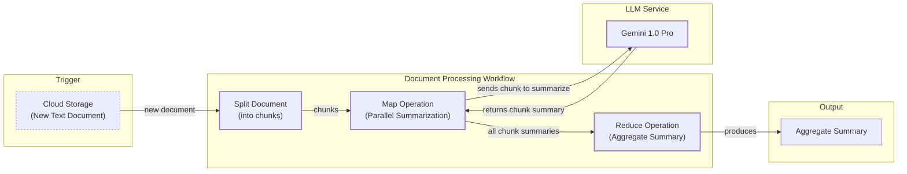
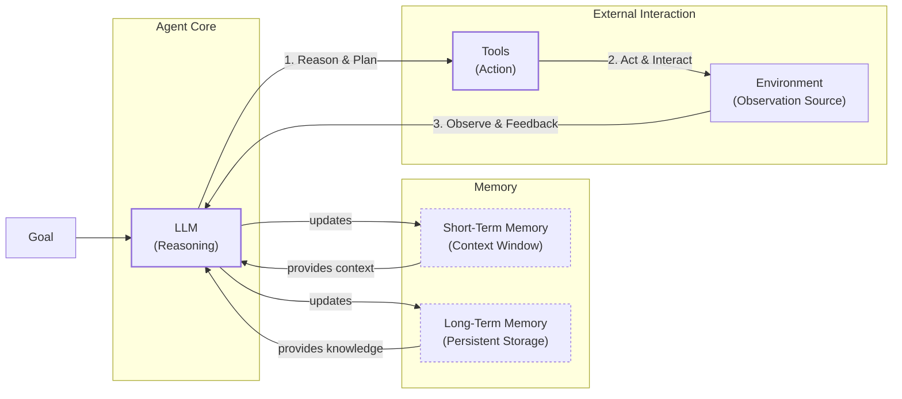
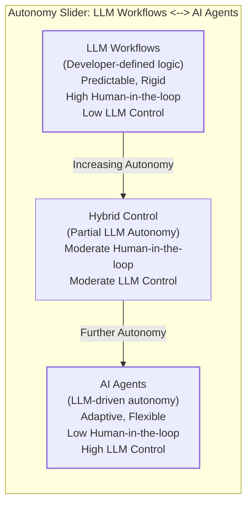
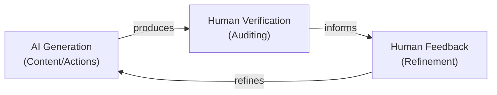
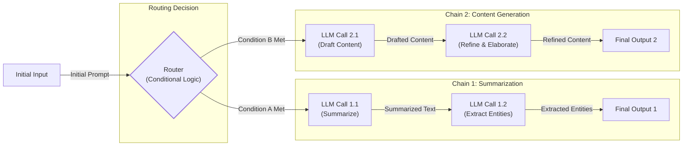
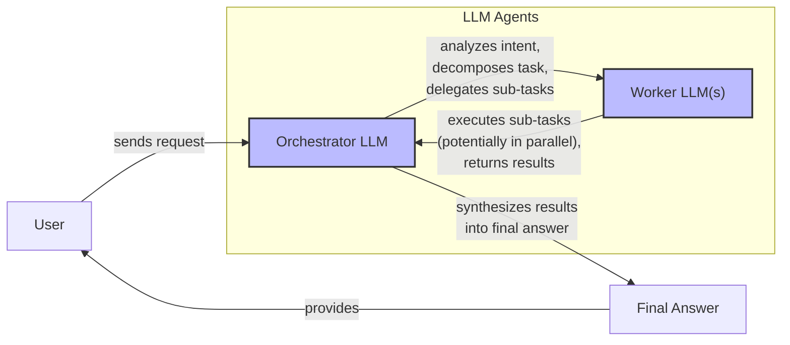
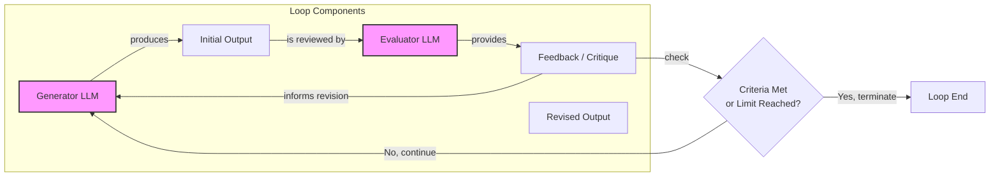
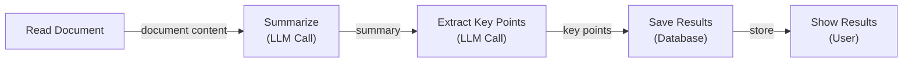
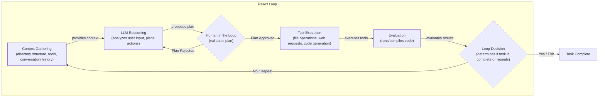

# AI Agents vs. LLM Workflows: An AI Engineer's Guide to System Design

As an AI engineer preparing to build your first real AI application, after narrowing down the problem you want to solve, one key decision is how to design your AI solution. Should it follow a predictable, step-by-step workflow, or does it demand a more autonomous approach, where the LLM makes self-directed decisions along the way? This fundamental question will determine the success or failure of your project: How should you architect your AI system?

When building AI applications, engineers face this critical architectural decision early in their development process. Choose the wrong approach, and you might end up with an overly rigid system that breaks when users deviate from expected patterns, or an unpredictable agent that works brilliantly 80% of the time but fails catastrophically when it matters most. This choice impacts everything from development time and costs to reliability and user experience. Months of effort can be wasted rebuilding the entire architecture, leading to frustrated users who cannot rely on the application and executives who cannot afford to keep it running.

In 2024 and 2025, we have seen billion-dollar AI startups succeed or fail based primarily on this architectural decision. The most successful teams and engineers know when to use workflows versus agents and, more importantly, how to combine both approaches effectively.

By the end of this lesson, we will provide you with a framework to make this critical decision with confidence. You will understand the fundamental trade-offs between LLM workflows and AI agents, see real-world examples from leading AI companies, and learn how to design robust systems that leverage the best of both approaches.

## Understanding the Spectrum: From Workflows to Agents

To make an informed decision, you first need to understand what LLM workflows and AI agents are. We will not focus on the deep technical specifics yet, but rather on their core properties and how they are used in practice.

### LLM Workflows

An LLM workflow is a sequence of tasks involving one or more LLM calls, often combined with other operations like reading from a database or calling an API. The key characteristic is that the process is largely predefined and orchestrated by developer-written code. The steps are defined in advance, resulting in deterministic or rule-based paths with a predictable execution and explicit control flow. Think of it like a factory assembly line: each station performs a specific, repeatable task in a set order to produce a consistent output.

We will explore specific workflow patterns like chaining, routing, and the orchestrator-worker model in future lessons. These patterns allow you to build complex, multi-step processes while maintaining control over the system's logic. A great example is the map/reduce pattern used for summarizing long documents, where a document is split into chunks, summarized in parallel, and then aggregated into a final summary [[1]](https://cloud.google.com/blog/products/ai-machine-learning/long-document-summarization-with-workflows-and-gemini-models).


Image 1: LLM workflow for document summarization using a map/reduce pattern.

### AI Agents

AI agents are systems where an LLM plays a central role in dynamically deciding the sequence of steps, reasoning, and actions required to achieve a goal. The steps are not defined in advance but are planned based on the task and the current state of the environment. This makes agents adaptive and capable of handling novelty. You can think of an agent as a skilled human expert tackling an unfamiliar problem, adapting their approach with each new piece of information.

Agents typically rely on a core reasoning loop, memory to retain context, and tools to interact with the outside world. We will cover these components, including the popular ReAct (Reason and Act) agent framework, in detail in upcoming lessons.


Image 2: An AI agent using the ReAct pattern, showing the LLM interacting with tools, short-term memory, and long-term memory in a loop to achieve a goal.

### The Role of Orchestration

Both workflows and agents require an orchestration layer, but its function is fundamentally different in each. In a workflow, the orchestration layer is like a project manager executing a predefined plan. It follows the script you have written, calling the right functions in the right order. In an agentic system, the orchestration layer is more of a facilitator. It does not follow a script; instead, it empowers the LLM to create its own plan, execute actions, and adapt its strategy based on the results.

## Choosing Your Path

Now that we have defined both ends of the spectrum, the core difference becomes clear: it is a trade-off between developer-defined logic and LLM-driven autonomy. This is not a binary choice but a gradient. Most real-world systems blend elements of both, and your job as an AI engineer is to find the right balance for your specific use case. A useful mental model is to think of workflows as providing the reliable "rails" for your application, while agents add the intelligence and flexibility where needed, operating within carefully designed "guardrails" to prevent them from causing harm [[25]](https://www.tellius.com/resources/blog/agents-vs-workflows-why-not-both).


Image 3: The autonomy slider between LLM workflows and AI agents, showing a spectrum of human-in-the-loop intervention and LLM control.

This spectrum can be further refined by thinking in terms of agent levels. Anthropic, for example, distinguishes between 'Level 2' agents, which follow a fixed sequence of steps but allow an LLM to make decisions within those steps, and 'Level 3+' agents, where the LLM dynamically directs the entire process. Level 2 systems offer more predictable costs and outcomes with limited autonomy, while true agents are more powerful but also more complex, expensive, and riskier to operate [[24]](https://www.barnacle.ai/blog/2025-09-25-agents-intro). Choosing your path often means deciding which level of autonomy is appropriate for the task.

### When to Use LLM Workflows

Workflows are the backbone of most production AI applications today. You should default to a workflow when your task is structured and repeatable. Examples include pipelines for data extraction from sources like Slack or Google Drive, automated report generation, and content repurposing, such as turning an article into a series of social media posts.

**Strengths:** Workflows are predictable and reliable. Since the paths are fixed, debugging is straightforward, and you can trace errors to a specific step. This predictability also makes costs and latency more manageable, as you know exactly how many LLM calls will be made. You can often use smaller, specialized models for specific sub-tasks, which reduces infrastructure overhead.

**Weaknesses:** The main drawback is rigidity. A workflow can only do what you have explicitly programmed it to do. Handling unexpected user inputs or adding new features can become complex, much like traditional software development. The user experience can feel constrained if it does not allow for deviation.

Workflows are preferred in enterprise settings and regulated fields like finance and healthcare, where predictability and auditability are non-negotiable. An AI tool that provides financial advice or assists with medical diagnoses must be accurate and consistent every single time, as its outputs have a direct impact on people's lives. They are also ideal for building Minimum Viable Products (MVPs), where you need to ship a reliable feature quickly by hardcoding the logic.

### When to Use AI Agents

Agents are best suited for open-ended problems where the solution path is not known in advance. Use cases include complex customer support where the conversation can go in many directions, dynamic problem-solving like debugging code, or interactive tasks in unfamiliar environments like booking a flight without specifying which websites to use.

**Strengths:** The power of agents lies in their adaptability. They can handle ambiguity, learn from their environment, and devise novel strategies to solve problems. This flexibility allows them to tackle tasks that would be impossible to hardcode.

**Weaknesses:** This autonomy comes at a cost. Agents are non-deterministic, meaning their performance, latency, and cost can vary with each run, making them feel unreliable. They often require more powerful, and thus more expensive, LLMs to reason effectively. They also tend to make more LLM calls to think through a problem, further increasing costs. Security is a major concern; an agent with write permissions could accidentally delete your code or send an inappropriate email. I have seen developers joke about their agent deleting their entire project, saying, "Anyway, I wanted to start over." Finally, evaluating and debugging agents is notoriously difficult.

### The Autonomy Slider and the Human-in-the-Loop

In his talk "Software is Changing (Again)," Andrej Karpathy introduced the concept of an "autonomy slider" [[2]](https://singjupost.com/andrej-karpathy-software-is-changing-again/). This is a powerful mental model for thinking about the balance between human control and AI autonomy. Products like the coding assistant Cursor exemplify this: you can use simple tab-completion (low autonomy), ask it to edit a block of code with `Cmd+K` (medium autonomy), or let it attempt to refactor an entire file with `Cmd+L` (high autonomy) [[3]](https://www.linkedin.com/posts/markbarbir_andrej-karpathys-latest-talk-describes-our-activity-7343449417426837505-oTFx). Similarly, Perplexity offers a quick search, a more involved "research" mode, and a "deep research" function that takes several minutes to generate a comprehensive report [[4]](https://medium.com/@ben_pouladian/andrej-karpathy-on-software-3-0-software-in-the-age-of-ai-b25533da93b6), [[5]](https://andrewships.substack.com/p/autonomy-sliders).

This need for a tunable autonomy slider is not unique to software assistants. High-stakes fields are borrowing governance models from autonomous vehicle safety regulations to manage AI agents in clinical settings. The approach uses risk-based frameworks to determine how much human oversight is required; an agent that uploads documents might run fully autonomously, whereas one involved in safety reporting will never act without a human in the loop [[26]](https://www.appliedclinicaltrialsonline.com/view/setting-limits-autonomy-autonomous-agents-clinical-research). This mirrors how a car's cruise control can be trusted on an empty highway, but a human must take over in dense city traffic. Frameworks like AMLAS (Assurance of Machine Learning for Autonomous Systems), originally from the automotive industry, are being adapted to provide the structured validation and monitoring needed to build trust in these systems [[27]](https://pmc.ncbi.nlm.nih.gov/articles/PMC12738763/).

As you slide toward more autonomy, the human's role shifts from director to verifier. The goal is to make the feedback loop between AI generation and human verification as fast and efficient as possible. This is where good system architecture and a well-designed user interface become critical. They provide the transparency needed for a human to quickly audit the AI's work and stay in control [[6]](https://www.youtube.com/watch?v=LCEmiRjPEtQ).


Image 4: The AI generation and human verification loop, emphasizing its iterative nature.

## Exploring Common Patterns

To help you build an intuition for AI engineering, let's look at some of the most common patterns for building LLM workflows and agents. We will cover each of these in depth in future lessons, but for now, we will keep the explanations high-level.

### LLM Workflow Patterns

**Chaining and Routing** is a foundational pattern for automating sequences of LLM calls. Chaining connects the output of one LLM call to the input of another, creating a multi-step process. Routing adds conditional logic, allowing the workflow to choose different paths based on the input or intermediate results. This is the first step toward building more complex automations [[7]](https://mlpills.substack.com/p/issue-110-llm-workflow-patterns), [[8]](https://www.geeksforgeeks.org/artificial-intelligence/llm-chains/).


Image 5: The "Chaining and Routing" pattern for LLM workflows.

The **Orchestrator-Worker** pattern introduces a level of dynamic planning. A central "orchestrator" LLM analyzes a user's request, breaks it down into sub-tasks, and delegates them to specialized "worker" LLMs or tools. The orchestrator then synthesizes the results into a final answer. This pattern provides a smooth transition from rigid workflows to more adaptive, agent-like behavior [[9]](https://online.stevens.edu/blog/building-self-healing-ai-orchestrator-reflexion-patterns/), [[10]](https://mlpills.substack.com/p/diy-17-orchestrator-worker-llm-agent). This approach is conceptually similar to swarm intelligence mechanisms seen in nature, such as ant colonies. The orchestrator's coordination is analogous to "stigmergic communication," where individual agents (the ants) indirectly communicate by modifying their environment (leaving pheromone trails) to guide the collective toward an optimal solution [[28]](https://medium.com/@jsmith0475/collective-stigmergic-optimization-leveraging-ant-colony-emergent-properties-for-multi-agent-ai-55fa5e80456a). This biologically-inspired paradigm is not just theoretical; research systems like AMRO (Ant colony inspired Multi-agent Routing Optimization) use pheromone-driven mechanisms to enhance routing efficiency and system robustness in multi-agent architectures [[29]](https://openreview.net/forum?id=ojUhmgIS7o).


Image 6: The "Orchestrator-Worker" pattern.

The **Evaluator-Optimizer Loop** is designed to improve the quality of LLM outputs through self-correction. In this pattern, one LLM generates a response, and a second "evaluator" LLM critiques it based on a set of criteria. This feedback, or reflection, is then passed back to the original LLM, which refines its output. The loop continues until the response meets the desired quality standard, much like a human writer revises a draft based on an editor's comments [[11]](https://docs.aws.amazon.com/prescriptive-guidance/latest/agentic-ai-patterns/evaluator-reflect-refine-loop-patterns.html), [[12]](https://platform.claude.com/cookbook/patterns-agents-evaluator-optimizer).


Image 7: The Evaluator-Optimizer loop pattern.

### Core Components of a ReAct AI Agent

The **ReAct (Reason and Act)** pattern is the engine behind most modern AI agents. It enables an agent to reason about a task, decide on an action, execute it, observe the outcome, and then repeat the cycle until the goal is complete. This iterative process is what gives agents their ability to solve complex, multi-step problems.

The core components are:
*   **A reasoning LLM:** This is the "brain" of the agent. It analyzes the goal, plans the next step, and interprets the results of actions.
*   **Tools (Actions):** These are the agent's "hands." They are functions or APIs that allow the agent to interact with its environment, such as searching the web, querying a database, or writing to a file. We will cover tools in detail in Lesson 6.
*   **Short-Term Memory:** This is the agent's working memory, analogous to a computer's RAM. It holds the context of the current conversation, including past actions and observations.
*   **Long-Term Memory:** This provides the agent with persistent knowledge, including factual data about the world and user-specific preferences. We will explore memory in Lesson 9.

Almost all state-of-the-art agents in the industry use the ReAct pattern, as it has shown the most promise for building capable and autonomous systems. We will dive deep into this pattern in Lessons 7 and 8.

```mermaid
flowchart LR
  %% Agent Core Components
  subgraph "AI Agent Core"
    STM["Short-Term Memory<br/>(Context Window)"]
    LLM["LLM<br/>(Reasoning Engine)"]
  end

  %% External Systems
  subgraph "External Systems"
    Tools["Tools<br/>(Action Execution)"]
    LTM["Long-Term Memory<br/>(Persistent Knowledge)"]
  end

  %% ReAct Loop Dynamics
  STM -- "provides context" --> LLM
  LTM -- "retrieves relevant info" --> LLM

  LLM -- "1. Reason (Think)" --> Action["Action<br/>(Tool Call)"]
  Action -- "2. Act" --> Tools
  Tools -- "Tool Output" --> Observation["Observation<br/>(Tool Result)"]
  Observation -- "3. Observe & Reason" --> LLM

  %% Memory Updates
  LLM -- "updates" --> STM
  LLM -- "stores important info" -.-> LTM

  %% Task Completion
  LLM -- "Task Completed" --> End["Task Completed"]

  %% Visual Grouping
  classDef memory stroke-dasharray:3,3
  classDef process stroke-width:2px
  class STM,LTM memory
  class LLM,Tools,Action,Observation process
```
Image 8: The high-level dynamics of the ReAct (Reason and Act) pattern within an AI agent.

## Zooming In on Our Favorite Examples

To ground these concepts in reality, let’s analyze a few state-of-the-art examples, moving from a simple workflow to a complex hybrid system.

### Document Summarization in Google Workspace: A Pure Workflow

**Problem:** Finding the right information in a large document or a long email thread can be a time-consuming process. A quick, embedded summary can guide your search and help you decide if a document is relevant without reading the whole thing.

The document summarization feature in Google Workspace is a perfect example of a pure, multi-step workflow [[13]](https://support.google.com/docs/answer/15627020?hl=en). It follows a predictable chain of LLM calls to deliver a consistent result. When a user requests a summary, the system executes a predefined sequence: it reads the document, sends the content to an LLM for summarization, potentially makes another call to extract key points, and then presents the structured result to the user. There is no dynamic decision-making; it is a reliable, hardcoded process [[1]](https://cloud.google.com/blog/products/ai-machine-learning/long-document-summarization-with-workflows-and-gemini-models).


Image 9: The document summarization and analysis workflow by Gemini in Google Workspace.

### Gemini CLI: An AI Agent for Coding

**Problem:** Writing code is a slow, manual process that often requires digging through dense documentation or outdated blog posts. Understanding a new codebase or learning a new programming language can take weeks before an engineer is productive. A coding assistant can dramatically accelerate this process.

The Gemini CLI is an open-source AI agent built to assist developers in their terminal [[14]](https://blog.google/technology/developers/introducing-gemini-cli-open-source-ai-agent/). It leverages the ReAct architecture to create a single-agent system for coding tasks. It can write code from scratch (a practice Andrej Karpathy famously dubbed "vibe coding"), assist an engineer with specific functions, generate documentation, and quickly analyze new codebases.

Based on our research from August 2025, here is a high-level overview of how it operates [[15]](https://developers.google.com/gemini-code-assist/docs/gemini-cli), [[16]](https://github.com/google-gemini/gemini-cli/blob/main/README.md):
1.  **Context Gathering:** The agent starts by loading its context: the directory structure of the project, a list of available tools, and the history of the current conversation [[17]](https://wietsevenema.eu/blog/2025/how-gemini-cli-builds-context/), [[18]](https://wietsevenema.eu/blog/2025/how-gemini-cli-builds-context/).
2.  **LLM Reasoning:** The Gemini model analyzes the user's request and the current context to form a plan of action.
3.  **Human in the Loop:** Before executing, the agent can present its plan to the user for validation.
4.  **Tool Execution:** The agent executes the plan using its tools. These can include file system operations (like reading a file or listing a directory), web searches for documentation, and code generation or interpretation.
5.  **Evaluation:** The agent can dynamically evaluate the code it has written by attempting to compile or run it.
6.  **Loop Decision:** Based on the outcome, the agent decides whether the task is complete or if it needs to repeat the cycle to refine its work.


Image 10: The operational loop of the Gemini CLI coding assistant, based on the ReAct pattern.

### Perplexity Deep Research: A Hybrid System

**Problem:** Researching a new topic can be daunting. It is hard to know where to start, which sources to trust, and how to combine information from multiple articles or papers into a coherent understanding. A research assistant that can quickly scan the internet and synthesize a report can be a massive productivity booster.

Perplexity's Deep Research mode is a fascinating hybrid system that combines structured workflows with dynamic agents to perform expert-level autonomous research [[19]](https://www.perplexity.ai/hub/blog/introducing-perplexity-deep-research). Unlike the single-agent Gemini CLI, this system uses an orchestrator to manage multiple specialized agents that work in parallel. This allows it to perform dozens of searches across hundreds of sources and deliver a comprehensive report in just a few minutes [[20]](https://zenvanriel.com/ai-engineer-blog/perplexity-computer-multi-model-agent-orchestration/).

While the exact implementation is closed-source, we can infer a likely architecture based on industry best practices and public information. Here is a simplified version of how it could work:
1.  **Research Planning & Decomposition:** An orchestrator agent analyzes the user's research question and breaks it down into a series of targeted sub-questions. This is a classic application of the orchestrator-worker pattern.
2.  **Parallel Information Gathering:** To move faster, the system deploys multiple specialized search agents in parallel. Each agent is responsible for a single sub-question and uses tools like web search and document retrieval to gather relevant information.
3.  **Analysis & Synthesis:** Each agent analyzes its gathered sources, validates their credibility, and summarizes the key findings for its specific sub-question.
4.  **Iterative Refinement & Gap Analysis:** The orchestrator collects the results from all the worker agents and analyzes them to identify any knowledge gaps. If information is missing, it generates follow-up queries and repeats the process until the research is complete or a step limit is reached.
5.  **Report Generation:** Finally, the orchestrator synthesizes all the verified information into a single, comprehensive report with inline citations.

This hybrid approach leverages the structured control of a workflow (the orchestrator supervising the overall process) with the dynamic adaptability of agents (the workers performing open-ended research on sub-tasks).

```mermaid
flowchart LR
  %% Initial Input
  RQ["Research Question"]

  %% Orchestration Layer
  subgraph "Orchestrator"
    O_Analyze["Analyze Research Question"]
    O_Decompose["Decompose into Sub-Questions"]
    O_IdentifyGaps["Identify Knowledge Gaps"]
    O_FollowUp["Generate Follow-up Queries"]
  end

  %% Parallel Research Layer
  subgraph "Specialized Search Agents"
    SSA_Gather["Gather Information<br/>(Parallel Execution)"]
    SSA_Tools["Utilize Tools"]
    SSA_Analyze["Analyze & Synthesize<br/>(Per Sub-Question)"]
  end

  %% Final Output
  Report["Comprehensive Report"]

  %% Primary Data Flow
  RQ -- "initiates" --> O_Analyze
  O_Analyze -- "understanding" --> O_Decompose
  O_Decompose -- "distributes sub-questions" --> SSA_Gather
  SSA_Gather -- "accesses" --> SSA_Tools
  SSA_Tools -- "provides raw data" --> SSA_Analyze
  SSA_Analyze -- "sends synthesized info" --> O_IdentifyGaps

  %% Iterative Loop
  O_IdentifyGaps -- "identifies gaps" --> O_FollowUp
  O_FollowUp -- "generates new queries" --> O_Decompose

  %% Completion
  O_IdentifyGaps -- "research complete" --> Report

  %% Visual Grouping
  classDef orchestrator_task stroke-width:2px
  classDef search_agent_task stroke-dasharray:5,5
  classDef tool_interaction stroke-width:1px
  classDef input_output stroke-width:3px,font-weight:bold

  class RQ,Report input_output
  class O_Analyze,O_Decompose,O_IdentifyGaps,O_FollowUp orchestrator_task
  class SSA_Gather,SSA_Analyze search_agent_task
  class SSA_Tools tool_interaction
```


Image 11: Perplexity's Deep Research agent's iterative multi-step process and hybrid nature.

## The Challenges of Every AI Engineer

Now that you understand the spectrum from workflows to agents, it is important to recognize that every AI Engineer faces these same fundamental challenges when designing a new AI application. This architectural decision is one of the core factors that determine whether your AI application succeeds in production or fails spectacularly. Here are some of the daily battles every AI engineer faces [[21]](https://arxiv.org/html/2510.25423v2):

**Reliability Issues:** Your agent works perfectly in demos but becomes unpredictable with real users. LLM reasoning failures can compound through multi-step processes, leading to unexpected and costly outcomes.

These compounding failures occur because a small error in an early step, like a flawed data retrieval, propagates and amplifies through subsequent reasoning and tool calls [[30]](https://www.mindstudio.ai/blog/reliability-compounding-problem-ai-agent-stacks/). Mitigating this requires a combination of architectural patterns and robust monitoring. Engineering solutions include parallelizing independent tasks to limit the blast radius of a failure, building in redundancy like querying multiple sources, and implementing smart retry logic with fallbacks [[30]](https://www.mindstudio.ai/blog/reliability-compounding-problem-ai-agent-stacks/). On the monitoring side, specialized observability pipelines that provide detailed tracing across the entire agentic loop are essential to pinpoint the root cause of an error [[31]](https://www.langchain.com/articles/ai-observability). A simple but effective practice is to pin the exact version of the LLM you are using, as model providers often update them without notice, which can cause unexpected performance drift [[32]](https://www.cio.com/article/4046837/3-key-approaches-to-mitigate-ai-agent-failures.html).

**Context Limits:** Systems struggle to maintain coherence across long conversations, gradually losing track of their purpose. Ensuring consistent output quality across different agent specializations presents a continuous challenge.

**Data Integration:** Building pipelines to pull information from Slack, web APIs, SQL databases, and data lakes is complex. You must also ensure that only high-quality data is passed to your AI system, following the "garbage-in, garbage-out" principle.

**Cost-Performance Trap:** Sophisticated agents can deliver impressive results, but they may cost a fortune per user interaction, making them economically unfeasible for many applications.

**Security Concerns:** Autonomous agents with powerful write permissions could send the wrong emails, delete critical files, or expose sensitive data. Building robust safeguards is essential [[22]](https://permiso.io/blog/8-critical-ai-security-challenges), [[23]](https://www.cyberark.com/resources/blog/the-agentic-ai-revolution-5-unexpected-security-challenges). This also raises complex questions of accountability: when a high-autonomy system fails, who is responsible—the developer, the deployer, or the user? Establishing clear governance and attribution frameworks is a critical, unsolved challenge [[33]](https://www.arionresearch.com/blog/owisez8t7c80zpzv5ov95uc54d11kd).

These challenges are solvable. In upcoming lessons, we will cover patterns for building reliable products through specialized evaluation and monitoring pipelines, strategies for creating hybrid systems, and ways to keep costs and latency under control. We will start in the next lesson by exploring structured outputs, a key technique for making LLM responses reliable and machine-readable. We will also dive deeper into memory, tools, and advanced agentic patterns like ReAct.

Your path forward as an AI engineer is about mastering these realities. By the end of this course, you will have the knowledge to architect AI systems that are not only powerful but also robust, efficient, and safe. You will know when to use a workflow, when to deploy an agent, and how to build effective hybrid systems that work in the messy, unpredictable real world.

## References

- [1] [Long document summarization with Workflows and Gemini models](https://cloud.google.com/blog/products/ai-machine-learning/long-document-summarization-with-workflows-and-gemini-models)
- [2] [Andrej Karpathy: Software Is Changing (Again)](https://singjupost.com/andrej-karpathy-software-is-changing-again/)
- [3] [Andrej Karpathy's latest talk describes our...](https://www.linkedin.com/posts/markbarbir_andrej-karpathys-latest-talk-describes-our-activity-7343449417426837505-oTFx)
- [4] [Andrej Karpathy on Software 3.0: Software in the Age of AI](https://medium.com/@ben_pouladian/andrej-karpathy-on-software-3-0-software-in-the-age-of-ai-b25533da93b6)
- [5] [Autonomy Sliders](https://andrewships.substack.com/p/autonomy-sliders)
- [6] [Andrej Karpathy: Software Is Changing (Again)](https://www.youtube.com/watch?v=LCEmiRjPEtQ)
- [7] [Issue #110: LLM Workflow Patterns](https://mlpills.substack.com/p/issue-110-llm-workflow-patterns)
- [8] [LLM Chains](https://www.geeksforgeeks.org/artificial-intelligence/llm-chains/)
- [9] [Building a Self-Healing AI Orchestrator with Reflexion Patterns](https://online.stevens.edu/blog/building-self-healing-ai-orchestrator-reflexion-patterns/)
- [10] [DIY #17: Orchestrator-Worker LLM Agent Pattern](https://mlpills.substack.com/p/diy-17-orchestrator-worker-llm-agent)
- [11] [Evaluator, reflect, and refine loop patterns](https://docs.aws.amazon.com/prescriptive-guidance/latest/agentic-ai-patterns/evaluator-reflect-refine-loop-patterns.html)
- [12] [Evaluator-Optimizer](https://platform.claude.com/cookbook/patterns-agents-evaluator-optimizer)
- [13] [Summarize your document in Docs with Gemini (Workspace Experiments)](https://support.google.com/docs/answer/15627020?hl=en)
- [14] [Gemini CLI: your open-source AI agent](https://blog.google/technology/developers/introducing-gemini-cli-open-source-ai-agent/)
- [15] [Gemini CLI](https://developers.google.com/gemini-code-assist/docs/gemini-cli)
- [16] [Gemini CLI README.md](https://github.com/google-gemini/gemini-cli/blob/main/README.md)
- [17] [How Gemini CLI builds context and learns about your codebase](https://wietsevenema.eu/blog/2025/how-gemini-cli-builds-context/)
- [18] [How Gemini CLI builds context and learns about your codebase (duplicate source)](https://wietsevenema.eu/blog/2025/how-gemini-cli-builds-context/)
- [19] [Introducing Perplexity Deep Research](https://www.perplexity.ai/hub/blog/introducing-perplexity-deep-research)
- [20] [Perplexity Computer runs Claude Opus 4.6...](https://zenvanriel.com/ai-engineer-blog/perplexity-computer-multi-model-agent-orchestration/)
- [21] [What Challenges Do Developers Face in AI Agent Systems? An Empirical Study on Stack Overflow & GitHub Issues](https://arxiv.org/html/2510.25423v2)
- [22] [8 Critical AI Security Challenges & How to Solve Them](https://permiso.io/blog/8-critical-ai-security-challenges)
- [23] [The Agentic AI Revolution: 5 Unexpected Security Challenges](https://www.cyberark.com/resources/blog/the-agentic-ai-revolution-5-unexpected-security-challenges)
- [24] [An Introduction to AI Agents (2025)](https://www.barnacle.ai/blog/2025-09-25-agents-intro)
- [25] [Agents vs. Workflows: Why Not Both?](https://www.tellius.com/resources/blog/agents-vs-workflows-why-not-both)
- [26] [Setting Limits on Autonomy for Autonomous Agents in Clinical Research](https://www.appliedclinicaltrialsonline.com/view/setting-limits-autonomy-autonomous-agents-clinical-research)
- [27] [Assurance of Machine Learning-based Autonomous Systems in Healthcare](https://pmc.ncbi.nlm.nih.gov/articles/PMC12738763/)
- [28] [Collective Stigmergic Optimization](https://medium.com/@jsmith0475/collective-stigmergic-optimization-leveraging-ant-colony-emergent-properties-for-multi-agent-ai-55fa5e80456a)
- [29] [AMRO: Ant Colony Inspired Multi-agent Routing Optimization](https://openreview.net/forum?id=ojUhmgIS7o)
- [30] [Reliability is a Compounding Problem in AI Agent Stacks](https://www.mindstudio.ai/blog/reliability-compounding-problem-ai-agent-stacks/)
- [31] [AI Observability](https://www.langchain.com/articles/ai-observability)
- [32] [3 key approaches to mitigate AI agent failures](https://www.cio.com/article/4046837/3-key-approaches-to-mitigate-ai-agent-failures.html)
- [33] [Accountability in Autonomous Systems: Navigating the Intersection of AI, Law, and Ethics](https://www.arionresearch.com/blog/owisez8t7c80zpzv5ov95uc54d11kd)
- [A Developer’s Guide to Building Scalable AI: Workflows vs Agents](https://towardsdatascience.com/a-developers-guide-to-building-scalable-ai-workflows-vs-agents/)
- [Building effective agents](https://www.anthropic.com/engineering/building-effective-agents)
- [Building Production-Ready RAG Applications: Jerry Liu](https://www.youtube.com/watch?v=TRjq7t2Ms5I)
- [Exploring the difference between agents and workflows](https://decodingml.substack.com/p/llmops-for-production-agentic-rag)
- [Introducing ChatGPT agent: bridging research and action](https://openai.com/index/introducing-chatgpt-agent/)
- [Real Agents vs. Workflows: The Truth Behind AI 'Agents'](https://www.youtube.com/watch?v=kQxr-uOxw2o&t=1s)
- [Stop Building AI Agents: Here’s what you should build instead](https://decodingml.substack.com/p/stop-building-ai-agents)
- [What is an AI agent?](https://cloud.google.com/discover/what-are-ai-agents)
- [1,302 real-world gen AI use cases from the world's leading organizations](https://cloud.google.com/transform/101-real-world-generative-ai-use-cases-from-industry-leaders)