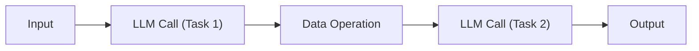
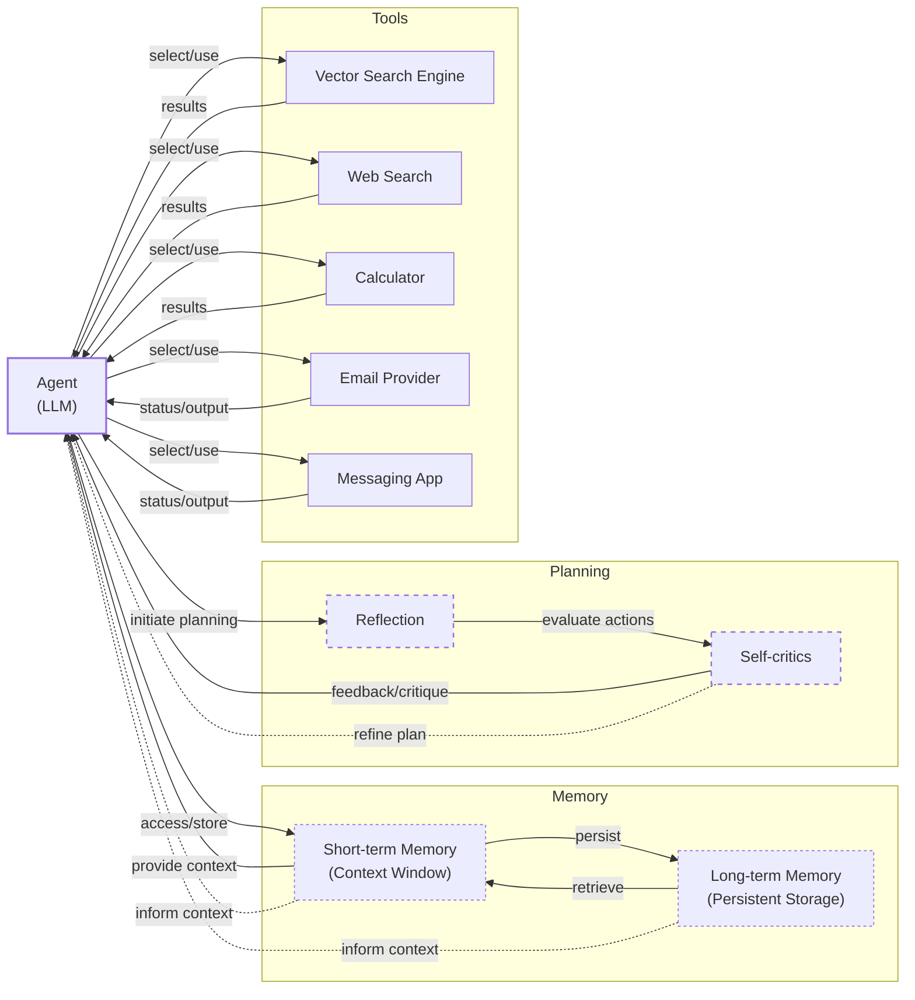
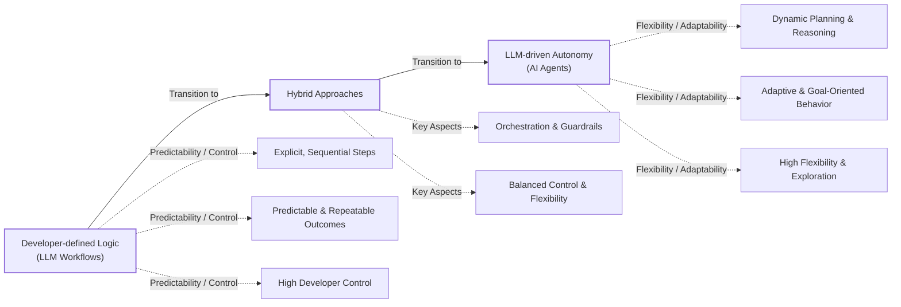
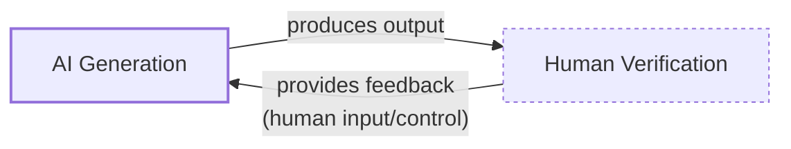
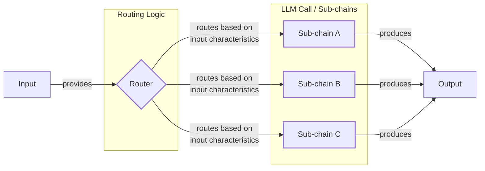
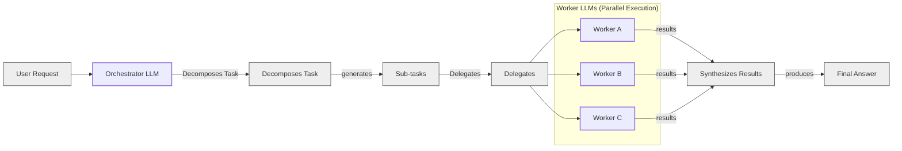
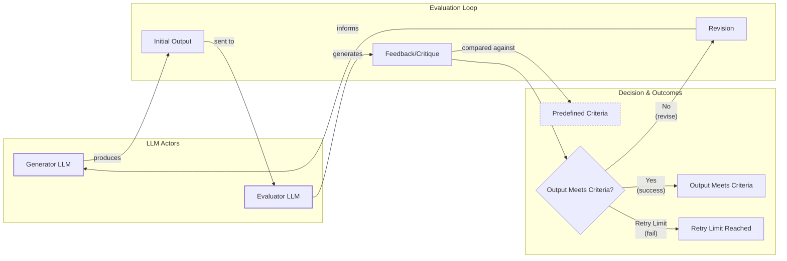
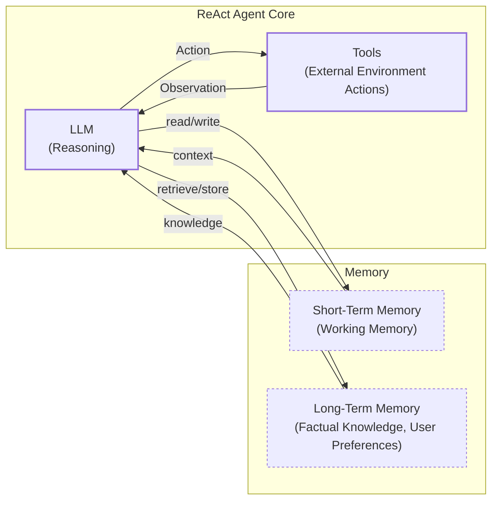
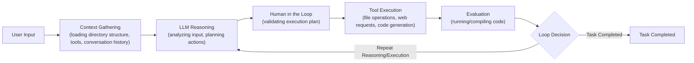
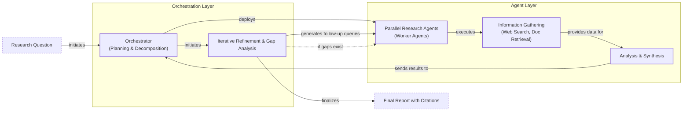

# AI Agents vs. LLM Workflows: An AI Engineer's Guide to Choosing the Right Architecture

As an AI engineer preparing to build your first real AI application, after narrowing down the problem you want to solve, one key decision is how to design your AI solution. Should it follow a predictable, step-by-step workflow, or does it demand a more autonomous approach, where the LLM makes self-directed decisions along the way? This fundamental question will determine the success or failure of your project: How should you architect your AI system?

When building AI applications, you face a critical architectural decision early in the development process. Choosing the right approach will impact everything from development time and costs to reliability and user experience. Make the wrong choice, and you might build an overly rigid system that breaks the moment a user deviates from the expected path. Or, you could end up with an unpredictable agent that works brilliantly 80% of the time but fails catastrophically when it matters most, burning through your budget with runaway token costs.

Months of development time can be wasted rebuilding an entire architecture from scratch. This leads to frustrated users who cannot rely on the application and frustrated executives who cannot afford to keep it running. In the landscape of 2024-2025, we see that billion-dollar AI startups often succeed or fail based on this very decision. The most successful teams and engineers understand that the choice is not a binary one between rigid control and total autonomy. They know when to use a predictable workflow, when to deploy an autonomous agent, and, most importantly, how to combine both approaches effectively.

This lesson will provide a framework to help you make this architectural decision. We will explore the fundamental trade-offs, examine real-world examples from leading AI companies, and show you how to design robust systems that leverage the best of both worlds. By the end, you will understand when to build a predictable workflow and when to embrace a more autonomous agent.

## Understanding the Spectrum: From Workflows to Agents

To start, you will take a brief look at what LLM workflows and AI agents are. At this point, we will not focus on the technical specifics of each, but rather on their properties and how they are used.

### LLM Workflows

An LLM workflow is a sequence of tasks involving LLM calls or other operations, such as reading or writing data to a database or file system. It is largely predefined and orchestrated by developer-written code [[1]](https://www.anthropic.com/engineering/building-effective-agents). The steps are defined in advance, resulting in deterministic or rule-based paths with predictable execution and explicit control flow. Think of it as a factory assembly line, where each station performs a specific, repeatable task in a set order. The developer is in full control, and the system’s behavior is transparent and testable. If a step fails, you can trace the problem to a specific line of code, just as you would in traditional software.

Image 1: A simple LLM workflow diagram showing a sequence of predefined tasks.

This approach is powerful because it is reliable. You can build complex systems by breaking them down into smaller, manageable steps. In future lessons, we will explore common workflow patterns like chaining, routing, and the orchestrator-worker model in more detail.

### AI Agents

AI agents are systems where an LLM plays a central role in dynamically deciding the sequence of steps, reasoning, and actions to achieve a goal [[2]](https://cloud.google.com/discover/what-are-ai-agents). The steps are not defined in advance but are dynamically planned based on the task and the current state of the environment [[3]](https://www.youtube.com/watch?v=kQxr-uOxw2o&t=1s). This makes them adaptive and capable of handling novelty, with the LLM driving autonomy in decision-making and execution. An agent is like a skilled human expert tackling an unfamiliar problem, adapting on the fly after each new insight.

This distinction between predefined workflows and autonomous agents is not new. It mirrors a long-standing paradigm in classical artificial intelligence: the difference between deliberative planning and reactive control. Deliberative systems rely on detailed world models to create explicit, long-term plans, much like an LLM workflow. Reactive systems, conversely, use tightly coupled perception-action loops to respond to their environment in real-time, a principle that underlies the adaptive nature of modern agents [[22]](https://arxiv.org/html/2602.10479v1). Today’s most effective systems are often hybrids, combining the logical precision of planning with the adaptability of reactive control [[23]](https://rentelligence.ai/blog/history-of-ai-agents/).

Image 2: A simple agentic system architecture diagram illustrating the core components of an AI agent and its dynamic interaction loop.

This approach relies on concepts like tools, memory, and reasoning patterns like ReAct, all of which we will cover in upcoming lessons.

### The Role of Orchestration

Both workflows and agents require an orchestration layer, but its nature differs significantly. In a workflow, the orchestration layer is like a project manager executing a predefined plan. It follows a script, calling each component in a set order. For an agent, the orchestration layer is more of a facilitator. It does not follow a script but instead enables the LLM's dynamic planning process, managing the flow of information between the LLM's reasoning steps and the tools it decides to use [[4]](https://decodingml.substack.com/p/llmops-for-production-agentic-rag).

## Choosing Your Path

In the previous section, we defined LLM workflows and AI agents independently. Now, we want to explore their core differences, which boil down to a single trade-off: developer-defined logic versus LLM-driven autonomy.

Image 3: A spectrum diagram illustrating the core differences between LLM Workflows and AI Agents, ranging from developer-defined logic to LLM-driven autonomy, highlighting the trade-off between predictability/control and flexibility/adaptability.

### When to use LLM workflows

Workflows are best for tasks with a well-defined structure. This includes pipelines for data extraction from sources like Slack or Google Drive, automated report generation, and content repurposing, such as turning articles into social media posts. Their primary strength is predictability. Because you define the path, debugging is straightforward, and operational costs are easier to estimate. You can often use smaller, specialized models for different steps, which reduces infrastructure overhead [[5]](https://towardsdatascience.com/a-developers-guide-to-building-scalable-ai-workflows-vs-agents/).

This reliability makes workflows ideal for enterprise environments or regulated fields like finance and healthcare, where consistent, auditable results are non-negotiable [[5]](https://towardsdatascience.com/a-developers-guide-to-building-scalable-ai-workflows-vs-agents/). For example, a financial advisor needs a report that is accurate every time, and a medical diagnostic tool cannot afford to be unpredictably creative. Workflows are also perfect for building Minimum Viable Products (MVPs) because you can hardcode the core features and get to market quickly. However, this strength is also a weakness. Workflows are rigid. Handling unexpected user behavior requires manually engineering new logic, and adding features can become as complex as traditional software development.

### When to use AI agents

Agents excel at open-ended or unpredictable tasks where the path to a solution is not clear from the start. Examples include complex research, dynamic problem-solving like debugging code, or interactive tasks in unfamiliar environments, such as booking a flight without specifying which websites to use [[4]](https://decodingml.substack.com/p/llmops-for-production-agentic-rag). Their strength is adaptability. An agent can reason, change its plan, and recover from errors without developer intervention.

However, this autonomy comes at a cost. Agents are non-deterministic, which means their performance, latency, and cost can vary with each run, making them feel unreliable. They often require larger, more expensive models to power their reasoning, and the multiple LLM calls involved in a single task can quickly drive up expenses. There are also significant security concerns, as an autonomous agent with write permissions could potentially delete data or send unauthorized communications. Debugging an agent's reasoning process is also far more difficult than tracing a predictable workflow [[5]](https://towardsdatascience.com/a-developers-guide-to-building-scalable-ai-workflows-vs-agents/). The unreliability of agents has even become a running joke in the developer community, with stories of coding agents from Replit or Anthropic deleting entire codebases, prompting quips like, "Anyway, I wanted to start a new project."

### Hybrid Approaches

Most real-world systems are not purely one or the other. They exist on a spectrum, blending the stability of workflows with the flexibility of agents. Andrej Karpathy introduced the concept of an "autonomy slider," where you, the developer, decide how much control to give the LLM versus the user [[6]](https://www.youtube.com/watch?v=LCEmiRjPEtQ), [[7]](https://singjupost.com/andrej-karpathy-software-is-changing-again/).

Coding assistants like Cursor and answer engines like Perplexity are great examples. In Cursor, you can move from simple tab completion (low autonomy) to letting an agent refactor an entire repository (high autonomy). Perplexity offers a similar slider, from a quick search to a "deep research" mode where the system conducts a multi-step investigation [[6]](https://www.youtube.com/watch?v=LCEmiRjPEtQ), [[7]](https://singjupost.com/andrej-karpathy-software-is-changing-again/).

The ultimate goal is to speed up the loop between AI generation and human verification. This is often achieved through a combination of smart architecture and a well-designed user interface that makes it easy for a human to review and guide the AI's work [[6]](https://www.youtube.com/watch?v=LCEmiRjPEtQ).

Image 4: A circular flow diagram illustrating the AI generation and human verification loop, highlighting the roles of AI output and human input/control, with the goal of speeding up the loop.

## Exploring Common Patterns

To give you a better sense of how these systems are built, we will introduce some of the most common patterns for both workflows and agents. We will keep these explanations high-level for now, as each of these patterns will be covered in-depth in future lessons.

### LLM Workflow Patterns

**Chaining and routing** is the simplest form of automation. It involves linking multiple LLM calls together in a sequence, where the output of one step becomes the input for the next [[8]](https://mirascope.com/blog/llm-chaining). This is the most straightforward workflow pattern, as each step has a defined role, making the system predictable and easy to debug. You can add routing logic to direct the workflow down different paths based on the input, allowing for more complex, conditional processing. For example, a router could classify a user's query and send it to a specialized sub-chain for handling billing questions versus technical support [[9]](https://mlpills.substack.com/p/issue-110-llm-workflow-patterns).

Image 5: A flowchart illustrating the "Chaining and Routing" LLM workflow pattern.

The **orchestrator-worker** pattern introduces a layer of dynamic planning. A central "orchestrator" LLM analyzes a task, breaks it down into sub-tasks, and delegates them to specialized "worker" LLMs or tools [[10]](https://online.stevens.edu/blog/building-self-healing-ai-orchestrator-reflexion-patterns/). This allows the system to dynamically decide which actions to take at runtime, marking a transition from rigid workflows toward more agentic behavior. This pattern is particularly useful for complex tasks where the exact steps cannot be known in advance.

This pattern is already being applied to complex domains like software development itself. In a concept sometimes called "Waterfall 2.0," agent frameworks like CrewAI are used to build a team of specialized agents for roles like Product Owner or Scrum Master. These agents autonomously handle tasks like backlog grooming and sprint planning in a coordinated sequence, blending scripted workflows with agentic decision-making [[24]](https://medium.com/@gstarikov/waterfall-2-0-llm-driven-workflows-in-software-development-701dc8b287ba).

Image 6: A flowchart illustrating the Orchestrator-Worker LLM workflow pattern.

The **evaluator-optimizer loop** is a pattern for auto-correction. One LLM generates a response, while a second "evaluator" LLM critiques it based on a set of criteria. This feedback, sometimes called a reflection, is then passed back to the generator, which refines its output. This loop repeats until the response meets the desired quality standard, mimicking the iterative process a human writer uses to polish a document [[11]](https://docs.aws.amazon.com/prescriptive-guidance/latest/agentic-ai-patterns/evaluator-reflect-refine-loop-patterns.html). For this to work effectively, the evaluation criteria must be clear and the feedback must be actionable.

Image 7: A circular flow diagram illustrating the "Evaluator-Optimizer Loop" LLM workflow pattern.

### Core Components of a ReAct AI Agent

The core principles of agentic design draw heavily from established concepts in robotics control systems. Just as a robot perceives its physical environment, plans its movements, and executes actions, an LLM agent operates in a digital environment using a similar loop of perception (observing tool outputs), planning (reasoning), and action (calling tools). This framing helps ground agentic concepts like error handling and execution tracing in a mature engineering field [[25]](https://arxiv.org/pdf/2601.20334).

The ReAct (Reason and Act) framework is the foundation for most modern AI agents. It enables an agent to reason about a task, decide on an action, interpret the outcome of that action, and repeat the cycle until the task is complete. This pattern consists of a few core components [[12]](https://developers.google.com/gemini-code-assist/docs/gemini-cli).

A **reasoning LLM** is at the center, analyzing the current situation and planning the next step. To interact with the world, it uses **actions** (often called tools), which are functions that allow it to perform operations like searching the web, querying a database, or sending an email. We will cover tools in detail in Lesson 6.

To maintain context, the agent relies on memory. **Short-term memory**, analogous to a computer's RAM, holds the immediate conversation history and recent actions. **Long-term memory** stores factual knowledge and user preferences across sessions. We will dedicate Lesson 9 to memory systems.

However, the simple ReAct loop is prone to common failure modes like **context drift**, where the agent loses track of the original goal, and **looping**, where it repeats the same actions without making progress. Recent advancements have introduced variants to mitigate these issues. For example, **Focused ReAct** improves performance by re-prepending the original question in each cycle, while other architectures add explicit reflection steps to help the agent self-correct its plan [[26]](https://www.emergentmind.com/topics/reason-act-reflect-react-architecture).

Image 8: A high-level architecture diagram illustrating the core components and dynamics of a ReAct AI agent.

This cycle of reasoning, acting, and observing is what gives agents their autonomy. As we will see in Lessons 7 and 8, this simple loop is incredibly powerful and forms the basis for nearly all advanced agentic systems in the industry today.

## Zooming In on Our Favorite Examples

To better anchor these concepts, let's look at a few real-world examples, moving from a simple workflow to a complex hybrid system. We will keep these explanations high-level, focusing on the architectural patterns rather than the technical details.

### Document Summarization Workflow by Gemini in Google Workspace

Finding the right information in large documents can be a time-consuming process. A quick, embedded summary can guide your search and help you decide if a document is relevant without having to read the whole thing.

This feature in Google Workspace is a pure and simple workflow, implemented as a chain of LLM calls [[13]](https://cloud.google.com/blog/products/ai-machine-learning/long-document-summarization-with-workflows-and-gemini-models). The process is entirely predefined: the system reads the document, sends it to an LLM for summarization, and may use another LLM call to extract key points or action items. The output is then displayed to you. There is no dynamic decision-making; it is a reliable, repeatable process. For long documents that exceed the model's context window, Google Cloud uses a map-reduce approach. The document is split into chunks, each chunk is summarized in parallel, and then a final summary is created from the individual summaries. This is a classic, deterministic workflow [[13]](https://cloud.google.com/blog/products/ai-machine-learning/long-document-summarization-with-workflows-and-gemini-models).

Image 9: A simple LLM workflow diagram for document summarization and analysis.

### Gemini CLI Coding Assistant

Writing code is often a slow process of reading documentation, understanding new codebases, and learning new programming languages. A coding assistant can dramatically speed up this process.

The open-source Gemini CLI, implemented in TypeScript, is a great example of a single-agent system that uses the ReAct pattern to help with coding tasks [[14]](https://blog.google/technology/developers/introducing-gemini-cli-open-source-ai-agent/), [[15]](https://github.com/google-gemini/gemini-cli/blob/main/README.md). It can write code from scratch (a practice sometimes called "vibe coding"), assist an experienced engineer, generate documentation, and help you quickly get up to speed on a new project. Its operational loop is a classic implementation of ReAct [[12]](https://developers.google.com/gemini-code-assist/docs/gemini-cli). Similar tools in this space include Cursor, Windsurf, and Claude's coding capabilities.

First, the agent performs **context gathering** by loading the directory structure, available tools, and conversation history [[16]](https://wietsevenema.eu/blog/2025/how-gemini-cli-builds-context/). Next, the Gemini model engages in **LLM reasoning**, analyzing your request to plan the necessary actions. Before executing, it often involves a **human-in-the-loop** step to validate the plan. Then, it proceeds with **tool execution**, using actions like file system operations, web searches for documentation, or code generation. The agent can then **evaluate** the generated code by attempting to run or compile it. Finally, it enters a **loop decision** phase, determining whether the task is complete or if another cycle of reasoning and action is needed.

Image 10: A circular operational loop diagram for the Gemini CLI coding assistant, illustrating the ReAct pattern.

The tools available to the Gemini CLI agent are extensive. It can access the file system using `grep` to read specific functions or list directory structures. It can interpret and execute code for dynamic validation. It can perform web searches to find documentation or solutions on blogs. It can even integrate with version control systems like `git` to automatically commit your code [[15]](https://github.com/google-gemini/gemini-cli/blob/main/README.md).

### Perplexity Deep Research

Researching a new topic can be daunting. It is hard to know where to start or which sources to trust. A research assistant that can scan the internet and synthesize a comprehensive report is a powerful tool for learning.

Perplexity's Deep Research feature is a complex hybrid system that combines structured workflows with autonomous agents to perform expert-level research [[17]](https://www.perplexity.ai/hub/blog/introducing-perplexity-deep-research). While the exact implementation is closed-source, we can infer its architecture based on its behavior and industry best practices. It likely uses an orchestrator-worker pattern to supervise multiple specialized ReAct agents, each tackling a piece of the research puzzle.

The process probably begins with **research planning and decomposition**, where an orchestrator LLM breaks down your main question into several targeted sub-questions. Then, in a **parallel information gathering** phase, specialized worker agents are deployed. Each agent uses a ReAct loop to independently research its assigned sub-question, using tools like web search and document retrieval. This parallel approach is efficient and keeps each agent focused on a narrow context.

This multi-agent approach is powerful because it breaks down a complex problem into pieces that are easier for individual LLMs to handle, avoiding the confusion that can arise from long-context reasoning in a single agent [[27]](https://aws.amazon.com/blogs/machine-learning/unlocking-complex-problem-solving-with-multi-agent-collaboration-on-amazon-bedrock/). However, this architecture comes with a significant trade-off: token consumption. Research from Anthropic shows that multi-agent systems can use roughly 15 times more tokens than a standard chat interaction, making them economically viable only for high-value tasks [[28]](https://www.anthropic.com/engineering/built-multi-agent-research-system).

After gathering information, each agent performs **analysis and synthesis**, validating sources, ranking them by relevance, and summarizing the key findings. The orchestrator then begins a process of **iterative refinement and gap analysis**, collecting the results from all agents and identifying any missing information. If gaps are found, it generates follow-up queries and re-deploys the worker agents. This loop continues until the research is complete or a set limit is reached. Finally, the orchestrator compiles all the synthesized information into a single, comprehensive **report generation** with inline citations [[17]](https://www.perplexity.ai/hub/blog/introducing-perplexity-deep-research).

Image 11: An iterative multi-step process diagram for Perplexity Deep Research, illustrating a hybrid system combining orchestrator-worker and ReAct patterns.

This hybrid approach leverages the best of both worlds: the structured control of a workflow to manage the overall process and the dynamic, adaptive reasoning of agents to handle the unpredictable nature of research.

## Conclusion: The Challenges of Every AI Engineer

Now that you understand the spectrum from LLM workflows to AI agents, it is important to recognize that every AI engineer, whether at a startup or a Fortune 500 company, faces these same fundamental challenges when designing a new AI application. This architectural choice is one of the core decisions that determine whether your AI application succeeds in production or fails spectacularly.

Here are some of the daily battles every AI engineer faces:

**Reliability Issues:** Your agent works perfectly in demos but becomes unpredictable with real users. A recent empirical study of developer challenges on GitHub and Stack Overflow found that runtime reliability and operational robustness are a major challenge family for AI agents. LLM reasoning failures can compound through multi-step processes, leading to unexpected and costly outcomes [[18]](https://arxiv.org/html/2510.25423v2). This is worsened by "agent decay," where performance degrades over time in production [[29]](https://aws.amazon.com/blogs/machine-learning/evaluating-ai-agents-real-world-lessons-from-building-agentic-systems-at-amazon/). Agents also inherit traditional software failure modes like "authentication rot." In a notable 2025 incident, a failed SSL certificate renewal caused major API failures for LangSmith, a reminder that the surrounding infrastructure is also a critical failure point [[30]](https://medium.com/data-science-collective/why-ai-agents-keep-failing-in-production-cdd335b22219).

**Context Limits:** Systems struggle to maintain coherence across long conversations, gradually losing track of their purpose. A key technical reason for this is the "lost in the middle" effect, where models show a strong recency bias and struggle to retrieve information placed in the middle of a long context window [[31]](https://www.getmaxim.ai/articles/top-6-reasons-why-ai-agents-fail-in-production-and-how-to-fix-them/). Ensuring consistent output quality across different agent specializations presents a continuous challenge, as context management and memory limitations are a recurring problem in agent development [[19]](https://medium.com/@ananya_95177/key-challenges-in-ai-agent-development-and-how-to-solve-them-460fceb0a6d5).

**Data Integration:** Building pipelines to pull information from Slack, web APIs, SQL databases, and data lakes while ensuring only high-quality data is passed to your AI system is a constant struggle. This is complicated by the variable throughput and latency of third-party APIs, which can make real-time data integration unpredictable [[32]](https://medium.com/@dixon.deng/rethinking-workflows-when-ai-needs-a-backbone-0d5764c10a24). The "garbage-in, garbage-out" principle is especially true for AI, and poor data quality can lead to unreliable performance [[20]](https://www.sandtech.com/insight/ai-models-real-time-monitoring-improve-energy-pipeline-health/).

**Cost-Performance Trap:** Sophisticated agents can deliver impressive results, but they can also cost a fortune per user interaction, making them economically unfeasible for many applications. As system complexity grows, costs can increase exponentially, not linearly [[33]](https://www.hakunamatatatech.com/our-resources/blog/why-do-multi-agent-llm-systems-fail). Careful resource management is essential to avoid spiraling costs [[5]](https://towardsdatascience.com/a-developers-guide-to-building-scalable-ai-workflows-vs-agents/).

**Security Concerns:** Autonomous agents with powerful write permissions could send the wrong emails, delete critical files, or expose sensitive data. These risks, including prompt injection and over-permissioned agents, require robust safeguards to prevent misuse [[21]](https://www.cyberark.com/resources/blog/the-agentic-ai-revolution-5-unexpected-security-challenges).

The good news is that these challenges are solvable. In the next lesson, we will begin by exploring structured outputs. Later in the course, we will cover patterns for building reliable products through specialized evaluation, tracing every decision to identify failure points [[34]](https://www.braintrust.dev/articles/ai-agent-evaluation-framework), and monitoring pipelines, strategies for building hybrid systems using tools and memory, and ways to keep costs and latency under control with effective RAG implementations.

By mastering these realities, you will be equipped to architect AI systems that are powerful, robust, efficient, and safe. You will learn to select the right architecture for the job, whether it is a predictable workflow, an autonomous agent, or an effective hybrid of the two. This foundation will prepare you for the next wave of AI engineering, where these digital agents are increasingly connected to the physical world through trends in embodied AI [[35]](https://arxiv.org/abs/2505.05108).

## References

- [1] [Building effective agents](https://www.anthropic.com/engineering/building-effective-agents)
- [2] [What is an AI agent?](https://cloud.google.com/discover/what-are-ai-agents)
- [3] [Real Agents vs. Workflows: The Truth Behind AI 'Agents'](https://www.youtube.com/watch?v=kQxr-uOxw2o&t=1s)
- [4] [Exploring the difference between agents and workflows](https://decodingml.substack.com/p/llmops-for-production-agentic-rag)
- [5] [A Developer’s Guide to Building Scalable AI: Workflows vs Agents](https://towardsdatascience.com/a-developers-guide-to-building-scalable-ai-workflows-vs-agents/)
- [6] [Andrej Karpathy: Software Is Changing (Again)](https://www.youtube.com/watch?v=LCEmiRjPEtQ)
- [7] [Andrej Karpathy: Software Is Changing (Again)](https://singjupost.com/andrej-karpathy-software-is-changing-again/)
- [8] [LLM Chaining - Building Sophisticated LLM Applications](https://mirascope.com/blog/llm-chaining)
- [9] [Issue 110: LLM Workflow Patterns](https://mlpills.substack.com/p/issue-110-llm-workflow-patterns)
- [10] [Building a Self-Healing AI Orchestrator with Reflexion Patterns](https://online.stevens.edu/blog/building-self-healing-ai-orchestrator-reflexion-patterns/)
- [11] [Agentic AI Patterns: Evaluator, reflect, and refine loop patterns](https://docs.aws.amazon.com/prescriptive-guidance/latest/agentic-ai-patterns/evaluator-reflect-refine-loop-patterns.html)
- [12] [Gemini CLI](https://developers.google.com/gemini-code-assist/docs/gemini-cli)
- [13] [Long document summarization with Workflows and Gemini models](https://cloud.google.com/blog/products/ai-machine-learning/long-document-summarization-with-workflows-and-gemini-models)
- [14] [Gemini CLI: your open-source AI agent](https://blog.google/technology/developers/introducing-gemini-cli-open-source-ai-agent/)
- [15] [Gemini CLI](https://github.com/google-gemini/gemini-cli/blob/main/README.md)
- [16] [How Gemini CLI builds context and learns about your codebase](https://wietsevenema.eu/blog/2025/how-gemini-cli-builds-context/)
- [17] [Introducing Perplexity Deep Research](https://www.perplexity.ai/hub/blog/introducing-perplexity-deep-research)
- [18] [What Challenges Do Developers Face in AI Agent Systems? An Empirical Study on Stack Overflow & GitHub Issues](https://arxiv.org/html/2510.25423v2)
- [19] [Key Challenges in AI Agent Development and How to Solve Them](https://medium.com/@ananya_95177/key-challenges-in-ai-agent-development-and-how-to-solve-them-460fceb0a6d5)
- [20] [How AI Models & Real-Time Monitoring Improve Energy Pipeline Health](https://www.sandtech.com/insight/ai-models-real-time-monitoring-improve-energy-pipeline-health/)
- [21] [The Agentic AI Revolution: 5 Unexpected Security Challenges](https://www.cyberark.com/resources/blog/the-agentic-ai-revolution-5-unexpected-security-challenges)
- [22] [Agentic AI: A Survey on Large Language Models as Autonomous Agents](https://arxiv.org/html/2602.10479v1)
- [23] [A Brief History of AI Agents](https://rentelligence.ai/blog/history-of-ai-agents/)
- [24] [Waterfall 2.0: LLM-driven Workflows in Software Development](https://medium.com/@gstarikov/waterfall-2-0-llm-driven-workflows-in-software-development-701dc8b287ba)
- [25] [Long-Horizon Manipulation of Unknown Objects via Task and Motion Planning with Pre-trained Models](https://arxiv.org/pdf/2601.20334)
- [26] [Focused ReAct: A Resolution to Three Problems in ReAct](https://www.emergentmind.com/topics/reason-act-reflect-react-architecture)
- [27] [Unlocking complex problem-solving with multi-agent collaboration on Amazon Bedrock](https://aws.amazon.com/blogs/machine-learning/unlocking-complex-problem-solving-with-multi-agent-collaboration-on-amazon-bedrock/)
- [28] [We built a multi-agent research system](https://www.anthropic.com/engineering/built-multi-agent-research-system)
- [29] [Evaluating AI agents: Real-world lessons from building agentic systems at Amazon](https://aws.amazon.com/blogs/machine-learning/evaluating-ai-agents-real-world-lessons-from-building-agentic-systems-at-amazon/)
- [30] [Why AI Agents Keep Failing in Production](https://medium.com/data-science-collective/why-ai-agents-keep-failing-in-production-cdd335b22219)
- [31] [Top 6 Reasons Why AI Agents Fail in Production and How to Fix Them](https://www.getmaxim.ai/articles/top-6-reasons-why-ai-agents-fail-in-production-and-how-to-fix-them/)
- [32] [Rethinking Workflows When AI Needs a Backbone](https://medium.com/@dixon.deng/rethinking-workflows-when-ai-needs-a-backbone-0d5764c10a24)
- [33] [Why do Multi-Agent LLM Systems Fail?](https://www.hakunamatatatech.com/our-resources/blog/why-do-multi-agent-llm-systems-fail)
- [34] [A Practical Evaluation Framework for AI Agents](https://www.braintrust.dev/articles/ai-agent-evaluation-framework)
- [35] [Multi-Agent Embodied AI: A Survey](https://arxiv.org/abs/2505.05108)
- [36] [Building Production-Ready RAG Applications: Jerry Liu](https://www.youtube.com/watch?v=TRjq7t2Ms5I)
- [37] [Stop Building AI Agents: Here’s what you should build instead](https://decodingml.substack.com/p/stop-building-ai-agents)
- [38] [Introducing ChatGPT agent: bridging research and action](https://openai.com/index/introducing-chatgpt-agent/)
- [39] [601 real-world gen AI use cases from the world's leading organizations](https://cloud.google.com/transform/101-real-world-generative-ai-use-cases-from-industry-leaders)