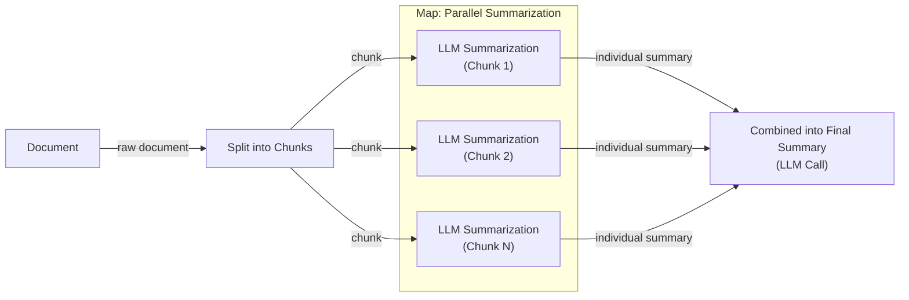
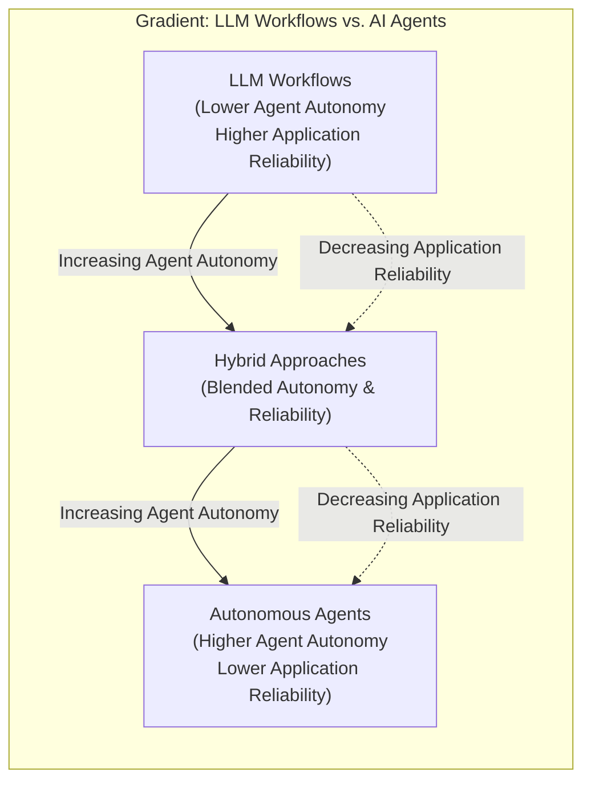
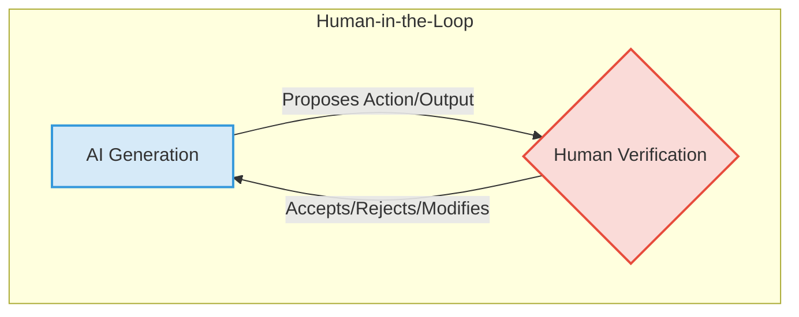
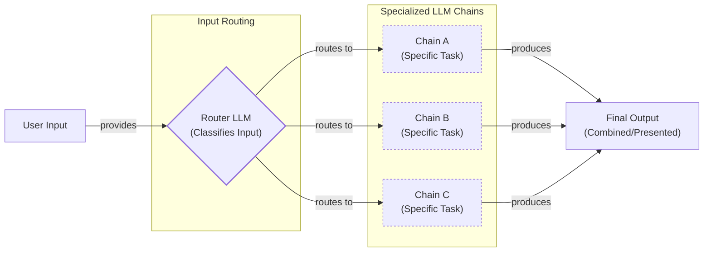
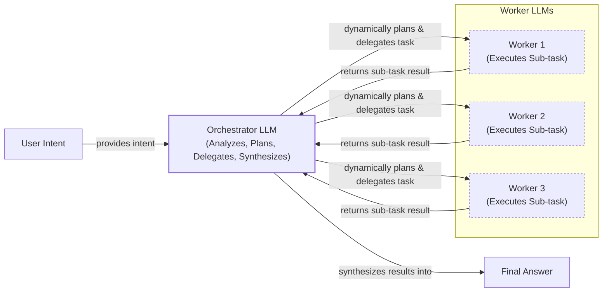
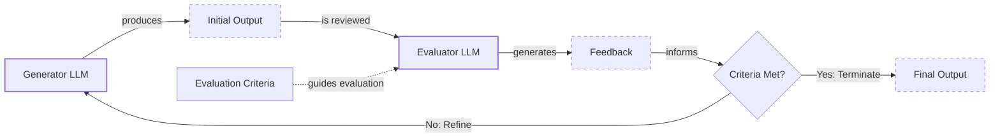
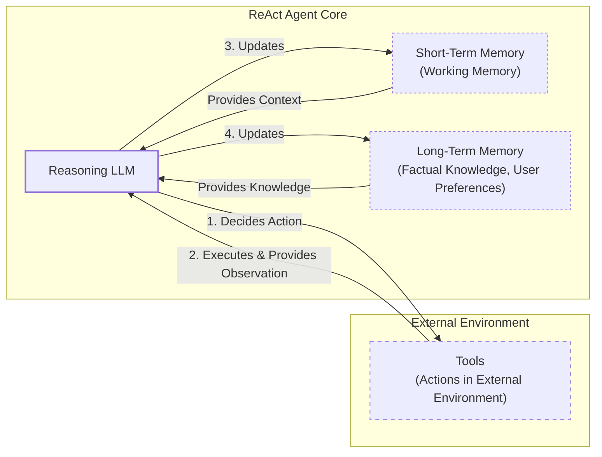
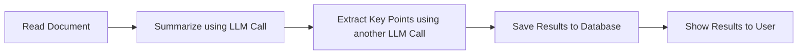
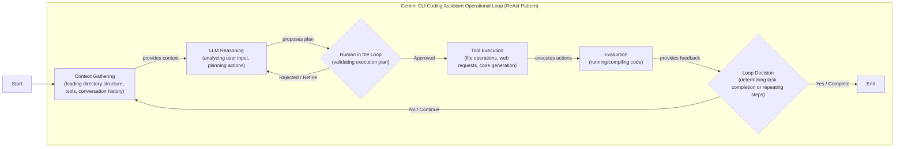
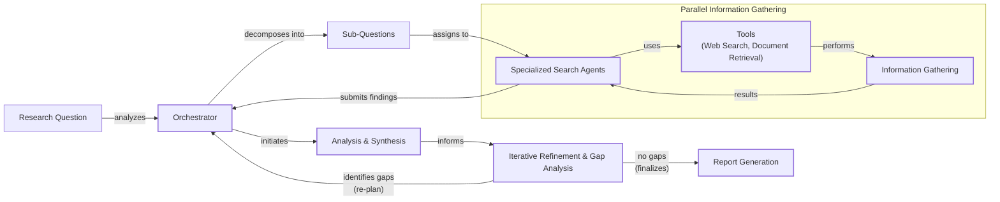

# The Critical Decision Every AI Engineer Faces: Workflows vs. Agents

As an AI engineer preparing to build your first real AI application, after narrowing down the problem you want to solve, one key decision is how to design your AI solution. Should it follow a predictable, step-by-step workflow, or does it demand a more autonomous approach, where the LLM makes self-directed decisions along the way? Thus one of the fundamental questions that will determine the success or failure of your project is: How should you architect your AI system?

When building AI applications, you face this critical architectural decision early in your development process. Should you create a predictable, step-by-step workflow where you control every action, or should you build an autonomous agent that can think and decide for itself? This is one of the key decisions that will impact everything from the product, such as development time and costs, to reliability and user experience.

Choosing the wrong approach can have serious consequences. You might build an overly rigid system that breaks the moment a user deviates from the expected path or when developers try to add new features. On the other hand, you could create an unpredictable agent that works brilliantly 80% of the time but fails catastrophically when it matters most, leading to costly errors and eroding user trust. Months of development time can be wasted rebuilding the entire architecture from scratch. This leads to frustrated users who cannot rely on the AI application and frustrated executives who cannot afford to keep it running as the costs spiral out of control relative to the profits.

In 2024-2025, we are seeing that billion-dollar AI startups succeed or fail based primarily on this architectural decision. The most successful teams and AI engineers know when to use workflows versus agents and, more importantly, how to combine both approaches effectively. They understand that the choice is not a binary one but a spectrum, and finding the right point on that spectrum is what separates a robust, scalable product from a brittle prototype.

This lesson will provide you with a framework to make this critical architectural decision. We will explore the fundamental trade-offs, examine real-world examples from leading AI companies, and show you how to design robust systems that use the best of both approaches. By the end, you’ll be equipped to choose the right path for your AI applications.

## Understanding the Spectrum: From Workflows to Agents

To make the right architectural choice, you first need a clear understanding of what LLM workflows and AI agents are. We will not focus on the technical specifics yet, but rather on their core properties and how they function in practice.

### LLM Workflows

An LLM workflow is a sequence of tasks involving LLM calls or other operations, such as reading from a database or writing to a file system. The key characteristic is that this sequence is largely predefined and orchestrated by developer-written code. The steps are defined in advance, resulting in deterministic or rule-based paths with predictable execution and explicit control flow. This approach has deep roots in AI history, evolving from the rule-based "expert systems" of the 1970s and 80s, which encoded domain-specific knowledge into if-then logic to mimic human expertise in narrow tasks [[35]](https://ai.plainenglish.io/from-expert-systems-to-multimodal-large-language-models-llms-a-journey-through-ai-evolution-6aeb3135a7c9).

Think of a workflow as a factory assembly line: each station performs a specific, repeatable task in a set order to produce a consistent output. A simple example is a document summarization pipeline. The workflow takes a long document, splits it into smaller chunks, summarizes each chunk in parallel using an LLM, and then combines these summaries into a final, coherent overview. This map/reduce approach is a pure workflow because every step is explicitly coded and follows a predictable path [[3]](https://cloud.google.com/blog/products/ai-machine-learning/long-document-summarization-with-workflows-and-gemini-models).


Image 1: A flowchart illustrating a simple LLM workflow for document summarization using a map/reduce approach.

In future lessons, we will explore advanced workflow patterns like chaining, routing, and the orchestrator-worker model, which add more complexity and intelligence while keeping the developer in control.

### AI Agents

In contrast, AI agents are systems where an LLM plays a central role in dynamically deciding the sequence of steps and actions needed to achieve a goal. The path is not defined in advance; instead, the agent plans and reasons based on the task and the current state of its environment. This makes agents adaptive and capable of handling novel situations, driven by the LLM's autonomy in decision-making. An agent is like a skilled human expert addressing an unfamiliar problem, adapting their approach with each new piece of information. This parallels the decision-making processes in autonomous robotics, where an agent must perceive its environment, plan a sequence of actions, and execute them to achieve a goal, often with minimal human intervention [[36]](https://www.computer.org/publications/tech-news/community-voices/autonomous-ai-agents).

An agentic system typically consists of a few core components: an LLM that acts as the "brain," a set of actions (or tools) it can use to interact with its environment, and memory to retain context from past interactions. The agent uses these components in a continuous loop of reasoning and acting until its goal is complete [[17]](https://cloud.google.com/discover/what-are-ai-agents). We will cover tools, memory, and agent architectures like ReAct in much greater detail in upcoming lessons.

```mermaid
flowchart LR
  %% Input
  subgraph Input["Input"]
    Task["Task"]
    Role["Role"]
  end

  %% Agent Core
  subgraph AgentCore["Agent Core"]
    Agent["Agent<br/>(LLM)"]
    Planning["Planning<br/>(Reflection, Self-critics)"]
  end

  %% Memory
  subgraph Memory["Memory"]
    STM["Short-term Memory"]
    LTM["Long-term Memory"]
  end

  %% Tools
  subgraph Tools["Tools"]
    VSE["Vector Search Engine"]
    WS["Web Search"]
    Calc["Calculator"]
    Email["Email Provider"]
    Msg["Messaging App"]
  end

  Observations["Observations"]

  %% Primary Data Flow
  Task -- "provides" --> Agent
  Role -- "provides" --> Agent
  Task -- "informs" --> Planning
  Role -- "informs" --> Planning

  Agent -- "guides" --> Planning
  Planning -- "decides actions" --> Agent

  Agent -- "accesses" --> STM
  STM -- "provides context" --> Agent
  Agent -- "updates" --> STM

  Agent -- "accesses" --> LTM
  LTM -- "provides context" --> Agent
  Agent -- "updates" --> LTM

  Agent -- "uses" --> VSE
  Agent -- "uses" --> WS
  Agent -- "uses" --> Calc
  Agent -- "uses" --> Email
  Agent -- "uses" --> Msg

  VSE -- "returns raw data" --> Observations
  WS -- "returns raw data" --> Observations
  Calc -- "returns raw data" --> Observations
  Email -- "returns raw data" --> Observations
  Msg -- "returns raw data" --> Observations

  Observations -- "informs" --> Agent
  Observations -- "updates" --> Planning
  Observations -- "updates" --> STM
  Observations -- "updates" --> LTM

  Planning -- "refines strategy" --> Agent
  STM -- "informs planning" --> Planning
  LTM -- "informs planning" --> Planning

  %% Visual Grouping (without explicit styling)
  classDef inputNode
  classDef agentCoreNode
  classDef memoryNode
  classDef toolNode
  classDef feedbackNode

  class Task,Role inputNode
  class Agent,Planning agentCoreNode
  class STM,LTM memoryNode
  class VSE,WS,Calc,Email,Msg toolNode
  class Observations feedbackNode
```
Image 2: A diagram illustrating a simple agentic system with an Agent (LLM) interacting with Memory, Tools, and Planning, showing a cyclical feedback loop based on observations.

Both workflows and agents require an orchestration layer to manage their execution. However, the nature of this layer differs. In a workflow, the orchestrator is like a project manager executing a predefined plan. In an agentic system, the orchestrator acts more like a facilitator, enabling the LLM's dynamic planning process and ensuring it has the resources it needs to make decisions.

## Choosing Your Path

Now that we have defined LLM workflows and AI agents, we can explore their fundamental difference: developer-defined logic versus LLM-driven autonomy. This is not a binary choice but a spectrum. Most real-world systems are hybrids, blending elements of both to find the right balance of control and flexibility.


Image 3: A diagram illustrating the gradient between LLM workflows and AI agents, showing the trade-off between agent autonomy and application reliability.

### When to Use LLM Workflows

Workflows are the right choice when the task is well-defined and requires predictable, reliable execution. This includes pipelines for data extraction and transformation from sources like Slack, Zoom, or Google Drive, automated report generation, and content repurposing. For example, you can create a workflow that automatically transforms articles into a series of social media posts or understands project requirements from a Notion page to create and update tasks. Because the steps are explicitly coded, you can ensure consistency and easily debug any issues.

The primary strength of workflows is their predictability. This makes them ideal for enterprise environments and regulated fields like finance and healthcare, where accuracy and auditability are non-negotiable. For example, an AI tool that generates financial reports must produce correct and verifiable information every time, as its output directly impacts financial decisions [[23]](https://cloud.google.com/transform/101-real-world-generative-ai-use-cases-from-industry-leaders). Workflows also offer more predictable costs and latency, as you can often use smaller, specialized models for each sub-task. This makes them a great starting point for a Minimum Viable Product (MVP), where you can hardcode features to get a product to market quickly.

However, workflows can be rigid. They struggle with unexpected user inputs or novel scenarios, and adding new features can become complex over time, much like traditional software development.

### When to Use AI Agents

Agents excel at open-ended, dynamic tasks where the path to a solution is not clear from the start. Examples include complex research and synthesis, such as investigating a broad topic like World War II, or dynamic problem-solving like debugging code. In these scenarios, an agent's ability to reason, adapt, and explore different paths is a significant advantage. This flexibility allows agents to handle ambiguity and complexity in ways that a predefined workflow cannot.

However, this autonomy comes with trade-offs. Agents are inherently non-deterministic, which means their performance, latency, and costs can vary with each run. This makes them less reliable for mission-critical tasks. Common failure modes in production include step repetition, loss of context, and an inability to recognize when a task is complete [[37]](https://medium.com/@michael.hannecke/why-ai-agents-fail-in-production-what-ive-learned-the-hard-way-05f5df98cbe5). A recent study of AI agent development challenges on Stack Overflow and GitHub found that runtime reliability and orchestration are major difficulties, with agent-specific issues being harder to resolve than more common configuration problems [[15]](https://arxiv.org/html/2510.25423v2). There are also significant security concerns, as an autonomous agent with write permissions could potentially delete data or send unauthorized communications. Some developers have even joked about their code being deleted by an agent, saying, "Anyway, I wanted to start a new project."

### Hybrid Approaches and the Autonomy Slider

Most production systems are not pure workflows or pure agents; they are hybrids that sit somewhere along the spectrum. Andrej Karpathy introduced the concept of an "autonomy slider," which allows developers to choose how much control to give the AI versus the user [[10]](https://medium.com/@ben_pouladian/andrej-karpathy-on-software-3-0-software-in-the-age-of-ai-b25533da93b6).

This idea is visible in products like the coding assistant Cursor and the answer engine Perplexity. In Cursor, you can start with simple tab-completion (low autonomy), move to editing a selected block of code (Cmd+K), change an entire file (Cmd+L), or give the agent full control to modify the entire repository (Cmd+I) [[12]](https://www.linkedin.com/posts/markbarbir_andrej-karpathys-latest-talk-describes-our-activity-7343449417426837505-oTFx). Similarly, Perplexity offers a "quick search" (a simple workflow), a "research" mode, and a "deep research" mode that gives the AI more autonomy to conduct a multi-step investigation [[11]](https://andrewships.substack.com/p/autonomy-sliders).

The ultimate goal is to create a fast and efficient loop between AI generation and human verification. As Karpathy notes, this is best achieved through a combination of well-designed architecture and a user-friendly interface that allows humans to easily audit and guide the AI's work [[14]](https://singjupost.com/andrej-karpathy-software-is-changing-again/).


Image 4: A diagram illustrating the AI generation and human verification loop.

## Exploring Common Patterns

To help you build an intuition for AI engineering, we will now introduce some of the most common patterns for building both LLM workflows and AI agents. We will keep these explanations high-level, as each pattern will be covered in depth in future lessons.

### LLM Workflow Patterns

Workflows are all about structuring a series of tasks. Here are a few foundational patterns.

**Chaining and Routing** is the simplest form of automation. It involves linking multiple LLM calls together in a sequence, where the output of one step becomes the input for the next. You can also add routing logic to direct the workflow down different paths based on certain conditions. This is useful for tasks that can be broken down into a clear, linear sequence of sub-tasks, such as translating a document and then verifying its accuracy [[21]](https://mlpills.substack.com/p/issue-110-llm-workflow-patterns). This pattern is highly predictable and easy to debug, but it lacks flexibility when a task requires conditional logic or adaptive sequencing.


Image 5: A flowchart illustrating the "Chaining and Routing" pattern for LLM workflows.

The **Orchestrator-Worker** pattern introduces a layer of dynamic decision-making and reflects a major trend in enterprise AI, where systems of specialized agents collaborate to execute complex workflows [[38]](https://www.databricks.com/blog/enterprise-ai-agent-trends-top-use-cases-governance-evaluations-and-more). A central "orchestrator" LLM analyzes a user's intent, breaks the task into sub-tasks, and delegates them to specialized "worker" LLMs or tools [[25]](https://online.stevens.edu/blog/building-self-healing-ai-orchestrator-reflexion-patterns/). The orchestrator then synthesizes the results into a final answer. This pattern is a smooth transition from rigid workflows to more adaptive agentic systems, as it allows the AI to dynamically decide which actions to take. However, the orchestrator can become a performance bottleneck and a single point of failure. Production systems mitigate this with engineering best practices like setting timeouts for worker agents (typically 30-60 seconds), implementing retries with exponential backoff for transient errors, and ensuring worker tools are idempotent to prevent duplicate operations [[39]](https://gurusup.com/blog/multi-agent-orchestration-guide).


Image 6: A flowchart illustrating the Orchestrator-Worker pattern for LLM workflows, emphasizing dynamic planning and delegation.

The **Evaluator-Optimizer Loop** is designed to improve the quality of LLM outputs through auto-correction. It is most effective when you have clear evaluation criteria and the task benefits from iterative refinement [[40]](https://platform.claude.com/cookbook/patterns-agents-evaluator-optimizer). In this pattern, one LLM generates an initial response, and a second "evaluator" LLM reviews it based on a set of criteria. If the output does not meet the standard, the evaluator provides feedback, and the generator revises its response [[30]](https://docs.aws.amazon.com/prescriptive-guidance/latest/agentic-ai-patterns/evaluator-reflect-refine-loop-patterns.html). This iterative process is analogous to a human writer refining a document based on an editor's feedback.


Image 7: A flowchart illustrating the Evaluator-Optimizer Loop pattern for LLM workflows.

For example, here is a Python implementation from Anthropic's cookbook showing how to build an iterative coding loop. First, a `generate` function creates the code, then an `evaluate` function checks it against the requirements. The `loop` function continues this cycle until the evaluation passes.

1.  The `loop` function orchestrates the process, calling the generator and evaluator until the criteria are met.
    ```python
    def loop(task: str, evaluator_prompt: str, generator_prompt: str) -> tuple[str, list[dict]]:
        """Keep generating and evaluating until requirements are met."""
        memory = []
        chain_of_thought = []
    
        thoughts, result = generate(generator_prompt, task)
        memory.append(result)
        chain_of_thought.append({"thoughts": thoughts, "result": result})
    
        while True:
            evaluation, feedback = evaluate(evaluator_prompt, result, task)
            if evaluation == "PASS":
                return result, chain_of_thought
    
            context = "\n".join(
                ["Previous attempts:", *[f"- {m}" for m in memory], f"\nFeedback: {feedback}"]
            )
    
            thoughts, result = generate(generator_prompt, task, context)
            memory.append(result)
            chain_of_thought.append({"thoughts": thoughts, "result": result})
    ```
2.  The `evaluate` function uses an LLM to check the generated code and provide feedback.
    ```python
    def evaluate(prompt: str, content: str, task: str) -> tuple[str, str]:
        """Evaluate if a solution meets requirements."""
        full_prompt = f"{prompt}\nOriginal task: {task}\nContent to evaluate: {content}"
        response = llm_call(full_prompt)
        evaluation = extract_xml(response, "evaluation")
        feedback = extract_xml(response, "feedback")
    
        print("=== EVALUATION START ===")
        print(f"Status: {evaluation}")
        print(f"Feedback: {feedback}")
        print("=== EVALUATION END ===\n")
    
        return evaluation, feedback
    ```
This example shows how a structured workflow can systematically improve the quality of an AI-generated artifact, fulfilling a key requirement for production systems [[40]](https://platform.claude.com/cookbook/patterns-agents-evaluator-optimizer).

### Core Components of a ReAct AI Agent

The ReAct (Reason and Act) framework is one of the most effective and widely used patterns for building AI agents. It enables an agent to reason about a task, decide on an action, interpret the outcome of that action, and repeat the cycle until the task is complete. This is the core of how most modern agents from the industry use the ReAct pattern as it has shown the most potential.

A ReAct agent has a few essential components:
*   A **Reasoning LLM** acts as the central processor, analyzing the task, planning steps, and interpreting the results of its actions. It is the "brain" of the operation, making decisions based on the current context and its long-term goals.
*   **Actions** (or tools) are the agent's "hands," allowing it to interact with the external environment. These could be anything from a web search to a database query or an API call. The effectiveness of an agent is often determined by the quality and relevance of the tools it has access to. We will cover actions in detail in Lesson 6.
*   **Short-term memory** serves as the agent's working memory, similar to a computer's RAM. It holds the context of the current conversation, recent actions, and their outcomes, allowing the agent to maintain a coherent train of thought.
*   **Long-term memory** provides the agent with persistent knowledge, including factual data (semantic memory) and user preferences (episodic memory), allowing it to learn and personalize its responses across sessions. We will dedicate Lesson 9 to memory systems.

The agent operates in a continuous loop, using the LLM to reason about the current state, select an action, observe the result, and update its memory before deciding on the next step.


Image 8: A high-level diagram illustrating the core components and dynamics of a ReAct AI agent.

## Zooming In on Our Favorite Examples

To anchor these concepts in the real world, let's look at a few state-of-the-art examples, moving from a simple workflow to a complex hybrid system.

### Document Summarization and Analysis Workflow by Gemini in Google Workspace

When working in a team, finding the right information in large documents can be a time-consuming process. A quick, embedded summary can guide your search and save valuable time. Gemini in Google Workspace provides a perfect example of a simple, multi-step workflow for this task [[1]](https://support.google.com/docs/answer/15627020?hl=en), [[4]](https://knowledge.workspace.google.com/admin/gemini/google-workspace-with-gemini).

This is a pure workflow because it follows a predefined sequence of LLM calls without any dynamic decision-making. The process is straightforward and optimized for reliability. When a user activates the feature, the system first reads the entire document's content. It then sends this content to a specialized summarization model. A subsequent, separate LLM call might be used to extract key action items or talking points from the summary. Finally, the structured output is saved and presented to the user in a clean interface, often directly within the document editor. Each step is predictable, making the feature easy to debug and cost-effective to run at scale.


Image 9: Document Summarization and Analysis Workflow by Gemini in Google Workspace

### Gemini CLI Coding Assistant

Writing code is a slow and often tedious process that involves reading documentation, understanding new codebases, and learning new programming languages. A coding assistant can significantly speed up this process. The open-source Gemini CLI is a powerful example of a single-agent system that leverages the ReAct architecture to assist developers. It is implemented in TypeScript and offers a range of use cases, from writing code from scratch ("vibe coding") to assisting experienced engineers with specific functions, writing documentation, and quickly understanding new codebases.

The Gemini CLI works by first gathering context from the local environment, including the directory structure and available tools. The Gemini model then analyzes the user's request and devises a plan, which it validates with the user. Once approved, it executes a series of actions, such as reading files, searching the web for documentation, and generating code. It can even compile or run the code to evaluate its correctness, repeating the process until the task is complete [[5]](https://developers.google.com/gemini-code-assist/docs/gemini-cli). This iterative loop of reasoning, acting, and evaluating is the essence of the ReAct pattern. In production, however, such agents face limitations. The context window is often the primary bottleneck, and to prevent infinite loops or runaway processes, systems like Gemini CLI implement hard limits on the number of tool calls per turn and may halt if an agent calls the same tool with the same arguments repeatedly [[41]](https://blog.apiad.net/p/the-anatomy-of-ai-coding-agents).

The power of this agent comes from its diverse set of actions. These tools can be grouped into several categories. For file system access, it has functions like `grep` to read specific code blocks or list directory structures. For coding, it can interpret and execute code for dynamic validation or generate diffs for review. For knowledge gathering, it can perform web searches to find documentation or solutions on blogs. It can even interact with version control systems like Git to automatically commit changes.


Image 10: A flowchart illustrating the operational loop of the "Gemini CLI Coding Assistant" as a single-agent system leveraging the ReAct pattern.

### Perplexity Deep Research

Researching a new topic can be daunting. You often do not know where to start, and sifting through countless sources is time-consuming. Perplexity's Deep Research feature is a powerful research assistant that automates this process, and it serves as an excellent example of a hybrid system that combines structured workflows with dynamic agents.

While the exact implementation is closed-source, we can infer its architecture based on publicly available information. This multi-agent architecture is emblematic of a broader shift in enterprise AI, moving beyond single chatbots to orchestrated systems of specialized agents that can handle complex, multi-step tasks [[38]](https://www.databricks.com/blog/enterprise-ai-agent-trends-top-use-cases-governance-evaluations-and-more). The system likely starts with an orchestrator that analyzes the user's research question and breaks it down into several sub-questions. It then deploys multiple specialized research agents in parallel, each tasked with investigating one sub-question [[6]](https://zenvanriel.com/ai-engineer-blog/perplexity-computer-multi-model-agent-orchestration/). These agents use tools like web search to gather information, which they then analyze, synthesize, and score for relevance. The analysis phase is particularly important; each agent validates its sources for credibility and ranks them based on how directly they address the sub-question. The top sources are then summarized.

The orchestrator collects the findings from all agents and performs a gap analysis to identify any missing information. This iterative refinement is driven by the detection of these knowledge gaps. For instance, if the initial synthesis reveals unanswered questions or conflicting data, the orchestrator can spawn new agents with targeted queries to resolve these specific gaps before finalizing the report [[42]](https://trilogyai.substack.com/p/multi-agent-deep-research-architecture). If necessary, it generates new sub-questions and repeats the process. Once the research is complete, the orchestrator compiles the information from all agents into a single, comprehensive report with citations [[8]](https://www.perplexity.ai/hub/blog/introducing-perplexity-deep-research). This hybrid approach leverages the orchestrator-worker workflow to supervise multiple ReAct agents, combining structured planning with the adaptive reasoning of individual agents.


Image 11: Flowchart illustrating the iterative multi-step process of "Perplexity Deep Research" as a hybrid system.

## The Challenges of Every AI Engineer

Now that you understand the spectrum from LLM workflows to AI agents, it is important to recognize that every AI engineer faces these same fundamental challenges when designing a new AI application. This architectural decision is one of the core factors that determine whether an AI product succeeds in production or fails spectacularly.

Here are some of the daily challenges every AI engineer battles:
*   **Reliability Issues:** Your agent works perfectly in demos but becomes unpredictable with real users. LLM reasoning failures can compound through multi-step processes, leading to unexpected and costly outcomes. A large-scale study on developer forums found that runtime reliability and operational robustness are among the top five major challenges in agent development, with issues like malformed tool outputs repeatedly breaking execution loops [[15]](https://arxiv.org/html/2510.25423v2).
*   **Context Limits:** Systems struggle to maintain coherence across long conversations, gradually losing track of their purpose. A related issue is retrieval noise, where agents are given access to large, unstructured data sources, causing the context window to become overloaded with irrelevant information [[43]](https://arize.com/blog/common-ai-agent-failures/). Ensuring consistent output quality across different agent specializations presents a continuous challenge [[17]](https://medium.com/@ananya_95177/key-challenges-in-ai-agent-development-and-how-to-solve-them-460fceb0a6d5).
*   **Data Integration:** Building pipelines to pull information from Slack, web APIs, SQL databases, and data lakes is complex. You must ensure that only high-quality data is passed to your AI system, following the "garbage-in, garbage-out" principle. This involves not just data access but also managing latency and validation.
*   **Cost-Performance Trap:** Sophisticated agents can deliver impressive results but may cost a fortune per user interaction, making them economically unfeasible for many applications. The multiple reasoning steps and tool calls inherent in agentic behavior can lead to spiraling token consumption. Careful resource management is essential.
*   **Security Concerns:** Autonomous agents with powerful write permissions could send wrong emails, delete critical files, or expose sensitive data. These are not theoretical risks. By early 2026, security firms reported that 1 in 8 enterprise breaches involved an agentic system, often due to "permission creep" where agents accumulate excessive access rights over time [[44]](https://www.digitalapplied.com/blog/ai-agent-security-2026-1-in-8-breaches-agentic-systems). In a high-profile case, security researchers used an AI agent to hack McKinsey's internal chatbot, gaining full read-write access to its production database, including millions of confidential messages, in just two hours by exploiting a SQL injection vulnerability [[45]](https://www.theregister.com/2026/03/09/mckinsey_ai_chatbot_hacked/). Robust safeguards are necessary to mitigate these risks [[16]](https://permiso.io/blog/8-critical-ai-security-challenges), [[19]](https://www.cyberark.com/resources/blog/the-agentic-ai-revolution-5-unexpected-security-challenges).

These challenges are solvable. In upcoming lessons, we will cover patterns for building reliable products through specialized evaluation and monitoring pipelines, strategies for building hybrid systems, and ways to keep costs and latency under control. In our next lesson, we will explore structured outputs, a key technique for making LLM responses more reliable. We will also delve deeper into the concepts mentioned here, such as memory, actions, and advanced RAG techniques.

By the end of this course, you will have the knowledge to architect AI systems that are not only powerful but also robust, efficient, and safe. You will know when to use workflows versus agents and how to build effective hybrid systems that work in the real world.

## References

- [1] https://support.google.com/docs/answer/15627020?hl=en
- [2] https://masterconcept.ai/blog/new-google-workspace-gemini-feature-your-pdfs-now-write-their-own-summaries-and-suggest-next-steps/
- [3] https://cloud.google.com/blog/products/ai-machine-learning/long-document-summarization-with-workflows-and-gemini-models
- [4] https://knowledge.workspace.google.com/admin/gemini/google-workspace-with-gemini
- [5] https://developers.google.com/gemini-code-assist/docs/gemini-cli
- [6] https://zenvanriel.com/ai-engineer-blog/perplexity-computer-multi-model-agent-orchestration/
- [7] https://www.gend.co/blog/perplexity-computer-ai-agent-orchestration
- [8] https://www.perplexity.ai/hub/blog/introducing-perplexity-deep-research
- [9] https://www.digitalapplied.com/blog/perplexity-agent-api-platform-ai-search-developer-guide
- [10] https://medium.com/@ben_pouladian/andrej-karpathy-on-software-3-0-software-in-the-age-of-ai-b25533da93b6
- [11] https://andrewships.substack.com/p/autonomy-sliders
- [12] https://www.linkedin.com/posts/markbarbir_andrej-karpathys-latest-talk-describes-our-activity-7343449417426837505-oTFx
- [13] https://www.latent.space/p/s3
- [14] https://singjupost.com/andrej-karpathy-software-is-changing-again/
- [15] https://arxiv.org/html/2510.25423v2
- [16] https://permiso.io/blog/8-critical-ai-security-challenges
- [17] https://medium.com/@ananya_95177/key-challenges-in-ai-agent-development-and-how-to-solve-them-460fceb0a6d5
- [18] https://unit42.paloaltonetworks.com/agentic-ai-threats/
- [19] https://www.cyberark.com/resources/blog/the-agentic-ai-revolution-5-unexpected-security-challenges
- [20] https://mirascope.com/blog/llm-chaining
- [21] https://mlpills.substack.com/p/issue-110-llm-workflow-patterns
- [22] https://orq.ai/blog/prompt-structure-chaining
- [23] https://cloud.google.com/transform/101-real-world-generative-ai-use-cases-from-industry-leaders
- [24] https://www.promptingguide.ai/techniques/prompt_chaining
- [25] https://online.stevens.edu/blog/building-self-healing-ai-orchestrator-reflexion-patterns/
- [26] https://mlpills.substack.com/p/diy-17-orchestrator-worker-llm-agent
- [27] https://www.linkedin.com/posts/seanf_the-orchestrator-worker-pattern-is-a-well-known-activity-7294775230353313792-_zFL
- [28] https://platform.claude.com/cookbook/patterns-agents-orchestrator-workers
- [29] https://gurusup.com/blog/agent-orchestration-patterns
- [30] https://docs.aws.amazon.com/prescriptive-guidance/latest/agentic-ai-patterns/evaluator-reflect-refine-loop-patterns.html
- [31] https://dev.to/clayroach/building-self-correcting-llm-systems-the-evaluator-optimizer-pattern-169p
- [32] https://vadim.blog/the-research-on-llm-self-correction
- [33] https://platform.claude.com/cookbook/patterns-agents-evaluator-optimizer
- [34] https://sebgnotes.substack.com/p/evaluator-optimizer-llm-workflow
- [35] https://ai.plainenglish.io/from-expert-systems-to-multimodal-large-language-models-llms-a-journey-through-ai-evolution-6aeb3135a7c9
- [36] https://www.computer.org/publications/tech-news/community-voices/autonomous-ai-agents
- [37] https://medium.com/@michael.hannecke/why-ai-agents-fail-in-production-what-ive-learned-the-hard-way-05f5df98cbe5
- [38] https://www.databricks.com/blog/enterprise-ai-agent-trends-top-use-cases-governance-evaluations-and-more
- [39] https://gurusup.com/blog/multi-agent-orchestration-guide
- [40] https://platform.claude.com/cookbook/patterns-agents-evaluator-optimizer
- [41] https://blog.apiad.net/p/the-anatomy-of-ai-coding-agents
- [42] https://trilogyai.substack.com/p/multi-agent-deep-research-architecture
- [43] https://arize.com/blog/common-ai-agent-failures/
- [44] https://www.digitalapplied.com/blog/ai-agent-security-2026-1-in-8-breaches-agentic-systems
- [45] https://www.theregister.com/2026/03/09/mckinsey_ai_chatbot_hacked/