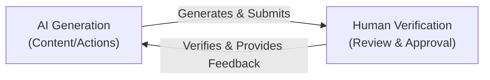
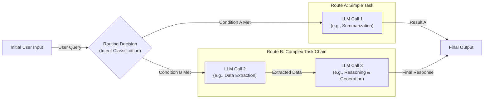
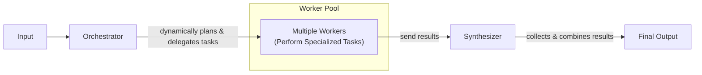
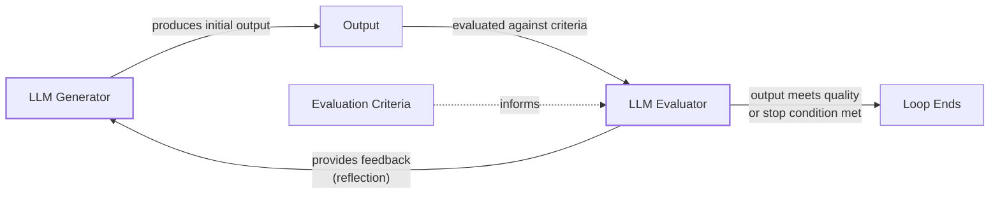
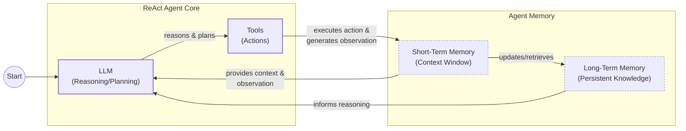
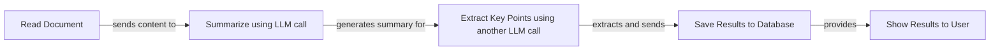
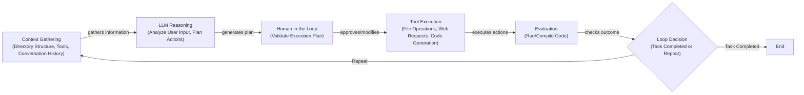
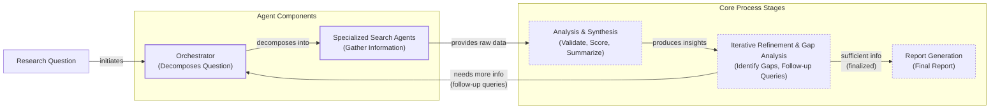

# Lesson 2: AI Agents vs. LLM Workflows

As an AI engineer preparing to build your first real AI application, after narrowing down the problem you want to solve, one key decision is how to design your AI solution. Should it follow a predictable, step-by-step workflow, or does it demand a more autonomous approach, where the LLM makes self-directed decisions along the way? Thus, one of the fundamental questions that will determine the success or failure of your project is: How should you architect your AI system?

Choosing the wrong approach can lead to an overly rigid system that breaks when users deviate from expected patterns, or an unpredictable agent that works brilliantly 80% of the time but fails catastrophically when it matters most. It can mean months of development time wasted rebuilding the entire architecture, frustrated users who cannot rely on the application, and executives who cannot afford to keep it running.

In 2024 and 2025, we have seen billion-dollar AI startups succeed or fail based on this architectural decision. The most successful teams and engineers know when to use workflows versus agents and, more importantly, how to combine both approaches effectively.

This lesson will provide a framework to make this critical decision with confidence. We will explore the fundamental trade-offs, see real-world examples from leading AI companies, and learn how to design robust systems that leverage the best of both worlds. By the end, you will be equipped to choose the right path for your AI applications.

## Understanding the Spectrum: From Workflows to Agents

To make an informed decision, you first need to understand the two core methodologies for building AI applications: LLM workflows and AI agents. While the terms are often used interchangeably, they represent fundamentally different architectural philosophies. Let's look at what each one is, their core properties, and where they fit on the spectrum of AI system design.

### LLM Workflows: The Predictable Assembly Line

An LLM workflow is a sequence of tasks that involves one or more LLM calls, orchestrated by developer-written code. Think of it as a factory assembly line: each step is predefined, the control flow is explicit, and the outcome is predictable [[1]](https://www.anthropic.com/engineering/building-effective-agents). You, the developer, are in complete control. You define the logic, set the rules, and determine the exact sequence of operations.

The execution path is deterministic. An input is processed through a series of steps—like retrieving data, calling a tool, or making an LLM call for summarization—and the system follows that path every time. This makes workflows reliable and easier to debug. If something breaks, you can trace the error back to a specific step in your code. We will explore common workflow patterns like chaining, routing, and the orchestrator-worker model in future lessons.
Image 1: A map-reduce workflow for summarizing a long document. Each step is predefined by the developer. (Source [Google Cloud Blog](https://cloud.google.com/blog/products/ai-machine-learning/long-document-summarization-with-workflows-and-gemini-models))

### AI Agents: The Autonomous Expert

In contrast, an AI agent is a system where the LLM dynamically directs its own processes and tool usage to achieve a goal [[1]](https://www.anthropic.com/engineering/building-effective-agents). Instead of following a script, the agent reasons about the task, creates a plan, and decides which actions to take. The logic is not hardcoded; it emerges from the model's reasoning process.

This is more like a skilled human expert tackling an unfamiliar problem. The agent can adapt to new information, recover from errors, and choose the best path forward on the fly. This autonomy is made possible by giving the LLM access to tools (actions it can perform), and memory (information it can retain) [[2]](https://cloud.google.com/discover/what-are-ai-agents). We will cover these concepts in-depth in future lessons, particularly when we discuss the ReAct (Reason and Act) framework, which is the foundation for most modern agents.
Image 2: The architecture of a typical AI agent, which uses an LLM to reason, plan, and execute actions in a loop. (Source [Palo Alto Unit 42](https://unit42.paloaltonetworks.com/agentic-ai-threats/))

### The Role of Orchestration

Both workflows and agents require an orchestration layer, but its function is different in each. In a workflow, the orchestrator is like a project manager executing a fixed blueprint. It follows your code, calling the right components in the right order. In an agentic system, the orchestrator acts more like a facilitator. It provides the environment and tools, but the LLM itself is the project manager, making decisions and directing the workflow.

This distinction is the heart of the matter: are you defining the logic, or is the LLM?

## Choosing Your Path

The core difference between workflows and agents comes down to developer-defined logic versus LLM-driven autonomy. Most real-world systems are not purely one or the other but exist on a spectrum. The choice is about finding the right balance of control and flexibility for your specific use case [[3]](https://www.youtube.com/watch?v=kQxr-uOxw2o&t=1s).
Image 3: The spectrum from workflows to agents, showing the trade-off between reliability and adaptability. (Source [Decoding ML](https://decodingml.substack.com/p/llmops-for-production-agentic-rag))

### When to Use LLM Workflows

Workflows excel in scenarios where the tasks are repeatable and the steps are well-defined. Their predictability makes them the go-to choice for enterprise and regulated environments.

**Use workflows for:**

*   **Data processing pipelines:** Extracting, transforming, and loading data from various sources like Slack, Notion, or Google Drive.
*   **Automated content generation:** Creating reports from structured data, drafting standardized emails, or repurposing articles into social media posts.
*   **Repetitive operational tasks:** Sending daily follow-ups, tagging support tickets, or validating form inputs.

**Strengths:**
Workflows are predictable, reliable, and easier to debug. Because you can often use smaller, specialized models for each step, they can be more cost-effective and have lower latency [[4]](https://towardsdatascience.com/a-developers-guide-to-building-scalable-ai-workflows-vs-agents/). This makes them ideal for high-frequency scenarios where the cost per request is a major factor.

**Weaknesses:**
The main drawback is rigidity. Since every step is manually engineered, they can be brittle when faced with unexpected inputs. Adding new features can also become complex, similar to traditional software development.

### When to Use AI Agents

Agents are best suited for open-ended problems that require dynamic reasoning and adaptation. They thrive in ambiguity, where a fixed set of rules would fail.

**Use agents for:**

*   **Open-ended research and synthesis:** Answering complex questions like "What was the impact of World War II on the global economy?" where the path to an answer is not known in advance.
*   **Dynamic problem-solving:** Debugging code, providing complex customer support, or troubleshooting technical issues.
*   **Interactive task completion:** Navigating unfamiliar websites to book a flight or order groceries, where the interface and steps can vary.

**Strengths:**
The primary strength of agents is their flexibility. They can handle novel situations, learn from their mistakes within a single interaction, and devise creative solutions to complex problems.

**Weaknesses:**
This autonomy comes at a cost. Agents are less reliable and can be unpredictable. Their non-deterministic nature means performance, latency, and costs can vary with each run. They often require larger, more expensive models to power their reasoning, and the multiple LLM calls involved in a single task can quickly drive up expenses. Furthermore, they are notoriously difficult to debug and evaluate. Security is also a major concern; an agent with write permissions could delete your code, as some developers have jokingly posted online after using early coding agents [[4]](https://towardsdatascience.com/a-developers-guide-to-building-scalable-ai-workflows-vs-agents/).

### Hybrid Approaches and the Autonomy Slider

Most production systems are hybrids, blending the stability of workflows with the flexibility of agents [[4]](https://towardsdatascience.com/a-developers-guide-to-building-scalable-ai-workflows-vs-agents/). Andrej Karpathy introduced the concept of an "autonomy slider," where the developer or user decides how much control to give the AI [[5]](https://www.youtube.com/watch?v=LCEmiRjPEtQ).

This is visible in tools like the coding assistant **Cursor**, which offers different levels of autonomy: from simple tab-completion (low autonomy) to file-wide edits (`Cmd+L`) to repository-wide changes (`Cmd+I`), which is a fully agentic mode [[6]](https://singjupost.com/andrej-karpathy-software-is-changing-again/). Similarly, **Perplexity** provides a slider from "search" (a simple workflow) to "research" and "deep research" (more agentic modes) [[6]](https://singjupost.com/andrej-karpathy-software-is-changing-again/).

The goal is to optimize the loop between AI generation and human verification. A well-designed system, whether it is a workflow, an agent, or a hybrid, makes this loop as fast and efficient as possible, often through a thoughtfully designed user interface.

Image 4: A flowchart illustrating the continuous loop between AI generation and human verification, with the goal of speeding up the process.

## Exploring Common Patterns

To build an intuition for AI engineering, let's explore some of the most common patterns used to construct both workflows and agents. We will cover these in much greater detail in upcoming lessons, but for now, we will focus on the high-level concepts.

### LLM Workflow Patterns

Workflows are built by composing simple, reusable patterns. Here are three foundational ones.

**Chaining and routing** is the simplest form of automation. It involves linking multiple LLM calls together in a sequence (chaining) and using an LLM or simple business logic to decide which path to take (routing). This pattern is useful for tasks that can be broken down into a series of linear steps with occasional decision points, like classifying a user's intent and then directing them to a specialized sub-workflow [[7]](https://mlpills.substack.com/p/issue-110-llm-workflow-patterns).

Image 5: A flowchart illustrating the "Chaining and Routing" pattern for LLM workflows.

The **Orchestrator-Worker** pattern introduces a hierarchy. A central "orchestrator" LLM analyzes a complex task, breaks it down into smaller sub-tasks, and delegates them to specialized "worker" models. A final "synthesizer" then integrates the results [[8]](https://platform.claude.com/cookbook/patterns-agents-orchestrator-workers). This is a step toward agentic behavior, as the orchestrator dynamically plans the workflow, but the overall structure is still controlled by the developer.

Image 6: Flowchart illustrating the Orchestrator-Worker pattern

The **Evaluator-Optimizer Loop** is designed to improve output quality through self-correction. One LLM acts as the "generator," producing an initial output. A second "evaluator" LLM then critiques the output based on a set of criteria. This feedback, often called reflection, is passed back to the generator, which refines its response. This loop continues until the output meets the desired quality or a stop condition is met [[9]](https://docs.aws.amazon.com/prescriptive-guidance/latest/agentic-ai-patterns/evaluator-reflect-refine-loop-patterns.html).

Image 7: A flowchart illustrating the Evaluator-Optimizer Loop pattern.

### Core Components of a ReAct AI Agent

Nearly all modern AI agents are built using a pattern called ReAct, which stands for Reason and Act. The core idea is simple: the agent iterates through a loop of thinking (reasoning) and doing (acting) until the task is complete [[10]](https://cloud.google.com/discover/what-are-ai-agents). This is how agents bridge the gap between their internal reasoning and the external world.

We will explore ReAct in depth in Lessons 7 and 8, but here are the essential components:

*   **Reasoning LLM:** This is the "brain" of the agent. It analyzes the task, creates a plan, and decides which action to take next.
*   **Actions (Tools):** These are the "hands" of the agent. They are functions or APIs that allow the agent to interact with the outside world, like searching the web, reading a file, or calling an API. We will dedicate Lesson 6 to tools.
*   **Short-Term Memory:** This is the agent’s working memory, similar to a computer's RAM. It holds the conversation history, previous actions, and their outcomes, providing context for the next reasoning step.
*   **Long-Term Memory:** This provides the agent with persistent knowledge. It can include factual data from databases or websites, as well as user preferences from past interactions. We will cover memory in detail in Lesson 9.

Image 8: A flowchart illustrating the core components and dynamics of a ReAct (Reason and Act) AI agent.

## Zooming In on Our Favorite Examples

To anchor these concepts in the real world, let's analyze three state-of-the-art systems, moving from a simple workflow to a complex hybrid agent. We will keep the explanations high-level, focusing on the architectural patterns rather than the technical details.

### Document Summarization in Google Workspace: A Simple Workflow

A common problem in any organization is finding the right information quickly. Documents are often long, and manually scanning them is time-consuming. A quick, embedded summary can guide your search and save hours of work.

The "Summary by Gemini" feature in Google Workspace is a perfect example of a pure, multi-step workflow [[11]](https://masterconcept.ai/blog/new-google-workspace-gemini-feature-your-pdfs-now-write-their-own-summaries-and-suggest-next-steps/). For long documents that exceed the model's context window, it uses a map-reduce approach [[12]](https://cloud.google.com/blog/products/ai-machine-learning/long-document-summarization-with-workflows-and-gemini-models).

This is a pure workflow because every step is predefined:

1.  **Read Document:** The system first ingests the document content.
2.  **Split into Chunks:** It breaks the long document into smaller, manageable chunks.
3.  **Summarize in Parallel (Map):** It sends each chunk to an LLM for summarization simultaneously.
4.  **Combine Summaries (Reduce):** It combines the individual summaries and sends them to the LLM one last time to create a final, cohesive summary.
5.  **Show Results:** The final summary is displayed to the user.

Image 9: A flowchart illustrating a simple LLM workflow for document summarization and analysis in Google Workspace.

### Gemini CLI: A Single-Agent System for Coding

Writing code is a slow process that involves reading documentation, understanding new codebases, and learning new languages. A coding assistant can dramatically speed this up.

The open-source **Gemini CLI** is a great example of a single-agent system that uses the ReAct pattern to help developers write code [[13]](https://blog.google/technology/developers/introducing-gemini-cli-open-source-ai-agent/), [[14]](https://github.com/google-gemini/gemini-cli/blob/main/README.md). It can write code from scratch (a practice Andrej Karpathy dubbed "vibe coding"), assist with specific functions, or help you understand an existing codebase [[5]](https://www.youtube.com/watch?v=LCEmiRjPEtQ).

Here is a high-level look at its operational loop:

1.  **Context Gathering:** The agent starts by loading its context: the directory structure, available tools (like file system access or web search), and conversation history [[15]](https://wietsevenema.eu/blog/2025/how-gemini-cli-builds-context/).
2.  **LLM Reasoning:** The Gemini model analyzes your request and the current context to form a plan of action.
3.  **Human in the Loop:** Before executing potentially destructive actions, it often validates the plan with you.
4.  **Tool Execution:** The agent executes the chosen actions, such as reading files, searching documentation online, or generating code diffs. The results are added back to its working memory.
5.  **Evaluation:** It can dynamically evaluate the generated code by compiling or running it to check for errors.
6.  **Loop Decision:** The agent decides if the task is complete. If not, it repeats the reasoning and action loop.

Image 10: A flowchart illustrating the operational loop of the Gemini CLI coding assistant, based on the ReAct pattern.

The Gemini CLI demonstrates the power of a single, focused agent. However, for more complex research tasks, a single agent can struggle. This is where hybrid systems come in.

### Perplexity Deep Research: A Hybrid System

Researching a new topic is daunting. You often do not know where to start, which sources are trustworthy, or how to combine disparate pieces of information. A research assistant that can autonomously scan the internet and synthesize a comprehensive report is a game-changer.

**Perplexity's Deep Research** feature is a powerful hybrid system that combines the structured planning of a workflow with the dynamic reasoning of multiple agents [[16]](https://www.perplexity.ai/hub/blog/introducing-perplexity-deep-research). It uses an orchestrator-worker pattern to supervise a team of specialized ReAct agents, allowing it to conduct expert-level research in minutes.

While the exact implementation is closed-source, here is a likely, oversimplified version of how it works:

1.  **Research Planning & Decomposition:** An orchestrator LLM analyzes your research question and breaks it down into several targeted sub-questions.
2.  **Parallel Information Gathering:** The orchestrator deploys multiple specialized search agents, each tasked with one sub-question. These agents run in parallel, using tools like web search to gather information. This isolation keeps each agent focused and its context window clean.
3.  **Analysis and Synthesis:** Each agent independently validates, scores, and summarizes its findings from the sources it gathered.
4.  **Iterative Refinement & Gap Analysis:** The orchestrator collects the reports from all worker agents and analyzes them to identify knowledge gaps. If gaps exist, it generates follow-up queries and repeats the process. This continues until the research is comprehensive or a step limit is reached.
5.  **Final Report Generation:** Once the research is complete, the orchestrator synthesizes all the information into a single, detailed report with inline citations.

Image 11: A flowchart illustrating the iterative multi-step process of Perplexity's Deep Research agent, highlighting its hybrid nature.

Perplexity's agent demonstrates a sophisticated hybrid architecture. It is a workflow at the highest level (the orchestrator-worker pattern), which in turn manages multiple autonomous agents. This design combines the best of both worlds: the structured control of a workflow and the adaptive intelligence of agents.

## The Challenges of Every AI Engineer

Now that you understand the spectrum from workflows to agents, it is important to recognize that every AI engineer faces these same fundamental challenges when designing a new application. This architectural decision is one of the core factors that determine whether your project succeeds in production or fails spectacularly [[17]](https://arxiv.org/html/2510.25423v2).

Here are some of the daily battles every AI engineer faces:

*   **Reliability Issues:** Agents that work perfectly in demos often become unpredictable with real users. LLM reasoning failures can compound through multi-step processes, leading to unexpected and costly outcomes. On Stack Overflow and GitHub, developers frequently report issues with runtime reliability, unhandled exceptions, and orchestration logic breaking down in complex agent systems [[17]](https://arxiv.org/html/2510.25423v2).
*   **Context Limits:** Systems struggle to maintain coherence across long conversations, gradually losing track of their purpose. A recent study of AI agent development challenges found that retrieval, embeddings, and agent memory are among the most difficult problems for developers to solve [[17]](https://arxiv.org/html/2510.25423v2).
*   **Data Integration:** Building robust data pipelines to pull information from disparate sources like Slack, APIs, and databases is a constant struggle. Ensuring only high-quality data reaches your AI system is critical to avoid the "garbage-in, garbage-out" problem.
*   **The Cost-Performance Trap:** Sophisticated agents can deliver impressive results but may cost a fortune per user interaction, making them economically unfeasible for many applications. Careful resource management is essential.
*   **Security Concerns:** Autonomous agents with powerful write permissions pose significant risks. A misconfigured agent could send incorrect emails, delete critical files, or expose sensitive data. Prompt injection, where malicious instructions hidden on a webpage hijack an agent's behavior, is a major threat that requires robust safeguards [[18]](https://unit42.paloaltonetworks.com/agentic-ai-threats/).

These challenges are solvable. In the upcoming lessons, we will systematically tackle each of these issues. You will learn battle-tested patterns for building reliable systems, proven strategies for managing context, and practical approaches for keeping costs and latency under control. We will cover how to implement structured outputs, memory systems, RAG pipelines, and evaluation frameworks that let you deploy with confidence.

Your path forward as an AI engineer is about mastering these realities. By the end of this course, you will have the knowledge to architect AI systems that are not only powerful but also robust, efficient, and safe. You'll know when to use a workflow, when to deploy an agent, and how to build effective hybrid systems that work in the messy, unpredictable real world.

## References

- [1] Anthropic. (2024). *Building effective agents*. [https://www.anthropic.com/engineering/building-effective-agents](https://www.anthropic.com/engineering/building-effective-agents)
- [2] Google Cloud. (2026). *What is an AI agent?*. [https://cloud.google.com/discover/what-are-ai-agents](https://cloud.google.com/discover/what-are-ai-agents)
- [3] Real Agents vs. Workflows: The Truth Behind AI 'Agents'. (2025). *YouTube*. [https://www.youtube.com/watch?v=kQxr-uOxw2o&t=1s](https://www.youtube.com/watch?v=kQxr-uOxw2o&t=1s)
- [4] Quach, H. (2025). *A Developer’s Guide to Building Scalable AI: Workflows vs Agents*. Towards Data Science. [https://towardsdatascience.com/a-developers-guide-to-building-scalable-ai-workflows-vs-agents/](https://towardsdatascience.com/a-developers-guide-to-building-scalable-ai-workflows-vs-agents/)
- [5] Karpathy, A. (2025). *Andrej Karpathy: Software Is Changing (Again)*. YouTube. [https://www.youtube.com/watch?v=LCEmiRjPEtQ](https://www.youtube.com/watch?v=LCEmiRjPEtQ)
- [6] Pangambam S. (2025). *Andrej Karpathy: Software Is Changing (Again)*. The Singju Post. [https://singjupost.com/andrej-karpathy-software-is-changing-again/](https://singjupost.com/andrej-karpathy-software-is-changing-again/)
- [7] Andr·s, D. (2025). *Issue #110 - LLM Workflow Patterns*. ML Pills. [https://mlpills.substack.com/p/issue-110-llm-workflow-patterns](https://mlpills.substack.com/p/issue-110-llm-workflow-patterns)
- [8] Anthropic. (2024). *Patterns for building with agents: Orchestrator-Workers*. [https://platform.claude.com/cookbook/patterns-agents-orchestrator-workers](https://platform.claude.com/cookbook/patterns-agents-orchestrator-workers)
- [9] AWS. (2024). *Evaluator, reflect, and refine loop patterns*. [https://docs.aws.amazon.com/prescriptive-guidance/latest/agentic-ai-patterns/evaluator-reflect-refine-loop-patterns.html](https://docs.aws.amazon.com/prescriptive-guidance/latest/agentic-ai-patterns/evaluator-reflect-refine-loop-patterns.html)
- [10] Google Cloud. (2026). *What is an AI agent?*. [https://cloud.google.com/discover/what-are-ai-agents](https://cloud.google.com/discover/what-are-ai-agents)
- [11] MasterConcept. (2024). *New Google Workspace Gemini Feature: Your PDFs Now Write Their Own Summaries and Suggest Next Steps*. [https://masterconcept.ai/blog/new-google-workspace-gemini-feature-your-pdfs-now-write-their-own-summaries-and-suggest-next-steps/](https://masterconcept.ai/blog/new-google-workspace-gemini-feature-your-pdfs-now-write-their-own-summaries-and-suggest-next-steps/)
- [12] Laforge, G., & Spruyt, R. (2024). *Long document summarization with Workflows and Gemini models*. Google Cloud Blog. [https://cloud.google.com/blog/products/ai-machine-learning/long-document-summarization-with-workflows-and-gemini-models](https://cloud.google.com/blog/products/ai-machine-learning/long-document-summarization-with-workflows-and-gemini-models)
- [13] Mullen, T., & Salva, R. J. (2025). *Gemini CLI: your open-source AI agent*. The Keyword. [https://blog.google/technology/developers/introducing-gemini-cli-open-source-ai-agent/](https://blog.google/technology/developers/introducing-gemini-cli-open-source-ai-agent/)
- [14] Google. (2025). *Gemini CLI*. GitHub. [https://github.com/google-gemini/gemini-cli/blob/main/README.md](https://github.com/google-gemini/gemini-cli/blob/main/README.md)
- [15] Enema, W. (2025). *How Gemini CLI builds context*. [https://wietsevenema.eu/blog/2025/how-gemini-cli-builds-context/](https://wietsevenema.eu/blog/2025/how-gemini-cli-builds-context/)
- [16] Perplexity Team. (2025). *Introducing Perplexity Deep Research*. [https://www.perplexity.ai/hub/blog/introducing-perplexity-deep-research](https://www.perplexity.ai/hub/blog/introducing-perplexity-deep-research)
- [17] Asgari, A., et al. (2025). *What Challenges Do Developers Face in AI Agent Systems? An Empirical Study on Stack Overflow & GitHub Issues*. arXiv. [https://arxiv.org/html/2510.25423v2](https://arxiv.org/html/2510.25423v2)
- [18] Chen, J., & Lu, R. (2025). *AI Agents Are Here. So Are the Threats*. Palo Alto Unit 42. [https://unit42.paloaltonetworks.com/agentic-ai-threats/](https://unit42.paloaltonetworks.com/agentic-ai-threats/)