# The Critical Decision: Should You Build an LLM Workflow or an AI Agent?

## Introduction

As an AI engineer preparing to build your first real AI application, after narrowing down the problem you want to solve, one key decision is how to design your AI solution. Should it follow a predictable, step-by-step workflow, or does it demand a more autonomous approach, where the LLM makes self-directed decisions along the way? Thus, one of the fundamental questions that will determine the success or failure of your project is: How should you architect your AI system?

When building AI applications, engineers face this critical architectural decision early in their development process. Should you create a predictable, step-by-step workflow where you control every action, or should you build an autonomous agent that can think and decide for itself? This is one of the key decisions that will impact everything from development time and costs to reliability and user experience.

Choosing the wrong approach can have serious consequences. You might build an overly rigid system that breaks the moment a user deviates from the expected path, making it impossible to add new features without a complete rewrite. Alternatively, you could create an unpredictable agent that works brilliantly 80% of the time but fails catastrophically when it matters most, eroding user trust. These missteps can lead to months of wasted development time, frustrated users, and executives who cannot afford to keep a system running when its costs spiral out of control.

In 2024 and 2025, we have seen billion-dollar AI startups succeed or fail based primarily on this architectural decision. The most successful teams and engineers know when to use workflows versus agents and, more importantly, how to combine both approaches effectively. They understand that the choice is not a binary one but a spectrum, and finding the right balance is a fundamental skill for any successful AI engineer.

This lesson will provide you with a framework to make this critical decision with confidence. We will explore the fundamental trade-offs between LLM workflows and AI agents, examine real-world examples from leading AI companies, and show you how to design robust systems that use the best of both worlds. By the end, you will be equipped to choose the right path for your AI applications.

## Understanding the Spectrum: From Workflows to Agents

To start, we need a clear understanding of what LLM workflows and AI agents are. We will not focus on the deep technical specifics yet, but rather on their core properties and how they are used in practice.

### LLM Workflows

An LLM workflow is a sequence of tasks involving one or more LLM calls, orchestrated by developer-written code. The key characteristic is that the logic is predefined. You, the developer, define the steps in advance, creating deterministic or rule-based paths with predictable execution and explicit control flow [[1]](https://www.anthropic.com/engineering/building-effective-agents). Think of it like a factory assembly line: each station performs a specific, repeatable task in a set order to produce a consistent output. This structure makes workflows highly reliable and easier to debug. If something breaks, you can trace the exact step where the failure occurred.

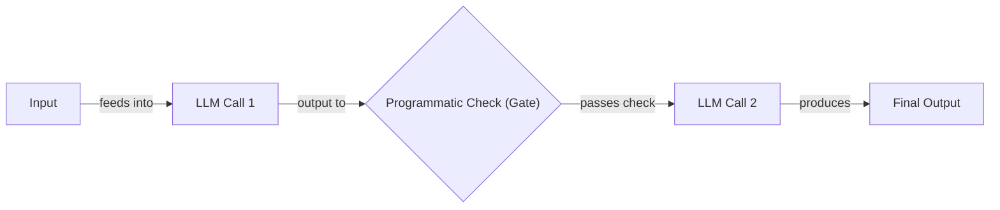

Image 1: A flowchart illustrating a simple LLM workflow using prompt chaining.

This approach is powerful because it is reliable and easy to debug. If something breaks, you can trace the exact step where the failure occurred. In future lessons, we will explore common workflow patterns like chaining, routing, and the orchestrator-worker model, which allow you to build complex yet controllable systems.

### AI Agents

AI agents, on the other hand, are systems where an LLM dynamically decides the sequence of steps, reasoning, and actions needed to achieve a goal. The path is not defined in advance; instead, the agent plans its actions based on the task and its environment [[2]](https://cloud.google.com/discover/what-are-ai-agents). This makes agents adaptive and capable of handling novel situations. An apt analogy is a skilled human expert tackling an unfamiliar problem, adapting their approach with each new piece of information.

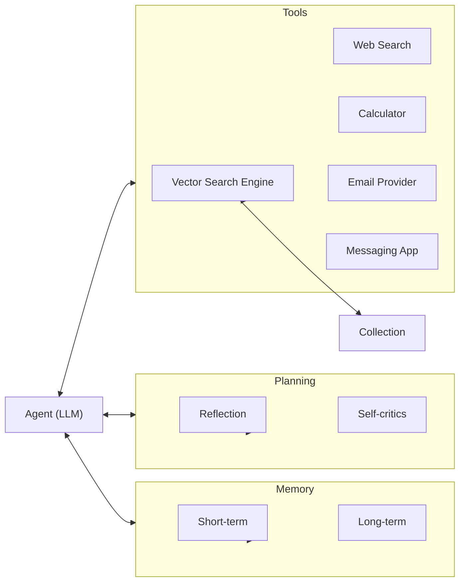

Image 2: Architecture diagram of a simple AI agent. (Source [Decoding ML](https://decodingml.substack.com/p/llmops-for-production-agentic-rag))

Agents are typically equipped with actions (often called tools) to interact with the world, and memory to retain information from past interactions. This allows them to perform complex, multi-step tasks autonomously. We will dive deep into how agents use actions, manage memory, and apply reasoning patterns like ReAct in upcoming lessons.

### The Role of Orchestration

Both workflows and agents require an orchestration layer to manage their execution. However, the nature of this layer differs significantly between the two. In a workflow, the orchestrator is like a project manager executing a well-defined plan. It follows the script you have written, calling the right components in the right order. For an agent, the orchestrator acts more like a facilitator for the LLM's dynamic planning. It provides the environment and tools the agent needs to reason and act, but the LLM itself directs the flow of control [[1]](https://www.anthropic.com/engineering/building-effective-agents).

Some in the industry further distinguish agent autonomy by levels. A "Level 2" agent might have a reasoning loop, but its high-level sequence of steps is still fixed in code. The AI decides *within* each step, but not the overall sequence. This offers limited autonomy with predictable costs and outcomes. In contrast, a "Level 3+" or true agent has much higher autonomy, with the LLM dynamically directing the entire process [[3]](https://www.barnacle.ai/blog/2025-09-25-agents-intro). This distinction highlights that "agent" is not a single category but a range of increasing autonomy, each with different costs, complexities, and risks.

## Choosing Your Path

In the previous section, we defined LLM workflows and AI agents independently. Now, let's explore their core difference: developer-defined logic versus LLM-driven autonomy in reasoning and action selection. Most real-world systems are not purely one or the other but exist on a spectrum between these two extremes. The most effective AI applications often blend elements of both, creating hybrid systems that balance control with flexibility [[1]](https://www.anthropic.com/engineering/building-effective-agents), [[4]](https://towardsdatascience.com/a-developers-guide-to-building-scalable-ai-workflows-vs-agents/).

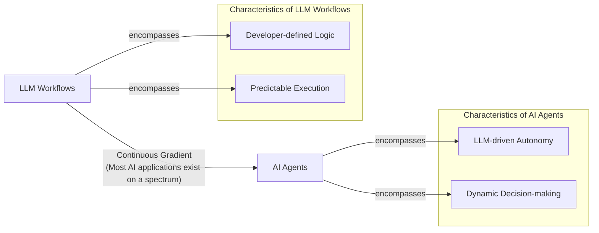

Image 3: A diagram illustrating the gradient between LLM workflows and AI agents, showing their defining characteristics and the continuous spectrum connecting them.

### When to Use LLM Workflows

Workflows are the right choice when your task has a well-defined structure. They excel at automating repeatable operational tasks where consistency is key. Examples include pipelines for extracting data from various sources like Slack or Google Drive, generating automated reports, or transforming articles into social media posts. For instance, a workflow can reliably take a customer support ticket, classify its intent, route it to the correct department, and generate a standardized response.

Their main strength lies in their predictability. Because you define the logic, you can easily debug the system, predict its costs and latency, and ensure reliable performance. This makes workflows ideal for enterprise environments or regulated fields like finance and healthcare, where a high degree of accuracy and auditability is non-negotiable. A financial report must be correct every time, and a medical diagnostic tool cannot afford to be unpredictably creative.

Workflows are also perfect for building Minimum Viable Products (MVPs) quickly, as you can hardcode the core features and get to market faster. However, their rigidity is also their main weakness. Each step is manually engineered, which can increase development time. The user experience can feel inflexible, as the system cannot handle unexpected scenarios. As the application grows, adding new features can become as complex as in traditional software development.

### When to Use AI Agents

Agents are best suited for open-ended problems where the solution path is not known in advance. They thrive in scenarios that require dynamic problem-solving, such as debugging code, handling complex customer support inquiries, or conducting exploratory research on a new topic. For example, an agent tasked with planning a trip can autonomously browse flight options, compare hotel reviews, and book reservations without a predefined script.

The primary strength of agents is their adaptability. They can navigate ambiguity, learn from their environment, and devise novel strategies to achieve a goal. This flexibility allows them to tackle tasks that would be nearly impossible to script with a predefined workflow.

This autonomy, however, comes with significant trade-offs. Agents are inherently non-deterministic, which means their performance, latency, and costs can vary with each run, making them less reliable for mission-critical tasks. They often require larger, more expensive LLMs to power their reasoning, and their multi-step nature can lead to higher token consumption. Security is also a major concern; an agent with write permissions needs strong guardrails to prevent it from deleting data or sending inappropriate communications [[5]](https://www.tellius.com/resources/blog/agents-vs-workflows-why-not-both). Finally, debugging and evaluating agents is notoriously difficult. Some developers have even joked about their code being deleted by an agent, saying, "Anyway, I wanted to start a new project."

### The Autonomy Slider and Hybrid Systems

When designing your application, you can think of having an "autonomy slider" that lets you decide how much control to give the LLM versus the user or the developer-defined code [[6]](https://singjupost.com/andrej-karpathy-software-is-changing-again/).

Andrej Karpathy points to the coding assistant Cursor and the answer engine Perplexity as examples of this philosophy [[7]](https://medium.com/@ben_pouladian/andrej-karpathy-on-software-3-0-software-in-the-age-of-ai-b25533da93b6). In Cursor, you can go from simple tab completion (low autonomy) to letting an agent modify your entire repository (high autonomy). Similarly, Perplexity offers a quick search (workflow-like), a more involved research mode, and a "deep research" function that is highly agentic [[8]](https://www.linkedin.com/posts/markbarbir_andrej-karpathys-latest-talk-describes-our-activity-7343449417426837505-oTFx). You tune the level of autonomy based on the task's complexity and your tolerance for unpredictability.

This risk-based approach is mirrored in other high-stakes domains, drawing parallels from autonomous vehicle safety regulations. In clinical trials, for instance, an agent that automatically uploads documents might be given near-full autonomy, while one involved in safety reporting would always require human oversight before acting. The level of autonomy is set based on the potential impact of an error [[9]](https://www.appliedclinicaltrialsonline.com/view/setting-limits-autonomy-autonomous-agents-clinical-research). Frameworks like AMLAS (Assurance of Machine Learning for Autonomous Systems), originally from the automotive sector, are being adapted for healthcare to provide structured validation and continuous monitoring for AI agents [[10]](https://pmc.ncbi.nlm.nih.gov/articles/PMC12738763/).

The ultimate goal is to create a fast and efficient feedback loop between AI generation and human verification. This is where good system architecture and a well-designed user interface become critical. A tool like Cursor provides a GUI that allows a developer to quickly audit, accept, or reject the AI's suggestions, making the collaborative process much faster than copy-pasting code from a generic chatbot.

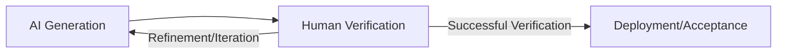

Image 4: A circular flow diagram illustrating the "AI generation and human verification loop".

## Exploring Common Patterns

To build an intuition for AI engineering, let's explore some of the most common patterns used to construct both LLM workflows and AI agents. These are high-level concepts, and we will cover the implementation details in future lessons.

### LLM Workflow Patterns

These patterns help structure and automate sequences of LLM calls, providing a bridge between simple prompts and fully autonomous agents.

**Chaining and Routing** is the most straightforward pattern. It involves breaking a complex task into a series of smaller, interconnected prompts that are executed in sequence, with the output of one step feeding into the next [[11]](https://mirascope.com/blog/llm-chaining). This modular approach improves predictability and makes debugging easier, as you can isolate the stage where a problem occurs [[12]](https://mlpills.substack.com/p/issue-110-llm-workflow-patterns). A router, which is typically another LLM call, can be added to this chain to dynamically select one of several possible paths based on the input, adding a layer of conditional logic [[13]](https://orq.ai/blog/prompt-structure-chaining), [[14]](https://www.geeksforgeeks.org/artificial-intelligence/llm-chains/).

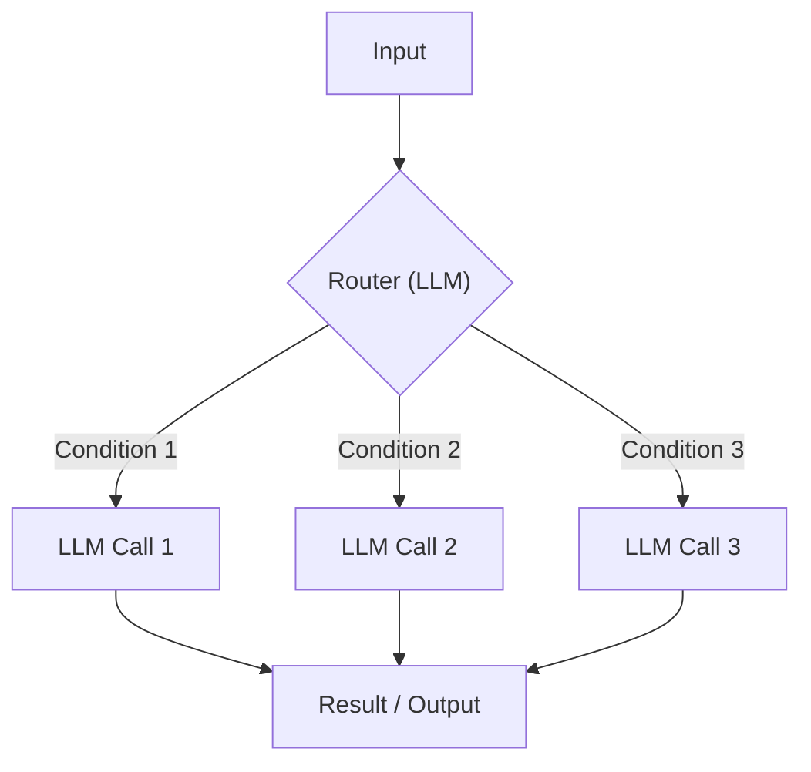

Image 5: A flowchart illustrating the "Chaining and Routing" pattern for LLM workflows.

The **Orchestrator-Worker** pattern introduces a more dynamic form of control. Here, a central "orchestrator" LLM acts as a project manager. It analyzes a high-level task, breaks it down into a dynamic set of sub-tasks, and delegates them to specialized "worker" agents or models [[15]](https://online.stevens.edu/blog/building-self-healing-ai-orchestrator-reflexion-patterns/). The orchestrator then synthesizes the results into a final answer. This pattern is a smooth transition from rigid workflows to more adaptive agentic systems, as the orchestrator dynamically decides which actions to take [[16]](https://platform.claude.com/cookbook/patterns-agents-orchestrator-workers). Its robustness is analogous to swarm intelligence in ant colonies, where sophisticated collective behaviors emerge from simple, local interactions without central command, using mechanisms like pheromone-driven routing to optimize paths and enhance efficiency [[17]](https://medium.com/@jsmith0475/collective-stigmergic-optimization-leveraging-ant-colony-emergent-properties-for-multi-agent-ai-55fa5e80456a), [[18]](https://openreview.net/forum?id=ojUhmgIS7o).

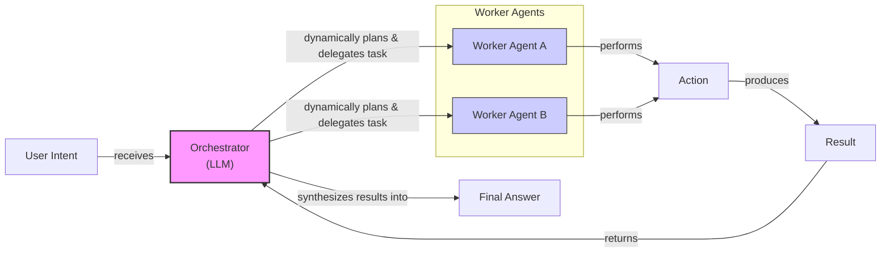

Image 6: A flowchart illustrating the Orchestrator-Worker pattern, emphasizing dynamic planning and delegation.

The **Evaluator-Optimizer Loop** is designed to improve the quality of LLM outputs through self-correction. In this pattern, a "generator" LLM produces an initial output. A second "evaluator" LLM then reviews this output based on a set of criteria and provides feedback. This feedback, or reflection, is passed back to the generator, which refines its output. This loop continues until the output meets the desired standard or a retry limit is reached, mimicking how a human writer might iteratively refine a document based on an editor's comments [[19]](https://docs.aws.amazon.com/prescriptive-guidance/latest/agentic-ai-patterns/evaluator-reflect-refine-loop-patterns.html).

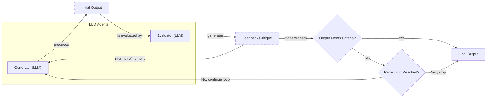

Image 7: A flowchart illustrating the Evaluator-Optimizer Loop pattern.

### Core Components of a ReAct AI Agent

The **ReAct (Reason and Act)** framework is the foundation for most modern AI agents. It enables an agent to reason about a task, decide on an action, execute it, observe the outcome, and then repeat the cycle until the goal is complete [[2]](https://cloud.google.com/discover/what-are-ai-agents). This iterative loop of thought and action is what gives agents their autonomy.

The core components of a ReAct agent are:
*   A **Reasoning LLM** that analyzes the task, interprets the outputs of actions, and plans the next step.
*   A set of **Actions (Tools)** that allow the agent to interact with its environment, such as searching the web, querying a database, or calling an API. We will cover these in detail in Lesson 6.
*   **Short-Term Memory**, which acts like a computer's RAM, holding the context of the current conversation and recent actions.
*   **Long-Term Memory**, which stores factual knowledge and user preferences across sessions, giving the agent a persistent knowledge base. We will explore memory in depth in Lesson 9.

Almost all state-of-the-art agents in the industry use the ReAct pattern, as it has shown the most potential for building capable and autonomous systems. We will cover this architecture in a lot of detail in Lessons 7 and 8.

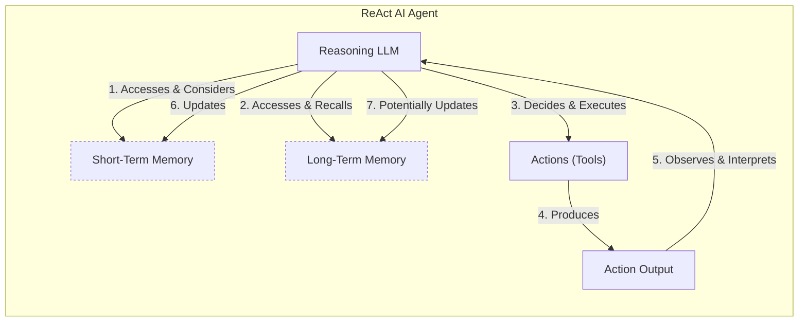

Image 8: A high-level architecture diagram showing the core components and dynamics of a ReAct AI agent, illustrating the continuous loop of Reason -> Act -> Observe -> Reason.

## Zooming In on Our Favorite Examples

To better anchor these concepts in the real world, let's analyze some concrete examples, from a simple workflow to a more advanced hybrid system. We will keep these explanations high-level, focusing on the architectural patterns rather than deep technical details.

### Document Summarization in Google Workspace: A Pure Workflow

A common and time-consuming task in any team is finding the right information within large documents. A quick, embedded summary can guide your search and save valuable time. Gemini in Google Workspace provides this functionality, and it is a perfect example of a pure, multi-step LLM workflow [[20]](https://support.google.com/docs/answer/15627020?hl=en).

The process is a straightforward chain of operations. For a long document that exceeds the model's context window, a map-reduce approach is often used. The workflow splits the document into smaller chunks, summarizes each chunk in parallel, and then creates a final summary of all the chunk summaries. This is a pure workflow because every step is predefined by the developer [[21]](https://cloud.google.com/blog/products/ai-machine-learning/long-document-summarization-with-workflows-and-gemini-models). For business users, the feature is seamlessly integrated: when a PDF is opened in Google Drive, a "Summary by Gemini" panel appears, generating a concise summary and suggesting follow-up actions [[22]](https://masterconcept.ai/blog/new-google-workspace-gemini-feature-your-pdfs-now-write-their-own-summaries-and-suggest-next-steps/).

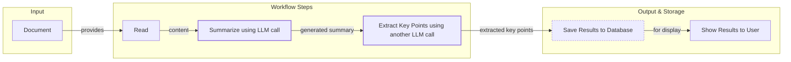

Image 9: A flowchart illustrating the Document Summarization and Analysis Workflow by Gemini in Google Workspace.

Here is a Python code example demonstrating a simple workflow for customer support, where the logic is explicitly defined.

1.  The workflow first classifies the incoming message and then routes it to the appropriate logic path.
    ```python
    def customer_support_workflow(customer_message, customer_id):
        """Predefined workflow with explicit control flow"""
    
        # Step 1: Classify the message type
        classification_prompt = f"Classify this message: {customer_message}\nOptions: billing, technical, general"
        message_type = llm_call(classification_prompt)
    
        # Step 2: Route based on classification (explicit paths)
        if message_type == "billing":
            # Get customer billing info
            billing_data = get_customer_billing(customer_id)
            response_prompt = f"Answer this billing question: {customer_message}\nBilling data: {billing_data}"
    
        elif message_type == "technical":
            # Get product info
            product_data = get_product_info(customer_id)
            response_prompt = f"Answer this technical question: {customer_message}\nProduct info: {product_data}"
    
        else:  # general
            response_prompt = f"Provide a helpful general response to: {customer_message}"
    
        # Step 3: Generate response
        response = llm_call(response_prompt)
    
        # Step 4: Log interaction (explicit)
        log_interaction(customer_id, message_type, response)
    
        return response
    ```

This deterministic approach provides predictable execution, explicit error handling, and transparent debugging, making it ideal for structured, high-volume tasks [[4]](https://towardsdatascience.com/a-developers-guide-to-building-scalable-ai-workflows-vs-agents/).

### Gemini CLI Coding Assistant: A Single-Agent System

Writing code can be a slow process, involving reading documentation, understanding new codebases, and learning new programming languages. A coding assistant can dramatically speed this up. The open-source Gemini CLI is a great example of a single-agent system that uses the ReAct architecture to help developers with coding tasks [[23]](https://developers.google.com/gemini-code-assist/docs/gemini-cli). It can write code from scratch, assist with specific functions, generate documentation, and help you quickly understand a new codebase.

Based on our research, here is a high-level overview of how Gemini CLI's operational loop works:

1.  **Context Gathering:** The agent starts by loading the local directory structure, its available tools (actions), and the conversation history into its working memory. It can use tools like `grep` to read specific files or `ls` to list directory contents [[24]](https://wietsevenema.eu/blog/2025/how-gemini-cli-builds-context/).
2.  **LLM Reasoning:** The Gemini model analyzes your request against the current context and plans the actions needed to fulfill it.
3.  **Human in the Loop:** Before executing potentially destructive actions, the agent can be configured to validate its plan with you.
4.  **Tool Execution:** The agent executes the selected tools. These can range from file operations and code generation to web searches for documentation [[23]](https://developers.google.com/gemini-code-assist/docs/gemini-cli). The results are added back to the context.
5.  **Evaluation:** The agent can dynamically evaluate its generated code by attempting to run or compile it, providing a tight feedback loop.
6.  **Loop Decision:** The agent determines if the task is complete or if it needs to repeat the cycle by planning and executing more actions.

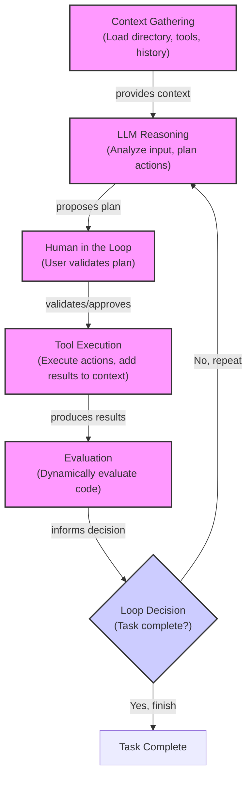

Image 10: A circular flow diagram illustrating the operational loop of the "Gemini CLI Coding Assistant" using the ReAct pattern.

### Perplexity Deep Research: A Hybrid System

Researching a new topic can be daunting. You often do not know where to start, and sifting through countless sources is time-consuming. Perplexity's Deep Research feature acts as an expert research assistant, autonomously performing dozens of searches across hundreds of sources to generate a comprehensive report in minutes [[25]](https://www.perplexity.ai/hub/blog/introducing-perplexity-deep-research).

While Perplexity's exact architecture is closed-source, we can infer its design as a hybrid system that combines the orchestrator-worker pattern with parallel ReAct agents. This is a powerful combination of structured planning and dynamic adaptation.

Here is a plausible, oversimplified version of how it could work:

1.  **Research Planning & Decomposition:** An orchestrator agent analyzes your research question and breaks it down into several targeted sub-questions.
2.  **Parallel Information Gathering:** The orchestrator deploys multiple specialized research agents, each tasked with one sub-question. These agents run in parallel, using tools like web search and document retrieval to gather information. This parallelization speeds up the process and keeps each agent focused on a smaller, more manageable context [[26]](https://zenvanriel.com/ai-engineer-blog/perplexity-computer-multi-model-agent-orchestration/).
3.  **Analysis & Synthesis:** Each agent validates its sources for credibility and relevance, ranks them, and synthesizes the top findings into a preliminary report.
4.  **Iterative Refinement & Gap Analysis:** The orchestrator collects the reports from all worker agents and identifies any knowledge gaps relative to your original query. If gaps exist, it generates follow-up questions and repeats the process, creating an iterative research loop [[25]](https://www.perplexity.ai/hub/blog/introducing-perplexity-deep-research).
5.  **Report Generation:** Once all gaps are filled, the orchestrator compiles the findings from all agents into a single, cohesive report, complete with inline citations.

This hybrid approach allows the system to handle complex, open-ended research tasks with a degree of structure and control that a single, monolithic agent might lack.

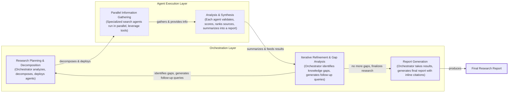

Image 11: A multi-step iterative process diagram illustrating how the "Perplexity Deep Research Agent" could work as a hybrid system, highlighting structured planning with dynamic adaptation.

Here is a code example of a hybrid pipeline that uses a workflow for the initial step and falls back to an agent for more complex queries.

1.  This hybrid system first attempts to answer a query using a standard RAG workflow. If the answer is uncertain, it escalates to a more capable agent that can perform a web search.
    ```python
    def hybrid_pipeline(query: str) -> str:
        # RAG attempt
        rag_out = qa_chain.invoke({"input": query})
        rag_answer = rag_out.get("answer", "")
    
        if is_answer_uncertain(rag_answer):
            # Fallback to agent search
            agent_out = agent.invoke({
                "messages": [{"role": "user", "content": query}]
            })
            return agent_out["messages"][-1].content
    
        return rag_answer
    ```
This pattern provides the cost-efficiency and reliability of a workflow for common cases while retaining the flexibility of an agent for more challenging tasks [[4]](https://towardsdatascience.com/a-developers-guide-to-building-scalable-ai-workflows-vs-agents/).

## The Challenges of Every AI Engineer

Now that you understand the spectrum from LLM workflows to AI agents, it is important to recognize that every AI engineer faces these same fundamental challenges when designing a new AI application. These core decisions often determine whether an AI product succeeds in production or fails spectacularly.

Here are some of the daily battles every AI engineer faces:

*   **Reliability Issues:** An agent that works perfectly in a demo can become unpredictable with real users. LLM reasoning failures compound because an error in one step, like a flawed data retrieval, cascades into all subsequent reasoning and tool calls. A recent empirical study of developer challenges found that runtime reliability and operational robustness are major recurring problems, with issues like malformed tool outputs or configuration errors repeatedly breaking execution [[27]](https://arxiv.org/html/2510.25423v2). For example, in one documented case, a framework upgrade in RagFlow removed an expected parameter, causing agents to fail at runtime due to broken assumptions about tool interfaces [[27]](https://arxiv.org/html/2510.25423v2). Mitigation requires robust design patterns like parallel execution for independent tasks, smart retries, and pinning specific model versions to prevent performance drift from silent provider updates [[28]](https://www.mindstudio.ai/blog/reliability-compounding-problem-ai-agent-stacks/), [[29]](https://www.cio.com/article/4046837/3-key-approaches-to-mitigate-ai-agent-failures.html).
*   **Context Limits:** Systems often struggle to maintain coherence across long conversations, gradually losing track of their original purpose. LLMs operate within token limits, and when conversations exceed these context windows, agents forget earlier interactions. Ensuring consistent output quality as context grows is a continuous challenge [[30]](https://medium.com/@ananya_95177/key-challenges-in-ai-agent-development-and-how-to-solve-them-460fceb0a6d5).
*   **Data Integration:** Building robust pipelines to pull information from diverse sources like Slack, web APIs, and databases is a constant struggle. You must ensure that only high-quality data is passed to your AI system, following the "garbage-in, garbage-out" principle.
*   **The Cost-Performance Trap:** Sophisticated agents can deliver impressive results, but they can also be incredibly expensive per user interaction. This often makes them economically unfeasible for many applications, requiring careful management of resources.
*   **Security Concerns:** Autonomous agents with powerful permissions are a significant risk. An improperly secured agent could send incorrect emails, delete critical files, or expose sensitive data. Building strong guardrails and defining clear operational boundaries is non-negotiable, as a flaw in one agent can cascade across a network, amplifying the risk [[31]](https://permiso.io/blog/8-critical-ai-security-challenges), [[5]](https://www.tellius.com/resources/blog/agents-vs-workflows-why-not-both).

## Conclusion

These challenges are solvable. In upcoming lessons, we will cover patterns for building reliable products through specialized evaluation and monitoring pipelines. This involves more than just checking for accuracy; it means developing programmatic evaluators for metrics like faithfulness and safety, often with subject-matter experts in the loop, and using structured logging to run grounding checks that detect hallucinations [[32]](https://snorkel.ai/blog/llm-observability-key-practices-tools-and-challenges/), [[33]](https://openobserve.ai/blog/llm-monitoring-best-practices/). We will also cover proven strategies for building hybrid systems and practical approaches for keeping costs and latency under control.

Your path forward as an AI engineer is about mastering these realities. In our next lesson, we will start by exploring structured outputs, a foundational technique for ensuring that the data flowing through your systems is reliable and predictable. By the end of this course, you will have the knowledge to architect AI systems that are not only powerful but also robust, efficient, and safe. You will know when to use a workflow, when to deploy an agent, and how to build effective hybrid systems that work in the real world.

## References

- [1] [Building effective agents](https://www.anthropic.com/engineering/building-effective-agents)
- [2] [What is an AI agent?](https://cloud.google.com/discover/what-are-ai-agents)
- [3] [An introduction to AI Agents in 2025](https://www.barnacle.ai/blog/2025-09-25-agents-intro)
- [4] [A Developer’s Guide to Building Scalable AI: Workflows vs Agents](https://towardsdatascience.com/a-developers-guide-to-building-scalable-ai-workflows-vs-agents/)
- [5] [Agents vs. Workflows: Why Not Both?](https://www.tellius.com/resources/blog/agents-vs-workflows-why-not-both)
- [6] [Andrej Karpathy: Software Is Changing (Again)](https://singjupost.com/andrej-karpathy-software-is-changing-again/)
- [7] [Andrej Karpathy on Software 3.0: Software in the Age of AI](https://medium.com/@ben_pouladian/andrej-karpathy-on-software-3-0-software-in-the-age-of-ai-b25533da93b6)
- [8] [Andrej Karpathy's latest talk describes our new reality](https://www.linkedin.com/posts/markbarbir_andrej-karpathys-latest-talk-describes-our-activity-7343449417426837505-oTFx)
- [9] [Setting limits on the autonomy of autonomous agents in clinical research](https://www.appliedclinicaltrialsonline.com/view/setting-limits-autonomy-autonomous-agents-clinical-research)
- [10] [Assurance of Machine Learning for future Autonomous Systems in healthcare: A new framework and its comparison with existing AI governance](https://pmc.ncbi.nlm.nih.gov/articles/PMC12738763/)
- [11] [LLM Chaining](https://mirascope.com/blog/llm-chaining)
- [12] [Issue #110: LLM Workflow Patterns](https://mlpills.substack.com/p/issue-110-llm-workflow-patterns)
- [13] [Prompt Structure And Chaining](https://orq.ai/blog/prompt-structure-chaining)
- [14] [LLM Chains](https://www.geeksforgeeks.org/artificial-intelligence/llm-chains/)
- [15] [Building a Self-Healing AI Orchestrator with Reflexion Patterns](https://online.stevens.edu/blog/building-self-healing-ai-orchestrator-reflexion-patterns/)
- [16] [Patterns for Building with Agents: Orchestrator-Workers](https://platform.claude.com/cookbook/patterns-agents-orchestrator-workers)
- [17] [Collective Stigmergic Optimization: Leveraging Ant Colony Emergent Properties for Multi-Agent AI](https://medium.com/@jsmith0475/collective-stigmergic-optimization-leveraging-ant-colony-emergent-properties-for-multi-agent-ai-55fa5e80456a)
- [18] [AMRO: Ant Colony Inspired Multi-agent Routing Optimization for Large Language Model based Agents](https://openreview.net/forum?id=ojUhmgIS7o)
- [19] [Agentic AI Patterns: Evaluator, reflect, and refine loop patterns](https://docs.aws.amazon.com/prescriptive-guidance/latest/agentic-ai-patterns/evaluator-reflect-refine-loop-patterns.html)
- [20] [Summarize your document in Docs with Gemini (Workspace Experiments)](https://support.google.com/docs/answer/15627020?hl=en)
- [21] [Long document summarization with Workflows and Gemini models](https://cloud.google.com/blog/products/ai-machine-learning/long-document-summarization-with-workflows-and-gemini-models)
- [22] [New Google Workspace Gemini Feature: Your PDFs Now Write Their Own Summaries and Suggest Next Steps](https://masterconcept.ai/blog/new-google-workspace-gemini-feature-your-pdfs-now-write-their-own-summaries-and-suggest-next-steps/)
- [23] [Gemini CLI](https://developers.google.com/gemini-code-assist/docs/gemini-cli)
- [24] [How Gemini CLI builds context and learns about your codebase](https://wietsevenema.eu/blog/2025/how-gemini-cli-builds-context/)
- [25] [Introducing Perplexity Deep Research](https://www.perplexity.ai/hub/blog/introducing-perplexity-deep-research)
- [26] [Perplexity Computer & The Future of Multi-Model Agent Orchestration](https://zenvanriel.com/ai-engineer-blog/perplexity-computer-multi-model-agent-orchestration/)
- [27] [What Challenges Do Developers Face in AI Agent Systems? An Empirical Study on Stack Overflow & GitHub Issues](https://arxiv.org/html/2510.25423v2)
- [28] [Reliability is a Compounding Problem in AI Agent Stacks](https://www.mindstudio.ai/blog/reliability-compounding-problem-ai-agent-stacks/)
- [29] [3 key approaches to mitigate AI agent failures](https://www.cio.com/article/4046837/3-key-approaches-to-mitigate-ai-agent-failures.html)
- [30] [Key Challenges in AI Agent Development and How to Solve Them](https://medium.com/@ananya_95177/key-challenges-in-ai-agent-development-and-how-to-solve-them-460fceb0a6d5)
- [31] [8 Critical AI Security Challenges & How to Solve Them](https://permiso.io/blog/8-critical-ai-security-challenges)
- [32] [LLM Observability: Key Practices, Tools, and Challenges](https://snorkel.ai/blog/llm-observability-key-practices-tools-and-challenges/)
- [33] [LLM Monitoring Best Practices](https://openobserve.ai/blog/llm-monitoring-best-practices/)
- [34] [Real Agents vs. Workflows: The Truth Behind AI 'Agents'](https://www.youtube.com/watch?v=kQxr-uOxw2o&t=1s)
- [35] [Exploring the difference between agents and workflows](https://decodingml.substack.com/p/llmops-for-production-agentic-rag)
- [36] [601 real-world gen AI use cases from the world's leading organizations](https://cloud.google.com/transform/101-real-world-generative-ai-use-cases-from-industry-leaders)
- [37] [Stop Building AI Agents: Here’s what you should build instead](https://decodingml.substack.com/p/stop-building-ai-agents)
- [38] [Andrej Karpathy: Software Is Changing (Again)](https://www.youtube.com/watch?v=LCEmiRjPEtQ)
- [39] [Building Production-Ready RAG Applications: Jerry Liu](https://www.youtube.com/watch?v=TRjq7t2Ms5I)
- [40] [Gemini CLI: your open-source AI agent](https://blog.google/technology/developers/introducing-gemini-cli-open-source-ai-agent/)
- [41] [Gemini CLI README.md](https://github.com/google-gemini/gemini-cli/blob/main/README.md)
- [42] [Introducing ChatGPT agent: bridging research and action](https://openai.com/index/introducing-chatgpt-agent/)
- [43] [Google Workspace with Gemini](https://knowledge.workspace.google.com/admin/gemini/google-workspace-with-gemini)
- [44] [Perplexity Computer & The Rise of AI Agent Orchestration](https://www.gend.co/blog/perplexity-computer-ai-agent-orchestration)
- [45] [Perplexity Agent API Platform - AI Search Developer Guide](https://www.digitalapplied.com/blog/perplexity-agent-api-platform-ai-search-developer-guide)
- [46] [Autonomy Sliders](https://andrewships.substack.com/p/autonomy-sliders)
- [47] [S3: Karpathy on Agents, Voice, Code, + AI OS; Adept, Imbue, Gist, LangChain, AlphaCodium, MultiOn](https://www.latent.space/p/s3)
- [48] [Agentic AI Threats: The Security Risks of AI Agents](https://unit42.paloaltonetworks.com/agentic-ai-threats/)
- [49] [The Agentic AI Revolution: 5 Unexpected Security Challenges](https://www.cyberark.com/resources/blog/the-agentic-ai-revolution-5-unexpected-security-challenges)
- [50] [Prompt Chaining](https://www.promptingguide.ai/techniques/prompt_chaining)
- [51] [DIY #17: The Orchestrator-Worker LLM Agent Pattern](https://mlpills.substack.com/p/diy-17-orchestrator-worker-llm-agent)
- [52] [The Orchestrator-Worker Pattern is a well-known design pattern...](https://www.linkedin.com/posts/seanf_the-orchestrator-worker-pattern-is-a-well-known-activity-7294775230353313792-_zfl)
- [53] [Agent Orchestration Patterns](https://gurusup.com/blog/agent-orchestration-patterns)
- [54] [Building self-correcting LLM systems: The Evaluator-Optimizer Pattern](https://dev.to/clayroach/building-self-correcting-llm-systems-the-evaluator-optimizer-pattern-169p)
- [55] [The research on LLM self-correction](https://vadim.blog/the-research-on-llm-self-correction)
- [56] [Patterns for Building with Agents: Evaluator-Optimizer](https://platform.claude.com/cookbook/patterns-agents-evaluator-optimizer)
- [57] [Evaluator-Optimizer LLM Workflow from the Anthropic Cookbook](https://sebgnotes.substack.com/p/evaluator-optimizer-llm-workflow)
- [58] [How do I provide context files to Gemini CLI?](https://milvus.io/ai-quick-reference/how-do-i-provide-context-files-to-gemini-cli)
- [59] [GEMINI.md](https://geminicli.com/docs/cli/gemini-md/)
- [60] [Gemini CLI Tutorial Series Part 9: Understanding Context, Memory, and Conversational Branching](https://medium.com/google-cloud/gemini-cli-tutorial-series-part-9-understanding-context-memory-and-conversational-branching-095feb3e5a43)
- [61] [A look at Context Engineering in Gemini CLI](https://aipositive.substack.com/p/a-look-at-context-engineering-in)
- [62] [The third wave of data engineering](https://www.linkedin.com/posts/tracercloud_the-third-wave-of-data-engineering-activity-7417891798364168192-ZQJz)
- [63] [Protecting AI Data Pipelines](https://www.commvault.com/use-cases/protecting-ai-data-pipelines)
- [64] [Machine Learning Monitoring Tools: AI Reliability's Secret Weapon](https://www.lumenova.ai/blog/machine-learning-monitoring-tools-ai-reliability/)
- [65] [Top 7 Data Pipeline Monitoring Tools to Try in 2024](https://www.integrate.io/blog/data-pipeline-monitoring-tools/)
- [66] [AI Observability: Why it's different and what to look for](https://www.langchain.com/articles/ai-observability)
- [67] [AI Agent Compliance Frameworks](https://www.lyzr.ai/glossaries/ai-agent-compliance-frameworks/)
- [68] [AI Regulations for Autonomous Vehicles](https://www.holisticai.com/blog/ai-regulations-for-autonomous-vehicles)
- [69] [AI Governance and Accountability in Autonomous Systems](https://www.arionresearch.com/blog/owisez8t7c80zpzv5ov95uc54d11kd)
- [70] [Swarm Intelligence for Large Language Models: A Survey](https://arxiv.org/html/2506.14496v1)
</article>