# Lesson 2: AI Agents vs. LLM Workflows

As an AI engineer preparing to build your first real AI application, after narrowing down the problem you want to solve, one key decision is how to design your AI solution. Should it follow a predictable, step-by-step workflow, or does it demand a more autonomous approach, where the LLM makes self-directed decisions along the way? This fundamental question will determine the success or failure of your project: How should you architect your AI system?

This is one of the most critical decisions you will make, impacting everything from development time and costs to reliability and user experience. Choosing the wrong path can lead to an overly rigid system that breaks when users deviate from expected patterns or when you try to add new features. Alternatively, you might build an unpredictable agent that works brilliantly 80% of the time but fails completely when it matters most. Both scenarios can result in months of wasted development time, forcing you to rebuild the entire architecture from scratch. The consequences extend beyond engineering, leading to frustrated users who cannot rely on the application and executives who find the system's operational costs unsustainable relative to its benefits.

In 2024 and 2025, we are seeing billion-dollar AI startups succeed or fail based primarily on this architectural decision. The most successful companies, teams, and AI engineers have mastered this balance. They understand that the choice is not a binary one between rigid control and total autonomy. Instead, it is about finding the right point on a spectrum to solve a specific problem. They know when to use workflows, when to deploy agents, and, most importantly, how to combine both approaches effectively to build systems that are both powerful and reliable.

By the end of this lesson, we will provide you with a framework to confidently make these critical decisions. You will understand the fundamental trade-offs, see real-world examples from leading AI companies, and learn how to design systems that combine the strengths of both approaches.

## Understanding the Spectrum: From Workflows to Agents

To make the right architectural choice, you first need a clear understanding of what LLM workflows and AI agents are. We will not focus on the deep technical specifics yet, but rather on their core properties and how they are used in practice. This distinction is crucial, as it defines who is in control: your code or the model's reasoning.

An LLM workflow is a sequence of tasks involving LLM calls or other operations, such as reading or writing data. It is largely predefined and orchestrated by developer-written code. The steps are defined in advance, resulting in deterministic or rule-based paths with predictable execution and explicit control flow. Think of it like a factory assembly line, where each station performs a specific, repeatable task in a set order. This structure ensures that for a given input, the process is consistent and the outcome is predictable. This is the backbone of many reliable AI applications you see today. In future lessons, we will explore common workflow patterns like chaining, routing, and the orchestrator-worker model, which allow you to build sophisticated, multi-step processes with full control.

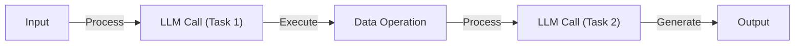
Image 1: A sequential LLM workflow diagram.

AI agents, on the other hand, are systems where an LLM plays a central role in dynamically deciding the sequence of steps, reasoning, and actions to achieve a goal. The steps are not defined in advance but are planned based on the task and the current state of the environment. This makes them adaptive and capable of handling novelty, with the LLM driving autonomy in decision-making. An agent is like a skilled human expert solving a new problem, adapting on the fly after each "Eureka!" moment. To achieve this, agents rely on components like tools for action and memory for context, which we will cover in depth in future lessons on ReAct agents.

This concept is not new; it extends decades of research in artificial intelligence. Classic AI paradigms distinguished between reactive control (tight perception-action loops), deliberative planning (using internal world models), and hybrid systems that combine both. Modern LLM agents map directly onto these historical concepts, using the LLM as a powerful reasoning engine within these established architectures [[54]](https://arxiv.org/html/2602.10479v1).

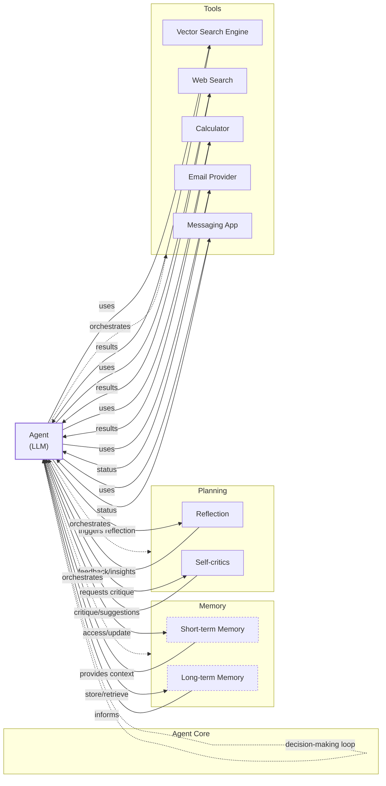
Image 2: A simple agentic system architecture diagram illustrating the core components of an AI agent, including the central Agent (LLM), Memory, Planning, and Tools, and their dynamic interactions. (Source [Decoding ML](https://decodingml.substack.com/p/stop-building-ai-agents))

Both workflows and agents require an orchestration layer to manage their execution. However, the nature of this layer differs significantly. In a workflow, orchestration executes a defined plan, following the script you have written. In an agent, orchestration is more of a facilitator, supporting the LLM's dynamic planning and execution as it navigates a task. The key distinction is who is in control: the developer's code or the LLM's reasoning. This is an active area of research, with ongoing efforts to create comprehensive taxonomies to classify the capabilities and architectures of these increasingly complex agentic systems [[55]](https://arxiv.org/html/2508.17281v2).

## Choosing Your Path

Now that we have defined LLM workflows and agents, let's explore their core differences. The choice between them boils down to a trade-off between developer-defined logic and LLM-driven autonomy. This is not a binary choice but a spectrum, with purely rigid workflows on one end and fully autonomous agents on the other.

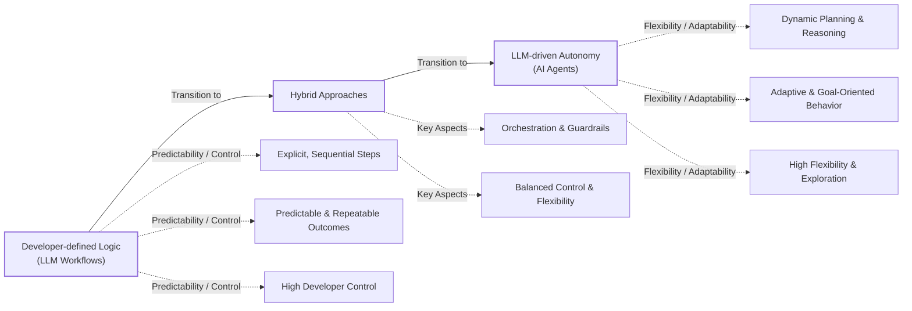
Image 3: A spectrum diagram illustrating the core differences between LLM Workflows and AI Agents, ranging from developer-defined logic to LLM-driven autonomy, highlighting the trade-off between predictability/control and flexibility/adaptability.

### When to use LLM workflows

Workflows are best suited for tasks with a well-defined structure. Examples include pipelines for data extraction from sources like Slack or Google Drive, automated report generation, and content repurposing, such as turning articles into social media posts. Their primary strength is predictability. Because the steps are fixed, you get reliable, repeatable outcomes. This makes debugging straightforward, as you can trace errors to a specific step in your code. Operationally, this predictability extends to cost and latency. You can often use smaller, specialized models for specific sub-tasks, which reduces infrastructure overhead.

This reliability is why workflows are preferred in enterprise settings and regulated fields like finance and healthcare [[27]](https://cloud.google.com/transform/101-real-world-generative-ai-use-cases-from-industry-leaders). In these domains, a financial report or a medical summary must be accurate every time, as errors can have serious consequences. Workflows are also ideal for building Minimum Viable Products (MVPs) quickly, as you can hardcode the core features and get to market faster. They excel in high-frequency scenarios where the cost per request is more important than sophisticated reasoning.

However, the main weakness of workflows is their rigidity. Since every step is manually engineered, development can be time-consuming. The user experience is constrained, as the system cannot handle unexpected scenarios. Adding new features can become complex as the application grows, much like with traditional software.

### When to use AI agents

Agents are the right choice for open-ended problems that require dynamic problem-solving. This includes tasks like in-depth research on a broad topic, complex customer support that requires back-and-forth conversation, or debugging code. Their strength lies in their adaptability. An agent can navigate new situations and handle ambiguity because it decides its own steps.

But this autonomy comes with significant weaknesses. Agents are non-deterministic, which means their performance, latency, and costs can vary with each run, making them often unreliable. Some have compared them to a "brilliant but chaotic intern" who figures things out independently but introduces operational complexity [[56]](https://towardsdatascience.com/a-developers-guide-to-building-scalable-ai-workflows-vs-agents/). They typically require larger, more powerful LLMs to generalize effectively, which increases costs. They also tend to make more LLM calls to reason through a problem, further driving up the expense. If not designed carefully, agents can pose serious security risks, especially with write operations. You may have heard funny stories of developers having their code deleted by an agent, with the punchline being, "*Anyway, I wanted to start a new project*." Finally, agents are notoriously difficult to debug and evaluate.

### From Theory to Practice: Code Examples

To make this distinction clearer, let's look at how you might implement a customer support system using both approaches.

Here is a simple workflow where the logic is hardcoded. The system classifies the message, routes it to the correct data source, generates a response, and logs the interaction. Every step is explicit and predictable.

```python
def customer_support_workflow(customer_message, customer_id):
    """Predefined workflow with explicit control flow"""

    # Step 1: Classify the message type
    classification_prompt = f"Classify this message: {customer_message}\nOptions: billing, technical, general"
    message_type = llm_call(classification_prompt)

    # Step 2: Route based on classification (explicit paths)
    if message_type == "billing":
        billing_data = get_customer_billing(customer_id)
        response_prompt = f"Answer this billing question: {customer_message}\nBilling data: {billing_data}"
    elif message_type == "technical":
        product_data = get_product_info(customer_id)
        response_prompt = f"Answer this technical question: {customer_message}\nProduct info: {product_data}"
    else:  # general
        response_prompt = f"Provide a helpful response to: {customer_message}"

    # Step 3: Generate response
    response = llm_call(response_prompt)

    # Step 4: Log interaction
    log_interaction(customer_id, message_type, response)

    return response
```

Now, here is the agentic version. Instead of a fixed path, the agent is given a goal and a set of tools. It dynamically decides which tools to use and in what order based on its reasoning. The execution path can change with every interaction.

```python
def customer_support_agent(customer_message, customer_id):
    """Agent with dynamic tool selection and reasoning"""

    # Available tools for the agent
    tools = {
        "get_billing_info": lambda: get_customer_billing(customer_id),
        "get_product_info": lambda: get_product_info(customer_id),
        "search_knowledge_base": lambda query: search_kb(query),
    }

    # Agent prompt with tool descriptions
    agent_prompt = f"""
    You are a customer support agent. Help with this message: "{customer_message}"
    Available tools: {list(tools.keys())}

    Think step by step:
    1. What type of question is this?
    2. What information do I need?
    3. Which tools should I use and in what order?
    4. How should I respond?
    """

    # Agent decides what to do (dynamic reasoning)
    agent_response = llm_agent_call(agent_prompt, tools)

    return agent_response
```

These examples show the fundamental difference in control. The workflow is a reliable recipe, while the agent is a creative chef.

### Hybrid Approaches

Most real-world systems are not purely one or the other. They are hybrid solutions that blend elements from both ends of the spectrum, using workflows for stability and agents for flexibility where needed. When building an application, you often have an "autonomy slider," allowing you to decide how much control to give the LLM versus the user [[14]](https://singjupost.com/andrej-karpathy-software-is-changing-again/), [[10]](https://medium.com/@ben_pouladian/andrej-karpathy-on-software-3-0-software-in-the-age-of-ai-b25533da93b6).

For example, the coding assistant Cursor offers different levels of autonomy. You can use simple tab-completion (low autonomy), ask the AI to edit a selected chunk of code with `Cmd+K`, let it change an entire file with `Cmd+L`, or give it full control over the repository with `Cmd+I` (high autonomy) [[12]](https://www.linkedin.com/posts/markbarbir_andrej-karpathys-latest-talk-describes-our-activity-7343449417426837505-oTFx). Similarly, Perplexity allows you to choose between a quick search, a more involved "research" mode, or a "deep research" option that takes several minutes to generate a comprehensive report [[11]](https://andrewships.substack.com/p/autonomy-sliders).

The ultimate goal is to speed up the loop between AI generation and human verification [[14]](https://singjupost.com/andrej-karpathy-software-is-changing-again/). This is often achieved through a combination of smart architecture and a well-designed user interface that makes it easy for the human to review and guide the AI's work.

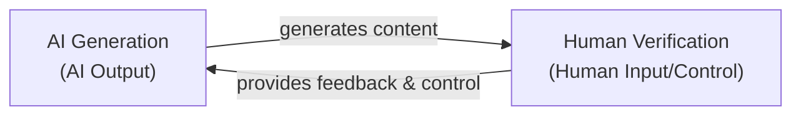
Image 4: A circular flow diagram illustrating the AI generation and human verification loop.

## Exploring Common Patterns

To help you build an intuition for AI engineering, let's look at some of the most common patterns used to construct LLM workflows and AI agents. We will keep these explanations high-level for now, as we will dive deep into each one in future lessons.

### LLM workflows

These patterns are about structuring interactions with LLMs to solve complex tasks in a predictable way.

**Chaining and routing** is the first step toward automation. It involves linking multiple LLM calls together, where the output of one call becomes the input for the next. You can also add routing logic that acts as a switch, directing the workflow down different paths based on the input or intermediate results. This helps in breaking down a complex problem into smaller, manageable steps [[21]](https://mlpills.substack.com/p/issue-110-llm-workflow-patterns/), [[23]](https://www.geeksforgeeks.org/artificial-intelligence/llm-chains/). This approach boosts transparency and makes debugging easier, as you can analyze and improve performance at each stage of the chain [[24]](https://www.promptingguide.ai/techniques/prompt_chaining).

Some teams are applying these workflow concepts to software development itself, creating a "Waterfall 2.0" where AI agents for roles like Product Owner and Scrum Master handle tasks like backlog grooming and sprint planning in a structured sequence [[57]](https://medium.com/@gstarikov/waterfall-2-0-llm-driven-workflows-in-software-development-701dc8b287ba).

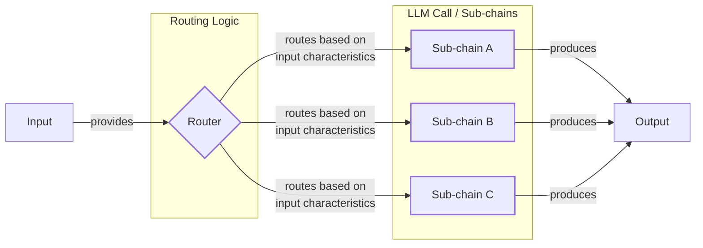
Image 5: A flowchart illustrating the "Chaining and Routing" LLM workflow pattern.

The **orchestrator-worker** pattern provides a smooth transition from rigid workflows to more dynamic, agent-like behavior. In this pattern, a central "orchestrator" LLM analyzes a task, breaks it down into sub-tasks, and delegates them to specialized "worker" LLMs. The orchestrator then synthesizes the results from the workers into a final answer. This allows the system to dynamically decide which actions to take based on the user's request [[25]](https://online.stevens.edu/blog/building-self-healing-ai-orchestrator-reflexion-patterns/), [[26]](https://mlpills.substack.com/p/diy-17-orchestrator-worker-llm-agent). The key advantage is parallelization; since LLM calls are I/O bound, a single orchestrator can manage dozens of workers simultaneously, leading to significant speed improvements over sequential processing [[25]](https://online.stevens.edu/blog/building-self-healing-ai-orchestrator-reflexion-patterns/).

Major tech companies are building frameworks around this concept, such as IBM's open-source Bee Agent framework, which includes a "Flow Orchestrator" and a "Shared Context" store to manage complex, multi-agent processes [[58]](https://www.ibm.com/think/topics/multi-agent-collaboration).

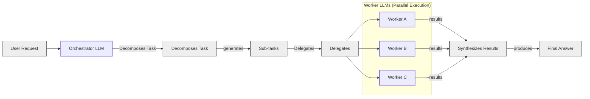
Image 6: A flowchart illustrating the Orchestrator-Worker LLM workflow pattern.

The **evaluator-optimizer loop** is designed to improve the quality of LLM outputs through automated feedback. In this pattern, one LLM generates a response, and another "evaluator" LLM reviews it based on a set of criteria. If the output is not good enough, the evaluator provides feedback (a reflection), which is sent back to the generator to auto-correct its response. This process is similar to how a human writer refines a document based on an editor's feedback and continues until the output meets the desired quality or a set limit is reached [[30]](https://docs.aws.amazon.com/prescriptive-guidance/latest/agentic-ai-patterns/evaluator-reflect-refine-loop-patterns.html), [[33]](https://platform.claude.com/cookbook/patterns-agents-evaluator-optimizer). Research has shown that this pattern is most effective when the feedback comes from an external, objective source, such as unit tests for code generation, rather than pure self-reflection, which often fails to improve reasoning [[32]](https://vadim.blog/the-research-on-llm-self-correction).

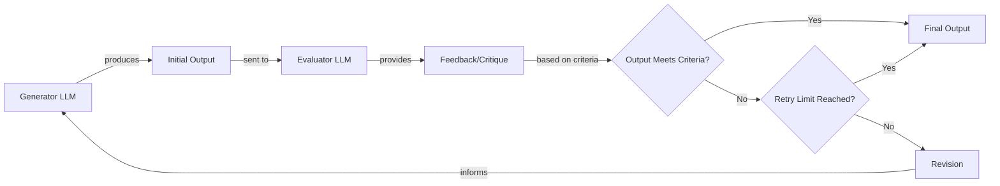
Image 7: A circular flow diagram illustrating the "Evaluator-Optimizer Loop" LLM workflow pattern.

### Core components of a ReAct AI agent

The ReAct (Reason and Act) pattern is at the heart of most modern AI agents. It enables an agent to reason about a task, decide on an action, take that action, and then interpret the result to inform its next step. This loop of `Reason -> Act -> Observe` continues until the task is complete.

The core components of a ReAct agent are:
*   An **LLM** that does the reasoning. It analyzes the current situation, decides what to do next, and interprets the outcomes of its actions.
*   A set of **tools** that allow the agent to perform actions in an external environment. These are like the agent's hands, enabling it to do things like search the web, query a database, or send an email. We will cover tools in detail in Lesson 6.
*   **Memory**, which gives the agent context. **Short-term memory** is like a computer's RAM, holding information for the current task. **Long-term memory** stores factual knowledge and user preferences across sessions. We will explore memory architectures in Lesson 9.

Almost all state-of-the-art agents in the industry use the ReAct pattern, as it has proven to be a powerful and flexible approach for building autonomous systems. Researchers are actively extending it with variants like Focused ReAct, which reduces runtime and context drift, and ReflAct, which adds goal-state reflection to improve task success rates [[59]](https://www.emergentmind.com/topics/reason-act-reflect-react-architecture). Lessons from robotics control systems also inform agent reliability, inspiring production SDKs from Anthropic, Google, and OpenAI that provide robust error handling, context management, and execution tracing [[60]](https://arxiv.org/pdf/2601.20334). We will dedicate Lessons 7 and 8 to a deep dive into this pattern.

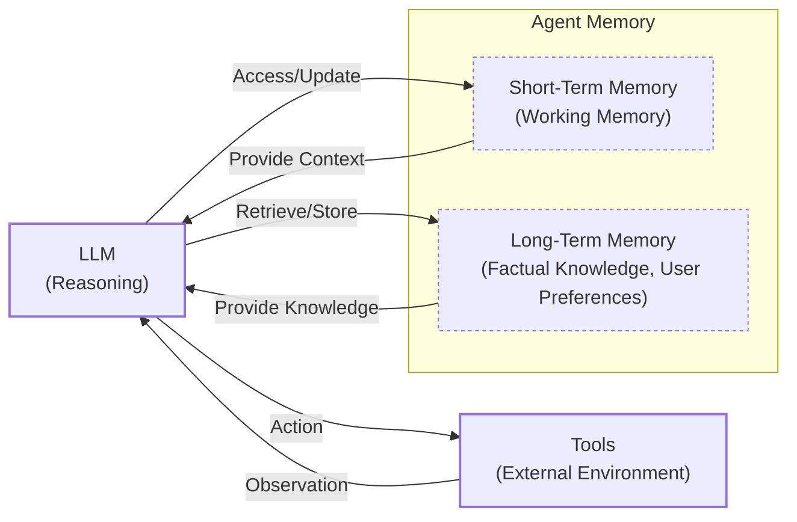
Image 8: A high-level architecture diagram illustrating the core components and dynamics of a ReAct AI agent.

## Zooming In on Our Favorite Examples

To anchor these concepts in the real world, let's examine a few state-of-the-art examples, starting with a simple workflow and moving toward a more complex hybrid system. We will keep these explanations high-level, focusing on the architectural patterns rather than the technical details.

### Document summarization workflow by Gemini in Google Workspace

**Problem:** Finding the right information in a large document or across multiple documents can be a time-consuming process. A quick, embedded summary can guide your search and help you locate what you need much faster.

This is a perfect use case for a pure and simple LLM workflow. The system follows a predefined chain of steps, with each step feeding into the next [[3]](https://cloud.google.com/blog/products/ai-machine-learning/long-document-summarization-with-workflows-and-gemini-models), [[1]](https://support.google.com/docs/answer/15627020?hl=en). For instance, when you open a PDF in Google Drive, a "Summary by Gemini" panel can automatically appear, generating a concise summary and suggesting follow-up questions [[2]](https://masterconcept.ai/blog/new-google-workspace-gemini-feature-your-pdfs-now-write-their-own-summaries-and-suggest-next-steps/). This is a classic example of a map-reduce style workflow, which is predictable, reliable, and efficient for this specific task.

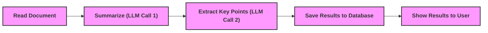
Image 9: A simple LLM workflow diagram for document summarization and analysis.

A typical implementation looks like this:
1.  **Read Document:** The system ingests the document content. For long documents that exceed the LLM's context window, it splits the text into smaller chunks.
2.  **Summarize:** An LLM call is made to summarize each chunk in parallel. This "map" operation is faster than a sequential approach [[3]](https://cloud.google.com/blog/products/ai-machine-learning/long-document-summarization-with-workflows-and-gemini-models).
3.  **Extract Key Points:** The individual summaries are combined, and another LLM call—the "reduce" operation—extracts the most important points from the aggregated summary.
4.  **Save and Show Results:** The final summary and key points are saved and displayed to the user.

### Gemini CLI coding assistant

**Problem:** Writing code is a slow and often tedious process. It involves reading dense documentation, navigating unfamiliar codebases, and learning new programming languages. A coding assistant can dramatically speed up this process.

The Gemini CLI is an open-source AI agent, implemented in TypeScript, that brings the power of Gemini directly into your terminal [[5]](https://developers.google.com/gemini-code-assist/docs/gemini-cli), [[52]](https://blog.google/technology/developers/introducing-gemini-cli-open-source-ai-agent/). It uses a ReAct architecture to function as a single-agent system for coding. It can write code from scratch (a practice known as "vibe coding"), assist an engineer with specific functions, generate documentation, and help you quickly understand new codebases. Similar tools in this space include Cursor, Windsurf, and Claude Code.

Here is a high-level look at how the Gemini CLI's operational loop works:

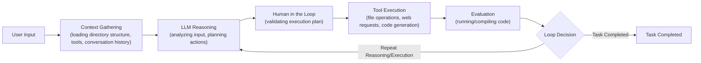
Image 10: A circular operational loop diagram for the Gemini CLI coding assistant, illustrating the ReAct pattern.

1.  **Context Gathering:** When you start the agent, it creates an initial snapshot of your project's directory structure and loads available tools and conversation history into its working memory (context) [[40]](https://wietsevenema.eu/blog/2025/how-gemini-cli-builds-context/). It can also load persistent context from `GEMINI.md` files at global, project, and sub-directory levels [[42]](https://geminicli.com/docs/cli/gemini-md/), [[43]](https://medium.com/google-cloud/gemini-cli-tutorial-series-part-9-understanding-context-memory-and-conversational-branching-095feb3e5a43).
2.  **LLM Reasoning:** The Gemini model analyzes your input and the current context to plan the actions required to fulfill your request.
3.  **Human in the Loop:** Before executing, the agent often validates its plan with you.
4.  **Tool Execution:** The agent executes the selected actions (tools). These can include reading files from the file system, searching the web for documentation, interpreting code, or generating new code diffs.
5.  **Evaluation:** The agent dynamically evaluates the generated code by attempting to run or compile it.
6.  **Loop Decision:** Based on the evaluation, the agent decides if the task is complete or if it needs to repeat the loop to refine its work.

The Gemini CLI has access to a variety of tools, including file system operations (`grep`, `ls`), code interpreters, web search, and version control (`git`), allowing it to function like a human developer within your terminal [[5]](https://developers.google.com/gemini-code-assist/docs/gemini-cli).

### Perplexity deep research agent

**Problem:** Researching a new topic can be daunting. It is hard to know where to start, which sources are trustworthy, and how to combine information from multiple places into a coherent understanding. A research assistant that can quickly scan the internet and synthesize a report can be a huge productivity booster.

Perplexity's Deep Research feature is a powerful example of a hybrid system. It combines structured workflow patterns with dynamic ReAct reasoning to perform autonomous, expert-level research. Unlike single-agent systems, it uses multiple specialized agents, orchestrated in parallel, to perform dozens of searches across hundreds of sources and deliver a comprehensive report in just a few minutes [[8]](https://www.perplexity.ai/hub/blog/introducing-perplexity-deep-research).

While the exact implementation is closed-source, we can infer its likely architecture based on our research.

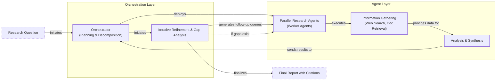
Image 11: An iterative multi-step process diagram for Perplexity Deep Research, illustrating a hybrid system combining orchestrator-worker and ReAct patterns.

1.  **Research Planning & Decomposition:** An orchestrator agent analyzes the user's research question and breaks it down into a set of targeted sub-questions. This is a classic orchestrator-worker pattern.
2.  **Parallel Information Gathering:** To move faster, specialized search agents are deployed in parallel, each tackling a single sub-question. This approach avoids the confusion LLMs can face with long-context reasoning when different types of information are mixed in a single agent [[61]](https://aws.amazon.com/blogs/machine-learning/unlocking-complex-problem-solving-with-multi-agent-collaboration-on-amazon-bedrock/). These agents use tools like web search and document retrieval to gather information.
3.  **Analysis & Synthesis:** Each agent validates its sources, ranks them by relevance, and summarizes the top findings.
4.  **Iterative Refinement & Gap Analysis:** The orchestrator gathers the results from all the worker agents and identifies any knowledge gaps. If gaps are found, it generates follow-up queries and repeats the process.
5.  **Report Generation:** Once the research is complete, the orchestrator synthesizes all the information into a final, coherent report with inline citations [[8]](https://www.perplexity.ai/hub/blog/introducing-perplexity-deep-research).

This system beautifully illustrates the power of hybrid architectures. A structured orchestrator-worker workflow supervises multiple dynamic ReAct agents, combining the reliability of workflows with the flexibility of agents. However, this power comes at a cost. Multi-agent systems can use up to 15 times more tokens than a simple chat interaction, making them economically viable only for high-value tasks [[62]](https://www.anthropic.com/engineering/built-multi-agent-research-system). Furthermore, as the number of agents increases, interaction complexity can grow exponentially, creating significant computational overhead [[64]](https://www.hakunamatatatech.com/our-resources/blog/why-do-multi-agent-llm-systems-fail). By treating the agent team like a distributed system, concepts like load balancing and fault tolerance can be applied to enhance robustness and scalability [[63]](https://ubos.tech/news/language-model-teams-as-distributed-systems-a-breakthrough-in-ai-collaboration/).

## The Challenges of Every AI Engineer

Now that you understand the spectrum from LLM workflows to AI agents, it is important to recognize that every AI engineer, whether at a startup or a Fortune 500 company, faces these same fundamental challenges when designing a new AI application. This architectural choice is one of the core decisions that determine whether your AI application succeeds in production or fails completely.

To set the stage for future lessons, here are some of the daily challenges every AI engineer battles [[15]](https://arxiv.org/html/2510.25423v2):
*   **Reliability Issues:** Your agent works perfectly in demos but becomes unpredictable with real users. LLM reasoning failures can propagate and compound through multi-step processes, a "cascade effect" where small early mistakes lead to large downstream failures [[65]](https://galileo.ai/blog/agent-failure-modes-guide). This is not just about LLM non-determinism; it includes fragile integrations. In May 2025, a simple expired SSL certificate on LangSmith caused 55% of API requests to fail for 28 minutes because an automated renewal process had been failing silently for months, a failure mode dubbed "authentication rot" [[66]](https://medium.com/data-science-collective/why-ai-agents-keep-failing-in-production-cdd335b22219).
*   **Context Limits:** Systems struggle to maintain coherence across long conversations. Due to a phenomenon known as the "lost in the middle" effect, models are less reliable at using information placed in the middle of a long context window, effectively forgetting critical details from earlier in the conversation [[67]](https://www.getmaxim.ai/articles/top-6-reasons-why-ai-agents-fail-in-production-and-how-to-fix-them/).
*   **Data Integration:** Building pipelines to pull information from Slack, web APIs, SQL databases, and data lakes is a constant struggle. You are often at the mercy of third-party APIs with highly variable throughput and latency, making it difficult to ensure predictable performance [[68]](https://medium.com/@dixon.deng/rethinking-workflows-when-ai-needs-a-backbone-0d5764c10a24). The "garbage-in, garbage-out" principle is unforgiving.
*   **Cost-Performance Trap:** Sophisticated agents can deliver impressive results, but they can also cost a fortune. Multi-agent systems can consume 15 times more tokens than standard chat interactions, making them economically unfeasible for many applications without careful resource management [[62]](https://www.anthropic.com/engineering/built-multi-agent-research-system).
*   **Security Concerns:** Autonomous agents with powerful write permissions could send the wrong emails, delete critical files, or expose sensitive data. Attackers use techniques like prompt injection, where malicious inputs manipulate agent behavior to bypass safety constraints [[67]](https://www.getmaxim.ai/articles/top-6-reasons-why-ai-agents-fail-in-production-and-how-to-fix-them/).

These issues contribute to "agent decay," where an agent's performance degrades in production over time [[69]](https://aws.amazon.com/blogs/machine-learning/evaluating-ai-agents-real-world-lessons-from-building-agentic-systems-at-amazon/).

The good news is that these challenges are solvable. In our next lesson on structured outputs, we will begin to tackle reliability by forcing LLMs to produce predictable, machine-readable data. Throughout this course, we will cover patterns for building reliable products through specialized evaluation pipelines that trace every step and use regression gates in Continuous Integration/Continuous Deployment (CI/CD) to prevent quality degradation [[70]](https://www.braintrust.dev/articles/ai-agent-evaluation-framework). We will also cover strategies for creating effective hybrid systems and ways to keep costs and latency under control.

By the end of this course, you will have the knowledge to architect AI systems that are not only powerful but also robust, efficient, and safe. You will know when to use a workflow, when to deploy an agent, and how to build hybrid systems that work in the real world.

## References

- [1] [How to check your access to AI summary in Google Docs](https://support.google.com/docs/answer/15627020?hl=en)
- [2] [New Google Workspace Gemini Feature: Your PDFs Now Write Their Own Summaries and Suggest Next Steps!](https://masterconcept.ai/blog/new-google-workspace-gemini-feature-your-pdfs-now-write-their-own-summaries-and-suggest-next-steps/)
- [3] [Long document summarization with Workflows and Gemini models](https://cloud.google.com/blog/products/ai-machine-learning/long-document-summarization-with-workflows-and-gemini-models)
- [4] [Get started with Gemini in the side panel](https://knowledge.workspace.google.com/admin/gemini/google-workspace-with-gemini)
- [5] [Gemini CLI](https://developers.google.com/gemini-code-assist/docs/gemini-cli)
- [6] [Introducing ChatGPT agent: bridging research and action](https://openai.com/index/introducing-chatgpt-agent/)
- [7] [Building effective agents](https://www.anthropic.com/engineering/building-effective-agents)
- [8] [Introducing Perplexity Deep Research](https://www.perplexity.ai/hub/blog/introducing-perplexity-deep-research)
- [9] [Perplexity Agent API Platform: AI Search for Developers Guide](https://www.digitalapplied.com/blog/perplexity-agent-api-platform-ai-search-developer-guide)
- [10] [Andrej Karpathy on Software 3.0: Software in the Age of AI](https://medium.com/@ben_pouladian/andrej-karpathy-on-software-3-0-software-in-the-age-of-ai-b25533da93b6)
- [11] [Autonomy Sliders](https://andrewships.substack.com/p/autonomy-sliders)
- [12] [Mark Barbir on LinkedIn: Andrej Karpathy's latest talk describes our journey perfectly](https://www.linkedin.com/posts/markbarbir_andrej-karpathys-latest-talk-describes-our-activity-7343449417426837505-oTFx)
- [13] [Andrej Karpathy on Software 3.0, LLM OSes, and the Rise of AI Agents](https://www.latent.space/p/s3)
- [14] [Andrej Karpathy: Software Is Changing (Again)](https://singjupost.com/andrej-karpathy-software-is-changing-again/)
- [15] [What Challenges Do Developers Face in AI Agent Systems? An Empirical Study on Stack Overflow & GitHub Issues](https://arxiv.org/html/2510.25423v2)
- [16] [8 Critical AI Security Challenges and How to Address Them](https://permiso.io/blog/8-critical-ai-security-challenges)
- [17] [Key Challenges in AI Agent Development (and How to Solve Them)](https://medium.com/@ananya_95177/key-challenges-in-ai-agent-development-and-how-to-solve-them-460fceb0a6d5)
- [18] [Agentic AI Threats: Understanding the Security Risks of AI Agents](https://unit42.paloaltonetworks.com/agentic-ai-threats/)
- [19] [The Agentic AI Revolution: 5 Unexpected Security Challenges](https://www.cyberark.com/resources/blog/the-agentic-ai-revolution-5-unexpected-security-challenges)
- [20] [LLM Chaining: How It Works, Why It’s Useful, and How to Do It](https://mirascope.com/blog/llm-chaining)
- [21] [Issue #110: LLM Workflow Patterns](https://mlpills.substack.com/p/issue-110-llm-workflow-patterns)
- [22] [Prompt Structure and Chaining: The Keys to Unlocking LLM Potential](https://orq.ai/blog/prompt-structure-chaining)
- [23] [LLM Chains](https://www.geeksforgeeks.org/artificial-intelligence/llm-chains/)
- [24] [Prompt Chaining](https://www.promptingguide.ai/techniques/prompt_chaining)
- [25] [Building a Self-Healing AI Orchestrator with Reflexion Patterns](https://online.stevens.edu/blog/building-self-healing-ai-orchestrator-reflexion-patterns/)
- [26] [DIY #17: Orchestrator-Worker LLM Agent](https://mlpills.substack.com/p/diy-17-orchestrator-worker-llm-agent)
- [27] [601 real-world gen AI use cases from the world's leading organizations](https://cloud.google.com/transform/101-real-world-generative-ai-use-cases-from-industry-leaders)
- [28] [Sean Falconer on LinkedIn: The Orchestrator-Worker Pattern](https://www.linkedin.com/posts/seanf_the-orchestrator-worker-pattern-is-a-well-known-activity-7294775230353313792-_zFL)
- [29] [Orchestrator-Workers](https://platform.claude.com/cookbook/patterns-agents-orchestrator-workers)
- [30] [Evaluator, reflect, and refine loop patterns for agentic AI](https://docs.aws.amazon.com/prescriptive-guidance/latest/agentic-ai-patterns/evaluator-reflect-refine-loop-patterns.html)
- [31] [Building Self-Correcting LLM Systems: The Evaluator-Optimizer Pattern](https://dev.to/clayroach/building-self-correcting-llm-systems-the-evaluator-optimizer-pattern-169p)
- [32] [The research on LLM self-correction](https://vadim.blog/the-research-on-llm-self-correction)
- [33] [Evaluator-Optimizer](https://platform.claude.com/cookbook/patterns-agents-evaluator-optimizer)
- [34] [Evaluator-Optimizer LLM Workflow](https://sebgnotes.substack.com/p/evaluator-optimizer-llm-workflow)
- [35] [What is an AI agent?](https://cloud.google.com/discover/what-are-ai-agents)
- [36] [Real Agents vs. Workflows: The Truth Behind AI 'Agents'](https://www.youtube.com/watch?v=kQxr-uOxw2o&t=1s)
- [37] [Exploring the difference between agents and workflows](https://decodingml.substack.com/p/llmops-for-production-agentic-rag)
- [38] [A Developer’s Guide to Building Scalable AI: Workflows vs Agents](https://towardsdatascience.com/a-developers-guide-to-building-scalable-ai-workflows-vs-agents/)
- [39] [Stop Building AI Agents: Here’s what you should build instead](https://decodingml.substack.com/p/stop-building-ai-agents)
- [40] [How Gemini CLI builds context and learns about your codebase](https://wietsevenema.eu/blog/2025/how-gemini-cli-builds-context/)
- [41] [How do I provide context files to Gemini CLI?](https://milvus.io/ai-quick-reference/how-do-i-provide-context-files-to-gemini-cli)
- [42] [GEMINI.md Context Files](https://geminicli.com/docs/cli/gemini-md/)
- [43] [Gemini CLI Tutorial Series Part 9: Understanding Context, Memory, and Conversational Branching](https://medium.com/google-cloud/gemini-cli-tutorial-series-part-9-understanding-context-memory-and-conversational-branching-095feb3e5a43)
- [44] [A look at Context Engineering in Gemini CLI](https://aipositive.substack.com/p/a-look-at-context-engineering-in)
- [45] [Tracer on LinkedIn: The third wave of data engineering](https://www.linkedin.com/posts/tracercloud_the-third-wave-of-data-engineering-activity-7417891798364168192-ZQJz)
- [46] [How AI Models and Real-Time Monitoring Improve Energy Pipeline Health](https://www.sandtech.com/insight/ai-models-real-time-monitoring-improve-energy-pipeline-health/)
- [47] [Protecting AI Data Pipelines](https://www.commvault.com/use-cases/protecting-ai-data-pipelines)
- [48] [Machine Learning Monitoring Tools: Your Shield for AI Reliability](https://www.lumenova.ai/blog/machine-learning-monitoring-tools-ai-reliability/)
- [49] [Top 7 Data Pipeline Monitoring Tools for 2024](https://www.integrate.io/blog/data-pipeline-monitoring-tools/)
- [50] [Andrej Karpathy: Software Is Changing (Again)](https://www.youtube.com/watch?v=LCEmiRjPEtQ)
- [51] [Building Production-Ready RAG Applications: Jerry Liu](https://www.youtube.com/watch?v=TRjq7t2Ms5I)
- [52] [Gemini CLI: your open-source AI agent](https://blog.google/technology/developers/introducing-gemini-cli-open-source-ai-agent/)
- [53] [Gemini CLI README.md](https://github.com/google-gemini/gemini-cli/blob/main/README.md)
- [54] [A Conceptual AI-Agent Framework Based on a Review of the Classical and Modern Agent Architectures](https://arxiv.org/html/2602.10479v1)
- [55] [A Review of Large Language Models as Autonomous Agents](https://arxiv.org/html/2508.17281v2)
- [56] [A Developer’s Guide to Building Scalable AI: Workflows vs Agents](https://towardsdatascience.com/a-developers-guide-to-building-scalable-ai-workflows-vs-agents/)
- [57] [Waterfall 2.0: LLM-Driven Workflows in Software Development](https://medium.com/@gstarikov/waterfall-2-0-llm-driven-workflows-in-software-development-701dc8b287ba)
- [58] [Multi-agent collaboration](https://www.ibm.com/think/topics/multi-agent-collaboration)
- [59] [Reason, Act, Reflect (ReAct) Architecture](https://www.emergentmind.com/topics/reason-act-reflect-react-architecture)
- [60] [A System for General In-Hand Object Re-Orientation](https://arxiv.org/pdf/2601.20334)
- [61] [Unlocking complex problem-solving with multi-agent collaboration on Amazon Bedrock](https://aws.amazon.com/blogs/machine-learning/unlocking-complex-problem-solving-with-multi-agent-collaboration-on-amazon-bedrock/)
- [62] [How we built a multi-agent research system](https://www.anthropic.com/engineering/built-multi-agent-research-system)
- [63] [Language Model Teams as Distributed Systems: A Breakthrough in AI Collaboration](https://ubos.tech/news/language-model-teams-as-distributed-systems-a-breakthrough-in-ai-collaboration/)
- [64] [Why Do Multi-Agent LLM Systems Fail?](https://www.hakunamatatatech.com/our-resources/blog/why-do-multi-agent-llm-systems-fail)
- [65] [A Guide to AI Agent Failure Modes](https://galileo.ai/blog/agent-failure-modes-guide)
- [66] [Why AI agents keep failing in production](https://medium.com/data-science-collective/why-ai-agents-keep-failing-in-production-cdd335b22219)
- [67] [Top 6 Reasons Why AI Agents Fail in Production and How to Fix Them](https://www.getmaxim.ai/articles/top-6-reasons-why-ai-agents-fail-in-production-and-how-to-fix-them/)
- [68] [Rethinking Workflows: When AI Needs a Backbone](https://medium.com/@dixon.deng/rethinking-workflows-when-ai-needs-a-backbone-0d5764c10a24)
- [69] [Evaluating AI agents: Real-world lessons from building agentic systems at Amazon](https://aws.amazon.com/blogs/machine-learning/evaluating-ai-agents-real-world-lessons-from-building-agentic-systems-at-amazon/)
- [70] [A Practical Framework for AI Agent Evaluation](https://www.braintrust.dev/articles/ai-agent-evaluation-framework)
</article>