# The Critical Decision Every AI Engineer Faces

As an AI engineer preparing to build your first real AI application, after narrowing down the problem you want to solve, one key decision is how to design your AI solution. Should it follow a predictable, step-by-step workflow, or does it demand a more autonomous approach, where the LLM makes self-directed decisions? This is one of the fundamental questions that will determine the success or failure of your project: How should you architect your AI system?

When building AI applications, engineers face this critical architectural decision early in their development process. This choice will impact everything from development time and costs to reliability and user experience. Choose the wrong approach, and you might end up with an overly rigid system that breaks when users deviate from expected patterns, or an unpredictable agent that works brilliantly 80% of the time but fails catastrophically when it matters most. According to a 2024 survey, while 72% of organizations are experimenting with AI, only 1% consider their implementations "mature." This suggests most teams are "duct-taping something together and hoping it doesn’t explode in production" [[5]](https://towardsdatascience.com/a-developers-guide-to-building-scalable-ai-workflows-vs-agents/). You could waste months rebuilding the entire architecture, leaving behind frustrated users and executives questioning the spiraling costs.

In 2024 and 2025, we have seen billion-dollar AI startups succeed or fail based on this architectural decision. The most successful AI engineers and teams understand when to use predefined workflows versus autonomous agents and, more importantly, how to combine both approaches effectively. This is not just a technical choice; it is a strategic one that defines how your product will behave, scale, and be maintained.

This lesson will provide a framework for making this architectural choice. We will explore the fundamental trade-offs between LLM workflows and AI agents, examine real-world examples from leading companies, and show you how to design systems that incorporate the best of both approaches. You will learn to identify the right path for your AI applications, ensuring they are not only powerful but also reliable and maintainable.

## Understanding the Spectrum: From Workflows to Agents

To choose between workflows and agents, you need a clear understanding of what they are. This section will not focus on the technical specifics yet, but rather on their core properties and how they are used.

### LLM Workflows

An LLM workflow is a sequence of tasks involving LLM calls or other operations, such as reading from a database or writing to a file system. It is largely predefined and orchestrated by developer-written code. The steps are defined in advance, resulting in deterministic or rule-based paths with predictable execution and explicit control flow. Think of it as a factory assembly line, where each station performs a specific, repeatable task in a set order. This structure makes workflows reliable, testable, cost-predictable, and easier to debug [[5]](https://towardsdatascience.com/a-developers-guide-to-building-scalable-ai-workflows-vs-agents/).

A simple example is a document summarization pipeline that uses a map/reduce approach. The system splits a long document into smaller chunks, summarizes each chunk in parallel using separate LLM calls (the "map" step), and then combines these summaries into a final, coherent overview with one last LLM call (the "reduce" step). This entire process is hardcoded; the LLM only generates text at predefined points [[1]](https://cloud.google.com/blog/products/ai-machine-learning/long-document-summarization-with-workflows-and-gemini-models). In future lessons, you will explore advanced workflow patterns like chaining, routing, and orchestrator-workers.

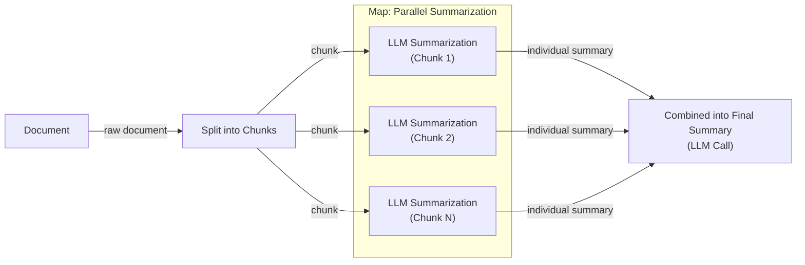

Image 1: A flowchart illustrating a simple LLM workflow for document summarization using a map/reduce approach.

### AI Agents

In contrast, AI agents are systems where an LLM plays a central role in dynamically deciding the sequence of steps, reasoning, and actions to achieve a goal [[2]](https://www.anthropic.com/engineering/building-effective-agents), [[3]](https://cloud.google.com/discover/what-are-ai-agents). The steps are not defined in advance but are planned based on the task and the current state of the environment. This makes agents adaptive and capable of handling novelty. They are like a skilled human expert addressing a novel problem where the steps are not known in advance, adapting their approach with each new piece of information.

An agent combines an LLM with memory to retain context, tools to interact with its environment, and a planning module for reasoning [[2]](https://www.anthropic.com/engineering/building-effective-agents). The planning component involves processes like reflection and self-criticism, allowing the agent to evaluate its progress and adjust its strategy. For instance, a research agent might start with a broad query, use a web search tool, analyze the results, decide to refine its query, search again, and repeat this cycle until it has gathered enough information to synthesize a comprehensive answer. You will cover tools, memory, and agentic patterns like ReAct in upcoming lessons.

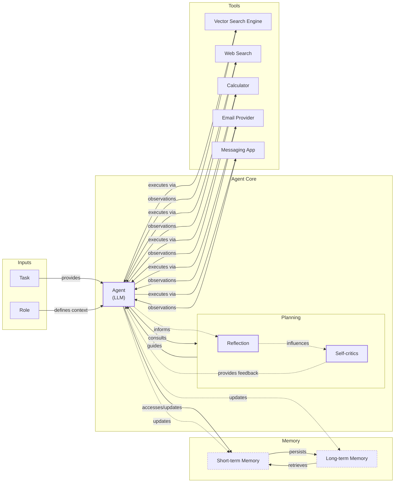

Image 2: A diagram illustrating a simple agentic system with an Agent (LLM), Memory, Tools, and Planning, showing the cyclical interaction flow.

Both workflows and agents require an orchestration layer to manage their execution. In a workflow, this layer is like a conductor following a musical score, executing a predefined plan. For an agent, the orchestration layer is more like a facilitator, enabling the LLM's dynamic planning process and managing its interactions with tools and memory. The core difference lies in who is in control: the developer's code or the LLM's reasoning.

## Choosing Your Path

The fundamental difference between workflows and agents comes down to developer-defined logic versus LLM-driven autonomy. This is not a binary choice but a spectrum. At one end, you have rigid workflows with high reliability; at the other, you have fully autonomous agents with high flexibility but lower reliability [[4]](https://decodingml.substack.com/p/llmops-for-production-agentic-rag), [[5]](https://towardsdatascience.com/a-developers-guide-to-building-scalable-ai-workflows-vs-agents/).

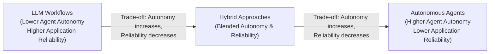

Image 3: A diagram illustrating the gradient between LLM workflows and AI agents, showing the trade-off between autonomy and reliability.

### When to Use LLM Workflows

Workflows are best for tasks with a well-defined structure. This includes pipelines for data extraction from sources like Slack or Google Drive, automated report generation, and content repurposing, like turning articles into social media posts. Their strength lies in predictability, making them easier to debug and monitor [[2]](https://www.anthropic.com/engineering/building-effective-agents). Because each step is explicit, you can often use smaller, specialized, and more cost-effective models for different sub-tasks, keeping operational costs and latency predictable. This reliability is why workflows are preferred in regulated fields like finance and healthcare, where a financial report or a medical summary must be accurate every time. For example, the Mayo Clinic uses AI workflows to improve diagnostic accuracy at scale, a context where predictability is paramount [[36]](https://healthinnovation.ucsd.edu/news/11-health-systems-leading-in-ai). They are also ideal for building Minimum Viable Products (MVPs), as you can hardcode features to get to market quickly [[5]](https://towardsdatascience.com/a-developers-guide-to-building-scalable-ai-workflows-vs-agents/). The push for greater automation is strong even in these areas. Major firms like PwC are collaborating with AI labs like Anthropic to build AI agents for regulated sectors, signaling a move toward managed autonomy where governance and human oversight are built in from the start [[6]](https://www.pwc.com/us/en/about-us/newsroom/press-releases/pwc-anthropic-ai-native-finance-life-sciences-enterprise-agents.html).

However, workflows can be rigid. They struggle with unexpected user inputs, and adding new features can become as complex as traditional software development.

### When to Use AI Agents

Agents are the right choice for open-ended problems that require dynamic adaptation. Use cases include complex research and synthesis, such as investigating a broad topic like World War II, or interactive problem-solving, like debugging code or handling a complex customer support issue. Their main strength is flexibility [[3]](https://cloud.google.com/discover/what-are-ai-agents).

This adaptability comes at a cost. Agents are non-deterministic, meaning their performance, latency, and cost can vary with each run, making them less reliable [[7]](https://arxiv.org/html/2510.25423v2). They often require more powerful and expensive LLMs and multiple reasoning steps. This increases costs.

There are also serious security risks. An agent with write permissions could accidentally delete files or send inappropriate emails. A running joke in the developer community is seeing posts about a coding agent deleting an entire project, followed by the comment, "Anyway, I wanted to start a new project." This is not just a joke; there are documented cases, such as CVE-2025-53355, where agents with overprivileged production access have deleted entire databases. The primary failure was not the agent's logic but a lack of basic access control, reinforcing the need to enforce read-only defaults and use short-lived credentials for any write operations [[8]](https://www.penligent.ai/hackinglabs/de/ai-agent-deleted-a-production-database-the-real-failure-was-access-control/). Debugging and evaluating agents is also notoriously difficult.

### Hybrid Approaches and the Autonomy Slider

Most real-world systems are not purely one or the other but a hybrid that blends both approaches. Andrej Karpathy introduced the concept of an "autonomy slider," where the user or developer decides how much control to give the AI [[9]](https://singjupost.com/andrej-karpathy-software-is-changing-again/).

Coding assistants like Cursor are a perfect example. You can use low-autonomy features like tab-completion (`Tab`), give it slightly more control to edit a selected block of code (`Cmd+K`), let it refactor an entire file (`Cmd+L`), or unleash it on the whole repository in full agent mode (`Cmd+I`) [[10]](https://www.linkedin.com/posts/markbarbir_andrej-karpathys-latest-talk-describes-our-activity-7343449417426837505-oTFx). Similarly, Perplexity offers different levels of autonomy, from a "quick search" (workflow-like) to "deep research" (more agentic) [[11]](https://www.latent.space/p/s3).

The ultimate goal is to create a fast and efficient feedback loop between AI generation and human verification [[9]](https://singjupost.com/andrej-karpathy-software-is-changing-again/). This is achieved through a combination of well-designed architecture and a thoughtful user interface. A good GUI can speed up the verification process by making AI-generated changes, like code diffs, easy to audit visually. Keeping the AI "on a tight leash" by giving it smaller, incremental tasks increases the probability of a successful output that the human can quickly verify and accept.

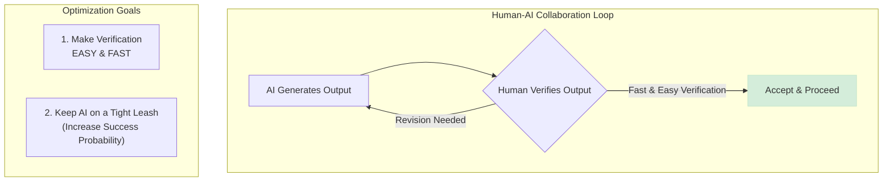

Image 4: A diagram illustrating the human-AI verification loop, which is optimized by making verification fast and keeping AI-generated tasks incremental.

## Exploring Common Patterns

To build your intuition for AI engineering, this section will present the most common patterns used to build both workflows and agents. These concepts will be covered in-depth in future lessons, but for now, the focus is on the high-level ideas.

### LLM Workflow Patterns

These patterns help structure interactions with LLMs when the task flow is mostly predictable.

**Chaining and Routing** is a foundational pattern where you automate multiple LLM calls in a sequence. A "router" LLM first classifies the user's input and then directs it to the appropriate specialized chain or workflow [[12]](https://www.geeksforgeeks.org/artificial-intelligence/llm-chains/). This allows you to handle different types of tasks with dedicated logic, making the system more modular and easier to debug [[38]](https://mlpills.substack.com/p/issue-110-llm-workflow-patterns). For example, a customer support system might route a query to a "billing" chain or a "technical support" chain based on the user's initial message. This separation of concerns ensures that each part of the workflow can be optimized independently.

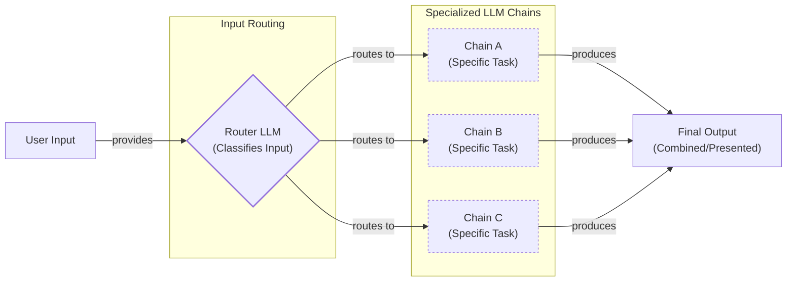

Image 5: A flowchart illustrating the "Chaining and Routing" pattern for LLM workflows.

The **Orchestrator-Worker** pattern, sometimes called a "Supervisor Agent" in enterprise contexts, introduces a dynamic planning step. This approach has seen explosive growth in adoption, with some platforms reporting over 300% increases in multi-agent workflows built on this model [[13]](https://www.databricks.com/blog/enterprise-ai-agent-trends-top-use-cases-governance-evaluations-and-more). A central "orchestrator" LLM analyzes the user's intent, breaks the task into sub-tasks, and delegates them to specialized "worker" LLMs or tools [[14]](https://online.stevens.edu/blog/building-self-healing-ai-orchestrator-reflexion-patterns/). This pattern bridges the gap between rigid workflows and fully autonomous agents, as the orchestrator dynamically decides which actions to take.

However, this centralized design introduces trade-offs. The orchestrator can become a performance bottleneck and a single point of failure [[15]](https://gurusup.com/blog/agent-orchestration-patterns). Production systems mitigate this with engineering patterns like timeouts, retries with exponential backoff for worker calls, and ensuring worker tools are idempotent to prevent errors like duplicate actions [[16]](https://gurusup.com/blog/multi-agent-orchestration-guide). Some advanced architectures even replace direct calls with an event-driven message queue like Kafka to decouple the orchestrator from the workers, improving scalability and resilience [[17]](https://www.linkedin.com/posts/seanf_the-orchestrator-worker-pattern-is-a-well-known-activity-7294775230353313792-_zFL).

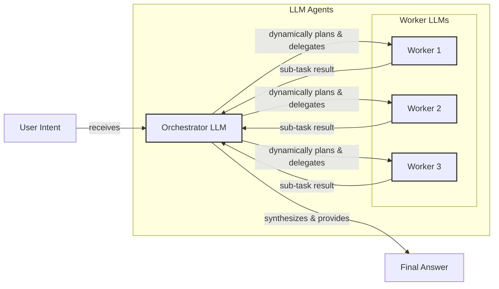

Image 6: A flowchart illustrating the Orchestrator-Worker pattern for LLM workflows, showing dynamic planning and delegation.

The **Evaluator-Optimizer Loop** is designed to auto-correct and refine LLM outputs. This pattern has theoretical roots in reinforcement learning, where an agent learns to improve its behavior based on feedback signals, though it faces challenges like avoiding over-optimizing for initial errors [[18]](https://aclanthology.org/2025.findings-acl.386.pdf). Research shows that this loop is most effective when it uses external, objective feedback, such as the output of unit tests for code generation, rather than relying on the LLM to simply "reflect" on its own work without new information [[39]](https://vadim.blog/the-research-on-llm-self-correction). In practice, one LLM generates a response, and another "evaluator" LLM assesses it against predefined criteria. If the output falls short, the evaluator provides feedback (a reflection), and the generator revises its work [[19]](https://docs.aws.amazon.com/prescriptive-guidance/latest/agentic-ai-patterns/evaluator-reflect-refine-loop-patterns.html). This iterative process mimics how a human writer refines a document based on an editor's feedback, continuing until the output meets the quality standard.

Here is a practical example from Anthropic's cookbook showing how this loop can be used to iteratively improve a Python function. Note how the "evaluator" provides targeted feedback that the "generator" uses in the next turn [[20]](https://platform.claude.com/cookbook/patterns-agents-evaluator-optimizer).

1.  The generator first produces a functional but incomplete implementation of a stack that must support a `getMin()` operation in constant time.
    ```python
    class MinStack:
        def __init__(self):
            self.stack = []
            self.minStack = []
    
        def push(self, x: int) -> None:
            self.stack.append(x)
            if not self.minStack or x <= self.minStack[-1]:
                self.minStack.append(x)
    
        def pop(self) -> None:
            if not self.stack:
                return
            if self.stack[-1] == self.minStack[-1]:
                self.minStack.pop()
            self.stack.pop()
    
        def getMin(self) -> int:
            if not self.minStack:
                return None
            return self.minStack[-1]
    ```
2.  The evaluator reviews the code against criteria like correctness and best practices, and provides specific feedback for improvement. It identifies issues with error handling, type hints, and documentation.
    ```text
    <evaluation>NEEDS_IMPROVEMENT</evaluation>
    <feedback>
    While the implementation is generally correct and achieves O(1) time complexity for all operations, there are several areas for improvement:
    
    1. Error Handling:
    - pop() should raise an exception when stack is empty rather than silently returning
    - getMin() should raise an exception when stack is empty rather than returning None
    - These behaviors should be consistent with standard stack implementations
    
    2. Type Hints:
    - Return type hint for pop() should be None or void
    - Missing type hints for class variables stack and minStack
    
    3. Documentation:
    - Missing docstrings for class and methods
    - Missing parameter descriptions
    </feedback>
    ```
3.  The generator incorporates the feedback to produce a more robust, production-ready version with proper error handling, type hints, and docstrings.
    ```python
    from typing import List
    
    class MinStack:
        """A stack that supports push, pop, and getting minimum element in O(1) time."""
    
        def __init__(self):
            """Initialize empty stack with two internal lists."""
            self.stack: List[int] = []
            self.minStack: List[int] = []
    
        def push(self, x: int) -> None:
            """
            Push element onto stack and update minimum stack.
    
            Args:
                x: Integer to push onto stack
    
            Raises:
                TypeError: If x is not an integer
            """
            if not isinstance(x, int):
                raise TypeError("Input must be an integer")
    
            self.stack.append(x)
            if not self.minStack or x <= self.minStack[-1]:
                self.minStack.append(x)
    
        def pop(self) -> None:
            """
            Remove and return top element from stack.
    
            Raises:
                IndexError: If stack is empty
            """
            if not self.stack:
                raise IndexError("Cannot pop from empty stack")
    
            if self.stack[-1] == self.minStack[-1]:
                self.minStack.pop()
            self.stack.pop()
    
        def getMin(self) -> int:
            """
            Get minimum element in stack.
    
            Returns:
                int: Minimum element in stack
    
            Raises:
                IndexError: If stack is empty
            """
            if not self.minStack:
                raise IndexError("Cannot get minimum from empty stack")
            return self.minStack[-1]
    ```

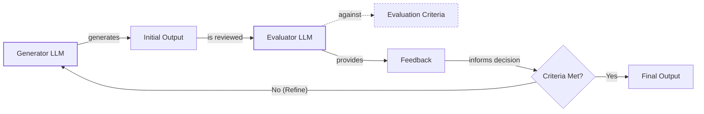

Image 7: Flowchart illustrating the Evaluator-Optimizer Loop pattern for LLM workflows.

### Core Components of a ReAct AI Agent

The ReAct (Reason and Act) framework is the dominant pattern for building modern AI agents. It enables an agent to reason about a task, decide on an action, execute it, observe the outcome, and repeat the cycle until the goal is complete. The core components are:

*   **Reasoning LLM:** This is the agent's "brain." It analyzes the task, interprets the outputs from tools, and plans the next step.
*   **Tools (Actions):** These are the agent's "hands," allowing it to interact with the external world. A tool can be anything from a web search API to a function that writes to a database. You will cover tools in detail in Lesson 6.
*   **Short-Term Memory:** This is the agent's working memory, comparable to a computer's RAM. It holds the conversation history and recent actions, providing immediate context for the next reasoning step.
*   **Long-Term Memory:** This provides the agent with persistent knowledge, such as factual data from documents or user preferences from past interactions. You will explore memory in Lesson 9.

Almost all state-of-the-art agents today use the ReAct pattern because of its proven effectiveness. You will dive deep into this framework in Lessons 7 and 8.

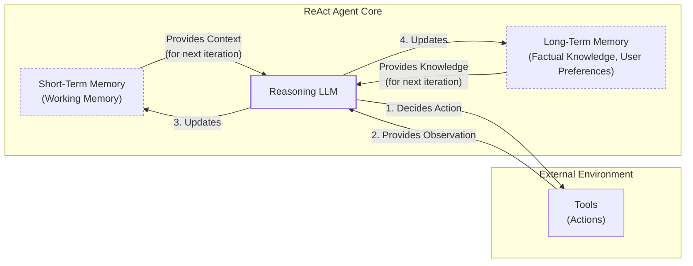

Image 8: A high-level diagram illustrating the core components and dynamics of a ReAct AI agent.

## Zooming In on Our Favorite Examples

To anchor these concepts in the real world, this section will analyze a few state-of-the-art systems, from a simple workflow to a complex hybrid agent. The explanations will remain high-level, based on what has been covered so far.

### Document Summarization by Gemini in Google Workspace

**Problem:** Navigating large documents to find specific information is time-consuming. An embedded summarization feature can quickly provide the gist of a document, guiding your search and saving valuable time. For instance, Gemini in Google Docs can generate an in-line summary of a document using "@AI summary" [[21]](https://support.google.com/docs/answer/15627020?hl=en). For business users, opening a PDF in Google Drive can automatically trigger a "Summary by Gemini" panel that not only summarizes the content but also suggests follow-up questions or actions [[36]](https://masterconcept.ai/blog/new-google-workspace-gemini-feature-your-pdfs-now-write-their-own-summaries-and-suggest-next-steps/).

This is a pure and simple workflow implemented as a chain of steps. It does not require dynamic reasoning; it follows a hardcoded sequence to produce a predictable output [[1]](https://cloud.google.com/blog/products/ai-machine-learning/long-document-summarization-with-workflows-and-gemini-models).

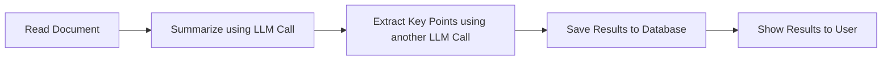

Image 9: Document Summarization and Analysis Workflow by Gemini in Google Workspace

A typical implementation of this workflow would be:

1.  **Read Document:** The system ingests the full text of the document.
2.  **Summarize:** An LLM call generates a concise summary.
3.  **Extract Key Points:** A second LLM call pulls out the most important topics or action items.
4.  **Save and Show:** The results are stored and displayed to the user.

### Gemini CLI Coding Assistant

**Problem:** Writing code, especially in a new language or unfamiliar codebase, is a slow and demanding process filled with reading documentation and debugging errors. A coding assistant can dramatically accelerate this workflow [[22]](https://developers.google.com/gemini-code-assist/docs/gemini-cli).

The open-source Gemini Command Line Interface (CLI) is a single-agent system that uses a ReAct-like architecture to help developers with tasks like writing code from scratch, generating documentation, and understanding new codebases [[23]](https://blog.google/technology/developers/introducing-gemini-cli-open-source-ai-agent/), [[24]](https://github.com/google-gemini/gemini-cli/blob/main/README.md). It operates in a loop, reasoning about the user's request and executing tools until the task is complete. It is a powerful example of an agent designed for a specific, complex domain.

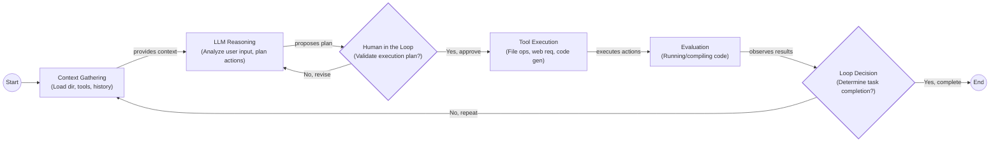

Image 10: A flowchart illustrating the operational loop of the "Gemini CLI Coding Assistant" as a single-agent system leveraging the ReAct pattern, including human validation and iterative steps.

Here is a high-level overview of its operational loop:

1.  **Context Gathering:** The agent loads the current state, including the directory structure, available tools (like file system access, web search, and code interpreters), and conversation history [[25]](https://wietsevenema.eu/blog/2025/how-gemini-cli-builds-context/). It can use `GEMINI.md` files at different levels (global, project, sub-directory) to layer in persistent instructions and context [[37]](https://geminicli.com/docs/cli/gemini-md/).
2.  **LLM Reasoning:** The Gemini model analyzes the user's request and the available context to create a plan of action.
3.  **Human in the Loop:** Before executing, the agent often validates the plan with the user for safety and correctness.
4.  **Tool Execution:** The agent executes the planned actions, which could involve reading files with `grep`, searching documentation online with a web fetch tool, or generating code diffs.
5.  **Evaluation:** It dynamically evaluates the outcome, for instance, by attempting to compile or run the generated code in its terminal.
6.  **Loop Decision:** Based on the evaluation, the agent decides whether the task is complete or if another iteration of reasoning and action is needed.

Despite this sophisticated loop, production coding agents are not immune to failure. A common issue is getting stuck in a repetitive tool-use loop, for example, calling the same file-reading tool with the same arguments multiple times. Production systems build in safeguards, like hard limits on the number of tool calls per turn or automatically halting if an agent repeats the exact same action three times in a row. The primary bottleneck is often not the model's reasoning ability but the quality and size of the context provided to it [[26]](https://blog.apiad.net/p/the-anatomy-of-ai-coding-agents).

### Perplexity Deep Research

**Problem:** Researching a new topic can be overwhelming. It is hard to know where to start, which sources to trust, and how to combine disparate pieces of information into a coherent understanding. A research assistant that can automate this process is a powerful tool [[27]](https://www.perplexity.ai/hub/blog/introducing-perplexity-deep-research).

Perplexity's Deep Research feature is a sophisticated hybrid system. It combines a structured orchestrator-worker workflow with multiple, parallel ReAct-style agents to conduct expert-level research. Unlike a single agent, it performs dozens of searches across hundreds of sources to produce a comprehensive report in minutes [[28]](https://zenvanriel.com/ai-engineer-blog/perplexity-computer-multi-model-agent-orchestration/). While the exact implementation is closed-source, its behavior suggests a multi-step, iterative process where a central reasoning engine (like Claude Opus) decomposes the goal and routes sub-tasks to specialized models (like Gemini for deep research) [[28]](https://zenvanriel.com/ai-engineer-blog/perplexity-computer-multi-model-agent-orchestration/).

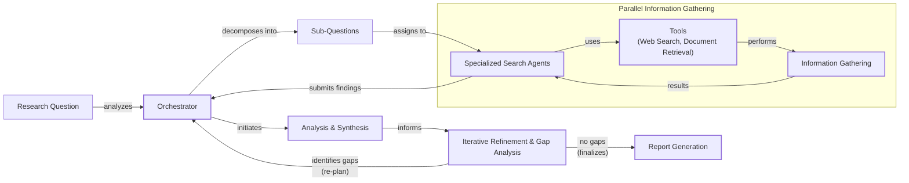

Image 11: Flowchart illustrating the iterative multi-step process of "Perplexity Deep Research" as a hybrid system.

An oversimplified view of how it might work is as follows:

1.  **Research Planning & Decomposition:** An orchestrator agent analyzes the main research question and breaks it down into targeted sub-questions.
2.  **Parallel Information Gathering:** The orchestrator deploys multiple specialized search agents, each assigned a sub-question. These agents run in parallel, using tools like web search to gather relevant sources independently. This isolation keeps their context focused and speeds up the process [[29]](https://www.gend.co/blog/perplexity-computer-ai-agent-orchestration).
3.  **Analysis & Synthesis:** Each agent validates its sources, ranks them by relevance, and summarizes the top findings.
4.  **Iterative Refinement & Gap Analysis:** The orchestrator synthesizes the results from all agents and performs a gap analysis, cross-checking for conflicting information or unanswered questions that are critical to the main query [[30]](https://trilogyai.substack.com/p/multi-agent-deep-research-architecture). If a gap is found—for example, a key piece of data is missing—the system can generate new, highly targeted sub-questions to dispatch another wave of agents, repeating the process until the research is sufficiently complete or a step limit is reached [[27]](https://www.perplexity.ai/hub/blog/introducing-perplexity-deep-research), [[31]](https://arxiv.org/html/2510.22344v1).
5.  **Report Generation:** Finally, the orchestrator compiles all the synthesized information into a single, structured report with citations.

This hybrid model demonstrates the power of combining the predictable control of workflows with the dynamic reasoning of agents. The orchestrator provides a structured, supervisory layer, while the individual agents offer the flexibility needed for open-ended exploration.

## The Challenges of Every AI Engineer

Now that you understand the spectrum from LLM workflows to AI agents, it is important to recognize that every AI engineer, whether at a startup or a Fortune 500 company, faces these same fundamental challenges when designing a new AI application. The architectural decisions we have discussed are at the core of whether an AI product succeeds in production or fails spectacularly.

A recent empirical study of developer discussions on Stack Overflow and GitHub issues identified five recurring families of challenges in AI agent development: dependency management, retrieval and memory, orchestration, model-tool interaction contracts, and runtime reliability [[7]](https://arxiv.org/html/2510.25423v2). These are the day-to-day realities of building with AI. You will constantly battle issues like:

*   **Reliability Issues:** Your agent works perfectly in demos but becomes unpredictable with real users. Agents can get stuck repeating the same step, fail to recognize when a task is complete, or suffer from a mismatch between their reasoning and the action they take. Even well-engineered systems see tool-calling failure rates of 3-15%, and identical prompts can yield different results, making debugging a nightmare [[32]](https://medium.com/@michael.hannecke/why-ai-agents-fail-in-production-what-ive-learned-the-hard-way-05f5df98cbe5).
*   **Context Limits:** Systems struggle to maintain coherence as conversations or tasks grow. This is often a problem of focus, not just size; context windows become overloaded with irrelevant "retrieval noise" from poorly structured data sources, drowning out the useful information. This issue persists even with larger context windows, as the core challenge is managing relevance, not just capacity [[33]](https://arize.com/blog/common-ai-agent-failures/).
*   **Data Integration:** You will need to build pipelines to pull information from Slack, web APIs, SQL databases, and data lakes, all while ensuring only high-quality data is passed to your AI system to avoid the "garbage-in, garbage-out" problem.
*   **Cost-Performance Trap:** Sophisticated agents can deliver impressive results but may cost a fortune per user interaction, making them economically unfeasible for many applications.
*   **Security Concerns:** This is arguably the most critical challenge. According to 2025 security reports, agentic systems are now involved in 1 in 8 enterprise breaches, often due to "permission creep" where agents accumulate excessive access over time [[34]](https://www.digitalapplied.com/blog/ai-agent-security-2026-1-in-8-breaches-agentic-systems). A stark real-world example occurred in early 2026, when security researchers used an offensive AI agent to gain full read-write access to McKinsey's internal chatbot, Lilli, by exploiting a SQL injection vulnerability. The agent accessed millions of confidential messages, demonstrating how a single flaw can grant an automated attacker control over a critical enterprise system [[35]](https://www.theregister.com/2026/03/09/mckinsey_ai_chatbot_hacked/).

These challenges are solvable. In the next lesson, you will begin tackling them by focusing on structured outputs. Throughout this course, you will systematically cover battle-tested patterns for building reliable products, including specialized evaluation and monitoring pipelines, strategies for creating effective hybrid systems, and practical approaches for keeping costs and latency under control. You will also explore tools, memory, ReAct agents, and Retrieval-Augmented Generation (RAG) in detail.

By completing this course, you will gain the skills to architect AI systems that are powerful, robust, and efficient. You will know when to use a workflow, when to deploy an agent, and how to build effective hybrid systems that perform reliably in real-world scenarios.

## References

- [1] [https://cloud.google.com/blog/products/ai-machine-learning/long-document-summarization-with-workflows-and-gemini-models](https://cloud.google.com/blog/products/ai-machine-learning/long-document-summarization-with-workflows-and-gemini-models)
- [2] [https://www.anthropic.com/engineering/building-effective-agents](https://www.anthropic.com/engineering/building-effective-agents)
- [3] [https://cloud.google.com/discover/what-are-ai-agents](https://cloud.google.com/discover/what-are-ai-agents)
- [4] [https://decodingml.substack.com/p/llmops-for-production-agentic-rag](https://decodingml.substack.com/p/llmops-for-production-agentic-rag)
- [5] [https://towardsdatascience.com/a-developers-guide-to-building-scalable-ai-workflows-vs-agents/](https://towardsdatascience.com/a-developers-guide-to-building-scalable-ai-workflows-vs-agents/)
- [6] [https://www.pwc.com/us/en/about-us/newsroom/press-releases/pwc-anthropic-ai-native-finance-life-sciences-enterprise-agents.html](https://www.pwc.com/us/en/about-us/newsroom/press-releases/pwc-anthropic-ai-native-finance-life-sciences-enterprise-agents.html)
- [7] [https://arxiv.org/html/2510.25423v2](https://arxiv.org/html/2510.25423v2)
- [8] [https://www.penligent.ai/hackinglabs/de/ai-agent-deleted-a-production-database-the-real-failure-was-access-control/](https://www.penligent.ai/hackinglabs/de/ai-agent-deleted-a-production-database-the-real-failure-was-access-control/)
- [9] [https://singjupost.com/andrej-karpathy-software-is-changing-again/](https://singjupost.com/andrej-karpathy-software-is-changing-again/)
- [10] [https://www.linkedin.com/posts/markbarbir_andrej-karpathys-latest-talk-describes-our-activity-7343449417426837505-oTFx](https://www.linkedin.com/posts/markbarbir_andrej-karpathys-latest-talk-describes-our-activity-7343449417426837505-oTFx)
- [11] [https://www.latent.space/p/s3](https://www.latent.space/p/s3)
- [12] [https://www.geeksforgeeks.org/artificial-intelligence/llm-chains/](https://www.geeksforgeeks.org/artificial-intelligence/llm-chains/)
- [13] [https://www.databricks.com/blog/enterprise-ai-agent-trends-top-use-cases-governance-evaluations-and-more](https://www.databricks.com/blog/enterprise-ai-agent-trends-top-use-cases-governance-evaluations-and-more)
- [14] [https://online.stevens.edu/blog/building-self-healing-ai-orchestrator-reflexion-patterns/](https://online.stevens.edu/blog/building-self-healing-ai-orchestrator-reflexion-patterns/)
- [15] [https://gurusup.com/blog/agent-orchestration-patterns](https://gurusup.com/blog/agent-orchestration-patterns)
- [16] [https://gurusup.com/blog/multi-agent-orchestration-guide](https://gurusup.com/blog/multi-agent-orchestration-guide)
- [17] [https://www.linkedin.com/posts/seanf_the-orchestrator-worker-pattern-is-a-well-known-activity-7294775230353313792-_zFL](https://www.linkedin.com/posts/seanf_the-orchestrator-worker-pattern-is-a-well-known-activity-7294775230353313792-_zFL)
- [18] [https://aclanthology.org/2025.findings-acl.386.pdf](https://aclanthology.org/2025.findings-acl.386.pdf)
- [19] [https://docs.aws.amazon.com/prescriptive-guidance/latest/agentic-ai-patterns/evaluator-reflect-refine-loop-patterns.html](https://docs.aws.amazon.com/prescriptive-guidance/latest/agentic-ai-patterns/evaluator-reflect-refine-loop-patterns.html)
- [20] [https://platform.claude.com/cookbook/patterns-agents-evaluator-optimizer](https://platform.claude.com/cookbook/patterns-agents-evaluator-optimizer)
- [21] [https://support.google.com/docs/answer/15627020?hl=en](https://support.google.com/docs/answer/15627020?hl=en)
- [22] [https://developers.google.com/gemini-code-assist/docs/gemini-cli](https://developers.google.com/gemini-code-assist/docs/gemini-cli)
- [23] [https://blog.google/technology/developers/introducing-gemini-cli-open-source-ai-agent/](https://blog.google/technology/developers/introducing-gemini-cli-open-source-ai-agent/)
- [24] [https://github.com/google-gemini/gemini-cli/blob/main/README.md](https://github.com/google-gemini/gemini-cli/blob/main/README.md)
- [25] [https://wietsevenema.eu/blog/2025/how-gemini-cli-builds-context/](https://wietsevenema.eu/blog/2025/how-gemini-cli-builds-context/)
- [26] [https://blog.apiad.net/p/the-anatomy-of-ai-coding-agents](https://blog.apiad.net/p/the-anatomy-of-ai-coding-agents)
- [27] [https://www.perplexity.ai/hub/blog/introducing-perplexity-deep-research](https://www.perplexity.ai/hub/blog/introducing-perplexity-deep-research)
- [28] [https://zenvanriel.com/ai-engineer-blog/perplexity-computer-multi-model-agent-orchestration/](https://zenvanriel.com/ai-engineer-blog/perplexity-computer-multi-model-agent-orchestration/)
- [29] [https://www.gend.co/blog/perplexity-computer-ai-agent-orchestration](https://www.gend.co/blog/perplexity-computer-ai-agent-orchestration)
- [30] [https://trilogyai.substack.com/p/multi-agent-deep-research-architecture](https://trilogyai.substack.com/p/multi-agent-deep-research-architecture)
- [31] [https://arxiv.org/html/2510.22344v1](https://arxiv.org/html/2510.22344v1)
- [32] [https://medium.com/@michael.hannecke/why-ai-agents-fail-in-production-what-ive-learned-the-hard-way-05f5df98cbe5](https://medium.com/@michael.hannecke/why-ai-agents-fail-in-production-what-ive-learned-the-hard-way-05f5df98cbe5)
- [33] [https://arize.com/blog/common-ai-agent-failures/](https://arize.com/blog/common-ai-agent-failures/)
- [34] [https://www.digitalapplied.com/blog/ai-agent-security-2026-1-in-8-breaches-agentic-systems](https://www.digitalapplied.com/blog/ai-agent-security-2026-1-in-8-breaches-agentic-systems)
- [35] [https://www.theregister.com/2026/03/09/mckinsey_ai_chatbot_hacked/](https://www.theregister.com/2026/03/09/mckinsey_ai_chatbot_hacked/)
- [36] [https://healthinnovation.ucsd.edu/news/11-health-systems-leading-in-ai](https://healthinnovation.ucsd.edu/news/11-health-systems-leading-in-ai)
- [37] [https://geminicli.com/docs/cli/gemini-md/](https://geminicli.com/docs/cli/gemini-md/)
- [38] [https://mlpills.substack.com/p/issue-110-llm-workflow-patterns](https://mlpills.substack.com/p/issue-110-llm-workflow-patterns)
- [39] [https://vadim.blog/the-research-on-llm-self-correction](https://vadim.blog/the-research-on-llm-self-correction)
- [40] [https://masterconcept.ai/blog/new-google-workspace-gemini-feature-your-pdfs-now-write-their-own-summaries-and-suggest-next-steps/](https://masterconcept.ai/blog/new-google-workspace-gemini-feature-your-pdfs-now-write-their-own-summaries-and-suggest-next-steps/)
</article>