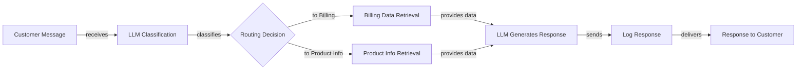
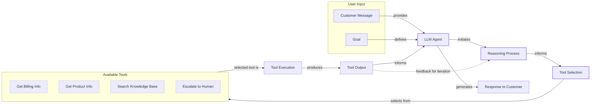
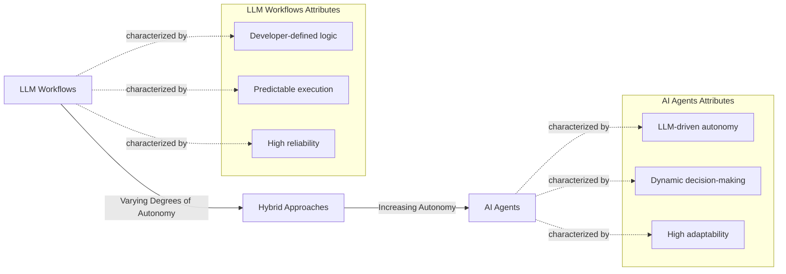
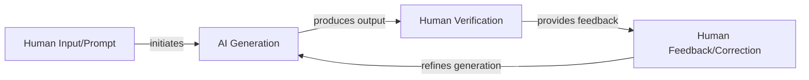
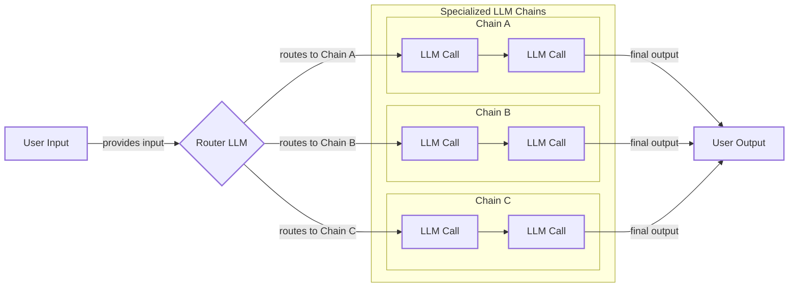
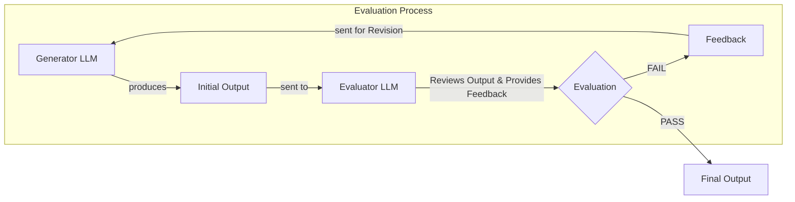
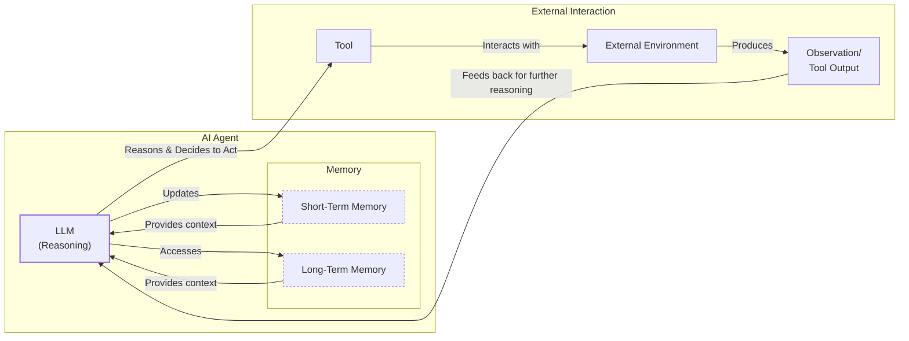
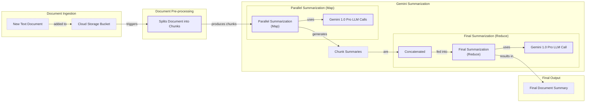
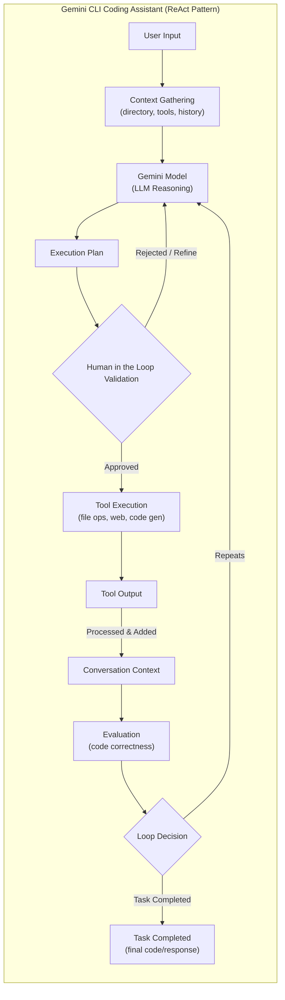

# The Critical Decision Every AI Engineer Faces

As an AI engineer preparing to build your first real AI application, after narrowing down the problem you want to solve, one key decision is how to design your AI solution. Should it follow a predictable, step-by-step workflow, or does it demand a more autonomous approach, where the LLM makes self-directed decisions along the way? This fundamental question will determine the success or failure of your project. Choose the wrong path, and you might build a rigid system that cannot adapt or an unpredictable agent that fails when it matters most. We have seen billion-dollar AI startups succeed or fail based on this architectural decision.

Successful AI engineers know when to use workflows versus agents, and how to combine both. By the end of this lesson, you will have a framework to make this choice. You will understand the trade-offs, see real-world examples, and learn to design effective systems.

## Understanding the Spectrum: From Workflows to Agents

To make the right architectural choice, you first need a clear understanding of what LLM workflows and AI agents are. We will not focus on the technical specifics yet, but rather on their core properties and how they are used.

An **LLM workflow** is a sequence of tasks orchestrated by developer-written code. The steps are defined in advance, creating a predictable path with explicit control flow. Think of it as a factory assembly line: each station performs a specific task in a set order. This approach is deterministic and reliable. In future lessons, we will explore common workflow patterns like chaining, routing, and the orchestrator-worker model.


Image 1: A flowchart illustrating a simple LLM workflow for customer support.

**AI agents**, on the other hand, are systems where an LLM dynamically decides the sequence of steps and actions to achieve a goal [[1]](https://cloud.google.com/discover/what-are-ai-agents). The path is not predefined; it is planned in real-time based on the task. This is like a skilled human expert addressing a new problem, adapting their approach with each new insight. This gives the system flexibility and autonomy. We will cover the building blocks of agents, such as actions, memory, and the ReAct pattern, in upcoming lessons.


Image 2: A flowchart illustrating a simple AI agent system.

Both systems use an orchestration layer. In workflows, this layer executes a defined plan. In agents, it facilitates the LLM's dynamic planning and execution [[2]](https://www.anthropic.com/engineering/building-effective-agents).

## Choosing Your Path

The core difference between these two approaches is a trade-off between developer-defined logic and LLM-driven autonomy [[2]](https://www.anthropic.com/engineering/building-effective-agents). This is not a binary choice but a spectrum.


Image 3: A spectrum illustrating the transition from LLM Workflows to AI Agents, highlighting their defining characteristics and the increase in autonomy.

**LLM workflows** are best for well-defined, repeatable tasks like data extraction, report generation, or content repurposing. Their strengths are predictability, reliability, and easier debugging, making them cost-effective [[3]](https://towardsdatascience.com/a-developers-guide-to-building-scalable-ai-workflows-vs-agents/). This makes them ideal for enterprise settings, regulated fields like finance and healthcare, and Minimum Viable Products (MVPs) that need rapid deployment. However, they can be rigid and complex to evolve.

**AI agents** excel at open-ended problems like in-depth research or dynamic customer support. Their main strength is adaptability. But this flexibility comes at a cost: agents can be unreliable, non-deterministic, and expensive [[3]](https://towardsdatascience.com/a-developers-guide-to-building-scalable-ai-workflows-vs-agents/). They are harder to debug and can pose security risks. Some developers have even joked about their agents accidentally deleting their codebase, saying, "Anyway, I wanted to start a new project."

Most real-world systems are **hybrid**, blending both approaches. Andrej Karpathy described this as an "autonomy slider," where you decide how much control to give the AI [[4]](https://www.youtube.com/watch?v=LCEmiRjPEtQ). For instance, the coding assistant Cursor ranges from simple code completion to full repository modifications. Perplexity offers both a simple search and an agentic "deep research" mode [[5]](https://singjupost.com/andrej-karpathy-software-is-changing-again/). The goal is to speed up the loop between AI generation and human verification, often achieved with well-designed systems and user interfaces [[4]](https://www.youtube.com/watch?v=LCEmiRjPEtQ).


Image 4: A circular flow diagram illustrating the iterative "AI Generation and Human Verification Loop".

## Exploring Common Patterns

To build your intuition, let's look at the most common patterns for constructing these systems. We will cover each of these in detail in future lessons, but for now, we will keep it high-level.

### LLM Workflow Patterns

**Chaining and routing** are foundational patterns for automating multiple LLM calls. Chaining links LLM calls in a sequence, while routing guides the workflow between different options based on the input.


Image 5: A flowchart illustrating an LLM workflow combining chaining and routing.

The **orchestrator-worker** pattern uses a central "orchestrator" LLM to analyze a task, break it into sub-tasks, and delegate them to specialized "worker" LLMs [[6]](https://platform.claude.com/cookbook/patterns-agents-orchestrator-workers). This is a step toward agentic behavior, as the system dynamically decides which actions to take.

```mermaid
flowchart LR
  %% External interaction
  User["User"] -- "sends" --> UR["User Request"]
  UR --> OLLM["Orchestrator LLM"]

  %% Orchestrator's internal process
  subgraph "Orchestrator Process"
    OLLM -- "analyzes & decomposes" --> ARDT["Analyzes Request &<br/>Decomposes Task"]
    ARDT -- "generates" --> ST["Sub-tasks"]
  end

  %% Delegation to Workers
  ST -- "delegates to" --> Workers_Pool["Worker LLMs"]

  %% Worker Execution
  subgraph "Worker LLMs (Parallel Execution)"
    Workers_Pool --> WA["Worker A"]
    Workers_Pool --> WB["Worker B"]
    Workers_Pool --> WC["Worker C"]

    WA -- "executes sub-task" --> STR_W["Sub-task Results"]
    WB -- "executes sub-task" --> STR_W
    WC -- "executes sub-task" --> STR_W
  end

  %% Results back to Orchestrator for synthesis
  STR_W -- "returns to" --> OLLM

  %% Orchestrator synthesizes and provides final answer
  OLLM -- "synthesizes results" --> FA["Final Answer"]
  FA --> User_End["User"]

  %% Visual grouping
  classDef llm
  class OLLM,WA,WB,WC llm
```
Image 6: A flowchart illustrating the Orchestrator-Worker pattern.

The **evaluator-optimizer loop** is a pattern for self-correction. One LLM generates an output, and another "evaluator" LLM reviews it, provides feedback (a reflection), and sends it back to the generator to be improved. This mimics how a human writer refines a document based on an editor's comments [[7]](https://platform.claude.com/cookbook/patterns-agents-evaluator-optimizer).


Image 7: A feedback loop diagram illustrating the Evaluator-Optimizer workflow.

### Core Components of a ReAct AI Agent

The **ReAct (Reason and Act)** pattern is the foundation for most modern agents. It enables an agent to reason about a task, decide on an action, execute it using a tool, observe the outcome, and repeat the cycle until the task is complete. Its core components include an LLM for reasoning, a set of actions (or tools) to interact with the environment, and memory to maintain context [[8]](https://www.youtube.com/watch?v=kQxr-uOxw2o&t=1s), [[9]](https://decodingml.substack.com/p/llmops-for-production-agentic-rag). Short-term memory acts as the agent's working memory, much like RAM in a computer. We will explore ReAct in depth in future lessons.


Image 8: A loop diagram illustrating the ReAct (Reason and Act) pattern for an AI agent, including memory components.

## Zooming In on Our Favorite Examples

To anchor these concepts in the real world, let's examine a few examples, from a simple workflow to a more advanced hybrid system.

### Gemini Document Summarization: A Pure Workflow

Finding the right information in large documents is a common challenge. Gemini's document summarization feature in Google Workspace is a perfect example of a pure, multi-step workflow [[10]](https://cloud.google.com/blog/products/ai-machine-learning/long-document-summarization-with-workflows-and-gemini-models). It follows a predefined sequence: the system reads a document, uses an LLM to summarize it, extracts key points, and displays the results. This map-reduce approach, where document sections are summarized in parallel and then combined, is predictable and efficient [[10]](https://cloud.google.com/blog/products/ai-machine-learning/long-document-summarization-with-workflows-and-gemini-models).


Image 9: A flowchart illustrating the Gemini document summarization and analysis workflow in Google Workspace.

### Gemini CLI: A Single-Agent System

Writing code involves reading documentation and understanding new codebases. The open-source Gemini CLI is a single-agent system built on the ReAct pattern that accelerates this work [[11]](https://blog.google/technology/developers/introducing-gemini-cli-open-source-ai-agent/). It follows a loop: gather context, reason with an LLM to create a plan, execute actions (like file operations or web searches), evaluate the result, and repeat until the task is done [[12]](https://developers.google.com/gemini-code-assist/docs/gemini-cli). This autonomy allows it to handle complex coding tasks dynamically. Similar tools include Cursor, Windsurf, and Claude Code.


Image 10: Mermaid diagram illustrating the operational flow of the Gemini CLI coding assistant, which implements a ReAct pattern.

### Perplexity Deep Research: A Hybrid System

Researching a new topic can be daunting. Perplexity's Deep Research feature is a powerful hybrid system that combines structured workflows with dynamic agents to perform expert-level analysis [[13]](https://www.perplexity.ai/hub/blog/introducing-perplexity-deep-research). Based on our research, here is how it likely works: an orchestrator breaks the main research question into sub-questions. Then, specialized search agents gather information for each sub-question in parallel. After synthesizing their findings, the orchestrator identifies any knowledge gaps and repeats the process. Finally, it assembles all the information into a comprehensive report with citations. This hybrid model uses the reliability of workflows to manage the process and the autonomy of agents for deep, iterative research [[13]](https://www.perplexity.ai/hub/blog/introducing-perplexity-deep-research).

```mermaid
flowchart LR
  %% User Input
  URQ["User Research Question"]

  %% Orchestration Layer
  subgraph "Orchestration"
    RPD["Research Planning & Decomposition"]
    IRGA["Iterative Refinement & Gap Analysis"]
    KG{"Knowledge Gaps?"}
    FRG["Final Report Generation"]
  end

  %% Agent Layer
  subgraph "Agent Operations"
    TSQ["Targeted Sub-questions"]
    SSA["Specialized Search Agents"]
    A["Agent A"]
    B["Agent B"]
    LT["Leverage Tools<br/>(web search, document retrieval)"]
    SRC["Sources"]
    AS_A["Analysis & Synthesis<br/>(Agent A)"]
    AS_B["Analysis & Synthesis<br/>(Agent B)"]
    SR_A["Summarized Reports<br/>(Agent A)"]
    SR_B["Summarized Reports<br/>(Agent B)"]
  end

  %% Final Output Component
  IC["Inline Citations"]

  %% Flow Definition
  URQ -- "initiates" --> RPD
  RPD -- "decomposes into" --> TSQ

  TSQ -- "assigned to" --> SSA
  SSA -- "activates" --> A
  SSA -- "activates" --> B

  A -- "leverages" --> LT
  B -- "leverages" --> LT
  LT -- "gathers" --> SRC

  SRC -- "processed by" --> AS_A
  SRC -- "processed by" --> AS_B

  AS_A -- "produces" --> SR_A
  AS_B -- "produces" --> SR_B

  SR_A -- "consolidated by" --> IRGA
  SR_B -- "consolidated by" --> IRGA

  IRGA -- "identifies" --> KG

  KG -- "Yes, repeat" --> RPD
  KG -- "No gaps or max steps reached" --> FRG

  FRG -- "contains" --> IC

  %% Visual Styling
  classDef process_step stroke-width:2px
  classDef data_artifact stroke-dasharray:3,3

  class RPD,IRGA,FRG process_step
  class TSQ,SRC,SR_A,SR_B,IC data_artifact
  class SSA,A,B,LT,AS_A,AS_B process_step
```


Image 11: A loop diagram illustrating the iterative multi-step process of Perplexity's Deep Research agent.

## Conclusion: The Challenges of Every AI Engineer

Understanding the spectrum from workflows to agents is fundamental, as these architectural decisions determine whether an AI application succeeds or fails in production. Every AI engineer faces these same challenges. You will encounter reliability issues, where an agent that works in a demo becomes unpredictable with real users [[14]](https://arxiv.org/html/2510.25423v2). You will manage context limits, data integration from multiple sources while respecting the "garbage-in, garbage-out" principle, and the cost-performance trap of expensive agents. Furthermore, you must handle the security risks of autonomous systems with write permissions [[14]](https://arxiv.org/html/2510.25423v2).

These challenges are solvable. In the next lesson, we will explore structured outputs, a key technique for making LLM interactions more reliable. Throughout this course, we will cover patterns for building dependable products, strategies for managing context, and ways to control costs and latency. You will gain the knowledge to architect AI systems that are powerful, robust, efficient, and safe.

## References

- [1] https://cloud.google.com/discover/what-are-ai-agents
- [2] https://www.anthropic.com/engineering/building-effective-agents
- [3] https://towardsdatascience.com/a-developers-guide-to-building-scalable-ai-workflows-vs-agents/
- [4] https://www.youtube.com/watch?v=LCEmiRjPEtQ
- [5] https://singjupost.com/andrej-karpathy-software-is-changing-again/
- [6] https://platform.claude.com/cookbook/patterns-agents-orchestrator-workers
- [7] https://platform.claude.com/cookbook/patterns-agents-evaluator-optimizer
- [8] https://www.youtube.com/watch?v=kQxr-uOxw2o&t=1s
- [9] https://decodingml.substack.com/p/llmops-for-production-agentic-rag
- [10] https://cloud.google.com/blog/products/ai-machine-learning/long-document-summarization-with-workflows-and-gemini-models
- [11] https://blog.google/technology/developers/introducing-gemini-cli-open-source-ai-agent/
- [12] https://developers.google.com/gemini-code-assist/docs/gemini-cli
- [13] https://www.perplexity.ai/hub/blog/introducing-perplexity-deep-research
- [14] https://arxiv.org/html/2510.25423v2
</article>