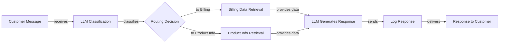
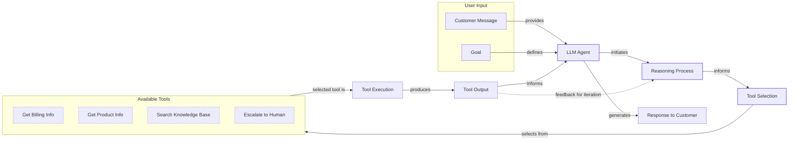
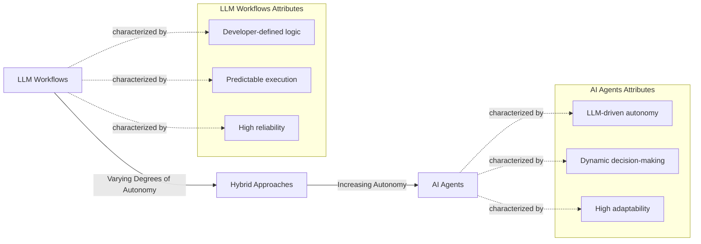
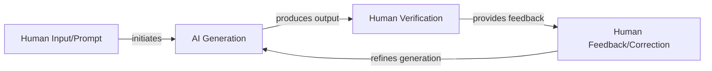
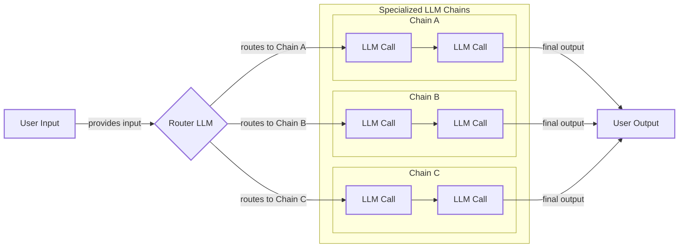
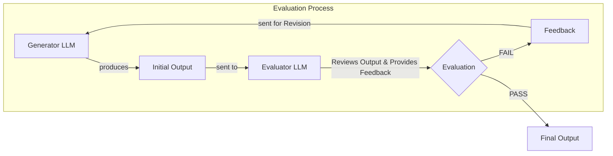
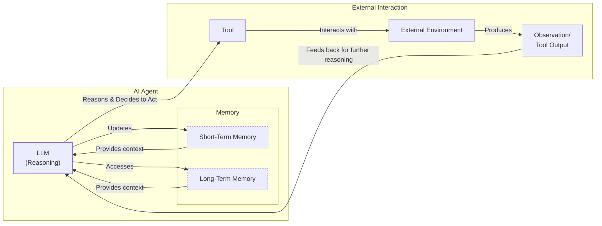
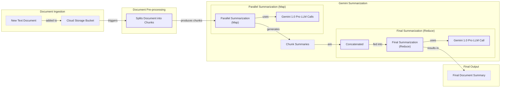
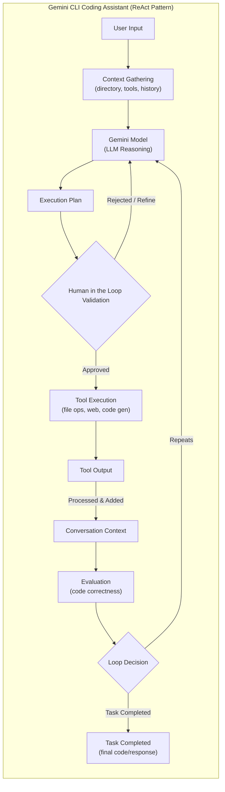

# The Critical Decision Every AI Engineer Faces

As an AI engineer preparing to build your first real AI application, after narrowing down the problem you want to solve, one key decision is how to design your AI solution. Should it follow a predictable, step-by-step workflow, or does it demand a more autonomous approach, where the LLM makes self-directed decisions along the way? Thus, one of the fundamental questions that will determine the success or failure of your project is: How should you architect your AI system?

This is one of the key decisions that will impact everything from development time and costs to reliability and user experience. Choose the wrong approach, and you might build an overly rigid system that breaks with new features, or an unpredictable agent that fails catastrophically when it matters most. You could waste months rebuilding your architecture, leaving users frustrated and executives questioning the spiraling costs. In 2024 and 2025, we are seeing billion-dollar AI startups succeed or fail based on this very decision.

By the end of this lesson, we will provide you with a framework to confidently choose between LLM workflows and AI agents. You will understand the fundamental trade-offs, see real-world examples, and learn how to design systems that leverage the best of both worlds.

## Understanding the Spectrum: From Workflows to Agents

To make the right architectural choice, you first need a clear understanding of what LLM workflows and AI agents are. We will not focus on the technical specifics yet, but rather on their core properties and how they are used.

An **LLM workflow** is a sequence of tasks orchestrated by developer-written code. The steps are defined in advance, creating a predictable path with explicit control flow. Think of it as a factory assembly line: each station performs a specific task in a set order. This approach is deterministic and reliable. In future lessons, we will explore common workflow patterns like chaining, routing, and the orchestrator-worker model.


Image 1: A flowchart illustrating a simple LLM workflow for customer support.

**AI agents**, on the other hand, are systems where an LLM dynamically decides the sequence of steps and actions to achieve a goal [[1]](https://cloud.google.com/discover/what-are-ai-agents). The path is not predefined; it is planned in real-time based on the task. This is like a skilled human expert tackling an unfamiliar problem, adapting their approach with each new insight. This gives the system flexibility and autonomy. We will cover the building blocks of agents, such as actions, memory, and the ReAct pattern, in upcoming lessons.


Image 2: A flowchart illustrating a simple AI agent system.

Both systems use an orchestration layer. In workflows, this layer executes a defined plan. In agents, it facilitates the LLM's dynamic planning and execution [[2]](https://www.anthropic.com/engineering/building-effective-agents).

## Choosing Your Path

The core difference between these two approaches is a trade-off between developer-defined logic and LLM-driven autonomy [[2]](https://www.anthropic.com/engineering/building-effective-agents). This is not a binary choice but a spectrum.


Image 3: A spectrum illustrating the transition from LLM Workflows to AI Agents, highlighting their defining characteristics and the increase in autonomy.

**LLM workflows** are best for well-defined, repeatable tasks like data extraction, automated reporting, or content repurposing. Their strengths are predictability and reliability, which makes them easier to debug and more cost-effective [[3]](https://towardsdatascience.com/a-developers-guide-to-building-scalable-ai-workflows-vs-agents/). This makes them ideal for enterprise settings or regulated fields like finance and healthcare, where consistency is critical. However, they can be rigid and may require significant development time to handle complex logic.

**AI agents** excel at open-ended, dynamic problems like in-depth research, complex code debugging, or interactive customer support. Their main strength is adaptability. But this flexibility comes at a cost: agents can be unreliable, non-deterministic, and expensive [[3]](https://towardsdatascience.com/a-developers-guide-to-building-scalable-ai-workflows-vs-agents/). They are also harder to debug and can pose security risks if not properly managed. Some developers have even joked about their agents accidentally deleting their codebase, saying, "Anyway, I wanted to start a new project."

Most real-world systems are **hybrid**, blending the stability of workflows with the flexibility of agents. Andrej Karpathy described this concept as an "autonomy slider," where you decide how much control to give the AI [[4]](https://www.youtube.com/watch?v=LCEmiRjPEtQ). For instance, the coding assistant Cursor offers features ranging from simple tab-completion (low autonomy) to letting an agent modify an entire repository (high autonomy). Similarly, Perplexity offers a quick search (workflow-like) and a "deep research" mode (agentic) [[4]](https://singjupost.com/andrej-karpathy-software-is-changing-again/). The goal is to speed up the loop between AI generation and human verification, which is often achieved with well-designed systems and user interfaces [[4]](https://www.youtube.com/watch?v=LCEmiRjPEtQ).


Image 4: A circular flow diagram illustrating the iterative "AI Generation and Human Verification Loop".

## Exploring Common Patterns

To build your intuition, let's look at the most common patterns for constructing these systems. We will cover each of these in detail in future lessons, but for now, we will keep it high-level.

### LLM Workflow Patterns

**Chaining and routing** are foundational patterns for automating multiple LLM calls. Chaining links LLM calls in a sequence, while routing guides the workflow between different options based on the input.


Image 5: A flowchart illustrating an LLM workflow combining chaining and routing.

The **orchestrator-worker** pattern uses a central "orchestrator" LLM to analyze a task, break it into sub-tasks, and delegate them to specialized "worker" LLMs [[5]](https://platform.claude.com/cookbook/patterns-agents-orchestrator-workers). This is a step toward agentic behavior, as the system dynamically decides which actions to take.

```mermaid
flowchart LR
  %% External interaction
  User["User"] -- "sends" --> UR["User Request"]
  UR --> OLLM["Orchestrator LLM"]

  %% Orchestrator's internal process
  subgraph "Orchestrator Process"
    OLLM -- "analyzes & decomposes" --> ARDT["Analyzes Request &<br/>Decomposes Task"]
    ARDT -- "generates" --> ST["Sub-tasks"]
  end

  %% Delegation to Workers
  ST -- "delegates to" --> Workers_Pool["Worker LLMs"]

  %% Worker Execution
  subgraph "Worker LLMs (Parallel Execution)"
    Workers_Pool --> WA["Worker A"]
    Workers_Pool --> WB["Worker B"]
    Workers_Pool --> WC["Worker C"]

    WA -- "executes sub-task" --> STR_W["Sub-task Results"]
    WB -- "executes sub-task" --> STR_W
    WC -- "executes sub-task" --> STR_W
  end

  %% Results back to Orchestrator for synthesis
  STR_W -- "returns to" --> OLLM

  %% Orchestrator synthesizes and provides final answer
  OLLM -- "synthesizes results" --> FA["Final Answer"]
  FA --> User_End["User"]

  %% Visual grouping
  classDef llm
  class OLLM,WA,WB,WC llm
```
Image 6: A flowchart illustrating the Orchestrator-Worker pattern.

The **evaluator-optimizer loop** is a pattern for self-correction. One LLM generates an output, and another "evaluator" LLM reviews it, provides feedback (a reflection), and sends it back to the generator to be improved. This mimics how a human writer refines a document based on an editor's comments [[6]](https://platform.claude.com/cookbook/patterns-agents-evaluator-optimizer).


Image 7: A feedback loop diagram illustrating the Evaluator-Optimizer workflow.

### Core Components of a ReAct AI Agent

The **ReAct (Reason and Act)** pattern is the foundation for most modern agents. It enables an agent to reason about a task, decide on an action, execute it using a tool, observe the outcome, and repeat the cycle until the task is complete. Its core components include an LLM for reasoning, a set of actions (or tools) to interact with the environment, and memory to maintain context [[7]](https://cloud.google.com/discover/what-are-ai-agents), [[8]](https://decodingml.substack.com/p/llmops-for-production-agentic-rag). We will explore ReAct in depth in future lessons.


Image 8: A loop diagram illustrating the ReAct (Reason and Act) pattern for an AI agent, including memory components.

## Zooming In on Our Favorite Examples

To anchor these concepts in the real world, let's examine a few examples, from a simple workflow to a more advanced hybrid system.

### Gemini Document Summarization: A Pure Workflow

A common problem in team environments is finding the right information within large documents. Gemini's document summarization feature in Google Workspace is a perfect example of a pure, multi-step workflow [[9]](https://cloud.google.com/blog/products/ai-machine-learning/long-document-summarization-with-workflows-and-gemini-models). It follows a predefined sequence: the system reads a document, uses an LLM to summarize it, extracts key points with another LLM call, and displays the results to the user. This is a map-reduce approach where sections of a document are summarized in parallel and then combined [[9]](https://cloud.google.com/blog/products/ai-machine-learning/long-document-summarization-with-workflows-and-gemini-models). It is predictable, efficient, and reliable.


Image 9: A flowchart illustrating the Gemini document summarization and analysis workflow in Google Workspace.

### Gemini CLI: A Single-Agent System

Writing code is often a slow process of reading documentation and understanding new codebases. A coding assistant can accelerate this work. The open-source Gemini CLI is a great example of a single-agent system built on the ReAct pattern [[10]](https://blog.google/technology/developers/introducing-gemini-cli-open-source-ai-agent/). It follows a loop: it gathers context (directory structure, available actions), uses the LLM to reason and create a plan, validates the plan with the user, executes actions (like reading files or generating code), evaluates the result, and decides whether to continue the loop or finish the task [[11]](https://developers.google.com/gemini-code-assist/docs/gemini-cli). This gives it the autonomy to handle complex coding tasks dynamically.


Image 10: A flowchart illustrating the operational flow of the Gemini CLI coding assistant, which implements a ReAct pattern.

### Perplexity Deep Research: A Hybrid System

Researching a new topic can be daunting. Perplexity's Deep Research feature is a powerful hybrid system that combines structured workflows with dynamic agents to perform expert-level analysis [[12]](https://www.perplexity.ai/hub/blog/introducing-perplexity-deep-research). Based on our research, here is how it likely works: an orchestrator breaks the main research question into sub-questions. Then, specialized search agents gather information for each sub-question in parallel. After synthesizing their findings, the orchestrator identifies any knowledge gaps and repeats the process. Finally, it assembles all the information into a comprehensive report with citations. This hybrid model leverages the reliability of workflows to manage the process and the autonomy of agents for deep, iterative research [[12]](https://www.perplexity.ai/hub/blog/introducing-perplexity-deep-research).

```mermaid
flowchart LR
  %% User Input
  URQ["User Research Question"]

  %% Orchestration Layer
  subgraph "Orchestration"
    RPD["Research Planning & Decomposition"]
    IRGA["Iterative Refinement & Gap Analysis"]
    KG{"Knowledge Gaps?"}
    FRG["Final Report Generation"]
  end

  %% Agent Layer
  subgraph "Agent Operations"
    TSQ["Targeted Sub-questions"]
    SSA["Specialized Search Agents"]
    A["Agent A"]
    B["Agent B"]
    LT["Leverage Tools<br/>(web search, document retrieval)"]
    SRC["Sources"]
    AS_A["Analysis & Synthesis<br/>(Agent A)"]
    AS_B["Analysis & Synthesis<br/>(Agent B)"]
    SR_A["Summarized Reports<br/>(Agent A)"]
    SR_B["Summarized Reports<br/>(Agent B)"]
  end

  %% Final Output Component
  IC["Inline Citations"]

  %% Flow Definition
  URQ -- "initiates" --> RPD
  RPD -- "decomposes into" --> TSQ

  TSQ -- "assigned to" --> SSA
  SSA -- "activates" --> A
  SSA -- "activates" --> B

  A -- "leverages" --> LT
  B -- "leverages" --> LT
  LT -- "gathers" --> SRC

  SRC -- "processed by" --> AS_A
  SRC -- "processed by" --> AS_B

  AS_A -- "produces" --> SR_A
  AS_B -- "produces" --> SR_B

  SR_A -- "consolidated by" --> IRGA
  SR_B -- "consolidated by" --> IRGA

  IRGA -- "identifies" --> KG

  KG -- "Yes, repeat" --> RPD
  KG -- "No gaps or max steps reached" --> FRG

  FRG -- "contains" --> IC

  %% Visual Styling
  classDef process_step stroke-width:2px
  classDef data_artifact stroke-dasharray:3,3

  class RPD,IRGA,FRG process_step
  class TSQ,SRC,SR_A,SR_B,IC data_artifact
  class SSA,A,B,LT,AS_A,AS_B process_step
```


Image 11: A loop diagram illustrating the iterative multi-step process of Perplexity's Deep Research agent.

## The Challenges of Every AI Engineer

Now that you understand the spectrum from workflows to agents, it is important to recognize that these are the same fundamental architectural decisions every AI engineer faces. This choice determines whether an AI application succeeds in production or fails.

As an AI engineer, you will constantly battle a reliability crisis. Your agent might work perfectly in demos but become unpredictable with real users [[13]](https://arxiv.org/html/2510.25423v2). You will face context limits, where systems lose track of long conversations, and data integration challenges, pulling information from dozens of sources while ensuring quality. You will also have to navigate the cost-performance trap, where sophisticated agents deliver impressive results but are too expensive to run at scale, and manage security risks, especially when autonomous agents have write permissions [[13]](https://arxiv.org/html/2510.25423v2).

These challenges are solvable. In the next lesson, we will explore structured outputs, a key technique for making LLM interactions more reliable. Throughout this course, we will systematically tackle each of these issues. You will learn battle-tested patterns for building reliable systems, proven strategies for managing context, and practical approaches for handling multimodal data. By the end, you will have the knowledge to architect AI systems that are not only powerful but also robust, efficient, and safe.

## References

- [1] [What is an AI agent?](https://cloud.google.com/discover/what-are-ai-agents)
- [2] [Building effective agents](https://www.anthropic.com/engineering/building-effective-agents)
- [3] [A Developer’s Guide to Building Scalable AI: Workflows vs Agents](https://towardsdatascience.com/a-developers-guide-to-building-scalable-ai-workflows-vs-agents/)
- [4] [Andrej Karpathy: Software Is Changing (Again)](https://www.youtube.com/watch?v=LCEmiRjPEtQ)
- [5] [Orchestrator-Workers Workflow](https://platform.claude.com/cookbook/patterns-agents-orchestrator-workers)
- [6] [Evaluator optimizer | Claude Cookbook](https://platform.claude.com/cookbook/patterns-agents-evaluator-optimizer)
- [7] [Real Agents vs. Workflows: The Truth Behind AI 'Agents'](https://www.youtube.com/watch?v=kQxr-uOxw2o&t=1s)
- [8] [Exploring the difference between agents and workflows](https://decodingml.substack.com/p/llmops-for-production-agentic-rag)
- [9] [Long document summarization with Workflows and Gemini models](https://cloud.google.com/blog/products/ai-machine-learning/long-document-summarization-with-workflows-and-gemini-models)
- [10] [Gemini CLI: your open-source AI agent](https://blog.google/technology/developers/introducing-gemini-cli-open-source-ai-agent/)
- [11] [Gemini CLI](https://developers.google.com/gemini-code-assist/docs/gemini-cli)
- [12] [Introducing Perplexity Deep Research](https://www.perplexity.ai/hub/blog/introducing-perplexity-deep-research)
- [13] [What Challenges Do Developers Face in AI Agent Systems? An Empirical Study on Stack Overflow & GitHub Issues](https://arxiv.org/html/2510.25423v2)
- [14] [Andrej Karpathy: Software Is Changing (Again)](https://singjupost.com/andrej-karpathy-software-is-changing-again/)