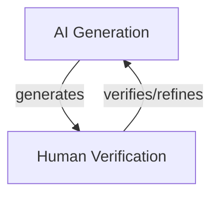
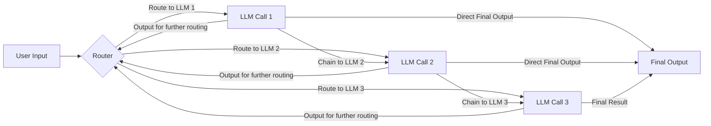
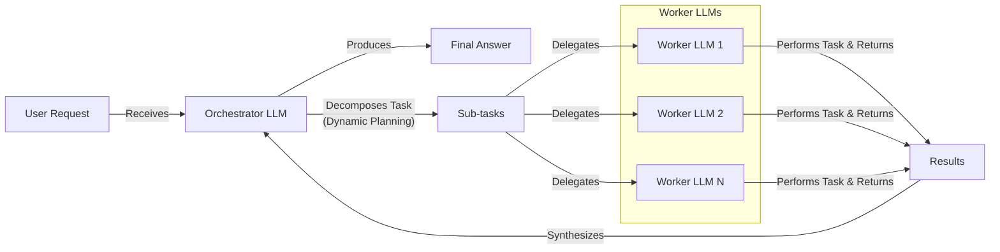
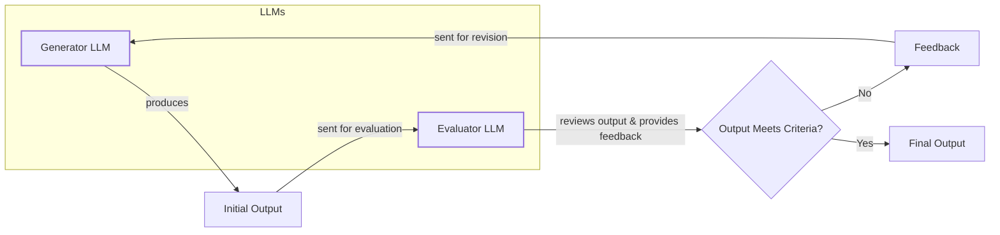
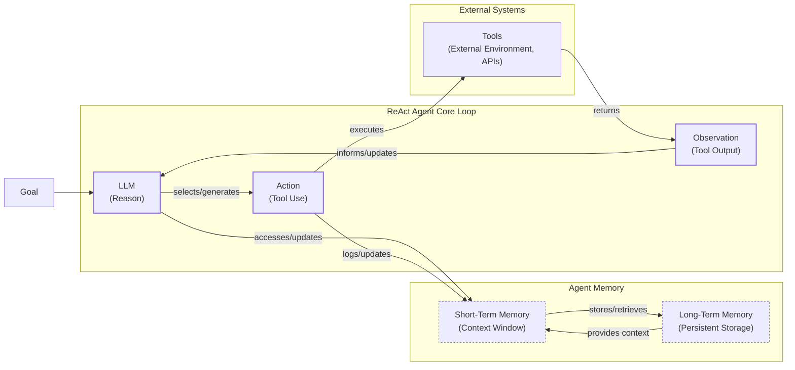
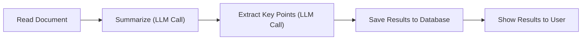

# AI Agents vs. LLM Workflows: The Critical Decision Every AI Engineer Faces

As an AI engineer, one of the first decisions you will make is how to design your AI solution. Should it follow a predictable, step-by-step workflow, or does it need an autonomous agent that makes its own decisions? This fundamental architectural choice will impact development time, cost, reliability, and user experience. Choose the wrong path, and you risk building a rigid system that cannot adapt or an unpredictable one that fails when it matters most. In 2024-2025, this decision has been central to the success of many AI companies.

This lesson provides a framework to guide your choice. We will explore both methodologies, compare their trade-offs, and analyze real-world examples. You will learn how to design robust systems by choosing the right approach for your project.

## Understanding the Spectrum: From Workflows to Agents

Before comparing these two approaches, you need to understand their definitions. We will focus on their properties, not technical specifics.

An **LLM workflow** is a sequence of tasks, including LLM calls, orchestrated by developer-written code. The steps are predefined, creating a deterministic path with predictable execution [[1]](https://www.anthropic.com/engineering/building-effective-agents). It is a factory assembly line, where each station performs a specific, repeatable task.
Image 1: A simple customer support workflow with a predefined path: classify, route, respond, and log. (Image by author, inspired by [Anthropic [1]](https://www.anthropic.com/engineering/building-effective-agents))

In future lessons, we will explore common workflow patterns like chaining, routing, and the orchestrator-worker model in detail.

**AI agents**, on the other hand, are systems where an LLM dynamically plans the sequence of steps to achieve a goal. This makes them adaptive and capable of handling novelty through LLM-driven autonomy [[1]](https://www.anthropic.com/engineering/building-effective-agents). An agent is a skilled expert tackling an unfamiliar problem, adapting with new information.
Image 2: An agent-based customer support system where the LLM dynamically decides which tools to use. (Image by author, inspired by [Anthropic [1]](https://www.anthropic.com/engineering/building-effective-agents))

Agents use tools and memory, which we will cover later. Both systems use an orchestration layer. In workflows, it executes a plan; in agents, it facilitates dynamic planning. With these definitions, let's explore the trade-offs.

## Choosing Your Path

The core difference is developer-defined logic versus LLM-driven autonomy. Most real-world systems exist on a spectrum between these two extremes.
Image 3: The spectrum from rigid, reliable workflows to flexible, less consistent agents. (Source [Decoding AI Magazine [3]](https://decodingml.substack.com/p/llmops-for-production-agentic-rag))

**LLM workflows** are best for structured, repeatable tasks like data extraction, report generation, or content repurposing. Their strength is predictability and reliability, making them ideal for enterprise and regulated fields where consistent costs and latency are important [[2]](https://towardsdatascience.com/a-developers-guide-to-building-scalable-ai-workflows-vs-agents/). However, they can be rigid and time-consuming to build, as every step is manually engineered.

**AI agents** excel at open-ended problems like complex research, dynamic customer support, or code debugging. Their adaptability allows them to handle ambiguity and novelty. The downside is that this autonomy makes them less predictable and harder to debug. They can be more expensive due to the need for powerful reasoning models and more LLM calls per task. There are also security concerns, especially with agents that have write permissions [[19]](https://unit42.paloaltonetworks.com/agentic-ai-threats/).

Many modern AI applications provide an "autonomy slider," allowing you to choose how much control to give the LLM. As Andrej Karpathy notes, coding assistant Cursor ranges from simple tab-completion to letting an agent modify your entire repository, while Perplexity scales from a quick search to a "deep research" mode [[4]](https://singjupost.com/andrej-karpathy-software-is-changing-again/), [[5]](https://medium.com/@ben_pouladian/andrej-karpathy-on-software-3-0-software-in-the-age-of-ai-b25533da93b6). The goal is to speed up the loop where the AI generates something and the human verifies it.


Image 4: A circular flow diagram illustrating the iterative AI generation and human verification loop, emphasizing its continuous and refining nature. (Image by author)

To make this more concrete, let's look at the common design patterns used to build these systems.

## Exploring Common Patterns

To build intuition, let's introduce the most common patterns for constructing AI systems. We will cover these in much greater detail in upcoming lessons.

**Chaining and routing** are foundational workflow patterns. Chaining links multiple LLM calls in a sequence, while routing adds conditional logic to select different paths based on the input [[6]](https://mlpills.substack.com/p/issue-110-llm-workflow-patterns).


Image 5: A flowchart illustrating the "Chaining and Routing" pattern for LLM workflows. (Image by author)

The **Orchestrator-Worker** pattern introduces dynamic planning. A central "orchestrator" LLM analyzes a task, breaks it into sub-tasks, and delegates them to specialized "worker" LLMs or tools before synthesizing the results [[7]](https://online.stevens.edu/blog/building-self-healing-ai-orchestrator-reflexion-patterns/).


Image 6: A flowchart illustrating the Orchestrator-Worker pattern with dynamic task decomposition and delegation. (Image by author)

The **Evaluator-Optimizer loop** improves output quality through automated feedback. One LLM generates a response, while another critiques it based on predefined criteria, creating a refinement cycle [[9]](https://docs.aws.amazon.com/prescriptive-guidance/latest/agentic-ai-patterns/evaluator-reflect-refine-loop-patterns.html).


Image 7: A feedback loop diagram illustrating the "Evaluator-Optimizer" pattern. (Image by author)

The most common agent architecture is the **ReAct (Reason and Act)** pattern. It enables an agent to reason about a task, choose an action (tool), observe the outcome, and repeat the cycle until the goal is complete [[10]](https://developers.google.com/gemini-code-assist/docs/gemini-cli). A ReAct agent combines an LLM for reasoning, tools for interacting with the environment, and both short-term (context window) and long-term (persistent) memory.


Image 8: A flowchart illustrating the high-level dynamics of a ReAct AI agent, showing the iterative loop of reasoning, acting, and observing, along with interactions with external tools and memory components. (Image by author)

These patterns provide the fundamental building blocks of modern AI systems. To see how they are applied in practice, let's analyze a few state-of-the-art examples.

## Zooming In on Our Favorite Examples

To anchor these concepts in the real world, let's analyze a few state-of-the-art examples, moving from a simple workflow to a complex hybrid system.

### Gemini in Google Workspace: A Pure Workflow

Finding the right information in large documents is a common time-sink. The document summarization feature in Google Workspace solves this with a pure, multi-step workflow [[11]](https://cloud.google.com/blog/products/ai-machine-learning/long-document-summarization-with-workflows-and-gemini-models). It follows a simple, linear chain: it reads a document, uses an LLM to summarize it, extracts key points with another LLM call, and presents the results. This process is predictable, reliable, and efficient for its specific task.


Image 9: A simple linear flowchart illustrating the "Document Summarization and Analysis Workflow by Gemini in Google Workspace". (Image by author)

### Gemini CLI: A Single-Agent System

Writing code involves slow processes like reading documentation and learning new codebases. The open-source Gemini CLI is a great example of a single-agent system that uses the ReAct pattern to assist developers [[12]](https://github.com/google-gemini/gemini-cli/blob/main/README.md). It works in a loop: it gathers context from the codebase, reasons about the user's request, validates its plan, and then executes tools for file operations, web searches, or code generation. This allows it to handle complex coding tasks autonomously, speeding up the development process [[13]](https://wietsevenema.eu/blog/2025/how-gemini-cli-builds-context/).

```mermaid
flowchart LR
  %% Start of the operational loop
  A["User Input"]
  B["Context Gathering<br/>(Directory Structure, Tools, History)"]
  C["LLM Reasoning<br/>(Plan Actions)"]
  D["Human in the Loop<br/>(Validate Plan)"]
  E["Tool Execution<br/>(File Ops, Web Requests, Code Gen)"]
  F["Tool Outputs"]
  G["Conversation Context"]
  H["Evaluation<br/>(Run/Compile Code)"]
  I{"Loop Decision"}
  J["Completed"]

  %% Define the flow
  A --> B
  B --> C
  C --> D
  D -- "Validated Plan" --> E
  E --> F
  F --> G
  G --> H
  H --> I

  %% Loop decision paths
  I -- "Task Completed" --> J
  I -- "Continue Loop" --> C

  %% Visual differentiation for decision node
  classDef decision fill:#fff,stroke:#333,stroke-width:2px,class I decision
```
Image 10: Operational loop diagram for Gemini CLI coding assistant using the ReAct pattern. (Image by author)

### Perplexity Deep Research: A Hybrid System

Perplexity's Deep Research feature acts as an expert assistant, producing comprehensive reports in minutes [[14]](https://www.perplexity.ai/hub/blog/introducing-perplexity-deep-research). It is a powerful hybrid system that combines structured workflows with multiple autonomous agents. This architecture uses an orchestrator to route tasks to specialized agents, separating predictable steps from non-deterministic reasoning to balance flexibility and reliability [[8]](https://www.softwareseni.com/the-microservices-moment-for-artificial-intelligence-and-how-multi-agent-orchestration-changes-everything/), [[16]](https://www.mdpi.com/2673-2688/7/2/51).

The system likely uses an orchestrator-worker pattern to manage parallel research agents. The orchestrator decomposes the research question, and specialized agents gather information in parallel. The orchestrator then synthesizes the results, identifies knowledge gaps, and initiates follow-up queries until the research is complete, finally compiling a structured report [[15]](https://zenvanriel.com/ai-engineer-blog/perplexity-computer-multi-model-agent-orchestration/).

```mermaid
flowchart LR
  %% Start Node
  A["User Research Question"]

  %% Planning and Decomposition Phase
  subgraph Planning["Planning & Decomposition"]
    B["Orchestrator<br/>(Planning & Decomposition)"]
  end

  %% Information Gathering Phase (emphasizing parallel)
  subgraph Information_Gathering["Information Gathering"]
    C["Targeted Sub-Questions"]
    D["Specialized Search Agents<br/>(Information Gathering)"]
    E["Tools<br/>(Web Search, Document Retrieval)"]
  end

  %% Analysis and Synthesis Phase
  subgraph Analysis_Synthesis["Analysis & Synthesis"]
    F["Analysis & Synthesis<br/>(Validate, Score, Summarize Sources)"]
  end

  %% Iterative Refinement and Reporting Phase
  subgraph Refinement_Reporting["Iterative Refinement & Reporting"]
    G["Orchestrator<br/>(Iterative Refinement & Gap Analysis)"]
    H["Follow-up Queries"]
    I["Report Generation<br/>(Final Report with Citations)"]
  end

  %% Primary Data Flows
  A -- "initiates" --> B
  B -- "decomposes into" --> C
  C -- "distributes to" --> D
  D -- "utilizes" --> E
  E -- "returns results" --> F
  F -- "provides synthesized info" --> G

  %% Iterative Refinement Loop
  G -- "identifies gaps<br/>& generates" --> H
  H -- "refines" --> C

  %% Final Output Path
  G -- "no gaps / complete" --> I

  %% Visual Grouping
  classDef orchestrator fill:#f9f,stroke:#333,stroke-width:2px
  classDef process fill:#bbf,stroke:#333,stroke-width:2px
  classDef tool fill:#ccf,stroke:#333,stroke-width:2px
  classDef output fill:#afa,stroke:#333,stroke-width:2px

  class B,G orchestrator
  class A,C,D,F,H process
  class E tool
  class I output
```


Image 11: A multi-step iterative process diagram illustrating Perplexity's Deep Research agent as a hybrid system. (Image by author)

## The Challenges of Every AI Engineer

Understanding the spectrum from workflows to agents is a core challenge for every AI engineer. Building with AI involves battling recurring issues: **reliability problems** where agents become unpredictable and errors cascade [[17]](https://arxiv.org/html/2510.25423v2), [[18]](https://dev.to/wassimchegham/why-your-ai-agent-demo-falls-apart-in-production-1320); **context limits** that degrade coherence; complex **data integration** needs; the **cost-performance trap** of expensive agents; and **security concerns** like prompt injection [[19]](https://unit42.paloaltonetworks.com/agentic-ai-threats/), [[20]](https://thenewstack.io/red-teaming-enterprise-ai-agents/).

These challenges are solvable. In our next lesson, we will dive into structured outputs, a key technique for making LLM interactions more reliable. Throughout this course, we will cover patterns for evaluation, monitoring, and building hybrid systems while managing costs. By the end, you will have the knowledge to architect AI systems that are powerful, efficient, and safe.

## References

- [1] Anthropic. (2024, December 19). *Building effective agents*. https://www.anthropic.com/engineering/building-effective-agents
- [2] Quach, H. (2025, June 27). *A Developer’s Guide to Building Scalable AI: Workflows vs Agents*. Towards Data Science. https://towardsdatascience.com/a-developers-guide-to-building-scalable-ai-workflows-vs-agents/
- [3] Iusztin, P. (n.d.). *Exploring the difference between agents and workflows*. Decoding AI Magazine. https://decodingml.substack.com/p/llmops-for-production-agentic-rag
- [4] Pangambam, S. (2025, June 20). *Andrej Karpathy: Software Is Changing (Again)*. The Singju Post. https://singjupost.com/andrej-karpathy-software-is-changing-again/
- [5] Pouladian, B. (2025, June 21). *Andrej Karpathy on Software 3.0: Software in the Age of AI*. Medium. https://medium.com/@ben_pouladian/andrej-karpathy-on-software-3-0-software-in-the-age-of-ai-b25533da93b6
- [6] ML Pills. (n.d.). *Issue #110: LLM Workflow Patterns*. https://mlpills.substack.com/p/issue-110-llm-workflow-patterns
- [7] Stevens Institute of Technology. (n.d.). *Building a Self-Healing AI Orchestrator with Reflexion Patterns*. https://online.stevens.edu/blog/building-self-healing-ai-orchestrator-reflexion-patterns/
- [8] SoftwareSeni. (2026, February 16). *The Microservices Moment for Artificial Intelligence and How Multi-Agent Orchestration Changes Everything*. https://www.softwareseni.com/the-microservices-moment-for-artificial-intelligence-and-how-multi-agent-orchestration-changes-everything/
- [9] AWS. (n.d.). *Agentic AI Patterns: Evaluator, Reflect, and Refine Loop Patterns*. https://docs.aws.amazon.com/prescriptive-guidance/latest/agentic-ai-patterns/evaluator-reflect-refine-loop-patterns.html
- [10] Google. (n.d.). *Gemini CLI*. Google for Developers. https://developers.google.com/gemini-code-assist/docs/gemini-cli
- [11] Laforge, G., & Spruyt, R. (2024, April 30). *Long document summarization with Workflows and Gemini models*. Google Cloud Blog. https://cloud.google.com/blog/products/ai-machine-learning/long-document-summarization-with-workflows-and-gemini-models
- [12] Google. (n.d.). *Gemini CLI README.md*. GitHub. https://github.com/google-gemini/gemini-cli/blob/main/README.md
- [13] Enema, W. (2025). *How Gemini CLI builds context*. https://wietsevenema.eu/blog/2025/how-gemini-cli-builds-context/
- [14] Perplexity Team. (2025, February 14). *Introducing Perplexity Deep Research*. Perplexity Blog. https://www.perplexity.ai/hub/blog/introducing-perplexity-deep-research
- [15] van Riel, Z. (2025, July 15). *Perplexity Computer: Multi-Model Agent Orchestration*. Zen van Riel's AI Engineer Blog. https://zenvanriel.com/ai-engineer-blog/perplexity-computer-multi-model-agent-orchestration/
- [16] MDPI. (2024). *A Microservice Architecture for Hybrid Deterministic and LLM-Based Automation*. https://www.mdpi.com/2673-2688/7/2/51
- [17] Cemri, F., et al. (2025). *What Challenges Do Developers Face in AI Agent Systems? An Empirical Study on Stack Overflow & GitHub Issues*. arXiv. https://arxiv.org/html/2510.25423v2
- [18] Chegham, W. (2024, May 13). *Why Your AI Agent Demo Falls Apart in Production*. DEV Community. https://dev.to/wassimchegham/why-your-ai-agent-demo-falls-apart-in-production-1320
- [19] Chen, J., & Lu, R. (2025, May 1). *AI Agents Are Here. So Are the Threats*. Unit 42. https://unit42.paloaltonetworks.com/agentic-ai-threats/
- [20] The New Stack. (2024, June 4). *Red Teaming Enterprise AI Agents*. https://thenewstack.io/red-teaming-enterprise-ai-agents/