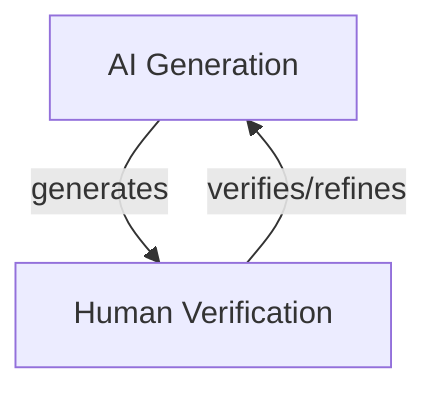
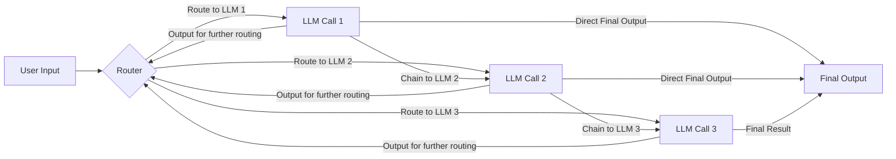
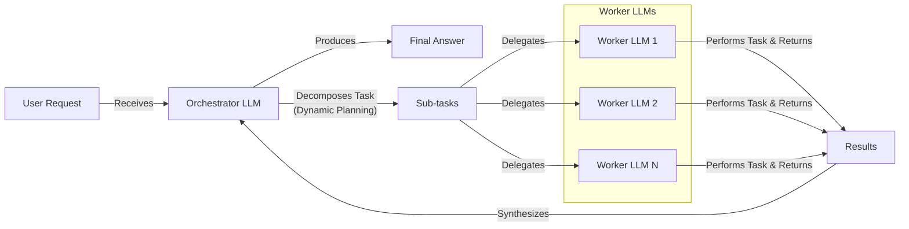
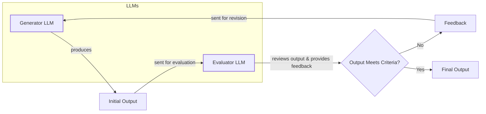
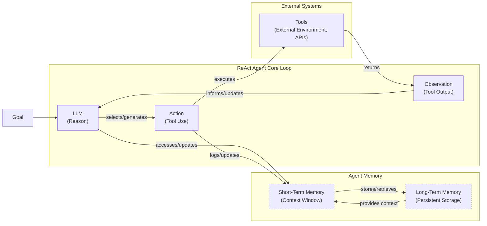
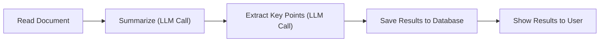

# AI Agents vs. LLM Workflows: The Critical Decision Every AI Engineer Faces

As an AI engineer preparing to build your first real application, you will face a key decision after narrowing down the problem you want to solve: How should you design your AI solution? Should it follow a predictable, step-by-step workflow, or does it demand a more autonomous approach, where the LLM makes self-directed decisions? This fundamental architectural question will determine the success or failure of your project.

Choose the wrong approach, and you might end up with an overly rigid system that breaks when users deviate from expected patterns, or an unpredictable agent that works brilliantly 80% of the time but fails catastrophically when it matters most. This decision impacts development time, costs, reliability, and user experience. In 2024-2025, we have seen billion-dollar AI startups succeed or fail based on this choice. The most successful AI engineers know when to use workflows versus agents and, more importantly, how to combine them effectively.

This lesson will provide a framework to help you make this important decision. We will explore the core methodologies, compare their strengths and weaknesses, and analyze real-world examples from leading AI companies. By the end, you will understand the fundamental trade-offs and be equipped to design systems that combine the best of both worlds.

## Understanding the Spectrum: From Workflows to Agents

Before we compare these two approaches, we need to briefly define them. For now, we will focus on their properties and how they are used, rather than their technical specifics.

### LLM Workflows

An LLM workflow is a sequence of tasks involving LLM calls or other operations, such as reading from a database or file system. It is largely predefined and orchestrated by developer-written code. The steps are defined in advance, resulting in deterministic or rule-based paths with predictable execution and explicit control flow [[1]](https://www.anthropic.com/engineering/building-effective-agents). Think of it as a factory assembly line, where each station performs a specific, repeatable task.
Image 1: A simple customer support workflow with a predefined path: classify, route, respond, and log. (Image by author, inspired by [Anthropic [1]](https://www.anthropic.com/engineering/building-effective-agents))

In future lessons, we will explore common workflow patterns like chaining, routing, and the orchestrator-worker model in detail.

### AI Agents

AI agents are systems where an LLM plays a central role in dynamically planning the sequence of steps, reasoning, and actions to achieve a goal. The steps are not defined in advance but are planned based on the task and the current state of the environment. This makes them adaptive and capable of handling novelty, with LLM-driven autonomy in decision-making [[1]](https://www.anthropic.com/engineering/building-effective-agents). An agent is like a skilled human expert addressing an unfamiliar problem, adapting their approach with each new piece of information.
Image 2: An agent-based customer support system where the LLM dynamically decides which tools to use. (Image by author, inspired by [Anthropic [1]](https://www.anthropic.com/engineering/building-effective-agents))

Agents rely on concepts like tools and memory, which we will cover in future lessons. Both workflows and agents require an orchestration layer. In workflows, this layer executes a defined plan. In agents, it facilitates the LLM's dynamic planning and execution. With these definitions in mind, let's explore the core trade-offs that will help you decide which approach to use.

## Choosing Your Path

The core difference between workflows and agents lies in a simple trade-off: developer-defined logic versus LLM-driven autonomy. Most real-world systems exist on a spectrum between these two extremes, blending elements of both to fit their specific use case.
Image 3: The spectrum from rigid, reliable workflows to flexible, less consistent agents. (Source [Decoding AI Magazine [3]](https://decodingml.substack.com/p/llmops-for-production-agentic-rag))

**LLM workflows** are best for structured, repeatable tasks. This includes data extraction pipelines, automated report generation, and content repurposing. Their strength lies in predictability and reliability, which makes them ideal for enterprise environments, regulated fields like finance and healthcare, and high-volume tasks where predictable costs and latency are essential [[2]](https://towardsdatascience.com/a-developers-guide-to-building-scalable-ai-workflows-vs-agents/). However, they can be rigid and time-consuming to build, as every step is manually engineered.

**AI agents** excel at open-ended, dynamic problems. Use cases include complex research, interactive customer support, and code debugging. Their adaptability allows them to handle ambiguity and novelty. The downside is that this autonomy makes them less predictable and harder to debug. They can be more expensive due to the need for more powerful reasoning models and a higher number of LLM calls per task. There are also security concerns, especially with agents that have write permissions [[19]](https://unit42.paloaltonetworks.com/agentic-ai-threats/).

Most modern AI applications provide an "autonomy slider," allowing you to choose how much control to give the LLM. Andrej Karpathy highlights coding assistant Cursor and answer engine Perplexity as examples. In Cursor, you can move from simple tab-completion (low autonomy) to letting an agent modify your entire repository (high autonomy) [[4]](https://singjupost.com/andrej-karpathy-software-is-changing-again/). Perplexity offers a similar spectrum from a quick search to a "deep research" mode where the agent works for several minutes [[5]](https://medium.com/@ben_pouladian/andrej-karpathy-on-software-3-0-software-in-the-age-of-ai-b25533da93b6). The goal is to speed up the loop where the AI generates something and the human verifies it.


Image 4: A circular flow diagram illustrating the iterative AI generation and human verification loop, emphasizing its continuous and refining nature.

To make this more concrete, let's look at the common design patterns used to build these systems.

## Exploring Common Patterns

To build intuition, let's briefly introduce the most common patterns for constructing both workflows and agents. We will cover these in much greater detail in upcoming lessons.

### LLM Workflow Patterns

Workflows are built by composing simpler, predefined steps.

**Chaining and routing** are foundational patterns. Chaining links multiple LLM calls in a sequence, where the output of one step becomes the input for the next. Routing adds conditional logic, allowing the workflow to select different paths based on the input or intermediate results. This helps glue together different operations and make decisions between them [[6]](https://mlpills.substack.com/p/issue-110-llm-workflow-patterns).


Image 5: A flowchart illustrating the "Chaining and Routing" pattern for LLM workflows.

The **Orchestrator-Worker** pattern introduces dynamic planning. A central "orchestrator" LLM analyzes a task, breaks it into sub-tasks, and delegates them to specialized "worker" LLMs or tools. It then synthesizes the results into a final answer. This pattern bridges the gap between rigid workflows and fully autonomous agents [[7]](https://online.stevens.edu/blog/building-self-healing-ai-orchestrator-reflexion-patterns/). This mirrors the evolution of software architecture from monolithic applications to microservices, where specialized services are orchestrated to handle complex jobs. In this analogy, the orchestrator acts like a service mesh, routing requests to the appropriate specialized agent [[8]](https://www.softwareseni.com/the-microservices-moment-for-artificial-intelligence-and-how-multi-agent-orchestration-changes-everything/).


Image 6: A flowchart illustrating the Orchestrator-Worker pattern with dynamic task decomposition and delegation.

The **Evaluator-Optimizer loop** improves output quality through automated feedback. One LLM generates a response, while another "evaluator" LLM critiques it based on predefined criteria. The feedback is sent back to the generator, which refines its output. This loop repeats until the result meets the quality standard, mimicking how a human writer might revise a draft based on an editor's comments [[9]](https://docs.aws.amazon.com/prescriptive-guidance/latest/agentic-ai-patterns/evaluator-reflect-refine-loop-patterns.html).


Image 7: A feedback loop diagram illustrating the "Evaluator-Optimizer" pattern.

### Core Components of a ReAct AI Agent

The most common and powerful agent architecture today is the ReAct (Reason and Act) pattern. It enables an agent to reason about a task, choose an appropriate action, observe the outcome, and repeat the cycle until the goal is complete [[10]](https://developers.google.com/gemini-code-assist/docs/gemini-cli).

A ReAct agent combines several key components:
*   An **LLM** serves as the reasoning engine to plan steps and interpret outputs.
*   A set of **tools** (or actions) allows the agent to interact with its external environment, like searching the web or querying a database.
*   **Short-term memory** (its context window) acts as working memory, similar to a computer's RAM.
*   **Long-term memory** provides persistent knowledge, storing facts about the world and user preferences.


Image 8: A flowchart illustrating the high-level dynamics of a ReAct AI agent, showing the iterative loop of reasoning, acting, and observing, along with interactions with external tools and memory components.

These patterns provide the fundamental building blocks of modern AI systems. To see how they are applied in practice, let's analyze a few state-of-the-art examples.

## Zooming In on Our Favorite Examples

To anchor these concepts in the real world, let's analyze a few state-of-the-art examples, moving from a simple workflow to a complex hybrid system.

### Gemini in Google Workspace: A Pure Workflow

Finding the right information in large documents is a common time-sink. The document summarization feature in Google Workspace solves this with a pure, multi-step workflow [[11]](https://cloud.google.com/blog/products/ai-machine-learning/long-document-summarization-with-workflows-and-gemini-models). It follows a simple, linear chain: it reads a document, uses an LLM to summarize it, extracts key points with another LLM call, and presents the results. This process is predictable, reliable, and efficient for its specific task.


Image 9: A simple linear flowchart illustrating the "Document Summarization and Analysis Workflow by Gemini in Google Workspace".

### Gemini CLI: A Single-Agent System

Writing code involves slow processes like reading documentation and learning new codebases. The open-source Gemini CLI is a great example of a single-agent system that uses the ReAct pattern to assist developers [[12]](https://github.com/google-gemini/gemini-cli/blob/main/README.md). It works in a loop: it gathers context from the codebase, reasons about the user's request, validates its plan, and then executes tools for file operations, web searches, or code generation. This allows it to handle complex coding tasks autonomously, speeding up the development process [[13]](https://wietsevenema.eu/blog/2025/how-gemini-cli-builds-context/).

```mermaid
flowchart LR
  %% Start of the operational loop
  A["User Input"]
  B["Context Gathering<br/>(Directory Structure, Tools, History)"]
  C["LLM Reasoning<br/>(Plan Actions)"]
  D["Human in the Loop<br/>(Validate Plan)"]
  E["Tool Execution<br/>(File Ops, Web Requests, Code Gen)"]
  F["Tool Outputs"]
  G["Conversation Context"]
  H["Evaluation<br/>(Run/Compile Code)"]
  I{"Loop Decision"}
  J["Completed"]

  %% Define the flow
  A --> B
  B --> C
  C --> D
  D -- "Validated Plan" --> E
  E --> F
  F --> G
  G --> H
  H --> I

  %% Loop decision paths
  I -- "Task Completed" --> J
  I -- "Continue Loop" --> C

  %% Visual differentiation for decision node
  classDef decision fill:#fff,stroke:#333,stroke-width:2px,class I decision
```
Image 10: Operational loop diagram for Gemini CLI coding assistant using the ReAct pattern.

### Perplexity Deep Research: A Hybrid System

Perplexity's Deep Research feature acts as an expert assistant, producing comprehensive reports in minutes [[14]](https://www.perplexity.ai/hub/blog/introducing-perplexity-deep-research). It is a powerful hybrid system that combines structured workflows with multiple autonomous agents. This architecture uses an orchestrator to route tasks to specialized agents, separating predictable steps from non-deterministic reasoning to balance flexibility and reliability [[8]](https://www.softwareseni.com/the-microservices-moment-for-artificial-intelligence-and-how-multi-agent-orchestration-changes-everything/), [[16]](https://www.mdpi.com/2673-2688/7/2/51).

The system likely uses an orchestrator-worker pattern to manage parallel research agents. The orchestrator decomposes the research question, and specialized agents gather information in parallel. The orchestrator then synthesizes the results, identifies knowledge gaps, and initiates follow-up queries until the research is complete, finally compiling a structured report [[15]](https://zenvanriel.com/ai-engineer-blog/perplexity-computer-multi-model-agent-orchestration/).

```mermaid
flowchart LR
  %% Start Node
  A["User Research Question"]

  %% Planning and Decomposition Phase
  subgraph Planning["Planning & Decomposition"]
    B["Orchestrator<br/>(Planning & Decomposition)"]
  end

  %% Information Gathering Phase (emphasizing parallel)
  subgraph Information_Gathering["Information Gathering"]
    C["Targeted Sub-Questions"]
    D["Specialized Search Agents<br/>(Information Gathering)"]
    E["Tools<br/>(Web Search, Document Retrieval)"]
  end

  %% Analysis and Synthesis Phase
  subgraph Analysis_Synthesis["Analysis & Synthesis"]
    F["Analysis & Synthesis<br/>(Validate, Score, Summarize Sources)"]
  end

  %% Iterative Refinement and Reporting Phase
  subgraph Refinement_Reporting["Iterative Refinement & Reporting"]
    G["Orchestrator<br/>(Iterative Refinement & Gap Analysis)"]
    H["Follow-up Queries"]
    I["Report Generation<br/>(Final Report with Citations)"]
  end

  %% Primary Data Flows
  A -- "initiates" --> B
  B -- "decomposes into" --> C
  C -- "distributes to" --> D
  D -- "utilizes" --> E
  E -- "returns results" --> F
  F -- "provides synthesized info" --> G

  %% Iterative Refinement Loop
  G -- "identifies gaps<br/>& generates" --> H
  H -- "refines" --> C

  %% Final Output Path
  G -- "no gaps / complete" --> I

  %% Visual Grouping
  classDef orchestrator fill:#f9f,stroke:#333,stroke-width:2px
  classDef process fill:#bbf,stroke:#333,stroke-width:2px
  classDef tool fill:#ccf,stroke:#333,stroke-width:2px
  classDef output fill:#afa,stroke:#333,stroke-width:2px

  class B,G orchestrator
  class A,C,D,F,H process
  class E tool
  class I output
```


Image 11: A multi-step iterative process diagram illustrating Perplexity's Deep Research agent as a hybrid system.

## The Challenges of Every AI Engineer

Now that you understand the spectrum from workflows to agents, it is important to recognize that these architectural decisions are a core challenge for every AI engineer. Building with AI means constantly battling a set of recurring issues.

You will face **reliability issues**, where agents become unpredictable with real users, and small errors cascade into major failures [[17]](https://arxiv.org/html/2510.25423v2), [[18]](https://dev.to/wassimchegham/why-your-ai-agent-demo-falls-apart-in-production-1320). You will hit **context limits**, where systems lose coherence over long conversations. You will need to build **data integration** pipelines to pull information from disparate sources. You will also have to manage the **cost-performance trap**, where powerful agents become too expensive to run at scale, and navigate **security concerns** like prompt or tool injection, especially when agents have write permissions [[19]](https://unit42.paloaltonetworks.com/agentic-ai-threats/), [[20]](https://thenewstack.io/red-teaming-enterprise-ai-agents/).

These challenges are solvable. In our next lesson, we will dive into structured outputs, a key technique for making LLM interactions more reliable. Throughout this course, we will cover patterns for building robust evaluation and monitoring pipelines, strategies for creating effective hybrid systems, and methods for keeping costs and latency under control. By the end, you will have the knowledge to architect AI systems that are powerful, efficient, and safe.

## References

- [1] Anthropic. (2024, December 19). *Building effective agents*. https://www.anthropic.com/engineering/building-effective-agents
- [2] Quach, H. (2025, June 27). *A Developer’s Guide to Building Scalable AI: Workflows vs Agents*. Towards Data Science. https://towardsdatascience.com/a-developers-guide-to-building-scalable-ai-workflows-vs-agents/
- [3] Iusztin, P. (n.d.). *Exploring the difference between agents and workflows*. Decoding AI Magazine. https://decodingml.substack.com/p/llmops-for-production-agentic-rag
- [4] Pangambam, S. (2025, June 20). *Andrej Karpathy: Software Is Changing (Again)*. The Singju Post. https://singjupost.com/andrej-karpathy-software-is-changing-again/
- [5] Pouladian, B. (2025, June 21). *Andrej Karpathy on Software 3.0: Software in the Age of AI*. Medium. https://medium.com/@ben_pouladian/andrej-karpathy-on-software-3-0-software-in-the-age-of-ai-b25533da93b6
- [6] ML Pills. (n.d.). *Issue #110: LLM Workflow Patterns*. https://mlpills.substack.com/p/issue-110-llm-workflow-patterns
- [7] Stevens Institute of Technology. (n.d.). *Building a Self-Healing AI Orchestrator with Reflexion Patterns*. https://online.stevens.edu/blog/building-self-healing-ai-orchestrator-reflexion-patterns/
- [8] SoftwareSeni. (2026, February 16). *The Microservices Moment for Artificial Intelligence and How Multi-Agent Orchestration Changes Everything*. https://www.softwareseni.com/the-microservices-moment-for-artificial-intelligence-and-how-multi-agent-orchestration-changes-everything/
- [9] AWS. (n.d.). *Agentic AI Patterns: Evaluator, Reflect, and Refine Loop Patterns*. https://docs.aws.amazon.com/prescriptive-guidance/latest/agentic-ai-patterns/evaluator-reflect-refine-loop-patterns.html
- [10] Google. (n.d.). *Gemini CLI*. Google for Developers. https://developers.google.com/gemini-code-assist/docs/gemini-cli
- [11] Laforge, G., & Spruyt, R. (2024, April 30). *Long document summarization with Workflows and Gemini models*. Google Cloud Blog. https://cloud.google.com/blog/products/ai-machine-learning/long-document-summarization-with-workflows-and-gemini-models
- [12] Google. (n.d.). *Gemini CLI README.md*. GitHub. https://github.com/google-gemini/gemini-cli/blob/main/README.md
- [13] Enema, W. (2025). *How Gemini CLI builds context*. https://wietsevenema.eu/blog/2025/how-gemini-cli-builds-context/
- [14] Perplexity Team. (2025, February 14). *Introducing Perplexity Deep Research*. Perplexity Blog. https://www.perplexity.ai/hub/blog/introducing-perplexity-deep-research
- [15] van Riel, Z. (2025, July 15). *Perplexity Computer: Multi-Model Agent Orchestration*. Zen van Riel's AI Engineer Blog. https://zenvanriel.com/ai-engineer-blog/perplexity-computer-multi-model-agent-orchestration/
- [16] MDPI. (2024). *A Microservice Architecture for Hybrid Deterministic and LLM-Based Automation*. https://www.mdpi.com/2673-2688/7/2/51
- [17] Cemri, F., et al. (2025). *What Challenges Do Developers Face in AI Agent Systems? An Empirical Study on Stack Overflow & GitHub Issues*. arXiv. https://arxiv.org/html/2510.25423v2
- [18] Chegham, W. (2024, May 13). *Why Your AI Agent Demo Falls Apart in Production*. DEV Community. https://dev.to/wassimchegham/why-your-ai-agent-demo-falls-apart-in-production-1320
- [19] Chen, J., & Lu, R. (2025, May 1). *AI Agents Are Here. So Are the Threats*. Unit 42. https://unit42.paloaltonetworks.com/agentic-ai-threats/
- [20] The New Stack. (2024, June 4). *Red Teaming Enterprise AI Agents*. https://thenewstack.io/red-teaming-enterprise-ai-agents/
- [21] Karpathy, A. (2025, June 18). *Andrej Karpathy: Software Is Changing (Again)* [Video]. YouTube. https://www.youtube.com/watch?v=LCEmiRjPEtQ
- [22] Liu, J. (2025, October 26). *Building Production-Ready RAG Applications* [Video]. YouTube. https://www.youtube.com/watch?v=TRjq7t2Ms5I
- [23] OpenAI. (2025, July 17). *Introducing ChatGPT agent: bridging research and action*. https://openai.com/index/introducing-chatgpt-agent/
- [24] Gend. (2025, July 16). *Perplexity Computer: AI Agent Orchestration*. https://www.gend.co/blog/perplexity-computer-ai-agent-orchestration
- [25] DigitalApplied. (2025, August 1). *Perplexity Agent API Platform: The AI Search Developer Guide*. https://www.digitalapplied.com/blog/perplexity-agent-api-platform-ai-search-developer-guide
- [26] Shipman, A. (2025, June 22). *Autonomy Sliders*. Andrew Shipman's Substack. https://andrewships.substack.com/p/autonomy-sliders
- [27] Barbir, M. (2025, June 20). *Andrej Karpathy's latest talk describes our activity*. LinkedIn. https://www.linkedin.com/posts/markbarbir_andrej-karpathys-latest-talk-describes-our-activity-7343449417426837505-oTFx
- [28] Latent Space. (2025, June 20). *S3: The New AI Stack*. https://www.latent.space/p/s3
- [29] Permiso. (n.d.). *8 Critical AI Security Challenges*. https://permiso.io/blog/8-critical-ai-security-challenges
- [30] Roy, A. (2025, March 15). *Key Challenges in AI Agent Development and How to Solve Them*. Medium. https://medium.com/@ananya_95177/key-challenges-in-ai-agent-development-and-how-to-solve-them-460fceb0a6d5
- [31] CyberArk. (n.d.). *The Agentic AI Revolution: 5 Unexpected Security Challenges*. https://www.cyberark.com/resources/blog/the-agentic-ai-revolution-5-unexpected-security-challenges
- [32] Mirascope. (n.d.). *LLM Chaining*. https://mirascope.com/blog/llm-chaining
- [33] Orq.ai. (n.d.). *Prompt Structure & Chaining*. https://orq.ai/blog/prompt-structure-chaining
- [34] GeeksforGeeks. (n.d.). *LLM Chains*. https://www.geeksforgeeks.org/artificial-intelligence/llm-chains/
- [35] Prompting Guide. (n.d.). *Prompt Chaining*. https://www.promptingguide.ai/techniques/prompt_chaining
- [36] ML Pills. (n.d.). *DIY #17: Orchestrator-Worker LLM Agent*. https://mlpills.substack.com/p/diy-17-orchestrator-worker-llm-agent
- [37] F., S. (2025, February 19). *The orchestrator-worker pattern is a well-known design pattern*. LinkedIn. https://www.linkedin.com/posts/seanf_the-orchestrator-worker-pattern-is-a-well-known-activity-7294775230353313792-_zFL
- [38] Anthropic. (n.d.). *Patterns for Agents: Orchestrator-Workers*. Claude Cookbook. https://platform.claude.com/cookbook/patterns-agents-orchestrator-workers
- [39] Gurusup. (n.d.). *Agent Orchestration Patterns*. https://gurusup.com/blog/agent-orchestration-patterns
- [40] Roach, C. (2025, July 10). *Building Self-Correcting LLM Systems: The Evaluator-Optimizer Pattern*. DEV Community. https://dev.to/clayroach/building-self-correcting-llm-systems-the-evaluator-optimizer-pattern-169p
- [41] Vadim. (n.d.). *The Research on LLM Self-Correction*. https://vadim.blog/the-research-on-llm-self-correction
- [42] Anthropic. (n.d.). *Patterns for Agents: Evaluator-Optimizer*. Claude Cookbook. https://platform.claude.com/cookbook/patterns-agents-evaluator-optimizer
- [43] G., S. (n.d.). *Evaluator-Optimizer LLM Workflow*. Substack. https://sebgnotes.substack.com/p/evaluator-optimizer-llm-workflow
- [44] Milvus. (n.d.). *How do I provide context files to Gemini CLI?*. https://milvus.io/ai-quick-reference/how-do-i-provide-context-files-to-gemini-cli
- [45] Gemini CLI. (n.d.). *GEMINI.md*. https://geminicli.com/docs/cli/gemini-md/
- [46] Google Cloud. (2025, July 1). *Gemini CLI Tutorial Series Part 9: Understanding Context, Memory, and Conversational Branching*. Medium. https://medium.com/google-cloud/gemini-cli-tutorial-series-part-9-understanding-context-memory-and-conversational-branching-095feb3e5a43
- [47] AI Positive. (n.d.). *A Look at Context Engineering in Gemini CLI*. https://aipositive.substack.com/p/a-look-at-context-engineering-in
- [48] LinkedIn. (n.d.). *The third wave of data engineering*. https://www.linkedin.com/posts/tracercloud_the-third-wave-of-data-engineering-activity-7417891798364168192-ZQJz
- [49] Sandtech. (n.d.). *AI Models Real-Time Monitoring Improve Energy Pipeline Health*. https://www.sandtech.com/insight/ai-models-real-time-monitoring-improve-energy-pipeline-health/
- [50] Commvault. (n.d.). *Protecting AI data pipelines*. https://www.commvault.com/use-cases/protecting-ai-data-pipelines
- [51] Lumenova. (n.d.). *Machine Learning Monitoring Tools & AI Reliability*. https://www.lumenova.ai/blog/machine-learning-monitoring-tools-ai-reliability/
- [52] Integrate.io. (n.d.). *Data Pipeline Monitoring Tools*. https://www.integrate.io/blog/data-pipeline-monitoring-tools/
- [53] Iusztin, P. (n.d.). *Stop Building AI Agents: Here’s what you should build instead*. Decoding AI Magazine. https://decodingml.substack.com/p/stop-building-ai-agents
- [54] Google. (2025, June 25). *Gemini CLI: your open-source AI agent*. The Keyword. https://blog.google/technology/developers/introducing-gemini-cli-open-source-ai-agent/
- [55] Renner, M., & Chaban, M. A. V. (2026, April 22). *1,302 real-world gen AI use cases from the world's leading organizations*. Google Cloud. https://cloud.google.com/transform/101-real-world-generative-ai-use-cases-from-industry-leaders
- [56] YouTube. (2024, May 15). *Real Agents vs. Workflows: The Truth Behind AI 'Agents'*. https://www.youtube.com/watch?v=kQxr-uOxw2o&t=1s
- [57] Google. (n.d.). *What is an AI agent?*. Google Cloud. https://cloud.google.com/discover/what-are-ai-agents
</article>