# Lesson 2: AI Agents vs. LLM Workflows

As an AI engineer preparing to build your first real AI application, after narrowing down the problem you want to solve, one key decision is how to design your AI solution. Should it follow a predictable, step-by-step workflow, or does it demand a more autonomous approach, where the LLM makes self-directed decisions along the way? This is one of the fundamental questions that will determine the success or failure of your project: How should you architect your AI system?

Choose the wrong path, and you might end up with an overly rigid system that breaks when users deviate from expected patterns, or an unpredictable agent that fails catastrophically when it matters most. In 2024 and 2025, we have seen billion-dollar AI startups succeed or fail based on this architectural decision. The most successful teams know when to use workflows, when to deploy agents, and how to combine both.

By the end of this lesson, we will provide you with a framework to confidently choose between LLM workflows and AI agents. You will understand the trade-offs, see real-world examples, and learn how to design systems that leverage the best of both worlds.

## Understanding the Spectrum: From Workflows to Agents

To choose between workflows and agents, you need a clear understanding of what they are. We will not focus on the technical specifics yet, but rather on their properties and how they are used.

An **LLM workflow** is a sequence of tasks orchestrated by developer-written code. The steps are defined in advance, resulting in a predictable, rule-based execution path. Think of it as a factory assembly line: each station performs a specific task in a set order. This is the most common pattern for building reliable AI applications. In future lessons, we will explore specific workflow patterns like chaining, routing, and the orchestrator-worker model.

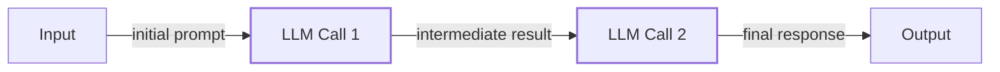

Image 1: A simple LLM workflow diagram illustrating prompt chaining.

On the other hand, **AI agents** are systems where an LLM dynamically decides the sequence of steps and actions to achieve a goal. The path is not predefined; the agent plans and adapts based on the task and its environment. This is like a skilled expert tackling an unfamiliar problem, adapting their approach with each new piece of information. This autonomy is powered by giving the agent access to actions it can take and a memory to store information. We will cover these concepts in detail when we discuss ReAct agents in future lessons.

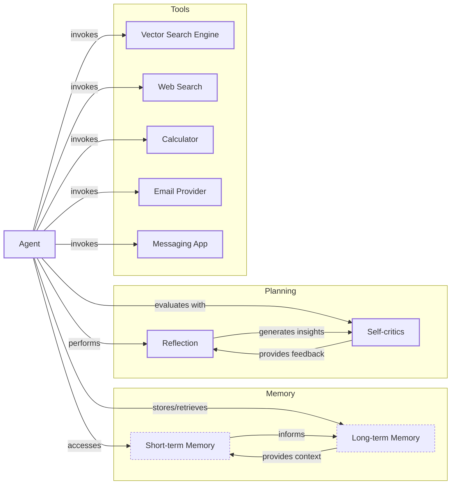

Image 2: A simple agentic system diagram illustrating an Agent interacting with Memory, Planning, and various Tools. (Source [Decoding ML](https://decodingml.substack.com/p/llmops-for-production-agentic-rag))

Both systems require an orchestration layer. In workflows, this layer executes a plan you defined. In agents, it facilitates the LLM's own dynamic planning and execution.

## Choosing Your Path

The core difference between these two approaches is control: developer-defined logic versus LLM-driven autonomy. This creates a spectrum of possibilities, with a direct trade-off between application reliability and the agent's level of control. As you give the agent more freedom, the system becomes more flexible but less predictable [[15]](https://decodingml.substack.com/p/stop-building-ai-agents).

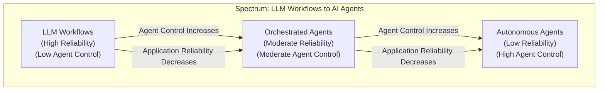

Image 3: A diagram illustrating the spectrum between LLM workflows and AI agents, showing the inverse relationship between agent control and application reliability. (Source [Decoding ML](https://decodingml.substack.com/p/stop-building-ai-agents))

**LLM workflows** are best for structured, repeatable tasks where predictability is key. This includes data extraction pipelines, automated report generation, and content repurposing. Workflows are reliable, easier to debug, and more cost-predictable, making them ideal for enterprise environments, regulated fields like finance and healthcare, and initial product versions (MVPs) [[1]](https://towardsdatascience.com/a-developers-guide-to-building-scalable-ai-workflows-vs-agents/). Their main weakness is rigidity; they cannot easily handle unexpected scenarios, and adding new features can be complex.

**AI agents** excel at open-ended, dynamic problems that require adaptation, such as complex research, code debugging, or interactive customer support. Their strength is flexibility. However, this comes at a cost. Agents are less reliable, harder to debug, and can have unpredictable costs and latency. They also introduce security risks, as an autonomous agent with write permissions could delete files or send inappropriate emails if not properly constrained [[1]](https://towardsdatascience.com/a-developers-guide-to-building-scalable-ai-workflows-vs-agents/).

In reality, most production systems are hybrids. They exist on a spectrum, blending the stability of workflows with the flexibility of agents. Andrej Karpathy introduced the concept of an "autonomy slider," where you decide how much control to give the LLM versus the user [[1]](https://singjupost.com/andrej-karpathy-software-is-changing-again/). For example, a coding assistant like Cursor offers different levels of autonomy, from simple tab-completion (workflow) to letting the agent modify the entire repository (agentic) [[14]](https://singjupost.com/andrej-karpathy-software-is-changing-again/). Similarly, Perplexity offers quick searches (workflow) and "deep research" (agentic) [[10]](https://medium.com/@ben_pouladian/software-3-0-software-in-the-age-of-ai-b25533da93b6). The goal is to create a fast generation-verification loop, where the AI generates output and a human quickly verifies it [[1]](https://singjupost.com/andrej-karpathy-software-is-changing-again/).

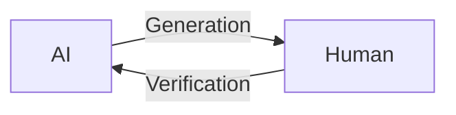

Image 4: A circular diagram illustrating the AI generation and human verification loop. (Source [Andrej Karpathy](https://singjupost.com/andrej-karpathy-software-is-changing-again/))

## Exploring Common Patterns

To build intuition, let's look at some common patterns for both workflows and agents. We will cover these in-depth in future lessons.

### LLM Workflow Patterns

**Chaining and routing** are foundational patterns for automating sequences of LLM calls. A chain links multiple calls together, where the output of one step becomes the input for the next. A router adds conditional logic, guiding the workflow down different paths based on the input or intermediate results. This allows you to build more complex, multi-step processes [[21]](https://mlpills.substack.com/p/issue-110-llm-workflow-patterns).

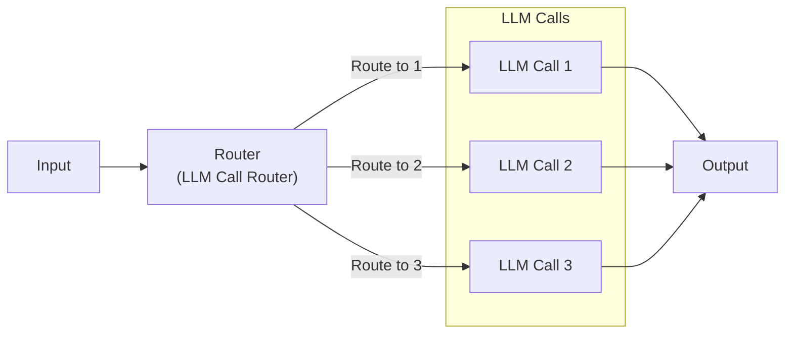

Image 5: A Mermaid diagram illustrating the "Chaining and Routing" LLM workflow pattern, showing an input leading to a router that conditionally directs to multiple LLM calls before converging to a final output. (Source [ML Pills](https://mlpills.substack.com/p/issue-110-llm-workflow-patterns))

The **orchestrator-worker** pattern introduces a hierarchy. A central "orchestrator" LLM analyzes a task, breaks it into sub-tasks, and delegates them to specialized "worker" agents. A final "synthesizer" then combines the results. This pattern provides a smooth transition to agentic systems by allowing the AI to dynamically decide which actions to take [[26]](https://mlpills.substack.com/p/diy-17-orchestrator-worker-llm-agent).

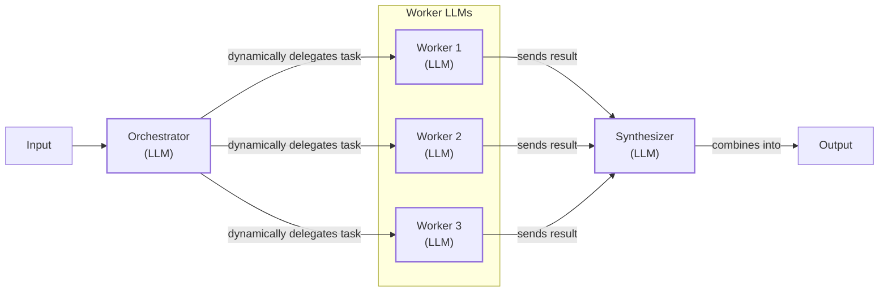

Image 6: A Mermaid diagram illustrating the Orchestrator-Worker pattern with an Orchestrator LLM delegating tasks to multiple Worker LLMs, which then send results to a Synthesizer LLM for final output. (Source [ML Pills](https://mlpills.substack.com/p/diy-17-orchestrator-worker-llm-agent))

The **evaluator-optimizer loop** is used to improve output quality through automated feedback. One LLM generates a response, and another "evaluator" LLM critiques it based on predefined criteria. This feedback, or reflection, is sent back to the generator, which refines its output. The loop continues until the result meets the required standard, mimicking how a human writer might revise a document based on an editor's comments [[33]](https://platform.claude.com/cookbook/patterns-agents-evaluator-optimizer).

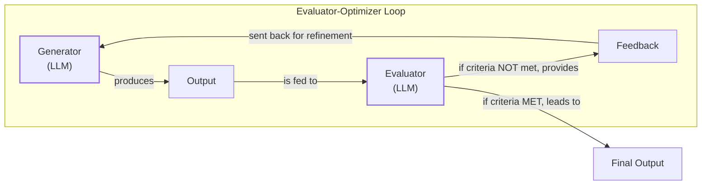

Image 7: Mermaid diagram illustrating the "Evaluator-Optimizer" loop. (Source [Claude Cookbook](https://platform.claude.com/cookbook/patterns-agents-evaluator-optimizer))

### Core Components of a ReAct AI Agent

The **ReAct (Reason and Act)** pattern is the foundation for most modern agents. It enables an agent to reason about a task, decide on an action, execute it using a tool, observe the outcome, and repeat the cycle until the task is complete. This loop is powered by several core components: an LLM for reasoning, a set of tools for taking actions, and both short-term (working) and long-term memory. We will explore the ReAct pattern in detail in future lessons [[5]](https://developers.google.com/gemini-code-assist/docs/gemini-cli).

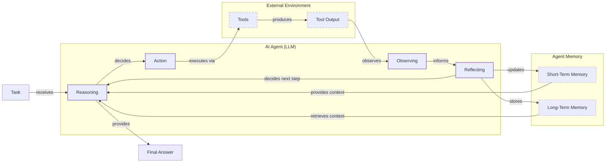

Image 8: Mermaid diagram illustrating the ReAct pattern for an AI agent, showing the flow from task to final answer through reasoning, action, observation, reflection, and memory interaction. (Source [Google Cloud](https://cloud.google.com/discover/what-are-ai-agents))

## Zooming In on Our Favorite Examples

To anchor these concepts, let's look at a few real-world examples, from a simple workflow to a complex hybrid system.

### Document Summarization in Google Workspace

A common time-waster at work is sifting through large documents to find the right information. An embedded summarization feature can guide your search and save valuable time. This is a pure, multi-step workflow. It follows a fixed chain of LLM calls: read the document, create a summary, extract key points, and display the results to the user. It is predictable, reliable, and efficient for this well-defined task [[3]](https://cloud.google.com/blog/products/ai-machine-learning/long-document-summarization-with-workflows-and-gemini-models).

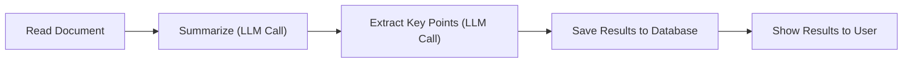

Image 9: A Mermaid diagram illustrating a simple LLM workflow for document summarization and analysis in Google Workspace.

### Gemini CLI Coding Assistant

Writing code is a slow process of reading documentation, understanding new codebases, and learning new languages. A coding assistant can dramatically speed this up. The open-source Gemini CLI is a single-agent system built on the ReAct pattern to help with tasks like writing code from scratch, assisting with specific functions, and generating documentation [[5]](https://developers.google.com/gemini-code-assist/docs/gemini-cli).

Its operational loop is a great example of an agent in action. It gathers context from the directory structure, uses the Gemini model to reason about the user's request, validates its plan with the user, and then executes actions like reading files or generating code. It evaluates the output by running the code and decides whether to repeat the process or conclude the task [[40]](https://wietsevenema.eu/blog/2025/how-gemini-cli-builds-context/).

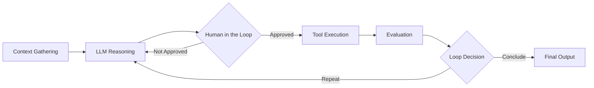

Image 10: Mermaid diagram illustrating the operational loop of the Gemini CLI coding assistant, based on the ReAct pattern.

### Perplexity Deep Research

Researching a new topic can be daunting. You often do not know where to start. A research assistant that scans the internet and synthesizes a report can be a huge productivity boost. Perplexity's Deep Research feature is a powerful hybrid system that combines structured workflows with autonomous agents to conduct expert-level research [[8]](https://www.perplexity.ai/hub/blog/introducing-perplexity-deep-research).

It uses an orchestrator-worker pattern to manage multiple specialized agents in parallel. The orchestrator decomposes the main research question into sub-questions and assigns them to search agents. These agents gather information, which the orchestrator then analyzes to identify knowledge gaps. It generates follow-up queries and repeats the process until the research is complete, finally synthesizing a comprehensive report with citations. This hybrid approach balances structured planning with dynamic adaptation, allowing it to tackle complex, open-ended tasks [[9]](https://www.digitalapplied.com/blog/perplexity-agent-api-platform-ai-search-developer-guide).

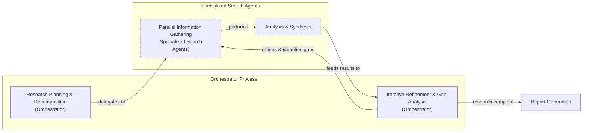

Image 11: Mermaid diagram illustrating Perplexity's Deep Research agent's iterative multi-step process.

## The Challenges of Every AI Engineer

Now that you understand the spectrum from LLM workflows to AI agents, it is important to recognize that every AI engineer faces these same fundamental challenges when designing a new AI application. This architectural choice is one of the core decisions that determine whether your product succeeds in production or fails spectacularly.

You will constantly battle reliability issues, as agents that work in demos can become unpredictable with real users. You will face context limits, where systems lose coherence over long conversations. You will need to build data integration pipelines to pull information from various sources while ensuring data quality. You will also have to manage the cost-performance trap, where sophisticated agents deliver great results but are too expensive to run at scale. Finally, you will need to address security concerns, as autonomous agents with write permissions can pose significant risks [[15]](https://arxiv.org/html/2510.25423v2).

These challenges are solvable. In upcoming lessons, we will cover patterns for building reliable products, including structured outputs, memory management, and robust evaluation pipelines. By the end of this course, you will have the knowledge to architect AI systems that are not only powerful but also robust, efficient, and safe. You will know when to use a workflow, when to deploy an agent, and how to build effective hybrid systems that work in the real world.

## References

- [1] Karpathy, A. (2025, June 18). *Software Is Changing (Again)* [Video]. YouTube. https://www.youtube.com/watch?v=LCEmiRjPEtQ
- [2] Anthropic. (2024, December 19). *Building effective agents*. https://www.anthropic.com/engineering/building-effective-agents
- [3] Laforge, G., & Spruyt, R. (2024, April 30). *Long document summarization with Workflows and Gemini models*. Google Cloud Blog. https://cloud.google.com/blog/products/ai-machine-learning/long-document-summarization-with-workflows-and-gemini-models
- [4] Google Cloud. (2026, April 2). *What is an AI agent?* https://cloud.google.com/discover/what-are-ai-agents
- [5] Google for Developers. (n.d.). *Gemini CLI*. Gemini Code Assist. https://developers.google.com/gemini-code-assist/docs/gemini-cli
- [6] Bouchard, L-F. (2025, August 22). *Real Agents vs. Workflows: The Truth Behind AI 'Agents'* [Video]. YouTube. https://www.youtube.com/watch?v=kQxr-uOxw2o&t=1s
- [7] Iusztin, P. (2025, August 19). *Exploring the difference between agents and workflows*. Decoding ML. https://decodingml.substack.com/p/llmops-for-production-agentic-rag
- [8] Perplexity Team. (2025, February 14). *Introducing Perplexity Deep Research*. Perplexity Blog. https://www.perplexity.ai/hub/blog/introducing-perplexity-deep-research
- [9] DigitalApplied. (n.d.). *Perplexity Agent API Platform: An AI Search Developer's Guide*. https://www.digitalapplied.com/blog/perplexity-agent-api-platform-ai-search-developer-guide
- [10] Pouladian, B. (2025, June 20). *Andrej Karpathy on Software 3.0: Software in the Age of AI*. Medium. https://medium.com/@ben_pouladian/software-3-0-software-in-the-age-of-ai-b25533da93b6
- [11] Ships, A. (2025, June 21). *Autonomy Sliders*. Substack. https://andrewships.substack.com/p/autonomy-sliders
- [12] Karpathy, A. (2025, June 20). *Software is Changing (Again)*. Latent Space. https://www.latent.space/p/s3
- [13] Karpathy, A. (2025, June 20). *Andrej Karpathy: Software Is Changing (Again)*. The Singju Post. https://singjupost.com/andrej-karpathy-software-is-changing-again/
- [14] Singju Post. (2025, June 20). *Andrej Karpathy: Software Is Changing (Again)*. https://singjupost.com/andrej-karpathy-software-is-changing-again/
- [15] Asgari, A., Panichella, A., Derakhshanfar, P., & Olsthoorn, M. (2025). *What Challenges Do Developers Face in AI Agent Systems? An Empirical Study on Stack Overflow & GitHub Issues*. arXiv. https://arxiv.org/html/2510.25423v2
- [16] Permiso. (n.d.). *8 Critical AI Security Challenges & How to Protect Your Organization*. https://permiso.io/blog/8-critical-ai-security-challenges
- [17] Roy, A. (2024, November 27). *Key Challenges in AI Agent Development and How to Solve Them*. Medium. https://medium.com/@ananya_95177/key-challenges-in-ai-agent-development-and-how-to-solve-them-460fceb0a6d5
- [18] Unit 42. (2024, May 29). *Agentic AI: The Double-Edged Sword of AI Agents*. Palo Alto Networks. https://unit42.paloaltonetworks.com/agentic-ai-threats/
- [19] CyberArk. (2024, June 11). *The Agentic AI Revolution: 5 Unexpected Security Challenges*. https://www.cyberark.com/resources/blog/the-agentic-ai-revolution-5-unexpected-security-challenges
- [20] Mirascope. (n.d.). *LLM Chaining: A Developer's Guide*. https://mirascope.com/blog/llm-chaining
- [21] Andrès, D. (2024, September 2). *Issue #110 - LLM Workflow Patterns*. ML Pills. https://mlpills.substack.com/p/issue-110-llm-workflow-patterns
- [22] Orq.ai. (n.d.). *Prompt Structure and Chaining: A Guide to Advanced LLM Prompting*. https://orq.ai/blog/prompt-structure-chaining
- [23] GeeksforGeeks. (n.d.). *LLM Chains*. https://www.geeksforgeeks.org/artificial-intelligence/llm-chains/
- [24] Prompting Guide. (n.d.). *Prompt Chaining*. https://www.promptingguide.ai/techniques/prompt_chaining
- [25] Stevens Institute of Technology. (n.d.). *Building Self-Healing AI: The Orchestrator-Workers and Reflexion Patterns*. https://online.stevens.edu/blog/building-self-healing-ai-orchestrator-reflexion-patterns/
- [26] Andrès, D. (2024, September 16). *DIY #17: Orchestrator-Worker LLM Agent with LangChain*. ML Pills. https://mlpills.substack.com/p/diy-17-orchestrator-worker-llm-agent
- [27] Anthropic. (n.d.). *Orchestrator-Workers*. Claude Cookbook. https://platform.claude.com/cookbook/patterns-agents-orchestrator-workers
- [28] Anthropic. (n.d.). *Orchestrator workers*. Claude Cookbook. https://platform.claude.com/cookbook/patterns-agents-orchestrator-workers
- [29] Gurusup. (n.d.). *Agent Orchestration Patterns*. https://gurusup.com/blog/agent-orchestration-patterns
- [30] AWS Prescriptive Guidance. (n.d.). *Evaluator, reflect, and refine loop patterns*. https://docs.aws.amazon.com/prescriptive-guidance/latest/agentic-ai-patterns/evaluator-reflect-refine-loop-patterns.html
- [31] Roach, C. (2024, September 18). *Building Self-Correcting LLM Systems: The Evaluator-Optimizer Pattern*. DEV Community. https://dev.to/clayroach/building-self-correcting-llm-systems-the-evaluator-optimizer-pattern-169p
- [32] Kouznetsov, V. (2024, September 23). *The Research on LLM Self-Correction*. https://vadim.blog/the-research-on-llm-self-correction
- [33] Anthropic. (n.d.). *Evaluator optimizer*. Claude Cookbook. https://platform.claude.com/cookbook/patterns-agents-evaluator-optimizer
- [34] G., S. (2024, September 30). *Evaluator-Optimizer LLM Workflow*. Substack. https://sebgnotes.substack.com/p/evaluator-optimizer-llm-workflow
- [35] Google Support. (n.d.). *Summarize a document*. https://support.google.com/docs/answer/15627020?hl=en
- [36] Google Workspace Knowledge Center. (n.d.). *Get started with Gemini in Google Workspace*. https://knowledge.workspace.google.com/admin/gemini/google-workspace-with-gemini
- [37] Mullen, T., & Salva, R. J. (2025, June 25). *Gemini CLI: your open-source AI agent*. The Keyword. https://blog.google/technology/developers/introducing-gemini-cli-open-source-ai-agent/
- [38] Google. (n.d.). *Gemini CLI*. GitHub. https://github.com/google-gemini/gemini-cli/blob/main/README.md
- [39] Enema, W. (2025). *How Gemini CLI builds context*. https://wietsevenema.eu/blog/2025/how-gemini-cli-builds-context/
- [40] Enema, W. (2025). *How Gemini CLI builds context*. https://wietsevenema.eu/blog/2025/how-gemini-cli-builds-context/
- [41] Milvus. (n.d.). *How do I provide context files to Gemini CLI?* https://milvus.io/ai-quick-reference/how-do-i-provide-context-files-to-gemini-cli
- [42] Gemini CLI. (n.d.). *GEMINI.md*. https://geminicli.com/docs/cli/gemini-md/
- [43] Google Cloud. (2025, June 25). *Gemini CLI Tutorial Series Part 9: Understanding Context, Memory, and Conversational Branching*. Medium. https://medium.com/google-cloud/gemini-cli-tutorial-series-part-9-understanding-context-memory-and-conversational-branching-095feb3e5a43
- [44] AI Positive. (2025, July 1). *A Look at Context Engineering in Gemini CLI*. Substack. https://aipositive.substack.com/p/a-look-at-context-engineering-in
- [45] Tracer. (2025, July 15). *The Third Wave of Data Engineering*. LinkedIn. https://www.linkedin.com/posts/tracercloud_the-third-wave-of-data-engineering-activity-7417891798364168192-ZQJz
- [46] Lumenova. (n.d.). *Top 5 Machine Learning Monitoring Tools for AI Reliability*. https://www.lumenova.ai/blog/machine-learning-monitoring-tools-ai-reliability/
- [47] Quach, H. (2025, June 27). *A Developer’s Guide to Building Scalable AI: Workflows vs Agents*. Towards Data Science. https://towardsdatascience.com/a-developers-guide-to-building-scalable-ai-workflows-vs-agents/
- [48] OpenAI. (2025, July 17). *Introducing ChatGPT agent: bridging research and action*. https://openai.com/index/introducing-chatgpt-agent/