# The Critical Decision: AI Agents vs. LLM Workflows

As an AI engineer preparing to build your first real AI application, after narrowing down the problem, you face a key architectural decision. Should your solution follow a predictable, step-by-step workflow, or does it demand a more autonomous approach where the LLM makes self-directed decisions? This is one of the fundamental questions that will determine the success or failure of your project.

Choose the wrong path, and you might build a rigid system that breaks under unexpected user behavior, or an unpredictable agent that fails catastrophically when it matters most. In 2025, billion-dollar AI startups are succeeding or failing based on this decision. The most effective teams know when to use structured workflows, when to deploy autonomous agents, and how to combine both.

This lesson will provide you with a framework to confidently choose between these two paths. We will explore the trade-offs, examine real-world examples from leading AI companies, and show you how to design systems that leverage the best of both worlds.

## Understanding the Spectrum: From Workflows to Agents

To choose the right path, you must understand the two core methodologies. They exist on a spectrum, and most production systems are hybrids.

An **LLM workflow** is a sequence of tasks orchestrated by developer-written code. Each step, whether an LLM call or a database query, is predefined. Think of it as a factory assembly line: the process is controlled, the path is deterministic, and the outcome is predictable. In future lessons, we will explore common workflow patterns like chaining, routing, and the orchestrator-worker model in more detail.

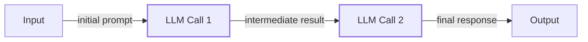

Image 1: A simple LLM workflow diagram illustrating prompt chaining.

On the other end of the spectrum are **AI agents**. These are systems where an LLM dynamically plans the sequence of steps, reasons about the task, and decides which actions to take to achieve a goal [[4]](https://cloud.google.com/discover/what-are-ai-agents). An agent is like a skilled expert tackling an unfamiliar problem, adapting its approach as it learns. This autonomy is powered by core components like memory and tools, which we will cover in depth when we discuss patterns like ReAct.

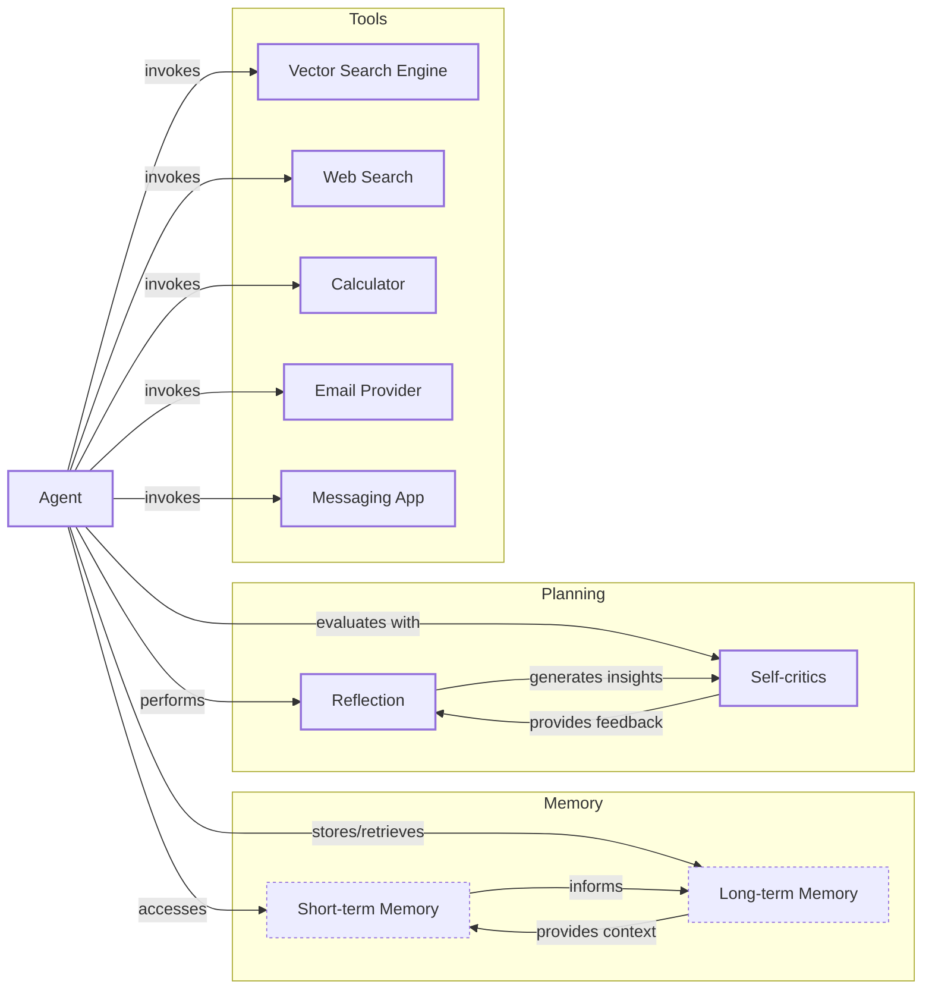

Image 2: A simple agentic system diagram illustrating an Agent interacting with Memory, Planning, and various Tools.

Both require an orchestration layer, but its role differs. In workflows, the orchestrator executes a defined plan; in agents, it facilitates the LLM's dynamic planning and execution. A practical test helps differentiate them: if you can draw a flowchart of the task before the LLM runs, use a workflow. If the flowchart depends on what the LLM discovers at runtime, you likely need an agent [[49]](https://redis.io/blog/agents-vs-workflows/).

## Choosing Your Path

The core difference between workflows and agents lies in who is in control: the developer or the LLM. Workflows prioritize reliability and predictability, while agents offer flexibility and autonomy. As you increase an agent's level of control, the application's reliability often decreases. This trade-off is central to AI system design [[15]](https://decodingml.substack.com/p/stop-building-ai-agents).

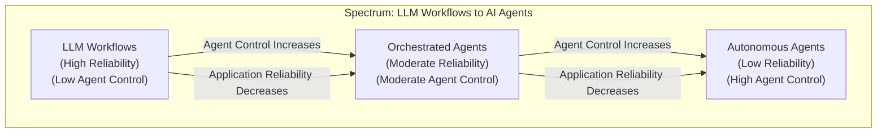

Image 3: A diagram illustrating the spectrum between LLM workflows and AI agents, showing the inverse relationship between agent control and application reliability.

Use an **LLM workflow** for well-defined, repeatable tasks like data extraction or report generation. They are predictable, easier to debug, and cost-effective, which is critical in regulated fields like finance and healthcare. This predictability is vital for compliance (e.g., SOC 2) and for keeping costs fixed [[49]](https://redis.io/blog/agents-vs-workflows/). Their main drawback is rigidity; they are time-consuming to build and modify.

Use an **AI agent** for open-ended tasks like complex research or dynamic code debugging. Agents are flexible and adaptive but can be unreliable, expensive, and hard to debug. This unpredictability makes them unsuitable for high-stakes decisions where errors are unacceptable. In enterprise settings, this is often managed through "bounded autonomy," where agents operate within strict permissions and escalate to a human when needed [[50]](https://medium.com/@siva.kolla.hemanth/llms-as-autonomous-agents-in-enterprise-workflows-94abd9df5195).

Most real-world systems are hybrids. Andrej Karpathy's "autonomy slider" captures this trade-off between AI control and human oversight [[14]](https://singjupost.com/andrej-karpathy-software-is-changing-again/). For example, Cursor's coding assistant ranges from simple completion to modifying an entire repository. Perplexity offers similar control with its "search," "research," and "deep research" modes [[10]](https://medium.com/@ben_pouladian/autonomy-sliders-coined-by-andrej-karpathy-on-software-3-0-software-in-the-age-of-ai-b25533da93b6).

The goal is to create a fast and efficient loop between AI generation and human verification. This is achieved through well-designed architectures and user interfaces that keep the human in control while benefiting from AI's speed.

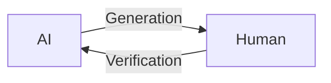

Image 4: A circular diagram illustrating the AI generation and human verification loop.

## Exploring Common Patterns

To build effective AI systems, you should understand common architectural patterns. These provide blueprints for both workflows and agents, which we will cover in-depth in future lessons.

For LLM workflows, three patterns are fundamental:

**Chaining and routing** is the simplest pattern. It connects multiple LLM calls in a sequence or uses a router to direct the workflow based on the input. This is useful for tasks that break down into a series of predictable steps [[21]](https://mlpills.substack.com/p/issue-110-llm-workflow-patterns).

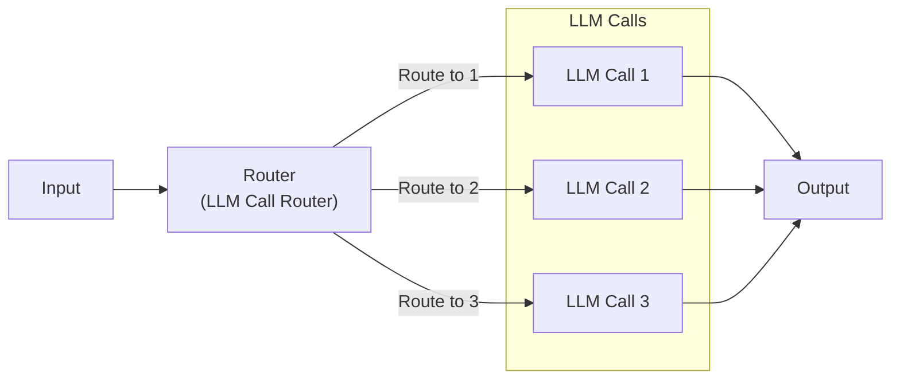

Image 5: A Mermaid diagram illustrating the "Chaining and Routing" LLM workflow pattern, showing an input leading to a router that conditionally directs to multiple LLM calls before converging to a final output.

The **orchestrator-worker** pattern uses a central orchestrator LLM to break down a complex task, delegate sub-tasks to specialized worker LLMs, and synthesize the results. This pattern is a bridge between workflows and agents, as the orchestrator dynamically plans the steps [[26]](https://mlpills.substack.com/p/diy-17-orchestrator-worker-llm-agent).

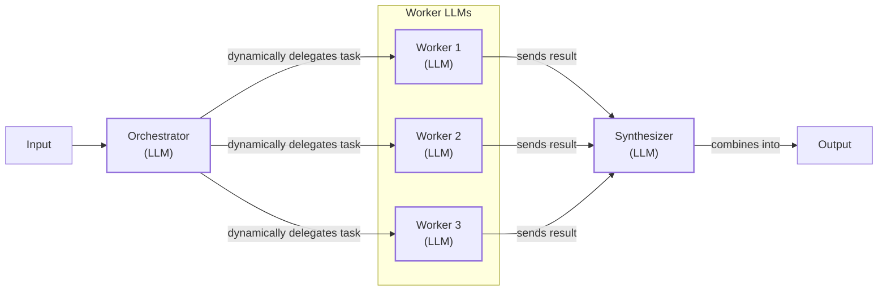

Image 6: A Mermaid diagram illustrating the Orchestrator-Worker pattern with an Orchestrator LLM delegating tasks to multiple Worker LLMs, which then send results to a Synthesizer LLM for final output.

The **evaluator-optimizer loop** improves output via automated feedback. A generator LLM creates a response, an evaluator LLM critiques it, and the generator refines the output. This repeats until the result is satisfactory, much like a human writer revising a draft [[33]](https://platform.claude.com/cookbook/patterns-agents-evaluator-optimizer).

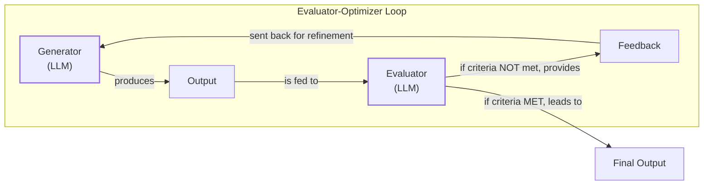

Image 7: Mermaid diagram illustrating the "Evaluator-Optimizer" loop.

For AI agents, the dominant pattern is **ReAct (Reason and Act)**. This framework enables an agent to reason about a task, decide on an action (like using a tool), observe the outcome, and repeat the cycle until the goal is complete. It combines the LLM's reasoning capabilities with the ability to interact with an external environment through tools and memory. Nearly all modern agents are built on this powerful pattern. This pattern draws from the classic "agentic loop" in reinforcement learning and the principle of a "rational agent" that acts to achieve the best outcome [[51]](https://www.ibm.com/think/topics/evolution-of-ai-agents), [[52]](https://arxiv.org/html/2503.12687v1).

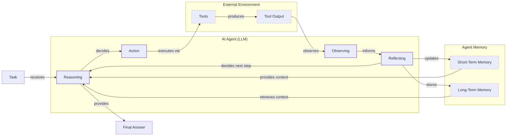

Image 8: Mermaid diagram illustrating the ReAct pattern for an AI agent, showing the flow from task to final answer through reasoning, action, observation, reflection, and memory interaction.

## Zooming In on Our Favorite Examples

Let's examine three concrete examples spanning the spectrum.

### Document Summarization in Google Workspace

**Problem:** Finding information in large documents is slow. An embedded summary saves time.

**Solution:** Gemini in Google Workspace uses a simple, predefined workflow: it reads a document, uses an LLM to summarize it and extract key points, then displays the result. It is reliable and solves a clear, bounded problem [[3]](https://cloud.google.com/blog/products/ai-machine-learning/long-document-summarization-with-workflows-and-gemini-models).

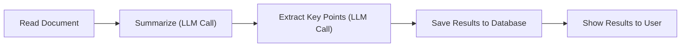

Image 9: A Mermaid diagram illustrating a simple LLM workflow for document summarization and analysis in Google Workspace.

### Gemini CLI Coding Assistant

**Problem:** Writing code, especially in unfamiliar codebases, is difficult.

**Solution:** The open-source Gemini CLI is a single-agent system using the ReAct pattern [[5]](https://developers.google.com/gemini-code-assist/docs/gemini-cli). It gathers context, reasons about the user's request, validates its plan, executes tools (e.g., file reads), evaluates the result, and loops until done. This flexibility lets it handle a wide range of coding tasks [[40]](https://wietsevenema.eu/blog/2025/how-gemini-cli-builds-context/).

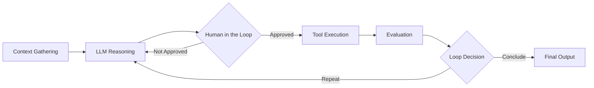

Image 10: Mermaid diagram illustrating the operational loop of the Gemini CLI coding assistant, based on the ReAct pattern.

### Perplexity Deep Research

**Problem:** Researching new, complex topics is hard.

**Solution:** Perplexity's Deep Research is a hybrid system using an orchestrator-worker pattern with multiple parallel agents [[8]](https://www.perplexity.ai/hub/blog/introducing-perplexity-deep-research). An orchestrator decomposes the question, delegates sub-questions to specialized search agents, and synthesizes the results. It iteratively refines the plan to fill knowledge gaps, combining workflow control with agentic reasoning. As an orchestrator, Perplexity is model-agnostic, tying together different models and tools—including access to paywalled premium sources—to tune its agentic loops [[53]](https://thenewstack.io/perplexity-agent-api/), [[54]](https://www.bvp.com/atlas/the-state-of-ai-2025). This approach is part of a broader industry trend, with multiple tech giants developing similar deep research tools to augment knowledge work [[55]](https://www.mckinsey.com/~/media/mckinsey/business%20functions/mckinsey%20digital/our%20insights/the%20top%20trends%20in%20tech%202025/mckinsey-technology-trends-outlook-2025.pdf).

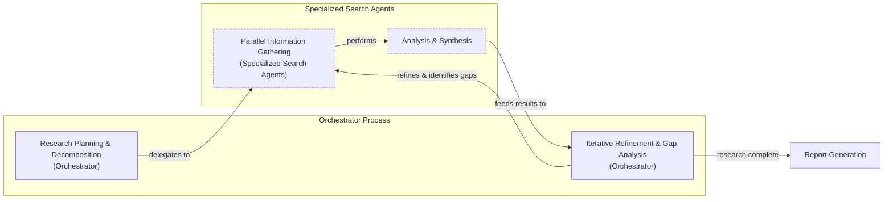

Image 11: Mermaid diagram illustrating Perplexity's Deep Research agent's iterative multi-step process.

## The Challenges of Every AI Engineer

Understanding this spectrum is key, as every AI Engineer faces these same challenges. This architectural choice often determines if a product succeeds or fails.

You will battle reliability issues, where a demo agent fails with real users. This is especially true in multi-step agents, where small reasoning errors can compound, leading to completely wrong outcomes [[56]](https://medium.com/my-musings-with-llms/understanding-ai-agents-from-theory-to-production-7dcf63cd51a8). You will also face context limits, cost traps, and security concerns. A study of developer forums confirms these are common engineering difficulties, especially with agent orchestration, retrieval, and reliability [[15]](https://arxiv.org/html/2510.25423v2).

These challenges are solvable. In upcoming lessons, we will cover structured outputs, and patterns for building reliable products through evaluation and monitoring. We will also explore strategies for designing hybrid systems and keeping costs under control. By the end of this course, you will have the knowledge to architect AI systems that are powerful, robust, and safe. You will know when to use a workflow, when to deploy an agent, and how to build effective systems that work in the real world.

## References

- [1] Anthropic. (2024). _Building effective agents_. https://www.anthropic.com/engineering/building-effective-agents
- [2] Yoon, J., Kim, S., & Lee, M. (2023). Revolutionizing healthcare: The role of artificial intelligence in clinical practice. _BMC Medical Education_, 23, Article 698. https://bmcmededuc.biomedcentral.com/articles/10.1186/s12909-023-04698-z
- [3] Laforge, G., & Spruyt, R. (2024, April 30). _Long document summarization with Workflows and Gemini models_. Google Cloud Blog. https://cloud.google.com/blog/products/ai-machine-learning/long-document-summarization-with-workflows-and-gemini-models
- [4] Google Cloud. (2026, April 2). _What is an AI agent?_ https://cloud.google.com/discover/what-are-ai-agents
- [5] Google for Developers. (n.d.). _Gemini CLI_. Retrieved from https://developers.google.com/gemini-code-assist/docs/gemini-cli
- [6] Iusztin, P. (n.d.). _Exploring the difference between agents and workflows_. Decoding ML. https://decodingml.substack.com/p/llmops-for-production-agentic-rag
- [7] Quach, H. (2025, June 27). _A Developer’s Guide to Building Scalable AI: Workflows vs Agents_. Towards Data Science. https://towardsdatascience.com/a-developers-guide-to-building-scalable-ai-workflows-vs-agents/
- [8] Perplexity Team. (2025, February 14). _Introducing Perplexity Deep Research_. Perplexity Blog. https://www.perplexity.ai/hub/blog/introducing-perplexity-deep-research
- [9] Bouchard, L. (n.d.). _Real Agents vs. Workflows: The Truth Behind AI 'Agents'_. [Video]. YouTube. https://www.youtube.com/watch?v=kQxr-uOxw2o&t=1s
- [10] Pouladian, B. (2025, June 20). _Andrej Karpathy on Software 3.0: Software in the Age of AI_. Medium. https://medium.com/@ben_pouladian/autonomy-sliders-coined-by-andrej-karpathy-on-software-3-0-software-in-the-age-of-ai-b25533da93b6
- [11] Ships, A. (n.d.). _Autonomy Sliders_. Substack. https://andrewships.substack.com/p/autonomy-sliders
- [12] Latent Space. (n.d.). _S3E22: Andrej Karpathy on LLM OSes, "Vibe Coding", and the "Programming in English" Meme_. https://www.latent.space/p/s3
- [13] Karpathy, A. (2025, June 18). _Software Is Changing (Again)_. [Video]. Y Combinator. https://www.youtube.com/watch?v=LCEmiRjPEtQ
- [14] Singju Post. (2025, June 20). _Andrej Karpathy: Software Is Changing (Again)_. https://singjupost.com/andrej-karpathy-software-is-changing-again/
- [15] Asgari, A., Panichella, A., Derakhshanfar, P., & Olsthoorn, M. (2025). _What Challenges Do Developers Face in AI Agent Systems? An Empirical Study on Stack Overflow & GitHub Issues_. arXiv. https://arxiv.org/html/2510.25423v2
- [16] Permiso. (n.d.). _8 Critical AI Security Challenges_. https://permiso.io/blog/8-critical-ai-security-challenges
- [17] Roy, A. (2024, May 29). _Key Challenges in AI Agent Development and How to Solve Them_. Medium. https://medium.com/@ananya_95177/key-challenges-in-ai-agent-development-and-how-to-solve-them-460fceb0a6d5
- [18] Unit 42. (n.d.). _Agentic AI Threats_. Palo Alto Networks. https://unit42.paloaltonetworks.com/agentic-ai-threats/
- [19] CyberArk. (n.d.). _The Agentic AI Revolution: 5 Unexpected Security Challenges_. https://www.cyberark.com/resources/blog/the-agentic-ai-revolution-5-unexpected-security-challenges
- [20] Mirascope. (n.d.). _LLM Chaining_. https://mirascope.com/blog/llm-chaining
- [21] Andr·s, D. (n.d.). _Issue #110 - LLM Workflow Patterns_. Substack. https://mlpills.substack.com/p/issue-110-llm-workflow-patterns
- [22] ORQ. (n.d.). _Prompt Structure & Chaining_. https://orq.ai/blog/prompt-structure-chaining
- [23] GeeksforGeeks. (n.d.). _LLM Chains_. https://www.geeksforgeeks.org/artificial-intelligence/llm-chains/
- [24] Prompting Guide. (n.d.). _Prompt Chaining_. https://www.promptingguide.ai/techniques/prompt_chaining
- [25] Stevens Institute of Technology. (n.d.). _Building Self-Healing AI: Orchestrator-Reflexion Patterns_. https://online.stevens.edu/blog/building-self-healing-ai-orchestrator-reflexion-patterns/
- [26] Andr·s, D. (n.d.). _DIY #17 - Orchestrator-Worker LLM Agent_. Substack. https://mlpills.substack.com/p/diy-17-orchestrator-worker-llm-agent
- [27] Anthropic. (n.d.). _Orchestrator-Workers_. Claude Cookbook. https://platform.claude.com/cookbook/patterns-agents-orchestrator-workers
- [28] Gurusup. (n.d.). _Agent Orchestration Patterns_. https://gurusup.com/blog/agent-orchestration-patterns
- [29] AWS Prescriptive Guidance. (n.d.). _Agentic AI Patterns: Evaluator-Reflect-Refine Loop Patterns_. https://docs.aws.amazon.com/prescriptive-guidance/latest/agentic-ai-patterns/evaluator-reflect-refine-loop-patterns.html
- [30] Roach, C. (n.d.). _Building Self-Correcting LLM Systems: The Evaluator-Optimizer Pattern_. DEV Community. https://dev.to/clayroach/building-self-correcting-llm-systems-the-evaluator-optimizer-pattern-169p
- [31] Tsvetkov, V. (n.d.). _The research on LLM self-correction_. Vadim's Blog. https://vadim.blog/the-research-on-llm-self-correction
- [32] Notes, S. (n.d.). _Evaluator-Optimizer LLM Workflow_. Substack. https://sebgnotes.substack.com/p/evaluator-optimizer-llm-workflow
- [33] Anthropic. (n.d.). _Evaluator-Optimizer_. Claude Cookbook. https://platform.claude.com/cookbook/patterns-agents-evaluator-optimizer
- [34] Mullen, T., & Salva, R. J. (2025, June 25). _Gemini CLI: your open-source AI agent_. The Keyword. https://blog.google/technology/developers/introducing-gemini-cli-open-source-ai-agent/
- [35] GitHub. (n.d.). _Gemini CLI_. Retrieved from https://github.com/google-gemini/gemini-cli/blob/main/README.md
- [36] OpenAI. (2025, July 17). _Introducing ChatGPT agent: bridging research and action_. https://openai.com/index/introducing-chatgpt-agent/
- [37] Wietsevenema, W. (2025). _How Gemini CLI builds context_. https://wietsevenema.eu/blog/2025/how-gemini-cli-builds-context/
- [38] Milvus. (n.d.). _How do I provide context files to Gemini CLI?_ https://milvus.io/ai-quick-reference/how-do-i-provide-context-files-to-gemini-cli
- [39] Gemini CLI Docs. (n.d.). _GEMINI.md_. https://geminicli.com/docs/cli/gemini-md/
- [40] Google Cloud. (2025, June 1). _Gemini CLI Tutorial Series Part 9: Understanding Context, Memory, and Conversational Branching_. Medium. https://medium.com/google-cloud/gemini-cli-tutorial-series-part-9-understanding-context-memory-and-conversational-branching-095feb3e5a43
- [41] AI Positive. (n.d.). _A look at context engineering in Gemini CLI_. Substack. https://aipositive.substack.com/p/a-look-at-context-engineering-in
- [42] TracerCloud. (2025, June 10). _The Third Wave of Data Engineering_. LinkedIn. https://www.linkedin.com/posts/tracercloud_the-third-wave-of-data-engineering-activity-7417891798364168192-ZQJz
- [43] Lumenova. (n.d.). _Machine Learning Monitoring Tools for AI Reliability_. https://www.lumenova.ai/blog/machine-learning-monitoring-tools-ai-reliability/
- [44] Google Support. (n.d.). _Create a summary of your document in Google Docs_. Retrieved from https://support.google.com/docs/answer/15627020?hl=en
- [45] Google Workspace Knowledge Center. (n.d.). _Google Workspace with Gemini_. https://knowledge.workspace.google.com/admin/gemini/google-workspace-with-gemini
- [46] Digital Applied. (n.d.). _Perplexity Agent API Platform: AI Search Developer Guide_. https://www.digitalapplied.com/blog/perplexity-agent-api-platform-ai-search-developer-guide
- [47] Liu, J. (2023, November 13). _Building Production-Ready RAG Applications_. [Video]. AI Engineer Summit. https://www.youtube.com/watch?v=TRjq7t2Ms5I
- [48] Renner, M., & Chaban, M. A. V. (2026, April 22). _1,302 real-world gen AI use cases from the world's leading organizations_. Google Cloud Blog. https://cloud.google.com/transform/101-real-world-generative-ai-use-cases-from-industry-leaders
- [49] Redis. (n.d.). _When workflows beat agents (& vice versa)_. https://redis.io/blog/agents-vs-workflows/
- [50] Kolla, S. H. (n.d.). _LLMs as autonomous agents in enterprise workflows_. Medium. https://medium.com/@siva.kolla.hemanth/llms-as-autonomous-agents-in-enterprise-workflows-94abd9df5195
- [51] IBM. (n.d.). _The evolution of AI agents_. https://www.ibm.com/think/topics/evolution-of-ai-agents
- [52] Arxiv. (2025). _Large Language Models based-Agents: A Survey_. https://arxiv.org/html/2503.12687v1
- [53] The New Stack. (2025). _Perplexity’s Agent API Aims to Be an Orchestrator for LLMs_. https://thenewstack.io/perplexity-agent-api/
- [54] Bessemer Venture Partners. (2025). _The State of AI 2025_. https://www.bvp.com/atlas/the-state-of-ai-2025
- [55] McKinsey. (2025). _McKinsey Technology Trends Outlook 2025_. https://www.mckinsey.com/~/media/mckinsey/business%20functions/mckinsey%20digital/our%20insights/the%20top%20trends%20in%20tech%202025/mckinsey-technology-trends-outlook-2025.pdf
- [56] Medium. (n.d.). _Understanding AI Agents — From Theory to Production_. https://medium.com/my-musings-with-llms/understanding-ai-agents-from-theory-to-production-7dcf63cd51a8