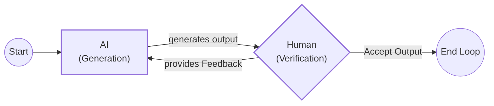
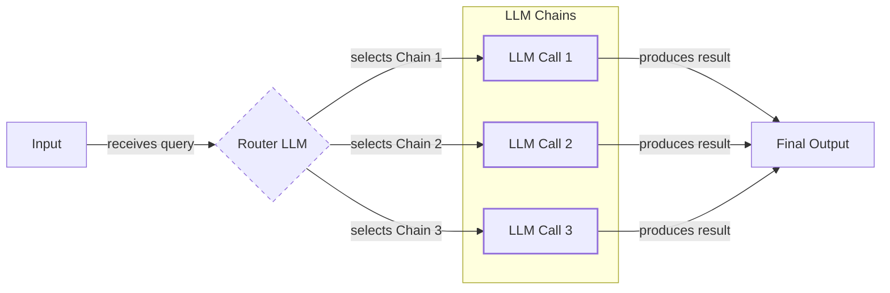
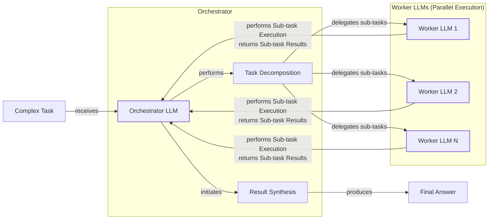
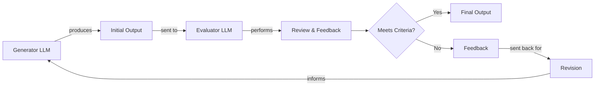
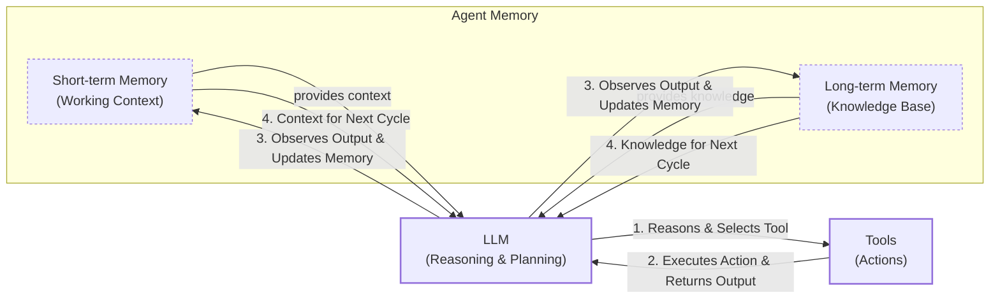
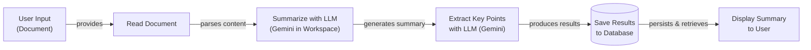
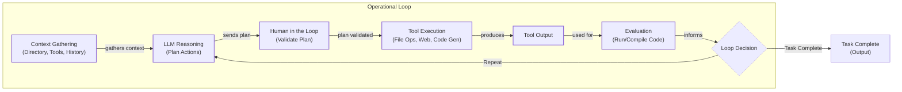
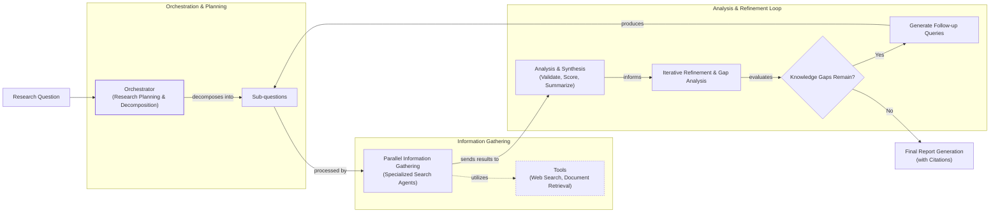

# Lesson 2: Workflows vs. Agents

As an AI engineer preparing to build your first real AI application, after narrowing down the problem you want to solve, one key decision is how to design your AI solution. Should it follow a predictable, step-by-step workflow, or does it demand a more autonomous approach where the LLM makes self-directed decisions? This fundamental question will determine the success or failure of your project.

Choose the wrong path, and you might build a system that is too rigid, breaking when users deviate from expected patterns. Or, you could create an unpredictable agent that works brilliantly 80% of the time but fails spectacularly when it matters most, wasting months of development time and frustrating users. In 2024 and 2025, we have seen billion-dollar AI startups succeed or fail based on this architectural decision.

This lesson will provide a framework to help you make this critical decision with confidence. We will explore the trade-offs between LLM workflows and AI agents, see real-world examples, and learn how to design robust systems that leverage the best of both worlds.

## Understanding the Spectrum: From Workflows to Agents

To choose between workflows and agents, it helps to think of AI autonomy not as a binary choice but as a spectrum [[2]](https://lumenalta.com/labs/from-llm-to-full-agency-understanding-the-levels-of-ai-autonomy).

### LLM Workflows

An LLM workflow is a sequence of tasks orchestrated by developer-written code. Think of it as a factory assembly line: each step is predefined, and the control flow is explicit [[1]](https://www.anthropic.com/engineering/building-effective-agents). This approach has roots in earlier rule-based AI systems, which were predictable but often struggled with nuance [[3]](https://fetch.ai/blog/evolution-ai-agents-from-rule-based-systems-to-llms-agents). Workflows use LLMs to overcome these limitations, but the developer remains in charge; the LLM acts as a component but does not decide what to do next.

Because the paths are fixed, they are easier to debug, test, and their costs are more predictable. We will explore common workflow patterns like chaining, routing, and the orchestrator-worker model in future lessons.

Image 1: A simple LLM workflow for document summarization and analysis using Gemini in Google Workspace.

### AI Agents

AI agents represent a higher level of autonomy, where the LLM dynamically directs its own processes. Instead of following a script, the agent uses its reasoning capabilities to create a plan, select actions (tools), and adapt its approach based on outcomes [[4]](https://cloud.google.com/discover/what-are-ai-agents). An agent is like a skilled expert tackling an unfamiliar problem.

This autonomy makes agents flexible, but it also introduces more unpredictability [[5]](https://www.zenml.io/blog/steerable-deep-research-building-production-ready-agentic-workflows-with-controlled-autonomy). The core pattern, often called ReAct, involves a continuous loop of reasoning and acting, supported by memory. We will dive deep into tools, memory, and agent architectures in upcoming lessons.

Image 2: The core components of an AI agent, including an LLM for reasoning, tools for actions, and memory for context.

Both workflows and agents require an orchestration layer. In a workflow, this layer executes your predefined plan. In an agent, it facilitates the LLM's dynamic planning and execution loop.

## Choosing Your Path

The core difference between workflows and agents lies in a trade-off between control and autonomy. Workflows offer developer-defined logic, while agents provide LLM-driven autonomy. Most real-world systems exist on a spectrum between these two extremes.

Image 3: The autonomy slider, showing the trade-off between an agent's level of control and application reliability. (Source [decodingml.substack.com](https://decodingml.substack.com/p/stop-building-ai-agents))

**LLM workflows** are best for repeatable tasks where predictability is critical. In regulated fields like finance and healthcare, workflows are preferred because their deterministic nature ensures compliance [[6]](https://towardsdatascience.com/a-developers-guide-to-building-scalable-ai-workflows-vs-agents/). For instance, healthcare systems use structured workflows to manage the entire patient care process, from scheduling to diagnosis [[7]](https://pmc.ncbi.nlm.nih.gov/articles/PMC12360800/). Their main strength is consistency; their weakness is rigidity.

**AI agents** excel at open-ended research and dynamic problem-solving. They are adaptable, but this comes at the cost of reliability. Agents can be unpredictable, harder to debug, and more expensive. It is a sobering reality that very few fully autonomous agents operate in production today; most business value still comes from more constrained, reliable systems [[2]](https://lumenalta.com/labs/from-llm-to-full-agency-understanding-the-levels-of-ai-autonomy). We have even heard stories of developers having their code accidentally deleted by an agent, joking, "Anyway, I wanted to start a new project."

In many modern AI applications, you have an "autonomy slider" that lets you decide how much control to give the LLM. As Andrej Karpathy noted, tools like the Cursor code editor allow you to move from simple tab-completion (low autonomy) to letting an agent modify your entire repository (high autonomy) [[8]](https://singjupost.com/andrej-karpathy-software-is-changing-again/). Similarly, Perplexity offers everything from a quick search to a "deep research" mode where the agent works for several minutes [[9]](https://www.perplexity.ai/hub/blog/introducing-perplexity-deep-research).

The goal is to speed up the iterative loop between AI generation and human verification. This is often achieved through a combination of smart architecture and a well-designed user interface that makes it easy for the human to stay in the loop.

Image 4: A flowchart illustrating the iterative loop between AI generation and human verification.

## Exploring Common Patterns

To build effective AI systems, it helps to understand a few common architectural patterns. These patterns provide a starting point for designing both workflows and agents. We will only introduce them at a high level here, saving the deep dives for future lessons.

### LLM Workflow Patterns

**Chaining and routing** is the simplest pattern for automation. It involves linking multiple LLM calls in a sequence (chaining) or using an LLM to decide which path to take next (routing). This is useful for tasks that can be broken down into a series of smaller, distinct steps [[10]](https://mlpills.substack.com/p/issue-110-llm-workflow-patterns).

Image 5: A flowchart illustrating the "Chaining and Routing" pattern for LLM workflows.

The **Orchestrator-Worker** pattern introduces a "manager" LLM that analyzes a task, breaks it into sub-tasks, and delegates them to specialized "worker" LLMs [[11]](https://platform.claude.com/cookbook/patterns-agents-orchestrator-workers). This is a step towards more dynamic behavior, bridging the gap between rigid workflows and fully autonomous agents.

Image 6: A flowchart illustrating the Orchestrator-Worker pattern with an Orchestrator LLM delegating tasks to multiple Worker LLMs and synthesizing results.

The **Evaluator-Optimizer loop** automates self-correction. One LLM generates a response, while another LLM evaluates it against a set of criteria. If the output falls short, the evaluator provides feedback (a reflection), and the generator refines its response. This loop repeats until the output is satisfactory, mimicking how a human writer revises a draft based on an editor's comments [[12]](https://docs.aws.amazon.com/prescriptive-guidance/latest/agentic-ai-patterns/evaluator-reflect-refine-loop-patterns.html).

Image 7: Flowchart illustrating the Evaluator-Optimizer Loop pattern.

### The ReAct AI Agent Pattern

The ReAct (Reason and Act) pattern is the foundation for most modern AI agents. It enables an agent to reason about a task, choose an appropriate action (tool), execute it, and then observe the outcome to inform its next step [[4]](https://cloud.google.com/discover/what-are-ai-agents). This cycle repeats until the task is complete. It relies on a few core components: an LLM for reasoning, a set of tools for taking actions, and both short-term (working) and long-term memory to maintain context. As systems grow to include multiple agents, **memory engineering** becomes a critical discipline to manage shared state and ensure consistent coordination [[13]](https://www.oreilly.com/radar/why-multi-agent-systems-need-memory-engineering/).

Image 8: Flowchart illustrating the ReAct pattern in an AI agent, showing the cyclical interaction between the LLM, tools, and memory components.

## Zooming In on Our Favorite Examples

To make these concepts more concrete, let's look at a few examples, from a simple workflow to a complex hybrid system.

### Gemini in Google Workspace: A Simple Workflow

Finding information in long documents is time-consuming. The summarization feature in Google Workspace is a perfect example of a pure workflow [[14]](https://support.google.com/docs/answer/15627020?hl=en). It follows a predefined sequence: read the document, call an LLM to summarize it and extract key points, and display the results. The process is reliable and predictable, with no dynamic decision-making.

Image 9: A flowchart illustrating a simple LLM workflow for document summarization and analysis using Gemini in Google Workspace.

### Gemini CLI: A Single-Agent System

Writing code is a slow process. A coding assistant can dramatically speed this up. The open-source Gemini CLI is a great example of a single-agent system using the ReAct pattern [[15]](https://developers.google.com/gemini-code-assist/docs/gemini-cli). It follows a loop: gathering context from your codebase, reasoning to form a plan, executing tools (like file operations or web search), evaluating the result, and repeating until the task is complete. While effective, the next frontier for such agents is whole-project contextual awareness, allowing them to debug complex issues by understanding the entire dependency chain, not just isolated files [[16]](https://dev.to/alvarito1983/how-claude-code-specialized-agents-changed-my-development-workflow-in-2026-3al5).

Image 10: A flowchart illustrating the operational loop of the Gemini CLI coding assistant.

### Perplexity Deep Research: A Hybrid System

Researching a new topic is daunting. Perplexity's Deep Research feature is a powerful hybrid system that combines workflows with multiple agents to conduct expert-level research [[9]](https://www.perplexity.ai/hub/blog/introducing-perplexity-deep-research), [[17]](https://zenvanriel.com/ai-engineer-blog/perplexity-computer-multi-model-agent-orchestration/). It uses an orchestrator to decompose a complex query into sub-questions, which are then assigned to specialized agents. This multi-agent design avoids the "decision overload" that a single agent would face, a lesson also learned in complex robotics systems [[18]](https://www.sciencedirect.com/science/article/abs/pii/S027861252500202X). These agents gather information in parallel—a key strategy to reduce latency compared to sequential searches [[19]](https://docs.perplexity.ai/docs/agent-api/presets)—before the orchestrator synthesizes the findings, identifies gaps, and iterates until a comprehensive report is generated.

Image 11: A flowchart illustrating Perplexity's Deep Research agent's iterative multi-step process.

## The Challenges of Every AI Engineer

Now that you understand the spectrum from workflows to agents, it is important to recognize that every AI Engineer faces these same fundamental challenges. The decision between a workflow and an agent is one of the core choices that determine whether your AI application succeeds in production.

You will battle reliability issues, where agents become unpredictable and require specialized debugging tools for multi-step tracing [[20]](https://arxiv.org/html/2510.25423v2), [[22]](https://www.braintrust.dev/articles/best-ai-agent-debugging-tools-2026). You will face context limits, cost-performance traps, and security concerns [[21]](https://unit42.paloaltonetworks.com/agentic-ai-threats/). In multi-agent systems, these security risks are amplified, with threats like contaminated context spreading between agents or an agent gaining unintended permissions [[23]](https://www.knostic.ai/blog/multi-agent-security).

These challenges are solvable. In upcoming lessons, we will cover patterns for building reliable products, creating hybrid systems, and keeping costs under control. You will learn about structured outputs, tools, memory, and evaluation pipelines. By the end of this course, you will have the knowledge to architect robust, efficient, and safe AI systems, knowing when to use a workflow, deploy an agent, or build a hybrid that works in the real world.

## References

- [1] Anthropic. (2024). _Building effective agents_. [https://www.anthropic.com/engineering/building-effective-agents](https://www.anthropic.com/engineering/building-effective-agents)
- [2] Crewe, D. (2025). _From LLM to full agency: Understanding the levels of AI autonomy_. Lumenalta. [https://lumenalta.com/labs/from-llm-to-full-agency-understanding-the-levels-of-ai-autonomy](https://lumenalta.com/labs/from-llm-to-full-agency-understanding-the-levels-of-ai-autonomy)
- [3] Fetch.ai. (2024). _The Evolution of AI Agents: From Rule-Based Systems to LLMs Agents_. [https://fetch.ai/blog/evolution-ai-agents-from-rule-based-systems-to-llms-agents](https://fetch.ai/blog/evolution-ai-agents-from-rule-based-systems-to-llms-agents)
- [4] Google. (2026). _What is an AI agent?_ [https://cloud.google.com/discover/what-are-ai-agents](https://cloud.google.com/discover/what-are-ai-agents)
- [5] ZenML. (2024). _Steerable Deep Research: Building Production-Ready Agentic Workflows with Controlled Autonomy_. [https://www.zenml.io/blog/steerable-deep-research-building-production-ready-agentic-workflows-with-controlled-autonomy](https://www.zenml.io/blog/steerable-deep-research-building-production-ready-agentic-workflows-with-controlled-autonomy)
- [6] Quach, H. (2025). _A Developer’s Guide to Building Scalable AI: Workflows vs Agents_. Towards Data Science. [https://towardsdatascience.com/a-developers-guide-to-building-scalable-ai-workflows-vs-agents/](https://towardsdatascience.com/a-developers-guide-to-building-scalable-ai-workflows-vs-agents/)
- [7] Al-Hasan, A., et al. (2025). _An AI-powered health care administrative workflow system_. PMC. [https://pmc.ncbi.nlm.nih.gov/articles/PMC12360800/](https://pmc.ncbi.nlm.nih.gov/articles/PMC12360800/)
- [8] Karpathy, A. (2025). _Software Is Changing (Again)_. The Singju Post. [https://singjupost.com/andrej-karpathy-software-is-changing-again/](https://singjupost.com/andrej-karpathy-software-is-changing-again/)
- [9] Perplexity Team. (2025). _Introducing Perplexity Deep Research_. Perplexity Blog. [https://www.perplexity.ai/hub/blog/introducing-perplexity-deep-research](https://www.perplexity.ai/hub/blog/introducing-perplexity-deep-research)
- [10] ML Pills. (2024). _Issue #110 - LLM Workflow Patterns_. [https://mlpills.substack.com/p/issue-110-llm-workflow-patterns](https://mlpills.substack.com/p/issue-110-llm-workflow-patterns)
- [11] Anthropic. (2024). _Orchestrator-Workers Workflow_. Claude Cookbook. [https://platform.claude.com/cookbook/patterns-agents-orchestrator-workers](https://platform.claude.com/cookbook/patterns-agents-orchestrator-workers)
- [12] AWS Prescriptive Guidance. (2024). _Evaluator-Reflect-Refine loop patterns_. [https://docs.aws.amazon.com/prescriptive-guidance/latest/agentic-ai-patterns/evaluator-reflect-refine-loop-patterns.html](https://docs.aws.amazon.com/prescriptive-guidance/latest/agentic-ai-patterns/evaluator-reflect-refine-loop-patterns.html)
- [13] O'Reilly. (2025). _Why Multi-Agent Systems Need Memory Engineering_. [https://www.oreilly.com/radar/why-multi-agent-systems-need-memory-engineering/](https://www.oreilly.com/radar/why-multi-agent-systems-need-memory-engineering/)
- [14] Google. (2024). _Get a summary of your document_. Google Docs Editors Help. [https://support.google.com/docs/answer/15627020?hl=en](https://support.google.com/docs/answer/15627020?hl=en)
- [15] Google. (2024). _Gemini CLI_. Google for Developers. [https://developers.google.com/gemini-code-assist/docs/gemini-cli](https://developers.google.com/gemini-code-assist/docs/gemini-cli)
- [16] Rodriguez, A. (2026). _How Claude Code specialized agents changed my development workflow in 2026_. DEV Community. [https://dev.to/alvarito1983/how-claude-code-specialized-agents-changed-my-development-workflow-in-2026-3al5](https://dev.to/alvarito1983/how-claude-code-specialized-agents-changed-my-development-workflow-in-2026-3al5)
- [17] van Riel, Z. (2024). _Perplexity Computer: Multi-Model Agent Orchestration for Deep Research_. [https://zenvanriel.com/ai-engineer-blog/perplexity-computer-multi-model-agent-orchestration/](https://zenvanriel.com/ai-engineer-blog/perplexity-computer-multi-model-agent-orchestration/)
- [18] Chen, Z., et al. (2025). _Embodied multi-agent system with vision-language model for digital twin-enabled human-robot collaborative assembly_. ScienceDirect. [https://www.sciencedirect.com/science/article/abs/pii/S027861252500202X](https://www.sciencedirect.com/science/article/abs/pii/S027861252500202X)
- [19] Perplexity. (2024). _Agent API Presets_. [https://docs.perplexity.ai/docs/agent-api/presets](https://docs.perplexity.ai/docs/agent-api/presets)
- [20] Penedo, A., et al. (2025). _AI Agent Development: An Evidence-based Technical Analysis of Challenges, Patterns, and Lessons Learned_. arXiv. [https://arxiv.org/html/2510.25423v2](https://arxiv.org/html/2510.25423v2)
- [21] Unit 42. (2025). _AI Agents Are Here. So Are the Threats._ Palo Alto Networks. [https://unit42.paloaltonetworks.com/agentic-ai-threats/](https://unit42.paloaltonetworks.com/agentic-ai-threats/)
- [22] Braintrust. (2026). _The Best AI Agent Debugging Tools in 2026_. [https://www.braintrust.dev/articles/best-ai-agent-debugging-tools-2026](https://www.braintrust.dev/articles/best-ai-agent-debugging-tools-2026)
- [23] Knostic. (2025). _Securing Multi-Agent AI Systems_. [https://www.knostic.ai/blog/multi-agent-security](https://www.knostic.ai/blog/multi-agent-security)